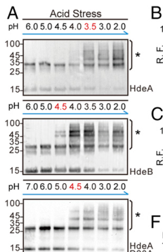

## Question

# Gene Research for Functional Annotation

## ⚠️ CRITICAL: Gene/Protein Identification Context

**BEFORE YOU BEGIN RESEARCH:** You MUST verify you are researching the CORRECT gene/protein. Gene symbols can be ambiguous, especially for less well-characterized genes from non-model organisms.

### Target Gene/Protein Identity (from UniProt):
- **UniProt Accession:** P0AES9
- **Protein Description:** RecName: Full=Acid stress chaperone HdeA {ECO:0000255|HAMAP-Rule:MF_00946}; AltName: Full=10K-S protein; Flags: Precursor;
- **Gene Information:** Name=hdeA {ECO:0000255|HAMAP-Rule:MF_00946}; Synonyms=yhhC, yhiB; OrderedLocusNames=b3510, JW3478;
- **Organism (full):** Escherichia coli (strain K12).
- **Protein Family:** Belongs to the HdeA family. {ECO:0000255|HAMAP-
- **Key Domains:** HdeA. (IPR024972); HdeA/HdeB_sf. (IPR038303); HdeA_sf. (IPR036831); HNS-dep_expression_A/B. (IPR010486); HdeA (PF06411)

### MANDATORY VERIFICATION STEPS:

1. **Check if the gene symbol "hdeA" matches the protein description above**
2. **Verify the organism is correct:** Escherichia coli (strain K12).
3. **Check if protein family/domains align with what you find in literature**
4. **If you find literature for a DIFFERENT gene with the same or similar symbol, STOP**

### If Gene Symbol is Ambiguous or You Cannot Find Relevant Literature:

**DO NOT PROCEED WITH RESEARCH ON A DIFFERENT GENE.** Instead:
- State clearly: "The gene symbol 'hdeA' is ambiguous or literature is limited for this specific protein"
- Explain what you found (e.g., "Found extensive literature on a different gene with the same symbol in a different organism")
- Describe the protein based ONLY on the UniProt information provided above
- Suggest that the protein function can be inferred from domain/family information

### Research Target:

Please provide a comprehensive research report on the gene **hdeA** (gene ID: HdeA, UniProt: P0AES9) in ECOLI.

The research report should be a detailed narrative explaining the function, biological processes, and localization of the gene product. Citations should be given for all claims.

You should prioritize authoritative reviews and primary scientific literature when conducting research. You can supplement
this with annotations you find in gene/protein databases, but these can be outdated or inaccurate.

We are specifically interested in the primary function of the gene - for enzymes, what reaction is catalyzed, and what is the substrate specificity? For transporters, what is the substrate? For structural proteins or adapters, what is the broader structural role? For signaling molecules, what is the role in the pathway.

We are interested in where in or outside the cell the gene product carries out its function.

We are also interested in the signaling or biochemical pathways in which the gene functions. We are less interested in broad pleiotropic effects, except where these elucidate the precise role.

Include evidence where possible. We are interested in both experimental evidence as well as inference from structure, evolution, or bioinformatic analysis. Precise studies should be prioritized over high-throughput, where available.

## Output

Question: You are an expert researcher providing comprehensive, well-cited information.

Provide detailed information focusing on:
1. Key concepts and definitions with current understanding
2. Recent developments and latest research (prioritize 2023-2024 sources)
3. Current applications and real-world implementations
4. Expert opinions and analysis from authoritative sources
5. Relevant statistics and data from recent studies

Format as a comprehensive research report with proper citations. Include URLs and publication dates where available.
Always prioritize recent, authoritative sources and provide specific citations for all major claims.

# Gene Research for Functional Annotation

## ⚠️ CRITICAL: Gene/Protein Identification Context

**BEFORE YOU BEGIN RESEARCH:** You MUST verify you are researching the CORRECT gene/protein. Gene symbols can be ambiguous, especially for less well-characterized genes from non-model organisms.

### Target Gene/Protein Identity (from UniProt):
- **UniProt Accession:** P0AES9
- **Protein Description:** RecName: Full=Acid stress chaperone HdeA {ECO:0000255|HAMAP-Rule:MF_00946}; AltName: Full=10K-S protein; Flags: Precursor;
- **Gene Information:** Name=hdeA {ECO:0000255|HAMAP-Rule:MF_00946}; Synonyms=yhhC, yhiB; OrderedLocusNames=b3510, JW3478;
- **Organism (full):** Escherichia coli (strain K12).
- **Protein Family:** Belongs to the HdeA family. {ECO:0000255|HAMAP-
- **Key Domains:** HdeA. (IPR024972); HdeA/HdeB_sf. (IPR038303); HdeA_sf. (IPR036831); HNS-dep_expression_A/B. (IPR010486); HdeA (PF06411)

### MANDATORY VERIFICATION STEPS:

1. **Check if the gene symbol "hdeA" matches the protein description above**
2. **Verify the organism is correct:** Escherichia coli (strain K12).
3. **Check if protein family/domains align with what you find in literature**
4. **If you find literature for a DIFFERENT gene with the same or similar symbol, STOP**

### If Gene Symbol is Ambiguous or You Cannot Find Relevant Literature:

**DO NOT PROCEED WITH RESEARCH ON A DIFFERENT GENE.** Instead:
- State clearly: "The gene symbol 'hdeA' is ambiguous or literature is limited for this specific protein"
- Explain what you found (e.g., "Found extensive literature on a different gene with the same symbol in a different organism")
- Describe the protein based ONLY on the UniProt information provided above
- Suggest that the protein function can be inferred from domain/family information

### Research Target:

Please provide a comprehensive research report on the gene **hdeA** (gene ID: HdeA, UniProt: P0AES9) in ECOLI.

The research report should be a detailed narrative explaining the function, biological processes, and localization of the gene product. Citations should be given for all claims.

You should prioritize authoritative reviews and primary scientific literature when conducting research. You can supplement
this with annotations you find in gene/protein databases, but these can be outdated or inaccurate.

We are specifically interested in the primary function of the gene - for enzymes, what reaction is catalyzed, and what is the substrate specificity? For transporters, what is the substrate? For structural proteins or adapters, what is the broader structural role? For signaling molecules, what is the role in the pathway.

We are interested in where in or outside the cell the gene product carries out its function.

We are also interested in the signaling or biochemical pathways in which the gene functions. We are less interested in broad pleiotropic effects, except where these elucidate the precise role.

Include evidence where possible. We are interested in both experimental evidence as well as inference from structure, evolution, or bioinformatic analysis. Precise studies should be prioritized over high-throughput, where available.

## Research report: Functional annotation of *Escherichia coli* K-12 **hdeA** (UniProt **P0AES9**) — Acid-stress chaperone HdeA

### Executive summary
The *E. coli* K-12 gene **hdeA** (UniProt **P0AES9**) encodes **HdeA**, a small **periplasmic**, **ATP-independent**, **acid-activated “holdase” molecular chaperone** that prevents aggregation of periplasmic proteins during transit through extremely acidic environments (e.g., stomach-like pH) and supports recovery upon return to neutral pH. HdeA is **inactive** as a well-folded α-helical **homodimer** at neutral pH and becomes **active** by a **pH-triggered order-to-disorder transition** (partial unfolding with dimer-to-monomer dissociation) that exposes hydrophobic client-binding surfaces. Multiple primary studies define an activation window centered below ~pH 3–3.5 and provide mechanistic detail (protonation of acidic residues, multistep unlocking, possible intermediate states) and experimentally supported client proteins (e.g., SurA, OppA, MalE). Recent (2024) sources emphasize that periplasmic chaperone protection is a major “investment” class in systems-level stress models (StressME) and that chaperone logic (especially HdeB for mild acidity) is being used in engineering acid-tolerant *E. coli* strains for bioproduction. (kim2021stressresponsiveperiplasmicchaperones pages 5-7, yu2017characterizationsofthe pages 4-7, salmon2018themechanismof pages 1-2, li2024responseofescherichia pages 5-7, qin2024characterizationofmild pages 2-3)

### 1) Target identity verification (gene/protein disambiguation)
The literature retrieved here consistently refers to **HdeA as the periplasmic acid-stress chaperone of enteric bacteria including *E. coli***, functioning by acid-induced unfolding/monomerization and preventing aggregation of periplasmic proteins at very low pH. This matches the provided UniProt identity: **P0AES9, HdeA family, acid stress chaperone HdeA, precursor/periplasmic protein**. (kim2021stressresponsiveperiplasmicchaperones pages 5-7, yu2017characterizationsofthe pages 1-4, wu2008conservedamphiphilicfeature pages 1-2)

### 2) Key concepts and definitions (current understanding)

#### 2.1 Conditionally disordered, pH-activated holdase chaperone
A key concept for HdeA is **conditional disorder**: it is **inactive when folded** and becomes **active when partially unfolded/disordered** under acid stress. Acid stress protonates acidic residues and destabilizes the dimer, exposing hydrophobic surfaces that bind unfolded client proteins. This is a “holdase” mode: HdeA prevents irreversible aggregation while pH is low, and clients can refold upon neutralization when HdeA releases them. (yu2017characterizationsofthe pages 1-4, dahl2015hdebfunctionsas pages 8-9, salmon2018themechanismof pages 1-2)

#### 2.2 Compartmental context: periplasm equilibration and Donnan effect
The **periplasm equilibrates rapidly** with external conditions, making periplasmic proteins especially vulnerable to **extracellular low pH**. Under extreme acid stress, periplasmic ionic conditions can be severe; a Donnan-effect **chloride surge >0.6 M** has been discussed as accelerating aggregation and motivating a robust periplasmic quality-control system including HdeA/HdeB. (kim2021stressresponsiveperiplasmicchaperones pages 5-7)

#### 2.3 Relationship to HdeB
HdeA and HdeB are closely related periplasmic chaperones, but their **pH activation windows differ**: HdeA primarily supports **extreme acidity** whereas HdeB is more active under milder acidic conditions. Reviews and primary comparative experiments commonly place HdeA activity roughly in **pH 1–3** and HdeB in **pH 3–5** (often ~pH 4–5). (kim2021stressresponsiveperiplasmicchaperones pages 5-7, li2024responseofescherichia pages 5-7, zhang2016comparativeproteomicsreveal pages 5-6)

### 3) Mechanism: activation, client binding, and recovery

#### 3.1 pH-dependent conformational switch (dimer → monomer; order → disorder)
At neutral pH, HdeA is a **well-folded dimer** with a buried hydrophobic core. As pH decreases, protonation of acidic residues weakens electrostatic contacts and promotes **partial unfolding** and **dissociation**, exposing hydrophobic patches that bind client proteins. (yu2017characterizationsofthe pages 4-7, garrison2014nmr‐monitoredtitrationof pages 1-3, wu2008conservedamphiphilicfeature pages 1-2)

Multiple studies support a steep transition where HdeA becomes strongly activated only at sufficiently low pH. For example, biophysical analysis described a sharp folded-dimer to unfolded-monomer transition between **pH 3 and pH 2** and a non-monotonic stability profile with maximal dimer stability near **pH ~5**; dissociation at **pH 2.3** is endothermic with **ΔH ≈ 10.6 ± 0.3 kcal/mol**. (salmon2018themechanismof pages 1-2)

#### 3.2 Acidic residues as pH sensors and “locks”
NMR-based work supports the idea that **Asp/Glu neutralization** progressively loosens the dimer prior to full activation and that acid sensitivity is distributed across regions rather than governed by a single residue alone. (garrison2014nmr‐monitoredtitrationof pages 1-3)

#### 3.3 Client binding is dynamic and can shift activation to higher pH
In NMR interaction experiments with native substrates, HdeA’s **structural transition occurs at ~pH 3 in substrate-free conditions**, but **substrate interactions can begin at higher pH** depending on the substrate’s own pH-induced unfolding and exposed hydrophobic surface area. Thus, activation is not purely “protein-intrinsic”; it is coupled to **client availability/denaturation**. (yu2017characterizationsofthe pages 4-7)

#### 3.4 Binding mode and stoichiometry
HdeA is proposed to behave as an **amphiphilic chaperone** forming **heterogeneous** complexes with variable stoichiometry. A reported in vitro binding plateau reached roughly **~10 HdeA molecules per substrate** for **OppA** and **MalE** under the tested conditions; termini contribute to maintaining complex solubility, as truncation can lead to co-precipitation with substrates. (yu2017characterizationsofthe pages 22-25)

### 4) Cellular localization and physiological role in acid resistance

#### 4.1 Localization
HdeA operates in the **periplasm**, where it interacts with periplasmic proteins that are prone to acid denaturation/aggregation when external pH drops. (yu2017characterizationsofthe pages 1-4, kim2021stressresponsiveperiplasmicchaperones pages 5-7)

#### 4.2 Acid resistance phenotype
Genetic and physiological evidence indicates **loss of hdeA decreases survival/viability** after strong acid exposure, consistent with HdeA being a key periplasmic quality-control factor for extreme acid stress. HdeA and HdeB can have complementary roles: HdeA is more important at **pH ~2**, whereas HdeB provides comparatively more protection at **pH ~3**. (kern2007escherichiacolihdeb pages 1-1, wu2008conservedamphiphilicfeature pages 1-2)

### 5) Client/substrate proteins and pathway context

#### 5.1 Named clients from targeted and global approaches
Evidence for HdeA clients includes:
- **SurA, MalE, OppA**: native substrates studied by NMR interaction assays during acid stress. (yu2017characterizationsofthe pages 4-7)
- Proteomics-defined client sets shared with HdeB, including **SurA, BglX, DegP, DsbA, OppA**, with **DppA** identified as HdeA-preferred in one comparative proteomics strategy; additional proteostasis-related factors (e.g., **DsbC/DsbG/PpiD**, proteases) are also discussed as clients or associated proteins during acid stress. (zhang2016comparativeproteomicsreveal media 0fd6de6e)

#### 5.2 Comparative pH windows for client engagement
A key data-driven “current model” from comparative proteomics and in vivo photocrosslinking is that client engagement is **pH-windowed**: **HdeB** begins client binding at about **pH ≤ 4.5**, whereas **HdeA** begins at about **pH ≤ 3.5**, consistent with HdeA being reserved for more extreme acidity. (zhang2016comparativeproteomicsreveal pages 5-6, zhang2016comparativeproteomicsreveal media 0fd6de6e)

### 6) Recent developments and latest research (prioritizing 2023–2024)

#### 6.1 2024 review synthesis: mechanism + applications
A 2024 narrative review summarizes HdeA/HdeB as periplasmic chaperones with distinct operative pH ranges (HdeA ~pH 1–3; HdeB ~pH 3–5), emphasizing ATP-independent anti-aggregation activity and positioning these chaperones within broader *E. coli* acid-stress response systems and industrial/bioprocess relevance (e.g., organic acid production). (Publication date: Aug 2024; URL: https://doi.org/10.3390/microorganisms12091774) (li2024responseofescherichia pages 5-7, li2024responseofescherichia pages 7-9)

#### 6.2 2024 systems biology: StressME explicitly includes periplasmic chaperone protection
A 2024 systems-level modeling framework (StressME) integrates acid, oxidative, and thermal stress response models, explicitly noting that the acid-stress module (AcidifyME) includes **periplasmic chaperone protection mechanisms** and that *E. coli* uses periplasmic chaperones **HdeA/HdeB** to prevent periplasmic protein aggregation under acidic conditions. (Publication date: Feb 2024; URL: https://doi.org/10.1371/journal.pcbi.1011865) (zhao2024stressmeunifiedcomputing pages 2-3)

#### 6.3 2024 real-world implementation: engineered mild-acid-tolerant strain leveraging periplasmic chaperone logic
A 2024 study characterizing an engineered acid-tolerant strain (SC3124) used a synthetic module including **gadE + hdeB + sodB + katE** to improve performance under mild acid (tested at **pH 6.0**). Quantitatively, final **OD600 at pH 6.0** was reported as **131%** and **124%** of the parent strain measured at pH 6.8 and pH 6.0, respectively; in a lysine-production background, lysine yield increased to **115% (pH 6.0)** and **118% (pH 6.8)** in **1.3 L bioreactors**. This does not directly manipulate **hdeA**, but it demonstrates contemporary exploitation of periplasmic chaperone mechanisms in applications, with HdeB chosen for the mild-acid regime where it is more efficient than HdeA. (Publication date: Jul 2024; URL: https://doi.org/10.3390/microorganisms12081565) (qin2024characterizationofmild pages 2-3, qin2024characterizationofmild pages 1-2)

### 7) Current applications and real-world implementations

#### 7.1 Industrial strain robustness and reduced neutralization costs
Recent reviews highlight that engineering acid resistance in *E. coli* can reduce the need for base addition during fermentation, supporting more economical production of acids and other chemicals. In this framing, periplasmic chaperones (HdeA/HdeB) are part of the macromolecular protection toolkit, complementing cytoplasmic pH homeostasis and membrane adaptations. (li2024responseofescherichia pages 7-9, li2024responseofescherichia pages 5-7)

#### 7.2 Biotechnology and systems engineering
StressME provides an open-source computational platform intended to quantify multi-stress trade-offs (including chaperones in different compartments) and is positioned as useful for engineering/health applications where stress tolerance and proteome allocation are important. (zhao2024stressmeunifiedcomputing pages 2-3)

### 8) Expert opinions and analysis (authoritative synthesis)
Several authoritative sources converge on a mechanistic consensus: HdeA is a periplasmic, acid-activated holdase that functions through an **acid-induced unfolding/monomerization** that exposes client-binding hydrophobic surfaces, followed by client release and refolding upon neutralization. (kim2021stressresponsiveperiplasmicchaperones pages 5-7, salmon2018themechanismof pages 1-2, li2024responseofescherichia pages 5-7)

A key expert-level nuance is that HdeA activation is **multifactorial**: not only pH, but also **client unfolding propensity** and binding can modulate the apparent activation threshold (i.e., clients can engage at higher pH than HdeA’s intrinsic unfolding midpoint). This supports a view of HdeA as part of a coordinated, pH-graded periplasmic proteostasis network rather than a simple binary pH sensor. (yu2017characterizationsofthe pages 4-7, zhang2016comparativeproteomicsreveal pages 5-6)

### 9) Statistics and quantitative data (selected)
- **Functional pH window (HdeA):** typically **pH 1–3**; **HdeB:** typically **pH 3–5**. (kim2021stressresponsiveperiplasmicchaperones pages 5-7, li2024responseofescherichia pages 5-7)
- **In vivo client-binding window:** **HdeB ≤ 4.5** vs **HdeA ≤ 3.5** (comparative proteomics/photocrosslinking). (zhang2016comparativeproteomicsreveal pages 5-6, zhang2016comparativeproteomicsreveal media 0fd6de6e)
- **Sharp activation transition:** folded dimer → unfolded monomer between **pH 3 and 2**. (salmon2018themechanismof pages 1-2)
- **Thermodynamic parameter:** dimer→monomer dissociation at **pH 2.3**, **ΔH ≈ 10.6 ± 0.3 kcal/mol**. (salmon2018themechanismof pages 1-2)
- **Periplasmic chloride under extreme acid stress:** **>0.6 M** (Donnan effect). (kim2021stressresponsiveperiplasmicchaperones pages 5-7)
- **Binding stoichiometry plateau (in vitro):** ~**10 HdeA per substrate** (OppA, MalE). (yu2017characterizationsofthe pages 22-25)
- **Engineering performance metrics (2024):** SC3124 final OD600 at pH 6.0 = **131%/124%** of parent (as reported); lysine yield **115% (pH 6.0)** and **118% (pH 6.8)** in **1.3 L bioreactors** for a lysine-production background. (qin2024characterizationofmild pages 1-2, qin2024characterizationofmild pages 2-3)

### 10) Visual evidence (pH windows and client interactions)
Cropped figure panels from Zhang et al. (2016, PNAS; https://doi.org/10.1073/pnas.1606360113; publication date: Sep 2016) summarize: (i) distinct in vivo pH windows for HdeA vs HdeB client binding, (ii) pH-dependent conformational activation readouts, and (iii) aggregation suppression assays for representative clients. (zhang2016comparativeproteomicsreveal media 0fd6de6e, zhang2016comparativeproteomicsreveal media 47f2f7db, zhang2016comparativeproteomicsreveal media 36fdf8a6, zhang2016comparativeproteomicsreveal media e77930f4, zhang2016comparativeproteomicsreveal media 2eeccf45)

### 11) Summary annotation statement (for functional annotation pipelines)
**hdeA (P0AES9)** encodes a **periplasmic, ATP-independent acid-stress chaperone (holdase)** that is **inactive as a folded dimer at neutral pH** and becomes **active at extreme acidity** by **dissociation and partial unfolding** (conditionally disordered activation). In the activated state, HdeA binds diverse **acid-denatured periplasmic client proteins** (including SurA, OppA, MalE among others identified by proteomics), preventing irreversible aggregation; upon neutralization, HdeA releases clients enabling refolding. HdeA is crucial for survival under stomach-like pH and functions with the related chaperone HdeB, which acts at higher (less acidic) pH. (yu2017characterizationsofthe pages 1-4, salmon2018themechanismof pages 1-2, zhang2016comparativeproteomicsreveal pages 5-6)

---

### Evidence table
| Claim/Topic | Key details | Evidence type | Source (authors, year, journal) | URL | Notes/quantitative values |
|---|---|---|---|---|---|
| Core function | **HdeA (UniProt P0AES9)** is the **periplasmic acid-stress chaperone** of *E. coli* K-12; it is a small (~11 kDa) ATP-independent holdase that prevents acid-denatured **periplasmic proteins** from aggregating and assists refolding after pH neutralization. It is inactive as a folded dimer at neutral pH and active in acid as a partially unfolded monomer/disordered state. (kim2021stressresponsiveperiplasmicchaperones pages 5-7, yu2017characterizationsofthe pages 1-4, li2024responseofescherichia pages 5-7) | Review + primary | Kim et al., 2021, *Front. Mol. Biosci.*; Yu et al., 2017, *Biochemistry*; Li et al., 2024, *Microorganisms* | https://doi.org/10.3389/fmolb.2021.678697; https://doi.org/10.1021/acs.biochem.7b00724; https://doi.org/10.3390/microorganisms12091774 | Functional window mainly **pH 1–3** for HdeA; ATP-independent anti-aggregation chaperone. |
| Activation mechanism and pH thresholds | Acidification protonates acidic residues, destabilizing electrostatic contacts and the dimer interface; HdeA undergoes **dimer-to-monomer transition** plus **partial unfolding/order-to-disorder conversion**, exposing hydrophobic client-binding patches. In substrate-free conditions, major activation occurs around **pH ~3 to 2**; HdeA is largely inactive above ~pH 3–4 and strongly active below ~pH 3–3.5. Mild acid can transiently stabilize the dimer near **pH ~5**, with a sharp folded-dimer to unfolded-monomer transition between **pH 3 and 2**. (yu2017characterizationsofthe pages 4-7, garrison2014nmr‐monitoredtitrationof pages 1-3, dahl2015hdebfunctionsas pages 8-9, salmon2018themechanismof pages 1-2, wu2008conservedamphiphilicfeature pages 1-2) | Primary structural/biophysical | Yu et al., 2017, *Biochemistry*; Garrison & Crowhurst, 2014, *Protein Sci.*; Dahl et al., 2015, *JBC*; Salmon et al., 2018, *J. Mol. Biol.*; Wu et al., 2008, *Biochem. J.* | https://doi.org/10.1021/acs.biochem.7b00724; https://doi.org/10.1002/pro.2402; https://doi.org/10.1074/jbc.m114.612986; https://doi.org/10.1016/j.jmb.2017.11.002; https://doi.org/10.1042/bj20071682 | HdeA active mainly **pH 1–3**; HdeB activates earlier (**~pH 4.5**) and HdeA later (**≤3.5**) in comparative studies. |
| Localization | HdeA acts in the **periplasm**, the compartment that rapidly equilibrates with external acidity and is therefore vulnerable to acid-induced protein unfolding/aggregation. (kim2021stressresponsiveperiplasmicchaperones pages 5-7, yu2017characterizationsofthe pages 1-4) | Review + primary | Kim et al., 2021, *Front. Mol. Biosci.*; Yu et al., 2017, *Biochemistry* | https://doi.org/10.3389/fmolb.2021.678697; https://doi.org/10.1021/acs.biochem.7b00724 | Matches UniProt precursor/periplasmic annotation for P0AES9. |
| Client proteins | Experimentally discussed native/periplasmic clients include **SurA, MalE, OppA** by NMR interaction studies; comparative proteomics identified common or preferred clients including **SurA, BglX, DegP, DsbA, OppA**, plus proteostasis factors such as **DsbC, DsbG, PpiD, DegQ, Tsp, PtrA**. **DppA** was HdeA-preferred in the 2016 proteomics study. (yu2017characterizationsofthe pages 4-7, zhang2016comparativeproteomicsreveal media 0fd6de6e) | Primary NMR + proteomics | Yu et al., 2017, *Biochemistry*; Zhang et al., 2016, *PNAS* | https://doi.org/10.1021/acs.biochem.7b00724; https://doi.org/10.1073/pnas.1606360113 | Broad client scope focused on **acid-unfolding periplasmic proteins**; ~**80%** of identified clients were common to HdeA and HdeB. |
| Stoichiometry / binding mode | HdeA binds substrates as a **heterogeneous, amphiphilic, dynamic complex** rather than a single rigid stoichiometric complex. Reported binding plateau reached roughly **10 HdeA molecules per substrate** for **OppA** and **MalE** under assay conditions. Termini help maintain complex solubility; deletion mutants can still bind but show reduced solubility/co-precipitation. (yu2017characterizationsofthe pages 22-25, yu2017characterizationsofthe pages 1-4) | Primary NMR/mechanistic | Yu et al., 2017, *Biochemistry* | https://doi.org/10.1021/acs.biochem.7b00724 | Approximate plateau stoichiometry **~10:1 (HdeA:substrate)**, likely reflecting in vitro excess rather than physiological fixed stoichiometry. |
| Periplasmic chloride / Donnan effect | Extreme acid stress in the periplasm is worsened by a **Donnan-effect chloride surge**, reported to exceed **0.6 M Cl-**, which accelerates protein aggregation and helps explain the need for HdeA/HdeB periplasmic chaperones. (kim2021stressresponsiveperiplasmicchaperones pages 5-7) | Review | Kim et al., 2021, *Front. Mol. Biosci.* | https://doi.org/10.3389/fmolb.2021.678697 | Useful physiological context for why HdeA is highly expressed and acid-essential. |
| Genetic phenotype / acid resistance role | **hdeA mutants show reduced survival/viability after low-pH exposure**; loss of HdeA function gives a strongly acid-sensitive phenotype. HdeA is a major chaperone at **pH ~2**, while HdeB contributes more at **pH 3**; both contribute to optimal acid survival in vivo. (kern2007escherichiacolihdeb pages 1-1, wu2008conservedamphiphilicfeature pages 1-2, kern2007escherichiacolihdeb pages 7-8, kim2021stressresponsiveperiplasmicchaperones pages 5-7) | Primary genetics/biochemistry + review | Kern et al., 2007, *J. Bacteriol.*; Wu et al., 2008, *Biochem. J.*; Kim et al., 2021, *Front. Mol. Biosci.* | https://doi.org/10.1128/jb.01522-06; https://doi.org/10.1042/bj20071682; https://doi.org/10.3389/fmolb.2021.678697 | HdeA is especially important under **stomach-like pH 1–3**; complementation with both HdeA/HdeB gave better restoration than either alone in comparative studies. |
| Operon / regulation | **hdeAB** forms an operon on the **acid fitness island**. Expression is regulated by acid-response pathways including **EvgSA→YdeO** and is increased via **Crl through RpoS**; HdeA is reported as the **6th most abundant stationary-phase protein**. (kim2021stressresponsiveperiplasmicchaperones pages 5-7) | Review/regulatory synthesis | Kim et al., 2021, *Front. Mol. Biosci.* | https://doi.org/10.3389/fmolb.2021.678697 | Strong stationary-phase abundance underscores central role in acid preparedness. |
| 2016 proteomics pH windows | In vivo photocrosslinking/proteomics defined distinct client-binding windows: **HdeB begins binding at pH ≤4.5**, whereas **HdeA begins at pH ≤3.5**. Aggregation assays at **pH 2** showed HdeA more effective than HdeB for some clients; both improved soluble **SurA** at pH 2. (zhang2016comparativeproteomicsreveal pages 5-6, zhang2016comparativeproteomicsreveal media 0fd6de6e) | Primary proteomics/aggregation assays | Zhang et al., 2016, *PNAS* | https://doi.org/10.1073/pnas.1606360113 | Assay details reported include **SurA:chaperone 1:1** at pH 2 and in vivo crosslinking after **pH 2.3 for 30 min** plus **365 nm UV for 15 min**. |
| Quantitative thermodynamics / structural switch | HdeA self-association shows nonmonotonic pH dependence, with maximum dimer stability near **pH ~5**; enthalpy for dimer→monomer dissociation at **pH 2.3** was reported as **10.6 ± 0.3 kcal/mol**. Protonation of **Glu37** contributes to activation, and a low-populated partially folded intermediate may participate in unfolding/function. (salmon2018themechanismof pages 1-2) | Primary biophysics | Salmon et al., 2018, *J. Mol. Biol.* | https://doi.org/10.1016/j.jmb.2017.11.002 | Supports updated mechanistic view that activation is multistep, not a simple binary switch. |
| 2024 acid-stress review & engineering stats | Recent review reiterates HdeA as the **extreme-acid** periplasmic chaperone (**pH 1–3**) and highlights engineering of acid resistance for industrial strains. Quantitative engineering examples summarized in the review include **336.3-fold** survival increase and **113.6%** increase in D-lactic acid titer via **HypB/HypC** engineering, and **4509.6-fold** survival increase at **pH 4.0** via **rffG** overexpression; these are acid-resistance context metrics rather than HdeA-specific interventions. (li2024responseofescherichia pages 5-7, li2024responseofescherichia pages 7-9) | 2024 review / application synthesis | Li et al., 2024, *Microorganisms* | https://doi.org/10.3390/microorganisms12091774 | Useful for applied context: HdeA/HdeB are part of the acid-resistance toolkit leveraged in strain design, though the cited quantitative gains here are not direct hdeA overexpression data. |
| 2024 StressME mention | **StressME** integrates the prior **AcidifyME** acid-stress framework and explicitly includes **periplasmic chaperone protection mechanisms**, noting that **HdeA/HdeB** are major contributors to acid-response proteome allocation in *E. coli*. (zhao2024stressmeunifiedcomputing pages 2-3) | 2024 computational model | Zhao et al., 2024, *PLOS Comput. Biol.* | https://doi.org/10.1371/journal.pcbi.1011865 | Provides systems-level support that periplasmic chaperones are major acid-stress investment classes, though no HdeA-only quantitative coefficient is given in the excerpt. |
| 2024 engineered strain SC3124 metrics | In an engineered acid-tolerant strain (**SC3124**), a synthetic module containing **gadE + hdeB + sodB + katE** improved mild-acid performance. Final **OD600 at pH 6.0** was **131%** and **124%** of parent MG1655 measured at pH 6.8 and pH 6.0, respectively. When transferred to a lysine-production background, the module increased lysine yield to **115% (pH 6.0)** and **118% (pH 6.8)** versus parent strain in **1.3-L bioreactors**. (qin2024characterizationofmild pages 2-3, qin2024characterizationofmild pages 1-2) | 2024 engineering / transcriptomics | Qin et al., 2024, *Microorganisms* | https://doi.org/10.3390/microorganisms12081565 | Directly demonstrates modern exploitation of periplasmic acid-chaperone logic in strain engineering; uses **HdeB** rather than HdeA because the target regime was **mild acid (pH 5–6 / tested at pH 6.0)**. |
| Current annotation summary | Functional annotation for **P0AES9 / hdeA**: **acid-activated periplasmic holdase chaperone**, member of HdeA family, precursor exported to periplasm; protects acid-labile periplasmic proteins during extreme acid stress, then releases clients on neutralization for refolding. (kim2021stressresponsiveperiplasmicchaperones pages 5-7, yu2017characterizationsofthe pages 1-4, li2024responseofescherichia pages 5-7) | Integrated from review + primary | Kim et al., 2021; Yu et al., 2017; Li et al., 2024 | https://doi.org/10.3389/fmolb.2021.678697; https://doi.org/10.1021/acs.biochem.7b00724; https://doi.org/10.3390/microorganisms12091774 | Best-supported primary role is **protein quality control in the acidic periplasm**, not catalysis or transport. |

*Table: This table condenses the core functional annotation of E. coli HdeA (UniProt P0AES9), including mechanism, localization, regulation, client proteins, and quantitative findings. It also highlights recent 2024 systems and engineering context relevant to acid-stress biology.*

References

1. (kim2021stressresponsiveperiplasmicchaperones pages 5-7): Hyunhee Kim, Kevin Wu, and Changhan Lee. Stress-responsive periplasmic chaperones in bacteria. Frontiers in Molecular Biosciences, May 2021. URL: https://doi.org/10.3389/fmolb.2021.678697, doi:10.3389/fmolb.2021.678697. This article has 67 citations.

2. (yu2017characterizationsofthe pages 4-7): Xing-Chi Yu, Chengfeng Yang, Jienv Ding, Xiaogang Niu, Yunfei Hu, and Changwen Jin. Characterizations of the interactions between escherichia coli periplasmic chaperone hdea and its native substrates during acid stress. Biochemistry, 56 43:5748-5757, Oct 2017. URL: https://doi.org/10.1021/acs.biochem.7b00724, doi:10.1021/acs.biochem.7b00724. This article has 25 citations and is from a peer-reviewed journal.

3. (salmon2018themechanismof pages 1-2): Loïc Salmon, Frederick Stull, Sabrina Sayle, Claire Cato, Şerife Akgül, Linda Foit, Logan S. Ahlstrom, Elan Z. Eisenmesser, Hashim M. Al-Hashimi, James C.A. Bardwell, and Scott Horowitz. The mechanism of hdea unfolding and chaperone activation. Journal of molecular biology, 430 1:33-40, Jan 2018. URL: https://doi.org/10.1016/j.jmb.2017.11.002, doi:10.1016/j.jmb.2017.11.002. This article has 27 citations and is from a domain leading peer-reviewed journal.

4. (li2024responseofescherichia pages 5-7): Zepeng Li, Zhaosong Huang, and Pengfei Gu. Response of escherichia coli to acid stress: mechanisms and applications—a narrative review. Microorganisms, 12:1774, Aug 2024. URL: https://doi.org/10.3390/microorganisms12091774, doi:10.3390/microorganisms12091774. This article has 32 citations.

5. (qin2024characterizationofmild pages 2-3): Jingliang Qin, Han Guo, Xiaoxue Wu, Shuai Ma, Xin Zhang, Xiaofeng Yang, Bin Liu, Lu Feng, Huanhuan Liu, and Di Huang. Characterization of mild acid stress response in an engineered acid-tolerant escherichia coli strain. Microorganisms, 12:1565, Jul 2024. URL: https://doi.org/10.3390/microorganisms12081565, doi:10.3390/microorganisms12081565. This article has 2 citations.

6. (yu2017characterizationsofthe pages 1-4): Xing-Chi Yu, Chengfeng Yang, Jienv Ding, Xiaogang Niu, Yunfei Hu, and Changwen Jin. Characterizations of the interactions between escherichia coli periplasmic chaperone hdea and its native substrates during acid stress. Biochemistry, 56 43:5748-5757, Oct 2017. URL: https://doi.org/10.1021/acs.biochem.7b00724, doi:10.1021/acs.biochem.7b00724. This article has 25 citations and is from a peer-reviewed journal.

7. (wu2008conservedamphiphilicfeature pages 1-2): Ye E. Wu, Weizhe Hong, Chong Liu, Lingqing Zhang, and Zengyi Chang. Conserved amphiphilic feature is essential for periplasmic chaperone hdea to support acid resistance in enteric bacteria. The Biochemical journal, 412 2:389-97, Jun 2008. URL: https://doi.org/10.1042/bj20071682, doi:10.1042/bj20071682. This article has 47 citations.

8. (dahl2015hdebfunctionsas pages 8-9): Jan-Ulrik Dahl, Philipp Koldewey, Loïc Salmon, Scott Horowitz, James C.A. Bardwell, and Ursula Jakob. Hdeb functions as an acid-protective chaperone in bacteria. Journal of Biological Chemistry, 290:65-75, Jan 2015. URL: https://doi.org/10.1074/jbc.m114.612986, doi:10.1074/jbc.m114.612986. This article has 73 citations and is from a domain leading peer-reviewed journal.

9. (zhang2016comparativeproteomicsreveal pages 5-6): Shuai Zhang, Dan He, Yi Yang, Shixian Lin, Meng Zhang, Shizhong A. Dai, and Peng R. Chen. Comparative proteomics reveal distinct chaperone–client interactions in supporting bacterial acid resistance. Proceedings of the National Academy of Sciences, 113:10872-10877, Sep 2016. URL: https://doi.org/10.1073/pnas.1606360113, doi:10.1073/pnas.1606360113. This article has 40 citations and is from a highest quality peer-reviewed journal.

10. (garrison2014nmr‐monitoredtitrationof pages 1-3): McKinzie A. Garrison and Karin A. Crowhurst. Nmr‐monitored titration of acid‐stress bacterial chaperone hdea reveals that asp and glu charge neutralization produces a loosened dimer structure in preparation for protein unfolding and chaperone activation. Protein Science, 23:167-178, Feb 2014. URL: https://doi.org/10.1002/pro.2402, doi:10.1002/pro.2402. This article has 28 citations and is from a peer-reviewed journal.

11. (yu2017characterizationsofthe pages 22-25): Xing-Chi Yu, Chengfeng Yang, Jienv Ding, Xiaogang Niu, Yunfei Hu, and Changwen Jin. Characterizations of the interactions between escherichia coli periplasmic chaperone hdea and its native substrates during acid stress. Biochemistry, 56 43:5748-5757, Oct 2017. URL: https://doi.org/10.1021/acs.biochem.7b00724, doi:10.1021/acs.biochem.7b00724. This article has 25 citations and is from a peer-reviewed journal.

12. (kern2007escherichiacolihdeb pages 1-1): Renée Kern, Abderrahim Malki, Jad Abdallah, Jihen Tagourti, and Gilbert Richarme. <i>escherichia coli</i> hdeb is an acid stress chaperone. Jan 2007. URL: https://doi.org/10.1128/jb.01522-06, doi:10.1128/jb.01522-06. This article has 181 citations and is from a peer-reviewed journal.

13. (zhang2016comparativeproteomicsreveal media 0fd6de6e): Shuai Zhang, Dan He, Yi Yang, Shixian Lin, Meng Zhang, Shizhong A. Dai, and Peng R. Chen. Comparative proteomics reveal distinct chaperone–client interactions in supporting bacterial acid resistance. Proceedings of the National Academy of Sciences, 113:10872-10877, Sep 2016. URL: https://doi.org/10.1073/pnas.1606360113, doi:10.1073/pnas.1606360113. This article has 40 citations and is from a highest quality peer-reviewed journal.

14. (li2024responseofescherichia pages 7-9): Zepeng Li, Zhaosong Huang, and Pengfei Gu. Response of escherichia coli to acid stress: mechanisms and applications—a narrative review. Microorganisms, 12:1774, Aug 2024. URL: https://doi.org/10.3390/microorganisms12091774, doi:10.3390/microorganisms12091774. This article has 32 citations.

15. (zhao2024stressmeunifiedcomputing pages 2-3): Jiao Zhao, Ke Chen, Bernhard O. Palsson, and Laurence Yang. Stressme: unified computing framework of escherichia coli metabolism, gene expression, and stress responses. PLOS Computational Biology, 20:e1011865, Feb 2024. URL: https://doi.org/10.1371/journal.pcbi.1011865, doi:10.1371/journal.pcbi.1011865. This article has 17 citations and is from a highest quality peer-reviewed journal.

16. (qin2024characterizationofmild pages 1-2): Jingliang Qin, Han Guo, Xiaoxue Wu, Shuai Ma, Xin Zhang, Xiaofeng Yang, Bin Liu, Lu Feng, Huanhuan Liu, and Di Huang. Characterization of mild acid stress response in an engineered acid-tolerant escherichia coli strain. Microorganisms, 12:1565, Jul 2024. URL: https://doi.org/10.3390/microorganisms12081565, doi:10.3390/microorganisms12081565. This article has 2 citations.

17. (zhang2016comparativeproteomicsreveal media 47f2f7db): Shuai Zhang, Dan He, Yi Yang, Shixian Lin, Meng Zhang, Shizhong A. Dai, and Peng R. Chen. Comparative proteomics reveal distinct chaperone–client interactions in supporting bacterial acid resistance. Proceedings of the National Academy of Sciences, 113:10872-10877, Sep 2016. URL: https://doi.org/10.1073/pnas.1606360113, doi:10.1073/pnas.1606360113. This article has 40 citations and is from a highest quality peer-reviewed journal.

18. (zhang2016comparativeproteomicsreveal media 36fdf8a6): Shuai Zhang, Dan He, Yi Yang, Shixian Lin, Meng Zhang, Shizhong A. Dai, and Peng R. Chen. Comparative proteomics reveal distinct chaperone–client interactions in supporting bacterial acid resistance. Proceedings of the National Academy of Sciences, 113:10872-10877, Sep 2016. URL: https://doi.org/10.1073/pnas.1606360113, doi:10.1073/pnas.1606360113. This article has 40 citations and is from a highest quality peer-reviewed journal.

19. (zhang2016comparativeproteomicsreveal media e77930f4): Shuai Zhang, Dan He, Yi Yang, Shixian Lin, Meng Zhang, Shizhong A. Dai, and Peng R. Chen. Comparative proteomics reveal distinct chaperone–client interactions in supporting bacterial acid resistance. Proceedings of the National Academy of Sciences, 113:10872-10877, Sep 2016. URL: https://doi.org/10.1073/pnas.1606360113, doi:10.1073/pnas.1606360113. This article has 40 citations and is from a highest quality peer-reviewed journal.

20. (zhang2016comparativeproteomicsreveal media 2eeccf45): Shuai Zhang, Dan He, Yi Yang, Shixian Lin, Meng Zhang, Shizhong A. Dai, and Peng R. Chen. Comparative proteomics reveal distinct chaperone–client interactions in supporting bacterial acid resistance. Proceedings of the National Academy of Sciences, 113:10872-10877, Sep 2016. URL: https://doi.org/10.1073/pnas.1606360113, doi:10.1073/pnas.1606360113. This article has 40 citations and is from a highest quality peer-reviewed journal.

21. (kern2007escherichiacolihdeb pages 7-8): Renée Kern, Abderrahim Malki, Jad Abdallah, Jihen Tagourti, and Gilbert Richarme. <i>escherichia coli</i> hdeb is an acid stress chaperone. Jan 2007. URL: https://doi.org/10.1128/jb.01522-06, doi:10.1128/jb.01522-06. This article has 181 citations and is from a peer-reviewed journal.

## Artifacts

- [Edison artifact artifact-00](HdeA-deep-research-falcon_artifacts/artifact-00.md)

## Citations

1. kim2021stressresponsiveperiplasmicchaperones pages 5-7
2. salmon2018themechanismof pages 1-2
3. yu2017characterizationsofthe pages 4-7
4. yu2017characterizationsofthe pages 22-25
5. zhao2024stressmeunifiedcomputing pages 2-3
6. li2024responseofescherichia pages 5-7
7. qin2024characterizationofmild pages 2-3
8. yu2017characterizationsofthe pages 1-4
9. wu2008conservedamphiphilicfeature pages 1-2
10. dahl2015hdebfunctionsas pages 8-9
11. zhang2016comparativeproteomicsreveal pages 5-6
12. kern2007escherichiacolihdeb pages 1-1
13. li2024responseofescherichia pages 7-9
14. qin2024characterizationofmild pages 1-2
15. kern2007escherichiacolihdeb pages 7-8
16. https://doi.org/10.3390/microorganisms12091774
17. https://doi.org/10.1371/journal.pcbi.1011865
18. https://doi.org/10.3390/microorganisms12081565
19. https://doi.org/10.1073/pnas.1606360113;
20. https://doi.org/10.3389/fmolb.2021.678697;
21. https://doi.org/10.1021/acs.biochem.7b00724;
22. https://doi.org/10.1002/pro.2402;
23. https://doi.org/10.1074/jbc.m114.612986;
24. https://doi.org/10.1016/j.jmb.2017.11.002;
25. https://doi.org/10.1042/bj20071682
26. https://doi.org/10.1021/acs.biochem.7b00724
27. https://doi.org/10.1073/pnas.1606360113
28. https://doi.org/10.3389/fmolb.2021.678697
29. https://doi.org/10.1128/jb.01522-06;
30. https://doi.org/10.1042/bj20071682;
31. https://doi.org/10.1016/j.jmb.2017.11.002
32. https://doi.org/10.3389/fmolb.2021.678697,
33. https://doi.org/10.1021/acs.biochem.7b00724,
34. https://doi.org/10.1016/j.jmb.2017.11.002,
35. https://doi.org/10.3390/microorganisms12091774,
36. https://doi.org/10.3390/microorganisms12081565,
37. https://doi.org/10.1042/bj20071682,
38. https://doi.org/10.1074/jbc.m114.612986,
39. https://doi.org/10.1073/pnas.1606360113,
40. https://doi.org/10.1002/pro.2402,
41. https://doi.org/10.1128/jb.01522-06,
42. https://doi.org/10.1371/journal.pcbi.1011865,