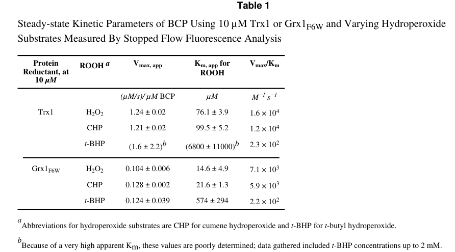

## Question

# Gene Research for Functional Annotation

## ⚠️ CRITICAL: Gene/Protein Identification Context

**BEFORE YOU BEGIN RESEARCH:** You MUST verify you are researching the CORRECT gene/protein. Gene symbols can be ambiguous, especially for less well-characterized genes from non-model organisms.

### Target Gene/Protein Identity (from UniProt):
- **UniProt Accession:** P0AE52
- **Protein Description:** RecName: Full=Peroxiredoxin Bcp; EC=1.11.1.24 {ECO:0000269|PubMed:10644761, ECO:0000269|PubMed:21910476}; AltName: Full=Bacterioferritin comigratory protein; AltName: Full=Thioredoxin peroxidase; AltName: Full=Thioredoxin-dependent peroxiredoxin Bcp {ECO:0000305};
- **Gene Information:** Name=bcp; OrderedLocusNames=b2480, JW2465;
- **Organism (full):** Escherichia coli (strain K12).
- **Protein Family:** Belongs to the peroxiredoxin family. BCP/PrxQ subfamily.
- **Key Domains:** AhpC/TSA. (IPR000866); Peroxiredoxin_AhpC-typ. (IPR024706); Peroxiredoxin_BCP/PrxQ. (IPR050924); Thioredoxin-like_sf. (IPR036249); Thioredoxin_domain. (IPR013766)

### MANDATORY VERIFICATION STEPS:

1. **Check if the gene symbol "bcp" matches the protein description above**
2. **Verify the organism is correct:** Escherichia coli (strain K12).
3. **Check if protein family/domains align with what you find in literature**
4. **If you find literature for a DIFFERENT gene with the same or similar symbol, STOP**

### If Gene Symbol is Ambiguous or You Cannot Find Relevant Literature:

**DO NOT PROCEED WITH RESEARCH ON A DIFFERENT GENE.** Instead:
- State clearly: "The gene symbol 'bcp' is ambiguous or literature is limited for this specific protein"
- Explain what you found (e.g., "Found extensive literature on a different gene with the same symbol in a different organism")
- Describe the protein based ONLY on the UniProt information provided above
- Suggest that the protein function can be inferred from domain/family information

### Research Target:

Please provide a comprehensive research report on the gene **bcp** (gene ID: bcp, UniProt: P0AE52) in ECOLI.

The research report should be a detailed narrative explaining the function, biological processes, and localization of the gene product. Citations should be given for all claims.

You should prioritize authoritative reviews and primary scientific literature when conducting research. You can supplement
this with annotations you find in gene/protein databases, but these can be outdated or inaccurate.

We are specifically interested in the primary function of the gene - for enzymes, what reaction is catalyzed, and what is the substrate specificity? For transporters, what is the substrate? For structural proteins or adapters, what is the broader structural role? For signaling molecules, what is the role in the pathway.

We are interested in where in or outside the cell the gene product carries out its function.

We are also interested in the signaling or biochemical pathways in which the gene functions. We are less interested in broad pleiotropic effects, except where these elucidate the precise role.

Include evidence where possible. We are interested in both experimental evidence as well as inference from structure, evolution, or bioinformatic analysis. Precise studies should be prioritized over high-throughput, where available.

## Output

Question: You are an expert researcher providing comprehensive, well-cited information.

Provide detailed information focusing on:
1. Key concepts and definitions with current understanding
2. Recent developments and latest research (prioritize 2023-2024 sources)
3. Current applications and real-world implementations
4. Expert opinions and analysis from authoritative sources
5. Relevant statistics and data from recent studies

Format as a comprehensive research report with proper citations. Include URLs and publication dates where available.
Always prioritize recent, authoritative sources and provide specific citations for all major claims.

# Gene Research for Functional Annotation

## ⚠️ CRITICAL: Gene/Protein Identification Context

**BEFORE YOU BEGIN RESEARCH:** You MUST verify you are researching the CORRECT gene/protein. Gene symbols can be ambiguous, especially for less well-characterized genes from non-model organisms.

### Target Gene/Protein Identity (from UniProt):
- **UniProt Accession:** P0AE52
- **Protein Description:** RecName: Full=Peroxiredoxin Bcp; EC=1.11.1.24 {ECO:0000269|PubMed:10644761, ECO:0000269|PubMed:21910476}; AltName: Full=Bacterioferritin comigratory protein; AltName: Full=Thioredoxin peroxidase; AltName: Full=Thioredoxin-dependent peroxiredoxin Bcp {ECO:0000305};
- **Gene Information:** Name=bcp; OrderedLocusNames=b2480, JW2465;
- **Organism (full):** Escherichia coli (strain K12).
- **Protein Family:** Belongs to the peroxiredoxin family. BCP/PrxQ subfamily.
- **Key Domains:** AhpC/TSA. (IPR000866); Peroxiredoxin_AhpC-typ. (IPR024706); Peroxiredoxin_BCP/PrxQ. (IPR050924); Thioredoxin-like_sf. (IPR036249); Thioredoxin_domain. (IPR013766)

### MANDATORY VERIFICATION STEPS:

1. **Check if the gene symbol "bcp" matches the protein description above**
2. **Verify the organism is correct:** Escherichia coli (strain K12).
3. **Check if protein family/domains align with what you find in literature**
4. **If you find literature for a DIFFERENT gene with the same or similar symbol, STOP**

### If Gene Symbol is Ambiguous or You Cannot Find Relevant Literature:

**DO NOT PROCEED WITH RESEARCH ON A DIFFERENT GENE.** Instead:
- State clearly: "The gene symbol 'bcp' is ambiguous or literature is limited for this specific protein"
- Explain what you found (e.g., "Found extensive literature on a different gene with the same symbol in a different organism")
- Describe the protein based ONLY on the UniProt information provided above
- Suggest that the protein function can be inferred from domain/family information

### Research Target:

Please provide a comprehensive research report on the gene **bcp** (gene ID: bcp, UniProt: P0AE52) in ECOLI.

The research report should be a detailed narrative explaining the function, biological processes, and localization of the gene product. Citations should be given for all claims.

You should prioritize authoritative reviews and primary scientific literature when conducting research. You can supplement
this with annotations you find in gene/protein databases, but these can be outdated or inaccurate.

We are specifically interested in the primary function of the gene - for enzymes, what reaction is catalyzed, and what is the substrate specificity? For transporters, what is the substrate? For structural proteins or adapters, what is the broader structural role? For signaling molecules, what is the role in the pathway.

We are interested in where in or outside the cell the gene product carries out its function.

We are also interested in the signaling or biochemical pathways in which the gene functions. We are less interested in broad pleiotropic effects, except where these elucidate the precise role.

Include evidence where possible. We are interested in both experimental evidence as well as inference from structure, evolution, or bioinformatic analysis. Precise studies should be prioritized over high-throughput, where available.

# Research Report: *Escherichia coli* K-12 **bcp** (UniProt **P0AE52**) — Peroxiredoxin Bcp/PrxQ Functional Annotation

## 0) Target verification (mandatory disambiguation)
The *E. coli* K-12 gene **bcp** encodes **bacterioferritin comigratory protein (BCP)**, a **peroxiredoxin** in the **BCP/PrxQ subfamily**, functioning as a **thioredoxin-dependent hydroperoxide peroxidase**. This matches the UniProt entry P0AE52 description (peroxiredoxin Bcp; “thioredoxin peroxidase/thioredoxin-dependent peroxiredoxin”) and is supported directly by biochemical and kinetic studies on *E. coli* BCP. (jeong2000thioredoxindependenthydroperoxideperoxidase pages 3-4, reeves2011kineticandthermodynamic pages 2-4)

## 1) Key concepts and definitions (current understanding)

### 1.1 Peroxiredoxins (Prxs) and the BCP/PrxQ subfamily
Peroxiredoxins are cysteine-dependent peroxidases that reduce **H2O2** and **organic hydroperoxides** using thiol-based electron donors; bacterial BCP proteins belong to the peroxiredoxin family and can provide peroxide detoxification capacity complementary to catalases and other peroxidases. (reeves2011kineticthermodynamicand pages 103-110, jeong2000thioredoxindependenthydroperoxideperoxidase pages 2-3)

### 1.2 “Atypical 2-Cys” Prx mechanism
In “2-Cys” peroxiredoxins, a **peroxidatic cysteine (Cp)** is oxidized by peroxide to a sulfenic acid intermediate, then a **resolving cysteine (Cr)** forms a disulfide that is reduced back by cellular redox systems. For *E. coli* BCP, mass spectrometry and mutagenesis support classification as an **atypical 2-Cys peroxiredoxin** with a **Cp–Cr** motif. (reeves2011kineticthermodynamicand pages 36-41, reeves2011kineticandthermodynamic pages 2-4)

### 1.3 Reducing systems: thioredoxin and glutaredoxin coupling
*E. coli* peroxide detoxification and redox homeostasis rely on NADPH-driven redoxins. BCP can be reduced by **thioredoxins (Trx1/Trx2)** and also shows activity with **glutaredoxins (Grx1/Grx3)**, indicating relatively relaxed dependence on a single redox partner compared with some other Prxs. (reeves2011kineticthermodynamicand pages 103-110, reeves2011kineticthermodynamicand pages 41-47)

## 2) Primary function: enzymatic activity, reaction, and substrate specificity

### 2.1 Reaction catalyzed
BCP catalyzes **reduction of peroxides** (H2O2 and organic hydroperoxides) in a thioredoxin-linked peroxidase system (Trx/TrxR/NADPH), monitored experimentally via **NADPH oxidation** and stopped-flow Trx fluorescence assays. (jeong2000thioredoxindependenthydroperoxideperoxidase pages 2-3, reeves2011kineticandthermodynamic pages 7-8)

### 2.2 Peroxide substrate range and preference
Early kinetic measurements showed BCP reduces **H2O2**, **t-butyl hydroperoxide**, and **linoleic acid hydroperoxide**, with **preference toward the lipid hydroperoxide** among these tested substrates (lower Km and higher Vmax/Km for linoleic acid hydroperoxide). (reeves2011kineticthermodynamicand pages 36-41, jeong2000thioredoxindependenthydroperoxideperoxidase pages 3-4)

Later work emphasized **broad peroxide specificity**, reporting comparable rates for some peroxides (e.g., H2O2 and cumene hydroperoxide) under selected conditions, supporting the interpretation that *E. coli* BCP is an “unusually versatile peroxiredoxin.” (reeves2011kineticthermodynamicand pages 103-110, reeves2011kineticandthermodynamic pages 2-4)

## 3) Catalytic residues, mechanism, and redox partners

### 3.1 Catalytic cysteines and motif
*E. coli* BCP contains three cysteines (Cys-45, Cys-50, Cys-99); **Cys-45** is the **peroxidatic cysteine** and is essential for activity (C45S mutant abolished Trx-dependent peroxidase/antioxidant activity). (jeong2000thioredoxindependenthydroperoxideperoxidase pages 3-4, jeong2000thioredoxindependenthydroperoxideperoxidase pages 4-5)

Mass spectrometry-based characterization supports **Cys45 (Cp)** and **Cys50 (Cr)** as the active-site pair in a **CPXXXXCR** arrangement, consistent with an atypical 2-Cys Prx mechanism, with observation of both intra- and intersubunit disulfide-bonded forms. (reeves2011kineticthermodynamicand pages 36-41)

### 3.2 Electron donors / reducing partners
BCP activity is supported by the **thioredoxin system** (NADPH + thioredoxin reductase + thioredoxin) in direct assays. (jeong2000thioredoxindependenthydroperoxideperoxidase pages 2-3)

In more detailed kinetic work, *E. coli* BCP showed activity with multiple redoxins including **Trx1, Trx2, Grx1, and Grx3**, indicating that BCP can be recycled by both thioredoxin and glutaredoxin networks. (reeves2011kineticthermodynamicand pages 103-110)

### 3.3 Kinetic mechanism and Trx interaction
Bisubstrate analyses with Trx1 and H2O2 were consistent with a **ping-pong mechanism** and a **nonsaturable interaction with Trx1** over tested concentrations (Km for Trx not well constrained and potentially very high). (reeves2011kineticandthermodynamic pages 7-8)

## 4) Quantitative kinetics, redox properties, and biochemical parameters (key statistics)

### 4.1 Kinetic constants (selected)
Reported substrate-panel kinetics for BCP (Trx-linked assays) include:
- **Km**: H2O2 **47.8 µM**, t-BHP **37.4 µM**, linoleic acid hydroperoxide **11.7 µM**
- **Vmax**: H2O2 **7.01 min−1**, t-BHP **1.93 min−1**, linoleic acid hydroperoxide **8.23 min−1**
- **Vmax/Km** (as reported): H2O2 **0.147**, t-BHP **0.052**, linoleic acid hydroperoxide **0.703** (units reported in the source as mmol min−1 mmol−1)
These values support the conclusion of comparatively strong activity toward a lipid hydroperoxide substrate among those tested. (jeong2000thioredoxindependenthydroperoxideperoxidase pages 3-4)

Reeves et al. additionally report an updated catalytic efficiency for H2O2 of ~**1.3 × 10^4 M−1 s−1** under bisubstrate stopped-flow analysis with Trx1, notably higher than earlier estimates (~2.45 × 10^3 M−1 s−1) and consistent with more complete kinetic treatment. (reeves2011kineticandthermodynamic pages 7-8)

**Visual evidence:** Reeves et al. provide kinetic plots and a table of kinetic parameters for multiple peroxide and reducing-partner combinations (Table 1 and Figure 2). (reeves2011kineticandthermodynamic media f9ca111b, reeves2011kineticandthermodynamic media 95ac531d)

### 4.2 Oligomeric state
BCP is reported as **monomeric** in solution up to at least **200 µM**, with sedimentation coefficients around ~2 S and no higher-order oligomers detected under tested conditions; early work also described BCP as monomeric (~18 kDa) irrespective of redox state. (jeong2000thioredoxindependenthydroperoxideperoxidase pages 3-4, reeves2011kineticandthermodynamic pages 7-8)

### 4.3 Redox and chemical properties
Key parameters relevant to cellular function include:
- Peroxidatic Cys45 **pKa ~5.8**, consistent with a reactive thiolate at physiological pH. (reeves2011kineticthermodynamicand pages 103-110)
- A relatively **high midpoint potential** for BCP of **−145.9 ± 3.2 mV**, supporting the interpretation that BCP can remain reduced under relatively oxidizing cellular conditions compared with lower-potential redox proteins. (reeves2011kineticthermodynamicand pages 103-110)

## 5) Biological roles, pathways, regulation, and localization

### 5.1 Role in oxidative stress defense / redox homeostasis
BCP is best supported as a **cytosolic peroxide-detoxifying enzyme** integrated with NADPH-driven thioredoxin/glutaredoxin systems, contributing to **oxidative-stress defense** by reducing H2O2 and organic hydroperoxides. (reeves2011kineticthermodynamicand pages 103-110, reeves2011kineticandthermodynamic pages 2-4)

### 5.2 Regulation / expression response to oxygen
A **bcp promoter–lacZ fusion** exhibited an approximately **3-fold increase** in β-galactosidase activity under oxygen stress (aerobic vs anaerobic conditions), indicating **oxygen-responsive transcriptional regulation**. (jeong2000thioredoxindependenthydroperoxideperoxidase pages 4-5)

The retrieved sources do **not** directly demonstrate *bcp* as an OxyR regulon member; however, they note that **Trx2 (trxC)**, a candidate BCP reductant, is strongly **OxyR-induced** and increases ~**20-fold** under oxidative stress (with baseline ~5-fold lower than Trx1). This provides plausible pathway context for how BCP recycling capacity may increase during oxidative stress via redoxin availability (inference about BCP recycling, not direct bcp regulation). (reeves2011kineticthermodynamicand pages 41-47)

### 5.3 Cellular localization
No direct experimental cellular localization (e.g., fractionation or microscopy) for *E. coli* BCP was identified in the retrieved papers. The most evidence-consistent annotation is **cytosolic localization by inference**, because the characterized protein is a soluble monomer and is recycled by cytosolic Trx/Grx systems in vitro; this should be treated as **inferred**, not directly demonstrated, given the current evidence set. (reeves2011kineticthermodynamicand pages 103-110, reeves2011kineticandthermodynamic pages 7-8)

## 6) Recent developments (2023–2024) and current research landscape
A targeted search for **2023–2024 papers specifically focused on *E. coli* K-12 Bcp (P0AE52)** did not yield additional retrievable sources in the current tool run. Therefore, the *E. coli*-specific functional annotation remains anchored in foundational primary biochemical work (2000; 2011) and should be considered stable but not recently re-evaluated in the retrieved literature set. (jeong2000thioredoxindependenthydroperoxideperoxidase pages 3-4, reeves2011kineticandthermodynamic pages 7-8)

## 7) Current applications and real-world implementations (with quantitative examples)

### 7.1 Antimicrobial plasma technology as an oxidative-stress application context
A real-world implementation area where bacterial peroxide-defense systems (including peroxiredoxins in general) are relevant is **non-thermal atmospheric pressure plasma** as an antimicrobial adjunct therapy. In a genome-wide functional screen in *E. coli* (KEIO collection), Krewing et al. identified **87 plasma-hypersensitive mutants out of 3,985 knockouts (~2.2%)** after plasma exposure. (krewing2019plasmasensitiveescherichiacoli pages 1-2)

Key experimental and application-relevant quantitative details include:
- Exposure regimes: **100 s** (plate assay) and **30 s** (filter assay) plasma effluent exposures. (krewing2019plasmasensitiveescherichiacoli pages 2-3, krewing2019plasmasensitiveescherichiacoli pages 11-12)
- Stressor profiling concentrations (selected): **H2O2 2 mM**, **paraquat 0.5 mM**, **HOCl 3 mM**, **peroxynitrite 5 mM**, plus additional nitric/acid/membrane stress conditions; doses were chosen to be non-lethal for wild-type but reduce its growth to ~60%. (krewing2019plasmasensitiveescherichiacoli pages 11-12)
- The authors conclude *E. coli* “relies heavily on mechanisms of detoxification” of species including **H2O2**, **superoxide**, and **NO-related species** for inherent plasma resistance. (krewing2019plasmasensitiveescherichiacoli pages 1-2, krewing2019plasmasensitiveescherichiacoli pages 10-10)

**Note:** Within the retrieved excerpts, *bcp* itself was not clearly identified as one of the 87 hits; thus this section should be read as application context for oxidative-stress defense rather than direct evidence of Bcp’s specific involvement. (krewing2019plasmasensitiveescherichiacoli pages 8-8, krewing2019plasmasensitiveescherichiacoli pages 1-2)

## 8) Expert interpretation and synthesis (evidence-grounded)

1. **Functional “niche”**: BCP appears to be a **broad-specificity peroxide scavenger** in *E. coli*, with the capability to accept electrons from multiple redoxins (Trx and Grx). Such relaxed partner specificity can be advantageous when one reducing pathway is compromised or when redox conditions fluctuate. (reeves2011kineticthermodynamicand pages 103-110, reeves2011kineticandthermodynamic pages 2-4)

2. **Chemical tuning for stress**: The relatively **low Cp pKa (~5.8)** and **high midpoint potential (~−146 mV)** support a model in which BCP remains catalytically competent under oxidizing conditions and can act as an auxiliary defense peroxidase. (reeves2011kineticthermodynamicand pages 103-110)

3. **Physiological trigger**: Oxygen-responsive transcription (~3-fold promoter induction) and linkage to oxidative-stress-associated thioredoxins (Trx2 is OxyR-induced) are consistent with BCP contributing to peroxide control when oxygen is present and ROS flux increases. (jeong2000thioredoxindependenthydroperoxideperoxidase pages 4-5, reeves2011kineticthermodynamicand pages 41-47)

## 9) Evidence summary table
The following table consolidates key annotation points (activity, substrates, partners, mechanism, kinetics, regulation) for rapid curation.

| Functional annotation element | Key finding for *E. coli* K-12 Bcp (UniProt P0AE52) | Evidence |
|---|---|---|
| Enzymatic reaction / primary function | Thioredoxin-dependent peroxiredoxin (BCP/PrxQ subfamily) that reduces hydrogen peroxide and organic hydroperoxides, including *t*-butyl hydroperoxide, cumene hydroperoxide, and linoleic acid hydroperoxide; described as an unusually versatile bacterial peroxiredoxin. | (reeves2011kineticthermodynamicand pages 36-41, reeves2011kineticthermodynamicand pages 103-110, jeong2000thioredoxindependenthydroperoxideperoxidase pages 2-3, jeong2000thioredoxindependenthydroperoxideperoxidase pages 3-4, reeves2011kineticandthermodynamic pages 2-4) |
| Substrate preference | Early assays found strongest preference for linoleic acid hydroperoxide among tested substrates; later kinetic work showed broad peroxide specificity, with comparable rates for H2O2 and cumene hydroperoxide under some assay conditions. | (reeves2011kineticthermodynamicand pages 36-41, reeves2011kineticthermodynamicand pages 103-110, jeong2000thioredoxindependenthydroperoxideperoxidase pages 3-4) |
| Reducing partners | Physiological electron donor system is thioredoxin/thioredoxin reductase/NADPH; Trx1 directly supports activity in stopped-flow and NADPH-coupled assays. Bcp can also use Trx2 and glutaredoxins Grx1 and Grx3 as alternative reducing partners, indicating relaxed reductant specificity. | (reeves2011kineticthermodynamicand pages 36-41, reeves2011kineticthermodynamicand pages 103-110, jeong2000thioredoxindependenthydroperoxideperoxidase pages 2-3, reeves2011kineticthermodynamicand pages 41-47, reeves2011kineticandthermodynamic pages 2-4) |
| Catalytic residues / motif | Active-site motif is CPXXXXCR. Cys45 is the peroxidatic cysteine (Cp) and Cys50 is the resolving cysteine (Cr); Cys99 is present but not the primary catalytic thiol. C45S abolishes detectable Trx-dependent peroxidase/antioxidant activity. | (reeves2011kineticthermodynamicand pages 36-41, jeong2000thioredoxindependenthydroperoxideperoxidase pages 3-4, reeves2011kineticandthermodynamic pages 2-4, jeong2000thioredoxindependenthydroperoxideperoxidase pages 4-5) |
| Catalytic mechanism | Atypical 2-Cys peroxiredoxin: Cp (Cys45) is oxidized by peroxide to sulfenic acid, then resolved by Cr (Cys50) to form disulfide intermediates; both intra- and intersubunit disulfide-bonded forms were observed. Steady-state analysis is consistent with a ping-pong mechanism and a nonsaturable interaction with Trx1. | (reeves2011kineticthermodynamicand pages 36-41, reeves2011kineticthermodynamicand pages 103-110, reeves2011kineticandthermodynamic pages 7-8, reeves2011kineticandthermodynamic pages 2-4) |
| Kinetics: early substrate panel | Reported Km values: H2O2 47.8 µM, *t*-BHP 37.4 µM, linoleic acid hydroperoxide 11.7 µM. Vmax values: 7.01, 1.93, and 8.23 min^-1, respectively (also reported as 400, 110, and 469 nmol min^-1 mg^-1). Vmax/Km values: 0.147, 0.052, and 0.703 mmol min^-1 mmol^-1, respectively. | (reeves2011kineticthermodynamicand pages 36-41, jeong2000thioredoxindependenthydroperoxideperoxidase pages 3-4) |
| Kinetics: revised steady-state analysis | Bisubstrate stopped-flow analysis with Trx1 gave apparent Km for H2O2 of ~80 µM at 10 µM Trx1 and catalytic efficiency (Vmax/Km)app for H2O2 of ~1.3 × 10^4 M^-1 s^-1; extrapolated global-fit values for Trx gave Km ≈ 500 µM and Vmax ≈ 64 s^-1, though poorly constrained. | (reeves2011kineticthermodynamicand pages 103-110, reeves2011kineticandthermodynamic pages 7-8, reeves2011kineticandthermodynamic media f9ca111b) |
| Assay conditions underlying kinetics | Key direct peroxidase assays used Trx, thioredoxin reductase, and NADPH at pH 7.0; stopped-flow rates were measured over the first 2 s at 25 °C, and peroxide consumption was also monitored by FOX assay in steady-state analyses. | (reeves2011kineticandthermodynamic pages 5-7, jeong2000thioredoxindependenthydroperoxideperoxidase pages 2-3, reeves2011kineticandthermodynamic pages 7-8) |
| Oligomeric state | Bcp is monomeric in solution up to at least 200 µM; sedimentation coefficients were ~2 S, and shape-independent molecular masses were 19.4 kDa (reduced) and 22.2 kDa (oxidized), with no higher-order oligomers observed under tested conditions. Earlier work also described the protein as monomeric (~18 kDa) irrespective of redox state. | (jeong2000thioredoxindependenthydroperoxideperoxidase pages 3-4, reeves2011kineticandthermodynamic pages 7-8) |
| Redox properties | Peroxidatic Cys45 has a measured pKa of ~5.8. Bcp has a relatively high redox midpoint potential of −145.9 ± 3.2 mV, supporting the idea that it can remain reduced under relatively oxidizing intracellular conditions. | (reeves2011kineticthermodynamicand pages 103-110, reeves2011kineticandthermodynamic pages 2-4) |
| Regulation / expression | A *bcp* promoter-*lacZ* fusion showed ~3-fold higher β-galactosidase activity during aerobic versus anaerobic growth, indicating oxygen-responsive expression. Evidence in the retrieved sources does not directly establish *bcp* as an OxyR regulon member, although a candidate reductant (Trx2) is strongly OxyR-induced during oxidative stress. | (jeong2000thioredoxindependenthydroperoxideperoxidase pages 4-5, reeves2011kineticthermodynamicand pages 41-47) |
| Physiological role / phenotype | Bcp contributes to oxidative-stress defense and redox homeostasis as a cytosolic peroxide-detoxifying enzyme in the thioredoxin/glutaredoxin network. The retrieved E. coli-focused sources provide strong biochemical evidence but limited direct in vivo mutant phenotype data for E. coli itself. | (reeves2011kineticthermodynamicand pages 36-41, reeves2011kineticthermodynamicand pages 103-110, reeves2011kineticandthermodynamic pages 2-4, jeong2000thioredoxindependenthydroperoxideperoxidase pages 4-5) |
| Cellular localization | No direct experimental localization for *E. coli* Bcp was reported in the retrieved sources. Given the lack of signal peptide/transmembrane annotations in the core biochemical literature and its use of cytosolic Trx/Grx systems, the best-supported annotation is cytosolic localization, but this remains inference rather than direct localization evidence in the cited papers. | (reeves2011kineticthermodynamicand pages 103-110, jeong2000thioredoxindependenthydroperoxideperoxidase pages 2-3, reeves2011kineticthermodynamicand pages 41-47) |

*Table: This table summarizes the most important functional annotation points for *Escherichia coli* K-12 Bcp/PrxQ (P0AE52), including enzymatic activity, substrates, catalytic residues, kinetics, redox properties, regulation, and phenotype evidence. It is useful as a compact evidence-backed reference for gene function curation.*

## 10) Key source details (publication dates and URLs)
- Reeves SA, Parsonage D, Nelson KJ, Poole LB. **“Kinetic and thermodynamic features reveal that *Escherichia coli* BCP is an unusually versatile peroxiredoxin.”** *Biochemistry*. **October 2011**. https://doi.org/10.1021/bi200935d (reeves2011kineticandthermodynamic pages 7-8)
- Jeong W, Cha MK, Kim IH. **“Thioredoxin-dependent hydroperoxide peroxidase activity of bacterioferritin comigratory protein (BCP) …”** **2000**. (URL not available in retrieved metadata) (jeong2000thioredoxindependenthydroperoxideperoxidase pages 3-4)
- Krewing M et al. **“Plasma-sensitive *Escherichia coli* mutants reveal plasma resistance mechanisms.”** *J R Soc Interface*. **March 2019**. https://doi.org/10.1098/rsif.2018.0846 (krewing2019plasmasensitiveescherichiacoli pages 1-2)

## 11) Limitations of the current evidence set (to prevent over-annotation)
- **2023–2024 priority**: No *E. coli* Bcp-focused 2023–2024 papers were retrieved in this tool run; recent developments are therefore not available for this specific protein here. (jeong2000thioredoxindependenthydroperoxideperoxidase pages 3-4, reeves2011kineticandthermodynamic pages 7-8)
- **Localization**: No direct localization experiments for *E. coli* BCP were found; cytosolic localization is **inferred** from soluble biochemistry and Trx/Grx coupling. (reeves2011kineticandthermodynamic pages 7-8)
- **In vivo phenotypes in *E. coli***: The retrieved set contains limited direct *E. coli* **bcp deletion** phenotype evidence; functional claims are therefore strongly biochemical/mechanistic rather than genetic/physiological in *E. coli*. (reeves2011kineticthermodynamicand pages 103-110, jeong2000thioredoxindependenthydroperoxideperoxidase pages 4-5)

References

1. (jeong2000thioredoxindependenthydroperoxideperoxidase pages 3-4): W Jeong, MK Cha, and IH Kim. Thioredoxin-dependent hydroperoxide peroxidase activity of bacterioferritin comigratory protein (bcp) as a new member of the thiol-specific antioxidant protein (tsa) …. Unknown journal, 2000.

2. (reeves2011kineticandthermodynamic pages 2-4): Stacy A. Reeves, Derek Parsonage, Kimberly J. Nelson, and Leslie B. Poole. Kinetic and thermodynamic features reveal that escherichia coli bcp is an unusually versatile peroxiredoxin. Biochemistry, 50 41:8970-81, Oct 2011. URL: https://doi.org/10.1021/bi200935d, doi:10.1021/bi200935d. This article has 71 citations and is from a peer-reviewed journal.

3. (reeves2011kineticthermodynamicand pages 103-110): SA Reeves. Kinetic, thermodynamic and mechanistic features of escherichia coli bcp, an unusually versatile peroxiredoxin. Unknown journal, 2011.

4. (jeong2000thioredoxindependenthydroperoxideperoxidase pages 2-3): W Jeong, MK Cha, and IH Kim. Thioredoxin-dependent hydroperoxide peroxidase activity of bacterioferritin comigratory protein (bcp) as a new member of the thiol-specific antioxidant protein (tsa) …. Unknown journal, 2000.

5. (reeves2011kineticthermodynamicand pages 36-41): SA Reeves. Kinetic, thermodynamic and mechanistic features of escherichia coli bcp, an unusually versatile peroxiredoxin. Unknown journal, 2011.

6. (reeves2011kineticthermodynamicand pages 41-47): SA Reeves. Kinetic, thermodynamic and mechanistic features of escherichia coli bcp, an unusually versatile peroxiredoxin. Unknown journal, 2011.

7. (reeves2011kineticandthermodynamic pages 7-8): Stacy A. Reeves, Derek Parsonage, Kimberly J. Nelson, and Leslie B. Poole. Kinetic and thermodynamic features reveal that escherichia coli bcp is an unusually versatile peroxiredoxin. Biochemistry, 50 41:8970-81, Oct 2011. URL: https://doi.org/10.1021/bi200935d, doi:10.1021/bi200935d. This article has 71 citations and is from a peer-reviewed journal.

8. (jeong2000thioredoxindependenthydroperoxideperoxidase pages 4-5): W Jeong, MK Cha, and IH Kim. Thioredoxin-dependent hydroperoxide peroxidase activity of bacterioferritin comigratory protein (bcp) as a new member of the thiol-specific antioxidant protein (tsa) …. Unknown journal, 2000.

9. (reeves2011kineticandthermodynamic media f9ca111b): Stacy A. Reeves, Derek Parsonage, Kimberly J. Nelson, and Leslie B. Poole. Kinetic and thermodynamic features reveal that escherichia coli bcp is an unusually versatile peroxiredoxin. Biochemistry, 50 41:8970-81, Oct 2011. URL: https://doi.org/10.1021/bi200935d, doi:10.1021/bi200935d. This article has 71 citations and is from a peer-reviewed journal.

10. (reeves2011kineticandthermodynamic media 95ac531d): Stacy A. Reeves, Derek Parsonage, Kimberly J. Nelson, and Leslie B. Poole. Kinetic and thermodynamic features reveal that escherichia coli bcp is an unusually versatile peroxiredoxin. Biochemistry, 50 41:8970-81, Oct 2011. URL: https://doi.org/10.1021/bi200935d, doi:10.1021/bi200935d. This article has 71 citations and is from a peer-reviewed journal.

11. (krewing2019plasmasensitiveescherichiacoli pages 1-2): Marco Krewing, Fabian Jarzina, Tim Dirks, Britta Schubert, Jan Benedikt, Jan-Wilm Lackmann, and Julia E. Bandow. Plasma-sensitive escherichia coli mutants reveal plasma resistance mechanisms. Journal of the Royal Society Interface, 16:20180846, Mar 2019. URL: https://doi.org/10.1098/rsif.2018.0846, doi:10.1098/rsif.2018.0846. This article has 30 citations and is from a peer-reviewed journal.

12. (krewing2019plasmasensitiveescherichiacoli pages 2-3): Marco Krewing, Fabian Jarzina, Tim Dirks, Britta Schubert, Jan Benedikt, Jan-Wilm Lackmann, and Julia E. Bandow. Plasma-sensitive escherichia coli mutants reveal plasma resistance mechanisms. Journal of the Royal Society Interface, 16:20180846, Mar 2019. URL: https://doi.org/10.1098/rsif.2018.0846, doi:10.1098/rsif.2018.0846. This article has 30 citations and is from a peer-reviewed journal.

13. (krewing2019plasmasensitiveescherichiacoli pages 11-12): Marco Krewing, Fabian Jarzina, Tim Dirks, Britta Schubert, Jan Benedikt, Jan-Wilm Lackmann, and Julia E. Bandow. Plasma-sensitive escherichia coli mutants reveal plasma resistance mechanisms. Journal of the Royal Society Interface, 16:20180846, Mar 2019. URL: https://doi.org/10.1098/rsif.2018.0846, doi:10.1098/rsif.2018.0846. This article has 30 citations and is from a peer-reviewed journal.

14. (krewing2019plasmasensitiveescherichiacoli pages 10-10): Marco Krewing, Fabian Jarzina, Tim Dirks, Britta Schubert, Jan Benedikt, Jan-Wilm Lackmann, and Julia E. Bandow. Plasma-sensitive escherichia coli mutants reveal plasma resistance mechanisms. Journal of the Royal Society Interface, 16:20180846, Mar 2019. URL: https://doi.org/10.1098/rsif.2018.0846, doi:10.1098/rsif.2018.0846. This article has 30 citations and is from a peer-reviewed journal.

15. (krewing2019plasmasensitiveescherichiacoli pages 8-8): Marco Krewing, Fabian Jarzina, Tim Dirks, Britta Schubert, Jan Benedikt, Jan-Wilm Lackmann, and Julia E. Bandow. Plasma-sensitive escherichia coli mutants reveal plasma resistance mechanisms. Journal of the Royal Society Interface, 16:20180846, Mar 2019. URL: https://doi.org/10.1098/rsif.2018.0846, doi:10.1098/rsif.2018.0846. This article has 30 citations and is from a peer-reviewed journal.

16. (reeves2011kineticandthermodynamic pages 5-7): Stacy A. Reeves, Derek Parsonage, Kimberly J. Nelson, and Leslie B. Poole. Kinetic and thermodynamic features reveal that escherichia coli bcp is an unusually versatile peroxiredoxin. Biochemistry, 50 41:8970-81, Oct 2011. URL: https://doi.org/10.1021/bi200935d, doi:10.1021/bi200935d. This article has 71 citations and is from a peer-reviewed journal.

## Artifacts

- [Edison artifact artifact-00](bcp-deep-research-falcon_artifacts/artifact-00.md)

## Citations

1. reeves2011kineticthermodynamicand pages 36-41
2. jeong2000thioredoxindependenthydroperoxideperoxidase pages 2-3
3. reeves2011kineticthermodynamicand pages 103-110
4. reeves2011kineticandthermodynamic pages 7-8
5. jeong2000thioredoxindependenthydroperoxideperoxidase pages 3-4
6. jeong2000thioredoxindependenthydroperoxideperoxidase pages 4-5
7. reeves2011kineticthermodynamicand pages 41-47
8. krewing2019plasmasensitiveescherichiacoli pages 1-2
9. krewing2019plasmasensitiveescherichiacoli pages 11-12
10. reeves2011kineticandthermodynamic pages 2-4
11. krewing2019plasmasensitiveescherichiacoli pages 2-3
12. krewing2019plasmasensitiveescherichiacoli pages 10-10
13. krewing2019plasmasensitiveescherichiacoli pages 8-8
14. reeves2011kineticandthermodynamic pages 5-7
15. https://doi.org/10.1021/bi200935d
16. https://doi.org/10.1098/rsif.2018.0846
17. https://doi.org/10.1021/bi200935d,
18. https://doi.org/10.1098/rsif.2018.0846,