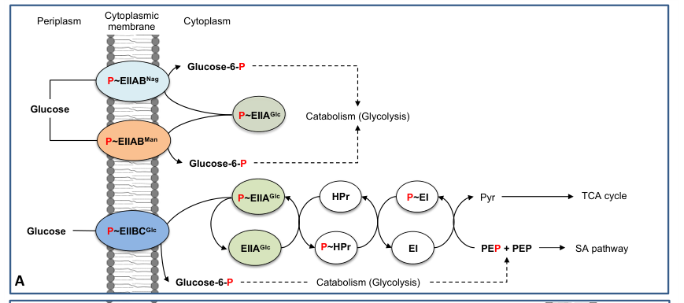

## Question

# Gene Research for Functional Annotation

## ⚠️ CRITICAL: Gene/Protein Identification Context

**BEFORE YOU BEGIN RESEARCH:** You MUST verify you are researching the CORRECT gene/protein. Gene symbols can be ambiguous, especially for less well-characterized genes from non-model organisms.

### Target Gene/Protein Identity (from UniProt):
- **UniProt Accession:** P69797
- **Protein Description:** RecName: Full=PTS system mannose-specific EIIAB component {ECO:0000303|PubMed:8262947}; EC=2.7.1.191 {ECO:0000269|PubMed:2681202, ECO:0000269|PubMed:8262947}; AltName: Full=EIIAB-Man {ECO:0000303|PubMed:8262947}; AltName: Full=EIII-Man {ECO:0000303|PubMed:2951378}; Includes: RecName: Full=Mannose-specific phosphotransferase enzyme IIA component {ECO:0000303|PubMed:8262947}; AltName: Full=PTS system mannose-specific EIIA component {ECO:0000303|PubMed:8262947}; Includes: RecName: Full=Mannose-specific phosphotransferase enzyme IIB component {ECO:0000303|PubMed:8262947}; AltName: Full=PTS system mannose-specific EIIB component {ECO:0000303|PubMed:8262947};
- **Gene Information:** Name=manX {ECO:0000303|Ref.1}; Synonyms=gptB, ptsL {ECO:0000303|PubMed:2951378}; OrderedLocusNames=b1817, JW1806;
- **Organism (full):** Escherichia coli (strain K12).
- **Protein Family:** Not specified in UniProt
- **Key Domains:** Bacterial_PTS_sugar_comp. (IPR051471); PTS_EIIA_man. (IPR013789); PTS_EIIA_man-typ. (IPR004701); PTS_EIIA_man-typ_sf. (IPR036662); PTS_IIA_man. (IPR033887)

### MANDATORY VERIFICATION STEPS:

1. **Check if the gene symbol "manX" matches the protein description above**
2. **Verify the organism is correct:** Escherichia coli (strain K12).
3. **Check if protein family/domains align with what you find in literature**
4. **If you find literature for a DIFFERENT gene with the same or similar symbol, STOP**

### If Gene Symbol is Ambiguous or You Cannot Find Relevant Literature:

**DO NOT PROCEED WITH RESEARCH ON A DIFFERENT GENE.** Instead:
- State clearly: "The gene symbol 'manX' is ambiguous or literature is limited for this specific protein"
- Explain what you found (e.g., "Found extensive literature on a different gene with the same symbol in a different organism")
- Describe the protein based ONLY on the UniProt information provided above
- Suggest that the protein function can be inferred from domain/family information

### Research Target:

Please provide a comprehensive research report on the gene **manX** (gene ID: manX, UniProt: P69797) in ECOLI.

The research report should be a detailed narrative explaining the function, biological processes, and localization of the gene product. Citations should be given for all claims.

You should prioritize authoritative reviews and primary scientific literature when conducting research. You can supplement
this with annotations you find in gene/protein databases, but these can be outdated or inaccurate.

We are specifically interested in the primary function of the gene - for enzymes, what reaction is catalyzed, and what is the substrate specificity? For transporters, what is the substrate? For structural proteins or adapters, what is the broader structural role? For signaling molecules, what is the role in the pathway.

We are interested in where in or outside the cell the gene product carries out its function.

We are also interested in the signaling or biochemical pathways in which the gene functions. We are less interested in broad pleiotropic effects, except where these elucidate the precise role.

Include evidence where possible. We are interested in both experimental evidence as well as inference from structure, evolution, or bioinformatic analysis. Precise studies should be prioritized over high-throughput, where available.

## Output

Question: You are an expert researcher providing comprehensive, well-cited information.

Provide detailed information focusing on:
1. Key concepts and definitions with current understanding
2. Recent developments and latest research (prioritize 2023-2024 sources)
3. Current applications and real-world implementations
4. Expert opinions and analysis from authoritative sources
5. Relevant statistics and data from recent studies

Format as a comprehensive research report with proper citations. Include URLs and publication dates where available.
Always prioritize recent, authoritative sources and provide specific citations for all major claims.

# Gene Research for Functional Annotation

## ⚠️ CRITICAL: Gene/Protein Identification Context

**BEFORE YOU BEGIN RESEARCH:** You MUST verify you are researching the CORRECT gene/protein. Gene symbols can be ambiguous, especially for less well-characterized genes from non-model organisms.

### Target Gene/Protein Identity (from UniProt):
- **UniProt Accession:** P69797
- **Protein Description:** RecName: Full=PTS system mannose-specific EIIAB component {ECO:0000303|PubMed:8262947}; EC=2.7.1.191 {ECO:0000269|PubMed:2681202, ECO:0000269|PubMed:8262947}; AltName: Full=EIIAB-Man {ECO:0000303|PubMed:8262947}; AltName: Full=EIII-Man {ECO:0000303|PubMed:2951378}; Includes: RecName: Full=Mannose-specific phosphotransferase enzyme IIA component {ECO:0000303|PubMed:8262947}; AltName: Full=PTS system mannose-specific EIIA component {ECO:0000303|PubMed:8262947}; Includes: RecName: Full=Mannose-specific phosphotransferase enzyme IIB component {ECO:0000303|PubMed:8262947}; AltName: Full=PTS system mannose-specific EIIB component {ECO:0000303|PubMed:8262947};
- **Gene Information:** Name=manX {ECO:0000303|Ref.1}; Synonyms=gptB, ptsL {ECO:0000303|PubMed:2951378}; OrderedLocusNames=b1817, JW1806;
- **Organism (full):** Escherichia coli (strain K12).
- **Protein Family:** Not specified in UniProt
- **Key Domains:** Bacterial_PTS_sugar_comp. (IPR051471); PTS_EIIA_man. (IPR013789); PTS_EIIA_man-typ. (IPR004701); PTS_EIIA_man-typ_sf. (IPR036662); PTS_IIA_man. (IPR033887)

### MANDATORY VERIFICATION STEPS:

1. **Check if the gene symbol "manX" matches the protein description above**
2. **Verify the organism is correct:** Escherichia coli (strain K12).
3. **Check if protein family/domains align with what you find in literature**
4. **If you find literature for a DIFFERENT gene with the same or similar symbol, STOP**

### If Gene Symbol is Ambiguous or You Cannot Find Relevant Literature:

**DO NOT PROCEED WITH RESEARCH ON A DIFFERENT GENE.** Instead:
- State clearly: "The gene symbol 'manX' is ambiguous or literature is limited for this specific protein"
- Explain what you found (e.g., "Found extensive literature on a different gene with the same symbol in a different organism")
- Describe the protein based ONLY on the UniProt information provided above
- Suggest that the protein function can be inferred from domain/family information

### Research Target:

Please provide a comprehensive research report on the gene **manX** (gene ID: manX, UniProt: P69797) in ECOLI.

The research report should be a detailed narrative explaining the function, biological processes, and localization of the gene product. Citations should be given for all claims.

You should prioritize authoritative reviews and primary scientific literature when conducting research. You can supplement
this with annotations you find in gene/protein databases, but these can be outdated or inaccurate.

We are specifically interested in the primary function of the gene - for enzymes, what reaction is catalyzed, and what is the substrate specificity? For transporters, what is the substrate? For structural proteins or adapters, what is the broader structural role? For signaling molecules, what is the role in the pathway.

We are interested in where in or outside the cell the gene product carries out its function.

We are also interested in the signaling or biochemical pathways in which the gene functions. We are less interested in broad pleiotropic effects, except where these elucidate the precise role.

Include evidence where possible. We are interested in both experimental evidence as well as inference from structure, evolution, or bioinformatic analysis. Precise studies should be prioritized over high-throughput, where available.

## Research report: Functional annotation of **manX** (UniProt **P69797**) in *Escherichia coli* K-12

### 0) Identity verification (critical disambiguation)
The literature and reviews retrieved here consistently describe **manX** in *E. coli* as the **phosphoenolpyruvate (PEP)-dependent phosphotransferase system (PTS) mannose-family EIIAB component**, found in the **manXYZ** locus with **manY** and **manZ** encoding the membrane components. This matches the user-supplied UniProt target description for accession **P69797** (mannose-specific PTS EIIAB component, “EIIAB-Man/EIII-Man”, part of manXYZ). In a recent *E. coli* glucose-transport review, **manX** is explicitly labeled “**mannose-specific PTS system EIIAB**”, while **manYZ** are labeled “**EIICD**” components, consistent with the canonical mannose-family PTS architecture. (carreonrodriguez2023glucosetransportin pages 2-3)

### 1) Key concepts and current understanding

#### 1.1 The PTS and mannose-family Enzyme II systems
The bacterial PTS is a **group translocation** system in which transport is coupled to phosphorylation. A phosphate derived from **PEP** is transferred through a cascade (classically EI → HPr → EII components) and ultimately to the incoming carbohydrate, thereby importing the sugar in a phosphorylated form and integrating uptake with central carbon metabolism and regulation. A 2024 Cra review summarizes this mechanism as a “phosphorylation cascade” used to transport carbohydrates. (huang2024insightsintothe pages 6-8)

Within *E. coli*, mannose-family PTS transporters are commonly organized as:
- a **cytosolic phosphotransfer module** (EIIA/EIIB; sometimes fused), and
- an **inner-membrane transport module** (EIIC and often EIID in mannose-family systems).
A 2023 review’s curated transporter table places **ManX** as “EIIAB” and **ManYZ** as “EIICD”, indicating a split between a cytosolic EIIAB and membrane EIICD components. (carreonrodriguez2023glucosetransportin pages 2-3)

#### 1.2 What ManX is (definition)
**ManX** is the **mannose-family PTS EIIAB subunit**. In curated annotations, it is associated with the inner-membrane system but is itself annotated as a **cytosolic component (IM, C)**, consistent with a cytosolic phosphotransfer function that operates in conjunction with inner-membrane permease components. (carreonrodriguez2023glucosetransportin pages 2-3)

**Operon/context:** Multiple sources explicitly place **manX** with **manY** and **manZ** in the **manXYZ** locus, where manY and manZ encode the membrane permease subunits. (huang2024insightsintothe pages 6-8, carreonrodriguez2023glucosetransportin pages 2-3, mukherjee2024plasticityofgrowth pages 6-7)

#### 1.3 Reaction catalyzed and mechanistic role
The retrieved sources provide strong evidence for ManX’s role in **phosphoryl-transfer-coupled carbohydrate uptake** as part of the PTS cascade, including explicit pathway schematics showing a mannose-family EIIAB module (“P~EIIABMan”) participating in PTS-mediated phosphorylation and import routes. (carreonrodriguez2023glucosetransportin pages 3-4, carreonrodriguez2023glucosetransportin media f2cbe0f1)

However, the **specific EC number (EC 2.7.1.191)** and the exact enzyme name variant “EIII-Man” were **not explicitly stated in the retrieved full-text excerpts**, so those details should be treated as **UniProt-provided annotation for P69797** rather than independently re-validated here.

### 2) Substrate specificity and physiological role

#### 2.1 Substrate range
Authoritative transport summaries list the manXYZ system under **mannose** transport. (carreonrodriguez2023glucosetransportin pages 2-3)

Additional recent *E. coli*-focused evidence indicates the mannose-family PTS can be **promiscuous** in substrate handling beyond mannose. A 2024 *E. coli* metabolic-oligosaccharide engineering context describes **ManXYZ** as a “promiscuous mannose PTS transporter” with activity toward **mannose, GlcNAc, GlcN, and other hexoses**, and indicates PTS import yields the corresponding **sugar-6-phosphate**, which can be a critical constraint for downstream metabolic engineering. (tsengwest2024exploringnahkmediatedmetabolic pages 46-49)

A separate excerpted table (same 2024 source) lists substrates associated with the ManXYZ PTS system including **mannose, glucose, 2-deoxyglucose, fructose**, and amino sugars (including **GlcNAc/GlcN**), supporting practical cross-specificity in curated/engineering contexts. (tsengwest2024exploringnahkmediatedmetabolic pages 36-39)

#### 2.2 Biological processes and pathway context
ManX functions in **carbohydrate uptake and phosphorylation** within the PTS framework and is embedded in broader carbon control networks. The Cra review places manX/manY/manZ among PTS-linked components relevant to carbon utilization regulation, reinforcing that ManX is not just a transporter component but also part of global regulatory wiring around carbon flux and catabolite regulation. (huang2024insightsintothe pages 6-8)

### 3) Cellular localization and complex organization
Curated localization indicates:
- **ManX (EIIAB)**: “IM, C” (inner membrane–associated; cytosolic), consistent with a cytosolic enzyme subunit functionally coupled to a membrane permease complex. (carreonrodriguez2023glucosetransportin pages 2-3)
- **ManY/ManZ (EIICD/EIIC+EIID)**: inner-membrane components forming the translocation pathway. (carreonrodriguez2023glucosetransportin pages 2-3)

A 2024 source explicitly separates ManX (IIAB) from ManY (IIC) and ManZ (IID), consistent with mannose-family PTS architecture. (tsengwest2024exploringnahkmediatedmetabolic pages 36-39)

### 4) Recent developments (prioritizing 2023–2024)

#### 4.1 2023: Transport engineering perspective (systems-level view)
A 2023 review of *E. coli* glucose transport emphasizes that multiple transporters can contribute to glucose entry and phosphorylation, including mannose-family components, highlighting “cross-taking interactions” and non-specific contributions of alternative systems. A pathway schematic includes the mannose-family phosphotransfer module labeled “P~EIIABMan.” (Publication date: 2023-06; URL: https://doi.org/10.3390/microorganisms11061588) (carreonrodriguez2023glucosetransportin pages 3-4, carreonrodriguez2023glucosetransportin media f2cbe0f1)

#### 4.2 2024: Regulatory rewiring can transform mannose ‘nutrient quality’
A 2024 study on growth laws demonstrated that mannose performance in *E. coli* is strongly influenced by regulatory/proteome allocation decisions. The authors engineered the **manXYZ locus** by:
- swapping in the **glucose PTS promoter PptsG upstream of manX**, 
- deleting the regulator **mlc**, and 
- placing **manA** (mannose-6-phosphate isomerase) under a strong promoter.
They report that the engineered strain grows on **mannose** as fast as wild-type grows on **glucose** (statistical comparisons show **WT glucose vs WT mannose: P < 0.0001**; **WT mannose vs engineered mannose: P < 0.0001**; **WT glucose vs engineered mannose: ns**). This directly supports a modern view that the manXYZ/ManX module’s physiological impact is highly tunable by expression/regulation, not only by intrinsic transporter/enzyme kinetics. (Publication date: 2024-01; URL: https://doi.org/10.1371/journal.pcbi.1011735) (mukherjee2024plasticityofgrowth pages 10-11, mukherjee2024plasticityofgrowth pages 9-10, mukherjee2024plasticityofgrowth pages 6-7)

#### 4.3 2024: PTS-linked global regulation (Cra)
A 2024 review on the transcription factor **Cra** contextualizes PTS systems (including manX/manY/manZ) within global carbon control and regulatory cascades, emphasizing that PTS components participate in carbohydrate transport via phosphorylation cascades and are part of networks shaping carbon utilization strategies. (Publication date: 2024-11; URL: https://doi.org/10.1128/aem.01228-24) (huang2024insightsintothe pages 6-8)

### 5) Current applications and real-world implementations

#### 5.1 Metabolic engineering and transport engineering
The 2023 glucose-transport review explicitly frames *E. coli* sugar transport systems (including mannose-family PTS components) as levers for **transport engineering** to improve growth and production phenotypes, i.e., rebalancing transporter usage and regulatory circuits to optimize flux toward desired products. (carreonrodriguez2023glucosetransportin pages 3-4)

The 2024 growth-law work is a concrete demonstration of this principle: by rewiring **manXYZ/manX** expression (plus manA) the authors convert mannose from a poor to a high-performance substrate, which is directly relevant to industrial or lab-scale strain optimization when mannose-rich feedstocks are used. (mukherjee2024plasticityofgrowth pages 10-11, mukherjee2024plasticityofgrowth pages 9-10)

#### 5.2 Glyco-/amino-sugar and analog uptake constraints (engineering context)
In metabolic oligosaccharide engineering contexts, ManXYZ is discussed as a relevant entry route for amino sugars/analogs, with the key practical constraint that PTS import produces **sugar-6-phosphates** (e.g., phosphorylated analogs), shaping downstream pathway design needs (e.g., dephosphorylation steps or alternative uptake strategies). (tsengwest2024exploringnahkmediatedmetabolic pages 46-49)

### 6) Expert opinions and analysis (authoritative sources)
- The 2023 review synthesizes a consensus view that *E. coli* carbohydrate uptake is modular and includes redundancy/overlap among transporters, with mannose-family PTS components contributing to broader carbohydrate uptake possibilities. (carreonrodriguez2023glucosetransportin pages 3-4)
- The 2024 growth-law study provides an explicit interpretation that mannose is “not an inherently ‘poor’ substrate” and that growth limitations are largely due to regulatory allocation of proteomic resources, supported by promoter rewiring experiments on manXYZ/manX. (mukherjee2024plasticityofgrowth pages 10-11, mukherjee2024plasticityofgrowth pages 9-10)
- The 2024 Cra review provides a regulatory systems interpretation—placing manX within global carbon management networks—supporting the view that ManX’s physiological role cannot be separated from regulatory state. (huang2024insightsintothe pages 6-8)

### 7) Relevant statistics and recent quantitative data
- **Statistical evidence of engineered phenotype (2024):** Comparisons reported include **P < 0.0001** for (i) WT glucose vs WT mannose growth and (ii) WT mannose vs engineered mannose growth; and **non-significant** difference between WT glucose vs engineered mannose growth, consistent with engineered mannose growth matching WT glucose growth. (mukherjee2024plasticityofgrowth pages 10-11, mukherjee2024plasticityofgrowth pages 9-10)
- **Experimental parameters (2024):** Growth assays were performed in minimal medium with **20 mM glucose** or **20 mM mannose** at **37°C**, OD600-based growth-rate fitting, and cAMP supplementation/rescue conditions were described (including cAMP addition for rescue tests). These details help interpret the comparability of growth phenotypes and establish methodological rigor. (mukherjee2024plasticityofgrowth pages 6-7)

### 8) Visual evidence (figure support)
A pathway schematic (Figure 1A) from the 2023 review explicitly shows a mannose-family PTS phosphotransfer component labeled **“P~EIIABMan”** within the broader PTS network for carbohydrate import/phosphorylation. This supports ManX’s conceptual role as the mannose-family EIIAB phosphotransfer module embedded in the PTS cascade. (carreonrodriguez2023glucosetransportin media f2cbe0f1)

### 9) Summary table (evidence-backed functional annotation)
| Aspect | Key points | Supporting sources |
|---|---|---|
| identity/operon | • Verified target matches **E. coli K-12 manX**, annotated as the **mannose-specific PTS EIIAB component**. • Retrieved sources place **manX** with **manY/manZ** in the **manXYZ** mannose PTS locus. • Alternative naming in retrieved texts includes **EIIAB-Man**; broader PTS schematics show the mannose-family EIIAB module. | (huang2024insightsintothe pages 6-8, carreonrodriguez2023glucosetransportin pages 2-3, mukherjee2024plasticityofgrowth pages 6-7) |
| domains/subunits | • **ManX** is the **cytosolic EIIAB** phosphotransfer subunit of the mannose-family PTS. • **ManY/ManZ** correspond to the membrane **EIIC/EIID (or EIICD)** transport subunits. • This supports a split system with soluble phosphotransfer and membrane translocation components. | (tsengwest2024exploringnahkmediatedmetabolic pages 36-39, huang2024insightsintothe pages 6-8, carreonrodriguez2023glucosetransportin pages 2-3) |
| reaction/mechanism | • ManX functions in the **PEP-dependent phosphotransferase system (PTS)**, where phosphate flows **PEP → EI → HPr → EII components → incoming sugar**. • Retrieved texts support **phosphoryl-transfer-coupled uptake**, but do **not directly provide the EC assignment**. • **EC 2.7.1.191 is reported in the UniProt target description; not directly evidenced in retrieved texts**. | (huang2024insightsintothe pages 6-8, carreonrodriguez2023glucosetransportin pages 3-4, carreonrodriguez2023glucosetransportin media f2cbe0f1) |
| substrates | • Core assignment is **mannose-specific** transport. • Retrieved evidence also indicates **cross-specificity/promiscuity** toward **glucose, GlcNAc, GlcN, 2-deoxyglucose, fructose, and other hexoses** in some assay/database contexts. • Thus, ManX belongs to a mannose-family PTS with broader hexose/amino-sugar handling than mannose alone. | (tsengwest2024exploringnahkmediatedmetabolic pages 36-39, tsengwest2024exploringnahkmediatedmetabolic pages 46-49, carreonrodriguez2023glucosetransportin pages 2-3, carreonrodriguez2023glucosetransportin pages 3-4) |
| localization | • ManX is annotated as **IM, C**, consistent with a **cytosolic/peripheral phosphotransfer component associated with the inner membrane complex**. • **ManY/ManZ** are **inner-membrane** components that provide the translocation pathway. • System architecture therefore places catalysis at the cytosolic side of an inner-membrane transporter complex. | (tsengwest2024exploringnahkmediatedmetabolic pages 36-39, carreonrodriguez2023glucosetransportin pages 2-3) |
| regulation/physiology | • A 2024 Cra review places **manX/manY/manZ** within broader carbon-control circuitry of the PTS. • A 2024 growth-law study engineered the **manXYZ** locus by swapping the **PptsG** promoter upstream of **manX**, deleting **mlc**, and strengthening **manA** expression. • Engineered cells grew on mannose as fast as WT on glucose; WT glucose vs WT mannose and WT mannose vs engineered mannose were both **P < 0.0001**, while WT glucose vs engineered mannose was **ns**, indicating regulation/expression—not intrinsic substrate chemistry alone—limits mannose performance. | (huang2024insightsintothe pages 6-8, mukherjee2024plasticityofgrowth pages 6-7, mukherjee2024plasticityofgrowth pages 10-11, mukherjee2024plasticityofgrowth pages 9-10) |
| applications/engineering | • **Transport engineering** in E. coli exploits mannose-family PTS components as alternative or enhanced sugar-uptake routes. • Rewiring **manXYZ/manX** expression can convert mannose from a relatively poor to a high-performance substrate for growth. • Recent metabolic-engineering contexts also mention **manXYZ deletion or exploitation** when redirecting carbohydrate flux or controlling uptake of amino sugars/analogs. | (carreonrodriguez2023glucosetransportin pages 3-4, mukherjee2024plasticityofgrowth pages 10-11, mukherjee2024plasticityofgrowth pages 9-10) |

*Table: This table summarizes the evidence-backed functional annotation of E. coli K-12 ManX (UniProt P69797), including identity, mechanism, substrates, localization, regulation, and engineering relevance. It uses only the retrieved context sources and flags where UniProt information was not directly evidenced in those texts.*

### 10) Evidence gaps and limits of this retrieval
- The UniProt-provided details **EC 2.7.1.191** and alternative name **EIII-Man** for P69797 were not directly reproduced in the retrieved excerpts; the texts here support PTS phosphotransfer function and architecture but do not restate the EC designation. 
- Foundational primary literature linked to older PubMed IDs listed in UniProt could not be retrieved in the current tool runs; therefore, classic biochemical details (e.g., specific phosphorylated residues, kinetic constants of purified ManX/EIIAB-Man) are not included from primary sources in this report.

### Key references (with dates and URLs)
- Carreón-Rodríguez OE et al. **“Glucose Transport in *Escherichia coli*: From Basics to Transport Engineering.”** *Microorganisms* (2023-06). https://doi.org/10.3390/microorganisms11061588 (carreonrodriguez2023glucosetransportin pages 2-3, carreonrodriguez2023glucosetransportin pages 3-4, carreonrodriguez2023glucosetransportin media f2cbe0f1)
- Huang Y et al. **“Insights into the regulatory mechanisms and application prospects of the transcription factor Cra.”** *Applied and Environmental Microbiology* (2024-11). https://doi.org/10.1128/aem.01228-24 (huang2024insightsintothe pages 6-8)
- Mukherjee A et al. **“Plasticity of growth laws tunes resource allocation strategies in bacteria.”** *PLOS Computational Biology* (2024-01). https://doi.org/10.1371/journal.pcbi.1011735 (mukherjee2024plasticityofgrowth pages 6-7, mukherjee2024plasticityofgrowth pages 10-11, mukherjee2024plasticityofgrowth pages 9-10)
- Tseng-West M. **“Exploring NahK-mediated Metabolic Oligosaccharide Engineering…”** (2024; venue unclear in retrieved text). (tsengwest2024exploringnahkmediatedmetabolic pages 36-39, tsengwest2024exploringnahkmediatedmetabolic pages 46-49)

References

1. (carreonrodriguez2023glucosetransportin pages 2-3): Ofelia E. Carreón-Rodríguez, Guillermo Gosset, Adelfo Escalante, and Francisco Bolívar. Glucose transport in escherichia coli: from basics to transport engineering. Microorganisms, 11:1588, Jun 2023. URL: https://doi.org/10.3390/microorganisms11061588, doi:10.3390/microorganisms11061588. This article has 76 citations.

2. (huang2024insightsintothe pages 6-8): Ying Huang, Kai-Zhi Jia, Wei Zhao, and Li-Wen Zhu. Insights into the regulatory mechanisms and application prospects of the transcription factor cra. Applied and Environmental Microbiology, Nov 2024. URL: https://doi.org/10.1128/aem.01228-24, doi:10.1128/aem.01228-24. This article has 1 citations and is from a peer-reviewed journal.

3. (mukherjee2024plasticityofgrowth pages 6-7): Avik Mukherjee, Yu-Fang Chang, Yanqing Huang, Nina Catherine Benites, Leander Ammar, Jade Ealy, Mark Polk, and Markus Basan. Plasticity of growth laws tunes resource allocation strategies in bacteria. PLOS Computational Biology, 20:e1011735, Jan 2024. URL: https://doi.org/10.1371/journal.pcbi.1011735, doi:10.1371/journal.pcbi.1011735. This article has 10 citations and is from a highest quality peer-reviewed journal.

4. (carreonrodriguez2023glucosetransportin pages 3-4): Ofelia E. Carreón-Rodríguez, Guillermo Gosset, Adelfo Escalante, and Francisco Bolívar. Glucose transport in escherichia coli: from basics to transport engineering. Microorganisms, 11:1588, Jun 2023. URL: https://doi.org/10.3390/microorganisms11061588, doi:10.3390/microorganisms11061588. This article has 76 citations.

5. (carreonrodriguez2023glucosetransportin media f2cbe0f1): Ofelia E. Carreón-Rodríguez, Guillermo Gosset, Adelfo Escalante, and Francisco Bolívar. Glucose transport in escherichia coli: from basics to transport engineering. Microorganisms, 11:1588, Jun 2023. URL: https://doi.org/10.3390/microorganisms11061588, doi:10.3390/microorganisms11061588. This article has 76 citations.

6. (tsengwest2024exploringnahkmediatedmetabolic pages 46-49): M Tseng-West. Exploring nahk-mediated metabolic oligosaccharide engineering with n-azidoacetylglucosamine derivatives in escherichia coli. Unknown journal, 2024.

7. (tsengwest2024exploringnahkmediatedmetabolic pages 36-39): M Tseng-West. Exploring nahk-mediated metabolic oligosaccharide engineering with n-azidoacetylglucosamine derivatives in escherichia coli. Unknown journal, 2024.

8. (mukherjee2024plasticityofgrowth pages 10-11): Avik Mukherjee, Yu-Fang Chang, Yanqing Huang, Nina Catherine Benites, Leander Ammar, Jade Ealy, Mark Polk, and Markus Basan. Plasticity of growth laws tunes resource allocation strategies in bacteria. PLOS Computational Biology, 20:e1011735, Jan 2024. URL: https://doi.org/10.1371/journal.pcbi.1011735, doi:10.1371/journal.pcbi.1011735. This article has 10 citations and is from a highest quality peer-reviewed journal.

9. (mukherjee2024plasticityofgrowth pages 9-10): Avik Mukherjee, Yu-Fang Chang, Yanqing Huang, Nina Catherine Benites, Leander Ammar, Jade Ealy, Mark Polk, and Markus Basan. Plasticity of growth laws tunes resource allocation strategies in bacteria. PLOS Computational Biology, 20:e1011735, Jan 2024. URL: https://doi.org/10.1371/journal.pcbi.1011735, doi:10.1371/journal.pcbi.1011735. This article has 10 citations and is from a highest quality peer-reviewed journal.

## Artifacts

- [Edison artifact artifact-00](manX-deep-research-falcon_artifacts/artifact-00.md)

## Citations

1. carreonrodriguez2023glucosetransportin pages 2-3
2. huang2024insightsintothe pages 6-8
3. tsengwest2024exploringnahkmediatedmetabolic pages 46-49
4. tsengwest2024exploringnahkmediatedmetabolic pages 36-39
5. carreonrodriguez2023glucosetransportin pages 3-4
6. mukherjee2024plasticityofgrowth pages 6-7
7. mukherjee2024plasticityofgrowth pages 10-11
8. mukherjee2024plasticityofgrowth pages 9-10
9. https://doi.org/10.3390/microorganisms11061588
10. https://doi.org/10.1371/journal.pcbi.1011735
11. https://doi.org/10.1128/aem.01228-24
12. https://doi.org/10.3390/microorganisms11061588,
13. https://doi.org/10.1128/aem.01228-24,
14. https://doi.org/10.1371/journal.pcbi.1011735,