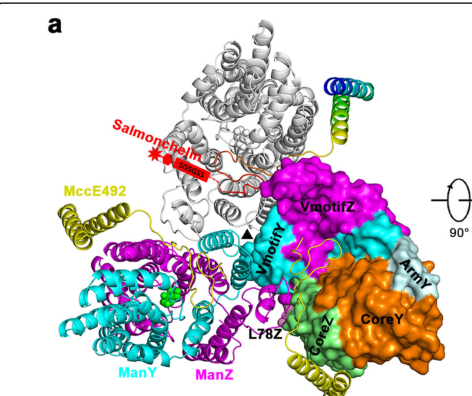

## Question

# Gene Research for Functional Annotation

## ⚠️ CRITICAL: Gene/Protein Identification Context

**BEFORE YOU BEGIN RESEARCH:** You MUST verify you are researching the CORRECT gene/protein. Gene symbols can be ambiguous, especially for less well-characterized genes from non-model organisms.

### Target Gene/Protein Identity (from UniProt):
- **UniProt Accession:** P69801
- **Protein Description:** RecName: Full=PTS system mannose-specific EIIC component {ECO:0000303|PubMed:2999119}; AltName: Full=EII-P-Man {ECO:0000303|PubMed:2951378}; AltName: Full=EIIC-Man {ECO:0000303|PubMed:2999119}; AltName: Full=Mannose permease IIC component {ECO:0000303|PubMed:2999119};
- **Gene Information:** Name=manY; Synonyms=pel, ptsP; OrderedLocusNames=b1818, JW1807;
- **Organism (full):** Escherichia coli (strain K12).
- **Protein Family:** Not specified in UniProt
- **Key Domains:** GatZ_KbaZ_carbometab. (IPR050303); PTS_IIC_man. (IPR004700); EII-Sor (PF03609)

### MANDATORY VERIFICATION STEPS:

1. **Check if the gene symbol "manY" matches the protein description above**
2. **Verify the organism is correct:** Escherichia coli (strain K12).
3. **Check if protein family/domains align with what you find in literature**
4. **If you find literature for a DIFFERENT gene with the same or similar symbol, STOP**

### If Gene Symbol is Ambiguous or You Cannot Find Relevant Literature:

**DO NOT PROCEED WITH RESEARCH ON A DIFFERENT GENE.** Instead:
- State clearly: "The gene symbol 'manY' is ambiguous or literature is limited for this specific protein"
- Explain what you found (e.g., "Found extensive literature on a different gene with the same symbol in a different organism")
- Describe the protein based ONLY on the UniProt information provided above
- Suggest that the protein function can be inferred from domain/family information

### Research Target:

Please provide a comprehensive research report on the gene **manY** (gene ID: manY, UniProt: P69801) in ECOLI.

The research report should be a detailed narrative explaining the function, biological processes, and localization of the gene product. Citations should be given for all claims.

You should prioritize authoritative reviews and primary scientific literature when conducting research. You can supplement
this with annotations you find in gene/protein databases, but these can be outdated or inaccurate.

We are specifically interested in the primary function of the gene - for enzymes, what reaction is catalyzed, and what is the substrate specificity? For transporters, what is the substrate? For structural proteins or adapters, what is the broader structural role? For signaling molecules, what is the role in the pathway.

We are interested in where in or outside the cell the gene product carries out its function.

We are also interested in the signaling or biochemical pathways in which the gene functions. We are less interested in broad pleiotropic effects, except where these elucidate the precise role.

Include evidence where possible. We are interested in both experimental evidence as well as inference from structure, evolution, or bioinformatic analysis. Precise studies should be prioritized over high-throughput, where available.

## Output

Question: You are an expert researcher providing comprehensive, well-cited information.

Provide detailed information focusing on:
1. Key concepts and definitions with current understanding
2. Recent developments and latest research (prioritize 2023-2024 sources)
3. Current applications and real-world implementations
4. Expert opinions and analysis from authoritative sources
5. Relevant statistics and data from recent studies

Format as a comprehensive research report with proper citations. Include URLs and publication dates where available.
Always prioritize recent, authoritative sources and provide specific citations for all major claims.

# Gene Research for Functional Annotation

## ⚠️ CRITICAL: Gene/Protein Identification Context

**BEFORE YOU BEGIN RESEARCH:** You MUST verify you are researching the CORRECT gene/protein. Gene symbols can be ambiguous, especially for less well-characterized genes from non-model organisms.

### Target Gene/Protein Identity (from UniProt):
- **UniProt Accession:** P69801
- **Protein Description:** RecName: Full=PTS system mannose-specific EIIC component {ECO:0000303|PubMed:2999119}; AltName: Full=EII-P-Man {ECO:0000303|PubMed:2951378}; AltName: Full=EIIC-Man {ECO:0000303|PubMed:2999119}; AltName: Full=Mannose permease IIC component {ECO:0000303|PubMed:2999119};
- **Gene Information:** Name=manY; Synonyms=pel, ptsP; OrderedLocusNames=b1818, JW1807;
- **Organism (full):** Escherichia coli (strain K12).
- **Protein Family:** Not specified in UniProt
- **Key Domains:** GatZ_KbaZ_carbometab. (IPR050303); PTS_IIC_man. (IPR004700); EII-Sor (PF03609)

### MANDATORY VERIFICATION STEPS:

1. **Check if the gene symbol "manY" matches the protein description above**
2. **Verify the organism is correct:** Escherichia coli (strain K12).
3. **Check if protein family/domains align with what you find in literature**
4. **If you find literature for a DIFFERENT gene with the same or similar symbol, STOP**

### If Gene Symbol is Ambiguous or You Cannot Find Relevant Literature:

**DO NOT PROCEED WITH RESEARCH ON A DIFFERENT GENE.** Instead:
- State clearly: "The gene symbol 'manY' is ambiguous or literature is limited for this specific protein"
- Explain what you found (e.g., "Found extensive literature on a different gene with the same symbol in a different organism")
- Describe the protein based ONLY on the UniProt information provided above
- Suggest that the protein function can be inferred from domain/family information

### Research Target:

Please provide a comprehensive research report on the gene **manY** (gene ID: manY, UniProt: P69801) in ECOLI.

The research report should be a detailed narrative explaining the function, biological processes, and localization of the gene product. Citations should be given for all claims.

You should prioritize authoritative reviews and primary scientific literature when conducting research. You can supplement
this with annotations you find in gene/protein databases, but these can be outdated or inaccurate.

We are specifically interested in the primary function of the gene - for enzymes, what reaction is catalyzed, and what is the substrate specificity? For transporters, what is the substrate? For structural proteins or adapters, what is the broader structural role? For signaling molecules, what is the role in the pathway.

We are interested in where in or outside the cell the gene product carries out its function.

We are also interested in the signaling or biochemical pathways in which the gene functions. We are less interested in broad pleiotropic effects, except where these elucidate the precise role.

Include evidence where possible. We are interested in both experimental evidence as well as inference from structure, evolution, or bioinformatic analysis. Precise studies should be prioritized over high-throughput, where available.

# Research Report: **manY (UniProt P69801)** — PTS system mannose-specific EIIC component in *Escherichia coli* K-12

## Executive summary
The *E. coli* K-12 gene **manY** (UniProt **P69801**) encodes **IIC\_Man (EIIC-Man)**, the **integral inner-membrane permease subunit** of the **mannose-family phosphoenolpyruvate:sugar phosphotransferase system (PTS)** transporter **ManXYZ**. In the canonical gene-to-subunit assignment, **manX → IIAB\_Man**, **manY → IIC\_Man**, and **manZ → IID\_Man**. (seip1994mannosetransporterof pages 1-2)

ManY’s primary role is to form (with ManZ) the **membrane translocation pathway** that couples **sugar transport to phosphorylation** (group translocation). While mannose is the defining substrate, the *E. coli* ManXYZ system is also used for uptake/phosphorylation of **glucose and multiple amino-sugars/sugar analogs** (e.g., **2-deoxyglucose**, **N-acetylglucosamine**, **mannosamine/glucosamine**) in a broad-specificity “mannose-family” PTS context. (jeckelmann2019carbohydratetransportby pages 27-30, aboulwafa2020proteinproteininteractionsin pages 2-4)

Recent work (2024) demonstrates that *E. coli*’s relatively slow growth on mannose is **not an immutable biochemical limitation of the ManXYZ transporter**; instead, it is largely a **regulatory/resource-allocation outcome** that can be reversed by **chromosomal promoter rewiring** increasing manXYZ and downstream mannose-metabolic expression, yielding growth on mannose comparable to wild-type growth on glucose. (mukherjee2024plasticityofgrowth pages 10-11, mukherjee2024plasticityofgrowth pages 9-10)

## 1) Identity verification (critical disambiguation)

### 1.1 Mapping of gene symbol to protein function (correct target confirmation)
Primary biochemical literature directly assigns *E. coli* mannose-PTS genes to subunits: **“manX, manY, and manZ, genes encoding IIAB\_Man, IIC\_Man, and IID\_Man, respectively.”** (Biochemistry, 1994-06; DOI URL: https://doi.org/10.1021/bi00189a021) (seip1994mannosetransporterof pages 1-2)

This mapping matches the user-specified UniProt identity: **UniProt P69801 = PTS system mannose-specific EIIC component, gene manY** (E. coli K-12). (seip1994mannosetransporterof pages 1-2)

### 1.2 Operon/system context
In *E. coli* K-12, the mannose-specific PTS is encoded by **manXYZ**, which collectively supplies the mannose PTS Enzyme II components (**EIIAB\_Man–EIIC\_Man–EIID\_Man**); deletion of manXYZ abolishes mannose utilization/transport. (Journal of Bacteriology, 2006-08; DOI URL: https://doi.org/10.1128/jb.00219-06) (becker2006yeeianovel pages 1-2, becker2006yeeianovel pages 3-4)

## 2) Key concepts and definitions (current understanding)

### 2.1 What is the PTS and what makes the mannose-family distinct?
The bacterial PTS is a **group translocation** system: phosphate from **phosphoenolpyruvate (PEP)** is transferred through a protein phosphorylation cascade (EI → HPr → EIIA → EIIB) to the incoming sugar, so that **transport and phosphorylation occur in a coupled process**. The overall PEP→sugar phosphoryl transfer is energetically favorable (reported ΔG° ~ −48 kJ·mol−1 in a PTS context). (jeckelmann2019carbohydratetransportby pages 27-30)

The mannose-family PTS transporters are multi-subunit systems with soluble **IIA/IIB (or IIAB)** phosphotransfer components and membrane **IIC + IID** components; the **IIC and IID subunits are both required** for functional membrane transport and for certain receptor functions (e.g., phage/toxin entry). (jeckelmann2019carbohydratetransportby pages 27-30)

### 2.2 Definition of ManY function
**ManY (IIC\_Man/EIIC-Man)** is the **integral inner-membrane permease** subunit that—together with ManZ (IID\_Man)—forms the **membrane channel and substrate-binding/translocation machinery** responsible for selectively transporting sugars across the inner membrane during PTS-mediated uptake. (seip1994mannosetransporterof pages 1-2, jeckelmann2019carbohydratetransportby pages 27-30)

## 3) Molecular function, substrate specificity, and reaction

### 3.1 Reaction catalyzed (group translocation outcome)
The functional outcome of ManXYZ activity is **import of specific hexoses/hexosamines with concomitant phosphorylation** (cytosolic sugar-phosphate formation). Mechanistically, phosphate is relayed via soluble PTS components to the EIIB phosphocarrier and then to the sugar during translocation. (jeckelmann2019carbohydratetransportby pages 27-30, seip1994mannosetransporterof pages 1-2)

### 3.2 Substrate range (with emphasis on ManY-containing transporter)
A key feature of the *E. coli* mannose-family transporter is **broad specificity** beyond mannose. In review-level synthesis of experimental data, ManXYZ/ManY is described as mediating PTS uptake/phosphorylation of **mannose** and several other sugars/analogs including **glucose**, **mannosamine**, and **N-acetylglucosamine**, and it can accommodate certain substitutions (e.g., transport/phosphorylation of **2-deoxyglucose**; poor tolerance of substitutions at C-4 and C-6). (jeckelmann2019carbohydratetransportby pages 27-30, aboulwafa2020proteinproteininteractionsin pages 2-4)

### 3.3 Quantitative kinetic parameters (example values)
Reconstituted mannose-family **IICIID** complexes (membrane components corresponding to ManY/ManZ-type) have been reported with distinct kinetics for vectorial (physiological) vs non-vectorial phosphorylation:
- **Vectorial phosphorylation:** Km ≈ **30 μM**, kcat ≈ **1.2 s−1**
- **Non-vectorial phosphorylation:** Km ≈ **0.1 mM**, kcat ≈ **3 s−1**
These values are presented in an authoritative review of the PTS literature and are used to illustrate the mechanistic coupling of transport and phosphorylation. (jeckelmann2019carbohydratetransportby pages 27-30)

## 4) Localization and structural/topological understanding

### 4.1 Cellular localization
ManY is a **cytoplasmic (inner) membrane protein**. Together with ManZ it forms the membrane portion of the transporter (IIC/IID). (seip1994mannosetransporterof pages 1-2, jeckelmann2019carbohydratetransportby pages 27-30)

### 4.2 Topology (transmembrane segments)
Experimental fusion-mapping and consensus models suggest that **IIC\_Man (ManY)** contains approximately **6 transmembrane segments** (with some models allowing 6–8), with **N- and C-termini in the cytoplasm**; topology predictions for mannose-family IIC/IID have historically been challenging and remain uncertain in older literature. (jeckelmann2019carbohydratetransportby pages 27-30)

### 4.3 High-resolution structural insight (ManY/ManZ architecture and assemblies)
A cryo-EM structure of the **ManYZ** inner-membrane components complexed with the bacteriocin **microcin E492 (MccE492)** provides detailed architecture. In this structure:
- ManY and ManZ each contain **Core, Arm, and Vmotif** domain types.
- The complex assembles with **threefold symmetry** and a **3:3 stoichiometry** (3 MccE492 : 3 ManYZ), with **mannose localized mid-membrane** in the complex.
- Reported cryo-EM reconstruction achieved **2.28 Å** overall resolution from **92,052 particles**.
(huang2021structureofthe pages 1-3, huang2021structureofthe media feebbc59)

A conformational comparison between apo (inward-facing) and bacteriocin-bound occluded state supports a large “elevator-like” motion: a rigid-body rotation (~47°) and translation (~11 Å) of a Core domain during transition to an occluded state. (huang2021structureofthe pages 3-4)

## 5) Pathways and physiological roles

### 5.1 Central role in mannose uptake and carbon metabolism
The manXYZ operon supplies the core components of the **D-mannose-specific PTS**; deletion of manXYZ abolishes mannose transport/utilization in *E. coli* K-12, supporting its role as the principal mannose uptake route. (becker2006yeeianovel pages 1-2)

### 5.2 Receptor/gateway roles for toxins and phages
The ManY/ManZ (IIC/IID) membrane complex is exploited as an inner-membrane receptor/gateway in microbial antagonism and infection biology:
- **Microcin E492** inserts into the cytoplasmic membrane and associates with ManYZ, using ManYZ as a receptor in a Trojan-horse entry mechanism (outer membrane entry via siderophore receptors followed by inner-membrane association). (huang2021structureofthe pages 1-3)
- The ManYZ complex is implicated as an inner-membrane receptor involved in **bacteriophage λ** entry; structural analysis suggests MccE492 binds away from the interface proposed to form the λ DNA tunnel and thus may not block λ infection. (huang2021structureofthe pages 3-4)

## 6) Regulation and recent developments (prioritizing 2023–2024)

### 6.1 2024: Nutrient quality on mannose is “plastic” via manXYZ promoter engineering
Mukherjee et al. (PLOS Computational Biology, **2024-01**; DOI URL: https://doi.org/10.1371/journal.pcbi.1011735) engineered *E. coli* by rewiring chromosomal regulation of mannose uptake and catabolism:
- Replaced the native promoter of the **manXYZ** operon with a strong heterologous promoter (e.g., **PptsG** or **Ptet**), increased **manA** expression (Ptet-manA), and deleted **mlc** (a regulator affecting PTS expression).
- The resulting “swapped promoter” strain grew on **mannose minimal medium at the same rate as wild-type on glucose minimal medium**, with reported statistics: **WT glucose vs WT mannose P < 0.0001**; **WT mannose vs engineered strain on mannose P < 0.0001**; and **WT glucose vs engineered strain on mannose: not significant**.
(mukherjee2024plasticityofgrowth pages 10-11, mukherjee2024plasticityofgrowth pages 9-10, mukherjee2024plasticityofgrowth pages 6-7)

Interpretation: this study supports an expert-level conclusion that the apparent “poorness” of mannose as a carbon source in *E. coli* is largely governed by **regulatory architecture and proteome allocation**, rather than inherent biochemical constraints of ManY/ManXYZ transport chemistry. (mukherjee2024plasticityofgrowth pages 10-11, mukherjee2024plasticityofgrowth pages 9-10)

### 6.2 Network-level membrane protein interactions that modulate ManXYZ activity (context)
Although not 2023–2024, Aboulwafa et al. provide experimental evidence that ManYZ/ManXYZ participates in a broader network of membrane protein–protein interactions affecting PTS activities; importantly, they show **manYZ co-expression** has much larger functional consequences than manY alone, consistent with ManY requiring ManZ for stable/functional membrane complex formation. (Microbial Physiology, 2020-09; DOI URL: https://doi.org/10.1159/000510257) (aboulwafa2020proteinproteininteractionsin pages 5-6, aboulwafa2020proteinproteininteractionsin pages 1-2)

## 7) Current applications and real-world implementations

### 7.1 Metabolic engineering / synthetic biology relevance
The manXYZ system is a frequent engineering lever in *E. coli* strain design because it directly controls **PTS-dependent sugar uptake and phosphorylation**, shaping carbon flux and global regulation. The 2024 promoter-swap study demonstrates a concrete “implementation”: chromosomal promoter rewiring of **manXYZ** can markedly alter growth performance on mannose—an approach conceptually aligned with industrial strain optimization where transporter expression is tuned to match desired substrate and productivity profiles. (mukherjee2024plasticityofgrowth pages 10-11, mukherjee2024plasticityofgrowth pages 6-7)

### 7.2 Antimicrobial biology (microcin/phage interactions)
The ManY/ManZ complex’s receptor role for microcin E492 is mechanistically important for designing or understanding bacteriocin-based antagonism strategies. High-resolution structural characterization provides a framework for rational engineering of toxin–receptor interactions. (huang2021structureofthe pages 1-3, huang2021structureofthe pages 3-4)

## 8) Statistics and data highlights (recent and foundational)
- **2024 growth phenotype:** engineered promoter-swapped strain achieves **mannose growth rate ≈ WT glucose growth rate** (statistical equivalence reported as ns; P-values for other comparisons < 0.0001). (mukherjee2024plasticityofgrowth pages 10-11, mukherjee2024plasticityofgrowth pages 9-10)
- **Transport/phosphorylation kinetics (reviewed):** vectorial phosphorylation **Km ≈ 30 μM; kcat ≈ 1.2 s−1**; non-vectorial **Km ≈ 0.1 mM; kcat ≈ 3 s−1**. (jeckelmann2019carbohydratetransportby pages 27-30)
- **In vivo uptake modulation by overexpression:** manYZ overexpression increased uptake of **methyl-α-glucoside ~14.0-fold (SD 1.0)** and **2-deoxyglucose ~10.8-fold (SD 4.1)**, while **manY alone** produced only modest effects (~1.6-fold for αMG; ~1.1-fold for GlcNAc). (aboulwafa2020proteinproteininteractionsin pages 4-5, aboulwafa2020proteinproteininteractionsin pages 2-4, aboulwafa2020proteinproteininteractionsin pages 5-6)
- **Cryo-EM structure statistics:** ManYZ–MccE492 complex reconstructed at **2.28 Å** from **92,052 particles**; conformational change includes ~**47°** rotation and ~**11 Å** translation of the Core domain to reach an occluded state. (huang2021structureofthe pages 1-3, huang2021structureofthe pages 3-4)

## Summary table
The following table consolidates gene-to-subunit mapping, localization/topology, substrate scope, quantitative values, and key references.

| Component / gene | Protein name / subunit | Cellular localization / topology notes | Molecular function & substrates | Key quantitative data | Key references (year, DOI URL) |
|---|---|---|---|---|---|
| **manX** | **IIABMan** (cytosolic Enzyme IIAB component of mannose-family PTS) | Peripheral/cytosolic phosphotransfer protein; IIA is a homodimeric soluble domain and IIB carries the phospho-accepting histidine/cysteine chemistry typical of the mannose-family pathway; associates with membrane ManY/ManZ complex in the full transporter (seip1994mannosetransporterof pages 1-2, jeckelmann2019carbohydratetransportby pages 27-30) | Receives phosphate from HPr and passes it toward the sugar during group translocation by ManXYZ; part of the transporter used for uptake/phosphorylation of **mannose**, and also contributes to transport of **glucose, 2-deoxyglucose, glucosamine / N-acetylglucosamine** in E. coli mannose-family PTS context (seip1994mannosetransporterof pages 1-2, jeckelmann2019carbohydratetransportby pages 27-30, aboulwafa2020proteinproteininteractionsin pages 2-4) | Stable transport complex described as **IIABman2:(IICmanIIDman)2**; overall PEP→sugar phosphotransfer is strongly favorable (**ΔG° ≈ −48 kJ·mol−1**) for the PTS pathway (jeckelmann2019carbohydratetransportby pages 27-30) | Seip et al. **1994**, Biochemistry, DOI: https://doi.org/10.1021/bi00189a021 (seip1994mannosetransporterof pages 1-2); Jeckelmann & Erni **2019**, DOI: https://doi.org/10.1007/978-3-030-18768-2_8 (jeckelmann2019carbohydratetransportby pages 27-30) |
| **manY** (**UniProt P69801; b1818/JW1807 in UniProt context**) | **IICMan / EIIC-Man**; mannose permease IIC component | **Integral inner-membrane** subunit of ManXYZ. **Seip 1994 explicitly maps manY → IICMan**. Experimental/speculative topology literature supports **~6 TM segments** (possibly **6–8 TM** in consensus models) with **cytoplasmic N- and C-termini**; forms a tight membrane complex with ManZ and contributes Core/Arm/Vmotif architecture in cryo-EM ManYZ structures (seip1994mannosetransporterof pages 1-2, jeckelmann2019carbohydratetransportby pages 27-30, huang2021structureofthe pages 1-3, huang2021structureofthe media feebbc59) | Primary permease subunit for **PTS-mediated uptake coupled to phosphorylation** of **mannose**; broader specificity includes **glucose, mannosamine, 2-deoxyglucose, glucosamine/N-acetylglucosamine**, with poor tolerance for C-4/C-6 sugar substitutions. Physiologically part of the **sole mannose uptake system** in E. coli and involved in scavenging cell-wall-derived amino sugars (jeckelmann2019carbohydratetransportby pages 27-30, aboulwafa2020proteinproteininteractionsin pages 2-4) | Reconstituted mannose-family **IICIID** complexes: **vectorial phosphorylation Km ≈ 30 μM, kcat ≈ 1.2 s−1**; **non-vectorial phosphorylation Km ≈ 0.1 mM, kcat ≈ 3 s−1**. **manY alone** overexpression caused only modest uptake changes (e.g., ~**1.6-fold** for αMG, ~**1.1-fold** for GlcNAc), whereas **manYZ** co-overexpression strongly stimulated uptake (**αMG ~14.0-fold**, **2DG ~10.8-fold**, **mannitol ~2.1-fold**) (jeckelmann2019carbohydratetransportby pages 27-30, aboulwafa2020proteinproteininteractionsin pages 2-4, aboulwafa2020proteinproteininteractionsin pages 5-6, aboulwafa2020proteinproteininteractionsin pages 4-5) | Seip et al. **1994**, DOI: https://doi.org/10.1021/bi00189a021 (**explicit manY→IICMan**) (seip1994mannosetransporterof pages 1-2); Jeckelmann & Erni **2019**, DOI: https://doi.org/10.1007/978-3-030-18768-2_8 (jeckelmann2019carbohydratetransportby pages 27-30); Aboulwafa et al. **2020**, DOI: https://doi.org/10.1159/000510257 (aboulwafa2020proteinproteininteractionsin pages 4-5, aboulwafa2020proteinproteininteractionsin pages 2-4, aboulwafa2020proteinproteininteractionsin pages 5-6); Huang et al. **2021**, DOI: https://doi.org/10.1038/s41421-021-00253-6 (huang2021structureofthe pages 1-3) |
| **manZ** | **IIDMan / EIID-Man** | Integral inner-membrane partner of ManY; tightly associated and apparently required for stable ManY function/expression. Topology models suggest a **large N-terminal cytoplasmic domain** plus multiple C-terminal TM segments; in cryo-EM ManYZ each protomer contributes **Core/Arm/Vmotif** elements, and ManY/ManZ assemble as a membrane complex (jeckelmann2019carbohydratetransportby pages 27-30, huang2021structureofthe pages 1-3, huang2021structureofthe pages 3-4) | Partner permease subunit that works with ManY to form the membrane translocation/phosphorylation apparatus for mannose-family substrates; required for full transport activity and receptor functions for certain toxins/phages (jeckelmann2019carbohydratetransportby pages 27-30, jeckelmann2019carbohydratetransportby pages 30-33) | **manYZ**, but not manY alone, strongly increased uptake of heterologous PTS substrates in overexpression assays; authors note **ManY is thought to be unstable in the absence of ManZ** (aboulwafa2020proteinproteininteractionsin pages 5-6, aboulwafa2020proteinproteininteractionsin pages 1-2) | Jeckelmann & Erni **2019**, DOI: https://doi.org/10.1007/978-3-030-18768-2_8 (jeckelmann2019carbohydratetransportby pages 30-33, jeckelmann2019carbohydratetransportby pages 27-30); Huang et al. **2021**, DOI: https://doi.org/10.1038/s41421-021-00253-6 (huang2021structureofthe pages 3-4, huang2021structureofthe pages 1-3); Aboulwafa et al. **2020**, DOI: https://doi.org/10.1159/000510257 (aboulwafa2020proteinproteininteractionsin pages 5-6, aboulwafa2020proteinproteininteractionsin pages 1-2) |
| **ManXYZ system-level finding** | Mannose-family PTS transporter (IIAB/IIC/IID) | Inner membrane transporter with cytosolic phosphotransfer components; historic biochemical models described a dimer of IICIID protomers, while cryo-EM of the **MccE492–ManYZ** complex resolved a **3:3 assembly** with mannose located mid-membrane and domain organization into **Core, Arm, Vmotif** (jeckelmann2019carbohydratetransportby pages 27-30, huang2021structureofthe pages 1-3, huang2021structureofthe media feebbc59) | Main physiological role is **group translocation**: transport plus phosphorylation of mannose-family sugars. Also acts as an inner-membrane receptor exploited by **bacteriophage λ** and **microcin E492**; microcin binding occurs without blocking λ receptor interface (jeckelmann2019carbohydratetransportby pages 30-33, huang2021structureofthe pages 3-4) | Cryo-EM reconstruction of MccE492–ManYZ reached **2.28 Å** from **92,052 particles**; conformational change to occluded state involved ~**47°** Core rotation and ~**11 Å** translation (huang2021structureofthe pages 1-3, huang2021structureofthe pages 3-4) | Huang et al. **2021**, DOI: https://doi.org/10.1038/s41421-021-00253-6 (huang2021structureofthe pages 3-4, huang2021structureofthe pages 1-3, huang2021structureofthe media feebbc59); Jeckelmann & Erni **2019**, DOI: https://doi.org/10.1007/978-3-030-18768-2_8 (jeckelmann2019carbohydratetransportby pages 30-33, jeckelmann2019carbohydratetransportby pages 27-30) |
| **Recent 2024 development relevant to manY/manXYZ** | Promoter-engineered mannose PTS / mannose catabolism strain | Chromosomal promoter driving **manXYZ** replaced with strong heterologous promoter (**PptsG** or **Ptet**), combined with **Δmlc** and stronger **manA** expression to rewire mannose utilization (mukherjee2024plasticityofgrowth pages 6-7, mukherjee2024plasticityofgrowth pages 5-6) | Demonstrated that slow E. coli growth on mannose is not an intrinsic limitation of ManXYZ chemistry alone; instead, **regulatory/proteome allocation** limits mannose performance. Strengthening **manXYZ** and downstream mannose catabolic expression can make mannose behave like a high-quality substrate (mukherjee2024plasticityofgrowth pages 10-11, mukherjee2024plasticityofgrowth pages 9-10) | Engineered strain **YCE119** grew on **mannose minimal medium at the same rate as wild-type on glucose**; statistics reported **WT glucose vs WT mannose P < 0.0001**, **WT mannose vs YCE119 mannose P < 0.0001**, while **WT glucose vs YCE119 mannose was not significant** (mukherjee2024plasticityofgrowth pages 10-11, mukherjee2024plasticityofgrowth pages 9-10) | Mukherjee et al. **2024**, PLOS Comput Biol, DOI: https://doi.org/10.1371/journal.pcbi.1011735 (mukherjee2024plasticityofgrowth pages 10-11, mukherjee2024plasticityofgrowth pages 9-10, mukherjee2024plasticityofgrowth pages 6-7, mukherjee2024plasticityofgrowth pages 5-6) |

*Table: This table summarizes the E. coli K-12 mannose-family PTS with emphasis on manY (UniProt P69801), including subunit assignments, membrane topology/function, quantitative transport data, and recent 2024 regulatory-engineering findings. It is useful for quickly verifying that manY is the EIIC permease subunit and for linking classic biochemical understanding to current physiological and structural studies.*

## Visual evidence (structure/topology)
Cropped Figure 1 panels from the ManYZ–microcin cryo-EM study show the **domain architecture (Core/Arm/Vmotif)** and the **3:3 assembly** of MccE492 with ManYZ, supporting ManY’s role as a core inner-membrane structural component of the complex. (huang2021structureofthe media feebbc59, huang2021structureofthe media 7f7a09c3)

## Limitations of this report
- The provided evidence set includes strong primary support for manY identity/function, substrate scope, and structural architecture, plus one high-impact 2024 regulatory-engineering study. However, it does not comprehensively cover all possible 2023–2024 works that mention *manY* specifically (e.g., transcriptomics screens) beyond what was retrievable in the current corpus.
- UniProt-provided locus identifiers (b1818/JW1807) are not explicitly present in the gathered papers; gene-to-subunit identity is nonetheless confirmed via primary literature mapping. (seip1994mannosetransporterof pages 1-2)

References

1. (seip1994mannosetransporterof pages 1-2): Stephan Seip, Jochen Balbach, Stefan Behrens, Horst Kessler, Karin Fluekiger, Rita de Meyer, and Bernhard Erni. Mannose transporter of escherichia coli. backbone assignments and secondary structure of the iia domain of the iiabman subunit. Biochemistry, 33 23:7174-83, Jun 1994. URL: https://doi.org/10.1021/bi00189a021, doi:10.1021/bi00189a021. This article has 25 citations and is from a peer-reviewed journal.

2. (jeckelmann2019carbohydratetransportby pages 27-30): Jean-Marc Jeckelmann and Bernhard Erni. Carbohydrate transport by group translocation: the bacterial phosphoenolpyruvate: sugar phosphotransferase system. Sub-cellular biochemistry, 92:223-274, Jan 2019. URL: https://doi.org/10.1007/978-3-030-18768-2\_8, doi:10.1007/978-3-030-18768-2\_8. This article has 63 citations.

3. (aboulwafa2020proteinproteininteractionsin pages 2-4): Mohammad M. Aboulwafa, Zhongge Zhang, and M. Saier. Protein-protein interactions in the cytoplasmic membrane of escherichia coli: influence of the overexpression of diverse transporter-encoding genes on the activities of pts sugar uptake systems. Microbial Physiology, 30:36-49, Sep 2020. URL: https://doi.org/10.1159/000510257, doi:10.1159/000510257. This article has 5 citations.

4. (mukherjee2024plasticityofgrowth pages 10-11): Avik Mukherjee, Yu-Fang Chang, Yanqing Huang, Nina Catherine Benites, Leander Ammar, Jade Ealy, Mark Polk, and Markus Basan. Plasticity of growth laws tunes resource allocation strategies in bacteria. PLOS Computational Biology, 20:e1011735, Jan 2024. URL: https://doi.org/10.1371/journal.pcbi.1011735, doi:10.1371/journal.pcbi.1011735. This article has 10 citations and is from a highest quality peer-reviewed journal.

5. (mukherjee2024plasticityofgrowth pages 9-10): Avik Mukherjee, Yu-Fang Chang, Yanqing Huang, Nina Catherine Benites, Leander Ammar, Jade Ealy, Mark Polk, and Markus Basan. Plasticity of growth laws tunes resource allocation strategies in bacteria. PLOS Computational Biology, 20:e1011735, Jan 2024. URL: https://doi.org/10.1371/journal.pcbi.1011735, doi:10.1371/journal.pcbi.1011735. This article has 10 citations and is from a highest quality peer-reviewed journal.

6. (becker2006yeeianovel pages 1-2): Ann-Katrin Becker, Tim Zeppenfeld, Ariane Staab, Sabine Seitz, Winfried Boos, Teppei Morita, Hiroji Aiba, Kerstin Mahr, Fritz Titgemeyer, and Knut Jahreis. Yeei, a novel protein involved in modulation of the activity of the glucose-phosphotransferase system in escherichia coli k-12. Journal of Bacteriology, 188:5439-5449, Aug 2006. URL: https://doi.org/10.1128/jb.00219-06, doi:10.1128/jb.00219-06. This article has 29 citations and is from a peer-reviewed journal.

7. (becker2006yeeianovel pages 3-4): Ann-Katrin Becker, Tim Zeppenfeld, Ariane Staab, Sabine Seitz, Winfried Boos, Teppei Morita, Hiroji Aiba, Kerstin Mahr, Fritz Titgemeyer, and Knut Jahreis. Yeei, a novel protein involved in modulation of the activity of the glucose-phosphotransferase system in escherichia coli k-12. Journal of Bacteriology, 188:5439-5449, Aug 2006. URL: https://doi.org/10.1128/jb.00219-06, doi:10.1128/jb.00219-06. This article has 29 citations and is from a peer-reviewed journal.

8. (huang2021structureofthe pages 1-3): Kai Huang, Jianwei Zeng, Xueli Liu, Tianyu Jiang, and Jiawei Wang. Structure of the mannose phosphotransferase system (man-pts) complexed with microcin e492, a pore-forming bacteriocin. Cell Discovery, Apr 2021. URL: https://doi.org/10.1038/s41421-021-00253-6, doi:10.1038/s41421-021-00253-6. This article has 33 citations and is from a peer-reviewed journal.

9. (huang2021structureofthe media feebbc59): Kai Huang, Jianwei Zeng, Xueli Liu, Tianyu Jiang, and Jiawei Wang. Structure of the mannose phosphotransferase system (man-pts) complexed with microcin e492, a pore-forming bacteriocin. Cell Discovery, Apr 2021. URL: https://doi.org/10.1038/s41421-021-00253-6, doi:10.1038/s41421-021-00253-6. This article has 33 citations and is from a peer-reviewed journal.

10. (huang2021structureofthe pages 3-4): Kai Huang, Jianwei Zeng, Xueli Liu, Tianyu Jiang, and Jiawei Wang. Structure of the mannose phosphotransferase system (man-pts) complexed with microcin e492, a pore-forming bacteriocin. Cell Discovery, Apr 2021. URL: https://doi.org/10.1038/s41421-021-00253-6, doi:10.1038/s41421-021-00253-6. This article has 33 citations and is from a peer-reviewed journal.

11. (mukherjee2024plasticityofgrowth pages 6-7): Avik Mukherjee, Yu-Fang Chang, Yanqing Huang, Nina Catherine Benites, Leander Ammar, Jade Ealy, Mark Polk, and Markus Basan. Plasticity of growth laws tunes resource allocation strategies in bacteria. PLOS Computational Biology, 20:e1011735, Jan 2024. URL: https://doi.org/10.1371/journal.pcbi.1011735, doi:10.1371/journal.pcbi.1011735. This article has 10 citations and is from a highest quality peer-reviewed journal.

12. (aboulwafa2020proteinproteininteractionsin pages 5-6): Mohammad M. Aboulwafa, Zhongge Zhang, and M. Saier. Protein-protein interactions in the cytoplasmic membrane of escherichia coli: influence of the overexpression of diverse transporter-encoding genes on the activities of pts sugar uptake systems. Microbial Physiology, 30:36-49, Sep 2020. URL: https://doi.org/10.1159/000510257, doi:10.1159/000510257. This article has 5 citations.

13. (aboulwafa2020proteinproteininteractionsin pages 1-2): Mohammad M. Aboulwafa, Zhongge Zhang, and M. Saier. Protein-protein interactions in the cytoplasmic membrane of escherichia coli: influence of the overexpression of diverse transporter-encoding genes on the activities of pts sugar uptake systems. Microbial Physiology, 30:36-49, Sep 2020. URL: https://doi.org/10.1159/000510257, doi:10.1159/000510257. This article has 5 citations.

14. (aboulwafa2020proteinproteininteractionsin pages 4-5): Mohammad M. Aboulwafa, Zhongge Zhang, and M. Saier. Protein-protein interactions in the cytoplasmic membrane of escherichia coli: influence of the overexpression of diverse transporter-encoding genes on the activities of pts sugar uptake systems. Microbial Physiology, 30:36-49, Sep 2020. URL: https://doi.org/10.1159/000510257, doi:10.1159/000510257. This article has 5 citations.

15. (jeckelmann2019carbohydratetransportby pages 30-33): Jean-Marc Jeckelmann and Bernhard Erni. Carbohydrate transport by group translocation: the bacterial phosphoenolpyruvate: sugar phosphotransferase system. Sub-cellular biochemistry, 92:223-274, Jan 2019. URL: https://doi.org/10.1007/978-3-030-18768-2\_8, doi:10.1007/978-3-030-18768-2\_8. This article has 63 citations.

16. (mukherjee2024plasticityofgrowth pages 5-6): Avik Mukherjee, Yu-Fang Chang, Yanqing Huang, Nina Catherine Benites, Leander Ammar, Jade Ealy, Mark Polk, and Markus Basan. Plasticity of growth laws tunes resource allocation strategies in bacteria. PLOS Computational Biology, 20:e1011735, Jan 2024. URL: https://doi.org/10.1371/journal.pcbi.1011735, doi:10.1371/journal.pcbi.1011735. This article has 10 citations and is from a highest quality peer-reviewed journal.

17. (huang2021structureofthe media 7f7a09c3): Kai Huang, Jianwei Zeng, Xueli Liu, Tianyu Jiang, and Jiawei Wang. Structure of the mannose phosphotransferase system (man-pts) complexed with microcin e492, a pore-forming bacteriocin. Cell Discovery, Apr 2021. URL: https://doi.org/10.1038/s41421-021-00253-6, doi:10.1038/s41421-021-00253-6. This article has 33 citations and is from a peer-reviewed journal.

## Artifacts

- [Edison artifact artifact-00](manY-deep-research-falcon_artifacts/artifact-00.md)

## Citations

1. seip1994mannosetransporterof pages 1-2
2. jeckelmann2019carbohydratetransportby pages 27-30
3. huang2021structureofthe pages 3-4
4. becker2006yeeianovel pages 1-2
5. huang2021structureofthe pages 1-3
6. aboulwafa2020proteinproteininteractionsin pages 2-4
7. mukherjee2024plasticityofgrowth pages 10-11
8. mukherjee2024plasticityofgrowth pages 9-10
9. becker2006yeeianovel pages 3-4
10. mukherjee2024plasticityofgrowth pages 6-7
11. aboulwafa2020proteinproteininteractionsin pages 5-6
12. aboulwafa2020proteinproteininteractionsin pages 1-2
13. aboulwafa2020proteinproteininteractionsin pages 4-5
14. jeckelmann2019carbohydratetransportby pages 30-33
15. mukherjee2024plasticityofgrowth pages 5-6
16. https://doi.org/10.1021/bi00189a021
17. https://doi.org/10.1128/jb.00219-06
18. https://doi.org/10.1371/journal.pcbi.1011735
19. https://doi.org/10.1159/000510257
20. https://doi.org/10.1007/978-3-030-18768-2_8
21. https://doi.org/10.1038/s41421-021-00253-6
22. https://doi.org/10.1021/bi00189a021,
23. https://doi.org/10.1007/978-3-030-18768-2\_8,
24. https://doi.org/10.1159/000510257,
25. https://doi.org/10.1371/journal.pcbi.1011735,
26. https://doi.org/10.1128/jb.00219-06,
27. https://doi.org/10.1038/s41421-021-00253-6,