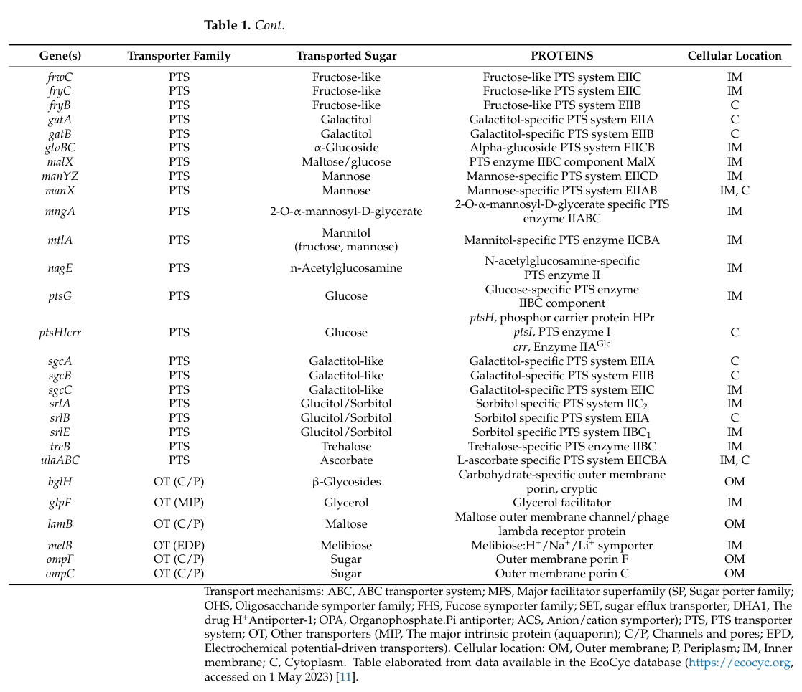

## Question

# Gene Research for Functional Annotation

## ⚠️ CRITICAL: Gene/Protein Identification Context

**BEFORE YOU BEGIN RESEARCH:** You MUST verify you are researching the CORRECT gene/protein. Gene symbols can be ambiguous, especially for less well-characterized genes from non-model organisms.

### Target Gene/Protein Identity (from UniProt):
- **UniProt Accession:** P69805
- **Protein Description:** RecName: Full=PTS system mannose-specific EIID component {ECO:0000303|PubMed:2999119}; AltName: Full=EII-M-Man {ECO:0000303|PubMed:2951378}; AltName: Full=EIID-Man {ECO:0000303|PubMed:2999119}; AltName: Full=Mannose permease IID component {ECO:0000303|PubMed:2999119};
- **Gene Information:** Name=manZ; Synonyms=gptB, ptsM; OrderedLocusNames=b1819, JW1808;
- **Organism (full):** Escherichia coli (strain K12).
- **Protein Family:** Not specified in UniProt
- **Key Domains:** GatZ_KbaZ_carbometab. (IPR050303); PTS_IID_man. (IPR004704); EIID-AGA (PF03613)

### MANDATORY VERIFICATION STEPS:

1. **Check if the gene symbol "manZ" matches the protein description above**
2. **Verify the organism is correct:** Escherichia coli (strain K12).
3. **Check if protein family/domains align with what you find in literature**
4. **If you find literature for a DIFFERENT gene with the same or similar symbol, STOP**

### If Gene Symbol is Ambiguous or You Cannot Find Relevant Literature:

**DO NOT PROCEED WITH RESEARCH ON A DIFFERENT GENE.** Instead:
- State clearly: "The gene symbol 'manZ' is ambiguous or literature is limited for this specific protein"
- Explain what you found (e.g., "Found extensive literature on a different gene with the same symbol in a different organism")
- Describe the protein based ONLY on the UniProt information provided above
- Suggest that the protein function can be inferred from domain/family information

### Research Target:

Please provide a comprehensive research report on the gene **manZ** (gene ID: manZ, UniProt: P69805) in ECOLI.

The research report should be a detailed narrative explaining the function, biological processes, and localization of the gene product. Citations should be given for all claims.

You should prioritize authoritative reviews and primary scientific literature when conducting research. You can supplement
this with annotations you find in gene/protein databases, but these can be outdated or inaccurate.

We are specifically interested in the primary function of the gene - for enzymes, what reaction is catalyzed, and what is the substrate specificity? For transporters, what is the substrate? For structural proteins or adapters, what is the broader structural role? For signaling molecules, what is the role in the pathway.

We are interested in where in or outside the cell the gene product carries out its function.

We are also interested in the signaling or biochemical pathways in which the gene functions. We are less interested in broad pleiotropic effects, except where these elucidate the precise role.

Include evidence where possible. We are interested in both experimental evidence as well as inference from structure, evolution, or bioinformatic analysis. Precise studies should be prioritized over high-throughput, where available.

## Output

Question: You are an expert researcher providing comprehensive, well-cited information.

Provide detailed information focusing on:
1. Key concepts and definitions with current understanding
2. Recent developments and latest research (prioritize 2023-2024 sources)
3. Current applications and real-world implementations
4. Expert opinions and analysis from authoritative sources
5. Relevant statistics and data from recent studies

Format as a comprehensive research report with proper citations. Include URLs and publication dates where available.
Always prioritize recent, authoritative sources and provide specific citations for all major claims.

# Gene Research for Functional Annotation

## ⚠️ CRITICAL: Gene/Protein Identification Context

**BEFORE YOU BEGIN RESEARCH:** You MUST verify you are researching the CORRECT gene/protein. Gene symbols can be ambiguous, especially for less well-characterized genes from non-model organisms.

### Target Gene/Protein Identity (from UniProt):
- **UniProt Accession:** P69805
- **Protein Description:** RecName: Full=PTS system mannose-specific EIID component {ECO:0000303|PubMed:2999119}; AltName: Full=EII-M-Man {ECO:0000303|PubMed:2951378}; AltName: Full=EIID-Man {ECO:0000303|PubMed:2999119}; AltName: Full=Mannose permease IID component {ECO:0000303|PubMed:2999119};
- **Gene Information:** Name=manZ; Synonyms=gptB, ptsM; OrderedLocusNames=b1819, JW1808;
- **Organism (full):** Escherichia coli (strain K12).
- **Protein Family:** Not specified in UniProt
- **Key Domains:** GatZ_KbaZ_carbometab. (IPR050303); PTS_IID_man. (IPR004704); EIID-AGA (PF03613)

### MANDATORY VERIFICATION STEPS:

1. **Check if the gene symbol "manZ" matches the protein description above**
2. **Verify the organism is correct:** Escherichia coli (strain K12).
3. **Check if protein family/domains align with what you find in literature**
4. **If you find literature for a DIFFERENT gene with the same or similar symbol, STOP**

### If Gene Symbol is Ambiguous or You Cannot Find Relevant Literature:

**DO NOT PROCEED WITH RESEARCH ON A DIFFERENT GENE.** Instead:
- State clearly: "The gene symbol 'manZ' is ambiguous or literature is limited for this specific protein"
- Explain what you found (e.g., "Found extensive literature on a different gene with the same symbol in a different organism")
- Describe the protein based ONLY on the UniProt information provided above
- Suggest that the protein function can be inferred from domain/family information

### Research Target:

Please provide a comprehensive research report on the gene **manZ** (gene ID: manZ, UniProt: P69805) in ECOLI.

The research report should be a detailed narrative explaining the function, biological processes, and localization of the gene product. Citations should be given for all claims.

You should prioritize authoritative reviews and primary scientific literature when conducting research. You can supplement
this with annotations you find in gene/protein databases, but these can be outdated or inaccurate.

We are specifically interested in the primary function of the gene - for enzymes, what reaction is catalyzed, and what is the substrate specificity? For transporters, what is the substrate? For structural proteins or adapters, what is the broader structural role? For signaling molecules, what is the role in the pathway.

We are interested in where in or outside the cell the gene product carries out its function.

We are also interested in the signaling or biochemical pathways in which the gene functions. We are less interested in broad pleiotropic effects, except where these elucidate the precise role.

Include evidence where possible. We are interested in both experimental evidence as well as inference from structure, evolution, or bioinformatic analysis. Precise studies should be prioritized over high-throughput, where available.

## Research Report: Functional Annotation of **manZ** (UniProt **P69805**) in *Escherichia coli* K-12

### 1) Target verification (critical identity/context)
The target protein is **ManZ** from *Escherichia coli* strain K-12, annotated as the **mannose-family PTS enzyme II-D (EIID) component** within the **manXYZ (ptsM)** locus. Classic genetic and biochemical work on the *E. coli* mannose PTS describes the transporter as a **three-subunit enzyme II complex** (IIAB, IIC, IID) encoded by **manX, manY, manZ**, respectively, and links older nomenclature (e.g., **ptsM**, **pel**) to the same locus involved in mannose PTS function and **phage λ DNA penetration** phenotypes. (esquinasrychen2001…ofbacteriophage pages 2-3, feng2026rapidgrowthphenotype pages 22-24, esquinasrychen2001facilitationofbacteriophage pages 2-3)

### 2) Key concepts and definitions (current understanding)

#### The bacterial PTS and the “mannose family” enzyme II complexes
The **phosphoenolpyruvate (PEP):carbohydrate phosphotransferase system (PTS)** couples **sugar transport** across the inner membrane to **phosphorylation** of the imported sugar, using PEP as the phosphate donor via the general proteins EI and HPr plus sugar-specific **enzyme II** complexes. In *E. coli*, the mannose-family enzyme II (**EIIMan**, encoded by **manXYZ**) is notable for its **broad substrate scope** and for including an additional membrane subunit, **EIID (ManZ)**, described as “unusual” among PTS EIIs. (mayer2005hexosepentoseandhexitolpentitol pages 4-5, huber1996membranetopologyof pages 1-2)

#### ManXYZ complex composition and roles
EcoSal Plus and primary studies describe the **ManXYZ** system as:
- **ManX (EIIABMan)**: cytoplasmic phosphotransferase subunit carrying PTS phosphorylation reactions; EcoSal Plus reports phosphotransfer via **His-10 (IIA)** → **His-175 (IIB)** → sugar **6′-OH**. (mayer2005hexosepentoseandhexitolpentitol pages 4-5)
- **ManY (EIICMan)** and **ManZ (EIIDMan)**: inner-membrane components forming a tight complex; the **IIC/IID subcomplex** is sufficient for **phage DNA penetration** across the inner membrane. (huber1996membranetopologyof pages 1-2, esquinasrychen2001facilitationofbacteriophage pages 2-3)

A concise evidence-based component summary is provided in the table below.

| Component/gene | PTS subunit/domain name | Localization/topology | Substrate scope | Additional roles | Key supporting citations with years/DOIs/URLs |
|---|---|---|---|---|---|
| **manX** | **EIIAB\_Man** (cytoplasmic phosphotransferase component) | Cytoplasmic/hydrophilic subunit; carries the phosphorylation sites used in PTS transfer to incoming sugar; identified as the cytoplasmic component of ManXYZ (esquinasrychen2001facilitationofbacteriophage pages 2-3, rice2011thesmallrna pages 9-10) | Mannose; also contributes to uptake/phosphorylation of glucose and glucose analogs via the mannose-family PTS, including α-methylglucoside and 2-deoxyglucose (huber1996membranetopologyof pages 1-2, rice2011thesmallrna pages 9-10, carreonrodriguez2023glucosetransportin pages 5-7) | Not the membrane pore itself; phage λ penetration role is assigned mainly to the ManY/ManZ membrane subcomplex rather than ManX (esquinasrychen2001facilitationofbacteriophage pages 2-3) | Huber & Erni 1996, *Eur J Biochem* 239:810-817, doi:10.1111/j.1432-1033.1996.0810u.x, https://doi.org/10.1111/j.1432-1033.1996.0810u.x (huber1996membranetopologyof pages 1-2); Rice & Vanderpool 2011, *Nucleic Acids Res* 39:3806-3819, doi:10.1093/nar/gkq1219, https://doi.org/10.1093/nar/gkq1219 (rice2011thesmallrna pages 9-10) |
| **manY** | **EIIC\_Man** | Inner-membrane subunit; predicted to span the membrane **6 times**; both termini cytoplasmic in the topology model; forms a tight transmembrane complex with ManZ (huber1996membranetopologyof pages 1-2, esquinasrychen2001facilitationofbacteriophage pages 2-3) | Broad mannose-family PTS specificity: mannose plus glucose/related hexoses; EIIMan also supports transport of glucose and analogs in *E. coli* physiology/reviews (huber1996membranetopologyof pages 1-2, rice2011thesmallrna pages 9-10, carreonrodriguez2023glucosetransportin pages 5-7, carreonrodriguez2023glucosetransportin media ee8bd676) | Together with ManZ, forms the membrane subcomplex sufficient for **bacteriophage λ DNA penetration** across the inner membrane (huber1996membranetopologyof pages 1-2, esquinasrychen2001facilitationofbacteriophage pages 2-3) | Huber & Erni 1996, doi:10.1111/j.1432-1033.1996.0810u.x, https://doi.org/10.1111/j.1432-1033.1996.0810u.x (huber1996membranetopologyof pages 1-2); Esquinas-Rychen & Erni 2001, inner-membrane facilitation of λ DNA injection (URL/DOI not available in context) (esquinasrychen2001facilitationofbacteriophage pages 2-3) |
| **manZ** | **EIID\_Man / IID-Man / EII-D** | Inner-membrane subunit of the ManXYZ complex; topology studies describe ManZ/IID as membrane-anchored by a **single C-terminal TM helix** with ~250 aa projecting into the cytoplasm; older evidence also describes IID as a membrane protein with **1 TM span** that complexes with ManY (huber1996membranetopologyof pages 1-2, esquinasrychen2001facilitationofbacteriophage pages 2-3) | Part of the mannose-family PTS for coupled transport/phosphorylation of mannose and other related hexoses; through ManXYZ/EIIMan, also supports uptake of glucose and glucose analogs such as α-methylglucoside and 2-deoxyglucose (huber1996membranetopologyof pages 1-2, rice2011thesmallrna pages 9-10, carreonrodriguez2023glucosetransportin pages 5-7, carreonrodriguez2023glucosetransportin media ee8bd676) | **Primary additional role:** with ManY, constitutes the inner-membrane complex required/sufficient for **phage λ DNA injection**; the manXYZ locus is also linked to older **ptsM/pel** nomenclature for λ penetration phenotypes (esquinasrychen2001…ofbacteriophage pages 2-3, huber1996membranetopologyof pages 1-2, esquinasrychen2001facilitationofbacteriophage pages 2-3) | Huber & Erni 1996, *Eur J Biochem* 239:810-817, doi:10.1111/j.1432-1033.1996.0810u.x, https://doi.org/10.1111/j.1432-1033.1996.0810u.x (huber1996membranetopologyof pages 1-2); Esquinas-Rychen & Erni 2001, λ DNA injection study (URL/DOI not available in context) (esquinasrychen2001…ofbacteriophage pages 2-3, esquinasrychen2001facilitationofbacteriophage pages 2-3) |

*Table: This table summarizes the E. coli K-12 mannose-family PTS components with emphasis on ManZ (EIID-Man), including subunit assignment, membrane topology, substrate scope, and the additional role of the ManY/ManZ complex in phage λ DNA injection. It is useful as a concise evidence-backed annotation aid for functional and localization interpretation.*

### 3) Primary function of ManZ (what it does)

#### 3.1 Transport and substrate specificity
The ManXYZ (EIIMan) system is best characterized as a **broad-specificity PTS transporter**. It transports mannose as its principal substrate, but multiple sources emphasize it can also transport and/or phosphorylate additional hexoses and amino-sugars.

**Substrate scope (reported):**
- EcoSal Plus summarizes that ManXYZ transports **mannose** and is “relatively promiscuous,” transporting **glucose**, **2-deoxyglucose**, **N-acetylglucosamine**, **N-acetylmannosamine**, and **galactosamine**. (mayer2005hexosepentoseandhexitolpentitol pages 4-5)
- A detailed regulatory/functional study likewise states manXYZ can transport many sugars, including **glucose**, **mannose**, and the amino sugars **glucosamine** and **N-acetylglucosamine**, and also reports transport of **2-deoxyglucose**, **fructose**, and more. (plumbridge1998controlofthe pages 1-2)
- Under glucose–phosphate stress conditions, EIIMan mediates uptake of glucose analogs **α-methylglucoside** and **2-deoxyglucose**, with **2-deoxyglucose** being converted to **2-deoxyglucose-6-phosphate** after transport by PTS. (rice2011thesmallrna pages 9-10)

**Quantitative kinetic/affinity information:**
- A 2023 review focusing on *E. coli* glucose transport states that the **mannose PTS** shows **relatively high affinity for glucose (Km ≈ 15 µM)** and notes that E. coli encodes **15 distinct EII PTS complexes**. (carreonrodriguez2023glucosetransportin pages 5-7)
- Biochemical steady-state kinetic and inhibition studies of the EIIMan permease support a **two-site model** for kinetics and report fitted kinetic parameters for glucose and mannose; for example (from global fits) glucose parameters include **KS1 ~19 µM**, **k1 ~8.3 s−1**, and a second site **KS2 ~210 µM**, **k2 ~20 s−1**, alongside inhibition constants for a glucose analog inhibitor. (garciaalles2002sugarrecognitionby pages 7-8)

Together, these sources support that ManZ’s primary biological role is as part of a **PTS permease complex** whose functional output is **inner-membrane import of mannose-family substrates coupled to phosphorylation**, supporting growth on these sugars and contributing to global carbon uptake under varying conditions. (huber1996membranetopologyof pages 1-2, mayer2005hexosepentoseandhexitolpentitol pages 4-5)

#### 3.2 Mechanistic role of ManZ within the transporter
ManZ is the **EIID** subunit that partners with ManY (EIIC) to form the membrane translocation module. Foundational work describes the PTS chemical steps (phosphate transfer through ManX domains to the sugar at the membrane-embedded IIC module), while positioning ManZ as a critical membrane component that is not a classic phosphoryl-transfer domain but is required for transport and forms part of the **pore/translocation** apparatus. (huber1996membranetopologyof pages 1-2, mayer2005hexosepentoseandhexitolpentitol pages 4-5)

### 4) Subcellular localization and membrane topology
ManZ is an **inner (cytoplasmic) membrane** protein in the ManXYZ complex.

Key topology findings:
- Early mechanistic studies describe the two membrane proteins IICMan and IIDMan as spanning the membrane **six times** and **one time**, respectively. (esquinasrychen2001facilitationofbacteriophage pages 2-3)
- A membrane-topology mapping study using PhoA/LacZ fusions concludes that IID (ManZ) is **anchored by a single C-terminal transmembrane helix**, with the majority of the protein (**~250 residues**) projecting into the **cytoplasm**; IIC (ManY) is multi-pass and forms a tight complex with IID. (huber1996membranetopologyof pages 1-2)

This topology is consistent with ManZ serving as a cytoplasm-facing scaffold/regulator of the translocation module and interacting with other PTS domains, while still being membrane anchored. (huber1996membranetopologyof pages 1-2)

### 5) Pathways and regulation

#### 5.1 Operon-level regulation: cAMP–CAP and Mlc
A detailed study of manXYZ expression reports:
- The **manXYZ operon** encodes a broad-specificity PTS sugar transporter. (plumbridge1998controlofthe pages 1-2)
- **Transcription of manX** is **strongly dependent on cAMP/CAP**, with a cAMP/CAP binding site located at **−40.5**, consistent with a **class II promoter**. (plumbridge1998controlofthe pages 1-2)
- **Mlc** functions as a key **negative regulator**: an **mlc mutant causes ~threefold derepression of manX expression**, while NagC mutation has little effect in that context; Mlc binds operator sites upstream of manX and overproduction of Mlc strongly represses manX. (plumbridge1998controlofthe pages 1-2)

EcoSal Plus further frames regulation as controlled by **cAMP/CAP** and mediated by **Mlc**, linking manXYZ expression to glucose transport physiology. (mayer2005hexosepentoseandhexitolpentitol pages 4-5)

#### 5.2 Post-transcriptional control: SgrS (glucose–phosphate stress)
During glucose–phosphate stress, the small RNA **SgrS** controls sugar-phosphate accumulation by regulating multiple PTS genes, including **manXYZ**. It **base pairs within the manX coding region** to inhibit translation (primarily translational repression rather than RNase E degradosome-dependent degradation). (rice2011thesmallrna pages 9-10)

#### 5.3 Global carbon regulation: Cra
A 2024 review of the global transcription factor **Cra** lists **manXYZ** as a Cra-regulated target (repressed), and includes **manZ** in its Cra-related metabolic regulatory network figure content, consistent with the integration of PTS uptake with central carbon flux regulation. (huang2024insightsintothe pages 5-6, huang2024insightsintothe pages 6-8)

### 6) Recent developments (prioritizing 2023–2024): roles beyond metabolism

#### 6.1 ManZ/ManXYZ as a key determinant of phage susceptibility and resistance evolution
Modern evolutionary studies relevant to phage therapy repeatedly observe that bacteria can evolve resistance through changes in the inner-membrane step of phage entry, including **manXYZ**.

In a 2023 study comparing phage cocktails vs generalist phages:
- A two-phage cocktail and an untrained dual-receptor generalist suppressed *E. coli* similarly for about **~2 days**, but bacteria evolved resistance to the cocktail **within 1 day**, frequently via **manXYZ** mutations. (borin2023comparisonofbacterial pages 1-2, borin2023comparisonofbacterial pages 8-9)
- A “trained” generalist (coevolved for 28 days) remained significantly more suppressive for **15 days** and drove bacterial extinction in **3/5** flasks; importantly, manXYZ mutations were ineffective against the trained generalist (partial resistance only; higher EOP on trained phage than on specialist phages). (borin2023comparisonofbacterial pages 1-2, borin2023comparisonofbacterial pages 6-8)
- Experimental validation with ΔmanY and ΔmanZ knockouts showed extreme reductions in plaquing efficiency (EOP reported as **0.05–3×10−5** against specialist/early generalist phages), while the trained generalist retained substantially higher infectivity (EOP **~0.25**), supporting that loss-of-function in ManY/ManZ can block λ-like entry and that phage adaptation can circumvent it. (borin2023comparisonofbacterial pages 6-8)

These findings put the ManY/ManZ inner-membrane module (including ManZ) at the center of a practical, contemporary question: how to design phage treatments that are robust to rapid resistance routes that exploit intracellular steps of phage infection. (borin2023comparisonofbacterial pages 8-9, borin2023comparisonofbacterial pages 6-8)

#### 6.2 Prophage-encoded regulators can modulate ManXYZ function
A 2023 Journal of Bacteriology study on cryptic prophage regulation reports that Qin prophage-encoded **DicB** and **DicF** can inhibit mannose transport and protect against phages that require ManXYZ:
- DicF inhibits translation of manXYZ and other host mRNAs. (ragunathan2023mechanismsofregulation pages 11-14, ragunathan2023mechanismsofregulation pages 1-2)
- DicB, via a **DicB–MinC** complex, inhibits ManXYZ transporter function and thereby blocks mannose transport and infection by phages that require ManXYZ. (ragunathan2023mechanismsofregulation pages 11-14)
- dicBF expression is controlled by layered regulatory mechanisms (DicA repression, Rem antirepression, stress-dependent induction, RNase processing), illustrating how horizontally acquired regulatory elements can tune core transport functions and susceptibility to phage attack. (ragunathan2023mechanismsofregulation pages 11-14, ragunathan2023mechanismsofregulation pages 2-5)

### 7) Current applications and real-world implementations

#### 7.1 Transport engineering and industrial strain design
A 2023 review emphasizes that optimizing substrate uptake is central to improving *E. coli* as a production chassis and highlights PTS transport as a major engineering target. Within that landscape, the mannose-family PTS contributes alternative glucose uptake and affects carbon flux; quantitative parameters such as **Km ~15 µM for glucose** in the mannose PTS contextualize its potential contribution when primary glucose uptake routes are perturbed. (carreonrodriguez2023glucosetransportin pages 5-7)

The same review provides schematic depictions of PTS architecture, including the role of **EIIMan** as an alternative glucose transport route and its placement within carbon catabolite regulation frameworks. These figures are useful for practical pathway engineering and for interpreting strain phenotypes during PTS rewiring. (carreonrodriguez2023glucosetransportin media ee8bd676, carreonrodriguez2023glucosetransportin media ca068e8e, carreonrodriguez2023glucosetransportin media 17c41e10)

#### 7.2 Phage therapy strategy and resistance management
The 2023 phage-evolution study demonstrates a concrete design constraint in phage therapy: targeting multiple outer-membrane receptors (cocktails) can still fail quickly if bacteria access rapid resistance routes in **inner-membrane injection machinery** (manXYZ), whereas phages coevolved or “trained” to overcome manXYZ resistance can extend suppression and drive extinction. (borin2023comparisonofbacterial pages 8-9, borin2023comparisonofbacterial pages 6-8)

### 8) Expert synthesis / authoritative analysis
EcoSal Plus (2005) provides an expert synthesis emphasizing that the **EIIDMan (ManZ)** component is “unusual” and required not only for mannose transport but also for **uptake/penetration of phage λ DNA**, strongly implying a specialized role in the membrane translocation apparatus beyond canonical PTS phosphorylation logic. (mayer2005hexosepentoseandhexitolpentitol pages 4-5)

Similarly, topology and λ-injection studies converge on the idea that the **ManY–ManZ membrane module** is sufficient to enable λ DNA penetration across the inner membrane, reinforcing a pore-like function for the complex (and thus for ManZ’s contribution). (huber1996membranetopologyof pages 1-2, esquinasrychen2001facilitationofbacteriophage pages 2-3)

### 9) Relevant recent statistics and data points (selected)
- *E. coli* encodes **15 distinct EII PTS complexes** (2023 review). (carreonrodriguez2023glucosetransportin pages 5-7)
- Mannose PTS glucose affinity: **Km ~15 µM** (2023 review). (carreonrodriguez2023glucosetransportin pages 5-7)
- **mlc** mutation causes **~3-fold derepression** of manX expression (1998 primary). (plumbridge1998controlofthe pages 1-2)
- Phage suppression/resistance timelines (2023 primary): resistance to a cocktail **in 1 day**; trained generalist suppresses for **15 days** and causes extinction in **3/5** flasks; high resistance to trained generalist takes **>10 days**. (borin2023comparisonofbacterial pages 8-9, borin2023comparisonofbacterial pages 6-8)
- Membrane topology: IIC spans **~6 TMs**; IID (ManZ) has **one C-terminal TM anchor** with **~250 cytosolic residues**. (huber1996membranetopologyof pages 1-2, esquinasrychen2001facilitationofbacteriophage pages 2-3)

### 10) Visual evidence (2023–style schematic support)
The following extracted visuals from the 2023 glucose transport review provide schematic and tabular evidence showing where **EIIMan/ManXYZ** fits into *E. coli* glucose/PTS uptake and regulation networks, and listing manX/manYZ components and localization. (carreonrodriguez2023glucosetransportin media ee8bd676, carreonrodriguez2023glucosetransportin media ca068e8e, carreonrodriguez2023glucosetransportin media 17c41e10)

---

## Key sources (URLs and publication dates)
- Carreón-Rodríguez OE et al. **Jun 2023**. *Microorganisms*. “Glucose Transport in *Escherichia coli*: From Basics to Transport Engineering.” https://doi.org/10.3390/microorganisms11061588 (carreonrodriguez2023glucosetransportin pages 5-7)
- Borin JM et al. **Dec 2023**. *Evolutionary Applications*. “Comparison of bacterial suppression by phage cocktails, dual-receptor generalists, and coevolutionarily trained phages.” https://doi.org/10.1111/eva.13518 (borin2023comparisonofbacterial pages 1-2)
- Ragunathan PT et al. **Aug 2023**. *Journal of Bacteriology*. “Mechanisms of Regulation of Cryptic Prophage-Encoded Gene Products in *Escherichia coli*.” https://doi.org/10.1128/jb.00129-23 (ragunathan2023mechanismsofregulation pages 11-14)
- Huang Y et al. **Nov 2024**. *Applied and Environmental Microbiology*. “Insights into the regulatory mechanisms and application prospects of the transcription factor Cra.” https://doi.org/10.1128/aem.01228-24 (huang2024insightsintothe pages 5-6)
- Plumbridge J. **Feb 1998**. *Molecular Microbiology*. “Control of the expression of the manXYZ operon in *E. coli*: Mlc is a negative regulator of the mannose PTS.” https://doi.org/10.1046/j.1365-2958.1998.00685.x (plumbridge1998controlofthe pages 1-2)
- Huber F, Erni B. **Aug 1996**. *European Journal of Biochemistry*. “Membrane topology of the mannose transporter of *E. coli* K12.” https://doi.org/10.1111/j.1432-1033.1996.0810u.x (huber1996membranetopologyof pages 1-2)
- García-Alles LF et al. **Aug 2002**. *Biochemistry*. “Sugar recognition by the glucose and mannose permeases of *E. coli*.” https://doi.org/10.1021/bi025928d (garciaalles2002sugarrecognitionby pages 7-8)
- Mayer C, Boos W. **Mar 2005**. *EcoSal Plus*. “Hexose/Pentose and Hexitol/Pentitol Metabolism.” https://doi.org/10.1128/ecosalplus.3.4.1 (mayer2005hexosepentoseandhexitolpentitol pages 4-5)

References

1. (esquinasrychen2001…ofbacteriophage pages 2-3): M Esquinas-Rychen and B Erni. … of bacteriophage lambda dna injection by inner membrane proteins of the bacterial phosphoenolpyruvate: carbohydrate phosphotransferase system (pts). Unknown journal, 2001.

2. (feng2026rapidgrowthphenotype pages 22-24): Junlin Feng, Chunqing Bai, Yingnan Deng, Rong Fu, Xinliang Yan, Mufa Cai, and Jun Liu. Rapid growth phenotype of carbapenem-resistant enterobacter cloacae: growth fitness, stability, and mechanistic insights. BMC Genomics, Feb 2026. URL: https://doi.org/10.1186/s12864-026-12633-x, doi:10.1186/s12864-026-12633-x. This article has 0 citations and is from a peer-reviewed journal.

3. (esquinasrychen2001facilitationofbacteriophage pages 2-3): M Esquinas-Rychen and B Erni. Facilitation of bacteriophage lambda dna injection by inner membrane proteins of the bacterial phosphoenolpyruvate: carbohydrate phosphotransferase …. Unknown journal, 2001.

4. (mayer2005hexosepentoseandhexitolpentitol pages 4-5): C. Mayer and W. Boos. Hexose/pentose and hexitol/pentitol metabolism. EcoSal Plus, Mar 2005. URL: https://doi.org/10.1128/ecosalplus.3.4.1, doi:10.1128/ecosalplus.3.4.1. This article has 51 citations.

5. (huber1996membranetopologyof pages 1-2): François Huber and Bernhard Erni. Membrane topology of the mannose transporter of escherichia coli k12. European journal of biochemistry, 239 3:810-7, Aug 1996. URL: https://doi.org/10.1111/j.1432-1033.1996.0810u.x, doi:10.1111/j.1432-1033.1996.0810u.x. This article has 53 citations.

6. (rice2011thesmallrna pages 9-10): Jennifer B. Rice and Carin K. Vanderpool. The small rna sgrs controls sugar–phosphate accumulation by regulating multiple pts genes. Nucleic Acids Research, 39:3806-3819, Jan 2011. URL: https://doi.org/10.1093/nar/gkq1219, doi:10.1093/nar/gkq1219. This article has 183 citations and is from a highest quality peer-reviewed journal.

7. (carreonrodriguez2023glucosetransportin pages 5-7): Ofelia E. Carreón-Rodríguez, Guillermo Gosset, Adelfo Escalante, and Francisco Bolívar. Glucose transport in escherichia coli: from basics to transport engineering. Microorganisms, 11:1588, Jun 2023. URL: https://doi.org/10.3390/microorganisms11061588, doi:10.3390/microorganisms11061588. This article has 76 citations.

8. (carreonrodriguez2023glucosetransportin media ee8bd676): Ofelia E. Carreón-Rodríguez, Guillermo Gosset, Adelfo Escalante, and Francisco Bolívar. Glucose transport in escherichia coli: from basics to transport engineering. Microorganisms, 11:1588, Jun 2023. URL: https://doi.org/10.3390/microorganisms11061588, doi:10.3390/microorganisms11061588. This article has 76 citations.

9. (plumbridge1998controlofthe pages 1-2): Jacqueline Plumbridge. Control of the expression of the manxyz operon in escherichia coli: mlc is a negative regulator of the mannose pts. Molecular Microbiology, 27:369-380, Feb 1998. URL: https://doi.org/10.1046/j.1365-2958.1998.00685.x, doi:10.1046/j.1365-2958.1998.00685.x. This article has 162 citations and is from a domain leading peer-reviewed journal.

10. (garciaalles2002sugarrecognitionby pages 7-8): Luis F. García-Alles, Alain Zahn, and Bernhard Erni. Sugar recognition by the glucose and mannose permeases of escherichia coli. steady-state kinetics and inhibition studies. Biochemistry, 41 31:10077-86, Aug 2002. URL: https://doi.org/10.1021/bi025928d, doi:10.1021/bi025928d. This article has 56 citations and is from a peer-reviewed journal.

11. (huang2024insightsintothe pages 5-6): Ying Huang, Kai-Zhi Jia, Wei Zhao, and Li-Wen Zhu. Insights into the regulatory mechanisms and application prospects of the transcription factor cra. Applied and Environmental Microbiology, Nov 2024. URL: https://doi.org/10.1128/aem.01228-24, doi:10.1128/aem.01228-24. This article has 1 citations and is from a peer-reviewed journal.

12. (huang2024insightsintothe pages 6-8): Ying Huang, Kai-Zhi Jia, Wei Zhao, and Li-Wen Zhu. Insights into the regulatory mechanisms and application prospects of the transcription factor cra. Applied and Environmental Microbiology, Nov 2024. URL: https://doi.org/10.1128/aem.01228-24, doi:10.1128/aem.01228-24. This article has 1 citations and is from a peer-reviewed journal.

13. (borin2023comparisonofbacterial pages 1-2): Joshua M. Borin, Justin J. Lee, Krista R. Gerbino, and Justin R. Meyer. Comparison of bacterial suppression by phage cocktails, dual‐receptor generalists, and coevolutionarily trained phages. Dec 2023. URL: https://doi.org/10.1111/eva.13518, doi:10.1111/eva.13518. This article has 39 citations and is from a domain leading peer-reviewed journal.

14. (borin2023comparisonofbacterial pages 8-9): Joshua M. Borin, Justin J. Lee, Krista R. Gerbino, and Justin R. Meyer. Comparison of bacterial suppression by phage cocktails, dual‐receptor generalists, and coevolutionarily trained phages. Dec 2023. URL: https://doi.org/10.1111/eva.13518, doi:10.1111/eva.13518. This article has 39 citations and is from a domain leading peer-reviewed journal.

15. (borin2023comparisonofbacterial pages 6-8): Joshua M. Borin, Justin J. Lee, Krista R. Gerbino, and Justin R. Meyer. Comparison of bacterial suppression by phage cocktails, dual‐receptor generalists, and coevolutionarily trained phages. Dec 2023. URL: https://doi.org/10.1111/eva.13518, doi:10.1111/eva.13518. This article has 39 citations and is from a domain leading peer-reviewed journal.

16. (ragunathan2023mechanismsofregulation pages 11-14): Preethi T. Ragunathan, Evelyne Ng Kwan Lim, Xiangqian Ma, Eric Massé, and Carin K. Vanderpool. Mechanisms of regulation of cryptic prophage-encoded gene products in escherichia coli. Journal of Bacteriology, Aug 2023. URL: https://doi.org/10.1128/jb.00129-23, doi:10.1128/jb.00129-23. This article has 16 citations and is from a peer-reviewed journal.

17. (ragunathan2023mechanismsofregulation pages 1-2): Preethi T. Ragunathan, Evelyne Ng Kwan Lim, Xiangqian Ma, Eric Massé, and Carin K. Vanderpool. Mechanisms of regulation of cryptic prophage-encoded gene products in escherichia coli. Journal of Bacteriology, Aug 2023. URL: https://doi.org/10.1128/jb.00129-23, doi:10.1128/jb.00129-23. This article has 16 citations and is from a peer-reviewed journal.

18. (ragunathan2023mechanismsofregulation pages 2-5): Preethi T. Ragunathan, Evelyne Ng Kwan Lim, Xiangqian Ma, Eric Massé, and Carin K. Vanderpool. Mechanisms of regulation of cryptic prophage-encoded gene products in escherichia coli. Journal of Bacteriology, Aug 2023. URL: https://doi.org/10.1128/jb.00129-23, doi:10.1128/jb.00129-23. This article has 16 citations and is from a peer-reviewed journal.

19. (carreonrodriguez2023glucosetransportin media ca068e8e): Ofelia E. Carreón-Rodríguez, Guillermo Gosset, Adelfo Escalante, and Francisco Bolívar. Glucose transport in escherichia coli: from basics to transport engineering. Microorganisms, 11:1588, Jun 2023. URL: https://doi.org/10.3390/microorganisms11061588, doi:10.3390/microorganisms11061588. This article has 76 citations.

20. (carreonrodriguez2023glucosetransportin media 17c41e10): Ofelia E. Carreón-Rodríguez, Guillermo Gosset, Adelfo Escalante, and Francisco Bolívar. Glucose transport in escherichia coli: from basics to transport engineering. Microorganisms, 11:1588, Jun 2023. URL: https://doi.org/10.3390/microorganisms11061588, doi:10.3390/microorganisms11061588. This article has 76 citations.

## Artifacts

- [Edison artifact artifact-00](manZ-deep-research-falcon_artifacts/artifact-00.md)

## Citations

1. mayer2005hexosepentoseandhexitolpentitol pages 4-5
2. esquinasrychen2001facilitationofbacteriophage pages 2-3
3. huber1996membranetopologyof pages 1-2
4. rice2011thesmallrna pages 9-10
5. plumbridge1998controlofthe pages 1-2
6. carreonrodriguez2023glucosetransportin pages 5-7
7. garciaalles2002sugarrecognitionby pages 7-8
8. borin2023comparisonofbacterial pages 6-8
9. ragunathan2023mechanismsofregulation pages 11-14
10. borin2023comparisonofbacterial pages 1-2
11. huang2024insightsintothe pages 5-6
12. feng2026rapidgrowthphenotype pages 22-24
13. huang2024insightsintothe pages 6-8
14. borin2023comparisonofbacterial pages 8-9
15. ragunathan2023mechanismsofregulation pages 1-2
16. ragunathan2023mechanismsofregulation pages 2-5
17. https://doi.org/10.1111/j.1432-1033.1996.0810u.x
18. https://doi.org/10.1093/nar/gkq1219
19. https://doi.org/10.3390/microorganisms11061588
20. https://doi.org/10.1111/eva.13518
21. https://doi.org/10.1128/jb.00129-23
22. https://doi.org/10.1128/aem.01228-24
23. https://doi.org/10.1046/j.1365-2958.1998.00685.x
24. https://doi.org/10.1021/bi025928d
25. https://doi.org/10.1128/ecosalplus.3.4.1
26. https://doi.org/10.1186/s12864-026-12633-x,
27. https://doi.org/10.1128/ecosalplus.3.4.1,
28. https://doi.org/10.1111/j.1432-1033.1996.0810u.x,
29. https://doi.org/10.1093/nar/gkq1219,
30. https://doi.org/10.3390/microorganisms11061588,
31. https://doi.org/10.1046/j.1365-2958.1998.00685.x,
32. https://doi.org/10.1021/bi025928d,
33. https://doi.org/10.1128/aem.01228-24,
34. https://doi.org/10.1111/eva.13518,
35. https://doi.org/10.1128/jb.00129-23,