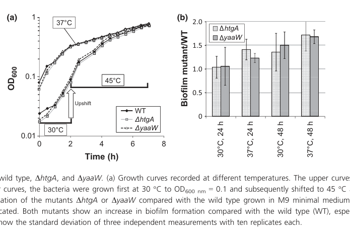

## Question

# Gene Research for Functional Annotation

## ⚠️ CRITICAL: Gene/Protein Identification Context

**BEFORE YOU BEGIN RESEARCH:** You MUST verify you are researching the CORRECT gene/protein. Gene symbols can be ambiguous, especially for less well-characterized genes from non-model organisms.

### Target Gene/Protein Identity (from UniProt):
- **UniProt Accession:** P28697
- **Protein Description:** RecName: Full=Uncharacterized protein MbiA {ECO:0000305}; AltName: Full=Modifier of biofilm {ECO:0000250|UniProtKB:Q8XA70};
- **Gene Information:** Name=mbiA {ECO:0000250|UniProtKB:Q8XA70}; Synonyms=htgA {ECO:0000303|PubMed:8400364}, htpY {ECO:0000303|PubMed:8478327}; OrderedLocusNames=b0012, JW5001;
- **Organism (full):** Escherichia coli (strain K12).
- **Protein Family:** Not specified in UniProt
- **Key Domains:** Not specified in UniProt

### MANDATORY VERIFICATION STEPS:

1. **Check if the gene symbol "mbiA" matches the protein description above**
2. **Verify the organism is correct:** Escherichia coli (strain K12).
3. **Check if protein family/domains align with what you find in literature**
4. **If you find literature for a DIFFERENT gene with the same or similar symbol, STOP**

### If Gene Symbol is Ambiguous or You Cannot Find Relevant Literature:

**DO NOT PROCEED WITH RESEARCH ON A DIFFERENT GENE.** Instead:
- State clearly: "The gene symbol 'mbiA' is ambiguous or literature is limited for this specific protein"
- Explain what you found (e.g., "Found extensive literature on a different gene with the same symbol in a different organism")
- Describe the protein based ONLY on the UniProt information provided above
- Suggest that the protein function can be inferred from domain/family information

### Research Target:

Please provide a comprehensive research report on the gene **mbiA** (gene ID: mbiA, UniProt: P28697) in ECOLI.

The research report should be a detailed narrative explaining the function, biological processes, and localization of the gene product. Citations should be given for all claims.

You should prioritize authoritative reviews and primary scientific literature when conducting research. You can supplement
this with annotations you find in gene/protein databases, but these can be outdated or inaccurate.

We are specifically interested in the primary function of the gene - for enzymes, what reaction is catalyzed, and what is the substrate specificity? For transporters, what is the substrate? For structural proteins or adapters, what is the broader structural role? For signaling molecules, what is the role in the pathway.

We are interested in where in or outside the cell the gene product carries out its function.

We are also interested in the signaling or biochemical pathways in which the gene functions. We are less interested in broad pleiotropic effects, except where these elucidate the precise role.

Include evidence where possible. We are interested in both experimental evidence as well as inference from structure, evolution, or bioinformatic analysis. Precise studies should be prioritized over high-throughput, where available.

## Output

Question: You are an expert researcher providing comprehensive, well-cited information.

Provide detailed information focusing on:
1. Key concepts and definitions with current understanding
2. Recent developments and latest research (prioritize 2023-2024 sources)
3. Current applications and real-world implementations
4. Expert opinions and analysis from authoritative sources
5. Relevant statistics and data from recent studies

Format as a comprehensive research report with proper citations. Include URLs and publication dates where available.
Always prioritize recent, authoritative sources and provide specific citations for all major claims.

# Gene Research for Functional Annotation

## ⚠️ CRITICAL: Gene/Protein Identification Context

**BEFORE YOU BEGIN RESEARCH:** You MUST verify you are researching the CORRECT gene/protein. Gene symbols can be ambiguous, especially for less well-characterized genes from non-model organisms.

### Target Gene/Protein Identity (from UniProt):
- **UniProt Accession:** P28697
- **Protein Description:** RecName: Full=Uncharacterized protein MbiA {ECO:0000305}; AltName: Full=Modifier of biofilm {ECO:0000250|UniProtKB:Q8XA70};
- **Gene Information:** Name=mbiA {ECO:0000250|UniProtKB:Q8XA70}; Synonyms=htgA {ECO:0000303|PubMed:8400364}, htpY {ECO:0000303|PubMed:8478327}; OrderedLocusNames=b0012, JW5001;
- **Organism (full):** Escherichia coli (strain K12).
- **Protein Family:** Not specified in UniProt
- **Key Domains:** Not specified in UniProt

### MANDATORY VERIFICATION STEPS:

1. **Check if the gene symbol "mbiA" matches the protein description above**
2. **Verify the organism is correct:** Escherichia coli (strain K12).
3. **Check if protein family/domains align with what you find in literature**
4. **If you find literature for a DIFFERENT gene with the same or similar symbol, STOP**

### If Gene Symbol is Ambiguous or You Cannot Find Relevant Literature:

**DO NOT PROCEED WITH RESEARCH ON A DIFFERENT GENE.** Instead:
- State clearly: "The gene symbol 'mbiA' is ambiguous or literature is limited for this specific protein"
- Explain what you found (e.g., "Found extensive literature on a different gene with the same symbol in a different organism")
- Describe the protein based ONLY on the UniProt information provided above
- Suggest that the protein function can be inferred from domain/family information

### Research Target:

Please provide a comprehensive research report on the gene **mbiA** (gene ID: mbiA, UniProt: P28697) in ECOLI.

The research report should be a detailed narrative explaining the function, biological processes, and localization of the gene product. Citations should be given for all claims.

You should prioritize authoritative reviews and primary scientific literature when conducting research. You can supplement
this with annotations you find in gene/protein databases, but these can be outdated or inaccurate.

We are specifically interested in the primary function of the gene - for enzymes, what reaction is catalyzed, and what is the substrate specificity? For transporters, what is the substrate? For structural proteins or adapters, what is the broader structural role? For signaling molecules, what is the role in the pathway.

We are interested in where in or outside the cell the gene product carries out its function.

We are also interested in the signaling or biochemical pathways in which the gene functions. We are less interested in broad pleiotropic effects, except where these elucidate the precise role.

Include evidence where possible. We are interested in both experimental evidence as well as inference from structure, evolution, or bioinformatic analysis. Precise studies should be prioritized over high-throughput, where available.

## Research report: Functional annotation of **mbiA / htgA / htpY** (UniProt **P28697**, E. coli K-12; locus **b0012/JW5001**)

### Executive summary
The UniProt entry P28697 corresponds to a small, poorly characterized E. coli K-12 protein historically annotated as **htgA** (“high-temperature growth”) and **htpY** (heat-shock gene), and later proposed to be renamed **mbiA** (“modifier of biofilm”). Two major, partially conflicting functional narratives exist in the primary literature: (i) **a σ32 (RpoH)-regulated heat-shock modulatory gene upstream of dnaK-dnaJ** (Missiakas et al., 1993), and (ii) **a young antisense overlapping gene fully embedded opposite yaaW whose loss increases biofilm formation and perturbs the metabolome**, with no detectable heat-shock growth phenotype in the tested background (Fellner et al., 2014). Across the retrieved sources, **no definitive biochemical reaction, substrate specificity, or subcellular localization** has been experimentally established for MbiA/HtgA/HtpY.

---

### 1) Key concepts and definitions (current understanding)

#### 1.1 What is “mbiA” in E. coli?
In the most direct phenotype-focused characterization, **htgA** is described as an **open reading frame completely embedded antisense within yaaW** and located **upstream of dnaK**; based on biofilm phenotypes the authors proposed renaming **htgA → mbiA (modifier of biofilm)**. (fellner2014phenotypeofhtga pages 1-2, fellner2014phenotypeofhtga pages 5-6, fellner2014phenotypeofhtga pages 3-5)

#### 1.2 Overlapping/antisense genes (why this locus is unusual)
The locus is an example of a **long antisense overlap** in bacteria (an ORF embedded on the opposite strand of another gene). Such overlaps complicate annotation, evolutionary inference, and genetic manipulation because mutations in one reading frame can affect the other. Fellner et al. minimized this by using **single-nucleotide substitutions that introduce a stop codon in one frame while remaining synonymous in the opposite frame**. (fellner2014phenotypeofhtga pages 3-5)

#### 1.3 Nomenclature ambiguity: htgA vs htpY vs mbiA
Missiakas et al. report that the gene previously called **htgA** maps upstream of dnaK and is **identical to htpY** based on clone/restriction mapping, and that it encodes a ~21 kDa product. (missiakas1993theescherichiacoli pages 10-11, missiakas1993theescherichiacoli pages 1-2) Fellner et al. later argue that the “heat shock gene” annotation is not supported by their growth/heat shift assays, and propose **mbiA** as a functionally descriptive name based on biofilm effects. (fellner2014phenotypeofhtga pages 3-5, fellner2014phenotypeofhtga pages 5-6)

---

### 2) Molecular identity, genomic context, and evolution

#### 2.1 Genomic context
Fellner et al. place the locus in a region where **htgA/mbiA is completely embedded antisense in yaaW** and is **upstream of dnaK**, a canonical heat-shock chaperone gene. (fellner2014phenotypeofhtga pages 1-2)

#### 2.2 Likely coding sequence length and start codon uncertainty
Fellner et al. note that the **annotated start codon is an uncommon CTG**, while a downstream **GTG** is “more likely” as the start; counting from GTG yields an ORF of **525 bp (~174 aa)**. (fellner2014phenotypeofhtga pages 3-5)

#### 2.3 Evolutionary distribution and selection
Fellner et al. report **yaaW homologs are widespread**, but a complete **htgA/mbiA frame is restricted to Escherichia and Shigella**, and in Salmonella it appears as a pseudogene disrupted at consistent positions; they infer **purifying selection** on htgA in at least **24 Escherichia/Shigella strains** (with low yaaW divergence, max **2.6%** AA-level). (fellner2014phenotypeofhtga pages 6-7, fellner2014phenotypeofhtga pages 5-6)

Interpretation: these observations are consistent with a **taxonomically restricted (“young orphan”) gene** that may mediate lineage-specific traits, consistent with its sparse mechanistic characterization. (fellner2014phenotypeofhtga pages 6-7, fellner2014phenotypeofhtga pages 1-2)

---

### 3) Experimental evidence for expression and regulation

#### 3.1 Promoter activity and transcription start sites (TSS)
Fellner et al. used promoter::gfp fusions and 5′-RACE to show transcriptional features on both strands in the EHEC strain EDL933: the major **htgA/mbiA TSS** was mapped **~135 bp upstream** of the annotated start (with prior reports/predictions at 82/98/114 bp), supporting that the locus is transcribed under at least some conditions. (fellner2014phenotypeofhtga pages 3-5)

#### 3.2 Heat-shock regulation narrative (1993): σ32-dependent promoters and modulation of the heat shock regulon
Missiakas et al. describe **htpY** as a **heat-inducible gene** whose transcription is reduced in **rpoH (σ32) null mutants**, and they report σ32-like promoter elements (two overlapping promoters). Functionally, htpY on a high-copy plasmid **elevates the heat-shock response**, increasing transcription from σ32-dependent promoters; conversely, htpY null mutants show reduced σ32-regulated heat-shock gene expression. (missiakas1993theescherichiacoli pages 9-10, missiakas1993theescherichiacoli pages 1-2)

This supports a model in which HtpY acts antagonistically to the DnaK/DnaJ/GrpE negative feedback loop controlling σ32 activity. (missiakas1993theescherichiacoli pages 9-10)

#### 3.3 Condition-responsive expression signals (microarray compendium)
Fellner et al. cite GENEXPDB/microarray evidence that **htgA** expression changes across conditions, including: **2.62-fold** higher in biofilm (15 h vs 4 h), **~4.7-fold** (MG1655) and **6.043-fold** (MDS42) induction with **100 µg bicyclomycin**, and **2.056-fold** after **UV irradiation (1 h)**. Importantly, they note that some databases treated **yaaW and htgA as synonyms despite divergent expression values**, which they argue is inappropriate. (fellner2014phenotypeofhtga pages 3-5)

**Ribosome profiling evidence (2023–2024 priority):** in the retrieved and inspected 2023 papers on overlapping genes/TSS in E. coli O157:H7, no MbiA-specific ribosome profiling results were extracted from the available text snippets in this session. Therefore, translation evidence here relies on older targeted experiments (below) rather than 2023–2024 datasets.

---

### 4) Protein production/detection and inferred properties

#### 4.1 Protein size (approximate)
Missiakas et al. report **htpY encodes a ~21,193 Da polypeptide** and note an approximately **21 kDa product** in expression systems. (missiakas1993theescherichiacoli pages 1-2, missiakas1993theescherichiacoli pages 9-10)

Fellner et al. reconcile this by noting that prior work reported a **~21 kDa gene product via 35S-labeling**, which they describe as more sensitive than their approach. (fellner2014phenotypeofhtga pages 3-5)

#### 4.2 Difficulty detecting MbiA/HtgA protein
Fellner et al. expressed tagged constructs and detected **YaaW (~30 kDa)** by Western blot, but **did not detect HtgA** under the same assay conditions, suggesting the protein might be unstable/low abundance or difficult to detect with that method. (fellner2014phenotypeofhtga pages 3-5, fellner2014phenotypeofhtga media b5b4dbb9)

#### 4.3 Subcellular localization
No direct experimental localization (e.g., fractionation, microscopy, signal peptide/export assays) was found in the retrieved sources. Consequently, localization remains **undetermined** based on this evidence set.

---

### 5) Phenotypes, biological processes, and pathways

#### 5.1 Biofilm modulation (primary reproducible phenotype in 2014 study)
Fellner et al. created strand-specific single-frame mutants (ΔhtgA and ΔyaaW) and observed that **both mutants showed increased biofilm formation**, especially after **48 h at 37°C** in minimal medium. This phenotype motivated the proposed rename **mbiA (modifier of biofilm)**. (fellner2014phenotypeofhtga pages 5-6, fellner2014phenotypeofhtga pages 3-5)

Visual evidence: the growth/biofilm phenotype comparison is shown in their Figure 4. (fellner2014phenotypeofhtga media 7515ed34)

#### 5.2 Growth and heat-shock phenotype (conflicting results across studies)
Fellner et al. report **no growth difference** between wild type and ΔhtgA/ΔyaaW at **37°C**, and no difference after a **30→45°C** temperature upshift, concluding that a heat-shock phenotype for ΔhtgA could not be confirmed and that htgA “should no longer be annotated as heat shock gene” in that context. (fellner2014phenotypeofhtga pages 3-5, fellner2014phenotypeofhtga pages 5-6)

By contrast, Missiakas et al. characterize htpY as a **heat-shock gene** in transcriptional terms (σ32-regulated promoters; heat inducibility) and as a **positive modulator** of σ32-dependent expression; they also report that **htpY is not essential for growth at 43°C in most strain backgrounds**, although a particular background (MC1000) had a temperature-sensitive phenotype only above ~43.5°C. (missiakas1993theescherichiacoli pages 9-10, missiakas1993theescherichiacoli pages 10-11)

Interpretation: the totality of evidence suggests that any “high temperature growth” effect is likely **conditional** (strain background and assay-dependent), while the most consistent phenotype from the later strand-specific mutant approach is **biofilm modulation**. (fellner2014phenotypeofhtga pages 5-6, missiakas1993theescherichiacoli pages 10-11)

#### 5.3 Metabolomics: quantitative biochemical readouts
Despite no detectable growth defect, Fellner et al. used untargeted ICR-FT/MS metabolomics and found **22 metabolites** significantly changed (**P ≤ 0.01**). Pairwise comparisons yielded **4** differences (ΔhtgA vs WT), **14** (ΔyaaW vs WT), and **4** (ΔhtgA vs ΔyaaW), and **all changed metabolites were decreased** relative to WT in both mutants. The affected metabolites were mainly associated with **fatty acid or amino acid metabolism**. (fellner2014phenotypeofhtga pages 5-6)

This provides quantitative evidence that perturbing either reading frame can influence cellular physiology even without a growth phenotype. (fellner2014phenotypeofhtga pages 5-6)

#### 5.4 Pathways and molecular mechanism (what is *not* known)
Across these sources, no enzymatic activity, binding partner, or defined signaling pathway is experimentally assigned to MbiA/HtpY. Fellner et al. explicitly state that functional explanations of metabolite changes are “highly speculative.” (fellner2014phenotypeofhtga pages 3-5)

---

### 6) Recent developments (prioritizing 2023–2024)
Within the literature retrieved in this run, **no 2023–2024 paper was found that adds direct, gene-specific mechanistic annotation for E. coli K-12 MbiA (P28697)** beyond its use as an example of overlapping/antisense genes in bacteria. The most direct functional and regulatory evidence remains concentrated in **1993** and **2014** primary studies. (missiakas1993theescherichiacoli pages 9-10, fellner2014phenotypeofhtga pages 3-5)

Nevertheless, the **research frontier** relevant to MbiA is the broader development of **ribosome profiling**, **high-resolution TSS mapping**, and **small/overlapping ORF discovery** approaches, which are increasingly applied to E. coli and related bacteria; these methods are well positioned to clarify whether and when MbiA is robustly translated and under what conditions. (glaub2020recommendationsforbacterial pages 16-18)

---

### 7) Current applications and real-world implementations

*Direct applications of MbiA itself* (e.g., as a validated drug target or engineered biofilm control module) were not identified in the retrieved sources. However, two practical implications emerge from the evidence:

1. **Biofilm-related phenotyping and strain engineering:** Because disrupting mbiA/htgA can increase biofilm formation in minimal medium after prolonged incubation, this locus may be relevant as a *context-specific modifier* in lab strain engineering where biofilm formation is a confounder (e.g., in continuous culture or surface-associated growth). (fellner2014phenotypeofhtga pages 5-6, fellner2014phenotypeofhtga media 7515ed34)

2. **Genome annotation and synthetic biology caution:** The locus illustrates the risk of missing functional proteins encoded antisense to annotated genes, impacting annotation pipelines and genetic designs (e.g., editing yaaW could inadvertently affect mbiA). (fellner2014phenotypeofhtga pages 3-5)

---

### 8) Expert opinions and authoritative analysis (as reflected in primary sources)

- Fellner et al. argue that **htgA should no longer be annotated as a heat shock gene** based on lack of heat-shift growth phenotype and instead propose **mbiA** to reflect the biofilm phenotype. (fellner2014phenotypeofhtga pages 3-5)
- Missiakas et al. provide a mechanistic regulatory interpretation positioning **htpY as a positive modulator of the σ32 heat-shock response**, antagonistic to DnaK/DnaJ/GrpE negative regulators. (missiakas1993theescherichiacoli pages 9-10)

A conservative synthesis is that this locus is best viewed as a **conditionally important regulator/modifier** rather than an essential core heat-shock gene or a characterized enzyme, and that its **overlapping-gene architecture** makes experimental dissection unusually challenging. (fellner2014phenotypeofhtga pages 3-5, missiakas1993theescherichiacoli pages 9-10)

---

### 9) Key statistics and data points (from recent/primary studies)
- **ORF size estimate:** 525 bp / ~174 aa (from GTG start hypothesis). (fellner2014phenotypeofhtga pages 3-5)
- **Biofilm phenotype:** increased biofilm in ΔhtgA and ΔyaaW, especially after **48 h at 37°C**. (fellner2014phenotypeofhtga pages 5-6, fellner2014phenotypeofhtga media 7515ed34)
- **Metabolomics:** 22 significantly changed metabolites (P ≤ 0.01); ΔhtgA vs WT=4; ΔyaaW vs WT=14; ΔhtgA vs ΔyaaW=4; all decreased vs WT in mutants. (fellner2014phenotypeofhtga pages 5-6)
- **Microarray fold-changes (htgA):** 2.62 (biofilm 15 h vs 4 h); 4.7 and 6.043 (bicyclomycin in MG1655 and MDS42); 2.056 (UV 1 h). (fellner2014phenotypeofhtga pages 3-5)
- **Evolutionary distribution:** purifying selection inferred in ≥24 Escherichia/Shigella strains; yaaW max 2.6% AA divergence in the cited comparison. (fellner2014phenotypeofhtga pages 6-7)

---

### Evidence map table
The following table summarizes the strongest claims, evidence types, and quantitative details available from this literature set:

| Finding/Claim | Evidence type | Key quantitative details | Conditions/strain | Interpretation/notes | Primary citation (include DOI/URL and year) |
|---|---|---|---|---|---|
| **mbiA/htgA is the same E. coli K-12/O157:H7 overlapping gene as UniProt P28697 (b0012), completely antisense to yaaW** | Genomic mapping, annotation review, promoter/TSS study | htgA/mbiA is described as completely embedded antisense within **yaaW** and located upstream of **dnaK**; later proposed rename to **mbiA** (“modifier of biofilm”) | E. coli O157:H7 EDL933 in the primary experimental paper; orthologous locus corresponds to K-12 b0012/P28697 | Supports correct target identification and warns against confusing htgA/mbiA with unrelated symbols in other organisms; overlapping architecture is central to interpretation of all mutant data (fellner2014phenotypeofhtga pages 1-2) | Fellner et al., 2014, *FEMS Microbiol Lett* 350:57-64, DOI: 10.1111/1574-6968.12288, https://doi.org/10.1111/1574-6968.12288 (fellner2014phenotypeofhtga pages 1-2) |
| **Likely start codon is GTG rather than annotated rare CTG; predicted size ~174 aa** | ORF analysis with strand-specific mutagenesis design | Annotated start codon is a rare **CTG**; authors state the next **GTG** is more likely; counting from GTG gives **525 bp / 174 aa** | E. coli O157:H7 EDL933 mutant design | Indicates protein is small and start-site assignment remains uncertain; this uncertainty may contribute to poor detection of HtgA/MbiA protein (fellner2014phenotypeofhtga pages 3-5) | Fellner et al., 2014, DOI: 10.1111/1574-6968.12288, https://doi.org/10.1111/1574-6968.12288 (fellner2014phenotypeofhtga pages 3-5) |
| **Both strands show transcription-related features, but yaaW and htgA are not expression synonyms** | Promoter::gfp fusion, 5′-RACE, terminator prediction, transcriptomics | htgA major TSS mapped **135 bp upstream**; prior reports/predictions placed sites **82/98/114 bp** upstream; yaaW major TSS mapped **32 bp upstream of yaaI**, with a minor site **107 bp upstream of yaaW**; htgA upstream region showed promoter activity; yaaI promoter active while yaaW-alone region resembled empty vector; no terminator directly downstream of htgA, terminator predicted downstream of dnaK | E. coli O157:H7 EDL933; reporter assays in LB and 5′-RACE under condition-specific growth setups | Suggests htgA is genuinely transcribed, albeit weakly/conditionally; also indicates yaaW may be within an operon and that database synonymization of htgA with yaaW is misleading (fellner2014phenotypeofhtga pages 3-5, fellner2014phenotypeofhtga pages 2-3, fellner2014phenotypeofhtga pages 1-2) | Fellner et al., 2014, DOI: 10.1111/1574-6968.12288, https://doi.org/10.1111/1574-6968.12288 (fellner2014phenotypeofhtga pages 3-5, fellner2014phenotypeofhtga pages 2-3, fellner2014phenotypeofhtga pages 1-2) |
| **YaaW protein was detected, but HtgA/MbiA protein was not detected in the same overexpression/Western setup** | Heterologous expression, Ni-NTA purification, anti-myc Western blot; comparison with prior radiolabeling study | **YaaW ~30 kDa** detected on Western blot; **no HtgA band** detected; earlier study reported a putative **~21 kDa** htgA product by **35S labeling**, described as more sensitive | Overexpression in EHEC/EDL933 with myc-His tag fusion | Strongly suggests HtgA/MbiA is hard to detect and may be unstable or low abundance; absence on Western blot does **not** rule out translation (fellner2014phenotypeofhtga pages 3-5, fellner2014phenotypeofhtga media b5b4dbb9) | Fellner et al., 2014, DOI: 10.1111/1574-6968.12288, https://doi.org/10.1111/1574-6968.12288; earlier study cited therein: Missiakas et al., 1993 (fellner2014phenotypeofhtga pages 3-5, fellner2014phenotypeofhtga media b5b4dbb9) |
| **No detectable growth or heat-shock phenotype in strand-specific single mutants** | Genetic mutant phenotype; growth curves | No growth difference at **37°C**; no difference after **30→45°C upshift**; prior heat-shock annotation could not be confirmed | E. coli O157:H7 EDL933 ΔhtgA and ΔyaaW single-gene stop mutants | The historical name **htgA** (“high-temperature growth”) is not supported by later targeted experiments; current best phenotype is biofilm modification, not heat tolerance (fellner2014phenotypeofhtga pages 3-5, fellner2014phenotypeofhtga pages 5-6, fellner2014phenotypeofhtga media 7515ed34) | Fellner et al., 2014, DOI: 10.1111/1574-6968.12288, https://doi.org/10.1111/1574-6968.12288 (fellner2014phenotypeofhtga pages 3-5, fellner2014phenotypeofhtga pages 5-6, fellner2014phenotypeofhtga media 7515ed34) |
| **Primary phenotype is increased biofilm formation when mbiA/htgA is disrupted** | Genetic mutant phenotype; crystal-violet biofilm assay | Both **ΔhtgA** and **ΔyaaW** showed increased biofilm, especially after **48 h at 37°C** in minimal medium; earlier K-12 work reported **~3-fold increase** for the **double htgA/yaaW mutant** after biofilm growth | EDL933 single mutants in M9 minimal medium; prior K-12 double mutant comparison cited by authors | This is the main experimentally supported functional clue and motivated renaming **htgA → mbiA (modifier of biofilm)**; however, the biochemical mechanism remains unresolved (fellner2014phenotypeofhtga pages 3-5, fellner2014phenotypeofhtga pages 5-6, fellner2014phenotypeofhtga media 7515ed34) | Fellner et al., 2014, DOI: 10.1111/1574-6968.12288, https://doi.org/10.1111/1574-6968.12288; cites Domka et al., 2007 for K-12 double mutant phenotype (fellner2014phenotypeofhtga pages 3-5, fellner2014phenotypeofhtga pages 5-6, fellner2014phenotypeofhtga media 7515ed34) |
| **Loss of mbiA/htgA alters the metabolome despite no growth defect** | Untargeted metabolomics (ICR-FT/MS) | **22 metabolites** significantly changed overall (**P ≤ 0.01**); comparisons: **ΔhtgA vs WT = 4**, **ΔyaaW vs WT = 14**, **ΔhtgA vs ΔyaaW = 4**; in both mutants, changed metabolites were **decreased** relative to WT; changes mainly linked to **fatty acid** or **amino acid metabolism** | EDL933 ΔhtgA, ΔyaaW, WT | Supports biological functionality of both overlapping reading frames; suggests influence on metabolism but not a defined enzymatic role/pathway (fellner2014phenotypeofhtga pages 5-6) | Fellner et al., 2014, DOI: 10.1111/1574-6968.12288, https://doi.org/10.1111/1574-6968.12288 (fellner2014phenotypeofhtga pages 5-6) |
| **mbiA/htgA is taxonomically restricted and likely under purifying selection in a subset of enteric lineages** | Comparative genomics and overlapping-gene evolutionary analysis | Full-length htgA found only in **Escherichia** and **Shigella**; in **Salmonella**, htgA is a **pseudogene** and disrupted at the same positions; yaaW divergence is low (**max 2.6% amino acid level** in cited comparison); htgA inferred under purifying selection in at least **24 strains** of Escherichia/Shigella | Comparative analysis across Enterobacterales/Gammaproteobacteria | Best viewed as a **young orphan/lineage-specific overlapping gene** rather than a conserved housekeeping protein; this also explains sparse annotation and limited literature (fellner2014phenotypeofhtga pages 6-7, fellner2014phenotypeofhtga pages 1-2) | Fellner et al., 2014, DOI: 10.1111/1574-6968.12288, https://doi.org/10.1111/1574-6968.12288 (fellner2014phenotypeofhtga pages 6-7, fellner2014phenotypeofhtga pages 1-2) |
| **Expression is condition responsive in transcriptome datasets, including biofilm-associated induction** | Microarray/database mining (GENEXPDB Table 1 excerpt) | Reported htgA fold changes include **2.62** in biofilm (**15 h vs 4 h**), **6.043** with **100 µg bicyclomycin** in strain **MDS42**, **4.7** with **100 µg bicyclomycin** in **MG1655**, and **2.056** after **1 h UV**; corresponding yaaW values were lower or opposite in some cases (e.g., **1.649** in biofilm, **0.567/0.442** with bicyclomycin) | Multiple E. coli strains/conditions compiled in GENEXPDB | Supports regulated expression and further argues htgA and yaaW should not be treated as synonyms; however, these are indirect expression data and not proof of protein function (fellner2014phenotypeofhtga pages 2-3, fellner2014phenotypeofhtga pages 3-5) | Fellner et al., 2014 Table 1 / GENEXPDB excerpt, DOI: 10.1111/1574-6968.12288, https://doi.org/10.1111/1574-6968.12288 (fellner2014phenotypeofhtga pages 2-3, fellner2014phenotypeofhtga pages 3-5) |
| **Recent understanding still emphasizes mbiA/htgA as a rare bacterial antisense overlapping gene with limited direct mechanistic characterization** | Review/commentary and methodological literature | Later literature cites htgA/mbiA as an example of a functional antisense overlapping gene; no new 2023-2024 direct mechanistic study on E. coli K-12 b0012 was found in this session | Reviews/methods papers on antisense proteins and ribosome profiling | Current evidence supports phenotype and evolutionary plausibility, but direct molecular function, localization, domains, and interaction partners remain unresolved; literature is limited and should not be extrapolated to unrelated genes with similar symbols (glaub2020recommendationsforbacterial pages 16-18) | Glaub et al., 2020, *J Biol Chem* 295:8999-9011, DOI: 10.1074/jbc.RA119.012161, https://doi.org/10.1074/jbc.RA119.012161; cites Fellner et al. 2014 as key case study (glaub2020recommendationsforbacterial pages 16-18) |

*Table: This table summarizes the main experimentally supported findings for E. coli mbiA/htgA (UniProt P28697; b0012), including genomic context, transcription, phenotypes, metabolomics, and evolutionary evidence. It is useful as a concise evidence map for what is known versus still unresolved about this poorly characterized overlapping gene.*

---

### Figures (primary evidence)
- Growth and biofilm phenotypes for ΔhtgA/ΔyaaW vs WT (Fellner et al. Figure 4). (fellner2014phenotypeofhtga media 7515ed34)
- Western blot detection of YaaW (~30 kDa) and non-detection of HtgA in the tested assay (Fellner et al. Figure 2). (fellner2014phenotypeofhtga media b5b4dbb9)

---

### Conclusions (functional annotation for UniProt P28697)
1. **Most defensible functional description:** MbiA/HtgA/HtpY is a **small, lineage-restricted E. coli protein encoded antisense within yaaW** that influences **biofilm formation** and cellular physiology as measured by metabolomics; it may also participate in **heat-shock regulatory circuitry** at the transcriptional level under some conditions/strain backgrounds. (fellner2014phenotypeofhtga pages 3-5, fellner2014phenotypeofhtga pages 5-6, missiakas1993theescherichiacoli pages 9-10)
2. **Molecular function remains unknown:** No enzymatic reaction, binding substrate, or structural domain-based mechanism is established in the retrieved literature. (fellner2014phenotypeofhtga pages 3-5)
3. **Localization unknown:** No direct subcellular localization evidence was retrieved.
4. **Best next-step experiments (inferred from gaps):** condition-resolved ribosome profiling and targeted proteomics (SRM/PRM) for MbiA peptides, plus interaction mapping, would directly test translation and identify pathways—but such results were not present in the retrieved 2023–2024 excerpts.

---

### Primary sources (URLs and publication dates)
- Missiakas D, Georgopoulos C, Raina S. **“The Escherichia coli heat shock gene htpY: mutational analysis, cloning, sequencing, and transcriptional regulation.”** *Journal of Bacteriology* **May 1993**. https://doi.org/10.1128/jb.175.9.2613-2624.1993 (missiakas1993theescherichiacoli pages 9-10, missiakas1993theescherichiacoli pages 1-2)
- Fellner L, Bechtel N, Witting MA, et al. **“Phenotype of htgA (mbiA)… completely overlapping in antisense to yaaW.”** *FEMS Microbiology Letters* (final version online **17 Oct 2013**; journal issue **Oct 2014**). https://doi.org/10.1111/1574-6968.12288 (fellner2014phenotypeofhtga pages 3-5, fellner2014phenotypeofhtga pages 1-2)
- Glaub A, Huptas C, Neuhaus K, Ardern Z. **“Recommendations for bacterial ribosome profiling experiments…”** *Journal of Biological Chemistry* **July 2020**. https://doi.org/10.1074/jbc.RA119.012161 (contextual methods; cites htgA/mbiA as overlapping gene example) (glaub2020recommendationsforbacterial pages 16-18)

References

1. (fellner2014phenotypeofhtga pages 1-2): Lea Fellner, Niklas Bechtel, Michael A. Witting, Svenja Simon, Philippe Schmitt-Kopplin, Daniel Keim, Siegfried Scherer, and Klaus Neuhaus. Phenotype of htga (mbia), a recently evolved orphan gene of escherichia coli and shigella, completely overlapping in antisense to yaaw. FEMS microbiology letters, 350 1:57-64, Oct 2014. URL: https://doi.org/10.1111/1574-6968.12288, doi:10.1111/1574-6968.12288. This article has 40 citations and is from a peer-reviewed journal.

2. (fellner2014phenotypeofhtga pages 5-6): Lea Fellner, Niklas Bechtel, Michael A. Witting, Svenja Simon, Philippe Schmitt-Kopplin, Daniel Keim, Siegfried Scherer, and Klaus Neuhaus. Phenotype of htga (mbia), a recently evolved orphan gene of escherichia coli and shigella, completely overlapping in antisense to yaaw. FEMS microbiology letters, 350 1:57-64, Oct 2014. URL: https://doi.org/10.1111/1574-6968.12288, doi:10.1111/1574-6968.12288. This article has 40 citations and is from a peer-reviewed journal.

3. (fellner2014phenotypeofhtga pages 3-5): Lea Fellner, Niklas Bechtel, Michael A. Witting, Svenja Simon, Philippe Schmitt-Kopplin, Daniel Keim, Siegfried Scherer, and Klaus Neuhaus. Phenotype of htga (mbia), a recently evolved orphan gene of escherichia coli and shigella, completely overlapping in antisense to yaaw. FEMS microbiology letters, 350 1:57-64, Oct 2014. URL: https://doi.org/10.1111/1574-6968.12288, doi:10.1111/1574-6968.12288. This article has 40 citations and is from a peer-reviewed journal.

4. (missiakas1993theescherichiacoli pages 10-11): D. Missiakas, C. Georgopoulos, and S. Raina. The escherichia coli heat shock gene htpy: mutational analysis, cloning, sequencing, and transcriptional regulation. Journal of Bacteriology, 175:2613-2624, May 1993. URL: https://doi.org/10.1128/jb.175.9.2613-2624.1993, doi:10.1128/jb.175.9.2613-2624.1993. This article has 40 citations and is from a peer-reviewed journal.

5. (missiakas1993theescherichiacoli pages 1-2): D. Missiakas, C. Georgopoulos, and S. Raina. The escherichia coli heat shock gene htpy: mutational analysis, cloning, sequencing, and transcriptional regulation. Journal of Bacteriology, 175:2613-2624, May 1993. URL: https://doi.org/10.1128/jb.175.9.2613-2624.1993, doi:10.1128/jb.175.9.2613-2624.1993. This article has 40 citations and is from a peer-reviewed journal.

6. (fellner2014phenotypeofhtga pages 6-7): Lea Fellner, Niklas Bechtel, Michael A. Witting, Svenja Simon, Philippe Schmitt-Kopplin, Daniel Keim, Siegfried Scherer, and Klaus Neuhaus. Phenotype of htga (mbia), a recently evolved orphan gene of escherichia coli and shigella, completely overlapping in antisense to yaaw. FEMS microbiology letters, 350 1:57-64, Oct 2014. URL: https://doi.org/10.1111/1574-6968.12288, doi:10.1111/1574-6968.12288. This article has 40 citations and is from a peer-reviewed journal.

7. (missiakas1993theescherichiacoli pages 9-10): D. Missiakas, C. Georgopoulos, and S. Raina. The escherichia coli heat shock gene htpy: mutational analysis, cloning, sequencing, and transcriptional regulation. Journal of Bacteriology, 175:2613-2624, May 1993. URL: https://doi.org/10.1128/jb.175.9.2613-2624.1993, doi:10.1128/jb.175.9.2613-2624.1993. This article has 40 citations and is from a peer-reviewed journal.

8. (fellner2014phenotypeofhtga media b5b4dbb9): Lea Fellner, Niklas Bechtel, Michael A. Witting, Svenja Simon, Philippe Schmitt-Kopplin, Daniel Keim, Siegfried Scherer, and Klaus Neuhaus. Phenotype of htga (mbia), a recently evolved orphan gene of escherichia coli and shigella, completely overlapping in antisense to yaaw. FEMS microbiology letters, 350 1:57-64, Oct 2014. URL: https://doi.org/10.1111/1574-6968.12288, doi:10.1111/1574-6968.12288. This article has 40 citations and is from a peer-reviewed journal.

9. (fellner2014phenotypeofhtga media 7515ed34): Lea Fellner, Niklas Bechtel, Michael A. Witting, Svenja Simon, Philippe Schmitt-Kopplin, Daniel Keim, Siegfried Scherer, and Klaus Neuhaus. Phenotype of htga (mbia), a recently evolved orphan gene of escherichia coli and shigella, completely overlapping in antisense to yaaw. FEMS microbiology letters, 350 1:57-64, Oct 2014. URL: https://doi.org/10.1111/1574-6968.12288, doi:10.1111/1574-6968.12288. This article has 40 citations and is from a peer-reviewed journal.

10. (glaub2020recommendationsforbacterial pages 16-18): Alina Glaub, Christopher Huptas, Klaus Neuhaus, and Zachary Ardern. Recommendations for bacterial ribosome profiling experiments based on bioinformatic evaluation of published data. Journal of Biological Chemistry, 295:8999-9011, Jul 2020. URL: https://doi.org/10.1074/jbc.ra119.012161, doi:10.1074/jbc.ra119.012161. This article has 33 citations and is from a domain leading peer-reviewed journal.

11. (fellner2014phenotypeofhtga pages 2-3): Lea Fellner, Niklas Bechtel, Michael A. Witting, Svenja Simon, Philippe Schmitt-Kopplin, Daniel Keim, Siegfried Scherer, and Klaus Neuhaus. Phenotype of htga (mbia), a recently evolved orphan gene of escherichia coli and shigella, completely overlapping in antisense to yaaw. FEMS microbiology letters, 350 1:57-64, Oct 2014. URL: https://doi.org/10.1111/1574-6968.12288, doi:10.1111/1574-6968.12288. This article has 40 citations and is from a peer-reviewed journal.

## Artifacts

- [Edison artifact artifact-00](mbiA-deep-research-falcon_artifacts/artifact-00.md)

## Citations

1. fellner2014phenotypeofhtga pages 3-5
2. fellner2014phenotypeofhtga pages 1-2
3. missiakas1993theescherichiacoli pages 9-10
4. fellner2014phenotypeofhtga pages 5-6
5. glaub2020recommendationsforbacterial pages 16-18
6. fellner2014phenotypeofhtga pages 6-7
7. missiakas1993theescherichiacoli pages 10-11
8. missiakas1993theescherichiacoli pages 1-2
9. fellner2014phenotypeofhtga pages 2-3
10. https://doi.org/10.1111/1574-6968.12288
11. https://doi.org/10.1111/1574-6968.12288;
12. https://doi.org/10.1074/jbc.RA119.012161;
13. https://doi.org/10.1128/jb.175.9.2613-2624.1993
14. https://doi.org/10.1074/jbc.RA119.012161
15. https://doi.org/10.1111/1574-6968.12288,
16. https://doi.org/10.1128/jb.175.9.2613-2624.1993,
17. https://doi.org/10.1074/jbc.ra119.012161,