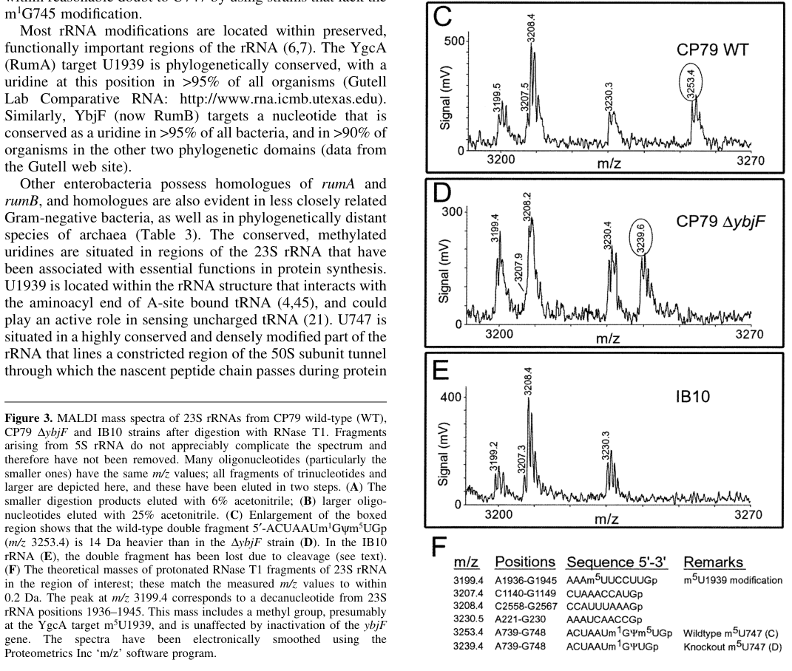

## Question

# Gene Research for Functional Annotation

## ⚠️ CRITICAL: Gene/Protein Identification Context

**BEFORE YOU BEGIN RESEARCH:** You MUST verify you are researching the CORRECT gene/protein. Gene symbols can be ambiguous, especially for less well-characterized genes from non-model organisms.

### Target Gene/Protein Identity (from UniProt):
- **UniProt Accession:** P75817
- **Protein Description:** RecName: Full=23S rRNA (uracil(747)-C(5))-methyltransferase RlmC {ECO:0000255|HAMAP-Rule:MF_01012}; EC=2.1.1.189 {ECO:0000255|HAMAP-Rule:MF_01012}; AltName: Full=23S rRNA(m5U747)-methyltransferase {ECO:0000255|HAMAP-Rule:MF_01012};
- **Gene Information:** Name=rlmC {ECO:0000255|HAMAP-Rule:MF_01012}; Synonyms=rumB, ybjF; OrderedLocusNames=b0859, JW0843;
- **Organism (full):** Escherichia coli (strain K12).
- **Protein Family:** Belongs to the class I-like SAM-binding methyltransferase
- **Key Domains:** 23SrRNA_MeTrfase_RlmC. (IPR011825); MeTrfase_TrmA_AS. (IPR030390); MeTrfase_TrmA_CS. (IPR030391); SAM-dependent_MTases_sf. (IPR029063); U5_MeTrfase_fam. (IPR010280)

### MANDATORY VERIFICATION STEPS:

1. **Check if the gene symbol "rlmC" matches the protein description above**
2. **Verify the organism is correct:** Escherichia coli (strain K12).
3. **Check if protein family/domains align with what you find in literature**
4. **If you find literature for a DIFFERENT gene with the same or similar symbol, STOP**

### If Gene Symbol is Ambiguous or You Cannot Find Relevant Literature:

**DO NOT PROCEED WITH RESEARCH ON A DIFFERENT GENE.** Instead:
- State clearly: "The gene symbol 'rlmC' is ambiguous or literature is limited for this specific protein"
- Explain what you found (e.g., "Found extensive literature on a different gene with the same symbol in a different organism")
- Describe the protein based ONLY on the UniProt information provided above
- Suggest that the protein function can be inferred from domain/family information

### Research Target:

Please provide a comprehensive research report on the gene **rlmC** (gene ID: rlmC, UniProt: P75817) in ECOLI.

The research report should be a detailed narrative explaining the function, biological processes, and localization of the gene product. Citations should be given for all claims.

You should prioritize authoritative reviews and primary scientific literature when conducting research. You can supplement
this with annotations you find in gene/protein databases, but these can be outdated or inaccurate.

We are specifically interested in the primary function of the gene - for enzymes, what reaction is catalyzed, and what is the substrate specificity? For transporters, what is the substrate? For structural proteins or adapters, what is the broader structural role? For signaling molecules, what is the role in the pathway.

We are interested in where in or outside the cell the gene product carries out its function.

We are also interested in the signaling or biochemical pathways in which the gene functions. We are less interested in broad pleiotropic effects, except where these elucidate the precise role.

Include evidence where possible. We are interested in both experimental evidence as well as inference from structure, evolution, or bioinformatic analysis. Precise studies should be prioritized over high-throughput, where available.

## Output

Question: You are an expert researcher providing comprehensive, well-cited information.

Provide detailed information focusing on:
1. Key concepts and definitions with current understanding
2. Recent developments and latest research (prioritize 2023-2024 sources)
3. Current applications and real-world implementations
4. Expert opinions and analysis from authoritative sources
5. Relevant statistics and data from recent studies

Format as a comprehensive research report with proper citations. Include URLs and publication dates where available.
Always prioritize recent, authoritative sources and provide specific citations for all major claims.

# Gene Research for Functional Annotation

## ⚠️ CRITICAL: Gene/Protein Identification Context

**BEFORE YOU BEGIN RESEARCH:** You MUST verify you are researching the CORRECT gene/protein. Gene symbols can be ambiguous, especially for less well-characterized genes from non-model organisms.

### Target Gene/Protein Identity (from UniProt):
- **UniProt Accession:** P75817
- **Protein Description:** RecName: Full=23S rRNA (uracil(747)-C(5))-methyltransferase RlmC {ECO:0000255|HAMAP-Rule:MF_01012}; EC=2.1.1.189 {ECO:0000255|HAMAP-Rule:MF_01012}; AltName: Full=23S rRNA(m5U747)-methyltransferase {ECO:0000255|HAMAP-Rule:MF_01012};
- **Gene Information:** Name=rlmC {ECO:0000255|HAMAP-Rule:MF_01012}; Synonyms=rumB, ybjF; OrderedLocusNames=b0859, JW0843;
- **Organism (full):** Escherichia coli (strain K12).
- **Protein Family:** Belongs to the class I-like SAM-binding methyltransferase
- **Key Domains:** 23SrRNA_MeTrfase_RlmC. (IPR011825); MeTrfase_TrmA_AS. (IPR030390); MeTrfase_TrmA_CS. (IPR030391); SAM-dependent_MTases_sf. (IPR029063); U5_MeTrfase_fam. (IPR010280)

### MANDATORY VERIFICATION STEPS:

1. **Check if the gene symbol "rlmC" matches the protein description above**
2. **Verify the organism is correct:** Escherichia coli (strain K12).
3. **Check if protein family/domains align with what you find in literature**
4. **If you find literature for a DIFFERENT gene with the same or similar symbol, STOP**

### If Gene Symbol is Ambiguous or You Cannot Find Relevant Literature:

**DO NOT PROCEED WITH RESEARCH ON A DIFFERENT GENE.** Instead:
- State clearly: "The gene symbol 'rlmC' is ambiguous or literature is limited for this specific protein"
- Explain what you found (e.g., "Found extensive literature on a different gene with the same symbol in a different organism")
- Describe the protein based ONLY on the UniProt information provided above
- Suggest that the protein function can be inferred from domain/family information

### Research Target:

Please provide a comprehensive research report on the gene **rlmC** (gene ID: rlmC, UniProt: P75817) in ECOLI.

The research report should be a detailed narrative explaining the function, biological processes, and localization of the gene product. Citations should be given for all claims.

You should prioritize authoritative reviews and primary scientific literature when conducting research. You can supplement
this with annotations you find in gene/protein databases, but these can be outdated or inaccurate.

We are specifically interested in the primary function of the gene - for enzymes, what reaction is catalyzed, and what is the substrate specificity? For transporters, what is the substrate? For structural proteins or adapters, what is the broader structural role? For signaling molecules, what is the role in the pathway.

We are interested in where in or outside the cell the gene product carries out its function.

We are also interested in the signaling or biochemical pathways in which the gene functions. We are less interested in broad pleiotropic effects, except where these elucidate the precise role.

Include evidence where possible. We are interested in both experimental evidence as well as inference from structure, evolution, or bioinformatic analysis. Precise studies should be prioritized over high-throughput, where available.

# Research report: *Escherichia coli* K-12 **rlmC** (UniProt **P75817**) — 23S rRNA m5U747 methyltransferase

## 1) Identity verification (critical disambiguation)
The target gene **rlmC** in *Escherichia coli* K-12 (UniProt **P75817**) corresponds to the locus historically annotated as **ybjF** and also called **rumB**, and encodes a SAM/AdoMet-dependent RNA methyltransferase dedicated to forming **5-methyluridine (m5U; ribothymidine)** at **U747** in **23S rRNA**. This assignment explicitly distinguishes RlmC from the related paralogs **TrmA** (tRNA U54 methyltransferase) and **RlmD/RumA** (23S rRNA U1939 methyltransferase). (madsen2003identifyingthemethyltransferases pages 1-2, desmolaize2011asinglemethyltransferase pages 1-2)

## 2) Key concepts and definitions (current understanding)

### rRNA C5-uridine methylation (m5U)
**m5U** denotes **uridine methylated at carbon-5 of the uracil ring**. In bacteria, m5U is installed by **SAM-dependent** methyltransferases in the COG2265/TrmA-like family; methyl transfer yields a single-methyl increase in mass (≈ **+14 Da**) at the modified nucleotide in mass-spectrometry assays. (auxilien2011specificityshiftsin pages 1-2, madsen2003identifyingthemethyltransferases pages 5-6)

### What RlmC does (enzyme commission)
RlmC is a **23S rRNA (uracil(747))-C(5)-methyltransferase** (EC **2.1.1.189**) that catalyzes:

- **Substrate:** 23S rRNA containing **U747**
- **Cofactor:** **S-adenosyl-L-methionine (SAM/AdoMet)**
- **Reaction:** methyl transfer to uridine C5 → **m5U747** in 23S rRNA

This is supported both by primary mapping experiments and by family-level mechanistic inference for m5U methyltransferases. (madsen2003identifyingthemethyltransferases pages 5-6, auxilien2011specificityshiftsin pages 1-2)

## 3) Primary function, substrate specificity, and strongest experimental evidence

### 3.1 Definitive assignment of the target nucleotide: U747 in 23S rRNA
The foundational functional assignment in *E. coli* comes from **genetic disruption of ybjF/rlmC** coupled to **MALDI mass spectrometry** mapping of RNase T1 fragments from 23S rRNA. In the ybjF knockout:

- An RNase T1 fragment spanning **23S rRNA nts 739–748** showed a peak shift **m/z 3253.4 → 3239.6**, consistent with **loss of one methyl group (≈14 Da)**.
- Using an **rrmA-deficient** background to simplify interpretation, the modification could be localized to the trinucleotide region **5′-U746-U747-G748**, consistent with the modified trinucleotide **5′-ψ746-m5U747-G748**.

These data directly support that **RlmC is required in vivo for m5U747 formation**. (madsen2003identifyingthemethyltransferases pages 5-6, madsen2003identifyingthemethyltransferases media f8177917)

### 3.2 Substrate context: likely an assembly intermediate rather than naked RNA
An authoritative EcoSal Plus review summarizes that attempts to demonstrate **in vitro** methyltransferase activity for recombinant/purified RlmC were unsuccessful when using:

- 23S rRNA isolated from ribosomes of an **rlmC-disrupted** strain, or
- an in vitro transcript spanning **23S nts 694–767**.

This negative biochemical evidence has been interpreted as suggesting RlmC may require a **specific ribonucleoprotein (RNP) context**, such as a **ribosome assembly intermediate** or near-mature 50S particle, rather than free RNA. (ofengand2004modifiednucleosidesof pages 15-16)

### 3.3 Structural/positional context within the ribosome
Comparative analysis places **m5U747** in **hairpin 35** of 23S rRNA, where the base is described as protruding into the **large-subunit exit tunnel** and thus may influence the tunnel environment and nascent chain interactions. (auxilien2011specificityshiftsin pages 1-2)

## 4) Biological processes, pathways, and cellular localization

### 4.1 Pathway: rRNA modification during ribosome biogenesis
RlmC functions in the broader pathway of **ribosomal RNA chemical modification**, which is tightly coupled to **ribosome biogenesis** and maturation. In bacteria, these modification enzymes are generally **cytoplasmic** and act on pre-rRNA / assembling ribosomal particles (direct fractionation for RlmC was not retrieved here, but the substrate—23S rRNA—implies a cytoplasmic ribosome-biogenesis context). The likely requirement for an RNP substrate further supports action during assembly/maturation rather than on isolated RNA. (ofengand2004modifiednucleosidesof pages 15-16, auxilien2011specificityshiftsin pages 1-2)

### 4.2 Phenotypes: ΔrlmC is generally mild but shows conditional rRNA processing defects
A systematic study of *E. coli* rRNA methyltransferase knockouts (Keio collection) found that:

- **ΔrlmC** cells displayed **accumulation of the 17S rRNA precursor**, detected by **RT-qPCR** quantifying the **17S / (16S+17S)** ratio.
- This effect was **temperature-conditional**, observed at **20°C** but not at **37°C**.
- In sucrose-gradient profiling under both dissociating (**1 mM Mg²⁺**) and associating (**10 mM Mg²⁺**) conditions, **major assembly intermediates** were not prominent for most methyltransferase knockouts; strong assembly-intermediate accumulation was mainly observed for other enzymes (notably rlmE), implying ΔrlmC does **not** cause a large, easily detectable 50S biogenesis blockade in those assays.

Together, these results support a model where loss of m5U747 produces **subtle/conditional defects** in rRNA maturation/homeostasis rather than catastrophic ribosome assembly failure. (pletnev2020comprehensivefunctionalanalysis pages 4-7, pletnev2020comprehensivefunctionalanalysis pages 1-2)

### 4.3 Effects on cellular protein production capacity (an application-relevant phenotype)
The same study used reporter systems to quantify capacity for **heterologous/exogenous protein expression**, including:

- a plasmid carrying **constitutive RFP** and an **inducible CER** reporter (induced with anhydrotetracycline), and
- a single-cell **FastFT fluorescent timer** system assessed by flow cytometry.

Across many rRNA methyltransferase knockouts, reporter yields were commonly reduced; ΔrlmC was included among strains with reduced tolerance for protein overexpression burden, and proteome changes for ΔrlmC were sufficiently strong to appear in their proteomics tables. (pletnev2020comprehensivefunctionalanalysis pages 7-9)

## 5) Recent developments (prioritizing 2023–2024) and the state of the field

### 5.1 What is new in 2023–2024 relevant to RlmC?
Within the retrieved literature set, **direct 2023–2024 primary studies focused specifically on *E. coli* RlmC** were limited. Current “recent” progress relevant to RlmC is largely indirect and reflects broader trends:

1. **High-resolution ribosome structure determination increasingly confirms rRNA modifications** and uses them to interpret antibiotic binding and ribosome function. For example, 2024 cryo-EM work on bacterial ribosomes explicitly notes that high-resolution structures enable confirmation of many rRNA modifications and references RlmC as the *E. coli* enzyme responsible for a corresponding modification position in comparative contexts. (madsen2003identifyingthemethyltransferases media f8177917)

2. **Bacterial modomics/epitranscriptomics** continues to emphasize improved mapping workflows (e.g., mass spectrometry and long-read approaches in other organisms), and comparative enzymology uses the RlmC/RlmD/RlmCD system as a model for how methyltransferase target specificity evolves. (desmolaize2011asinglemethyltransferase pages 1-2, auxilien2011specificityshiftsin pages 1-2)

### 5.2 Expert synthesis / authoritative interpretation
Authoritative synthesis emphasizes two key “expert” interpretations relevant to functional annotation:

- Many rRNA modifications have **subtle phenotypes** and may become important under **specific stresses/conditions**; ΔrlmC is consistent with this pattern (mild at 37°C but with changes detectable at low temperature and in rRNA precursor pools). (pletnev2020comprehensivefunctionalanalysis pages 4-7)
- Failure to reconstitute activity in vitro suggests that for at least some rRNA methyltransferases, the relevant substrate is not merely a short RNA segment but rather a specific **structural context** in assembling ribosomes. (ofengand2004modifiednucleosidesof pages 15-16)

## 6) Current applications and real-world implementations

### 6.1 RNA modification mapping and quality control in rRNA studies
RlmC/m5U747 is a canonical **benchmark modification** used in rRNA modification mapping. The original *E. coli* assignment itself is an example of a widely used real-world workflow:

- RNase digestion to produce defined oligoribonucleotides
- MALDI-MS detection of a diagnostic **14 Da** mass difference between modified and unmodified fragments
- Genetic knockout to link enzyme gene to modification loss

This approach remains a template for mapping and validating rRNA modifications in additional bacteria. (madsen2003identifyingthemethyltransferases pages 5-6, madsen2003identifyingthemethyltransferases media f8177917)

### 6.2 Comparative enzymology and antibiotic-related structural biology
RlmC is frequently invoked in comparative discussions where related enzymes exhibit altered specificity (e.g., single-target RlmC vs dual-target RlmCD in Gram-positive bacteria), informing hypotheses about ribosome function and potential antimicrobial strategies aimed at ribosome maturation/modification processes. (desmolaize2011asinglemethyltransferase pages 1-2, auxilien2011specificityshiftsin pages 1-2)

## 7) Quantitative/statistical highlights (from the cited studies)
- **Mass-spectrometry signature of m5U747 loss in ΔybjF/ΔrlmC:** RNase T1 fragment peak **m/z 3253.4 → 3239.6** (≈ **−14 Da**), supporting loss of one methyl group in the 739–748 fragment that contains U747. (madsen2003identifyingthemethyltransferases pages 5-6, madsen2003identifyingthemethyltransferases media f8177917)
- **Phenotype depends on condition (temperature):** ΔrlmC shows **17S rRNA precursor accumulation at 20°C** but not at 37°C by RT-qPCR (17S/(16S+17S) metric). (pletnev2020comprehensivefunctionalanalysis pages 4-7)
- **Ribosome-profile assay conditions reported:** sucrose gradients assessed at **1 mM Mg²⁺** (dissociation) and **10 mM Mg²⁺** (association) to detect assembly intermediates or subunit association states; ΔrlmC did not show the strong intermediate accumulation seen for some other MTases. (pletnev2020comprehensivefunctionalanalysis pages 4-7)

## Evidence summary table

| Item | Key finding | Evidence type/method | Key quantitative/statistical detail (if any) | Primary source with DOI/URL and year | Citation ID |
|---|---|---|---|---|---|
| Identity | **rlmC** in *Escherichia coli* K-12 corresponds to **YbjF/RumB**, the dedicated **23S rRNA (uracil-747)-C5 methyltransferase** RlmC, distinct from RlmD (U1939) and TrmA (tRNA U54). | Gene-function assignment from knockout-based modification mapping; comparative family/evolution analyses | E. coli has **three** related COG2265 m5U methyltransferases with distinct targets | Madsen et al., *Nucleic Acids Research* (2003), DOI: 10.1093/nar/gkg657, https://doi.org/10.1093/nar/gkg657; Desmolaize et al., *Nucleic Acids Research* (2011), DOI: 10.1093/nar/gkr626, https://doi.org/10.1093/nar/gkr626 | (madsen2003identifyingthemethyltransferases pages 1-2, desmolaize2011asinglemethyltransferase pages 1-2) |
| Reaction | RlmC catalyzes **SAM/AdoMet-dependent C5 methylation of uridine 747** in 23S rRNA, generating **m5U747** (ribothymidine). | In vivo loss-of-modification mapping by MALDI-MS in knockout strains; family/mechanistic inference for SAM-dependent m5U MTases | Loss of a single methyl group gives a **~14 Da** mass decrease in the relevant 23S rRNA fragment | Madsen et al. (2003), DOI: 10.1093/nar/gkg657, https://doi.org/10.1093/nar/gkg657; Auxilien et al., *RNA* (2011), DOI: 10.1261/rna.2323411, https://doi.org/10.1261/rna.2323411 | (madsen2003identifyingthemethyltransferases pages 5-6, auxilien2011specificityshiftsin pages 1-2) |
| Substrate | The mapped target is the **23S rRNA segment containing U747**, specifically localized to the **U746-U747-G748** region; evidence supports methylation at **U747**, not neighboring residues. | RNase T1 digestion plus MALDI-MS of defined oligonucleotides from WT vs knockout rRNA | Decamer mass shift **3253.4 → 3239.6**; in an rrmA-deficient background a heptamer at **m/z 2268.3** enabled localization to the trinucleotide region | Madsen et al. (2003), DOI: 10.1093/nar/gkg657, https://doi.org/10.1093/nar/gkg657 | (madsen2003identifyingthemethyltransferases pages 5-6) |
| Location | The enzyme functions in the **cytoplasm** on **23S rRNA/large ribosomal subunit biogenesis substrates**; the modified nucleotide lies in **hairpin 35** of 23S rRNA and projects toward the **nascent peptide exit tunnel**. | Structural/functional interpretation from ribosome mapping and comparative review | No direct subcellular fractionation reported for RlmC in the cited evidence | Auxilien et al. (2011), DOI: 10.1261/rna.2323411, https://doi.org/10.1261/rna.2323411; Ofengand & Del Campo, *EcoSal Plus* (2004), DOI: 10.1128/ecosalplus.4.6.1, https://doi.org/10.1128/ecosalplus.4.6.1 | (auxilien2011specificityshiftsin pages 1-2, ofengand2004modifiednucleosidesof pages 15-16) |
| Biological role | RlmC is part of the **rRNA modification pathway** supporting maturation and functional tuning of the 50S subunit; available evidence suggests the true substrate may be an **assembly intermediate/RNP or intact 50S particle**, rather than naked RNA. | Negative in vitro reconstitution results with recombinant protein and transcript substrates; review-based functional interpretation | Recombinant/purified RlmC showed **no detectable activity** on isolated 23S rRNA from the mutant or on a **694-767 nt** transcript in reported assays | Ofengand & Del Campo (2004), DOI: 10.1128/ecosalplus.4.6.1, https://doi.org/10.1128/ecosalplus.4.6.1 | (ofengand2004modifiednucleosidesof pages 15-16) |
| Phenotypes | **rlmC deletion** causes a **mild phenotype** overall but is associated with **17S rRNA precursor accumulation**, especially at **20°C**, indicating a subtle role in small-subunit rRNA processing/overall ribosome homeostasis; no major ribosomal assembly intermediate accumulation like **rlmE**. | Keio knockout phenotyping; RT-qPCR for 17S precursor; sucrose gradient centrifugation under dissociating/associating Mg2+ conditions; reporter-expression assays | 17S accumulation detected at **20°C not 37°C**; gradients examined at **1 mM** and **10 mM Mg2+**; some rRNA MT knockouts showed up to **10-fold** RFP reduction in reporter assays, with rlmC included among strains with reduced expression burden tolerance | Pletnev et al., *Frontiers in Genetics* (2020), DOI: 10.3389/fgene.2020.00097, https://doi.org/10.3389/fgene.2020.00097 | (pletnev2020comprehensivefunctionalanalysis pages 4-7, pletnev2020comprehensivefunctionalanalysis pages 7-9, pletnev2020comprehensivefunctionalanalysis pages 1-2) |
| Recent developments | Recent work emphasizes **high-resolution ribosome structure/modification mapping** and broader bacterial **epitranscriptomics/modomics** as the main route for contextualizing m5U747; direct 2023-2024 E. coli-specific RlmC studies are limited, so current understanding still relies heavily on foundational mapping and comparative analyses. | Recent structural/modification-mapping literature and synthesis with older primary assignment papers | 2024 studies highlight species-specific confirmation of many rRNA modifications but do not substantially revise the core E. coli RlmC assignment | González-López et al., *Scientific Reports* (2024), DOI: 10.1038/s41598-024-64868-x, https://doi.org/10.1038/s41598-024-64868-x; Pletnev et al. (2020), DOI: 10.3389/fgene.2020.00097, https://doi.org/10.3389/fgene.2020.00097 | (pletnev2020comprehensivefunctionalanalysis pages 7-9) |
| Applications | RlmC serves as a **reference enzyme/site** for **rRNA modification mapping**, **comparative evolution of m5U methyltransferases**, and potential **ribosome-targeted antimicrobial research**, especially in studies comparing single-specificity enzymes (RlmC/RlmD) with dual-specificity homologs (RlmCD). | MALDI-MS mapping workflows; comparative enzymology and structure-guided analyses | The classic assignment relied on diagnostic **single-methyl (~14 Da)** mass shifts in specific oligoribonucleotides | Madsen et al. (2003), DOI: 10.1093/nar/gkg657, https://doi.org/10.1093/nar/gkg657; Jiang et al., *PLOS Pathogens* (2018), DOI: 10.1371/journal.ppat.1007379, https://doi.org/10.1371/journal.ppat.1007379 | (madsen2003identifyingthemethyltransferases pages 5-6, desmolaize2011asinglemethyltransferase pages 5-6) |

*Table: This table summarizes the main evidence supporting the functional annotation of E. coli K-12 RlmC (UniProt P75817), including identity, catalytic activity, substrate assignment, phenotypes, and current research uses. It is useful as a compact evidence map linking each claim to the underlying method and source.*

## Key sources (with publication dates and URLs)
- Madsen CT et al. **Aug 2003**. *Nucleic Acids Research*. “Identifying the methyltransferases for m5U747 and m5U1939 in 23S rRNA using MALDI mass spectrometry.” https://doi.org/10.1093/nar/gkg657 (madsen2003identifyingthemethyltransferases pages 5-6, madsen2003identifyingthemethyltransferases pages 1-2, madsen2003identifyingthemethyltransferases media f8177917)
- Ofengand J, Del Campo M. **Dec 2004**. *EcoSal Plus*. “Modified Nucleosides of *Escherichia coli* Ribosomal RNA.” https://doi.org/10.1128/ecosalplus.4.6.1 (ofengand2004modifiednucleosidesof pages 15-16)
- Auxilien S et al. **Nov 2011**. *RNA*. “Specificity shifts in the rRNA and tRNA nucleotide targets of archaeal and bacterial m5U methyltransferases.” https://doi.org/10.1261/rna.2323411 (auxilien2011specificityshiftsin pages 1-2)
- Desmolaize B et al. **Aug 2011**. *Nucleic Acids Research*. “A single methyltransferase YefA (RlmCD) catalyses both m5U747 and m5U1939 modifications in *Bacillus subtilis* 23S rRNA.” https://doi.org/10.1093/nar/gkr626 (desmolaize2011asinglemethyltransferase pages 1-2)
- Pletnev P et al. **Feb 2020**. *Frontiers in Genetics*. “Comprehensive Functional Analysis of *Escherichia coli* Ribosomal RNA Methyltransferases.” https://doi.org/10.3389/fgene.2020.00097 (pletnev2020comprehensivefunctionalanalysis pages 4-7, pletnev2020comprehensivefunctionalanalysis pages 7-9, pletnev2020comprehensivefunctionalanalysis pages 1-2)

## Limitations and evidence gaps (important for annotation confidence)
- **Direct purified-enzyme biochemistry** (kinetics, minimal RNA substrate, binding constants) for *E. coli* RlmC is limited in the retrieved sources; attempts reported in EcoSal Plus did not detect activity on naked RNA substrates, suggesting a more complex physiological substrate context. (ofengand2004modifiednucleosidesof pages 15-16)
- **2023–2024 E. coli-specific** studies that quantitatively re-map the *E. coli* rRNA methylome or measure ΔrlmC antibiotic susceptibility were not identified in the retrieved set; thus, recent developments are presented mainly as broader field trends and structural-biology context rather than new *E. coli* RlmC-specific experimental claims. (madsen2003identifyingthemethyltransferases media f8177917)

References

1. (madsen2003identifyingthemethyltransferases pages 1-2): C. T. Madsen, J. Mengel-Jørgensen, F. Kirpekar, and S. Douthwaite. Identifying the methyltransferases for m5u747 and m5u1939 in 23s rrna using maldi mass spectrometry. Nucleic Acids Research, 31:4738-4746, Aug 2003. URL: https://doi.org/10.1093/nar/gkg657, doi:10.1093/nar/gkg657. This article has 101 citations and is from a highest quality peer-reviewed journal.

2. (desmolaize2011asinglemethyltransferase pages 1-2): Benoit Desmolaize, Céline Fabret, Damien Brégeon, Simon Rose, Henri Grosjean, and Stephen Douthwaite. A single methyltransferase yefa (rlmcd) catalyses both m5u747 and m5u1939 modifications in bacillus subtilis 23s rrna. Nucleic Acids Research, 39:9368-9375, Aug 2011. URL: https://doi.org/10.1093/nar/gkr626, doi:10.1093/nar/gkr626. This article has 44 citations and is from a highest quality peer-reviewed journal.

3. (auxilien2011specificityshiftsin pages 1-2): Sylvie Auxilien, Anette Rasmussen, Simon Rose, Céline Brochier-Armanet, Clotilde Husson, Dominique Fourmy, Henri Grosjean, and Stephen Douthwaite. Specificity shifts in the rrna and trna nucleotide targets of archaeal and bacterial m5u methyltransferases. RNA, 17 1:45-53, Nov 2011. URL: https://doi.org/10.1261/rna.2323411, doi:10.1261/rna.2323411. This article has 43 citations and is from a domain leading peer-reviewed journal.

4. (madsen2003identifyingthemethyltransferases pages 5-6): C. T. Madsen, J. Mengel-Jørgensen, F. Kirpekar, and S. Douthwaite. Identifying the methyltransferases for m5u747 and m5u1939 in 23s rrna using maldi mass spectrometry. Nucleic Acids Research, 31:4738-4746, Aug 2003. URL: https://doi.org/10.1093/nar/gkg657, doi:10.1093/nar/gkg657. This article has 101 citations and is from a highest quality peer-reviewed journal.

5. (madsen2003identifyingthemethyltransferases media f8177917): C. T. Madsen, J. Mengel-Jørgensen, F. Kirpekar, and S. Douthwaite. Identifying the methyltransferases for m5u747 and m5u1939 in 23s rrna using maldi mass spectrometry. Nucleic Acids Research, 31:4738-4746, Aug 2003. URL: https://doi.org/10.1093/nar/gkg657, doi:10.1093/nar/gkg657. This article has 101 citations and is from a highest quality peer-reviewed journal.

6. (ofengand2004modifiednucleosidesof pages 15-16): James Ofengand and Mark Del Campo. Modified nucleosides of <i>escherichia coli</i> ribosomal rna. Dec 2004. URL: https://doi.org/10.1128/ecosalplus.4.6.1, doi:10.1128/ecosalplus.4.6.1. This article has 57 citations.

7. (pletnev2020comprehensivefunctionalanalysis pages 4-7): Philipp Pletnev, Ekaterina Guseva, Anna Zanina, Sergey Evfratov, Margarita Dzama, Vsevolod Treshin, Alexandra Pogorel’skaya, Ilya Osterman, Anna Golovina, Maria Rubtsova, Marina Serebryakova, Olga V. Pobeguts, Vadim M. Govorun, Alexey A. Bogdanov, Olga A. Dontsova, and Petr V. Sergiev. Comprehensive functional analysis of escherichia coli ribosomal rna methyltransferases. Frontiers in Genetics, Feb 2020. URL: https://doi.org/10.3389/fgene.2020.00097, doi:10.3389/fgene.2020.00097. This article has 64 citations and is from a peer-reviewed journal.

8. (pletnev2020comprehensivefunctionalanalysis pages 1-2): Philipp Pletnev, Ekaterina Guseva, Anna Zanina, Sergey Evfratov, Margarita Dzama, Vsevolod Treshin, Alexandra Pogorel’skaya, Ilya Osterman, Anna Golovina, Maria Rubtsova, Marina Serebryakova, Olga V. Pobeguts, Vadim M. Govorun, Alexey A. Bogdanov, Olga A. Dontsova, and Petr V. Sergiev. Comprehensive functional analysis of escherichia coli ribosomal rna methyltransferases. Frontiers in Genetics, Feb 2020. URL: https://doi.org/10.3389/fgene.2020.00097, doi:10.3389/fgene.2020.00097. This article has 64 citations and is from a peer-reviewed journal.

9. (pletnev2020comprehensivefunctionalanalysis pages 7-9): Philipp Pletnev, Ekaterina Guseva, Anna Zanina, Sergey Evfratov, Margarita Dzama, Vsevolod Treshin, Alexandra Pogorel’skaya, Ilya Osterman, Anna Golovina, Maria Rubtsova, Marina Serebryakova, Olga V. Pobeguts, Vadim M. Govorun, Alexey A. Bogdanov, Olga A. Dontsova, and Petr V. Sergiev. Comprehensive functional analysis of escherichia coli ribosomal rna methyltransferases. Frontiers in Genetics, Feb 2020. URL: https://doi.org/10.3389/fgene.2020.00097, doi:10.3389/fgene.2020.00097. This article has 64 citations and is from a peer-reviewed journal.

10. (desmolaize2011asinglemethyltransferase pages 5-6): Benoit Desmolaize, Céline Fabret, Damien Brégeon, Simon Rose, Henri Grosjean, and Stephen Douthwaite. A single methyltransferase yefa (rlmcd) catalyses both m5u747 and m5u1939 modifications in bacillus subtilis 23s rrna. Nucleic Acids Research, 39:9368-9375, Aug 2011. URL: https://doi.org/10.1093/nar/gkr626, doi:10.1093/nar/gkr626. This article has 44 citations and is from a highest quality peer-reviewed journal.

## Artifacts

- [Edison artifact artifact-00](rlmC-deep-research-falcon_artifacts/artifact-00.md)

## Citations

1. ofengand2004modifiednucleosidesof pages 15-16
2. auxilien2011specificityshiftsin pages 1-2
3. pletnev2020comprehensivefunctionalanalysis pages 7-9
4. pletnev2020comprehensivefunctionalanalysis pages 4-7
5. madsen2003identifyingthemethyltransferases pages 5-6
6. desmolaize2011asinglemethyltransferase pages 1-2
7. madsen2003identifyingthemethyltransferases pages 1-2
8. pletnev2020comprehensivefunctionalanalysis pages 1-2
9. desmolaize2011asinglemethyltransferase pages 5-6
10. https://doi.org/10.1093/nar/gkg657;
11. https://doi.org/10.1093/nar/gkr626
12. https://doi.org/10.1261/rna.2323411
13. https://doi.org/10.1093/nar/gkg657
14. https://doi.org/10.1261/rna.2323411;
15. https://doi.org/10.1128/ecosalplus.4.6.1
16. https://doi.org/10.3389/fgene.2020.00097
17. https://doi.org/10.1038/s41598-024-64868-x;
18. https://doi.org/10.1371/journal.ppat.1007379
19. https://doi.org/10.1093/nar/gkg657,
20. https://doi.org/10.1093/nar/gkr626,
21. https://doi.org/10.1261/rna.2323411,
22. https://doi.org/10.1128/ecosalplus.4.6.1,
23. https://doi.org/10.3389/fgene.2020.00097,