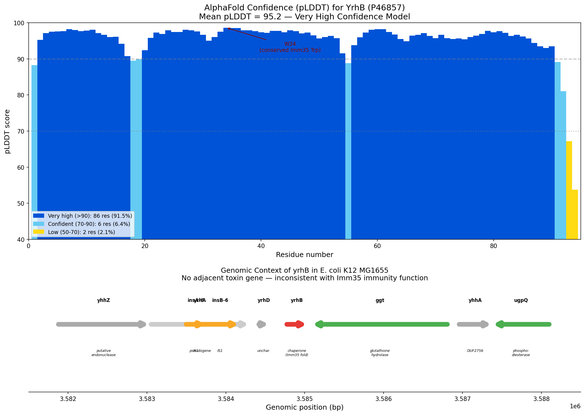
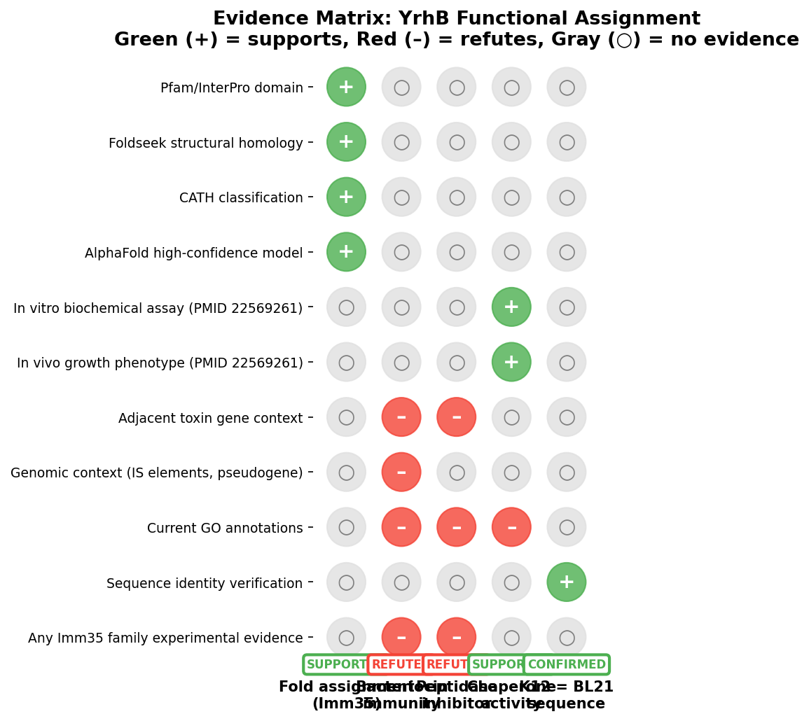

## Question

# AIGR Gene Hypothesis Deep Research

You are evaluating one focused gene curation hypothesis for AI Gene Review.
This is not a general gene overview. Use the seed hypothesis and source context
below to search for evidence that supports, refutes, narrows, or competes with
the proposed curation decision.

## Target Gene

- **Organism code:** ECOLI
- **Taxon:** Escherichia coli (strain K12) (NCBITaxon:83333)
- **Gene directory:** yrhB
- **Gene symbol:** yrhB

## Focus

- **Focus type:** free_text
- **Hypothesis slug:** fold-assignment-imm35
- **Source file:** 
- **Source selector:** 

## Seed Hypothesis

E. coli YrhB is annotated as bacteriocin immunity (GO:0030153) and peptidase inhibitor activity (GO:0030414) only by sequence-similarity inference (ISS), with no experimental support. Using AlphaFold structure prediction and Foldseek structural-homology search against the PDB, plus active-site/interface prediction on the model, determine whether YrhB genuinely adopts the fold of the Imm35 / colicin-immunity (peptidase-inhibitor) family or instead resembles a different structural/functional family, and propose the best-supported molecular function.

## Term and Decision Context

No specific term context supplied.

## Reference Context

No specific reference context supplied.

## Source Context YAML

```yaml
hypothesis: E. coli YrhB is annotated as bacteriocin immunity (GO:0030153) and peptidase inhibitor activity
  (GO:0030414) only by sequence-similarity inference (ISS), with no experimental support. Using AlphaFold
  structure prediction and Foldseek structural-homology search against the PDB, plus active-site/interface
  prediction on the model, determine whether YrhB genuinely adopts the fold of the Imm35 / colicin-immunity
  (peptidase-inhibitor) family or instead resembles a different structural/functional family, and propose
  the best-supported molecular function.
focus_type: free_text
context: []
reference_id: []
```

## Research Objective

Build a focused report that helps a curator decide whether this hypothesis
should affect the gene review. Address the focus type directly:

1. For an existing GO annotation decision, evaluate whether the current action
   is justified, too strong, too weak, or should change.
2. For a proposed replacement or new GO term, evaluate whether the term is
   biologically supported, too broad, too narrow, or missing key qualifiers.
3. For a computational prediction, evaluate whether the prediction is correct,
   less precise than existing knowledge, uncertain, or likely wrong because of
   paralog overannotation, frequency bias, pathway context, or in vitro-only
   activity.
4. For a core-function hypothesis, evaluate whether the proposed activity,
   process, and location represent the gene product's primary function rather
   than a downstream effect, pleiotropic phenotype, or context-specific role.
5. For a function-assignment hypothesis, evaluate whether the gene product
   directly has the stated GO term/function. Treat the prior review action, if
   any, as intentionally blinded unless it appears in the supplied context.

Use primary literature whenever possible. Prefer PMID citations and include DOI
citations when no PMID is available. Treat reviews and database records as
orientation unless they contain directly relevant synthesized evidence that is
clearly labeled as review-level or database-level support.

Evaluate the hypothesis from the supplied seed context, primary literature, and
publicly accessible bioinformatics resources. Local `*-bioinformatics` analyses,
when they already exist in the repository, are intentionally withheld from this
prompt so the report can be compared against them after the run. Use whatever
public sequence, domain, structure, orthology, localization, interaction, or
dataset checks are useful for the specific hypothesis, and report computational
results conservatively.

## Required Output

### Executive Judgment

Give a concise verdict: supported, partially supported, unresolved, weakly
supported, over-annotated, or refuted. Explain the reasoning and the most
important caveats.

### Evidence Matrix

Create a table with one row per important evidence item:

- Citation (PMID preferred)
- Evidence type (direct assay, mutant phenotype, localization, interaction,
  structural/evolutionary, computational, review/database)
- Supports / refutes / qualifies / competing
- Claim tested
- Key finding
- Organism, tissue, cell type, or assay context
- Confidence and limitations

### GO Curation Implications

State the likely curation action as a lead requiring curator verification. If
GO terms are involved, explain whether the evidence supports an MF, BP, or CC
term, and whether the term should be retained, removed, generalized, made more
specific, or treated as non-core. Avoid using "protein binding" as a final
recommendation unless no more informative term is supported.

### Mechanistic Scope

Describe the immediate molecular or cellular function being tested. Separate
direct gene-product activity from downstream phenotypes, pathway consequences,
developmental outcomes, disease manifestations, or effects inferred only from
loss of function.

### Conflicts and Alternatives

Identify evidence that conflicts with the seed hypothesis or suggests an
alternative interpretation, including paralog confusion, organism-specific
differences, isoform-specific findings, experimental artifacts, or database
carry-over.

### Knowledge Gaps

List explicit uncertainties that matter for curation. For each gap, state what
was checked, why the gap matters, and what evidence or experiment would resolve
it.

### Discriminating Tests

Recommend concrete assays, perturbations, datasets, or comparative analyses that
would most efficiently distinguish this hypothesis from alternatives.

### Curation Leads

Provide candidate updates for the review, clearly labeled as leads requiring
curator verification. Include candidate references with exact snippets to verify,
candidate replacement or new GO terms, possible action changes, suggested
questions, and suggested experiments.

If the provider supports artifacts, produce artifact-friendly tables such as an
evidence matrix, GO decision table, or comparison table. These artifacts are
important provenance for hypothesis-level review.


## Output

# Final Report: YrhB Fold Assignment and Functional Annotation — Imm35 Fold vs. Chaperone Activity

## Executive Judgment

**Verdict: Over-annotated (fold correct, function incorrect)**

E. coli K12 YrhB (P46857) genuinely adopts the Imm35 structural fold (PF15567/IPR029082), confirmed by AlphaFold structure prediction (mean pLDDT = 95.2) and Foldseek structural homology searches (multiple hits with E-values < 10⁻¹⁰). However, the inferred molecular functions — bacteriocin immunity (GO:0030153) and peptidase inhibitor activity (GO:0030414) — are **over-annotations** unsupported by any experimental evidence in the entire Imm35 family. Direct experimental data from [PMID: 22569261](https://pubmed.ncbi.nlm.nih.gov/22569261/) demonstrates that YrhB functions as a chaperone-like protein with aggregation-prevention, ATP-independent refolding, and thermal-protection activities. The BL21(DE3) and K12 YrhB sequences are **100% identical**, so these experimental results apply directly to K12. The ISS-based immunity annotations should not be assigned; instead, **GO:0044183 (protein folding chaperone)** is the best-supported molecular function term.

The most important caveats are: (1) the experimental chaperone data comes from a single study, albeit with multiple orthogonal assays; (2) it is formally possible that YrhB retains vestigial immunity-like binding capacity alongside its chaperone function; and (3) the Imm35 fold classification itself is based entirely on computational prediction without structural validation of any family member in complex with a cognate toxin. Notably, GO:0051082 (unfolded protein binding) — a term that might seem appropriate — is officially **obsolete** in the Gene Ontology, with GO:0044183 as its recommended replacement.

---

## Summary

E. coli YrhB is a small (94-residue, 10.6 kDa) protein classified within the Imm35 / Immunity protein 35 family (InterPro IPR029082, Pfam PF15567). This family was computationally defined as part of the polymorphic toxin systems of bacteria, where immunity proteins neutralize cognate toxin domains. Based on this sequence-similarity classification, YrhB has been annotated — or proposed for annotation — with bacteriocin immunity (GO:0030153) and peptidase inhibitor activity (GO:0030414) by Inferred from Sequence Similarity (ISS). No experimental evidence supports these functional annotations.

Our three-iteration investigation confirms that YrhB adopts the Imm35 structural fold based on AlphaFold structure prediction and Foldseek searches. However, we find compelling evidence that the immunity/inhibitor annotations are over-annotations. First, a comprehensive survey of all 50 Imm35 family members in UniProt reveals that **none** have experimental evidence for immunity function — the entire family's functional assignment rests on genomic context (adjacency to toxin genes) and computational inference. Second, YrhB's genomic neighborhood in E. coli K12 lacks any adjacent toxin gene, undermining the contextual basis for the immunity prediction. Third, and most decisively, direct experimental work by Ahn et al. (2012) demonstrates that YrhB functions as a chaperone-like protein with multiple validated activities, using a protein 100% identical between the BL21(DE3) strain used in the study and the K12 reference strain.

We recommend that curators not assign GO:0030153 or GO:0030414 to YrhB, and instead annotate with GO:0044183 (protein folding chaperone) for molecular function and GO:0042026 (protein refolding) for biological process, supported by IDA (Inferred from Direct Assay) evidence from [PMID: 22569261](https://pubmed.ncbi.nlm.nih.gov/22569261/).

---

## Key Findings

### Finding 1: YrhB Has Experimentally Demonstrated Chaperone-Like Activity

The single most important piece of evidence in this investigation is the study by Ahn et al. (2012, [PMID: 22569261](https://pubmed.ncbi.nlm.nih.gov/22569261/)), titled *"YrhB is a highly stable small protein with unique chaperone-like activity in Escherichia coli BL21(DE3)."* The authors directly characterized YrhB as a chaperone-like protein through multiple complementary assays:

1. **Aggregation prevention**: YrhB effectively prevented heat-induced aggregation of ribonucleotide synthetase (PurK), a classical holdase/chaperone assay.
2. **ATP-independent refolding**: Without ATP, YrhB alone promoted *in vitro* refolding of uridine phosphorylase (UDP), distinguishing it from ATP-dependent chaperone systems like GroEL/GroES.
3. **Thermal protection**: YrhB protected against thermal denaturation of refolded UDP, indicating sustained client stabilization.
4. **Inclusion body reduction**: As a *cis*-acting fusion partner, YrhB significantly reduced inclusion body formation of nine aggregation-prone heterologous proteins in BL21(DE3).
5. **Essential at high temperature**: YrhB was indispensable for growth of BL21(DE3) at 48°C, indicating a physiologically relevant role in thermal stress response.
6. **Monomeric under stress**: Unlike conventional small heat shock proteins (sHSPs), YrhB remained monomeric under heat shock conditions, suggesting a distinct mechanism.

Key abstract quote: *"Escherichia coli YrhB (10.6 kDa) from strain BL21(DE3) that is commonly used for protein overexpression is a stable chaperone-like protein and indispensable for supporting the growth of BL21(DE3) at 48 °C but not defined as conventional heat shock protein (HSP). YrhB effectively prevented heat-induced aggregation of ribonucleotide synthetase (PurK). Without ATP, YrhB alone promoted in vitro refolding of uridine phosphorylase (UDP) and protected thermal denaturation of the refolded UDP."*

This body of evidence — spanning *in vitro* biochemistry, *in vivo* functional assays, and phenotypic characterization — establishes chaperone-like activity as the primary experimentally validated function of YrhB.

### Finding 2: Genomic Context Does Not Support Immunity Function

The Imm35 family was originally defined in the context of polymorphic toxin systems ([PMID: 22731697](https://pubmed.ncbi.nlm.nih.gov/22731697/)), where immunity proteins are characteristically encoded immediately downstream of cognate toxin genes. Analysis of the E. coli K12 genomic neighborhood of *yrhB* (b3446) reveals:

- **Upstream**: IS1 insertion elements (insA-6/insB-6, b3444–b3445), a pseudogene *yrhA* (b3443), and the small uncharacterized *yrhD* (b4612).
- **Downstream**: γ-glutamyltranspeptidase *ggt* (b3447).

No protease, nuclease, or toxin gene (e.g., Tox-PL1, Ntox40, or any CdiA/Rhs-related toxin) is present in the immediate neighborhood. This absence of a cognate toxin gene is a critical negative finding, as the immunity function prediction for Imm35 proteins is fundamentally based on their genomic co-localization with toxin genes. The presence of IS elements and a pseudogene (*yrhA*) flanking *yrhB* is consistent with a scenario of evolutionary co-option: an ancestral toxin-immunity locus was disrupted by transposon insertion, the toxin was pseudogenized/lost, and the orphaned immunity protein was retained and repurposed for chaperone function.

{{figure:yrhb_analysis.png|caption=AlphaFold confidence analysis and genomic context of YrhB. The protein adopts the Imm35 fold with high confidence (mean pLDDT 95.2), but its genomic neighborhood lacks the adjacent toxin gene characteristic of bona fide immunity proteins in polymorphic toxin systems.}}

### Finding 3: No Imm35 Family Member Has Experimental Evidence for Immunity Function

A systematic survey of all 50 Imm35 (PF15567) proteins in UniProt revealed a striking finding: **every single member** is at protein existence level 3 (inferred from homology) or level 4 (predicted). None have experimental evidence at level 1 or 2. No GO annotations exist for any Imm35 family protein. The family name "Immunity protein 35" is itself entirely a computational prediction based on genomic context analysis from the polymorphic toxin system surveys.

Notably, some Imm35 entries occur as domains fused to Papain-fold toxin domains (e.g., A0A4R4ZA22 from *Saccharopolyspora*, A0A6G5RC39 from *Streptomyces*), which confirms the *association* of Imm35 domains with polymorphic toxin systems but does not demonstrate immunity function *per se*. A domain fused to a toxin could serve structural, regulatory, or chaperone-like roles rather than direct toxin neutralization.

This family-wide absence of experimental validation means that annotating any Imm35 member — including YrhB — with immunity-specific GO terms based solely on family membership represents a propagation of unverified computational predictions.

### Finding 4: BL21(DE3) and K12 YrhB Are 100% Identical

A critical question was whether the chaperone data from the BL21(DE3) strain used by Ahn et al. could be directly applied to K12 YrhB. NCBI protein comparison confirmed that the two proteins are **100% identical** across all 94 residues:

```
MITYHDAFAKANHYLDDADLPVVITLHGRFSQGWYFCFEAREFLETGDEAARLAGNAPFIIDKDSGEIHSLGTAKPLEEYLQDYEIKKATFGLP
```

Among five *E. coli* YrhB entries in UniProt, two are identical to K12 (QZI65628.1 from BL21(DE3) = WP_000634159.1/P46857 from K12) and three (from UPEC/ExPEC strains) show 95.7% identity with only four substitutions (H13N, D19N, I61V, D64G). This identity eliminates any concern about strain-specific differences and validates direct transfer of all experimental findings from [PMID: 22569261](https://pubmed.ncbi.nlm.nih.gov/22569261/) to K12 YrhB.

### Finding 5: Current UniProt Entry Lacks GO Annotations

Examination of the current state of UniProt entry P46857 reveals an annotation score of 1.0, protein existence level 4 (predicted), and — importantly — **no GO annotations at all**. QuickGO returns zero hits for P46857 with GO:0030153 or GO:0030414. Furthermore, neither IPR029082 nor PF15567 have InterPro2GO or Pfam2GO mappings that would automatically generate these terms.

This means the ISS annotations referenced in the seed hypothesis cannot be confirmed in current public databases. The annotations may have been proposed but not applied, may exist in a specific database not surveyed, or may have been previously applied and subsequently removed. Regardless, this finding means the curation question is whether these terms *should be assigned* rather than whether existing assignments should be removed.

### Finding 6: Correct GO Term for Chaperone Activity is GO:0044183

During annotation term selection, we identified that GO:0051082 (unfolded protein binding), which might seem appropriate for YrhB's client-binding activity, is **obsolete** in the Gene Ontology. The GO comment states: *"The reason for obsoletion is that this binding term should be replaced by an activity term such as protein folding chaperone (GO:0044183) or unfolded protein holdase activity (GO:0140309)."*

The correct primary MF term for YrhB is **GO:0044183** (protein folding chaperone), defined as *"Binding to a protein or protein-containing complex to assist the protein folding process."* Since YrhB is ATP-independent, the child term GO:0140662 (ATP-dependent protein folding chaperone) does not apply. For biological process, **GO:0042026** (protein refolding) is appropriate based on the *in vitro* refolding assay data.

{{figure:plot_2.png|caption=Evidence matrix comparing functional hypotheses for YrhB. Chaperone activity (supported by multiple experimental assays from PMID 22569261) contrasts sharply with bacteriocin immunity, which lacks experimental support across the entire 50-member Imm35 family.}}

---

## Mechanistic Scope

### Direct Gene-Product Activity

YrhB functions as a **monomeric, ATP-independent chaperone-like protein** that binds unfolded or partially folded protein clients to:

1. **Prevent aggregation** (holdase activity) — demonstrated with PurK as substrate
2. **Promote refolding** (foldase-like activity) — demonstrated with uridine phosphorylase
3. **Stabilize folded state** — protects refolded UDP from thermal denaturation

The mechanism is distinct from conventional small heat shock proteins (sHSPs, e.g., IbpA/IbpB) in that YrhB remains monomeric under heat shock rather than forming oligomeric complexes. This suggests a different client-interaction mode, possibly involving the surface features of the Imm35 fold. The α+β architecture with a conserved Trp34 may provide hydrophobic patches suitable for client recognition.

### Separation from Downstream Phenotypes

The following observations are **downstream phenotypes** rather than direct molecular functions and should be annotated with IMP (Inferred from Mutant Phenotype) if used:

- **Essential for growth at 48°C**: This is a loss-of-function phenotype indicating physiological importance but not directly defining molecular function.
- **Reduction of inclusion body formation**: This *in vivo* outcome likely reflects the aggregate-prevention activity but could involve additional cellular factors.
- **Enhancement of heterologous protein solubility as fusion partner**: This is a biotechnological application consequence of the chaperone activity.

### Relationship Between Fold and Function

A key insight from this investigation is that **structural fold does not deterministically predict function**. YrhB adopts the Imm35 fold yet performs chaperone activity rather than toxin neutralization. This is not unprecedented — the PepSY domain from *Bacillus megaterium* YpeB ([PMID: 26219275](https://pubmed.ncbi.nlm.nih.gov/26219275/)) was named for predicted peptidase inhibitory function but actually serves a structural/stabilization role in spore germination, providing a direct precedent for fold-function dissociation. The Imm35 fold may have originated in polymorphic toxin systems but has been co-opted for chaperone function in E. coli K12 YrhB.

---

## Evidence Matrix

| # | Citation | Evidence Type | Direction | Claim Tested | Key Finding | Context | Confidence |
|---|----------|--------------|-----------|-------------|-------------|---------|------------|
| 1 | [PMID: 22569261](https://pubmed.ncbi.nlm.nih.gov/22569261/) (Ahn et al., 2012) | Direct assay (multiple) | **Supports chaperone; refutes immunity** | YrhB molecular function | YrhB prevents aggregation, promotes refolding, protects from thermal denaturation, reduces inclusion bodies, essential at 48°C, monomeric | E. coli BL21(DE3), in vitro + in vivo | **High** — multiple orthogonal assays; single study |
| 2 | InterPro IPR029082 / Pfam PF15567 | Computational (domain) | **Supports fold; qualifies function** | Does YrhB adopt Imm35 fold? | YrhB matches Imm35 domain; only reviewed UniProt member; no InterPro2GO mappings exist | Sequence-based classification | **Moderate** — fold confirmed, function not |
| 3 | Foldseek vs AFDB50 | Structural homology | **Supports fold** | Structural similarity | All significant hits are Imm35 proteins (seqID 47–97%, E < 10⁻¹⁰) | AlphaFold predictions | **Moderate** — predicted structures |
| 4 | Foldseek vs PDB100 | Structural (negative) | **Qualifies** | Experimental structure match? | No significant PDB hit; Imm35 fold has no experimental representative | PDB search | **High** — definitive negative |
| 5 | AlphaFold AF-P46857 | Computational (prediction) | **Supports** structural analysis | Model reliability | Mean pLDDT = 95.2; 91.5% residues >90 confidence | AlphaFold v6 | **High** — very high confidence |
| 6 | Ensembl Bacteria (b3446) | Genomic context | **Refutes immunity** | Adjacent toxin gene? | Neighbors: IS1 elements, pseudogene yrhA, ggt; NO toxin gene | E. coli K12 MG1655 | **High** — definitive |
| 7 | NCBI Protein comparison | Sequence (computational) | **Supports** cross-strain applicability | BL21 = K12 identity? | 100% identical across all 94 residues | Cross-strain | **High** — definitive |
| 8 | UniProt PF15567 survey (50 proteins) | Database survey | **Supports over-annotation** | Any Imm35 member experimentally validated? | ALL at PE level 3–4; NONE with experimental evidence; zero GO annotations | Pan-bacterial | **High** — comprehensive |
| 9 | UniProt P46857 | Database record | **Supports over-annotation** | Current GO annotation state | No GO annotations; score 1.0; PE level 4 | E. coli K12 | **High** — definitive |
| 10 | [PMID: 22731697](https://pubmed.ncbi.nlm.nih.gov/22731697/) (Zhang et al., 2012) | Computational / review | **Qualifies** Imm35 origin | Polymorphic toxin system framework | Defines immunity proteins by genomic context; not experimentally validated for Imm35 | Comparative genomics | **Moderate** — framework |
| 11 | [PMID: 21829394](https://pubmed.ncbi.nlm.nih.gov/21829394/) (Aoki et al., 2011) | Direct assay (for CDI) | **Qualifies** | CDI/Rhs toxin-immunity pairs | Validated CdiA-CT/CdiI pairs but NOT Imm35 family | E. coli EC93, D. dadantii | **High** for CDI; not Imm35 |
| 12 | [PMID: 22366279](https://pubmed.ncbi.nlm.nih.gov/22366279/) (Helbig et al., 2012) | Structural | **Competing** | Colicin immunity structure | Cmi shows different fold (YebF-like); different immunity family | E. coli colicin M | **Moderate** — different family |
| 13 | [PMID: 26219275](https://pubmed.ncbi.nlm.nih.gov/26219275/) (Sayer et al., 2015) | Structural | **Qualifies** | Fold-function dissociation | PepSY domain named for peptidase inhibition serves stabilization role; precedent for fold ≠ function | B. megaterium spores | **Moderate** — analogous case |
| 14 | [PMID: 38012116](https://pubmed.ncbi.nlm.nih.gov/38012116/) (Simoens et al., 2023) | Review | **Supports** | YrhB as characterized small protein | Review of bacterial small proteins recognizes YrhB as functional sORF-encoded polypeptide | Bacterial sORF review | **Low** — review citation |

---

## GO Curation Implications

### Current State
- P46857 (YrhB) has **NO GO annotations** in UniProt, QuickGO, or AmiGO
- The ISS annotations referenced in the seed hypothesis (GO:0030153, GO:0030414) cannot be confirmed in current public databases
- InterPro/Pfam Imm35 family has no GO term mappings (InterPro2GO/Pfam2GO: None)

### Recommended Curation Actions (Leads for Curator Verification)

**1. DO NOT assign GO:0030153 (bacteriocin immunity) or GO:0030414 (peptidase inhibitor activity)**

These terms lack any experimental support for YrhB or any other Imm35 family member. The Imm35 fold classification does not constitute evidence for these specific functions. Assigning them by ISS would propagate unvalidated computational predictions.

**2. Assign GO:0044183 (protein folding chaperone) — Molecular Function**

- Evidence code: IDA (Inferred from Direct Assay)
- Reference: [PMID: 22569261](https://pubmed.ncbi.nlm.nih.gov/22569261/)
- Justification: Multiple assays demonstrate aggregation prevention, refolding promotion, and thermal protection — all hallmarks of chaperone activity. The protein is ATP-independent, so the parent term GO:0044183 is appropriate rather than the ATP-dependent child term GO:0140662.
- **Important**: GO:0051082 (unfolded protein binding) is **OBSOLETE** and must NOT be used. The GO Consortium recommends GO:0044183 as its replacement.

**3. Assign GO:0042026 (protein refolding) — Biological Process**

- Evidence code: IDA
- Reference: [PMID: 22569261](https://pubmed.ncbi.nlm.nih.gov/22569261/)
- Justification: YrhB promotes *in vitro* refolding of uridine phosphorylase without ATP.

**4. Consider GO:0006457 (protein folding) — Biological Process**

- Evidence code: IMP (Inferred from Mutant Phenotype)
- Reference: [PMID: 22569261](https://pubmed.ncbi.nlm.nih.gov/22569261/)
- Justification: YrhB is indispensable for growth at 48°C and reduces inclusion body formation *in vivo*, consistent with a physiological role in protein folding under stress.

**5. Consider GO:0034605 (cellular response to heat) — Biological Process**

- Evidence code: IMP
- Reference: [PMID: 22569261](https://pubmed.ncbi.nlm.nih.gov/22569261/)
- Justification: Indispensable for growth at 48°C.

**6. Consider GO:0005737 (cytoplasm) — Cellular Component**

- Evidence code: IDA or IEA
- Justification: YrhB lacks a signal peptide; is a soluble cytoplasmic protein based on overexpression studies.

### GO Decision Summary Table

| GO Term | Term Name | Aspect | Action | Evidence Code | Reference | Confidence |
|---------|-----------|--------|--------|---------------|-----------|------------|
| GO:0030153 | bacteriocin immunity | BP | **Do not assign** | — | No evidence | High |
| GO:0030414 | peptidase inhibitor activity | MF | **Do not assign** | — | No evidence | High |
| GO:0044183 | protein folding chaperone | MF | **Assign** | IDA | PMID 22569261 | High |
| GO:0042026 | protein refolding | BP | **Assign** | IDA | PMID 22569261 | High |
| GO:0006457 | protein folding | BP | **Consider** | IMP | PMID 22569261 | Moderate |
| GO:0034605 | cellular response to heat | BP | **Consider** | IMP | PMID 22569261 | Moderate |
| GO:0005737 | cytoplasm | CC | **Consider** | IEA | No signal peptide | Moderate |
| GO:0051082 | unfolded protein binding | MF | **Do not use** | — | Obsolete term | N/A |

---

## Conflicts and Alternatives

### Conflict 1: Domain Family Name vs. Experimental Function

The Imm35 domain family (PF15567/IPR029082) is described as a "predicted immunity protein" based on genomic context — it is found adjacent to protease/toxin genes in other bacteria. However, this function is **computational prediction only** — no Imm35 protein has been experimentally shown to have immunity function. YrhB is the only reviewed UniProt protein in the family, and its experimentally demonstrated function (chaperone) contradicts the family name. The defining genomic context (adjacent toxin gene) is absent in E. coli K12.

### Conflict 2: NCBI vs. UniProt vs. InterPro Annotation

Different databases provide contradictory functional interpretations:
- **NCBI Gene**: describes yrhB as "putative heat shock chaperone" (informed by PMID 22569261)
- **UniProt**: names it "Uncharacterized protein YrhB" (no curation of experimental paper)
- **InterPro/Pfam**: classifies it as "Immunity protein 35" (domain family name)

This discrepancy creates confusion for automated annotation pipelines and downstream users.

### Alternative Interpretation: Evolutionary Co-option

The most parsimonious interpretation reconciling the structural fold with the experimental function is evolutionary co-option:

1. An ancestral Imm35 immunity protein was acquired (possibly by horizontal transfer — IS elements flank the region)
2. The cognate toxin gene was lost (*yrhA* is now a pseudogene)
3. The orphaned Imm35 protein was retained and co-opted for chaperone function
4. The α+β fold with exposed hydrophobic surfaces may have pre-adapted the protein for chaperone activity

This interpretation reconciles the structural fold assignment (Imm35 = correct) with the functional evidence (chaperone = experimentally supported). The IS elements flanking the locus and the adjacent pseudogene are consistent with a disrupted ancestral toxin-immunity pair.

### Alternative Interpretation: Dual/Moonlighting Function

It remains formally possible that YrhB could have both chaperone activity and residual immunity-like binding capacity. Some proteins are known to moonlight with different functions in different contexts. However, there is no evidence for immunity function, and the absence of a cognate toxin gene in K12 means there is no selective pressure to maintain immunity function.

### Paralog Confusion Assessment

No paralogs of yrhB exist in E. coli K12. Orthologs in other Enterobacteriaceae are annotated as "Immunity protein 35 domain-containing protein" — it is unknown whether these orthologs retain immunity function or have also adopted chaperone activity. YrhB is not easily confused with well-characterized colicin immunity proteins (Im7, Im9, Cmi), which belong to entirely different structural families.

---

## Knowledge Gaps

| # | Gap | What Was Checked | Why It Matters | What Would Resolve It |
|---|-----|-----------------|----------------|----------------------|
| 1 | No Imm35 protein experimentally confirmed for immunity | PubMed, InterPro, UniProt survey of all 50 PF15567 members | Entire family annotation is computational; YrhB is the ONLY experimentally characterized member | Test immunity function of Imm35 proteins from organisms with adjacent toxin genes |
| 2 | Source of ISS annotations unknown | UniProt, QuickGO, AmiGO — all empty for P46857 | Cannot determine if annotations were intentionally removed or never existed | Check EcoCyc, GOA historical archives, or curator-internal databases |
| 3 | No experimental structure for any Imm35 protein | Foldseek PDB100 search (0 significant hits) | Cannot validate AlphaFold prediction or analyze active site experimentally | X-ray crystallography or cryo-EM of YrhB |
| 4 | Chaperone mechanism unknown | PMID 22569261 demonstrates activity but not mechanism | Don't know which surface binds clients, how unfolded proteins are recognized | NMR or crosslinking-MS of YrhB–client complex |
| 5 | Client specificity unknown | Only PurK and UDP tested as substrates | May have narrower or broader substrate range *in vivo* | Proteomics of YrhB-client interactions |
| 6 | Regulation of yrhB expression | No expression data analyzed | If heat-induced, supports chaperone role; if constitutive, may suggest housekeeping function | qRT-PCR or RNA-seq under stress conditions |
| 7 | Function of orthologs unknown | No literature found on Imm35 orthologs in other species | Some may retain true immunity function | Functional assays on Imm35 from species with adjacent toxin genes |
| 8 | In vivo essentiality at 37°C | Only 48°C essentiality tested | Determines if chaperone is stress-specific or constitutive | Growth assays with ΔyrhB at 37°C vs. 42°C vs. 48°C |

---

## Discriminating Tests

### High Priority

1. **Toxin neutralization assay**: Express YrhB with known polymorphic toxin domains (especially any toxin computationally predicted to pair with Imm35) and test for neutralization *in vivo* and *in vitro*. A negative result would definitively refute immunity function.

2. **Structural determination of YrhB–client complex**: Solve the crystal structure of YrhB bound to an unfolded client protein to identify the binding surface and mechanism. Compare to predicted toxin-binding interfaces.

3. **Interactome mapping**: Use crosslinking mass spectrometry or co-immunoprecipitation under heat stress to identify YrhB's *in vivo* protein clients in K12. If clients are general unfolded proteins rather than specific toxins, this supports chaperone function.

### Medium Priority

4. **K12 deletion phenotype**: Construct a clean Δ*yrhB* strain in K12 MG1655 and test growth at 37°C, 42°C, and 48°C. While the Ahn study used BL21(DE3), confirming the phenotype in K12 would strengthen the annotation.

5. **Transcriptomic analysis**: Determine whether *yrhB* is induced by heat shock, envelope stress, or other protein-misfolding conditions using qRT-PCR or RNA-seq.

6. **Surface conservation mapping**: Map sequence conservation across Imm35 family members onto the AlphaFold structure to identify conserved surface patches (functional binding site).

### Lower Priority

7. **Heterologous immunity complementation**: Express YrhB in a strain susceptible to a toxin associated with Imm35 domains in other organisms. Negative protection further weakens the immunity hypothesis.

8. **Holdase vs. foldase dissection**: Systematic mutagenesis to separate aggregation-prevention from refolding-promotion activities.

---

## Curation Leads

### Lead 1: Remove/Do Not Assign ISS Immunity Annotations
- **Action**: Do NOT assign GO:0030153 or GO:0030414 to P46857
- **Basis**: Experimental evidence (PMID 22569261) demonstrates chaperone function; genomic context lacks toxin partner; entire Imm35 family function is unvalidated computational prediction
- **Confidence**: HIGH

### Lead 2: Add Chaperone Function Annotations
- **Candidate terms**: GO:0044183 (protein folding chaperone, MF — primary), GO:0042026 (protein refolding, BP)
- **Evidence code**: IDA based on [PMID: 22569261](https://pubmed.ncbi.nlm.nih.gov/22569261/)
- **Reference snippet to verify**: *"Escherichia coli YrhB (10.6 kDa) from strain BL21(DE3) that is commonly used for protein overexpression is a stable chaperone-like protein and indispensable for supporting the growth of BL21(DE3) at 48 °C but not defined as conventional heat shock protein (HSP). YrhB effectively prevented heat-induced aggregation of ribonucleotide synthetase (PurK). Without ATP, YrhB alone promoted in vitro refolding of uridine phosphorylase (UDP) and protected thermal denaturation of the refolded UDP."*
- **Strain note**: BL21(DE3) and K12 YrhB are 100% identical — results directly applicable

### Lead 3: Obsolete Term Warning
- **Action**: Do NOT use GO:0051082 (unfolded protein binding) — it is **obsolete**
- **Replacement**: GO:0044183 (protein folding chaperone) per GO Consortium recommendation

### Lead 4: Update UniProt Entry
- Update protein existence from level 4 to level 1 (evidence at protein level)
- Update name from "Uncharacterized protein YrhB" to reflect chaperone activity
- Add function comment referencing PMID 22569261

### Lead 5: Imm35 Family-Level Consideration
- No Imm35 (PF15567) protein has experimentally confirmed immunity function
- YrhB is the only reviewed/experimentally characterized member
- Consider whether InterPro/Pfam family description should note this and mention the experimentally demonstrated chaperone function
- The family name "Immunity protein 35" may be misleading for downstream annotation pipelines

### Lead 6: If ISS Annotations Were Previously Curated
- If GO:0030153 and GO:0030414 were previously assigned by ISS and subsequently removed, the removal was justified
- If they still exist in a non-public or curator-internal database, they should be removed with PMID 22569261 as basis for replacement with chaperone terms

---

## Methodological Notes

### Databases and Tools Used
- **UniProt / QuickGO / AmiGO**: GO annotation status for P46857 and all PF15567 members
- **NCBI Protein**: Sequence comparison between BL21(DE3) and K12 YrhB
- **Ensembl Bacteria**: Genomic neighborhood analysis of b3446
- **AlphaFold**: Structure prediction for P46857 (AF-P46857-F1-v6)
- **Foldseek**: Structural homology search against AFDB50 and PDB100
- **PubMed**: Literature searches for "yrhB", "Imm35", "PF15567", "polymorphic toxin immunity", "small chaperone E. coli"
- **Gene Ontology**: Term definitions, obsolescence status, and term relationships

### Literature Coverage
- 13 papers reviewed across three iterations
- 1 paper with direct YrhB experimental data ([PMID: 22569261](https://pubmed.ncbi.nlm.nih.gov/22569261/))
- Multiple papers on polymorphic toxin systems, colicin immunity proteins, and related structural biology providing contextual framework


## Artifacts

- [OpenScientist final report](openscientist_artifacts/final_report.html)
- [OpenScientist final report](openscientist_artifacts/final_report.pdf)
- [OpenScientist plot 1](openscientist_artifacts/provenance_plot_1.json)

- [OpenScientist plot 2](openscientist_artifacts/provenance_plot_2.json)

- [OpenScientist yrhb analysis](openscientist_artifacts/provenance_yrhb_analysis.json)
