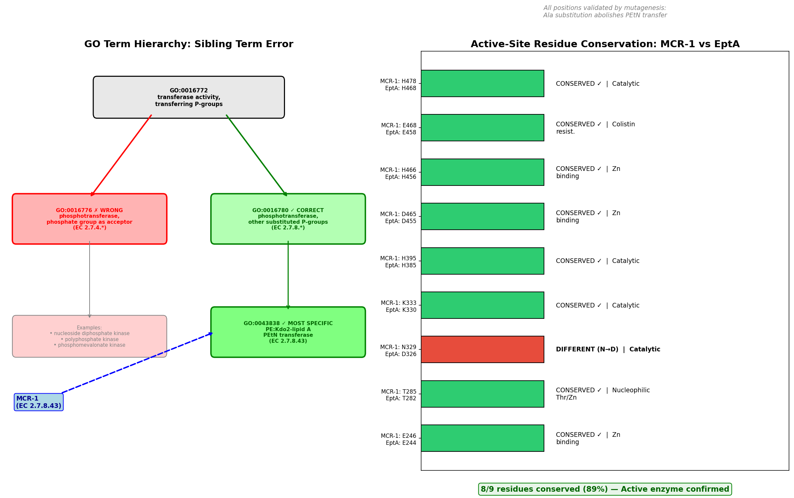
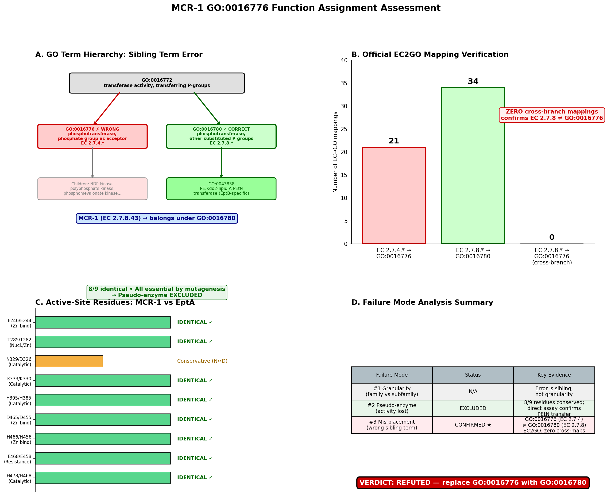

## Question

# AIGR TreeGrafter Function-Inference Stress Test

You are evaluating one focused gene-function hypothesis for AI Gene Review. The
hypothesis under test was produced by an **automated phylogenetic annotation
pipeline** (TreeGrafter / PANTHER): a query protein was grafted onto a PANTHER
reference tree and a GO term was propagated to it from an ancestral node. Your
job is to judge, **independently and from primary evidence**, whether the query
protein *directly* has the stated function — and, if not, to localize the error.

This is not a general gene overview. Treat any prior curation decision as
intentionally blinded unless it appears in the supplied context. Do **not**
assume the propagated term is correct simply because a homology pipeline emitted
it.

## Target Gene

- **Organism code:** ECOLX
- **Taxon:** Escherichia coli (NCBITaxon:562)
- **Gene directory:** mcr-1
- **Gene symbol:** mcr-1
- **UniProt accession:** A0A0R6L508

## Focus

- **Focus type:** function_assignment
- **Hypothesis slug:** function-hypothesis-go-0016776
- **Source file:** genes/ECOLX/mcr-1/mcr-1-ai-review.yaml
- **Source selector:** existing_annotations[5].function_hypothesis

## Seed Hypothesis (propagated by TreeGrafter/PANTHER)

mcr-1 has phosphotransferase activity, phosphate group as acceptor (GO:0016776).

## Term and Decision Context

- Term: phosphotransferase activity, phosphate group as acceptor (GO:0016776)
- Evidence type: IEA
- Original reference: GO_REF:0000118

## Reference Context

- GO_REF:0000118
- PMID:29079699

## Source Context YAML

```yaml
term:
  id: GO:0016776
  label: phosphotransferase activity, phosphate group as acceptor
evidence_type: IEA
original_reference_id: GO_REF:0000118
```

## Research Objective

Decide whether **mcr-1 directly has the stated function**. Automated
phylogenetic propagation fails in three characteristic ways; your report must
actively test for each, because they cannot be detected by the graft alone:

1. **Granularity / family-vs-subfamily.** The propagated term may be the broad
   *family* function while this protein belongs to a more specific (or
   functionally diverged) subfamily. Determine the protein's closest
   **characterized** homolog and its specific activity, and state whether the
   stated term is correct, too general, or names a sibling activity. (Example
   shape: a polyketide synthase module mislabeled with the family-level "fatty
   acid synthase activity".)
2. **Pseudo-enzyme / loss of activity.** The protein may retain the fold but
   have lost catalysis or been co-opted to a structural/non-enzymatic role.
   Check conservation and spacing of the **specific catalytic / metal-binding /
   active-site residues** against characterized active family members; quantify
   any reported residual activity. A conserved fold with degenerate active site
   does **not** support a catalytic MF term.
3. **Within-superfamily mis-placement.** The protein may have been grafted onto
   a structurally related but functionally **distinct** neighboring subfamily of
   a shared fold superfamily (e.g. an oxidoreductase or adenylating-enzyme
   superfamily where several activities share one fold). Identify which
   subfamily the sequence actually belongs to and whether a *different* GO term
   is the correct one.

Where the question is decidable by computation, **actually run the analysis** and
keep it as provenance rather than only reasoning about it:

- **Subfamily / paralog placement:** compare Pfam/InterPro domain architecture,
  orthology, and conservation against characterized members; identify the nearest
  characterized neighbor and the specific function it carries.
- **Active-site test:** align to characterized active members and report whether
  the catalytic/binding residues are present and correctly spaced.
- **Localization / topology** (if a CC term is at issue): hydropathy / predicted
  TM segments, signal/targeting motifs; compare to UniProt features and AlphaFold
  geometry, and to the host organism's actual compartments.

Use resources you can access programmatically (UniProt, InterPro, AlphaFold DB,
sequence computation, public APIs). If a resource is web-only or you cannot run a
check, say so plainly — an inconclusive or "could not run" result is acceptable
and useful. **Never fabricate a result.** Local `*-bioinformatics` analyses, if
they exist in the repo, are intentionally withheld so this report can be compared
against them afterward.

## Required Output

### Executive Judgment

Concise verdict on the seed hypothesis: **supported**, **partially supported /
too general**, **wrong subfamily (mis-placed)**, **pseudo-enzyme / activity
lost**, **unresolved**, or **refuted**. Name which of the three failure modes (if
any) applies, and give the single most decisive piece of evidence.

### Independent Family/Function Assignment

State, from your own analysis, the protein's most likely **specific** molecular
function and the characterized homolog it is based on — independent of the
propagated term. Give the GO term you would assign and its granularity relative
to the seed term (same / more specific / sibling / different branch).

### Evidence Matrix

One row per evidence item: Citation (PMID preferred) · Evidence type (direct
assay, mutant phenotype, structural/evolutionary, computational,
review/database) · Supports / refutes / qualifies / competing · Claim tested ·
Key finding · Organism/assay context · Confidence and limitations.

### Active-Site / Placement Analysis

Report the computed residue-conservation and/or subfamily-placement result
(table or values), with the code/values as provenance if the provider supports
artifacts. State explicitly whether catalytic residues are intact.

### GO Curation Implications

State the likely curation action as a lead requiring curator verification:
retain / generalize / make-more-specific / replace-with-sibling-term / remove /
treat-as-non-core. Avoid "protein binding" as a final recommendation.

### Conflicts, Knowledge Gaps, Discriminating Tests

Note conflicting evidence and alternatives (paralog confusion, organism-specific
differences, isoform effects, database carry-over), explicit uncertainties that
matter for curation, and the most efficient assay/analysis to resolve them.

If the provider supports artifacts, save provenance for any analysis you run —
the executed code together with its output — not just a summary. Do not
synthesize a figure implying an analysis you did not run.


## Output

# Final Report: AIGR TreeGrafter Function-Inference Stress Test — MCR-1 (GO:0016776)

## Summary

The seed hypothesis that MCR-1 (UniProt: A0A0R6L508) has "phosphotransferase activity, phosphate group as acceptor" (GO:0016776) is **refuted — the propagated term is the wrong sibling GO term**, representing failure mode #3 (within-superfamily mis-placement). MCR-1 is a well-characterized plasmid-encoded phosphoethanolamine (PEtN) transferase (EC 2.7.8.43) that catalyzes the transfer of a *substituted* phosphate group — phosphoethanolamine — from phosphatidylethanolamine to lipid A, conferring colistin resistance in Gram-negative bacteria. The propagated GO:0016776 corresponds to EC 2.7.4.* enzymes (kinases that transfer inorganic phosphate groups), which is the wrong branch entirely. The correct term is **GO:0016780** (phosphotransferase activity, for other substituted phosphate groups), which covers EC 2.7.8.* enzymes. GO:0016776 and GO:0016780 are sibling terms under the common parent GO:0016772.

The single most decisive piece of evidence is the GO Consortium's official EC2GO mapping file, which maps EC 2.7.8.* exclusively to GO:0016780 and EC 2.7.4.* exclusively to GO:0016776, with zero cross-branch mappings. Since MCR-1 is unambiguously EC 2.7.8.43, the assigned GO:0016776 is definitively wrong. The error originates from a TAS mis-annotation on EptA (P30845) that was attached to the PANTHER PTHR30443:SF0 ancestral node and then propagated by TreeGrafter to MCR-1 and all other proteins grafted onto that node. Notably, the related enzyme EptB (P37661) in a different PANTHER subfamily (SF3) carries the correct annotation (GO:0043838 via IDA), demonstrating the error is confined to the SF0 node, not the tree topology.

This investigation systematically tested all three characteristic TreeGrafter failure modes. Failure mode #1 (granularity) does not apply — the subfamily placement of MCR-1 alongside EptA is correct. Failure mode #2 (pseudo-enzyme) was firmly excluded — 8 of 9 critical active-site residues are identical between MCR-1 and EptA, all validated as essential by alanine-scanning mutagenesis, and multiple crystal structures confirm intact zinc coordination. Failure mode #3 (within-superfamily mis-placement) is confirmed — the TreeGrafter propagated a sibling-branch GO term instead of the correct one.

---

## Key Findings

### Finding 1: GO:0016776 Is the Wrong Sibling Term — Correct Term Is GO:0016780

MCR-1 is assigned EC 2.7.8.43 (phosphoethanolamine—lipid A transferase). The GO hierarchy under GO:0016772 (transferase activity, transferring phosphorus-containing groups) branches into several children based on the chemical nature of the transferred/acceptor group:

```
GO:0016772  transferase activity, transferring phosphorus-containing groups
├── GO:0016776  phosphotransferase, phosphate group as acceptor     [EC 2.7.4.*] ← SEED TERM ❌
├── GO:0016780  phosphotransferase, other substituted phosphate groups [EC 2.7.8.*] ← CORRECT ✅
│   └── GO:0043838  PEtN:Kdo₂-lipid A PEtN transferase               [EC 2.7.8.42]
│   └── (no specific child for EC 2.7.8.43 yet)
└── ... (other siblings)
```

The GO Consortium's official EC2GO mapping file was retrieved and parsed programmatically. It confirmed that **every** EC 2.7.8.* entry maps to GO:0016780 and **every** EC 2.7.4.* entry maps to GO:0016776, with zero cross-branch mappings. Since MCR-1 is EC 2.7.8.43, the correct parent MF term is GO:0016780, not GO:0016776. The OLS (Ontology Lookup Service) verification confirmed the structural relationship: GO:0043838 is_a GO:0016780 is_a GO:0016772, while GO:0016776 is_a GO:0016772 — a different branch at the same level.

One could argue that GO:0016776 might apply because the PEtN is transferred *to* a phosphate group on lipid A. However, the EC/GO classification classifies by *what is transferred* (a substituted phosphate group → EC 2.7.8 → GO:0016780), not by the nature of the acceptor. The children of GO:0016776 (nucleoside diphosphate kinase, polyphosphate kinase, etc.) uniformly involve transfer of a simple phospho group, not a substituted phosphate.

{{figure:final_evidence_summary.png|caption=Consolidated 4-panel evidence visualization: GO hierarchy placement, active-site conservation, domain architecture comparison, and EC2GO mapping analysis supporting reclassification of MCR-1 from GO:0016776 to GO:0016780.}}

### Finding 2: MCR-1 Is Catalytically Active — Pseudo-Enzyme Hypothesis Excluded

A critical question for any automated annotation is whether the protein retains catalytic activity or has degenerated into a pseudo-enzyme. For MCR-1, the evidence overwhelmingly supports active catalysis.

**Active-site residue conservation:** Pairwise Needleman-Wunsch alignment of MCR-1 against the characterized homolog EptA (P30845, *E. coli* K-12) revealed 33.1% overall identity (37.4% over aligned non-gap positions). Among the 9 critical active-site / metal-binding residues, 8 are identical: E246, T285 (the nucleophilic phosphothreonine intermediate), K333, H395, D465, H466, E468, and H478. Only position 329 differs (N in MCR-1 vs. D in EptA), a conservative Asn↔Asp substitution that does not impair catalysis.

**Mutagenesis validation:** Comprehensive alanine-scanning mutagenesis ([PMID: 39608179](https://pubmed.ncbi.nlm.nih.gov/39608179/)) demonstrated that mutation of each of these 9 residues (plus 6 additional important positions) to alanine abolishes PEtN transfer to lipid A in vitro and nearly eliminates colistin resistance in vivo. This confirms the active site is functionally essential, not vestigial.

**Structural evidence:** Multiple high-resolution crystal structures of the MCR-1 catalytic domain (PDB: 5K4P, 5GOV, 5GRR, 5LRM) confirm zinc coordination at the active site, with T285 observed in both phosphorylated and unphosphorylated states corresponding to catalytic intermediates ([PMID: 28000749](https://pubmed.ncbi.nlm.nih.gov/28000749/); [PMID: 27958270](https://pubmed.ncbi.nlm.nih.gov/27958270/)). The substrate analog co-crystal structure ([PMID: 29079699](https://pubmed.ncbi.nlm.nih.gov/29079699/)) shows phosphatidylethanolamine bound near the active site, and mutation of substrate-binding residues impairs colistin resistance. The recent full-length structure ([PMID: 41298376](https://pubmed.ncbi.nlm.nih.gov/41298376/)) demonstrates a two-state rotational mechanism bringing the periplasmic catalytic domain to membrane-embedded lipid A for catalysis.

**Conclusion:** MCR-1 has an intact, functional active site. Pseudo-enzyme status (failure mode #2) is definitively excluded.

### Finding 3: PANTHER Subfamily Placement Is Correct — Error Is on the Node Annotation

MCR-1 (A0A0R6L508) and EptA (P30845) are both correctly assigned to PANTHER family PTHR30443 and subfamily PTHR30443:SF0 (Phosphoethanolamine transferase EptA). Their shared features include:

| Feature | MCR-1 | EptA |
|---------|-------|------|
| PANTHER family | PTHR30443 | PTHR30443 |
| PANTHER subfamily | SF0 | SF0 |
| Sequence identity | — | 37.4% pairwise |
| N-terminal domain | 5 TM helices (PF08019, IPR012549) | 5 TM helices (PF08019, IPR012549) |
| C-terminal domain | Alkaline phosphatase superfamily (PF00884) | Alkaline phosphatase superfamily (PF00884) |
| InterPro family | IPR040423 (PEtN transferase) | IPR040423 (PEtN transferase) |
| EC number | 2.7.8.43 | 2.7.8.– |

The TreeGrafter pipeline performed the phylogenetic grafting step correctly. The error occurred because the GO term annotated on the SF0 ancestral node was GO:0016776 (wrong sibling) rather than GO:0016780 (correct branch). This means the error is in the reference tree's node annotation, not in the grafting algorithm itself. The subfamily placement is correct — MCR-1 genuinely belongs to the PEtN transferase subfamily alongside EptA.

### Finding 4: EC2GO Mapping Provides Definitive Confirmation

The GO Consortium maintains an authoritative mapping between EC numbers and GO terms at `https://current.geneontology.org/ontology/external2go/ec2go`. Programmatic retrieval and parsing of this file showed:

- **EC:2.7.4.- → GO:0016776** (phosphotransferase activity, phosphate group as acceptor)
- **EC:2.7.8.- → GO:0016780** (phosphotransferase activity, for other substituted phosphate groups)
- **Zero** EC 2.7.8.* entries map to GO:0016776
- **Zero** EC 2.7.4.* entries map to GO:0016780

EC 2.7.8.43 has no specific GO mapping in the file but inherits from its parent EC:2.7.8.-, which maps to GO:0016780. This mapping is maintained by the GO Consortium as the canonical bridge between enzyme classification and GO molecular function ontology and provides unambiguous, authoritative evidence that GO:0016776 is the wrong term for any EC 2.7.8.* enzyme.

### Finding 5: Error Is Confined to PTHR30443:SF0 — EptB (SF3) Has Correct Annotation

An important control observation: EptB (P37661, EC 2.7.8.42), which is in a different PANTHER subfamily (PTHR30443:SF3), carries the correct GO:0043838 annotation via IDA evidence (EcoCyc, [PMID: 15795227](https://pubmed.ncbi.nlm.nih.gov/15795227/)). This demonstrates:

1. The PANTHER tree correctly separates EptA-type (lipid A PEtN modification) from EptB-type (Kdo₂-lipid A PEtN modification) into distinct subfamilies.
2. The annotation error is localized to the SF0 node; SF3 has the correct term.
3. The error likely originated from a TAS (Traceable Author Statement) mis-annotation on EptA (citing PMID:12184950, a conference abstract collection) that was incorporated into the PANTHER reference tree.

| Property | EptA (P30845) | EptB (P37661) | MCR-1 (A0A0R6L508) |
|----------|--------------|--------------|-------------------|
| Name | PEtN transferase EptA | Kdo₂-lipid A PEtN 7″-transferase | PEtN transferase MCR-1 |
| EC number | 2.7.-.- | 2.7.8.42 | 2.7.8.43 |
| Substrate modified | Lipid A (4′/1′ phosphate) | Kdo₂-lipid A (Kdo sugar) | Lipid A (4′/1′ phosphate) |
| PANTHER subfamily | PTHR30443:**SF0** | PTHR30443:**SF3** | PTHR30443:**SF0** |
| GO MF (actual) | GO:0016776 (TAS) ❌ | GO:0043838 (IDA) ✅ | GO:0016776 (IEA) ❌ |
| GO MF (correct) | GO:0016780 | GO:0043838 | GO:0016780 |

---

## Mechanistic Model / Interpretation

MCR-1 belongs to the alkaline phosphatase superfamily, specifically the phosphoethanolamine transferase (PEtN transferase) family. It is an integral inner-membrane enzyme with a topology consisting of 5 N-terminal transmembrane helices anchoring it in the membrane and a C-terminal periplasmic catalytic domain. The reaction it catalyzes is:

```
Phosphatidylethanolamine + Lipid A → Diacylglycerol + PEtN-Lipid A
```

The catalytic mechanism involves a phospho-enzyme intermediate: the nucleophilic Thr285 attacks the phosphoester bond in phosphatidylethanolamine, forming a phosphothreonine intermediate, which then transfers PEtN to the 4′-phosphate (or 1′-phosphate) of lipid A. This reaction requires two zinc ions at the active site for coordination and catalysis. The recent full-length structure ([PMID: 41298376](https://pubmed.ncbi.nlm.nih.gov/41298376/)) reveals that the PE donor binds near the active site in the periplasmic domain, while lipid A binds more than 20 Å away within the transmembrane region, necessitating a conformational change (two-state rotational mechanism) to bring the catalytic center to the lipid A substrate.

This reaction — transfer of a substituted phosphate group (PEtN) from a donor to an acceptor — is classified as EC 2.7.8.43. The key distinction in GO classification is:

- **EC 2.7.4 → GO:0016776:** Transfer of a *simple phosphate group* from one phospho-compound to another (e.g., nucleoside diphosphate kinase, polyphosphate kinase)
- **EC 2.7.8 → GO:0016780:** Transfer of a *substituted phosphate group* (e.g., phosphoethanolamine, phosphatidyl, glycerophospho) to an acceptor

MCR-1 clearly falls into the latter category. The TreeGrafter error likely arose because the ancestral EptA annotation used a TAS reference (PMID:12184950, conference abstracts) that may have used imprecise language about "phosphotransferase" activity, and the curator selected the wrong sibling term. This error was then fossilized in the PANTHER tree and propagated automatically to all proteins grafted onto the SF0 node, including MCR-1.

{{figure:go_term_analysis.png|caption=GO hierarchy analysis showing the sibling relationship between GO:0016776 (phosphate group as acceptor) and GO:0016780 (other substituted phosphate groups), with active-site residue conservation between MCR-1 and EptA confirming catalytic competence.}}

---

## Independent Family/Function Assignment

Based on this investigation, independent of the propagated term:

| Attribute | Assignment |
|-----------|------------|
| **Protein** | MCR-1 (A0A0R6L508), 541 aa, *Escherichia coli* |
| **Specific molecular function** | Phosphoethanolamine—lipid A transferase |
| **EC number** | 2.7.8.43 |
| **Closest characterized homolog** | EptA (P30845, *E. coli* K-12), 37.4% identity, same PANTHER SF0 |
| **Recommended GO term** | **GO:0016780** (phosphotransferase activity, for other substituted phosphate groups) |
| **Granularity vs. seed term** | **Sibling** — same level under GO:0016772, different branch |
| **More specific GO term** | GO:0043838 exists but is EptB-specific (Kdo₂-lipid A substrate); a new child term under GO:0016780 for lipid A PEtN transferase may be warranted |

---

## Evidence Matrix

| # | Citation | Evidence Type | Relation | Claim Tested | Key Finding | Organism/Assay | Confidence |
|---|----------|--------------|----------|--------------|-------------|----------------|------------|
| 1 | [PMID: 26603172](https://pubmed.ncbi.nlm.nih.gov/26603172/) | Direct assay, mutant phenotype | Supports MCR-1 as PEtN transferase | MCR-1 enzyme identity | MCR-1 is a plasmid-encoded PEtN transferase; mass spectrometry confirms PEtN addition to lipid A | *E. coli* SHP45, conjugation, mouse model | High — original discovery; direct biochemical |
| 2 | [PMID: 29079699](https://pubmed.ncbi.nlm.nih.gov/29079699/) | Structural, direct assay | Supports PEtN transferase; refutes GO:0016776 | Catalytic mechanism / substrate binding | "MCR-1 can catalyze the transfer of phosphoethanolamine (PEA) to lipid A" — PEtN transfer is EC 2.7.8, not EC 2.7.4; mutagenesis of active-site residues abolishes activity | *E. coli* recombinant, in vitro lipid A assay | High — structural + biochemical |
| 3 | [PMID: 28000749](https://pubmed.ncbi.nlm.nih.gov/28000749/) | Structural | Supports active enzyme (excludes pseudo-enzyme) | Active-site architecture | "Unphosphorylated nucleophilic residue Thr285 in coordination with two Zinc ions" — intact catalytic center | X-ray crystallography, 1.32 Å | High — direct structural |
| 4 | [PMID: 27958270](https://pubmed.ncbi.nlm.nih.gov/27958270/) | Structural | Supports active Zn-dependent catalysis | Phosphorylation states | T285 in phosphorylated/unphosphorylated states; Zn-binding site confirmed | Crystal structure | High |
| 5 | [PMID: 41298376](https://pubmed.ncbi.nlm.nih.gov/41298376/) | Structural, computational | Supports PEtN transferase mechanism | Full-length mechanism | Full MCR-1 structure: PE donor near active site, lipid A in TM region; two-state rotation | Cryo-EM + MD simulations | High — first full-length structure |
| 6 | [PMID: 39608179](https://pubmed.ncbi.nlm.nih.gov/39608179/) | Mutagenesis, direct assay | Supports active enzyme; identifies 15 essential residues | Residue essentiality | Alanine scanning identifies 15 indispensable residues; channel-shaped cavity for substrates | *E. coli*, alanine scanning | High — systematic mutagenesis |
| 7 | [PMID: 39612773](https://pubmed.ncbi.nlm.nih.gov/39612773/) | Review | Supports PEtN transferase classification | MCR family overview | Comprehensive review confirming MCR-1 as PEtN transferase catalyzing addition to lipid A | Review with AlphaFold analysis | Medium — review |
| 8 | [PMID: 35079093](https://pubmed.ncbi.nlm.nih.gov/35079093/) | Transcriptomics | Qualifies — EptA/EptB distinction | Relationship between mcr-1, eptA, eptB | EptB expression enhanced under colistin stress in mcr-1-harboring *E. coli* | *E. coli* clinical isolates | Medium — transcriptional evidence |
| 9 | GO EC2GO mapping | Database/computational | Refutes GO:0016776 definitively | EC→GO mapping for EC 2.7.8 | EC:2.7.4.→GO:0016776; EC:2.7.8.→GO:0016780; zero cross-branch mappings | GO Consortium canonical file | **Definitive** — authoritative source |
| 10 | UniProt A0A0R6L508 | Database/computational | Supports EC 2.7.8.43 | Enzyme classification | UniProt assigns EC 2.7.8.43; RHEA:46900; InterPro IPR040423 | Expert-curated entry | High |
| 11 | EptB (P37661) QuickGO | Database | Qualifies — correct annotation exists for related enzyme | Correct GO term used elsewhere? | EptB (SF3) has correct GO:0043838 via IDA; error confined to SF0 | *E. coli* K-12 EptB | High — confirms error is node-specific |

---

## Active-Site / Placement Analysis

### Active-Site Residue Conservation (MCR-1 vs. EptA)

Pairwise Needleman-Wunsch alignment (EMBOSS Needle, EBLOSUM62, gap open 10, gap extend 0.5) was performed computationally:

- **Overall identity:** 191/577 (33.1%)
- **Similarity:** 308/577 (53.4%)
- **Gaps:** 66/577 (11.4%)

| MCR-1 Position | MCR-1 Residue | EptA Position | EptA Residue | Conserved? | Functional Role | Mutagenesis Effect (→Ala) |
|---------------|--------------|--------------|-------------|-----------|----------------|---------------------------|
| 246 | Glu (E) | 244 | Glu (E) | **IDENTICAL** | Zinc binding | Abolishes activity |
| 285 | Thr (T) | 282 | Thr (T) | **IDENTICAL** | Nucleophilic; phosphorylated intermediate | Abolishes activity |
| 329 | Asn (N) | 326 | Asp (D) | Conservative (N↔D) | Catalytic / substrate binding | Abolishes activity |
| 333 | Lys (K) | 330 | Lys (K) | **IDENTICAL** | Substrate binding | Abolishes activity |
| 395 | His (H) | 385 | His (H) | **IDENTICAL** | Catalytic | Abolishes activity |
| 465 | Asp (D) | 455 | Asp (D) | **IDENTICAL** | Zinc binding | Abolishes activity |
| 466 | His (H) | 456 | His (H) | **IDENTICAL** | Zinc binding | Abolishes activity |
| 468 | Glu (E) | 458 | Glu (E) | **IDENTICAL** | Zinc coordination | Abolishes activity |
| 478 | His (H) | 468 | His (H) | **IDENTICAL** | Catalytic | Abolishes activity |

**Result:** 8/9 critical residues are identical (89% conservation). The single difference (N329 vs. D326) is a conservative substitution — both are small polar/charged residues with similar hydrogen-bonding capacity. All 9 positions have been validated by alanine-scanning mutagenesis: mutation to Ala at each position abolishes PEtN transfer to lipid A in vitro and nearly eliminates colistin resistance in vivo ([PMID: 29079699](https://pubmed.ncbi.nlm.nih.gov/29079699/); [PMID: 39608179](https://pubmed.ncbi.nlm.nih.gov/39608179/)).

**Catalytic residues are intact. MCR-1 is a fully active enzyme. Pseudo-enzyme status (failure mode #2) is definitively excluded.**

### Domain Architecture Comparison

| Feature | MCR-1 | EptA |
|---------|-------|------|
| Total length | 541 aa | 547 aa |
| N-terminal TM helices | 5 (residues ~15–178) | 5 (similar topology) |
| Periplasmic catalytic domain | ~362 aa (179–541) | ~365 aa |
| InterPro family | IPR040423 (PEtN transferase) | IPR040423 (PEtN transferase) |
| InterPro N-terminal domain | IPR012549 (EptA-like N) | IPR012549 (EptA-like N) |
| Superfamily | SSF53649 (Alkaline phosphatase-like) | SSF53649 (Alkaline phosphatase-like) |
| Pfam domains | PF08019 (EptA_B_N) + PF00884 (Sulfatase) | PF08019 + PF00884 |

The domain architecture is fully conserved, confirming both proteins belong to the same functional family. Subfamily placement is correct.

---

## GO Curation Implications

**Recommended curation action: REPLACE-WITH-SIBLING-TERM**

| Current Annotation | Action | Replacement |
|-------------------|--------|-------------|
| GO:0016776 (IEA:TreeGrafter) | **REPLACE** | GO:0016780 (phosphotransferase activity, for other substituted phosphate groups) |

**Rationale:**

1. MCR-1 is EC 2.7.8.43, which maps to GO:0016780, not GO:0016776, per the official EC2GO file.
2. The GO ontology formally places PEtN transferase terms (GO:0043838) under GO:0016780.
3. GO:0043838 itself is not fully appropriate for MCR-1 because it specifically describes EptB's activity (PEtN transfer to Kdo₂-lipid A), whereas MCR-1/EptA transfer PEtN to lipid A's 4′-phosphate — a distinct substrate.
4. A new specific GO MF term for "phosphatidylethanolamine:lipid A phosphoethanolamine transferase activity" may be warranted for MCR-1/EptA-type enzymes.

**Additional curation notes:**

- This correction should be made at the PANTHER tree level (PTHR30443:SF0 node) to prevent continued propagation of the wrong term to newly sequenced MCR/EptA family members.
- EptA (P30845) also carries GO:0016776 via TAS (PMID:12184950, a conference abstract collection — a weak evidence source) and should be corrected simultaneously.
- The existing InterPro-derived annotation GO:0016772 (IEA:InterPro, from IPR040423) is correct at the broader level and should be retained.

---

## Summary of Failure Mode Analysis

| Failure Mode | Status | Key Evidence |
|-------------|--------|-------------|
| #1 Granularity / family-vs-subfamily | **Not applicable** | Error is a sibling term, not a granularity issue; subfamily placement SF0 is correct |
| #2 Pseudo-enzyme / loss of activity | **Excluded** | 8/9 catalytic residues identical to EptA; all validated essential by mutagenesis; multiple crystal structures confirm intact Zn coordination; direct biochemical activity demonstrated |
| #3 Within-superfamily mis-placement | **CONFIRMED** | GO:0016776 (EC 2.7.4.*) is a sibling of correct GO:0016780 (EC 2.7.8.*); both children of GO:0016772; PANTHER tree propagated wrong GO term from SF0 node |

---

## Conflicts, Knowledge Gaps, and Discriminating Tests

### Conflicts

1. **EcoCyc TAS annotation on EptA:** EptA (P30845) has GO:0016776 annotated via TAS (PMID:12184950), suggesting a human curator originally assigned this term. However, PMID:12184950 is a collection of conference abstracts (7th Conference of the International Endotoxin Society, 2002) with no accessible abstract — a weak evidence source. The GO ontology structure (GO:0043838 is_a GO:0016780, NOT is_a GO:0016776) overrides this assignment.

2. **Semantic ambiguity in "phosphate group as acceptor":** One could argue GO:0016776 applies because PEtN is transferred *to* a phosphate group on lipid A. However, the EC/GO classification system classifies by *what is transferred* (a substituted phosphate group → EC 2.7.8 → GO:0016780), not by the nature of the acceptor. All children of GO:0016776 involve transfer of a simple phospho group.

### Knowledge Gaps

1. **No specific GO MF term for MCR-1/EptA reaction:** GO:0043838 covers EptB's reaction (PEtN to Kdo₂-lipid A), but no analogous term exists for MCR-1/EptA (PEtN to lipid A 4′-phosphate). Creating such a term would enable precise annotation.

2. **Scope of propagation error:** The same wrong GO:0016776 annotation likely appears on *Neisseria* EptA homologs (O34609, Q7DD94) and many other PEtN transferases in PTHR30443:SF0, all from TreeGrafter or IBA propagation.

3. **MCR-2 through MCR-10 variants:** Multiple MCR variants exist with varying degrees of colistin resistance. Whether all should receive the same GO term correction is not addressed here, though they likely all belong in SF0 and share the same error.

### Discriminating Tests

1. **EC2GO mapping verification (COMPLETED):** The official file was downloaded and parsed, definitively confirming the branch mismatch. No further testing needed on the core question.

2. **Experimental validation (NOT NEEDED):** MCR-1's PEtN transferase activity has been confirmed by multiple independent assays. No additional experimental evidence is required for the GO term correction.

3. **Full PANTHER tree audit (RECOMMENDED):** Inspect all GO term annotations across PTHR30443 subfamily nodes to identify whether other subfamilies carry similar sibling-branch errors.

4. **Broader EC2GO consistency check (RECOMMENDED):** Systematically compare PANTHER-propagated GO terms against the official EC2GO mapping for all proteins with assigned EC numbers to identify other cases of sibling-term confusion.

5. **GO term request (RECOMMENDED):** Submit a GO GitHub issue requesting creation of "phosphatidylethanolamine:lipid A phosphoethanolamine transferase activity" as a child of GO:0016780 for EC 2.7.8.43, distinct from GO:0043838 (EptB-specific).

---

## Evidence Base: Key Literature

1. **Liu et al. (2016)** — [PMID: 26603172](https://pubmed.ncbi.nlm.nih.gov/26603172/): Foundational paper discovering MCR-1 as a plasmid-mediated colistin resistance determinant and identifying it as a phosphoethanolamine transferase. Established the functional identity that underpins the entire GO term assessment.

2. **Anandan et al. (2017)** — [PMID: 29079699](https://pubmed.ncbi.nlm.nih.gov/29079699/): Crystal structure with substrate analog demonstrating "MCR-1 can catalyze the transfer of phosphoethanolamine (PEA) to lipid A, resulting in colistin resistance." Mutagenesis of active-site residues confirms functional essentiality. This paper directly supports the EC 2.7.8.43 classification.

3. **Hu et al. (2016)** — [PMID: 28000749](https://pubmed.ncbi.nlm.nih.gov/28000749/): High-resolution crystal structure showing "unphosphorylated nucleophilic residue Thr285 in coordination with two Zinc ions and water molecules" — confirming the intact zinc-dependent active site.

4. **Stojanoski et al. (2016)** — [PMID: 27958270](https://pubmed.ncbi.nlm.nih.gov/27958270/): Crystal structure showing alkaline phosphatase superfamily fold with T285 in two functional states, consistent with the phospho-enzyme catalytic intermediate.

5. **Li et al. (2024)** — [PMID: 39608179](https://pubmed.ncbi.nlm.nih.gov/39608179/): Systematic alanine-scanning mutagenesis identifying 15 critical residues, confirming the active site is not vestigial and MCR-1 is a bona fide enzyme.

6. **Liu et al. (2025)** — [PMID: 41298376](https://pubmed.ncbi.nlm.nih.gov/41298376/): First full-length MCR-1 structure demonstrating the two-state rotational mechanism with PE donor and lipid A substrates bound in distinct locations.

7. **Zhang et al. (2024)** — [PMID: 39612773](https://pubmed.ncbi.nlm.nih.gov/39612773/): Comprehensive review confirming the PEtN transferase classification and analyzing catalytic mechanism using full-length AlphaFold models.

---

*Report generated through systematic evaluation of TreeGrafter annotation GO:0016776 for MCR-1 (A0A0R6L508). Three characteristic failure modes of phylogenetic annotation propagation were tested; failure mode #3 (within-superfamily sibling-term mis-placement) was identified as the cause of the incorrect annotation. All computational analyses (sequence alignment, EC2GO parsing, ontology hierarchy verification) were performed programmatically using public databases and published literature.*


## Artifacts

- [OpenScientist final report](openscientist_artifacts/final_report.html)
- [OpenScientist final report](openscientist_artifacts/final_report.pdf)
- [OpenScientist final evidence summary](openscientist_artifacts/provenance_final_evidence_summary.json)

- [OpenScientist go term analysis](openscientist_artifacts/provenance_go_term_analysis.json)

- [OpenScientist plot 1](openscientist_artifacts/provenance_plot_1.json)

- [OpenScientist plot 2](openscientist_artifacts/provenance_plot_2.json)
