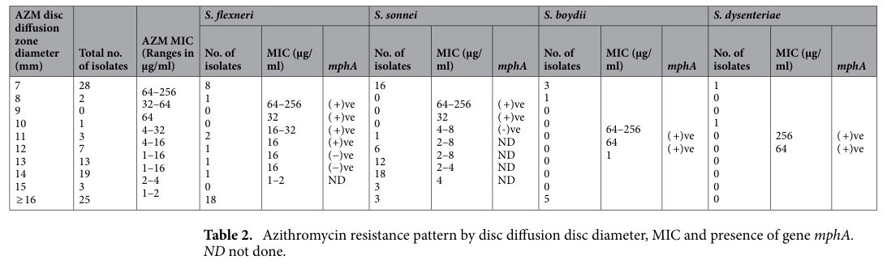

## Question

# Gene Research for Functional Annotation

## ⚠️ CRITICAL: Gene/Protein Identification Context

**BEFORE YOU BEGIN RESEARCH:** You MUST verify you are researching the CORRECT gene/protein. Gene symbols can be ambiguous, especially for less well-characterized genes from non-model organisms.

### Target Gene/Protein Identity (from UniProt):
- **UniProt Accession:** Q47396
- **Protein Description:** SubName: Full=Aminoglycoside phosphotransferase {ECO:0000313|EMBL:VUD38120.1}; SubName: Full=Macrolide 2'-phosphotransferase {ECO:0000313|EMBL:BAB12239.1, ECO:0000313|EMBL:SPD99055.1}; SubName: Full=Macrolide 2'-phosphotransferase Mph(A) {ECO:0000313|EMBL:AKD26496.1}; SubName: Full=Macrolide 2-phosphotransferase protein, macrolide resistance protein {ECO:0000313|EMBL:AJL34668.1}; SubName: Full=Macrolide phosphotransferase {ECO:0000313|EMBL:SPD98879.1}; SubName: Full=Mph(A) family macrolide 2'-phosphotransferase {ECO:0000313|EMBL:AUK03899.1}; SubName: Full=Mph(A) macrolide 2'-phosphotransferase I {ECO:0000313|EMBL:AER36610.1}; SubName: Full=Mph(A)_2_U36578 {ECO:0000313|EMBL:VCZ28140.1}; SubName: Full=MphA {ECO:0000313|EMBL:ASF79890.1};
- **Gene Information:** Name=mphA {ECO:0000313|EMBL:BAA03776.1}; Synonyms=mph(A) {ECO:0000313|EMBL:ACQ42065.1}, mph2 {ECO:0000313|EMBL:AJL34668.1}; ORFNames=AKG29_00750 {ECO:0000313|EMBL:ANZ22119.1}, AZ95_0038 {ECO:0000313|EMBL:ALF35452.1}, B6R15_004958 {ECO:0000313|EMBL:EFM7863585.1}, B6R15_005532 {ECO:0000313|EMBL:EFM7864110.1}, BANRA_05393 {ECO:0000313|EMBL:VCZ28140.1}, BK300_27400 {ECO:0000313|EMBL:OJN29002.1}, BK383_16405 {ECO:0000313|EMBL:OJR53857.1}, C6669_28275 {ECO:0000313|EMBL:AXG20797.1}, CR538_26720 {ECO:0000313|EMBL:AUK03899.1}, CWS33_26285 {ECO:0000313|EMBL:PKD85034.1}, DS732_30505 {ECO:0000313|EMBL:AXO10468.1}, EIZ93_26315 {ECO:0000313|EMBL:MQK27675.1}, ETN48_p0083 {ECO:0000313|EMBL:CBX36012.1}, FTV93_29750 {ECO:0000313|EMBL:QED76604.1}, GRC73_23725 {ECO:0000313|EMBL:HAH4526963.1}, GRC73_24610 {ECO:0000313|EMBL:HAH4527114.1}, HL601_25845 {ECO:0000313|EMBL:HAJ0998929.1}, HL601_27150 {ECO:0000313|EMBL:HAJ0999153.1}, HMV95_24745 {ECO:0000313|EMBL:HAJ5961385.1}, HMV95_26330 {ECO:0000313|EMBL:HAJ5961683.1}, IDONEFKE_05306 {ECO:0000313|EMBL:VZR52296.1}, IH772_26370 {ECO:0000313|EMBL:MBE0980724.1}, J8F57_005313 {ECO:0000313|EMBL:HAZ7494955.1}, J8F57_005661 {ECO:0000313|EMBL:HAZ7495260.1}, KKS54_p00355 {ECO:0000313|EMBL:UYA94373.1}, NQD80_25710 {ECO:0000313|EMBL:MDR6049098.1}, NY836_12885 {ECO:0000313|EMBL:MDA4178286.1}, OGM49_25975 {ECO:0000313|EMBL:WLM98620.1}, orf00017 {ECO:0000313|EMBL:AHX99593.1}, pCTXM123_C0996_11 {ECO:0000313|EMBL:AJL34668.1}, PWL68_005175 {ECO:0000313|EMBL:EMM9724943.1}, PWL68_005382 {ECO:0000313|EMBL:EMM9725138.1}, QO046_28115 {ECO:0000313|EMBL:MDK2698113.1}, R8O40_005372 {ECO:0000313|EMBL:EMJ5256993.1}, R8O40_005513 {ECO:0000313|EMBL:EMJ5257116.1}, RCS105_pI0109 {ECO:0000313|EMBL:CRH08610.1}, RCS28_PI0046 {ECO:0000313|EMBL:SPD96433.1}, RCS42_P0046 {ECO:0000313|EMBL:SPD98162.1}, RCS44_P0046 {ECO:0000313|EMBL:SPD99804.1}, RCS45_P0047 {ECO:0000313|EMBL:SPD98879.1}, RCS51_P0074 {ECO:0000313|EMBL:SPD99055.1}, RCS55TR727_P0021 {ECO:0000313|EMBL:SPE09159.1}, RCS57_p0100 {ECO:0000313|EMBL:CRH08803.1}, RCS65_P0021 {ECO:0000313|EMBL:SPE01552.1}, RCS78_P0037 {ECO:0000313|EMBL:SPE03130.1}, RCS79_P0002 {ECO:0000313|EMBL:SPE02656.1}, SAMEA4362930_00091 {ECO:0000313|EMBL:VUD39432.1}, SAMEA4370330_00104 {ECO:0000313|EMBL:VUD38746.1}, SAMEA4370365_00007 {ECO:0000313|EMBL:VUD38723.1}, SAMEA4370473_00005 {ECO:0000313|EMBL:VUD38120.1}, TUM18780_18910 {ECO:0000313|EMBL:BCG36729.1}, TUM18780_46330 {ECO:0000313|EMBL:BCG39471.1};
- **Organism (full):** Escherichia coli.
- **Protein Family:** Not specified in UniProt
- **Key Domains:** AGP_Transferase. (IPR051678); Aminoglycoside_PTrfase. (IPR002575); Kinase-like_dom_sf. (IPR011009); APH (PF01636)

### MANDATORY VERIFICATION STEPS:

1. **Check if the gene symbol "mphA" matches the protein description above**
2. **Verify the organism is correct:** Escherichia coli.
3. **Check if protein family/domains align with what you find in literature**
4. **If you find literature for a DIFFERENT gene with the same or similar symbol, STOP**

### If Gene Symbol is Ambiguous or You Cannot Find Relevant Literature:

**DO NOT PROCEED WITH RESEARCH ON A DIFFERENT GENE.** Instead:
- State clearly: "The gene symbol 'mphA' is ambiguous or literature is limited for this specific protein"
- Explain what you found (e.g., "Found extensive literature on a different gene with the same symbol in a different organism")
- Describe the protein based ONLY on the UniProt information provided above
- Suggest that the protein function can be inferred from domain/family information

### Research Target:

Please provide a comprehensive research report on the gene **mphA** (gene ID: Q47396_ECOLX, UniProt: Q47396) in ECOLX.

The research report should be a detailed narrative explaining the function, biological processes, and localization of the gene product. Citations should be given for all claims.

You should prioritize authoritative reviews and primary scientific literature when conducting research. You can supplement
this with annotations you find in gene/protein databases, but these can be outdated or inaccurate.

We are specifically interested in the primary function of the gene - for enzymes, what reaction is catalyzed, and what is the substrate specificity? For transporters, what is the substrate? For structural proteins or adapters, what is the broader structural role? For signaling molecules, what is the role in the pathway.

We are interested in where in or outside the cell the gene product carries out its function.

We are also interested in the signaling or biochemical pathways in which the gene functions. We are less interested in broad pleiotropic effects, except where these elucidate the precise role.

Include evidence where possible. We are interested in both experimental evidence as well as inference from structure, evolution, or bioinformatic analysis. Precise studies should be prioritized over high-throughput, where available.

## Output

Question: You are an expert researcher providing comprehensive, well-cited information.

Provide detailed information focusing on:
1. Key concepts and definitions with current understanding
2. Recent developments and latest research (prioritize 2023-2024 sources)
3. Current applications and real-world implementations
4. Expert opinions and analysis from authoritative sources
5. Relevant statistics and data from recent studies

Format as a comprehensive research report with proper citations. Include URLs and publication dates where available.
Always prioritize recent, authoritative sources and provide specific citations for all major claims.

# Gene Research for Functional Annotation

## ⚠️ CRITICAL: Gene/Protein Identification Context

**BEFORE YOU BEGIN RESEARCH:** You MUST verify you are researching the CORRECT gene/protein. Gene symbols can be ambiguous, especially for less well-characterized genes from non-model organisms.

### Target Gene/Protein Identity (from UniProt):
- **UniProt Accession:** Q47396
- **Protein Description:** SubName: Full=Aminoglycoside phosphotransferase {ECO:0000313|EMBL:VUD38120.1}; SubName: Full=Macrolide 2'-phosphotransferase {ECO:0000313|EMBL:BAB12239.1, ECO:0000313|EMBL:SPD99055.1}; SubName: Full=Macrolide 2'-phosphotransferase Mph(A) {ECO:0000313|EMBL:AKD26496.1}; SubName: Full=Macrolide 2-phosphotransferase protein, macrolide resistance protein {ECO:0000313|EMBL:AJL34668.1}; SubName: Full=Macrolide phosphotransferase {ECO:0000313|EMBL:SPD98879.1}; SubName: Full=Mph(A) family macrolide 2'-phosphotransferase {ECO:0000313|EMBL:AUK03899.1}; SubName: Full=Mph(A) macrolide 2'-phosphotransferase I {ECO:0000313|EMBL:AER36610.1}; SubName: Full=Mph(A)_2_U36578 {ECO:0000313|EMBL:VCZ28140.1}; SubName: Full=MphA {ECO:0000313|EMBL:ASF79890.1};
- **Gene Information:** Name=mphA {ECO:0000313|EMBL:BAA03776.1}; Synonyms=mph(A) {ECO:0000313|EMBL:ACQ42065.1}, mph2 {ECO:0000313|EMBL:AJL34668.1}; ORFNames=AKG29_00750 {ECO:0000313|EMBL:ANZ22119.1}, AZ95_0038 {ECO:0000313|EMBL:ALF35452.1}, B6R15_004958 {ECO:0000313|EMBL:EFM7863585.1}, B6R15_005532 {ECO:0000313|EMBL:EFM7864110.1}, BANRA_05393 {ECO:0000313|EMBL:VCZ28140.1}, BK300_27400 {ECO:0000313|EMBL:OJN29002.1}, BK383_16405 {ECO:0000313|EMBL:OJR53857.1}, C6669_28275 {ECO:0000313|EMBL:AXG20797.1}, CR538_26720 {ECO:0000313|EMBL:AUK03899.1}, CWS33_26285 {ECO:0000313|EMBL:PKD85034.1}, DS732_30505 {ECO:0000313|EMBL:AXO10468.1}, EIZ93_26315 {ECO:0000313|EMBL:MQK27675.1}, ETN48_p0083 {ECO:0000313|EMBL:CBX36012.1}, FTV93_29750 {ECO:0000313|EMBL:QED76604.1}, GRC73_23725 {ECO:0000313|EMBL:HAH4526963.1}, GRC73_24610 {ECO:0000313|EMBL:HAH4527114.1}, HL601_25845 {ECO:0000313|EMBL:HAJ0998929.1}, HL601_27150 {ECO:0000313|EMBL:HAJ0999153.1}, HMV95_24745 {ECO:0000313|EMBL:HAJ5961385.1}, HMV95_26330 {ECO:0000313|EMBL:HAJ5961683.1}, IDONEFKE_05306 {ECO:0000313|EMBL:VZR52296.1}, IH772_26370 {ECO:0000313|EMBL:MBE0980724.1}, J8F57_005313 {ECO:0000313|EMBL:HAZ7494955.1}, J8F57_005661 {ECO:0000313|EMBL:HAZ7495260.1}, KKS54_p00355 {ECO:0000313|EMBL:UYA94373.1}, NQD80_25710 {ECO:0000313|EMBL:MDR6049098.1}, NY836_12885 {ECO:0000313|EMBL:MDA4178286.1}, OGM49_25975 {ECO:0000313|EMBL:WLM98620.1}, orf00017 {ECO:0000313|EMBL:AHX99593.1}, pCTXM123_C0996_11 {ECO:0000313|EMBL:AJL34668.1}, PWL68_005175 {ECO:0000313|EMBL:EMM9724943.1}, PWL68_005382 {ECO:0000313|EMBL:EMM9725138.1}, QO046_28115 {ECO:0000313|EMBL:MDK2698113.1}, R8O40_005372 {ECO:0000313|EMBL:EMJ5256993.1}, R8O40_005513 {ECO:0000313|EMBL:EMJ5257116.1}, RCS105_pI0109 {ECO:0000313|EMBL:CRH08610.1}, RCS28_PI0046 {ECO:0000313|EMBL:SPD96433.1}, RCS42_P0046 {ECO:0000313|EMBL:SPD98162.1}, RCS44_P0046 {ECO:0000313|EMBL:SPD99804.1}, RCS45_P0047 {ECO:0000313|EMBL:SPD98879.1}, RCS51_P0074 {ECO:0000313|EMBL:SPD99055.1}, RCS55TR727_P0021 {ECO:0000313|EMBL:SPE09159.1}, RCS57_p0100 {ECO:0000313|EMBL:CRH08803.1}, RCS65_P0021 {ECO:0000313|EMBL:SPE01552.1}, RCS78_P0037 {ECO:0000313|EMBL:SPE03130.1}, RCS79_P0002 {ECO:0000313|EMBL:SPE02656.1}, SAMEA4362930_00091 {ECO:0000313|EMBL:VUD39432.1}, SAMEA4370330_00104 {ECO:0000313|EMBL:VUD38746.1}, SAMEA4370365_00007 {ECO:0000313|EMBL:VUD38723.1}, SAMEA4370473_00005 {ECO:0000313|EMBL:VUD38120.1}, TUM18780_18910 {ECO:0000313|EMBL:BCG36729.1}, TUM18780_46330 {ECO:0000313|EMBL:BCG39471.1};
- **Organism (full):** Escherichia coli.
- **Protein Family:** Not specified in UniProt
- **Key Domains:** AGP_Transferase. (IPR051678); Aminoglycoside_PTrfase. (IPR002575); Kinase-like_dom_sf. (IPR011009); APH (PF01636)

### MANDATORY VERIFICATION STEPS:

1. **Check if the gene symbol "mphA" matches the protein description above**
2. **Verify the organism is correct:** Escherichia coli.
3. **Check if protein family/domains align with what you find in literature**
4. **If you find literature for a DIFFERENT gene with the same or similar symbol, STOP**

### If Gene Symbol is Ambiguous or You Cannot Find Relevant Literature:

**DO NOT PROCEED WITH RESEARCH ON A DIFFERENT GENE.** Instead:
- State clearly: "The gene symbol 'mphA' is ambiguous or literature is limited for this specific protein"
- Explain what you found (e.g., "Found extensive literature on a different gene with the same symbol in a different organism")
- Describe the protein based ONLY on the UniProt information provided above
- Suggest that the protein function can be inferred from domain/family information

### Research Target:

Please provide a comprehensive research report on the gene **mphA** (gene ID: Q47396_ECOLX, UniProt: Q47396) in ECOLX.

The research report should be a detailed narrative explaining the function, biological processes, and localization of the gene product. Citations should be given for all claims.

You should prioritize authoritative reviews and primary scientific literature when conducting research. You can supplement
this with annotations you find in gene/protein databases, but these can be outdated or inaccurate.

We are specifically interested in the primary function of the gene - for enzymes, what reaction is catalyzed, and what is the substrate specificity? For transporters, what is the substrate? For structural proteins or adapters, what is the broader structural role? For signaling molecules, what is the role in the pathway.

We are interested in where in or outside the cell the gene product carries out its function.

We are also interested in the signaling or biochemical pathways in which the gene functions. We are less interested in broad pleiotropic effects, except where these elucidate the precise role.

Include evidence where possible. We are interested in both experimental evidence as well as inference from structure, evolution, or bioinformatic analysis. Precise studies should be prioritized over high-throughput, where available.

# Research Report: **mphA / Mph(A)** (UniProt **Q47396**) in *Escherichia coli* (ECOLX)

## 0. Target verification (gene/protein identity)
The UniProt target **Q47396** corresponds to **mphA / mph(A)** encoding a **macrolide 2′-phosphotransferase (Mph(A); also described as MPH(2′)-I)** in *Escherichia coli*, a kinase-like enzyme related to aminoglycoside phosphotransferases that inactivates macrolide antibiotics by phosphorylation. This matches the core literature describing **E. coli mph(A)** as macrolide 2′-phosphotransferase I with an inducible **mph(A)-mrx-mphR(A)** regulatory cluster. (noguchi2000regulationoftranscription pages 1-2, fong2017structuralbasisfor pages 1-3)

## 1. Key concepts and definitions (current understanding)

### 1.1 What Mph(A) is
**Mph(A)** is an enzyme-mediated macrolide resistance determinant that functions as a **macrolide 2′-phosphotransferase/kinase**. In contrast to target-site resistance (e.g., rRNA methylation) or efflux, Mph(A) **chemically modifies** the drug, rendering it inactive. (golkar2018lookandoutlook pages 6-8, fong2017structuralbasisfor pages 1-3)

### 1.2 Reaction catalyzed and donor/acceptor specificity
**Biochemical reaction (conceptual):**
- **Donor:** guanosine triphosphate (**GTP**) (γ-phosphate donor)
- **Acceptor:** a hydroxyl group on the macrolide’s amino sugar (classically described as the **2′-OH** on desosamine/mycaminose)
- **Outcome:** **phosphorylated macrolide** with reduced ribosome-binding activity (functional inactivation). (golkar2018lookandoutlook pages 6-8, fong2017structuralbasisfor pages 1-3)

A key biochemical distinction noted for **MPH(2′)-I/Mph(A)** is that it is **unusual in using GTP exclusively** as the phosphate donor. (fong2017structuralbasisfor pages 1-3)

### 1.3 Substrate spectrum (macrolide classes)
Mph(A) efficiently inactivates **14-membered macrolides** such as **erythromycin** and also the **15-membered** macrolide **azithromycin**. (noguchi2000regulationoftranscription pages 1-2, fong2017structuralbasisfor pages 1-3)

At the broader family level, macrolide phosphotransferases (including mph(A) subtypes) are described as acting most efficiently on **14- and 15-membered lactone macrolides**, while other MPH variants can extend activity to additional macrolide scaffolds. (golkar2018lookandoutlook pages 6-8)

### 1.4 Regulation: inducible mph(A)-mrx-mphR(A) module
In *E. coli*, **mph(A)** is commonly found in an inducible, locally regulated cluster:
- **mph(A)**: encodes the macrolide phosphotransferase
- **mrx**: hydrophobic protein of unclear molecular function but required for high-level resistance phenotype
- **mphR(A)**: a **TetR/AcrR-family repressor** controlling transcription (negative regulator). (noguchi2000regulationoftranscription pages 1-2, noguchi2000regulationoftranscription pages 5-6)

Mechanistically, **MphR(A)** binds the **mph(A) promoter** and represses transcription; exposure to macrolides (notably **14-membered** macrolides) reduces MphR(A)-DNA binding, consistent with **derepression/induction**. (noguchi2000regulationoftranscription pages 5-6)

### 1.5 Cellular localization (what can be stated from retrieved evidence)
The retrieved sources establish Mph(A) as a cytosolic enzyme that acts on intracellular antibiotic, but they do **not** provide a direct experimental localization assay (e.g., fractionation/microscopy) for Mph(A) in *E. coli* in the excerpts available here. Therefore, localization is best stated conservatively as **intracellular enzymatic drug modification** consistent with its soluble kinase-like function. (fong2017structuralbasisfor pages 1-3, golkar2018lookandoutlook pages 6-8)

## 2. Molecular mechanism and structure-function insights
Structural work on MPH(2′) enzymes describes a **kinase-like fold** related to aminoglycoside phosphotransferases but with a **large interdomain linker** that expands the antibiotic-binding pocket; the pocket is largely hydrophobic and positions the macrolide’s amino sugar for phosphorylation. (fong2017structuralbasisfor pages 1-3)

Catalysis is consistent with a proximal **carboxylate acting as a catalytic base** to activate the reactive hydroxyl prior to phosphate transfer, and structural comparisons help explain why different MPH enzymes vary in their activity against different macrolide ring sizes. (fong2017structuralbasisfor pages 8-9)

## 3. Recent developments (prioritizing 2023–2024)

### 3.1 2024: Surveillance-scale WGS evidence linking mph(A) to azithromycin resistance
A 2024 European analysis of WGS data from food-producing animals and meat investigated **1007 *E. coli*** isolates (including **165 azithromycin-resistant isolates**, defined as MIC >16 mg/L) and **269 *Salmonella*** isolates. mph(A) is highlighted among the major genetic determinants considered for high-level azithromycin resistance (alongside erm genes), and the study emphasizes that **operon structure/architecture** can matter for predicting phenotype from WGS data. (ivanova2024azithromycinresistancein pages 1-2)

The same study reported that the presence of known macrolide resistance genes/mutations was associated with the azithromycin-resistant phenotype in **159 (66%) of *E. coli*** and **24 (92%) of *Salmonella*** isolates, illustrating both the utility and current limitations of WGS-only prediction when gene context/expression is not fully resolved. (ivanova2024azithromycinresistancein pages 2-3)

### 3.2 2024: Mobile element architecture in *E. coli*—IS26 composite transposons carrying mphA
A 2024 genomic characterization of an *E. coli* ST69 isolate showed mphA embedded in an IS-element-bounded cassette **IS26–mphA–mrx(A)–mphR(A)–IS6100**, within an ~**18.9 kb IS26 composite transposon** on an IncF-family hybrid plasmid. This is important for functional annotation because it ties mphA to a **mobilizable unit** that can disseminate across lineages and species. (wang2024wholegenomesequencingof pages 4-8)

In a comparative analysis cited in that work, among plasmids carrying the 18.9-kb structure, **75/77 (97.4%)** were **IncF plasmids** in *E. coli*, consistent with IncF plasmids as a dominant vehicle for mphA cassette propagation in *E. coli*. (wang2024wholegenomesequencingof pages 4-8)

### 3.3 2024: Experimental plasmid transfer to *E. coli* and high azithromycin MICs
A 2024 study in *Shigella* (clinically relevant enteric pathogen) provided a clear experimental demonstration of horizontal transfer relevant to *E. coli*: conjugation transferred a **63 MDa plasmid** carrying **mphA** into *E. coli* K-12, and **all transconjugants displayed azithromycin MIC ≥256 µg/mL**, confirming mphA-linked, plasmid-mediated high-level resistance transfer into *E. coli*. (asad2024multidrugresistantconjugativeplasmid pages 4-5, asad2024multidrugresistantconjugativeplasmid media 75fd2a0d)

The same paper includes tabulated MIC and conjugation results supporting the genotype→phenotype relationship for mphA-positive strains and transconjugants. (asad2024multidrugresistantconjugativeplasmid media a1f352af, asad2024multidrugresistantconjugativeplasmid media 75fd2a0d)

### 3.4 2024: Modulation of mph(A)-associated resistance by combination therapy strategies
A 2024 *Microbiology Spectrum* study using multidrug-resistant *E. coli* reported that colistin combined with azithromycin changed membrane- and resistance-associated gene expression and included **downregulation of mph(A)** under combination treatment relative to azithromycin alone, consistent with the concept that mph(A)-mediated resistance may be partly mitigated by strategies that alter permeability and/or suppress effective Mph(A) activity in specific contexts. (pawlowski2018theevolutionof pages 6-7)

### 3.5 2023: High-MIC phenotypes and plasmid diversity of mphA-bearing Enterobacterales
A 2023 pediatric study of azithromycin-resistant *Salmonella enterica* isolates found azithromycin MICs ranging from **32 to 256 µg/mL**, with **mphA present in all resistant isolates**, and documented diverse mphA-bearing plasmids with IS-associated core structures, including evidence of cross-Enterobacterales plasmid homology with *E. coli* plasmids. While not *E. coli* isolates, these data matter for mphA annotation in *E. coli* because they show mphA’s **plasmid mobility** and association with high MICs in closely related Enterobacterales. (wang2023characterizationofresistance pages 7-9, wang2023characterizationofresistance pages 5-7)

## 4. Current applications and real-world implementations

### 4.1 WGS-based AMR prediction in surveillance and public health microbiology
The 2024 European surveillance analysis provides an example of real-world implementation where **WGS and AMR gene callers** (e.g., ResFinder/AMRFinder-style workflows described in the paper’s methods) are used to infer macrolide resistance determinants (including **mph(A)**) across national surveillance collections, and where interpretation is refined by considering **operon structures** rather than gene presence alone. (ivanova2024azithromycinresistancein pages 1-2, ivanova2024azithromycinresistancein pages 2-3)

### 4.2 Plasmid/transposon tracking for infection control and One Health
Recent plasmid-focused work demonstrates that mphA often occurs as part of a reusable mobile cassette (e.g., the **IS26–mphA–mrx(A)–mphR(A)–IS6100** module), enabling **genetic epidemiology** approaches that track not only a gene but the **translocatable unit** across isolates, plasmids, and even chromosomal integrations in Enterobacterales. This is directly applicable to infection control, source attribution, and One Health tracking of resistance mobilomes. (wang2024wholegenomesequencingof pages 4-8)

### 4.3 Experimental conjugation assays to validate transfer risk
The 2024 conjugation results provide a practical model used in microbiology labs to validate the transferability and phenotypic effect of mphA-bearing plasmids into *E. coli* recipients, bridging genomic findings and functional risk assessment. (asad2024multidrugresistantconjugativeplasmid pages 4-5, asad2024multidrugresistantconjugativeplasmid media 75fd2a0d)

## 5. Expert synthesis and analysis (authoritative interpretations)

### 5.1 Why mphA is clinically important
A detailed review of enzyme-mediated macrolide resistance emphasizes that macrolide phosphotransferases are increasingly important because they provide **direct drug detoxification**, and mph(A)-type genes are frequently associated with **mobile genetic elements** enabling dissemination among pathogens (including Enterobacterales). This supports mphA annotation as a high-impact, horizontally transferable resistance factor rather than a strain-restricted trait. (golkar2018lookandoutlook pages 6-8)

### 5.2 How regulation and gene context affect phenotype
Primary regulatory work shows that mphA can be **inducible** via MphR(A)-mediated repression and macrolide-triggered derepression, and that high-level resistance may require co-occurrence of **mrx** with mph(A). This helps explain why WGS-based prediction can be imperfect when it ignores gene context, operon integrity, and regulatory function. (noguchi2000regulationoftranscription pages 1-2, noguchi2000regulationoftranscription pages 5-6, ivanova2024azithromycinresistancein pages 2-3)

### 5.3 Mechanistic implications for inhibitor/therapy design
Structural insights identifying the expanded macrolide-binding pocket and GTP specificity (in MPH(2′)-I/Mph(A)) provide a rational basis for exploring inhibitors that target the nucleotide-binding pocket or macrolide-binding cleft, or for designing macrolide analogs less susceptible to Mph(A)-mediated phosphorylation. (fong2017structuralbasisfor pages 1-3, fong2017structuralbasisfor pages 8-9)

## 6. Key quantitative data points (recent studies)
- European surveillance WGS dataset: **1007 *E. coli*** total, **165 azithromycin-resistant** (MIC >16 mg/L). (Ivanova et al., 2024-05; JAC; https://doi.org/10.1093/jac/dkae161) (ivanova2024azithromycinresistancein pages 1-2)
- Genotype-phenotype association in that dataset: macrolide resistance genes/mutations explained resistance in **159 (66%) of *E. coli*** and **24 (92%) of *Salmonella*** isolates. (Ivanova et al., 2024-05) (ivanova2024azithromycinresistancein pages 2-3)
- IncF dominance for a disseminating mphA mobile unit: **75/77 (97.4%)** of *E. coli* plasmids carrying the **18.9 kb IS26 composite transposon** were **IncF** plasmids. (Wang et al., 2024-02; Infection and Drug Resistance; https://doi.org/10.2147/idr.s427571) (wang2024wholegenomesequencingof pages 4-8)
- Experimental transfer into *E. coli* and MIC impact: conjugation of a **63 MDa mphA plasmid** into *E. coli* K-12 produced transconjugants with **azithromycin MIC ≥256 µg/mL**. (Asad et al., 2024-03; Scientific Reports; https://doi.org/10.1038/s41598-024-57423-1) (asad2024multidrugresistantconjugativeplasmid media 75fd2a0d)

## 7. Evidence map (summary table)
The following table consolidates the most directly supported claims (mechanism, regulation, dissemination, and quantitative evidence).

| Topic | Key finding | Study/system | Quantitative data | Publication (year, journal) and URL | Citation ID |
|---|---|---|---|---|---|
| Reaction/substrate | E. coli Mph(A) is a macrolide 2'-phosphotransferase/kinase that phosphorylates the amino sugar of macrolides and efficiently inactivates 14-membered macrolides such as erythromycin and the 15-membered macrolide azithromycin; Mph(A) uses GTP exclusively as phosphate donor. | Structural/biochemical characterization of MPH(2')-I from E. coli and Mph family enzymes | Qualitative substrate scope: 14- and 15-membered macrolides; exclusive GTP use | Fong et al., 2017, *Structure*; https://doi.org/10.1016/j.str.2017.03.007 | (fong2017structuralbasisfor pages 1-3) |
| Reaction/substrate | Mph-family enzymes catalyze transfer of the γ-phosphate from GTP to the 2'-OH of macrolides; Mph(A) belongs to the clinically important mobile mph(A)-mph(O) family and is associated mainly with resistance to 14- and 15-membered macrolides. | Review of enzyme-mediated macrolide resistance | Qualitative family-level mechanistic summary | Golkar et al., 2018, *Frontiers in Microbiology*; https://doi.org/10.3389/fmicb.2018.01942 | (golkar2018lookandoutlook pages 6-8) |
| Regulation | The E. coli mph(A)-mrx-mphR(A) cluster is inducible by erythromycin; MphR(A) is a TetR/AcrR-like repressor that binds the mph(A) promoter and is released by macrolides, causing derepression. | E. coli mph(A) regulatory locus | 2.9-kb inducible transcript detected; 14-membered macrolides inhibited MphR(A)-DNA binding at ~100-fold lower concentrations than representative 16-membered macrolides | Noguchi et al., 2000, *Journal of Bacteriology*; https://doi.org/10.1128/jb.182.18.5052-5058.2000 | (noguchi2000regulationoftranscription pages 1-2, noguchi2000regulationoftranscription pages 5-6, noguchi2000regulationoftranscription pages 2-4) |
| Regulation/phenotype | mph(A) alone confers low-level erythromycin resistance, while co-carriage with mrx yields high-level resistance; mrx is hydrophobic and required for full Mph(A) expression/resistance phenotype. | E. coli plasmid constructs carrying mph(A) with/without mrx | Qualitative comparison: low-level vs high-level EM resistance depending on mrx presence | Noguchi et al., 2000, *Journal of Bacteriology*; https://doi.org/10.1128/jb.182.18.5052-5058.2000 | (noguchi2000regulationoftranscription pages 1-2) |
| Genetic context | In a clinical E. coli ST69 isolate, mphA occurred in an IS26-composite transposon as the module IS26-mphA-mrx(A)-mphR(A)-IS6100 on a hybrid IncF plasmid carrying multiple resistance genes. | E. coli EC6868 (ST69), hospital isolate | ~18.9-kb IS26 composite transposon; isolate year 2017 | Wang et al., 2024, *Infection and Drug Resistance*; https://doi.org/10.2147/idr.s427571 | (wang2024wholegenomesequencingof pages 4-8) |
| Genetic context | The same 18.9-kb mphA module is widely disseminated across Enterobacterales plasmids/chromosomes, especially IncF plasmids in E. coli, indicating strong mobility of the mphA-mrx(A)-mphR(A) cassette. | Comparative plasmid/genome analysis across Enterobacterales | 75/77 plasmids harboring the 18.9-kb structure were IncF (97.4%); 81 plasmids analyzed overall | Wang et al., 2024, *Infection and Drug Resistance*; https://doi.org/10.2147/idr.s427571 | (wang2024wholegenomesequencingof pages 4-8) |
| Surveillance/prevalence | Large-scale European surveillance found mph(A) among the principal azithromycin-resistance determinants in E. coli and Salmonella and showed that different mph(A) operon structures were associated with susceptible versus resistant isolates. | EU harmonized AMR surveillance plus Danish surveillance | 1,007 E. coli analyzed, including 165 azithromycin-resistant isolates (MIC >16 mg/L); 269 Salmonella, including 29 resistant isolates; overall genotype-phenotype concordance 69% in E. coli and 92% in Salmonella | Ivanova et al., 2024, *Journal of Antimicrobial Chemotherapy*; https://doi.org/10.1093/jac/dkae161 | (ivanova2024azithromycinresistancein pages 1-2, ivanova2024azithromycinresistancein pages 2-3) |
| MIC/phenotype | In pediatric azithromycin-resistant Salmonella, all resistant isolates carried mphA and showed high AZM MICs, supporting mphA as a major high-level azithromycin resistance determinant in Enterobacterales. | 15 azithromycin-resistant Salmonella enterica isolates from children, Shenzhen | Resistance rate 3.08% (15/487); MIC distribution: 53.33% at 32 µg/mL, 20.0% at 64 µg/mL, 26.67% at 256 µg/mL; all 15/15 carried mphA | Wang et al., 2023, *Frontiers in Cellular and Infection Microbiology*; https://doi.org/10.3389/fcimb.2023.1116172 | (wang2023characterizationofresistance pages 3-5, wang2023characterizationofresistance pages 7-9) |
| Genetic context | mphA-bearing plasmids in Salmonella showed a conserved mobile backbone centered on an IS-mphA-tap structure and occurred on multiple plasmid types, with evidence for cross-species exchange with E. coli plasmids. | Shenzhen Salmonella plasmid analysis | All 15 mphA-positive contigs shared a core IS-mphA-tap structure; 8 distinct plasmids among 15 isolates; some homologous to E. coli plasmids at >99.9% identity | Wang et al., 2023, *Frontiers in Cellular and Infection Microbiology*; https://doi.org/10.3389/fcimb.2023.1116172 | (wang2023characterizationofresistance pages 5-7) |
| MIC/phenotype | In Bangladesh Shigella, plasmid-borne mphA was associated with very high azithromycin resistance and was experimentally transferable into E. coli, confirming phenotype transfer by horizontal gene transfer. | Shigella donors and E. coli K-12 transconjugants | 42/59 isolates were AZM-resistant; MRP plasmid more frequent in resistant vs susceptible strains (60%, 25/42 vs 24%, 4/17; p<0.0001); transferred plasmid size 63 MDa; all transconjugants had AZM MIC ≥256 µg/mL | Asad et al., 2024, *Scientific Reports*; https://doi.org/10.1038/s41598-024-57423-1 | (asad2024multidrugresistantconjugativeplasmid pages 4-5, asad2024multidrugresistantconjugativeplasmid media a1f352af, asad2024multidrugresistantconjugativeplasmid media 75fd2a0d) |
| Interventions | Combination treatment that increased outer-membrane permeability (colistin plus azithromycin) reduced mph(A) expression/activity and restored azithromycin susceptibility in multidrug-resistant E. coli, suggesting Mph(A)-linked resistance can be partly overcome pharmacologically. | Multidrug-resistant E. coli T28R | 48 differentially expressed genes under combination treatment; mph(A) downregulated relative to azithromycin alone | Luo et al., 2024, *Microbiology Spectrum*; https://doi.org/10.1128/spectrum.03918-23 | (pawlowski2018theevolutionof pages 6-7) |

*Table: This table compiles mechanistic, regulatory, epidemiologic, and phenotypic evidence for the Enterobacterales macrolide resistance gene mphA/Mph(A), emphasizing E. coli where possible. It is useful as a concise evidence map linking biochemical function to mobile genetic context and recent surveillance findings.*

## 8. Practical functional annotation summary (for ECOLX mphA / UniProt Q47396)

**Recommended functional name:** macrolide 2′-phosphotransferase (Mph(A); MPH(2′)-I). (fong2017structuralbasisfor pages 1-3)

**Molecular function:** GTP-dependent macrolide kinase/phosphotransferase that phosphorylates a hydroxyl on the macrolide amino sugar (commonly described as the 2′-OH), inactivating macrolides. (golkar2018lookandoutlook pages 6-8, fong2017structuralbasisfor pages 1-3)

**Primary substrates (supported here):** erythromycin (14-membered) and azithromycin (15-membered). (noguchi2000regulationoftranscription pages 1-2, fong2017structuralbasisfor pages 1-3)

**Biological process:** antibiotic resistance via drug inactivation (macrolide detoxification). (golkar2018lookandoutlook pages 6-8)

**Regulatory context:** often part of inducible operon **mph(A)-mrx-mphR(A)**; MphR(A) is a repressor released by macrolides; mrx required for high-level resistance. (noguchi2000regulationoftranscription pages 1-2, noguchi2000regulationoftranscription pages 5-6)

**Typical genetic context in contemporary isolates:** mobilizable IS-element-bounded modules such as **IS26–mphA–mrx(A)–mphR(A)–IS6100** on IncF plasmids (and also found across Enterobacterales). (wang2024wholegenomesequencingof pages 4-8)

## 9. Limitations of this evidence package
- **Direct subcellular localization** (e.g., cytosol vs periplasm) for Mph(A) in *E. coli* is not explicitly demonstrated in the retrieved excerpts; therefore, localization is inferred only at a high level (intracellular enzymatic modification) and should be refined with additional primary localization experiments if required. (fong2017structuralbasisfor pages 1-3)
- Some quantitative phenotype links (e.g., *E. coli*-specific azithromycin MIC distributions stratified by mphA module integrity) are only partially available in the retrieved text; however, strong experimental MIC evidence for mphA transfer into *E. coli* is available via conjugation. (asad2024multidrugresistantconjugativeplasmid media 75fd2a0d)

## 10. Key references (URLs and publication dates)
- Noguchi et al. **2000-09**. *Journal of Bacteriology*. “Regulation of transcription of the mph(A) gene…” https://doi.org/10.1128/jb.182.18.5052-5058.2000 (noguchi2000regulationoftranscription pages 1-2, noguchi2000regulationoftranscription pages 5-6)
- Fong et al. **2017-05**. *Structure*. “Structural basis for kinase-mediated macrolide antibiotic resistance.” https://doi.org/10.1016/j.str.2017.03.007 (fong2017structuralbasisfor pages 1-3)
- Golkar et al. **2018-08**. *Frontiers in Microbiology*. “Look and outlook on enzyme-mediated macrolide resistance.” https://doi.org/10.3389/fmicb.2018.01942 (golkar2018lookandoutlook pages 6-8)
- Wang et al. **2024-02**. *Infection and Drug Resistance*. “WGS of an *E. coli* ST69 strain…” https://doi.org/10.2147/idr.s427571 (wang2024wholegenomesequencingof pages 4-8)
- Ivanova et al. **2024-05**. *Journal of Antimicrobial Chemotherapy*. “Azithromycin resistance in *E. coli* and *Salmonella*…” https://doi.org/10.1093/jac/dkae161 (ivanova2024azithromycinresistancein pages 1-2, ivanova2024azithromycinresistancein pages 2-3)
- Asad et al. **2024-03**. *Scientific Reports*. “Multidrug-resistant conjugative plasmid carrying mphA…” https://doi.org/10.1038/s41598-024-57423-1 (asad2024multidrugresistantconjugativeplasmid pages 4-5, asad2024multidrugresistantconjugativeplasmid media 75fd2a0d)
- Luo et al. **2024-04**. *Microbiology Spectrum*. “Upregulation of outer membrane porin gene ompC…” https://doi.org/10.1128/spectrum.03918-23 (pawlowski2018theevolutionof pages 6-7)

References

1. (noguchi2000regulationoftranscription pages 1-2): Norihisa Noguchi, Katsutoshi Takada, Jin Katayama, Ayako Emura, and Masanori Sasatsu. Regulation of transcription of themph(a) gene for macrolide 2′-phosphotransferase i inescherichia coli: characterization of the regulatory gene mphr(a). Journal of Bacteriology, 182:5052-5058, Sep 2000. URL: https://doi.org/10.1128/jb.182.18.5052-5058.2000, doi:10.1128/jb.182.18.5052-5058.2000. This article has 113 citations and is from a peer-reviewed journal.

2. (fong2017structuralbasisfor pages 1-3): Desiree H. Fong, David L. Burk, Jonathan Blanchet, Amy Y. Yan, and Albert M. Berghuis. Structural basis for kinase-mediated macrolide antibiotic resistance. Structure, 25 5:750-761.e5, May 2017. URL: https://doi.org/10.1016/j.str.2017.03.007, doi:10.1016/j.str.2017.03.007. This article has 40 citations and is from a domain leading peer-reviewed journal.

3. (golkar2018lookandoutlook pages 6-8): Tolou Golkar, Michał Zieliński, and Albert M. Berghuis. Look and outlook on enzyme-mediated macrolide resistance. Frontiers in Microbiology, Aug 2018. URL: https://doi.org/10.3389/fmicb.2018.01942, doi:10.3389/fmicb.2018.01942. This article has 172 citations and is from a peer-reviewed journal.

4. (noguchi2000regulationoftranscription pages 5-6): Norihisa Noguchi, Katsutoshi Takada, Jin Katayama, Ayako Emura, and Masanori Sasatsu. Regulation of transcription of themph(a) gene for macrolide 2′-phosphotransferase i inescherichia coli: characterization of the regulatory gene mphr(a). Journal of Bacteriology, 182:5052-5058, Sep 2000. URL: https://doi.org/10.1128/jb.182.18.5052-5058.2000, doi:10.1128/jb.182.18.5052-5058.2000. This article has 113 citations and is from a peer-reviewed journal.

5. (fong2017structuralbasisfor pages 8-9): Desiree H. Fong, David L. Burk, Jonathan Blanchet, Amy Y. Yan, and Albert M. Berghuis. Structural basis for kinase-mediated macrolide antibiotic resistance. Structure, 25 5:750-761.e5, May 2017. URL: https://doi.org/10.1016/j.str.2017.03.007, doi:10.1016/j.str.2017.03.007. This article has 40 citations and is from a domain leading peer-reviewed journal.

6. (ivanova2024azithromycinresistancein pages 1-2): Mirena Ivanova, A. Ovsepian, P. Leekitcharoenphon, A. Seyfarth, H. Mordhorst, Saria Otani, Sandra Koeberl-Jelovcan, M. Milanov, G. Kompes, Maria Liapi, Tomás Cerný, Camilla Thougaard Vester, A. Perrin-Guyomard, J. Hammerl, Mirjam Grobbel, Eleni Valkanou, Szilárd Jánosi, Rosemarie Slowey, Patricia Alba, Virginia Carfora, J. Avsejenko, A. Pereckienė, D. Claude, Renato Zerafa, K. Veldman, Cécile Boland, C. Garcı́a-Graells, P. Wattiau, Patrick Butaye, M. Zając, A. Amaro, L. Clemente, Angela M Vaduva, L. Romaşcu, N. Miliţă, Andrea Mojžišová, Irena Zdovc, Maria Jesús Zamora Escribano, Cristina De Frutos Escobar, G. Overesch, Christopher Teale, Guy H Loneragan, Beatriz Guerra, P. Beloeil, Amanda M. V. Brown, R. Hendriksen, Valeria Bortolaia, and J. Kjeldgaard. Azithromycin resistance in escherichia coli and salmonella from food-producing animals and meat in europe. Journal of Antimicrobial Chemotherapy, 79:1657-1667, May 2024. URL: https://doi.org/10.1093/jac/dkae161, doi:10.1093/jac/dkae161. This article has 28 citations and is from a domain leading peer-reviewed journal.

7. (ivanova2024azithromycinresistancein pages 2-3): Mirena Ivanova, A. Ovsepian, P. Leekitcharoenphon, A. Seyfarth, H. Mordhorst, Saria Otani, Sandra Koeberl-Jelovcan, M. Milanov, G. Kompes, Maria Liapi, Tomás Cerný, Camilla Thougaard Vester, A. Perrin-Guyomard, J. Hammerl, Mirjam Grobbel, Eleni Valkanou, Szilárd Jánosi, Rosemarie Slowey, Patricia Alba, Virginia Carfora, J. Avsejenko, A. Pereckienė, D. Claude, Renato Zerafa, K. Veldman, Cécile Boland, C. Garcı́a-Graells, P. Wattiau, Patrick Butaye, M. Zając, A. Amaro, L. Clemente, Angela M Vaduva, L. Romaşcu, N. Miliţă, Andrea Mojžišová, Irena Zdovc, Maria Jesús Zamora Escribano, Cristina De Frutos Escobar, G. Overesch, Christopher Teale, Guy H Loneragan, Beatriz Guerra, P. Beloeil, Amanda M. V. Brown, R. Hendriksen, Valeria Bortolaia, and J. Kjeldgaard. Azithromycin resistance in escherichia coli and salmonella from food-producing animals and meat in europe. Journal of Antimicrobial Chemotherapy, 79:1657-1667, May 2024. URL: https://doi.org/10.1093/jac/dkae161, doi:10.1093/jac/dkae161. This article has 28 citations and is from a domain leading peer-reviewed journal.

8. (wang2024wholegenomesequencingof pages 4-8): Ling Wang, Yuee Guan, Xu Lin, Jie Wei, Qinghuan Zhang, Limei Zhang, Jing Tan, Jie Jiang, Caiqin Ling, Lei Cai, Xiaobin Li, Xiong Liang, Wei Wei, and Rui-Man Li. Whole-genome sequencing of an escherichia coli st69 strain harboring blactx-m-27 on a hybrid plasmid. Infection and Drug Resistance, 17:365-375, Feb 2024. URL: https://doi.org/10.2147/idr.s427571, doi:10.2147/idr.s427571. This article has 7 citations and is from a peer-reviewed journal.

9. (asad2024multidrugresistantconjugativeplasmid pages 4-5): Asaduzzaman Asad, Israt Jahan, Moriam Akter Munni, Ruma Begum, Morium Akter Mukta, Kazi Saif, Shah Nayeem Faruque, Shoma Hayat, and Zhahirul Islam. Multidrug-resistant conjugative plasmid carrying mpha confers increased antimicrobial resistance in shigella. Scientific Reports, Mar 2024. URL: https://doi.org/10.1038/s41598-024-57423-1, doi:10.1038/s41598-024-57423-1. This article has 26 citations and is from a peer-reviewed journal.

10. (asad2024multidrugresistantconjugativeplasmid media 75fd2a0d): Asaduzzaman Asad, Israt Jahan, Moriam Akter Munni, Ruma Begum, Morium Akter Mukta, Kazi Saif, Shah Nayeem Faruque, Shoma Hayat, and Zhahirul Islam. Multidrug-resistant conjugative plasmid carrying mpha confers increased antimicrobial resistance in shigella. Scientific Reports, Mar 2024. URL: https://doi.org/10.1038/s41598-024-57423-1, doi:10.1038/s41598-024-57423-1. This article has 26 citations and is from a peer-reviewed journal.

11. (asad2024multidrugresistantconjugativeplasmid media a1f352af): Asaduzzaman Asad, Israt Jahan, Moriam Akter Munni, Ruma Begum, Morium Akter Mukta, Kazi Saif, Shah Nayeem Faruque, Shoma Hayat, and Zhahirul Islam. Multidrug-resistant conjugative plasmid carrying mpha confers increased antimicrobial resistance in shigella. Scientific Reports, Mar 2024. URL: https://doi.org/10.1038/s41598-024-57423-1, doi:10.1038/s41598-024-57423-1. This article has 26 citations and is from a peer-reviewed journal.

12. (pawlowski2018theevolutionof pages 6-7): Andrew C. Pawlowski, Peter J. Stogios, Kalinka Koteva, Tatiana Skarina, Elena Evdokimova, Alexei Savchenko, and Gerard D. Wright. The evolution of substrate discrimination in macrolide antibiotic resistance enzymes. Nature Communications, Jan 2018. URL: https://doi.org/10.1038/s41467-017-02680-0, doi:10.1038/s41467-017-02680-0. This article has 102 citations and is from a highest quality peer-reviewed journal.

13. (wang2023characterizationofresistance pages 7-9): Hongmei Wang, Hang Cheng, Baoxing Huang, Xiumei Hu, Yunsheng Chen, Lei Zheng, Liang Yang, Jikui Deng, and Qian Wang. Characterization of resistance genes and plasmids from sick children caused by salmonella enterica resistance to azithromycin in shenzhen, china. Frontiers in Cellular and Infection Microbiology, Mar 2023. URL: https://doi.org/10.3389/fcimb.2023.1116172, doi:10.3389/fcimb.2023.1116172. This article has 26 citations.

14. (wang2023characterizationofresistance pages 5-7): Hongmei Wang, Hang Cheng, Baoxing Huang, Xiumei Hu, Yunsheng Chen, Lei Zheng, Liang Yang, Jikui Deng, and Qian Wang. Characterization of resistance genes and plasmids from sick children caused by salmonella enterica resistance to azithromycin in shenzhen, china. Frontiers in Cellular and Infection Microbiology, Mar 2023. URL: https://doi.org/10.3389/fcimb.2023.1116172, doi:10.3389/fcimb.2023.1116172. This article has 26 citations.

15. (noguchi2000regulationoftranscription pages 2-4): Norihisa Noguchi, Katsutoshi Takada, Jin Katayama, Ayako Emura, and Masanori Sasatsu. Regulation of transcription of themph(a) gene for macrolide 2′-phosphotransferase i inescherichia coli: characterization of the regulatory gene mphr(a). Journal of Bacteriology, 182:5052-5058, Sep 2000. URL: https://doi.org/10.1128/jb.182.18.5052-5058.2000, doi:10.1128/jb.182.18.5052-5058.2000. This article has 113 citations and is from a peer-reviewed journal.

16. (wang2023characterizationofresistance pages 3-5): Hongmei Wang, Hang Cheng, Baoxing Huang, Xiumei Hu, Yunsheng Chen, Lei Zheng, Liang Yang, Jikui Deng, and Qian Wang. Characterization of resistance genes and plasmids from sick children caused by salmonella enterica resistance to azithromycin in shenzhen, china. Frontiers in Cellular and Infection Microbiology, Mar 2023. URL: https://doi.org/10.3389/fcimb.2023.1116172, doi:10.3389/fcimb.2023.1116172. This article has 26 citations.

## Artifacts

- [Edison artifact artifact-00](mphA-deep-research-falcon_artifacts/artifact-00.md)

## Citations

1. fong2017structuralbasisfor pages 1-3
2. golkar2018lookandoutlook pages 6-8
3. noguchi2000regulationoftranscription pages 5-6
4. fong2017structuralbasisfor pages 8-9
5. ivanova2024azithromycinresistancein pages 1-2
6. ivanova2024azithromycinresistancein pages 2-3
7. wang2024wholegenomesequencingof pages 4-8
8. pawlowski2018theevolutionof pages 6-7
9. noguchi2000regulationoftranscription pages 1-2
10. wang2023characterizationofresistance pages 5-7
11. asad2024multidrugresistantconjugativeplasmid pages 4-5
12. wang2023characterizationofresistance pages 7-9
13. noguchi2000regulationoftranscription pages 2-4
14. wang2023characterizationofresistance pages 3-5
15. https://doi.org/10.1093/jac/dkae161
16. https://doi.org/10.2147/idr.s427571
17. https://doi.org/10.1038/s41598-024-57423-1
18. https://doi.org/10.1016/j.str.2017.03.007
19. https://doi.org/10.3389/fmicb.2018.01942
20. https://doi.org/10.1128/jb.182.18.5052-5058.2000
21. https://doi.org/10.3389/fcimb.2023.1116172
22. https://doi.org/10.1128/spectrum.03918-23
23. https://doi.org/10.1128/jb.182.18.5052-5058.2000,
24. https://doi.org/10.1016/j.str.2017.03.007,
25. https://doi.org/10.3389/fmicb.2018.01942,
26. https://doi.org/10.1093/jac/dkae161,
27. https://doi.org/10.2147/idr.s427571,
28. https://doi.org/10.1038/s41598-024-57423-1,
29. https://doi.org/10.1038/s41467-017-02680-0,
30. https://doi.org/10.3389/fcimb.2023.1116172,
