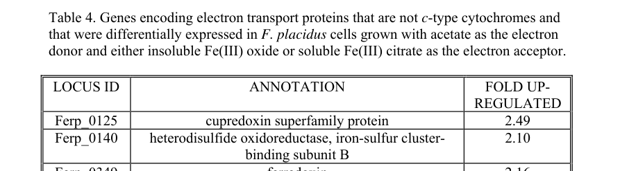

## Question

# Gene Research for Functional Annotation

## ⚠️ CRITICAL: Gene/Protein Identification Context

**BEFORE YOU BEGIN RESEARCH:** You MUST verify you are researching the CORRECT gene/protein. Gene symbols can be ambiguous, especially for less well-characterized genes from non-model organisms.

### Target Gene/Protein Identity (from UniProt):
- **UniProt Accession:** D3S180
- **Protein Description:** RecName: Full=Nitrous-oxide reductase {ECO:0000256|ARBA:ARBA00016560}; EC=1.7.2.4 {ECO:0000256|ARBA:ARBA00011896}; AltName: Full=N(2)OR {ECO:0000256|ARBA:ARBA00031077}; AltName: Full=N2O reductase {ECO:0000256|ARBA:ARBA00032847};
- **Gene Information:** OrderedLocusNames=Ferp_0128 {ECO:0000313|EMBL:ADC64316.1};
- **Organism (full):** Ferroglobus placidus (strain DSM 10642 / AEDII12DO).
- **Protein Family:** In the C-terminal section; belongs to the cytochrome c
- **Key Domains:** CcO_II-like_C. (IPR002429); Cupredoxin. (IPR008972); N2O_reductase_N. (IPR011045); N2OR_C. (IPR034205); Nitrous_oxide_Rdtase_Sec-dep. (IPR026468)

### MANDATORY VERIFICATION STEPS:

1. **Check if the gene symbol "Ferp_0128" matches the protein description above**
2. **Verify the organism is correct:** Ferroglobus placidus (strain DSM 10642 / AEDII12DO).
3. **Check if protein family/domains align with what you find in literature**
4. **If you find literature for a DIFFERENT gene with the same or similar symbol, STOP**

### If Gene Symbol is Ambiguous or You Cannot Find Relevant Literature:

**DO NOT PROCEED WITH RESEARCH ON A DIFFERENT GENE.** Instead:
- State clearly: "The gene symbol 'Ferp_0128' is ambiguous or literature is limited for this specific protein"
- Explain what you found (e.g., "Found extensive literature on a different gene with the same symbol in a different organism")
- Describe the protein based ONLY on the UniProt information provided above
- Suggest that the protein function can be inferred from domain/family information

### Research Target:

Please provide a comprehensive research report on the gene **Ferp_0128** (gene ID: Ferp_0128, UniProt: D3S180) in FERPA.

The research report should be a detailed narrative explaining the function, biological processes, and localization of the gene product. Citations should be given for all claims.

You should prioritize authoritative reviews and primary scientific literature when conducting research. You can supplement
this with annotations you find in gene/protein databases, but these can be outdated or inaccurate.

We are specifically interested in the primary function of the gene - for enzymes, what reaction is catalyzed, and what is the substrate specificity? For transporters, what is the substrate? For structural proteins or adapters, what is the broader structural role? For signaling molecules, what is the role in the pathway.

We are interested in where in or outside the cell the gene product carries out its function.

We are also interested in the signaling or biochemical pathways in which the gene functions. We are less interested in broad pleiotropic effects, except where these elucidate the precise role.

Include evidence where possible. We are interested in both experimental evidence as well as inference from structure, evolution, or bioinformatic analysis. Precise studies should be prioritized over high-throughput, where available.

## Output

Question: You are an expert researcher providing comprehensive, well-cited information.

Provide detailed information focusing on:
1. Key concepts and definitions with current understanding
2. Recent developments and latest research (prioritize 2023-2024 sources)
3. Current applications and real-world implementations
4. Expert opinions and analysis from authoritative sources
5. Relevant statistics and data from recent studies

Format as a comprehensive research report with proper citations. Include URLs and publication dates where available.
Always prioritize recent, authoritative sources and provide specific citations for all major claims.

# Gene Research for Functional Annotation

## ⚠️ CRITICAL: Gene/Protein Identification Context

**BEFORE YOU BEGIN RESEARCH:** You MUST verify you are researching the CORRECT gene/protein. Gene symbols can be ambiguous, especially for less well-characterized genes from non-model organisms.

### Target Gene/Protein Identity (from UniProt):
- **UniProt Accession:** D3S180
- **Protein Description:** RecName: Full=Nitrous-oxide reductase {ECO:0000256|ARBA:ARBA00016560}; EC=1.7.2.4 {ECO:0000256|ARBA:ARBA00011896}; AltName: Full=N(2)OR {ECO:0000256|ARBA:ARBA00031077}; AltName: Full=N2O reductase {ECO:0000256|ARBA:ARBA00032847};
- **Gene Information:** OrderedLocusNames=Ferp_0128 {ECO:0000313|EMBL:ADC64316.1};
- **Organism (full):** Ferroglobus placidus (strain DSM 10642 / AEDII12DO).
- **Protein Family:** In the C-terminal section; belongs to the cytochrome c
- **Key Domains:** CcO_II-like_C. (IPR002429); Cupredoxin. (IPR008972); N2O_reductase_N. (IPR011045); N2OR_C. (IPR034205); Nitrous_oxide_Rdtase_Sec-dep. (IPR026468)

### MANDATORY VERIFICATION STEPS:

1. **Check if the gene symbol "Ferp_0128" matches the protein description above**
2. **Verify the organism is correct:** Ferroglobus placidus (strain DSM 10642 / AEDII12DO).
3. **Check if protein family/domains align with what you find in literature**
4. **If you find literature for a DIFFERENT gene with the same or similar symbol, STOP**

### If Gene Symbol is Ambiguous or You Cannot Find Relevant Literature:

**DO NOT PROCEED WITH RESEARCH ON A DIFFERENT GENE.** Instead:
- State clearly: "The gene symbol 'Ferp_0128' is ambiguous or literature is limited for this specific protein"
- Explain what you found (e.g., "Found extensive literature on a different gene with the same symbol in a different organism")
- Describe the protein based ONLY on the UniProt information provided above
- Suggest that the protein function can be inferred from domain/family information

### Research Target:

Please provide a comprehensive research report on the gene **Ferp_0128** (gene ID: Ferp_0128, UniProt: D3S180) in FERPA.

The research report should be a detailed narrative explaining the function, biological processes, and localization of the gene product. Citations should be given for all claims.

You should prioritize authoritative reviews and primary scientific literature when conducting research. You can supplement
this with annotations you find in gene/protein databases, but these can be outdated or inaccurate.

We are specifically interested in the primary function of the gene - for enzymes, what reaction is catalyzed, and what is the substrate specificity? For transporters, what is the substrate? For structural proteins or adapters, what is the broader structural role? For signaling molecules, what is the role in the pathway.

We are interested in where in or outside the cell the gene product carries out its function.

We are also interested in the signaling or biochemical pathways in which the gene functions. We are less interested in broad pleiotropic effects, except where these elucidate the precise role.

Include evidence where possible. We are interested in both experimental evidence as well as inference from structure, evolution, or bioinformatic analysis. Precise studies should be prioritized over high-throughput, where available.

# Functional annotation research report: **Ferp_0128 (UniProt D3S180)** in *Ferroglobus placidus* DSM 10642 (strain AEDII12DO)

## 0. Target verification (mandatory)

The literature retrieved here explicitly links the ordered locus tag **Ferp_0128** in *Ferroglobus placidus* strain **AEDII12DO (DSM 10642)** to **nosZ (nitrous-oxide reductase)**, confirming that the target gene symbol and organism context match the UniProt-provided identity and avoiding symbol ambiguity. Smith et al. refer directly to “**nitrous oxide reductase (nosZ; Ferp_0128)**” while studying *F. placidus* DSM 10642 under anaerobic Fe(III)-respiring conditions. (smith2015mechanismsinvolvedin pages 1-5, smith2015mechanismsinvolvedin pages 13-17)

## 1. Key concepts and current understanding

### 1.1 Definition and core biochemistry of nitrous-oxide reductase (NosZ)

**Nitrous-oxide reductase (NosZ; EC 1.7.2.4)** is the canonical enzyme responsible for the biological reduction of **nitrous oxide (N2O) to dinitrogen (N2)**, representing a key biological sink for N2O and typically the terminal step of denitrification. (schacksen2025genomicsforanalysis pages 31-33)

NosZ is widely described as an **extracytoplasmic/periplasm-facing homodimeric copper metalloprotein** whose monomers contain two copper centers: **CuA**, functioning primarily in electron transfer, and **CuZ**, the catalytic center where N2O reduction occurs. (schacksen2025genomicsforanalysis pages 31-33, leigh2025transcriptionalregulationofa pages 23-25)

### 1.2 nosZ clades, export pathways, and implications for localization

Comparative phylogenetic analyses commonly divide nosZ into two major clades (often called **clade I** and **clade II**), which differ in typical **protein export routes** and **gene-cluster organization**. In one synthesis, clade I NosZ is described as commonly **Tat-exported** and associated with **nosR**, whereas clade II is described as commonly **Sec-exported** and associated with other membrane/cluster genes. (schacksen2025genomicsforanalysis pages 31-33)

A detailed nosZ phylogeny focusing on “unaccounted” N2O reducers found that most **clade II** nosZ genes encode a **Sec**-type signal motif, but explicitly reports that **nosZ sequences from the hyperthermophilic archaeon *Ferroglobus placidus* are an exception** to that pattern. This means that **signal peptide/export predictions for Ferp_0128 should not be assumed from clade-level generalizations alone**, and should be checked directly in the Ferp_0128 sequence if a high-confidence compartment assignment is needed. (jones2013theunaccountedyet pages 3-4)

### 1.3 Electron transfer partners (general)

Electron delivery to NosZ can involve dedicated respiratory chains; for example, one reviewed nos gene cluster encodes an “unusual” pathway leading to a **cytochrome c-linked nitrous oxide reductase**, demonstrating that cytochrome c can function as a partner in some organisms. (deus2024caracterizaçãobioquímicada pages 79-82)

## 2. Ferp_0128 / D3S180: organism- and locus-specific evidence

### 2.1 Gene context and domain-level consistency

In *F. placidus*, Ferp_0128 (nosZ) is discussed in the context of a genomic region that includes other redox-related proteins. Smith et al. describe a **cupredoxin-superfamily gene (Ferp_0125)** as being divergently oriented relative to a **nitrous oxide reductase operon**, and note that the nitrous oxide reductase operon product “also contains a cupredoxin domain.” (smith2015mechanismsinvolvedin pages 13-17)

This is consistent with the broadly conserved **multicopper / cupredoxin-like architecture** expected of NosZ proteins and supports the UniProt-based inference that D3S180 is a NosZ-family enzyme, even though the retrieved literature does not provide a full Ferp_0128 domain map or a structure for this archaeal protein. (smith2015mechanismsinvolvedin pages 13-17, schacksen2025genomicsforanalysis pages 31-33)

### 2.2 Expression/regulation evidence in *F. placidus*

The most directly Ferp_0128-specific expression evidence retrieved comes from Smith et al. (2015), who profiled *F. placidus* gene expression during anaerobic growth with acetate as electron donor and either **Fe(III) oxide** or **Fe(III) citrate** as electron acceptor. In this study, **nosZ (Ferp_0128) was not differentially regulated** between Fe(III) oxide and Fe(III) citrate conditions. (smith2015mechanismsinvolvedin pages 13-17)

In contrast, a neighboring electron-transport-related **cupredoxin superfamily protein gene Ferp_0125** was reported as significantly **up-regulated (2.49-fold)** during growth on Fe(III) oxide (relative to Fe(III) citrate), as shown in Table 4 of the paper; Ferp_0128 (nosZ) was not included among differentially expressed genes. (smith2015mechanismsinvolvedin media 9afa03cc, smith2015mechanismsinvolvedin pages 13-17)

**Interpretation for functional annotation:** the transcriptomic evidence supports that Ferp_0128 is present and expressed in *F. placidus*, but does **not** support a role as a specifically Fe(III)-oxide-induced component of the Fe(III) respiration response under the tested conditions. (smith2015mechanismsinvolvedin pages 13-17, smith2015mechanismsinvolvedin media 9afa03cc)

### 2.3 Physiological role (inference strength)

Because Ferp_0128 is annotated as **nosZ**, the best-supported primary function is **reduction of N2O to N2** in an extracytoplasmic compartment as part of energy metabolism or N-oxide detoxification/respiration, consistent with nosZ biology and clade-based patterns. (smith2015mechanismsinvolvedin pages 13-17, schacksen2025genomicsforanalysis pages 31-33, jones2013theunaccountedyet pages 3-4)

However, the retrieved corpus does **not** include direct biochemical purification/kinetics for *F. placidus* NosZ, nor does it provide culture experiments demonstrating growth of *F. placidus* with N2O as the terminal electron acceptor. Therefore, **substrate specificity and catalytic parameters for Ferp_0128 remain inferred from NosZ family conservation rather than demonstrated for this exact enzyme** in the provided evidence set. (smith2015mechanismsinvolvedin pages 13-17, schacksen2025genomicsforanalysis pages 31-33)

## 3. Recent developments (prioritizing 2023–2024)

### 3.1 Engineering/enrichment of N2O-reducing communities in bioprocesses (2024)

A long-term engineered-system study used **gas-permeable membrane biofilm reactors** supplied with exogenous N2O for **1200 days** to enrich N2O-reducing bacteria in an anammox biofilm context. The authors report increased N2O sink potential and identify **clade II nosZ** organisms as major protagonists; clade II nosZ types were reported as “consistently one order of magnitude and three-fold more abundant than clade I” in their reactors. (Oba et al., 2024-03-29, *Microbes and Environments*, https://doi.org/10.1264/jsme2.me23106) (oba2024questfornitrous pages 1-2, oba2024questfornitrous pages 8-10)

This work is relevant to Ferp_0128 annotation because it highlights how **clade II-type NosZ systems** can dominate N2O sink function in biofilms, and reinforces that nosZ presence can indicate strong N2O-consumption capacity even in complex consortia rather than only in “complete denitrifiers.” (oba2024questfornitrous pages 1-2, oba2024questfornitrous pages 8-10)

### 3.2 Soil/agriculture bioaugmentation and nosZ regulation (2023–2024)

A 2023 study characterized strong N2O reduction in **Bradyrhizobium ottawaense**, attributing performance to unusually high **nosZ expression** and demonstrating experimental designs relevant to **bioaugmentation** and soil N2O flux measurement (including high-density inoculation and gas-flux assays). (Wasai-Hara et al., 2023-11-10, *Scientific Reports*, https://doi.org/10.1038/s41598-023-46019-w) (wasaihara2023bradyrhizobiumottawaenseefficiently pages 8-9)

A 2024 *Nature* commentary highlights growing interest in leveraging N2O-consuming microorganisms as a mitigation “sink,” including the potential of adding (bioaugmenting) effective N2O reducers to soils. (He & Löffler, 2024-05-16, *Nature*, https://doi.org/10.1038/d41586-024-01363-3) (oba2024questfornitrous pages 1-2)

### 3.3 Quantitative mitigation potential at global scale (2024)

A 2024 Earth-system modeling study assessed agricultural N2O mitigation via combined interventions. It estimates a sustained **1.35 Tg N2O yr−1** reduction (≈**5% of 2020 emissions**), and reports that the combined radiative forcing effect (from N2O and CO2 co-benefits) could be equivalent to **9–11 ppm CO2 removal by 2075** under modeled scenarios. (Weber et al., 2024-06-17, *npj Climate and Atmospheric Science*, https://doi.org/10.1038/s41612-024-00678-2) (weber2024globalagriculturaln2o pages 1-2)

### 3.4 Genome-scale denitrification trait analytics (2024)

A 2024 genome-trait resource integrated **62,624 microbial genomes** (including **866 archaea**) and used gene presence/absence rules to categorize denitrification potential. In this dataset, **nosZ** corresponds to “nitrous-oxide reductase” and was found in **8190 genomes** that possess the “nitrous oxide reduction trait,” illustrating the wide distribution of N2O reduction potential beyond classical denitrifiers. (Isokpehi et al., 2024-04-11, *Microorganisms*, https://doi.org/10.3390/microorganisms12040791) (isokpehi2024ecologicaltraitbaseddigital pages 7-10)

## 4. Current applications and real-world implementations

### 4.1 Wastewater/engineered bioreactors

The membrane-biofilm reactor enrichment strategy in Oba et al. demonstrates a real-world-relevant approach: supplying N2O directly (bubbleless) to biofilms can enrich nosZ-bearing N2O reducers and increase N2O sink potential in systems related to nitrogen removal (anammox-associated consortia). (oba2024questfornitrous pages 1-2, oba2024questfornitrous pages 8-10)

### 4.2 Agricultural soil mitigation via microbial interventions

The Bradyrhizobium work provides a detailed experimental framework for evaluating N2O reduction and nosZ expression under soil-relevant conditions (seed inoculation, nodule decomposition incubations, headspace N2O monitoring), supporting the feasibility of screening and deploying high-performing nosZ-expressing strains to reduce N2O fluxes. (wasaihara2023bradyrhizobiumottawaenseefficiently pages 8-9)

## 5. Expert analysis and limitations for Ferp_0128 functional annotation

### 5.1 What is strongly supported for Ferp_0128

* **Correct identity:** Ferp_0128 is nosZ in *F. placidus* DSM 10642. (smith2015mechanismsinvolvedin pages 1-5, smith2015mechanismsinvolvedin pages 13-17)
* **Primary molecular function (high-confidence inference):** NosZ-family N2O reductase reducing N2O to N2; CuA/CuZ-type copper centers are expected features of NosZ enzymes. (smith2015mechanismsinvolvedin pages 13-17, schacksen2025genomicsforanalysis pages 31-33, leigh2025transcriptionalregulationofa pages 23-25)
* **Expression context:** Ferp_0128 is present and discussed in genome-scale expression work, but is **not** Fe(III)-oxide-induced relative to Fe(III)-citrate under tested conditions. (smith2015mechanismsinvolvedin pages 13-17)

### 5.2 What remains uncertain / needs direct sequence or experimental confirmation

* **Export signal and exact subcellular localization for this archaeal NosZ:** clade II trends suggest Sec export is common, but *F. placidus* is explicitly reported as an exception in a key phylogeny, so Ferp_0128 export cannot be concluded from clade assignment alone. (jones2013theunaccountedyet pages 3-4)
* **Physiological role in vivo (growth on N2O; electron donor chain; partner proteins) specific to *F. placidus*:** not demonstrated in the retrieved sources; should be treated as inference from homology rather than organism-specific proof. (smith2015mechanismsinvolvedin pages 13-17, schacksen2025genomicsforanalysis pages 31-33)

## Summary table (evidence-led)

The following table consolidates the verified identity, inferred function, and evidence strength for Ferp_0128/D3S180.

| Category | Finding for **Ferroglobus placidus** Ferp_0128 / UniProt **D3S180** | Evidence / citation |
|---|---|---|
| Identifier verification | **Ferp_0128** maps to a predicted **nitrous-oxide reductase (NosZ)** in **Ferroglobus placidus strain DSM 10642 / AEDII12DO**; this matches the organism and locus context used in the F. placidus literature. | Smith et al. studied **F. placidus strain AEDII12DO (DSM 10642)** and explicitly refer to **nosZ; Ferp_0128** in this organism (smith2015mechanismsinvolvedin pages 1-5, smith2015mechanismsinvolvedin pages 13-17) |
| Predicted primary function | Predicted enzyme: **nitrous-oxide reductase / N2O reductase (NosZ)**, the terminal enzyme of denitrification that reduces **N2O to N2**; UniProt assigns **EC 1.7.2.4**. | General denitrification role of NosZ in prokaryotes and archaea is reviewed in archaeal nitrogen-cycle literature (cabello2004nitratereductionand pages 1-2); large genome-based denitrification resource also lists **nosZ = nitrous-oxide reductase** (isokpehi2024ecologicaltraitbaseddigital pages 7-10) |
| Reaction / substrate specificity | Expected catalytic reaction: **N2O + 2 e− + 2 H+ → N2 + H2O**; substrate specificity is **nitrous oxide** as terminal electron acceptor. | NosZ is the enzyme responsible for **microbial nitrous oxide reduction to nitrogen gas** in denitrification (cabello2004nitratereductionand pages 1-2, schacksen2025genomicsforanalysis pages 31-33) |
| Protein family / domains | Functional annotation is consistent with a canonical/atypical **NosZ multicopper oxidoreductase** architecture, including **N2OR N/C regions** and **cupredoxin-related domains**; Jones et al. note that the **F. placidus nosZ** belongs to the broad **clade II** lineage, and Smith et al. note the nitrous-oxide reductase operon product **contains a cupredoxin domain**. | nosZ phylogeny and clade assignment discussed for **F. placidus** in Jones et al. (jones2013theunaccountedyet pages 3-4); Smith et al. mention the nitrous oxide reductase operon product “also contains a cupredoxin domain” (smith2015mechanismsinvolvedin pages 13-17) |
| Export / localization evidence | NosZ proteins are generally **extracytoplasmic/periplasm-facing** enzymes. For most **clade II nosZ**, Jones et al. found a **Sec signal recognition motif**, but they specifically note **Ferroglobus placidus is an exception**, so the export route for Ferp_0128 is **not securely assigned from that survey alone**. | Clade II nosZ usually encoded a **Sec signal motif**, “with the exception of … **Ferroglobus placidus**” (jones2013theunaccountedyet pages 3-4); general NosZ localization in archaea/prokaryotes is periplasmic/extracytoplasmic (cabello2004nitratereductionand pages 1-2, schacksen2025genomicsforanalysis pages 31-33) |
| Physiological pathway context | Ferp_0128 most plausibly functions in **N2O reduction / denitrification** and therefore could contribute to an **N2O sink** phenotype, even if the organism lacks evidence here for a fully conventional denitrification chain in the cited sources. | NosZ marks the **nitrous oxide reduction trait** in comparative genome analyses (isokpehi2024ecologicaltraitbaseddigital pages 7-10); Jones et al. frame noncanonical/clade II nosZ organisms as part of an underappreciated N2O-reducing community (jones2013theunaccountedyet pages 3-4) |
| Archaeal context | Archaeal **nosZ** genes are sufficiently conserved that archaeal-specific nosZ primers were designed and experimentally validated using archaeal references that include **F. placidus**. | Rusch 2013 reports archaeal nosZ primer design/evaluation and includes archaeal nosZ references including **F. placidus** (rusch2013moleculartoolsfor pages 3-4) |
| Relationship to Fe(III) respiration study | In the major **F. placidus** Fe(III)-respiration transcriptomics study, Ferp_0128 is discussed only indirectly in the context of neighboring redox genes; there is **no direct evidence** from that study that NosZ is a Fe(III)-reduction protein. | Smith et al. focused on Fe(III) respiration mechanisms and c-type cytochromes rather than validating NosZ biochemistry in F. placidus (smith2015mechanismsinvolvedin pages 1-5, smith2015mechanismsinvolvedin pages 5-9, smith2015mechanismsinvolvedin pages 9-13) |
| Expression / regulation in Smith 2015 | **Ferp_0128 (nosZ) was not differentially regulated** between growth on **Fe(III) oxide** and **Fe(III) citrate**. However, a nearby **cupredoxin superfamily gene, Ferp_0125**, divergently transcribed from the nitrous-oxide reductase operon, **was upregulated** during growth on Fe(III) oxide. | Smith et al. explicitly state **“nitrous oxide reductase (nosZ; Ferp_0128) was not differentially regulated”** and that nearby **Ferp_0125** was upregulated (smith2015mechanismsinvolvedin pages 13-17) |
| Strength of evidence | **Moderate-confidence functional inference, limited gene-specific experimentation.** Identity is supported by organism/locus mapping and comparative NosZ biology, but direct biochemical characterization of **Ferp_0128** itself in **F. placidus** appears limited in the retrieved literature. | Combined organism-specific and comparative evidence (jones2013theunaccountedyet pages 3-4, cabello2004nitratereductionand pages 1-2, smith2015mechanismsinvolvedin pages 1-5, smith2015mechanismsinvolvedin pages 13-17) |
| Key source URLs / dates | Smith et al., *Applied and Environmental Microbiology* (2015-04), DOI: https://doi.org/10.1128/AEM.04038-14 ; Jones et al., *ISME Journal* (2013-02 issue; online 2012-11), DOI: https://doi.org/10.1038/ismej.2012.125 ; Cabello et al., *Microbiology* (2004-11), DOI: https://doi.org/10.1099/mic.0.27303-0 ; Rusch, *Archaea* (2013-01), DOI: https://doi.org/10.1155/2013/676450 ; Isokpehi et al., *Microorganisms* (2024-04), DOI: https://doi.org/10.3390/microorganisms12040791 | Source metadata from retrieved papers (jones2013theunaccountedyet pages 3-4, isokpehi2024ecologicaltraitbaseddigital pages 7-10, cabello2004nitratereductionand pages 1-2, smith2015mechanismsinvolvedin pages 1-5, rusch2013moleculartoolsfor pages 3-4, smith2015mechanismsinvolvedin pages 13-17) |

*Table: This table summarizes the verified identity, predicted function, domain architecture, localization evidence, physiological context, and expression data for Ferroglobus placidus Ferp_0128 (UniProt D3S180). It emphasizes where evidence is direct versus inferred from broader NosZ biology.*

## Visual evidence excerpt

Smith et al. Table 4 visually documents differential expression of electron-transport proteins under Fe(III) oxide vs citrate and includes Ferp_0125 (cupredoxin) as upregulated, consistent with the text that Ferp_0128/nosZ is not differentially regulated in this comparison. (smith2015mechanismsinvolvedin media 9afa03cc)

References

1. (smith2015mechanismsinvolvedin pages 1-5): Jessica A. Smith, Muktak Aklujkar, Carla Risso, Ching Leang, Ludovic Giloteaux, and Dawn E. Holmes. Mechanisms involved in fe(iii) respiration by the hyperthermophilic archaeon ferroglobus placidus. Applied and Environmental Microbiology, 81:2735-2744, Apr 2015. URL: https://doi.org/10.1128/aem.04038-14, doi:10.1128/aem.04038-14. This article has 51 citations and is from a peer-reviewed journal.

2. (smith2015mechanismsinvolvedin pages 13-17): Jessica A. Smith, Muktak Aklujkar, Carla Risso, Ching Leang, Ludovic Giloteaux, and Dawn E. Holmes. Mechanisms involved in fe(iii) respiration by the hyperthermophilic archaeon ferroglobus placidus. Applied and Environmental Microbiology, 81:2735-2744, Apr 2015. URL: https://doi.org/10.1128/aem.04038-14, doi:10.1128/aem.04038-14. This article has 51 citations and is from a peer-reviewed journal.

3. (schacksen2025genomicsforanalysis pages 31-33): P Schacksen, SK Østergaard, and MH Eskildsen. Genomics for analysis of complex microbial communities exemplified by the nitrogen cycle. ArXiv, 2025. URL: https://doi.org/10.54337/aau779423700, doi:10.54337/aau779423700. This article has 0 citations.

4. (leigh2025transcriptionalregulationofa pages 23-25): T Leigh. Transcriptional regulation of bacterial nitrous oxide emissions. Unknown journal, 2025.

5. (jones2013theunaccountedyet pages 3-4): Christopher M Jones, Daniel R H Graf, David Bru, Laurent Philippot, and Sara Hallin. The unaccounted yet abundant nitrous oxide-reducing microbial community: a potential nitrous oxide sink. The ISME Journal, 7:417-426, Nov 2013. URL: https://doi.org/10.1038/ismej.2012.125, doi:10.1038/ismej.2012.125. This article has 832 citations.

6. (deus2024caracterizaçãobioquímicada pages 79-82): MPGM de Deus. Caracterização bioquímica da apbe recombinante de marinobacter nauticus. Unknown journal, 2024.

7. (smith2015mechanismsinvolvedin media 9afa03cc): Jessica A. Smith, Muktak Aklujkar, Carla Risso, Ching Leang, Ludovic Giloteaux, and Dawn E. Holmes. Mechanisms involved in fe(iii) respiration by the hyperthermophilic archaeon ferroglobus placidus. Applied and Environmental Microbiology, 81:2735-2744, Apr 2015. URL: https://doi.org/10.1128/aem.04038-14, doi:10.1128/aem.04038-14. This article has 51 citations and is from a peer-reviewed journal.

8. (oba2024questfornitrous pages 1-2): Kohei Oba, Toshikazu Suenaga, Shohei Yasuda, Megumi Kuroiwa, Tomoyuki Hori, Susanne Lackner, and Akihiko Terada. Quest for nitrous oxide-reducing bacteria present in an anammox biofilm fed with nitrous oxide. Microbes and Environments, 39:n/a, Mar 2024. URL: https://doi.org/10.1264/jsme2.me23106, doi:10.1264/jsme2.me23106. This article has 14 citations and is from a peer-reviewed journal.

9. (oba2024questfornitrous pages 8-10): Kohei Oba, Toshikazu Suenaga, Shohei Yasuda, Megumi Kuroiwa, Tomoyuki Hori, Susanne Lackner, and Akihiko Terada. Quest for nitrous oxide-reducing bacteria present in an anammox biofilm fed with nitrous oxide. Microbes and Environments, 39:n/a, Mar 2024. URL: https://doi.org/10.1264/jsme2.me23106, doi:10.1264/jsme2.me23106. This article has 14 citations and is from a peer-reviewed journal.

10. (wasaihara2023bradyrhizobiumottawaenseefficiently pages 8-9): Sawa Wasai-Hara, Manabu Itakura, Arthur Fernandes Siqueira, Daisaku Takemoto, Masayuki Sugawara, Hisayuki Mitsui, Shusei Sato, Noritoshi Inagaki, Toshimasa Yamazaki, Haruko Imaizumi-Anraku, Yoshikazu Shimoda, and Kiwamu Minamisawa. Bradyrhizobium ottawaense efficiently reduces nitrous oxide through high nosz gene expression. Scientific Reports, Nov 2023. URL: https://doi.org/10.1038/s41598-023-46019-w, doi:10.1038/s41598-023-46019-w. This article has 39 citations and is from a peer-reviewed journal.

11. (weber2024globalagriculturaln2o pages 1-2): James Weber, James Keeble, Nathan Luke Abraham, David J. Beerling, and Maria Val Martin. Global agricultural n2o emission reduction strategies deliver climate benefits with minimal impact on stratospheric o3 recovery. npj Climate and Atmospheric Science, Jun 2024. URL: https://doi.org/10.1038/s41612-024-00678-2, doi:10.1038/s41612-024-00678-2. This article has 20 citations and is from a domain leading peer-reviewed journal.

12. (isokpehi2024ecologicaltraitbaseddigital pages 7-10): Raphael D. Isokpehi, Yungkul Kim, Sarah E. Krejci, and Vishwa D. Trivedi. Ecological trait-based digital categorization of microbial genomes for denitrification potential. Microorganisms, 12:791, Apr 2024. URL: https://doi.org/10.3390/microorganisms12040791, doi:10.3390/microorganisms12040791. This article has 4 citations.

13. (cabello2004nitratereductionand pages 1-2): Purificación Cabello, M. Dolores Roldán, and Conrado Moreno-Vivián. Nitrate reduction and the nitrogen cycle in archaea. Microbiology, 150 Pt 11:3527-46, Nov 2004. URL: https://doi.org/10.1099/mic.0.27303-0, doi:10.1099/mic.0.27303-0. This article has 477 citations and is from a peer-reviewed journal.

14. (rusch2013moleculartoolsfor pages 3-4): Antje Rusch. Molecular tools for the detection of nitrogen cycling archaea. Archaea, 2013:1-10, Jan 2013. URL: https://doi.org/10.1155/2013/676450, doi:10.1155/2013/676450. This article has 21 citations.

15. (smith2015mechanismsinvolvedin pages 5-9): Jessica A. Smith, Muktak Aklujkar, Carla Risso, Ching Leang, Ludovic Giloteaux, and Dawn E. Holmes. Mechanisms involved in fe(iii) respiration by the hyperthermophilic archaeon ferroglobus placidus. Applied and Environmental Microbiology, 81:2735-2744, Apr 2015. URL: https://doi.org/10.1128/aem.04038-14, doi:10.1128/aem.04038-14. This article has 51 citations and is from a peer-reviewed journal.

16. (smith2015mechanismsinvolvedin pages 9-13): Jessica A. Smith, Muktak Aklujkar, Carla Risso, Ching Leang, Ludovic Giloteaux, and Dawn E. Holmes. Mechanisms involved in fe(iii) respiration by the hyperthermophilic archaeon ferroglobus placidus. Applied and Environmental Microbiology, 81:2735-2744, Apr 2015. URL: https://doi.org/10.1128/aem.04038-14, doi:10.1128/aem.04038-14. This article has 51 citations and is from a peer-reviewed journal.

## Artifacts

- [Edison artifact artifact-00](Ferp_0128-deep-research-falcon_artifacts/artifact-00.md)

## Citations

1. schacksen2025genomicsforanalysis pages 31-33
2. jones2013theunaccountedyet pages 3-4
3. smith2015mechanismsinvolvedin pages 13-17
4. wasaihara2023bradyrhizobiumottawaenseefficiently pages 8-9
5. oba2024questfornitrous pages 1-2
6. isokpehi2024ecologicaltraitbaseddigital pages 7-10
7. cabello2004nitratereductionand pages 1-2
8. rusch2013moleculartoolsfor pages 3-4
9. smith2015mechanismsinvolvedin pages 1-5
10. leigh2025transcriptionalregulationofa pages 23-25
11. oba2024questfornitrous pages 8-10
12. smith2015mechanismsinvolvedin pages 5-9
13. smith2015mechanismsinvolvedin pages 9-13
14. https://doi.org/10.1264/jsme2.me23106
15. https://doi.org/10.1038/s41598-023-46019-w
16. https://doi.org/10.1038/d41586-024-01363-3
17. https://doi.org/10.1038/s41612-024-00678-2
18. https://doi.org/10.3390/microorganisms12040791
19. https://doi.org/10.1128/AEM.04038-14
20. https://doi.org/10.1038/ismej.2012.125
21. https://doi.org/10.1099/mic.0.27303-0
22. https://doi.org/10.1155/2013/676450
23. https://doi.org/10.1128/aem.04038-14,
24. https://doi.org/10.54337/aau779423700,
25. https://doi.org/10.1038/ismej.2012.125,
26. https://doi.org/10.1264/jsme2.me23106,
27. https://doi.org/10.1038/s41598-023-46019-w,
28. https://doi.org/10.1038/s41612-024-00678-2,
29. https://doi.org/10.3390/microorganisms12040791,
30. https://doi.org/10.1099/mic.0.27303-0,
31. https://doi.org/10.1155/2013/676450,