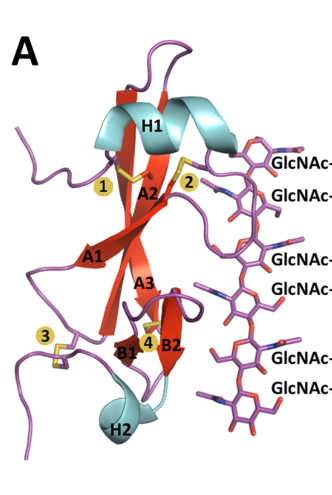

## Question

# Gene Research for Functional Annotation

## ⚠️ CRITICAL: Gene/Protein Identification Context

**BEFORE YOU BEGIN RESEARCH:** You MUST verify you are researching the CORRECT gene/protein. Gene symbols can be ambiguous, especially for less well-characterized genes from non-model organisms.

### Target Gene/Protein Identity (from UniProt):
- **UniProt Accession:** Q00363
- **Protein Description:** RecName: Full=Race-specific elicitor A4; Flags: Precursor;
- **Gene Information:** Name=AVR4;
- **Organism (full):** Fulvia fulva (Tomato leaf mold) (Passalora fulva).
- **Protein Family:** Not specified in UniProt
- **Key Domains:** Chitin-bd_dom. (IPR002557); Chitin-bd_dom_sf. (IPR036508); CBM_14 (PF01607)

### MANDATORY VERIFICATION STEPS:

1. **Check if the gene symbol "AVR4" matches the protein description above**
2. **Verify the organism is correct:** Fulvia fulva (Tomato leaf mold) (Passalora fulva).
3. **Check if protein family/domains align with what you find in literature**
4. **If you find literature for a DIFFERENT gene with the same or similar symbol, STOP**

### If Gene Symbol is Ambiguous or You Cannot Find Relevant Literature:

**DO NOT PROCEED WITH RESEARCH ON A DIFFERENT GENE.** Instead:
- State clearly: "The gene symbol 'AVR4' is ambiguous or literature is limited for this specific protein"
- Explain what you found (e.g., "Found extensive literature on a different gene with the same symbol in a different organism")
- Describe the protein based ONLY on the UniProt information provided above
- Suggest that the protein function can be inferred from domain/family information

### Research Target:

Please provide a comprehensive research report on the gene **AVR4** (gene ID: AVR4, UniProt: Q00363) in FULFL.

The research report should be a detailed narrative explaining the function, biological processes, and localization of the gene product. Citations should be given for all claims.

You should prioritize authoritative reviews and primary scientific literature when conducting research. You can supplement
this with annotations you find in gene/protein databases, but these can be outdated or inaccurate.

We are specifically interested in the primary function of the gene - for enzymes, what reaction is catalyzed, and what is the substrate specificity? For transporters, what is the substrate? For structural proteins or adapters, what is the broader structural role? For signaling molecules, what is the role in the pathway.

We are interested in where in or outside the cell the gene product carries out its function.

We are also interested in the signaling or biochemical pathways in which the gene functions. We are less interested in broad pleiotropic effects, except where these elucidate the precise role.

Include evidence where possible. We are interested in both experimental evidence as well as inference from structure, evolution, or bioinformatic analysis. Precise studies should be prioritized over high-throughput, where available.

## Output

Question: You are an expert researcher providing comprehensive, well-cited information.

Provide detailed information focusing on:
1. Key concepts and definitions with current understanding
2. Recent developments and latest research (prioritize 2023-2024 sources)
3. Current applications and real-world implementations
4. Expert opinions and analysis from authoritative sources
5. Relevant statistics and data from recent studies

Format as a comprehensive research report with proper citations. Include URLs and publication dates where available.
Always prioritize recent, authoritative sources and provide specific citations for all major claims.

# Gene Research for Functional Annotation

## ⚠️ CRITICAL: Gene/Protein Identification Context

**BEFORE YOU BEGIN RESEARCH:** You MUST verify you are researching the CORRECT gene/protein. Gene symbols can be ambiguous, especially for less well-characterized genes from non-model organisms.

### Target Gene/Protein Identity (from UniProt):
- **UniProt Accession:** Q00363
- **Protein Description:** RecName: Full=Race-specific elicitor A4; Flags: Precursor;
- **Gene Information:** Name=AVR4;
- **Organism (full):** Fulvia fulva (Tomato leaf mold) (Passalora fulva).
- **Protein Family:** Not specified in UniProt
- **Key Domains:** Chitin-bd_dom. (IPR002557); Chitin-bd_dom_sf. (IPR036508); CBM_14 (PF01607)

### MANDATORY VERIFICATION STEPS:

1. **Check if the gene symbol "AVR4" matches the protein description above**
2. **Verify the organism is correct:** Fulvia fulva (Tomato leaf mold) (Passalora fulva).
3. **Check if protein family/domains align with what you find in literature**
4. **If you find literature for a DIFFERENT gene with the same or similar symbol, STOP**

### If Gene Symbol is Ambiguous or You Cannot Find Relevant Literature:

**DO NOT PROCEED WITH RESEARCH ON A DIFFERENT GENE.** Instead:
- State clearly: "The gene symbol 'AVR4' is ambiguous or literature is limited for this specific protein"
- Explain what you found (e.g., "Found extensive literature on a different gene with the same symbol in a different organism")
- Describe the protein based ONLY on the UniProt information provided above
- Suggest that the protein function can be inferred from domain/family information

### Research Target:

Please provide a comprehensive research report on the gene **AVR4** (gene ID: AVR4, UniProt: Q00363) in FULFL.

The research report should be a detailed narrative explaining the function, biological processes, and localization of the gene product. Citations should be given for all claims.

You should prioritize authoritative reviews and primary scientific literature when conducting research. You can supplement
this with annotations you find in gene/protein databases, but these can be outdated or inaccurate.

We are specifically interested in the primary function of the gene - for enzymes, what reaction is catalyzed, and what is the substrate specificity? For transporters, what is the substrate? For structural proteins or adapters, what is the broader structural role? For signaling molecules, what is the role in the pathway.

We are interested in where in or outside the cell the gene product carries out its function.

We are also interested in the signaling or biochemical pathways in which the gene functions. We are less interested in broad pleiotropic effects, except where these elucidate the precise role.

Include evidence where possible. We are interested in both experimental evidence as well as inference from structure, evolution, or bioinformatic analysis. Precise studies should be prioritized over high-throughput, where available.

# Functional annotation report: AVR4 in *Fulvia fulva* (UniProt Q00363)

## Identity and principal function

**Identity check.** The supplied accession Q00363 denotes the AVR4 precursor from the tomato-leaf-mold fungus *Fulvia fulva*, also described in the relevant literature as *Cladosporium fulvum* or *Passalora fulva*. The published protein name **Cf-Avr4** and its secreted, cysteine-rich **CBM14 chitin-binding domain** agree with the supplied description and InterPro/Pfam annotations. This is **not** Avr4E or Avr9 from the same fungus, nor Pf-Avr4, an ortholog from *Pseudocercospora fuligena*. The accession-to-sequence mapping is taken from the supplied UniProt identification; the cited experimental studies establish the matching organism, name and molecular function. (kohler2016structuralanalysisof pages 1-4, kohler2016structuralanalysisof pages 4-7, hurlburt2018structureofthe pages 1-2, westerink2003theroleof pages 57-60)

**Primary molecular function:** Cf-Avr4 is a **nonenzymatic, chitin-binding fungal effector**. It coats accessible chitin in fungal cell walls, limiting hydrolysis by plant chitinases during infection. Its second, conditional biological role is as an *avirulence determinant*: tomato plants carrying the cell-surface immune receptor Cf-4 perceive extracellular Avr4 and initiate defense. Chitin binding is the effector’s demonstrated intrinsic biochemical activity; Cf-4 signaling is a host response to that effector, not an enzymatic or signaling reaction catalyzed by fungal Avr4. (burg2003studiestowardsthe pages 100-104, hurlburt2018structureofthe pages 7-9, huang2024receptorlikecytoplasmickinases pages 1-2, mesarich2018specifichypersensitiveresponse–associated pages 3-5)

The following evidence map distinguishes measurements on this target from work on an ortholog or a heterologous plant host. (hurlburt2018structureofthe pages 7-9, huang2024receptorlikecytoplasmickinases pages 1-2, kohler2016structuralanalysisof pages 10-13)

| Aspect | Specific direct result | Interpretation / qualification | Supporting source |
|---|---|---|---|
| Identity and domain | The target is **Cf-Avr4** from *Fulvia fulva* (syn. *Cladosporium fulvum* / *Passalora fulva*), a secreted 135-residue precursor containing a cysteine-rich **CBM14 chitin-binding domain**. | Matches the user-provided Q00363 annotation. It is distinct from Avr4E, Avr9, and Avr4 orthologs in other fungi. | Hurlburt et al., 27 Aug 2018, [DOI](https://doi.org/10.1371/journal.ppat.1007263) (hurlburt2018structureofthe pages 1-2, hurlburt2018structureofthe pages 3-5) |
| Chitin specificity | Binding becomes detectable at **(GlcNAc)3**; GlcNAc and (GlcNAc)2 produced no NMR effect. Cf-Avr4 bound crystalline chitin but not cellulose, xylan, curdlan, or fully deacetylated chitosan in the reported assays. | The substrate is chitin or chito-oligosaccharide, not a protein or an enzymatic substrate. Polymer and oligomer assays provide complementary specificity evidence. | van den Burg, 2003, [DOI](https://doi.org/10.18174/121419) (burg2003studiestowardsthe pages 100-104, burg2003studiestowardsthe pages 97-100); Kohler et al., Jul 2016, [DOI](https://doi.org/10.1105/tpc.15.00893) (kohler2016structuralanalysisof pages 4-7) |
| Quantitative ligand binding | ITC gave wild-type Cf-Avr4 **Kd = 6.73 ± 1.49 μM**, ΔH = −38.37 ± 2.96 kJ/mol, and stoichiometry **n = 1.09 ± 0.12** with (GlcNAc)6. W100A and D102A abolished detectable binding; Q69N and K84A weakened binding to **130.95 ± 31.47 μM** and **120.67 ± 18.77 μM**, respectively. | Supports approximately **1:1 protein:chitohexaose binding** and identifies residues important for affinity. | Hurlburt et al., 27 Aug 2018, [DOI](https://doi.org/10.1371/journal.ppat.1007263) (hurlburt2018structureofthe pages 7-9) |
| Ligand-bound structure | The Cf-Avr4–(GlcNAc)6 crystal structure was solved at **1.95 Å** resolution (**PDB 6BN0**). It contains a distorted β-sandwich, two short α-helices, four disulfide bonds, and an extended ligand-binding surface. | This was the first reported CBM14–ligand co-crystal structure. The carbohydrate-mediated dimer observed in the crystal may not be the sole physiological wall-bound assembly. | Hurlburt et al., 27 Aug 2018, [DOI](https://doi.org/10.1371/journal.ppat.1007263) (hurlburt2018structureofthe pages 1-2, hurlburt2018structureofthe pages 12-13, hurlburt2018structureofthe pages 3-5) |
| Primary biochemical function | Wild-type Cf-Avr4 protected *Trichoderma viride* hyphae from chitinases plus β-1,3-glucanases. Nonbinding W100A and D102A failed to protect; reduced-affinity Q69N and K84A permitted growth but caused greater hyphal injury. | Cf-Avr4 is a **nonenzymatic chitin-binding lectin/effector** that masks fungal-wall chitin. It neither catalyzes chitin hydrolysis nor directly inhibits the chitinase enzyme. | Hurlburt et al., 27 Aug 2018, [DOI](https://doi.org/10.1371/journal.ppat.1007263) (hurlburt2018structureofthe pages 7-9); van den Burg, 2003, [DOI](https://doi.org/10.18174/121419) (burg2003studiestowardsthe pages 100-104) |
| Biological location | AVR4 is induced following fungal entry through tomato stomata, secreted into the **leaf apoplast**, and accumulated on fungal walls where chitin is exposed. | Its operative site is extracellular—the host–pathogen interface and fungal cell wall during infection—not the fungal cytosol. | Westerink, 2003, [DOI](https://doi.org/10.18174/121383) (westerink2003theroleof pages 110-113); Mesarich et al., Jan 2018, [DOI](https://doi.org/10.1094/mpmi-05-17-0114-fi) (mesarich2018specifichypersensitiveresponse–associated pages 3-5) |
| Cf-4 immune recognition | Chitin-binding-defective K84A and W100A retained strong Cf-4-dependent hypersensitive-response activity. Reduced responses of destabilized variants correlated with extracellular proteolysis, and all tested variants were recognized when sufficient apoplastic protein accumulated. | Cf-4 recognition is **separable from chitin binding** and appears to depend mainly on a correctly folded, protease-stable Avr4 structure rather than a single ligand-contact residue. | Hurlburt et al., 27 Aug 2018, [DOI](https://doi.org/10.1371/journal.ppat.1007263) (hurlburt2018structureofthe pages 10-12, hurlburt2018structureofthe pages 9-10) |
| 2024 signaling development | In Cf-4-expressing *Nicotiana benthamiana*, Avr4 perception involved constitutive Cf-4–SOBIR1 association, BAK1 recruitment, reciprocal SOBIR1/BAK1 phosphorylation, and differential RLCK-VII-6/7/8 control of the biphasic ROS burst; RLCK-VII-7 was important for hypersensitive cell death. | This advances understanding of the **plant receptor pathway**, not Avr4's intrinsic fungal biochemical function. Most functional dissection used a heterologous *N. benthamiana* system rather than infected tomato. | Huang et al., May 2024, [DOI](https://doi.org/10.1038/s41467-024-48313-1) (huang2024receptorlikecytoplasmickinases pages 1-2, huang2024receptorlikecytoplasmickinases pages 6-7) |
| Ortholog evidence boundary | Deleting **Pf-Avr4** reduced biomass and disease severity in *Pseudocercospora fuligena*. | This supports conservation of Avr4-family virulence function but is **not a knockout of the target F. fulva AVR4/Q00363** and must not be reported as one. | Kohler et al., Jul 2016, [DOI](https://doi.org/10.1105/tpc.15.00893) (kohler2016structuralanalysisof pages 10-13, kohler2016structuralanalysisof pages 7-10) |

*Table: Evidence map for the identity, localization, ligand specificity, structure, protective function, and host recognition of Fulvia fulva Cf-Avr4. It separates direct evidence about the target protein from heterologous plant-signaling and fungal-ortholog results.*

## Molecular mechanism and substrate specificity

Chitin is a polymer of β-1,4-linked *N*-acetylglucosamine (GlcNAc). Cf-Avr4 binds crystalline chitin and chitin-derived oligomers; tested alternatives, including cellulose, xylan, curdlan and fully deacetylated chitosan, did not show comparable binding under the reported assay conditions. Earlier NMR experiments detected an interaction beginning with the trisaccharide **(GlcNAc)₃**, but not with GlcNAc or (GlcNAc)₂ at the concentrations tested. This describes **binding specificity**, not catalytic substrate turnover: no reaction or enzymatic product is assigned to Avr4. (kohler2016structuralanalysisof pages 1-4, kohler2016structuralanalysisof pages 4-7, burg2003studiestowardsthe pages 100-104, burg2003studiestowardsthe pages 97-100)

Direct isothermal-titration calorimetry measured Cf-Avr4 binding to chitohexaose, **(GlcNAc)₆**, with **Kᵈ = 6.73 ± 1.49 μM**, binding enthalpy **−38.37 ± 2.96 kJ/mol** and approximately **one protein per oligomer** (*n* = 1.09 ± 0.12). The target-protein–ligand crystal structure, **PDB 6BN0**, was determined at **1.95 Å** resolution. It shows a disulfide-stabilized CBM14 fold and an extended sugar-binding surface spanning much of the protein. Although carbohydrate-mediated Avr4 dimers occur in the crystal, their arrangement on natural fungal-wall chitin remains uncertain. The published Figure 1 depicts the bound oligomer and four disulfide bonds. (hurlburt2018structureofthe pages 1-2, hurlburt2018structureofthe pages 12-13, hurlburt2018structureofthe pages 3-5, hurlburt2018structureofthe pages 7-9, hurlburt2018structureofthe media 82726cb6)

Structure-guided substitutions connect binding to protective function. **W100A and D102A** eliminated detectable (GlcNAc)₆ binding; **Q69N and K84A** weakened binding to **130.95 ± 31.47 μM** and **120.67 ± 18.77 μM**, respectively. In assays with *Trichoderma viride* germlings challenged with chitinases and β-1,3-glucanases, wild-type Cf-Avr4 protected hyphae, W100A and D102A largely failed to protect them, and the reduced-affinity variants left more evidence of hyphal injury. Earlier chitin-azure experiments indicated that Avr4 protects the **chitin substrate** rather than directly inhibiting the chitinase enzyme. These are mechanistically informative assays on fungal material, not measurements of field-level tomato protection. (burg2003studiestowardsthe pages 100-104, hurlburt2018structureofthe pages 7-9)

## Biological process and site of action

Avr4 is produced as a secreted precursor and acts **outside the fungal cell**, in the infected tomato leaf **apoplast** and on exposed chitin of fungal hyphal walls. Earlier infection studies reported induction soon after fungal entry through stomata and accumulation on hyphae at sites where wall chitin is accessible. A relevant qualification is that *C. fulvum* grown *in vitro* can have inaccessible wall chitin and little Avr4 expression; this does not reproduce its apoplastic infection-stage environment. The supported biological-process annotation is therefore **protection of the fungal cell wall during host colonization**, rather than cytosolic fungal signaling or chitin synthesis. (burg2003studiestowardsthe pages 97-100, westerink2003theroleof pages 110-113, mesarich2018specifichypersensitiveresponse–associated pages 3-5)

The contribution to virulence has more than one level of evidence. Direct biochemical experiments establish wall protection; a later primary study reports that earlier **silencing of Cf-Avr4 reduced *C. fulvum* virulence**, although the original silencing measurements were not available for independent assessment here. Separately, two **Pf-Avr4 deletion mutants** showed reduced fungal biomass and disease severity on tomato, supporting conservation of function—but those deletions were in ***P. fuligena*** and must **not** be attributed to the Q00363 gene. (hurlburt2018structureofthe pages 7-9, kohler2016structuralanalysisof pages 10-13, kohler2016structuralanalysisof pages 7-10)

## Cf-4 recognition and the 2024 signaling advance

In tomato carrying **Cf-4**, secreted Avr4 serves as a recognized extracellular effector and can provoke a hypersensitive defense response that restricts this pathogen. Recognition and wall protection are **experimentally separable**: the binding-impaired **K84A and W100A** variants still induced strong Cf-4-dependent responses. Some other variants showed weaker responses when infiltrated at lower concentrations but were more susceptible to extracellular proteolysis; when enough protein accumulated in the leaf apoplast, the tested variants remained recognizable. Thus, loss of a sugar-contact residue alone does not imply escape from Cf-4. Naturally occurring destabilized Avr4 variants can nevertheless evade effective Cf-4-mediated resistance while retaining chitin-binding activity. (hurlburt2018structureofthe pages 10-12, westerink2003theroleof pages 110-113, hurlburt2018structureofthe pages 9-10, westerink2003theroleof pages 13-16)

The most directly relevant **recent primary study**, Huang and colleagues’ **May 2024** *Nature Communications* paper, refined the **plant-side** pathway. Cf-4 associates with **SOBIR1** and uses **BAK1** for Avr4-triggered signaling; SOBIR1 and BAK1 reciprocally phosphorylate one another. Genetic tests found distinct contributions of **RLCK-VII-6, -7 and -8** to the Avr4/Cf-4-induced, biphasic reactive-oxygen-species response, with **RLCK-VII-7** especially important for hypersensitive cell death. Crucially, most of that mechanistic dissection used **Cf-4-expressing *Nicotiana benthamiana***, not naturally infected tomato, and did **not** reveal a new intrinsic biochemical activity of fungal Avr4. Earlier 2023 results on this signaling system were released as a preprint; the 2024 peer-reviewed study is the preferred source. (huang2024receptorlikecytoplasmickinases pages 1-2, huang2024receptorlikecytoplasmickinases pages 4-5, huang2024receptorlikecytoplasmickinases pages 6-7, joosten2023receptorlikecytoplasmickinases pages 10-13)

## Agricultural implementation and limits

The Avr4–Cf-4 pair is a practical example of **effector-informed tomato resistance breeding and screening**: Cf-4 originated from wild *Solanum habrochaites* and was introgressed into cultivated tomato; purified Avr4 or effector-expression systems can reveal plants that recognize the effector. In a broader *C. fulvum* effectoromics investigation, researchers identified **70** infection-associated apoplastic small secreted proteins, tested **41** for recognition in wild tomato, and found **nine** recognized by at least one accession. Those figures concern the **broader effector screen**, not nine activities of Avr4. Pathogen variants capable of overcoming Cf-based resistance make reliance on any single recognition specificity vulnerable to breakdown. (mesarich2018specifichypersensitiveresponse–associated pages 5-7, mesarich2018specifichypersensitiveresponse–associated pages 26-28, mesarich2018specifichypersensitiveresponse–associated pages 7-9)

**Assessment:** The strongest direct annotation for Q00363 is *secreted CBM14 chitin-binding effector; extracellular fungal-wall chitin shielding against host chitinases; recognized by tomato Cf-4*. The 2018 quantitative structure–function study remains more informative about **what the fungal protein does** than the 2023–2024 studies, which mainly advance understanding of **how plants respond to it**. Crystal-state dimerization, laboratory hyphal-protection assays and virulence phenotypes of an ortholog should not be presented as separately demonstrated mechanisms or knockout phenotypes for Q00363 during natural infection. (hurlburt2018structureofthe pages 7-9, hurlburt2018structureofthe pages 12-13, huang2024receptorlikecytoplasmickinases pages 1-2, kohler2016structuralanalysisof pages 10-13)

### Principal sources and links

- Hurlburt NK *et al.* **27 August 2018**. Cf-Avr4–(GlcNAc)₆ structure, calorimetry, mutagenesis and protection assays. *PLOS Pathogens* 14:e1007263. https://doi.org/10.1371/journal.ppat.1007263. (hurlburt2018structureofthe pages 1-2, hurlburt2018structureofthe pages 7-9)
- Huang WRH *et al.* **May 2024**. Cf-4/SOBIR1/BAK1 and RLCK signaling. *Nature Communications* 15. https://doi.org/10.1038/s41467-024-48313-1. (huang2024receptorlikecytoplasmickinases pages 1-2, huang2024receptorlikecytoplasmickinases pages 6-7)
- Kohler AC *et al.* **July 2016**. Comparative Cf-Avr4/Pf-Avr4 biochemistry and **Pf-Avr4** deletion. *The Plant Cell* 28:1945–1965. https://doi.org/10.1105/tpc.15.00893. (kohler2016structuralanalysisof pages 4-7, kohler2016structuralanalysisof pages 10-13)
- Mesarich CH *et al.* **January 2018**. Apoplastic-effector recognition and tomato germplasm screening. *Molecular Plant-Microbe Interactions* 31:145–162. https://doi.org/10.1094/mpmi-05-17-0114-fi. (mesarich2018specifichypersensitiveresponse–associated pages 5-7, mesarich2018specifichypersensitiveresponse–associated pages 26-28)
- van den Burg HA. **2003**. Primary experimental thesis on Avr4 chitin specificity and chitinase protection. Wageningen University. https://doi.org/10.18174/121419. (burg2003studiestowardsthe pages 100-104, burg2003studiestowardsthe pages 97-100)

References

1. (kohler2016structuralanalysisof pages 1-4): Amanda C. Kohler, Li-Hung Chen, Nicholas Hurlburt, Anthony Salvucci, Benjamin Schwessinger, Andrew J. Fisher, and Ioannis Stergiopoulos. Structural analysis of an avr4 effector ortholog offers insight into chitin binding and recognition by the cf-4 receptor. Plant Cell, 28:1945-1965, Jul 2016. URL: https://doi.org/10.1105/tpc.15.00893, doi:10.1105/tpc.15.00893. This article has 44 citations and is from a highest quality peer-reviewed journal.

2. (kohler2016structuralanalysisof pages 4-7): Amanda C. Kohler, Li-Hung Chen, Nicholas Hurlburt, Anthony Salvucci, Benjamin Schwessinger, Andrew J. Fisher, and Ioannis Stergiopoulos. Structural analysis of an avr4 effector ortholog offers insight into chitin binding and recognition by the cf-4 receptor. Plant Cell, 28:1945-1965, Jul 2016. URL: https://doi.org/10.1105/tpc.15.00893, doi:10.1105/tpc.15.00893. This article has 44 citations and is from a highest quality peer-reviewed journal.

3. (hurlburt2018structureofthe pages 1-2): Nicholas K. Hurlburt, Li-Hung Chen, Ioannis Stergiopoulos, and Andrew J. Fisher. Structure of the cladosporium fulvum avr4 effector in complex with (glcnac)6 reveals the ligand-binding mechanism and uncouples its intrinsic function from recognition by the cf-4 resistance protein. PLOS Pathogens, 14:e1007263, Aug 2018. URL: https://doi.org/10.1371/journal.ppat.1007263, doi:10.1371/journal.ppat.1007263. This article has 54 citations and is from a highest quality peer-reviewed journal.

4. (westerink2003theroleof pages 57-60): N. Westerink. The role of avr4 and avr4e proteins in virulence and avirulence of the tomato pathogen cladosporium fulvum: molecular aspects of disease susceptibility and resistance. Unknown journal, 2003. URL: https://doi.org/10.18174/121383, doi:10.18174/121383. This article has 5 citations.

5. (burg2003studiestowardsthe pages 100-104): H.A. van den Burg. Studies towards the intrinsic function of the avr4 and avr9 elicitors of the fungal tomato pathogen cladosporium fulvum. ArXiv, 2003. URL: https://doi.org/10.18174/121419, doi:10.18174/121419. This article has 1 citations.

6. (hurlburt2018structureofthe pages 7-9): Nicholas K. Hurlburt, Li-Hung Chen, Ioannis Stergiopoulos, and Andrew J. Fisher. Structure of the cladosporium fulvum avr4 effector in complex with (glcnac)6 reveals the ligand-binding mechanism and uncouples its intrinsic function from recognition by the cf-4 resistance protein. PLOS Pathogens, 14:e1007263, Aug 2018. URL: https://doi.org/10.1371/journal.ppat.1007263, doi:10.1371/journal.ppat.1007263. This article has 54 citations and is from a highest quality peer-reviewed journal.

7. (huang2024receptorlikecytoplasmickinases pages 1-2): Wen R. H. Huang, Ciska Braam, Carola Kretschmer, Sergio Landeo Villanueva, Huan Liu, Filiz Ferik, Aranka M. Burgh, Jinbin Wu, Lisha Zhang, Thorsten Nürnberger, Yuluan Wang, Michael F. Seidl, Edouard Evangelisti, Johannes Stuttmann, and Matthieu H. A. J. Joosten. Receptor-like cytoplasmic kinases of different subfamilies differentially regulate sobir1/bak1-mediated immune responses in nicotiana benthamiana. Nature Communications, May 2024. URL: https://doi.org/10.1038/s41467-024-48313-1, doi:10.1038/s41467-024-48313-1. This article has 28 citations and is from a highest quality peer-reviewed journal.

8. (mesarich2018specifichypersensitiveresponse–associated pages 3-5): Carl H. Mesarich, Bilal Ӧkmen, Hanna Rovenich, Scott A. Griffiths, Changchun Wang, Mansoor Karimi Jashni, Aleksandar Mihajlovski, Jérôme Collemare, Lukas Hunziker, Cecilia H. Deng, Ate van der Burgt, Henriek G. Beenen, Matthew D. Templeton, Rosie E. Bradshaw, and Pierre J. G. M. de Wit. Specific hypersensitive response–associated recognition of new apoplastic effectors from <i>cladosporium fulvum</i> in wild tomato. Molecular Plant-Microbe Interactions®, 31:145-162, Jan 2018. URL: https://doi.org/10.1094/mpmi-05-17-0114-fi, doi:10.1094/mpmi-05-17-0114-fi. This article has 80 citations.

9. (kohler2016structuralanalysisof pages 10-13): Amanda C. Kohler, Li-Hung Chen, Nicholas Hurlburt, Anthony Salvucci, Benjamin Schwessinger, Andrew J. Fisher, and Ioannis Stergiopoulos. Structural analysis of an avr4 effector ortholog offers insight into chitin binding and recognition by the cf-4 receptor. Plant Cell, 28:1945-1965, Jul 2016. URL: https://doi.org/10.1105/tpc.15.00893, doi:10.1105/tpc.15.00893. This article has 44 citations and is from a highest quality peer-reviewed journal.

10. (hurlburt2018structureofthe pages 3-5): Nicholas K. Hurlburt, Li-Hung Chen, Ioannis Stergiopoulos, and Andrew J. Fisher. Structure of the cladosporium fulvum avr4 effector in complex with (glcnac)6 reveals the ligand-binding mechanism and uncouples its intrinsic function from recognition by the cf-4 resistance protein. PLOS Pathogens, 14:e1007263, Aug 2018. URL: https://doi.org/10.1371/journal.ppat.1007263, doi:10.1371/journal.ppat.1007263. This article has 54 citations and is from a highest quality peer-reviewed journal.

11. (burg2003studiestowardsthe pages 97-100): H.A. van den Burg. Studies towards the intrinsic function of the avr4 and avr9 elicitors of the fungal tomato pathogen cladosporium fulvum. ArXiv, 2003. URL: https://doi.org/10.18174/121419, doi:10.18174/121419. This article has 1 citations.

12. (hurlburt2018structureofthe pages 12-13): Nicholas K. Hurlburt, Li-Hung Chen, Ioannis Stergiopoulos, and Andrew J. Fisher. Structure of the cladosporium fulvum avr4 effector in complex with (glcnac)6 reveals the ligand-binding mechanism and uncouples its intrinsic function from recognition by the cf-4 resistance protein. PLOS Pathogens, 14:e1007263, Aug 2018. URL: https://doi.org/10.1371/journal.ppat.1007263, doi:10.1371/journal.ppat.1007263. This article has 54 citations and is from a highest quality peer-reviewed journal.

13. (westerink2003theroleof pages 110-113): N. Westerink. The role of avr4 and avr4e proteins in virulence and avirulence of the tomato pathogen cladosporium fulvum: molecular aspects of disease susceptibility and resistance. Unknown journal, 2003. URL: https://doi.org/10.18174/121383, doi:10.18174/121383. This article has 5 citations.

14. (hurlburt2018structureofthe pages 10-12): Nicholas K. Hurlburt, Li-Hung Chen, Ioannis Stergiopoulos, and Andrew J. Fisher. Structure of the cladosporium fulvum avr4 effector in complex with (glcnac)6 reveals the ligand-binding mechanism and uncouples its intrinsic function from recognition by the cf-4 resistance protein. PLOS Pathogens, 14:e1007263, Aug 2018. URL: https://doi.org/10.1371/journal.ppat.1007263, doi:10.1371/journal.ppat.1007263. This article has 54 citations and is from a highest quality peer-reviewed journal.

15. (hurlburt2018structureofthe pages 9-10): Nicholas K. Hurlburt, Li-Hung Chen, Ioannis Stergiopoulos, and Andrew J. Fisher. Structure of the cladosporium fulvum avr4 effector in complex with (glcnac)6 reveals the ligand-binding mechanism and uncouples its intrinsic function from recognition by the cf-4 resistance protein. PLOS Pathogens, 14:e1007263, Aug 2018. URL: https://doi.org/10.1371/journal.ppat.1007263, doi:10.1371/journal.ppat.1007263. This article has 54 citations and is from a highest quality peer-reviewed journal.

16. (huang2024receptorlikecytoplasmickinases pages 6-7): Wen R. H. Huang, Ciska Braam, Carola Kretschmer, Sergio Landeo Villanueva, Huan Liu, Filiz Ferik, Aranka M. Burgh, Jinbin Wu, Lisha Zhang, Thorsten Nürnberger, Yuluan Wang, Michael F. Seidl, Edouard Evangelisti, Johannes Stuttmann, and Matthieu H. A. J. Joosten. Receptor-like cytoplasmic kinases of different subfamilies differentially regulate sobir1/bak1-mediated immune responses in nicotiana benthamiana. Nature Communications, May 2024. URL: https://doi.org/10.1038/s41467-024-48313-1, doi:10.1038/s41467-024-48313-1. This article has 28 citations and is from a highest quality peer-reviewed journal.

17. (kohler2016structuralanalysisof pages 7-10): Amanda C. Kohler, Li-Hung Chen, Nicholas Hurlburt, Anthony Salvucci, Benjamin Schwessinger, Andrew J. Fisher, and Ioannis Stergiopoulos. Structural analysis of an avr4 effector ortholog offers insight into chitin binding and recognition by the cf-4 receptor. Plant Cell, 28:1945-1965, Jul 2016. URL: https://doi.org/10.1105/tpc.15.00893, doi:10.1105/tpc.15.00893. This article has 44 citations and is from a highest quality peer-reviewed journal.

18. (hurlburt2018structureofthe media 82726cb6): Nicholas K. Hurlburt, Li-Hung Chen, Ioannis Stergiopoulos, and Andrew J. Fisher. Structure of the cladosporium fulvum avr4 effector in complex with (glcnac)6 reveals the ligand-binding mechanism and uncouples its intrinsic function from recognition by the cf-4 resistance protein. PLOS Pathogens, 14:e1007263, Aug 2018. URL: https://doi.org/10.1371/journal.ppat.1007263, doi:10.1371/journal.ppat.1007263. This article has 54 citations and is from a highest quality peer-reviewed journal.

19. (westerink2003theroleof pages 13-16): N. Westerink. The role of avr4 and avr4e proteins in virulence and avirulence of the tomato pathogen cladosporium fulvum: molecular aspects of disease susceptibility and resistance. Unknown journal, 2003. URL: https://doi.org/10.18174/121383, doi:10.18174/121383. This article has 5 citations.

20. (huang2024receptorlikecytoplasmickinases pages 4-5): Wen R. H. Huang, Ciska Braam, Carola Kretschmer, Sergio Landeo Villanueva, Huan Liu, Filiz Ferik, Aranka M. Burgh, Jinbin Wu, Lisha Zhang, Thorsten Nürnberger, Yuluan Wang, Michael F. Seidl, Edouard Evangelisti, Johannes Stuttmann, and Matthieu H. A. J. Joosten. Receptor-like cytoplasmic kinases of different subfamilies differentially regulate sobir1/bak1-mediated immune responses in nicotiana benthamiana. Nature Communications, May 2024. URL: https://doi.org/10.1038/s41467-024-48313-1, doi:10.1038/s41467-024-48313-1. This article has 28 citations and is from a highest quality peer-reviewed journal.

21. (joosten2023receptorlikecytoplasmickinases pages 10-13): Matthieu Joosten, Wen Huang, Ciska Braam, Carola Kretschmer, Huan Liu, Filiz Ferik, Aranka van der Burgh, Sergio Villanueva, Jinbin Wu, Lisha Zhang, Thorsten Nuernberger, Yulu Wang, Michael F Seidl, Edouard Evangelisti, and Johannes Stuttmann. Receptor-like cytoplasmic kinases belonging to different subfamilies differentially regulate sobir1/bak1-mediated immune responses in nicotiana benthamiana. Unknown journal, Nov 2023. URL: https://doi.org/10.21203/rs.3.rs-3569835/v1, doi:10.21203/rs.3.rs-3569835/v1.

22. (mesarich2018specifichypersensitiveresponse–associated pages 5-7): Carl H. Mesarich, Bilal Ӧkmen, Hanna Rovenich, Scott A. Griffiths, Changchun Wang, Mansoor Karimi Jashni, Aleksandar Mihajlovski, Jérôme Collemare, Lukas Hunziker, Cecilia H. Deng, Ate van der Burgt, Henriek G. Beenen, Matthew D. Templeton, Rosie E. Bradshaw, and Pierre J. G. M. de Wit. Specific hypersensitive response–associated recognition of new apoplastic effectors from <i>cladosporium fulvum</i> in wild tomato. Molecular Plant-Microbe Interactions®, 31:145-162, Jan 2018. URL: https://doi.org/10.1094/mpmi-05-17-0114-fi, doi:10.1094/mpmi-05-17-0114-fi. This article has 80 citations.

23. (mesarich2018specifichypersensitiveresponse–associated pages 26-28): Carl H. Mesarich, Bilal Ӧkmen, Hanna Rovenich, Scott A. Griffiths, Changchun Wang, Mansoor Karimi Jashni, Aleksandar Mihajlovski, Jérôme Collemare, Lukas Hunziker, Cecilia H. Deng, Ate van der Burgt, Henriek G. Beenen, Matthew D. Templeton, Rosie E. Bradshaw, and Pierre J. G. M. de Wit. Specific hypersensitive response–associated recognition of new apoplastic effectors from <i>cladosporium fulvum</i> in wild tomato. Molecular Plant-Microbe Interactions®, 31:145-162, Jan 2018. URL: https://doi.org/10.1094/mpmi-05-17-0114-fi, doi:10.1094/mpmi-05-17-0114-fi. This article has 80 citations.

24. (mesarich2018specifichypersensitiveresponse–associated pages 7-9): Carl H. Mesarich, Bilal Ӧkmen, Hanna Rovenich, Scott A. Griffiths, Changchun Wang, Mansoor Karimi Jashni, Aleksandar Mihajlovski, Jérôme Collemare, Lukas Hunziker, Cecilia H. Deng, Ate van der Burgt, Henriek G. Beenen, Matthew D. Templeton, Rosie E. Bradshaw, and Pierre J. G. M. de Wit. Specific hypersensitive response–associated recognition of new apoplastic effectors from <i>cladosporium fulvum</i> in wild tomato. Molecular Plant-Microbe Interactions®, 31:145-162, Jan 2018. URL: https://doi.org/10.1094/mpmi-05-17-0114-fi, doi:10.1094/mpmi-05-17-0114-fi. This article has 80 citations.

## Artifacts

- [Edison artifact artifact-00](AVR4-deep-research-falcon_artifacts/artifact-00.md)

## Citations

1. kohler2016structuralanalysisof pages 4-7
2. hurlburt2018structureofthe pages 7-9
3. burg2003studiestowardsthe pages 100-104
4. westerink2003theroleof pages 110-113
5. kohler2016structuralanalysisof pages 1-4
6. hurlburt2018structureofthe pages 1-2
7. westerink2003theroleof pages 57-60
8. huang2024receptorlikecytoplasmickinases pages 1-2
9. kohler2016structuralanalysisof pages 10-13
10. hurlburt2018structureofthe pages 3-5
11. burg2003studiestowardsthe pages 97-100
12. hurlburt2018structureofthe pages 12-13
13. hurlburt2018structureofthe pages 10-12
14. hurlburt2018structureofthe pages 9-10
15. huang2024receptorlikecytoplasmickinases pages 6-7
16. kohler2016structuralanalysisof pages 7-10
17. westerink2003theroleof pages 13-16
18. huang2024receptorlikecytoplasmickinases pages 4-5
19. joosten2023receptorlikecytoplasmickinases pages 10-13
20. DOI
21. https://doi.org/10.1371/journal.ppat.1007263
22. https://doi.org/10.18174/121419
23. https://doi.org/10.1105/tpc.15.00893
24. https://doi.org/10.18174/121383
25. https://doi.org/10.1094/mpmi-05-17-0114-fi
26. https://doi.org/10.1038/s41467-024-48313-1
27. https://doi.org/10.1371/journal.ppat.1007263.
28. https://doi.org/10.1038/s41467-024-48313-1.
29. https://doi.org/10.1105/tpc.15.00893.
30. https://doi.org/10.1094/mpmi-05-17-0114-fi.
31. https://doi.org/10.18174/121419.
32. https://doi.org/10.1105/tpc.15.00893,
33. https://doi.org/10.1371/journal.ppat.1007263,
34. https://doi.org/10.18174/121383,
35. https://doi.org/10.18174/121419,
36. https://doi.org/10.1038/s41467-024-48313-1,
37. https://doi.org/10.1094/mpmi-05-17-0114-fi,
38. https://doi.org/10.21203/rs.3.rs-3569835/v1,