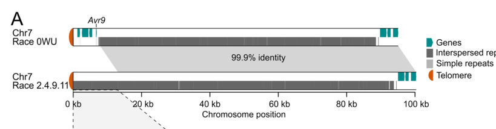

## Question

# Gene Research for Functional Annotation

## ⚠️ CRITICAL: Gene/Protein Identification Context

**BEFORE YOU BEGIN RESEARCH:** You MUST verify you are researching the CORRECT gene/protein. Gene symbols can be ambiguous, especially for less well-characterized genes from non-model organisms.

### Target Gene/Protein Identity (from UniProt):
- **UniProt Accession:** P22287
- **Protein Description:** RecName: Full=Race-specific elicitor A9; Flags: Precursor;
- **Gene Information:** Name=AVR9;
- **Organism (full):** Fulvia fulva (Tomato leaf mold) (Passalora fulva).
- **Protein Family:** Not specified in UniProt
- **Key Domains:** Not specified in UniProt

### MANDATORY VERIFICATION STEPS:

1. **Check if the gene symbol "AVR9" matches the protein description above**
2. **Verify the organism is correct:** Fulvia fulva (Tomato leaf mold) (Passalora fulva).
3. **Check if protein family/domains align with what you find in literature**
4. **If you find literature for a DIFFERENT gene with the same or similar symbol, STOP**

### If Gene Symbol is Ambiguous or You Cannot Find Relevant Literature:

**DO NOT PROCEED WITH RESEARCH ON A DIFFERENT GENE.** Instead:
- State clearly: "The gene symbol 'AVR9' is ambiguous or literature is limited for this specific protein"
- Explain what you found (e.g., "Found extensive literature on a different gene with the same symbol in a different organism")
- Describe the protein based ONLY on the UniProt information provided above
- Suggest that the protein function can be inferred from domain/family information

### Research Target:

Please provide a comprehensive research report on the gene **AVR9** (gene ID: AVR9, UniProt: P22287) in FULFL.

The research report should be a detailed narrative explaining the function, biological processes, and localization of the gene product. Citations should be given for all claims.

You should prioritize authoritative reviews and primary scientific literature when conducting research. You can supplement
this with annotations you find in gene/protein databases, but these can be outdated or inaccurate.

We are specifically interested in the primary function of the gene - for enzymes, what reaction is catalyzed, and what is the substrate specificity? For transporters, what is the substrate? For structural proteins or adapters, what is the broader structural role? For signaling molecules, what is the role in the pathway.

We are interested in where in or outside the cell the gene product carries out its function.

We are also interested in the signaling or biochemical pathways in which the gene functions. We are less interested in broad pleiotropic effects, except where these elucidate the precise role.

Include evidence where possible. We are interested in both experimental evidence as well as inference from structure, evolution, or bioinformatic analysis. Precise studies should be prioritized over high-throughput, where available.

## Output

Question: You are an expert researcher providing comprehensive, well-cited information.

Provide detailed information focusing on:
1. Key concepts and definitions with current understanding
2. Recent developments and latest research (prioritize 2023-2024 sources)
3. Current applications and real-world implementations
4. Expert opinions and analysis from authoritative sources
5. Relevant statistics and data from recent studies

Format as a comprehensive research report with proper citations. Include URLs and publication dates where available.
Always prioritize recent, authoritative sources and provide specific citations for all major claims.

# Gene Research for Functional Annotation

## ⚠️ CRITICAL: Gene/Protein Identification Context

**BEFORE YOU BEGIN RESEARCH:** You MUST verify you are researching the CORRECT gene/protein. Gene symbols can be ambiguous, especially for less well-characterized genes from non-model organisms.

### Target Gene/Protein Identity (from UniProt):
- **UniProt Accession:** P22287
- **Protein Description:** RecName: Full=Race-specific elicitor A9; Flags: Precursor;
- **Gene Information:** Name=AVR9;
- **Organism (full):** Fulvia fulva (Tomato leaf mold) (Passalora fulva).
- **Protein Family:** Not specified in UniProt
- **Key Domains:** Not specified in UniProt

### MANDATORY VERIFICATION STEPS:

1. **Check if the gene symbol "AVR9" matches the protein description above**
2. **Verify the organism is correct:** Fulvia fulva (Tomato leaf mold) (Passalora fulva).
3. **Check if protein family/domains align with what you find in literature**
4. **If you find literature for a DIFFERENT gene with the same or similar symbol, STOP**

### If Gene Symbol is Ambiguous or You Cannot Find Relevant Literature:

**DO NOT PROCEED WITH RESEARCH ON A DIFFERENT GENE.** Instead:
- State clearly: "The gene symbol 'AVR9' is ambiguous or literature is limited for this specific protein"
- Explain what you found (e.g., "Found extensive literature on a different gene with the same symbol in a different organism")
- Describe the protein based ONLY on the UniProt information provided above
- Suggest that the protein function can be inferred from domain/family information

### Research Target:

Please provide a comprehensive research report on the gene **AVR9** (gene ID: AVR9, UniProt: P22287) in FULFL.

The research report should be a detailed narrative explaining the function, biological processes, and localization of the gene product. Citations should be given for all claims.

You should prioritize authoritative reviews and primary scientific literature when conducting research. You can supplement
this with annotations you find in gene/protein databases, but these can be outdated or inaccurate.

We are specifically interested in the primary function of the gene - for enzymes, what reaction is catalyzed, and what is the substrate specificity? For transporters, what is the substrate? For structural proteins or adapters, what is the broader structural role? For signaling molecules, what is the role in the pathway.

We are interested in where in or outside the cell the gene product carries out its function.

We are also interested in the signaling or biochemical pathways in which the gene functions. We are less interested in broad pleiotropic effects, except where these elucidate the precise role.

Include evidence where possible. We are interested in both experimental evidence as well as inference from structure, evolution, or bioinformatic analysis. Precise studies should be prioritized over high-throughput, where available.

# Functional annotation report: *Fulvia fulva* AVR9 (UniProt P22287)

## Identity and principal function

**Identity verified.** The requested AVR9 is the *Fulvia fulva* tomato-leaf-mold protein described in much of the experimental literature under the name *Cladosporium fulvum* Avr9. The gene encodes a small, secreted **race-specific elicitor**, not a characterized enzyme or transporter. Its firmly established activity is to provoke **Cf-9-dependent immunity** when the fungus encounters a tomato plant carrying the matching resistance gene. The UniProt accession P22287 is the identifier supplied for this report; the cited experiments independently establish the fungal gene, protein description, and biological identity. [Honée et al., *Plant Molecular Biology*, December 1995](https://doi.org/10.1007/BF00014965); [Huang and Joosten, *Trends in Plant Science*, published online 2024, volume dated 2025](https://doi.org/10.1016/j.tplants.2024.03.012). (honee1995productionofthe pages 1-3, schol2025mutationordeletion pages 1-5, huang2025immunesignalingreceptorlike pages 3-5)

## Product, structure, and site of action

*Avr9* encodes a **63-amino-acid precursor**. Its 23-residue N-terminal signal sequence directs secretion, leaving a 40-residue proprotein; further fungal and/or plant proteolysis produces the **28-residue mature elicitor** recovered from infected tomato-leaf **apoplastic fluid**. AVR9 therefore performs its known extracellular activity in the **leaf apoplast**, where fungal hyphae grow between plant cells and the peptide can be perceived at the plant-cell surface. In culture, processing can stop at longer peptide forms; these should not be mistaken for a different AVR9 gene product. Plant-produced AVR9 recovered from apoplastic fluid had the same processed sequence and specific activity as infection-derived peptide. [Honée et al., 1995](https://doi.org/10.1007/BF00014965). (honee1995productionofthe pages 1-3)

The mature peptide has a three-stranded antiparallel β-sheet and **three disulfide bonds**, experimentally assigned as **Cys2–Cys16, Cys6–Cys19, and Cys12–Cys26** in mature-peptide numbering. This is a cystine-knot-like scaffold, **not evidence of a catalytic domain**. Correctly folded synthetic AVR9 retains the activity of native fungal peptide; disruption of the disulfide framework compromises necrosis-inducing activity. [van den Hooven et al., *European Journal of Biochemistry*, August 1999](https://doi.org/10.1046/j.1432-1327.1999.00503.x); [van den Burg, Wageningen University dissertation, 2003](https://doi.org/10.18174/121419). (hooven1999foldingandconformational pages 1-2, burg2003studiestowardsthe pages 51-55)

**The fungus’s intrinsic biochemical use for AVR9 remains unresolved.** Its fold resembles that of certain carboxypeptidase inhibitors, but assays of AVR9 and inhibitor chimeras did **not** demonstrate carboxypeptidase inhibition. Neither an endogenous tomato substrate nor a definitive virulence-associated binding partner has been established. Thus, annotations such as “tomato carboxypeptidase inhibitor” or “ion-channel blocker” would turn hypotheses into findings. AVR9 should also not be conflated with this fungus’s **Avr2**, which inhibits host cysteine proteases, or **Avr4**, which binds chitin and protects fungal walls against chitinases. [van den Burg, 2003](https://doi.org/10.18174/121419); [Karimi-Jashni, *Agrotechniques in Industrial Crops*, accepted October 14, 2024](https://doi.org/10.22126/ATIC.2024.10751.1150). (burg2003studiestowardsthe pages 149-152, burg2003studiestowardsthe pages 71-76, karimijashni2024glycosylationanalysisofa pages 1-2)

## Cf-9 recognition and immune pathway

The clearest functional experiment is **genotype-specific elicitation**: administering AVR9 to **Cf-9 tomato** induces localized necrosis or a hypersensitive response (HR), whereas tomato lacking Cf-9 does not respond in the same way. Expressing *Avr9* in otherwise Cf-9-negative plants yielded biologically active peptide; crossing *Avr9*-expressing tomato with Cf-9 tomato produced severe necrosis and plant death. These experiments identify an active extracellular **Avr9–Cf-9 gene-for-gene recognition system**, although they do not show that AVR9 is beneficial to the fungus on susceptible hosts. [Honée et al., 1995](https://doi.org/10.1007/BF00014965). (honee1995productionofthe pages 1-3)

**Recognition must not be equated with proven direct AVR9–Cf-9 binding.** Radiolabeled AVR9 binds a high-affinity activity in tomato plasma-membrane preparations **with or without Cf-9**; direct AVR9–Cf-9 binding has not been established in the cited biochemical work. The identity and native role of this additional binding activity remain unresolved. Conversely, a receptor-complex experiment *specific to Avr9* showed that Avr9 elicitation in *Nicotiana benthamiana* promoted co-immunoprecipitation of Cf-9 with **SERK1 and SERK3/BAK1**, relative to an Avr4 control. Cf-9 is a cell-surface leucine-rich-repeat receptor-like protein without its own intracellular kinase domain; the current receptor-like-protein framework invokes **SOBIR1** and recruited SERK kinases to convey extracellular recognition into intracellular defense signaling. The detailed ligand-binding arrangement for AVR9 remains a model, not a resolved AVR9–Cf-9 structure. [de Wit et al., *Antonie van Leeuwenhoek*, February 1997](https://doi.org/10.1023/A:1000102509556); [Postma et al., *New Phytologist*, April 2016](https://doi.org/10.1111/nph.13802); [Huang and Joosten, published online 2024](https://doi.org/10.1016/j.tplants.2024.03.012). (wit1997molecularandbiochemical pages 2-4, postma2016avr4promotescf4 pages 10-11, huang2025immunesignalingreceptorlike pages 1-3, huang2025immunesignalingreceptorlike pages 5-7)

Downstream responses reported for the AVR9/Cf-9 interaction include oxidative signaling, defense-associated transcription and ultimately HR. In experiments using AVR9-containing apoplastic fluid on Cf-9 tomato cotyledons, an **oxidative burst was observed by about 3 hours**, ethylene production and loss of membrane integrity at approximately **9–10 hours**, and increased free salicylic acid from approximately **12 hours**. These are **host responses to AVR9**, not biochemical reactions catalyzed by the fungal peptide; timings depend on the experimental preparation and should not be read as fixed pathway constants. Cf-4/Avr4-specific endocytosis or kinase-knockout results likewise should not automatically be assigned to Cf-9/AVR9. [de Wit et al., 1997](https://doi.org/10.1023/A:1000102509556); [Postma et al., 2016](https://doi.org/10.1111/nph.13802). (wit1997molecularandbiochemical pages 2-4, postma2016avr4promotescf4 pages 10-11)

## Regulation and recent experimental developments

Expression links AVR9 to the infection environment: *Avr9* is strongly expressed during colonization and induced under **nitrogen limitation** in vitro. Knocking out the fungal nitrogen-response regulator **NRF1** prevented starvation-induced *Avr9* expression and strongly reduced its expression during infection. Importantly, those regulator-deficient strains remained **as virulent as wild type on susceptible tomato** and **avirulent on Cf-9 tomato**. This is evidence for regulatory control, **not** a demonstration that AVR9 itself has no virulence function: NRF1 is a global regulator, and sufficient stable elicitor evidently remained for recognition. [Pérez-García et al., *Molecular Plant-Microbe Interactions*, March 2001](https://doi.org/10.1094/MPMI.2001.14.3.316). (perezgarcia2001expressionofthe pages 1-2)

Two **2024 primary studies** refine, but do not settle, the functional annotation:

* **Fungal glycosylation:** Mass spectrometry of fungus-secreted AVR9 identified incompletely processed **31-, 32-, and 34-residue** forms, including peptides bearing **two N-acetylglucosamine and six mannose residues**. Compared preparations showed **no clear difference in Cf-9-dependent HR induction**. This supports N-glycosylation under the tested culture conditions but does not establish that glycosylation is required for an unknown virulence target, infection, or Cf-9 perception. [Karimi-Jashni, *Agrotechniques in Industrial Crops* **4**, 180–188, 2024; accepted October 14, 2024](https://doi.org/10.22126/ATIC.2024.10751.1150). (karimijashni2024glycosylationanalysisofa pages 1-2, karimijashni2024glycosylationanalysisofa pages 4-6)
* **Escape through gene loss:** A five-isolate comparative-genome study located *Avr9* in a repeat-rich region **6.6 kb from the chromosome-7 telomere**. In the Avr9-negative isolate Race 2.4.9.11, approximately **7.8 kb** of chromosome-7 tip carrying the gene was replaced by a **13.1-kb repeat-rich segment** nearly identical to chromosome-2 tip sequence. This provides a concrete structural-variation route by which race-9 fungi evade **Cf-9-mediated recognition**; it does not measure an AVR9-specific fitness cost. The study’s **Figure 3A–B** depicts the relevant chromosome alignments. [Zaccaron and Stergiopoulos, *BMC Biology* **22**, article 25, January 2024](https://doi.org/10.1186/s12915-024-01818-z). (zaccaron2024analysisoffive pages 6-7, zaccaron2024analysisoffive media 97b5ee60)

## Applications and annotation conclusion

**Practical use is chiefly in tomato resistance research and breeding.** AVR9 peptide delivery or transient expression can test Cf-9-dependent recognition; fungal *Avr9* presence or absence helps explain why a given isolate is recognized or escapes Cf-9 resistance. Conversely, the documented deletion mechanism warns that **Cf-9 alone is not necessarily durable** against evolving fungal populations. Constitutive co-expression of *Avr9* and Cf-9 is **not** a ready-to-deploy resistance strategy: the original tomato crosses suffered extensive necrosis and death. [Honée et al., 1995](https://doi.org/10.1007/BF00014965); [Zaccaron and Stergiopoulos, 2024](https://doi.org/10.1186/s12915-024-01818-z). (honee1995productionofthe pages 1-3, zaccaron2024analysisoffive pages 6-7)

**Recommended functional annotation:** “Small secreted, proteolytically matured cystine-knot-like **apoplastic effector** of *F. fulva*; extracellular elicitor of **Cf-9-dependent tomato immune signaling and hypersensitive cell death**.” Annotate its **native fungal molecular target and virulence biochemistry as unknown**. This preserves the strongest experimental conclusion without assigning AVR9 the demonstrated activities of other fungal effectors. (honee1995productionofthe pages 1-3, postma2016avr4promotescf4 pages 10-11, burg2003studiestowardsthe pages 149-152)

The following evidence summary separates established observations from unresolved mechanisms. (honee1995productionofthe pages 1-3, karimijashni2024glycosylationanalysisofa pages 1-2, zaccaron2024analysisoffive pages 6-7)

| Aspect | Specific observations | Interpretation and limits |
|---|---|---|
| Identity and molecular product | Target: **Avr9 from *Fulvia fulva***, synonymous with *Cladosporium fulvum*, UniProt **P22287**. It encodes a **63-aa pre-proprotein** containing a 23-aa signal peptide and a secreted 40-aa proprotein; the principal mature in-planta product is a **28-aa race-specific elicitor**. [Honée et al., 1995](https://doi.org/10.1007/BF00014965), published December 1995. (honee1995productionofthe pages 1-3) | This is the specified fungal AVR9, not a similarly named AVR protein from another organism. It is a small, secreted, cysteine-rich apoplastic effector rather than an enzyme, transporter, or structural protein. The accession derives from the supplied UniProt record, while the literature independently confirms the organism, gene, and product sizes. |
| Location and processing | The signal peptide directs secretion, after which fungal and host proteases process the 40-aa proprotein into the 28-aa peptide recovered from infected-leaf **apoplastic fluid**. Fungal cultures can contain incompletely processed 32–34-aa forms. Plant-expressed AVR9 carrying the native fungal signal peptide was also recovered from apoplastic fluid with the same sequence and activity as infection-derived AVR9. [Honée et al., 1995](https://doi.org/10.1007/BF00014965), published December 1995. (honee1995productionofthe pages 1-3) | AVR9 acts in the tomato leaf apoplast, outside fungal and plant plasma membranes. Incompletely processed culture products should not be confused with the predominant mature in-planta peptide. |
| Structure | Mature AVR9 is a 28-residue, three-stranded antiparallel beta-sheet stabilized by three experimentally mapped disulfides: **Cys2–Cys16, Cys6–Cys19, and Cys12–Cys26**. These form an inhibitor-cystine-knot-like scaffold. Correctly folded synthetic AVR9 was as active as native fungal AVR9, whereas reduction or disruption of its disulfides abolished necrosis-inducing activity. [van den Hooven et al., 1999](https://doi.org/10.1046/j.1432-1327.1999.00503.x), published August 1999; [van den Burg, 2003](https://doi.org/10.18174/121419), published 2003. (hooven1999foldingandconformational pages 1-2, burg2003studiestowardsthe pages 51-55) | No conventional catalytic domain is expected in this very short mature peptide. Structural similarity to carboxypeptidase inhibitors does **not** establish equivalent biochemical activity. |
| Host recognition and signaling | Extracellular AVR9 specifically triggers necrosis and a hypersensitive response in tomato carrying the LRR receptor-like protein **Cf-9**, but not in plants lacking Cf-9. Direct AVR9–Cf-9 binding was not detected, and an AVR9 high-affinity membrane-binding activity occurs in plants lacking Cf-9. In *Nicotiana benthamiana*, AVR9 promoted association of Cf-9 with SERK1 and BAK1/SERK3, supporting activation of a Cf-9, SOBIR1, and SERK cell-surface complex. Reported outputs include ROS, MAPK activation, defense-gene expression, salicylic-acid accumulation, membrane leakage, and HR. [Luderer et al., 2001](https://doi.org/10.1094/MPMI.2001.14.7.867), published July 2001; [Postma et al., 2016](https://doi.org/10.1111/nph.13802), published April 2016; [Huang and Joosten](https://doi.org/10.1016/j.tplants.2024.03.012), published online in 2024. (wit1997molecularandbiochemical pages 2-4, huang2025immunesignalingreceptorlike pages 1-3, postma2016avr4promotescf4 pages 10-11) | Firm annotation: AVR9 is an **extracellular immunogenic effector that activates Cf-9-dependent cell-surface immunity**. Whether Cf-9 senses AVR9 indirectly through an unidentified target or high-affinity binding site remains unresolved. Cf-4 and Avr4 endocytosis results must not be assigned directly to AVR9. |
| Native biochemical function | AVR9 resembles carboxypeptidase inhibitors structurally, but purified AVR9 and AVR9–carboxypeptidase-inhibitor chimeras showed **no detectable carboxypeptidase inhibition**. Reported antibacterial, antifungal, and tested omega-conotoxin-like activities were also negative. No definitive tomato interactor, virulence substrate, or catalytic activity has been identified. [van den Burg, 2003](https://doi.org/10.18174/121419), published 2003; [Karimi-Jashni, 2024](https://doi.org/10.22126/ATIC.2024.10751.1150), accepted October 14, 2024. (burg2003studiestowardsthe pages 149-152, karimijashni2024glycosylationanalysisofa pages 1-2, burg2003studiestowardsthe pages 71-76) | **AVR9 should not be annotated as a protease inhibitor.** Possible effects on another protease class, an ion channel, or another host target remain hypotheses. This distinguishes AVR9 from Avr2, a demonstrated cysteine-protease inhibitor, and Avr4, a demonstrated chitin-binding protector of fungal walls. |
| Nitrogen regulation | *Avr9* is strongly expressed in planta and induced by nitrogen limitation in vitro. Disrupting the GATA-family regulator **NRF1** prevented nitrogen-starvation induction and strongly reduced *Avr9* expression. Nevertheless, NRF1-deficient fungi remained as virulent as wild type on susceptible tomato and still produced enough AVR9 in planta to remain avirulent on Cf-9 tomato. [Pérez-García et al., 2001](https://doi.org/10.1094/MPMI.2001.14.3.316), published March 2001. (perezgarcia2001expressionofthe pages 1-2) | Nitrogen-responsive regulation connects *Avr9* expression to the nutrient-poor infection environment, but it neither identifies a biochemical substrate nor proves that AVR9 itself is required for fungal virulence. |
| Recent 2024 glycosylation | Mass spectrometry of fungus-secreted AVR9 detected partially processed **31-, 32-, and 34-aa** forms, including species bearing **two GlcNAc and six mannose residues**. Glycosylated and less-glycosylated or unglycosylated preparations caused comparable Cf-9-dependent HR. [Karimi-Jashni, 2024](https://doi.org/10.22126/ATIC.2024.10751.1150), accepted October 14, 2024. (karimijashni2024glycosylationanalysisofa pages 1-2, karimijashni2024glycosylationanalysisofa pages 4-6) | The study demonstrates fungal N-glycosylation under the tested culture conditions, but not that glycosylation is required for target binding, in-planta stability, virulence, or Cf-9 recognition. The canonical infection-derived endpoint remains the 28-aa mature peptide. |
| Recent 2024 gene deletion | Comparative near-complete genomes placed *Avr9* **6.6 kb from the chromosome-7 telomere** in a repeat-rich region. In Race 2.4.9.11, the first **7.8 kb** carrying *Avr9* was replaced by a **13.1-kb repeat-rich segment** nearly identical to the chromosome-2 tip. Loss of *Avr9* is associated with race-9 escape from Cf-9 resistance. [Zaccaron and Stergiopoulos, 2024](https://doi.org/10.1186/s12915-024-01818-z), published January 2024. (zaccaron2024analysisoffive pages 6-7, zaccaron2024analysisoffive media 97b5ee60) | This establishes a repeat-associated structural-variation mechanism for *Avr9* loss and Cf-9 resistance breakdown. It supports resistance-gene stacking rather than reliance on Cf-9 alone, but does not by itself quantify the virulence cost of deleting *Avr9*. |

*Table: Evidence-grade summary of the verified *Fulvia fulva* AVR9 protein, separating established secretion, structure, and Cf-9 recognition from its unresolved native biochemical function. The table also captures key 2024 glycosylation and genome-deletion findings.*

References

1. (honee1995productionofthe pages 1-3): Guy Honée, Leo S. Melchers, Vivianne G. A. A. Vleeshouwers, Jeroen S. C. van Roekel, and Pierre J. G. M. de Wit. Production of the avr9 elicitor from the fungal pathogen cladosporium fulvum in transgenic tobacco and tomato plants. Plant Molecular Biology, 29:909-920, Dec 1995. URL: https://doi.org/10.1007/bf00014965, doi:10.1007/bf00014965. This article has 62 citations and is from a peer-reviewed journal.

2. (schol2025mutationordeletion pages 1-5): Christiaan R. Schol, Like Fokkens, Anan Hu, Ruifang Jia, Silvia de la Rosa, Bilal Ökmen, Anne M. Hilgers, Samuel L. van Zwoll, Luuk D.H. Veenendaal, Marie Turner, Claudie Monot, Kazuya Maeda, Yuichiro Iida, Pierre J.G.M de Wit, Danny Esselink, Anne-Marie A. Wolters, Yuling Bai, Matthieu H.A.J. Joosten, and Carl H. Mesarich. Mutation or deletion of the avr6 avirulence effector gene of fulvia fulva leads to breakdown of the cf-6 leaf mold resistance locus in tomato. bioRxiv, Jun 2025. URL: https://doi.org/10.1101/2025.06.11.659170, doi:10.1101/2025.06.11.659170. This article has 0 citations.

3. (huang2025immunesignalingreceptorlike pages 3-5): Wen R.H. Huang and Matthieu H.A.J. Joosten. Immune signaling: receptor-like proteins make the difference. Trends in Plant Science, 30:54-68, Jan 2025. URL: https://doi.org/10.1016/j.tplants.2024.03.012, doi:10.1016/j.tplants.2024.03.012. This article has 67 citations and is from a domain leading peer-reviewed journal.

4. (hooven1999foldingandconformational pages 1-2): Henno W. van den Hooven, Arno W. J. Appelman, Thomas Zey, Pierre J. G. M. de Wit, and Jacques Vervoort. Folding and conformational analysis of avr9 peptide elicitors of the fungal tomato pathogen cladosporium fulvum. European journal of biochemistry, 264 1:9-18, Aug 1999. URL: https://doi.org/10.1046/j.1432-1327.1999.00503.x, doi:10.1046/j.1432-1327.1999.00503.x. This article has 20 citations.

5. (burg2003studiestowardsthe pages 51-55): H.A. van den Burg. Studies towards the intrinsic function of the avr4 and avr9 elicitors of the fungal tomato pathogen cladosporium fulvum. ArXiv, 2003. URL: https://doi.org/10.18174/121419, doi:10.18174/121419. This article has 1 citations.

6. (burg2003studiestowardsthe pages 149-152): H.A. van den Burg. Studies towards the intrinsic function of the avr4 and avr9 elicitors of the fungal tomato pathogen cladosporium fulvum. ArXiv, 2003. URL: https://doi.org/10.18174/121419, doi:10.18174/121419. This article has 1 citations.

7. (burg2003studiestowardsthe pages 71-76): H.A. van den Burg. Studies towards the intrinsic function of the avr4 and avr9 elicitors of the fungal tomato pathogen cladosporium fulvum. ArXiv, 2003. URL: https://doi.org/10.18174/121419, doi:10.18174/121419. This article has 1 citations.

8. (karimijashni2024glycosylationanalysisofa pages 1-2): M Karimi-Jashni. Glycosylation analysis of the avr9 effector of cladosporium fulvum, the fungal pathogen of solanum lycopersicum. Unknown journal, 2024.

9. (wit1997molecularandbiochemical pages 2-4): Pierre J.G.M. de Wit, Richard Laugé, Guy Honée, Matthieu H.A.J. Joosten, Paul Vossen, Miriam Kooman-Gersmann, Ralph Vogelsang, and Jacques J.M. Vervoort. Molecular and biochemical basis of the interaction between tomato and its fungal pathogen cladosporium fulvum. Antonie van Leeuwenhoek, 71:137-141, Feb 1997. URL: https://doi.org/10.1023/a:1000102509556, doi:10.1023/a:1000102509556. This article has 37 citations.

10. (postma2016avr4promotescf4 pages 10-11): Jelle Postma, Thomas W. H. Liebrand, Guozhi Bi, Alexandre Evrard, Ruby R. Bye, Malick Mbengue, Hannah Kuhn, Matthieu H. A. J. Joosten, and Silke Robatzek. Avr4 promotes cf-4 receptor-like protein association with the bak1/serk3 receptor-like kinase to initiate receptor endocytosis and plant immunity. The New phytologist, 210 2:627-42, Apr 2016. URL: https://doi.org/10.1111/nph.13802, doi:10.1111/nph.13802. This article has 191 citations.

11. (huang2025immunesignalingreceptorlike pages 1-3): Wen R.H. Huang and Matthieu H.A.J. Joosten. Immune signaling: receptor-like proteins make the difference. Trends in Plant Science, 30:54-68, Jan 2025. URL: https://doi.org/10.1016/j.tplants.2024.03.012, doi:10.1016/j.tplants.2024.03.012. This article has 67 citations and is from a domain leading peer-reviewed journal.

12. (huang2025immunesignalingreceptorlike pages 5-7): Wen R.H. Huang and Matthieu H.A.J. Joosten. Immune signaling: receptor-like proteins make the difference. Trends in Plant Science, 30:54-68, Jan 2025. URL: https://doi.org/10.1016/j.tplants.2024.03.012, doi:10.1016/j.tplants.2024.03.012. This article has 67 citations and is from a domain leading peer-reviewed journal.

13. (perezgarcia2001expressionofthe pages 1-2): Alejandro Pérez-García, Sandor S. Snoeijers, Matthieu H. A. J. Joosten, Theo Goosen, and Pierre J. G. M. De Wit. Expression of the avirulence gene avr9 of the fungal tomato pathogen cladosporium fulvum is regulated by the global nitrogen response factor nrf1. Molecular plant-microbe interactions : MPMI, 14 3:316-25, Mar 2001. URL: https://doi.org/10.1094/mpmi.2001.14.3.316, doi:10.1094/mpmi.2001.14.3.316. This article has 106 citations.

14. (karimijashni2024glycosylationanalysisofa pages 4-6): M Karimi-Jashni. Glycosylation analysis of the avr9 effector of cladosporium fulvum, the fungal pathogen of solanum lycopersicum. Unknown journal, 2024.

15. (zaccaron2024analysisoffive pages 6-7): Alex Z. Zaccaron and Ioannis Stergiopoulos. Analysis of five near-complete genome assemblies of the tomato pathogen cladosporium fulvum uncovers additional accessory chromosomes and structural variations induced by transposable elements effecting the loss of avirulence genes. BMC Biology, Jan 2024. URL: https://doi.org/10.1186/s12915-024-01818-z, doi:10.1186/s12915-024-01818-z. This article has 16 citations and is from a domain leading peer-reviewed journal.

16. (zaccaron2024analysisoffive media 97b5ee60): Alex Z. Zaccaron and Ioannis Stergiopoulos. Analysis of five near-complete genome assemblies of the tomato pathogen cladosporium fulvum uncovers additional accessory chromosomes and structural variations induced by transposable elements effecting the loss of avirulence genes. BMC Biology, Jan 2024. URL: https://doi.org/10.1186/s12915-024-01818-z, doi:10.1186/s12915-024-01818-z. This article has 16 citations and is from a domain leading peer-reviewed journal.

## Artifacts

- [Edison artifact artifact-00](AVR9-deep-research-falcon_artifacts/artifact-00.md)

## Citations

1. honee1995productionofthe pages 1-3
2. perezgarcia2001expressionofthe pages 1-2
3. schol2025mutationordeletion pages 1-5
4. huang2025immunesignalingreceptorlike pages 3-5
5. hooven1999foldingandconformational pages 1-2
6. burg2003studiestowardsthe pages 51-55
7. burg2003studiestowardsthe pages 149-152
8. burg2003studiestowardsthe pages 71-76
9. karimijashni2024glycosylationanalysisofa pages 1-2
10. wit1997molecularandbiochemical pages 2-4
11. huang2025immunesignalingreceptorlike pages 1-3
12. huang2025immunesignalingreceptorlike pages 5-7
13. karimijashni2024glycosylationanalysisofa pages 4-6
14. zaccaron2024analysisoffive pages 6-7
15. Honée et al., *Plant Molecular Biology*, December 1995
16. Huang and Joosten, *Trends in Plant Science*, published online 2024, volume dated 2025
17. Honée et al., 1995
18. van den Hooven et al., *European Journal of Biochemistry*, August 1999
19. van den Burg, Wageningen University dissertation, 2003
20. van den Burg, 2003
21. Karimi-Jashni, *Agrotechniques in Industrial Crops*, accepted October 14, 2024
22. de Wit et al., *Antonie van Leeuwenhoek*, February 1997
23. Postma et al., *New Phytologist*, April 2016
24. Huang and Joosten, published online 2024
25. de Wit et al., 1997
26. Postma et al., 2016
27. Pérez-García et al., *Molecular Plant-Microbe Interactions*, March 2001
28. Karimi-Jashni, *Agrotechniques in Industrial Crops* **4**, 180–188, 2024; accepted October 14, 2024
29. Zaccaron and Stergiopoulos, *BMC Biology* **22**, article 25, January 2024
30. Zaccaron and Stergiopoulos, 2024
31. van den Hooven et al., 1999
32. Luderer et al., 2001
33. Huang and Joosten
34. Karimi-Jashni, 2024
35. Pérez-García et al., 2001
36. https://doi.org/10.1007/BF00014965
37. https://doi.org/10.1016/j.tplants.2024.03.012
38. https://doi.org/10.1046/j.1432-1327.1999.00503.x
39. https://doi.org/10.18174/121419
40. https://doi.org/10.22126/ATIC.2024.10751.1150
41. https://doi.org/10.1023/A:1000102509556
42. https://doi.org/10.1111/nph.13802
43. https://doi.org/10.1094/MPMI.2001.14.3.316
44. https://doi.org/10.1186/s12915-024-01818-z
45. https://doi.org/10.1094/MPMI.2001.14.7.867
46. https://doi.org/10.1007/bf00014965,
47. https://doi.org/10.1101/2025.06.11.659170,
48. https://doi.org/10.1016/j.tplants.2024.03.012,
49. https://doi.org/10.1046/j.1432-1327.1999.00503.x,
50. https://doi.org/10.18174/121419,
51. https://doi.org/10.1023/a:1000102509556,
52. https://doi.org/10.1111/nph.13802,
53. https://doi.org/10.1094/mpmi.2001.14.3.316,
54. https://doi.org/10.1186/s12915-024-01818-z,