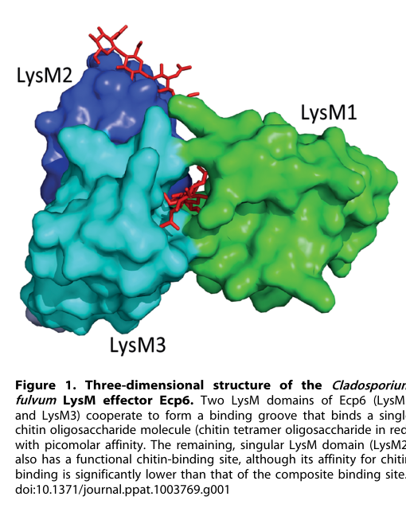

## Question

# Gene Research for Functional Annotation

## ⚠️ CRITICAL: Gene/Protein Identification Context

**BEFORE YOU BEGIN RESEARCH:** You MUST verify you are researching the CORRECT gene/protein. Gene symbols can be ambiguous, especially for less well-characterized genes from non-model organisms.

### Target Gene/Protein Identity (from UniProt):
- **UniProt Accession:** B3VBK9
- **Protein Description:** RecName: Full=Secreted LysM effector ECP6 {ECO:0000303|PubMed:18452583}; AltName: Full=Extracellular protzein 6 {ECO:0000303|PubMed:18452583}; AltName: Full=LysM domain-containing protein ECP6 {ECO:0000303|PubMed:18452583}; Flags: Precursor;
- **Gene Information:** Name=ECP6 {ECO:0000303|PubMed:18452583}; ORFNames=CLAFUR5_10085;
- **Organism (full):** Fulvia fulva (Tomato leaf mold) (Passalora fulva).
- **Protein Family:** Belongs to the secreted LysM effector family.
- **Key Domains:** LysM. (IPR018392); LysM_dom_sf. (IPR036779); LysM (PF01476)

### MANDATORY VERIFICATION STEPS:

1. **Check if the gene symbol "ECP6" matches the protein description above**
2. **Verify the organism is correct:** Fulvia fulva (Tomato leaf mold) (Passalora fulva).
3. **Check if protein family/domains align with what you find in literature**
4. **If you find literature for a DIFFERENT gene with the same or similar symbol, STOP**

### If Gene Symbol is Ambiguous or You Cannot Find Relevant Literature:

**DO NOT PROCEED WITH RESEARCH ON A DIFFERENT GENE.** Instead:
- State clearly: "The gene symbol 'ECP6' is ambiguous or literature is limited for this specific protein"
- Explain what you found (e.g., "Found extensive literature on a different gene with the same symbol in a different organism")
- Describe the protein based ONLY on the UniProt information provided above
- Suggest that the protein function can be inferred from domain/family information

### Research Target:

Please provide a comprehensive research report on the gene **ECP6** (gene ID: ECP6, UniProt: B3VBK9) in FULFL.

The research report should be a detailed narrative explaining the function, biological processes, and localization of the gene product. Citations should be given for all claims.

You should prioritize authoritative reviews and primary scientific literature when conducting research. You can supplement
this with annotations you find in gene/protein databases, but these can be outdated or inaccurate.

We are specifically interested in the primary function of the gene - for enzymes, what reaction is catalyzed, and what is the substrate specificity? For transporters, what is the substrate? For structural proteins or adapters, what is the broader structural role? For signaling molecules, what is the role in the pathway.

We are interested in where in or outside the cell the gene product carries out its function.

We are also interested in the signaling or biochemical pathways in which the gene functions. We are less interested in broad pleiotropic effects, except where these elucidate the precise role.

Include evidence where possible. We are interested in both experimental evidence as well as inference from structure, evolution, or bioinformatic analysis. Precise studies should be prioritized over high-throughput, where available.

## Output

Question: You are an expert researcher providing comprehensive, well-cited information.

Provide detailed information focusing on:
1. Key concepts and definitions with current understanding
2. Recent developments and latest research (prioritize 2023-2024 sources)
3. Current applications and real-world implementations
4. Expert opinions and analysis from authoritative sources
5. Relevant statistics and data from recent studies

Format as a comprehensive research report with proper citations. Include URLs and publication dates where available.
Always prioritize recent, authoritative sources and provide specific citations for all major claims.

# Gene Research for Functional Annotation

## ⚠️ CRITICAL: Gene/Protein Identification Context

**BEFORE YOU BEGIN RESEARCH:** You MUST verify you are researching the CORRECT gene/protein. Gene symbols can be ambiguous, especially for less well-characterized genes from non-model organisms.

### Target Gene/Protein Identity (from UniProt):
- **UniProt Accession:** B3VBK9
- **Protein Description:** RecName: Full=Secreted LysM effector ECP6 {ECO:0000303|PubMed:18452583}; AltName: Full=Extracellular protzein 6 {ECO:0000303|PubMed:18452583}; AltName: Full=LysM domain-containing protein ECP6 {ECO:0000303|PubMed:18452583}; Flags: Precursor;
- **Gene Information:** Name=ECP6 {ECO:0000303|PubMed:18452583}; ORFNames=CLAFUR5_10085;
- **Organism (full):** Fulvia fulva (Tomato leaf mold) (Passalora fulva).
- **Protein Family:** Belongs to the secreted LysM effector family.
- **Key Domains:** LysM. (IPR018392); LysM_dom_sf. (IPR036779); LysM (PF01476)

### MANDATORY VERIFICATION STEPS:

1. **Check if the gene symbol "ECP6" matches the protein description above**
2. **Verify the organism is correct:** Fulvia fulva (Tomato leaf mold) (Passalora fulva).
3. **Check if protein family/domains align with what you find in literature**
4. **If you find literature for a DIFFERENT gene with the same or similar symbol, STOP**

### If Gene Symbol is Ambiguous or You Cannot Find Relevant Literature:

**DO NOT PROCEED WITH RESEARCH ON A DIFFERENT GENE.** Instead:
- State clearly: "The gene symbol 'ECP6' is ambiguous or literature is limited for this specific protein"
- Explain what you found (e.g., "Found extensive literature on a different gene with the same symbol in a different organism")
- Describe the protein based ONLY on the UniProt information provided above
- Suggest that the protein function can be inferred from domain/family information

### Research Target:

Please provide a comprehensive research report on the gene **ECP6** (gene ID: ECP6, UniProt: B3VBK9) in FULFL.

The research report should be a detailed narrative explaining the function, biological processes, and localization of the gene product. Citations should be given for all claims.

You should prioritize authoritative reviews and primary scientific literature when conducting research. You can supplement
this with annotations you find in gene/protein databases, but these can be outdated or inaccurate.

We are specifically interested in the primary function of the gene - for enzymes, what reaction is catalyzed, and what is the substrate specificity? For transporters, what is the substrate? For structural proteins or adapters, what is the broader structural role? For signaling molecules, what is the role in the pathway.

We are interested in where in or outside the cell the gene product carries out its function.

We are also interested in the signaling or biochemical pathways in which the gene functions. We are less interested in broad pleiotropic effects, except where these elucidate the precise role.

Include evidence where possible. We are interested in both experimental evidence as well as inference from structure, evolution, or bioinformatic analysis. Precise studies should be prioritized over high-throughput, where available.

# Functional annotation of ECP6 in *Fulvia fulva*

## Identity and principal function

**ECP6 (UniProt B3VBK9; gene designation CLAFUR5_10085 in the supplied record) encodes a secreted, chitin-binding LysM effector that suppresses chitin-triggered immunity during tomato infection.** The identity check is strong: the primary literature identifies Ecp6 in *Cladosporium fulvum*, explicitly identified in later genomic work as the same tomato-leaf-mold fungus also called *Fulvia fulva* and *Passalora fulva*. Its experimentally described secretion and three lysin-motif (LysM) domains match the supplied protein annotation. The accession-to-gene mapping itself comes from the UniProt information supplied with the question, rather than an accession stated in the original functional studies. (zaccaron2024transcriptomeanalysisof pages 2-4, bolton2008thenovelcladosporium pages 3-5, bolton2008thenovelcladosporium pages 10-12)

Ecp6 is a **glycan-binding effector, not an enzyme, transporter, or plant signaling receptor**. Its immediate biochemical role is to bind chitin-derived oligosaccharides—short chains of β-1,4-linked *N*-acetylglucosamine (GlcNAc)—that become available when fungal cell-wall chitin is attacked during infection. By restricting access of these immunogenic fragments to plant cell-surface chitin receptors, Ecp6 dampens the pathway known as chitin-triggered pattern immunity and favors fungal colonization. The strongest evidence for this mechanism combines direct glycan-binding measurements, inhibition of chitin-specific plant responses, competition with a plant chitin receptor, and structural analysis of the binding domains. (jonge2010conservedfungallysm pages 1-1, jonge2010conservedfungallysm pages 3-3, jonge2010conservedfungallysm pages 1-2, kombrink2013lysmeffectorssecreted pages 1-2)

## Site of action and biological pathway

The relevant compartment is **outside the fungal and tomato cells, principally the tomato leaf apoplast**, where the fungus grows around host cells and where released chitin fragments can encounter host receptors. Bolton and colleagues identified Ecp6 directly in fluid isolated from infected tomato-leaf apoplasts: three electrophoretic spots were assigned to Ecp6 using peptide evidence, including four MS/MS-confirmed peptides and a 26-amino-acid N-terminal sequence. The encoded protein was described as a 222-amino-acid precursor and an approximately 199-amino-acid mature protein, consistent with secretion. These observations support an extracellular site of action; they do not require Ecp6 to enter the tomato cytoplasm. (bolton2008thenovelcladosporium pages 2-3, bolton2008thenovelcladosporium pages 3-5, bolton2008thenovelcladosporium pages 6-7)

The pathway can be summarized as **fungal-wall chitin → soluble chitin oligomers → plant LysM-containing chitin receptors → early defense responses**. Ecp6 acts at the extracellular ligand-perception step, upstream of the measured plant responses, rather than being established as an inhibitor of an intracellular kinase or metabolic reaction. Experimentally, it reduced chitin-evoked medium alkalinization in tomato and tobacco cells, reactive-oxygen-species production in tomato and tobacco leaf tissue, and induction of chitin-responsive genes. It also inhibited chitin-associated oxidative burst and PAL1 expression in rice assays. Its failure to inhibit responses to the unrelated bacterial elicitor flg22 argues against nonspecific shutdown of plant defenses. Rice assays provide mechanistic evidence for competition with a chitin receptor; they do not establish that the rice receptor CEBiP is the corresponding tomato receptor. (jonge2010conservedfungallysm pages 3-3, jonge2010conservedfungallysm pages 2-3)

## Ligand specificity and molecular mechanism

Ecp6 binds insoluble chitin but, in the tested assays, did **not** precipitate with deacetylated chitin (*chitosan*), cellulose, or xylan. In an array of **406 glycans**, it bound the represented chitin oligomers (GlcNAc)₃, (GlcNAc)₅, and (GlcNAc)₆, but not the other array glycans, including chitobiose. These results establish a preference for chitin-derived GlcNAc chains under the conditions tested; the behavior of every possible glycan or physiological oligomer length has not been established. (jonge2010conservedfungallysm pages 1-1, jonge2010conservedfungallysm pages 1-2)

The three LysM domains are not simply three equivalent, independent sites. Structural interpretation of Ecp6 shows that **LysM1 and LysM3 cooperate within the same protein chain** to enclose a chitin oligomer in a composite, deeply buried binding groove with **picomolar-range affinity**. LysM2 provides a separate chitin-binding site of substantially lower affinity. This architecture provides a physical explanation for competition with host ligand perception: in a rice-membrane experiment, an equimolar concentration of Ecp6 almost completely prevented labeling of the chitin-binding receptor **CEBiP** by labeled chitin octamer. An expert-review illustration of the Ecp6 structure distinguishes the LysM1–LysM3 composite groove from the separate LysM2 site. (jonge2010conservedfungallysm pages 3-4, sanchezvallet2015thebattlefor pages 5-6, kombrink2013lysmeffectorssecreted pages 1-2, sanchezvallet2020asecretedlysm pages 5-7, kombrink2013lysmeffectorssecreted media 924a60f0)

**The affinity measurements need careful interpretation.** The original 2010 calorimetry reported *apparent* dissociation constants of **11.5 µM for (GlcNAc)₄, 8.6 µM for (GlcNAc)₅, 6.4 µM for (GlcNAc)₆, and 3.7 µM for (GlcNAc)₈**; the octamer departed from the simple model used for shorter ligands. Subsequent structural work revealed a tightly retained chitin oligomer in the ultrahigh-affinity composite groove even without chitin added during crystallization. The original micromolar measurements therefore should **not** be presented as the affinity of an empty LysM1–LysM3 composite site, nor should the structural picomolar characterization be silently substituted for the values actually reported in 2010. (kombrink2013lysmeffectorssecreted pages 1-2, sanchezvallet2020asecretedlysm pages 5-7, jonge2010conservedfungallysm pages 1-2)

The composite groove supports **chitin sequestration** as an experimentally grounded mechanism. There is, however, a qualified mechanistic question: LysM2 can also suppress chitin-induced responses despite binding less tightly. Investigators have proposed that it might interfere with assembly or dimerization of plant chitin-receptor complexes. That additional receptor-assembly mechanism is a **hypothesis**, not a directly established interaction between Ecp6 and a specified tomato receptor. (sanchezvallet2015thebattlefor pages 5-6, kombrink2013lysmeffectorssecreted pages 1-2)

## Evidence that this is a virulence function—and what it is not

The original infection study provides genetic evidence in the correct fungus. Three independent *C. fulvum* Ecp6-RNAi lines expressed approximately **36%, 27%, and 48%** of wild-type Ecp6 transcript at the reported measurement point and showed significantly reduced growth in susceptible tomato leaves; one line lacked emerging conidiophores at 10 days after inoculation. Conversely, **four** independently selected *Fusarium oxysporum* transformants expressing Ecp6 caused earlier and more severe tomato disease than appropriate comparison strains. Together, partial loss of expression in the native fungus and gain of expression in another fungus support Ecp6 as a virulence factor, although these experiments are not a complete ECP6 deletion-and-rescue analysis. (bolton2008thenovelcladosporium pages 6-7, bolton2008thenovelcladosporium pages 3-5)

**Chitin binding does not make Ecp6 a demonstrated fungal-wall shield.** In the reported assay, Ecp6 failed to protect *Trichoderma viride* hyphae against hydrolysis by tomato-leaf preparations containing basic chitinases, even at the tested 10- and 100-µM concentrations. The distinct *C. fulvum* chitin-binding effector **Avr4** did protect in the comparison. Other fungi possess LysM proteins that protect hyphae, but their activities should not be assigned to this *F. fulva* Ecp6 protein. (jonge2010conservedfungallysm pages 2-3, jonge2010conservedfungallysm pages 1-2, kombrink2013lysmeffectorssecreted pages 1-2, sanchezvallet2020asecretedlysm pages 1-2)

The following evidence summary separates direct observations from interpretation:

| Functional claim | Experimental observation / numeric data | Interpretation and uncertainty | Source and DOI URL |
|---|---|---|---|
| **Identity and extracellular localization** | Ecp6 was recovered from infected-tomato apoplastic fluid as 2D-PAGE spots 11–13; identification included **4 MS/MS-confirmed peptides** and a **26-aa N-terminal sequence**. The gene encodes a **222-aa precursor**; the predicted mature protein is **199 aa**, approximately **21 kDa**, and contains three LysM domains. | Strong direct evidence that the target is a secreted *Cladosporium fulvum* (= *Fulvia fulva*, *Passalora fulva*) apoplastic protein. Mapping to **UniProt B3VBK9/CLAFUR5_10085** derives from the specified UniProt record rather than the paper itself. | Bolton et al., 2008 (bolton2008thenovelcladosporium pages 10-12, bolton2008thenovelcladosporium pages 3-5). [DOI](https://doi.org/10.1111/j.1365-2958.2008.06270.x) |
| **Contribution to virulence** | Three independent Ecp6-RNAi lines retained approximately **36%, 27%, and 48%** of wild-type transcript abundance. All displayed significantly diminished fungal growth in tomato; the strongest line lacked conidiophores at 10 dpi. Four *Fusarium oxysporum* transformants expressing Ecp6 produced earlier, more severe tomato disease than controls. | Strong genetic evidence that Ecp6 promotes infection, although RNAi is partial rather than a clean deletion and heterologous expression tests activity in a different fungus. | Bolton et al., 2008 (bolton2008thenovelcladosporium pages 6-7). [DOI](https://doi.org/10.1111/j.1365-2958.2008.06270.x) |
| **Chitin-selective lectin activity** | Ecp6 precipitated with chitin beads and crab-shell chitin, but not chitosan, cellulose, or xylan. On an array of **more than 400 glycans**, binding was detected only to **(GlcNAc)3, (GlcNAc)5, and (GlcNAc)6**, not chitobiose. | Strong biochemical evidence that Ecp6 preferentially recognizes chitin-derived, beta-1,4-linked N-acetylglucosamine oligomers; it is a lectin-like effector, not an enzyme. | de Jonge et al., 2010 (jonge2010conservedfungallysm pages 1-2, jonge2010conservedfungallysm pages 1-1). [DOI](https://doi.org/10.1126/science.1190859) |
| **Binding affinity and three-LysM mechanism** | Initial 2010 ITC yielded apparent dissociation constants decreasing from approximately **11.5 micromolar for (GlcNAc)4** to **3.7 micromolar for (GlcNAc)8** and suggested three sites per molecule. Later structural analysis showed that **LysM1 and LysM3** form one deeply buried composite groove with **picomolar affinity**, whereas LysM2 is a separate, lower-affinity site. | The 2010 micromolar values should **not** be assigned to the unoccupied LysM1–LysM3 groove: later work found chitin retained in that ultrahigh-affinity site during purification. The composite site explains how Ecp6 can outcompete host receptors. | de Jonge et al., 2010; Sánchez-Vallet et al., 2013 (jonge2010conservedfungallysm pages 1-2, sanchezvallet2015thebattlefor pages 5-6, kombrink2013lysmeffectorssecreted pages 1-2, sanchezvallet2020asecretedlysm pages 5-7). [2010 DOI](https://doi.org/10.1126/science.1190859); [2013 DOI](https://doi.org/10.7554/eLife.00790) |
| **Suppression of chitin-triggered immunity** | Ecp6 dose-dependently inhibited chitin-induced medium alkalinization and ROS production in tomato and tobacco, reduced chitin-responsive gene induction, and suppressed oxidative burst and PAL1 expression in rice. It did not suppress the response to bacterial flg22. | Strong evidence for selective suppression of chitin-triggered pattern immunity rather than broad inhibition of plant signaling. | de Jonge et al., 2010 (jonge2010conservedfungallysm pages 2-3, jonge2010conservedfungallysm pages 3-3). [DOI](https://doi.org/10.1126/science.1190859) |
| **Competition with a plant chitin receptor** | In rice microsomal membranes, an equimolar concentration of Ecp6 almost completely prevented labeling of the LysM receptor **CEBiP** by biotinylated (GlcNAc)8. | Direct competition supports sequestration of soluble chitin oligomers before receptor engagement. A proposed additional action of LysM2—preventing immune-receptor dimerization—remains an inference rather than direct proof. | de Jonge et al., 2010; later structural analyses (jonge2010conservedfungallysm pages 3-3, jonge2010conservedfungallysm pages 3-4, kombrink2013lysmeffectorssecreted pages 1-2, sanchezvallet2015thebattlefor pages 5-6). [2010 DOI](https://doi.org/10.1126/science.1190859); [2013 DOI](https://doi.org/10.7554/eLife.00790) |
| **No demonstrated protection from tomato chitinases** | At **10 or 100 micromolar**, Ecp6 failed to protect *Trichoderma viride* hyphae from hydrolysis by tomato-leaf extracts containing basic chitinases; Avr4 was the protective comparator. | Important negative evidence: the primary supported role of *F. fulva* Ecp6 is scavenging immunogenic chitin oligomers, not shielding the fungal wall from chitinase hydrolysis. Protective activity of other LysM effectors must not be transferred to Ecp6. | de Jonge et al., 2010; Kombrink and Thomma, 2013 (jonge2010conservedfungallysm pages 1-2, jonge2010conservedfungallysm pages 2-3, kombrink2013lysmeffectorssecreted pages 1-2). [2010 DOI](https://doi.org/10.1126/science.1190859); [2013 DOI](https://doi.org/10.1371/journal.ppat.1003769) |
| **Recent alternative-splicing finding** | Infection RNA-seq of Race 4 and Race 5 found that the preferentially expressed shortest Ecp6 isoform lacks **six amino acids between the signal peptide and first conserved LysM domain**. Approximately **40%** of protein-coding genes were classified as alternatively spliced, but candidate effectors were not significantly enriched. | Current Ecp6-specific 2024 development. Evidence is transcriptomic: the study did **not** test whether the six-residue deletion changes secretion, chitin binding, immune suppression, recognition, or virulence. | Zaccaron et al., published December 18, 2024 (zaccaron2024transcriptomeanalysisof pages 5-7, zaccaron2024transcriptomeanalysisof pages 9-11). [DOI](https://doi.org/10.1371/journal.ppat.1012791) |

*Table: Compact evidence-strength table for the secreted LysM effector Ecp6 from Fulvia fulva, including localization, virulence, chitin specificity, immune suppression, structural mechanism, negative evidence, and the latest 2024 transcriptomic finding.*

## Developments in 2023–2024 and practical significance

The most directly relevant recent primary result is the **18 December 2024** infection-transcriptome study of two *C. fulvum* isolates. Across Race 4 and Race 5 interactions with tomato, the authors found that the preferentially expressed **shorter Ecp6 transcript isoform** predicts a protein missing **six amino acids between its signal peptide and first conserved LysM domain**. Their wider analysis classified approximately **40% of protein-coding genes** in each isolate as alternatively spliced. This Ecp6 observation adds a plausible source of mature-protein variation, but the study did **not** demonstrate that the variant changes secretion, chitin affinity, immune suppression, recognition, or virulence. A 2023 review continued to place Ecp6 in the established extracellular chitin-immune-evasion framework rather than establishing a new catalytic activity. (zaccaron2024transcriptomeanalysisof pages 2-4, zaccaron2024transcriptomeanalysisof pages 5-7, zaccaron2024transcriptomeanalysisof pages 9-11, bakhat2023suppressionofchitintriggered pages 4-5)

There is a **research and breeding application**, not an established Ecp6-based crop treatment. Tomato material described as carrying an **Ecp6-recognition specificity, Cf-Ecp6**, illustrates that this pathogen effector can also serve as a marker for screening host resistance: recognition-associated immune responses may counter infection, whereas Ecp6-mediated chitin scavenging favors susceptibility when recognition is absent. Effector-based screening of wild tomatoes is an implemented experimental approach to finding resistance candidates. The cited work does not establish that a particular cloned Cf-Ecp6 gene, an Ecp6-targeted field intervention, or a commercial Ecp6-based resistant cultivar has been deployed. More generally, the 2024 **BdLM1** results concern a different fungus and protein, not B3VBK9. (mesarich2018specifichypersensitiveresponse–associated pages 5-7, mesarich2018specifichypersensitiveresponse–associated pages 1-3)

A historical survey of **50 *C. fulvum* strains** found Ecp6 allelic variants in **seven**; among the five reported polymorphisms, **one** was amino-acid-changing. This supports relative sequence conservation in that sampled collection, but cannot establish global invariance or predict whether the newly reported splice variants are functionally equivalent. (zaccaron2024transcriptomeanalysisof pages 9-11, bolton2008thenovelcladosporium pages 10-12)

## Functional-annotation conclusion

For **B3VBK9/ECP6**, the most defensible annotation is: **secreted, apoplast-acting fungal LysM lectin/effector that binds chitin oligosaccharides and suppresses plant chitin-triggered immune perception, thereby contributing to tomato colonization**. Binding specificity, extracellular detection, defense suppression, and virulence contribution have direct experimental support. Intrachain LysM1–LysM3 cooperation explains particularly strong ligand capture; a separate LysM2-dependent effect on host receptor assembly remains proposed. Catalysis, transport, cytoplasmic host localization, and chitinase-protective wall shielding should **not** be assigned as established functions of this protein. (bolton2008thenovelcladosporium pages 6-7, bolton2008thenovelcladosporium pages 3-5, jonge2010conservedfungallysm pages 1-2, sanchezvallet2015thebattlefor pages 5-6, kombrink2013lysmeffectorssecreted pages 1-2)

### Key dated sources

- **Bolton et al., July 2008**, *Molecular Microbiology*, “The novel *Cladosporium fulvum* lysin motif effector Ecp6 is a virulence factor with orthologues in other fungal species.” Discovery, apoplastic proteomics, domain annotation, and infection genetics. https://doi.org/10.1111/j.1365-2958.2008.06270.x. (bolton2008thenovelcladosporium pages 1-2, bolton2008thenovelcladosporium pages 6-7, bolton2008thenovelcladosporium pages 3-5)
- **de Jonge et al., 20 August 2010**, *Science*, “Conserved Fungal LysM Effector Ecp6 Prevents Chitin-Triggered Immunity in Plants.” Ligand specificity, immune assays, receptor competition, and the negative hyphal-protection test. https://doi.org/10.1126/science.1190859. (jonge2010conservedfungallysm pages 3-3, jonge2010conservedfungallysm pages 3-4, jonge2010conservedfungallysm pages 1-2)
- **Sánchez-Vallet et al., July 2013**, *eLife*, “Fungal effector Ecp6 outcompetes host immune receptor for chitin binding through intrachain LysM dimerization.” Structural study identified in subsequent specialist literature; structural conclusions above are supported here by the available expert reviews and later structural discussion. https://doi.org/10.7554/eLife.00790. (sanchezvallet2015thebattlefor pages 5-6, kombrink2013lysmeffectorssecreted pages 1-2, sanchezvallet2020asecretedlysm pages 5-7, kombrink2013lysmeffectorssecreted media 924a60f0)
- **Kombrink and Thomma, 12 December 2013**, *PLOS Pathogens*, “LysM Effectors: Secreted Proteins Supporting Fungal Life.” Expert assessment of Ecp6’s demonstrated and proposed mechanisms. https://doi.org/10.1371/journal.ppat.1003769. (kombrink2013lysmeffectorssecreted pages 1-2)
- **Mesarich et al., January 2018**, *Molecular Plant-Microbe Interactions*, “Specific Hypersensitive Response–Associated Recognition of New Apoplastic Effectors from *Cladosporium fulvum* in Wild Tomato.” Cf recognition and effectoromics context. https://doi.org/10.1094/MPMI-05-17-0114-FI. (mesarich2018specifichypersensitiveresponse–associated pages 1-3, mesarich2018specifichypersensitiveresponse–associated pages 5-7)
- **Bakhat et al., July 2023**, *Journal of Fungi*, “Suppression of Chitin-Triggered Immunity by Plant Fungal Pathogens.” Contemporary review placing Ecp6 among extracellular immune-evasion strategies. https://doi.org/10.3390/jof9070771. (bakhat2023suppressionofchitintriggered pages 4-5)
- **Zaccaron, Chen, and Stergiopoulos, 18 December 2024**, *PLOS Pathogens*, “Transcriptome analysis of two isolates of the tomato pathogen *Cladosporium fulvum*, uncovers genome-wide patterns of alternative splicing during a host infection cycle.” Ecp6 transcript-isoform finding. https://doi.org/10.1371/journal.ppat.1012791. (zaccaron2024transcriptomeanalysisof pages 2-4, zaccaron2024transcriptomeanalysisof pages 9-11)

References

1. (zaccaron2024transcriptomeanalysisof pages 2-4): Alex Z. Zaccaron, Li-Hung Chen, and Ioannis Stergiopoulos. Transcriptome analysis of two isolates of the tomato pathogen cladosporium fulvum, uncovers genome-wide patterns of alternative splicing during a host infection cycle. PLOS Pathogens, 20(12):e1012791, Dec 2024. URL: https://doi.org/10.1371/journal.ppat.1012791, doi:10.1371/journal.ppat.1012791. This article has 6 citations and is from a highest quality peer-reviewed journal.

2. (bolton2008thenovelcladosporium pages 3-5): Melvin D. Bolton, H. Peter Van Esse, Jack H. Vossen, Ronnie De Jonge, Ioannis Stergiopoulos, Iris J. E. Stulemeijer, Grardy C. M. Van Den Berg, Orlando Borrás‐Hidalgo, Henk L. Dekker, Chris G. De Koster, Pierre J. G. M. De Wit, Matthieu H. A. J. Joosten, and Bart P. H. J. Thomma. The novel cladosporium fulvum lysin motif effector ecp6 is a virulence factor with orthologues in other fungal species. Molecular Microbiology, 69:119-136, Jul 2008. URL: https://doi.org/10.1111/j.1365-2958.2008.06270.x, doi:10.1111/j.1365-2958.2008.06270.x. This article has 404 citations and is from a domain leading peer-reviewed journal.

3. (bolton2008thenovelcladosporium pages 10-12): Melvin D. Bolton, H. Peter Van Esse, Jack H. Vossen, Ronnie De Jonge, Ioannis Stergiopoulos, Iris J. E. Stulemeijer, Grardy C. M. Van Den Berg, Orlando Borrás‐Hidalgo, Henk L. Dekker, Chris G. De Koster, Pierre J. G. M. De Wit, Matthieu H. A. J. Joosten, and Bart P. H. J. Thomma. The novel cladosporium fulvum lysin motif effector ecp6 is a virulence factor with orthologues in other fungal species. Molecular Microbiology, 69:119-136, Jul 2008. URL: https://doi.org/10.1111/j.1365-2958.2008.06270.x, doi:10.1111/j.1365-2958.2008.06270.x. This article has 404 citations and is from a domain leading peer-reviewed journal.

4. (jonge2010conservedfungallysm pages 1-1): Ronnie de Jonge, H. Peter van Esse, Anja Kombrink, Tomonori Shinya, Yoshitake Desaki, Ralph Bours, Sander van der Krol, Naoto Shibuya, Matthieu H. A. J. Joosten, and Bart P. H. J. Thomma. Conserved fungal lysm effector ecp6 prevents chitin-triggered immunity in plants. Science, 329:953-955, Aug 2010. URL: https://doi.org/10.1126/science.1190859, doi:10.1126/science.1190859. This article has 989 citations and is from a highest quality peer-reviewed journal.

5. (jonge2010conservedfungallysm pages 3-3): Ronnie de Jonge, H. Peter van Esse, Anja Kombrink, Tomonori Shinya, Yoshitake Desaki, Ralph Bours, Sander van der Krol, Naoto Shibuya, Matthieu H. A. J. Joosten, and Bart P. H. J. Thomma. Conserved fungal lysm effector ecp6 prevents chitin-triggered immunity in plants. Science, 329:953-955, Aug 2010. URL: https://doi.org/10.1126/science.1190859, doi:10.1126/science.1190859. This article has 989 citations and is from a highest quality peer-reviewed journal.

6. (jonge2010conservedfungallysm pages 1-2): Ronnie de Jonge, H. Peter van Esse, Anja Kombrink, Tomonori Shinya, Yoshitake Desaki, Ralph Bours, Sander van der Krol, Naoto Shibuya, Matthieu H. A. J. Joosten, and Bart P. H. J. Thomma. Conserved fungal lysm effector ecp6 prevents chitin-triggered immunity in plants. Science, 329:953-955, Aug 2010. URL: https://doi.org/10.1126/science.1190859, doi:10.1126/science.1190859. This article has 989 citations and is from a highest quality peer-reviewed journal.

7. (kombrink2013lysmeffectorssecreted pages 1-2): Anja Kombrink and Bart P. H. J. Thomma. Lysm effectors: secreted proteins supporting fungal life. PLoS Pathogens, 9:e1003769, Dec 2013. URL: https://doi.org/10.1371/journal.ppat.1003769, doi:10.1371/journal.ppat.1003769. This article has 228 citations and is from a highest quality peer-reviewed journal.

8. (bolton2008thenovelcladosporium pages 2-3): Melvin D. Bolton, H. Peter Van Esse, Jack H. Vossen, Ronnie De Jonge, Ioannis Stergiopoulos, Iris J. E. Stulemeijer, Grardy C. M. Van Den Berg, Orlando Borrás‐Hidalgo, Henk L. Dekker, Chris G. De Koster, Pierre J. G. M. De Wit, Matthieu H. A. J. Joosten, and Bart P. H. J. Thomma. The novel cladosporium fulvum lysin motif effector ecp6 is a virulence factor with orthologues in other fungal species. Molecular Microbiology, 69:119-136, Jul 2008. URL: https://doi.org/10.1111/j.1365-2958.2008.06270.x, doi:10.1111/j.1365-2958.2008.06270.x. This article has 404 citations and is from a domain leading peer-reviewed journal.

9. (bolton2008thenovelcladosporium pages 6-7): Melvin D. Bolton, H. Peter Van Esse, Jack H. Vossen, Ronnie De Jonge, Ioannis Stergiopoulos, Iris J. E. Stulemeijer, Grardy C. M. Van Den Berg, Orlando Borrás‐Hidalgo, Henk L. Dekker, Chris G. De Koster, Pierre J. G. M. De Wit, Matthieu H. A. J. Joosten, and Bart P. H. J. Thomma. The novel cladosporium fulvum lysin motif effector ecp6 is a virulence factor with orthologues in other fungal species. Molecular Microbiology, 69:119-136, Jul 2008. URL: https://doi.org/10.1111/j.1365-2958.2008.06270.x, doi:10.1111/j.1365-2958.2008.06270.x. This article has 404 citations and is from a domain leading peer-reviewed journal.

10. (jonge2010conservedfungallysm pages 2-3): Ronnie de Jonge, H. Peter van Esse, Anja Kombrink, Tomonori Shinya, Yoshitake Desaki, Ralph Bours, Sander van der Krol, Naoto Shibuya, Matthieu H. A. J. Joosten, and Bart P. H. J. Thomma. Conserved fungal lysm effector ecp6 prevents chitin-triggered immunity in plants. Science, 329:953-955, Aug 2010. URL: https://doi.org/10.1126/science.1190859, doi:10.1126/science.1190859. This article has 989 citations and is from a highest quality peer-reviewed journal.

11. (jonge2010conservedfungallysm pages 3-4): Ronnie de Jonge, H. Peter van Esse, Anja Kombrink, Tomonori Shinya, Yoshitake Desaki, Ralph Bours, Sander van der Krol, Naoto Shibuya, Matthieu H. A. J. Joosten, and Bart P. H. J. Thomma. Conserved fungal lysm effector ecp6 prevents chitin-triggered immunity in plants. Science, 329:953-955, Aug 2010. URL: https://doi.org/10.1126/science.1190859, doi:10.1126/science.1190859. This article has 989 citations and is from a highest quality peer-reviewed journal.

12. (sanchezvallet2015thebattlefor pages 5-6): Andrea Sánchez-Vallet, Jeroen R. Mesters, and Bart P.H.J. Thomma. The battle for chitin recognition in plant-microbe interactions. FEMS microbiology reviews, 39 2:171-83, Mar 2015. URL: https://doi.org/10.1093/femsre/fuu003, doi:10.1093/femsre/fuu003. This article has 363 citations and is from a domain leading peer-reviewed journal.

13. (sanchezvallet2020asecretedlysm pages 5-7): Andrea Sánchez-Vallet, Hui Tian, Luis Rodriguez-Moreno, Dirk-Jan Valkenburg, Raspudin Saleem-Batcha, Stephan Wawra, Anja Kombrink, Leonie Verhage, Ronnie de Jonge, H. Peter van Esse, Alga Zuccaro, Daniel Croll, Jeroen R. Mesters, and Bart P. H. J. Thomma. A secreted lysm effector protects fungal hyphae through chitin-dependent homodimer polymerization. PLOS Pathogens, 16:e1008652, Jun 2020. URL: https://doi.org/10.1371/journal.ppat.1008652, doi:10.1371/journal.ppat.1008652. This article has 99 citations and is from a highest quality peer-reviewed journal.

14. (kombrink2013lysmeffectorssecreted media 924a60f0): Anja Kombrink and Bart P. H. J. Thomma. Lysm effectors: secreted proteins supporting fungal life. PLoS Pathogens, 9:e1003769, Dec 2013. URL: https://doi.org/10.1371/journal.ppat.1003769, doi:10.1371/journal.ppat.1003769. This article has 228 citations and is from a highest quality peer-reviewed journal.

15. (sanchezvallet2020asecretedlysm pages 1-2): Andrea Sánchez-Vallet, Hui Tian, Luis Rodriguez-Moreno, Dirk-Jan Valkenburg, Raspudin Saleem-Batcha, Stephan Wawra, Anja Kombrink, Leonie Verhage, Ronnie de Jonge, H. Peter van Esse, Alga Zuccaro, Daniel Croll, Jeroen R. Mesters, and Bart P. H. J. Thomma. A secreted lysm effector protects fungal hyphae through chitin-dependent homodimer polymerization. PLOS Pathogens, 16:e1008652, Jun 2020. URL: https://doi.org/10.1371/journal.ppat.1008652, doi:10.1371/journal.ppat.1008652. This article has 99 citations and is from a highest quality peer-reviewed journal.

16. (zaccaron2024transcriptomeanalysisof pages 5-7): Alex Z. Zaccaron, Li-Hung Chen, and Ioannis Stergiopoulos. Transcriptome analysis of two isolates of the tomato pathogen cladosporium fulvum, uncovers genome-wide patterns of alternative splicing during a host infection cycle. PLOS Pathogens, 20(12):e1012791, Dec 2024. URL: https://doi.org/10.1371/journal.ppat.1012791, doi:10.1371/journal.ppat.1012791. This article has 6 citations and is from a highest quality peer-reviewed journal.

17. (zaccaron2024transcriptomeanalysisof pages 9-11): Alex Z. Zaccaron, Li-Hung Chen, and Ioannis Stergiopoulos. Transcriptome analysis of two isolates of the tomato pathogen cladosporium fulvum, uncovers genome-wide patterns of alternative splicing during a host infection cycle. PLOS Pathogens, 20(12):e1012791, Dec 2024. URL: https://doi.org/10.1371/journal.ppat.1012791, doi:10.1371/journal.ppat.1012791. This article has 6 citations and is from a highest quality peer-reviewed journal.

18. (bakhat2023suppressionofchitintriggered pages 4-5): Nisrine Bakhat, Alejandra Vielba-Fernández, Isabel Padilla-Roji, Jesús Martínez-Cruz, Álvaro Polonio, Dolores Fernández-Ortuño, and Alejandro Pérez-García. Suppression of chitin-triggered immunity by plant fungal pathogens: a case study of the cucurbit powdery mildew fungus podosphaera xanthii. Journal of Fungi, 9:771, Jul 2023. URL: https://doi.org/10.3390/jof9070771, doi:10.3390/jof9070771. This article has 45 citations.

19. (mesarich2018specifichypersensitiveresponse–associated pages 5-7): Carl H. Mesarich, Bilal Ӧkmen, Hanna Rovenich, Scott A. Griffiths, Changchun Wang, Mansoor Karimi Jashni, Aleksandar Mihajlovski, Jérôme Collemare, Lukas Hunziker, Cecilia H. Deng, Ate van der Burgt, Henriek G. Beenen, Matthew D. Templeton, Rosie E. Bradshaw, and Pierre J. G. M. de Wit. Specific hypersensitive response–associated recognition of new apoplastic effectors from <i>cladosporium fulvum</i> in wild tomato. Molecular Plant-Microbe Interactions®, 31:145-162, Jan 2018. URL: https://doi.org/10.1094/mpmi-05-17-0114-fi, doi:10.1094/mpmi-05-17-0114-fi. This article has 80 citations.

20. (mesarich2018specifichypersensitiveresponse–associated pages 1-3): Carl H. Mesarich, Bilal Ӧkmen, Hanna Rovenich, Scott A. Griffiths, Changchun Wang, Mansoor Karimi Jashni, Aleksandar Mihajlovski, Jérôme Collemare, Lukas Hunziker, Cecilia H. Deng, Ate van der Burgt, Henriek G. Beenen, Matthew D. Templeton, Rosie E. Bradshaw, and Pierre J. G. M. de Wit. Specific hypersensitive response–associated recognition of new apoplastic effectors from <i>cladosporium fulvum</i> in wild tomato. Molecular Plant-Microbe Interactions®, 31:145-162, Jan 2018. URL: https://doi.org/10.1094/mpmi-05-17-0114-fi, doi:10.1094/mpmi-05-17-0114-fi. This article has 80 citations.

21. (bolton2008thenovelcladosporium pages 1-2): Melvin D. Bolton, H. Peter Van Esse, Jack H. Vossen, Ronnie De Jonge, Ioannis Stergiopoulos, Iris J. E. Stulemeijer, Grardy C. M. Van Den Berg, Orlando Borrás‐Hidalgo, Henk L. Dekker, Chris G. De Koster, Pierre J. G. M. De Wit, Matthieu H. A. J. Joosten, and Bart P. H. J. Thomma. The novel cladosporium fulvum lysin motif effector ecp6 is a virulence factor with orthologues in other fungal species. Molecular Microbiology, 69:119-136, Jul 2008. URL: https://doi.org/10.1111/j.1365-2958.2008.06270.x, doi:10.1111/j.1365-2958.2008.06270.x. This article has 404 citations and is from a domain leading peer-reviewed journal.

## Artifacts

- [Edison artifact artifact-00](ECP6-deep-research-falcon_artifacts/artifact-00.md)

## Citations

1. bolton2008thenovelcladosporium pages 6-7
2. kombrink2013lysmeffectorssecreted pages 1-2
3. bakhat2023suppressionofchitintriggered pages 4-5
4. zaccaron2024transcriptomeanalysisof pages 2-4
5. bolton2008thenovelcladosporium pages 3-5
6. bolton2008thenovelcladosporium pages 10-12
7. jonge2010conservedfungallysm pages 1-1
8. jonge2010conservedfungallysm pages 3-3
9. jonge2010conservedfungallysm pages 1-2
10. bolton2008thenovelcladosporium pages 2-3
11. jonge2010conservedfungallysm pages 2-3
12. jonge2010conservedfungallysm pages 3-4
13. sanchezvallet2015thebattlefor pages 5-6
14. sanchezvallet2020asecretedlysm pages 5-7
15. sanchezvallet2020asecretedlysm pages 1-2
16. zaccaron2024transcriptomeanalysisof pages 5-7
17. zaccaron2024transcriptomeanalysisof pages 9-11
18. bolton2008thenovelcladosporium pages 1-2
19. DOI
20. 2010 DOI
21. 2013 DOI
22. https://doi.org/10.1111/j.1365-2958.2008.06270.x
23. https://doi.org/10.1126/science.1190859
24. https://doi.org/10.7554/eLife.00790
25. https://doi.org/10.1371/journal.ppat.1003769
26. https://doi.org/10.1371/journal.ppat.1012791
27. https://doi.org/10.1111/j.1365-2958.2008.06270.x.
28. https://doi.org/10.1126/science.1190859.
29. https://doi.org/10.7554/eLife.00790.
30. https://doi.org/10.1371/journal.ppat.1003769.
31. https://doi.org/10.1094/MPMI-05-17-0114-FI.
32. https://doi.org/10.3390/jof9070771.
33. https://doi.org/10.1371/journal.ppat.1012791.
34. https://doi.org/10.1371/journal.ppat.1012791,
35. https://doi.org/10.1111/j.1365-2958.2008.06270.x,
36. https://doi.org/10.1126/science.1190859,
37. https://doi.org/10.1371/journal.ppat.1003769,
38. https://doi.org/10.1093/femsre/fuu003,
39. https://doi.org/10.1371/journal.ppat.1008652,
40. https://doi.org/10.3390/jof9070771,
41. https://doi.org/10.1094/mpmi-05-17-0114-fi,