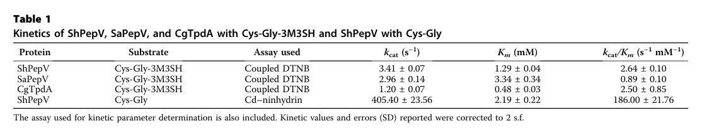

## Question

# Gene Research for Functional Annotation

## ⚠️ CRITICAL: Gene/Protein Identification Context

**BEFORE YOU BEGIN RESEARCH:** You MUST verify you are researching the CORRECT gene/protein. Gene symbols can be ambiguous, especially for less well-characterized genes from non-model organisms.

### Target Gene/Protein Identity (from UniProt):
- **UniProt Accession:** A0A133P372
- **Protein Description:** SubName: Full=Putative dipeptidase PepV {ECO:0000313|EMBL:KXA23001.1};
- **Gene Information:** ORFNames=HMPREF3221_00844 {ECO:0000313|EMBL:KXA23001.1};
- **Organism (full):** Fusobacterium nucleatum.
- **Protein Family:** Belongs to the peptidase M20A family.
- **Key Domains:** ArgE/DapE_CS. (IPR001261); Bact_exopeptidase_dim_dom. (IPR036264); M20A_pepV-rel. (IPR010964); Peptidase_M20. (IPR002933); Peptidase_M20_dimer. (IPR011650)

### MANDATORY VERIFICATION STEPS:

1. **Check if the gene symbol "pepV" matches the protein description above**
2. **Verify the organism is correct:** Fusobacterium nucleatum.
3. **Check if protein family/domains align with what you find in literature**
4. **If you find literature for a DIFFERENT gene with the same or similar symbol, STOP**

### If Gene Symbol is Ambiguous or You Cannot Find Relevant Literature:

**DO NOT PROCEED WITH RESEARCH ON A DIFFERENT GENE.** Instead:
- State clearly: "The gene symbol 'pepV' is ambiguous or literature is limited for this specific protein"
- Explain what you found (e.g., "Found extensive literature on a different gene with the same symbol in a different organism")
- Describe the protein based ONLY on the UniProt information provided above
- Suggest that the protein function can be inferred from domain/family information

### Research Target:

Please provide a comprehensive research report on the gene **pepV** (gene ID: pepV, UniProt: A0A133P372) in FUSNU.

The research report should be a detailed narrative explaining the function, biological processes, and localization of the gene product. Citations should be given for all claims.

You should prioritize authoritative reviews and primary scientific literature when conducting research. You can supplement
this with annotations you find in gene/protein databases, but these can be outdated or inaccurate.

We are specifically interested in the primary function of the gene - for enzymes, what reaction is catalyzed, and what is the substrate specificity? For transporters, what is the substrate? For structural proteins or adapters, what is the broader structural role? For signaling molecules, what is the role in the pathway.

We are interested in where in or outside the cell the gene product carries out its function.

We are also interested in the signaling or biochemical pathways in which the gene functions. We are less interested in broad pleiotropic effects, except where these elucidate the precise role.

Include evidence where possible. We are interested in both experimental evidence as well as inference from structure, evolution, or bioinformatic analysis. Precise studies should be prioritized over high-throughput, where available.

## Output

Question: You are an expert researcher providing comprehensive, well-cited information.

Provide detailed information focusing on:
1. Key concepts and definitions with current understanding
2. Recent developments and latest research (prioritize 2023-2024 sources)
3. Current applications and real-world implementations
4. Expert opinions and analysis from authoritative sources
5. Relevant statistics and data from recent studies

Format as a comprehensive research report with proper citations. Include URLs and publication dates where available.
Always prioritize recent, authoritative sources and provide specific citations for all major claims.

# Gene Research for Functional Annotation

## ⚠️ CRITICAL: Gene/Protein Identification Context

**BEFORE YOU BEGIN RESEARCH:** You MUST verify you are researching the CORRECT gene/protein. Gene symbols can be ambiguous, especially for less well-characterized genes from non-model organisms.

### Target Gene/Protein Identity (from UniProt):
- **UniProt Accession:** A0A133P372
- **Protein Description:** SubName: Full=Putative dipeptidase PepV {ECO:0000313|EMBL:KXA23001.1};
- **Gene Information:** ORFNames=HMPREF3221_00844 {ECO:0000313|EMBL:KXA23001.1};
- **Organism (full):** Fusobacterium nucleatum.
- **Protein Family:** Belongs to the peptidase M20A family.
- **Key Domains:** ArgE/DapE_CS. (IPR001261); Bact_exopeptidase_dim_dom. (IPR036264); M20A_pepV-rel. (IPR010964); Peptidase_M20. (IPR002933); Peptidase_M20_dimer. (IPR011650)

### MANDATORY VERIFICATION STEPS:

1. **Check if the gene symbol "pepV" matches the protein description above**
2. **Verify the organism is correct:** Fusobacterium nucleatum.
3. **Check if protein family/domains align with what you find in literature**
4. **If you find literature for a DIFFERENT gene with the same or similar symbol, STOP**

### If Gene Symbol is Ambiguous or You Cannot Find Relevant Literature:

**DO NOT PROCEED WITH RESEARCH ON A DIFFERENT GENE.** Instead:
- State clearly: "The gene symbol 'pepV' is ambiguous or literature is limited for this specific protein"
- Explain what you found (e.g., "Found extensive literature on a different gene with the same symbol in a different organism")
- Describe the protein based ONLY on the UniProt information provided above
- Suggest that the protein function can be inferred from domain/family information

### Research Target:

Please provide a comprehensive research report on the gene **pepV** (gene ID: pepV, UniProt: A0A133P372) in FUSNU.

The research report should be a detailed narrative explaining the function, biological processes, and localization of the gene product. Citations should be given for all claims.

You should prioritize authoritative reviews and primary scientific literature when conducting research. You can supplement
this with annotations you find in gene/protein databases, but these can be outdated or inaccurate.

We are specifically interested in the primary function of the gene - for enzymes, what reaction is catalyzed, and what is the substrate specificity? For transporters, what is the substrate? For structural proteins or adapters, what is the broader structural role? For signaling molecules, what is the role in the pathway.

We are interested in where in or outside the cell the gene product carries out its function.

We are also interested in the signaling or biochemical pathways in which the gene functions. We are less interested in broad pleiotropic effects, except where these elucidate the precise role.

Include evidence where possible. We are interested in both experimental evidence as well as inference from structure, evolution, or bioinformatic analysis. Precise studies should be prioritized over high-throughput, where available.

## Research report: Functional annotation of **pepV** (UniProt **A0A133P372**) in *Fusobacterium nucleatum* (FUSNU)

### 1) Target verification (gene/protein identity)
The target protein is UniProt accession **A0A133P372** from *Fusobacterium nucleatum*, annotated as **“putative dipeptidase PepV”** and belonging to the **peptidase M20A family** (M20 metallopeptidases) with the canonical catalytic and dimerization/lid domains typical of PepV-like enzymes (per the user-provided UniProt context). No retrieved literature directly used the *F. nucleatum* locus name **HMPREF3221_00844** or accession **A0A133P372**; therefore, gene-specific claims below are limited to (i) **direct organism-level physiology** in *F. nucleatum* plus (ii) **mechanistic/biochemical inference from PepV/M20A homologs** that are explicitly described as PepV (or closely related M20A dipeptidases). (takahashi2002dipeptideutilizationby pages 5-6, herman2024identificationofa pages 2-4)

### 2) Key concepts and definitions (current understanding)

#### 2.1 PepV / Peptidase V (M20A) as a cytosolic exopeptidase
PepV (also called peptidase V or aminopeptidase/dipeptidase V in some contexts) is best supported as a **metal-dependent intracellular dipeptidase** that hydrolyzes dipeptides into their constituent amino acids, thereby supporting amino-acid supply from imported peptides (herman2024identificationofa pages 2-4, takahashi2002dipeptideutilizationby pages 5-6). In the M20 family broadly, enzymes hydrolyze **dipeptide and tripeptide** substrates; for M20 enzymes related to PepV/PepD, substrates include **Xaa–His dipeptides** such as **L-carnosine** and **L-homocarnosine**, which is consistent with the family’s role in peptide/amino-acid utilization (chang2010crystalstructureand pages 1-2).

#### 2.2 Domain architecture and catalytic mechanism (M20/M28 metallopeptidases)
M20 metallopeptidases typically have a **catalytic domain** plus a **lid/dimerization domain** that shapes substrate binding (azam2025asecaassociatedprotease pages 2-5, chang2010crystalstructureand pages 6-7). Structure-guided analysis of PepV-like enzymes identifies lid-domain residues implicated in C-terminal/transition-state binding (e.g., **Asn217, His269, Arg350** in PepV numbering referenced in the structural literature) (chang2010crystalstructureand pages 8-9). These enzymes use a **di-metal catalytic center** (often discussed as di-Zn in structural work on related M20 enzymes), where the metals activate a water molecule for nucleophilic attack during peptide bond hydrolysis (chang2010crystalstructureand pages 6-7, chang2010crystalstructureand pages 1-2).

### 3) Most defensible functional annotation for *F. nucleatum* PepV (A0A133P372)

#### 3.1 Primary biochemical function (reaction catalyzed)
The most defensible annotation is that *F. nucleatum* PepV is an **intracellular metal-dependent dipeptidase** catalyzing:

**Dipeptide + H2O → amino acid 1 + amino acid 2**

This conclusion is supported by:
- **Direct organism-level evidence** that *F. nucleatum* grows using dipeptides and contains **intracellular dipeptidase activities** (takahashi2002dipeptideutilizationby pages 5-6).
- **Direct biochemical evidence** that characterized PepV homologs are broad-spectrum dipeptidases selective for **dipeptides (not tripeptides)** (herman2024identificationofa pages 2-4).

Because no gene knockout/biochemical characterization of A0A133P372 itself was retrieved, **substrate scope in *F. nucleatum*** should be treated as **inferred**, not experimentally proven for this specific protein.

#### 3.2 Substrate specificity (what it likely hydrolyzes)
**Evidence from PepV homolog biochemistry (highest-confidence homolog inference):**
A 2024 mechanistic study identified a staphylococcal PepV (ShPepV; M20A family) as a **general dipeptidase** that cleaves a wide range of **L-amino-acid dipeptides** (all tested except **D-Ala–D-Ala**) and does **not** cleave the tripeptide **L-Ala–L-Ala–L-Ala**, indicating **strong dipeptide selectivity** (herman2024identificationofa pages 2-4). The same study quantified PepV kinetics on two dipeptides:
- **Cys–Gly-3M3SH** (bulky malodor precursor): **kcat 3.41 s−1, Km 1.29 mM** (herman2024identificationofa pages 4-5, herman2024identificationofa media ac4f7f69)
- **Cys–Gly**: **kcat 405.40 s−1, Km 2.19 mM** (herman2024identificationofa pages 4-5, herman2024identificationofa media ac4f7f69)

These data indicate PepV can accommodate both small and bulky dipeptides, though turnover can vary by ~2 orders of magnitude depending on substrate chemistry (herman2024identificationofa pages 4-5, herman2024identificationofa media ac4f7f69).

**Evidence from *F. nucleatum* physiology (direct but not gene-specific):**
In *F. nucleatum* strains ATCC 25586 and ATCC 10953, dipeptides supported growth in a **concentration-dependent** manner up to **5 mM**, consistent with a physiology that relies on intracellular dipeptide hydrolysis (takahashi2002dipeptideutilizationby pages 5-6). The same work highlighted utilization of **glutamylglutamate (Glu2)** (takahashi2002dipeptideutilizationby pages 4-5).

Taken together, the best-supported substrate statement for A0A133P372 is: **broad dipeptide hydrolysis** supporting amino-acid supply; specific preferences (e.g., for Xaa–His, glutamyl dipeptides, or sulfur-containing dipeptides like Cys–Gly) remain **unresolved in *F. nucleatum* without direct assay** (herman2024identificationofa pages 2-4, takahashi2002dipeptideutilizationby pages 5-6).

#### 3.3 Metal dependence / cofactors
PepV/M20A enzymes are **metallopeptidases**. The best recent biochemical evidence indicates PepV activity is strongly **metal dependent** and can show a preference for **Mn2+**:
- In vitro reactivation of EDTA-treated apo-ShPepV showed activity recovered most strongly with **Mn2+**, with **Co2+** second-best (herman2024identificationofa pages 2-4, herman2024identificationofa media 7c781f26).
- Independent work on *S. aureus* PepV describes it as a **manganese-dependent dipeptidase** in vitro and notes that chelation can promote loss of metal cofactors and self-cleavage/autodegradation under specific conditions (azam2025asecaassociatedprotease pages 1-2, azam2025asecaassociatedprotease pages 11-13).

Structural literature for PepV-like M20 enzymes also supports a **di-metal active site** (often discussed as di-Zn in crystallographic contexts), consistent with metallo-dependent catalysis via metal-activated water (chang2010crystalstructureand pages 6-7, chang2010crystalstructureand pages 1-2). For *F. nucleatum* A0A133P372, the conservative conclusion is **metal-dependent catalysis is highly likely**, but whether its optimal metal is Mn2+ vs Zn2+ is **not yet directly demonstrated** for this species.

#### 3.4 Oligomeric state and structural considerations
M20 peptidases can exist as monomers or dimers depending on subfamily and domain architecture (azam2025asecaassociatedprotease pages 2-5). Structural comparison work explicitly notes that PepV can exist as a **monomer** (contrasted with dimeric PepD in the same family) (chang2010crystalstructureand pages 1-2). In PepV-like enzymes, a lid domain folds over the active site to create a substrate-binding cavity, and specific lid residues participate in substrate/transition-state binding (chang2010crystalstructureand pages 6-7, chang2010crystalstructureand pages 8-9).

Thus, A0A133P372 is most reasonably modeled as a **cytosolic, two-domain M20A metallopeptidase** whose lid domain controls dipeptide access and specificity; whether it is strictly monomeric in vivo in *F. nucleatum* is **not directly evidenced** here.

### 4) Cellular localization and pathway placement in *F. nucleatum*

#### 4.1 Localization
Direct experimental localization of *F. nucleatum* A0A133P372 was not identified in the retrieved literature. However:
- *F. nucleatum* exhibits primarily **intracellular dipeptidase activities** (with minimal cell-bound activity, except weak aspartate dipeptidase activity in one strain), supporting an **intracellular localization** for dipeptidase function in this organism (takahashi2002dipeptideutilizationby pages 5-6).
- PepV homolog studies supporting intracellular roles include (i) staphylococcal PepV processing dipeptides after import (herman2024identificationofa pages 7-9) and (ii) cytosolic enrichment of PepV in *S. aureus* (azam2025asecaassociatedprotease pages 2-5).

Accordingly, the most defensible localization annotation for A0A133P372 is **cytosolic (intracellular)**.

#### 4.2 Metabolic pathway context
A physiological study of periodontal pathogens demonstrated that *F. nucleatum* strains can use dipeptides (e.g., glutamylglutamate) to support growth and convert substrates primarily into **acetate and butyrate** (with ammonia production), consistent with amino-acid fermentation pathways where dipeptide hydrolysis supplies amino-acid inputs (takahashi2002dipeptideutilizationby pages 4-5). The same study suggested *F. nucleatum* lacks uptake/transport for oligopeptides longer than dipeptides, implying a niche specialization in **dipeptide import + intracellular hydrolysis** (takahashi2002dipeptideutilizationby pages 5-6).

### 5) Recent developments (2023–2024 prioritized)
Direct 2023–2024 papers specifically characterizing **PepV in *F. nucleatum*** were not retrieved in the tool searches, so “recent developments” are best represented by **PepV/M20A family** advances with clear real-world relevance:

1. **High-resolution functional assignment of PepV as the key dipeptidase for a human-relevant phenotype (body odor precursor processing).** A 2024 JBC study biochemically established an M20A PepV as the primary enzyme hydrolyzing the dipeptide odor precursor Cys–Gly-3M3SH, quantified kinetics, and mapped activity changes from active-site mutations (herman2024identificationofa pages 1-2, herman2024identificationofa pages 4-5).
2. **Improved experimental clarity on metal preference.** The same 2024 work showed that PepV activity can be strongly restored by Mn2+ (and to a lesser extent Co2+) after EDTA treatment, supporting a “functionally Mn-preferential” metallopeptidase model for at least some PepV enzymes (herman2024identificationofa pages 2-4, herman2024identificationofa media 7c781f26).

These developments strengthen confidence in annotating A0A133P372 as a **broad dipeptidase** and suggest a plausible Mn-dependent catalytic mode, while still requiring direct *F. nucleatum*-specific validation.

### 6) Current applications and real-world implementations
The strongest “real-world implementation” evidence in the retrieved set is the use of PepV biochemistry to explain and potentially modulate **human malodor formation**:
- PepV acts on an imported odor precursor dipeptide (Cys–Gly-3M3SH), enabling downstream conversion to the volatile thiol 3M3SH; this establishes PepV as a potential intervention point for controlling odor-associated microbial metabolism (herman2024identificationofa pages 7-9, herman2024identificationofa pages 1-2).

No *F. nucleatum*-specific clinical/industrial application of PepV was identified in the retrieved evidence.

### 7) Expert opinions / authoritative synthesis from sources
Two cross-cutting expert-level conclusions are most directly supported by the primary literature assembled here:
1. **PepV/M20A enzymes are best viewed as intracellular peptide catabolism enzymes, not secreted proteases**, consistent with intracellular localization in multiple contexts and with *F. nucleatum* intracellular dipeptidase activity (takahashi2002dipeptideutilizationby pages 5-6, azam2025asecaassociatedprotease pages 2-5).
2. **Substrate recognition is strongly controlled by lid-domain architecture**, enabling broad dipeptide acceptance yet allowing substantial kinetic variation across substrates; this is evidenced by structural/mechanistic analysis of PepV-like enzymes (lid residues, active-site cavity) and by large kinetic differences between Cys–Gly and Cys–Gly-3M3SH (chang2010crystalstructureand pages 8-9, herman2024identificationofa pages 4-5).

### 8) Relevant statistics and quantitative data (recent and direct)

#### 8.1 Quantitative PepV kinetics and metal dependence (2024)
Kinetic parameters for PepV-catalyzed dipeptide hydrolysis (staphylococcal PepV) include:
- Cys–Gly-3M3SH: **kcat 3.41 s−1, Km 1.29 mM** (herman2024identificationofa pages 4-5, herman2024identificationofa media ac4f7f69)
- Cys–Gly: **kcat 405.40 s−1, Km 2.19 mM** (herman2024identificationofa pages 4-5, herman2024identificationofa media ac4f7f69)

Metal-dependence experiments show strongest reactivation with **Mn2+**, with **Co2+** next (herman2024identificationofa pages 2-4, herman2024identificationofa media 7c781f26).

#### 8.2 Quantitative *F. nucleatum* dipeptide utilization (2002)
In *F. nucleatum* strains ATCC 25586 and ATCC 10953, dipeptides supported growth up to **5 mM** in a concentration-dependent manner (takahashi2002dipeptideutilizationby pages 5-6). Reported activity values for glutamylglutamate (Glu2) were **36.0 ± 6.5** (ATCC 25586) and **24.6 ± 5.2** (ATCC 10953) (takahashi2002dipeptideutilizationby pages 5-6). Fermentation end products from glutamate/Glu2 included **acetate and butyrate** with strain-specific yields (takahashi2002dipeptideutilizationby pages 4-5).

### 9) Evidence summary table
The following table consolidates direct evidence vs homolog-based inference relevant to annotating *F. nucleatum* PepV (A0A133P372):

| Evidence focus | Key findings | Source | URL/DOI | Notes on applicability to *Fusobacterium nucleatum* A0A133P372 |
|---|---|---|---|---|
| Reaction/substrate; metal dependence; organism/context | *Staphylococcus hominis* ShPepV is an M20A-family **dipeptidase** with broad activity on L-amino-acid dipeptides, but not tested on Ala-Ala-Ala, supporting **dipeptide selectivity**. It cleaves the malodor precursor **Cys-Gly-3M3SH** and also **Cys-Gly**. Reported kinetics: Cys-Gly-3M3SH **kcat 3.41 s^-1, Km 1.29 mM, kcat/Km 2.64 s^-1 mM^-1**; Cys-Gly **kcat 405.40 s^-1, Km 2.19 mM, kcat/Km 186 s^-1 mM^-1**. Apo-enzyme reactivation showed strongest activity with **Mn2+**, with **Co2+** second-best, supporting metal-dependent catalysis with Mn preference. Structural modeling showed canonical PepV catalytic + lid architecture and a binding cleft accommodating bulky dipeptides. (herman2024identificationofa pages 4-5, herman2024identificationofa pages 2-4, herman2024identificationofa pages 1-2, herman2024identificationofa media ac4f7f69, herman2024identificationofa media 7c781f26) | Herman et al., 2024, *Journal of Biological Chemistry* | https://doi.org/10.1016/j.jbc.2024.107928 | **Homolog inference**. Strong evidence that bacterial PepV enzymes are intracellular metal-dependent dipeptidases with broad dipeptide scope; not direct data for *F. nucleatum* A0A133P372, but highly relevant for assigning generic PepV function. |
| Localization; pathway context; organism/context | In staphylococci, Cys-Gly-3M3SH is imported by **DtpT**, then PepV acts before PatB, implying **intracellular/cytoplasmic processing** of the dipeptide. The paper explicitly argues that an **intracellular staphylococcal dipeptidase** is required for malodor precursor processing. (herman2024identificationofa pages 7-9, herman2024identificationofa pages 1-2) | Herman et al., 2024, *Journal of Biological Chemistry* | https://doi.org/10.1016/j.jbc.2024.107928 | **Homolog inference** for localization. Supports annotating PepV as most likely **cytosolic** rather than secreted, consistent with peptide catabolism after import. |
| Structure/mechanism; metal center; oligomeric state; organism/context | Structural comparison paper on *Vibrio alginolyticus* PepD states that related M20 enzymes hydrolyze **dipeptides/tripeptides including Xaa-His dipeptides** and that PepD is structurally similar to **PepV**, which is noted to exist as a **monomer**. Family active sites contain **two zinc ions**; PepV substrate/transition-state binding residues previously identified include **Asn217, His269, Arg350** in the lid domain, and catalysis involves a metal-activated water/hydroxide. (chang2010crystalstructureand pages 6-7, chang2010crystalstructureand pages 8-9, chang2010crystalstructureand pages 1-2, chang2010crystalstructureand pages 4-5) | Chang et al., 2010, *Journal of Biological Chemistry* | https://doi.org/10.1074/jbc.M110.139683 | **Homolog/family inference** only. Useful for assigning A0A133P372 to a **metal-dependent M20A exopeptidase/dipeptidase** with canonical catalytic/lid domains; substrate details may vary by species. |
| Family architecture; localization; metal dependence; organism/context | *Staphylococcus aureus* PepV is described as an M20 metallopeptidase and **manganese-dependent dipeptidase** in vitro that can cleave **penicillin and other dipeptide substrates**. It lacks a signal peptide and is reported as **primarily cytosolic**, with only a minor membrane-associated fraction; it also associates with **SecA** and modulates surface display of certain proteins. Chelation promotes loss of metal cofactors and PepV **self-cleavage/autodegradation** in vitro. (azam2025asecaassociatedprotease pages 11-13, azam2025asecaassociatedprotease pages 2-5, azam2025asecaassociatedprotease pages 1-2) | Azam et al., 2025, *Journal of Bacteriology* | https://doi.org/10.1128/jb.00522-24 | **Homolog inference**. Supports cytosolic localization and Mn-dependent dipeptidase activity, but the SecA/surface-display role is likely lineage-specific and should **not** be transferred directly to *F. nucleatum* without direct evidence. |
| Direct evidence in *Fusobacterium nucleatum*; peptide utilization; localization context | In *F. nucleatum* strains **ATCC 25586** and **ATCC 10953**, dipeptides supported growth in a concentration-dependent manner up to **5 mM**. The organisms utilized **glutamylglutamate (Glu2)**; Glu2 activity values reported were **36.0 ± 6.5** (ATCC 25586) and **24.6 ± 5.2** (ATCC 10953). The paper states that **all tested strains had intracellular dipeptidase activities**, while cell-bound activity was absent except **weak aspartate dipeptidase activity** in *F. nucleatum* ATCC 10953. The authors further note *F. nucleatum* appeared to lack transport activity for oligopeptides longer than dipeptides. (takahashi2002dipeptideutilizationby pages 5-6, takahashi2002dipeptideutilizationby pages 1-4, takahashi2002dipeptideutilizationby pages 4-5) | Takahashi & Sato, 2002, *Oral Microbiology and Immunology* | https://doi.org/10.1046/j.0902-0055.2001.00089.x | **Direct organism-level evidence**, but **not gene-specific** for A0A133P372. Strongly supports that *F. nucleatum* has intracellular dipeptidase function and uses dipeptides nutritionally, consistent with annotating PepV as part of intracellular peptide catabolism. |
| Functional synthesis for annotation | Across direct *F. nucleatum* physiology and PepV homolog biochemistry, the most defensible annotation is that A0A133P372 is a **putative intracellular metal-dependent dipeptidase (PepV/M20A family)** involved in **hydrolysis of imported dipeptides to free amino acids** for nutrition/metabolism. Evidence for exact substrate preference in *F. nucleatum* remains **unverified experimentally**; broad dipeptide specificity and Mn/Zn-dependent catalysis are inferred from homologs, whereas intracellular dipeptide use is supported directly at the organism level. (herman2024identificationofa pages 4-5, herman2024identificationofa pages 2-4, takahashi2002dipeptideutilizationby pages 5-6, takahashi2002dipeptideutilizationby pages 4-5) | Synthesis from cited studies | URLs above | **Best-current functional annotation** for A0A133P372; confidence is moderate for general dipeptidase role, lower for precise substrate spectrum and metal preference in *F. nucleatum*. |

*Table: This table compiles direct and homolog-based evidence relevant to annotating *Fusobacterium nucleatum* A0A133P372 as a PepV-family M20A dipeptidase. It separates organism-level physiology from cross-species biochemical inference so the strength and scope of each claim are clear.*

### 10) Key limitations and recommended next validation steps
- **Limitation (gene-specific evidence):** No retrieved study directly characterizes A0A133P372 (sequence-specific enzymology, knockout phenotype, localization in *F. nucleatum*). Therefore, detailed substrate preferences and metal optima remain **inferred** from homologs rather than proven for the target protein (herman2024identificationofa pages 2-4, takahashi2002dipeptideutilizationby pages 5-6).
- **Most informative experiments for A0A133P372:** (i) recombinant expression and dipeptide panel assays (including glutamylglutamate and Xaa–His dipeptides), (ii) metal reconstitution (Mn2+, Zn2+, Co2+), and (iii) cellular fractionation/proteomics to confirm cytosolic localization under relevant growth conditions.

### Key sources (with dates and URLs)
- Herman R. et al. **2024-12**. *J Biol Chem*. “Identification of a staphylococcal dipeptidase involved in the production of human body odor.” https://doi.org/10.1016/j.jbc.2024.107928 (herman2024identificationofa pages 2-4, herman2024identificationofa pages 4-5)
- Takahashi N., Sato T. **2002-02**. *Oral Microbiol Immunol*. “Dipeptide utilization by … *Fusobacterium nucleatum*.” https://doi.org/10.1046/j.0902-0055.2001.00089.x (takahashi2002dipeptideutilizationby pages 5-6, takahashi2002dipeptideutilizationby pages 4-5)
- Chang C.-Y. et al. **2010-12**. *J Biol Chem*. “Crystal structure and mutational analysis of aminoacylhistidine dipeptidase … reveal a new architecture of M20 metallopeptidases.” https://doi.org/10.1074/jbc.M110.139683 (chang2010crystalstructureand pages 1-2, chang2010crystalstructureand pages 6-7)
- Azam M.S. et al. **2025-04**. *J Bacteriol*. “A SecA-associated protease modulates the extent of surface display of staphylococcal protein A.” https://doi.org/10.1128/jb.00522-24 (azam2025asecaassociatedprotease pages 1-2, azam2025asecaassociatedprotease pages 2-5)

References

1. (takahashi2002dipeptideutilizationby pages 5-6): N. Takahashi and Takuichi Sato. Dipeptide utilization by the periodontal pathogens porphyromonas gingivalis, prevotella intermedia, prevotella nigrescens and fusobacterium nucleatum. Oral microbiology and immunology, 17 1:50-4, Feb 2002. URL: https://doi.org/10.1046/j.0902-0055.2001.00089.x, doi:10.1046/j.0902-0055.2001.00089.x. This article has 85 citations.

2. (herman2024identificationofa pages 2-4): Reyme Herman, Bethan Kinniment-Williams, Michelle Rudden, Alexander Gordon James, Anthony J. Wilkinson, Barry Murphy, and Gavin H. Thomas. Identification of a staphylococcal dipeptidase involved in the production of human body odor. Journal of Biological Chemistry, 300:107928, Dec 2024. URL: https://doi.org/10.1016/j.jbc.2024.107928, doi:10.1016/j.jbc.2024.107928. This article has 5 citations and is from a domain leading peer-reviewed journal.

3. (chang2010crystalstructureand pages 1-2): Chin-Yuan Chang, Yin-Cheng Hsieh, Ting-Yi Wang, Yi-Chin Chen, Yu-Kuo Wang, Ting-Wei Chiang, Yi-Ju Chen, Cheng-Hsiang Chang, Chun-Jung Chen, and Tung-Kung Wu. Crystal structure and mutational analysis of aminoacylhistidine dipeptidase from vibrio alginolyticus reveal a new architecture of m20 metallopeptidases. Journal of Biological Chemistry, 285:39500-39510, Dec 2010. URL: https://doi.org/10.1074/jbc.m110.139683, doi:10.1074/jbc.m110.139683. This article has 25 citations and is from a domain leading peer-reviewed journal.

4. (azam2025asecaassociatedprotease pages 2-5): Muhammad S. Azam, Amany M. Ibrahim, Owen Leddy, So-Young Oh, Olaf Schneewind, and Dominique Missiakas. A seca-associated protease modulates the extent of surface display of staphylococcal protein a. Apr 2025. URL: https://doi.org/10.1128/jb.00522-24, doi:10.1128/jb.00522-24. This article has 2 citations and is from a peer-reviewed journal.

5. (chang2010crystalstructureand pages 6-7): Chin-Yuan Chang, Yin-Cheng Hsieh, Ting-Yi Wang, Yi-Chin Chen, Yu-Kuo Wang, Ting-Wei Chiang, Yi-Ju Chen, Cheng-Hsiang Chang, Chun-Jung Chen, and Tung-Kung Wu. Crystal structure and mutational analysis of aminoacylhistidine dipeptidase from vibrio alginolyticus reveal a new architecture of m20 metallopeptidases. Journal of Biological Chemistry, 285:39500-39510, Dec 2010. URL: https://doi.org/10.1074/jbc.m110.139683, doi:10.1074/jbc.m110.139683. This article has 25 citations and is from a domain leading peer-reviewed journal.

6. (chang2010crystalstructureand pages 8-9): Chin-Yuan Chang, Yin-Cheng Hsieh, Ting-Yi Wang, Yi-Chin Chen, Yu-Kuo Wang, Ting-Wei Chiang, Yi-Ju Chen, Cheng-Hsiang Chang, Chun-Jung Chen, and Tung-Kung Wu. Crystal structure and mutational analysis of aminoacylhistidine dipeptidase from vibrio alginolyticus reveal a new architecture of m20 metallopeptidases. Journal of Biological Chemistry, 285:39500-39510, Dec 2010. URL: https://doi.org/10.1074/jbc.m110.139683, doi:10.1074/jbc.m110.139683. This article has 25 citations and is from a domain leading peer-reviewed journal.

7. (herman2024identificationofa pages 4-5): Reyme Herman, Bethan Kinniment-Williams, Michelle Rudden, Alexander Gordon James, Anthony J. Wilkinson, Barry Murphy, and Gavin H. Thomas. Identification of a staphylococcal dipeptidase involved in the production of human body odor. Journal of Biological Chemistry, 300:107928, Dec 2024. URL: https://doi.org/10.1016/j.jbc.2024.107928, doi:10.1016/j.jbc.2024.107928. This article has 5 citations and is from a domain leading peer-reviewed journal.

8. (herman2024identificationofa media ac4f7f69): Reyme Herman, Bethan Kinniment-Williams, Michelle Rudden, Alexander Gordon James, Anthony J. Wilkinson, Barry Murphy, and Gavin H. Thomas. Identification of a staphylococcal dipeptidase involved in the production of human body odor. Journal of Biological Chemistry, 300:107928, Dec 2024. URL: https://doi.org/10.1016/j.jbc.2024.107928, doi:10.1016/j.jbc.2024.107928. This article has 5 citations and is from a domain leading peer-reviewed journal.

9. (takahashi2002dipeptideutilizationby pages 4-5): N. Takahashi and Takuichi Sato. Dipeptide utilization by the periodontal pathogens porphyromonas gingivalis, prevotella intermedia, prevotella nigrescens and fusobacterium nucleatum. Oral microbiology and immunology, 17 1:50-4, Feb 2002. URL: https://doi.org/10.1046/j.0902-0055.2001.00089.x, doi:10.1046/j.0902-0055.2001.00089.x. This article has 85 citations.

10. (herman2024identificationofa media 7c781f26): Reyme Herman, Bethan Kinniment-Williams, Michelle Rudden, Alexander Gordon James, Anthony J. Wilkinson, Barry Murphy, and Gavin H. Thomas. Identification of a staphylococcal dipeptidase involved in the production of human body odor. Journal of Biological Chemistry, 300:107928, Dec 2024. URL: https://doi.org/10.1016/j.jbc.2024.107928, doi:10.1016/j.jbc.2024.107928. This article has 5 citations and is from a domain leading peer-reviewed journal.

11. (azam2025asecaassociatedprotease pages 1-2): Muhammad S. Azam, Amany M. Ibrahim, Owen Leddy, So-Young Oh, Olaf Schneewind, and Dominique Missiakas. A seca-associated protease modulates the extent of surface display of staphylococcal protein a. Apr 2025. URL: https://doi.org/10.1128/jb.00522-24, doi:10.1128/jb.00522-24. This article has 2 citations and is from a peer-reviewed journal.

12. (azam2025asecaassociatedprotease pages 11-13): Muhammad S. Azam, Amany M. Ibrahim, Owen Leddy, So-Young Oh, Olaf Schneewind, and Dominique Missiakas. A seca-associated protease modulates the extent of surface display of staphylococcal protein a. Apr 2025. URL: https://doi.org/10.1128/jb.00522-24, doi:10.1128/jb.00522-24. This article has 2 citations and is from a peer-reviewed journal.

13. (herman2024identificationofa pages 7-9): Reyme Herman, Bethan Kinniment-Williams, Michelle Rudden, Alexander Gordon James, Anthony J. Wilkinson, Barry Murphy, and Gavin H. Thomas. Identification of a staphylococcal dipeptidase involved in the production of human body odor. Journal of Biological Chemistry, 300:107928, Dec 2024. URL: https://doi.org/10.1016/j.jbc.2024.107928, doi:10.1016/j.jbc.2024.107928. This article has 5 citations and is from a domain leading peer-reviewed journal.

14. (herman2024identificationofa pages 1-2): Reyme Herman, Bethan Kinniment-Williams, Michelle Rudden, Alexander Gordon James, Anthony J. Wilkinson, Barry Murphy, and Gavin H. Thomas. Identification of a staphylococcal dipeptidase involved in the production of human body odor. Journal of Biological Chemistry, 300:107928, Dec 2024. URL: https://doi.org/10.1016/j.jbc.2024.107928, doi:10.1016/j.jbc.2024.107928. This article has 5 citations and is from a domain leading peer-reviewed journal.

15. (chang2010crystalstructureand pages 4-5): Chin-Yuan Chang, Yin-Cheng Hsieh, Ting-Yi Wang, Yi-Chin Chen, Yu-Kuo Wang, Ting-Wei Chiang, Yi-Ju Chen, Cheng-Hsiang Chang, Chun-Jung Chen, and Tung-Kung Wu. Crystal structure and mutational analysis of aminoacylhistidine dipeptidase from vibrio alginolyticus reveal a new architecture of m20 metallopeptidases. Journal of Biological Chemistry, 285:39500-39510, Dec 2010. URL: https://doi.org/10.1074/jbc.m110.139683, doi:10.1074/jbc.m110.139683. This article has 25 citations and is from a domain leading peer-reviewed journal.

16. (takahashi2002dipeptideutilizationby pages 1-4): N. Takahashi and Takuichi Sato. Dipeptide utilization by the periodontal pathogens porphyromonas gingivalis, prevotella intermedia, prevotella nigrescens and fusobacterium nucleatum. Oral microbiology and immunology, 17 1:50-4, Feb 2002. URL: https://doi.org/10.1046/j.0902-0055.2001.00089.x, doi:10.1046/j.0902-0055.2001.00089.x. This article has 85 citations.

## Artifacts

- [Edison artifact artifact-00](pepV-deep-research-falcon_artifacts/artifact-00.md)

## Citations

1. chang2010crystalstructureand pages 1-2
2. chang2010crystalstructureand pages 8-9
3. takahashi2002dipeptideutilizationby pages 5-6
4. herman2024identificationofa pages 2-4
5. takahashi2002dipeptideutilizationby pages 4-5
6. azam2025asecaassociatedprotease pages 2-5
7. herman2024identificationofa pages 7-9
8. chang2010crystalstructureand pages 6-7
9. herman2024identificationofa pages 4-5
10. azam2025asecaassociatedprotease pages 1-2
11. azam2025asecaassociatedprotease pages 11-13
12. herman2024identificationofa pages 1-2
13. chang2010crystalstructureand pages 4-5
14. takahashi2002dipeptideutilizationby pages 1-4
15. https://doi.org/10.1016/j.jbc.2024.107928
16. https://doi.org/10.1074/jbc.M110.139683
17. https://doi.org/10.1128/jb.00522-24
18. https://doi.org/10.1046/j.0902-0055.2001.00089.x
19. https://doi.org/10.1046/j.0902-0055.2001.00089.x,
20. https://doi.org/10.1016/j.jbc.2024.107928,
21. https://doi.org/10.1074/jbc.m110.139683,
22. https://doi.org/10.1128/jb.00522-24,