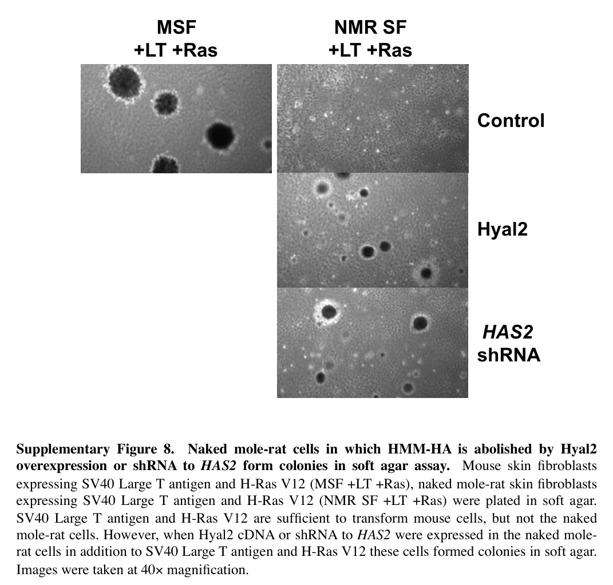

## Question

# Gene Research for Functional Annotation

## ⚠️ CRITICAL: Gene/Protein Identification Context

**BEFORE YOU BEGIN RESEARCH:** You MUST verify you are researching the CORRECT gene/protein. Gene symbols can be ambiguous, especially for less well-characterized genes from non-model organisms.

### Target Gene/Protein Identity (from UniProt):
- **UniProt Accession:** G5AY81
- **Protein Description:** RecName: Full=Hyaluronan synthase 2; EC=2.4.1.212 {ECO:0000250|UniProtKB:Q92819}; AltName: Full=Hyaluronate synthase 2; AltName: Full=Hyaluronic acid synthase 2;
- **Gene Information:** Name=Has2;
- **Organism (full):** Heterocephalus glaber (Naked mole rat).
- **Protein Family:** Belongs to the NodC/HAS family. .
- **Key Domains:** Glyco_trans_2-like. (IPR001173); Nucleotide-diphossugar_trans. (IPR029044); Chitin_synth_2 (PF03142); Glycos_transf_2 (PF00535)

### MANDATORY VERIFICATION STEPS:

1. **Check if the gene symbol "Has2" matches the protein description above**
2. **Verify the organism is correct:** Heterocephalus glaber (Naked mole rat).
3. **Check if protein family/domains align with what you find in literature**
4. **If you find literature for a DIFFERENT gene with the same or similar symbol, STOP**

### If Gene Symbol is Ambiguous or You Cannot Find Relevant Literature:

**DO NOT PROCEED WITH RESEARCH ON A DIFFERENT GENE.** Instead:
- State clearly: "The gene symbol 'Has2' is ambiguous or literature is limited for this specific protein"
- Explain what you found (e.g., "Found extensive literature on a different gene with the same symbol in a different organism")
- Describe the protein based ONLY on the UniProt information provided above
- Suggest that the protein function can be inferred from domain/family information

### Research Target:

Please provide a comprehensive research report on the gene **Has2** (gene ID: Has2, UniProt: G5AY81) in HETGA.

The research report should be a detailed narrative explaining the function, biological processes, and localization of the gene product. Citations should be given for all claims.

You should prioritize authoritative reviews and primary scientific literature when conducting research. You can supplement
this with annotations you find in gene/protein databases, but these can be outdated or inaccurate.

We are specifically interested in the primary function of the gene - for enzymes, what reaction is catalyzed, and what is the substrate specificity? For transporters, what is the substrate? For structural proteins or adapters, what is the broader structural role? For signaling molecules, what is the role in the pathway.

We are interested in where in or outside the cell the gene product carries out its function.

We are also interested in the signaling or biochemical pathways in which the gene functions. We are less interested in broad pleiotropic effects, except where these elucidate the precise role.

Include evidence where possible. We are interested in both experimental evidence as well as inference from structure, evolution, or bioinformatic analysis. Precise studies should be prioritized over high-throughput, where available.

## Output

Question: You are an expert researcher providing comprehensive, well-cited information.

Provide detailed information focusing on:
1. Key concepts and definitions with current understanding
2. Recent developments and latest research (prioritize 2023-2024 sources)
3. Current applications and real-world implementations
4. Expert opinions and analysis from authoritative sources
5. Relevant statistics and data from recent studies

Format as a comprehensive research report with proper citations. Include URLs and publication dates where available.
Always prioritize recent, authoritative sources and provide specific citations for all major claims.

# Gene Research for Functional Annotation

## ⚠️ CRITICAL: Gene/Protein Identification Context

**BEFORE YOU BEGIN RESEARCH:** You MUST verify you are researching the CORRECT gene/protein. Gene symbols can be ambiguous, especially for less well-characterized genes from non-model organisms.

### Target Gene/Protein Identity (from UniProt):
- **UniProt Accession:** G5AY81
- **Protein Description:** RecName: Full=Hyaluronan synthase 2; EC=2.4.1.212 {ECO:0000250|UniProtKB:Q92819}; AltName: Full=Hyaluronate synthase 2; AltName: Full=Hyaluronic acid synthase 2;
- **Gene Information:** Name=Has2;
- **Organism (full):** Heterocephalus glaber (Naked mole rat).
- **Protein Family:** Belongs to the NodC/HAS family. .
- **Key Domains:** Glyco_trans_2-like. (IPR001173); Nucleotide-diphossugar_trans. (IPR029044); Chitin_synth_2 (PF03142); Glycos_transf_2 (PF00535)

### MANDATORY VERIFICATION STEPS:

1. **Check if the gene symbol "Has2" matches the protein description above**
2. **Verify the organism is correct:** Heterocephalus glaber (Naked mole rat).
3. **Check if protein family/domains align with what you find in literature**
4. **If you find literature for a DIFFERENT gene with the same or similar symbol, STOP**

### If Gene Symbol is Ambiguous or You Cannot Find Relevant Literature:

**DO NOT PROCEED WITH RESEARCH ON A DIFFERENT GENE.** Instead:
- State clearly: "The gene symbol 'Has2' is ambiguous or literature is limited for this specific protein"
- Explain what you found (e.g., "Found extensive literature on a different gene with the same symbol in a different organism")
- Describe the protein based ONLY on the UniProt information provided above
- Suggest that the protein function can be inferred from domain/family information

### Research Target:

Please provide a comprehensive research report on the gene **Has2** (gene ID: Has2, UniProt: G5AY81) in HETGA.

The research report should be a detailed narrative explaining the function, biological processes, and localization of the gene product. Citations should be given for all claims.

You should prioritize authoritative reviews and primary scientific literature when conducting research. You can supplement
this with annotations you find in gene/protein databases, but these can be outdated or inaccurate.

We are specifically interested in the primary function of the gene - for enzymes, what reaction is catalyzed, and what is the substrate specificity? For transporters, what is the substrate? For structural proteins or adapters, what is the broader structural role? For signaling molecules, what is the role in the pathway.

We are interested in where in or outside the cell the gene product carries out its function.

We are also interested in the signaling or biochemical pathways in which the gene functions. We are less interested in broad pleiotropic effects, except where these elucidate the precise role.

Include evidence where possible. We are interested in both experimental evidence as well as inference from structure, evolution, or bioinformatic analysis. Precise studies should be prioritized over high-throughput, where available.

# Functional annotation report: naked-mole-rat **Has2** (UniProt G5AY81)

## Executive summary

The requested protein identity is coherent and unambiguous: **G5AY81 is hyaluronan synthase 2 (HAS2), encoded by Has2 in the naked mole rat, Heterocephalus glaber**. The supplied NodC/HAS and glycosyltransferase-family-2 annotations agree with the literature describing vertebrate HAS2 as a membrane-embedded, processive family-2 glycosyltransferase. No evidence was found that the literature discussed below concerns a different same-symbol gene.

Its primary molecular function is to polymerize **hyaluronan (HA)** from cytosolic **UDP-glucuronic acid (UDP-GlcA)** and **UDP-N-acetylglucosamine (UDP-GlcNAc)**. HAS2 alternately forms β-1,3 and β-1,4 glycosidic linkages while coupling polymerization to passage of the nascent chain through the plasma membrane. The product therefore functions outside the cell, principally in the pericellular coat and extracellular matrix, although catalysis occurs on the cytoplasmic face of the membrane. This exact chemistry and topology are strongly inferred for G5AY81 from conserved vertebrate HAS2 architecture rather than from purified naked-mole-rat G5AY81 kinetic measurements. (kobayashi2020hyaluronanmetabolismand pages 3-5, caon2021cellenergymetabolism pages 1-2, maloney2022structuresubstraterecognition pages 1-3)

The strongest organism-specific evidence is genetic perturbation: Has2 knockdown lowered the viscosity of naked-mole-rat fibroblast-conditioned medium and, like HYAL2 overexpression, enabled oncogene-expressing cells to grow in soft agar. Thus, G5AY81-dependent high-molecular-mass HA is causally involved in the extracellular program that restrains transformation in this experimental system. (tian2013highmolecularmasshyaluronanmediates pages 7-9, tian2013highmolecularmasshyaluronanmediates media 719190e8, tian2013highmolecularmasshyaluronanmediates media 4f11e822)

## 1. Identity and domain verification

- **Gene:** Has2  
- **Protein:** hyaluronan synthase 2 / hyaluronate synthase 2  
- **Organism:** Heterocephalus glaber  
- **UniProt accession:** G5AY81  
- **Enzyme classification:** EC 2.4.1.212  
- **Functional class:** processive, membrane-integrated glycosyltransferase.

Comparative mammalian work explicitly identifies H. glaber HAS2 as one of the membrane-embedded synthases that uses intracellular precursors and deposits HA into extracellular matrix. The supplied Glycos_transf_2-like, nucleotide-diphosugar-transferase, Chitin_synth_2 and NodC/HAS assignments are mutually consistent: HAS proteins belong to the broader processive GT2 enzyme class, whose members include cellulose- and chitin-synthase-like architectures and possess conserved acidic catalytic motifs and a QxxRW-associated membrane interface. (maloney2022structuresubstraterecognition pages 3-4, faulkes2015molecularevolutionof pages 2-3)

The domain names should **not** be interpreted as evidence that G5AY81 synthesizes chitin. They reflect structural and evolutionary homology. Its experimentally supported physiological product is HA.

## 2. Primary biochemical function

### Catalysed reaction and specificity

HAS2 consumes two chemically distinct nucleotide sugars and incorporates them alternately into one linear, unsulfated polymer:

**UDP-GlcA + UDP-GlcNAc + growing HA chain → elongated HA chain + UDP.**

The repeating unit is composed of glucuronic acid and N-acetylglucosamine joined by alternating β-1,3 and β-1,4 bonds. HAS enzymes are unusual because one catalytic domain recognizes both donor substrates, catalyses both linkage types and coordinates polymerization with membrane translocation. There is no evidence that naked-mole-rat HAS2 has a different monosaccharide specificity. (kobayashi2020hyaluronanmetabolismand pages 3-5, caon2021cellenergymetabolism pages 1-2, maloney2022structuresubstraterecognition pages 1-3)

Structural work on a homologous type-I viral HAS—not G5AY81 itself—showed a cytosolic GT-A-fold catalytic domain, conserved acidic and QxxRW-associated elements, and a transmembrane pore. It further indicated that free GlcNAc, but not GlcA, can prime synthesis; a GlcNAc primer increased UDP-GlcA hydrolysis approximately 30-fold. These details provide a mechanistic model for vertebrate HAS2 but should remain classified as homolog-based inference until confirmed with purified G5AY81. (maloney2022structuresubstraterecognition pages 3-4, maloney2022structuresubstraterecognition pages 4-6)

### Product-length specificity

Among mammalian isoforms, HAS2 generally produces particularly large HA: transfected mammalian cells can secrete average products above 2 MDa, whereas HAS1/HAS3 products span broadly lower ranges. Product size is not an immutable enzyme-only property; expression level, UDP-sugar supply, membrane residence, post-translational regulation and extracellular degradation all contribute. (marmol2021abundanceandsize pages 1-2)

The naked-mole-rat sequence was reported to contain two unusual conserved-site substitutions in which asparagines are replaced by serines, proposed to favour very large products. However, later transgenic work found that mouse HAS2 gave similar protective effects in vitro and concluded that increased HMW-HA production—not necessarily the naked-mole-rat sequence itself—was critical. The safest annotation is therefore that G5AY81 is a high-molecular-mass HA synthase whose in-vivo phenotype reflects both synthesis and unusually slow HA turnover; unique substitutions remain plausible modifiers rather than definitively proven determinants. (marmol2021abundanceandsize pages 2-4, zhang2023increasedhyaluronanby pages 1-5)

## 3. Cellular localization and direction of action

HAS2 is an integral **plasma-membrane** enzyme. Its hydrophilic catalytic region faces the cytoplasm, where UDP-GlcA and UDP-GlcNAc are available; transmembrane helices form or support an export channel. HA is synthesized directly from the inner membrane aspect and extruded into the extracellular space without conventional Golgi-mediated glycosaminoglycan assembly. (kobayashi2020hyaluronanmetabolismand pages 3-5, caon2021cellenergymetabolism pages 1-2, maloney2022structuresubstraterecognition pages 1-3, marmol2021abundanceandsize pages 1-2)

Accordingly, G5AY81 has three spatially linked roles:

1. **Cytoplasmic membrane interface:** substrate binding and glycosyl transfer.
2. **Membrane:** processive chain translocation.
3. **Extracellular/pericellular compartment:** accumulation of HA into a hydrated coat and matrix that changes mechanics and receptor signalling.

In naked-mole-rat tissues, HA was localized primarily in extracellular connective compartments: throughout dermis, around muscle fibres and bundles, in renal basal-lamina/medullary regions, around vessels, and in lymph-node capsule, trabeculae and sinuses. Its distribution was broadly similar to mouse and guinea pig, suggesting that the unusual feature is more abundance, size and turnover than an entirely novel tissue compartment. (marmol2021abundanceandsize pages 2-4)

## 4. Biological processes and pathways

### Extracellular-matrix construction

HA is a highly hydrated, negatively charged glycosaminoglycan. HAS2 therefore contributes directly to pericellular-coat formation, tissue hydration, viscoelasticity, cell spacing and matrix organization. One evolutionary interpretation is that abundant HMW-HA enhanced the loose, elastic skin advantageous in narrow subterranean tunnels; cancer protection may have arisen as a secondary benefit. Comparative evidence published in December 2023 associated abundant HMW-HA and altered HA-metabolism genes with subterranean mammals, supporting—but not proving—this adaptive model. (zhao2023evolutionofhighmolecularmass pages 1-2, faulkes2015molecularevolutionof pages 2-3)

### HA–CD44 and growth control

Extracellular HA signals through receptors including **CD44**. In naked-mole-rat fibroblasts, blocking CD44 made adult cells susceptible to soft-agar transformation by SV40 large T antigen plus oncogenic Ras. HA removal also altered NF2 phosphorylation and p16INK4a-associated early-contact-inhibition readouts. These experiments place HAS2 upstream of an HA–CD44/contact-inhibition tumour-suppressive axis, although receptor output depends strongly on polymer length and cellular context. (tian2013highmolecularmasshyaluronanmediates pages 1-7)

More generally, HA–CD44 can couple to receptor-tyrosine-kinase, PI3K–AKT, Ras–MAPK, Rac/Rho and cytoskeletal pathways. These canonical outputs should not automatically be interpreted as activated by G5AY81 in every naked-mole-rat tissue; HMW and fragmented HA can produce different or opposing responses. (kobayashi2020hyaluronanmetabolismand pages 3-5)

### Stress resistance and p53-associated signalling

Purified naked-mole-rat very-high-molecular-mass HA (>6.1 MDa in the 2020 study) protected naked-mole-rat, mouse and human cells from stress-induced death and cell-cycle arrest in a polymer-length-dependent, CD44-dependent fashion. It suppressed selected CD44 protein interactions and partly attenuated p53-associated responses. This links the G5AY81 product—not necessarily direct HAS2 protein signalling—to cytoprotection and stress resilience. (takasugi2020nakedmoleratveryhighmolecularmass pages 1-2)

### Metabolic regulation

HA synthesis consumes substantial cytosolic UDP-sugar pools and couples extracellular-matrix production to glucose and hexosamine metabolism. In mammalian HAS2, O-GlcNAcylation stabilizes the enzyme at the membrane and increases HA output, whereas AMPK-mediated phosphorylation inhibits secretion; SIRT1 can reduce HAS2 expression and pericellular HA deposition. These are authoritative mammalian mechanisms and useful predictions for G5AY81, but direct confirmation in H. glaber remains limited. (kobayashi2020hyaluronanmetabolismand pages 3-5, caon2021cellenergymetabolism pages 1-2)

### Inflammation and intestinal ageing

The 2023 transgenic-mouse study linked naked-mole-rat Has2 expression to lower inflammatory pathway activity and circulating pro-inflammatory cytokines, alternative macrophage activation, improved intestinal barrier features and preservation of aged intestinal-stem-cell organoid formation. HMW-HA rescued declining organoid formation when added to old wild-type cultures, and proposed receptor routes included CD44 and TLR4. These are cross-species gain-of-function findings, not proof that every pathway operates identically in native naked mole rats. (zhang2023increasedhyaluronanby pages 5-8, zhang2023increasedhyaluronanby pages 1-5)

## 5. Direct experimental evidence in H. glaber

The pivotal 2013 experiments found that adult naked-mole-rat fibroblasts resisted transformation by large T antigen plus oncogenic Ras. Has2 shRNA strongly reduced Has2 expression and conditioned-medium viscosity; HYAL2 overexpression had a comparable effect. Either perturbation enabled soft-agar colony formation. CD44 blockade also enabled transformation. Together, these loss-of-function, degradation and receptor-blockade experiments form a coherent causal chain: **HAS2 → HMW-HA-rich matrix → CD44-associated growth restraint**. (tian2013highmolecularmasshyaluronanmediates pages 1-7, tian2013highmolecularmasshyaluronanmediates pages 7-9, tian2013highmolecularmasshyaluronanmediates media 719190e8, tian2013highmolecularmasshyaluronanmediates media 4f11e822)

HA degradation also affected established growth control: after fibroblasts had been cultured with hyaluronidase for 12 days, removing the enzyme decreased cell number and increased apoptosis, with reported P values of 0.01 and 0.005, respectively. (tian2013highmolecularmasshyaluronanmediates pages 1-7)

| topic | best-supported conclusion | evidence type/directness | key quantitative observation | caveat |
|---|---|---|---|---|
| Identity / domain (G5AY81) | G5AY81 is consistent with naked-mole-rat **Has2**, encoding hyaluronan synthase 2, a membrane-embedded processive glycosyltransferase of the HAS/GT2 lineage; this agrees with the supplied UniProt family/domain assignment. (faulkes2015molecularevolutionof pages 2-3) | Comparative sequence/evolution evidence; indirect for UniProt accession, direct for Heterocephalus glaber HAS2 gene identity | Cv-HAS, a validated HAS homolog, shares ~45% sequence similarity with human HAS2 and conserves the GT domain/TM architecture used to interpret vertebrate HAS proteins. (maloney2022structuresubstraterecognition pages 1-3) | Primary papers cited here do not directly mention UniProt G5AY81; accession-level mapping remains database-based. |
| Catalytic function / localization | By strong orthology and structural inference, HAS2 synthesizes hyaluronan from UDP-GlcNAc and UDP-GlcA at the plasma membrane and extrudes the growing polymer through a transmembrane channel into the extracellular matrix. (kobayashi2020hyaluronanmetabolismand pages 3-5, caon2021cellenergymetabolism pages 1-2, maloney2022structuresubstraterecognition pages 1-3, maloney2022structuresubstraterecognition pages 3-4, maloney2022structuresubstraterecognition pages 4-6) | Structural/biochemical inference from HAS homologs and mammalian reviews; indirect for naked-mole-rat HAS2 specifically | HA is built from alternating β-1,3 and β-1,4 linkages; only GlcNAc primed synthesis in the structural study, and a continuous TM channel sufficient for ~5 disaccharides was resolved in the primed state. (kobayashi2020hyaluronanmetabolismand pages 3-5, maloney2022structuresubstraterecognition pages 1-3, maloney2022structuresubstraterecognition pages 4-6) | No naked-mole-rat HAS2-specific kinetic constants or solved structure were available in the retrieved evidence. |
| 2013 HAS2 knockdown / HYAL2 overexpression | In naked-mole-rat skin fibroblasts, reducing HA by **Has2** shRNA or HYAL2 overexpression abolishes the transformation-resistant phenotype, strongly supporting HAS2-dependent HMM-HA as functionally important. (tian2013highmolecularmasshyaluronanmediates pages 7-9, tian2013highmolecularmasshyaluronanmediates media 719190e8, tian2013highmolecularmasshyaluronanmediates media 4f11e822) | Direct organism-specific perturbation evidence | HAase withdrawal after 12 days reduced cell number with apoptosis increase (P=0.01 and P=0.005, respectively); adult NMR fibroblasts resisted soft-agar growth unless HMM-HA was disrupted, whereas embryonic NMR fibroblasts lacking ECI transformed more readily. (tian2013highmolecularmasshyaluronanmediates pages 1-7, tian2013highmolecularmasshyaluronanmediates pages 7-9) | The supplementary excerpts shown here do not report exact knockdown percentage or colony counts. |
| 2020 cytoprotection | Very-high-molecular-mass NMR HA has superior cytoprotective activity, acting through CD44 and modulating p53-associated responses; this supports a biologically consequential HAS2 product phenotype. (takasugi2020nakedmoleratveryhighmolecularmass pages 1-2) | Direct functional evidence on NMR HA product; indirect for HAS2 enzyme per se | vHMM-HA was reported as **>6.1 MDa** and protected NMR, mouse, and human cells from stress-induced cell-cycle arrest and cell death in a polymer-length-dependent manner. (takasugi2020nakedmoleratveryhighmolecularmass pages 1-2) | The study interrogates purified/secreted HA and receptor signaling, not enzyme localization or catalytic kinetics. |
| 2021 conflicting polymer-size measurements | A later quantitative study confirmed that NMR tissues generally contain more and larger HA than controls, but did **not** detect the previously claimed ultra-HMW tissue HA; instead, maximum HA size was around **2.5 MDa** in serum and most tissues tested. (marmol2021abundanceandsize pages 1-2, marmol2021abundanceandsize pages 2-4, marmol2021abundanceandsize pages 13-15) | Direct organism-specific tissue measurements | Reported serum HA in NMR averaged about **260 ng/ml**, with individual values ranging from **44 to 650 ng/ml**; tissue HA size peaked near **2.5 MDa**. (marmol2021abundanceandsize pages 13-15) | This conflicts with earlier 6–12 MDa reports and may reflect methodological differences, tissue source, or sample handling rather than complete biological disagreement. |
| 2023 transgenic mouse healthspan | Transgenic expression of naked-mole-rat **Has2** in mice increased HMW-HA and improved healthspan, with modest but significant lifespan extension and cancer resistance, implying that elevated HAS2-driven HA can transfer some protective phenotypes across species. (zhang2023increasedhyaluronanby pages 1-5, zhang2023increasedhyaluronanby pages 5-8) | Direct in vivo transgenic evidence, but in mouse rather than naked mole-rat | Authors report extended **median and maximum lifespan**, lower frailty, lower inflammatory cytokines, preserved intestinal organoid formation with age, and HMW-HA accumulation in multiple organs. (zhang2023increasedhyaluronanby pages 5-8, zhang2023increasedhyaluronanby pages 1-5) | The supplementary text emphasizes that the **naked-mole-rat sequence per se may not be essential**; increased HMW-HA production, not necessarily a unique catalytic mutation, may be the main driver. |
| 2023 subterranean evolution | Elevated HMM-HA and altered HA-metabolism genes, including **HAS2**, are associated with subterranean mammals, supporting the view that NMR HAS2 participates in an adaptive extracellular-matrix program linked to underground lifestyle. (zhao2023evolutionofhighmolecularmass pages 1-2, faulkes2015molecularevolutionof pages 2-3) | Comparative evolutionary and expression evidence; partially direct for NMR | The 2023 study reports higher NMR HAS2 expression than control species and notes that HAS2 is the synthase associated with longer HA polymers relative to HAS1/HAS3. (zhao2023evolutionofhighmolecularmass pages 1-2) | Association with subterranean adaptation does not by itself prove which specific HAS2 substitutions are causative in naked mole-rat. |

*Table: This table summarizes the strongest available evidence for naked-mole-rat Has2/G5AY81, separating direct organism-specific experiments from broader structural or comparative inference. It is useful for judging which conclusions are well established, which are transferable from ortholog studies, and where key uncertainties remain.*

## 6. Quantitative findings and an important controversy

The original report described naked-mole-rat fibroblast/tissue HA in the **6–12 MDa** range. A 2020 functional study likewise defined the tested very-high-molecular-mass fraction as **>6.1 MDa** and found superior cytoprotection. (marmol2021abundanceandsize pages 2-4, takasugi2020nakedmoleratveryhighmolecularmass pages 1-2)

However, a 2021 systematic study using HA-binding-protein histochemistry, an ELISA-like assay, size-exclusion chromatography and agarose electrophoresis did not detect tissue HA ≥4 MDa. Its highest tissue values were near **2.5 MDa**, especially in skin and lymph nodes. Naked-mole-rat serum averaged about **260 ng/mL**, but varied from **44 to 650 ng/mL** among eight animals. HA was still generally more abundant and larger than in guinea pig controls, and HYAL1 expression/activity was lower than in mouse lymph nodes. (marmol2021abundanceandsize pages 1-2, marmol2021abundanceandsize pages 13-15)

This discrepancy is scientifically consequential. The 2021 authors showed that Alcian blue staining used in early work was largely not HA-specific and cautioned that extraction, analytical platform, tissue versus cultured-cell sampling and degradation can affect measured distributions. Thus, “naked-mole-rat HAS2 produces unusually high-molecular-mass HA” is well supported, whereas “native tissues universally contain 6–12 MDa HA” is not settled. (marmol2021abundanceandsize pages 1-2, marmol2021abundanceandsize pages 2-4)

## 7. Recent developments, 2023–2024

### Transfer to mice—Nature, August 2023

Transgenic mice expressing naked-mole-rat Has2 accumulated HMW-HA in several organs, resisted spontaneous and chemically induced cancers, and showed significantly extended median and maximum lifespan, lower frailty, better physical performance and younger molecular signatures. The reported lifespan effect was modest relative to the healthspan improvement. Native naked mole rats combine robust synthesis with slow degradation, whereas the mice modified only synthesis and retained high hyaluronidase activity, probably limiting HA accumulation. (zhang2023increasedhyaluronanby pages 1-5)

The authors’ mechanistic interpretation is especially important for functional annotation: because mouse HAS2 produced similar in-vitro protection, they did not regard the naked-mole-rat amino-acid sequence itself as indispensable. Increased sustained production of HMW-HA may be more important than a uniquely altered substrate specificity. (zhang2023increasedhyaluronanby pages 1-5)

### Evolutionary comparison—Nature Communications, December 2023

A broad comparison found abundant HMW-HA in multiple subterranean mammals but not related above-ground species. Differences involved both synthetic and degradative genes, with higher naked-mole-rat HAS2 expression and distinct HA-metabolism variants. This supports a systems-level model: G5AY81 acts within an evolved HA metabolic network rather than alone. (zhao2023evolutionofhighmolecularmass pages 1-2)

### Translational vector work—October 2023

An attenuated replication-competent herpes simplex virus was engineered to express naked-mole-rat HAS2 in glioma cells as an extracellular-matrix-modifying oncolytic platform. This remains preclinical and primarily establishes vector feasibility; it is not evidence of clinical efficacy. DOI: https://doi.org/10.3390/microorganisms11112657 (published October 2023).

### 2024 context

A 2024 review focused specifically on naked-mole-rat HA (DOI: https://doi.org/10.1016/j.biochi.2023.12.008; published May 2024), while a September 2024 study reported deficient physiological HA-degrading activity of naked-mole-rat TMEM2 (DOI: https://doi.org/10.1016/j.abb.2024.110098). The latter reinforces the interpretation that exceptional HA biology reflects reduced catabolism as well as HAS2-mediated synthesis; it does not change G5AY81’s catalytic annotation.

## 8. Applications and implementation status

1. **Geroprotection and healthspan engineering:** The strongest in-vivo implementation is germline/transgenic expression in mice. It validates the pathway experimentally but is not presently a human therapy. (zhang2023increasedhyaluronanby pages 1-5)
2. **Cancer-resistance mechanisms:** HAS2/HMW-HA is a tractable extracellular tumour-suppression model, supported by naked-mole-rat knockdown and receptor-blockade experiments. Translation is complicated because HA can also promote growth, migration or immune escape in other tumour contexts. Polymer size, degradation and receptor state must therefore be controlled. (kobayashi2020hyaluronanmetabolismand pages 3-5, tian2013highmolecularmasshyaluronanmediates pages 7-9)
3. **Oncolytic-virus/ECM engineering:** Naked-mole-rat HAS2 has been inserted into an HSV vector for glioma research, currently at the cell/preclinical stage.
4. **Biomaterials and cytoprotection:** Very-large HA could be explored for stress-protective matrices, wound repair, drug delivery or tissue engineering. The 2020 cross-species cytoprotection data support biological plausibility, but reproducible manufacturing and molecular-mass definition remain major requirements. (takasugi2020nakedmoleratveryhighmolecularmass pages 1-2)

## 9. Expert assessment and remaining uncertainties

**High-confidence annotation:** G5AY81 is a plasma-membrane, processive HA synthase using UDP-GlcA and UDP-GlcNAc; it extrudes HA into the extracellular/pericellular matrix. Its principal role is synthesis of large HA polymers, thereby altering matrix mechanics and HA-receptor signalling.

**Strong organism-specific conclusion:** Reducing Has2-derived HA compromises naked-mole-rat fibroblast transformation resistance under the tested oncogenic conditions. (tian2013highmolecularmasshyaluronanmediates pages 7-9, tian2013highmolecularmasshyaluronanmediates media 719190e8)

**Moderate-confidence interpretation:** High HAS2 activity, together with low degradation, contributes to abundant large HA and downstream contact inhibition, anti-inflammatory and stress-protective phenotypes.

**Unresolved issues:** No G5AY81-specific high-resolution structure or comprehensive kinetic constants were identified; causality of the two reported amino-acid substitutions remains uncertain; tissue HA’s upper molecular mass is disputed; and native whole-animal knockout evidence in H. glaber is lacking. The literature therefore supports precise enzymatic annotation more strongly than it supports any single explanation of naked-mole-rat longevity or cancer resistance.

References

1. (kobayashi2020hyaluronanmetabolismand pages 3-5): Takashi Kobayashi, Theerawut Chanmee, and Naoki Itano. Hyaluronan: metabolism and function. Nov 2020. URL: https://doi.org/10.3390/biom10111525, doi:10.3390/biom10111525. This article has 398 citations.

2. (caon2021cellenergymetabolism pages 1-2): Ilaria Caon, Arianna Parnigoni, Manuela Viola, Evgenia Karousou, Alberto Passi, and Davide Vigetti. Cell energy metabolism and hyaluronan synthesis. Journal of Histochemistry & Cytochemistry, 69:35-47, Jul 2021. URL: https://doi.org/10.1369/0022155420929772, doi:10.1369/0022155420929772. This article has 126 citations and is from a peer-reviewed journal.

3. (maloney2022structuresubstraterecognition pages 1-3): Finn P. Maloney, Jeremi Kuklewicz, Robin A. Corey, Yunchen Bi, Ruoya Ho, Lukasz Mateusiak, Els Pardon, Jan Steyaert, Phillip J. Stansfeld, and Jochen Zimmer. Structure, substrate recognition and initiation of hyaluronan synthase. Nature, 604:195-201, Mar 2022. URL: https://doi.org/10.1038/s41586-022-04534-2, doi:10.1038/s41586-022-04534-2. This article has 168 citations and is from a highest quality peer-reviewed journal.

4. (tian2013highmolecularmasshyaluronanmediates pages 7-9): Xiao Tian, Jorge Azpurua, Christopher Hine, Amita Vaidya, Max Myakishev-Rempel, Julia Ablaeva, Zhiyong Mao, Eviatar Nevo, Vera Gorbunova, and Andrei Seluanov. High-molecular-mass hyaluronan mediates the cancer resistance of the naked mole rat. Jun 2013. URL: https://doi.org/10.1038/nature12234, doi:10.1038/nature12234. This article has 1043 citations and is from a highest quality peer-reviewed journal.

5. (tian2013highmolecularmasshyaluronanmediates media 719190e8): Xiao Tian, Jorge Azpurua, Christopher Hine, Amita Vaidya, Max Myakishev-Rempel, Julia Ablaeva, Zhiyong Mao, Eviatar Nevo, Vera Gorbunova, and Andrei Seluanov. High-molecular-mass hyaluronan mediates the cancer resistance of the naked mole rat. Jun 2013. URL: https://doi.org/10.1038/nature12234, doi:10.1038/nature12234. This article has 1043 citations and is from a highest quality peer-reviewed journal.

6. (tian2013highmolecularmasshyaluronanmediates media 4f11e822): Xiao Tian, Jorge Azpurua, Christopher Hine, Amita Vaidya, Max Myakishev-Rempel, Julia Ablaeva, Zhiyong Mao, Eviatar Nevo, Vera Gorbunova, and Andrei Seluanov. High-molecular-mass hyaluronan mediates the cancer resistance of the naked mole rat. Jun 2013. URL: https://doi.org/10.1038/nature12234, doi:10.1038/nature12234. This article has 1043 citations and is from a highest quality peer-reviewed journal.

7. (maloney2022structuresubstraterecognition pages 3-4): Finn P. Maloney, Jeremi Kuklewicz, Robin A. Corey, Yunchen Bi, Ruoya Ho, Lukasz Mateusiak, Els Pardon, Jan Steyaert, Phillip J. Stansfeld, and Jochen Zimmer. Structure, substrate recognition and initiation of hyaluronan synthase. Nature, 604:195-201, Mar 2022. URL: https://doi.org/10.1038/s41586-022-04534-2, doi:10.1038/s41586-022-04534-2. This article has 168 citations and is from a highest quality peer-reviewed journal.

8. (faulkes2015molecularevolutionof pages 2-3): Christopher G. Faulkes, Kalina T. J. Davies, Stephen J. Rossiter, and Nigel C. Bennett. Molecular evolution of the hyaluronan synthase 2 gene in mammals: implications for adaptations to the subterranean niche and cancer resistance. Biology Letters, 11:20150185, May 2015. URL: https://doi.org/10.1098/rsbl.2015.0185, doi:10.1098/rsbl.2015.0185. This article has 45 citations and is from a domain leading peer-reviewed journal.

9. (maloney2022structuresubstraterecognition pages 4-6): Finn P. Maloney, Jeremi Kuklewicz, Robin A. Corey, Yunchen Bi, Ruoya Ho, Lukasz Mateusiak, Els Pardon, Jan Steyaert, Phillip J. Stansfeld, and Jochen Zimmer. Structure, substrate recognition and initiation of hyaluronan synthase. Nature, 604:195-201, Mar 2022. URL: https://doi.org/10.1038/s41586-022-04534-2, doi:10.1038/s41586-022-04534-2. This article has 168 citations and is from a highest quality peer-reviewed journal.

10. (marmol2021abundanceandsize pages 1-2): Delphine del Marmol, Susanne Holtze, Nadia Kichler, Arne Sahm, Benoit Bihin, Virginie Bourguignon, Sophie Dogné, Karol Szafranski, Thomas Bernd Hildebrandt, and Bruno Flamion. Abundance and size of hyaluronan in naked mole-rat tissues and plasma. Scientific Reports, Apr 2021. URL: https://doi.org/10.1038/s41598-021-86967-9, doi:10.1038/s41598-021-86967-9. This article has 39 citations and is from a peer-reviewed journal.

11. (marmol2021abundanceandsize pages 2-4): Delphine del Marmol, Susanne Holtze, Nadia Kichler, Arne Sahm, Benoit Bihin, Virginie Bourguignon, Sophie Dogné, Karol Szafranski, Thomas Bernd Hildebrandt, and Bruno Flamion. Abundance and size of hyaluronan in naked mole-rat tissues and plasma. Scientific Reports, Apr 2021. URL: https://doi.org/10.1038/s41598-021-86967-9, doi:10.1038/s41598-021-86967-9. This article has 39 citations and is from a peer-reviewed journal.

12. (zhang2023increasedhyaluronanby pages 1-5): Zhihui Zhang, Xiao Tian, J. Yuyang Lu, Kathryn Boit, Julia Ablaeva, Frances Tolibzoda Zakusilo, Stephan Emmrich, Denis Firsanov, Elena Rydkina, Seyed Ali Biashad, Quan Lu, Alexander Tyshkovskiy, Vadim N. Gladyshev, Steve Horvath, Andrei Seluanov, and Vera Gorbunova. Increased hyaluronan by naked mole-rat has2 improves healthspan in mice. Nature, 621:196-205, Aug 2023. URL: https://doi.org/10.1038/s41586-023-06463-0, doi:10.1038/s41586-023-06463-0. This article has 153 citations and is from a highest quality peer-reviewed journal.

13. (zhao2023evolutionofhighmolecularmass pages 1-2): Yang Zhao, Zhizhong Zheng, Zhihui Zhang, Yandong Xu, Eric Hillpot, Yifei S. Lin, Frances T. Zakusilo, J. Yuyang Lu, Julia Ablaeva, Seyed Ali Biashad, Richard A. Miller, Eviatar Nevo, Andrei Seluanov, and Vera Gorbunova. Evolution of high-molecular-mass hyaluronic acid is associated with subterranean lifestyle. Nature Communications, Dec 2023. URL: https://doi.org/10.1038/s41467-023-43623-2, doi:10.1038/s41467-023-43623-2. This article has 34 citations and is from a highest quality peer-reviewed journal.

14. (tian2013highmolecularmasshyaluronanmediates pages 1-7): Xiao Tian, Jorge Azpurua, Christopher Hine, Amita Vaidya, Max Myakishev-Rempel, Julia Ablaeva, Zhiyong Mao, Eviatar Nevo, Vera Gorbunova, and Andrei Seluanov. High-molecular-mass hyaluronan mediates the cancer resistance of the naked mole rat. Jun 2013. URL: https://doi.org/10.1038/nature12234, doi:10.1038/nature12234. This article has 1043 citations and is from a highest quality peer-reviewed journal.

15. (takasugi2020nakedmoleratveryhighmolecularmass pages 1-2): Masaki Takasugi, Denis Firsanov, Gregory Tombline, Hanbing Ning, Julia Ablaeva, Andrei Seluanov, and Vera Gorbunova. Naked mole-rat very-high-molecular-mass hyaluronan exhibits superior cytoprotective properties. Nature Communications, May 2020. URL: https://doi.org/10.1038/s41467-020-16050-w, doi:10.1038/s41467-020-16050-w. This article has 129 citations and is from a highest quality peer-reviewed journal.

16. (zhang2023increasedhyaluronanby pages 5-8): Zhihui Zhang, Xiao Tian, J. Yuyang Lu, Kathryn Boit, Julia Ablaeva, Frances Tolibzoda Zakusilo, Stephan Emmrich, Denis Firsanov, Elena Rydkina, Seyed Ali Biashad, Quan Lu, Alexander Tyshkovskiy, Vadim N. Gladyshev, Steve Horvath, Andrei Seluanov, and Vera Gorbunova. Increased hyaluronan by naked mole-rat has2 improves healthspan in mice. Nature, 621:196-205, Aug 2023. URL: https://doi.org/10.1038/s41586-023-06463-0, doi:10.1038/s41586-023-06463-0. This article has 153 citations and is from a highest quality peer-reviewed journal.

17. (marmol2021abundanceandsize pages 13-15): Delphine del Marmol, Susanne Holtze, Nadia Kichler, Arne Sahm, Benoit Bihin, Virginie Bourguignon, Sophie Dogné, Karol Szafranski, Thomas Bernd Hildebrandt, and Bruno Flamion. Abundance and size of hyaluronan in naked mole-rat tissues and plasma. Scientific Reports, Apr 2021. URL: https://doi.org/10.1038/s41598-021-86967-9, doi:10.1038/s41598-021-86967-9. This article has 39 citations and is from a peer-reviewed journal.

## Artifacts

- [Edison artifact artifact-00](Has2-deep-research-falcon_artifacts/artifact-00.md)

## Citations

1. marmol2021abundanceandsize pages 1-2
2. marmol2021abundanceandsize pages 2-4
3. tian2013highmolecularmasshyaluronanmediates pages 1-7
4. kobayashi2020hyaluronanmetabolismand pages 3-5
5. takasugi2020nakedmoleratveryhighmolecularmass pages 1-2
6. faulkes2015molecularevolutionof pages 2-3
7. maloney2022structuresubstraterecognition pages 1-3
8. marmol2021abundanceandsize pages 13-15
9. zhao2023evolutionofhighmolecularmass pages 1-2
10. zhang2023increasedhyaluronanby pages 1-5
11. caon2021cellenergymetabolism pages 1-2
12. tian2013highmolecularmasshyaluronanmediates pages 7-9
13. maloney2022structuresubstraterecognition pages 3-4
14. maloney2022structuresubstraterecognition pages 4-6
15. zhang2023increasedhyaluronanby pages 5-8
16. https://doi.org/10.3390/microorganisms11112657
17. https://doi.org/10.1016/j.biochi.2023.12.008;
18. https://doi.org/10.1016/j.abb.2024.110098
19. https://doi.org/10.3390/biom10111525,
20. https://doi.org/10.1369/0022155420929772,
21. https://doi.org/10.1038/s41586-022-04534-2,
22. https://doi.org/10.1038/nature12234,
23. https://doi.org/10.1098/rsbl.2015.0185,
24. https://doi.org/10.1038/s41598-021-86967-9,
25. https://doi.org/10.1038/s41586-023-06463-0,
26. https://doi.org/10.1038/s41467-023-43623-2,
27. https://doi.org/10.1038/s41467-020-16050-w,