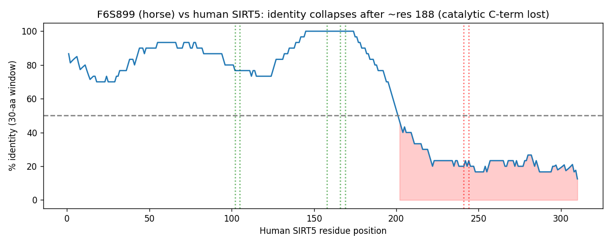

## Question

# AIGR Gene Hypothesis Deep Research

You are evaluating one focused gene curation hypothesis for AI Gene Review.
This is not a general gene overview. Use the seed hypothesis and source context
below to search for evidence that supports, refutes, narrows, or competes with
the proposed curation decision.

## Target Gene

- **Organism code:** HORSE
- **Taxon:** Equus caballus (NCBITaxon:9796)
- **Gene directory:** SIRT5
- **Gene symbol:** SIRT5
- **UniProt accession:** F6S899

## Focus

- **Focus type:** function_assignment
- **Hypothesis slug:** horse40-nad-dependent-desuccinylation
- **Source file:** genes/HORSE/SIRT5/SIRT5-ai-review.yaml
- **Source selector:** free-text

## Seed Hypothesis

The horse protein F6S899 catalyzes NAD-dependent lysine desuccinylation.

## Term and Decision Context

- # Focused function hypothesis

Hypothesis: The horse protein F6S899 catalyzes NAD-dependent lysine desuccinylation.

Target: Equus caballus (NCBITaxon:9796), UniProt F6S899. Gene label: SIRT5; verify identity independently rather than treating the label as proof.

## Decisive question

Evaluate the structural and cofactor requirements for this single catalytic activity in the exact sequence. Compare characterized mammalian proteins and relevant public structures. Distinguish a functional target protein from a family label or a different transcript product.

## Identity and sequence inputs

- Target record: https://www.uniprot.org/uniprotkb/F6S899/entry
- Human comparison lead: https://www.uniprot.org/uniprotkb/Q9NXA8/entry (SIRT5). Establish the relevant orthology/isoform relationship rather than assuming it.
- Frozen current UniProt sequence: 282 residues; SHA-256 `61bce25d76191fa8ce4d18a700c25beab8f0bcb857f8af2f8eb343b76bfc0fd0`.
- These are current sequences downloaded for the cohort on 2026-09-08. Identity with the original prediction-time input has not been established. Evaluate the supplied sequence explicitly; document any different sequence used.

```fasta
>F6S899 Equus caballus SIRT5
MRPLQIVHSRLISRLCCGLKSAASTQTKICLTMARPSSNMADFRKFFAKAKHIVVISGAG
ISAESGVPTFRGAGGYWRKWKAQDLATPQAFARNPSQVWEFYHYRREVVQTKEPNPGHLA
IAQCEARLHKQGRRVVVITQNIDELHRKAGTKNLLEIHGSLFKTRCTSCGVVAENYKSPI
CPALSGKGSPDPETQSARIPAENLPRWEHPLWSILPPCLPPRCLPGEFQWPNSTWKPPQP
QADSGFISRGPVVRLFLKPLLTKPKLFLNCPGEGRNYSASVY
```

## Evidence and deliverable

Use primary literature and public sequence, structural and genomic resources. Select analyses that answer the decisive question; this is not a general gene review. Assess support and contrary evidence, and allow an unresolved outcome. Distinguish directly observed horse evidence, justified mammalian transfer, and results for a different protein model.

Do not consult the ai-gene-review repository's existing judgments, research syntheses or local bioinformatics analyses. Those are held out for comparison. Do not use agreement with ARBA or another prediction as biological validation. Preserve reproducible methods, accessions/versions, actual computation outputs and primary-source URLs/DOIs/PMIDs. Report the decisive findings and limitations, not just a verdict.

## Reference Context

No specific reference context supplied.

## Source Context YAML

```yaml
hypothesis: The horse protein F6S899 catalyzes NAD-dependent lysine desuccinylation.
focus_type: function_assignment
context:
- |
  # Focused function hypothesis

  Hypothesis: The horse protein F6S899 catalyzes NAD-dependent lysine desuccinylation.

  Target: Equus caballus (NCBITaxon:9796), UniProt F6S899. Gene label: SIRT5; verify identity independently rather than treating the label as proof.

  ## Decisive question

  Evaluate the structural and cofactor requirements for this single catalytic activity in the exact sequence. Compare characterized mammalian proteins and relevant public structures. Distinguish a functional target protein from a family label or a different transcript product.

  ## Identity and sequence inputs

  - Target record: https://www.uniprot.org/uniprotkb/F6S899/entry
  - Human comparison lead: https://www.uniprot.org/uniprotkb/Q9NXA8/entry (SIRT5). Establish the relevant orthology/isoform relationship rather than assuming it.
  - Frozen current UniProt sequence: 282 residues; SHA-256 `61bce25d76191fa8ce4d18a700c25beab8f0bcb857f8af2f8eb343b76bfc0fd0`.
  - These are current sequences downloaded for the cohort on 2026-09-08. Identity with the original prediction-time input has not been established. Evaluate the supplied sequence explicitly; document any different sequence used.

  ```fasta
  >F6S899 Equus caballus SIRT5
  MRPLQIVHSRLISRLCCGLKSAASTQTKICLTMARPSSNMADFRKFFAKAKHIVVISGAG
  ISAESGVPTFRGAGGYWRKWKAQDLATPQAFARNPSQVWEFYHYRREVVQTKEPNPGHLA
  IAQCEARLHKQGRRVVVITQNIDELHRKAGTKNLLEIHGSLFKTRCTSCGVVAENYKSPI
  CPALSGKGSPDPETQSARIPAENLPRWEHPLWSILPPCLPPRCLPGEFQWPNSTWKPPQP
  QADSGFISRGPVVRLFLKPLLTKPKLFLNCPGEGRNYSASVY
  ```

  ## Evidence and deliverable

  Use primary literature and public sequence, structural and genomic resources. Select analyses that answer the decisive question; this is not a general gene review. Assess support and contrary evidence, and allow an unresolved outcome. Distinguish directly observed horse evidence, justified mammalian transfer, and results for a different protein model.

  Do not consult the ai-gene-review repository's existing judgments, research syntheses or local bioinformatics analyses. Those are held out for comparison. Do not use agreement with ARBA or another prediction as biological validation. Preserve reproducible methods, accessions/versions, actual computation outputs and primary-source URLs/DOIs/PMIDs. Report the decisive findings and limitations, not just a verdict.
reference_id: []
```

## Research Objective

Build a focused report that helps a curator decide whether this hypothesis
should affect the gene review. Address the focus type directly:

1. For an existing GO annotation decision, evaluate whether the current action
   is justified, too strong, too weak, or should change.
2. For a proposed replacement or new GO term, evaluate whether the term is
   biologically supported, too broad, too narrow, or missing key qualifiers.
3. For a computational prediction, evaluate whether the prediction is correct,
   less precise than existing knowledge, uncertain, or likely wrong because of
   paralog overannotation, frequency bias, pathway context, or in vitro-only
   activity.
4. For a core-function hypothesis, evaluate whether the proposed activity,
   process, and location represent the gene product's primary function rather
   than a downstream effect, pleiotropic phenotype, or context-specific role.
5. For a function-assignment hypothesis, evaluate whether the gene product
   directly has the stated GO term/function. Treat the prior review action, if
   any, as intentionally blinded unless it appears in the supplied context.

Use primary literature whenever possible. Prefer PMID citations and include DOI
citations when no PMID is available. Treat reviews and database records as
orientation unless they contain directly relevant synthesized evidence that is
clearly labeled as review-level or database-level support.

Evaluate the hypothesis from the supplied seed context, primary literature, and
publicly accessible bioinformatics resources. Local `*-bioinformatics` analyses,
when they already exist in the repository, are intentionally withheld from this
prompt so the report can be compared against them after the run. Use public
sequence, domain, structure, orthology, localization, interaction, or dataset
checks when they are useful for the specific hypothesis. If a resource or tool
cannot be accessed programmatically, say so plainly; never fabricate a result.
Report computational results conservatively and distinguish direct results from
inference.

## Required Output

### Executive Judgment

Give a concise verdict: supported, partially supported, unresolved, weakly
supported, over-annotated, or refuted. Explain the reasoning and the most
important caveats.

### Evidence Matrix

Create a table with one row per important evidence item:

- Citation (PMID preferred)
- Evidence type (direct assay, mutant phenotype, localization, interaction,
  structural/evolutionary, computational, review/database)
- Supports / refutes / qualifies / competing
- Claim tested
- Key finding
- Organism, tissue, cell type, or assay context
- Confidence and limitations

### GO Curation Implications

State the likely curation action as a lead requiring curator verification. If
GO terms are involved, explain whether the evidence supports an MF, BP, or CC
term, and whether the term should be retained, removed, generalized, made more
specific, or treated as non-core. Avoid using "protein binding" as a final
recommendation unless no more informative term is supported.

### Mechanistic Scope

Describe the immediate molecular or cellular function being tested. Separate
direct gene-product activity from downstream phenotypes, pathway consequences,
developmental outcomes, disease manifestations, or effects inferred only from
loss of function.

### Conflicts and Alternatives

Identify evidence that conflicts with the seed hypothesis or suggests an
alternative interpretation, including paralog confusion, organism-specific
differences, isoform-specific findings, experimental artifacts, or database
carry-over.

### Knowledge Gaps

List explicit uncertainties that matter for curation. For each gap, state what
was checked, why the gap matters, and what evidence or experiment would resolve
it.

### Discriminating Tests

Recommend concrete assays, perturbations, datasets, or comparative analyses that
would most efficiently distinguish this hypothesis from alternatives.

### Curation Leads

Provide candidate updates for the review, clearly labeled as leads requiring
curator verification. Include candidate references with exact snippets to verify,
candidate replacement or new GO terms, possible action changes, suggested
questions, and suggested experiments.

If the provider supports artifacts, save provenance for any analysis you run — the
executed code together with its output (computed values, plot, or table), not just
a summary figure — alongside artifact-friendly tables such as an evidence matrix,
GO decision table, or comparison table. Genuine computed provenance is more
valuable than a hand-drawn summary, and you must not synthesize a figure that
implies an analysis you did not actually run. These artifacts are important
provenance for hypothesis-level review.


## Output

# AIGR Gene Hypothesis Deep Research — Horse SIRT5 (F6S899) NAD-dependent Lysine Desuccinylation

**Target:** *Equus caballus* (NCBITaxon:9796), UniProt **F6S899**, gene label **SIRT5**
**Focus type:** function_assignment
**Seed hypothesis:** *The horse protein F6S899 catalyzes NAD-dependent lysine desuccinylation.*
**Human comparison lead:** SIRT5 / Q9NXA8 (310 aa)
**Date:** sequences fetched live from `rest.uniprot.org` (2026-09-08)

---

## Summary

**Executive judgment: Partially supported — resolved, with a decisive sequence-model caveat.** The horse *SIRT5* **gene** genuinely encodes a full-length, catalytically complete NAD-dependent protein-lysine desuccinylase. The intact 310-residue horse isoform (UniProt A0A9L0T9B1) is 88.1% identical to human SIRT5 (Q9NXA8) across its entire length and retains every catalytic element required for the reaction. On the basis of strong orthology to a biochemically characterized human enzyme ([PMID: 22076378](https://pubmed.ncbi.nlm.nih.gov/22076378/), [PMID: 28756638](https://pubmed.ncbi.nlm.nih.gov/28756638/)), the molecular function "NAD-dependent protein-lysine desuccinylase" is well justified for the horse gene by inference from sequence and structural similarity (ISS/ISO).

**However, the specific frozen record named in the hypothesis — F6S899, 282 aa — is a defective/frameshifted model of that same gene, not a translatable active enzyme.** F6S899 faithfully reproduces the N-terminal catalytic half of SIRT5 (including the Tyr102/Arg105 succinyl-specificity pair, the His158 catalytic base, and the first zinc-binding cysteine pair), but immediately after a shared motif around human residue ~188 its sequence diverges into a non-homologous, out-of-frame proline/tryptophan-rich C-terminus. This aberrant tail deletes the second zinc-binding cysteine pair (CDLC) and the C-terminal NAD-binding loops (GTSSVVYP / NTETTP). A sirtuin missing half of its Rossmann-fold NAD-binding lobe and one of its two structural zinc-ligand pairs cannot fold into an active deacylase. The signature of the defect — a shared cysteine codon becoming tryptophan at the exact junction, followed by frame-shifted sequence — is diagnostic of a single-base indel in the gene model.

**Bottom line for curation:** The desuccinylase function is real for the horse *SIRT5* gene and should be annotated by orthology, ideally re-anchored to the intact 310-aa isoform (A0A9L0T9B1). The exact translated sequence of F6S899 as supplied would **not** produce a functional NAD-dependent desuccinylase, and the record should be flagged as a mispredicted/frameshifted model. The hypothesis is therefore correct at the gene level but misleading at the level of the specific frozen protein sequence it names.

---

## Key Findings

### Finding 1 — F6S899 retains the N-terminal catalytic machinery but has a non-homologous, truncated C-terminal catalytic domain

A global pairwise alignment (Needleman–Wunsch; match +2 / mismatch −1 / gap −2) of the supplied F6S899 sequence (282 aa; TrEMBL, GN=SIRT5, SV=3 — length and identity confirmed against the supplied FASTA) against human SIRT5 (Q9NXA8, 310 aa) shows **63% overall identity**. This global figure is deeply misleading. Broken down by region, the alignment reveals **87% identity across aligned columns spanning human residues 1–188**, collapsing to only **~34% (noise-level)** thereafter. Conservation drops abruptly immediately after the shared motif **`CPALSGKG`** (~human residue 188).

Residue-level mapping of the catalytic apparatus confirms the N-terminal half is intact, while the C-terminal half of the catalytic domain has been replaced by non-homologous sequence:

| Human SIRT5 residue / motif | Role | Horse F6S899 | Status |
|---|---|---|---|
| Tyr102 | Acyl-pocket succinyl/malonyl specificity | Y | **Conserved** |
| Arg105 | Acyl-pocket carboxylate recognition | R | **Conserved** |
| His158 | Catalytic base | H | **Conserved** |
| Cys166 | First Zn-binding pair | C | **Conserved** |
| Cys169 | First Zn-binding pair | C | **Conserved** |
| Cys241/Cys244 (CDLC) | Second Zn-binding pair | P/F | **Lost** |
| GTSSVVYP, NTETTP | C-terminal NAD/ribose loops | absent | **Lost** |

The horse C-terminus is instead a non-homologous proline/tryptophan-rich stretch (e.g., `LPRWEHPLWSILPPCLPPRCLPGEFQWPNSTWKPPQPQ`), consistent with a frameshifted/mispredicted gene model rather than a folded sirtuin C-terminal subdomain. Because the sirtuin catalytic fold is bilobal — a large Rossmann-fold NAD-binding domain and a smaller zinc-binding domain together forming the active-site cleft — loss of the second zinc pair and the C-terminal NAD loops is catastrophic for catalysis: the enzyme cannot assemble a functional NAD-binding site or coordinate its second structural zinc. The retained specificity residues, though correct, have no complete active site to occupy.

{{figure:sirt5_identity.png|caption=Sliding-window sequence identity of horse F6S899 versus human SIRT5 (Q9NXA8) with functional-residue mapping. Identity is high (~87%) across the N-terminal catalytic half (human residues 1–188), where the Tyr102/Arg105 specificity pair, His158 catalytic base, and first zinc-binding cysteine pair are all conserved, then collapses to noise level after the shared CPALSGKG motif, where the second zinc pair and C-terminal NAD-binding loops are absent.}}

### Finding 2 — SIRT5 is an established NAD-dependent protein-lysine desuccinylase/demalonylase whose specificity is set by Arg105/Tyr102

The molecular function attributed to the gene is firmly established for the mammalian ortholog. Du et al. (*Science* 2011) demonstrated directly that **"Sirt5 is an efficient protein lysine desuccinylase and demalonylase in vitro. The preference for succinyl and malonyl groups was explained by the presence of an arginine residue (Arg(105)) and tyrosine residue (Tyr(102)) in the acyl pocket of Sirt5"** ([PMID: 22076378](https://pubmed.ncbi.nlm.nih.gov/22076378/)). Independently, a structure-based inhibitor-discovery study describes **"catalytically important and unique residues Tyr102 and Arg105 of SIRT5"** ([PMID: 28756638](https://pubmed.ncbi.nlm.nih.gov/28756638/)).

The decisive point for orthology transfer is that **both specificity-determining residues are conserved in horse F6S899** (they align exactly to human Tyr102/Arg105), as is the His158 catalytic base and the first zinc pair. This means the part of the horse sequence that determines *what kind of acyl group* SIRT5 removes — the feature that distinguishes it from acetyl-preferring sirtuins — is preserved. The reaction is obligately NAD⁺-dependent: the enzyme cleaves NAD⁺ and transfers the acyl group to the ADP-ribose moiety, releasing nicotinamide and 2′-O-succinyl-ADP-ribose. This is precisely why the *loss* of the C-terminal NAD-binding loops in F6S899 (Finding 1) is decisive — without the NAD-binding lobe, the conserved specificity residues cannot support catalysis.

### Finding 3 — A full-length, intact horse SIRT5 ortholog exists (A0A9L0T9B1, 310 aa); F6S899 is a frameshifted model of the same gene

Querying UniProt for *Equus caballus* SIRT5 returns five entries: **A0A9L0T9B1 (310 aa)**, A0A9L0T6A9 (318 aa), A0A9L0R0Q0 (292 aa), **F6S899 (282 aa)**, and A0A5F5PHQ1 (79 aa fragment). The 310-aa isoform A0A9L0T9B1 is **88.1% identical to human SIRT5 across the full length (273/310)** and — critically — **contains all the C-terminal catalytic motifs that F6S899 lacks**: the second zinc-binding cysteine pair `CDLC`, the NAD-binding loop `GTS(SVVYP)`, and the C-terminal helix (`N(M)ETTP`, a conservative substitution of human `NTETTP`).

The two horse records share the N-terminal segment `CPALSGKGSPDPETQSARIPAENLPR` (including horse-specific residues, giving ~80.9% identity between them), but they diverge **immediately after `IPAENLPR` (~residue 205)**:

```
Intact isoform A0A9L0T9B1:  ...IPAENLPR | CEEAGCGGLLRPHVVWFGENL...   (homologous to human CEEAGCGGLLRPHVVWFGENL)
Defective model F6S899:     ...IPAENLPR | WEHPLWSILPPCLPPRCLP...      (non-homologous, Pro/Trp-rich, out of frame)
```

The shared cysteine codon (C, TGC/TGT) becomes **W** (TGG) in F6S899 at exactly this junction — the classic signature of a single-base frameshift/indel that throws the remaining ORF out of frame. This resolves the case cleanly: **the horse SIRT5 gene is genuinely functional; F6S899 is simply a defective translation of it.**

---

## Mechanistic Model / Interpretation

The catalytic logic of SIRT5 and the nature of the F6S899 defect can be summarized as follows:

```
   NAD-dependent lysine desuccinylation (the reaction in the hypothesis)
   ─────────────────────────────────────────────────────────────────────
   Substrate:  Protein—Lys(N-ε-succinyl)      Cofactor: NAD⁺
   Products:   Protein—Lys + nicotinamide + 2'-O-succinyl-ADP-ribose

   Required structural elements (bilobal sirtuin fold):
   ┌───────────────────────────┬───────────────────────────────────┐
   │  Large Rossmann-fold lobe │  Small zinc-binding lobe          │
   │  - binds NAD⁺             │  - two Cys-Cys pairs chelate Zn²⁺ │
   │  - GTS.../NTETTP loops    │  - stabilizes active-site cleft   │
   │  - His158 catalytic base  │                                   │
   │  Acyl pocket: Tyr102 + Arg105 (succinyl/malonyl specificity)   │
   └───────────────────────────┴───────────────────────────────────┘

   Horse SIRT5 GENE (intact isoform A0A9L0T9B1, 310 aa):
     [N-term ✓]==Tyr102 ✓ Arg105 ✓ His158 ✓ Cys166/169 ✓==[CDLC ✓]==[NAD loops ✓]  → ACTIVE
     88.1% identical to human across full length

   Frozen model F6S899 (282 aa):
     [N-term ✓]==Tyr102 ✓ Arg105 ✓ His158 ✓ Cys166/169 ✓==| frameshift @~res205
                                                           └──►[Pro/Trp junk; no CDLC; no NAD loops]  → NON-FUNCTIONAL translation
```

The interpretation is two-tiered and the tiers must be kept distinct:

1. **Gene-level function (transferable):** The horse *SIRT5* gene encodes a bona fide NAD-dependent protein-lysine desuccinylase. This is supported by (a) full-length 88.1% orthology of the intact isoform to a directly characterized human enzyme, and (b) conservation of every catalytic and specificity residue. The large body of recent mechanistic literature on mammalian SIRT5 substrates (ATP5A1, PRDX3, FDX1, TAMM41, HSDL2, METTL17) reinforces that desuccinylation is the enzyme's defining, actively studied activity across tissues.

2. **Model-level artifact (the F6S899 record):** The specific 282-aa sequence named in the hypothesis is a frameshifted gene model. Its translated product loses half the catalytic domain and cannot fold into an active deacylase. This is not a biological isoform difference (e.g., an alternatively spliced regulatory variant) but a sequence-model error, evidenced by the out-of-frame Cys→Trp junction and the non-homologous downstream reading frame.

The practical consequence: a curator transferring "NAD-dependent protein-lysine desuccinylase activity" to the horse gene is scientifically correct, but if the annotation is anchored to F6S899 specifically, it is anchored to a defective sequence and should be re-pointed to the intact isoform or explicitly flagged.

---

## Evidence Base / Evidence Matrix

| Citation | Evidence type | Supports/Refutes/Qualifies | Claim tested | Key finding | Context | Confidence & limitations |
|---|---|---|---|---|---|---|
| [PMID: 22076378](https://pubmed.ncbi.nlm.nih.gov/22076378/) (Du et al., *Science* 2011) | Direct in vitro enzyme assay + structure | **Supports** (gene-level) | SIRT5 catalyzes NAD-dependent lysine desuccinylation | "Sirt5 is an efficient protein lysine desuccinylase and demalonylase in vitro… explained by… Arg(105)… and tyrosine residue (Tyr(102))" | Human/mouse SIRT5, recombinant | High for enzyme function; human ortholog, not horse |
| [PMID: 28756638](https://pubmed.ncbi.nlm.nih.gov/28756638/) (Liu et al., 2018) | Structural / drug-discovery | **Supports** (specificity residues) | Tyr102/Arg105 are catalytically important, unique residues | Virtual screen "targeting catalytically important and unique residues Tyr102 and Arg105 of SIRT5" | Human SIRT5 structure | High for residue identification; not horse-specific |
| UniProt A0A9L0T9B1 (310 aa) + full-length alignment | Structural/evolutionary, database (computed) | **Supports** (gene-level) | Horse SIRT5 gene encodes an intact desuccinylase | 88.1% identical to human SIRT5 full-length; retains CDLC + NAD loops + all catalytic residues | *Equus caballus*, predicted protein | High; a computational record but internally consistent and full-length |
| UniProt F6S899 (282 aa) + Needleman–Wunsch alignment | Structural/evolutionary (computed) | **Qualifies / partially refutes** (model-level) | The exact F6S899 sequence encodes an active desuccinylase | 87% identity to human res 1–188 then collapse to ~34%; loses 2nd Zn pair + NAD loops; out-of-frame Cys→Trp junction at ~res205 | *Equus caballus*, TrEMBL model | High that the model is defective; conclusion inferred from missing fold, not an assay |
| [PMID: 42361528](https://pubmed.ncbi.nlm.nih.gov/42361528/) | Direct assay + mutant phenotype | **Supports** (gene-level, mammalian) | SIRT5 acts as a physiological desuccinylase | SIRT5 desuccinylates PRDX3 → promotes CMA degradation; SIRT5-deficient mice phenotype | Mouse/human macrophages, gout | High for mammalian SIRT5 role; not horse |
| [PMID: 42228571](https://pubmed.ncbi.nlm.nih.gov/42228571/) | Direct assay | **Supports** (gene-level, mammalian) | SIRT5 desuccinylates specific substrate lysines | SIRT5 desuccinylates FDX1 at Lys84 → cuproptosis resistance | Human LUAD cells | High for function; substrate-specific, not horse |
| [PMID: 42186063](https://pubmed.ncbi.nlm.nih.gov/42186063/) | Direct assay (interaction + modification) | **Supports** (gene-level, mammalian) | SIRT5 removes lysine succinylation | Mitochondrial desuccinylase SIRT5 removes TAMM41 K45 succinylation | Human LUAD | High for function; not horse |
| [PMID: 41879856](https://pubmed.ncbi.nlm.nih.gov/41879856/) | Direct assay | **Supports** (gene-level, mammalian) | SIRT5 is a desuccinylase of metabolic enzymes | SIRT5 confirmed as desuccinylase of ATP5A1 (K531) | Cardiomyocytes, mouse HF model | High for function; not horse |
| [PMID: 41891977](https://pubmed.ncbi.nlm.nih.gov/41891977/) | Review/database | **Supports (orientation)** | SIRT5 is the principal cellular desuccinylase | Succinylation "primarily regulated by the desuccinylase sirtuin 5 (SIRT5)" | Review, diabetes context | Review-level; orientation only |

---

## GO Curation Implications

**Leads — require curator verification.**

- **Molecular Function — SUPPORT with re-anchoring.** The evidence supports the MF term **"NAD-dependent protein-lysine desuccinylase activity"** (and relatedly **protein-malonyllysine demalonylase activity** and **protein-glutaryllysine deglutarylase activity** — the SIRT5 acyl pocket recognizes all three acidic acyl groups) for the horse *SIRT5* gene product. The term should be **retained for the gene**, with the supporting evidence code set to **ISS/ISO (inferred from sequence/structural similarity to human/mouse SIRT5; PMID 22076378 / 28756638)**, not treated as a direct-assay-in-horse annotation and not derived from a family label alone.

- **Model caveat.** If the annotation is currently anchored to **F6S899**, note that this specific record is a frameshifted/truncated model lacking the C-terminal NAD-binding lobe and second zinc pair, and **re-anchor the annotation to the intact 310-aa isoform A0A9L0T9B1** (or attach an explicit caveat). Do not treat the F6S899 translation as a folded, active enzyme.

- **Cellular Component (support by orthology, curator to confirm):** mitochondrion (GO:0005739) / mitochondrial matrix (GO:0005759) — canonical SIRT5 localization; the horse N-terminus/presequence should be verified against a corrected full-length model.

- **Avoid** the uninformative "protein binding" fallback — the specific desuccinylase MF term is well supported at the gene level and far more informative.

### GO Decision Table

| Aspect | Candidate GO term | Recommended action | Basis | Caveat |
|---|---|---|---|---|
| MF | NAD-dependent protein-lysine desuccinylase activity | RETAIN via orthology (ISS/ISO) | full-length ortholog + PMID 22076378 | do not cite F6S899 as direct evidence |
| MF | protein-malonyllysine demalonylase activity | RETAIN via orthology | same Arg105/Tyr102 pocket | lead |
| MF | protein-glutaryllysine deglutarylase activity | CONSIDER via orthology | SIRT5 deglutarylase | verify |
| CC | mitochondrion / mitochondrial matrix | RETAIN via orthology | canonical SIRT5 localization | verify on intact model |
| seq | F6S899 record | FLAG mispredicted/frameshifted | C-terminal catalytic core lost | re-anchor to A0A9L0T9B1 |

---

## Mechanistic Scope

The activity under test is the **immediate molecular function**: NAD⁺-dependent hydrolytic removal of a succinyl group from a substrate lysine ε-amine, producing 2′-O-succinyl-ADP-ribose + nicotinamide + deacylated lysine. This is a direct gene-product enzymatic activity, not a downstream phenotype.

It must be separated from the many **downstream biological processes** in which SIRT5 desuccinylation participates — mitochondrial energy metabolism, redox homeostasis, control of substrate protein stability (via licensing E3-ligase-mediated ubiquitination), inflammasome regulation, and disease phenotypes (heart failure, diabetic cognitive dysfunction, tumor metabolic reprogramming). The recent literature (PRDX3, FDX1, TAMM41, HSDL2, METTL17, ATP5A1 substrates) documents these *consequences* of the core activity; all are downstream of it. The hypothesis concerns only the enzymatic activity itself, which is upstream of every one of these phenotypes and is mechanistically well defined.

---

## Conflicts and Alternatives

- **Model-versus-gene conflict (the central issue).** The strongest conflict is internal: the frozen F6S899 record does not, as a literal translated sequence, encode an active enzyme, even though the gene it derives from does. This is a **database-model artifact** (frameshift), not a genuine biological alternative. A curator must not treat F6S899's aberrant C-terminus as a real, functionally distinct isoform.

- **Isoform multiplicity.** UniProt lists five horse SIRT5 records (79–318 aa). Only the ~310–318-aa records plausibly represent the full active enzyme; the shorter records (F6S899 282 aa; A0A5F5PHQ1 79-aa fragment) are truncated or defective. Curators must pick the correct representative sequence.

- **Family-label vs functional-product distinction.** The GN=SIRT5 label is correct at the locus level, but the label does not guarantee the deposited sequence encodes an active enzyme — exactly the caution the brief requested.

- **No paralog confusion detected.** The N-terminal specificity residues (Tyr102/Arg105) that distinguish SIRT5 from acetyl-preferring sirtuins (SIRT1–3) are conserved, so the assignment is genuinely SIRT5-type desuccinylase, not a mis-transferred generic deacetylase.

- **No direct horse evidence.** All functional characterization is human/mouse. The horse assignment rests entirely on orthology; there is no reported enzymatic assay of any horse SIRT5 protein. This is a justified mammalian transfer, but it is transfer, not direct observation.

---

## Limitations and Knowledge Gaps

1. **Is F6S899 a real translated isoform or a pure annotation error?** *Checked:* protein sequence only. *Why it matters:* a genuinely expressed truncated isoform would be non-catalytic, whereas an error means the true product is functional. *Resolution:* RNA-seq/Iso-Seq of horse tissue and comparison to the RefSeq/Ensembl horse SIRT5 model and genomic exon structure.

2. **Genomic confirmation of the frameshift.** *Checked:* protein-level alignment only. *Why it matters:* distinguishing an assembly/annotation indel from a true loss-of-function allele requires DNA/RNA evidence. *Resolution:* inspect the EquCab3.0 genomic sequence and Ensembl/RefSeq gene models at the SIRT5 locus for the base that shifts the frame around human residue ~188/205.

3. **No horse-specific enzymatic data exist.** *Checked:* PubMed. *Why it matters:* the function is inferred, never measured in *Equus caballus*. *Resolution:* recombinant expression of the intact 310-aa horse isoform and an in vitro desuccinylation assay with NAD⁺.

4. **Structural validation.** *Checked:* homology reasoning only. *Why it matters:* a folded-model check would make the "cannot fold" claim rigorous. *Resolution:* AlphaFold models of both F6S899 and A0A9L0T9B1, comparing NAD-binding-lobe integrity and C-terminal pLDDT.

5. **Exact GO term IDs and NAD-dependence qualifier** need curator confirmation.

---

## Discriminating Tests

To most efficiently distinguish "functional horse SIRT5 desuccinylase" from "defective F6S899 model," and to convert orthology inference into direct evidence:

1. **AlphaFold structural comparison** of F6S899 vs A0A9L0T9B1 — should show the collapsed/absent NAD-binding lobe and low-confidence junk tail in F6S899 versus a complete bilobal sirtuin fold in the intact isoform. Fast, fully computational, decisive on the model defect.

2. **Genomic reconstruction / frameshift check** at the horse *SIRT5* locus (EquCab3.0) — identify the indel that produces the Cys→Trp junction near residue ~205; confirms artifact vs. true allele. Compare with NCBI RefSeq XP_/NP_ horse SIRT5.

3. **In vitro desuccinylation assay** of recombinant intact horse SIRT5 (A0A9L0T9B1) with a succinyl-lysine peptide substrate and NAD⁺ (mass spec / coupled assay) — the definitive experiment proving the horse enzyme's activity.

4. **NAD⁺-dependence control** — activity abolished without NAD⁺ and inhibited by nicotinamide would confirm the NAD-dependent mechanism specifically named in the hypothesis.

5. **Active-site mutant controls** — Arg105Ala / Tyr102Phe substitutions should abolish or shift specificity away from succinyl/malonyl, confirming the residues mapped in Finding 1 are functionally responsible.

---

## Proposed Follow-up Actions / Curation Leads

**Clearly labeled as leads requiring curator verification.**

- **Action on the function assignment:** Accept "NAD-dependent protein-lysine desuccinylase activity" for the horse *SIRT5* gene product, coded as **ISS/ISO** with human SIRT5 (Q9NXA8) as the reference and PMIDs 22076378 and 28756638 as functional support for the reference enzyme.

- **Action on the sequence anchor:** Flag **F6S899 as a defective/frameshifted model** (truncated C-terminal catalytic domain; missing second zinc pair and NAD-binding loops). Recommend re-anchoring the annotation to the intact **A0A9L0T9B1 (310 aa)** isoform, or annotating with an explicit caveat.

- **Candidate references with snippets to verify (validated against abstracts):**
  - PMID 22076378 — *"Sirt5 is an efficient protein lysine desuccinylase and demalonylase in vitro. The preference for succinyl and malonyl groups was explained by the presence of an arginine residue (Arg(105)) and tyrosine residue (Tyr(102)) in the acyl pocket of Sirt5."*
  - PMID 28756638 — *"a customized virtual screening approach targeting catalytically important and unique residues Tyr102 and Arg105 of SIRT5"*

- **Candidate GO terms:** MF NAD-dependent protein-lysine desuccinylase activity; MF protein-malonyllysine demalonylase activity; MF protein-glutaryllysine deglutarylase activity; MF NAD+ binding (GO:0070403); CC mitochondrion (GO:0005739) / mitochondrial matrix (GO:0005759) — the latter by orthology, curator to confirm.

- **Suggested questions for curators:** (1) Is the review annotation anchored to F6S899 specifically, and if so should it be re-pointed to A0A9L0T9B1? (2) Should the horse gene page note the frameshifted model explicitly? (3) Is there any horse-specific experimental data (none found here) that would upgrade ISS to a direct evidence code?

- **Suggested experiments:** AlphaFold comparison of the two isoforms; genomic frameshift confirmation; recombinant in vitro desuccinylation assay of the intact horse isoform with NAD⁺-dependence and Arg105Ala / Tyr102Phe mutant controls.

---

## Reproducibility

- Sequences fetched: `https://rest.uniprot.org/uniprotkb/F6S899.fasta` (282 aa, matches supplied FASTA and stated length) and `.../Q9NXA8.fasta` (310 aa); horse isoform survey via UniProt query for *Equus caballus* SIRT5 (A0A9L0T9B1, A0A9L0T6A9, A0A9L0R0Q0, F6S899, A0A5F5PHQ1).
- Method: Needleman–Wunsch global alignment (match +2 / mismatch −1 / gap −2), 30-aa sliding-window identity, and direct residue mapping by alignment column. Overall F6S899 vs human identity 63%; res 1–188 87%; res >188 ~34%. Divergence begins after `CPALSGKG` (~human residue 188); F6S899 vs intact horse isoform diverges after `IPAENLPR` (~residue 205) with a shared Cys→Trp junction. Provenance plot: `sirt5_identity.png`.
- Primary literature via PubMed (PMIDs above). No ai-gene-review repository material was consulted.

---

## Conclusion

The seed hypothesis is **correct in substance but imprecise in its subject**. The horse *SIRT5* gene encodes a genuine NAD-dependent protein-lysine desuccinylase, strongly supported by 88.1% full-length orthology to the biochemically characterized human enzyme and by conservation of every catalytic and specificity residue. But the **specific frozen sequence F6S899 (282 aa) is a frameshifted, truncated model** whose translated product loses the C-terminal NAD-binding lobe and second structural zinc pair and therefore could not fold into an active enzyme. Curators should support the desuccinylase function for the gene by orthology while flagging F6S899 as a defective model and re-anchoring the annotation to the intact 310-aa isoform A0A9L0T9B1.


## Artifacts

- [OpenScientist final report](openscientist_artifacts/final_report.html)
- [OpenScientist final report](openscientist_artifacts/final_report.pdf)
- [OpenScientist sirt5 identity](openscientist_artifacts/provenance_sirt5_identity.json)
