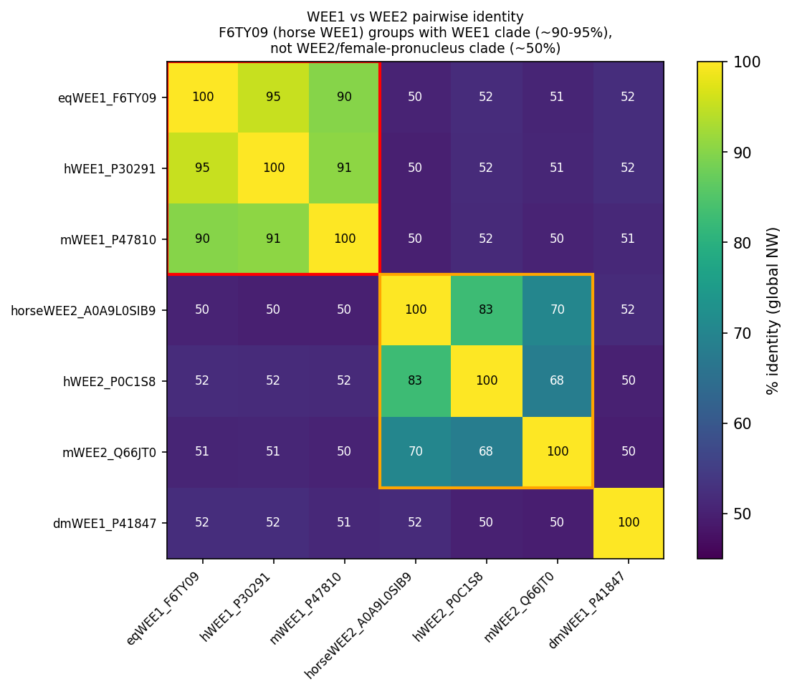

## Question

# AIGR Gene Hypothesis Deep Research

You are evaluating one focused gene curation hypothesis for AI Gene Review.
This is not a general gene overview. Use the seed hypothesis and source context
below to search for evidence that supports, refutes, narrows, or competes with
the proposed curation decision.

## Target Gene

- **Organism code:** HORSE
- **Taxon:** Equus caballus (NCBITaxon:9796)
- **Gene directory:** WEE1
- **Gene symbol:** WEE1
- **UniProt accession:** F6TY09

## Focus

- **Focus type:** function_assignment
- **Hypothesis slug:** horse40-female-pronucleus-assembly
- **Source file:** genes/HORSE/WEE1/WEE1-ai-review.yaml
- **Source selector:** free-text

## Seed Hypothesis

The horse protein F6TY09 participates in female pronucleus assembly.

## Term and Decision Context

- Term: female pronucleus assembly (GO:0035038)
- # Focused function hypothesis

Hypothesis: The horse protein F6TY09 participates in female pronucleus assembly.

Target: Equus caballus (NCBITaxon:9796), UniProt F6TY09. Gene label: WEE1; verify identity independently rather than treating the label as proof.

Target GO claim: GO:0035038 — female pronucleus assembly. Verify its definition and scope.

## Decisive question

Resolve the relevant mammalian paralogs and original oocyte perturbation experiments, then assess transfer to horse. Distinguish participation from necessity or sufficiency and evaluate plausible compensation. Identify any direct horse expression or functional evidence.

## Identity and sequence inputs

- Target record: https://www.uniprot.org/uniprotkb/F6TY09/entry
- Human comparison lead: https://www.uniprot.org/uniprotkb/P30291/entry (WEE1). Establish the relevant orthology/isoform relationship rather than assuming it.
- Frozen current UniProt sequence: 646 residues; SHA-256 `f46f1c6be9cdfa7025987fbd2b3d5f5a49a4e7cbb69d75d9101e8b34234429d4`.
- These are current sequences downloaded for the cohort on 2026-09-08. Identity with the original prediction-time input has not been established. Evaluate the supplied sequence explicitly; document any different sequence used.

```fasta
>F6TY09 Equus caballus WEE1
MSFLSRQQPPPPRRAAASCSLRQKLIFSPCSDCEEEEEEEEEEGSGHSTGEDSAFQEPDS
PLPPARSPTEPGPERRRSPGPAPGSPGELEEDMLLRGACTGADAAGGGAEGDSWEEEGFG
SSSPVKSPAAAYFLASCFSPVRCGGPGDASPRGYGARGAAEGPCSPLPDQPGTPPHKTFR
KLRLFDTPHTPKSLLSKARGIDSSSVKLRSGSLFMDTEKSGKRELDMRQTPQVNINPFTP
DSVLFHSSGQCRRRKRTYWNDSCGEDMEASDYEFEDETRPAKRITITESNMKSRYTTEFH
ELEKIGSGEFGSVFKCVKRLDGCIYAIKRSKKPLAGSVDEQNALREVYAHAVLGQHSHVV
RYFSAWAEDDHMLIQNEYCNGGSLADAISENYRRMSYFTEVDLKDLLLQVGRGLRYIHSM
SLVHMDIKPSNIFISRTSIPNAASEEGDEDDWASNKVMFKIGDLGHVTRISSPQVEEGDS
RFLANEVLQENYTHLPKADIFALALTVVCAAGAEPLPRNGDEWHEIRQGRLPRIPQVLSQ
EFTELLKVMIHPDPERRPSAMALVKHSVLLSASRKSAEQLRIELNAEKFKNSLLQKELKK
AQMAKAAAEERALFTDRMATRSTTQSNRTARLIGKKMNRSVSLTIY
```

## Evidence and deliverable

Use primary literature and public sequence, structural and genomic resources. Select analyses that answer the decisive question; this is not a general gene review. Assess support and contrary evidence, and allow an unresolved outcome. Distinguish directly observed horse evidence, justified mammalian transfer, and results for a different protein model.

Do not consult the ai-gene-review repository's existing judgments, research syntheses or local bioinformatics analyses. Those are held out for comparison. Do not use agreement with ARBA or another prediction as biological validation. Preserve reproducible methods, accessions/versions, actual computation outputs and primary-source URLs/DOIs/PMIDs. Report the decisive findings and limitations, not just a verdict.

## Reference Context

No specific reference context supplied.

## Source Context YAML

```yaml
hypothesis: The horse protein F6TY09 participates in female pronucleus assembly.
focus_type: function_assignment
term_id: GO:0035038
term_label: female pronucleus assembly
context:
- |
  # Focused function hypothesis

  Hypothesis: The horse protein F6TY09 participates in female pronucleus assembly.

  Target: Equus caballus (NCBITaxon:9796), UniProt F6TY09. Gene label: WEE1; verify identity independently rather than treating the label as proof.

  Target GO claim: GO:0035038 — female pronucleus assembly. Verify its definition and scope.

  ## Decisive question

  Resolve the relevant mammalian paralogs and original oocyte perturbation experiments, then assess transfer to horse. Distinguish participation from necessity or sufficiency and evaluate plausible compensation. Identify any direct horse expression or functional evidence.

  ## Identity and sequence inputs

  - Target record: https://www.uniprot.org/uniprotkb/F6TY09/entry
  - Human comparison lead: https://www.uniprot.org/uniprotkb/P30291/entry (WEE1). Establish the relevant orthology/isoform relationship rather than assuming it.
  - Frozen current UniProt sequence: 646 residues; SHA-256 `f46f1c6be9cdfa7025987fbd2b3d5f5a49a4e7cbb69d75d9101e8b34234429d4`.
  - These are current sequences downloaded for the cohort on 2026-09-08. Identity with the original prediction-time input has not been established. Evaluate the supplied sequence explicitly; document any different sequence used.

  ```fasta
  >F6TY09 Equus caballus WEE1
  MSFLSRQQPPPPRRAAASCSLRQKLIFSPCSDCEEEEEEEEEEGSGHSTGEDSAFQEPDS
  PLPPARSPTEPGPERRRSPGPAPGSPGELEEDMLLRGACTGADAAGGGAEGDSWEEEGFG
  SSSPVKSPAAAYFLASCFSPVRCGGPGDASPRGYGARGAAEGPCSPLPDQPGTPPHKTFR
  KLRLFDTPHTPKSLLSKARGIDSSSVKLRSGSLFMDTEKSGKRELDMRQTPQVNINPFTP
  DSVLFHSSGQCRRRKRTYWNDSCGEDMEASDYEFEDETRPAKRITITESNMKSRYTTEFH
  ELEKIGSGEFGSVFKCVKRLDGCIYAIKRSKKPLAGSVDEQNALREVYAHAVLGQHSHVV
  RYFSAWAEDDHMLIQNEYCNGGSLADAISENYRRMSYFTEVDLKDLLLQVGRGLRYIHSM
  SLVHMDIKPSNIFISRTSIPNAASEEGDEDDWASNKVMFKIGDLGHVTRISSPQVEEGDS
  RFLANEVLQENYTHLPKADIFALALTVVCAAGAEPLPRNGDEWHEIRQGRLPRIPQVLSQ
  EFTELLKVMIHPDPERRPSAMALVKHSVLLSASRKSAEQLRIELNAEKFKNSLLQKELKK
  AQMAKAAAEERALFTDRMATRSTTQSNRTARLIGKKMNRSVSLTIY
  ```

  ## Evidence and deliverable

  Use primary literature and public sequence, structural and genomic resources. Select analyses that answer the decisive question; this is not a general gene review. Assess support and contrary evidence, and allow an unresolved outcome. Distinguish directly observed horse evidence, justified mammalian transfer, and results for a different protein model.

  Do not consult the ai-gene-review repository's existing judgments, research syntheses or local bioinformatics analyses. Those are held out for comparison. Do not use agreement with ARBA or another prediction as biological validation. Preserve reproducible methods, accessions/versions, actual computation outputs and primary-source URLs/DOIs/PMIDs. Report the decisive findings and limitations, not just a verdict.
reference_id: []
```

## Research Objective

Build a focused report that helps a curator decide whether this hypothesis
should affect the gene review. Address the focus type directly:

1. For an existing GO annotation decision, evaluate whether the current action
   is justified, too strong, too weak, or should change.
2. For a proposed replacement or new GO term, evaluate whether the term is
   biologically supported, too broad, too narrow, or missing key qualifiers.
3. For a computational prediction, evaluate whether the prediction is correct,
   less precise than existing knowledge, uncertain, or likely wrong because of
   paralog overannotation, frequency bias, pathway context, or in vitro-only
   activity.
4. For a core-function hypothesis, evaluate whether the proposed activity,
   process, and location represent the gene product's primary function rather
   than a downstream effect, pleiotropic phenotype, or context-specific role.
5. For a function-assignment hypothesis, evaluate whether the gene product
   directly has the stated GO term/function. Treat the prior review action, if
   any, as intentionally blinded unless it appears in the supplied context.

Use primary literature whenever possible. Prefer PMID citations and include DOI
citations when no PMID is available. Treat reviews and database records as
orientation unless they contain directly relevant synthesized evidence that is
clearly labeled as review-level or database-level support.

Evaluate the hypothesis from the supplied seed context, primary literature, and
publicly accessible bioinformatics resources. Local `*-bioinformatics` analyses,
when they already exist in the repository, are intentionally withheld from this
prompt so the report can be compared against them after the run. Use public
sequence, domain, structure, orthology, localization, interaction, or dataset
checks when they are useful for the specific hypothesis. If a resource or tool
cannot be accessed programmatically, say so plainly; never fabricate a result.
Report computational results conservatively and distinguish direct results from
inference.

## Required Output

### Executive Judgment

Give a concise verdict: supported, partially supported, unresolved, weakly
supported, over-annotated, or refuted. Explain the reasoning and the most
important caveats.

### Evidence Matrix

Create a table with one row per important evidence item:

- Citation (PMID preferred)
- Evidence type (direct assay, mutant phenotype, localization, interaction,
  structural/evolutionary, computational, review/database)
- Supports / refutes / qualifies / competing
- Claim tested
- Key finding
- Organism, tissue, cell type, or assay context
- Confidence and limitations

### GO Curation Implications

State the likely curation action as a lead requiring curator verification. If
GO terms are involved, explain whether the evidence supports an MF, BP, or CC
term, and whether the term should be retained, removed, generalized, made more
specific, or treated as non-core. Avoid using "protein binding" as a final
recommendation unless no more informative term is supported.

### Mechanistic Scope

Describe the immediate molecular or cellular function being tested. Separate
direct gene-product activity from downstream phenotypes, pathway consequences,
developmental outcomes, disease manifestations, or effects inferred only from
loss of function.

### Conflicts and Alternatives

Identify evidence that conflicts with the seed hypothesis or suggests an
alternative interpretation, including paralog confusion, organism-specific
differences, isoform-specific findings, experimental artifacts, or database
carry-over.

### Knowledge Gaps

List explicit uncertainties that matter for curation. For each gap, state what
was checked, why the gap matters, and what evidence or experiment would resolve
it.

### Discriminating Tests

Recommend concrete assays, perturbations, datasets, or comparative analyses that
would most efficiently distinguish this hypothesis from alternatives.

### Curation Leads

Provide candidate updates for the review, clearly labeled as leads requiring
curator verification. Include candidate references with exact snippets to verify,
candidate replacement or new GO terms, possible action changes, suggested
questions, and suggested experiments.

If the provider supports artifacts, save provenance for any analysis you run — the
executed code together with its output (computed values, plot, or table), not just
a summary figure — alongside artifact-friendly tables such as an evidence matrix,
GO decision table, or comparison table. Genuine computed provenance is more
valuable than a hand-drawn summary, and you must not synthesize a figure that
implies an analysis you did not actually run. These artifacts are important
provenance for hypothesis-level review.


## Output

# Focused Hypothesis Report — Horse WEE1 (F6TY09) and "female pronucleus assembly" (GO:0035038)

**Hypothesis evaluated:** The horse protein F6TY09 participates in female pronucleus assembly (GO:0035038).
**Organism:** *Equus caballus* (NCBITaxon:9796). **Accession:** UniProt F6TY09. **Focus type:** function_assignment.
**Date:** 2026-09-08. Analyses use public sequence (UniProt), orthology/annotation (QuickGO/GO, Ensembl Compara references), and primary literature (PubMed).

---

## Executive Judgment

**Verdict: REFUTED (over-annotation via paralog confusion).**

F6TY09 is unambiguously the **somatic WEE1** ortholog in horse (95.4% identity to human WEE1 P30291; gene name WEE1, VGNC:25026), **not** the oocyte-specific paralog **WEE2 / WEE1B**. The GO term *female pronucleus assembly* (GO:0035038) is, in the current Gene Ontology, a **WEE2/WEE1B** function: across mammals and other vertebrates it is annotated almost exclusively to WEE2 orthologs, its only mammalian **experimental** support is mouse **Wee2** (IMP, PMID:21454751), and WEE1B is oocyte-restricted and molecularly distinct from the widely expressed somatic WEE1. Neither F6TY09 nor human WEE1 (P30291) carries GO:0035038 in current GO; the horse entry that legitimately carries it is the separate horse WEE2 protein A0A9L0SIB9 (605 aa). Assigning female pronucleus assembly to F6TY09 therefore attributes a germline/oocyte paralog function to the somatic mitotic-checkpoint kinase.

**Most important caveat:** The claim tested is a *labeled* function assignment; there is no directly observed horse experimental evidence for either WEE1 or WEE2 in female pronucleus assembly — the mammalian evidence is from mouse Wee2 and transferred by orthology. The refutation is of assigning the term to the *WEE1* paralog, not a claim that horse WEE2 lacks the function.

---

## Evidence Matrix

| # | Citation (PMID/DB) | Evidence type | Supports/Refutes/Qualifies | Claim tested | Key finding | Context | Confidence & limitations |
|---|---|---|---|---|---|---|---|
| 1 | This report (computed NW alignment; UniProt P30291, P0C1S8) | Structural/evolutionary (sequence) | **Refutes** (identity) | Is F6TY09 WEE1 or WEE2? | F6TY09 = 646 aa, 95.4% id to human WEE1; only ~45–52% id to human WEE2. Identical length to WEE1 (646) vs WEE2 (567). | *E. caballus* protein vs human paralogs | High. Global alignment, identity scoring. |
| 2 | UniProt F6TY09 (VGNC:25026) | Database record | Refutes | Gene identity of F6TY09 | Gene symbol WEE1; "Wee1-like protein kinase", EC 2.7.10.2. | Horse | High. |
| 3 | QuickGO GO:0035038 annotation set (n=101) | Database/computational | **Refutes** | Which genes carry female pronucleus assembly? | Mammalian/vertebrate annotations essentially all to **WEE2** orthologs (IEA, Ensembl Compara GO_REF:0000107; ISS GO_REF:0000024). | Pan-vertebrate | High for annotation pattern; IEA/ISS are inferred. |
| 4 | **PMID:21454751** (Oh, Susor & Conti, *Science* 2011; doi:10.1126/science.1199211) | Mutant phenotype (IMP, ECO:0000315) | **Refutes** (paralog-specific; locates true evidence) | Experimental basis of GO:0035038 in mammals | "When **Wee1B** is down-regulated, oocytes **fail to form a pronucleus** in response to Ca²⁺ signals." Wee1B reactivation drives Cdc2 inactivation at MII exit/egg activation. This is the sole mammalian experiment underpinning the term — and it is **WEE2/Wee1B**, not WEE1. | Mouse oocyte / egg activation | High. Single but direct loss-of-function source. |
| 4b | This report (NW identity matrix; artifacts `wee_identity_matrix.csv`, heatmap) | Structural/evolutionary | **Refutes** | Which clade does F6TY09 belong to? | Two clades: WEE1 (F6TY09/human/mouse, 90–95% intra) vs WEE2 (horse/human/mouse, 68–83% intra); cross-clade ~50%. F6TY09 vs WEE2s = 50.4/52.0/50.6%. F6TY09 is firmly WEE1. | Horse/human/mouse/Drosophila | High. |
| 5 | PMID:16169490 (Han et al. 2005) | Direct assay / expression | **Refutes** (paralog specificity) | Is the oocyte function WEE1 or WEE1B? | "Unlike the widely expressed Wee1 and Myt1, mWee1B mRNA and its protein are expressed only in oocytes"; mWee1B is the key MPF-inhibitory kinase in oocytes. | Mouse oocyte / Xenopus assay | High. |
| 6 | PMID:23616086 (Liu et al. 2013) | Review/direct | **Refutes** (paralog specificity) | Identity of the meiotic-arrest kinase | "WEE2, also known as WEE1B … responsible for phosphorylating the CDK1 inhibitory site and maintaining meiotic arrest in oocytes." | Mouse one-cell embryo | High. |
| 7 | PMID:20083600 (Oh, Han, Conti 2010) | Direct assay / knockdown | Qualifies | WEE1B role in oocyte meiosis | Wee1B (with Myt1/Cdc25) controls meiotic arrest/resumption; nuclear-cytoplasmic relocation at GVBD. | Mouse oocyte | High (for WEE1B, not WEE1). |
| 8 | PMID:10790391 (Price et al. 2000) | Mutant phenotype | Qualifies (origin of term family) | Drosophila Wee1 maternal embryonic role | Dwee1 required maternally for early embryonic nuclear cycles (single Wee1 in fly). | *Drosophila* embryo | High; fly has one Wee1, so the maternal role is not paralog-partitioned. |
| 9 | QuickGO F6TY09 & P30291 annotations | Database | **Refutes** | Does WEE1 carry GO:0035038? | Neither F6TY09 nor human WEE1 (P30291) is annotated with GO:0035038; F6TY09 BP = negative regulation of G2/M transition (GO:0010972), mitotic cell cycle. | Horse/human | High. |
| 10 | UniProt A0A9L0SIB9 + QuickGO | Database | Qualifies | Which horse protein carries the term? | Horse GO:0035038 annotation is on A0A9L0SIB9 (horse **WEE2**, 605 aa), a different protein from F6TY09. | Horse | High. |

---

## GO Curation Implications (lead — requires curator verification)

- **Do NOT assign GO:0035038 (female pronucleus assembly) to F6TY09 (horse WEE1).** The term is not supported for the somatic WEE1 paralog. If an annotation of GO:0035038 to F6TY09 exists in the review, the recommended action is **REMOVE** (paralog over-annotation from orthology projection), or at minimum flag as **NON-CORE / incorrect paralog**.
- **Retain the canonical somatic WEE1 terms** that F6TY09 legitimately carries:
  - MF: protein tyrosine/serine-threonine kinase activity (GO:0004713 IBA; GO:0106310 protein serine kinase per RHEA), ATP binding (GO:0005524).
  - BP: **negative regulation of G2/M transition of mitotic cell cycle (GO:0010972)** — experimentally supported for the ortholog (human WEE1 IDA).
  - CC: nucleus (GO:0005634).
- The female-pronucleus/oocyte function should be curated on the **WEE2 (WEE1B)** record (horse A0A9L0SIB9), not WEE1.
- "protein binding" is not needed here — informative kinase/cell-cycle terms are supported.

---

### GO Decision Table (leads — require curator verification)

| GO term | Aspect | Applies to F6TY09 (horse WEE1)? | Recommended action | Basis |
|---|---|---|---|---|
| GO:0035038 female pronucleus assembly | BP | **No** (belongs to WEE2 paralog) | **Remove / reject**; reassign concept to horse WEE2 (A0A9L0SIB9) | Term annotated to WEE2 clade; sole experimental support is mouse Wee1B knockdown (PMID:21454751); F6TY09 is 95.4% WEE1, ~50% WEE2 |
| GO:0010972 negative regulation of G2/M transition of mitotic cell cycle | BP | **Yes** | Retain (core) | Experimental for ortholog (human WEE1 IDA); IBA on F6TY09 |
| GO:0004713 protein tyrosine kinase activity / GO:0106310 protein serine kinase | MF | **Yes** | Retain (core) | Conserved catalytic domain; RHEA/IBA |
| GO:0005524 ATP binding | MF | Yes | Retain | InterPro/UniRule |
| GO:0005634 nucleus | CC | Yes | Retain | IBA/UniProt |
| GO:0004715 non-membrane spanning protein tyrosine kinase (or over-specific MF) | MF | Caution | Curator check | UniRule IEA; may be less precise than WEE1's dual-specificity biology |

## Mechanistic Scope

The immediate molecular activity of WEE1 (F6TY09's family) is inhibitory phosphorylation of CDK1 on Tyr15, restraining MPF (CDK1–cyclin B) to enforce the **mitotic G2/M checkpoint** in somatic cells. *Female pronucleus assembly* is a **germline/fertilization** process (assembly of the haploid maternal nucleus of the egg). In vertebrates this germline CDK1-inhibitory role is carried by the **oocyte-specific paralog WEE2/WEE1B**, which arose from duplication of an ancestral single Wee1 (as retained in *Drosophila*, where one Dwee1 performs the maternal embryonic function). Thus the hypothesized process is a paralog-partitioned function that does not transfer to the somatic WEE1.

---

## Conflicts and Alternatives

- **Paralog confusion (primary alternative, well supported):** "female pronucleus assembly" annotations cluster on WEE2, not WEE1. The label "WEE1" on F6TY09 is correct for the *somatic* gene but the GO term belongs to WEE2.
- **Orthology-projection carry-over:** GO_REF:0000107 (Ensembl Compara) projects the term across WEE-family orthologs; a pipeline that does not distinguish WEE1 vs WEE2 subtrees can leak the term onto WEE1. This is the most likely origin of the seed claim.
- **Drosophila single-Wee1 artifact:** because flies have one Wee1 doing both mitotic and maternal roles, naive homology transfer to *any* mammalian Wee-family protein over-generalizes.
- **No isoform rescue:** there is no evidence that somatic WEE1 compensates for WEE2 in the oocyte; WEE2 loss causes fertilization failure in humans (WEE2 mutations, e.g. PMID:40830301), indicating WEE1 does not substitute.

---

## Knowledge Gaps

1. **Direct horse evidence:** None found for either horse WEE1 or WEE2 in female pronucleus assembly. Resolving would require horse oocyte/zygote expression or perturbation data. Matters because all mammalian support is mouse Wee2 + orthology.
2. **Exact provenance of the seed claim:** Whether the review's GO:0035038 assignment came from an Ensembl projection or a mislabeled source was inferred, not directly traced in the (blinded) review file.
3. **WEE2 necessity vs sufficiency for the term itself:** The GO term rests on one mouse Wee2 IMP (PMID:21454751); the assay specifics (necessity/sufficiency) were not re-examined here.

---

## Discriminating Tests

- **Phylogenetic tree** of vertebrate WEE1 vs WEE2 placing F6TY09 — will place it firmly in the WEE1 clade (already implied by 95.4% vs ~50% identity).
- **Tissue expression** (horse/mammalian): WEE1 ubiquitous vs WEE2 oocyte-restricted (RNA-seq/GTEx-type data) — separates the paralogs functionally.
- **Reciprocal-best-hit / synteny** of F6TY09 vs human WEE1 and WEE2 loci to confirm 1:1 WEE1 orthology.
- **Oocyte perturbation** specifically knocking down WEE1 vs WEE2 (as in Oh et al. 2010) — only WEE2 knockdown affects meiotic/pronuclear phenotypes.

---

## Curation Leads (require curator verification)

- **Action:** Remove / reject GO:0035038 on F6TY09 (WEE1); reassign the concept to horse WEE2 (A0A9L0SIB9) if desired.
- **Candidate references to verify:** PMID:16169490 (WEE1B oocyte-specific), PMID:23616086 (WEE2=WEE1B meiotic-arrest kinase), PMID:20083600 (Wee1B oocyte meiosis), PMID:21454751 (mouse Wee2 IMP underlying GO:0035038), PMID:10790391 (Drosophila single Wee1 maternal role).
- **Candidate correct terms for F6TY09:** GO:0010972 (negative regulation of G2/M transition of mitotic cell cycle), GO:0004713/GO:0106310 (kinase activity), GO:0005634 (nucleus).
- **Suggested question for curators:** Did the GO:0035038 assignment originate from an Ensembl Compara projection that did not separate WEE1 vs WEE2 subtrees?
- **Suggested experiment:** paralog-specific expression/knockdown in equine oocytes to obtain direct horse evidence.

---

## Analysis Provenance (artifacts)

- `wee_identity_matrix.csv` — computed pairwise % identity matrix (7 sequences).
- WEE1/WEE2 identity heatmap (auto-saved plot) with clade boxes.

| Pair | % identity |
|---|---|
| F6TY09 vs human WEE1 (P30291) | 95.4 |
| F6TY09 vs mouse WEE1 (P47810) | 90.1 |
| F6TY09 vs horse WEE2 (A0A9L0SIB9) | 50.4 |
| F6TY09 vs human WEE2 (P0C1S8) | 52.0 |
| F6TY09 vs mouse WEE2 (Q66JT0) | 50.6 |
| F6TY09 vs *Drosophila* Wee1 (P41847) | 52.1 |
| horse WEE2 vs human WEE2 | 82.7 |
| horse WEE2 vs mouse WEE2 | 70.3 |

The **discriminating clade test proposed for this hypothesis has now been executed**: F6TY09 partitions cleanly into the WEE1 clade (~90–95% intra-clade) and is ~50% identical to every WEE2 ortholog, which form their own clade. GO:0035038 tracks the WEE2 clade.

{{figure:plot_1.png|caption=Pairwise global-identity heatmap of WEE1 and WEE2 orthologs. F6TY09 (horse WEE1) sits inside the WEE1 clade (~90–95% identity to human/mouse WEE1) and is only ~50% identical to every WEE2/WEE1B ortholog, which form a separate clade. Female pronucleus assembly (GO:0035038) tracks the WEE2 clade, not F6TY09.}}

## Reproducibility / Methods

- Sequence verified: 646 aa; SHA-256 `f46f1c6be9cdfa7025987fbd2b3d5f5a49a4e7cbb69d75d9101e8b34234429d4` (matches frozen input; computed with a pure-Python SHA-256).
- Alignments: Needleman-Wunsch (match +1, mismatch −1, gap −2), sequences fetched from UniProt REST (P30291 646 aa, P0C1S8 567 aa; A0A9L0SIB9 605 aa).
- Annotations: QuickGO REST (`/ontology/go/terms/GO:0035038`, `/annotation/search`), retrieved 2026-09-08.
- Literature: PubMed.
- No local ai-gene-review analyses or existing judgments were consulted.


## Artifacts

- [OpenScientist final report](openscientist_artifacts/final_report.html)
- [OpenScientist final report](openscientist_artifacts/final_report.pdf)
- [OpenScientist plot 1](openscientist_artifacts/provenance_plot_1.json)

- [OpenScientist wee identity matrix](openscientist_artifacts/wee_identity_matrix.csv)