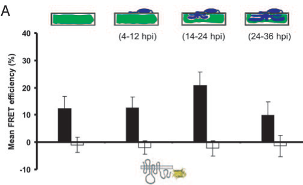

## Question

# Gene Research for Functional Annotation

## ⚠️ CRITICAL: Gene/Protein Identification Context

**BEFORE YOU BEGIN RESEARCH:** You MUST verify you are researching the CORRECT gene/protein. Gene symbols can be ambiguous, especially for less well-characterized genes from non-model organisms.

### Target Gene/Protein Identity (from UniProt):
- **UniProt Accession:** P93766
- **Protein Description:** RecName: Full=Protein MLO;
- **Gene Information:** Name=MLO;
- **Organism (full):** Hordeum vulgare (Barley).
- **Protein Family:** Belongs to the MLO family. .
- **Key Domains:** Mlo. (IPR004326); Mlo (PF03094)

### MANDATORY VERIFICATION STEPS:

1. **Check if the gene symbol "MLO" matches the protein description above**
2. **Verify the organism is correct:** Hordeum vulgare (Barley).
3. **Check if protein family/domains align with what you find in literature**
4. **If you find literature for a DIFFERENT gene with the same or similar symbol, STOP**

### If Gene Symbol is Ambiguous or You Cannot Find Relevant Literature:

**DO NOT PROCEED WITH RESEARCH ON A DIFFERENT GENE.** Instead:
- State clearly: "The gene symbol 'MLO' is ambiguous or literature is limited for this specific protein"
- Explain what you found (e.g., "Found extensive literature on a different gene with the same symbol in a different organism")
- Describe the protein based ONLY on the UniProt information provided above
- Suggest that the protein function can be inferred from domain/family information

### Research Target:

Please provide a comprehensive research report on the gene **MLO** (gene ID: MLO, UniProt: P93766) in HORVU.

The research report should be a detailed narrative explaining the function, biological processes, and localization of the gene product. Citations should be given for all claims.

You should prioritize authoritative reviews and primary scientific literature when conducting research. You can supplement
this with annotations you find in gene/protein databases, but these can be outdated or inaccurate.

We are specifically interested in the primary function of the gene - for enzymes, what reaction is catalyzed, and what is the substrate specificity? For transporters, what is the substrate? For structural proteins or adapters, what is the broader structural role? For signaling molecules, what is the role in the pathway.

We are interested in where in or outside the cell the gene product carries out its function.

We are also interested in the signaling or biochemical pathways in which the gene functions. We are less interested in broad pleiotropic effects, except where these elucidate the precise role.

Include evidence where possible. We are interested in both experimental evidence as well as inference from structure, evolution, or bioinformatic analysis. Precise studies should be prioritized over high-throughput, where available.

## Output

Question: You are an expert researcher providing comprehensive, well-cited information.

Provide detailed information focusing on:
1. Key concepts and definitions with current understanding
2. Recent developments and latest research (prioritize 2023-2024 sources)
3. Current applications and real-world implementations
4. Expert opinions and analysis from authoritative sources
5. Relevant statistics and data from recent studies

Format as a comprehensive research report with proper citations. Include URLs and publication dates where available.
Always prioritize recent, authoritative sources and provide specific citations for all major claims.

# Gene Research for Functional Annotation

## ⚠️ CRITICAL: Gene/Protein Identification Context

**BEFORE YOU BEGIN RESEARCH:** You MUST verify you are researching the CORRECT gene/protein. Gene symbols can be ambiguous, especially for less well-characterized genes from non-model organisms.

### Target Gene/Protein Identity (from UniProt):
- **UniProt Accession:** P93766
- **Protein Description:** RecName: Full=Protein MLO;
- **Gene Information:** Name=MLO;
- **Organism (full):** Hordeum vulgare (Barley).
- **Protein Family:** Belongs to the MLO family. .
- **Key Domains:** Mlo. (IPR004326); Mlo (PF03094)

### MANDATORY VERIFICATION STEPS:

1. **Check if the gene symbol "MLO" matches the protein description above**
2. **Verify the organism is correct:** Hordeum vulgare (Barley).
3. **Check if protein family/domains align with what you find in literature**
4. **If you find literature for a DIFFERENT gene with the same or similar symbol, STOP**

### If Gene Symbol is Ambiguous or You Cannot Find Relevant Literature:

**DO NOT PROCEED WITH RESEARCH ON A DIFFERENT GENE.** Instead:
- State clearly: "The gene symbol 'MLO' is ambiguous or literature is limited for this specific protein"
- Explain what you found (e.g., "Found extensive literature on a different gene with the same symbol in a different organism")
- Describe the protein based ONLY on the UniProt information provided above
- Suggest that the protein function can be inferred from domain/family information

### Research Target:

Please provide a comprehensive research report on the gene **MLO** (gene ID: MLO, UniProt: P93766) in HORVU.

The research report should be a detailed narrative explaining the function, biological processes, and localization of the gene product. Citations should be given for all claims.

You should prioritize authoritative reviews and primary scientific literature when conducting research. You can supplement
this with annotations you find in gene/protein databases, but these can be outdated or inaccurate.

We are specifically interested in the primary function of the gene - for enzymes, what reaction is catalyzed, and what is the substrate specificity? For transporters, what is the substrate? For structural proteins or adapters, what is the broader structural role? For signaling molecules, what is the role in the pathway.

We are interested in where in or outside the cell the gene product carries out its function.

We are also interested in the signaling or biochemical pathways in which the gene functions. We are less interested in broad pleiotropic effects, except where these elucidate the precise role.

Include evidence where possible. We are interested in both experimental evidence as well as inference from structure, evolution, or bioinformatic analysis. Precise studies should be prioritized over high-throughput, where available.

# Functional annotation report: barley MLO (UniProt P93766)

## Identity and principal function

**Identity verified.** The target is the canonical *Hordeum vulgare* (barley) MLO protein, not the similarly named barley MLA resistance receptor or another MLO paralog. A study explicitly identifies HvMlo as **UniProt P93766**; an earlier MLO-family inventory lists barley *Mlo* separately from *Mlo2*. The supplied Mlo-domain annotations, IPR004326 and PF03094, agree with the protein’s experimentally studied seven-transmembrane MLO-family architecture. (huebbers2026alphafold3captures pages 5-8, devoto2003molecularphylogenyand pages 2-3, elliott2005conservedextracellularcysteine pages 1-2)

**The most firmly established biological function of wild-type barley MLO is to enable powdery-mildew infection of leaf epidermal cells.** It is a host *susceptibility factor*: functional **MLO** favors entry by *Blumeria graminis* f. sp. *hordei* (also called *B. hordei*), whereas recessive, impaired **mlo** alleles confer resistance. Thus, the historical phrase “Mlo resistance” denotes resistance obtained by *losing* MLO activity, not an antimicrobial activity of the wild-type protein. The complete biochemical chain from MLO activation to successful fungal entry remains unresolved. (bhat2005recruitmentandinteraction pages 1-2, reinstadler2010novelinducedmlo pages 1-2, elliott2005conservedextracellularcysteine pages 1-2)

| Annotation | Direct barley evidence | Inference / limitation |
|---|---|---|
| **Identity, topology, localization** | HvMLO is the 533-aa *Hordeum vulgare* MLO-family protein corresponding to UniProt **P93766**, distinct from barley Mlo2. It is an integral plasma-membrane protein with seven membrane-spanning helices, an extracellular N-terminus, and a cytoplasmic C-terminus. (huebbers2026alphafold3captures pages 5-8, devoto2003molecularphylogenyand pages 2-3, elliott2005conservedextracellularcysteine pages 1-2) | Identity, organism, topology, and MLO-family assignment are strongly supported. It is not the similarly named MLA immune receptor. |
| **Powdery-mildew susceptibility factor** | Functional wild-type **MLO promotes susceptibility** to *Blumeria graminis* f. sp. *hordei*; recessive loss-of-function **mlo alleles confer resistance**. Fungal penetration was about **56% in wild type**, **0.8% in complete-resistance mutants**, and **18–35% in partial-resistance mlo-12/mlo-28 mutants**. (piffanelli2002thebarleymlo pages 2-4) | MLO is not a resistance protein in the usual sense: resistance results from loss or impairment of MLO. Its contribution to fungal entry is more certain than its complete biochemical mechanism. |
| **Pathogen-induced membrane microdomain and CaM binding** | MLO-YFP accumulates focally in the plasma membrane beneath fungal appressoria. In living barley epidermal cells, MLO–calmodulin FRET was **12.2 ± 4.6%**; the CaM-binding-site mutant W423R reduced it to **2.7 ± 2.3%**. The interaction increases during fungal entry. (bhat2005recruitmentandinteraction pages 3-4, bhat2005recruitmentandinteraction media 182a132e) | Demonstrates physical proximity/binding and the importance of the cytoplasmic CaM-binding domain. It does **not** establish whether CaM opens, closes, stabilizes, or negatively regulates an MLO channel. |
| **Emerging ion-channel function** | Published work summarized in 2026 reports that HvMLO conducts currents carried by **Ba²⁺ and Mg²⁺**, but not K⁺ or Na⁺. For P93766, a trimeric central pore, Ca²⁺ coordination, permeability, and tension-dependent opening are supported by AlphaFold/MD modeling and experimental self-association rather than direct Ca²⁺ patch-clamp data. (huebbers2026alphafold3captures pages 5-8, huebbers2026alphafold3captures pages 1-5, huebbers2026alphafold3captures pages 33-36) | Best current annotation: **candidate divalent-cation/Ca²⁺-permeable channel**, potentially mechanosensitive. Direct, sequence-specific demonstration of Ca²⁺ conductance and selectivity for barley P93766 remains incomplete. |
| **Polarized secretion / EXO70 pathway** | No direct barley-P93766 evidence presently establishes an HvMLO–EXO70 complex. A 2024 *Arabidopsis* study showed MLO–EXO70 colocalization, FRET/protein interaction, altered callose-synthase delivery, and reduced fungal penetration in combined mutants. (huebbers2024interplayofexo70 pages 1-2, huebbers2024interplayofexo70 pages 16-17) | Supports a conserved hypothesis that MLO proteins organize localized exocytosis or cell-wall remodeling, but the specific EXO70 mechanism must **not** be assigned directly to barley P93766 without barley validation. |
| **Agricultural implementation** | Breeders deploy recessive **mlo resistance alleles**, not wild-type MLO activity. Among Czech spring-barley varieties newly registered in **2021–2023, 22 of 23 (95.7%)** carried Mlo/mlo-based resistance; early necrotic spotting and yield penalties were substantially reduced through breeding. (dreiseitl2024mlomediatedbroadspectrumand pages 1-2, dreiseitl2024mlomediatedbroadspectrumand pages 4-5) | Demonstrates extensive real-world use and durability in European spring barley. Deployment in winter barley remains controversial because broader year-round selection could encourage pathogen adaptation. |

*Table: Evidence-level annotation of barley HvMLO (UniProt P93766), distinguishing direct barley findings from cross-species or computational inference. The table also separates susceptibility conferred by wild-type MLO from resistance produced by recessive mlo alleles.*

## Where MLO acts and how it is regulated

MLO is an integral **plasma-membrane protein**, with seven membrane-spanning segments, an extracellular amino terminus, and a cytoplasmic carboxyl terminus. Its most relevant demonstrated site of action is the barley **leaf epidermal plasma membrane beneath an attempted fungal penetration site**. Fluorescent MLO accumulates there beneath the fungal appressorium; this is redistribution within the host-cell membrane, not evidence that MLO is secreted into the fungus or cell wall. The microscopy panels directly show focal MLO accumulation at these sites. Pathogen challenge also increased MLO protein abundance approximately fivefold in enriched plasma-membrane fractions, peaking around 16 hours after inoculation in the study conditions. (bhat2005recruitmentandinteraction pages 1-2, bhat2005recruitmentandinteraction media 182a132e, piffanelli2002thebarleymlo pages 4-6)

A well-supported molecular connection is **Ca²⁺-dependent calmodulin regulation**. Barley MLO’s cytoplasmic tail contains a calmodulin-binding region. In living barley epidermal cells, MLO–calmodulin fluorescence-resonance energy transfer (FRET) averaged **12.2 ± 4.6%**; the MLO W423R binding-region variant gave **2.7 ± 2.3%**, near background. FRET between MLO and calmodulin increases during fungal entry, and mutations affecting the binding region impair full susceptibility-promoting function. These experiments support a physical, functionally important interaction, but do not by themselves establish exactly how calmodulin changes MLO’s activity. (kusch2017mlobasedresistancean pages 2-4, bhat2005recruitmentandinteraction pages 3-4)

Mutant and complementation studies locate important functional determinants in the **second and third cytoplasmic loops**, the cytoplasmic tail, and conserved extracellular cysteines. Expressing functional MLO in resistant barley epidermal cells restores susceptibility in single-cell assays. In one allele comparison, fungal penetration was approximately **56% in wild-type plants**, **0.8% in strongly resistant mutants**, and **18–35% in the partially resistant mlo-12 and mlo-28 mutants**. Some disruptive mutations also alter membrane-protein quality control; consequently, a loss-of-function phenotype does not always identify a signaling residue rather than impaired folding or accumulation. (reinstadler2010novelinducedmlo pages 1-2, piffanelli2002thebarleymlo pages 2-4, elliott2005conservedextracellularcysteine pages 1-2)

## Pathway-level interpretation

The best-supported pathway description is that **fungal contact → local MLO accumulation and calmodulin-associated activity at the epidermal membrane → increased likelihood of fungal penetration**. In resistant *mlo* plants, attempted entry is instead commonly stopped at the cell periphery, where callose-containing wall appositions, or *papillae*, and an epidermal oxidative burst are enhanced. Barley **ROR2**, a plasma-membrane syntaxin implicated in defense-related secretion, and **ROR1** are required for full *mlo* resistance: *ror* mutations partially restore fungal entry. This is a **genetic pathway relationship**, not proof that MLO binds ROR1 or ROR2 directly. MLO and ROR2 can both accumulate near attempted entry sites, including under conditions that disrupt actin-dependent transport. (bhat2005recruitmentandinteraction pages 1-2, kusch2017mlobasedresistancean pages 2-4, bhat2005recruitmentandinteraction pages 3-4)

MLO also suppresses some infection-associated oxidative and cell-death responses. Following attempted penetration, resistant *mlo* plants exhibit an early cell-wall-associated H₂O₂ burst and, later, oxidative staining and cell death in underlying mesophyll; these later responses diminish in an *mlo-5 ror1-2* double mutant. Spontaneous premature leaf senescence in uninoculated *mlo* plants further indicates a role in limiting cell death. **The later mesophyll response should not be mistaken for the immediate epidermal mechanism that blocks fungal entry**: the original study distinguishes their timing and location. (piffanelli2002thebarleymlo pages 2-4, piffanelli2002thebarleymlo pages 4-6)

## Recent mechanistic research: established findings versus inference

**Ion permeation is a promising, but incompletely resolved, molecular annotation for P93766.** A 2026 barley-MLO study reports that earlier experiments observed HvMLO currents carried by **Ba²⁺ and Mg²⁺**, but not K⁺ or Na⁺. The original ion-current experiment was not independently examined for this report, so its exact assay conditions and quantitative selectivity should not be inferred here. In a peer-reviewed **2023** study, *Arabidopsis* MLO1/5/9/15 supported regulated inward, Ca²⁺-associated currents in reconstituted RALF-signaling experiments. Those experiments concern **different proteins**, not direct electrophysiological proof of Ca²⁺ conduction by barley P93766. (gao2023ralfsignalingpathway pages 6-7, gao2023ralfsignalingpathway pages 3-4, huebbers2026alphafold3captures pages 33-36)

A **2026 bioRxiv preprint**, which has **not been peer reviewed**, explicitly modeled P93766 and found experimentally supported MLO self-association together with predicted dimeric/trimeric assemblies. Its trimer models contain a candidate central pore; molecular-dynamics simulations predict Ca²⁺ permeation through proposed open conformations and opening under modeled membrane tension. These findings provide a testable channel/mechanosensing mechanism, **not** definitive proof that native barley MLO conducts Ca²⁺ during fungal entry or that mechanical gating causes susceptibility. No enzyme reaction or established organic-molecule transport substrate should be assigned to this protein. (huebbers2026alphafold3captures pages 5-8, huebbers2026alphafold3captures pages 1-5)

A peer-reviewed **2024** study linked MLO proteins to **EXO70-dependent polarized secretion**, including callose-synthase delivery, cell-wall composition, and powdery-mildew susceptibility. Importantly, its interaction and trafficking experiments were conducted principally with ***Arabidopsis* MLO isoforms**, not barley P93766. They strengthen an exocytosis-related hypothesis for the MLO family but do **not** establish a barley MLO–EXO70 complex or identify its cargo. This distinction matters because a secretory role, an ion-channel role, and their possible coupling are not yet experimentally unified for the barley protein. (huebbers2024interplayofexo70 pages 1-2, huebbers2024interplayofexo70 pages 16-17)

## Applications, durability, and limitations

The real-world application is **breeding barley with recessive *mlo* resistance alleles**, rather than enhancing wild-type MLO. In his **January 2024** specialist assessment, Dreiseitl reports that **22 of 23 (95.7%) Czech spring-barley varieties newly registered in 2021–2023** carried Mlo/*mlo*-based resistance; over 1993–2023, the figure was **114 of 164** newly registered varieties. These are **registration statistics, not percentages of planted hectares**. The same assessment describes broad effectiveness and long agricultural durability, while noting that deployment is much less established outside European spring barley. (dreiseitl2024mlomediatedbroadspectrumand pages 1-2, dreiseitl2024mlomediatedbroadspectrumand pages 4-5)

Durability does not mean biological impossibility of pathogen adaptation. Early resistant cultivars could show necrotic leaf spotting and reduced yield, although subsequent breeding reduced these penalties. The 2024 assessment notes limited experimental adaptation and cautions that expanding deployment into winter barley could increase selection pressure through more continuous host availability; a separate 2024 barley genetics study raises the same concern. These are reasons to monitor resistance and agronomic performance, not evidence that currently deployed spring-barley resistance has generally failed. (dreiseitl2024mlomediatedbroadspectrumand pages 5-6, dreiseitl2024mlomediatedbroadspectrumand pages 1-2, guo2024genomewideassociationmapping pages 1-2)

A **November 2024** primary study comparing susceptible wild-type barley with a resistant, near-isogenic *mlo5* line detected genotype-dependent infection-associated volatile profiles and sender-genotype-dependent effects on resistance in recipient plants. Its salicylate-related observations concern downstream plant responses and **do not show that MLO directly synthesizes or transports volatile compounds**. (laupheimer2024blumeriahordeiaffects pages 1-2, laupheimer2024blumeriahordeiaffects pages 3-5)

**Bottom line:** Annotate barley P93766 with high confidence as a seven-pass, epidermal plasma-membrane **powdery-mildew susceptibility factor** that associates with calmodulin and acts at pathogen-entry microdomains. Annotate participation in local defense suppression and Ca²⁺-linked signaling with appropriate qualification. A divalent-cation/Ca²⁺ channel and coupling to polarized exocytosis are important current mechanistic hypotheses, but barley-specific ion selectivity, gating, downstream partners, and causal links to fungal penetration require further direct testing. (bhat2005recruitmentandinteraction pages 1-2, bhat2005recruitmentandinteraction pages 3-4, piffanelli2002thebarleymlo pages 2-4, gao2023ralfsignalingpathway pages 3-4, huebbers2026alphafold3captures pages 33-36, huebbers2024interplayofexo70 pages 1-2)

### Selected dated sources and URLs

- Piffanelli *et al.*, **July 2002**, *Plant Physiology*, barley alleles, oxidative responses and cell death: https://doi.org/10.1104/pp.010954. (piffanelli2002thebarleymlo pages 2-4)
- Bhat *et al.*, **February 2005**, *PNAS*, barley MLO membrane localization and calmodulin imaging: https://doi.org/10.1073/pnas.0500012102. (bhat2005recruitmentandinteraction pages 1-2, bhat2005recruitmentandinteraction pages 3-4)
- Reinstädler *et al.*, **February 2010**, *BMC Plant Biology*, barley MLO mutational structure–function analysis: https://doi.org/10.1186/1471-2229-10-31. (reinstadler2010novelinducedmlo pages 1-2)
- Gao *et al.*, **January 2023**, *Cell Research*, regulated channel activity of **Arabidopsis**, not barley, MLO isoforms: https://doi.org/10.1038/s41422-022-00754-3. (gao2023ralfsignalingpathway pages 6-7, gao2023ralfsignalingpathway pages 3-4)
- Huebbers *et al.*, **2024 journal volume**; first published **December 2023**, *The Plant Cell*, **Arabidopsis** MLO–EXO70 experiments: https://doi.org/10.1093/plcell/koad319. (huebbers2024interplayofexo70 pages 1-2)
- Dreiseitl, **4 January 2024**, *Plants*, expert assessment of barley breeding and durability: https://doi.org/10.3390/plants13010138. (dreiseitl2024mlomediatedbroadspectrumand pages 1-2, dreiseitl2024mlomediatedbroadspectrumand pages 4-5)
- Huebbers *et al.*, **13 April 2026**, **non-peer-reviewed bioRxiv preprint**, P93766 structural modeling: https://doi.org/10.64898/2026.04.10.716904. (huebbers2026alphafold3captures pages 5-8, huebbers2026alphafold3captures pages 1-5)

References

1. (huebbers2026alphafold3captures pages 5-8): Jan W. Huebbers, Chandan K. Das, Alexander Speck, Myriam E. Fürst, Hanna Simon, Marie Laufens, Sophie C. J. Levecque, Matthias Freh, Maria Fyta, and Ralph Panstruga. Alphafold 3 captures oligomeric states and interaction dynamics of mlo ion channels. bioRxiv, Apr 2026. URL: https://doi.org/10.64898/2026.04.10.716904, doi:10.64898/2026.04.10.716904. This article has 2 citations.

2. (devoto2003molecularphylogenyand pages 2-3): Alessandra Devoto, H. Andreas Hartmann, Pietro Piffanelli, Candace Elliott, Carl Simmons, Graziana Taramino, Chern-Sing Goh, Fred E. Cohen, Brent C. Emerson, Paul Schulze-Lefert, and Ralph Panstruga. Molecular phylogeny and evolution of the plant-specific seven-transmembrane mlo family. Journal of Molecular Evolution, 56:77-88, Jan 2003. URL: https://doi.org/10.1007/s00239-002-2382-5, doi:10.1007/s00239-002-2382-5. This article has 310 citations and is from a peer-reviewed journal.

3. (elliott2005conservedextracellularcysteine pages 1-2): Candace ELLIOTT, Judith MÜLLER, Marco MIKLIS, Riyaz A. BHAT, Paul SCHULZE-LEFERT, and Ralph PANSTRUGA. Conserved extracellular cysteine residues and cytoplasmic loop–loop interplay are required for functionality of the heptahelical mlo protein. Biochemical Journal, 385:243-254, Dec 2005. URL: https://doi.org/10.1042/bj20040993, doi:10.1042/bj20040993. This article has 109 citations and is from a domain leading peer-reviewed journal.

4. (bhat2005recruitmentandinteraction pages 1-2): Riyaz A. Bhat, Marco Miklis, Elmon Schmelzer, Paul Schulze-Lefert, and Ralph Panstruga. Recruitment and interaction dynamics of plant penetration resistance components in a plasma membrane microdomain. Proceedings of the National Academy of Sciences of the United States of America, 102 8:3135-40, Feb 2005. URL: https://doi.org/10.1073/pnas.0500012102, doi:10.1073/pnas.0500012102. This article has 448 citations and is from a highest quality peer-reviewed journal.

5. (reinstadler2010novelinducedmlo pages 1-2): Anja Reinstädler, Judith Müller, Jerzy H Czembor, Pietro Piffanelli, and Ralph Panstruga. Novel induced mlo mutant alleles in combination with site-directed mutagenesis reveal functionally important domains in the heptahelical barley mlo protein. BMC Plant Biology, 10:31-31, Feb 2010. URL: https://doi.org/10.1186/1471-2229-10-31, doi:10.1186/1471-2229-10-31. This article has 115 citations and is from a peer-reviewed journal.

6. (piffanelli2002thebarleymlo pages 2-4): Pietro Piffanelli, Fasong Zhou, Catarina Casais, James Orme, Birgit Jarosch, Ulrich Schaffrath, Nicholas C. Collins, Ralph Panstruga, and Paul Schulze-Lefert. The barley mlo modulator of defense and cell death is responsive to biotic and abiotic stress stimuli. Plant Physiology, 129:1076-1085, Jul 2002. URL: https://doi.org/10.1104/pp.010954, doi:10.1104/pp.010954. This article has 444 citations and is from a highest quality peer-reviewed journal.

7. (bhat2005recruitmentandinteraction pages 3-4): Riyaz A. Bhat, Marco Miklis, Elmon Schmelzer, Paul Schulze-Lefert, and Ralph Panstruga. Recruitment and interaction dynamics of plant penetration resistance components in a plasma membrane microdomain. Proceedings of the National Academy of Sciences of the United States of America, 102 8:3135-40, Feb 2005. URL: https://doi.org/10.1073/pnas.0500012102, doi:10.1073/pnas.0500012102. This article has 448 citations and is from a highest quality peer-reviewed journal.

8. (bhat2005recruitmentandinteraction media 182a132e): Riyaz A. Bhat, Marco Miklis, Elmon Schmelzer, Paul Schulze-Lefert, and Ralph Panstruga. Recruitment and interaction dynamics of plant penetration resistance components in a plasma membrane microdomain. Proceedings of the National Academy of Sciences of the United States of America, 102 8:3135-40, Feb 2005. URL: https://doi.org/10.1073/pnas.0500012102, doi:10.1073/pnas.0500012102. This article has 448 citations and is from a highest quality peer-reviewed journal.

9. (huebbers2026alphafold3captures pages 1-5): Jan W. Huebbers, Chandan K. Das, Alexander Speck, Myriam E. Fürst, Hanna Simon, Marie Laufens, Sophie C. J. Levecque, Matthias Freh, Maria Fyta, and Ralph Panstruga. Alphafold 3 captures oligomeric states and interaction dynamics of mlo ion channels. bioRxiv, Apr 2026. URL: https://doi.org/10.64898/2026.04.10.716904, doi:10.64898/2026.04.10.716904. This article has 2 citations.

10. (huebbers2026alphafold3captures pages 33-36): Jan W. Huebbers, Chandan K. Das, Alexander Speck, Myriam E. Fürst, Hanna Simon, Marie Laufens, Sophie C. J. Levecque, Matthias Freh, Maria Fyta, and Ralph Panstruga. Alphafold 3 captures oligomeric states and interaction dynamics of mlo ion channels. bioRxiv, Apr 2026. URL: https://doi.org/10.64898/2026.04.10.716904, doi:10.64898/2026.04.10.716904. This article has 2 citations.

11. (huebbers2024interplayofexo70 pages 1-2): Jan W Huebbers, George A Caldarescu, Zdeňka Kubátová, Peter Sabol, Sophie C J Levecque, Hannah Kuhn, Ivan Kulich, Anja Reinstädler, Kim Büttgen, Alba Manga-Robles, Hugo Mélida, Markus Pauly, Ralph Panstruga, and Viktor Žárský. Interplay of exo70 and mlo proteins modulates trichome cell wall composition and susceptibility to powdery mildew. The Plant Cell, 36:1007-1035, Dec 2024. URL: https://doi.org/10.1093/plcell/koad319, doi:10.1093/plcell/koad319. This article has 38 citations.

12. (huebbers2024interplayofexo70 pages 16-17): Jan W Huebbers, George A Caldarescu, Zdeňka Kubátová, Peter Sabol, Sophie C J Levecque, Hannah Kuhn, Ivan Kulich, Anja Reinstädler, Kim Büttgen, Alba Manga-Robles, Hugo Mélida, Markus Pauly, Ralph Panstruga, and Viktor Žárský. Interplay of exo70 and mlo proteins modulates trichome cell wall composition and susceptibility to powdery mildew. The Plant Cell, 36:1007-1035, Dec 2024. URL: https://doi.org/10.1093/plcell/koad319, doi:10.1093/plcell/koad319. This article has 38 citations.

13. (dreiseitl2024mlomediatedbroadspectrumand pages 1-2): Antonín Dreiseitl. Mlo-mediated broad-spectrum and durable resistance against powdery mildews and its current and future applications. Plants, 13:138, Jan 2024. URL: https://doi.org/10.3390/plants13010138, doi:10.3390/plants13010138. This article has 20 citations.

14. (dreiseitl2024mlomediatedbroadspectrumand pages 4-5): Antonín Dreiseitl. Mlo-mediated broad-spectrum and durable resistance against powdery mildews and its current and future applications. Plants, 13:138, Jan 2024. URL: https://doi.org/10.3390/plants13010138, doi:10.3390/plants13010138. This article has 20 citations.

15. (piffanelli2002thebarleymlo pages 4-6): Pietro Piffanelli, Fasong Zhou, Catarina Casais, James Orme, Birgit Jarosch, Ulrich Schaffrath, Nicholas C. Collins, Ralph Panstruga, and Paul Schulze-Lefert. The barley mlo modulator of defense and cell death is responsive to biotic and abiotic stress stimuli. Plant Physiology, 129:1076-1085, Jul 2002. URL: https://doi.org/10.1104/pp.010954, doi:10.1104/pp.010954. This article has 444 citations and is from a highest quality peer-reviewed journal.

16. (kusch2017mlobasedresistancean pages 2-4): Stefan Kusch and Ralph Panstruga. Mlo-based resistance: an apparently universal "weapon" to defeat powdery mildew disease. Molecular plant-microbe interactions : MPMI, 30 3:179-189, Mar 2017. URL: https://doi.org/10.1094/mpmi-12-16-0255-cr, doi:10.1094/mpmi-12-16-0255-cr. This article has 408 citations.

17. (gao2023ralfsignalingpathway pages 6-7): Qifei Gao, Chao Wang, Yasheng Xi, Qiaolin Shao, Congcong Hou, Legong Li, and Sheng Luan. Ralf signaling pathway activates mlo calcium channels to maintain pollen tube integrity. Cell Research, 33:71-79, Jan 2023. URL: https://doi.org/10.1038/s41422-022-00754-3, doi:10.1038/s41422-022-00754-3. This article has 94 citations and is from a domain leading peer-reviewed journal.

18. (gao2023ralfsignalingpathway pages 3-4): Qifei Gao, Chao Wang, Yasheng Xi, Qiaolin Shao, Congcong Hou, Legong Li, and Sheng Luan. Ralf signaling pathway activates mlo calcium channels to maintain pollen tube integrity. Cell Research, 33:71-79, Jan 2023. URL: https://doi.org/10.1038/s41422-022-00754-3, doi:10.1038/s41422-022-00754-3. This article has 94 citations and is from a domain leading peer-reviewed journal.

19. (dreiseitl2024mlomediatedbroadspectrumand pages 5-6): Antonín Dreiseitl. Mlo-mediated broad-spectrum and durable resistance against powdery mildews and its current and future applications. Plants, 13:138, Jan 2024. URL: https://doi.org/10.3390/plants13010138, doi:10.3390/plants13010138. This article has 20 citations.

20. (guo2024genomewideassociationmapping pages 1-2): Jie Guo, Chenchen Zhao, Sanjiv Gupta, Greg Platz, Lisle Snyman, and Meixue Zhou. Genome-wide association mapping for seedling and adult resistance to powdery mildew in barley. TAG. Theoretical and Applied Genetics. Theoretische Und Angewandte Genetik, Feb 2024. URL: https://doi.org/10.1007/s00122-024-04550-y, doi:10.1007/s00122-024-04550-y. This article has 15 citations.

21. (laupheimer2024blumeriahordeiaffects pages 1-2): Silvana Laupheimer, Andrea Ghirardo, Lisa Kurzweil, Baris Weber, Timo D. Stark, Corinna Dawid, Jörg‐Peter Schnitzler, and Ralph Hückelhoven. Blumeria hordei affects volatile emission of susceptible and resistant barley plants and modifies the defense response of recipient plants. Physiologia Plantarum, Nov 2024. URL: https://doi.org/10.1111/ppl.14646, doi:10.1111/ppl.14646. This article has 8 citations and is from a peer-reviewed journal.

22. (laupheimer2024blumeriahordeiaffects pages 3-5): Silvana Laupheimer, Andrea Ghirardo, Lisa Kurzweil, Baris Weber, Timo D. Stark, Corinna Dawid, Jörg‐Peter Schnitzler, and Ralph Hückelhoven. Blumeria hordei affects volatile emission of susceptible and resistant barley plants and modifies the defense response of recipient plants. Physiologia Plantarum, Nov 2024. URL: https://doi.org/10.1111/ppl.14646, doi:10.1111/ppl.14646. This article has 8 citations and is from a peer-reviewed journal.

## Artifacts

- [Edison artifact artifact-00](MLO-deep-research-falcon_artifacts/artifact-00.md)

## Citations

1. piffanelli2002thebarleymlo pages 2-4
2. reinstadler2010novelinducedmlo pages 1-2
3. devoto2003molecularphylogenyand pages 2-3
4. elliott2005conservedextracellularcysteine pages 1-2
5. bhat2005recruitmentandinteraction pages 1-2
6. bhat2005recruitmentandinteraction pages 3-4
7. dreiseitl2024mlomediatedbroadspectrumand pages 1-2
8. dreiseitl2024mlomediatedbroadspectrumand pages 4-5
9. piffanelli2002thebarleymlo pages 4-6
10. kusch2017mlobasedresistancean pages 2-4
11. gao2023ralfsignalingpathway pages 6-7
12. gao2023ralfsignalingpathway pages 3-4
13. dreiseitl2024mlomediatedbroadspectrumand pages 5-6
14. guo2024genomewideassociationmapping pages 1-2
15. laupheimer2024blumeriahordeiaffects pages 1-2
16. laupheimer2024blumeriahordeiaffects pages 3-5
17. https://doi.org/10.1104/pp.010954.
18. https://doi.org/10.1073/pnas.0500012102.
19. https://doi.org/10.1186/1471-2229-10-31.
20. https://doi.org/10.1038/s41422-022-00754-3.
21. https://doi.org/10.1093/plcell/koad319.
22. https://doi.org/10.3390/plants13010138.
23. https://doi.org/10.64898/2026.04.10.716904.
24. https://doi.org/10.64898/2026.04.10.716904,
25. https://doi.org/10.1007/s00239-002-2382-5,
26. https://doi.org/10.1042/bj20040993,
27. https://doi.org/10.1073/pnas.0500012102,
28. https://doi.org/10.1186/1471-2229-10-31,
29. https://doi.org/10.1104/pp.010954,
30. https://doi.org/10.1093/plcell/koad319,
31. https://doi.org/10.3390/plants13010138,
32. https://doi.org/10.1094/mpmi-12-16-0255-cr,
33. https://doi.org/10.1038/s41422-022-00754-3,
34. https://doi.org/10.1007/s00122-024-04550-y,
35. https://doi.org/10.1111/ppl.14646,