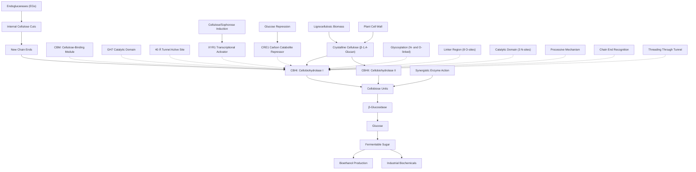

# Pathway Summary for cbh1

## Overview

cbh1 encodes cellobiohydrolase I (CBHI), the most abundantly secreted cellulase in Trichoderma reesei, comprising approximately 50% of total secreted protein during growth on cellulose [file:HYPJE/cbh1/cbh1-deep-research.md]. This processive exoglucanase belongs to glycoside hydrolase family 7 (GH7) and specifically hydrolyzes crystalline cellulose from chain ends, releasing cellobiose units through its unique tunnel-shaped active site [PMID:8036495, file:HYPJE/cbh1/cbh1-deep-research.md]. CBHI is essential for fungal growth on crystalline cellulose substrates and represents a cornerstone enzyme in industrial lignocellulose bioconversion processes.

## Cellulose Degradation Pathway

CBHI functions as part of a coordinated multi-enzyme cellulase system that synergistically degrades crystalline cellulose to fermentable sugars [file:HYPJE/cbh1/cbh1-deep-research.md]. The enzyme processively hydrolyzes β-1,4-glucosidic linkages in cellulose chains, threading individual cellulose chains through its 40 Å long tunnel-shaped active site to release cellobiose units from chain ends [PMID:8036495]. This processive mechanism distinguishes CBHI from endoglucanases that create random internal cuts, enabling efficient degradation of highly ordered crystalline cellulose structures that are resistant to non-processive hydrolysis.

## Modular Architecture and Substrate Recognition

CBHI contains a modular architecture consisting of a GH7 catalytic domain connected via a heavily glycosylated linker to a family 1 carbohydrate-binding module (CBM) [PMID:2554967, PMID:9041630]. The catalytic domain houses the tunnel-shaped active site responsible for processivity, while the CBM specifically binds to insoluble cellulose fibers through aromatic residues on its flat binding face [PMID:9041630]. This dual-domain structure enables both high-affinity substrate binding and processive catalysis, optimizing the enzyme for crystalline cellulose degradation [PMID:2554967].

## Glycosylation and Enzyme Stability

CBHI undergoes extensive post-translational modification through N- and O-linked glycosylation that affects its stability, secretion, and activity [PMID:9746354]. The catalytic core contains three N-glycosylation sites, each modified with single N-acetylglucosamine residues, while the linker region contains eight O-glycosylation sites variably modified with one to three mannose residues per site [PMID:9746354]. This glycosylation pattern contributes to enzyme stability under industrial conditions and may influence substrate accessibility and enzyme-substrate interactions during cellulose hydrolysis.

## Transcriptional Regulation and Induction

CBHI expression is tightly regulated by carbon source availability and involves multiple transcriptional control mechanisms [file:HYPJE/cbh1/cbh1-deep-research.md]. The positive regulator XYR1 activates CBHI expression in response to cellulose and inducing compounds like sophorose, while the carbon catabolite repressor CRE1 suppresses expression in the presence of preferred carbon sources like glucose [file:HYPJE/cbh1/cbh1-deep-research.md]. This regulatory network ensures that expensive cellulase production occurs only when cellulosic substrates are available and preferred carbon sources are depleted.

## Industrial Enzyme System Integration

In industrial applications, CBHI works synergistically with other cellulases including endoglucanases (EGs), cellobiohydrolase II (CBHII), and β-glucosidases to achieve complete cellulose saccharification [file:HYPJE/cbh1/cbh1-deep-research.md]. Endoglucanases create internal cuts that generate new chain ends for CBHI and CBHII attack, while β-glucosidases cleave the cellobiose product to glucose, preventing product inhibition. The coordinated action of these enzymes results in synergistic cellulose degradation that exceeds the sum of individual enzyme activities.

## Cellulose Bioconversion Pathway Diagram

## Processivity and Catalytic Mechanism

The processive mechanism of CBHI involves initial binding of the CBM to the cellulose surface, followed by threading of a single cellulose chain into the tunnel-shaped active site [PMID:8036495, file:HYPJE/cbh1/cbh1-deep-research.md]. Once engaged, the enzyme moves along the cellulose chain without dissociating, sequentially cleaving β-1,4-glucosidic bonds to release cellobiose units. This processivity is crucial for efficient degradation of crystalline cellulose, as it allows the enzyme to overcome the high binding energy of cellulose chains within the crystal structure and achieve multiple catalytic turnovers per binding event.

## Environmental Role and Ecological Function

In natural environments, CBHI enables T. reesei to colonize and decompose lignocellulosic plant material, playing a crucial role in carbon cycling and ecosystem function [file:HYPJE/cbh1/cbh1-deep-research.md]. The enzyme's ability to degrade crystalline cellulose allows the fungus to access this abundant carbon source, supporting growth and reproduction in forest environments where cellulosic debris is prevalent. This ecological role has made T. reesei an important model organism for understanding lignocellulose degradation and has driven its development as an industrial enzyme production platform.

## Biotechnological Applications and Engineering

CBHI represents one of the most important industrial enzymes for lignocellulosic biomass conversion, with applications ranging from biofuel production to textile processing [file:HYPJE/cbh1/cbh1-deep-research.md]. Protein engineering efforts have focused on improving enzyme stability, activity, and substrate specificity for various industrial applications. Understanding the structure-function relationships of CBHI, particularly the role of the tunnel active site and CBM interactions, has informed rational design strategies for creating improved enzyme variants with enhanced performance under industrial conditions.

## Economic and Sustainability Impact

The development of efficient CBHI-based enzyme systems is crucial for the economic viability of lignocellulosic biofuel production and the transition toward sustainable bioeconomy applications. By enabling the conversion of abundant plant biomass waste into valuable products, CBHI contributes to reducing dependence on fossil fuels and promoting circular economy principles. The continued optimization of CBHI production strains, enzyme formulations, and process conditions remains a key research and development priority for advancing sustainable biotechnology applications.