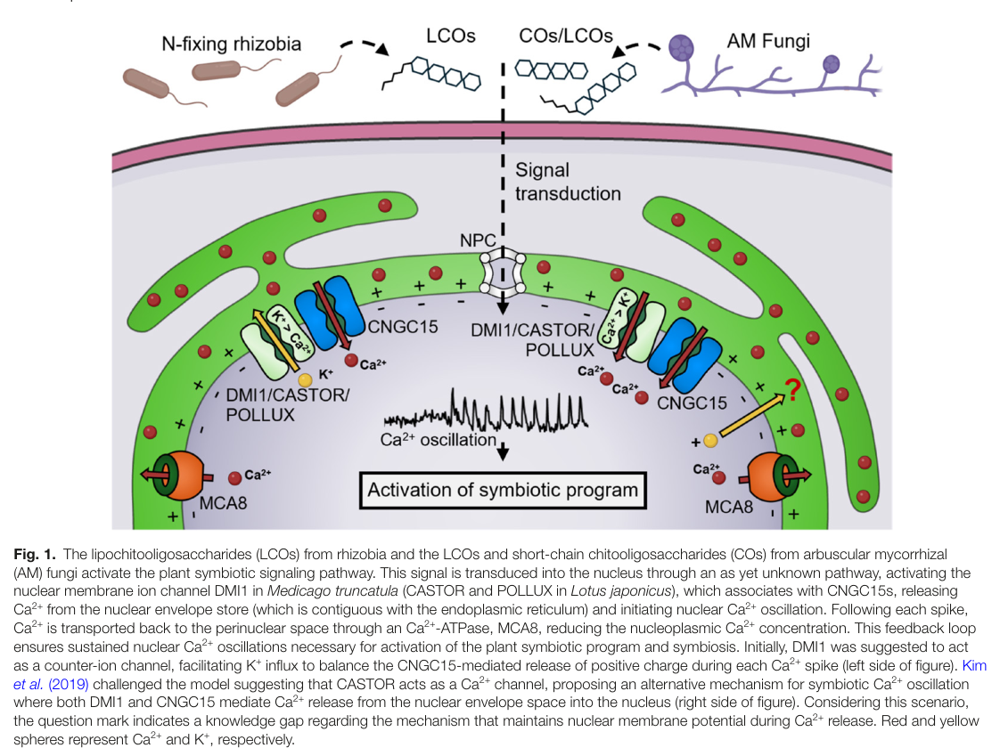

## Question

# Gene Research for Functional Annotation

## ⚠️ CRITICAL: Gene/Protein Identification Context

**BEFORE YOU BEGIN RESEARCH:** You MUST verify you are researching the CORRECT gene/protein. Gene symbols can be ambiguous, especially for less well-characterized genes from non-model organisms.

### Target Gene/Protein Identity (from UniProt):
- **UniProt Accession:** Q5H8A6
- **Protein Description:** RecName: Full=Ion channel CASTOR;
- **Gene Information:** Name=CASTOR;
- **Organism (full):** Lotus japonicus (Lotus corniculatus var. japonicus).
- **Protein Family:** Belongs to the castor/pollux (TC 1.A.1.23) family.
- **Key Domains:** CASTOR/POLLUX/SYM8-like. (IPR044849); CASTOR/POLLUX/SYM8_dom. (IPR010420); RCK_N. (IPR003148); Castor_Poll_mid (PF06241)

### MANDATORY VERIFICATION STEPS:

1. **Check if the gene symbol "CASTOR" matches the protein description above**
2. **Verify the organism is correct:** Lotus japonicus (Lotus corniculatus var. japonicus).
3. **Check if protein family/domains align with what you find in literature**
4. **If you find literature for a DIFFERENT gene with the same or similar symbol, STOP**

### If Gene Symbol is Ambiguous or You Cannot Find Relevant Literature:

**DO NOT PROCEED WITH RESEARCH ON A DIFFERENT GENE.** Instead:
- State clearly: "The gene symbol 'CASTOR' is ambiguous or literature is limited for this specific protein"
- Explain what you found (e.g., "Found extensive literature on a different gene with the same symbol in a different organism")
- Describe the protein based ONLY on the UniProt information provided above
- Suggest that the protein function can be inferred from domain/family information

### Research Target:

Please provide a comprehensive research report on the gene **CASTOR** (gene ID: CASTOR, UniProt: Q5H8A6) in LOTJA.

The research report should be a detailed narrative explaining the function, biological processes, and localization of the gene product. Citations should be given for all claims.

You should prioritize authoritative reviews and primary scientific literature when conducting research. You can supplement
this with annotations you find in gene/protein databases, but these can be outdated or inaccurate.

We are specifically interested in the primary function of the gene - for enzymes, what reaction is catalyzed, and what is the substrate specificity? For transporters, what is the substrate? For structural proteins or adapters, what is the broader structural role? For signaling molecules, what is the role in the pathway.

We are interested in where in or outside the cell the gene product carries out its function.

We are also interested in the signaling or biochemical pathways in which the gene functions. We are less interested in broad pleiotropic effects, except where these elucidate the precise role.

Include evidence where possible. We are interested in both experimental evidence as well as inference from structure, evolution, or bioinformatic analysis. Precise studies should be prioritized over high-throughput, where available.

## Output

Question: You are an expert researcher providing comprehensive, well-cited information.

Provide detailed information focusing on:
1. Key concepts and definitions with current understanding
2. Recent developments and latest research (prioritize 2023-2024 sources)
3. Current applications and real-world implementations
4. Expert opinions and analysis from authoritative sources
5. Relevant statistics and data from recent studies

Format as a comprehensive research report with proper citations. Include URLs and publication dates where available.
Always prioritize recent, authoritative sources and provide specific citations for all major claims.

# Gene Research for Functional Annotation

## ⚠️ CRITICAL: Gene/Protein Identification Context

**BEFORE YOU BEGIN RESEARCH:** You MUST verify you are researching the CORRECT gene/protein. Gene symbols can be ambiguous, especially for less well-characterized genes from non-model organisms.

### Target Gene/Protein Identity (from UniProt):
- **UniProt Accession:** Q5H8A6
- **Protein Description:** RecName: Full=Ion channel CASTOR;
- **Gene Information:** Name=CASTOR;
- **Organism (full):** Lotus japonicus (Lotus corniculatus var. japonicus).
- **Protein Family:** Belongs to the castor/pollux (TC 1.A.1.23) family.
- **Key Domains:** CASTOR/POLLUX/SYM8-like. (IPR044849); CASTOR/POLLUX/SYM8_dom. (IPR010420); RCK_N. (IPR003148); Castor_Poll_mid (PF06241)

### MANDATORY VERIFICATION STEPS:

1. **Check if the gene symbol "CASTOR" matches the protein description above**
2. **Verify the organism is correct:** Lotus japonicus (Lotus corniculatus var. japonicus).
3. **Check if protein family/domains align with what you find in literature**
4. **If you find literature for a DIFFERENT gene with the same or similar symbol, STOP**

### If Gene Symbol is Ambiguous or You Cannot Find Relevant Literature:

**DO NOT PROCEED WITH RESEARCH ON A DIFFERENT GENE.** Instead:
- State clearly: "The gene symbol 'CASTOR' is ambiguous or literature is limited for this specific protein"
- Explain what you found (e.g., "Found extensive literature on a different gene with the same symbol in a different organism")
- Describe the protein based ONLY on the UniProt information provided above
- Suggest that the protein function can be inferred from domain/family information

### Research Target:

Please provide a comprehensive research report on the gene **CASTOR** (gene ID: CASTOR, UniProt: Q5H8A6) in LOTJA.

The research report should be a detailed narrative explaining the function, biological processes, and localization of the gene product. Citations should be given for all claims.

You should prioritize authoritative reviews and primary scientific literature when conducting research. You can supplement
this with annotations you find in gene/protein databases, but these can be outdated or inaccurate.

We are specifically interested in the primary function of the gene - for enzymes, what reaction is catalyzed, and what is the substrate specificity? For transporters, what is the substrate? For structural proteins or adapters, what is the broader structural role? For signaling molecules, what is the role in the pathway.

We are interested in where in or outside the cell the gene product carries out its function.

We are also interested in the signaling or biochemical pathways in which the gene functions. We are less interested in broad pleiotropic effects, except where these elucidate the precise role.

Include evidence where possible. We are interested in both experimental evidence as well as inference from structure, evolution, or bioinformatic analysis. Precise studies should be prioritized over high-throughput, where available.

# Functional annotation report: *Lotus japonicus* CASTOR (UniProt Q5H8A6)

## Identity and principal conclusion

**Identity check.** The supplied UniProt accession Q5H8A6 denotes the ion channel **CASTOR** of *Lotus japonicus* (*Lotus corniculatus* var. *japonicus*), not the distinct Lotus channel POLLUX or a similarly named animal protein. Primary studies explicitly identify and experimentally investigate *L. japonicus* CASTOR; its pore-forming architecture and RCK regulatory domains agree with the supplied CASTOR/POLLUX/SYM8-family annotation. The papers examined generally use the gene name rather than printing Q5H8A6, so the accession-to-sequence correspondence rests on the UniProt identity supplied in the question. Medicago DMI1 is a related channel, described more specifically as a putative **POLLUX** ortholog; its experiments should not automatically be assigned to CASTOR. [UniProt: https://www.uniprot.org/uniprotkb/Q5H8A6/entry] (kim2019ca2+regulatedca2+channels pages 1-2, charpentier2008lotusjaponicuscastor pages 2-3, venkateshwaran2012therecentevolution pages 1-2)

**Best-supported function.** CASTOR is a **nuclear-envelope cation channel required to generate symbiosis-induced nuclear/perinuclear Ca²⁺ oscillations** in Lotus roots. It is part of the signaling machinery used during both rhizobial root-nodule and arbuscular-mycorrhizal symbiosis. It is not an enzyme: the relevant biochemical activity is regulated ion permeation, not catalysis. **Which ion constitutes its dominant current in the native nuclear envelope—K⁺ as a charge-balancing counter-ion, Ca²⁺ released from the perinuclear store, or both—remains unresolved.** This distinction is important because measurements on reconstituted full-length CASTOR and on a retargeted, truncated construct produced different selectivity estimates. (charpentier2008lotusjaponicuscastor pages 1-2, kim2019ca2+regulatedca2+channels pages 2-3, jacott2024cngc15anddmi1 pages 2-3, jacott2024cngc15anddmi1 pages 3-4)

## Cellular location and molecular mechanism

The strongest *native-protein* localization experiment used anti-CASTOR immunogold electron microscopy in Lotus roots. Label accumulated at the **nuclear envelope** in wild type but not in the premature-stop *castor-12* control; this experiment could not resolve the inner versus outer nuclear membrane. Earlier fluorescent-fusion experiments sometimes indicated plastids, but their localization depended on expression and heterologous-cell context, while native plastid labeling was nonspecific. Nuclear-envelope localization is consequently the best-supported assignment for the protein’s symbiotic function; a native plastid function is not established by those fusion observations. The perinuclear compartment between nuclear membranes is continuous with the endoplasmic-reticulum lumen and supplies Ca²⁺ for nuclear oscillations. (charpentier2008lotusjaponicuscastor pages 3-5, charpentier2008lotusjaponicuscastor pages 8-9, jacott2024cngc15anddmi1 pages 1-2)

CASTOR has a membrane pore and a large soluble regulatory region containing **two tandem RCK domains per subunit**. Structural analysis of that soluble region found a **tetrameric gating ring comprising eight RCK domains** and multiple ion-binding sites, including three assigned Ca²⁺ sites. Ca²⁺-binding residues include D442 in one cluster and E493 in another. Mutating CASTOR D442 to alanine, or E493 to alanine or glutamine, prevented restoration of rhizobial nodulation in *castor* plants, whereas D444A retained nodulation; the differing phenotypes caution against treating every ion-coordinating residue as equivalent. A pore-region substitution, D265N, eliminated measured channel activity. These results connect channel structure and Ca²⁺-responsive regulation to biological function, but do not alone identify the dominant ion transported *in vivo*. (kim2019ca2+regulatedca2+channels pages 1-2, kim2019ca2+regulatedca2+channels pages 5-6, kim2019ca2+regulatedca2+channels pages 9-10, kim2019ca2+regulatedca2+channels pages 8-9)

The following comparison keeps the direct measurements separate from their physiological interpretation.

| Question | Direct observation and conditions | Inference / qualification | Source |
|---|---|---|---|
| Where is native CASTOR localized? | Anti-CASTOR immunogold labeling accumulated at the nuclear envelope in wild-type *Lotus japonicus* roots but not in the **castor-12** W93* control; plastid labeling was nonspecific. The preparation could not distinguish the inner from the outer nuclear membrane. | Strong evidence for native nuclear-envelope localization. Earlier plastid patterns from overexpressed fluorescent fusions in heterologous cells were context-dependent and do not override the endogenous-protein result. | Charpentier et al., Dec. 2008, DOI: [10.1105/tpc.108.063255](https://doi.org/10.1105/tpc.108.063255) (charpentier2008lotusjaponicuscastor pages 8-9, charpentier2008lotusjaponicuscastor pages 3-5) |
| What did purified full-length CASTOR conduct? | CASTOR reconstituted into planar lipid bilayers had **260 pS** conductance in symmetrical **250 mM KCl** and weak cation preference: **PK/PCl approximately 6**, **PK/PNa = 2**, and **PK/PCa = 1.4**. Mg2+ produced voltage-dependent block at negative potentials. | Under these artificial high-salt conditions, CASTOR was permeable to K+, Na+, and Ca2+, with a modest preference for K+. The authors favored K+ as the physiological substrate because of cellular ion concentrations, but direct Ca2+ conduction remained possible. The **260-pS** result must not be conflated with the approximately **175-pS** result obtained under different conditions in 2012. | Charpentier et al., Dec. 2008, DOI: [10.1105/tpc.108.063255](https://doi.org/10.1105/tpc.108.063255) (charpentier2008lotusjaponicuscastor pages 6-8, charpentier2008lotusjaponicuscastor pages 3-5) |
| What did later patch-clamp, structural, and genetic experiments show? | A plasma-membrane-targeted, truncated **CASTOR-2TM** construct in HEK293 cells showed **PCa/PNa approximately 30**, **PNa/PK approximately 2**, and about **220 pS** conductance in symmetrical 150 mM Na+. Cytosolic Ca2+ enhanced opening up to approximately 100 micromolar and inhibited it at higher concentrations. A 1.6-angstrom structure revealed a tetrameric ring of eight RCK domains. In *Lotus*, **D442A**, **E493A**, and **E493Q** substitutions at implicated Ca2+-binding sites failed to restore nodulation, whereas D444A retained function. | Supports a Ca2+-selective, Ca2+-regulated channel mechanism and establishes that particular RCK ion-binding residues are physiologically important. However, selectivity was measured using an incomplete, retargeted construct outside the nuclear envelope; it does not identify the dominant current through native full-length CASTOR in planta. | Kim et al., Aug. 2019, DOI: [10.1038/s41467-019-11698-5](https://doi.org/10.1038/s41467-019-11698-5) (kim2019ca2+regulatedca2+channels pages 1-2, kim2019ca2+regulatedca2+channels pages 2-3, kim2019ca2+regulatedca2+channels pages 3-4, kim2019ca2+regulatedca2+channels pages 8-9, jacott2024cngc15anddmi1 pages 1-2) |
| Is CASTOR required in planta, and what is the current model? | After treatment with 10 nM Nod factor, nuclear or perinuclear Ca2+ spiking occurred in **22 of 28** wild-type root hairs but in **0 of 23 castor-2** cells. A 2024 expert review retained two models: CASTOR and POLLUX act as K+ counter-ion channels supporting CNGC15-mediated Ca2+ release, or they contribute directly to Ca2+ release alongside CNGC15. MCA8 recaptures Ca2+ in both models. | CASTOR is unequivocally required for symbiotic Ca2+ oscillations, but the native channel's dominant physiological ion remains unresolved. Current evidence identifies CNGC15 as indispensable for Ca2+ release and often assigns the DMI1/CASTOR family a counter-ion role, without excluding CASTOR Ca2+ permeability. | Charpentier et al., Dec. 2008, DOI: [10.1105/tpc.108.063255](https://doi.org/10.1105/tpc.108.063255); Jacott and del Cerro, Sept. 2024, DOI: [10.1093/jxb/erae352](https://doi.org/10.1093/jxb/erae352) (charpentier2008lotusjaponicuscastor pages 6-8, jacott2024cngc15anddmi1 pages 2-3, jacott2024cngc15anddmi1 pages 3-4, jacott2024cngc15anddmi1 media 0d9a3850) |

*Table: Comparison of the principal localization, electrophysiological, structural, genetic, and current-model evidence for Lotus japonicus CASTOR Q5H8A6. The table separates direct observations from physiological interpretations and highlights the unresolved identity of its dominant native current.*

In particular, the **2008 planar-bilayer measurements** on reconstituted CASTOR gave approximately **260 pS** conductance in symmetrical 250 mM KCl and permeability ratios of approximately **Pₖ/PCl = 6**, **Pₖ/PNa = 2**, and **Pₖ/PCa = 1.4**. The authors inferred that abundant cellular K⁺ might make K⁺ the more likely physiological permeant ion; they did not exclude direct Ca²⁺ release. The symbiosis-defective *castor-2* A264T pore-region allele lost the wild-type voltage-dependent Mg²⁺ block, linking altered conductance regulation to the genetic phenotype. (charpentier2008lotusjaponicuscastor pages 6-8, charpentier2008lotusjaponicuscastor pages 3-5)

A **2019** study instead measured approximately **P_Ca/P_Na = 30** and **P_Na/P_K = 2** using a plasma-membrane-targeted **CASTOR-2TM construct** in heterologous-cell patches. Ca²⁺ applied to the intracellular face increased opening up to roughly **100 µM**, with inhibition at higher concentrations. This is strong evidence that the tested CASTOR pore can conduct Ca²⁺ selectively and that its RCK apparatus responds to Ca²⁺. It is not a direct measurement of the complete protein operating in its native nuclear membrane, under native ionic gradients and with its signaling partners. The two studies therefore should not be combined into a single definitive *in-planta* substrate-specificity value. (kim2019ca2+regulatedca2+channels pages 2-3, kim2019ca2+regulatedca2+channels pages 1-2, jacott2024cngc15anddmi1 pages 1-2)

## Role in the common symbiosis signaling pathway

Rhizobial Nod factors and fungal symbiotic signals initiate a **common symbiosis signaling pathway** in which nuclear/perinuclear Ca²⁺ spikes convey information to downstream Ca²⁺/calmodulin-dependent protein kinase **CCaMK**, followed by regulators including **CYCLOPS** and symbiosis-associated gene expression. CASTOR acts **at the nuclear-envelope oscillation-generating step, upstream of Ca²⁺ decoding**, not as a Nod-factor receptor or a transcription factor. In a Lotus experiment using 10 nM Nod factor, spikes occurred in **22/28 wild-type root hairs versus 0/23 *castor-2* root hairs**; *castor* and *pollux* mutants also show defects in bacterial and fungal symbioses while retaining the distinct initial root-hair-tip Ca²⁺ influx. These observations localize CASTOR’s requirement to the nuclear signaling response rather than initial surface Ca²⁺ entry. (jacott2024cngc15anddmi1 pages 1-1, liu2022signalinganddetoxification pages 4-6, charpentier2008lotusjaponicuscastor pages 6-8, charpentier2008lotusjaponicuscastor pages 1-2)

CASTOR and POLLUX assemble predominantly as **separate homocomplexes**. They are normally both needed for Lotus symbiotic signaling, although POLLUX overexpression can rescue a *castor* nodulation defect. Their relationship is therefore neither simple identity nor an absolute inability to substitute for one another. A **2012** cross-species study found that the Lotus channels carry a serine-containing pore-filter motif, whereas Medicago DMI1 carries an alanine-containing counterpart. Introducing **S266A** into CASTOR reduced conductance from approximately **175 to 61 pS** under that study’s measurement conditions, approaching DMI1’s approximately **64 pS**; corresponding open times were approximately **4, 59, and 16 ms** for wild-type CASTOR, CASTOR-S266A, and DMI1, respectively. Nevertheless, CASTOR-S266A did **not** by itself acquire DMI1’s full cross-species complementation capacity. Thus filter evolution changes biophysics without making CASTOR interchangeable with DMI1. The approximately 175-pS value and the 2008 260-pS value come from different experimental preparations or conditions and should not be treated as conflicting measurements under identical conditions. (charpentier2008lotusjaponicuscastor pages 2-3, charpentier2008lotusjaponicuscastor pages 6-8, venkateshwaran2012therecentevolution pages 9-11, venkateshwaran2012therecentevolution pages 2-3)

**Working models and expert assessment.** In one model, nuclear-envelope CNGC15 conducts Ca²⁺ from the perinuclear store toward the nucleoplasm, while CASTOR/POLLUX-family channels carry charge-balancing K⁺; the Ca²⁺-ATPase MCA8 returns Ca²⁺ to the store. In the alternative prompted by the CASTOR patch-clamp results, CASTOR-family channels **also conduct Ca²⁺** during release. The models, juxtaposed in Figure 1 of a **2024** expert review, agree on CASTOR-family involvement but differ on its physiological current. The reviewers favor the counter-ion/CNGC15-release assignment as a working explanation, **without claiming that CASTOR cannot conduct Ca²⁺**. Medicago gain-of-function DMI1-S760N requires functional CNGC15 for sustained spontaneous oscillations, strengthening the case that CNGC15 is indispensable; because this is an experiment on **Medicago DMI1**, it does not directly settle Lotus CASTOR selectivity. (jacott2024cngc15anddmi1 media 0d9a3850, jacott2024cngc15anddmi1 pages 2-3, jacott2024cngc15anddmi1 pages 3-4)

## Recent research and applications

The principal **2023–2024 advance** for this annotation is clarification of the **limits of extrapolation**. A 2024 synthesis discusses AM-induced nuclear Ca²⁺ oscillations requiring DMI1 in the liverwort *Marchantia paleacea*, supporting an evolutionarily old channel-associated symbiosis mechanism, while cross-species complementation reveals differences in channel regulation. It also discusses 2023 work on Arabidopsis CNGC15 in root development and nitrate responses. Neither finding demonstrates a nitrate-related function for **Lotus CASTOR** or establishes that liverwort DMI1 has CASTOR’s precise selectivity. No more recent Lotus-CASTOR-specific assay in the evidence reviewed resolves its native permeant ion. (jacott2024cngc15anddmi1 pages 4-5, jacott2024cngc15anddmi1 pages 5-6, jacott2024cngc15anddmi1 pages 3-4)

Applications are presently better described as **pathway engineering** than deployment of CASTOR itself. In **2022**, engineered calmodulin CaM2-R91A altered CNGC15 feedback in *Medicago*, increased nuclear-spike frequency and improved nodulation; early AM colonization increased, but enhanced mature mycorrhization was not sustained. A **2025** study extended manipulation of a **different channel, CNGC15**, to field-grown wheat and reported increased AM colonization and nutrient-related outcomes. These are demonstrations that tuning symbiotic Ca²⁺ signaling may have agricultural utility, **not evidence that Q5H8A6 CASTOR has been engineered or deployed in crops**. (cerro2022engineeredcam2modulates pages 5-6, cerro2022engineeredcam2modulates pages 1-2, cook2025autoactivecngc15enhances pages 5-5, cook2025autoactivecngc15enhances pages 1-2)

**Functional-annotation recommendation:** annotate Q5H8A6 as a *Lotus japonicus* **nuclear-envelope, Ca²⁺-regulated cation channel essential for symbiotic nuclear Ca²⁺ oscillations and establishment of rhizobial and arbuscular-mycorrhizal associations**. Record **Ca²⁺ and K⁺ permeability experimentally**, but mark the **dominant physiological permeant ion and exact division of labor with CNGC15/POLLUX as unresolved**. This wording captures direct genetic, localization, structural and electrophysiological evidence without converting either competing mechanistic model into an established fact. (charpentier2008lotusjaponicuscastor pages 3-5, charpentier2008lotusjaponicuscastor pages 6-8, kim2019ca2+regulatedca2+channels pages 2-3, kim2019ca2+regulatedca2+channels pages 8-9, jacott2024cngc15anddmi1 pages 3-4)

### Key sources and publication dates

- Charpentier et al., *The Plant Cell*, **December 2008**. [https://doi.org/10.1105/tpc.108.063255](https://doi.org/10.1105/tpc.108.063255). Native localization, mutant phenotype and bilayer recordings. (charpentier2008lotusjaponicuscastor pages 3-5, charpentier2008lotusjaponicuscastor pages 6-8)
- Venkateshwaran et al., *The Plant Cell*, **June 2012**. [https://doi.org/10.1105/tpc.112.098475](https://doi.org/10.1105/tpc.112.098475). Filter evolution, channel biophysics and complementation. (venkateshwaran2012therecentevolution pages 9-11, venkateshwaran2012therecentevolution pages 1-2)
- Charpentier et al., *Science*, **May 2016**. [https://doi.org/10.1126/science.aae0109](https://doi.org/10.1126/science.aae0109). Nuclear CNGC15 channels in symbiotic Ca²⁺ oscillations. (charpentier2016nuclearlocalizedcyclicnucleotide–gated pages 6-10)
- Kim et al., *Nature Communications*, **August 2019**. [https://doi.org/10.1038/s41467-019-11698-5](https://doi.org/10.1038/s41467-019-11698-5). CASTOR structure, Ca²⁺-regulated selectivity and site-directed functional tests. (kim2019ca2+regulatedca2+channels pages 2-3, kim2019ca2+regulatedca2+channels pages 8-9)
- Jacott and del Cerro, *Journal of Experimental Botany*, **September 2024**. [https://doi.org/10.1093/jxb/erae352](https://doi.org/10.1093/jxb/erae352). Expert appraisal of unresolved DMI1/CASTOR-family versus CNGC15 roles. (jacott2024cngc15anddmi1 pages 1-2, jacott2024cngc15anddmi1 pages 3-4, jacott2024cngc15anddmi1 media 0d9a3850)
- Cook et al., *Nature*, **January 2025**. [https://doi.org/10.1038/s41586-024-08424-7](https://doi.org/10.1038/s41586-024-08424-7). Related-channel agricultural proof of concept, **not CASTOR engineering**. (cook2025autoactivecngc15enhances pages 5-5, cook2025autoactivecngc15enhances pages 1-2)

References

1. (kim2019ca2+regulatedca2+channels pages 1-2): Sunghoon Kim, Weizhong Zeng, Shane Bernard, Jun Liao, Muthusubramanian Venkateshwaran, Jean-Michel Ane, and Youxing Jiang. Ca2+-regulated ca2+ channels with an rck gating ring control plant symbiotic associations. Nature Communications, Aug 2019. URL: https://doi.org/10.1038/s41467-019-11698-5, doi:10.1038/s41467-019-11698-5. This article has 73 citations and is from a highest quality peer-reviewed journal.

2. (charpentier2008lotusjaponicuscastor pages 2-3): M. Charpentier, R. Bredemeier, G. Wanner, Naoya Takeda, E. Schleiff, and M. Parniske. Lotus japonicus castor and pollux are ion channels essential for perinuclear calcium spiking in legume root endosymbiosis[w]. The Plant Cell Online, 20:3467-3479, Dec 2008. URL: https://doi.org/10.1105/tpc.108.063255, doi:10.1105/tpc.108.063255. This article has 338 citations.

3. (venkateshwaran2012therecentevolution pages 1-2): Muthusubramanian Venkateshwaran, Ana Cosme, Lu Han, Mari Banba, Kenneth A. Satyshur, Enrico Schleiff, Martin Parniske, Haruko Imaizumi-Anraku, and Jean-Michel Ané. The recent evolution of a symbiotic ion channel in the legume family altered ion conductance and improved functionality in calcium signaling. Jun 2012. URL: https://doi.org/10.1105/tpc.112.098475, doi:10.1105/tpc.112.098475. This article has 61 citations.

4. (charpentier2008lotusjaponicuscastor pages 1-2): M. Charpentier, R. Bredemeier, G. Wanner, Naoya Takeda, E. Schleiff, and M. Parniske. Lotus japonicus castor and pollux are ion channels essential for perinuclear calcium spiking in legume root endosymbiosis[w]. The Plant Cell Online, 20:3467-3479, Dec 2008. URL: https://doi.org/10.1105/tpc.108.063255, doi:10.1105/tpc.108.063255. This article has 338 citations.

5. (kim2019ca2+regulatedca2+channels pages 2-3): Sunghoon Kim, Weizhong Zeng, Shane Bernard, Jun Liao, Muthusubramanian Venkateshwaran, Jean-Michel Ane, and Youxing Jiang. Ca2+-regulated ca2+ channels with an rck gating ring control plant symbiotic associations. Nature Communications, Aug 2019. URL: https://doi.org/10.1038/s41467-019-11698-5, doi:10.1038/s41467-019-11698-5. This article has 73 citations and is from a highest quality peer-reviewed journal.

6. (jacott2024cngc15anddmi1 pages 2-3): Catherine N. Jacott and Pablo del Cerro. Cngc15 and dmi1 ion channel gating in nuclear calcium signaling: opening new questions and closing controversies. Sep 2024. URL: https://doi.org/10.1093/jxb/erae352, doi:10.1093/jxb/erae352. This article has 6 citations and is from a domain leading peer-reviewed journal.

7. (jacott2024cngc15anddmi1 pages 3-4): Catherine N. Jacott and Pablo del Cerro. Cngc15 and dmi1 ion channel gating in nuclear calcium signaling: opening new questions and closing controversies. Sep 2024. URL: https://doi.org/10.1093/jxb/erae352, doi:10.1093/jxb/erae352. This article has 6 citations and is from a domain leading peer-reviewed journal.

8. (charpentier2008lotusjaponicuscastor pages 3-5): M. Charpentier, R. Bredemeier, G. Wanner, Naoya Takeda, E. Schleiff, and M. Parniske. Lotus japonicus castor and pollux are ion channels essential for perinuclear calcium spiking in legume root endosymbiosis[w]. The Plant Cell Online, 20:3467-3479, Dec 2008. URL: https://doi.org/10.1105/tpc.108.063255, doi:10.1105/tpc.108.063255. This article has 338 citations.

9. (charpentier2008lotusjaponicuscastor pages 8-9): M. Charpentier, R. Bredemeier, G. Wanner, Naoya Takeda, E. Schleiff, and M. Parniske. Lotus japonicus castor and pollux are ion channels essential for perinuclear calcium spiking in legume root endosymbiosis[w]. The Plant Cell Online, 20:3467-3479, Dec 2008. URL: https://doi.org/10.1105/tpc.108.063255, doi:10.1105/tpc.108.063255. This article has 338 citations.

10. (jacott2024cngc15anddmi1 pages 1-2): Catherine N. Jacott and Pablo del Cerro. Cngc15 and dmi1 ion channel gating in nuclear calcium signaling: opening new questions and closing controversies. Sep 2024. URL: https://doi.org/10.1093/jxb/erae352, doi:10.1093/jxb/erae352. This article has 6 citations and is from a domain leading peer-reviewed journal.

11. (kim2019ca2+regulatedca2+channels pages 5-6): Sunghoon Kim, Weizhong Zeng, Shane Bernard, Jun Liao, Muthusubramanian Venkateshwaran, Jean-Michel Ane, and Youxing Jiang. Ca2+-regulated ca2+ channels with an rck gating ring control plant symbiotic associations. Nature Communications, Aug 2019. URL: https://doi.org/10.1038/s41467-019-11698-5, doi:10.1038/s41467-019-11698-5. This article has 73 citations and is from a highest quality peer-reviewed journal.

12. (kim2019ca2+regulatedca2+channels pages 9-10): Sunghoon Kim, Weizhong Zeng, Shane Bernard, Jun Liao, Muthusubramanian Venkateshwaran, Jean-Michel Ane, and Youxing Jiang. Ca2+-regulated ca2+ channels with an rck gating ring control plant symbiotic associations. Nature Communications, Aug 2019. URL: https://doi.org/10.1038/s41467-019-11698-5, doi:10.1038/s41467-019-11698-5. This article has 73 citations and is from a highest quality peer-reviewed journal.

13. (kim2019ca2+regulatedca2+channels pages 8-9): Sunghoon Kim, Weizhong Zeng, Shane Bernard, Jun Liao, Muthusubramanian Venkateshwaran, Jean-Michel Ane, and Youxing Jiang. Ca2+-regulated ca2+ channels with an rck gating ring control plant symbiotic associations. Nature Communications, Aug 2019. URL: https://doi.org/10.1038/s41467-019-11698-5, doi:10.1038/s41467-019-11698-5. This article has 73 citations and is from a highest quality peer-reviewed journal.

14. (charpentier2008lotusjaponicuscastor pages 6-8): M. Charpentier, R. Bredemeier, G. Wanner, Naoya Takeda, E. Schleiff, and M. Parniske. Lotus japonicus castor and pollux are ion channels essential for perinuclear calcium spiking in legume root endosymbiosis[w]. The Plant Cell Online, 20:3467-3479, Dec 2008. URL: https://doi.org/10.1105/tpc.108.063255, doi:10.1105/tpc.108.063255. This article has 338 citations.

15. (kim2019ca2+regulatedca2+channels pages 3-4): Sunghoon Kim, Weizhong Zeng, Shane Bernard, Jun Liao, Muthusubramanian Venkateshwaran, Jean-Michel Ane, and Youxing Jiang. Ca2+-regulated ca2+ channels with an rck gating ring control plant symbiotic associations. Nature Communications, Aug 2019. URL: https://doi.org/10.1038/s41467-019-11698-5, doi:10.1038/s41467-019-11698-5. This article has 73 citations and is from a highest quality peer-reviewed journal.

16. (jacott2024cngc15anddmi1 media 0d9a3850): Catherine N. Jacott and Pablo del Cerro. Cngc15 and dmi1 ion channel gating in nuclear calcium signaling: opening new questions and closing controversies. Sep 2024. URL: https://doi.org/10.1093/jxb/erae352, doi:10.1093/jxb/erae352. This article has 6 citations and is from a domain leading peer-reviewed journal.

17. (jacott2024cngc15anddmi1 pages 1-1): Catherine N. Jacott and Pablo del Cerro. Cngc15 and dmi1 ion channel gating in nuclear calcium signaling: opening new questions and closing controversies. Sep 2024. URL: https://doi.org/10.1093/jxb/erae352, doi:10.1093/jxb/erae352. This article has 6 citations and is from a domain leading peer-reviewed journal.

18. (liu2022signalinganddetoxification pages 4-6): Yao Liu, Guandi He, Tengbing He, and Muhammad Saleem. Signaling and detoxification strategies in plant-microbes symbiosis under heavy metal stress: a mechanistic understanding. Microorganisms, 11:69, Dec 2022. URL: https://doi.org/10.3390/microorganisms11010069, doi:10.3390/microorganisms11010069. This article has 37 citations.

19. (venkateshwaran2012therecentevolution pages 9-11): Muthusubramanian Venkateshwaran, Ana Cosme, Lu Han, Mari Banba, Kenneth A. Satyshur, Enrico Schleiff, Martin Parniske, Haruko Imaizumi-Anraku, and Jean-Michel Ané. The recent evolution of a symbiotic ion channel in the legume family altered ion conductance and improved functionality in calcium signaling. Jun 2012. URL: https://doi.org/10.1105/tpc.112.098475, doi:10.1105/tpc.112.098475. This article has 61 citations.

20. (venkateshwaran2012therecentevolution pages 2-3): Muthusubramanian Venkateshwaran, Ana Cosme, Lu Han, Mari Banba, Kenneth A. Satyshur, Enrico Schleiff, Martin Parniske, Haruko Imaizumi-Anraku, and Jean-Michel Ané. The recent evolution of a symbiotic ion channel in the legume family altered ion conductance and improved functionality in calcium signaling. Jun 2012. URL: https://doi.org/10.1105/tpc.112.098475, doi:10.1105/tpc.112.098475. This article has 61 citations.

21. (jacott2024cngc15anddmi1 pages 4-5): Catherine N. Jacott and Pablo del Cerro. Cngc15 and dmi1 ion channel gating in nuclear calcium signaling: opening new questions and closing controversies. Sep 2024. URL: https://doi.org/10.1093/jxb/erae352, doi:10.1093/jxb/erae352. This article has 6 citations and is from a domain leading peer-reviewed journal.

22. (jacott2024cngc15anddmi1 pages 5-6): Catherine N. Jacott and Pablo del Cerro. Cngc15 and dmi1 ion channel gating in nuclear calcium signaling: opening new questions and closing controversies. Sep 2024. URL: https://doi.org/10.1093/jxb/erae352, doi:10.1093/jxb/erae352. This article has 6 citations and is from a domain leading peer-reviewed journal.

23. (cerro2022engineeredcam2modulates pages 5-6): Pablo del Cerro, Nicola M. Cook, Rik Huisman, Pierre Dangeville, Lauren E. Grubb, Clemence Marchal, Anson Ho Ching Lam, and Myriam Charpentier. Engineered cam2 modulates nuclear calcium oscillation and enhances legume root nodule symbiosis. Proceedings of the National Academy of Sciences of the United States of America, Mar 2022. URL: https://doi.org/10.1073/pnas.2200099119, doi:10.1073/pnas.2200099119. This article has 32 citations and is from a highest quality peer-reviewed journal.

24. (cerro2022engineeredcam2modulates pages 1-2): Pablo del Cerro, Nicola M. Cook, Rik Huisman, Pierre Dangeville, Lauren E. Grubb, Clemence Marchal, Anson Ho Ching Lam, and Myriam Charpentier. Engineered cam2 modulates nuclear calcium oscillation and enhances legume root nodule symbiosis. Proceedings of the National Academy of Sciences of the United States of America, Mar 2022. URL: https://doi.org/10.1073/pnas.2200099119, doi:10.1073/pnas.2200099119. This article has 32 citations and is from a highest quality peer-reviewed journal.

25. (cook2025autoactivecngc15enhances pages 5-5): Nicola M. Cook, Giulia Gobbato, Catherine N. Jacott, Clemence Marchal, Chen Yun Hsieh, Anson Ho Ching Lam, James Simmonds, Pablo del Cerro, Pilar Navarro Gomez, Clemence Rodney, Neftaly Cruz-Mireles, Cristobal Uauy, Wilfried Haerty, David M. Lawson, and Myriam Charpentier. Autoactive cngc15 enhances root endosymbiosis in legume and wheat. Nature, 638:752-759, Jan 2025. URL: https://doi.org/10.1038/s41586-024-08424-7, doi:10.1038/s41586-024-08424-7. This article has 49 citations and is from a highest quality peer-reviewed journal.

26. (cook2025autoactivecngc15enhances pages 1-2): Nicola M. Cook, Giulia Gobbato, Catherine N. Jacott, Clemence Marchal, Chen Yun Hsieh, Anson Ho Ching Lam, James Simmonds, Pablo del Cerro, Pilar Navarro Gomez, Clemence Rodney, Neftaly Cruz-Mireles, Cristobal Uauy, Wilfried Haerty, David M. Lawson, and Myriam Charpentier. Autoactive cngc15 enhances root endosymbiosis in legume and wheat. Nature, 638:752-759, Jan 2025. URL: https://doi.org/10.1038/s41586-024-08424-7, doi:10.1038/s41586-024-08424-7. This article has 49 citations and is from a highest quality peer-reviewed journal.

27. (charpentier2016nuclearlocalizedcyclicnucleotide–gated pages 6-10): Myriam Charpentier, Jongho Sun, Teresa Vaz Martins, Guru V. Radhakrishnan, Kim Findlay, Eleni Soumpourou, Julien Thouin, Anne-Aliénor Véry, Dale Sanders, Richard J. Morris, and Giles E. D. Oldroyd. Nuclear-localized cyclic nucleotide–gated channels mediate symbiotic calcium oscillations. Science, 352:1102-1105, May 2016. URL: https://doi.org/10.1126/science.aae0109, doi:10.1126/science.aae0109. This article has 387 citations and is from a highest quality peer-reviewed journal.

## Artifacts

- [Edison artifact artifact-00](CASTOR-deep-research-falcon_artifacts/artifact-00.md)

## Citations

1. charpentier2008lotusjaponicuscastor pages 2-3
2. venkateshwaran2012therecentevolution pages 1-2
3. charpentier2008lotusjaponicuscastor pages 1-2
4. charpentier2008lotusjaponicuscastor pages 3-5
5. charpentier2008lotusjaponicuscastor pages 8-9
6. charpentier2008lotusjaponicuscastor pages 6-8
7. liu2022signalinganddetoxification pages 4-6
8. venkateshwaran2012therecentevolution pages 9-11
9. venkateshwaran2012therecentevolution pages 2-3
10. UniProt: https://www.uniprot.org/uniprotkb/Q5H8A6/entry
11. 10.1105/tpc.108.063255
12. 10.1038/s41467-019-11698-5
13. 10.1093/jxb/erae352
14. https://doi.org/10.1105/tpc.108.063255
15. https://doi.org/10.1105/tpc.112.098475
16. https://doi.org/10.1126/science.aae0109
17. https://doi.org/10.1038/s41467-019-11698-5
18. https://doi.org/10.1093/jxb/erae352
19. https://doi.org/10.1038/s41586-024-08424-7
20. w
21. https://www.uniprot.org/uniprotkb/Q5H8A6/entry]
22. https://doi.org/10.1105/tpc.108.063255](https://doi.org/10.1105/tpc.108.063255
23. https://doi.org/10.1105/tpc.112.098475](https://doi.org/10.1105/tpc.112.098475
24. https://doi.org/10.1126/science.aae0109](https://doi.org/10.1126/science.aae0109
25. https://doi.org/10.1038/s41467-019-11698-5](https://doi.org/10.1038/s41467-019-11698-5
26. https://doi.org/10.1093/jxb/erae352](https://doi.org/10.1093/jxb/erae352
27. https://doi.org/10.1038/s41586-024-08424-7](https://doi.org/10.1038/s41586-024-08424-7
28. https://doi.org/10.1038/s41467-019-11698-5,
29. https://doi.org/10.1105/tpc.108.063255,
30. https://doi.org/10.1105/tpc.112.098475,
31. https://doi.org/10.1093/jxb/erae352,
32. https://doi.org/10.3390/microorganisms11010069,
33. https://doi.org/10.1073/pnas.2200099119,
34. https://doi.org/10.1038/s41586-024-08424-7,
35. https://doi.org/10.1126/science.aae0109,