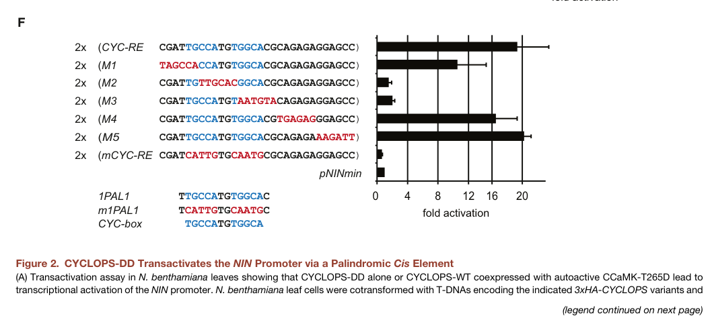

## Question

# Gene Research for Functional Annotation

## ⚠️ CRITICAL: Gene/Protein Identification Context

**BEFORE YOU BEGIN RESEARCH:** You MUST verify you are researching the CORRECT gene/protein. Gene symbols can be ambiguous, especially for less well-characterized genes from non-model organisms.

### Target Gene/Protein Identity (from UniProt):
- **UniProt Accession:** A9XMT3
- **Protein Description:** RecName: Full=Protein CYCLOPS {ECO:0000303|PubMed:19074278}; Short=LjCYCLOPS {ECO:0000303|PubMed:19074278}; AltName: Full=Protein IPD3 homolog {ECO:0000305};
- **Gene Information:** Name=CYCLOPS {ECO:0000303|PubMed:19074278}; Synonyms=IPD3 {ECO:0000305};
- **Organism (full):** Lotus japonicus (Lotus corniculatus var. japonicus).
- **Protein Family:** Belongs to the CYCLOPS family. .
- **Key Domains:** CYCLOPS. (IPR040036)

### MANDATORY VERIFICATION STEPS:

1. **Check if the gene symbol "CYCLOPS" matches the protein description above**
2. **Verify the organism is correct:** Lotus japonicus (Lotus corniculatus var. japonicus).
3. **Check if protein family/domains align with what you find in literature**
4. **If you find literature for a DIFFERENT gene with the same or similar symbol, STOP**

### If Gene Symbol is Ambiguous or You Cannot Find Relevant Literature:

**DO NOT PROCEED WITH RESEARCH ON A DIFFERENT GENE.** Instead:
- State clearly: "The gene symbol 'CYCLOPS' is ambiguous or literature is limited for this specific protein"
- Explain what you found (e.g., "Found extensive literature on a different gene with the same symbol in a different organism")
- Describe the protein based ONLY on the UniProt information provided above
- Suggest that the protein function can be inferred from domain/family information

### Research Target:

Please provide a comprehensive research report on the gene **CYCLOPS** (gene ID: CYCLOPS, UniProt: A9XMT3) in LOTJA.

The research report should be a detailed narrative explaining the function, biological processes, and localization of the gene product. Citations should be given for all claims.

You should prioritize authoritative reviews and primary scientific literature when conducting research. You can supplement
this with annotations you find in gene/protein databases, but these can be outdated or inaccurate.

We are specifically interested in the primary function of the gene - for enzymes, what reaction is catalyzed, and what is the substrate specificity? For transporters, what is the substrate? For structural proteins or adapters, what is the broader structural role? For signaling molecules, what is the role in the pathway.

We are interested in where in or outside the cell the gene product carries out its function.

We are also interested in the signaling or biochemical pathways in which the gene functions. We are less interested in broad pleiotropic effects, except where these elucidate the precise role.

Include evidence where possible. We are interested in both experimental evidence as well as inference from structure, evolution, or bioinformatic analysis. Precise studies should be prioritized over high-throughput, where available.

## Output

Question: You are an expert researcher providing comprehensive, well-cited information.

Provide detailed information focusing on:
1. Key concepts and definitions with current understanding
2. Recent developments and latest research (prioritize 2023-2024 sources)
3. Current applications and real-world implementations
4. Expert opinions and analysis from authoritative sources
5. Relevant statistics and data from recent studies

Format as a comprehensive research report with proper citations. Include URLs and publication dates where available.
Always prioritize recent, authoritative sources and provide specific citations for all major claims.

# Gene Research for Functional Annotation

## ⚠️ CRITICAL: Gene/Protein Identification Context

**BEFORE YOU BEGIN RESEARCH:** You MUST verify you are researching the CORRECT gene/protein. Gene symbols can be ambiguous, especially for less well-characterized genes from non-model organisms.

### Target Gene/Protein Identity (from UniProt):
- **UniProt Accession:** A9XMT3
- **Protein Description:** RecName: Full=Protein CYCLOPS {ECO:0000303|PubMed:19074278}; Short=LjCYCLOPS {ECO:0000303|PubMed:19074278}; AltName: Full=Protein IPD3 homolog {ECO:0000305};
- **Gene Information:** Name=CYCLOPS {ECO:0000303|PubMed:19074278}; Synonyms=IPD3 {ECO:0000305};
- **Organism (full):** Lotus japonicus (Lotus corniculatus var. japonicus).
- **Protein Family:** Belongs to the CYCLOPS family. .
- **Key Domains:** CYCLOPS. (IPR040036)

### MANDATORY VERIFICATION STEPS:

1. **Check if the gene symbol "CYCLOPS" matches the protein description above**
2. **Verify the organism is correct:** Lotus japonicus (Lotus corniculatus var. japonicus).
3. **Check if protein family/domains align with what you find in literature**
4. **If you find literature for a DIFFERENT gene with the same or similar symbol, STOP**

### If Gene Symbol is Ambiguous or You Cannot Find Relevant Literature:

**DO NOT PROCEED WITH RESEARCH ON A DIFFERENT GENE.** Instead:
- State clearly: "The gene symbol 'CYCLOPS' is ambiguous or literature is limited for this specific protein"
- Explain what you found (e.g., "Found extensive literature on a different gene with the same symbol in a different organism")
- Describe the protein based ONLY on the UniProt information provided above
- Suggest that the protein function can be inferred from domain/family information

### Research Target:

Please provide a comprehensive research report on the gene **CYCLOPS** (gene ID: CYCLOPS, UniProt: A9XMT3) in LOTJA.

The research report should be a detailed narrative explaining the function, biological processes, and localization of the gene product. Citations should be given for all claims.

You should prioritize authoritative reviews and primary scientific literature when conducting research. You can supplement
this with annotations you find in gene/protein databases, but these can be outdated or inaccurate.

We are specifically interested in the primary function of the gene - for enzymes, what reaction is catalyzed, and what is the substrate specificity? For transporters, what is the substrate? For structural proteins or adapters, what is the broader structural role? For signaling molecules, what is the role in the pathway.

We are interested in where in or outside the cell the gene product carries out its function.

We are also interested in the signaling or biochemical pathways in which the gene functions. We are less interested in broad pleiotropic effects, except where these elucidate the precise role.

Include evidence where possible. We are interested in both experimental evidence as well as inference from structure, evolution, or bioinformatic analysis. Precise studies should be prioritized over high-throughput, where available.

# Functional annotation of *Lotus japonicus* CYCLOPS (UniProt A9XMT3)

**Identity and conclusion.** The specified protein is *Lotus japonicus* CYCLOPS, also called LjCYCLOPS or IPD3. The accession **A9XMT3** and CYCLOPS-family domain **IPR040036** come from the supplied UniProt identification; the primary papers generally name the Lotus protein rather than its UniProt accession. Their descriptions of a nuclear, CCaMK-interacting CYCLOPS protein agree with that identification. *Medicago truncatula* IPD3 and other plants’ CYCLOPS proteins are homologs, **not** A9XMT3. (singh2014cyclopsadnabinding pages 1-2, vernie2024conservationofsymbiotic pages 9-12, aguirre2021thetranscriptionfactora pages 27-30)

**Primary function.** LjCYCLOPS is a **phosphorylation-regulated, sequence-specific transcriptional activator** that connects nuclear calcium signals elicited by symbiotic microorganisms to gene expression in root cells. It is neither a metabolic enzyme nor a transporter: its relevant molecular substrate is promoter DNA, and CCaMK acts *on CYCLOPS* as a protein kinase. It functions in the common symbiosis signaling pathway used by both rhizobial root-nodule symbiosis and arbuscular mycorrhiza. (singh2014cyclopsadnabinding pages 1-2, singh2014cyclopsadnabinding pages 2-3, singh2014cyclopsadnabinding pages 5-6, gong2021accamkcyclopsresponse pages 1-3)

## Molecular mechanism and site of action

Perception of rhizobial Nod factors or mycorrhizal signals leads to oscillations of calcium in root-cell nuclei. Nuclear calcium/calmodulin-dependent protein kinase **CCaMK** interacts with LjCYCLOPS and phosphorylates it, enabling CYCLOPS-dependent transcription. Fluorescently examined wild-type and phosphorylation-site mutant CYCLOPS proteins localized **exclusively to the nucleus** in the reported assays; protein-interaction measurements also detected its association with CCaMK and CYCLOPS homodimerization. The supported functional location is therefore the **plant-cell nucleus**, particularly in roots responding to symbionts—not the plasma membrane, extracellular space, fungus, or bacterium. (singh2014cyclopsadnabinding pages 1-2, singh2014cyclopsadnabinding pages 2-3, jhu2023dancingtoa pages 3-5)

In vitro kinase assays and mass spectrometry identified five CCaMK-phosphorylated serines. Functional substitutions singled out **Ser50 and Ser154**: replacing *both* with alanine impaired symbiotic function, whereas the S50D/S154D phosphomimetic, termed **CYCLOPS-DD**, activated transcription. The experiments support a model in which phosphorylation relieves inhibition by the N-terminal region, increasing DNA-binding activity; this conformational explanation remains a mechanistic interpretation rather than a directly resolved protein structure. The C-terminal portion carries transcriptional-activation activity, mapped especially to amino acids **267–380**, and sequence-specific DNA-binding activity in the **364–518** region. (singh2014cyclopsadnabinding pages 2-3, singh2014cyclopsadnabinding pages 5-6)

## Pathways, direct targets, and biological role

The most firmly established direct target is ***NODULE INCEPTION* (*NIN*)**. Promoter mutagenesis identified a 30-base-pair CYCLOPS-responsive element containing an essential palindromic **CYC-box**; binding assays showed preference for the intact sequence and for phosphorylated or phosphomimetic CYCLOPS. Reporter assays, promoter association, and measurements of endogenous *NIN* establish transcriptional activation in Lotus roots. NIN subsequently regulates *NF-YA1* and *NF-YB1*, helping initiate nodule development. The experimentally mapped CYC-box provides unusually specific evidence for this annotation. (singh2014cyclopsadnabinding pages 2-3, singh2014cyclopsadnabinding pages 3-5, singh2014cyclopsadnabinding pages 5-6, singh2014cyclopsadnabinding pages 6-7, singh2014cyclopsadnabinding media a3e9b065)

CYCLOPS also directly regulates the Lotus ***ERN1*** promoter: a CYCLOPS fragment bound its response element in a sequence-specific assay, CYCLOPS with activated CCaMK stimulated promoter activity, and *cyclops-3* roots had diminished *ERN1* expression particularly at rhizobial infection sites. This target connects nuclear signaling to **infection-thread formation**, not just nodule-organ initiation. In the mycorrhizal pathway, CYCLOPS acts with CCaMK and **DELLA** proteins to promote the AM-associated transcription factor ***RAM1***; a CYCLOPS-responsive element in the RAM1 promoter and its role in arbuscule development have been reported. These promoters do not all have identical response-element sequences or symbiosis-specific outputs. (cerri2017theern1transcription pages 8-9, pimprikar2018transcriptionalregulationof pages 9-11, jhu2023dancingtoa pages 3-5)

The Lotus ***CBP1*** promoter provides evidence of a **shared** output: a CYCLOPS-responsive regulatory region supports expression during both rhizobial and mycorrhizal symbioses. Promoter methylation suppressed reporter activity in the studied lines. Thus, promoter context and additional regulators matter when the same CCaMK–CYCLOPS module produces rhizobial-specific (*NIN*, *ERN1*), AM-associated (*RAM1*), or shared (*CBP1*) expression. That specificity is not completely explained. (gong2021accamkcyclopsresponse pages 1-3, gong2021accamkcyclopsresponse pages 20-23)

The genetic phenotype clarifies what the protein does **and does not** do. Lotus *cyclops* roots can curl root hairs in response to rhizobia and initiate nodule primordia, but infection generally aborts before successful intracellular accommodation and mature infected nodules. With AM fungi, impaired arbuscule development need not mean that fungal entry never occurred: intraradical hyphae can remain detectable. Conversely, expressing CYCLOPS-DD without rhizobia induced spontaneous nodules even in CCaMK-deficient roots; in one assay, **30–40%** of transformed plants formed nodules, averaging **2–5 nodules per nodulated plant**. These are experimental gain-of-function nodules, **not evidence of autonomous nitrogen fixation or successful bacterial infection**. (singh2014cyclopsadnabinding pages 1-2, singh2014cyclopsadnabinding pages 7-9, pimprikar2018transcriptionalregulationof pages 9-11, singh2014thecalciumsignature pages 156-160)

The evidence matrix below distinguishes direct molecular assays from phenotype and transcriptome results.

| Molecular event or direct target | Experimental basis | Biological implication | Reference (DOI; year) |
|---|---|---|---|
| **Nuclear CCaMK–CYCLOPS signaling; phosphorylation at Ser50/Ser154** | LjCYCLOPS localized exclusively to nuclei, interacted with CCaMK, and was phosphorylated by Ca²⁺/calmodulin-activated CCaMK. Mass spectrometry identified five phosphoserines; combined S50A/S154A substitution impaired symbiotic function, whereas phosphomimetic S50D/S154D activated transcription. (singh2014cyclopsadnabinding pages 1-2, singh2014cyclopsadnabinding pages 2-3) | A9XMT3 is a nuclear, phosphorylation-regulated transcriptional activator—not an enzyme or transporter. CCaMK converts symbiotic nuclear Ca²⁺ oscillations into CYCLOPS-dependent gene expression. | [10.1016/j.chom.2014.01.011](https://doi.org/10.1016/j.chom.2014.01.011); 2014 |
| **NIN promoter: palindromic CYCLOPS-response element (CYC-RE/CYC-box)** | Reporter deletion and substitution mapped a 30-bp CYC-RE containing the essential palindrome **TGCCATGTGGCA**. EMSA and in-vivo promoter association showed sequence- and phosphorylation-dependent binding; CYCLOPS-DD induced endogenous *NIN* and downstream *NF-YA1*. (singh2014cyclopsadnabinding pages 2-3, singh2014cyclopsadnabinding pages 3-5, singh2014cyclopsadnabinding pages 5-6, singh2014cyclopsadnabinding pages 6-7) | Directly initiates a transcriptional cascade controlling rhizobial infection and nodule organogenesis. The C-terminal region contains activation and DNA-binding functions; residues 364–518 mediate CYC-box binding. | [10.1016/j.chom.2014.01.011](https://doi.org/10.1016/j.chom.2014.01.011); 2014 |
| **CYCLOPS activation is sufficient for nodule initiation** | Endogenous-promoter CYCLOPS-DD caused spontaneous nodules without rhizobia in CCaMK-null and kinase-dead backgrounds: **30–40%** of transformed plants formed an average of **2–5 nodules**. Nodulation still required *NSP1*, *NSP2*, and *NIN*. (singh2014cyclopsadnabinding pages 7-9) | Phosphorylated CYCLOPS is a principal downstream effector sufficient to bypass upstream SYMRK/CCaMK signaling for organ initiation, although it does not by itself reproduce productive bacterial infection. | [10.1016/j.chom.2014.01.011](https://doi.org/10.1016/j.chom.2014.01.011); 2014 |
| **ERN1 promoter: direct CYC-RE target** | CYCLOPS-min (aa 255–518) bound the *ERN1* CYC-RE by sequence-specific EMSA; CYCLOPS plus autoactive CCaMK activated the promoter. In *cyclops-3*, *ERN1* promoter activity and transcript abundance were reduced particularly at rhizobial infection sites. (cerri2017theern1transcription pages 8-9) | Connects the CCaMK/CYCLOPS module to infection-chamber and infection-thread development, explaining why *cyclops* mutants initiate root-hair responses and nodule primordia but abort intracellular rhizobial accommodation. | [10.1111/nph.14547](https://doi.org/10.1111/nph.14547); 2017 |
| **RAM1 promoter in arbuscular mycorrhiza; DELLA-dependent complex** | LjCYCLOPS directly binds the *RAM1* promoter AM-CYC element, whose reported core is **CGGCCG**; CYCLOPS is required for RAM1 activation by constitutively active nuclear CCaMK, with DELLA proteins promoting the CCaMK–CYCLOPS transcriptional complex. (pimprikar2018transcriptionalregulationof pages 9-11) | Activates the AM-specific transcriptional program needed for arbuscule branching. Lotus *cyclops* mutants can retain intraradical fungal hyphae but fail to form normal arbuscules, localizing the major defect to intracellular accommodation and arbuscule development rather than initial root entry. | [10.1016/j.cub.2016.01.069](https://doi.org/10.1016/j.cub.2016.01.069); 2016 |
| **CBP1 promoter: shared AM and root-nodule response** | A **113-bp** *CBP1* promoter region containing CYC-RE-CBP1 was sufficient for CCaMK/CYCLOPS-dependent expression during both arbuscular-mycorrhizal and rhizobial symbioses. Hypermethylation around the element suppressed reporter expression. (gong2021accamkcyclopsresponse pages 20-23, gong2021accamkcyclopsresponse pages 1-3) | Demonstrates that A9XMT3 can drive a shared common-symbiosis output, whereas promoter context and partner factors likely determine whether other targets are RNS-specific (*NIN*, *ERN1*) or AM-specific (*RAM1*). | [10.1111/nph.18112](https://doi.org/10.1111/nph.18112); 2022 |
| **Genome-scale AM-fungal response: Gifu WT versus cyclops-4** | After **48 h** exposure to approximately 200 pregerminated *Rhizophagus irregularis* spores, AMF induced **461 differentially expressed genes (DEGs)** in CYCLOPS-positive Gifu but only **15 DEGs** in *cyclops-4*. Without AMF, the Gifu-versus-*cyclops-4* comparison yielded **338 DEGs**; the short exposure measures early signaling, not established colonization. (hornstein2024ipd3amaster pages 2-5, hornstein2024ipd3amaster pages 10-13) | Confirms that LjCYCLOPS/IPD3 controls most of the early Lotus transcriptional response to AM fungi and may also regulate basal root transcription before fungal challenge. The study’s engineered Arabidopsis construct was **Medicago truncatula IPD3Min**, not Lotus A9XMT3, so its transgenic results are not direct evidence for the Lj protein. | [10.1007/s11103-024-01422-3](https://doi.org/10.1007/s11103-024-01422-3); published February 18, 2024 |

*Table: Compact evidence matrix for Lotus japonicus CYCLOPS/IPD3 (UniProt A9XMT3), covering its nuclear activation mechanism, direct transcriptional targets, symbiotic functions, and 2024 transcriptomic evidence. Cross-species findings are explicitly distinguished from direct evidence about the Lotus protein.*

## Recent research and practical significance

A **2024** peer-reviewed transcriptomic study compared wild-type Lotus Gifu with the ***cyclops-4*** mutant after **48 hours** of exposure to pregerminated *Rhizophagus irregularis*. Fungal exposure produced **461 differentially expressed genes in wild type versus 15 in the mutant**; without fungal treatment, the genotype comparison yielded **338 differentially expressed genes**. This supports a major role for LjCYCLOPS in the **early** mycorrhizal transcriptional response, but 48-hour exposure does not measure established arbuscules or prove that every affected gene is a direct CYCLOPS target. The paper also engineered *Arabidopsis* with a minimal **Medicago IPD3** construct: those transgenic effects must **not** be attributed experimentally to Lotus A9XMT3. Hornstein *et al.*, *Plant Molecular Biology*, published **18 February 2024**, https://doi.org/10.1007/s11103-024-01422-3. (hornstein2024ipd3amaster pages 1-2, hornstein2024ipd3amaster pages 5-7, hornstein2024ipd3amaster pages 2-5, hornstein2024ipd3amaster pages 10-13)

A **January 2024 preprint** used the conserved CYCLOPS domain **IPR040036** in a comparative analysis of **37 plant protein sequences** and experimentally tested common-symbiosis-pathway components in the liverwort *Marchantia paleacea*. Its *Marchantia cyclops* mutants provide evolutionary evidence for an ancient mycorrhizal signaling role, but they are **not Lotus knockouts**; the preprint should not outweigh direct Lotus experiments when annotating A9XMT3. Vernié *et al.*, bioRxiv, **January 2024**, https://doi.org/10.1101/2024.01.16.575147. (vernie2024conservationofsymbiotic pages 1-3, vernie2024conservationofsymbiotic pages 9-12)

**Application and expert assessment.** The demonstrated uses of LjCYCLOPS are experimental: phosphomimetic constructs probe nodulation signaling, and CYCLOPS-response-element reporters measure pathway-dependent transcription. Its pathway makes it relevant to prospective engineering of beneficial root symbioses, but **no agricultural deployment or yield improvement from engineering Lotus A9XMT3 is established by these studies**. A **2023** analysis by Jhu and Oldroyd emphasizes the unresolved problem of how a shared symbiosis pathway selects rhizobial versus fungal transcriptional outputs—and how signaling must be connected to infection and accommodation in other crops. *PLOS Biology*, **14 March 2023**, https://doi.org/10.1371/journal.pbio.3001982. (singh2014cyclopsadnabinding pages 6-7, jhu2023dancingtoa pages 3-5)

**Principal primary-source links:** Singh *et al.*, *Cell Host & Microbe*, **12 February 2014**, https://doi.org/10.1016/j.chom.2014.01.011; Cerri *et al.*, *New Phytologist*, **2017**, https://doi.org/10.1111/nph.14547; Gong *et al.*, *New Phytologist*, **2022**, https://doi.org/10.1111/nph.18112. The accessible Gong experimental text was its **August 2021 preprint**, https://doi.org/10.1101/2021.08.11.455944. (singh2014cyclopsadnabinding pages 1-2, cerri2017theern1transcription pages 8-9, gong2021accamkcyclopsresponse pages 1-3)

References

1. (singh2014cyclopsadnabinding pages 1-2): Sylvia Singh, Katja Katzer, Jayne Lambert, Marion Cerri, and Martin Parniske. Cyclops, a dna-binding transcriptional activator, orchestrates symbiotic root nodule development. Cell host & microbe, 15 2:139-52, Feb 2014. URL: https://doi.org/10.1016/j.chom.2014.01.011, doi:10.1016/j.chom.2014.01.011. This article has 487 citations and is from a highest quality peer-reviewed journal.

2. (vernie2024conservationofsymbiotic pages 9-12): Tatiana Vernié, Mélanie Rich, Tifenn Pellen, Eve Teyssier, Vincent Garrigues, Lucie Chauderon, Lauréna Medioni, Fabian van Beveren, Cyril Libourel, Jean Keller, Camille Girou, Corinne Lefort, Aurélie Le Ru, Didier Reinhardt, Kyoichi Kodama, Syota Shimazaki, Patrice Morel, Junko Kyozuka, Malick Mbengue, Michiel Vandenbussche, and Pierre-Marc Delaux. Conservation of symbiotic signalling across 450 million years of plant evolution. bioRxiv, Jan 2024. URL: https://doi.org/10.1101/2024.01.16.575147, doi:10.1101/2024.01.16.575147. This article has 6 citations.

3. (aguirre2021thetranscriptionfactora pages 27-30): RE Andrade Aguirre. The transcription factor nin mediates a dynamic balance between gene activation and repression in l. japonicus. Unknown journal, 2021.

4. (singh2014cyclopsadnabinding pages 2-3): Sylvia Singh, Katja Katzer, Jayne Lambert, Marion Cerri, and Martin Parniske. Cyclops, a dna-binding transcriptional activator, orchestrates symbiotic root nodule development. Cell host & microbe, 15 2:139-52, Feb 2014. URL: https://doi.org/10.1016/j.chom.2014.01.011, doi:10.1016/j.chom.2014.01.011. This article has 487 citations and is from a highest quality peer-reviewed journal.

5. (singh2014cyclopsadnabinding pages 5-6): Sylvia Singh, Katja Katzer, Jayne Lambert, Marion Cerri, and Martin Parniske. Cyclops, a dna-binding transcriptional activator, orchestrates symbiotic root nodule development. Cell host & microbe, 15 2:139-52, Feb 2014. URL: https://doi.org/10.1016/j.chom.2014.01.011, doi:10.1016/j.chom.2014.01.011. This article has 487 citations and is from a highest quality peer-reviewed journal.

6. (gong2021accamkcyclopsresponse pages 1-3): Xiaoyun Gong, Elaine Jensen, Simone Bucerius, and Martin Parniske. A ccamk/cyclops response element in the promoter of l. japonicus calcium-binding protein 1 (cbp1) mediates transcriptional activation in root symbioses. bioRxiv, Aug 2021. URL: https://doi.org/10.1101/2021.08.11.455944, doi:10.1101/2021.08.11.455944. This article has 1 citations.

7. (jhu2023dancingtoa pages 3-5): Min-Yao Jhu and Giles E. D. Oldroyd. Dancing to a different tune, can we switch from chemical to biological nitrogen fixation for sustainable food security? PLOS Biology, 21:e3001982, Mar 2023. URL: https://doi.org/10.1371/journal.pbio.3001982, doi:10.1371/journal.pbio.3001982. This article has 100 citations and is from a highest quality peer-reviewed journal.

8. (singh2014cyclopsadnabinding pages 3-5): Sylvia Singh, Katja Katzer, Jayne Lambert, Marion Cerri, and Martin Parniske. Cyclops, a dna-binding transcriptional activator, orchestrates symbiotic root nodule development. Cell host & microbe, 15 2:139-52, Feb 2014. URL: https://doi.org/10.1016/j.chom.2014.01.011, doi:10.1016/j.chom.2014.01.011. This article has 487 citations and is from a highest quality peer-reviewed journal.

9. (singh2014cyclopsadnabinding pages 6-7): Sylvia Singh, Katja Katzer, Jayne Lambert, Marion Cerri, and Martin Parniske. Cyclops, a dna-binding transcriptional activator, orchestrates symbiotic root nodule development. Cell host & microbe, 15 2:139-52, Feb 2014. URL: https://doi.org/10.1016/j.chom.2014.01.011, doi:10.1016/j.chom.2014.01.011. This article has 487 citations and is from a highest quality peer-reviewed journal.

10. (singh2014cyclopsadnabinding media a3e9b065): Sylvia Singh, Katja Katzer, Jayne Lambert, Marion Cerri, and Martin Parniske. Cyclops, a dna-binding transcriptional activator, orchestrates symbiotic root nodule development. Cell host & microbe, 15 2:139-52, Feb 2014. URL: https://doi.org/10.1016/j.chom.2014.01.011, doi:10.1016/j.chom.2014.01.011. This article has 487 citations and is from a highest quality peer-reviewed journal.

11. (cerri2017theern1transcription pages 8-9): Marion R. Cerri, Quanhui Wang, P. Stolz, J. Folgmann, Lisa Francès, Katja Katzer, Xiaolin Li, A. Heckmann, Trevor L. Wang, J. A. Downie, A. Klingl, F. de Carvalho-Niebel, Fang Xie, and M. Parniske. The ern1 transcription factor gene is a target of the ccamk/cyclops complex and controls rhizobial infection in lotus japonicus. The New phytologist, 215 1:323-337, Jul 2017. URL: https://doi.org/10.1111/nph.14547, doi:10.1111/nph.14547. This article has 140 citations.

12. (pimprikar2018transcriptionalregulationof pages 9-11): Priya Pimprikar and Caroline Gutjahr. Transcriptional regulation of arbuscular mycorrhiza development. Plant and Cell Physiology, 59:673–690, Apr 2018. URL: https://doi.org/10.1093/pcp/pcy024, doi:10.1093/pcp/pcy024. This article has 166 citations and is from a domain leading peer-reviewed journal.

13. (gong2021accamkcyclopsresponse pages 20-23): Xiaoyun Gong, Elaine Jensen, Simone Bucerius, and Martin Parniske. A ccamk/cyclops response element in the promoter of l. japonicus calcium-binding protein 1 (cbp1) mediates transcriptional activation in root symbioses. bioRxiv, Aug 2021. URL: https://doi.org/10.1101/2021.08.11.455944, doi:10.1101/2021.08.11.455944. This article has 1 citations.

14. (singh2014cyclopsadnabinding pages 7-9): Sylvia Singh, Katja Katzer, Jayne Lambert, Marion Cerri, and Martin Parniske. Cyclops, a dna-binding transcriptional activator, orchestrates symbiotic root nodule development. Cell host & microbe, 15 2:139-52, Feb 2014. URL: https://doi.org/10.1016/j.chom.2014.01.011, doi:10.1016/j.chom.2014.01.011. This article has 487 citations and is from a highest quality peer-reviewed journal.

15. (singh2014thecalciumsignature pages 156-160): Sylvia Singh. The calcium signature decoding ccamk/cyclops complex activates the transcription of symbiosis associated genes. Dissertation, Jan 2014. URL: https://doi.org/10.5282/edoc.16950, doi:10.5282/edoc.16950. This article has 1 citations.

16. (hornstein2024ipd3amaster pages 2-5): Eli D. Hornstein, Melodi Charles, Megan Franklin, Brianne Edwards, Simina Vintila, Manuel Kleiner, and Heike Sederoff. Ipd3, a master regulator of arbuscular mycorrhizal symbiosis, affects genes for immunity and metabolism of non-host arabidopsis when restored long after its evolutionary loss. Plant Molecular Biology, Feb 2024. URL: https://doi.org/10.1007/s11103-024-01422-3, doi:10.1007/s11103-024-01422-3. This article has 6 citations and is from a peer-reviewed journal.

17. (hornstein2024ipd3amaster pages 10-13): Eli D. Hornstein, Melodi Charles, Megan Franklin, Brianne Edwards, Simina Vintila, Manuel Kleiner, and Heike Sederoff. Ipd3, a master regulator of arbuscular mycorrhizal symbiosis, affects genes for immunity and metabolism of non-host arabidopsis when restored long after its evolutionary loss. Plant Molecular Biology, Feb 2024. URL: https://doi.org/10.1007/s11103-024-01422-3, doi:10.1007/s11103-024-01422-3. This article has 6 citations and is from a peer-reviewed journal.

18. (hornstein2024ipd3amaster pages 1-2): Eli D. Hornstein, Melodi Charles, Megan Franklin, Brianne Edwards, Simina Vintila, Manuel Kleiner, and Heike Sederoff. Ipd3, a master regulator of arbuscular mycorrhizal symbiosis, affects genes for immunity and metabolism of non-host arabidopsis when restored long after its evolutionary loss. Plant Molecular Biology, Feb 2024. URL: https://doi.org/10.1007/s11103-024-01422-3, doi:10.1007/s11103-024-01422-3. This article has 6 citations and is from a peer-reviewed journal.

19. (hornstein2024ipd3amaster pages 5-7): Eli D. Hornstein, Melodi Charles, Megan Franklin, Brianne Edwards, Simina Vintila, Manuel Kleiner, and Heike Sederoff. Ipd3, a master regulator of arbuscular mycorrhizal symbiosis, affects genes for immunity and metabolism of non-host arabidopsis when restored long after its evolutionary loss. Plant Molecular Biology, Feb 2024. URL: https://doi.org/10.1007/s11103-024-01422-3, doi:10.1007/s11103-024-01422-3. This article has 6 citations and is from a peer-reviewed journal.

20. (vernie2024conservationofsymbiotic pages 1-3): Tatiana Vernié, Mélanie Rich, Tifenn Pellen, Eve Teyssier, Vincent Garrigues, Lucie Chauderon, Lauréna Medioni, Fabian van Beveren, Cyril Libourel, Jean Keller, Camille Girou, Corinne Lefort, Aurélie Le Ru, Didier Reinhardt, Kyoichi Kodama, Syota Shimazaki, Patrice Morel, Junko Kyozuka, Malick Mbengue, Michiel Vandenbussche, and Pierre-Marc Delaux. Conservation of symbiotic signalling across 450 million years of plant evolution. bioRxiv, Jan 2024. URL: https://doi.org/10.1101/2024.01.16.575147, doi:10.1101/2024.01.16.575147. This article has 6 citations.

## Artifacts

- [Edison artifact artifact-00](CYCLOPS-deep-research-falcon_artifacts/artifact-00.md)

## Citations

1. singh2014cyclopsadnabinding pages 7-9
2. pimprikar2018transcriptionalregulationof pages 9-11
3. singh2014cyclopsadnabinding pages 1-2
4. vernie2024conservationofsymbiotic pages 9-12
5. aguirre2021thetranscriptionfactora pages 27-30
6. singh2014cyclopsadnabinding pages 2-3
7. singh2014cyclopsadnabinding pages 5-6
8. gong2021accamkcyclopsresponse pages 1-3
9. jhu2023dancingtoa pages 3-5
10. singh2014cyclopsadnabinding pages 3-5
11. singh2014cyclopsadnabinding pages 6-7
12. gong2021accamkcyclopsresponse pages 20-23
13. singh2014thecalciumsignature pages 156-160
14. vernie2024conservationofsymbiotic pages 1-3
15. 10.1016/j.chom.2014.01.011
16. 10.1111/nph.14547
17. 10.1016/j.cub.2016.01.069
18. 10.1111/nph.18112
19. 10.1007/s11103-024-01422-3
20. https://doi.org/10.1016/j.chom.2014.01.011
21. https://doi.org/10.1111/nph.14547
22. https://doi.org/10.1016/j.cub.2016.01.069
23. https://doi.org/10.1111/nph.18112
24. https://doi.org/10.1007/s11103-024-01422-3
25. https://doi.org/10.1007/s11103-024-01422-3.
26. https://doi.org/10.1101/2024.01.16.575147.
27. https://doi.org/10.1371/journal.pbio.3001982.
28. https://doi.org/10.1016/j.chom.2014.01.011;
29. https://doi.org/10.1111/nph.14547;
30. https://doi.org/10.1111/nph.18112.
31. https://doi.org/10.1101/2021.08.11.455944.
32. https://doi.org/10.1016/j.chom.2014.01.011,
33. https://doi.org/10.1101/2024.01.16.575147,
34. https://doi.org/10.1101/2021.08.11.455944,
35. https://doi.org/10.1371/journal.pbio.3001982,
36. https://doi.org/10.1111/nph.14547,
37. https://doi.org/10.1093/pcp/pcy024,
38. https://doi.org/10.5282/edoc.16950,
39. https://doi.org/10.1007/s11103-024-01422-3,