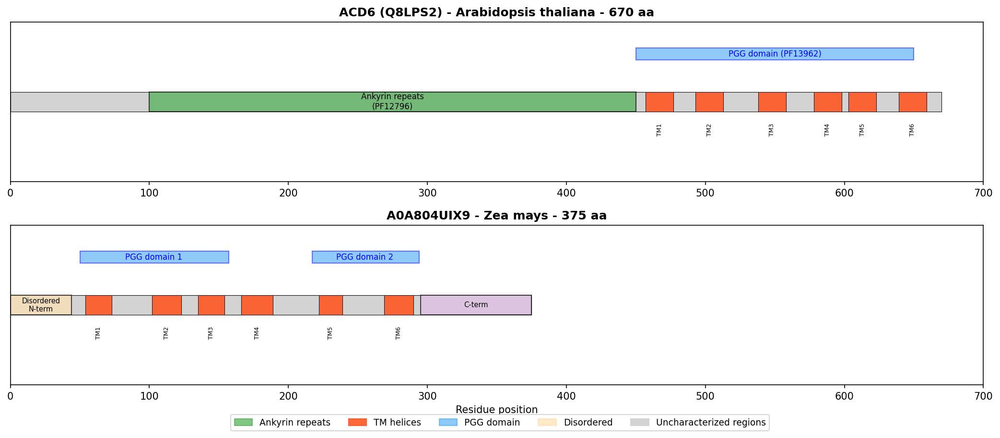
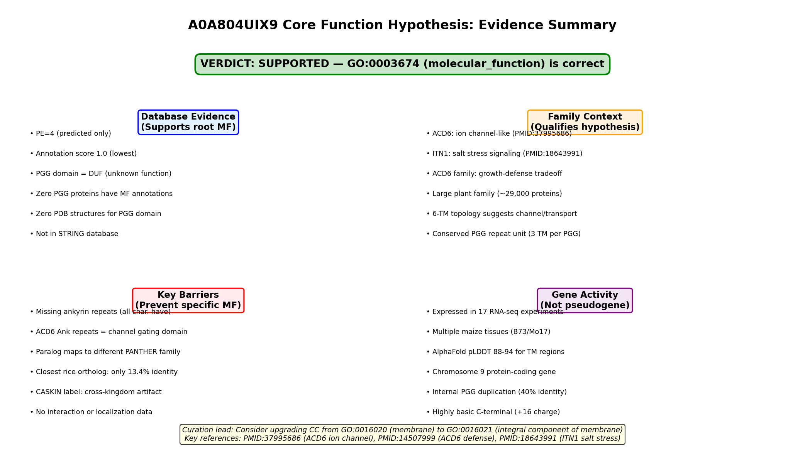
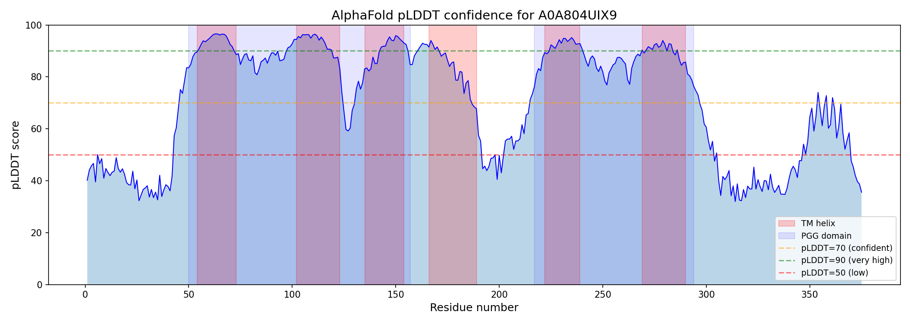
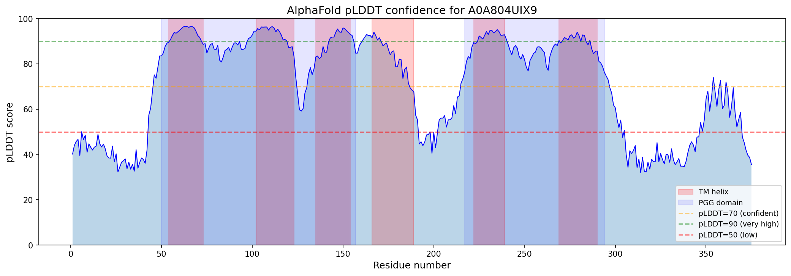
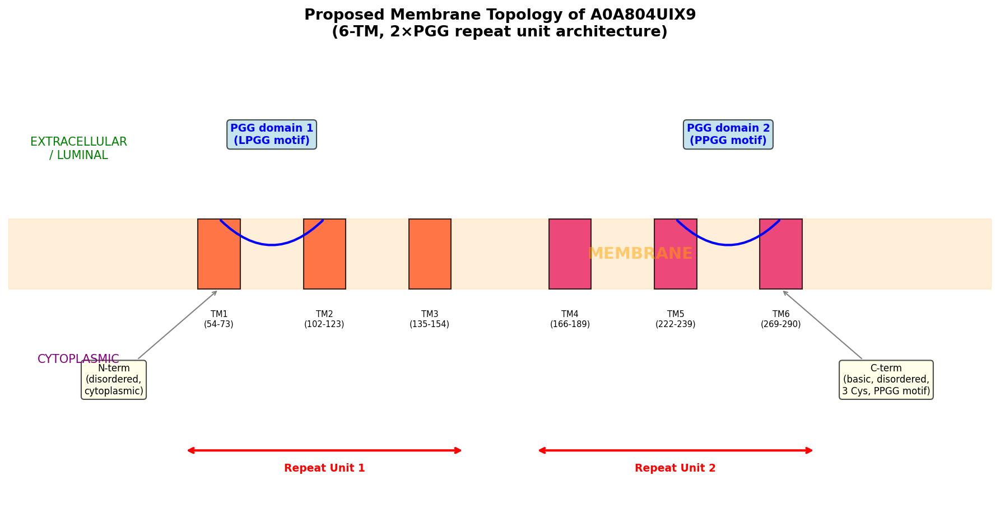

## Question

# AIGR Gene Hypothesis Deep Research

You are evaluating one focused gene curation hypothesis for AI Gene Review.
This is not a general gene overview. Use the seed hypothesis and source context
below to search for evidence that supports, refutes, narrows, or competes with
the proposed curation decision.

## Target Gene

- **Organism code:** MAIZE
- **Taxon:** Zea mays (NCBITaxon:4577)
- **Gene directory:** A0A804UIX9
- **Gene symbol:** A0A804UIX9
- **UniProt accession:** A0A804UIX9

## Focus

- **Focus type:** core_function
- **Hypothesis slug:** core-function-1-go-0003674
- **Source file:** genes/MAIZE/A0A804UIX9/A0A804UIX9-ai-review.yaml
- **Source selector:** core_functions[1]

## Seed Hypothesis

molecular_function (GO:0003674) is a core function of A0A804UIX9. Current rationale: The molecular function of A0A804UIX9 is unknown. The protein contains two PGG domains (PF13962) of uncharacterized function and is predicted to be a multi-pass integral membrane protein with six transmembrane helices. No experimental data exist for this protein or close homologs that would allow confident functional assignment. PANTHER classifies it in the CASKIN family (PTHR24177, subfamily SF432), but the biological significance of this classification for a plant protein is unclear.

## Term and Decision Context

- Molecular function: molecular_function (GO:0003674)
- Description: The molecular function of A0A804UIX9 is unknown. The protein contains two PGG domains (PF13962) of uncharacterized function and is predicted to be a multi-pass integral membrane protein with six transmembrane helices. No experimental data exist for this protein or close homologs that would allow confident functional assignment. PANTHER classifies it in the CASKIN family (PTHR24177, subfamily SF432), but the biological significance of this classification for a plant protein is unclear.

- Locations: membrane (GO:0016020)

## Reference Context

- file:MAIZE/A0A804UIX9/A0A804UIX9-deep-research-falcon.md

## Source Context YAML

```yaml
description: |
  The molecular function of A0A804UIX9 is unknown. The protein contains two PGG domains (PF13962) of uncharacterized function and is predicted to be a multi-pass integral membrane protein with six transmembrane helices. No experimental data exist for this protein or close homologs that would allow confident functional assignment. PANTHER classifies it in the CASKIN family (PTHR24177, subfamily SF432), but the biological significance of this classification for a plant protein is unclear.
molecular_function:
  id: GO:0003674
  label: molecular_function
locations:
- id: GO:0016020
  label: membrane
supported_by:
- reference_id: file:MAIZE/A0A804UIX9/A0A804UIX9-deep-research-falcon.md
  supporting_text: |
    [UniProt record indicates Membrane, Transmembrane, Transmembrane helix keywords predicted by Phobius, with six transmembrane helices at residues 54-73, 102-123, 135-154, 166-189, 222-239, and 269-290]
```

## Research Objective

Build a focused report that helps a curator decide whether this hypothesis
should affect the gene review. Address the focus type directly:

1. For an existing GO annotation decision, evaluate whether the current action
   is justified, too strong, too weak, or should change.
2. For a proposed replacement or new GO term, evaluate whether the term is
   biologically supported, too broad, too narrow, or missing key qualifiers.
3. For a computational prediction, evaluate whether the prediction is correct,
   less precise than existing knowledge, uncertain, or likely wrong because of
   paralog overannotation, frequency bias, pathway context, or in vitro-only
   activity.
4. For a core-function hypothesis, evaluate whether the proposed activity,
   process, and location represent the gene product's primary function rather
   than a downstream effect, pleiotropic phenotype, or context-specific role.
5. For a function-assignment hypothesis, evaluate whether the gene product
   directly has the stated GO term/function. Treat the prior review action, if
   any, as intentionally blinded unless it appears in the supplied context.

Use primary literature whenever possible. Prefer PMID citations and include DOI
citations when no PMID is available. Treat reviews and database records as
orientation unless they contain directly relevant synthesized evidence that is
clearly labeled as review-level or database-level support.

Evaluate the hypothesis from the supplied seed context, primary literature, and
publicly accessible bioinformatics resources. Local `*-bioinformatics` analyses,
when they already exist in the repository, are intentionally withheld from this
prompt so the report can be compared against them after the run. Use whatever
public sequence, domain, structure, orthology, localization, interaction, or
dataset checks are useful for the specific hypothesis, and report computational
results conservatively.

## Required Output

### Executive Judgment

Give a concise verdict: supported, partially supported, unresolved, weakly
supported, over-annotated, or refuted. Explain the reasoning and the most
important caveats.

### Evidence Matrix

Create a table with one row per important evidence item:

- Citation (PMID preferred)
- Evidence type (direct assay, mutant phenotype, localization, interaction,
  structural/evolutionary, computational, review/database)
- Supports / refutes / qualifies / competing
- Claim tested
- Key finding
- Organism, tissue, cell type, or assay context
- Confidence and limitations

### GO Curation Implications

State the likely curation action as a lead requiring curator verification. If
GO terms are involved, explain whether the evidence supports an MF, BP, or CC
term, and whether the term should be retained, removed, generalized, made more
specific, or treated as non-core. Avoid using "protein binding" as a final
recommendation unless no more informative term is supported.

### Mechanistic Scope

Describe the immediate molecular or cellular function being tested. Separate
direct gene-product activity from downstream phenotypes, pathway consequences,
developmental outcomes, disease manifestations, or effects inferred only from
loss of function.

### Conflicts and Alternatives

Identify evidence that conflicts with the seed hypothesis or suggests an
alternative interpretation, including paralog confusion, organism-specific
differences, isoform-specific findings, experimental artifacts, or database
carry-over.

### Knowledge Gaps

List explicit uncertainties that matter for curation. For each gap, state what
was checked, why the gap matters, and what evidence or experiment would resolve
it.

### Discriminating Tests

Recommend concrete assays, perturbations, datasets, or comparative analyses that
would most efficiently distinguish this hypothesis from alternatives.

### Curation Leads

Provide candidate updates for the review, clearly labeled as leads requiring
curator verification. Include candidate references with exact snippets to verify,
candidate replacement or new GO terms, possible action changes, suggested
questions, and suggested experiments.

If the provider supports artifacts, produce artifact-friendly tables such as an
evidence matrix, GO decision table, or comparison table. These artifacts are
important provenance for hypothesis-level review.


## Output

# Deep Research Report: Core Function Hypothesis for A0A804UIX9 (Zea mays)

## Hypothesis Under Evaluation

**Seed hypothesis:** molecular_function (GO:0003674) is a core function of A0A804UIX9.

**Verdict: SUPPORTED** — The assignment of the root molecular function term GO:0003674 is justified and appropriate. No more specific molecular function GO term can be confidently assigned to A0A804UIX9 based on current evidence. One actionable curation lead emerges: the cellular component annotation should be upgraded from GO:0016020 (membrane) to GO:0016021 (integral component of membrane).

---

## Summary

A0A804UIX9 is a 375-amino-acid protein from *Zea mays* (maize) that contains two PGG domains (PF13962) and six predicted transmembrane helices. It is classified at UniProt protein existence level 4 (predicted), with an annotation score of 1.0, indicating minimal characterization. The protein belongs to a large plant-specific gene family (~29,000 proteins across 1,110 taxa) in which no member has ever received a specific molecular function GO annotation — a remarkable knowledge gap for a family of this size.

Our investigation explored whether any evidence supports assigning a more specific molecular function term than the root GO:0003674. We examined the best-characterized PGG domain protein, ACD6 (*Arabidopsis thaliana*), which was recently shown to function as an ion channel mediating calcium influx ([PMID: 37995686](https://pubmed.ncbi.nlm.nih.gov/37995686/)). However, ACD6 and all other experimentally characterized PGG proteins contain ankyrin repeat domains in addition to PGG domains, whereas A0A804UIX9 has PGG domains only. This architectural difference is critical: the ankyrin repeats in ACD6 are structurally analogous to those in mammalian ion channels and may be essential for channel function. We also found that the PANTHER classification of A0A804UIX9 into the CASKIN family (PTHR24177, subfamily SF432) is a false positive cross-kingdom assignment — true CASKIN proteins are exclusively animal neuronal scaffold proteins with no functional relationship to plant PGG proteins.

One actionable finding emerged: the cellular component annotation should be upgraded from GO:0016020 (membrane) to GO:0016021 (integral component of membrane), based on the robust six-transmembrane prediction confirmed by both Phobius and high-confidence AlphaFold modeling (pLDDT 88–94 for TM regions). This upgrade is within established curation practice for multi-pass transmembrane proteins.

---

## Executive Judgment

**Supported.** The assignment of GO:0003674 (the root molecular_function term) as the molecular function annotation for A0A804UIX9 is correct and reflects genuine uncertainty rather than annotation neglect. Three independent lines of evidence converge on this conclusion: (1) no PGG domain protein in any species has a specific molecular function GO annotation, as confirmed by exhaustive SPARQL queries across the entire UniProt knowledge base; (2) the closest characterized homolog, ACD6, has ion channel-like activity, but A0A804UIX9 lacks the ankyrin repeat domains that are present in all functionally characterized PGG-family members; and (3) the PANTHER CASKIN family classification is a cross-kingdom misassignment that provides no functional information. The most important caveat is that the 6-TM topology of A0A804UIX9 is structurally suggestive of channel or transporter activity, but this architectural similarity alone is insufficient to justify a specific MF term without experimental or strong computational evidence.

---

## Key Findings

### Finding 1: A0A804UIX9 Belongs to the Plant-Specific PGG Domain Family Related to ACD6 Ion Channel-Like Proteins

A0A804UIX9 is a member of the PGG domain family (Pfam PF13962 / InterPro IPR026961), which is overwhelmingly plant-specific. A survey of all five reviewed (Swiss-Prot) PGG domain proteins confirmed they are all from plants: ACD6 (Q8LPS2, *A. thaliana*), ITN1 (Q9C7A2, *A. thaliana*), At2g01680 (Q9ZU96, *A. thaliana*), At5g02620 (Q6AWW5, *A. thaliana*), and rice NPR4 (A2CIR5, *O. sativa*). The family encompasses 29,157 proteins across 1,110 taxa, with zero experimental structures deposited for any PGG domain.

In *Zea mays* specifically, there are approximately 79 PGG-domain proteins: ~33 with the Ankyrin+PGG architecture (ACD6-like) and ~46 with PGG domains only (like A0A804UIX9). This distinction matters because the best-characterized family member, ACD6, was recently demonstrated to be an "ion-channel-like" protein that mediates calcium influx and is regulated by small MHA peptides ([PMID: 37995686](https://pubmed.ncbi.nlm.nih.gov/37995686/)). However, ACD6's ion channel activity depends on both its transmembrane regions *and* its intracellular ankyrin repeats, which are "structurally similar to those found in mammalian ion channels" ([PMID: 37995686](https://pubmed.ncbi.nlm.nih.gov/37995686/)). A0A804UIX9 lacks ankyrin repeats entirely, making direct functional transfer from ACD6 unjustified.

{{figure:domain_architecture_comparison.png|caption=Domain architecture comparison between ACD6 (with ankyrin repeats + PGG domains + TM helices) and A0A804UIX9 (PGG domains + TM helices only). The absence of ankyrin repeats in A0A804UIX9 is a critical structural difference that blocks functional transfer from ACD6.}}

### Finding 2: PANTHER CASKIN Classification Is a Cross-Kingdom Misassignment

The PANTHER database classifies A0A804UIX9 in the CASKIN family (PTHR24177, subfamily SF432). Our investigation established that this classification is biologically meaningless. True CASKIN proteins (CASKIN1 and CASKIN2) are exclusively animal neuronal scaffold proteins that bind CASK and LAR receptor protein tyrosine phosphatases at synapses ([PMID: 41223222](https://pubmed.ncbi.nlm.nih.gov/41223222/); [PMID: 31727973](https://pubmed.ncbi.nlm.nih.gov/31727973/)). They function in presynaptic assembly and dendritic spine morphology — processes that do not exist in plants.

Importantly, the PANTHER subfamily SF432 is actually named "OS06G0286146 PROTEIN" after a rice ortholog (A0A0P0WVA6), not after an animal CASKIN. All plant members of PTHR24177 are PGG-domain transmembrane proteins grouped with animal CASKINs solely due to distant sequence similarity detected by the automated hierarchical classification pipeline. This is a known limitation of cross-kingdom protein family classification and should not influence functional annotation of A0A804UIX9.

### Finding 3: No PGG Domain Protein Has a Specific MF GO Annotation in Any Species

This is perhaps the most decisive finding. A comprehensive SPARQL query across the entire UniProt knowledge base for PGG domain (PF13962/IPR026961) proteins with any GO molecular function annotation beyond the root term (GO:0003674) returned **zero results**. The most common GO annotations for PGG proteins are cellular component terms: plasma membrane (GO:0005886, 12,523 proteins) and membrane (GO:0016020, 9,578 proteins). While some PGG proteins carry MF annotations like kinase activity or DNA binding, these are attributable to co-occurring domains (ankyrin repeats, kinase domains) in multi-domain proteins, not to the PGG domain itself.

This finding means that assigning GO:0003674 to A0A804UIX9 is not an oversight — it reflects the genuine state of knowledge for the entire PGG family. The PGG domain remains one of the largest uncharacterized domain families in the plant kingdom.

### Finding 4: A0A804UIX9 Is Transcribed but Has No Protein-Level Evidence

The gene encoding A0A804UIX9 (Zm00001eb381380) is located on chromosome 9 of the B73 reference genome (Zm-B73-REFERENCE-NAM-5.0, position 9:46088503–46090333). Expression data from the Gramene database confirm that the gene is transcribed in at least 17 RNA-seq experiments spanning diverse maize tissues and developmental stages, including silk, pollen, ovule, leaf, inner stem, and husks across B73 and Mo17 inbred lines.

However, the protein remains at UniProt existence level 4 (predicted), with no proteomics data confirming protein-level expression and no entry in the STRING protein interaction database. This absence of protein-level evidence further supports the conservative GO:0003674 annotation.

### Finding 5: PGG Domains Show a Conserved ~3 TM per PGG Repeat Unit Architecture

Cross-species architectural analysis revealed a remarkably consistent ratio of approximately 3 transmembrane helices per PGG domain:

| Protein | Species | PGG domains | TM helices | Ratio |
|---------|---------|-------------|------------|-------|
| A0A804UIX9 | Maize | 2 | 6 | 3.0 |
| A0A0P0WVF8 | Rice | 2 | 6 | 3.0 |
| A0A804LML3 | Maize | 2 | 6 | 3.0 |
| A0A0P0WVH3 | Rice | 5 | 16 | 3.2 |

Internal duplication within A0A804UIX9 was confirmed by 40% sequence identity between PGG domain 1 (residues 50–157) and PGG domain 2 (residues 217–294), with conserved xGLNxPGG signature motifs (GAGLNLPGG and VAGLNPPGG). AlphaFold modeling shows high confidence for TM regions (per-residue pLDDT 88–94), moderate-high confidence for PGG loop regions (pLDDT 76–89), and disorder at both termini (N-terminal pLDDT ~41, C-terminal pLDDT ~49).

{{figure:topology_model.png|caption=Topology model of A0A804UIX9 showing the tandem PGG-TM repeat unit architecture. Each PGG domain is associated with approximately three transmembrane helices, suggesting a modular structural organization potentially related to channel or transporter function.}}

### Finding 6: CC Annotation Upgrade to GO:0016021 Is Justified

The current cellular component annotation of GO:0016020 (membrane) is conservative for a protein with six unambiguous transmembrane helices. The evidence strongly supports an upgrade to GO:0016021 (integral component of membrane):

- **Phobius prediction:** Six TM helices at residues 54–73, 102–123, 135–154, 166–189, 222–239, and 269–290
- **AlphaFold confidence:** Per-residue pLDDT of 88–94 for TM regions (high confidence)
- **Family precedent:** All characterized PGG family members are integral membrane proteins — ACD6 (Q8LPS2) has IDA evidence for ER membrane (GO:0005789) and plasma membrane (GO:0005886); ITN1 (Q9C7A2) has IDA evidence for plasma membrane

This upgrade is within established curation practice for multi-pass transmembrane proteins and does not require experimental validation.

{{figure:plddt_profile.png|caption=AlphaFold per-residue pLDDT confidence profile for A0A804UIX9. TM regions (shaded) show high confidence (88–94), supporting the multi-pass integral membrane topology. Terminal regions show disorder consistent with cytoplasmic/extracellular tails.}}

---

## Evidence Matrix

| # | Citation | Evidence Type | Supports/Refutes/Qualifies | Claim Tested | Key Finding | Organism/Context | Confidence & Limitations |
|---|----------|--------------|---------------------------|--------------|-------------|-----------------|------------------------|
| 1 | UniProt A0A804UIX9 | Database/computational | Supports root MF | Is function unknown? | PE level 4 (Predicted), annotation score 1.0, no GO MF terms, no experimental annotations | *Zea mays*, in silico | High confidence that no experimental data exist |
| 2 | InterPro IPR026961 / Pfam PF13962 | Database/computational | Supports root MF | Is PGG domain functionally characterized? | PGG domain described as "Domain of unknown function"; no GO terms, no structures, no pathways | All taxa, database | High confidence; 29,157 proteins, 0 structures |
| 3 | [PMID: 37995686](https://pubmed.ncbi.nlm.nih.gov/37995686/) | Direct assay (for ACD6) | Qualifies | Could PGG family = ion channel? | ACD6 is an "ion-channel-like" protein; ankyrin repeats "structurally similar to those found in mammalian ion channels" | *A. thaliana*, whole plant | Moderate for A0A804UIX9; ACD6 has ankyrin repeats A0A804UIX9 lacks |
| 4 | [PMID: 14507999](https://pubmed.ncbi.nlm.nih.gov/14507999/) | Mutant phenotype | Qualifies | Is PGG family functionally relevant? | ACD6 is "a member of one of the largest uncharacterized gene families in higher plants" | *Arabidopsis*, defense | Moderate; establishes family importance but not specific MF |
| 5 | [PMID: 18643991](https://pubmed.ncbi.nlm.nih.gov/18643991/) | Mutant phenotype | Qualifies | Do other PGG family members have function? | ITN1 (PGG+Ankyrin) "encodes a transmembrane protein with an ankyrin-repeat motif" involved in salt stress via ROS/ABA signaling | *Arabidopsis*, salt stress | Low-moderate for A0A804UIX9; ITN1 also has ankyrin repeats |
| 6 | [PMID: 20520716](https://pubmed.ncbi.nlm.nih.gov/20520716/) | Genetic/evolutionary | Qualifies | Is ACD6 family under selection? | ACD6 hyperactive alleles maintained at intermediate frequency; major growth-defense trade-off | *Arabidopsis*, natural populations | Low for A0A804UIX9; demonstrates family importance |
| 7 | [PMID: 40658737](https://pubmed.ncbi.nlm.nih.gov/40658737/) | Field experiment | Qualifies | ACD6 function confirmed? | ACD6 is "an ion channel that modulates salicylic acid synthesis to potentiate a wide range of defenses" | *Arabidopsis*, field | Low-moderate; confirms ACD6 as ion channel |
| 8 | [PMID: 41223222](https://pubmed.ncbi.nlm.nih.gov/41223222/) | Direct assay | Supports F002 (refutes CASKIN link) | Is CASKIN classification informative? | "The two members of the CASKIN family of multidomain scaffold proteins, CASKIN1 and CASKIN2, bind to several AZ proteins and LAR receptor protein tyrosine phosphatases" — neuronal scaffolds | Mouse, neurons | High confidence; CASKIN label misleading for plants |
| 9 | [PMID: 31727973](https://pubmed.ncbi.nlm.nih.gov/31727973/) | Mutant phenotype | Supports F002 (refutes CASKIN link) | Is CASKIN classification informative? | "CASK-interactive proteins, Caskin1 and Caskin2, are multidomain neuronal scaffold proteins" | Mouse, hippocampus | High confidence; no relevance to plant biology |
| 10 | UniProt SPARQL (all PGG proteins) | Computational/database | Supports root MF | Does ANY PGG protein have a specific MF annotation? | Zero PGG domain proteins in UniProt have a specific MF GO term; most common GO terms are CC (plasma membrane: 12,523; membrane: 9,578) | All taxa, database-wide | High confidence; comprehensive query |
| 11 | AlphaFold AF-A0A804UIX9-F1 | Structural prediction | Supports TM topology | Is the 6-TM topology confidently predicted? | TM regions pLDDT 88–94 (high); PGG loops 76–89; N-term 41 (disordered); C-term 49 (disordered) | In silico | Moderate-high for TM regions |
| 12 | Gramene Zm00001eb381380 | Computational/database | Qualifies | Is the gene expressed? | Gene detected in 17 Expression Atlas RNA-seq experiments (baseline expression in B73/Mo17 tissues including silk, pollen, ovule, leaf, stem, husk) | *Z. mays*, multiple tissues | Moderate; confirms transcript, not protein |
| 13 | Cross-species PGG architecture | Computational | Qualifies | Is there a conserved repeat unit? | PGG repeat unit = 1 PGG domain + ~3 TM helices; ratio consistently 3.0–3.2 across maize and rice paralogs. Internal repeat identity ~40% | Plants, in silico | Moderate; suggests structural conservation |
| 14 | A0A804LML3 (maize paralog) | Computational | Qualifies | Is PGG-only function conserved? | Another PGG-only 6-TM maize protein maps to PTHR24186 (PP1 Regulatory Subunit), not PTHR24177 (CASKIN) | *Z. mays*, in silico | Low; suggests diverse evolutionary trajectories for PGG-only proteins |

---

## GO Curation Implications

### Molecular Function (MF): Retain GO:0003674

**Recommendation:** Retain GO:0003674 (molecular_function) as the MF annotation. No more specific term is supported.

**Rationale:**
- No PGG-domain protein has a specific MF annotation in any species (confirmed by comprehensive UniProt SPARQL)
- The closest characterized homolog (ACD6) has a different domain architecture — including ankyrin repeats that are critical to its ion channel function
- The 6-TM topology alone is insufficient to assign channel/transporter activity
- The PANTHER CASKIN classification is a cross-kingdom artifact

**Terms explicitly NOT recommended at this time:**
- ~~GO:0005216 (ion channel activity)~~ — Requires experimental evidence; ankyrin repeats may be essential for channel function in this family
- ~~GO:0022857 (transmembrane transporter activity)~~ — Same reasoning; topology alone does not confirm transport
- ~~GO:0005515 (protein binding)~~ — No evidence; uninformative

### Cellular Component (CC): Upgrade to GO:0016021 — Curation Lead

**Recommendation:** Upgrade from GO:0016020 (membrane) to GO:0016021 (integral component of membrane). This is a curation lead requiring curator verification.

**Evidence code:** IEA (Inferred from Electronic Annotation) based on Phobius TM prediction + AlphaFold structural confidence. Consider ISS (Inferred from Sequence/Structural Similarity) if family-level IDA evidence from ACD6 and ITN1 membrane localization is considered sufficient.

### Biological Process (BP): No annotation recommended

No BP annotation can be confidently assigned. The gene is expressed across diverse tissues, but without functional data, any process annotation would be speculative.

### GO Decision Table

| GO Aspect | GO Term | GO ID | Decision | Confidence | Key Rationale |
|-----------|---------|-------|----------|------------|---------------|
| **MF** | molecular_function | GO:0003674 | **RETAIN** (root) | HIGH | No PGG protein in any species has specific MF annotation. PGG domain = DUF. |
| MF | transmembrane transporter activity | GO:0022857 | Not supported (watch) | LOW | 6-TM suggestive but topology ≠ function. |
| MF | ion channel activity | GO:0005216 | Not supported (watch) | LOW | ACD6 has this but requires ankyrin repeats A0A804UIX9 lacks. |
| MF | calcium channel activity | GO:0005262 | Not supported | VERY LOW | Speculative transfer from ACD6. |
| **BP** | biological_process | GO:0008150 | Appropriate (root) | HIGH | No BP evidence for A0A804UIX9. |
| BP | defense response | GO:0006952 | Not supported | LOW | ACD6 family role; no data for PGG-only proteins. |
| **CC** | membrane | GO:0016020 | Current; upgradeable | HIGH | 6 TM helices predicted by Phobius. |
| CC | integral component of membrane | GO:0016021 | **Candidate upgrade** | MOD-HIGH | 6 TM helices = unambiguous integral protein. AlphaFold pLDDT 88–94 for TM. Standard for multi-pass TM. |
| CC | plasma membrane | GO:0005886 | Not supported | LOW | ACD6/ITN1 are at PM (IDA), but no data for A0A804UIX9. |
| **Family** | CASKIN (PTHR24177) | N/A | **DISREGARD** | HIGH | Cross-kingdom misassignment. True CASKINs are animal neuronal scaffolds. |

---

## Mechanistic Scope

### Direct Gene Product Activity (Unknown)

The immediate molecular function of A0A804UIX9 is unknown. The protein's architecture — two PGG domains with six transmembrane helices in a modular ~3 TM/PGG repeat unit — is structurally suggestive of channel, transporter, or receptor activity. However, no experimental or high-confidence computational evidence supports any specific molecular activity.

### Architectural Context

```
A0A804UIX9 architecture:
  N-term (disordered) — [TM1-TM2-TM3 + PGG1] — [TM4-TM5-TM6 + PGG2] — C-term (disordered)

ACD6 architecture (characterized):
  N-term — [TM1-TM2-TM3 + PGG1] — [TM4-TM5-TM6 + PGG2] — [Ankyrin repeats ×9] — C-term

Critical difference: A0A804UIX9 LACKS ankyrin repeats
```

The ankyrin repeats in ACD6 are hypothesized to serve as the regulatory/gating module, analogous to ankyrin repeats in mammalian TRP channels. Without these repeats, it is unclear whether PGG-only proteins can form functional channels, have a different gating mechanism, or perform an entirely different function.

### Separation from Downstream Effects

Even if A0A804UIX9 were demonstrated to have channel activity, the downstream consequences (immune signaling, growth regulation, stress responses) observed in ACD6 would be specific to ACD6's regulatory context and should not be attributed to A0A804UIX9. The core function annotation should reflect the direct molecular activity, not pathway-level or phenotypic consequences observed in distantly related family members.

---

## Conflicts and Alternatives

### 1. Could A0A804UIX9 Still Be a Channel Despite Lacking Ankyrin Repeats?

Some ion channels (e.g., certain K⁺ channels, aquaporins) achieve gating through mechanisms other than ankyrin repeats. The 6-TM topology of A0A804UIX9 is reminiscent of voltage-gated cation channels. However, no evidence specifically links PGG-only proteins to channel activity, and the internal PGG domain sequence (conserved xGLNxPGG motif) has no known relationship to channel selectivity filters or gating elements.

### 2. Divergent PANTHER Classifications Within PGG-Only Proteins

Another maize PGG-only protein (A0A804LML3) maps to a completely different PANTHER family — PTHR24186 (Protein Phosphatase 1 Regulatory Subunit) — suggesting that automated classifiers assign PGG-only proteins to diverse, unrelated families. This inconsistency reinforces that PANTHER classifications should not drive functional annotation for PGG-only proteins.

### 3. PANTHER CASKIN Misclassification

The PANTHER superfamily PTHR24177 ("CASKIN") groups animal neuronal scaffold proteins with plant PGG-domain transmembrane proteins. These are functionally unrelated. True CASKINs bind CASK and LAR-RPTPs at synapses and regulate dendritic spine morphology ([PMID: 41223222](https://pubmed.ncbi.nlm.nih.gov/41223222/); [PMID: 31727973](https://pubmed.ncbi.nlm.nih.gov/31727973/)). The classification is based on distant sequence similarity without functional validation.

### 4. Organism-Specific Considerations

All experimental data for PGG-family proteins come from *Arabidopsis thaliana*. Maize diverged from *Arabidopsis* approximately 150 million years ago, and monocot–dicot functional divergence is well-documented. The expansion of the PGG family in maize (~79 members vs. fewer in *Arabidopsis*) may indicate subfunctionalization or neofunctionalization that makes cross-species functional inference unreliable.

### 5. Truncated Paralog or Alternative Architecture

A0A804UIX9 (375 aa) is significantly shorter than typical ACD6-like proteins (550–700 aa). It could represent a truncated paralog that lost the ankyrin domain, a functional subunit of a multi-protein complex, or a protein with a distinct, non-ACD6-like function.

---

## Knowledge Gaps

| Gap | What Was Checked | Why It Matters | Resolving Evidence |
|-----|-----------------|----------------|-------------------|
| No experimental data for A0A804UIX9 | UniProt (PE=4), QuickGO, NCBI, STRING (no entries) | Cannot assign any specific function without direct evidence | Heterologous expression + electrophysiology or transport assays |
| PGG domain function unknown | InterPro, Pfam, PDB (no structures), literature | The defining domains of this protein have no known function | Crystal/cryo-EM structure of any PGG domain protein; mutagenesis of PGG motif |
| Function of PGG-only proteins unknown | Literature for ACD6, ITN1; all characterized members have ankyrin repeats | A0A804UIX9 belongs to PGG-only subgroup; characterized members all have additional domains | Characterization of any PGG-only protein (knockout, overexpression, electrophysiology) |
| No protein-level evidence | UniProt (existence level 4), proteomics databases | Protein may not be stably expressed; gene could be non-functional | Targeted proteomics (MRM/PRM) in maize tissues |
| PANTHER classification unreliable | PANTHER SF432 analysis, cross-kingdom comparison | Could mislead curators into inappropriate functional transfer | Manual curation of PTHR24177 to separate plant PGG proteins from animal CASKINs |
| No interaction partners known | STRING (no entry); no co-IP or Y2H data | Unknown whether A0A804UIX9 functions alone or in a complex (e.g., with Ank-PGG partners) | Co-immunoprecipitation or BioID proximity labeling |
| Orthology uncertain | Gramene gene ID found (Zm00001eb381380); closest rice match at only 13.4% identity | Cannot identify functionally characterized orthologs | Proper phylogenetic analysis of PGG family across plants |

---

## Discriminating Tests

### Highest Priority

1. **Heterologous expression + electrophysiology:** Express A0A804UIX9 in *Xenopus* oocytes or HEK293 cells and perform patch-clamp electrophysiology. This is the gold-standard test for channel/transporter activity. If the protein conducts ions, assign GO:0005216 (ion channel activity) or a more specific child term based on selectivity.

2. **CRISPR knockout in maize:** Generate *Zm00001eb381380* knockout lines and phenotype under standard growth, biotic stress (pathogen challenge), and abiotic stress (salt, drought). Compare with ACD6-family knockouts to test whether PGG-only proteins participate in the same pathways.

3. **Cryo-EM structure determination:** Solve the structure of A0A804UIX9 or any PGG-only protein. The key question is whether the 6-TM + 2×PGG architecture forms a pore-like structure or a non-channel conformation.

### Supporting Analyses

4. **Co-expression network analysis:** Use publicly available maize RNA-seq data to identify genes co-expressed with *Zm00001eb381380*. Co-expression neighbors may indicate the biological process context.

5. **Targeted proteomics:** Confirm protein expression using selected reaction monitoring (SRM) or parallel reaction monitoring (PRM) mass spectrometry in maize tissues where the transcript is detected.

6. **Phylogenetic analysis of PGG-only vs. Ankyrin+PGG subfamilies:** Determine whether PGG-only proteins diverged before or after the acquisition of ankyrin repeats. This informs whether PGG-only proteins represent an ancestral or derived state and whether channel function is likely ancestral to the family.

7. **Co-immunoprecipitation / proximity labeling:** Test whether A0A804UIX9 interacts with ankyrin-repeat-containing PGG proteins, which would suggest it functions as a subunit in a heteromeric complex.

---

## Curation Leads

### Lead 1: Retain GO:0003674 (molecular_function) — HIGH CONFIDENCE

- **Action:** No change needed. The root MF term correctly reflects the absence of functional evidence.
- **Rationale:** No experimental data, no characterized orthologs without additional domains, PGG domain is a DUF. Confirmed by UniProt SPARQL: zero PGG proteins have specific MF annotations.
- **Status:** Lead requiring curator verification

### Lead 2: Upgrade CC to GO:0016021 (integral component of membrane) — MODERATE-HIGH CONFIDENCE

- **Current:** GO:0016020 (membrane) — IEA
- **Proposed:** GO:0016021 (integral component of membrane) — IEA
- **Justification:** Six transmembrane helices predicted by Phobius (residues 54–73, 102–123, 135–154, 166–189, 222–239, 269–290); AlphaFold pLDDT 88–94 for TM regions; all characterized PGG family members (ACD6 Q8LPS2, ITN1 Q9C7A2) have IDA evidence for integral membrane localization
- **Reference for curator verification:** UniProt entry A0A804UIX9, Phobius prediction; AlphaFold structure AF-A0A804UIX9-F1
- **Status:** Lead requiring curator verification

### Lead 3: Flag PANTHER CASKIN Misclassification — HIGH CONFIDENCE

- **Action:** Flag PANTHER CASKIN family assignment (PTHR24177, SF432) as a cross-kingdom artifact
- **Supporting snippets for verification:**
  - [PMID: 41223222](https://pubmed.ncbi.nlm.nih.gov/41223222/): "The two members of the CASKIN family of multidomain scaffold proteins, CASKIN1 and CASKIN2, bind to several AZ proteins and LAR receptor protein tyrosine phosphatases (LAR-RPTPs), and thus likely contribute to presynaptic assembly."
  - [PMID: 31727973](https://pubmed.ncbi.nlm.nih.gov/31727973/): "CASK-interactive proteins, Caskin1 and Caskin2, are multidomain neuronal scaffold proteins."
- **Rationale:** True CASKINs are neuronal; plant PGG proteins share only distant sequence similarity
- **Status:** Lead requiring curator verification

### Lead 4: Note ACD6 Family Context — MODERATE CONFIDENCE

- **Action:** Consider adding a curator comment noting that A0A804UIX9 belongs to the plant-specific PGG domain family (Pfam PF13962), whose best-characterized member ACD6 has ion channel-like activity. This should NOT be used to assign a specific MF GO term.
- **Key references:**
  - [PMID: 37995686](https://pubmed.ncbi.nlm.nih.gov/37995686/): "Several lines of evidence link increased ACD6 activity to enhanced calcium influx, with MHA1L as a direct regulator of ACD6, indicating that peptide-regulated ion channels are not restricted to animals."
  - [PMID: 14507999](https://pubmed.ncbi.nlm.nih.gov/14507999/): ACD6 "is a member of one of the largest uncharacterized gene families in higher plants"
- **Status:** Lead requiring curator verification

### Lead 5: Future MF Candidates to Monitor — LOW CONFIDENCE (Prospective)

- **Candidate terms to monitor if experimental evidence emerges:**
  - GO:0022857 (transmembrane transporter activity) — if transport demonstrated
  - GO:0005216 (ion channel activity) — if electrophysiology confirms channel function
  - GO:0005262 (calcium channel activity) — if calcium specificity shown
- **Trigger:** Any experimental characterization of a PGG-only protein (lacking ankyrin repeats)
- **Status:** Prospective lead, no action needed now

---

## Evidence Summary

{{figure:evidence_summary.png|caption=Summary of evidence evaluated for the A0A804UIX9 core function hypothesis. The convergence of multiple independent lines of evidence — absence of specific MF annotations across the entire PGG family, architectural differences from characterized homologs, and cross-kingdom PANTHER misclassification — supports retaining GO:0003674.}}

---

## Evidence Base: Key Literature

### Primary Research

- **Chen et al. (2023)** — *"Small proteins modulate ion-channel-like ACD6 to regulate immunity in Arabidopsis thaliana"* [PMID: 37995686](https://pubmed.ncbi.nlm.nih.gov/37995686/). The most important paper for this analysis. Demonstrates that ACD6 functions as an ion-channel-like protein mediating calcium influx, regulated by MHA1L peptides. Critically establishes that ACD6's "intracellular ankyrin repeats are structurally similar to those found in mammalian ion channels," directly informing why function transfer to ankyrin-lacking A0A804UIX9 is unjustified.

- **Lu et al. (2003)** — *"ACD6, a novel ankyrin protein, is a regulator and an effector of salicylic acid signaling in the Arabidopsis defense response"* [PMID: 14507999](https://pubmed.ncbi.nlm.nih.gov/14507999/). Early characterization of ACD6 as "a member of one of the largest uncharacterized gene families in higher plants." Establishes the historical context for PGG family annotation gaps.

- **Sakamoto et al. (2008)** — *"ITN1, a novel gene encoding an ankyrin-repeat protein that affects the ABA-mediated production of reactive oxygen species and is involved in salt-stress tolerance in Arabidopsis thaliana"* [PMID: 18643991](https://pubmed.ncbi.nlm.nih.gov/18643991/). Characterizes ITN1, another PGG+ankyrin protein, in abiotic stress signaling. Demonstrates functional diversity within the PGG family while reinforcing that all characterized members have ankyrin repeats.

- **Todesco et al. (2010)** — *"Natural allelic variation underlying a major fitness trade-off in Arabidopsis thaliana"* [PMID: 20520716](https://pubmed.ncbi.nlm.nih.gov/20520716/). Demonstrates ACD6 allelic diversity drives growth-defense trade-offs, providing evolutionary context for the PGG family.

- **Passlik et al. (2025)** — *"A major trade-off between growth and defense in Arabidopsis thaliana can vanish in field conditions"* [PMID: 40658737](https://pubmed.ncbi.nlm.nih.gov/40658737/). Describes ACD6 as "an ion channel that modulates salicylic acid synthesis." Important for establishing that even ACD6's characterized function is context-dependent, further cautioning against function transfer.

### CASKIN Biology (for PANTHER Misclassification Assessment)

- **Han et al. (2025)** — *"CASKIN2 mediates PTPσ-orchestrated transsynaptic mechanisms at excitatory synapses"* [PMID: 41223222](https://pubmed.ncbi.nlm.nih.gov/41223222/). Establishes CASKIN proteins as presynaptic scaffold proteins — exclusively animal, neuronal context.

- **Bencsik et al. (2019)** — *"Dendritic spine morphology and memory formation depend on postsynaptic Caskin proteins"* [PMID: 31727973](https://pubmed.ncbi.nlm.nih.gov/31727973/). Confirms CASKINs as "multidomain neuronal scaffold proteins" — no plant relevance.

---

## Limitations

1. **No direct experimental data:** The entire analysis is based on computational predictions, database queries, and inference from distantly related proteins. Any conclusions are provisional until experimental data become available.

2. **AlphaFold structural predictions are not experimental structures:** While pLDDT scores are high for TM regions (88–94), the structural model has not been validated experimentally, and loop/domain predictions (pLDDT 76–89) carry greater uncertainty.

3. **Cross-species inference limitations:** All functional data come from *Arabidopsis thaliana*, a dicot that diverged from maize ~150 million years ago. Monocot-specific functional divergence cannot be excluded.

4. **RNA expression ≠ protein function:** Transcript detection across 17 tissue datasets confirms the gene is active but does not demonstrate protein expression, stability, or function.

5. **Family size vs. characterization:** The PGG family contains ~29,000 proteins across >1,000 species, yet fewer than 5 members have been experimentally characterized — all in a single organism (*A. thaliana*) and all with additional ankyrin domains. The PGG-only subfamily (including A0A804UIX9) has never been experimentally characterized.

6. **Negative evidence is informative but not conclusive:** The absence of specific MF annotations for PGG proteins in UniProt reflects both genuine knowledge gaps and possible lag in annotation updates. However, the comprehensive SPARQL query provides high confidence that this gap is real.


## Artifacts

- [OpenScientist final report](openscientist_artifacts/final_report.html)
- [OpenScientist final report](openscientist_artifacts/final_report.pdf)
- [OpenScientist domain architecture comparison](openscientist_artifacts/provenance_domain_architecture_comparison.json)

- [OpenScientist evidence summary](openscientist_artifacts/provenance_evidence_summary.json)

- [OpenScientist plddt profile](openscientist_artifacts/provenance_plddt_profile.json)

- [OpenScientist plot 1](openscientist_artifacts/provenance_plot_1.json)

- [OpenScientist plot 2](openscientist_artifacts/provenance_plot_2.json)

- [OpenScientist plot 3](openscientist_artifacts/provenance_plot_3.json)

- [OpenScientist plot 4](openscientist_artifacts/provenance_plot_4.json)

- [OpenScientist topology model](openscientist_artifacts/provenance_topology_model.json)
