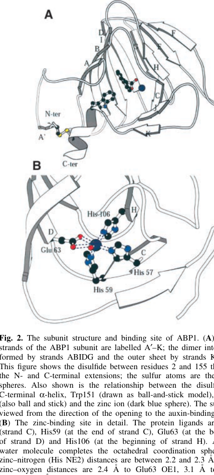

## Question

# Gene Research for Functional Annotation

## ⚠️ CRITICAL: Gene/Protein Identification Context

**BEFORE YOU BEGIN RESEARCH:** You MUST verify you are researching the CORRECT gene/protein. Gene symbols can be ambiguous, especially for less well-characterized genes from non-model organisms.

### Target Gene/Protein Identity (from UniProt):
- **UniProt Accession:** P13689
- **Protein Description:** RecName: Full=Auxin-binding protein 1 {ECO:0000303|PubMed:2555179}; Short=ABP {ECO:0000303|PubMed:2555179}; AltName: Full=ERABP1 {ECO:0000303|PubMed:7693132}; Flags: Precursor;
- **Gene Information:** Name=ABP1 {ECO:0000303|PubMed:2555179}; Synonyms=AUX311 {ECO:0000303|PubMed:1650260};
- **Organism (full):** Zea mays (Maize).
- **Protein Family:** Not specified in UniProt
- **Key Domains:** Auxin-bd. (IPR000526); RmlC-like_jellyroll. (IPR014710); RmlC_Cupin_sf. (IPR011051); Auxin_BP (PF02041)

### MANDATORY VERIFICATION STEPS:

1. **Check if the gene symbol "ABP1" matches the protein description above**
2. **Verify the organism is correct:** Zea mays (Maize).
3. **Check if protein family/domains align with what you find in literature**
4. **If you find literature for a DIFFERENT gene with the same or similar symbol, STOP**

### If Gene Symbol is Ambiguous or You Cannot Find Relevant Literature:

**DO NOT PROCEED WITH RESEARCH ON A DIFFERENT GENE.** Instead:
- State clearly: "The gene symbol 'ABP1' is ambiguous or literature is limited for this specific protein"
- Explain what you found (e.g., "Found extensive literature on a different gene with the same symbol in a different organism")
- Describe the protein based ONLY on the UniProt information provided above
- Suggest that the protein function can be inferred from domain/family information

### Research Target:

Please provide a comprehensive research report on the gene **ABP1** (gene ID: ABP1, UniProt: P13689) in MAIZE.

The research report should be a detailed narrative explaining the function, biological processes, and localization of the gene product. Citations should be given for all claims.

You should prioritize authoritative reviews and primary scientific literature when conducting research. You can supplement
this with annotations you find in gene/protein databases, but these can be outdated or inaccurate.

We are specifically interested in the primary function of the gene - for enzymes, what reaction is catalyzed, and what is the substrate specificity? For transporters, what is the substrate? For structural proteins or adapters, what is the broader structural role? For signaling molecules, what is the role in the pathway.

We are interested in where in or outside the cell the gene product carries out its function.

We are also interested in the signaling or biochemical pathways in which the gene functions. We are less interested in broad pleiotropic effects, except where these elucidate the precise role.

Include evidence where possible. We are interested in both experimental evidence as well as inference from structure, evolution, or bioinformatic analysis. Precise studies should be prioritized over high-throughput, where available.

## Output

Question: You are an expert researcher providing comprehensive, well-cited information.

Provide detailed information focusing on:
1. Key concepts and definitions with current understanding
2. Recent developments and latest research (prioritize 2023-2024 sources)
3. Current applications and real-world implementations
4. Expert opinions and analysis from authoritative sources
5. Relevant statistics and data from recent studies

Format as a comprehensive research report with proper citations. Include URLs and publication dates where available.
Always prioritize recent, authoritative sources and provide specific citations for all major claims.

# Gene Research for Functional Annotation

## ⚠️ CRITICAL: Gene/Protein Identification Context

**BEFORE YOU BEGIN RESEARCH:** You MUST verify you are researching the CORRECT gene/protein. Gene symbols can be ambiguous, especially for less well-characterized genes from non-model organisms.

### Target Gene/Protein Identity (from UniProt):
- **UniProt Accession:** P13689
- **Protein Description:** RecName: Full=Auxin-binding protein 1 {ECO:0000303|PubMed:2555179}; Short=ABP {ECO:0000303|PubMed:2555179}; AltName: Full=ERABP1 {ECO:0000303|PubMed:7693132}; Flags: Precursor;
- **Gene Information:** Name=ABP1 {ECO:0000303|PubMed:2555179}; Synonyms=AUX311 {ECO:0000303|PubMed:1650260};
- **Organism (full):** Zea mays (Maize).
- **Protein Family:** Not specified in UniProt
- **Key Domains:** Auxin-bd. (IPR000526); RmlC-like_jellyroll. (IPR014710); RmlC_Cupin_sf. (IPR011051); Auxin_BP (PF02041)

### MANDATORY VERIFICATION STEPS:

1. **Check if the gene symbol "ABP1" matches the protein description above**
2. **Verify the organism is correct:** Zea mays (Maize).
3. **Check if protein family/domains align with what you find in literature**
4. **If you find literature for a DIFFERENT gene with the same or similar symbol, STOP**

### If Gene Symbol is Ambiguous or You Cannot Find Relevant Literature:

**DO NOT PROCEED WITH RESEARCH ON A DIFFERENT GENE.** Instead:
- State clearly: "The gene symbol 'ABP1' is ambiguous or literature is limited for this specific protein"
- Explain what you found (e.g., "Found extensive literature on a different gene with the same symbol in a different organism")
- Describe the protein based ONLY on the UniProt information provided above
- Suggest that the protein function can be inferred from domain/family information

### Research Target:

Please provide a comprehensive research report on the gene **ABP1** (gene ID: ABP1, UniProt: P13689) in MAIZE.

The research report should be a detailed narrative explaining the function, biological processes, and localization of the gene product. Citations should be given for all claims.

You should prioritize authoritative reviews and primary scientific literature when conducting research. You can supplement
this with annotations you find in gene/protein databases, but these can be outdated or inaccurate.

We are specifically interested in the primary function of the gene - for enzymes, what reaction is catalyzed, and what is the substrate specificity? For transporters, what is the substrate? For structural proteins or adapters, what is the broader structural role? For signaling molecules, what is the role in the pathway.

We are interested in where in or outside the cell the gene product carries out its function.

We are also interested in the signaling or biochemical pathways in which the gene functions. We are less interested in broad pleiotropic effects, except where these elucidate the precise role.

Include evidence where possible. We are interested in both experimental evidence as well as inference from structure, evolution, or bioinformatic analysis. Precise studies should be prioritized over high-throughput, where available.

# Research report: Zea mays ABP1 (Auxin-binding protein 1; UniProt P13689)

## 1. Target verification and scope

**Target identity.** The requested protein is **auxin-binding protein 1 (ABP1)** from **maize (Zea mays)**, UniProt accession **P13689**. The core experimental literature used here explicitly studies maize ABP1 protein (e.g., crystallography and biochemical binding), and matches key UniProt features: a soluble glycoprotein, predominantly **endoplasmic reticulum (ER)** localized, bearing a **C-terminal KDEL ER-retention motif**, with a defined auxin-binding pocket (woo2002crystalstructureof pages 1-2, woo2002crystalstructureof pages 3-5, oliver2004regulationofsynthesis pages 7-8).

**Ambiguity warning (handled).** “ABP1” is heavily discussed in **Arabidopsis** auxin biology, including a long-running controversy about whether ABP1 is required for development/auxin responses in that species. This report uses Arabidopsis-centered sources only to contextualize recent models and explicitly separates them from **maize ABP1 (P13689)** biochemical/structural evidence (monzer2025historicalandmechanistic pages 1-2, monzer2025historicalandmechanistic pages 4-5).

## 2. Key concepts and definitions (current understanding)

### 2.1 What ABP1 is (conceptual definition)
ABP1 is a **soluble auxin-binding protein** historically proposed to function in **rapid (non-transcriptional) auxin responses**, potentially via a **cell-surface/apoplastic** pool that could transmit signals to the plasma membrane (PM). However, most cellular ABP1 is retained in the **ER lumen** via KDEL, creating a central conceptual tension: **strong auxin-binding chemistry** versus **uncertain physiological receptor role** (kl�mbt1990aviewabout pages 1-3, oliver2004regulationofsynthesis pages 7-8).

### 2.2 ABP1 protein family/domain context
Crystal-structure analysis places maize ABP1 within the **cupin/germin/7S family**, with a **β-jellyroll (cupin-like) barrel** fold and a metal-centered ligand pocket (woo2002crystalstructureof pages 1-2, woo2002crystalstructureof pages 3-5). This aligns with UniProt’s domain annotations (cupin superfamily / Auxin_BP PF02041 equivalence) in functional terms, though UniProt family naming is not needed to establish the fold.

## 3. Molecular properties of maize ABP1 (structure, binding, and specificity)

### 3.1 High-confidence structural knowledge (primary evidence)
**Crystal structure and binding pocket.** The maize ABP1 structure was solved at **1.9 Å** resolution in complex with the synthetic auxin analog **1-naphthaleneacetic acid (1-NAA)** (Woo et al., 2002; published **June 2002**; https://doi.org/10.1093/emboj/cdf291). ABP1 contains a **buried binding pocket** with a **Zn2+ ion** coordinated by protein residues (including histidines and a glutamate), and the **auxin carboxylate coordinates Zn2+**; the aromatic moiety sits in a hydrophobic environment (woo2002crystalstructureof pages 1-2, woo2002crystalstructureof pages 3-5).

**Visual evidence (binding-pocket architecture).** Cropped figure panels from Woo et al. show Zn coordination and 1-NAA electron density / interaction schematic supporting this mechanism (woo2002crystalstructureof media 33c74884, woo2002crystalstructureof media 87308638, woo2002crystalstructureof media 94f34f13).

### 3.2 Quantitative auxin binding and pH dependence
**Affinity and stoichiometry.** Purified maize ABP1 binds 1-NAA with **KD ≈ 1.5 × 10−7 M at pH 5.5**, with Scatchard analysis indicating approximately **one ligand per monomer**, and **highest affinity near pH 5.5** (Woo et al., 2002; https://doi.org/10.1093/emboj/cdf291) (woo2002crystalstructureof pages 3-5).

**Older binding estimates (contextual).** A classic synthesis paper reported apparent binding constants such as **Ko ≈ 4–6 × 10−8 M for NAA** and an ER-associated “site I” with **K ≈ 2 × 10−7 M**, while also emphasizing the relevance of **acidic apoplastic pH (~5–6)** versus near-neutral cytosolic pH for interpreting binding and signaling hypotheses (Klämbt, 1990; published **June 1990**; https://doi.org/10.1007/BF00019401) (kl�mbt1990aviewabout pages 1-3).

**Interpretation.** The robust observation that binding is favored at **low pH** is frequently interpreted as consistent with a **physiologically relevant extracellular/apoplastic binding mode**, because the apoplast is typically more acidic than the cytosol (kl�mbt1990aviewabout pages 1-3, monzer2025historicalandmechanistic pages 1-2).

### 3.3 Ligand specificity (what is and is not established)
The best-supported maize quantitative affinity in the retrieved evidence is for **1-NAA** at pH 5.5 (KD ~1.5×10−7 M). The structure-based analysis suggests **IAA** likely binds with **lower affinity** than 1-NAA (woo2002crystalstructureof pages 3-5). Claims about broad ligand spectra (e.g., herbicide selectivity) are plausible based on pocket variation, but quantitative maize-specific panels for multiple ligands were not present in the retrieved text excerpts (woo2002crystalstructureof pages 3-5).

## 4. Subcellular localization and trafficking (where ABP1 acts)

### 4.1 ER localization and retention
Multiple sources describe maize ABP1 as predominantly **ER luminal** and bearing a C-terminal **KDEL** motif that supports ER retention (Woo et al., 2002; https://doi.org/10.1093/emboj/cdf291; Oliver et al., 2004; published **Oct 2004**; https://doi.org/10.1007/BF00196668) (woo2002crystalstructureof pages 3-5, oliver2004regulationofsynthesis pages 7-8).

### 4.2 Evidence for a minor cell-surface/apoplastic pool
Despite ER retention, multiple functional/cytological studies have reported a small amount of ABP1 at the **outer face of the plasma membrane** or in the **apoplast**, which is key to historical receptor models (kl�mbt1990aviewabout pages 1-3, oliver2004regulationofsynthesis pages 7-8).

**Quantitative framing (important limitation).** A maize-focused study on synthesis/turnover emphasizes that the **PM-associated ABP1 population appears to be only a tiny fraction of total cellular ABP1**, and that total ABP1 pools were not strongly regulated by auxin or other growth regulators in the tested conditions (Oliver et al., 2004; https://doi.org/10.1007/BF00196668) (oliver2004regulationofsynthesis pages 7-8).

### 4.3 Turnover and regulation statistics
Oliver et al. estimated ABP1 **mRNA half-life >10 h** and described ABP1 as long-lived at the protein level, consistent with a relatively stable ER-resident pool (oliver2004regulationofsynthesis pages 7-8).

## 5. Biological function and pathway context

### 5.1 What is firmly established for maize ABP1
The most secure functional assignment for maize ABP1 (P13689) is that it is a **high-affinity auxin-binding protein** with a well-defined **Zn-coordinated binding mechanism**, and that it is **predominantly ER luminal** with KDEL-mediated retention (woo2002crystalstructureof pages 1-2, woo2002crystalstructureof pages 3-5, oliver2004regulationofsynthesis pages 7-8).

### 5.2 Historical physiological evidence implicating ABP1 in rapid auxin responses
Earlier literature connected ABP/ABP1 to rapid, non-transcriptional phenomena such as auxin-dependent coleoptile elongation and plasma-membrane electrical responses.

* A classic synthesis reported that anti-ABP antibodies could block auxin-dependent elongation responses and discussed strong localization in coleoptile epidermal cells, arguing for a functional pool at the outer PM (Klämbt, 1990; https://doi.org/10.1007/BF00019401) (kl�mbt1990aviewabout pages 1-3).
* A recent review notes maize evidence including patch-clamp data linking an auxin-binding protein to auxin-stimulated PM currents in maize protoplasts (review-level statement; the primary electrophysiology paper was not retrieved here) (monzer2025historicalandmechanistic pages 4-5).

These results support a model in which ABP1 could influence PM processes (e.g., ion fluxes) in a rapid manner, but they do not uniquely prove that maize ABP1 is *the* in vivo receptor, because ABP1’s localization and the identity of interacting membrane partners have been difficult to resolve definitively (kl�mbt1990aviewabout pages 1-3, oliver2004regulationofsynthesis pages 7-8).

### 5.3 Current mechanistic models (ABP1/ABL–TMK cell-surface auxin perception)
**Recent developments (priority 2023–2024).** A major recent direction is the **cell-surface auxin perception** model involving **TMKs (transmembrane kinases)** and cupin-family extracellular auxin binders.

* A 2023 preprint reported that Arabidopsis **ABP1-like proteins (ABL1/ABL2)** are **apoplast-localized**, interact with TMK1’s extracellular domain in an **auxin-dependent** manner (minutes timescale), and that mutating conserved pocket histidines disrupts the auxin-promoted interaction (Yu et al., bioRxiv; posted **Nov 2023**; https://doi.org/10.1101/2022.11.28.518138) (yu2023ablsandtmks pages 5-9, yu2023ablsandtmks pages 1-5).

Although these experiments are not in maize, they are mechanistically relevant to maize ABP1 because maize ABP1 provides a foundational **structural and biochemical reference** for auxin binding in this protein class (woo2002crystalstructureof pages 1-2, woo2002crystalstructureof pages 3-5), and modern models explicitly build on ABP1’s cupin pocket architecture and low-pH binding behavior (monzer2025historicalandmechanistic pages 1-2).

**Expert synthesis and interpretation.** A 2025 expert review (Monzer & Friml; published **Jul 2025**; https://doi.org/10.1038/s44383-025-00002-8) summarizes the “resurrection” of ABP1 in a model where ABP1 (and ABL proteins) cooperate with TMKs at the cell surface to trigger **ultrafast phosphorylation responses** and downstream regulation of auxin transport components such as PIN trafficking/canalization (monzer2025historicalandmechanistic pages 1-2, monzer2025historicalandmechanistic pages 4-5). While this is beyond the 2023–2024 window, it provides a current authoritative synthesis linking older maize ABP1 biochemistry to current pathway frameworks.

### 5.4 Arabidopsis controversy and how it constrains inference for maize
An important counterweight is the Arabidopsis literature reporting that **abp1 null mutants** can lack obvious developmental/auxin-signaling phenotypes, challenging the view of ABP1 as an essential auxin receptor in that species. This controversy motivates the search for redundant receptors/co-receptors (ABL proteins) and complicates straightforward transfer of “ABP1 as receptor” claims across species (monzer2025historicalandmechanistic pages 1-2, yu2023ablsandtmks pages 1-5).

For maize ABP1 specifically, this means: **auxin binding and localization are well supported**, whereas **the primary in planta signaling role** remains **less definitive** in the retrieved evidence than the chemistry/structure (oliver2004regulationofsynthesis pages 7-8, kl�mbt1990aviewabout pages 1-3).

## 6. Recent maize-centered observations (expression/association; limited mechanistic specificity)

Direct 2023–2024 maize ABP1 mechanistic studies were not prominent in the retrieved corpus. However, maize studies in diverse contexts sometimes cite ABP1 as a putative receptor or report expression changes; these are **correlative** and should not be over-interpreted as establishing primary function (oliver2004regulationofsynthesis pages 7-8).

## 7. Current applications and real-world implementations

**Primary use: research and assay design.** The most concrete “real-world” use of maize ABP1 knowledge is as a **reference system for auxin-binding chemistry and structural mechanism**, informing:

* interpretation of rapid auxin-response assays, including the plausibility of extracellular binding at acidic pH (kl�mbt1990aviewabout pages 1-3, monzer2025historicalandmechanistic pages 1-2);
* rational use of synthetic auxins (e.g., NAA analogs) in mechanistic experiments and receptor/co-receptor modeling (woo2002crystalstructureof pages 3-5, yu2023ablsandtmks pages 1-5).

**Crop improvement relevance (indirect).** Reviews discussing auxin networks frame nodes such as biosynthesis enzymes and auxin transporters as more validated crop targets, whereas ABP1’s direct engineering utility remains uncertain because of unresolved functional essentiality and receptor redundancy (monzer2025historicalandmechanistic pages 1-2, oliver2004regulationofsynthesis pages 7-8).

No retrieved evidence demonstrated deployed agricultural products or breeding programs specifically manipulating **maize ABP1 (P13689)** in 2023–2024.

## 8. Key statistics and data points (from cited studies)

* **Binding affinity:** 1-NAA **KD ≈ 1.5×10−7 M** at **pH 5.5** (maize ABP1; Woo et al., 2002; https://doi.org/10.1093/emboj/cdf291) (woo2002crystalstructureof pages 3-5).
* **pH optimum:** “Highest affinity at **pH 5.5**” for 1-NAA binding (woo2002crystalstructureof pages 3-5).
* **Binding stoichiometry:** approximately **1 auxin per monomer** (Scatchard analysis; results referenced) (woo2002crystalstructureof pages 3-5).
* **Localization fraction:** PM/apoplastic ABP1 reported as **only a tiny fraction** of total cellular ABP1 (Oliver et al., 2004; https://doi.org/10.1007/BF00196668) (oliver2004regulationofsynthesis pages 7-8).
* **mRNA stability:** ABP1 mRNA half-life estimated **>10 h** (Oliver et al., 2004) (oliver2004regulationofsynthesis pages 7-8).
* **Older affinity estimates:** reported **Ko ≈ 4–6×10−8 M for NAA** and an ER-associated site with **K ≈ 2×10−7 M** (Klämbt, 1990; https://doi.org/10.1007/BF00019401) (kl�mbt1990aviewabout pages 1-3).

## 9. Summary and functional annotation recommendation (evidence-weighted)

**Most defensible primary function (maize ABP1; P13689):** a **Zn-dependent auxin-binding protein** (cupin fold) with **high-affinity binding to auxin analogs** at **acidic pH**, predominantly **ER luminal** but with evidence for a **minor cell-surface/apoplastic pool** (woo2002crystalstructureof pages 3-5, oliver2004regulationofsynthesis pages 7-8).

**Most defensible cellular location:** ER lumen as the dominant steady-state location (KDEL-mediated), with limited but functionally emphasized apoplastic/outer-PM presence (oliver2004regulationofsynthesis pages 7-8, kl�mbt1990aviewabout pages 1-3).

**Most plausible pathway context (with uncertainty):** potential participation in rapid, non-transcriptional auxin signaling at the cell surface, likely in conjunction with TMKs and/or related extracellular auxin binders (ABL proteins), but the direct in planta indispensability of ABP1 varies by species and remains debated in model systems (monzer2025historicalandmechanistic pages 1-2, yu2023ablsandtmks pages 1-5).

---

## Evidence summary table

| Aspect | Key findings (1-3 bullet phrases) | Evidence type | Organism(s) | Primary sources with year and URL |
|---|---|---|---|---|
| identity/domains/structure | • Verified target is **maize ABP1 / auxin-binding protein 1** matching UniProt P13689 • Soluble ~22 kDa glycoprotein, predominantly ER-localized, with C-terminal **KDEL** retention motif • Fold is cupin/germin-like **β-jellyroll barrel** with a metal-binding auxin pocket; crystal structure solved at **1.9 Å** (woo2002crystalstructureof pages 1-2, woo2002crystalstructureof pages 3-5, woo2002crystalstructureof pages 5-7) | structure, biochem | **Zea mays** | Woo et al., 2002, *EMBO J.* https://doi.org/10.1093/emboj/cdf291; Klämbt, 1990, *Plant Mol Biol* https://doi.org/10.1007/BF00019401 |
| auxin binding | • Purified maize ABP1 binds synthetic auxin **1-NAA** with **KD ~1.5 × 10^-7 M** at pH 5.5 • One auxin molecule binds per monomer by Scatchard analysis • Auxin carboxylate coordinates a **Zn** ion in the binding pocket; IAA predicted to bind with lower affinity than 1-NAA (woo2002crystalstructureof pages 1-2, woo2002crystalstructureof pages 3-5, woo2002crystalstructureof media 33c74884) | structure, biochem | **Zea mays** | Woo et al., 2002, *EMBO J.* https://doi.org/10.1093/emboj/cdf291 |
| pH dependence | • Highest auxin-binding affinity reported around **pH 5.5** • Reviews summarize repeated binding of purified maize/tobacco ABP1 at low **apoplastic pH (~5–5.5)** • This supports a model in which physiologically relevant binding occurs outside the cell rather than in neutral/alkaline cytosol (woo2002crystalstructureof pages 3-5, monzer2025historicalandmechanistic pages 1-2, kl�mbt1990aviewabout pages 1-3) | biochem, review | **Zea mays**, tobacco, broader plant systems | Woo et al., 2002, *EMBO J.* https://doi.org/10.1093/emboj/cdf291; Monzer & Friml, 2025, *npj Sci. Plants* https://doi.org/10.1038/s44383-025-00002-8; Klämbt, 1990, *Plant Mol Biol* https://doi.org/10.1007/BF00019401 |
| localization/trafficking | • Most ABP1 is retained in the **ER lumen** via KDEL/HDEL-type retention • A much smaller pool has been reported at the **outer face of the plasma membrane / apoplast** • Maize turnover study found long protein half-life and that the plasma-membrane-associated fraction is only a **tiny fraction** of total ABP1 (oliver2004regulationofsynthesis pages 7-8, kl�mbt1990aviewabout pages 1-3, woo2002crystalstructureof pages 5-7) | localization, trafficking, review | **Zea mays**; supporting discussion from other plants | Oliver et al., 2004, *Planta* https://doi.org/10.1007/BF00196668; Klämbt, 1990, *Plant Mol Biol* https://doi.org/10.1007/BF00019401; Woo et al., 2002, *EMBO J.* https://doi.org/10.1093/emboj/cdf291 |
| proposed signaling role | • ABP1 has long been proposed as a **rapid/cell-surface auxin perception** component rather than a transcriptional receptor • Recent framework places ABP1 with **TMK1** in an extracellular auxin-sensing complex that drives ultrafast phosphorylation and affects **PIN trafficking/auxin canalization** • Functional outputs historically linked to ABP1 include proton pump activation, ion channel regulation, protoplast swelling, and cell expansion (monzer2025historicalandmechanistic pages 1-2, monzer2025historicalandmechanistic pages 4-5) | review, signaling synthesis, physiological interpretation | Maize evidence foundational; mechanistic model developed mainly in **Arabidopsis** and broader plant systems | Monzer & Friml, 2025, *npj Sci. Plants* https://doi.org/10.1038/s44383-025-00002-8; Zeng et al., 2024, *PNAS* https://doi.org/10.1073/pnas.2412493121 |
| maize-specific functional evidence | • Early maize/corn work localized ABP activity strongly to coleoptile outer epidermal cells and antibodies against ABP blocked auxin-dependent elongation • Patch-clamp work in maize protoplasts linked an auxin-binding protein to auxin-stimulated plasma-membrane currents • Transcriptome studies report **ABP1 expression changes** under maize developmental/stress contexts, but these are correlative rather than definitive functional proof (kl�mbt1990aviewabout pages 1-3, monzer2025historicalandmechanistic pages 4-5) | physiological, localization, transcriptome | **Zea mays** | Klämbt, 1990, *Plant Mol Biol* https://doi.org/10.1007/BF00019401; Monzer & Friml, 2025, *npj Sci. Plants* https://doi.org/10.1038/s44383-025-00002-8 |
| controversies/limitations | • Major caution: extensive **Arabidopsis ABP1** literature does **not** directly resolve maize ABP1 function • Arabidopsis **abp1 null** reports lacking obvious phenotypes challenged ABP1 essentiality, creating a long-running controversy • Thus, maize ABP1 has strong **biochemical/structural** evidence for auxin binding, but its in planta primary signaling role remains less definitively established than its binding chemistry (monzer2025historicalandmechanistic pages 1-2, monzer2025historicalandmechanistic pages 4-5, yu2023ablsandtmks pages 5-9, yu2023ablsandtmks pages 1-5) | review, genetics controversy | **Zea mays** distinguished from **Arabidopsis** | Monzer & Friml, 2025, *npj Sci. Plants* https://doi.org/10.1038/s44383-025-00002-8; Yu et al., 2023, *bioRxiv* https://doi.org/10.1101/2022.11.28.518138 |

*Table: This table summarizes the strongest gathered evidence for maize ABP1 (UniProt P13689), separating direct maize biochemical/structural findings from broader ABP1-TMK signaling models and the Arabidopsis controversy. It is useful for identifying what is firmly established versus still debated.*

References

1. (woo2002crystalstructureof pages 1-2): E. Woo, J. Marshall, J. Bauly, Jin‐Gui Chen, M. Venis, R. Napier, and R. Pickersgill. Crystal structure of auxin‐binding protein 1 in complex with auxin. The EMBO Journal, 21:2877-2885, Jun 2002. URL: https://doi.org/10.1093/emboj/cdf291, doi:10.1093/emboj/cdf291. This article has 234 citations.

2. (woo2002crystalstructureof pages 3-5): E. Woo, J. Marshall, J. Bauly, Jin‐Gui Chen, M. Venis, R. Napier, and R. Pickersgill. Crystal structure of auxin‐binding protein 1 in complex with auxin. The EMBO Journal, 21:2877-2885, Jun 2002. URL: https://doi.org/10.1093/emboj/cdf291, doi:10.1093/emboj/cdf291. This article has 234 citations.

3. (oliver2004regulationofsynthesis pages 7-8): SusanC. Oliver, MichaelA. Venis, RobertB. Freedman, and RichardM. Napier. Regulation of synthesis and turnover of maize auxin-binding protein and observations on its passage to the plasma membrane: comparisons to maize immunoglobulin-binding protein cognate. Planta, 197:465-474, Oct 2004. URL: https://doi.org/10.1007/bf00196668, doi:10.1007/bf00196668. This article has 27 citations and is from a peer-reviewed journal.

4. (monzer2025historicalandmechanistic pages 1-2): Aline Monzer and Jiří Friml. Historical and mechanistic perspective on abp1-tmk1-mediated cell surface auxin signaling. Npj Science of Plants, Jul 2025. URL: https://doi.org/10.1038/s44383-025-00002-8, doi:10.1038/s44383-025-00002-8. This article has 3 citations.

5. (monzer2025historicalandmechanistic pages 4-5): Aline Monzer and Jiří Friml. Historical and mechanistic perspective on abp1-tmk1-mediated cell surface auxin signaling. Npj Science of Plants, Jul 2025. URL: https://doi.org/10.1038/s44383-025-00002-8, doi:10.1038/s44383-025-00002-8. This article has 3 citations.

6. (kl�mbt1990aviewabout pages 1-3): Dieter Kl�mbt. A view about the function of auxin-binding proteins at plasma membranes. Plant Molecular Biology, 14:1045-1050, Jun 1990. URL: https://doi.org/10.1007/bf00019401, doi:10.1007/bf00019401. This article has 107 citations and is from a peer-reviewed journal.

7. (woo2002crystalstructureof media 33c74884): E. Woo, J. Marshall, J. Bauly, Jin‐Gui Chen, M. Venis, R. Napier, and R. Pickersgill. Crystal structure of auxin‐binding protein 1 in complex with auxin. The EMBO Journal, 21:2877-2885, Jun 2002. URL: https://doi.org/10.1093/emboj/cdf291, doi:10.1093/emboj/cdf291. This article has 234 citations.

8. (woo2002crystalstructureof media 87308638): E. Woo, J. Marshall, J. Bauly, Jin‐Gui Chen, M. Venis, R. Napier, and R. Pickersgill. Crystal structure of auxin‐binding protein 1 in complex with auxin. The EMBO Journal, 21:2877-2885, Jun 2002. URL: https://doi.org/10.1093/emboj/cdf291, doi:10.1093/emboj/cdf291. This article has 234 citations.

9. (woo2002crystalstructureof media 94f34f13): E. Woo, J. Marshall, J. Bauly, Jin‐Gui Chen, M. Venis, R. Napier, and R. Pickersgill. Crystal structure of auxin‐binding protein 1 in complex with auxin. The EMBO Journal, 21:2877-2885, Jun 2002. URL: https://doi.org/10.1093/emboj/cdf291, doi:10.1093/emboj/cdf291. This article has 234 citations.

10. (yu2023ablsandtmks pages 5-9): Yongqiang Yu, Wenxin Tang, Wen-shuo Lin, Wei Li, Xiang Zhou, Ying Li, Rong Chen, Rui Zheng, Guochen Qin, Wenhan Cao, Patricio Perez, Rongfeng Huang, Jun Ma, Juncheng Lin, Liwen Jiang, Tongda Xu, and Zhenbiao Yang. Abls and tmks are co-receptors for extracellular auxin. bioRxiv, Nov 2023. URL: https://doi.org/10.1101/2022.11.28.518138, doi:10.1101/2022.11.28.518138. This article has 111 citations.

11. (yu2023ablsandtmks pages 1-5): Yongqiang Yu, Wenxin Tang, Wen-shuo Lin, Wei Li, Xiang Zhou, Ying Li, Rong Chen, Rui Zheng, Guochen Qin, Wenhan Cao, Patricio Perez, Rongfeng Huang, Jun Ma, Juncheng Lin, Liwen Jiang, Tongda Xu, and Zhenbiao Yang. Abls and tmks are co-receptors for extracellular auxin. bioRxiv, Nov 2023. URL: https://doi.org/10.1101/2022.11.28.518138, doi:10.1101/2022.11.28.518138. This article has 111 citations.

12. (woo2002crystalstructureof pages 5-7): E. Woo, J. Marshall, J. Bauly, Jin‐Gui Chen, M. Venis, R. Napier, and R. Pickersgill. Crystal structure of auxin‐binding protein 1 in complex with auxin. The EMBO Journal, 21:2877-2885, Jun 2002. URL: https://doi.org/10.1093/emboj/cdf291, doi:10.1093/emboj/cdf291. This article has 234 citations.

## Artifacts

- [Edison artifact artifact-00](ABP1-deep-research-falcon_artifacts/artifact-00.md)

## Citations

1. woo2002crystalstructureof pages 3-5
2. oliver2004regulationofsynthesis pages 7-8
3. monzer2025historicalandmechanistic pages 4-5
4. monzer2025historicalandmechanistic pages 1-2
5. woo2002crystalstructureof pages 1-2
6. yu2023ablsandtmks pages 5-9
7. yu2023ablsandtmks pages 1-5
8. woo2002crystalstructureof pages 5-7
9. https://doi.org/10.1093/emboj/cdf291
10. https://doi.org/10.1007/BF00019401
11. https://doi.org/10.1093/emboj/cdf291;
12. https://doi.org/10.1007/BF00196668
13. https://doi.org/10.1101/2022.11.28.518138
14. https://doi.org/10.1038/s44383-025-00002-8
15. https://doi.org/10.1038/s44383-025-00002-8;
16. https://doi.org/10.1007/BF00196668;
17. https://doi.org/10.1007/BF00019401;
18. https://doi.org/10.1073/pnas.2412493121
19. https://doi.org/10.1093/emboj/cdf291,
20. https://doi.org/10.1007/bf00196668,
21. https://doi.org/10.1038/s44383-025-00002-8,
22. https://doi.org/10.1007/bf00019401,
23. https://doi.org/10.1101/2022.11.28.518138,