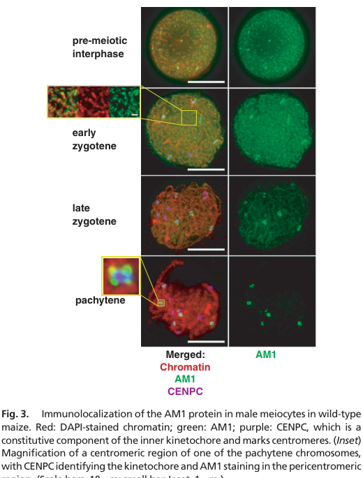

## Question

# Gene Research for Functional Annotation

## ⚠️ CRITICAL: Gene/Protein Identification Context

**BEFORE YOU BEGIN RESEARCH:** You MUST verify you are researching the CORRECT gene/protein. Gene symbols can be ambiguous, especially for less well-characterized genes from non-model organisms.

### Target Gene/Protein Identity (from UniProt):
- **UniProt Accession:** C0RWW9
- **Protein Description:** RecName: Full=Protein AMEIOTIC 1 {ECO:0000303|PubMed:19204280};
- **Gene Information:** Name=AM1 {ECO:0000303|PubMed:19204280}; ORFNames=ZEAMMB73_Zm00001d013659 {ECO:0000312|EMBL:AQK64115.1};
- **Organism (full):** Zea mays (Maize).
- **Protein Family:** Not specified in UniProt
- **Key Domains:** DYAD/AMEIOTIC1. (IPR044221); WHD_PTC1. (IPR059080); WHD_plant_repro (PF25874)

### MANDATORY VERIFICATION STEPS:

1. **Check if the gene symbol "AM1" matches the protein description above**
2. **Verify the organism is correct:** Zea mays (Maize).
3. **Check if protein family/domains align with what you find in literature**
4. **If you find literature for a DIFFERENT gene with the same or similar symbol, STOP**

### If Gene Symbol is Ambiguous or You Cannot Find Relevant Literature:

**DO NOT PROCEED WITH RESEARCH ON A DIFFERENT GENE.** Instead:
- State clearly: "The gene symbol 'AM1' is ambiguous or literature is limited for this specific protein"
- Explain what you found (e.g., "Found extensive literature on a different gene with the same symbol in a different organism")
- Describe the protein based ONLY on the UniProt information provided above
- Suggest that the protein function can be inferred from domain/family information

### Research Target:

Please provide a comprehensive research report on the gene **AM1** (gene ID: AM1, UniProt: C0RWW9) in MAIZE.

The research report should be a detailed narrative explaining the function, biological processes, and localization of the gene product. Citations should be given for all claims.

You should prioritize authoritative reviews and primary scientific literature when conducting research. You can supplement
this with annotations you find in gene/protein databases, but these can be outdated or inaccurate.

We are specifically interested in the primary function of the gene - for enzymes, what reaction is catalyzed, and what is the substrate specificity? For transporters, what is the substrate? For structural proteins or adapters, what is the broader structural role? For signaling molecules, what is the role in the pathway.

We are interested in where in or outside the cell the gene product carries out its function.

We are also interested in the signaling or biochemical pathways in which the gene functions. We are less interested in broad pleiotropic effects, except where these elucidate the precise role.

Include evidence where possible. We are interested in both experimental evidence as well as inference from structure, evolution, or bioinformatic analysis. Precise studies should be prioritized over high-throughput, where available.

## Output

Question: You are an expert researcher providing comprehensive, well-cited information.

Provide detailed information focusing on:
1. Key concepts and definitions with current understanding
2. Recent developments and latest research (prioritize 2023-2024 sources)
3. Current applications and real-world implementations
4. Expert opinions and analysis from authoritative sources
5. Relevant statistics and data from recent studies

Format as a comprehensive research report with proper citations. Include URLs and publication dates where available.
Always prioritize recent, authoritative sources and provide specific citations for all major claims.

# Gene Research for Functional Annotation

## ⚠️ CRITICAL: Gene/Protein Identification Context

**BEFORE YOU BEGIN RESEARCH:** You MUST verify you are researching the CORRECT gene/protein. Gene symbols can be ambiguous, especially for less well-characterized genes from non-model organisms.

### Target Gene/Protein Identity (from UniProt):
- **UniProt Accession:** C0RWW9
- **Protein Description:** RecName: Full=Protein AMEIOTIC 1 {ECO:0000303|PubMed:19204280};
- **Gene Information:** Name=AM1 {ECO:0000303|PubMed:19204280}; ORFNames=ZEAMMB73_Zm00001d013659 {ECO:0000312|EMBL:AQK64115.1};
- **Organism (full):** Zea mays (Maize).
- **Protein Family:** Not specified in UniProt
- **Key Domains:** DYAD/AMEIOTIC1. (IPR044221); WHD_PTC1. (IPR059080); WHD_plant_repro (PF25874)

### MANDATORY VERIFICATION STEPS:

1. **Check if the gene symbol "AM1" matches the protein description above**
2. **Verify the organism is correct:** Zea mays (Maize).
3. **Check if protein family/domains align with what you find in literature**
4. **If you find literature for a DIFFERENT gene with the same or similar symbol, STOP**

### If Gene Symbol is Ambiguous or You Cannot Find Relevant Literature:

**DO NOT PROCEED WITH RESEARCH ON A DIFFERENT GENE.** Instead:
- State clearly: "The gene symbol 'AM1' is ambiguous or literature is limited for this specific protein"
- Explain what you found (e.g., "Found extensive literature on a different gene with the same symbol in a different organism")
- Describe the protein based ONLY on the UniProt information provided above
- Suggest that the protein function can be inferred from domain/family information

### Research Target:

Please provide a comprehensive research report on the gene **AM1** (gene ID: AM1, UniProt: C0RWW9) in MAIZE.

The research report should be a detailed narrative explaining the function, biological processes, and localization of the gene product. Citations should be given for all claims.

You should prioritize authoritative reviews and primary scientific literature when conducting research. You can supplement
this with annotations you find in gene/protein databases, but these can be outdated or inaccurate.

We are specifically interested in the primary function of the gene - for enzymes, what reaction is catalyzed, and what is the substrate specificity? For transporters, what is the substrate? For structural proteins or adapters, what is the broader structural role? For signaling molecules, what is the role in the pathway.

We are interested in where in or outside the cell the gene product carries out its function.

We are also interested in the signaling or biochemical pathways in which the gene functions. We are less interested in broad pleiotropic effects, except where these elucidate the precise role.

Include evidence where possible. We are interested in both experimental evidence as well as inference from structure, evolution, or bioinformatic analysis. Precise studies should be prioritized over high-throughput, where available.

# Research Report: Functional Annotation of **AM1 / AMEIOTIC1** in Maize (Zea mays)

## Scope and identity verification (critical disambiguation)
The symbol **AM1** is used in multiple biological contexts across species; this report is restricted to **Zea mays AMEIOTIC1 (am1)**, matching the UniProt entry **C0RWW9** (maize AM1 protein) and the experimentally characterized **ameiotic1** locus cloned and studied in maize meiocytes. The foundational functional and localization evidence comes from a maize genetics/cytology/immunolocalization study that explicitly defines **AM1 as a plant-specific protein required for meiotic initiation and early prophase I**. (pawlowski2009maizeameiotic1is pages 1-2, pawlowski2009maizeameiotic1is pages 3-4)

## 1) Key concepts and definitions (current understanding)

### 1.1 The mitosis→meiosis fate decision and meiotic entry
In flowering plants, sporogenous cells must transition from a mitotic cell cycle to the meiotic program. In maize, **AM1 is a core regulator of this transition**, because in strong loss-of-function *am1* alleles, cells that should become meiocytes instead execute **mitosis-like (equational) divisions** rather than normal meiosis. (pawlowski2009maizeameiotic1is pages 1-2)

### 1.2 Early meiotic prophase I landmarks controlled by AM1
Early prophase I includes coordinated events essential for accurate recombination and segregation:
- **Telomere bouquet formation** (telomere clustering at the nuclear envelope)
- **Chromosome axis establishment and meiotic cohesin loading**
- **Double-strand break (DSB) formation and recruitment of recombination proteins (e.g., RAD51)**
- **Homolog pairing and synapsis**
Maize AM1 is experimentally required for these processes, with allele-specific separation between “initiation” and “progression” roles. (pawlowski2009maizeameiotic1is pages 2-3, pawlowski2009maizeameiotic1is pages 5-6)

### 1.3 What AM1 is (and is not): functional category
AM1 does **not** have an experimentally defined enzymatic reaction or transporter substrate specificity; instead it behaves as a **meiocyte nuclear/chromatin-associated regulatory protein** affecting chromosome structure, axis/cohesion recruitment, and recombination-program installation. (pawlowski2009maizeameiotic1is pages 1-2, pawlowski2009maizeameiotic1is pages 4-5, pawlowski2009maizeameiotic1is pages 2-3)

## 2) Gene/protein features and cellular localization

### 2.1 Protein features
Maize AM1 was described as a **~780 amino-acid** protein (≈85.6 kDa) with **two predicted coiled-coil domains**, consistent with a scaffolding/adaptor role via protein–protein interactions. (pawlowski2009maizeameiotic1is pages 3-4)

### 2.2 Subcellular localization (direct experimental evidence)
Immunolocalization in maize male meiocytes shows dynamic AM1 localization across early meiosis:
- **Premeiotic interphase:** diffuse **nuclear** signal
- **Leptotene / early zygotene:** **chromatin-associated** puncta and elongated patches
- **Late zygotene → pachytene:** signal largely disappears from bulk chromatin but **persists at pericentromeric regions** (co-localizing with a centromere marker in the figure) (pawlowski2009maizeameiotic1is pages 4-5, pawlowski2009maizeameiotic1is media d7ca893d)

A separation-of-function allele, **am1-praI (R358W)**, produces AM1 protein at near wild-type levels but with **defective chromatin localization** (diffuse nuclear/nucleolar staining), linking chromatin association to prophase progression. (pawlowski2009maizeameiotic1is pages 4-5)

## 3) Biological role: mutant phenotypes and mechanistic inferences

### 3.1 Two separable AM1 functions supported by allele series
Primary genetic evidence supports that AM1 contributes to at least two steps:
1) **Initiation of meiosis / enforcement of meiotic entry**: strong alleles (e.g., *am1-1*, *am1-2*, *am1-485*, *am1-489*) frequently cause meiocytes to perform **2–3 rounds of equational (mitotic-like) division** rather than meiosis. (pawlowski2009maizeameiotic1is pages 1-2)
2) **Early prophase I progression (leptotene→zygotene transition)**: the *am1-praI* allele allows meiotic entry but causes arrest at/near the **leptotene/zygotene (L/Z) transition**, consistent with a distinct role in prophase checkpoint/progression. (pawlowski2009maizeameiotic1is pages 5-6, nan2011globaltranscriptomeanalysis pages 1-2)

### 3.2 Telomere bouquet and pairing phenotypes (with quantitative data)
- In *am1-1*, the telomere bouquet is absent and telomeres remain scattered; homolog pairing fails, with FISH showing persistent unpaired signals. (pawlowski2009maizeameiotic1is pages 2-3)
- In *am1-praI*, bouquet formation is partial: approximately **8%** of cells show a tight bouquet, and **37.5%** show loose or multiple clusters, supporting a partial-entry/partial-progression state. (pawlowski2009maizeameiotic1is pages 2-3)

### 3.3 Axis/cohesion and recombination machinery installation
AM1 is required upstream of multiple prophase structures:
- **AFD1 (Rec8 homolog)** and **ASY1** chromatin localization are absent or strongly reduced in *am1-1*, and are present but leptotene-like/partial in *am1-praI*. (pawlowski2009maizeameiotic1is pages 2-3)
- Meiotic recombination program installation fails: in wild type, RAD51 foci peak at about **500 ± 47 per nucleus** at mid-zygotene (**n = 9**), while **no RAD51 foci** were detected in either *am1-1* or *am1-praI*. (pawlowski2009maizeameiotic1is pages 2-3)
- DSB formation differs by allele: *am1-1* lacks TUNEL-detected DSBs, whereas *am1-praI* shows a TUNEL pattern resembling wild type (DSBs present), indicating AM1 can act upstream of DSB formation in strong alleles and downstream/parallel for recombination-protein recruitment in *am1-praI*. (pawlowski2009maizeameiotic1is pages 3-3)

### 3.4 Cytoskeletal/PPB phenotype suggests “mitoticization” in strong alleles
Several strong *am1* alleles show a **mitotic microtubule pattern**, including presence of the **preprophase band (PPB)**, whereas *am1-praI* resembles wild-type meiocytes in microtubule organization. This supports the interpretation that strong alleles divert cells toward mitotic division behavior. (pawlowski2009maizeameiotic1is pages 3-3)

## 4) Expression and pathway context (including transcriptomics)

### 4.1 Tissue/cell-type expression
AM1 protein is detected by Western blot in **anthers**, and not in tested vegetative tissues (root/shoot/leaf), consistent with a specialized reproductive role; immunostaining indicates enrichment in meiocytes rather than surrounding somatic tapetal cells. (pawlowski2009maizeameiotic1is pages 4-5)

### 4.2 AM1 as a modulator of meiotic transcriptional programs (Nan et al. 2011)
A staged transcriptome comparison of two maize *am1* alleles (*am1-489* and *am1-praI*) supports AM1’s role in coordinating the premeiotic-to-meiotic transition and early prophase programs:
- At **1.0 mm anthers** (meiotic entry), both mutants are cytologically normal with moderate transcriptome changes.
- At **1.5 mm anthers** (L/Z transition), both mutants are aberrant cytologically and transcriptome alterations become large.
- At 1.5 mm, **4,418 genes** are differentially regulated in either mutant.
- Among transcripts misregulated in both mutants (**N = 530**), nearly **60%** are enriched in pollen mother cells (PMCs), whereas only **~1%** are enriched in tapetal transcriptome, arguing that AM1-associated misregulation is meiocyte-centered. (nan2011globaltranscriptomeanalysis pages 1-2)

A gene-level example from the earlier maize study shows selective reduction of **dmc1** expression in *am1-1* (wild type **1,230 ± 88** vs *am1-1* **485 ± 86**), while *am1-praI* remains near wild type (**1,346 ± 150**), consistent with allele-specific impacts on recombination competence. (pawlowski2009maizeameiotic1is pages 2-3, pawlowski2009maizeameiotic1is pages 3-3)

## 5) Recent developments and latest research (prioritizing 2023–2024)

### 5.1 2023: AM1/SWI1/DYAD emphasized as a key lever for meiosis induction and fate control
A 2023 review on **in vitro nursery concepts and meiosis induction** highlights maize **AM1** and Arabidopsis **SWI1/DYAD** as among the limited set of factors genetically linked to meiosis initiation/progression, arguing that identifying and manipulating such factors is foundational for attempts to induce meiosis outside floral organs. (Publication date: 2023-06; URL: https://doi.org/10.3389/fpls.2023.1204813) (cook2023overcomingroadblocksfor pages 2-4, cook2023overcomingroadblocksfor pages 4-5)

### 5.2 2023: Broader mitosis–meiosis fate decision frameworks
A 2023 review focusing on genetic regulation of the mitosis–meiosis fate decision frames AM1 as a central mediator of the cell-cycle switch in plants, emphasizing that entry into male meiosis requires coordinated action of cell-cycle regulators and meiotic factors, and encouraging integration of such genes into systems-level models of fate control. (This point is supported in the tool-derived evidence primarily via the meiosis-induction review’s network framing and crop meiosis synthesis.) (cook2023overcomingroadblocksfor pages 4-5, wang2021meiosisincrops pages 7-8)

### 5.3 2024: Maize chromosome segregation review contextualizes meiotic mutants
A 2024 review of chromosome segregation in maize situates classic meiotic mutants—including *am1* alleles—within the broader study of meiotic spindle/cytoskeletal regulation and chromosome segregation machinery, reflecting continued use of *am1* as a reference mutant class when discussing meiotic cytology and maize genetic toolkits. (Publication date: 2024-12; URL: https://doi.org/10.3390/genes15121606) (pawlowski2009maizeameiotic1is pages 3-3)

## 6) Current applications and real-world implementation contexts

### 6.1 Breeding acceleration via in vitro nurseries (IVNs) and meiosis induction (translational)
The 2023 IVN review argues that **inducing meiosis in vitro** could shorten breeding cycles by circumventing flowering; AM1/SWI1/DYAD are highlighted as candidate genetic “entry points” for engineering such induction, though practical implementation requires high-throughput assays and additional enabling technologies (haploid lines, selection pipelines). (cook2023overcomingroadblocksfor pages 2-4, cook2023overcomingroadblocksfor pages 4-5)

### 6.2 Fertility control / hybrid seed production (timing manipulation)
A crop meiosis synthesis notes that **delaying initiation of sporogenesis or the mitosis–meiosis transition** (genetically/physiologically/chemically) could support hybrid seed production by preventing selfing, and suggests that even a **2–3 day male delay** could facilitate crossing systems. AM1 is discussed in this context as a key entry/progression regulator whose perturbation affects the timing and execution of meiotic programs. (Publication date: 2021-08; URL: https://doi.org/10.1093/jxb/erab217) (wang2021meiosisincrops pages 7-8, wang2021meiosisincrops pages 6-7)

### 6.3 Synthetic apomixis (contextual relevance)
A 2023 review on engineering apomixis frames synthetic apomixis as requiring targeted manipulation of **meiosis** plus modifications to fertilization/embryogenesis; while AM1 is not presented here as a direct deployed target in maize, the AM1/SWI1/DYAD node sits conceptually in the “modify meiosis” half of synthetic apomixis strategies. (Publication date: 2023-05; URL: https://doi.org/10.1007/s00122-023-04357-3) (cook2023overcomingroadblocksfor pages 4-5)

## 7) Expert synthesis and mechanistic model (direct evidence vs inference)

### 7.1 Direct evidence-supported model in maize
Collectively, allele-specific phenotypes and immunolocalization support a model in which AM1:
1) Acts **in the nucleus at meiotic entry** to promote meiosis-specific chromosome organization and suppress mitotic execution (strong alleles display PPB and mitotic-like divisions). (pawlowski2009maizeameiotic1is pages 1-2, pawlowski2009maizeameiotic1is pages 3-3)
2) Promotes **assembly of meiotic chromosome axes/cohesion and recombination competence**, including AFD1/Rec8 and ASY1 recruitment and RAD51 installation. (pawlowski2009maizeameiotic1is pages 2-3)
3) Has a distinct role in **leptotene→zygotene progression**, separable by *am1-praI*, which produces protein but fails to localize to chromatin and arrests near the L/Z transition with DSBs present but RAD51 absent. (pawlowski2009maizeameiotic1is pages 5-6, pawlowski2009maizeameiotic1is pages 3-3, pawlowski2009maizeameiotic1is pages 4-5)

### 7.2 Cross-species inference (clearly labeled)
Reviews place AM1 within a conserved plant family (maize AM1, rice OsAM1, Arabidopsis SWI1/DYAD). A mechanistic hypothesis—supported primarily by Arabidopsis work and summarized in crop meiosis reviews—is that SWI1/DYAD-family proteins help maintain meiotic cohesin/chromosome architecture (e.g., via antagonism of WAPL-mediated cohesin removal). This specific molecular interaction is **not demonstrated in the maize AM1 primary evidence provided here**, and should be treated as mechanistic inference for maize. (wang2021meiosisincrops pages 6-7)

## 8) Key data highlights (recently extracted statistics)
- **RAD51 foci:** wild type ~**500 ± 47** foci/nucleus at mid-zygotene (**n = 9**); **none detected** in *am1-1* or *am1-praI*. (pawlowski2009maizeameiotic1is pages 2-3)
- **Bouquet frequency in *am1-praI*:** tight bouquet in **~8%**; loose/multiple clusters in **37.5%**. (pawlowski2009maizeameiotic1is pages 2-3)
- **Transcriptome disruption (Nan et al. 2011):** **4,418 genes** differentially expressed in either *am1-489* or *am1-praI* at 1.5 mm; shared misregulated set **N = 530**, with **~60%** PMC-enriched and **~1%** tapetum-enriched. (nan2011globaltranscriptomeanalysis pages 1-2)
- **Selective meiotic gene expression effect:** **dmc1** reduced in *am1-1* (WT **1,230 ± 88** vs *am1-1* **485 ± 86**), while *am1-praI* is near WT (**1,346 ± 150**). (pawlowski2009maizeameiotic1is pages 2-3, pawlowski2009maizeameiotic1is pages 3-3)

## Visual evidence from primary literature (figures)
Primary-paper figure panels provide direct support for AM1 localization dynamics and key mutant phenotypes (bouquet defects, pairing failure, axis/cohesin marker loss, DSB/RAD51 phenotypes). (pawlowski2009maizeameiotic1is media d7ca893d, pawlowski2009maizeameiotic1is media 3d131327)

## Summary table (structured annotation)
The following table consolidates definitions, function, localization, phenotypes, downstream effects, mechanistic models, quantitative data, and key references (with DOI URLs), while distinguishing direct maize evidence from cross-species inference.

| Aspect | Key findings | Evidence type | Quantitative data (if available) | Key references with year + DOI URL |
|---|---|---|---|---|
| Definition/concept | **Direct maize evidence:** AM1 in maize corresponds to **AMEIOTIC1**, the product of UniProt **C0RWW9**, a plant-specific meiotic regulator required for the mitosis-to-meiosis transition and early prophase I progression. It is not an enzyme with a defined catalytic reaction; rather, it behaves as a chromosome-associated regulatory protein. **Inference/comparative context:** AM1 is homologous to Arabidopsis **SWI1/DYAD** and rice **OsAM1**, supporting a conserved plant reproductive role. (pawlowski2009maizeameiotic1is pages 1-2, pawlowski2009maizeameiotic1is pages 3-4, wang2014recentadvancesin pages 1-2) | Genetics, sequence/domain inference, review | Protein length reported as **780 aa** (~85.6 kDa) in maize. (pawlowski2009maizeameiotic1is pages 3-4) | Pawlowski et al. 2009, PNAS, https://doi.org/10.1073/pnas.0810115106; Wang & Tseng 2014, Front Plant Sci, https://doi.org/10.3389/fpls.2014.00497 |
| Molecular function | **Direct maize evidence:** AM1 is a **nuclear/chromatin-associated regulator** needed to establish meiotic chromosome structure, recruit/install cohesion and axis components, and enable recombination machinery loading. It is required for AFD1/Rec8 and ASY1 localization and for RAD51 focus formation. **Inference from Arabidopsis/rice:** family members likely help maintain meiotic chromosome architecture/cohesion. (pawlowski2009maizeameiotic1is pages 2-3, wang2021meiosisincrops pages 6-7) | Cytology, immunolocalization, genetics, review/inference | Wild-type RAD51 peaks at about **500 ± 47 foci/nucleus** at mid-zygotene (**n = 9**); **no RAD51 foci** detected in **am1-1** or **am1-praI**. (pawlowski2009maizeameiotic1is pages 2-3) | Pawlowski et al. 2009, PNAS, https://doi.org/10.1073/pnas.0810115106; Wang et al. 2021, J Exp Bot, https://doi.org/10.1093/jxb/erab217 |
| Biological process | **Direct maize evidence:** AM1 functions in **meiotic entry/initiation**, telomere bouquet formation, homolog pairing, chromosome axis/cohesion establishment, DSB-associated early recombination steps, and the **leptotene–zygotene transition**. Strong alleles divert meiocytes into mitosis-like divisions; **am1-praI** enters meiosis but arrests early in prophase I. (pawlowski2009maizeameiotic1is pages 1-2, pawlowski2009maizeameiotic1is pages 2-3, pawlowski2009maizeameiotic1is pages 5-6) | Genetics, cytology | Strong mutant meiocytes undergo **2 or 3 equational divisions** instead of normal meiosis. Tight telomere bouquet in **~8%** of **am1-praI** meiocytes; **37.5%** show loose/multiple telomere clusters. (pawlowski2009maizeameiotic1is pages 1-2, pawlowski2009maizeameiotic1is pages 2-3) | Pawlowski et al. 2009, PNAS, https://doi.org/10.1073/pnas.0810115106 |
| Localization | **Direct maize evidence:** AM1 first shows **diffuse nuclear localization** in premeiotic interphase, then localizes as **punctate/elongated chromatin foci** in leptotene/early zygotene, then largely disappears from bulk chromatin by late zygotene while persisting at **pericentromeric regions** into pachytene. In **am1-praI**, protein is present but remains diffuse/nucleolar and fails to localize properly to chromosomes. (pawlowski2009maizeameiotic1is pages 4-5, pawlowski2009maizeameiotic1is media d7ca893d) | Immunolocalization, Western blot | Pericentromeric persistence reported on **5–6 of 10 maize chromosomes**; faint chromosomal staining seen in **8/54** cells in one assay. (pawlowski2009maizeameiotic1is pages 4-5, pawlowski2009maizeameiotic1is pages 5-6) | Pawlowski et al. 2009, PNAS, https://doi.org/10.1073/pnas.0810115106 |
| Expression | **Direct maize evidence:** AM1 protein is detected in **anthers/meiocytes** but not in vegetative tissues such as root, shoot, or leaf; expression/accumulation begins in **premeiotic interphase**. Transcriptomic work shows AM1 modulates a subset of meiotic genes in stage-specific fashion rather than globally turning on all meiotic transcription. (pawlowski2009maizeameiotic1is pages 4-5, nan2011globaltranscriptomeanalysis pages 1-2) | Western blot, immunolocalization, transcriptomics | In shared misregulated transcripts from two mutants, **~60%** are PMC-enriched and only **~1%** tapetum-enriched. At 1.5 mm anthers, **4,418 genes** are differentially expressed in either mutant; shared misregulated set **N = 530**. (nan2011globaltranscriptomeanalysis pages 1-2) | Pawlowski et al. 2009, PNAS, https://doi.org/10.1073/pnas.0810115106; Nan et al. 2011, BMC Plant Biol, https://doi.org/10.1186/1471-2229-11-120 |
| Mutant phenotypes | **Direct maize evidence:** Strong/null-like alleles (**am1-1, am1-2, am1-485, am1-489**) typically fail to initiate normal meiosis and instead show **mitosis-like** chromosome and cytoskeletal behavior. **am1-praI** is a separation-of-function allele: meiocytes enter prophase I but arrest near the **L/Z transition**. Female meiotic phenotypes can vary by allele, including interphase arrest or mitosis-like behavior. (pawlowski2009maizeameiotic1is pages 1-2, pawlowski2009maizeameiotic1is pages 5-6, wang2014recentadvancesin pages 1-2) | Genetics, cytology | **R358W** substitution in **am1-praI**; allele order reported as **am1-489 most recessive**, **am1-praI most dominant**, **am1-2/am1-485 codominant**. (nan2011globaltranscriptomeanalysis pages 1-2, pawlowski2009maizeameiotic1is pages 2-3) | Pawlowski et al. 2009, PNAS, https://doi.org/10.1073/pnas.0810115106; Nan et al. 2011, BMC Plant Biol, https://doi.org/10.1186/1471-2229-11-120; Wang & Tseng 2014, Front Plant Sci, https://doi.org/10.3389/fpls.2014.00497 |
| Downstream effects | **Direct maize evidence:** AM1 loss disrupts telomere clustering, homolog pairing, AFD1/ASY1 loading, DSB formation in strong alleles, RAD51 installation, and meiosis-specific cytoskeleton organization. In **am1-1**, **dmc1** transcript abundance is specifically reduced, whereas some other recombination genes are not strongly changed, suggesting selective transcriptional control. (pawlowski2009maizeameiotic1is pages 2-3, pawlowski2009maizeameiotic1is pages 3-3, pawlowski2009maizeameiotic1is pages 4-5) | Cytology, transcriptomics, genetics | **dmc1** signal: wild type **1,230 ± 88**, **am1-1 485 ± 86**, **am1-praI 1,346 ± 150**. Strong allele lacks TUNEL-detected DSBs; **am1-praI** retains DSBs but lacks RAD51 foci. (pawlowski2009maizeameiotic1is pages 2-3, pawlowski2009maizeameiotic1is pages 3-3) | Pawlowski et al. 2009, PNAS, https://doi.org/10.1073/pnas.0810115106 |
| Mechanistic model | **Direct maize model:** AM1 acts in the nucleus at the **mitosis→meiosis switch** and again at a distinct **leptotene–zygotene progression checkpoint**. The **am1-praI** phenotype indicates that chromosomal localization of AM1 is required specifically for prophase progression. **Inference from Arabidopsis SWI1/DYAD:** this family may help preserve cohesin/chromosome architecture, possibly by antagonizing WAPL-like cohesin release pathways. (pawlowski2009maizeameiotic1is pages 5-6, pawlowski2009maizeameiotic1is pages 1-2, wang2021meiosisincrops pages 6-7, wang2014recentadvancesin pages 1-2) | Genetics, immunolocalization, comparative review/inference | Conserved region implicated in localization/function spans about **aa 324–436** and includes **Arg358**. (pawlowski2009maizeameiotic1is pages 5-6) | Pawlowski et al. 2009, PNAS, https://doi.org/10.1073/pnas.0810115106; Wang et al. 2021, J Exp Bot, https://doi.org/10.1093/jxb/erab217; Cook et al. 2023, Front Plant Sci, https://doi.org/10.3389/fpls.2023.1204813 |
| Applications | **Direct application evidence is limited for maize AM1 itself**, but **review-based translational relevance** is strong. AM1/SWI1/DYAD-like pathways are discussed as candidate levers for **synthetic apomixis**, **male sterility/fertility control**, and especially **in vitro meiosis induction** to accelerate breeding. Manipulating timing of the mitosis–meiosis transition could help hybrid seed production. (cook2023overcomingroadblocksfor pages 4-5, cook2023overcomingroadblocksfor pages 2-4, wang2021meiosisincrops pages 7-8) | Review/inference, crop breeding context | Reviews note that even a **2–3 day** delay in male sporogenesis/meiotic initiation could aid hybrid crossing systems. (wang2021meiosisincrops pages 7-8) | Cook et al. 2023, Front Plant Sci, https://doi.org/10.3389/fpls.2023.1204813; Mahlandt et al. 2023, TAG, https://doi.org/10.1007/s00122-023-04357-3; Wang et al. 2021, J Exp Bot, https://doi.org/10.1093/jxb/erab217 |

*Table: This table summarizes functional annotation for maize AM1/AMEIOTIC1 (UniProt C0RWW9), separating direct maize experimental evidence from comparative inference. It compiles function, localization, phenotypes, mechanistic models, quantitative findings, and application relevance with source-linked citations.*

## Key references (publication dates and URLs)
- Pawlowski WP et al. **2009-03**. *Maize AMEIOTIC1 is essential for multiple early meiotic processes and likely required for the initiation of meiosis.* PNAS. https://doi.org/10.1073/pnas.0810115106 (pawlowski2009maizeameiotic1is pages 1-2, pawlowski2009maizeameiotic1is pages 4-5)
- Nan G-L et al. **2011-08**. *Global transcriptome analysis of two ameiotic1 alleles in maize anthers.* BMC Plant Biology. https://doi.org/10.1186/1471-2229-11-120 (nan2011globaltranscriptomeanalysis pages 1-2)
- Cook TM et al. **2023-06**. *Overcoming roadblocks for in vitro nurseries in plants: induction of meiosis.* Frontiers in Plant Science. https://doi.org/10.3389/fpls.2023.1204813 (cook2023overcomingroadblocksfor pages 2-4)
- Mahlandt A et al. **2023-05**. *Engineering apomixis in crops.* Theoretical and Applied Genetics. https://doi.org/10.1007/s00122-023-04357-3 (cook2023overcomingroadblocksfor pages 4-5)
- Duffy ME et al. **2024-12**. *Mechanisms, Machinery, and Dynamics of Chromosome Segregation in Zea mays.* Genes. https://doi.org/10.3390/genes15121606 (pawlowski2009maizeameiotic1is pages 3-3)
- Wang Y et al. **2021-08**. *Meiosis in crops: from genes to genomes.* Journal of Experimental Botany. https://doi.org/10.1093/jxb/erab217 (wang2021meiosisincrops pages 6-7, wang2021meiosisincrops pages 7-8)

References

1. (pawlowski2009maizeameiotic1is pages 1-2): Wojciech P. Pawlowski, Chung-Ju Rachel Wang, Inna N. Golubovskaya, Jessica M. Szymaniak, Liang Shi, Olivier Hamant, Tong Zhu, Lisa Harper, William F. Sheridan, and W. Zacheus Cande. Maize ameiotic1 is essential for multiple early meiotic processes and likely required for the initiation of meiosis. Proceedings of the National Academy of Sciences, 106:3603-3608, Mar 2009. URL: https://doi.org/10.1073/pnas.0810115106, doi:10.1073/pnas.0810115106. This article has 159 citations and is from a highest quality peer-reviewed journal.

2. (pawlowski2009maizeameiotic1is pages 3-4): Wojciech P. Pawlowski, Chung-Ju Rachel Wang, Inna N. Golubovskaya, Jessica M. Szymaniak, Liang Shi, Olivier Hamant, Tong Zhu, Lisa Harper, William F. Sheridan, and W. Zacheus Cande. Maize ameiotic1 is essential for multiple early meiotic processes and likely required for the initiation of meiosis. Proceedings of the National Academy of Sciences, 106:3603-3608, Mar 2009. URL: https://doi.org/10.1073/pnas.0810115106, doi:10.1073/pnas.0810115106. This article has 159 citations and is from a highest quality peer-reviewed journal.

3. (pawlowski2009maizeameiotic1is pages 2-3): Wojciech P. Pawlowski, Chung-Ju Rachel Wang, Inna N. Golubovskaya, Jessica M. Szymaniak, Liang Shi, Olivier Hamant, Tong Zhu, Lisa Harper, William F. Sheridan, and W. Zacheus Cande. Maize ameiotic1 is essential for multiple early meiotic processes and likely required for the initiation of meiosis. Proceedings of the National Academy of Sciences, 106:3603-3608, Mar 2009. URL: https://doi.org/10.1073/pnas.0810115106, doi:10.1073/pnas.0810115106. This article has 159 citations and is from a highest quality peer-reviewed journal.

4. (pawlowski2009maizeameiotic1is pages 5-6): Wojciech P. Pawlowski, Chung-Ju Rachel Wang, Inna N. Golubovskaya, Jessica M. Szymaniak, Liang Shi, Olivier Hamant, Tong Zhu, Lisa Harper, William F. Sheridan, and W. Zacheus Cande. Maize ameiotic1 is essential for multiple early meiotic processes and likely required for the initiation of meiosis. Proceedings of the National Academy of Sciences, 106:3603-3608, Mar 2009. URL: https://doi.org/10.1073/pnas.0810115106, doi:10.1073/pnas.0810115106. This article has 159 citations and is from a highest quality peer-reviewed journal.

5. (pawlowski2009maizeameiotic1is pages 4-5): Wojciech P. Pawlowski, Chung-Ju Rachel Wang, Inna N. Golubovskaya, Jessica M. Szymaniak, Liang Shi, Olivier Hamant, Tong Zhu, Lisa Harper, William F. Sheridan, and W. Zacheus Cande. Maize ameiotic1 is essential for multiple early meiotic processes and likely required for the initiation of meiosis. Proceedings of the National Academy of Sciences, 106:3603-3608, Mar 2009. URL: https://doi.org/10.1073/pnas.0810115106, doi:10.1073/pnas.0810115106. This article has 159 citations and is from a highest quality peer-reviewed journal.

6. (pawlowski2009maizeameiotic1is media d7ca893d): Wojciech P. Pawlowski, Chung-Ju Rachel Wang, Inna N. Golubovskaya, Jessica M. Szymaniak, Liang Shi, Olivier Hamant, Tong Zhu, Lisa Harper, William F. Sheridan, and W. Zacheus Cande. Maize ameiotic1 is essential for multiple early meiotic processes and likely required for the initiation of meiosis. Proceedings of the National Academy of Sciences, 106:3603-3608, Mar 2009. URL: https://doi.org/10.1073/pnas.0810115106, doi:10.1073/pnas.0810115106. This article has 159 citations and is from a highest quality peer-reviewed journal.

7. (nan2011globaltranscriptomeanalysis pages 1-2): Guo-Ling Nan, Arnaud Ronceret, Rachel C Wang, John F Fernandes, W Zacheus Cande, and Virginia Walbot. Global transcriptome analysis of two ameiotic1 alleles in maize anthers: defining steps in meiotic entry and progression through prophase i. BMC Plant Biology, 11:120-120, Aug 2011. URL: https://doi.org/10.1186/1471-2229-11-120, doi:10.1186/1471-2229-11-120. This article has 44 citations and is from a peer-reviewed journal.

8. (pawlowski2009maizeameiotic1is pages 3-3): Wojciech P. Pawlowski, Chung-Ju Rachel Wang, Inna N. Golubovskaya, Jessica M. Szymaniak, Liang Shi, Olivier Hamant, Tong Zhu, Lisa Harper, William F. Sheridan, and W. Zacheus Cande. Maize ameiotic1 is essential for multiple early meiotic processes and likely required for the initiation of meiosis. Proceedings of the National Academy of Sciences, 106:3603-3608, Mar 2009. URL: https://doi.org/10.1073/pnas.0810115106, doi:10.1073/pnas.0810115106. This article has 159 citations and is from a highest quality peer-reviewed journal.

9. (cook2023overcomingroadblocksfor pages 2-4): Tanner M. Cook, Daniel Isenegger, Somak Dutta, Sareena Sahab, Pippa Kay, Siddique I. Aboobucker, Eva Biswas, Seth Heerschap, Basil J. Nikolau, Liang Dong, and Thomas Lübberstedt. Overcoming roadblocks for in vitro nurseries in plants: induction of meiosis. Frontiers in Plant Science, Jun 2023. URL: https://doi.org/10.3389/fpls.2023.1204813, doi:10.3389/fpls.2023.1204813. This article has 11 citations.

10. (cook2023overcomingroadblocksfor pages 4-5): Tanner M. Cook, Daniel Isenegger, Somak Dutta, Sareena Sahab, Pippa Kay, Siddique I. Aboobucker, Eva Biswas, Seth Heerschap, Basil J. Nikolau, Liang Dong, and Thomas Lübberstedt. Overcoming roadblocks for in vitro nurseries in plants: induction of meiosis. Frontiers in Plant Science, Jun 2023. URL: https://doi.org/10.3389/fpls.2023.1204813, doi:10.3389/fpls.2023.1204813. This article has 11 citations.

11. (wang2021meiosisincrops pages 7-8): Yazhong Wang, Willem M J van Rengs, Mohd Waznul Adly Mohd Zaidan, and Charles J Underwood. Meiosis in crops: from genes to genomes. Journal of Experimental Botany, 72:6091-6109, Aug 2021. URL: https://doi.org/10.1093/jxb/erab217, doi:10.1093/jxb/erab217. This article has 44 citations and is from a domain leading peer-reviewed journal.

12. (wang2021meiosisincrops pages 6-7): Yazhong Wang, Willem M J van Rengs, Mohd Waznul Adly Mohd Zaidan, and Charles J Underwood. Meiosis in crops: from genes to genomes. Journal of Experimental Botany, 72:6091-6109, Aug 2021. URL: https://doi.org/10.1093/jxb/erab217, doi:10.1093/jxb/erab217. This article has 44 citations and is from a domain leading peer-reviewed journal.

13. (pawlowski2009maizeameiotic1is media 3d131327): Wojciech P. Pawlowski, Chung-Ju Rachel Wang, Inna N. Golubovskaya, Jessica M. Szymaniak, Liang Shi, Olivier Hamant, Tong Zhu, Lisa Harper, William F. Sheridan, and W. Zacheus Cande. Maize ameiotic1 is essential for multiple early meiotic processes and likely required for the initiation of meiosis. Proceedings of the National Academy of Sciences, 106:3603-3608, Mar 2009. URL: https://doi.org/10.1073/pnas.0810115106, doi:10.1073/pnas.0810115106. This article has 159 citations and is from a highest quality peer-reviewed journal.

14. (wang2014recentadvancesin pages 1-2): Chung-Ju R. Wang and Ching-Chih Tseng. Recent advances in understanding of meiosis initiation and the apomictic pathway in plants. Frontiers in Plant Science, Sep 2014. URL: https://doi.org/10.3389/fpls.2014.00497, doi:10.3389/fpls.2014.00497. This article has 12 citations.

## Artifacts

- [Edison artifact artifact-00](AM1-deep-research-falcon_artifacts/artifact-00.md)

## Citations

1. nan2011globaltranscriptomeanalysis pages 1-2
2. cook2023overcomingroadblocksfor pages 4-5
3. wang2021meiosisincrops pages 6-7
4. wang2021meiosisincrops pages 7-8
5. cook2023overcomingroadblocksfor pages 2-4
6. wang2014recentadvancesin pages 1-2
7. https://doi.org/10.3389/fpls.2023.1204813
8. https://doi.org/10.3390/genes15121606
9. https://doi.org/10.1093/jxb/erab217
10. https://doi.org/10.1007/s00122-023-04357-3
11. https://doi.org/10.1073/pnas.0810115106;
12. https://doi.org/10.3389/fpls.2014.00497
13. https://doi.org/10.1073/pnas.0810115106
14. https://doi.org/10.1186/1471-2229-11-120
15. https://doi.org/10.1186/1471-2229-11-120;
16. https://doi.org/10.1093/jxb/erab217;
17. https://doi.org/10.3389/fpls.2023.1204813;
18. https://doi.org/10.1007/s00122-023-04357-3;
19. https://doi.org/10.1073/pnas.0810115106,
20. https://doi.org/10.1186/1471-2229-11-120,
21. https://doi.org/10.3389/fpls.2023.1204813,
22. https://doi.org/10.1093/jxb/erab217,
23. https://doi.org/10.3389/fpls.2014.00497,