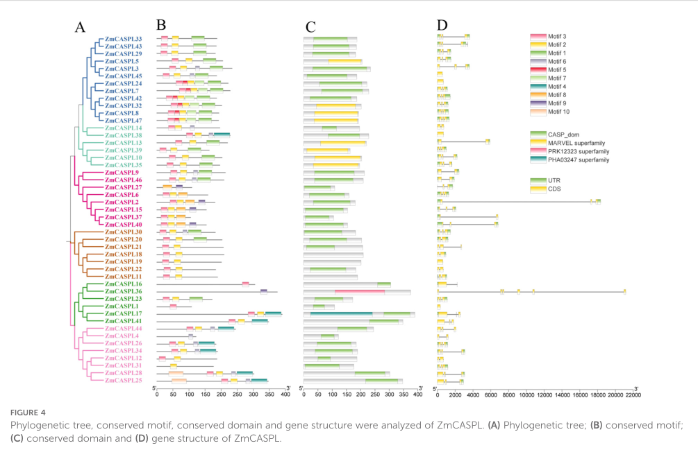

## Question

# Gene Research for Functional Annotation

## ⚠️ CRITICAL: Gene/Protein Identification Context

**BEFORE YOU BEGIN RESEARCH:** You MUST verify you are researching the CORRECT gene/protein. Gene symbols can be ambiguous, especially for less well-characterized genes from non-model organisms.

### Target Gene/Protein Identity (from UniProt):
- **UniProt Accession:** B6TUH4
- **Protein Description:** RecName: Full=CASP-like protein 1B1; Short=ZmCASPL1B1;
- **Gene Information:** Not specified in UniProt
- **Organism (full):** Zea mays (Maize).
- **Protein Family:** Belongs to the Casparian strip membrane proteins (CASP)
- **Key Domains:** CASP/CASPL. (IPR006459); CASP_dom. (IPR006702); CASPL. (IPR044173); CASP_dom (PF04535)

### MANDATORY VERIFICATION STEPS:

1. **Check if the gene symbol "CASPL1B1" matches the protein description above**
2. **Verify the organism is correct:** Zea mays (Maize).
3. **Check if protein family/domains align with what you find in literature**
4. **If you find literature for a DIFFERENT gene with the same or similar symbol, STOP**

### If Gene Symbol is Ambiguous or You Cannot Find Relevant Literature:

**DO NOT PROCEED WITH RESEARCH ON A DIFFERENT GENE.** Instead:
- State clearly: "The gene symbol 'CASPL1B1' is ambiguous or literature is limited for this specific protein"
- Explain what you found (e.g., "Found extensive literature on a different gene with the same symbol in a different organism")
- Describe the protein based ONLY on the UniProt information provided above
- Suggest that the protein function can be inferred from domain/family information

### Research Target:

Please provide a comprehensive research report on the gene **CASPL1B1** (gene ID: B6TUH4, UniProt: B6TUH4) in MAIZE.

The research report should be a detailed narrative explaining the function, biological processes, and localization of the gene product. Citations should be given for all claims.

You should prioritize authoritative reviews and primary scientific literature when conducting research. You can supplement
this with annotations you find in gene/protein databases, but these can be outdated or inaccurate.

We are specifically interested in the primary function of the gene - for enzymes, what reaction is catalyzed, and what is the substrate specificity? For transporters, what is the substrate? For structural proteins or adapters, what is the broader structural role? For signaling molecules, what is the role in the pathway.

We are interested in where in or outside the cell the gene product carries out its function.

We are also interested in the signaling or biochemical pathways in which the gene functions. We are less interested in broad pleiotropic effects, except where these elucidate the precise role.

Include evidence where possible. We are interested in both experimental evidence as well as inference from structure, evolution, or bioinformatic analysis. Precise studies should be prioritized over high-throughput, where available.

## Output

Question: You are an expert researcher providing comprehensive, well-cited information.

Provide detailed information focusing on:
1. Key concepts and definitions with current understanding
2. Recent developments and latest research (prioritize 2023-2024 sources)
3. Current applications and real-world implementations
4. Expert opinions and analysis from authoritative sources
5. Relevant statistics and data from recent studies

Format as a comprehensive research report with proper citations. Include URLs and publication dates where available.
Always prioritize recent, authoritative sources and provide specific citations for all major claims.

# Gene Research for Functional Annotation

## ⚠️ CRITICAL: Gene/Protein Identification Context

**BEFORE YOU BEGIN RESEARCH:** You MUST verify you are researching the CORRECT gene/protein. Gene symbols can be ambiguous, especially for less well-characterized genes from non-model organisms.

### Target Gene/Protein Identity (from UniProt):
- **UniProt Accession:** B6TUH4
- **Protein Description:** RecName: Full=CASP-like protein 1B1; Short=ZmCASPL1B1;
- **Gene Information:** Not specified in UniProt
- **Organism (full):** Zea mays (Maize).
- **Protein Family:** Belongs to the Casparian strip membrane proteins (CASP)
- **Key Domains:** CASP/CASPL. (IPR006459); CASP_dom. (IPR006702); CASPL. (IPR044173); CASP_dom (PF04535)

### MANDATORY VERIFICATION STEPS:

1. **Check if the gene symbol "CASPL1B1" matches the protein description above**
2. **Verify the organism is correct:** Zea mays (Maize).
3. **Check if protein family/domains align with what you find in literature**
4. **If you find literature for a DIFFERENT gene with the same or similar symbol, STOP**

### If Gene Symbol is Ambiguous or You Cannot Find Relevant Literature:

**DO NOT PROCEED WITH RESEARCH ON A DIFFERENT GENE.** Instead:
- State clearly: "The gene symbol 'CASPL1B1' is ambiguous or literature is limited for this specific protein"
- Explain what you found (e.g., "Found extensive literature on a different gene with the same symbol in a different organism")
- Describe the protein based ONLY on the UniProt information provided above
- Suggest that the protein function can be inferred from domain/family information

### Research Target:

Please provide a comprehensive research report on the gene **CASPL1B1** (gene ID: B6TUH4, UniProt: B6TUH4) in MAIZE.

The research report should be a detailed narrative explaining the function, biological processes, and localization of the gene product. Citations should be given for all claims.

You should prioritize authoritative reviews and primary scientific literature when conducting research. You can supplement
this with annotations you find in gene/protein databases, but these can be outdated or inaccurate.

We are specifically interested in the primary function of the gene - for enzymes, what reaction is catalyzed, and what is the substrate specificity? For transporters, what is the substrate? For structural proteins or adapters, what is the broader structural role? For signaling molecules, what is the role in the pathway.

We are interested in where in or outside the cell the gene product carries out its function.

We are also interested in the signaling or biochemical pathways in which the gene functions. We are less interested in broad pleiotropic effects, except where these elucidate the precise role.

Include evidence where possible. We are interested in both experimental evidence as well as inference from structure, evolution, or bioinformatic analysis. Precise studies should be prioritized over high-throughput, where available.

## Research report: Functional annotation of maize **CASPL1B1 / ZmCASPL1B1** (UniProt **B6TUH4**) 

### Executive summary (evidence-weighted)
- **Direct, gene-specific experimental evidence in maize for UniProt B6TUH4 is currently scarce** in the accessible literature corpus: the best match is a **2024 maize genome-wide CASPL family analysis** that includes **ZmCASPL1** as a family member and reports limited gene-specific details (e.g., single-exon structure; phylogenetic placement), but does not report direct localization, mutant phenotypes, or biochemical activity for ZmCASPL1B1 specifically (xue2024genomewideidentificationand pages 4-6, xue2024genomewideidentificationand media 23eaa7d9).
- **The most defensible functional annotation for ZmCASPL1B1 therefore relies on (i) maize family-level evidence** (CASPL family expansion and regulatory motifs; root/stress expression of some members) and **(ii) mechanistic evidence from CASP/CASPL proteins in model systems**. CASP/CASPL proteins are best understood as **four-transmembrane (4TM) MARVEL-like membrane scaffold proteins** that organize specialized membrane microdomains associated with **localized lignin polymerization** (Casparian strip) or related cell-wall barrier processes (roppolo2014functionalandevolutionary pages 1-1, barbosa2023directedgrowthand pages 1-2).
- A closely named ortholog in **Arabidopsis, CASPL1B1**, is **expressed in suberized endodermal cells** and can **physically interact with the aquaporin PIP2;1**, suggesting a plausible role for CASPL1B1-type proteins in **root endodermal barrier zones** and potentially in **regulation of aquaporin complexes** (champeyroux2019regulationofa pages 1-2, champeyroux2019regulationofa pages 6-8). This is **orthology-based inference** for maize, not direct maize evidence.

---

## 1. Key concepts and definitions (current understanding)

### 1.1 Casparian strip (CS) and Casparian strip membrane domain (CSD)
The **Casparian strip** is a lignin-impregnated band in the **endodermal cell wall** that forms an **apoplastic diffusion barrier** in roots, forcing selective uptake via symplastic/transcellular routes rather than uncontrolled apoplastic flow (barbosa2023directedgrowthand pages 1-2). The **Casparian strip membrane domain (CSD)** is the specialized plasma-membrane region aligned with the strip; it is characterized by **membrane protein exclusion** and tight **membrane–cell-wall adhesion** (barbosa2023directedgrowthand pages 1-2, barbosa2023directedgrowthand pages 6-7).

### 1.2 CASP vs CASPL proteins
- **CASP (CASPARIAN STRIP MEMBRANE DOMAIN PROTEIN)** family proteins are described as **small 4TM proteins** that **mediate Casparian strip formation** by **recruiting lignin polymerization machinery** and by forming a stable membrane domain (scaffold) at the CSD (roppolo2014functionalandevolutionary pages 1-1, roppolo2014functionalandevolutionary pages 1-2).
- **CASPL (CASP-like)** proteins are a **larger, diversified family** related to CASPs and to the **MARVEL superfamily** (4TM proteins with roles in membrane microdomains). Many CASPLs can **integrate into CASP membrane domains when ectopically expressed**, suggesting they share a scaffold-forming propensity (roppolo2014functionalandevolutionary pages 1-1). In Arabidopsis, CASPLs also have broader expression outside endodermis, consistent with roles in **other cell-wall associated membrane microdomains** (roppolo2014functionalandevolutionary pages 1-1, champeyroux2019regulationofa pages 1-2).

### 1.3 What “function” means here: scaffold/organizer vs enzyme/transporter
The CASP/CASPL family is not primarily characterized as enzymes with defined catalytic substrates. Instead, the best-supported “primary function” is **membrane-domain organization/scaffolding** that spatially coordinates delivery and/or activity of **cell-wall polymerization machinery** (lignin and associated redox enzymes/peroxidases) and possibly other membrane complexes (e.g., aquaporins) (barbosa2023directedgrowthand pages 1-2, champeyroux2019regulationofa pages 1-2).

---

## 2. Target verification and identity (mandatory)

### 2.1 Target constraints provided by the user
- UniProt accession: **B6TUH4**
- Organism: **Zea mays (maize)**
- Protein: **CASP-like protein 1B1 (ZmCASPL1B1)**
- Family/domains: CASP/CASPL; PF04535; InterPro CASP/CASPL related entries

### 2.2 Verification against retrieved maize literature
A genome-wide analysis in maize identified **47 ZmCASPL genes** and includes **ZmCASPL1** explicitly in a phylogenetic overview (Figure 4), supporting that maize contains a CASPL family consistent with the UniProt family assignment (published **Oct 2024**; URL https://doi.org/10.3389/fpls.2024.1477383) (xue2024genomewideidentificationand pages 1-2, xue2024genomewideidentificationand media 23eaa7d9). In the text extracted, **ZmCASPL1 is reported as a single-exon gene** (xue2024genomewideidentificationand pages 4-6). This aligns with the expectation that B6TUH4 is a maize CASPL family member, although the paper does not provide a unique mapping from ZmCASPL1 to UniProt B6TUH4 in the extracted passages.

**Conclusion:** Evidence supports that the protein identity “maize CASPL family member” is consistent with the literature and the domain family; however, **gene/protein-level experimental characterization for B6TUH4 itself remains limited** (xue2024genomewideidentificationand pages 4-6, xue2024genomewideidentificationand media 23eaa7d9).

---

## 3. Functional annotation of maize ZmCASPL1B1 (B6TUH4)

### 3.1 What is known in maize (direct evidence)
#### 3.1.1 Family membership and gene structure
- A 2024 maize study reports **47 ZmCASPL genes** and indicates **ZmCASPL1 has a single exon** (xue2024genomewideidentificationand pages 1-2, xue2024genomewideidentificationand pages 4-6). Figure-level evidence places ZmCASPL1 in a defined phylogenetic group within the family (xue2024genomewideidentificationand media 23eaa7d9).

#### 3.1.2 Regulatory context and plausible processes in maize (family-level)
The same maize family analysis reports promoter cis-element enrichments across the family, including frequent **MYB-binding sites (CAACCA)** linked to Casparian-strip-associated transcriptional programs, and shows that many ZmCASPLs exhibit stress-responsive expression patterns (drought, salinity, temperature, nutrient limitation, pathogen) at the family level (xue2024genomewideidentificationand pages 1-2, xue2024genomewideidentificationand pages 4-6). Importantly, in that dataset, root-specific high expression is highlighted for **some** ZmCASPL members (e.g., ZmCASPL21 and ZmCASPL47), which the authors interpret as candidates for CS development; **this is not shown for ZmCASPL1 in the extracted evidence** (xue2024genomewideidentificationand pages 1-2).

**Interpretation:** For ZmCASPL1B1 specifically, maize evidence supports **membership in a membrane-domain CASPL family** but does not establish its exact biological role.

### 3.2 Mechanistic function supported by authoritative primary literature (orthology/family inference)
Because ZmCASPL1B1 is not directly characterized in maize studies retrieved here, mechanistic annotation must be inferred from well-established CASP/CASPL biology:

#### 3.2.1 Membrane scaffold that organizes lignin barrier microdomains
CASPs are described as **4TM membrane scaffold proteins** that mediate Casparian strip formation by **recruiting lignin polymerization machinery**, and show high stability/low turnover at the CSD (Plant Physiology, **Jun 2014**; URL https://doi.org/10.1104/pp.114.239137) (roppolo2014functionalandevolutionary pages 1-1, roppolo2014functionalandevolutionary pages 1-2). In Arabidopsis, most CASPLs tested could **integrate into CASP membrane domains** when expressed in endodermis, supporting the idea that CASPL proteins share the same microdomain-forming propensity (roppolo2014functionalandevolutionary pages 1-1).

A later mechanistic study (Nature Communications, **Jul 2023**; URL https://doi.org/10.1038/s41467-023-37265-7) refines the model: **CASPs are not strictly required for initial localized lignification**, but are crucial to establish a CSD with **protein exclusion and membrane–wall attachment**, and to organize the growth and fusion of lignified microdomains into a continuous barrier band by **displacing secretory foci** (barbosa2023directedgrowthand pages 1-2, barbosa2023directedgrowthand pages 6-7, barbosa2023directedgrowthand pages 12-13).

**Inference for ZmCASPL1B1:** ZmCASPL1B1 is most plausibly a **4TM plasma-membrane microdomain scaffold/organizer**, potentially acting in root barrier formation processes (Casparian strip and/or suberization-associated domains), rather than a catalytic enzyme.

#### 3.2.2 Potential role in suberized endodermis and aquaporin regulation (ortholog evidence)
In Arabidopsis, **CASPL1B1** is reported to be **exclusively expressed in suberized endodermal cells** and to **physically interact with aquaporin PIP2;1** (Plant, Cell & Environment, **Mar 2019**; URL https://doi.org/10.1111/pce.13537) (champeyroux2019regulationofa pages 1-2). The same study reports that CASPL mutants did not show major whole-root hydraulic conductivity phenotypes, and concluded the tested CASPLs do not have major effects on total solute uptake/permeability of the suberin barrier; the authors note only subtle suberization-zone effects for some paralogs (champeyroux2019regulationofa pages 6-8).

The 2019 study also states that aquaporins contribute approximately **~70% of root hydraulic conductivity**, providing quantitative context for why interaction with aquaporins could be physiologically meaningful even if CASPL phenotypes are subtle at whole-root scale (champeyroux2019regulationofa pages 6-8).

**Inference for ZmCASPL1B1:** If the maize protein is functionally analogous to AtCASPL1B1, it may act in **suberized endodermal membrane microdomains** and could modulate **aquaporin complex regulation** (e.g., via interaction with phosphorylated PIP2;1 in Arabidopsis), but this remains a testable hypothesis in maize (champeyroux2019regulationofa pages 1-2).

#### 3.2.3 Monocot evidence that CASP-family proteins affect nutrient homeostasis and stress tolerance
In rice, **OsCASP1** loss of function alters **suberin deposition**, delays CS formation, and is associated with **ion imbalance** and reduced salt tolerance (Frontiers in Plant Science, **Dec 2022**; URL https://doi.org/10.3389/fpls.2022.1007300) (yang2022riceoscasp1orchestrates pages 1-2). While this is a CASP (not CASPL) example, it supports conservation in monocots that CASP-family membrane scaffolds influence **barrier formation** and **nutrient/stress physiology**.

---

## 4. Cellular and subcellular localization

### 4.1 Direct evidence
No maize experiment in the retrieved corpus reports subcellular localization for **ZmCASPL1B1/B6TUH4**.

### 4.2 Strong inference based on family topology and ortholog experiments
- CASP/CASPL proteins are **4TM plasma membrane proteins** that assemble into stable membrane microdomains (CSD) (roppolo2014functionalandevolutionary pages 1-1, barbosa2023directedgrowthand pages 1-2).
- Arabidopsis CASPL1B1 is experimentally linked to **suberized endodermal cells** and interacts with a **plasma-membrane aquaporin (PIP2;1)** (champeyroux2019regulationofa pages 1-2).

**Provisional annotation:** ZmCASPL1B1 likely localizes to the **plasma membrane**, potentially enriched in specialized membrane domains in **endodermal cells** of roots (confidence: medium at family level; low for gene-specific maize).

---

## 5. Pathways and regulatory networks most plausibly involving ZmCASPL1B1

### 5.1 Casparian strip surveillance/assembly module (structural machinery)
CASP microdomains are implicated in coordinating secretion, microdomain fusion, and spatial confinement of lignin polymerization machinery through effects on exocyst landmarks and vesicle targeting (EXO70A1 displacement; RabA associations) (barbosa2023directedgrowthand pages 12-13, barbosa2023directedgrowthand pages 1-2).

### 5.2 Transcriptional regulation linked to MYB factors
In maize, many ZmCASPL promoters contain **MYB-binding motifs (CAACCA)** associated with Casparian strip biology, consistent with regulation by MYB-centered transcriptional programs (xue2024genomewideidentificationand pages 1-2, xue2024genomewideidentificationand pages 4-6). This is a **regulatory inference** for ZmCASPL1B1 absent gene-specific promoter validation.

### 5.3 Water transport and aquaporin regulation (hypothesis based on ortholog)
Given the Arabidopsis evidence for CASPL1B1–PIP2;1 interaction, a plausible pathway-level hypothesis is that CASPL1B1-type proteins participate in **membrane microdomain organization** that affects **aquaporin trafficking, stability, or phosphorylation-dependent regulation**, especially in endodermal regions undergoing suberization (champeyroux2019regulationofa pages 1-2, champeyroux2019regulationofa pages 6-8).

---

## 6. Recent developments (prioritized 2023–2024)

### 6.1 2023: Revised mechanistic model of CASP function in CSD formation
Barbosa et al. (2023) report that CASPs are crucial for establishing hallmark CSD properties—**protein exclusion and membrane–wall adhesion**—and for **displacing secretory foci** to fuse lignin microdomains into a continuous band, while **localized lignification can still initiate without CASPs** (published Jul 2023; URL https://doi.org/10.1038/s41467-023-37265-7) (barbosa2023directedgrowthand pages 1-2, barbosa2023directedgrowthand pages 12-13). This shifts the emphasis from CASPs as strictly required “recruiters of lignification enzymes” to CASPs as **architectural organizers** of the membrane–wall microdomain.

### 6.2 2024: Maize CASPL gene family baseline resource
Xue et al. (2024) provide a genome-wide catalog of **47 maize ZmCASPL genes**, their phylogeny, motifs/gene structures, and stress/tissue expression patterns at the family level; they identify root-enriched candidates (not necessarily ZmCASPL1) and propose roles in stress responses and mineral element uptake (published Oct 2024; URL https://doi.org/10.3389/fpls.2024.1477383) (xue2024genomewideidentificationand pages 1-2, xue2024genomewideidentificationand pages 4-6).

---

## 7. Current applications and real-world implementations

### 7.1 Crop stress tolerance via root barrier engineering
A maize study on a Casparian-strip-localized protein (not CASPL1B1) demonstrates that changing barrier integrity can affect **Na+ apoplastic transport** and **salt tolerance** in maize, highlighting the translational significance of root barrier components (barbosa2023directedgrowthand pages 1-2). In parallel, rice CASP1 evidence links barrier perturbation to **ion imbalance** and reduced salt tolerance, reinforcing that CASP-family pathways are plausible breeding/engineering targets in cereals (yang2022riceoscasp1orchestrates pages 1-2).

### 7.2 Practical implication for ZmCASPL1B1
Given the likely scaffold role and potential endodermal/suberization association inferred from CASPL1B1 ortholog data, ZmCASPL1B1 is a plausible candidate gene for studies aiming to modulate:
- **Root apoplastic barrier properties** (Casparian strip/suberization organization)
- **Water-use efficiency** and **ion exclusion** under salinity/drought (as downstream outcomes)

However, **this remains speculative until maize-specific functional genetics/localization assays for B6TUH4 are available**.

---

## 8. Expert opinion and analysis (authoritative interpretations grounded in primary sources)

### 8.1 “Organizer/scaffold” as the dominant mechanistic theme
Across high-quality primary sources, CASP/CASPL proteins are consistently framed as **membrane scaffold/organizer proteins** rather than enzymes: they form stable 4TM microdomains and coordinate localized cell-wall barrier deposition processes (roppolo2014functionalandevolutionary pages 1-1, barbosa2023directedgrowthand pages 1-2).

### 8.2 Expected phenotype size: subtle modulators vs essential builders
Arabidopsis CASPL mutant analyses show **subtle or conditional phenotypes** in suberization patterning and little effect on whole-root hydraulic conductivity, despite biochemical interaction with aquaporins (champeyroux2019regulationofa pages 6-8). This suggests that for CASPL genes (including CASPL1B1-type), phenotypes may be **context-dependent** (developmental stage, stress) and potentially masked by redundancy—an important consideration for maize functional studies.

---

## 9. Statistics and quantitative data points from recent studies
- **47 ZmCASPL genes** identified genome-wide in maize (Xue et al., Oct 2024) (xue2024genomewideidentificationand pages 1-2).
- ZmCASPL1 is reported as a **single-exon gene** in that dataset (xue2024genomewideidentificationand pages 4-6).
- In Arabidopsis root water transport context, aquaporins are cited as contributing **~70% of root hydraulic conductivity** (champeyroux2019regulationofa pages 6-8).

---

## Evidence map (direct maize evidence vs inference)

| Evidence type | Key finding | Experimental basis | Implication for functional annotation (confidence) | Source |
|---|---|---|---|---|
| Maize-specific | Direct literature for **ZmCASPL1/CASPL1B1 (UniProt B6TUH4)** is very limited. In the 2024 maize CASPL family study, the only explicit gene-specific statement recovered for **ZmCASPL1** was that it is a **single-exon gene**; the same source identified **47 ZmCASPL genes** genome-wide and noted broad family links to root development, stress responsiveness, and mineral uptake. | Genome-wide identification, phylogeny, motif/gene-structure analysis, promoter cis-element survey, and RNA-seq-based family expression analysis in maize. | Supports that B6TUH4 is a bona fide **maize CASPL family member**, but does **not** directly establish its precise tissue localization or molecular function. Gene-level function for ZmCASPL1B1 remains **low confidence**. | Xue et al., *Frontiers in Plant Science* (published Oct 2024), DOI: https://doi.org/10.3389/fpls.2024.1477383 (xue2024genomewideidentificationand pages 1-2, xue2024genomewideidentificationand pages 4-6) |
| Maize-specific / family-level inference | Figure-level evidence places **ZmCASPL1** in **Group IV** of the maize CASPL phylogeny; the paper also reports that many ZmCASPLs carry **CASP/CASP-like membrane domains**, and many promoters contain **MYB-binding sites** associated with Casparian-strip biology. | Phylogenetic reconstruction plus motif/domain and promoter analyses. | Raises the likelihood that ZmCASPL1B1 is a **membrane scaffold/adaptor-like protein** involved in root barrier-related processes rather than an enzyme or transporter; still **low-to-medium confidence** because this is family-level inference, not direct assay. | Xue et al., *Frontiers in Plant Science* (published Oct 2024), DOI: https://doi.org/10.3389/fpls.2024.1477383 (xue2024genomewideidentificationand pages 4-6, xue2024genomewideidentificationand media 23eaa7d9) |
| Non-maize ortholog (Arabidopsis CASPL1B1) | **AtCASPL1B1 physically interacts with aquaporin PIP2;1**; CASPL1B1, CASPL1B2, and CASPL1D2 are **exclusively expressed in suberized endodermal cells**. | Protein interaction/co-purification and expression/localization analyses in Arabidopsis roots. | Strongest available ortholog-based clue for B6TUH4: likely a **plasma-membrane/root endodermal CASPL protein** that may participate in **suberized endodermis function** and possibly **aquaporin regulation**. For maize this remains **medium confidence** due to species extrapolation. | Champeyroux et al., *Plant, Cell & Environment* (published Mar 2019), DOI: https://doi.org/10.1111/pce.13537 (champeyroux2019regulationofa pages 1-2, champeyroux2019regulationofa pages 6-8) |
| Non-maize ortholog (Arabidopsis CASPL1B1-related mutants) | In Arabidopsis, CASPL-family mutants did **not** show major whole-root hydraulic conductivity or solute-flow phenotypes; **caspl1d1 caspl1d2** showed only a **weak enlargement of the continuous suberization zone** under some conditions. | Mutant analysis, RT-qPCR knockdown validation, suberin staining, root hydraulic conductivity and solute flow assays. | Suggests CASPL1B1-type proteins may have **subtle regulatory/scaffolding roles** rather than being primary determinants of bulk root water transport. For ZmCASPL1B1: likely **modulator** rather than core transporter; **medium confidence** as comparative inference. | Champeyroux et al., *Plant, Cell & Environment* (published Mar 2019), DOI: https://doi.org/10.1111/pce.13537 (champeyroux2019regulationofa pages 1-2, champeyroux2019regulationofa pages 6-8) |
| Non-maize family mechanism (Arabidopsis CASPs) | CASP proteins are **small four-transmembrane proteins** that form a **stable membrane scaffold** at the Casparian strip membrane domain; full CASP knockout showed localized lignification can still initiate, but CASPs are needed to organize microdomains, exclude proteins, mediate membrane-wall attachment, and promote fusion into a continuous barrier. | Arabidopsis genetics, imaging, ultrastructure, and proximity-labelling/mechanistic cell biology. | Provides the best current mechanistic model for CASP/CASPL family annotation: B6TUH4 is more plausibly a **membrane-domain organizer/scaffold** than an enzyme. Relevance to maize is **medium confidence** at family level, but **low confidence** for direct one-to-one functional assignment to ZmCASPL1B1. | Barbosa et al., *Nature Communications* (published Jul 2023), DOI: https://doi.org/10.1038/s41467-023-37265-7 (barbosa2023directedgrowthand pages 1-2) |
| Non-maize monocot ortholog/family member (rice OsCASP1) | **OsCASP1** is highly similar to Arabidopsis CASPs; loss of function causes **delayed Casparian strip formation**, **uneven lignin deposition**, altered **suberin-biosynthetic gene expression**, altered suberin deposition, **ion imbalance**, and reduced **salt tolerance**. | Rice mutant phenotyping, expression analysis, histological analysis of lignin/suberin, and stress assays. | Supports a conserved monocot role for CASP-family proteins in **root apoplastic barrier formation**, **nutrient homeostasis**, and **salt adaptation**. For ZmCASPL1B1 this is useful pathway context, but orthology is indirect; **medium confidence** only at family/process level. | Yang et al., *Frontiers in Plant Science* (published Dec 2022), DOI: https://doi.org/10.3389/fpls.2022.1007300 (yang2022riceoscasp1orchestrates pages 1-2) |
| Non-maize family evolution/background | CASPs mediate Casparian-strip deposition by **recruiting lignin polymerization machinery**; many CASPL proteins, when ectopically expressed, can integrate into the **CASP membrane domain**, suggesting a shared propensity to form **transmembrane scaffolds**. | Functional/evolutionary analysis across land plants and heterologous/endodermal expression assays. | Reinforces annotation of ZmCASPL1B1 as a **CASP-like membrane scaffold protein** rather than a catalyst with a defined substrate. This is a strong family-level inference but still **medium confidence** for the exact maize gene. | Roppolo et al., *Plant Physiology* (published Jun 2014), DOI: https://doi.org/10.1104/pp.114.239137 (xue2024genomewideidentificationand pages 1-2) |
| Maize-specific related barrier biology (not B6TUH4 directly) | In maize, a distinct Casparian-strip-associated protein, **ZmESBL/ZmSTL1** (a dirigent family protein), controls **Casparian strip thickness**, endodermal lignin deposition, **Na+ apoplastic transport**, and **transpiration-dependent salt tolerance**. | Maize genetics, localization, histology, and ion-transport/stress phenotyping. | Although not evidence for ZmCASPL1B1 itself, it shows that **Casparian strip integrity is agronomically important in maize** and supports biological plausibility that maize CASPL proteins participate in barrier-related stress adaptation. Annotation relevance to B6TUH4 is **low-to-medium confidence**. | Wang et al., *Nature Communications* (published Apr 2022), DOI: https://doi.org/10.1038/s41467-022-29809-0 (barbosa2023directedgrowthand pages 1-2) |

*Table: This table separates direct maize-specific evidence for ZmCASPL1B1/B6TUH4 from stronger mechanistic evidence derived from Arabidopsis, rice, and CASP/CASPL family studies. It is useful for making a cautious functional annotation when direct maize experiments on this specific protein are scarce.*

---

## 10. Practical next steps for definitive functional annotation (recommended experiments)
Because maize gene-specific evidence for B6TUH4 is currently limited, the most decisive experiments to validate the above hypotheses would be:
1. **Subcellular localization** (ZmCASPL1B1–fluorescent fusion under native promoter) in maize roots to test plasma-membrane microdomain enrichment (family model: CSD-like domains) (roppolo2014functionalandevolutionary pages 1-1, barbosa2023directedgrowthand pages 1-2).
2. **Cell-type expression** (endodermis/suberization zones) using promoter reporters or single-cell RNA-seq integration, to test whether it matches AtCASPL1B1’s suberized endodermis specificity (champeyroux2019regulationofa pages 1-2).
3. **Protein–protein interaction tests** with maize PIP aquaporins (co-IP, split-ubiquitin, proximity labeling), motivated by AtCASPL1B1–PIP2;1 interaction (champeyroux2019regulationofa pages 1-2).
4. **Genetic perturbation** (CRISPR knockouts; multiplex knockouts for redundancy) and barrier phenotyping (lignin/suberin staining; tracer uptake; ionomics; salt/drought assays), guided by CASP/CASPL barrier roles in Arabidopsis/rice (barbosa2023directedgrowthand pages 1-2, yang2022riceoscasp1orchestrates pages 1-2).

---

### Source list (URLs and publication dates)
- Xue B. et al. **Genome-wide identification and expression analysis of CASPL gene family in Zea mays (L.)**. *Frontiers in Plant Science*. **Published Oct 2024**. https://doi.org/10.3389/fpls.2024.1477383 (xue2024genomewideidentificationand pages 1-2, xue2024genomewideidentificationand pages 4-6, xue2024genomewideidentificationand media 23eaa7d9)
- Barbosa I.C.R. et al. **Directed growth and fusion of membrane-wall microdomains requires CASP-mediated inhibition and displacement of secretory foci**. *Nature Communications*. **Published Jul 2023**. https://doi.org/10.1038/s41467-023-37265-7 (barbosa2023directedgrowthand pages 1-2, barbosa2023directedgrowthand pages 12-13, barbosa2023directedgrowthand pages 6-7)
- Champeyroux C. et al. **Regulation of a plant aquaporin by a Casparian strip membrane domain protein-like**. *Plant, Cell & Environment*. **Published Mar 2019**. https://doi.org/10.1111/pce.13537 (champeyroux2019regulationofa pages 1-2, champeyroux2019regulationofa pages 6-8)
- Roppolo D. et al. **Functional and evolutionary analysis of the CASPARIAN STRIP MEMBRANE DOMAIN PROTEIN family**. *Plant Physiology*. **Published Jun 2014**. https://doi.org/10.1104/pp.114.239137 (roppolo2014functionalandevolutionary pages 1-1, roppolo2014functionalandevolutionary pages 1-2)
- Yang X. et al. **Rice OsCASP1 orchestrates Casparian strip formation and suberin deposition in small lateral roots to maintain nutrient homeostasis**. *Frontiers in Plant Science*. **Published Dec 2022**. https://doi.org/10.3389/fpls.2022.1007300 (yang2022riceoscasp1orchestrates pages 1-2)

References

1. (xue2024genomewideidentificationand pages 4-6): Baoping Xue, Zicong Liang, Dongyang Li, Yue Liu, and Chang Liu. Genome-wide identification and expression analysis of caspl gene family in zea mays (l.). Frontiers in Plant Science, Oct 2024. URL: https://doi.org/10.3389/fpls.2024.1477383, doi:10.3389/fpls.2024.1477383. This article has 4 citations.

2. (xue2024genomewideidentificationand media 23eaa7d9): Baoping Xue, Zicong Liang, Dongyang Li, Yue Liu, and Chang Liu. Genome-wide identification and expression analysis of caspl gene family in zea mays (l.). Frontiers in Plant Science, Oct 2024. URL: https://doi.org/10.3389/fpls.2024.1477383, doi:10.3389/fpls.2024.1477383. This article has 4 citations.

3. (roppolo2014functionalandevolutionary pages 1-1): Daniele Roppolo, Brigitte Boeckmann, Alexandre Pfister, Emmanuel Boutet, Maria C. Rubio, Valérie Dénervaud-Tendon, Joop E.M. Vermeer, Jacqueline Gheyselinck, Ioannis Xenarios, and Niko Geldner. Functional and evolutionary analysis of the casparian strip membrane domain protein family. Plant Physiology, 165:1709-1722, Jun 2014. URL: https://doi.org/10.1104/pp.114.239137, doi:10.1104/pp.114.239137. This article has 136 citations and is from a highest quality peer-reviewed journal.

4. (barbosa2023directedgrowthand pages 1-2): Inês Catarina Ramos Barbosa, D. De Bellis, Isabelle Flückiger, E. Bellani, Mathieu Grangé-Guerment, Kian Hématy, and N. Geldner. Directed growth and fusion of membrane-wall microdomains requires casp-mediated inhibition and displacement of secretory foci. Nature Communications, Jul 2023. URL: https://doi.org/10.1038/s41467-023-37265-7, doi:10.1038/s41467-023-37265-7. This article has 33 citations and is from a highest quality peer-reviewed journal.

5. (champeyroux2019regulationofa pages 1-2): Chloé Champeyroux, Jorge Bellati, Marie Barberon, Valérie Rofidal, Christophe Maurel, and Véronique Santoni. Regulation of a plant aquaporin by a casparian strip membrane domain protein-like. Plant, cell & environment, 42 6:1788-1801, Mar 2019. URL: https://doi.org/10.1111/pce.13537, doi:10.1111/pce.13537. This article has 19 citations.

6. (champeyroux2019regulationofa pages 6-8): Chloé Champeyroux, Jorge Bellati, Marie Barberon, Valérie Rofidal, Christophe Maurel, and Véronique Santoni. Regulation of a plant aquaporin by a casparian strip membrane domain protein-like. Plant, cell & environment, 42 6:1788-1801, Mar 2019. URL: https://doi.org/10.1111/pce.13537, doi:10.1111/pce.13537. This article has 19 citations.

7. (barbosa2023directedgrowthand pages 6-7): Inês Catarina Ramos Barbosa, D. De Bellis, Isabelle Flückiger, E. Bellani, Mathieu Grangé-Guerment, Kian Hématy, and N. Geldner. Directed growth and fusion of membrane-wall microdomains requires casp-mediated inhibition and displacement of secretory foci. Nature Communications, Jul 2023. URL: https://doi.org/10.1038/s41467-023-37265-7, doi:10.1038/s41467-023-37265-7. This article has 33 citations and is from a highest quality peer-reviewed journal.

8. (roppolo2014functionalandevolutionary pages 1-2): Daniele Roppolo, Brigitte Boeckmann, Alexandre Pfister, Emmanuel Boutet, Maria C. Rubio, Valérie Dénervaud-Tendon, Joop E.M. Vermeer, Jacqueline Gheyselinck, Ioannis Xenarios, and Niko Geldner. Functional and evolutionary analysis of the casparian strip membrane domain protein family. Plant Physiology, 165:1709-1722, Jun 2014. URL: https://doi.org/10.1104/pp.114.239137, doi:10.1104/pp.114.239137. This article has 136 citations and is from a highest quality peer-reviewed journal.

9. (xue2024genomewideidentificationand pages 1-2): Baoping Xue, Zicong Liang, Dongyang Li, Yue Liu, and Chang Liu. Genome-wide identification and expression analysis of caspl gene family in zea mays (l.). Frontiers in Plant Science, Oct 2024. URL: https://doi.org/10.3389/fpls.2024.1477383, doi:10.3389/fpls.2024.1477383. This article has 4 citations.

10. (barbosa2023directedgrowthand pages 12-13): Inês Catarina Ramos Barbosa, D. De Bellis, Isabelle Flückiger, E. Bellani, Mathieu Grangé-Guerment, Kian Hématy, and N. Geldner. Directed growth and fusion of membrane-wall microdomains requires casp-mediated inhibition and displacement of secretory foci. Nature Communications, Jul 2023. URL: https://doi.org/10.1038/s41467-023-37265-7, doi:10.1038/s41467-023-37265-7. This article has 33 citations and is from a highest quality peer-reviewed journal.

11. (yang2022riceoscasp1orchestrates pages 1-2): Xianfeng Yang, Huifang Xie, Qunqing Weng, Kangjing Liang, Xiujuan Zheng, Yuchun Guo, and Xinli Sun. Rice oscasp1 orchestrates casparian strip formation and suberin deposition in small lateral roots to maintain nutrient homeostasis. Frontiers in Plant Science, Dec 2022. URL: https://doi.org/10.3389/fpls.2022.1007300, doi:10.3389/fpls.2022.1007300. This article has 18 citations.

## Artifacts

- [Edison artifact artifact-00](CASPL1B1-deep-research-falcon_artifacts/artifact-00.md)

## Citations

1. barbosa2023directedgrowthand pages 1-2
2. roppolo2014functionalandevolutionary pages 1-1
3. xue2024genomewideidentificationand pages 4-6
4. xue2024genomewideidentificationand pages 1-2
5. champeyroux2019regulationofa pages 1-2
6. champeyroux2019regulationofa pages 6-8
7. barbosa2023directedgrowthand pages 6-7
8. roppolo2014functionalandevolutionary pages 1-2
9. barbosa2023directedgrowthand pages 12-13
10. https://doi.org/10.3389/fpls.2024.1477383
11. https://doi.org/10.1104/pp.114.239137
12. https://doi.org/10.1038/s41467-023-37265-7
13. https://doi.org/10.1111/pce.13537
14. https://doi.org/10.3389/fpls.2022.1007300
15. https://doi.org/10.1038/s41467-022-29809-0
16. https://doi.org/10.3389/fpls.2024.1477383,
17. https://doi.org/10.1104/pp.114.239137,
18. https://doi.org/10.1038/s41467-023-37265-7,
19. https://doi.org/10.1111/pce.13537,
20. https://doi.org/10.3389/fpls.2022.1007300,