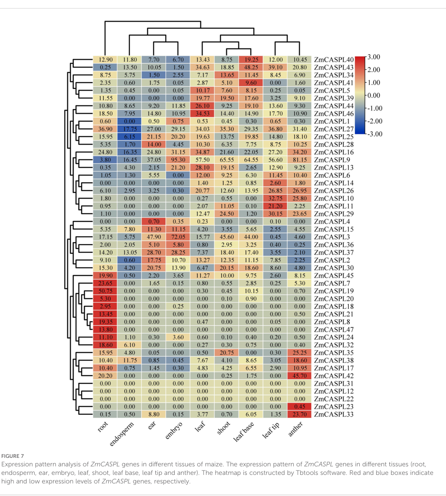

## Question

# Gene Research for Functional Annotation

## ⚠️ CRITICAL: Gene/Protein Identification Context

**BEFORE YOU BEGIN RESEARCH:** You MUST verify you are researching the CORRECT gene/protein. Gene symbols can be ambiguous, especially for less well-characterized genes from non-model organisms.

### Target Gene/Protein Identity (from UniProt):
- **UniProt Accession:** B4FBQ7
- **Protein Description:** RecName: Full=CASP-like protein 2A1; Short=ZmCASPL2A1; AltName: Full=Salicylic acid-induced protein 1-A;
- **Gene Information:** Not specified in UniProt
- **Organism (full):** Zea mays (Maize).
- **Protein Family:** Belongs to the Casparian strip membrane proteins (CASP)
- **Key Domains:** CASP/CASPL. (IPR006459); CASP_dom. (IPR006702); CASP_dom (PF04535)

### MANDATORY VERIFICATION STEPS:

1. **Check if the gene symbol "CASPL2A1" matches the protein description above**
2. **Verify the organism is correct:** Zea mays (Maize).
3. **Check if protein family/domains align with what you find in literature**
4. **If you find literature for a DIFFERENT gene with the same or similar symbol, STOP**

### If Gene Symbol is Ambiguous or You Cannot Find Relevant Literature:

**DO NOT PROCEED WITH RESEARCH ON A DIFFERENT GENE.** Instead:
- State clearly: "The gene symbol 'CASPL2A1' is ambiguous or literature is limited for this specific protein"
- Explain what you found (e.g., "Found extensive literature on a different gene with the same symbol in a different organism")
- Describe the protein based ONLY on the UniProt information provided above
- Suggest that the protein function can be inferred from domain/family information

### Research Target:

Please provide a comprehensive research report on the gene **CASPL2A1** (gene ID: B4FBQ7, UniProt: B4FBQ7) in MAIZE.

The research report should be a detailed narrative explaining the function, biological processes, and localization of the gene product. Citations should be given for all claims.

You should prioritize authoritative reviews and primary scientific literature when conducting research. You can supplement
this with annotations you find in gene/protein databases, but these can be outdated or inaccurate.

We are specifically interested in the primary function of the gene - for enzymes, what reaction is catalyzed, and what is the substrate specificity? For transporters, what is the substrate? For structural proteins or adapters, what is the broader structural role? For signaling molecules, what is the role in the pathway.

We are interested in where in or outside the cell the gene product carries out its function.

We are also interested in the signaling or biochemical pathways in which the gene functions. We are less interested in broad pleiotropic effects, except where these elucidate the precise role.

Include evidence where possible. We are interested in both experimental evidence as well as inference from structure, evolution, or bioinformatic analysis. Precise studies should be prioritized over high-throughput, where available.

## Output

Question: You are an expert researcher providing comprehensive, well-cited information.

Provide detailed information focusing on:
1. Key concepts and definitions with current understanding
2. Recent developments and latest research (prioritize 2023-2024 sources)
3. Current applications and real-world implementations
4. Expert opinions and analysis from authoritative sources
5. Relevant statistics and data from recent studies

Format as a comprehensive research report with proper citations. Include URLs and publication dates where available.
Always prioritize recent, authoritative sources and provide specific citations for all major claims.

# Gene Research for Functional Annotation

## ⚠️ CRITICAL: Gene/Protein Identification Context

**BEFORE YOU BEGIN RESEARCH:** You MUST verify you are researching the CORRECT gene/protein. Gene symbols can be ambiguous, especially for less well-characterized genes from non-model organisms.

### Target Gene/Protein Identity (from UniProt):
- **UniProt Accession:** B4FBQ7
- **Protein Description:** RecName: Full=CASP-like protein 2A1; Short=ZmCASPL2A1; AltName: Full=Salicylic acid-induced protein 1-A;
- **Gene Information:** Not specified in UniProt
- **Organism (full):** Zea mays (Maize).
- **Protein Family:** Belongs to the Casparian strip membrane proteins (CASP)
- **Key Domains:** CASP/CASPL. (IPR006459); CASP_dom. (IPR006702); CASP_dom (PF04535)

### MANDATORY VERIFICATION STEPS:

1. **Check if the gene symbol "CASPL2A1" matches the protein description above**
2. **Verify the organism is correct:** Zea mays (Maize).
3. **Check if protein family/domains align with what you find in literature**
4. **If you find literature for a DIFFERENT gene with the same or similar symbol, STOP**

### If Gene Symbol is Ambiguous or You Cannot Find Relevant Literature:

**DO NOT PROCEED WITH RESEARCH ON A DIFFERENT GENE.** Instead:
- State clearly: "The gene symbol 'CASPL2A1' is ambiguous or literature is limited for this specific protein"
- Explain what you found (e.g., "Found extensive literature on a different gene with the same symbol in a different organism")
- Describe the protein based ONLY on the UniProt information provided above
- Suggest that the protein function can be inferred from domain/family information

### Research Target:

Please provide a comprehensive research report on the gene **CASPL2A1** (gene ID: B4FBQ7, UniProt: B4FBQ7) in MAIZE.

The research report should be a detailed narrative explaining the function, biological processes, and localization of the gene product. Citations should be given for all claims.

You should prioritize authoritative reviews and primary scientific literature when conducting research. You can supplement
this with annotations you find in gene/protein databases, but these can be outdated or inaccurate.

We are specifically interested in the primary function of the gene - for enzymes, what reaction is catalyzed, and what is the substrate specificity? For transporters, what is the substrate? For structural proteins or adapters, what is the broader structural role? For signaling molecules, what is the role in the pathway.

We are interested in where in or outside the cell the gene product carries out its function.

We are also interested in the signaling or biochemical pathways in which the gene functions. We are less interested in broad pleiotropic effects, except where these elucidate the precise role.

Include evidence where possible. We are interested in both experimental evidence as well as inference from structure, evolution, or bioinformatic analysis. Precise studies should be prioritized over high-throughput, where available.

# Research Report: Functional Annotation of Maize CASPL2A1 (UniProt B4FBQ7)

## Executive summary
UniProt accession **B4FBQ7** is annotated as a **CASP-like protein 2A1 (ZmCASPL2A1)** from **Zea mays (maize)** and belongs to the **Casparian strip membrane domain proteins (CASP/CASPL)** family (PF04535/InterPro CASP/CASPL domains; user-provided UniProt context). In the retrieved full texts, **no primary paper explicitly mentions UniProt B4FBQ7** or provides an unambiguous mapping of the name “CASPL2A1” to a specific maize gene model (e.g., Zm00001d… or a numbered ZmCASPL locus). Therefore, a gene-level functional annotation for **this exact accession** must be **inference-bounded** and based on: (i) **maize CASPL family** genomics/expression evidence (2024), (ii) **maize root stress transcriptomics** (2022), and (iii) **mechanistic CASP/CASPL biology** established in other plants and grasses.

The best-supported current interpretation is that ZmCASPL2A1 is a **hydrophobic, multi-pass plasma-membrane protein** likely functioning as a **membrane scaffold/organizer** in cells involved in **diffusion-barrier formation or regulation** (Casparian strip lignification and/or endodermal suberization programs) and is plausibly integrated with **stress- and hormone-responsive pathways** (including SA/JA/ABA-associated responses) based on family-level promoter architecture and stress-responsive expression patterns in maize. (xue2024genomewideidentificationand pages 1-2, xue2024genomewideidentificationand pages 4-6, xue2024genomewideidentificationand pages 6-9)

---

## 1. Target verification and scope control (critical disambiguation)

### Verified target identity
- **Organism:** *Zea mays* (maize) (user-provided UniProt context; corroborated by maize CASPL family literature). (xue2024genomewideidentificationand pages 1-2)
- **Protein family:** CASP/CASPL (Casparian strip membrane domain proteins). (xue2024genomewideidentificationand pages 1-2)
- **Predicted architecture:** CASPL proteins are described as having **four transmembrane domains**, with loops and terminal regions typical of tetraspan membrane proteins; maize CASPL proteins are predominantly **hydrophobic**, consistent with membrane localization. (xue2024genomewideidentificationand pages 1-2, xue2024genomewideidentificationand pages 2-4)

### Ambiguity and limitation
The retrieved peer-reviewed literature **does not** provide an explicit accession crosswalk from **UniProt B4FBQ7** to a specific maize gene model used in transcriptome atlases (e.g., Phytozome Zm00001d… IDs) or to one of the numbered loci in a recent maize CASPL family paper (ZmCASPL1–ZmCASPL47). Any claim that “B4FBQ7 equals ZmCASPL##” would be speculative based on the retrieved texts and is therefore not made here. (xue2024genomewideidentificationand pages 1-2, xue2024genomewideidentificationand pages 4-6)

---

## 2. Key concepts and definitions (current understanding)

### 2.1 Casparian strip and diffusion barriers
The **Casparian strip (CS)** is a **lignin-based cell-wall modification** in the root endodermis that forms an **apoplastic diffusion barrier**, restricting non-selective solute and water flow toward the stele and contributing to selective nutrient uptake and ion homeostasis. (xue2024genomewideidentificationand pages 2-4, wang2022adirigentfamily pages 1-2)

### 2.2 CASP/CASPL proteins
- CASP/CASPL proteins are tetraspan membrane proteins linked to **Casparian strip membrane domains** and broader cell-wall barrier patterning programs. A maize CASPL family study describes CASPL proteins as having “**four transmembrane domains** … and homology with CASPs,” and notes similarity between CASPL transmembrane regions and **MARVEL-domain** proteins. (xue2024genomewideidentificationand pages 1-2)
- In maize, a genome-wide analysis reports that ~**72%** of maize ZmCASPL proteins contain **CASP domains**, while a subset contain **MARVEL domains** (ZmCASPL5/8/10/13/32/35/39/47). (xue2024genomewideidentificationand pages 4-6)

### 2.3 Regulatory pathways connected to CS integrity
A maize CASPL family paper summarizes a conserved regulatory model in which **MYB36** positively regulates components of lignin polymerization at the CS and the **CIF1/2–SGN3–SGN1** pathway monitors CS integrity. (xue2024genomewideidentificationand pages 1-2)

---

## 3. What is known specifically in maize (and what is not)

### 3.1 Evidence available for maize CASPL genes (family-level, 2024)
A 2024 maize study identified **47 ZmCASPL genes** (ZmCASPL1–ZmCASPL47) and performed promoter and expression analyses across tissues and stress conditions. (xue2024genomewideidentificationand pages 1-2)

**Root-biased expression:** 43/47 ZmCASPL genes are expressed in roots, and 14 are highly expressed in roots; several (ZmCASPL7/8/18/19/21/24/32/47) are described as specifically highly expressed in root, with **ZmCASPL21 and ZmCASPL47 only highly expressed in root**, leading the authors to propose involvement in CS development. (xue2024genomewideidentificationand pages 6-9, xue2024genomewideidentificationand pages 15-16)

**Promoter motifs linking CASPL genes to CS regulation:** promoters commonly contain **MYB-binding sites (CAACCA)**; the study notes this motif is specifically bound by **MYB36** and uses this to support the hypothesis that some maize CASPL genes are implicated in CS development. (xue2024genomewideidentificationand pages 4-6)

**SA/JA promoter elements (defense signaling linkage):** promoters of **ZmCASPL11, ZmCASPL24, ZmCASPL38, ZmCASPL43, and ZmCASPL45** were reported to contain both **JA- and SA-responsive elements**, which the authors interpret as potentially relevant to disease resistance. (xue2024genomewideidentificationand pages 4-6)

**Limitation for CASPL2A1/B4FBQ7:** none of these results directly name B4FBQ7 or “CASPL2A1”; they demonstrate, however, that maize CASPL-family genes have strong root expression and hormone/stress-associated regulatory features that are consistent with the UniProt description (CASP-like protein; salicylic-acid induced naming). (xue2024genomewideidentificationand pages 4-6, xue2024genomewideidentificationand pages 6-9)

### 3.2 Maize CASPL regulation under hypoxia (2022)
In maize roots exposed to **24 h hypoxia**, RNA-seq detected **13 CASPL genes**, with **three genes** (IDs **100281882, 100282577, 100285037**) downregulated by **>2-fold**, and **one** (ID **100285613**) upregulated. (hofmann2022hypoxiainducedaquaporinsand pages 12-13)

In the same study’s plasma-membrane proteomics dataset, CASPL proteins were **not detected** (“none … were found”), indicating that CASPL regulation in this context was supported at the transcript level but not observed in the reported plasma-membrane proteome. (hofmann2022hypoxiainducedaquaporinsand pages 16-19)

### 3.3 Maize diffusion-barrier biology as functional context (salt tolerance)
A maize genetics study showed that altering a Casparian strip–domain component (a dirigent protein, **ZmESBL/ZmSTL1**) impairs CS lignin deposition and barrier integrity, increasing apoplastic Na+ movement and causing **transpiration-dependent salt hypersensitivity**. (wang2022adirigentfamily pages 1-2)

Quantitatively, the same study reports ~**60%** weaker CS autofluorescence, ~**8%** reduced root lignin content, and ~**55%** reduction in leaf SPAD under salt at 50% relative humidity in mutants, underscoring that CS barrier integrity can have large physiological/agronomic effects. (wang2022adirigentfamily pages 9-10)

Although this is not a CASPL gene, it provides strong real-world evidence that the **endodermal diffusion barrier is a modifiable trait linked to crop salt tolerance**, which is the functional system in which many CASP/CASPL proteins operate. (wang2022adirigentfamily pages 1-2)

---

## 4. Mechanistic functional inference for B4FBQ7 (CASPL2A1)

Because B4FBQ7 is a CASPL-family member with CASP/CASPL domains (user-provided UniProt context) and because maize CASPL family genes show root-biased expression and CS-linked promoter features, the most plausible primary functional annotation for B4FBQ7 is:

### 4.1 Primary molecular role (inference)
**A membrane-domain organizing/scaffolding protein** likely participating in **specialized plasma-membrane microdomains** that coordinate deposition or patterning of barrier-related cell-wall polymers (lignin at Casparian strip domains and/or suberin-associated differentiation programs). This inference is consistent with the described CASPL tetraspan architecture in maize and conserved functions of CASP/CASPL proteins across plants. (xue2024genomewideidentificationand pages 1-2, xue2024genomewideidentificationand pages 4-6)

### 4.2 Cellular/subcellular localization
Direct localization for B4FBQ7 in maize was not retrieved. However, CASPL proteins can be plasma-membrane localized: a CASPL from watermelon fused to GFP localized to the **plasma membrane**. (yang2015acasparianstrip pages 1-2)

Thus, the best-supported localization for B4FBQ7 is **plasma membrane**, with the caveat that this is based on family evidence rather than direct maize B4FBQ7 experiments. (yang2015acasparianstrip pages 1-2, xue2024genomewideidentificationand pages 1-2)

### 4.3 Biological processes and pathways
Evidence across plants supports CASP/CASPL involvement in:
- **Casparian strip formation and lignin patterning** (family context summarized in maize CASPL paper). (xue2024genomewideidentificationand pages 1-2)
- **Suberization programs and interactions with membrane transport regulation:** In Arabidopsis, several CASPLs are **exclusively expressed in suberized endodermal cells**, and genetic perturbation of specific CASPLs produced modest but measurable changes in the continuous suberization zone under some conditions (control/NaCl), suggesting a regulatory role in endodermal suberization. (champeyroux2019regulationofa pages 1-2, champeyroux2019regulationofa pages 6-8)
- **Aquaporin regulation via protein interaction:** an Arabidopsis CASPL1B1 was able to physically interact with aquaporin **PIP2;1**, suggesting CASPLs can influence membrane transport protein regulation (post-translationally) in barrier cell types. (champeyroux2019regulationofa pages 1-2)

In grasses, barrier-related CASP functions are supported by rice genetics: **OsCASP1** influences CS formation timing and suberin/lignin deposition and contributes to salt tolerance and nutrient homeostasis (monocot functional analogy). (yang2022riceoscasp1orchestrates pages 1-2)

---

## 5. Recent developments (prioritizing 2023–2024)

### 5.1 2024: Genome-wide maize CASPL family resource (most relevant recent advance)
The most recent retrieved authoritative work is **Xue et al., 28 Oct 2024 (Frontiers in Plant Science)**, which provides:
- a whole-genome catalog of **47 ZmCASPL genes**,
- domain architecture and promoter cis-element surveys (including MYB36-binding CAACCA motifs and SA/JA elements in specific genes), and
- tissue and multi-stress expression profiling with both public RNA-seq and RT-qPCR validation for selected loci. (xue2024genomewideidentificationand pages 1-2, xue2024genomewideidentificationand pages 4-6, xue2024genomewideidentificationand pages 6-9)

This paper is currently the strongest maize-centric foundation for any functional inference about a maize CASPL protein such as B4FBQ7, although it still lacks a UniProt accession mapping. (xue2024genomewideidentificationand pages 4-6)

### 5.2 Evidence visualization from the 2024 maize CASPL resource
Figures from Xue et al. provide visual evidence for tissue/stress expression patterns and RT-qPCR validation (Figures 7, 8, 10, 11). (xue2024genomewideidentificationand media dcfc6f30, xue2024genomewideidentificationand media 8742a783, xue2024genomewideidentificationand media 547182af, xue2024genomewideidentificationand media 6bbf2d58)

---

## 6. Expression and regulation evidence (statistics and specific data)

### 6.1 Abiotic stress (maize CASPL family; RNA-seq and RT-qPCR)
In maize, RNA-seq analysis reported that under drought stress, **ZmCASPL13, ZmCASPL25, and ZmCASPL44** showed particularly strong up-regulation, “**exceeding 2.46- to 4.54-fold**.” (xue2024genomewideidentificationand pages 6-9)

RT-qPCR validation showed that under **30% PEG6000** (drought mimic), **ZmCASPL5/13/25/44** were significantly upregulated with peak times around 12–24 h depending on gene; under **150 mM NaCl**, ZmCASPL13 and ZmCASPL25 were upregulated, while ZmCASPL5 and ZmCASPL44 were downregulated. (xue2024genomewideidentificationand pages 9-13, xue2024genomewideidentificationand media 6bbf2d58)

### 6.2 Biotic stress (pathogens and microbe treatments)
Under biotic stress conditions, the maize CASPL paper reports pathogen-dependent regulation patterns:
- ZmCASPL11/14/27/3/40 upregulated under *Fusarium graminearum* but downregulated under Rice black-streaked dwarf virus; many others show the opposite trend. (xue2024genomewideidentificationand pages 6-9)
- ZmCASPL20 is reported as strongly induced by *Fusarium graminearum* (“**more than 13-**…”, consistent with >13-fold in their fold-change framing). (xue2024genomewideidentificationand pages 13-14)

### 6.3 Hypoxia (maize root RNA-seq)
Under 24 h hypoxia, 13 CASPL genes were detected, with three downregulated >2-fold (IDs **100281882, 100282577, 100285037**) and one upregulated (ID **100285613**). (hofmann2022hypoxiainducedaquaporinsand pages 12-13)

### 6.4 Endodermal barrier integrity and agronomic phenotype (maize CS domain component)
Mutants deficient in a CS-domain dirigent protein (ZmESBL) show ~**60%** weaker CS autofluorescence, ~**8%** reduced root lignin content, and ~**55%** SPAD reduction under salt at high transpiration (50% RH), supporting the magnitude of phenotypic effects achievable by altering diffusion-barrier biology. (wang2022adirigentfamily pages 9-10)

---

## 7. Current applications and real-world implementations

### 7.1 Barrier engineering for salt tolerance
The maize ZmESBL study explicitly concludes that modification of the CS barrier may be an approach for developing salt-tolerant crops, because barrier defects increase apoplastic Na+ transport and worsen salt sensitivity under high transpiration. (wang2022adirigentfamily pages 1-2)

### 7.2 Candidate-gene prioritization for stress-resilience breeding
The 2024 maize CASPL family study frames ZmCASPL genes as candidates for improving stress tolerance and nutrient use efficiency because they show strong stress-responsive expression, root specificity for certain loci (ZmCASPL21/47), and promoter features linked to CS regulation and hormone response. (xue2024genomewideidentificationand pages 6-9, xue2024genomewideidentificationand pages 15-16)

For CASPL2A1 (B4FBQ7), the practical implication is that (once a definitive gene-model mapping is established) targeted genetic manipulation or marker development could be explored in the broader program of **root barrier optimization** for stress adaptation.

---

## 8. Expert interpretation and synthesis (evidence-bounded)

### 8.1 Most defensible functional hypothesis for B4FBQ7
Given the UniProt family assignment and the best available maize-family evidence, the most defensible primary function for ZmCASPL2A1 (B4FBQ7) is **organization of a specialized plasma-membrane domain** associated with endodermal differentiation and diffusion-barrier programs (CS lignification and/or suberization-associated regulation), with the potential to influence transport physiology indirectly (e.g., via membrane protein interactions) rather than acting as an enzyme or transporter itself. (xue2024genomewideidentificationand pages 1-2, champeyroux2019regulationofa pages 1-2)

### 8.2 Relationship to salicylic acid and defense signaling
The alternative name “salicylic acid-induced protein 1-A” in UniProt is consistent with the observation that multiple maize ZmCASPL promoters contain SA/JA responsive elements and that ZmCASPL genes respond to pathogen infection, although **no retrieved study directly demonstrates SA induction of B4FBQ7**. (xue2024genomewideidentificationand pages 4-6, xue2024genomewideidentificationand pages 6-9)

### 8.3 Where the field is limited for this specific target
The major gap for B4FBQ7 is the absence (in retrieved accessible full text) of:
- a definitive **accession-to-gene-model mapping** in maize,
- direct **subcellular localization** assays for the specific protein,
- gene-specific mutants/overexpression phenotypes, and
- cell-type-resolved expression (endodermis vs other tissues) for the specific accession.

Until these are addressed, annotations for B4FBQ7 should remain explicitly labeled as **family-based inference**.

---

## 9. Evidence map (key sources)

| Citation (author, year, journal) | Publication date | URL/DOI | Organism/system | What it shows (key findings) | Relevance to UniProt B4FBQ7/ZmCASPL2A1 | Notes/limitations |
|---|---|---|---|---|---|---|
| Xue et al., 2024, *Frontiers in Plant Science* | 28 Oct 2024 | https://doi.org/10.3389/fpls.2024.1477383 | *Zea mays* (genome-wide CASPL family analysis) | Identified 47 maize CASPL genes; most encode CASP/MARVEL-domain membrane proteins; 43/47 are expressed in roots and 14 are highly root-expressed; **ZmCASPL21** and **ZmCASPL47** are specifically highly expressed only in roots; promoters of many ZmCASPL genes contain MYB-binding CAACCA motifs linked to Casparian strip regulation; many family members respond to drought, salt, heat, cold, nutrient deficiency, and pathogen infection. Authors infer ZmCASPL21 and ZmCASPL47 may participate in Casparian strip development (xue2024genomewideidentificationand pages 1-2, xue2024genomewideidentificationand pages 4-6, xue2024genomewideidentificationand pages 6-9, xue2024genomewideidentificationand pages 13-14). | **Most direct maize-family source.** Strongest currently retrieved evidence for maize CASPL genes and the best basis for inferring B4FBQ7 function if B4FBQ7 corresponds to a maize CASPL2A1-family member. | Does **not explicitly map UniProt B4FBQ7/CASPL2A1 to a Phytozome/maize gene model** in the retrieved text; conclusions for B4FBQ7 remain inferential unless accession mapping is independently verified. |
| Hofmann et al., 2022, *Antioxidants* | Apr 2022 | https://doi.org/10.3390/antiox11050836 | *Zea mays* roots under hypoxia | Root transcriptomics/proteomics under hypoxia reported 13 maize CASPL genes, with three >2-fold downregulated and one upregulated under hypoxia; supports maize CASPL family stress responsiveness in roots. | **Indirect maize evidence.** Supports the idea that maize CASPL genes participate in root stress programs relevant to barrier/water-transport biology. | Does not identify B4FBQ7 specifically; no direct functional assay of CASPL2A1 in this study. |
| Wang et al., 2022, *Nature Communications* | Apr 2022 | https://doi.org/10.1038/s41467-022-29809-0 | *Zea mays* root endodermis; ZmESBL/ZmSTL1 | Demonstrates that a maize dirigent protein localized to the Casparian strip domain is required for proper lignin deposition, Casparian strip barrier integrity, reduced apoplastic Na+ transport, and transpiration-dependent salt tolerance. Establishes the agronomic importance of endodermal diffusion barriers in maize. | **Indirect functional-context evidence.** Highly relevant to the biological pathway likely associated with root-expressed maize CASPL/CASP proteins, including possible barrier-development roles of B4FBQ7. | Focuses on a dirigent protein, not CASPL2A1; informs pathway context rather than direct gene annotation. |
| Champeyroux et al., 2019, *Plant, Cell & Environment* | Mar 2019 | https://doi.org/10.1111/pce.13537 | *Arabidopsis thaliana* CASPL proteins and aquaporin PIP2;1 | Shows several CASPL proteins are expressed in suberized endodermal cells; CASPL1B1 physically interacts with aquaporin PIP2;1; caspl1d1 caspl1d2 mutants show weak suberization phenotypes under some conditions. Supports a role for some CASPLs beyond classical Casparian strip scaffolding, including membrane transport regulation. | **Indirect family-level evidence.** Suggests CASPL proteins can act as membrane organizers/regulators in endodermal barrier cells, a plausible mechanistic hypothesis for maize B4FBQ7. | Arabidopsis paralogs may not be orthologous to maize CASPL2A1; phenotypes were modest and not necessarily conserved. |
| Yang et al., 2015, *Scientific Reports* | Sep 2015 | https://doi.org/10.1038/srep14299 | Watermelon ClCASPL and Arabidopsis AtCASPL4C1 | ClCASPL-GFP localized to the plasma membrane; AtCASPL4C1 is cold inducible; loss of AtCASPL4C1 increased biomass and cold tolerance, whereas overexpression increased cold sensitivity. Authors propose functions beyond root Casparian strip formation, possibly in vascular tissues. | **Indirect family evidence.** Supports membrane localization and stress-responsive roles for CASPL proteins, useful for annotating B4FBQ7 as a likely membrane protein involved in stress/developmental processes. | Non-maize system; role appears broader than Casparian strip and may not generalize to maize CASPL2A1. |
| Yang et al., 2022, *Frontiers in Plant Science* | Dec 2022 | https://doi.org/10.3389/fpls.2022.1007300 | Rice (*Oryza sativa*) OsCASP1 | OsCASP1 is required for proper Casparian strip formation and suberin deposition in small lateral roots; loss of function delays Casparian strip formation, alters lignin/suberin patterning, perturbs ion balance, and reduces salt tolerance. | **Indirect monocot evidence.** Particularly relevant because rice is a grass, strengthening inference that maize CASP/CASPL proteins can influence barrier formation, nutrient homeostasis, and salt adaptation. | This is **CASP1**, not CASPL2A1; family relationship is informative but not gene-specific. |
| Li et al., 2018, *Frontiers in Plant Science* | Jun 2018 | https://doi.org/10.3389/fpls.2018.00832 | Tomato Casparian strip regulatory genes | Shows spatial expression and functional conservation of core Casparian strip regulatory genes in tomato endodermis, supporting broad conservation of CS machinery outside Arabidopsis. | **Indirect pathway evidence.** Supports conservation of Casparian strip machinery across angiosperms, which strengthens family-based inference for maize B4FBQ7. | Does not study CASPL2A1 directly and is centered on tomato homologs of broader CS regulators. |
| Khasin et al., 2021, *BMC Plant Biology* | Aug 2021 | https://doi.org/10.1186/s12870-021-03149-5 | Sorghum (*Sorghum bicolor*) pathogen/drought transcriptomics | Identified a **CASP-like protein 2A1 ortholog** (Sobic.006G037300) in a coexpression module associated with predicted susceptibility/defense responses under pathogen and drought interactions. | **Indirect orthology evidence.** Suggests CASPL2A1-like genes in grasses can participate in stress/defense transcriptional networks, relevant to the alternative UniProt name “salicylic acid-induced protein 1-A.” | Coexpression evidence only; no direct functional validation. Sorghum ortholog is not proof of function for maize B4FBQ7. |
| Wang et al., 2025, *bioRxiv* (preprint) | Jan 2025 preprint | https://doi.org/10.1101/2024.12.31.630906 | Single-cell/spatial transcriptomics in *Phragmites australis* with comparison to grasses including maize | Reports CASPL2A1 expression peaking at the onset of cellular differentiation in a grass single-cell context. | **Very indirect, non-peer-reviewed.** Potentially useful as an emerging clue that CASPL2A1-like genes mark differentiation programs in grasses. | Preprint; not peer reviewed. Different species/system and limited value for firm annotation of maize B4FBQ7. |

*Table: This table summarizes the main retrieved literature relevant to maize CASPL/CASP biology and to functional inference for UniProt B4FBQ7. It highlights which sources are direct maize evidence versus broader family or pathway context, and notes key limitations for annotation.*

---

## References (retrieved full-text sources)
- Xue B. et al. **Genome-wide identification and expression analysis of CASPL gene family in Zea mays (L.)** *Frontiers in Plant Science*. Published **28 Oct 2024**. https://doi.org/10.3389/fpls.2024.1477383 (xue2024genomewideidentificationand pages 1-2)
- Hofmann A. et al. **Hypoxia-Induced Aquaporins and Regulation of Redox Homeostasis… in Maize Roots** *Antioxidants*. Published **Apr 2022**. https://doi.org/10.3390/antiox11050836 (hofmann2022hypoxiainducedaquaporinsand pages 12-13)
- Wang Y. et al. **A dirigent family protein confers variation of Casparian strip thickness and salt tolerance in maize** *Nature Communications*. Published **Apr 2022**. https://doi.org/10.1038/s41467-022-29809-0 (wang2022adirigentfamily pages 1-2)
- Champeyroux C. et al. **Regulation of a plant aquaporin by a CASPL** *Plant, Cell & Environment*. Accepted **11 Feb 2019** (published 2019). https://doi.org/10.1111/pce.13537 (champeyroux2019regulationofa pages 1-2)
- Yang J. et al. **A Casparian strip domain-like gene, CASPL, negatively alters growth and cold tolerance** *Scientific Reports*. Published **24 Sep 2015**. https://doi.org/10.1038/srep14299 (yang2015acasparianstrip pages 1-2)
- Yang X. et al. **Rice OsCASP1 orchestrates Casparian strip formation and suberin deposition…** *Frontiers in Plant Science*. Published **19 Dec 2022**. https://doi.org/10.3389/fpls.2022.1007300 (yang2022riceoscasp1orchestrates pages 1-2)

References

1. (xue2024genomewideidentificationand pages 1-2): Baoping Xue, Zicong Liang, Dongyang Li, Yue Liu, and Chang Liu. Genome-wide identification and expression analysis of caspl gene family in zea mays (l.). Frontiers in Plant Science, Oct 2024. URL: https://doi.org/10.3389/fpls.2024.1477383, doi:10.3389/fpls.2024.1477383. This article has 4 citations.

2. (xue2024genomewideidentificationand pages 4-6): Baoping Xue, Zicong Liang, Dongyang Li, Yue Liu, and Chang Liu. Genome-wide identification and expression analysis of caspl gene family in zea mays (l.). Frontiers in Plant Science, Oct 2024. URL: https://doi.org/10.3389/fpls.2024.1477383, doi:10.3389/fpls.2024.1477383. This article has 4 citations.

3. (xue2024genomewideidentificationand pages 6-9): Baoping Xue, Zicong Liang, Dongyang Li, Yue Liu, and Chang Liu. Genome-wide identification and expression analysis of caspl gene family in zea mays (l.). Frontiers in Plant Science, Oct 2024. URL: https://doi.org/10.3389/fpls.2024.1477383, doi:10.3389/fpls.2024.1477383. This article has 4 citations.

4. (xue2024genomewideidentificationand pages 2-4): Baoping Xue, Zicong Liang, Dongyang Li, Yue Liu, and Chang Liu. Genome-wide identification and expression analysis of caspl gene family in zea mays (l.). Frontiers in Plant Science, Oct 2024. URL: https://doi.org/10.3389/fpls.2024.1477383, doi:10.3389/fpls.2024.1477383. This article has 4 citations.

5. (wang2022adirigentfamily pages 1-2): Yanyang Wang, Yibo Cao, Xiaoyan Liang, Junhong Zhuang, Xiangfeng Wang, Feng Qin, and Caifu Jiang. A dirigent family protein confers variation of casparian strip thickness and salt tolerance in maize. Nature Communications, Apr 2022. URL: https://doi.org/10.1038/s41467-022-29809-0, doi:10.1038/s41467-022-29809-0. This article has 152 citations and is from a highest quality peer-reviewed journal.

6. (xue2024genomewideidentificationand pages 15-16): Baoping Xue, Zicong Liang, Dongyang Li, Yue Liu, and Chang Liu. Genome-wide identification and expression analysis of caspl gene family in zea mays (l.). Frontiers in Plant Science, Oct 2024. URL: https://doi.org/10.3389/fpls.2024.1477383, doi:10.3389/fpls.2024.1477383. This article has 4 citations.

7. (hofmann2022hypoxiainducedaquaporinsand pages 12-13): Anne Hofmann, Stefanie Wienkoop, and Sabine Lüthje. Hypoxia-induced aquaporins and regulation of redox homeostasis by a trans-plasma membrane electron transport system in maize roots. Antioxidants, 11:836, Apr 2022. URL: https://doi.org/10.3390/antiox11050836, doi:10.3390/antiox11050836. This article has 12 citations.

8. (hofmann2022hypoxiainducedaquaporinsand pages 16-19): Anne Hofmann, Stefanie Wienkoop, and Sabine Lüthje. Hypoxia-induced aquaporins and regulation of redox homeostasis by a trans-plasma membrane electron transport system in maize roots. Antioxidants, 11:836, Apr 2022. URL: https://doi.org/10.3390/antiox11050836, doi:10.3390/antiox11050836. This article has 12 citations.

9. (wang2022adirigentfamily pages 9-10): Yanyang Wang, Yibo Cao, Xiaoyan Liang, Junhong Zhuang, Xiangfeng Wang, Feng Qin, and Caifu Jiang. A dirigent family protein confers variation of casparian strip thickness and salt tolerance in maize. Nature Communications, Apr 2022. URL: https://doi.org/10.1038/s41467-022-29809-0, doi:10.1038/s41467-022-29809-0. This article has 152 citations and is from a highest quality peer-reviewed journal.

10. (yang2015acasparianstrip pages 1-2): Jinghua Yang, Changqing Ding, Baochen Xu, Cuiting Chen, Reena Narsai, Jim Whelan, Zhongyuan Hu, and Mingfang Zhang. A casparian strip domain-like gene, caspl, negatively alters growth and cold tolerance. Scientific Reports, Sep 2015. URL: https://doi.org/10.1038/srep14299, doi:10.1038/srep14299. This article has 40 citations and is from a peer-reviewed journal.

11. (champeyroux2019regulationofa pages 1-2): Chloé Champeyroux, Jorge Bellati, Marie Barberon, Valérie Rofidal, Christophe Maurel, and Véronique Santoni. Regulation of a plant aquaporin by a casparian strip membrane domain protein-like. Plant, cell & environment, 42 6:1788-1801, Mar 2019. URL: https://doi.org/10.1111/pce.13537, doi:10.1111/pce.13537. This article has 19 citations.

12. (champeyroux2019regulationofa pages 6-8): Chloé Champeyroux, Jorge Bellati, Marie Barberon, Valérie Rofidal, Christophe Maurel, and Véronique Santoni. Regulation of a plant aquaporin by a casparian strip membrane domain protein-like. Plant, cell & environment, 42 6:1788-1801, Mar 2019. URL: https://doi.org/10.1111/pce.13537, doi:10.1111/pce.13537. This article has 19 citations.

13. (yang2022riceoscasp1orchestrates pages 1-2): Xianfeng Yang, Huifang Xie, Qunqing Weng, Kangjing Liang, Xiujuan Zheng, Yuchun Guo, and Xinli Sun. Rice oscasp1 orchestrates casparian strip formation and suberin deposition in small lateral roots to maintain nutrient homeostasis. Frontiers in Plant Science, Dec 2022. URL: https://doi.org/10.3389/fpls.2022.1007300, doi:10.3389/fpls.2022.1007300. This article has 18 citations.

14. (xue2024genomewideidentificationand media dcfc6f30): Baoping Xue, Zicong Liang, Dongyang Li, Yue Liu, and Chang Liu. Genome-wide identification and expression analysis of caspl gene family in zea mays (l.). Frontiers in Plant Science, Oct 2024. URL: https://doi.org/10.3389/fpls.2024.1477383, doi:10.3389/fpls.2024.1477383. This article has 4 citations.

15. (xue2024genomewideidentificationand media 8742a783): Baoping Xue, Zicong Liang, Dongyang Li, Yue Liu, and Chang Liu. Genome-wide identification and expression analysis of caspl gene family in zea mays (l.). Frontiers in Plant Science, Oct 2024. URL: https://doi.org/10.3389/fpls.2024.1477383, doi:10.3389/fpls.2024.1477383. This article has 4 citations.

16. (xue2024genomewideidentificationand media 547182af): Baoping Xue, Zicong Liang, Dongyang Li, Yue Liu, and Chang Liu. Genome-wide identification and expression analysis of caspl gene family in zea mays (l.). Frontiers in Plant Science, Oct 2024. URL: https://doi.org/10.3389/fpls.2024.1477383, doi:10.3389/fpls.2024.1477383. This article has 4 citations.

17. (xue2024genomewideidentificationand media 6bbf2d58): Baoping Xue, Zicong Liang, Dongyang Li, Yue Liu, and Chang Liu. Genome-wide identification and expression analysis of caspl gene family in zea mays (l.). Frontiers in Plant Science, Oct 2024. URL: https://doi.org/10.3389/fpls.2024.1477383, doi:10.3389/fpls.2024.1477383. This article has 4 citations.

18. (xue2024genomewideidentificationand pages 9-13): Baoping Xue, Zicong Liang, Dongyang Li, Yue Liu, and Chang Liu. Genome-wide identification and expression analysis of caspl gene family in zea mays (l.). Frontiers in Plant Science, Oct 2024. URL: https://doi.org/10.3389/fpls.2024.1477383, doi:10.3389/fpls.2024.1477383. This article has 4 citations.

19. (xue2024genomewideidentificationand pages 13-14): Baoping Xue, Zicong Liang, Dongyang Li, Yue Liu, and Chang Liu. Genome-wide identification and expression analysis of caspl gene family in zea mays (l.). Frontiers in Plant Science, Oct 2024. URL: https://doi.org/10.3389/fpls.2024.1477383, doi:10.3389/fpls.2024.1477383. This article has 4 citations.

## Artifacts

- [Edison artifact artifact-00](CASPL2A1-deep-research-falcon_artifacts/artifact-00.md)

## Citations

1. xue2024genomewideidentificationand pages 1-2
2. xue2024genomewideidentificationand pages 4-6
3. hofmann2022hypoxiainducedaquaporinsand pages 12-13
4. hofmann2022hypoxiainducedaquaporinsand pages 16-19
5. wang2022adirigentfamily pages 1-2
6. wang2022adirigentfamily pages 9-10
7. yang2015acasparianstrip pages 1-2
8. champeyroux2019regulationofa pages 1-2
9. xue2024genomewideidentificationand pages 6-9
10. xue2024genomewideidentificationand pages 13-14
11. xue2024genomewideidentificationand pages 2-4
12. xue2024genomewideidentificationand pages 15-16
13. champeyroux2019regulationofa pages 6-8
14. xue2024genomewideidentificationand pages 9-13
15. https://doi.org/10.3389/fpls.2024.1477383
16. https://doi.org/10.3390/antiox11050836
17. https://doi.org/10.1038/s41467-022-29809-0
18. https://doi.org/10.1111/pce.13537
19. https://doi.org/10.1038/srep14299
20. https://doi.org/10.3389/fpls.2022.1007300
21. https://doi.org/10.3389/fpls.2018.00832
22. https://doi.org/10.1186/s12870-021-03149-5
23. https://doi.org/10.1101/2024.12.31.630906
24. https://doi.org/10.3389/fpls.2024.1477383,
25. https://doi.org/10.1038/s41467-022-29809-0,
26. https://doi.org/10.3390/antiox11050836,
27. https://doi.org/10.1038/srep14299,
28. https://doi.org/10.1111/pce.13537,
29. https://doi.org/10.3389/fpls.2022.1007300,