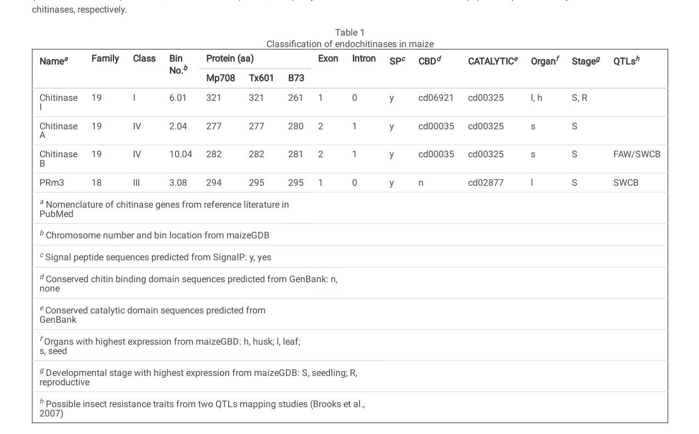

## Question

# Gene Research for Functional Annotation

## ⚠️ CRITICAL: Gene/Protein Identification Context

**BEFORE YOU BEGIN RESEARCH:** You MUST verify you are researching the CORRECT gene/protein. Gene symbols can be ambiguous, especially for less well-characterized genes from non-model organisms.

### Target Gene/Protein Identity (from UniProt):
- **UniProt Accession:** P29023
- **Protein Description:** RecName: Full=Endochitinase B; EC=3.2.1.14 {ECO:0000250|UniProtKB:P29022}; AltName: Full=ChitB {ECO:0000303|PubMed:25966977}; AltName: Full=Seed chitinase B; Flags: Precursor;
- **Gene Information:** Name=CHIB {ECO:0000305}; Synonyms=CTB1 {ECO:0000305};
- **Organism (full):** Zea mays (Maize).
- **Protein Family:** Belongs to the glycosyl hydrolase 19 family. Chitinase
- **Key Domains:** Chitin-bd_1. (IPR001002); Chitin-binding_1_CS. (IPR018371); Endochitinase-like_sf. (IPR036861); Glyco_hydro_19. (IPR016283); Glyco_hydro_19_cat. (IPR000726)

### MANDATORY VERIFICATION STEPS:

1. **Check if the gene symbol "CHIB" matches the protein description above**
2. **Verify the organism is correct:** Zea mays (Maize).
3. **Check if protein family/domains align with what you find in literature**
4. **If you find literature for a DIFFERENT gene with the same or similar symbol, STOP**

### If Gene Symbol is Ambiguous or You Cannot Find Relevant Literature:

**DO NOT PROCEED WITH RESEARCH ON A DIFFERENT GENE.** Instead:
- State clearly: "The gene symbol 'CHIB' is ambiguous or literature is limited for this specific protein"
- Explain what you found (e.g., "Found extensive literature on a different gene with the same symbol in a different organism")
- Describe the protein based ONLY on the UniProt information provided above
- Suggest that the protein function can be inferred from domain/family information

### Research Target:

Please provide a comprehensive research report on the gene **CHIB** (gene ID: CHIB, UniProt: P29023) in MAIZE.

The research report should be a detailed narrative explaining the function, biological processes, and localization of the gene product. Citations should be given for all claims.

You should prioritize authoritative reviews and primary scientific literature when conducting research. You can supplement
this with annotations you find in gene/protein databases, but these can be outdated or inaccurate.

We are specifically interested in the primary function of the gene - for enzymes, what reaction is catalyzed, and what is the substrate specificity? For transporters, what is the substrate? For structural proteins or adapters, what is the broader structural role? For signaling molecules, what is the role in the pathway.

We are interested in where in or outside the cell the gene product carries out its function.

We are also interested in the signaling or biochemical pathways in which the gene functions. We are less interested in broad pleiotropic effects, except where these elucidate the precise role.

Include evidence where possible. We are interested in both experimental evidence as well as inference from structure, evolution, or bioinformatic analysis. Precise studies should be prioritized over high-throughput, where available.

## Output

Question: You are an expert researcher providing comprehensive, well-cited information.

Provide detailed information focusing on:
1. Key concepts and definitions with current understanding
2. Recent developments and latest research (prioritize 2023-2024 sources)
3. Current applications and real-world implementations
4. Expert opinions and analysis from authoritative sources
5. Relevant statistics and data from recent studies

Format as a comprehensive research report with proper citations. Include URLs and publication dates where available.
Always prioritize recent, authoritative sources and provide specific citations for all major claims.

# Gene Research for Functional Annotation

## ⚠️ CRITICAL: Gene/Protein Identification Context

**BEFORE YOU BEGIN RESEARCH:** You MUST verify you are researching the CORRECT gene/protein. Gene symbols can be ambiguous, especially for less well-characterized genes from non-model organisms.

### Target Gene/Protein Identity (from UniProt):
- **UniProt Accession:** P29023
- **Protein Description:** RecName: Full=Endochitinase B; EC=3.2.1.14 {ECO:0000250|UniProtKB:P29022}; AltName: Full=ChitB {ECO:0000303|PubMed:25966977}; AltName: Full=Seed chitinase B; Flags: Precursor;
- **Gene Information:** Name=CHIB {ECO:0000305}; Synonyms=CTB1 {ECO:0000305};
- **Organism (full):** Zea mays (Maize).
- **Protein Family:** Belongs to the glycosyl hydrolase 19 family. Chitinase
- **Key Domains:** Chitin-bd_1. (IPR001002); Chitin-binding_1_CS. (IPR018371); Endochitinase-like_sf. (IPR036861); Glyco_hydro_19. (IPR016283); Glyco_hydro_19_cat. (IPR000726)

### MANDATORY VERIFICATION STEPS:

1. **Check if the gene symbol "CHIB" matches the protein description above**
2. **Verify the organism is correct:** Zea mays (Maize).
3. **Check if protein family/domains align with what you find in literature**
4. **If you find literature for a DIFFERENT gene with the same or similar symbol, STOP**

### If Gene Symbol is Ambiguous or You Cannot Find Relevant Literature:

**DO NOT PROCEED WITH RESEARCH ON A DIFFERENT GENE.** Instead:
- State clearly: "The gene symbol 'CHIB' is ambiguous or literature is limited for this specific protein"
- Explain what you found (e.g., "Found extensive literature on a different gene with the same symbol in a different organism")
- Describe the protein based ONLY on the UniProt information provided above
- Suggest that the protein function can be inferred from domain/family information

### Research Target:

Please provide a comprehensive research report on the gene **CHIB** (gene ID: CHIB, UniProt: P29023) in MAIZE.

The research report should be a detailed narrative explaining the function, biological processes, and localization of the gene product. Citations should be given for all claims.

You should prioritize authoritative reviews and primary scientific literature when conducting research. You can supplement
this with annotations you find in gene/protein databases, but these can be outdated or inaccurate.

We are specifically interested in the primary function of the gene - for enzymes, what reaction is catalyzed, and what is the substrate specificity? For transporters, what is the substrate? For structural proteins or adapters, what is the broader structural role? For signaling molecules, what is the role in the pathway.

We are interested in where in or outside the cell the gene product carries out its function.

We are also interested in the signaling or biochemical pathways in which the gene functions. We are less interested in broad pleiotropic effects, except where these elucidate the precise role.

Include evidence where possible. We are interested in both experimental evidence as well as inference from structure, evolution, or bioinformatic analysis. Precise studies should be prioritized over high-throughput, where available.

# Comprehensive Research Report: Functional Annotation of **maize CHIB** (UniProt **P29023**) — Endochitinase B (EC 3.2.1.14)

## 0) Identity verification (critical disambiguation)
The target is **Zea mays (maize)** **Endochitinase B**, UniProt accession **P29023**, also called **ChitB / seed chitinase B**, gene name **CHIB** (synonym **CTB1**). In maize genomic resources and the primary experimental literature retrieved here, “chitinase B / ChiB / ChitB” corresponds to gene model **GRMZM2G005633**, annotated as a **GH19** plant chitinase and **class IV endochitinase**, matching the UniProt description (GH19 family; precursor/secreted). (han2021maizeendochitinaseexpressiona pages 5-6, han2021maizeendochitinaseexpression media 094c2120)

## 1) Key concepts and definitions (current understanding)

### 1.1 What CHIB encodes
**CHIB (P29023)** encodes a **plant endochitinase** (EC **3.2.1.14**) in **glycoside hydrolase family 19 (GH19)**. GH19 chitinases are generally described as **endo-acting** enzymes that hydrolyze **β-1,4 glycosidic linkages** in **chitin** (a linear polymer of N-acetylglucosamine, GlcNAc), a key structural component of fungal cell walls and arthropod exoskeletons. (han2021maizeendochitinaseexpressiona pages 1-3, ubhayasekera2011structureandfunction pages 1-2)

### 1.2 GH19 catalytic mechanism and structural fold
A central mechanistic feature of **GH19 chitinases** is a **single-step inverting mechanism** (i.e., inversion of anomeric configuration during hydrolysis). The catalytic site lies in a **wide cleft** within a **highly α-helical, bilobed** protein fold; catalysis is associated with conserved **glutamate residues** separated by distances typical of inverting glycosidases. (ubhayasekera2011structureandfunction pages 3-5, ubhayasekera2011structureandfunction pages 6-7)

### 1.3 Plant chitinase classes and domain architecture (how CHIB fits)
Plant GH19 chitinases are commonly grouped into classes (I–VI in some schemes). Class differences are associated with **domain composition** and **loop architecture** bordering the active-site cleft:
- **Class I vs II:** broadly similar, but **class I** typically includes an N-terminal **chitin-binding module (CtBM/CBD)** that can enhance activity on **insoluble chitin** and contribute to antifungal effectiveness. (ubhayasekera2011structureandfunction pages 1-2, ubhayasekera2011structureandfunction pages 5-6)
- **Class IV:** compared to class I/II, class IV enzymes can show **loop deletions** and are described in one maize-focused study as containing a **CBD** but lacking a particular C-terminal extension (CTE) in that class definition. (han2021maizeendochitinaseexpressiona pages 3-4, ubhayasekera2011structureandfunction pages 5-6)

In maize, **CHIB/ChiB** is classified as a **class IV GH19 chitinase** and is predicted to contain both a **signal peptide** and a **chitin-binding domain (CBD)** plus the catalytic domain. (han2021maizeendochitinaseexpressiona pages 5-6, han2021maizeendochitinaseexpression media 094c2120)

## 2) CHIB (P29023) molecular features and inferred cellular localization

### 2.1 Domain architecture and secretion
A key experimentally grounded annotation from maize is that **ChiB/CHIB** is predicted to contain:
- **Signal peptide (SP)** → consistent with secretion and extracellular/apoplastic deployment
- **Chitin-binding domain (CBD; cd00035)**
- **Catalytic domain (cd00325)**
- Length in multiple maize inbreds around **281–282 aa**, with predicted mature protein mass around **~29 kDa**. (han2021maizeendochitinaseexpressiona pages 5-6, han2021maizeendochitinaseexpression media 094c2120)

These properties support the functional model that CHIB is synthesized as a **precursor** that is directed into the **secretory pathway**, and likely functions in the **apoplast/extracellular space** (including seed extracellular matrices), where it can encounter chitin-containing microbes or chitinous insect structures.

### 2.2 Substrate and reaction
Direct CHIB-specific kinetic constants were not available in the retrieved CHIB-specific evidence. However, CHIB’s assignment to **EC 3.2.1.14** and **GH19** strongly supports that its primary biochemical function is **endo-hydrolysis of β-1,4 linkages in chitin**, producing chitooligosaccharides. (han2021maizeendochitinaseexpressiona pages 1-3, ubhayasekera2011structureandfunction pages 1-2)

## 3) Biological processes and pathway context in maize

### 3.1 Defense-related function and induction by herbivory/wounding
A maize primary study investigating insect herbivory identified **ChiB/CHIB** as one of four cloned maize chitinase genes and reports that **transcript abundance increases dramatically** in response to **mechanical wounding** and **fall armyworm (Spodoptera frugiperda) feeding**. In that dataset, the **fold-change induction** of **ChiB** was generally **~10-fold** (and similar magnitude to ChiI), with genotype-dependent basal expression (higher basal ChiB expression in Mp708 than Tx601). (han2021maizeendochitinaseexpressiona pages 6-7)

This supports CHIB’s placement within plant defense signaling frameworks in which physical damage and herbivore-associated cues activate defense gene expression.

### 3.2 Expression context (seed-biased in available evidence)
In the same maize study, a compiled organ/development expression annotation indicates that **ChiB has highest expression in seed** among surveyed organs (as presented in their Table annotation). (han2021maizeendochitinaseexpressiona pages 5-6, han2021maizeendochitinaseexpression media 094c2120)

### 3.3 Potential role in insect defense: persistence through insect digestion
Although the enzymatic activity assays used in the maize study could not discriminate among individual chitinase isoforms, the authors detected **chitinase activity in fall armyworm food bolus and frass**, indicating that plant chitinases can remain active after ingestion and transit through the insect gut environment—supporting plausibility of direct anti-insect action by chitinases against chitin-containing structures (e.g., peritrophic matrix). (han2021maizeendochitinaseexpressiona pages 6-7)

### 3.4 Genetic/trait association context
ChiB maps to **chromosome 10** and co-localizes with **insect resistance QTL** regions reported for fall armyworm and southwestern corn borer (as summarized in the maize study’s annotation). While this does not prove causality, it is consistent with CHIB being a plausible contributor to quantitative resistance. (han2021maizeendochitinaseexpressiona pages 5-6)

## 4) Recent developments (prioritized 2023–2024) relevant to CHIB functional inference

### 4.1 2024 mechanistic advances for maize GH19 chitinases (contextual but informative)
A 2024 study/review focusing on **root-associated chitinases** performed modeling and mutagenesis on a **different maize GH19 chitinase (ZmChi19A)**, confirming key catalytic residues and domain requirements for activity against insoluble substrates and fungi. Key quantitative findings include:
- Apparent **Km ~30 µM** for the soluble substrate **4-MU-GlcNAc3** (for ZmChi19A). (shobade2024plantrootassociated pages 8-9)
- Activity optima: ZmChi19A activity described as optimal across **pH 7–9** and **50–60°C** (with one excerpt specifying **pH 8** and **50°C**). (shobade2024plantrootassociated pages 1-2, shobade2024plantrootassociated pages 6-8)
- Catalytic residues validated by mutagenesis: **Glu147** and **Glu169** are essential for activity. (shobade2024plantrootassociated pages 8-9, shobade2024plantrootassociated pages 6-8)

Although this is **not CHIB**, it provides a **2024 experimentally grounded biochemical reference point** for how maize GH19 enzymes achieve chitin hydrolysis and antifungal effects, and underscores the functional importance of **CBD-associated interactions** with insoluble chitinous surfaces—relevant for interpreting CHIB’s predicted SP + CBD architecture. (shobade2024plantrootassociated pages 8-9, shobade2024plantrootassociated pages 6-8)

### 4.2 2024 synthesis of application scope and expert caution
A 2024 broad review emphasizes chitinases as candidate **biopesticides/biocontrol agents** and as tools for sustainability (e.g., valorizing chitin-rich waste), while highlighting risks such as non-target effects and dual-use concerns. It also provides quantitative global context on chitin availability and waste. (unuofin2024chitinasesexpandingthe pages 1-2, unuofin2024chitinasesexpandingthe pages 12-13)

## 5) Current applications and real-world implementations (with quantitative data)

### 5.1 Chitinase-based pest management in maize systems (recent field-adjacent example)
A 2024 applied study (not maize CHIB; instead **bacterial** *Serratia marcescens* **ChiB**, GH18) illustrates current translational implementation of chitinase biology for maize pest control. Key data:
- Source strain showed **250 U/mg** chitinase activity; recombinant expression increased production **2.5-fold**. (elsayed2024genecloningheterologous pages 1-2)
- In laboratory assays against **Spodoptera frugiperda**, reported **mortality 92.75 ± 0.17%** vs control **8 ± 0.14%** (positive chemical control emamectin benzoate: **98.31 ± 0.28%**). (elsayed2024genecloningheterologous pages 11-13)
- Field trial implementation details: crude enzyme solution **2000 U/mL**, applied **10 mL per plant** (knapsack sprayer), with repeated application. (elsayed2024genecloningheterologous pages 21-22)
- Field outcomes included reductions in larval pupation of **75% at 7 days** and **88.66% at 10 days** post-treatment (emamectin: 86% and 91.3%). (elsayed2024genecloningheterologous pages 11-13)

This does **not** functionally annotate maize CHIB, but it demonstrates that chitinases are being evaluated in **controlled field conditions on maize** with measurable efficacy, supporting the relevance of plant chitinases (including CHIB) as part of broader chitinase-enabled integrated pest management concepts. (elsayed2024genecloningheterologous pages 11-13, elsayed2024genecloningheterologous pages 21-22)

### 5.2 Plant-side implementation concept: inducible chitinase defenses
The maize herbivory study provides a mechanistic implementation concept on the plant side: **CHIB expression is inducible (~10-fold)** under insect feeding and wounding, and chitinase activity can persist through insect digestion. This supports the premise that endogenous plant chitinases (including CHIB) could contribute to resistance traits and/or be leveraged in breeding/engineering approaches, even though direct CHIB efficacy assays were not retrieved here. (han2021maizeendochitinaseexpressiona pages 6-7)

## 6) Expert opinions and analysis (authoritative sources)

### 6.1 Structure–function interpretation for CHIB
The GH19 structural review emphasizes that GH19 enzymes use a **wide cleft** in an **α-helical bilobed fold** and that **loop architecture** and presence/absence of **chitin-binding modules** can modulate substrate engagement—particularly for **insoluble chitin**—which is often the biologically relevant form in fungal cell walls. This supports the interpretation that CHIB’s predicted **CBD** likely improves performance against insoluble chitinous substrates and contributes to defense effectiveness. (ubhayasekera2011structureandfunction pages 5-6, ubhayasekera2011structureandfunction pages 2-3)

### 6.2 Localization and class features consistent with extracellular defense
The GH19 review discusses extracellular targeting trends for some classes (including class IV in the excerpt) associated with absence of specific C-terminal features, and the maize CHIB prediction includes a **signal peptide**, consistent with secretion to sites of pathogen/insect interface. (ubhayasekera2011structureandfunction pages 2-3, han2021maizeendochitinaseexpressiona pages 5-6)

### 6.3 Sustainability and risk framing
The 2024 broad review frames chitinases as promising for sustainable agriculture and waste valorization, but explicitly raises concerns about ecological impact, resistance evolution, and governance/dual-use risks, recommending careful consideration when deploying chitinase technologies. (unuofin2024chitinasesexpandingthe pages 12-13)

## 7) Relevant statistics and data (recent studies)
- **CHIB (maize) induction:** ChiB transcript induction in response to wounding/herbivory is described as **~10-fold** in a maize study. (han2021maizeendochitinaseexpressiona pages 6-7)
- **CHIB (maize) structural annotation:** predicted **SP + CBD + catalytic domain**, **~281–282 aa** and **~29 kDa**. (han2021maizeendochitinaseexpressiona pages 5-6, han2021maizeendochitinaseexpression media 094c2120)
- **2024 maize GH19 kinetic reference (ZmChi19A, different gene):** apparent **Km 30 µM** for **4-MU-GlcNAc3** and optima described across **pH 7–9** and **50–60°C**. (shobade2024plantrootassociated pages 8-9, shobade2024plantrootassociated pages 1-2)
- **2024 chitin global context:** annual aquatic biosphere chitin production estimated **10^12–10^14 tonnes**, and **≥60%** of seafood/mollusc chitin residue reportedly discarded without proper management. (unuofin2024chitinasesexpandingthe pages 1-2)
- **2024 biocontrol implementation (bacterial ChiB, not maize CHIB):** lab mortality **92.75 ± 0.17%**, field pupation reduction **75% (7d)** and **88.66% (10d)**; field application **2000 U/mL**, **10 mL/plant**. (elsayed2024genecloningheterologous pages 11-13, elsayed2024genecloningheterologous pages 21-22)

## 8) Evidence-backed functional annotation summary for maize CHIB (P29023)

| Gene/protein | Names / identifiers | Enzyme class | Predicted domains / architecture | Approx. length / mass | Likely localization | Inducing conditions / expression context | Recent biochemical examples / notes | Key supporting citations |
|---|---|---|---|---|---|---|---|---|
| **CHIB (target gene)** | **Endochitinase B; ChitB; seed chitinase B; UniProt P29023; gene model GRMZM2G005633** | **EC 3.2.1.14; glycoside hydrolase family 19 (GH19); class IV plant endochitinase** | **Signal peptide present; chitin-binding domain (CBD; cd00035) present; catalytic domain (cd00325) present; class IV GH19 architecture** | **~281–282 aa; predicted mature protein ~29 kDa** | **Likely secreted / apoplastic or extracellular, consistent with signal peptide and seed/pathogenesis-related chitinase annotation** | **Transcript abundance and total chitinase activity increase after mechanical wounding and fall armyworm herbivory; high organ expression reported in seed; Table 1 image supports SP/CBD/domain assignment** | **Direct CHIB-specific kinetic constants were not provided in the retrieved excerpts; function is inferred as an endochitinase that hydrolyzes β-1,4 linkages in chitin, consistent with GH19 catalytic mechanism** | (han2021maizeendochitinaseexpressiona pages 5-6, han2021maizeendochitinaseexpressiona pages 3-4, han2021maizeendochitinaseexpressiona pages 1-3, han2021maizeendochitinaseexpression media 094c2120) |
| **ZmChi19A (comparison only; different maize GH19 gene, not CHIB)** | **Zea mays basic endochitinase; root-associated GH19 chitinase** | **GH19; class I endochitinase** | **N-terminal hevein-like CBD; α-helical catalytic domain; flexible C-terminal domain; catalytic residues E147 and E169** | **Not summarized in retrieved excerpt** | **Root-secreted / rhizosphere-associated** | **Studied as a root-associated defense enzyme; antifungal activity against *Aspergillus niger*** | **Apparent Km ~30 µM for 4-MU-GlcNAc3; optimum around pH 7–9 and 50–60°C (more specifically pH 8 and 50°C in one excerpt); CBD and flexible C-terminal domain are required for efficient colloidal chitin cleavage and fungal growth inhibition** | (shobade2024plantrootassociated pages 8-9, shobade2024plantrootassociated pages 6-8, shobade2024plantrootassociated pages 1-2, shobade2024plantrootassociated pages 4-6) |

*Table: This table summarizes the core functional annotation for the maize CHIB/ChitB protein targeted in the report, using evidence that specifically matches UniProt P29023 and the maize gene model GRMZM2G005633. It also includes a clearly separated comparison row for a different maize GH19 chitinase, ZmChi19A, to illustrate recent biochemical parameters available for related GH19 enzymes.*

In addition, the following visual evidence directly supports CHIB’s predicted domain/class assignment in maize (Table 1 from Han et al. 2021): (han2021maizeendochitinaseexpression media 094c2120)

## 9) Limitations and confidence assessment (important)
- **Strong evidence:** CHIB identity in maize (GRMZM2G005633), classification as **GH19 class IV**, predicted **signal peptide + CBD + catalytic domain**, approximate length/mass, and **induction by herbivory/wounding** with ~10-fold transcript induction are supported by primary maize literature and a table image. (han2021maizeendochitinaseexpressiona pages 5-6, han2021maizeendochitinaseexpression media 094c2120, han2021maizeendochitinaseexpressiona pages 6-7)
- **Moderate evidence (inference):** Specific subcellular localization (“apoplast/seed extracellular”) is inferred from signal peptide and class/domain context; direct localization experiments for CHIB were not present in retrieved evidence. (han2021maizeendochitinaseexpressiona pages 5-6, ubhayasekera2011structureandfunction pages 2-3)
- **Missing in retrieved corpus:** Direct CHIB biochemical characterization (e.g., kinetic constants, pH optima, detailed substrate specificity beyond “chitin”) and direct antifungal/insecticidal assays for **maize CHIB protein itself** were not available in the accessible texts. Related maize GH19 enzymes (e.g., ZmChi19A) provide mechanistic context but should not be conflated with CHIB. (shobade2024plantrootassociated pages 8-9, shobade2024plantrootassociated pages 6-8)

## 10) Key sources (with publication dates and URLs)
- Han Y, Taylor EB, Luthe D. **Maize Endochitinase Expression in Response to Fall Armyworm Herbivory.** *Journal of Chemical Ecology.* **May 2021**. https://doi.org/10.1007/s10886-021-01284-9 (han2021maizeendochitinaseexpressiona pages 5-6, han2021maizeendochitinaseexpression media 094c2120, han2021maizeendochitinaseexpressiona pages 6-7)
- Shobade SO, Zabotina OA, Nilsen-Hamilton M. **Plant root associated chitinases: structures and functions.** *Frontiers in Plant Science.* **Feb 2024**. https://doi.org/10.3389/fpls.2024.1344142 (shobade2024plantrootassociated pages 8-9, shobade2024plantrootassociated pages 1-2)
- El-Sayed GM, Emam MTH, Hammad MA, Mahmoud SH. **Gene cloning, heterologous expression, and in silico analysis of chitinase B from Serratia marcescens for biocontrol of Spodoptera frugiperda larvae infesting maize crops.** *Molecules.* **Mar 2024**. https://doi.org/10.3390/molecules29071466 (elsayed2024genecloningheterologous pages 11-13, elsayed2024genecloningheterologous pages 21-22)
- Unuofin JO et al. **Chitinases: expanding the boundaries of knowledge beyond routinized chitin degradation.** *Environmental Science and Pollution Research.* **May 2024**. https://doi.org/10.1007/s11356-024-33728-6 (unuofin2024chitinasesexpandingthe pages 1-2, unuofin2024chitinasesexpandingthe pages 12-13)
- Ubhayasekera W. **Structure and function of chitinases from glycoside hydrolase family 19.** *Polymer International.* **Jun 2011**. https://doi.org/10.1002/pi.3028 (ubhayasekera2011structureandfunction pages 3-5, ubhayasekera2011structureandfunction pages 6-7)

References

1. (han2021maizeendochitinaseexpressiona pages 5-6): Yang Han, Erin B. Taylor, and Dawn Luthe. Maize endochitinase expression in response to fall armyworm herbivory. May 2021. URL: https://doi.org/10.1007/s10886-021-01284-9, doi:10.1007/s10886-021-01284-9. This article has 18 citations and is from a peer-reviewed journal.

2. (han2021maizeendochitinaseexpression media 094c2120): Yang Han, Erin B. Taylor, and Dawn Luthe. Maize endochitinase expression in response to fall armyworm herbivory. May 2021. URL: https://doi.org/10.1007/s10886-021-01284-9, doi:10.1007/s10886-021-01284-9. This article has 18 citations and is from a peer-reviewed journal.

3. (han2021maizeendochitinaseexpressiona pages 1-3): Yang Han, Erin B. Taylor, and Dawn Luthe. Maize endochitinase expression in response to fall armyworm herbivory. May 2021. URL: https://doi.org/10.1007/s10886-021-01284-9, doi:10.1007/s10886-021-01284-9. This article has 18 citations and is from a peer-reviewed journal.

4. (ubhayasekera2011structureandfunction pages 1-2): Wimal Ubhayasekera. Structure and function of chitinases from glycoside hydrolase family 19. Polymer International, 60:890-896, Jun 2011. URL: https://doi.org/10.1002/pi.3028, doi:10.1002/pi.3028. This article has 44 citations and is from a peer-reviewed journal.

5. (ubhayasekera2011structureandfunction pages 3-5): Wimal Ubhayasekera. Structure and function of chitinases from glycoside hydrolase family 19. Polymer International, 60:890-896, Jun 2011. URL: https://doi.org/10.1002/pi.3028, doi:10.1002/pi.3028. This article has 44 citations and is from a peer-reviewed journal.

6. (ubhayasekera2011structureandfunction pages 6-7): Wimal Ubhayasekera. Structure and function of chitinases from glycoside hydrolase family 19. Polymer International, 60:890-896, Jun 2011. URL: https://doi.org/10.1002/pi.3028, doi:10.1002/pi.3028. This article has 44 citations and is from a peer-reviewed journal.

7. (ubhayasekera2011structureandfunction pages 5-6): Wimal Ubhayasekera. Structure and function of chitinases from glycoside hydrolase family 19. Polymer International, 60:890-896, Jun 2011. URL: https://doi.org/10.1002/pi.3028, doi:10.1002/pi.3028. This article has 44 citations and is from a peer-reviewed journal.

8. (han2021maizeendochitinaseexpressiona pages 3-4): Yang Han, Erin B. Taylor, and Dawn Luthe. Maize endochitinase expression in response to fall armyworm herbivory. May 2021. URL: https://doi.org/10.1007/s10886-021-01284-9, doi:10.1007/s10886-021-01284-9. This article has 18 citations and is from a peer-reviewed journal.

9. (han2021maizeendochitinaseexpressiona pages 6-7): Yang Han, Erin B. Taylor, and Dawn Luthe. Maize endochitinase expression in response to fall armyworm herbivory. May 2021. URL: https://doi.org/10.1007/s10886-021-01284-9, doi:10.1007/s10886-021-01284-9. This article has 18 citations and is from a peer-reviewed journal.

10. (shobade2024plantrootassociated pages 8-9): Samuel O. Shobade, Olga A. Zabotina, and Marit Nilsen-Hamilton. Plant root associated chitinases: structures and functions. Frontiers in Plant Science, Feb 2024. URL: https://doi.org/10.3389/fpls.2024.1344142, doi:10.3389/fpls.2024.1344142. This article has 28 citations.

11. (shobade2024plantrootassociated pages 1-2): Samuel O. Shobade, Olga A. Zabotina, and Marit Nilsen-Hamilton. Plant root associated chitinases: structures and functions. Frontiers in Plant Science, Feb 2024. URL: https://doi.org/10.3389/fpls.2024.1344142, doi:10.3389/fpls.2024.1344142. This article has 28 citations.

12. (shobade2024plantrootassociated pages 6-8): Samuel O. Shobade, Olga A. Zabotina, and Marit Nilsen-Hamilton. Plant root associated chitinases: structures and functions. Frontiers in Plant Science, Feb 2024. URL: https://doi.org/10.3389/fpls.2024.1344142, doi:10.3389/fpls.2024.1344142. This article has 28 citations.

13. (unuofin2024chitinasesexpandingthe pages 1-2): John Onolame Unuofin, Olubusola Ayoola Odeniyi, Omolara Sola Majengbasan, Aboi Igwaran, Karabelo MacMillan Moloantoa, Zenzile Peter Khetsha, Samuel Ayodele Iwarere, and Michael Olawale Daramola. Chitinases: expanding the boundaries of knowledge beyond routinized chitin degradation. Environmental Science and Pollution Research International, 31:38045-38060, May 2024. URL: https://doi.org/10.1007/s11356-024-33728-6, doi:10.1007/s11356-024-33728-6. This article has 54 citations.

14. (unuofin2024chitinasesexpandingthe pages 12-13): John Onolame Unuofin, Olubusola Ayoola Odeniyi, Omolara Sola Majengbasan, Aboi Igwaran, Karabelo MacMillan Moloantoa, Zenzile Peter Khetsha, Samuel Ayodele Iwarere, and Michael Olawale Daramola. Chitinases: expanding the boundaries of knowledge beyond routinized chitin degradation. Environmental Science and Pollution Research International, 31:38045-38060, May 2024. URL: https://doi.org/10.1007/s11356-024-33728-6, doi:10.1007/s11356-024-33728-6. This article has 54 citations.

15. (elsayed2024genecloningheterologous pages 1-2): Ghada M. El-Sayed, Maha T. H. Emam, Maher A. Hammad, and Shaymaa H. Mahmoud. Gene cloning, heterologous expression, and in silico analysis of chitinase b from serratia marcescens for biocontrol of spodoptera frugiperda larvae infesting maize crops. Molecules, 29:1466, Mar 2024. URL: https://doi.org/10.3390/molecules29071466, doi:10.3390/molecules29071466. This article has 19 citations.

16. (elsayed2024genecloningheterologous pages 11-13): Ghada M. El-Sayed, Maha T. H. Emam, Maher A. Hammad, and Shaymaa H. Mahmoud. Gene cloning, heterologous expression, and in silico analysis of chitinase b from serratia marcescens for biocontrol of spodoptera frugiperda larvae infesting maize crops. Molecules, 29:1466, Mar 2024. URL: https://doi.org/10.3390/molecules29071466, doi:10.3390/molecules29071466. This article has 19 citations.

17. (elsayed2024genecloningheterologous pages 21-22): Ghada M. El-Sayed, Maha T. H. Emam, Maher A. Hammad, and Shaymaa H. Mahmoud. Gene cloning, heterologous expression, and in silico analysis of chitinase b from serratia marcescens for biocontrol of spodoptera frugiperda larvae infesting maize crops. Molecules, 29:1466, Mar 2024. URL: https://doi.org/10.3390/molecules29071466, doi:10.3390/molecules29071466. This article has 19 citations.

18. (ubhayasekera2011structureandfunction pages 2-3): Wimal Ubhayasekera. Structure and function of chitinases from glycoside hydrolase family 19. Polymer International, 60:890-896, Jun 2011. URL: https://doi.org/10.1002/pi.3028, doi:10.1002/pi.3028. This article has 44 citations and is from a peer-reviewed journal.

19. (shobade2024plantrootassociated pages 4-6): Samuel O. Shobade, Olga A. Zabotina, and Marit Nilsen-Hamilton. Plant root associated chitinases: structures and functions. Frontiers in Plant Science, Feb 2024. URL: https://doi.org/10.3389/fpls.2024.1344142, doi:10.3389/fpls.2024.1344142. This article has 28 citations.

## Artifacts

- [Edison artifact artifact-00](CHIB-deep-research-falcon_artifacts/artifact-00.md)

## Citations

1. han2021maizeendochitinaseexpressiona pages 6-7
2. han2021maizeendochitinaseexpressiona pages 5-6
3. shobade2024plantrootassociated pages 8-9
4. elsayed2024genecloningheterologous pages 1-2
5. elsayed2024genecloningheterologous pages 11-13
6. elsayed2024genecloningheterologous pages 21-22
7. unuofin2024chitinasesexpandingthe pages 12-13
8. unuofin2024chitinasesexpandingthe pages 1-2
9. han2021maizeendochitinaseexpressiona pages 1-3
10. ubhayasekera2011structureandfunction pages 1-2
11. ubhayasekera2011structureandfunction pages 3-5
12. ubhayasekera2011structureandfunction pages 6-7
13. ubhayasekera2011structureandfunction pages 5-6
14. han2021maizeendochitinaseexpressiona pages 3-4
15. shobade2024plantrootassociated pages 1-2
16. shobade2024plantrootassociated pages 6-8
17. ubhayasekera2011structureandfunction pages 2-3
18. shobade2024plantrootassociated pages 4-6
19. https://doi.org/10.1007/s10886-021-01284-9
20. https://doi.org/10.3389/fpls.2024.1344142
21. https://doi.org/10.3390/molecules29071466
22. https://doi.org/10.1007/s11356-024-33728-6
23. https://doi.org/10.1002/pi.3028
24. https://doi.org/10.1007/s10886-021-01284-9,
25. https://doi.org/10.1002/pi.3028,
26. https://doi.org/10.3389/fpls.2024.1344142,
27. https://doi.org/10.1007/s11356-024-33728-6,
28. https://doi.org/10.3390/molecules29071466,