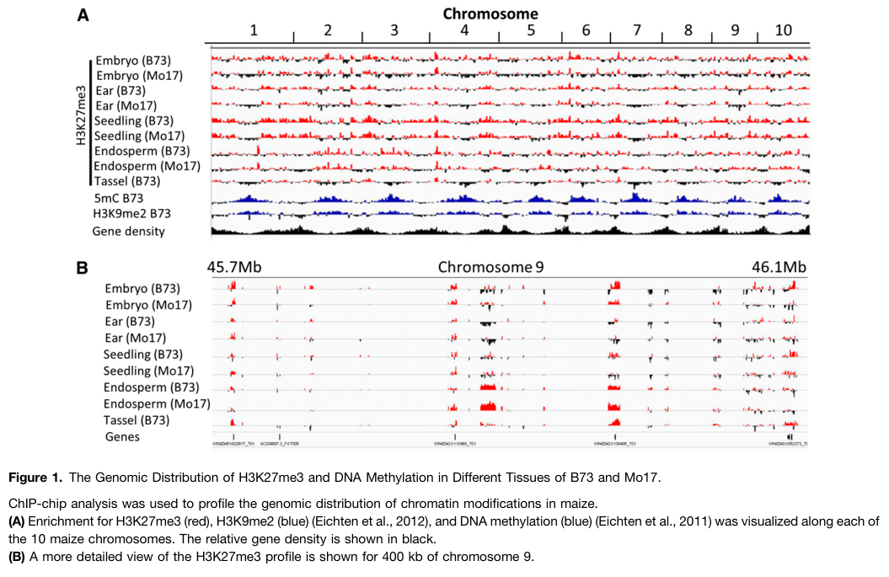

## Question

# Gene Research for Functional Annotation

## ⚠️ CRITICAL: Gene/Protein Identification Context

**BEFORE YOU BEGIN RESEARCH:** You MUST verify you are researching the CORRECT gene/protein. Gene symbols can be ambiguous, especially for less well-characterized genes from non-model organisms.

### Target Gene/Protein Identity (from UniProt):
- **UniProt Accession:** Q8S4P6
- **Protein Description:** RecName: Full=Histone-lysine N-methyltransferase EZ1; EC=2.1.1.356; AltName: Full=Enhancer of zeste protein 1;
- **Gene Information:** Name=EZ1; Synonyms=MEZ1;
- **Organism (full):** Zea mays (Maize).
- **Protein Family:** Belongs to the class V-like SAM-binding methyltransferase
- **Key Domains:** CXC_dom. (IPR026489); EZH1/2-like. (IPR045318); Hist-Lys_N-MeTrfase_plant. (IPR025778); HTH_CLF-like. (IPR058609); Pre-SET_CXC. (IPR041355)

### MANDATORY VERIFICATION STEPS:

1. **Check if the gene symbol "EZ1" matches the protein description above**
2. **Verify the organism is correct:** Zea mays (Maize).
3. **Check if protein family/domains align with what you find in literature**
4. **If you find literature for a DIFFERENT gene with the same or similar symbol, STOP**

### If Gene Symbol is Ambiguous or You Cannot Find Relevant Literature:

**DO NOT PROCEED WITH RESEARCH ON A DIFFERENT GENE.** Instead:
- State clearly: "The gene symbol 'EZ1' is ambiguous or literature is limited for this specific protein"
- Explain what you found (e.g., "Found extensive literature on a different gene with the same symbol in a different organism")
- Describe the protein based ONLY on the UniProt information provided above
- Suggest that the protein function can be inferred from domain/family information

### Research Target:

Please provide a comprehensive research report on the gene **EZ1** (gene ID: EZ1, UniProt: Q8S4P6) in MAIZE.

The research report should be a detailed narrative explaining the function, biological processes, and localization of the gene product. Citations should be given for all claims.

You should prioritize authoritative reviews and primary scientific literature when conducting research. You can supplement
this with annotations you find in gene/protein databases, but these can be outdated or inaccurate.

We are specifically interested in the primary function of the gene - for enzymes, what reaction is catalyzed, and what is the substrate specificity? For transporters, what is the substrate? For structural proteins or adapters, what is the broader structural role? For signaling molecules, what is the role in the pathway.

We are interested in where in or outside the cell the gene product carries out its function.

We are also interested in the signaling or biochemical pathways in which the gene functions. We are less interested in broad pleiotropic effects, except where these elucidate the precise role.

Include evidence where possible. We are interested in both experimental evidence as well as inference from structure, evolution, or bioinformatic analysis. Precise studies should be prioritized over high-throughput, where available.

## Output

Question: You are an expert researcher providing comprehensive, well-cited information.

Provide detailed information focusing on:
1. Key concepts and definitions with current understanding
2. Recent developments and latest research (prioritize 2023-2024 sources)
3. Current applications and real-world implementations
4. Expert opinions and analysis from authoritative sources
5. Relevant statistics and data from recent studies

Format as a comprehensive research report with proper citations. Include URLs and publication dates where available.
Always prioritize recent, authoritative sources and provide specific citations for all major claims.

# Gene Research for Functional Annotation

## ⚠️ CRITICAL: Gene/Protein Identification Context

**BEFORE YOU BEGIN RESEARCH:** You MUST verify you are researching the CORRECT gene/protein. Gene symbols can be ambiguous, especially for less well-characterized genes from non-model organisms.

### Target Gene/Protein Identity (from UniProt):
- **UniProt Accession:** Q8S4P6
- **Protein Description:** RecName: Full=Histone-lysine N-methyltransferase EZ1; EC=2.1.1.356; AltName: Full=Enhancer of zeste protein 1;
- **Gene Information:** Name=EZ1; Synonyms=MEZ1;
- **Organism (full):** Zea mays (Maize).
- **Protein Family:** Belongs to the class V-like SAM-binding methyltransferase
- **Key Domains:** CXC_dom. (IPR026489); EZH1/2-like. (IPR045318); Hist-Lys_N-MeTrfase_plant. (IPR025778); HTH_CLF-like. (IPR058609); Pre-SET_CXC. (IPR041355)

### MANDATORY VERIFICATION STEPS:

1. **Check if the gene symbol "EZ1" matches the protein description above**
2. **Verify the organism is correct:** Zea mays (Maize).
3. **Check if protein family/domains align with what you find in literature**
4. **If you find literature for a DIFFERENT gene with the same or similar symbol, STOP**

### If Gene Symbol is Ambiguous or You Cannot Find Relevant Literature:

**DO NOT PROCEED WITH RESEARCH ON A DIFFERENT GENE.** Instead:
- State clearly: "The gene symbol 'EZ1' is ambiguous or literature is limited for this specific protein"
- Explain what you found (e.g., "Found extensive literature on a different gene with the same symbol in a different organism")
- Describe the protein based ONLY on the UniProt information provided above
- Suggest that the protein function can be inferred from domain/family information

### Research Target:

Please provide a comprehensive research report on the gene **EZ1** (gene ID: EZ1, UniProt: Q8S4P6) in MAIZE.

The research report should be a detailed narrative explaining the function, biological processes, and localization of the gene product. Citations should be given for all claims.

You should prioritize authoritative reviews and primary scientific literature when conducting research. You can supplement
this with annotations you find in gene/protein databases, but these can be outdated or inaccurate.

We are specifically interested in the primary function of the gene - for enzymes, what reaction is catalyzed, and what is the substrate specificity? For transporters, what is the substrate? For structural proteins or adapters, what is the broader structural role? For signaling molecules, what is the role in the pathway.

We are interested in where in or outside the cell the gene product carries out its function.

We are also interested in the signaling or biochemical pathways in which the gene functions. We are less interested in broad pleiotropic effects, except where these elucidate the precise role.

Include evidence where possible. We are interested in both experimental evidence as well as inference from structure, evolution, or bioinformatic analysis. Precise studies should be prioritized over high-throughput, where available.

## Research Report: Maize EZ1 (UniProt Q8S4P6; gene synonyms: **EZ1 / MEZ1**)

### 0) Target verification (mandatory disambiguation)
The UniProt accession **Q8S4P6** is specified as **Histone-lysine N-methyltransferase EZ1 (Enhancer of zeste protein 1)** from **Zea mays**. In maize primary literature, the canonical nomenclature for Enhancer-of-zeste homologs is **Mez1/Mez2/Mez3** (Maize enhancer of zeste), where **Mez1 corresponds to EZ1/MEZ1** (the imprinted E(z) homolog most similar to Arabidopsis CLF). The maize genome is explicitly stated to encode **three** E(z) homologs (Mez1, Mez2, Mez3). (makarevitch2013genomicdistributionof pages 2-3)

### 1) Key concepts and definitions (current understanding)

#### 1.1 Polycomb Repressive Complex 2 (PRC2) and H3K27me3
Trimethylation of histone H3 at lysine 27 (**H3K27me3**) is a repressive chromatin modification associated with transcriptional repression and developmental regulation in plants. In the conserved Polycomb system, a subset of Polycomb group proteins forms **PRC2**, which catalyzes methylation at **H3K27**. (makarevitch2013genomicdistributionof pages 1-2, makarevitch2013genomicdistributionof pages 2-3)

In plants, the **E(z)**-group subunits are the histone methyltransferases of PRC2. Crop and model-plant literature consistently identifies E(z)-family SET-domain proteins (e.g., **CLF/SWN/MEA** in Arabidopsis) as the catalytic subunits responsible for depositing H3K27me3. (nugroho2023transcriptomicandepigenomic pages 1-2, pozaviejo2024brassicarapacurly pages 1-2)

#### 1.2 Where EZ1/MEZ1 fits
In maize, **Mez1/EZ1** is one of the three E(z) homologs (Mez1/Mez2/Mez3) that are the best-supported candidates to supply PRC2 catalytic activity for H3K27me3 deposition. Mez1 is distinctive in that it is **imprinted** and closely related to Arabidopsis CLF, whereas Mez2/Mez3 are highly similar paralogs related to SWN/MEA-like lineages. (makarevitch2013genomicdistributionof pages 2-3)

### 2) Functional annotation of maize EZ1/MEZ1

#### 2.1 Primary biochemical function (reaction and substrate)
**Most direct maize-specific statement available in retrieved full texts:** PRC2 catalyzes **H3K27 trimethylation (H3K27me3)**. (makarevitch2013genomicdistributionof pages 1-2)

**Inference to EZ1/MEZ1 specifically in maize:** Since Mez1 is an E(z)-family PRC2 catalytic homolog (by phylogeny and family assignment within maize E(z) genes), its expected enzymatic role is to use S-adenosylmethionine (SAM) to methylate **histone H3 Lys-27**, producing H3K27me3 on chromatin within PRC2. This is strongly supported at the family/complex level in plants and by maize genetic/epigenomic evidence that E(z) homolog mutations alter H3K27me3 at defined loci (shown for Mez2/Mez3; Mez1 mutants were not recovered in the 2013 study). (makarevitch2013genomicdistributionof pages 5-7, makarevitch2013genomicdistributionof pages 7-9, makarevitch2013genomicdistributionof pages 1-2)

**Important limitation:** The retrieved maize texts do not provide residue-level catalytic mechanisms, methylation-state preferences beyond trimethylation (me1/me2 vs me3), or explicit biochemical assays on purified ZmMEZ1; thus, substrate-state specificity cannot be stated from the retrieved corpus and should be treated as *not directly evidenced here*. (makarevitch2013genomicdistributionof pages 10-11, makarevitch2013genomicdistributionof pages 7-9)

#### 2.2 Complex context (PRC2 membership in maize endosperm)
A maize endosperm study profiling H3K27me3 dynamics during grain filling reports that multiple PRC2 components are highly expressed around the onset of grain filling (**En6D–En10D**) including **ZmFie1, ZmEmf2b, ZmMSI1c, and ZmMEZ1**; the authors interpret this as evidence that a **ZmFie1-mediated PRC2** is a primary regulator during this window. (wang2025thefie1prc2complex pages 3-4)

This places **ZmMEZ1 (EZ1)** in a cereal endosperm PRC2 module during a developmentally and agronomically important transition. (wang2025thefie1prc2complex pages 3-4)

### 3) Biological processes and pathways in maize (direct evidence emphasized)

#### 3.1 Endosperm imprinting and allelic chromatin marking
A strong and quantitative maize finding is the association between H3K27me3 and imprinting in endosperm: nearly all maize paternally expressed genes (**PEGs**) examined (**41/46**) show H3K27me3 enrichment in endosperm, and in tested cases the mark is restricted to the **silent maternal allele**. This supports a pathway in which PRC2-mediated H3K27me3 participates in **allele-specific repression** and imprinting behavior in maize endosperm. (makarevitch2013genomicdistributionof pages 10-11, makarevitch2013genomicdistributionof pages 5-7)

Mez1 is explicitly described as the **imprinted** maize E(z) homolog, suggesting (by association) that Mez1/EZ1 is a plausible contributor to endosperm-specific Polycomb regulation (although direct Mez1 loss-of-function genetics were not available in the retrieved maize study). (makarevitch2013genomicdistributionof pages 10-11, makarevitch2013genomicdistributionof pages 2-3)

#### 3.2 Genome-wide H3K27me3 landscape and dependence on maize E(z) homologs
Maize H3K27me3 is tissue-variable and enriched in gene-dense chromosome arms; endosperm is notably distinct in its set of marked genes. (makarevitch2013genomicdistributionof pages 2-3)

A key mechanistic result from maize genetics is that **Mez2/Mez3** mutations reduce H3K27me3 at a subset of genomic loci. In seedlings, a genome-wide ChIP-chip analysis detected **4374** H3K27me3-enriched segments in B73; **742 (17%)** were classified as Mez2/3-dependent (with segment categories showing differential dependence on mez2 vs mez3 vs double mutants). (makarevitch2013genomicdistributionof pages 7-9)

The table/figure evidence for these segment counts and dependence classes is shown directly in the paper’s tabulated/figure materials. (makarevitch2013genomicdistributionof media 76c36c18)

Despite these molecular changes, mez2/mez3 single and double mutants showed **no striking morphological defects** (slightly smaller but fertile), and RNA-seq did not show broad expression effects enriched among Mez2/3-dependent H3K27me3 targets, suggesting substantial redundancy and/or context specificity for visible phenotypes. (makarevitch2013genomicdistributionof pages 7-9, makarevitch2013genomicdistributionof pages 10-11)

#### 3.3 Endosperm filling: developmental-stage PRC2 activity and quantitative epigenomics
During maize endosperm filling, CUT&Tag profiling of H3K27me3 across **6–20 DAP** shows dynamic peak gains and losses around grain-filling onset. The study reports **8365** peaks gained (8 vs 6 DAP) and **12,111** peaks lost (12 vs 10 DAP); intersecting these yielded **5923** common peaks (FSPs) corresponding to **2838** genes, enriched for transcription-factor and nutrient reservoir functions. (wang2025thefie1prc2complex pages 3-4)

Expression evidence indicates ZmFie1 is endosperm-specific and increases after the coenocytic phase, while ZmFie2 is ubiquitous and high earlier (example FPKM values: **En48HAP 12.98** vs **En10D 2.46**). ZmMEZ1 shows its highest expression in endosperm during 6–10 DAP alongside other PRC2 members. (wang2025thefie1prc2complex pages 3-4)

### 4) Subcellular localization
The maize studies retrieved here mainly imply localization via function: PRC2-dependent deposition of H3K27me3 is a chromatin-associated nuclear process. (makarevitch2013genomicdistributionof pages 1-2, wang2025thefie1prc2complex pages 3-4)

Direct experimental crop evidence for localization comes from a 2023 upland cotton PRC2 study, which reports that most PRC2 core proteins localize to the **nucleus** and physically interact to form multi-subunit complexes. This supports the expectation that maize PRC2 core subunits (including E(z)/MEZ family proteins) are nuclear/chromatin-associated. (cheng2023genomewideidentificationand pages 1-2)

### 5) Recent developments and latest research (prioritizing 2023–2024)

#### 5.1 2023: crop PRC2 systems biology (Brassica rapa)
A 2023 Brassica rapa study combined transcriptomic and epigenomic profiling to show that PRC2 (via CLF, an E(z)-family catalytic subunit) regulates not only development but also stress-responsive metabolism (e.g., glucosinolate pathways). The study explicitly states CLF catalyzes H3K27me3 and notes that PRC2 complex subunits are required for nucleosome association of PRC2, framing how catalytic function is integrated with chromatin targeting. (nugroho2023transcriptomicandepigenomic pages 1-2, nugroho2023transcriptomicandepigenomic pages 2-3)

#### 5.2 2023: crop PRC2 components, nuclear localization, and interactions (cotton)
A 2023 cotton PRC2 paper provides crop-level evidence for PRC2 conservation, classification into the four core groups (E(z), Su(z)12, ESC, p55/MSI), nuclear localization of components, and protein–protein interactions consistent with assembly into multi-subunit complexes—important context for interpreting maize PRC2/EZ1 behavior. (cheng2023genomewideidentificationand pages 1-2)

#### 5.3 2024: crop PRC2 catalytic subunit as an agronomic lever (flowering time)
A 2024 Brassica rapa study presents CLF as a “major H3K27 methyltransferase regulating flowering time” and shows that braA.clf-1 mutants have reduced H3K27me3 at flowering integrator loci (FT, SOC1, SEP3 homologs) with increased transcript levels and accelerated flowering. It explicitly frames this mechanistic knowledge as enabling engineering of Brassica varieties with different flowering requirements. (pozaviejo2024brassicarapacurly pages 1-2)

#### 5.4 2024: maize PcG pathway regulators affecting yield-relevant traits
A 2024 maize study identifies a plant-specific PcG factor **ZmEMF1a** (mn8) that interacts with PRC2 subunit ZmMSI1 and PRC1 component ZmRING1; its mutation causes genome-wide reductions in H3K27me3 and reduced kernel size and weight, tying Polycomb-mediated chromatin states to yield-relevant kernel traits. (zhou2024zmemf1aisrequired pages 1-5)

### 6) Current applications and real-world implementations

Direct evidence for deployed, field-scale applications is not described in the retrieved texts; however, multiple primary studies provide **validated levers** and **phenotypic outputs** with clear translational relevance.

#### 6.1 Cereal grain quality/yield levers via PRC2-H3K27me3 control of storage proteins and proliferation
A cereals endosperm study links PRC2 (via FIE1-containing PRC2) to balancing endosperm cell proliferation and storage-protein gene regulation, and explicitly discusses the potential to “harness these modifications for crop improvement.” In maize, **ZmFie1 knockout** is reported to cause smaller kernels with increased zein accumulation and reduction of H3K27me3 on α-zein loci; related examples in rice and wheat connect PRC2-linked regulation to prolamin/gluten and kernel size traits. Although this is not a direct manipulation of ZmMEZ1, ZmMEZ1 is a PRC2 member expressed at the relevant developmental window, so it is mechanistically connected to the same PRC2-H3K27me3 axis. (wang2025thefie1prc2complex pages 1-2, wang2025thefie1prc2complex pages 12-14, wang2025thefie1prc2complex pages 3-4)

#### 6.2 Flowering-time engineering in Brassica as a PRC2 paradigm
The Brassica rapa CLF work explicitly proposes that understanding PRC2/H3K27me3 control of flowering integrator genes could aid yield by engineering varieties with different flowering-time requirements, but notes pleiotropic effects (e.g., growth/leaf morphology) that would need to be managed. This provides a concrete example of how PRC2 catalytic subunits can be agricultural levers, relevant by analogy to maize PRC2/E(z) biology. (pozaviejo2024brassicarapacurly pages 1-2)

### 7) Expert analysis and interpretation (bounded by evidence)

1. **Maize EZ1/MEZ1 is best understood as a PRC2 catalytic E(z)-family member with a likely specialized endosperm role**, given (i) Mez1 imprinting and (ii) co-expression with a PRC2 module at grain-filling onset. (makarevitch2013genomicdistributionof pages 10-11, wang2025thefie1prc2complex pages 3-4)
2. **Functional redundancy is a major theme in maize E(z) homologs**, as mez2/mez3 mutations affect only a subset of H3K27me3 loci and show minimal obvious morphology, implying either compensation by Mez1 and/or other mechanisms that buffer loss of specific H3K27me3 peaks. (makarevitch2013genomicdistributionof pages 7-9, makarevitch2013genomicdistributionof pages 10-11)
3. **Trait engineering via PRC2 must account for pleiotropy and epigenetic buffering**: crop studies show uncoupling between transcript changes and final storage-protein accumulation in some contexts and pleiotropic developmental defects when core H3K27 writers are perturbed. (wang2025thefie1prc2complex pages 11-12, pozaviejo2024brassicarapacurly pages 1-2)

### 8) Key statistics and data points (selected)
- Maize encodes **three E(z) homologs:** Mez1/Mez2/Mez3. (makarevitch2013genomicdistributionof pages 2-3)
- Endosperm imprinting association: **41/46** PEGs marked by H3K27me3 in endosperm; maternal-allele restriction in tested cases. (makarevitch2013genomicdistributionof pages 10-11)
- B73 seedling H3K27me3 segments: **4374** total; **742 (17%)** Mez2/3-dependent segments. (makarevitch2013genomicdistributionof pages 7-9, makarevitch2013genomicdistributionof media 76c36c18)
- Endosperm grain-filling H3K27me3 dynamics (6–20 DAP): **8365** peaks gained (8 vs 6 DAP), **12,111** lost (12 vs 10 DAP), overlap **5923** peaks mapping to **2838** genes; **7084** new peaks at 20 DAP. (wang2025thefie1prc2complex pages 3-4)
- PRC2 component expression in maize endosperm: ZmFie2 example FPKM **12.98 (En48HAP)** vs **2.46 (En10D)**; ZmMEZ1 among PRC2 members highest in endosperm during **6–10 DAP**. (wang2025thefie1prc2complex pages 3-4)

### 9) Evidence summary table
The following table consolidates gene-level evidence and quantitative findings relevant to maize EZ1/MEZ1 functional annotation.

| Gene/protein | Evidence type | Key findings | Quantitative data | Phenotypes | Source |
|---|---|---|---|---|---|
| **Mez1 / EZ1 / ZmMEZ1** | Expression, comparative genomics, epigenomic inference | One of three maize **E(z)** homologs in PRC2; **imprinted** and most closely related to Arabidopsis **CLF**; expressed in endosperm and other tested tissues; proposed to contribute to endosperm functions and H3K27me3 deposition as a PRC2 catalytic subunit by homology/inference. In developing endosperm, **ZmMEZ1** is highly expressed together with **ZmFie1, ZmEmf2b, ZmMSI1c**, supporting participation in a grain-filling PRC2 complex. | H3K27me3 marks nearly all maize PEGs in endosperm: **41/46 (89%)**; in 3 tested cases the mark was maternal-allele restricted. During grain filling, intersecting dynamic peaks yielded **5923** common peaks (FSPs) mapping to **2838** genes; **7084** new H3K27me3 peaks were identified at **20 DAP**. | No direct maize **mez1** mutant phenotype reported in retrieved papers; no exon-insertion line recovered for Mez1 in the 2013 study. Functional role is strongest in **endosperm/grain filling** by expression-context evidence rather than direct genetics. (makarevitch2013genomicdistributionof pages 10-11, wang2025thefie1prc2complex pages 3-4) | Makarevitch et al., 2013, *Plant Cell*, https://doi.org/10.1105/tpc.112.106427, doi:10.1105/tpc.112.106427; Wang et al., 2025, *Plant Communications*, https://doi.org/10.1016/j.xplc.2025.101343, doi:10.1016/j.xplc.2025.101343 |
| **Mez2** | Genetic, epigenomic, transcript, mutant analysis | Maize **E(z)** homolog and putative H3K27me3 methyltransferase; partially redundant with **Mez3** for maintaining H3K27me3 at a subset of loci. Single and double mutant profiling shows only part of the maize H3K27me3 landscape depends on Mez2/3, indicating redundancy and additional methyltransferase activity from other E(z) family members. | In B73, **4374** H3K27me3-enriched segments were detected; **742 (17%)** were **Mez2/3-dependent**, including **21** mez2-only, **315** mez3-only, **90** double-mutant-only, and **316** affected by either mutation; **659** filtered-gene-set genes lay in Mez2/3-dependent regions. | Homozygous **mez2** single mutants and **mez2 mez3** double mutants had **no striking morphological defects**; plants were somewhat smaller but fertile, and RNA-seq found no broad enrichment of expression changes among Mez2/3-dependent targets. (makarevitch2013genomicdistributionof pages 7-9, makarevitch2013genomicdistributionof pages 1-2, makarevitch2013genomicdistributionof media 76c36c18) | Makarevitch et al., 2013, *Plant Cell*, https://doi.org/10.1105/tpc.112.106427, doi:10.1105/tpc.112.106427 |
| **Mez3** | Genetic, epigenomic, transcript, mutant analysis | Highly similar paralog of **Mez2** (92% nucleotide identity) and more closely related to Arabidopsis **SWN/MEA**; contributes to H3K27me3 maintenance with stronger locus-specific impact than Mez2 in the reported mutant series. Supports the model that maize PRC2 catalytic activity is partitioned among multiple E(z)-like proteins. | Same mutant dataset as above: among the **742** Mez2/3-dependent H3K27me3 segments, **315** were **mez3-only dependent** versus **21** mez2-only, indicating a larger unique contribution from Mez3 in this dataset. Across tissues, H3K27me3-marked genes were highly dynamic: **40.6%** marked in only one tissue, **21%** in two tissues, and **8.2%** in all five tissues. | **mez3** mutants were viable and fertile with only mild size reduction; no major developmental abnormality reported despite local H3K27me3 losses. (makarevitch2013genomicdistributionof pages 2-3, makarevitch2013genomicdistributionof pages 7-9, makarevitch2013genomicdistributionof media 76c36c18) | Makarevitch et al., 2013, *Plant Cell*, https://doi.org/10.1105/tpc.112.106427, doi:10.1105/tpc.112.106427 |
| **Mez1/Mez2/Mez3 family (maize E(z) homologs)** | Family-level comparative/epigenomic evidence | The maize genome encodes **three E(z) homologs** that are the likely catalytic PRC2 subunits responsible for histone **H3 Lys-27 methylation**, especially **H3K27me3**. Mez1 is the imprinted member; Mez2/Mez3 are paralogous SWN/MEA-like genes. Family-level evidence links these proteins to chromatin repression, imprinting, and developmental regulation in maize. | Genome-wide catalogs identified **6337** filtered H3K27me3-marked genes in at least one of five B73 tissues, **5690** in four diploid tissues, and **12,266** methylated genes overall. H3K27me3 covered **0.13%–1.91%** of the genome depending on tissue, and ~**16%** of filtered-gene-set genes were marked in at least one tissue. Conservation statistics: **34%** of maize H3K27me3 targets with Arabidopsis orthologs were also marked in Arabidopsis; conservation with rice was **64%** for seedling-marked genes and **74%** for genes marked in all five tissues. | Family-level mutant evidence indicates mild visible phenotypes for **mez2/mez3**, suggesting redundancy and/or context-specific importance; strongest biological association is with **endosperm imprinting** and **grain-filling regulation**. (makarevitch2013genomicdistributionof pages 2-3, makarevitch2013genomicdistributionof pages 5-7, makarevitch2013genomicdistributionof pages 1-2, makarevitch2013genomicdistributionof pages 20-23) | Makarevitch et al., 2013, *Plant Cell*, https://doi.org/10.1105/tpc.112.106427, doi:10.1105/tpc.112.106427 |
| **ZmMEZ1 within Fie1-PRC2 endosperm complex** | Expression, developmental epigenomics | Recent cereal endosperm work places **ZmMEZ1** in a maize **PRC2** module with **ZmFie1, ZmEmf2b, ZmMSI1c** at the onset of grain filling; expression patterns suggest a **ZmFie1-mediated PRC2** is the primary regulator during **En6D–En10D**, linking ZmMEZ1 to developmental H3K27me3 deposition during kernel filling. | Peak dynamics during endosperm development: **8365** peaks gained (8 vs 6 DAP), **12,111** peaks lost (12 vs 10 DAP), overlap **5923** peaks, corresponding to **2838** genes; additional gene sets included **1140** B8 gain-only and **3884** B12 loss-only genes. | Supports a role in balancing **endosperm filling and development**; phenotype in this excerpt is developmental-stage regulation rather than direct ZmMEZ1 mutant analysis. (wang2025thefie1prc2complex pages 3-4) | Wang et al., 2025, *Plant Communications*, https://doi.org/10.1016/j.xplc.2025.101343, doi:10.1016/j.xplc.2025.101343 |

*Table: This table summarizes the strongest available evidence for maize Enhancer of zeste-like genes, especially Mez1/EZ1 and Mez2/Mez3, integrating genetic, epigenomic, and expression findings. It is useful for distinguishing direct maize evidence from family-level inference and for tracking the quantitative H3K27me3 data tied to each gene.*

### 10) Visual evidence from primary maize literature
Quantitative classification of Mez2/3-dependent H3K27me3 segments and related figures/tables were retrieved from the 2013 Plant Cell study (e.g., Table listing Mez2/3-dependent vs independent segments; distribution and clustering in mez mutants). (makarevitch2013genomicdistributionof media 76c36c18, makarevitch2013genomicdistributionof media 80d49567, makarevitch2013genomicdistributionof media 8a1ba137)

### 11) Gaps and recommendations (explicit limitations)
- **Direct biochemical characterization of ZmMEZ1 (EZ1/MEZ1)**—including enzymatic kinetics, methylation-state specificity (me1 vs me2 vs me3), and substrate peptide preferences—was not present in the retrieved full texts. Current statements therefore rely on complex-level PRC2 function and E(z)-family inference plus maize genetics for Mez2/Mez3. (makarevitch2013genomicdistributionof pages 10-11, makarevitch2013genomicdistributionof pages 7-9)
- **Direct ZmMEZ1 mutant phenotypes** were not available in the retrieved maize genetics paper (no exon insertion line recovered), limiting causal assignment of specific H3K27me3 programs to Mez1 vs Mez2/Mez3. (makarevitch2013genomicdistributionof pages 10-11)

### Key primary sources (with dates and URLs)
- Makarevitch I. et al. **2013-03**. *Plant Cell* “Genomic Distribution of Maize Facultative Heterochromatin Marked by Trimethylation of H3K27.” https://doi.org/10.1105/tpc.112.106427 (makarevitch2013genomicdistributionof pages 2-3)
- Zhou Y. et al. **2024-10-01 (posted)**. Research Square preprint “ZmEMF1a is required for the maintainence of H2Aub and H3K27me3 modifications in maize kernel development.” https://doi.org/10.21203/rs.3.rs-4998315/v1 (zhou2024zmemf1aisrequired pages 1-5)
- Cheng K. et al. **2023-02**. *BMC Plant Biology* “Genome-wide identification and characterization of PRC2 core components in upland cotton.” https://doi.org/10.1186/s12870-023-04075-4 (cheng2023genomewideidentificationand pages 1-2)
- Nugroho A.B.D. et al. **2023-02**. *Frontiers in Plant Science* “Transcriptomic and epigenomic analyses… PRC2 regulates developmental and stress responsive metabolism in Brassica rapa.” https://doi.org/10.3389/fpls.2023.1079218 (nugroho2023transcriptomicandepigenomic pages 2-3)
- Poza-Viejo L. et al. **2024-06**. *Planta* “Brassica rapa CURLY LEAF is a major H3K27 methyltransferase regulating flowering time.” https://doi.org/10.1007/s00425-024-04454-7 (pozaviejo2024brassicarapacurly pages 1-2)
- Wang J. et al. **2025-06-09**. *Plant Communications* “The Fie1-PRC2 complex regulates H3K27me3 deposition to balance endosperm filling and development in cereals.” https://doi.org/10.1016/j.xplc.2025.101343 (wang2025thefie1prc2complex pages 3-4)

References

1. (makarevitch2013genomicdistributionof pages 2-3): Irina Makarevitch, Steven R. Eichten, Roman Briskine, Amanda J. Waters, Olga N. Danilevskaya, Robert B. Meeley, Chad L. Myers, Matthew W. Vaughn, and Nathan M. Springer. Genomic distribution of maize facultative heterochromatin marked by trimethylation of h3k27[w]. Plant Cell, 25:780-793, Mar 2013. URL: https://doi.org/10.1105/tpc.112.106427, doi:10.1105/tpc.112.106427. This article has 120 citations and is from a highest quality peer-reviewed journal.

2. (makarevitch2013genomicdistributionof pages 1-2): Irina Makarevitch, Steven R. Eichten, Roman Briskine, Amanda J. Waters, Olga N. Danilevskaya, Robert B. Meeley, Chad L. Myers, Matthew W. Vaughn, and Nathan M. Springer. Genomic distribution of maize facultative heterochromatin marked by trimethylation of h3k27[w]. Plant Cell, 25:780-793, Mar 2013. URL: https://doi.org/10.1105/tpc.112.106427, doi:10.1105/tpc.112.106427. This article has 120 citations and is from a highest quality peer-reviewed journal.

3. (nugroho2023transcriptomicandepigenomic pages 1-2): Adji Baskoro Dwi Nugroho, Sujeong Kim, Sang Woo Lee, and Dong-Hwan Kim. Transcriptomic and epigenomic analyses revealed that polycomb repressive complex 2 regulates not only developmental but also stress responsive metabolism in brassica rapa. Frontiers in Plant Science, Feb 2023. URL: https://doi.org/10.3389/fpls.2023.1079218, doi:10.3389/fpls.2023.1079218. This article has 10 citations.

4. (pozaviejo2024brassicarapacurly pages 1-2): Laura Poza-Viejo, Miriam Payá-Milans, Mark D. Wilkinson, Manuel Piñeiro, José A. Jarillo, and Pedro Crevillén. Brassica rapa curly leaf is a major h3k27 methyltransferase regulating flowering time. Planta, Jun 2024. URL: https://doi.org/10.1007/s00425-024-04454-7, doi:10.1007/s00425-024-04454-7. This article has 11 citations and is from a peer-reviewed journal.

5. (makarevitch2013genomicdistributionof pages 5-7): Irina Makarevitch, Steven R. Eichten, Roman Briskine, Amanda J. Waters, Olga N. Danilevskaya, Robert B. Meeley, Chad L. Myers, Matthew W. Vaughn, and Nathan M. Springer. Genomic distribution of maize facultative heterochromatin marked by trimethylation of h3k27[w]. Plant Cell, 25:780-793, Mar 2013. URL: https://doi.org/10.1105/tpc.112.106427, doi:10.1105/tpc.112.106427. This article has 120 citations and is from a highest quality peer-reviewed journal.

6. (makarevitch2013genomicdistributionof pages 7-9): Irina Makarevitch, Steven R. Eichten, Roman Briskine, Amanda J. Waters, Olga N. Danilevskaya, Robert B. Meeley, Chad L. Myers, Matthew W. Vaughn, and Nathan M. Springer. Genomic distribution of maize facultative heterochromatin marked by trimethylation of h3k27[w]. Plant Cell, 25:780-793, Mar 2013. URL: https://doi.org/10.1105/tpc.112.106427, doi:10.1105/tpc.112.106427. This article has 120 citations and is from a highest quality peer-reviewed journal.

7. (makarevitch2013genomicdistributionof pages 10-11): Irina Makarevitch, Steven R. Eichten, Roman Briskine, Amanda J. Waters, Olga N. Danilevskaya, Robert B. Meeley, Chad L. Myers, Matthew W. Vaughn, and Nathan M. Springer. Genomic distribution of maize facultative heterochromatin marked by trimethylation of h3k27[w]. Plant Cell, 25:780-793, Mar 2013. URL: https://doi.org/10.1105/tpc.112.106427, doi:10.1105/tpc.112.106427. This article has 120 citations and is from a highest quality peer-reviewed journal.

8. (wang2025thefie1prc2complex pages 3-4): Jiechen Wang, Shuai Li, Liujie Wu, Dongsheng Shi, Lina Xu, Zhiping Zhang, Yongyan Wang, Chen Ji, Yuqi Chen, Xueling Zhou, Feifan Zhang, Mengyao Li, Xiaohan Li, Canghao Du, Qiong Wang, Xiaoduo Lu, Wenqin Wang, Guifeng Wang, and Yongrui Wu. The fie1-prc2 complex regulates h3k27me3 deposition to balance endosperm filling and development in cereals. Jun 2025. URL: https://doi.org/10.1016/j.xplc.2025.101343, doi:10.1016/j.xplc.2025.101343. This article has 2 citations and is from a peer-reviewed journal.

9. (makarevitch2013genomicdistributionof media 76c36c18): Irina Makarevitch, Steven R. Eichten, Roman Briskine, Amanda J. Waters, Olga N. Danilevskaya, Robert B. Meeley, Chad L. Myers, Matthew W. Vaughn, and Nathan M. Springer. Genomic distribution of maize facultative heterochromatin marked by trimethylation of h3k27[w]. Plant Cell, 25:780-793, Mar 2013. URL: https://doi.org/10.1105/tpc.112.106427, doi:10.1105/tpc.112.106427. This article has 120 citations and is from a highest quality peer-reviewed journal.

10. (cheng2023genomewideidentificationand pages 1-2): Kai Cheng, Cangbao Lei, Siyuan Zhang, Qiao Zheng, Chunyan Wei, Weiyi Huang, Minghui Xing, Junli Zhang, Xiangyue Zhang, and Xiao Zhang. Genome-wide identification and characterization of polycomb repressive complex 2 core components in upland cotton (gossypium hirsutum l.). BMC Plant Biology, Feb 2023. URL: https://doi.org/10.1186/s12870-023-04075-4, doi:10.1186/s12870-023-04075-4. This article has 3 citations and is from a peer-reviewed journal.

11. (nugroho2023transcriptomicandepigenomic pages 2-3): Adji Baskoro Dwi Nugroho, Sujeong Kim, Sang Woo Lee, and Dong-Hwan Kim. Transcriptomic and epigenomic analyses revealed that polycomb repressive complex 2 regulates not only developmental but also stress responsive metabolism in brassica rapa. Frontiers in Plant Science, Feb 2023. URL: https://doi.org/10.3389/fpls.2023.1079218, doi:10.3389/fpls.2023.1079218. This article has 10 citations.

12. (zhou2024zmemf1aisrequired pages 1-5): Yueheng Zhou, Jianrui Li, Yingshuang Li, Xiaojie Li, Chunlei Wang, Tong Li, Jian Chen, Weibin Song, Jinsheng Lai, Haiming Zhao, and Zhijia Yang. Zmemf1a is required for the maintainence of h2aub and h3k27me3 modifications in maize kernel development. Unknown journal, Oct 2024. URL: https://doi.org/10.21203/rs.3.rs-4998315/v1, doi:10.21203/rs.3.rs-4998315/v1.

13. (wang2025thefie1prc2complex pages 1-2): Jiechen Wang, Shuai Li, Liujie Wu, Dongsheng Shi, Lina Xu, Zhiping Zhang, Yongyan Wang, Chen Ji, Yuqi Chen, Xueling Zhou, Feifan Zhang, Mengyao Li, Xiaohan Li, Canghao Du, Qiong Wang, Xiaoduo Lu, Wenqin Wang, Guifeng Wang, and Yongrui Wu. The fie1-prc2 complex regulates h3k27me3 deposition to balance endosperm filling and development in cereals. Jun 2025. URL: https://doi.org/10.1016/j.xplc.2025.101343, doi:10.1016/j.xplc.2025.101343. This article has 2 citations and is from a peer-reviewed journal.

14. (wang2025thefie1prc2complex pages 12-14): Jiechen Wang, Shuai Li, Liujie Wu, Dongsheng Shi, Lina Xu, Zhiping Zhang, Yongyan Wang, Chen Ji, Yuqi Chen, Xueling Zhou, Feifan Zhang, Mengyao Li, Xiaohan Li, Canghao Du, Qiong Wang, Xiaoduo Lu, Wenqin Wang, Guifeng Wang, and Yongrui Wu. The fie1-prc2 complex regulates h3k27me3 deposition to balance endosperm filling and development in cereals. Jun 2025. URL: https://doi.org/10.1016/j.xplc.2025.101343, doi:10.1016/j.xplc.2025.101343. This article has 2 citations and is from a peer-reviewed journal.

15. (wang2025thefie1prc2complex pages 11-12): Jiechen Wang, Shuai Li, Liujie Wu, Dongsheng Shi, Lina Xu, Zhiping Zhang, Yongyan Wang, Chen Ji, Yuqi Chen, Xueling Zhou, Feifan Zhang, Mengyao Li, Xiaohan Li, Canghao Du, Qiong Wang, Xiaoduo Lu, Wenqin Wang, Guifeng Wang, and Yongrui Wu. The fie1-prc2 complex regulates h3k27me3 deposition to balance endosperm filling and development in cereals. Jun 2025. URL: https://doi.org/10.1016/j.xplc.2025.101343, doi:10.1016/j.xplc.2025.101343. This article has 2 citations and is from a peer-reviewed journal.

16. (makarevitch2013genomicdistributionof pages 20-23): Irina Makarevitch, Steven R. Eichten, Roman Briskine, Amanda J. Waters, Olga N. Danilevskaya, Robert B. Meeley, Chad L. Myers, Matthew W. Vaughn, and Nathan M. Springer. Genomic distribution of maize facultative heterochromatin marked by trimethylation of h3k27[w]. Plant Cell, 25:780-793, Mar 2013. URL: https://doi.org/10.1105/tpc.112.106427, doi:10.1105/tpc.112.106427. This article has 120 citations and is from a highest quality peer-reviewed journal.

17. (makarevitch2013genomicdistributionof media 80d49567): Irina Makarevitch, Steven R. Eichten, Roman Briskine, Amanda J. Waters, Olga N. Danilevskaya, Robert B. Meeley, Chad L. Myers, Matthew W. Vaughn, and Nathan M. Springer. Genomic distribution of maize facultative heterochromatin marked by trimethylation of h3k27[w]. Plant Cell, 25:780-793, Mar 2013. URL: https://doi.org/10.1105/tpc.112.106427, doi:10.1105/tpc.112.106427. This article has 120 citations and is from a highest quality peer-reviewed journal.

18. (makarevitch2013genomicdistributionof media 8a1ba137): Irina Makarevitch, Steven R. Eichten, Roman Briskine, Amanda J. Waters, Olga N. Danilevskaya, Robert B. Meeley, Chad L. Myers, Matthew W. Vaughn, and Nathan M. Springer. Genomic distribution of maize facultative heterochromatin marked by trimethylation of h3k27[w]. Plant Cell, 25:780-793, Mar 2013. URL: https://doi.org/10.1105/tpc.112.106427, doi:10.1105/tpc.112.106427. This article has 120 citations and is from a highest quality peer-reviewed journal.

## Artifacts

- [Edison artifact artifact-00](EZ1-deep-research-falcon_artifacts/artifact-00.md)

## Citations

1. makarevitch2013genomicdistributionof pages 2-3
2. makarevitch2013genomicdistributionof pages 1-2
3. makarevitch2013genomicdistributionof pages 7-9
4. cheng2023genomewideidentificationand pages 1-2
5. pozaviejo2024brassicarapacurly pages 1-2
6. makarevitch2013genomicdistributionof pages 10-11
7. nugroho2023transcriptomicandepigenomic pages 2-3
8. nugroho2023transcriptomicandepigenomic pages 1-2
9. makarevitch2013genomicdistributionof pages 5-7
10. makarevitch2013genomicdistributionof pages 20-23
11. w
12. https://doi.org/10.1105/tpc.112.106427,
13. https://doi.org/10.1016/j.xplc.2025.101343,
14. https://doi.org/10.1105/tpc.112.106427
15. https://doi.org/10.21203/rs.3.rs-4998315/v1
16. https://doi.org/10.1186/s12870-023-04075-4
17. https://doi.org/10.3389/fpls.2023.1079218
18. https://doi.org/10.1007/s00425-024-04454-7
19. https://doi.org/10.1016/j.xplc.2025.101343
20. https://doi.org/10.3389/fpls.2023.1079218,
21. https://doi.org/10.1007/s00425-024-04454-7,
22. https://doi.org/10.1186/s12870-023-04075-4,
23. https://doi.org/10.21203/rs.3.rs-4998315/v1,