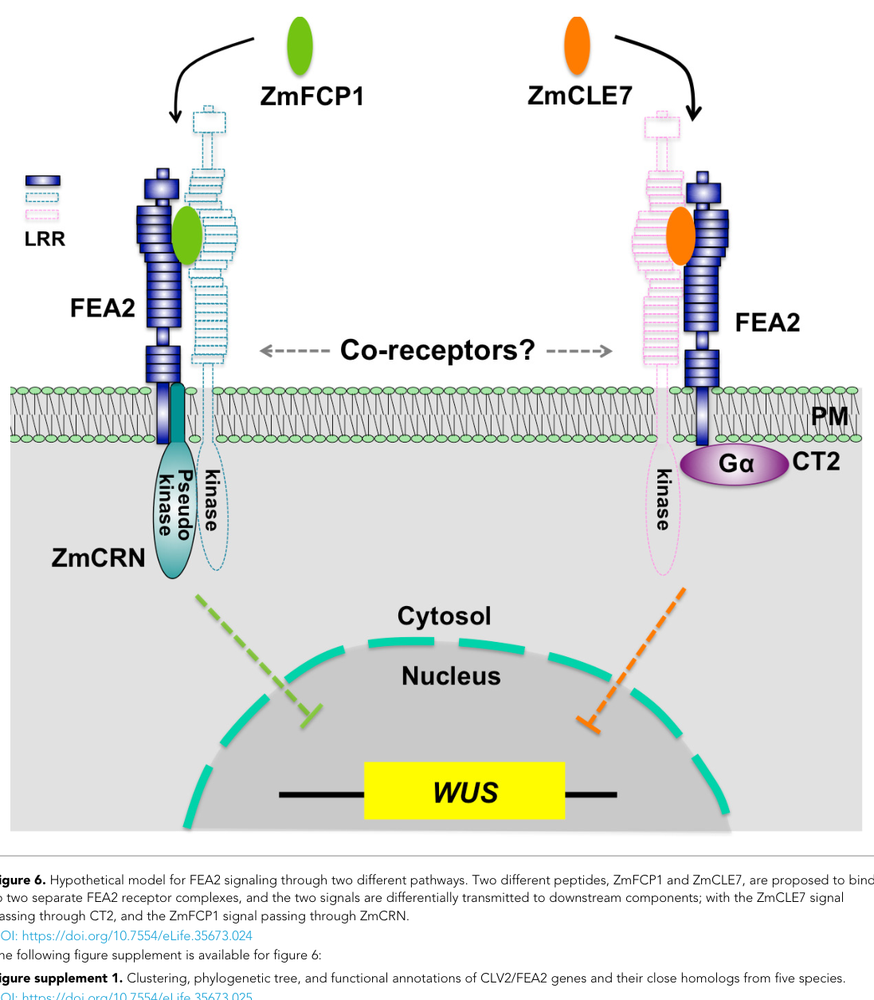

## Question

# Gene Research for Functional Annotation

## ⚠️ CRITICAL: Gene/Protein Identification Context

**BEFORE YOU BEGIN RESEARCH:** You MUST verify you are researching the CORRECT gene/protein. Gene symbols can be ambiguous, especially for less well-characterized genes from non-model organisms.

### Target Gene/Protein Identity (from UniProt):
- **UniProt Accession:** Q940E8
- **Protein Description:** RecName: Full=Leucine-rich repeat receptor-like protein FASCIATED EAR2; AltName: Full=CLAVATA2-like protein; Flags: Precursor;
- **Gene Information:** Name=FEA2; ORFNames=ZEAMMB73_546581;
- **Organism (full):** Zea mays (Maize).
- **Protein Family:** Not specified in UniProt
- **Key Domains:** DNA_repair-toleration. (IPR053211); Leu-rich_rpt. (IPR001611); Leu-rich_rpt_4. (IPR025875); Leu-rich_rpt_typical-subtyp. (IPR003591); LRR_dom_sf. (IPR032675)

### MANDATORY VERIFICATION STEPS:

1. **Check if the gene symbol "FEA2" matches the protein description above**
2. **Verify the organism is correct:** Zea mays (Maize).
3. **Check if protein family/domains align with what you find in literature**
4. **If you find literature for a DIFFERENT gene with the same or similar symbol, STOP**

### If Gene Symbol is Ambiguous or You Cannot Find Relevant Literature:

**DO NOT PROCEED WITH RESEARCH ON A DIFFERENT GENE.** Instead:
- State clearly: "The gene symbol 'FEA2' is ambiguous or literature is limited for this specific protein"
- Explain what you found (e.g., "Found extensive literature on a different gene with the same symbol in a different organism")
- Describe the protein based ONLY on the UniProt information provided above
- Suggest that the protein function can be inferred from domain/family information

### Research Target:

Please provide a comprehensive research report on the gene **FEA2** (gene ID: FEA2, UniProt: Q940E8) in MAIZE.

The research report should be a detailed narrative explaining the function, biological processes, and localization of the gene product. Citations should be given for all claims.

You should prioritize authoritative reviews and primary scientific literature when conducting research. You can supplement
this with annotations you find in gene/protein databases, but these can be outdated or inaccurate.

We are specifically interested in the primary function of the gene - for enzymes, what reaction is catalyzed, and what is the substrate specificity? For transporters, what is the substrate? For structural proteins or adapters, what is the broader structural role? For signaling molecules, what is the role in the pathway.

We are interested in where in or outside the cell the gene product carries out its function.

We are also interested in the signaling or biochemical pathways in which the gene functions. We are less interested in broad pleiotropic effects, except where these elucidate the precise role.

Include evidence where possible. We are interested in both experimental evidence as well as inference from structure, evolution, or bioinformatic analysis. Precise studies should be prioritized over high-throughput, where available.

## Output

Question: You are an expert researcher providing comprehensive, well-cited information.

Provide detailed information focusing on:
1. Key concepts and definitions with current understanding
2. Recent developments and latest research (prioritize 2023-2024 sources)
3. Current applications and real-world implementations
4. Expert opinions and analysis from authoritative sources
5. Relevant statistics and data from recent studies

Format as a comprehensive research report with proper citations. Include URLs and publication dates where available.
Always prioritize recent, authoritative sources and provide specific citations for all major claims.

# Gene Research for Functional Annotation

## ⚠️ CRITICAL: Gene/Protein Identification Context

**BEFORE YOU BEGIN RESEARCH:** You MUST verify you are researching the CORRECT gene/protein. Gene symbols can be ambiguous, especially for less well-characterized genes from non-model organisms.

### Target Gene/Protein Identity (from UniProt):
- **UniProt Accession:** Q940E8
- **Protein Description:** RecName: Full=Leucine-rich repeat receptor-like protein FASCIATED EAR2; AltName: Full=CLAVATA2-like protein; Flags: Precursor;
- **Gene Information:** Name=FEA2; ORFNames=ZEAMMB73_546581;
- **Organism (full):** Zea mays (Maize).
- **Protein Family:** Not specified in UniProt
- **Key Domains:** DNA_repair-toleration. (IPR053211); Leu-rich_rpt. (IPR001611); Leu-rich_rpt_4. (IPR025875); Leu-rich_rpt_typical-subtyp. (IPR003591); LRR_dom_sf. (IPR032675)

### MANDATORY VERIFICATION STEPS:

1. **Check if the gene symbol "FEA2" matches the protein description above**
2. **Verify the organism is correct:** Zea mays (Maize).
3. **Check if protein family/domains align with what you find in literature**
4. **If you find literature for a DIFFERENT gene with the same or similar symbol, STOP**

### If Gene Symbol is Ambiguous or You Cannot Find Relevant Literature:

**DO NOT PROCEED WITH RESEARCH ON A DIFFERENT GENE.** Instead:
- State clearly: "The gene symbol 'FEA2' is ambiguous or literature is limited for this specific protein"
- Explain what you found (e.g., "Found extensive literature on a different gene with the same symbol in a different organism")
- Describe the protein based ONLY on the UniProt information provided above
- Suggest that the protein function can be inferred from domain/family information

### Research Target:

Please provide a comprehensive research report on the gene **FEA2** (gene ID: FEA2, UniProt: Q940E8) in MAIZE.

The research report should be a detailed narrative explaining the function, biological processes, and localization of the gene product. Citations should be given for all claims.

You should prioritize authoritative reviews and primary scientific literature when conducting research. You can supplement
this with annotations you find in gene/protein databases, but these can be outdated or inaccurate.

We are specifically interested in the primary function of the gene - for enzymes, what reaction is catalyzed, and what is the substrate specificity? For transporters, what is the substrate? For structural proteins or adapters, what is the broader structural role? For signaling molecules, what is the role in the pathway.

We are interested in where in or outside the cell the gene product carries out its function.

We are also interested in the signaling or biochemical pathways in which the gene functions. We are less interested in broad pleiotropic effects, except where these elucidate the precise role.

Include evidence where possible. We are interested in both experimental evidence as well as inference from structure, evolution, or bioinformatic analysis. Precise studies should be prioritized over high-throughput, where available.

## Research report: Functional annotation of maize **FEA2** (FASCIATED EAR2) — UniProt **Q940E8**

### Executive summary
**FASCIATED EAR2 (FEA2)** is a *Zea mays* **CLAVATA2 (CLV2)-orthologous leucine-rich repeat receptor-like protein (LRR-RLP)** that functions at the **plasma membrane** to restrict stem-cell proliferation in shoot and inflorescence meristems, thereby shaping ear/tassel architecture and yield-associated traits. Mechanistic evidence indicates that FEA2 acts as a **shared signaling node** for at least two CLE peptide inputs (ZmCLE7 and ZmFCP1), routing these signals into **two separable downstream branches** mediated by the heterotrimeric Gα **CT2 (COMPACT PLANT2)** and the membrane pseudokinase **ZmCRN (CORYNE)**, respectively, with convergence on meristem homeostasis outputs including **ZmWUS** regulation. (je2018theclavatareceptor pages 1-2, je2018theclavatareceptor pages 12-14, je2018theclavatareceptor media 3b7154fc)

### Target identity verification (critical)
The literature evidence used here explicitly studies **maize FASCIATED EAR2 (FEA2)** as the **maize ortholog of Arabidopsis CLAVATA2**, described as an **LRR receptor-like protein** involved in CLE-mediated meristem signaling (consistent with UniProt Q940E8’s “CLAVATA2-like” description). (je2018theclavatareceptor pages 1-2)

### 1) Key concepts and definitions (current understanding)

#### 1.1 The CLV–WUS feedback module and CLE peptides
Shoot and inflorescence meristems maintain a stem-cell reservoir while producing organ primordia; this balance is classically governed by a **CLAVATA–WUSCHEL (CLV–WUS)** negative feedback circuit where extracellular peptide signals restrict WUS-driven stem-cell maintenance. Reviews emphasize that meristem intercellular communication integrates mobile factors, hormones, small RNAs, and **secreted peptides perceived by membrane-localized receptors**, with CLV–WUS as a central organizing module. (demesaarevalo2024intercellularcommunicationin pages 1-3)

In maize, CLV-like receptors and CLE ligands (including **ZmCLE7**, a CLV3 homolog) are components of this conserved module; hormonal crosstalk (notably cytokinin) can modulate CLV-mediated feedback onto WUS output. (chaudhry2024hormonalinfluenceon pages 5-6)

#### 1.2 What kind of protein is FEA2?
FEA2 is repeatedly described as a **CLV2-like receptor-like protein** (LRR-RLP) rather than a receptor kinase, implying a primary role as a **co-receptor/scaffold** in receptor complexes rather than as an enzyme that catalyzes reactions. (je2018theclavatareceptor pages 1-2)

A key mechanistic concept in this system is that **CLV2/FEA2 does not itself bind CLE peptides directly**, and instead is proposed to act with other ligand-binding receptors (e.g., LRR receptor-like kinases) to transmit ligand-dependent signals. (je2018theclavatareceptor pages 1-2, je2018theclavatareceptor pages 12-14)

### 2) Mechanistic function and pathway placement of maize FEA2

#### 2.1 Demonstrated CLE peptide inputs (ligands)
Je et al. (2018) provide direct evidence that FEA2 is required for signaling from at least **two distinct CLE peptides**:
- **ZmCLE7** (maize CLV3 ortholog)
- **ZmFCP1** (ZmFON2-LIKE CLE PROTEIN1)

In peptide-response assays, **fea2 mutants** show resistance to both peptide inputs, supporting the conclusion that FEA2 is required for both pathways. (je2018theclavatareceptor pages 9-12, je2018theclavatareceptor pages 3-6)

#### 2.2 Receptor complex composition and interaction partners
**FEA2 forms complexes with two distinct downstream signaling partners**:
- **CT2 (COMPACT PLANT2)**, the α subunit of the maize heterotrimeric G protein
- **ZmCRN**, a CORYNE ortholog described as a membrane-localized pseudokinase

Biochemical evidence (co-immunoprecipitation) shows that CT2 can pull down FEA2, and ZmCRN can pull down FEA2; reciprocally, FEA2 can immunoprecipitate either CT2 or ZmCRN. (je2018theclavatareceptor pages 6-9, je2018theclavatareceptor pages 9-12)

BiFC detected a **direct FEA2–ZmCRN interaction**, while FEA2–CT2 interaction was not detected by BiFC in that assay context, consistent with the possibility that FEA2–CT2 association is indirect or occurs in a different complex organization. (je2018theclavatareceptor pages 6-9)

Evidence further indicates **ZmCRN and CT2 are not recovered as a single three-way complex** (i.e., ZmCRN did not immunoprecipitate CT2), supporting a model of **distinct FEA2-containing complexes**. (je2017theclavatareceptor pages 9-12, je2018theclavatareceptor pages 6-9)

#### 2.3 Signal-branch specificity: two downstream effectors
A central mechanistic advance is that **FEA2 transmits different CLE peptide inputs through different downstream effectors**:
- **ZmCLE7 → CT2 branch**
- **ZmFCP1 → ZmCRN branch**

This is supported by differential peptide resistance in mutants: **ct2** shows resistance primarily to ZmCLE7, while **Zmcrn** shows resistance primarily to ZmFCP1; **fea2** is resistant to both, consistent with FEA2 being upstream of both branches. (je2018theclavatareceptor pages 12-14, je2018theclavatareceptor pages 9-12)

Genetic interactions further support parallel branches: **Zmcrn;ct2 double mutants** show additive/enhanced phenotypes, consistent with separable outputs, while **fea2 is epistatic** in the pathway placement. (je2018theclavatareceptor pages 12-14, je2018theclavatareceptor pages 6-9)

A schematic model from Je et al. summarizes these relationships (distinct FEA2 complexes feeding into CT2 vs ZmCRN and converging on nuclear outputs controlling meristem homeostasis). (je2018theclavatareceptor media 3b7154fc)

### 3) Cellular localization and where FEA2 acts

#### 3.1 Plasma membrane localization
Je et al. experimentally confirmed plasma membrane localization of **ZmCRN-mCherry** and noted that this localization is consistent with **FEA2 and CT2 localization**, supporting a **plasma-membrane signaling complex**. (je2018theclavatareceptor pages 6-9)

Additionally, the authors infer that **FEA2 is on the plasma membrane even in the absence of ZmCRN**, because FEA2 still functions with CT2 in a **crn** mutant background. (je2018theclavatareceptor pages 12-14)

Together these data place the primary site of FEA2 action at the **cell surface/plasma membrane**, consistent with receptor complex-mediated perception/transduction of extracellular CLE signals. (je2018theclavatareceptor pages 6-9, je2018theclavatareceptor pages 12-14)

#### 3.2 Domain architecture (evidence vs inference)
Within the retrieved primary-text passages, FEA2 is identified as an **LRR receptor-like protein (CLV2-like)**, but **a full enumeration of its LRR count, transmembrane segment boundaries, or cytosolic tail length is not explicitly provided in the quoted sections**. (je2018theclavatareceptor pages 1-2, je2018theclavatareceptor pages 12-14)

By contrast, the related maize receptor-like protein **FEA3** is explicitly described as having a signal peptide, multiple LRRs, a transmembrane domain, and a short cytosolic tail lacking a kinase domain—illustrating the typical architecture used by CLV-related RLPs in maize and supporting the general co-receptor model for FEA2. (je2016signalingfrommaize pages 1-5)

### 4) Developmental roles and phenotypes in maize

#### 4.1 Meristem phenotypes and inflorescence architecture
FEA2 restricts stem-cell proliferation in meristems; loss-of-function phenotypes in the pathway include **enlarged shoot apical meristems** and **fasciated ears / enlarged ear inflorescence meristems**, consistent with excess stem-cell accumulation. (je2018theclavatareceptor pages 6-9, je2018theclavatareceptor pages 9-12, wu2018roleofheterotrimeric pages 1-2)

#### 4.2 Quantitative data (recently extracted from primary study)
Je et al. report quantitative increases in vegetative SAM size in downstream pathway mutants and enhanced phenotypes in double mutants, illustrating the magnitude of CLV-branch perturbations:
- **Zmcrn** vegetative SAM: **130.0 ± 4.1 µm vs 109.2 ± 4.6 µm** in normal siblings (P < 0.0001)
- Other comparisons reported include larger SAMs in **Zmcrn** and **fea2** single mutants (**166.3 ± 8.3 µm** and **176.1 ± 9.8 µm**) vs normal (**139.7 ± 4.8 µm**), and **Zmcrn;ct2** double mutant SAM size **191.8 ± 18.6 µm** (P < 0.0001)

These measurements support the conclusion that the FEA2 network quantitatively constrains meristem size and that CT2 and ZmCRN act as separable downstream effectors. (je2018theclavatareceptor pages 3-6, je2018theclavatareceptor pages 2-3)

### 5) Recent developments (prioritizing 2023–2024 sources)

#### 5.1 2024 synthesis of meristem intercellular communication
A 2024 *Annual Review of Plant Biology* review frames meristem regulation as an intercellular communication problem mediated by secreted peptides and membrane receptors; it highlights maize CLV pathway literature (including FEA2/CT2 and yield-relevant CLV studies) as part of the broader conceptual landscape of shoot meristem signaling and its crop-relevant implications. (demesaarevalo2024intercellularcommunicationin pages 1-3)

#### 5.2 2024 hormone integration into CLV-WUS outputs
A 2024 review on hormonal influence in maize inflorescence development explicitly lists FEA2 as a maize CLV2 homolog within the CLV module and emphasizes that cytokinin can modulate CLV-mediated repression of WUS output, connecting the FEA2-containing module to hormonal regulation of meristem size and inflorescence patterning. (chaudhry2024hormonalinfluenceon pages 5-6)

### 6) Current applications and real-world implementations

#### 6.1 Breeding and yield trait engineering through the CLV-WUS network
Authoritative reviews and primary studies position CLV-WUS components as yield-trait levers (e.g., kernel row number), and explicitly discuss exploitation of **weak alleles** to tune meristem size without severe fasciation. (fletcher2018theclvwusstem pages 1-3, je2016signalingfrommaize pages 9-12)

A maize inflorescence-architecture review specifically reports **“promising results using fea2 weak alleles in field trials”**, citing **Trung et al. 2020**, and argues that these strategies may have potential to increase yield (qualitatively; quantitative outcomes not provided in the excerpt). (chen2021improvingarchitecturaltraits pages 5-6)

#### 6.2 Trade-offs: kernel row number vs kernel size
A key applied insight is that **weak fea2 alleles can enhance kernel row number**, but may not necessarily increase overall yield due to compensatory decreases in kernel size, highlighting the importance of optimizing allele strength and genetic background. (fletcher2018theclvwusstem pages 5-7, je2016signalingfrommaize pages 9-12)

#### 6.3 Genome editing and pathway-adjacent engineering (CT2 branch)
Although not direct editing of FEA2 itself in the retrieved excerpts, an adjacent translational avenue is engineering the downstream **CT2 (Gα)** branch: constitutively active CT2 and CRISPR-based perturbations of non-canonical Gα-like proteins (XLGs) are reported to improve agronomic traits including **kernel row number**, **spikelet density**, and **leaf angle**, and the work explicitly discusses generating weak alleles (including via CRISPR) as a route to multi-trait improvement. (wu2018roleofheterotrimeric pages 1-2, wu2018roleofheterotrimeric pages 11-12)

### 7) Expert opinions and analysis (authoritative sources)

Mechanistically, Je et al. (2018) provide an expert framework for how “promiscuous” receptor-like proteins can achieve ligand specificity: **distinct ligands can be interpreted through distinct receptor complexes and downstream branches**, using shared components such as FEA2 but different intracellular effectors (CT2 vs ZmCRN). (je2018theclavatareceptor pages 12-14, je2018theclavatareceptor media 3b7154fc)

From an applications perspective, reviews emphasize that meristem regulatory circuits (including CLV-WUS and maize CLV orthologs) are attractive targets because small, tunable shifts in meristem activity can translate into changes in organ number and yield components—but also stress the need to manage pleiotropy and trade-offs (e.g., kernel size). (fletcher2018theclvwusstem pages 1-3, fletcher2018theclvwusstem pages 5-7)

### Evidence summary table
The following table consolidates key functional annotation points with evidence types and URLs/DOIs.

| Functional aspect | Key findings | Evidence type | Key sources with dates/URLs/DOIs |
|---|---|---|---|
| Identity / class | FEA2 in maize is the ortholog of Arabidopsis **CLAVATA2 (CLV2)** and is described as a **leucine-rich repeat receptor-like protein (LRR-RLP)** involved in CLAVATA/CLE meristem signaling. This matches the UniProt Q940E8 annotation for a CLAVATA2-like precursor protein in *Zea mays*. (je2018theclavatareceptor pages 1-2) | Primary genetics/mechanistic paper; review | Je et al., 2018, *eLife*, published Mar 2018, https://doi.org/10.7554/eLife.35673; Demesa-Arevalo et al., 2024, *Annual Review of Plant Biology*, first published Feb 29 2024, https://doi.org/10.1146/annurev-arplant-070523-035342 |
| Core molecular function | FEA2 functions as a **shared/co-receptor-like signaling component** in the maize CLV-WUS pathway, restricting stem-cell proliferation in shoot and inflorescence meristems. The evidence supports a signaling role rather than an enzymatic one; FEA2 helps transmit extracellular CLE-peptide information to intracellular downstream effectors that ultimately influence **ZmWUS** output. (je2018theclavatareceptor pages 1-2, je2018theclavatareceptor pages 12-14, je2018theclavatareceptor media 3b7154fc) | Genetic, biochemical, model synthesis, review | Je et al., 2018, *eLife*, Mar 2018, https://doi.org/10.7554/eLife.35673; Fletcher, 2018, *Plants*, Oct 19 2018, https://doi.org/10.3390/plants7040087 |
| Ligands / peptide inputs | The strongest direct evidence shows FEA2 mediates responses to at least two CLE-family peptides: **ZmCLE7** (maize CLV3 ortholog) and **ZmFCP1** (ZmFON2-LIKE CLE PROTEIN1). fea2 mutants are resistant to both peptide treatments, supporting the conclusion that FEA2 is required for signaling from both inputs. (je2018theclavatareceptor pages 1-2, je2018theclavatareceptor pages 9-12, je2018theclavatareceptor pages 3-6) | Peptide-response assays, genetics | Je et al., 2018, *eLife*, Mar 2018, https://doi.org/10.7554/eLife.35673 |
| Direct ligand binding vs co-receptor role | The study emphasizes that **CLV2/FEA2 does not itself directly bind CLV3/CLE peptides**, consistent with a co-receptor role. The proposed model is that FEA2 works with ligand-binding RLKs in different receptor complexes to relay distinct peptide signals. (je2018theclavatareceptor pages 1-2, je2018theclavatareceptor pages 12-14) | Mechanistic interpretation from primary paper | Je et al., 2018, *eLife*, Mar 2018, https://doi.org/10.7554/eLife.35673 |
| Receptor complexes / interaction partners | FEA2 associates with **ZmCRN** and **CT2** in separate complexes. Co-immunoprecipitation showed ZmCRN pulls down FEA2, CT2 pulls down FEA2, and FEA2 can immunoprecipitate either partner; ZmCRN and CT2 do **not** appear to form one common three-way complex, implying distinct receptor assemblies. (je2018theclavatareceptor pages 6-9, je2017theclavatareceptor pages 9-12, je2018theclavatareceptor pages 9-12) | Biochemical interaction assays (Co-IP), BiFC, genetics | Je et al., 2018, *eLife*, Mar 2018, https://doi.org/10.7554/eLife.35673 |
| Downstream effectors / branch specificity | FEA2 routes different CLE signals through different downstream components: **CT2** (heterotrimeric Gα, COMPACT PLANT2) primarily for **ZmCLE7**, and **ZmCRN** (CORYNE ortholog, pseudokinase) primarily for **ZmFCP1**. Additive phenotypes in **Zmcrn;ct2** double mutants and differential peptide resistance support two parallel downstream branches under a common FEA2 node. (je2018theclavatareceptor pages 12-14, je2017theclavatareceptor pages 9-12, je2018theclavatareceptor pages 9-12, je2018theclavatareceptor media 3b7154fc) | Genetics, peptide assays, biochemical interaction, model | Je et al., 2018, *eLife*, Mar 2018, https://doi.org/10.7554/eLife.35673; Wu et al., 2018, *PLOS Genetics*, Apr 30 2018, https://doi.org/10.1371/journal.pgen.1007374 |
| Localization | Experimental evidence places the FEA2 signaling module at the **plasma membrane**. ZmCRN-mCherry was confirmed at the plasma membrane, co-localizing with FEA2/CT2-associated signaling; the authors further infer that FEA2 is on the plasma membrane even without ZmCRN because FEA2 still functions with CT2 in a **crn** background. (je2018theclavatareceptor pages 12-14, je2018theclavatareceptor pages 6-9, je2018theclavatareceptor pages 14-15) | Imaging, membrane-associated biochemical assays, inference from genetics | Je et al., 2018, *eLife*, Mar 2018, https://doi.org/10.7554/eLife.35673 |
| Domain / structure inference | In the retrieved evidence, FEA2 is consistently described as an **LRR receptor-like protein** rather than a kinase, fitting a model of extracellular ligand perception with limited intracellular signaling capacity. The primary paper provides more explicit structural detail for partner **ZmCRN** (a transmembrane **pseudokinase**) than for FEA2, reinforcing the idea that FEA2 likely signals through associated proteins rather than intrinsic kinase activity. (je2018theclavatareceptor pages 1-2, je2018theclavatareceptor pages 14-15) | Annotation plus mechanistic inference | Je et al., 2018, *eLife*, Mar 2018, https://doi.org/10.7554/eLife.35673 |
| Pathway position | FEA2 acts in the conserved **CLAVATA-WUSCHEL feedback system** that balances stem-cell maintenance and organ initiation. Recent reviews place maize FEA2 alongside TD1/CLV1, FEA3, ZmCLE7, and cytokinin-responsive control of **ZmWUS1**, showing FEA2 is part of a broader meristem signaling network rather than an isolated receptor. (chaudhry2024hormonalinfluenceon pages 5-6, demesaarevalo2024intercellularcommunicationin pages 1-3) | Review synthesis anchored in primary studies | Demesa-Arevalo et al., 2024, *Annual Review of Plant Biology*, Feb 29 2024, https://doi.org/10.1146/annurev-arplant-070523-035342; Chaudhry et al., 2024, *Plant Reproduction*, Oct 2024, https://doi.org/10.1007/s00497-024-00510-0 |
| Developmental roles / mutant phenotypes | Loss of FEA2 causes **enlarged shoot apical and ear inflorescence meristems** and **fasciated ears**, consistent with excess stem-cell proliferation. Reviews and primary studies also connect FEA2/CLV signaling to inflorescence architecture traits such as spikelet organization and kernel row number. (je2018theclavatareceptor pages 6-9, je2018theclavatareceptor pages 9-12, wu2018roleofheterotrimeric pages 1-2) | Mutant phenotyping, review | Je et al., 2018, *eLife*, Mar 2018, https://doi.org/10.7554/eLife.35673; Wu et al., 2018, *PLOS Genetics*, Apr 30 2018, https://doi.org/10.1371/journal.pgen.1007374 |
| Quantitative data | In the FEA2 signaling network, **Zmcrn** mutants had larger vegetative SAMs than normal siblings (**130.0 ± 4.1 µm vs 109.2 ± 4.6 µm; P < 0.0001**), and additional comparisons showed larger SAMs in **Zmcrn** and **fea2** single mutants (**166.3 ± 8.3 µm** and **176.1 ± 9.8 µm**) versus normal (**139.7 ± 4.8 µm**); the **Zmcrn;ct2** double mutant reached **191.8 ± 18.6 µm**. These data support FEA2-linked control of meristem size and parallel downstream pathways. (je2018theclavatareceptor pages 3-6, je2018theclavatareceptor pages 2-3) | Quantitative genetics / morphometrics | Je et al., 2018, *eLife*, Mar 2018, https://doi.org/10.7554/eLife.35673 |
| Natural variation / agronomic trait association | Independent work cited in the retrieved evidence identifies **FEA2 as a locus controlling quantitative variation in maize kernel row number (KRN)**, making it one of the clearest CLV-pathway examples with agronomic relevance in maize. Related signaling components such as **ZmCRN** also show KRN-associated polymorphisms in the retrieved evidence. (liu2025multiomicsanalysisof pages 12-12, je2018theclavatareceptor pages 3-6) | QTL/association context, review citation of primary study | Bommert et al., 2013, *Nature Genetics*, Feb 2013, https://doi.org/10.1038/ng.2534; Je et al., 2018, *eLife*, Mar 2018, https://doi.org/10.7554/eLife.35673 |
| Applications / real-world implementation | Reviews and follow-up studies present FEA2 as a **crop-improvement target** for tuning meristem size and yield-related traits. Chen & Gallavotti (2021) specifically note promising **field-trial results with fea2 weak alleles**, while broader maize G-protein engineering studies show that modulating the linked CT2 branch can improve spikelet density, kernel row number, and leaf angle—supporting practical meristem engineering strategies built around the FEA2 network. (chen2021improvingarchitecturaltraits pages 5-6, wu2018roleofheterotrimeric pages 1-2, wu2018roleofheterotrimeric pages 11-12) | Review, field-translation context, transgenic trait engineering | Chen & Gallavotti, 2021, *Molecular Breeding*, Feb 2021, https://doi.org/10.1007/s11032-021-01212-5; Wu et al., 2018, *PLOS Genetics*, Apr 30 2018, https://doi.org/10.1371/journal.pgen.1007374 |

*Table: This table summarizes the strongest evidence-supported functional annotation points for maize FEA2, including mechanism, partners, localization, phenotypes, and agronomic relevance. It is designed as a compact reference for building a full research report on UniProt Q940E8.*

### Key visual evidence
A schematic model figure from Je et al. summarizes FEA2-dependent bifurcation of CLE signaling through CT2 versus ZmCRN and convergence on meristem homeostasis outputs. (je2018theclavatareceptor media 3b7154fc)

### Limitations of this report (evidence availability)
1) The seminal maize QTL paper identifying **FEA2 as controlling kernel row number** (Bommert et al., *Nature Genetics* 2013; https://doi.org/10.1038/ng.2534) is cited by reviews in the retrieved corpus but was flagged as unobtainable for full-text extraction in this run; thus, numeric effect sizes for the FEA2 KRN QTL are not reproduced here from the primary source. (demesaarevalo2024intercellularcommunicationin pages 20-21)
2) Detailed **domain architecture** (e.g., exact number/positions of LRRs and transmembrane boundaries) for **FEA2** is not explicitly quoted in the retrieved text segments; the report therefore limits domain claims to what is directly supported (LRR receptor-like protein / CLV2 ortholog) and flags that deeper structural annotation would require direct database/sequence analysis beyond the passages retrieved here. (je2018theclavatareceptor pages 1-2, je2018theclavatareceptor pages 12-14)

### Key references (with publication dates and URLs)
- Je BI et al. **“The CLAVATA receptor FASCIATED EAR2 responds to distinct CLE peptides by signaling through two downstream effectors.”** *eLife* (Mar 2018). https://doi.org/10.7554/eLife.35673 (je2018theclavatareceptor pages 1-2)
- Demesa-Arevalo E et al. **“Intercellular Communication in Shoot Meristems.”** *Annual Review of Plant Biology* (Review in Advance; first published Feb 29 2024). https://doi.org/10.1146/annurev-arplant-070523-035342 (demesaarevalo2024intercellularcommunicationin pages 1-3)
- Chaudhry A et al. **“Hormonal influence on maize inflorescence development and reproduction.”** *Plant Reproduction* (Oct 2024). https://doi.org/10.1007/s00497-024-00510-0 (chaudhry2024hormonalinfluenceon pages 5-6)
- Chen Z, Gallavotti A. **“Improving architectural traits of maize inflorescences.”** *Molecular Breeding* (Feb 2021). https://doi.org/10.1007/s11032-021-01212-5 (chen2021improvingarchitecturaltraits pages 5-6)
- Wu Q et al. **“Role of heterotrimeric Gα proteins in maize development and enhancement of agronomic traits.”** *PLOS Genetics* (Apr 30 2018). https://doi.org/10.1371/journal.pgen.1007374 (wu2018roleofheterotrimeric pages 1-2)

References

1. (je2018theclavatareceptor pages 1-2): Byoung Il Je, Fang Xu, Qingyu Wu, Lei Liu, Robert Meeley, Joseph P Gallagher, Leo Corcilius, Richard J Payne, Madelaine E Bartlett, and David Jackson. The clavata receptor fasciated ear2 responds to distinct cle peptides by signaling through two downstream effectors. eLife, Mar 2018. URL: https://doi.org/10.7554/elife.35673, doi:10.7554/elife.35673. This article has 136 citations and is from a domain leading peer-reviewed journal.

2. (je2018theclavatareceptor pages 12-14): Byoung Il Je, Fang Xu, Qingyu Wu, Lei Liu, Robert Meeley, Joseph P Gallagher, Leo Corcilius, Richard J Payne, Madelaine E Bartlett, and David Jackson. The clavata receptor fasciated ear2 responds to distinct cle peptides by signaling through two downstream effectors. eLife, Mar 2018. URL: https://doi.org/10.7554/elife.35673, doi:10.7554/elife.35673. This article has 136 citations and is from a domain leading peer-reviewed journal.

3. (je2018theclavatareceptor media 3b7154fc): Byoung Il Je, Fang Xu, Qingyu Wu, Lei Liu, Robert Meeley, Joseph P Gallagher, Leo Corcilius, Richard J Payne, Madelaine E Bartlett, and David Jackson. The clavata receptor fasciated ear2 responds to distinct cle peptides by signaling through two downstream effectors. eLife, Mar 2018. URL: https://doi.org/10.7554/elife.35673, doi:10.7554/elife.35673. This article has 136 citations and is from a domain leading peer-reviewed journal.

4. (demesaarevalo2024intercellularcommunicationin pages 1-3): Edgar Demesa-Arevalo, Madhumitha Narasimhan, and Rüdiger Simon. Intercellular communication in shoot meristems. Jul 2024. URL: https://doi.org/10.1146/annurev-arplant-070523-035342, doi:10.1146/annurev-arplant-070523-035342. This article has 20 citations and is from a domain leading peer-reviewed journal.

5. (chaudhry2024hormonalinfluenceon pages 5-6): Amina Chaudhry, Zongliang Chen, and Andrea Gallavotti. Hormonal influence on maize inflorescence development and reproduction. Plant Reproduction, 37:393-407, Oct 2024. URL: https://doi.org/10.1007/s00497-024-00510-0, doi:10.1007/s00497-024-00510-0. This article has 15 citations.

6. (je2018theclavatareceptor pages 9-12): Byoung Il Je, Fang Xu, Qingyu Wu, Lei Liu, Robert Meeley, Joseph P Gallagher, Leo Corcilius, Richard J Payne, Madelaine E Bartlett, and David Jackson. The clavata receptor fasciated ear2 responds to distinct cle peptides by signaling through two downstream effectors. eLife, Mar 2018. URL: https://doi.org/10.7554/elife.35673, doi:10.7554/elife.35673. This article has 136 citations and is from a domain leading peer-reviewed journal.

7. (je2018theclavatareceptor pages 3-6): Byoung Il Je, Fang Xu, Qingyu Wu, Lei Liu, Robert Meeley, Joseph P Gallagher, Leo Corcilius, Richard J Payne, Madelaine E Bartlett, and David Jackson. The clavata receptor fasciated ear2 responds to distinct cle peptides by signaling through two downstream effectors. eLife, Mar 2018. URL: https://doi.org/10.7554/elife.35673, doi:10.7554/elife.35673. This article has 136 citations and is from a domain leading peer-reviewed journal.

8. (je2018theclavatareceptor pages 6-9): Byoung Il Je, Fang Xu, Qingyu Wu, Lei Liu, Robert Meeley, Joseph P Gallagher, Leo Corcilius, Richard J Payne, Madelaine E Bartlett, and David Jackson. The clavata receptor fasciated ear2 responds to distinct cle peptides by signaling through two downstream effectors. eLife, Mar 2018. URL: https://doi.org/10.7554/elife.35673, doi:10.7554/elife.35673. This article has 136 citations and is from a domain leading peer-reviewed journal.

9. (je2017theclavatareceptor pages 9-12): Byoung Il Je, Fang Xu, Qingyu Wu, Lei Liu, Robert Meeley, and David Jackson. The clavata receptor fasciated ear2 responds to different cle peptides by signaling through different downstream effectors. bioRxiv, Oct 2017. URL: https://doi.org/10.1101/194951, doi:10.1101/194951. This article has 0 citations.

10. (je2016signalingfrommaize pages 1-5): Byoung Il Je, Jeremy Gruel, Young Koung Lee, Peter Bommert, Edgar Demesa Arevalo, Andrea L Eveland, Qingyu Wu, Alexander Goldshmidt, Robert Meeley, Madelaine Bartlett, Mai Komatsu, Hajime Sakai, Henrik Jönsson, and David Jackson. Signaling from maize organ primordia via fasciated ear3 regulates stem cell proliferation and yield traits. Nature Genetics, 48:785-791, May 2016. URL: https://doi.org/10.1038/ng.3567, doi:10.1038/ng.3567. This article has 296 citations and is from a highest quality peer-reviewed journal.

11. (wu2018roleofheterotrimeric pages 1-2): Qingyu Wu, Michael Regan, Hiro Furukawa, and David Jackson. Role of heterotrimeric gα proteins in maize development and enhancement of agronomic traits. PLOS Genetics, 14:e1007374, Apr 2018. URL: https://doi.org/10.1371/journal.pgen.1007374, doi:10.1371/journal.pgen.1007374. This article has 89 citations and is from a domain leading peer-reviewed journal.

12. (je2018theclavatareceptor pages 2-3): Byoung Il Je, Fang Xu, Qingyu Wu, Lei Liu, Robert Meeley, Joseph P Gallagher, Leo Corcilius, Richard J Payne, Madelaine E Bartlett, and David Jackson. The clavata receptor fasciated ear2 responds to distinct cle peptides by signaling through two downstream effectors. eLife, Mar 2018. URL: https://doi.org/10.7554/elife.35673, doi:10.7554/elife.35673. This article has 136 citations and is from a domain leading peer-reviewed journal.

13. (fletcher2018theclvwusstem pages 1-3): Jennifer C. Fletcher. The clv-wus stem cell signaling pathway: a roadmap to crop yield optimization. Plants, 7:87, Oct 2018. URL: https://doi.org/10.3390/plants7040087, doi:10.3390/plants7040087. This article has 128 citations.

14. (je2016signalingfrommaize pages 9-12): Byoung Il Je, Jeremy Gruel, Young Koung Lee, Peter Bommert, Edgar Demesa Arevalo, Andrea L Eveland, Qingyu Wu, Alexander Goldshmidt, Robert Meeley, Madelaine Bartlett, Mai Komatsu, Hajime Sakai, Henrik Jönsson, and David Jackson. Signaling from maize organ primordia via fasciated ear3 regulates stem cell proliferation and yield traits. Nature Genetics, 48:785-791, May 2016. URL: https://doi.org/10.1038/ng.3567, doi:10.1038/ng.3567. This article has 296 citations and is from a highest quality peer-reviewed journal.

15. (chen2021improvingarchitecturaltraits pages 5-6): Zongliang Chen and Andrea Gallavotti. Improving architectural traits of maize inflorescences. Molecular Breeding : New Strategies in Plant Improvement, Feb 2021. URL: https://doi.org/10.1007/s11032-021-01212-5, doi:10.1007/s11032-021-01212-5. This article has 34 citations.

16. (fletcher2018theclvwusstem pages 5-7): Jennifer C. Fletcher. The clv-wus stem cell signaling pathway: a roadmap to crop yield optimization. Plants, 7:87, Oct 2018. URL: https://doi.org/10.3390/plants7040087, doi:10.3390/plants7040087. This article has 128 citations.

17. (wu2018roleofheterotrimeric pages 11-12): Qingyu Wu, Michael Regan, Hiro Furukawa, and David Jackson. Role of heterotrimeric gα proteins in maize development and enhancement of agronomic traits. PLOS Genetics, 14:e1007374, Apr 2018. URL: https://doi.org/10.1371/journal.pgen.1007374, doi:10.1371/journal.pgen.1007374. This article has 89 citations and is from a domain leading peer-reviewed journal.

18. (je2018theclavatareceptor pages 14-15): Byoung Il Je, Fang Xu, Qingyu Wu, Lei Liu, Robert Meeley, Joseph P Gallagher, Leo Corcilius, Richard J Payne, Madelaine E Bartlett, and David Jackson. The clavata receptor fasciated ear2 responds to distinct cle peptides by signaling through two downstream effectors. eLife, Mar 2018. URL: https://doi.org/10.7554/elife.35673, doi:10.7554/elife.35673. This article has 136 citations and is from a domain leading peer-reviewed journal.

19. (liu2025multiomicsanalysisof pages 12-12): Jing Liu, Tianxiao Yang, Zhuoya Gao, Jianxin Li, Tuan Li, Jialei Ou, Yalan Li, Shuaishuai Zhang, Yinuo Wang, Hui-ling Xie, Weihua Li, Jihua Tang, and Pengshuai Yan. Multi-omics analysis of the maize ear diameter mutant3 (zmed3) provides insights into female inflorescence development. BMC Plant Biology, Oct 2025. URL: https://doi.org/10.1186/s12870-025-07439-0, doi:10.1186/s12870-025-07439-0. This article has 0 citations and is from a peer-reviewed journal.

20. (demesaarevalo2024intercellularcommunicationin pages 20-21): Edgar Demesa-Arevalo, Madhumitha Narasimhan, and Rüdiger Simon. Intercellular communication in shoot meristems. Jul 2024. URL: https://doi.org/10.1146/annurev-arplant-070523-035342, doi:10.1146/annurev-arplant-070523-035342. This article has 20 citations and is from a domain leading peer-reviewed journal.

## Artifacts

- [Edison artifact artifact-00](FEA2-deep-research-falcon_artifacts/artifact-00.md)

## Citations

1. je2018theclavatareceptor pages 1-2
2. demesaarevalo2024intercellularcommunicationin pages 1-3
3. chaudhry2024hormonalinfluenceon pages 5-6
4. je2018theclavatareceptor pages 6-9
5. je2018theclavatareceptor pages 12-14
6. je2016signalingfrommaize pages 1-5
7. chen2021improvingarchitecturaltraits pages 5-6
8. demesaarevalo2024intercellularcommunicationin pages 20-21
9. wu2018roleofheterotrimeric pages 1-2
10. je2018theclavatareceptor pages 9-12
11. je2018theclavatareceptor pages 3-6
12. je2017theclavatareceptor pages 9-12
13. je2018theclavatareceptor pages 2-3
14. fletcher2018theclvwusstem pages 1-3
15. je2016signalingfrommaize pages 9-12
16. fletcher2018theclvwusstem pages 5-7
17. wu2018roleofheterotrimeric pages 11-12
18. je2018theclavatareceptor pages 14-15
19. liu2025multiomicsanalysisof pages 12-12
20. https://doi.org/10.7554/eLife.35673;
21. https://doi.org/10.1146/annurev-arplant-070523-035342
22. https://doi.org/10.3390/plants7040087
23. https://doi.org/10.7554/eLife.35673
24. https://doi.org/10.1371/journal.pgen.1007374
25. https://doi.org/10.1146/annurev-arplant-070523-035342;
26. https://doi.org/10.1007/s00497-024-00510-0
27. https://doi.org/10.1038/ng.2534;
28. https://doi.org/10.1007/s11032-021-01212-5;
29. https://doi.org/10.1038/ng.2534
30. https://doi.org/10.1007/s11032-021-01212-5
31. https://doi.org/10.7554/elife.35673,
32. https://doi.org/10.1146/annurev-arplant-070523-035342,
33. https://doi.org/10.1007/s00497-024-00510-0,
34. https://doi.org/10.1101/194951,
35. https://doi.org/10.1038/ng.3567,
36. https://doi.org/10.1371/journal.pgen.1007374,
37. https://doi.org/10.3390/plants7040087,
38. https://doi.org/10.1007/s11032-021-01212-5,
39. https://doi.org/10.1186/s12870-025-07439-0,