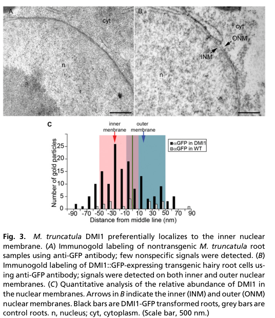

## Question

# Gene Research for Functional Annotation

## ⚠️ CRITICAL: Gene/Protein Identification Context

**BEFORE YOU BEGIN RESEARCH:** You MUST verify you are researching the CORRECT gene/protein. Gene symbols can be ambiguous, especially for less well-characterized genes from non-model organisms.

### Target Gene/Protein Identity (from UniProt):
- **UniProt Accession:** Q6RHR6
- **Protein Description:** RecName: Full=Ion channel DMI1 {ECO:0000303|PubMed:14963334}; AltName: Full=Does not make infections protein 1 {ECO:0000303|PubMed:14963334};
- **Gene Information:** Name=DMI1 {ECO:0000303|PubMed:14963334};
- **Organism (full):** Medicago truncatula (Barrel medic) (Medicago tribuloides).
- **Protein Family:** Belongs to the castor/pollux (TC 1.A.1.23) family.
- **Key Domains:** CASTOR/POLLUX/SYM8-like. (IPR044849); CASTOR/POLLUX/SYM8_dom. (IPR010420); NAD(P)-bd_dom_sf. (IPR036291); RCK_N. (IPR003148); Castor_Poll_mid (PF06241)

### MANDATORY VERIFICATION STEPS:

1. **Check if the gene symbol "DMI1" matches the protein description above**
2. **Verify the organism is correct:** Medicago truncatula (Barrel medic) (Medicago tribuloides).
3. **Check if protein family/domains align with what you find in literature**
4. **If you find literature for a DIFFERENT gene with the same or similar symbol, STOP**

### If Gene Symbol is Ambiguous or You Cannot Find Relevant Literature:

**DO NOT PROCEED WITH RESEARCH ON A DIFFERENT GENE.** Instead:
- State clearly: "The gene symbol 'DMI1' is ambiguous or literature is limited for this specific protein"
- Explain what you found (e.g., "Found extensive literature on a different gene with the same symbol in a different organism")
- Describe the protein based ONLY on the UniProt information provided above
- Suggest that the protein function can be inferred from domain/family information

### Research Target:

Please provide a comprehensive research report on the gene **DMI1** (gene ID: DMI1, UniProt: Q6RHR6) in MEDTR.

The research report should be a detailed narrative explaining the function, biological processes, and localization of the gene product. Citations should be given for all claims.

You should prioritize authoritative reviews and primary scientific literature when conducting research. You can supplement
this with annotations you find in gene/protein databases, but these can be outdated or inaccurate.

We are specifically interested in the primary function of the gene - for enzymes, what reaction is catalyzed, and what is the substrate specificity? For transporters, what is the substrate? For structural proteins or adapters, what is the broader structural role? For signaling molecules, what is the role in the pathway.

We are interested in where in or outside the cell the gene product carries out its function.

We are also interested in the signaling or biochemical pathways in which the gene functions. We are less interested in broad pleiotropic effects, except where these elucidate the precise role.

Include evidence where possible. We are interested in both experimental evidence as well as inference from structure, evolution, or bioinformatic analysis. Precise studies should be prioritized over high-throughput, where available.

## Output

Question: You are an expert researcher providing comprehensive, well-cited information.

Provide detailed information focusing on:
1. Key concepts and definitions with current understanding
2. Recent developments and latest research (prioritize 2023-2024 sources)
3. Current applications and real-world implementations
4. Expert opinions and analysis from authoritative sources
5. Relevant statistics and data from recent studies

Format as a comprehensive research report with proper citations. Include URLs and publication dates where available.
Always prioritize recent, authoritative sources and provide specific citations for all major claims.

# Gene Research for Functional Annotation

## ⚠️ CRITICAL: Gene/Protein Identification Context

**BEFORE YOU BEGIN RESEARCH:** You MUST verify you are researching the CORRECT gene/protein. Gene symbols can be ambiguous, especially for less well-characterized genes from non-model organisms.

### Target Gene/Protein Identity (from UniProt):
- **UniProt Accession:** Q6RHR6
- **Protein Description:** RecName: Full=Ion channel DMI1 {ECO:0000303|PubMed:14963334}; AltName: Full=Does not make infections protein 1 {ECO:0000303|PubMed:14963334};
- **Gene Information:** Name=DMI1 {ECO:0000303|PubMed:14963334};
- **Organism (full):** Medicago truncatula (Barrel medic) (Medicago tribuloides).
- **Protein Family:** Belongs to the castor/pollux (TC 1.A.1.23) family.
- **Key Domains:** CASTOR/POLLUX/SYM8-like. (IPR044849); CASTOR/POLLUX/SYM8_dom. (IPR010420); NAD(P)-bd_dom_sf. (IPR036291); RCK_N. (IPR003148); Castor_Poll_mid (PF06241)

### MANDATORY VERIFICATION STEPS:

1. **Check if the gene symbol "DMI1" matches the protein description above**
2. **Verify the organism is correct:** Medicago truncatula (Barrel medic) (Medicago tribuloides).
3. **Check if protein family/domains align with what you find in literature**
4. **If you find literature for a DIFFERENT gene with the same or similar symbol, STOP**

### If Gene Symbol is Ambiguous or You Cannot Find Relevant Literature:

**DO NOT PROCEED WITH RESEARCH ON A DIFFERENT GENE.** Instead:
- State clearly: "The gene symbol 'DMI1' is ambiguous or literature is limited for this specific protein"
- Explain what you found (e.g., "Found extensive literature on a different gene with the same symbol in a different organism")
- Describe the protein based ONLY on the UniProt information provided above
- Suggest that the protein function can be inferred from domain/family information

### Research Target:

Please provide a comprehensive research report on the gene **DMI1** (gene ID: DMI1, UniProt: Q6RHR6) in MEDTR.

The research report should be a detailed narrative explaining the function, biological processes, and localization of the gene product. Citations should be given for all claims.

You should prioritize authoritative reviews and primary scientific literature when conducting research. You can supplement
this with annotations you find in gene/protein databases, but these can be outdated or inaccurate.

We are specifically interested in the primary function of the gene - for enzymes, what reaction is catalyzed, and what is the substrate specificity? For transporters, what is the substrate? For structural proteins or adapters, what is the broader structural role? For signaling molecules, what is the role in the pathway.

We are interested in where in or outside the cell the gene product carries out its function.

We are also interested in the signaling or biochemical pathways in which the gene functions. We are less interested in broad pleiotropic effects, except where these elucidate the precise role.

Include evidence where possible. We are interested in both experimental evidence as well as inference from structure, evolution, or bioinformatic analysis. Precise studies should be prioritized over high-throughput, where available.

# Functional annotation report: *Medicago truncatula* DMI1

**Identity check.** The supplied UniProt accession **Q6RHR6** identifies the intended target as *Medicago truncatula* DMI1, **DOESN’T MAKE INFECTIONS 1**. The protein and organism described in the primary literature match that identification: MtDMI1 is a CASTOR/POLLUX-family ion channel with four predicted membrane-spanning segments and two cytosolic regulator-of-K⁺-conductance (RCK) domains. **CNGC15 is a different, interacting channel**, while CASTOR and POLLUX generally name related *Lotus japonicus* proteins; results for either must not be mistaken for direct measurements of MtDMI1. The original gene-identification paper is Ané *et al.*, *Science* (February 2004), https://doi.org/10.1126/science.1092986; its full text was not available for this assessment, so the functional conclusions below rely principally on subsequently accessible experiments. (liu2022constitutiveactivationof pages 1-2, jacott2024cngc15anddmi1 pages 1-2, jacott2024cngc15anddmi1 pages 6-7)

**Principal annotation.** DMI1 is a **nuclear-envelope cation channel and regulator of symbiotic nuclear Ca²⁺ oscillations**, not a catalyst, nutrient-import transporter, or structural component of the nodule. Its experimentally demonstrated K⁺ conductance and its genetic partnership with the Ca²⁺-permeable CNGC15 channels support a working model in which DMI1 supplies counter-ion movement and helps set the frequency of Ca²⁺ release into the nucleoplasm. Whether native, full-length MtDMI1 also carries physiologically important Ca²⁺ remains unresolved. (venkateshwaran2012therecentevolution pages 5-7, jacott2024cngc15anddmi1 pages 3-4, cook2025autoactivecngc15enhances pages 3-4, cook2025autoactivecngc15enhances pages 4-5)

## Molecular function and location

DMI1 belongs to the CASTOR/POLLUX/SYM8-like channel family specified in the supplied annotation. Its tandem RCK1–RCK2 domains form part of a four-subunit, Ca²⁺-responsive regulatory *gating ring*; that architecture explains why Ca²⁺ binding and interactions between the two RCK domains affect channel activation. The RCK domains are regulatory features, **not evidence of an NAD(P)-dependent enzymatic reaction**. The specified NAD(P)-binding-domain-superfamily annotation should therefore not be interpreted as demonstrating that DMI1 binds NAD(P) or catalyzes a redox reaction. (liu2022constitutiveactivationof pages 1-2, liu2022constitutiveactivationof pages 4-5)

DMI1 acts **at the nuclear envelope of root cells**, particularly the inner nuclear membrane facing the nucleoplasm. Immunogold labeling of a functional DMI1–GFP fusion detected **151 particles across 16 nuclei**, compared with **20 particles across 22 negative-control nuclei**; labeling occurred at both nuclear membranes but preferentially at the inner one. The perinuclear space between these membranes is continuous with the endoplasmic-reticulum lumen and serves as the Ca²⁺ store for nuclear spiking. The cropped localization evidence is **Figure 3B–C** of Capoen *et al.*, *PNAS* (August 2011), https://doi.org/10.1073/pnas.1107912108. (capoen2011nuclearmembranescontrol pages 2-3, capoen2011nuclearmembranescontrol pages 3-4, capoen2011nuclearmembranescontrol media 4e4692c5, jacott2024cngc15anddmi1 pages 1-2)

The strongest **direct MtDMI1 ion-conduction measurement** is a single-channel conductance of approximately **64 pS in symmetrical KCl** in planar-bilayer experiments. Under the study’s comparison conditions, *Lotus* CASTOR conducted approximately **175 pS**; MtDMI1’s reported mean open time was **16 ± 1 ms**, versus **4 ± 1 ms** for CASTOR. A filter-region Ala-to-Ser change, **DMI1 A294S**, altered genetic complementation and Ca²⁺-signaling behavior, underscoring that the pore matters for function. These experiments establish K⁺ conduction under assay conditions; they do **not** establish an exclusive native K⁺ substrate or a measured physiological K⁺/Ca²⁺ permeability ratio for MtDMI1. Venkateshwaran *et al.*, *The Plant Cell* (June 2012), https://doi.org/10.1105/tpc.112.098475. (venkateshwaran2012therecentevolution pages 5-7, venkateshwaran2012therecentevolution pages 7-9, venkateshwaran2012therecentevolution pages 3-5)

**Selectivity remains a genuine mechanistic dispute.** Kim *et al.* characterized *Lotus* CASTOR as a Ca²⁺-activated, Ca²⁺-selective channel, challenging the earlier counter-ion interpretation: *Nature Communications* (August 2019), https://doi.org/10.1038/s41467-019-11698-5. This is important homolog evidence, **not proof that native MtDMI1 is predominantly Ca²⁺-selective**. Reviewing both positions, Jacott and del Cerro favored CNGC15 as the principal Ca²⁺-release pore, DMI1 as the counter-ion partner, and the Ca²⁺-ATPase MCA8 as the recapture pump, while explicitly leaving possible DMI1 Ca²⁺ permeability open: *Journal of Experimental Botany* (September 2024), https://doi.org/10.1093/jxb/erae352. (kim2019ca2+regulatedca2+channels pages 1-2, jacott2024cngc15anddmi1 pages 1-2, jacott2024cngc15anddmi1 pages 3-4)

The following table separates direct DMI1 observations from homolog-derived inference and later pathway findings.

| Aspect | Observation | Specificity / limits |
|---|---|---|
| Identity and architecture | **DMI1 (Q6RHR6)** is the *Medicago truncatula* DOES NOT/DOESN’T MAKE INFECTIONS 1 channel, corresponding to Lotus CASTOR/POLLUX and pea SYM8. It has four predicted transmembrane segments and tandem cytosolic RCK1–RCK2 regulatory domains that assemble into a tetrameric gating ring. (liu2022constitutiveactivationof pages 1-2, liu2022constitutiveactivationof pages 4-5) | DMI1 is distinct from the interacting CNGC15 Ca²⁺ channels. “CASTOR” and “POLLUX” principally denote *Lotus japonicus* homologues, so their results cannot automatically be assigned to MtDMI1. (jacott2024cngc15anddmi1 pages 1-2, charpentier2016nuclearlocalizedcyclicnucleotide–gated pages 1-6) |
| Subcellular localization | A functional DMI1–GFP fusion preferentially localized to the **inner nuclear membrane**: immunogold analysis counted 151 particles across 16 nuclei, versus 20 particles across 22 control nuclei. (capoen2011nuclearmembranescontrol pages 2-3) | Signals occurred at both nuclear membranes, but the distribution favored the inner membrane. This places DMI1 beside the nucleoplasmic Ca²⁺-release machinery rather than at the plasma membrane. (capoen2011nuclearmembranescontrol pages 3-4, capoen2011nuclearmembranescontrol media 4e4692c5) |
| Direct ion-channel evidence | In symmetrical KCl planar-bilayer recordings, MtDMI1 conductance was approximately **64 pS**, compared with approximately **175 pS** for LjCASTOR; DMI1 also had a longer mean open time than LjCASTOR (16 ± 1 versus 4 ± 1 ms). (venkateshwaran2012therecentevolution pages 7-9, venkateshwaran2012therecentevolution pages 5-7) | This is direct MtDMI1 channel evidence consistent with K⁺ conductance and a counter-ion role. The 175-pS comparator is a *Lotus* homologue, not MtDMI1. |
| Ca²⁺ selectivity controversy | A 2019 study characterized **LjCASTOR** as a Ca²⁺-regulated, Ca²⁺-selective channel, challenging the K⁺ counter-ion model; the 2024 expert review nevertheless judged the CNGC15 Ca²⁺ channel–DMI1 counter-ion–MCA8 pump model the best-supported working model. (kim2019ca2+regulatedca2+channels pages 1-2, jacott2024cngc15anddmi1 pages 2-3, jacott2024cngc15anddmi1 pages 3-4) | The strongest Ca²⁺-selectivity result was obtained for truncated/reconstituted **Lotus CASTOR**, not directly for full-length MtDMI1 in its native nuclear membrane. DMI1’s physiological permeant ion therefore remains unresolved. (jacott2024cngc15anddmi1 pages 1-2, jacott2024cngc15anddmi1 pages 6-7) |
| RCK gating and CNGC15 dependence | The dominant MtDMI1 **S760N** substitution disrupts the RCK1–RCK2 inhibitory interface, causing spontaneous nuclear Ca²⁺ oscillations, symbiotic-gene expression and nodulation. CNGC15 RNAi nearly abolished the oscillations; only **3 of 37** cells retained weak activity. (liu2022constitutiveactivationof pages 3-4, liu2022constitutiveactivationof pages 4-5) | Autoactive DMI1 alone is insufficient for robust oscillations: its phenotype depends on CNGC15, and mutations disrupting DMI1 gating-ring Ca²⁺ binding abolish activation. This supports DMI1 as regulator/counter-ion partner rather than the sole Ca²⁺-release pore. (liu2022constitutiveactivationof pages 4-5, jacott2024cngc15anddmi1 pages 3-4) |
| 2024 evolutionary evidence | In bryophyte–legume tests, MtDMI1 restored arbuscular-mycorrhizal colonization in *Marchantia paleacea dmi1*. Conversely, MpaDMI1 restored nuclear Ca²⁺ oscillations—but not full colonization—in *M. truncatula dmi1-1* and caused spontaneous oscillations without added LCO. (jacott2024cngc15anddmi1 pages 4-5, jacott2024cngc15anddmi1 pages 5-6) | The bidirectional tests show ancient conservation of Ca²⁺-oscillator function but divergence in gating and host-specific outputs. The proposed RCK salt-bridge mechanism for the L503R/S760N effects is supported partly by AlphaFold2 modeling rather than an intact-channel structure. (jacott2024cngc15anddmi1 pages 5-6) |
| 2025 mechanistic and translational update | A K⁺-selective **DMI1TVGYG** pore variant restored Nod-factor-induced oscillations and nodulation in dmi1-1, while DMI1 Ca²⁺-binding mutations altered or abolished CNGC15-GOF oscillation frequencies. These findings support DMI1 as a frequency-setting **pacemaker**, whereas CNGC15 is the Ca²⁺-release channel. (cook2025autoactivecngc15enhances pages 3-4, cook2025autoactivecngc15enhances pages 4-5) | The field implementation engineered **CNGC15-GOF in wheat**, increasing AM colonization across five plots and in subsequent near-isogenic lines; it was not a DMI1-engineered crop. DMI1’s application remains mechanistic and a prospective engineering target. (cook2025autoactivecngc15enhances pages 5-6, cook2025autoactivecngc15enhances pages 2-3) |

*Table: Evidence supporting the identity, localization, channel properties, RCK-dependent gating and symbiotic role of Medicago DMI1, with organism-specific limitations and unresolved ion selectivity made explicit.*

## Role in the common symbiosis-signaling pathway

Rhizobial **Nod factors** and fungal symbiotic signals initiate distinct root-surface recognition events that converge on the common symbiosis pathway. Nuclear-envelope DMI1 acts with CNGC15a/b/c during repeated nuclear and perinuclear Ca²⁺ spikes; CNGC15 mediates Ca²⁺ passage from the perinuclear store, and MCA8 helps return Ca²⁺ to that store after each spike. Ca²⁺-bound calmodulin 2 supplies negative feedback by closing CNGC15. The Ca²⁺ pattern is subsequently decoded by **DMI3/CCaMK and IPD3/CYCLOPS**, leading to transcriptional programs associated with infection and nodule development, including **NIN** and the early-response marker **ENOD11**. The precise molecular relay that switches on DMI1 after surface perception is still incompletely defined; the observed DMI2–HMGR1/mevalonate connection should not be represented as a proven direct ligand–DMI1 interaction. (liu2022constitutiveactivationof pages 1-2, cerro2022engineeredcam2modulates pages 1-2, grubb2023investigatingtheregulation pages 26-30, jacott2024cngc15anddmi1 pages 1-2)

The most incisive *Medicago* perturbation is **DMI1 S760N**, recovered as the dominant *spd1* spontaneous-nodulation allele. This RCK2 substitution disrupts the regulatory RCK1–RCK2 interface and induces nuclear Ca²⁺ oscillations and nodule-like organs **without rhizobia or added Nod factor**. Genetic epistasis places its effect downstream of the Nod-factor receptor components **NFP and DMI2** but upstream of the Ca²⁺ decoder **DMI3/CCaMK** and nodulation regulators **ERN1 and NIN**. The induced structures demonstrate activation of a nodulation program, **not nitrogen fixation by an uninoculated plant**. Liu *et al.*, *PNAS* (August 2022), https://doi.org/10.1073/pnas.2205920119. (liu2022constitutiveactivationof pages 2-3, liu2022constitutiveactivationof pages 3-4)

This response depends strongly on **CNGC15**: CNGC15 knockdown in the *spd1* background left only **3 of 37** imaged cells with weak residual spontaneous oscillations. MtDMI1 S760N retained nuclear-membrane localization and interaction with CNGC15b; variants that disrupted Ca²⁺ binding by the DMI1 gating ring lost constitutive activity. These experiments distinguish DMI1’s essential channel/gating contribution from the proposition that DMI1 by itself forms the entire Ca²⁺ oscillator. Separately, engineering CaM2 to bind CNGC15 more strongly increased Ca²⁺-spike frequency and enhanced root-nodule symbiosis, but **did not increase arbuscular mycorrhizal colonization** in that experiment. del Cerro *et al.*, *PNAS* (March 2022), https://doi.org/10.1073/pnas.2200099119. (liu2022constitutiveactivationof pages 4-5, cerro2022engineeredcam2modulates pages 1-2)

## Recent developments and implementation

A **2024** cross-lineage study, discussed in the Jacott–del Cerro review, found that MtDMI1 restored mycorrhizal colonization in a DMI1-deficient liverwort, *Marchantia paleacea*. Conversely, liverwort DMI1 restored nuclear Ca²⁺ oscillations but **not full colonization** in *Medicago dmi1-1*, and it could elicit spontaneous oscillations without added symbiotic signal. These results argue for ancient conservation of the oscillator’s core role, with divergence in gating and host-specific symbiotic function. Lam *et al.*, *Current Biology* (2024), https://doi.org/10.1016/j.cub.2024.03.063; evidence here was assessed through the accessible 2024 review because the primary article’s full text could not be retrieved. (jacott2024cngc15anddmi1 pages 4-5, jacott2024cngc15anddmi1 pages 5-6)

A **2025** mechanistic study refined the division of labor. Gain-of-function **CNGC15** generated spontaneous **low-frequency** nuclear spikes even in a *dmi1* mutant, but normal Nod-factor-associated high-frequency signaling and effective rhizobial epidermal infection required DMI1. Mutating DMI1 Ca²⁺-binding sites changed or abolished the frequency response. Notably, a modified **K⁺-selective DMI1 pore** restored Nod-factor-induced spiking and nodulation in *dmi1-1*, supporting a frequency-setting or “pacemaker” contribution without requiring that DMI1 itself be the principal Ca²⁺-release pathway. These are perturbation-based conclusions; native MtDMI1 ion selectivity is not thereby settled. Cook *et al.*, *Nature* (published 2025; DOI assigned 2024), https://doi.org/10.1038/s41586-024-08424-7. (cook2025autoactivecngc15enhances pages 3-4, cook2025autoactivecngc15enhances pages 4-5)

**Practical status.** DMI1 is currently best established as a **research target for manipulating symbiotic signaling**, rather than a deployed crop trait. In the 2025 study, the engineered component transferred to wheat was **CNGC15, not DMI1**: field-grown gain-of-function wheat had greater arbuscular-mycorrhizal colonization across **five plots**, with increased colonization also observed in a subsequent near-isogenic-line test. This is field proof of concept for tuning the pathway, not evidence that DMI1-engineered wheat is in agricultural use or that fertilizer reduction has been established at commercial scale. (cook2025autoactivecngc15enhances pages 5-6)

**Functional-annotation conclusion:** annotate Q6RHR6 primarily as a *Medicago truncatula* **inner-nuclear-envelope-enriched, RCK-regulated cation channel required for symbiosis-induced nuclear Ca²⁺ signaling**. Direct K⁺ conductance, DMI1-dependent regulation of CNGC15-associated oscillations, and necessity for normal rhizobial and mycorrhizal signaling are supported experimentally. Describe **K⁺ counter-ion/pacemaker function as the leading physiological model**, while explicitly flagging native Ca²⁺ permeability, the direction and magnitude of physiological ion flux, and the immediate upstream activating signal as unresolved. (capoen2011nuclearmembranescontrol pages 2-3, venkateshwaran2012therecentevolution pages 5-7, liu2022constitutiveactivationof pages 4-5, jacott2024cngc15anddmi1 pages 3-4, cook2025autoactivecngc15enhances pages 4-5)

References

1. (liu2022constitutiveactivationof pages 1-2): Haiyue Liu, Jie-Shun Lin, Zhenpeng Luo, Jongho Sun, Xiaowei Huang, Yang Yang, Ji Xu, Yong-Fei Wang, Peng Zhang, Giles E. D. Oldroyd, and Fang Xie. Constitutive activation of a nuclear-localized calcium channel complex in medicago truncatula. Proceedings of the National Academy of Sciences of the United States of America, Aug 2022. URL: https://doi.org/10.1073/pnas.2205920119, doi:10.1073/pnas.2205920119. This article has 45 citations and is from a highest quality peer-reviewed journal.

2. (jacott2024cngc15anddmi1 pages 1-2): Catherine N. Jacott and Pablo del Cerro. Cngc15 and dmi1 ion channel gating in nuclear calcium signaling: opening new questions and closing controversies. Sep 2024. URL: https://doi.org/10.1093/jxb/erae352, doi:10.1093/jxb/erae352. This article has 6 citations and is from a domain leading peer-reviewed journal.

3. (jacott2024cngc15anddmi1 pages 6-7): Catherine N. Jacott and Pablo del Cerro. Cngc15 and dmi1 ion channel gating in nuclear calcium signaling: opening new questions and closing controversies. Sep 2024. URL: https://doi.org/10.1093/jxb/erae352, doi:10.1093/jxb/erae352. This article has 6 citations and is from a domain leading peer-reviewed journal.

4. (venkateshwaran2012therecentevolution pages 5-7): Muthusubramanian Venkateshwaran, Ana Cosme, Lu Han, Mari Banba, Kenneth A. Satyshur, Enrico Schleiff, Martin Parniske, Haruko Imaizumi-Anraku, and Jean-Michel Ané. The recent evolution of a symbiotic ion channel in the legume family altered ion conductance and improved functionality in calcium signaling[c][w]. Plant Cell, 24:2528-2545, Jun 2012. URL: https://doi.org/10.1105/tpc.112.098475, doi:10.1105/tpc.112.098475. This article has 77 citations and is from a highest quality peer-reviewed journal.

5. (jacott2024cngc15anddmi1 pages 3-4): Catherine N. Jacott and Pablo del Cerro. Cngc15 and dmi1 ion channel gating in nuclear calcium signaling: opening new questions and closing controversies. Sep 2024. URL: https://doi.org/10.1093/jxb/erae352, doi:10.1093/jxb/erae352. This article has 6 citations and is from a domain leading peer-reviewed journal.

6. (cook2025autoactivecngc15enhances pages 3-4): Nicola M. Cook, Giulia Gobbato, Catherine N. Jacott, Clemence Marchal, Chen Yun Hsieh, Anson Ho Ching Lam, James Simmonds, Pablo del Cerro, Pilar Navarro Gomez, Clemence Rodney, Neftaly Cruz-Mireles, Cristobal Uauy, Wilfried Haerty, David M. Lawson, and Myriam Charpentier. Autoactive cngc15 enhances root endosymbiosis in legume and wheat. Nature, 638:752-759, Jan 2025. URL: https://doi.org/10.1038/s41586-024-08424-7, doi:10.1038/s41586-024-08424-7. This article has 49 citations and is from a highest quality peer-reviewed journal.

7. (cook2025autoactivecngc15enhances pages 4-5): Nicola M. Cook, Giulia Gobbato, Catherine N. Jacott, Clemence Marchal, Chen Yun Hsieh, Anson Ho Ching Lam, James Simmonds, Pablo del Cerro, Pilar Navarro Gomez, Clemence Rodney, Neftaly Cruz-Mireles, Cristobal Uauy, Wilfried Haerty, David M. Lawson, and Myriam Charpentier. Autoactive cngc15 enhances root endosymbiosis in legume and wheat. Nature, 638:752-759, Jan 2025. URL: https://doi.org/10.1038/s41586-024-08424-7, doi:10.1038/s41586-024-08424-7. This article has 49 citations and is from a highest quality peer-reviewed journal.

8. (liu2022constitutiveactivationof pages 4-5): Haiyue Liu, Jie-Shun Lin, Zhenpeng Luo, Jongho Sun, Xiaowei Huang, Yang Yang, Ji Xu, Yong-Fei Wang, Peng Zhang, Giles E. D. Oldroyd, and Fang Xie. Constitutive activation of a nuclear-localized calcium channel complex in medicago truncatula. Proceedings of the National Academy of Sciences of the United States of America, Aug 2022. URL: https://doi.org/10.1073/pnas.2205920119, doi:10.1073/pnas.2205920119. This article has 45 citations and is from a highest quality peer-reviewed journal.

9. (capoen2011nuclearmembranescontrol pages 2-3): Ward Capoen, Jongho Sun, Derin Wysham, Marisa S. Otegui, Muthusubramanian Venkateshwaran, Sibylle Hirsch, Hiroki Miwa, J. Allan Downie, Richard J. Morris, Jean-Michel Ané, and Giles E. D. Oldroyd. Nuclear membranes control symbiotic calcium signaling of legumes. Proceedings of the National Academy of Sciences, 108:14348-14353, Aug 2011. URL: https://doi.org/10.1073/pnas.1107912108, doi:10.1073/pnas.1107912108. This article has 296 citations and is from a highest quality peer-reviewed journal.

10. (capoen2011nuclearmembranescontrol pages 3-4): Ward Capoen, Jongho Sun, Derin Wysham, Marisa S. Otegui, Muthusubramanian Venkateshwaran, Sibylle Hirsch, Hiroki Miwa, J. Allan Downie, Richard J. Morris, Jean-Michel Ané, and Giles E. D. Oldroyd. Nuclear membranes control symbiotic calcium signaling of legumes. Proceedings of the National Academy of Sciences, 108:14348-14353, Aug 2011. URL: https://doi.org/10.1073/pnas.1107912108, doi:10.1073/pnas.1107912108. This article has 296 citations and is from a highest quality peer-reviewed journal.

11. (capoen2011nuclearmembranescontrol media 4e4692c5): Ward Capoen, Jongho Sun, Derin Wysham, Marisa S. Otegui, Muthusubramanian Venkateshwaran, Sibylle Hirsch, Hiroki Miwa, J. Allan Downie, Richard J. Morris, Jean-Michel Ané, and Giles E. D. Oldroyd. Nuclear membranes control symbiotic calcium signaling of legumes. Proceedings of the National Academy of Sciences, 108:14348-14353, Aug 2011. URL: https://doi.org/10.1073/pnas.1107912108, doi:10.1073/pnas.1107912108. This article has 296 citations and is from a highest quality peer-reviewed journal.

12. (venkateshwaran2012therecentevolution pages 7-9): Muthusubramanian Venkateshwaran, Ana Cosme, Lu Han, Mari Banba, Kenneth A. Satyshur, Enrico Schleiff, Martin Parniske, Haruko Imaizumi-Anraku, and Jean-Michel Ané. The recent evolution of a symbiotic ion channel in the legume family altered ion conductance and improved functionality in calcium signaling[c][w]. Plant Cell, 24:2528-2545, Jun 2012. URL: https://doi.org/10.1105/tpc.112.098475, doi:10.1105/tpc.112.098475. This article has 77 citations and is from a highest quality peer-reviewed journal.

13. (venkateshwaran2012therecentevolution pages 3-5): Muthusubramanian Venkateshwaran, Ana Cosme, Lu Han, Mari Banba, Kenneth A. Satyshur, Enrico Schleiff, Martin Parniske, Haruko Imaizumi-Anraku, and Jean-Michel Ané. The recent evolution of a symbiotic ion channel in the legume family altered ion conductance and improved functionality in calcium signaling[c][w]. Plant Cell, 24:2528-2545, Jun 2012. URL: https://doi.org/10.1105/tpc.112.098475, doi:10.1105/tpc.112.098475. This article has 77 citations and is from a highest quality peer-reviewed journal.

14. (kim2019ca2+regulatedca2+channels pages 1-2): Sunghoon Kim, Weizhong Zeng, Shane Bernard, Jun Liao, Muthusubramanian Venkateshwaran, Jean-Michel Ane, and Youxing Jiang. Ca2+-regulated ca2+ channels with an rck gating ring control plant symbiotic associations. Nature Communications, Aug 2019. URL: https://doi.org/10.1038/s41467-019-11698-5, doi:10.1038/s41467-019-11698-5. This article has 73 citations and is from a highest quality peer-reviewed journal.

15. (charpentier2016nuclearlocalizedcyclicnucleotide–gated pages 1-6): Myriam Charpentier, Jongho Sun, Teresa Vaz Martins, Guru V. Radhakrishnan, Kim Findlay, Eleni Soumpourou, Julien Thouin, Anne-Aliénor Véry, Dale Sanders, Richard J. Morris, and Giles E. D. Oldroyd. Nuclear-localized cyclic nucleotide–gated channels mediate symbiotic calcium oscillations. Science, 352:1102-1105, May 2016. URL: https://doi.org/10.1126/science.aae0109, doi:10.1126/science.aae0109. This article has 387 citations and is from a highest quality peer-reviewed journal.

16. (jacott2024cngc15anddmi1 pages 2-3): Catherine N. Jacott and Pablo del Cerro. Cngc15 and dmi1 ion channel gating in nuclear calcium signaling: opening new questions and closing controversies. Sep 2024. URL: https://doi.org/10.1093/jxb/erae352, doi:10.1093/jxb/erae352. This article has 6 citations and is from a domain leading peer-reviewed journal.

17. (liu2022constitutiveactivationof pages 3-4): Haiyue Liu, Jie-Shun Lin, Zhenpeng Luo, Jongho Sun, Xiaowei Huang, Yang Yang, Ji Xu, Yong-Fei Wang, Peng Zhang, Giles E. D. Oldroyd, and Fang Xie. Constitutive activation of a nuclear-localized calcium channel complex in medicago truncatula. Proceedings of the National Academy of Sciences of the United States of America, Aug 2022. URL: https://doi.org/10.1073/pnas.2205920119, doi:10.1073/pnas.2205920119. This article has 45 citations and is from a highest quality peer-reviewed journal.

18. (jacott2024cngc15anddmi1 pages 4-5): Catherine N. Jacott and Pablo del Cerro. Cngc15 and dmi1 ion channel gating in nuclear calcium signaling: opening new questions and closing controversies. Sep 2024. URL: https://doi.org/10.1093/jxb/erae352, doi:10.1093/jxb/erae352. This article has 6 citations and is from a domain leading peer-reviewed journal.

19. (jacott2024cngc15anddmi1 pages 5-6): Catherine N. Jacott and Pablo del Cerro. Cngc15 and dmi1 ion channel gating in nuclear calcium signaling: opening new questions and closing controversies. Sep 2024. URL: https://doi.org/10.1093/jxb/erae352, doi:10.1093/jxb/erae352. This article has 6 citations and is from a domain leading peer-reviewed journal.

20. (cook2025autoactivecngc15enhances pages 5-6): Nicola M. Cook, Giulia Gobbato, Catherine N. Jacott, Clemence Marchal, Chen Yun Hsieh, Anson Ho Ching Lam, James Simmonds, Pablo del Cerro, Pilar Navarro Gomez, Clemence Rodney, Neftaly Cruz-Mireles, Cristobal Uauy, Wilfried Haerty, David M. Lawson, and Myriam Charpentier. Autoactive cngc15 enhances root endosymbiosis in legume and wheat. Nature, 638:752-759, Jan 2025. URL: https://doi.org/10.1038/s41586-024-08424-7, doi:10.1038/s41586-024-08424-7. This article has 49 citations and is from a highest quality peer-reviewed journal.

21. (cook2025autoactivecngc15enhances pages 2-3): Nicola M. Cook, Giulia Gobbato, Catherine N. Jacott, Clemence Marchal, Chen Yun Hsieh, Anson Ho Ching Lam, James Simmonds, Pablo del Cerro, Pilar Navarro Gomez, Clemence Rodney, Neftaly Cruz-Mireles, Cristobal Uauy, Wilfried Haerty, David M. Lawson, and Myriam Charpentier. Autoactive cngc15 enhances root endosymbiosis in legume and wheat. Nature, 638:752-759, Jan 2025. URL: https://doi.org/10.1038/s41586-024-08424-7, doi:10.1038/s41586-024-08424-7. This article has 49 citations and is from a highest quality peer-reviewed journal.

22. (cerro2022engineeredcam2modulates pages 1-2): Pablo del Cerro, Nicola M. Cook, Rik Huisman, Pierre Dangeville, Lauren E. Grubb, Clemence Marchal, Anson Ho Ching Lam, and Myriam Charpentier. Engineered cam2 modulates nuclear calcium oscillation and enhances legume root nodule symbiosis. Proceedings of the National Academy of Sciences of the United States of America, Mar 2022. URL: https://doi.org/10.1073/pnas.2200099119, doi:10.1073/pnas.2200099119. This article has 32 citations and is from a highest quality peer-reviewed journal.

23. (grubb2023investigatingtheregulation pages 26-30): L Grubb. Investigating the regulation of nuclear calcium oscillation in plant endosymbiosis. Unknown journal, 2023.

24. (liu2022constitutiveactivationof pages 2-3): Haiyue Liu, Jie-Shun Lin, Zhenpeng Luo, Jongho Sun, Xiaowei Huang, Yang Yang, Ji Xu, Yong-Fei Wang, Peng Zhang, Giles E. D. Oldroyd, and Fang Xie. Constitutive activation of a nuclear-localized calcium channel complex in medicago truncatula. Proceedings of the National Academy of Sciences of the United States of America, Aug 2022. URL: https://doi.org/10.1073/pnas.2205920119, doi:10.1073/pnas.2205920119. This article has 45 citations and is from a highest quality peer-reviewed journal.

## Artifacts

- [Edison artifact artifact-00](DMI1-deep-research-falcon_artifacts/artifact-00.md)

## Citations

1. capoen2011nuclearmembranescontrol pages 2-3
2. liu2022constitutiveactivationof pages 1-2
3. venkateshwaran2012therecentevolution pages 5-7
4. liu2022constitutiveactivationof pages 4-5
5. capoen2011nuclearmembranescontrol pages 3-4
6. venkateshwaran2012therecentevolution pages 7-9
7. venkateshwaran2012therecentevolution pages 3-5
8. liu2022constitutiveactivationof pages 3-4
9. grubb2023investigatingtheregulation pages 26-30
10. liu2022constitutiveactivationof pages 2-3
11. c
12. w
13. https://doi.org/10.1126/science.1092986;
14. https://doi.org/10.1073/pnas.1107912108.
15. https://doi.org/10.1105/tpc.112.098475.
16. https://doi.org/10.1038/s41467-019-11698-5.
17. https://doi.org/10.1093/jxb/erae352.
18. https://doi.org/10.1073/pnas.2205920119.
19. https://doi.org/10.1073/pnas.2200099119.
20. https://doi.org/10.1016/j.cub.2024.03.063;
21. https://doi.org/10.1038/s41586-024-08424-7.
22. https://doi.org/10.1073/pnas.2205920119,
23. https://doi.org/10.1093/jxb/erae352,
24. https://doi.org/10.1105/tpc.112.098475,
25. https://doi.org/10.1038/s41586-024-08424-7,
26. https://doi.org/10.1073/pnas.1107912108,
27. https://doi.org/10.1038/s41467-019-11698-5,
28. https://doi.org/10.1126/science.aae0109,
29. https://doi.org/10.1073/pnas.2200099119,