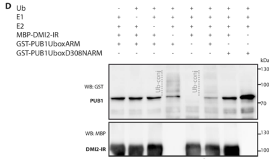

## Question

# Gene Research for Functional Annotation

## ⚠️ CRITICAL: Gene/Protein Identification Context

**BEFORE YOU BEGIN RESEARCH:** You MUST verify you are researching the CORRECT gene/protein. Gene symbols can be ambiguous, especially for less well-characterized genes from non-model organisms.

### Target Gene/Protein Identity (from UniProt):
- **UniProt Accession:** Q8L4H4
- **Protein Description:** RecName: Full=Nodulation receptor kinase; EC=2.7.11.1 {ECO:0000269|PubMed:26839127}; AltName: Full=Does not make infections protein 2; AltName: Full=MtSYMRK; AltName: Full=Symbiosis receptor-like kinase; Flags: Precursor;
- **Gene Information:** Name=NORK; Synonyms=DMI2, SYMRK;
- **Organism (full):** Medicago truncatula (Barrel medic) (Medicago tribuloides).
- **Protein Family:** Belongs to the protein kinase superfamily. Ser/Thr protein
- **Key Domains:** Kinase-like_dom_sf. (IPR011009); Leu-rich_rpt. (IPR001611); LRR_dom_sf. (IPR032675); LRR_N_plant-typ. (IPR013210); Malectin-like_Carb-bd_dom. (IPR024788)

### MANDATORY VERIFICATION STEPS:

1. **Check if the gene symbol "NORK" matches the protein description above**
2. **Verify the organism is correct:** Medicago truncatula (Barrel medic) (Medicago tribuloides).
3. **Check if protein family/domains align with what you find in literature**
4. **If you find literature for a DIFFERENT gene with the same or similar symbol, STOP**

### If Gene Symbol is Ambiguous or You Cannot Find Relevant Literature:

**DO NOT PROCEED WITH RESEARCH ON A DIFFERENT GENE.** Instead:
- State clearly: "The gene symbol 'NORK' is ambiguous or literature is limited for this specific protein"
- Explain what you found (e.g., "Found extensive literature on a different gene with the same symbol in a different organism")
- Describe the protein based ONLY on the UniProt information provided above
- Suggest that the protein function can be inferred from domain/family information

### Research Target:

Please provide a comprehensive research report on the gene **NORK** (gene ID: NORK, UniProt: Q8L4H4) in MEDTR.

The research report should be a detailed narrative explaining the function, biological processes, and localization of the gene product. Citations should be given for all claims.

You should prioritize authoritative reviews and primary scientific literature when conducting research. You can supplement
this with annotations you find in gene/protein databases, but these can be outdated or inaccurate.

We are specifically interested in the primary function of the gene - for enzymes, what reaction is catalyzed, and what is the substrate specificity? For transporters, what is the substrate? For structural proteins or adapters, what is the broader structural role? For signaling molecules, what is the role in the pathway.

We are interested in where in or outside the cell the gene product carries out its function.

We are also interested in the signaling or biochemical pathways in which the gene functions. We are less interested in broad pleiotropic effects, except where these elucidate the precise role.

Include evidence where possible. We are interested in both experimental evidence as well as inference from structure, evolution, or bioinformatic analysis. Precise studies should be prioritized over high-throughput, where available.

## Output

Question: You are an expert researcher providing comprehensive, well-cited information.

Provide detailed information focusing on:
1. Key concepts and definitions with current understanding
2. Recent developments and latest research (prioritize 2023-2024 sources)
3. Current applications and real-world implementations
4. Expert opinions and analysis from authoritative sources
5. Relevant statistics and data from recent studies

Format as a comprehensive research report with proper citations. Include URLs and publication dates where available.
Always prioritize recent, authoritative sources and provide specific citations for all major claims.

# Gene Research for Functional Annotation

## ⚠️ CRITICAL: Gene/Protein Identification Context

**BEFORE YOU BEGIN RESEARCH:** You MUST verify you are researching the CORRECT gene/protein. Gene symbols can be ambiguous, especially for less well-characterized genes from non-model organisms.

### Target Gene/Protein Identity (from UniProt):
- **UniProt Accession:** Q8L4H4
- **Protein Description:** RecName: Full=Nodulation receptor kinase; EC=2.7.11.1 {ECO:0000269|PubMed:26839127}; AltName: Full=Does not make infections protein 2; AltName: Full=MtSYMRK; AltName: Full=Symbiosis receptor-like kinase; Flags: Precursor;
- **Gene Information:** Name=NORK; Synonyms=DMI2, SYMRK;
- **Organism (full):** Medicago truncatula (Barrel medic) (Medicago tribuloides).
- **Protein Family:** Belongs to the protein kinase superfamily. Ser/Thr protein
- **Key Domains:** Kinase-like_dom_sf. (IPR011009); Leu-rich_rpt. (IPR001611); LRR_dom_sf. (IPR032675); LRR_N_plant-typ. (IPR013210); Malectin-like_Carb-bd_dom. (IPR024788)

### MANDATORY VERIFICATION STEPS:

1. **Check if the gene symbol "NORK" matches the protein description above**
2. **Verify the organism is correct:** Medicago truncatula (Barrel medic) (Medicago tribuloides).
3. **Check if protein family/domains align with what you find in literature**
4. **If you find literature for a DIFFERENT gene with the same or similar symbol, STOP**

### If Gene Symbol is Ambiguous or You Cannot Find Relevant Literature:

**DO NOT PROCEED WITH RESEARCH ON A DIFFERENT GENE.** Instead:
- State clearly: "The gene symbol 'NORK' is ambiguous or literature is limited for this specific protein"
- Explain what you found (e.g., "Found extensive literature on a different gene with the same symbol in a different organism")
- Describe the protein based ONLY on the UniProt information provided above
- Suggest that the protein function can be inferred from domain/family information

### Research Target:

Please provide a comprehensive research report on the gene **NORK** (gene ID: NORK, UniProt: Q8L4H4) in MEDTR.

The research report should be a detailed narrative explaining the function, biological processes, and localization of the gene product. Citations should be given for all claims.

You should prioritize authoritative reviews and primary scientific literature when conducting research. You can supplement
this with annotations you find in gene/protein databases, but these can be outdated or inaccurate.

We are specifically interested in the primary function of the gene - for enzymes, what reaction is catalyzed, and what is the substrate specificity? For transporters, what is the substrate? For structural proteins or adapters, what is the broader structural role? For signaling molecules, what is the role in the pathway.

We are interested in where in or outside the cell the gene product carries out its function.

We are also interested in the signaling or biochemical pathways in which the gene functions. We are less interested in broad pleiotropic effects, except where these elucidate the precise role.

Include evidence where possible. We are interested in both experimental evidence as well as inference from structure, evolution, or bioinformatic analysis. Precise studies should be prioritized over high-throughput, where available.

# Functional annotation report: NORK/DMI2 in *Medicago truncatula*

## Identity and principal function

**Identity check.** The requested protein is the *Medicago truncatula* nodulation receptor kinase **NORK**, also called **DMI2** and often discussed as **MtSYMRK**; Q8L4H4 is the UniProt accession supplied in the question. This is a *Medicago* protein, not the experimentally distinct SYMRK orthologs of *Lotus japonicus*, soybean, peanut, or common bean. The primary *Medicago* literature explicitly equates NORK with MtDMI2. Its architecture—a signal peptide, extracellular malectin-like region and leucine-rich repeats (LRRs), a single membrane-spanning segment, and a cytosolic protein-kinase domain—fits the supplied protein-family and domain annotations. Older papers call the malectin-like portion an **NSL/NORK-like** domain. The accession-to-sequence mapping itself was supplied by the user rather than independently retrieved from UniProt. (kevei20073hydroxy3methylglutarylcoenzymea pages 2-3, chakrabarti2024distinctprolineresidues pages 1-5, kevei20073hydroxy3methylglutarylcoenzymea pages 1-2)

**Primary annotation:** NORK/DMI2 is a **plasma-membrane-associated signaling kinase** that connects recognition of beneficial microbes at the root surface to the *common symbiosis signaling pathway* (CSSP). It is necessary for both rhizobial root-nodule symbiosis and arbuscular-mycorrhizal (AM) fungal symbiosis. It is **not** the enzyme that fixes nitrogen, the HMGR enzyme that synthesizes mevalonate, or an established direct Nod-factor-binding receptor. Its principal catalytic action is ATP-dependent transfer of phosphate to protein residues, rather than conversion of a small-molecule substrate. (vernie2016pub1interactswith pages 1-5, vernie2016pub1interactswith pages 5-8, delaux2024evolutionofsmall pages 2-3, kevei20073hydroxy3methylglutarylcoenzymea pages 1-2)

The following evidence map distinguishes observations on the requested *Medicago* protein from interpretations and ortholog-based findings.

| Functional facet | Medicago-specific experimentally established finding | Remaining limitation |
|---|---|---|
| Identity and architecture | *M. truncatula* NORK/DMI2 is a single-pass receptor-like kinase with an extracellular malectin-like/LRR region and a cytosolic kinase domain (kevei20073hydroxy3methylglutarylcoenzymea pages 2-3, chakrabarti2024distinctprolineresidues pages 1-5) | Q8L4H4 is the supplied UniProt accession; domain annotations alone do not identify its native ligand. |
| Common symbiosis signaling | Loss of DMI2/NORK abolishes Nod-factor-induced calcium spiking, nodulin expression and cortical division; genetic evidence places it upstream of DMI1-dependent nuclear Ca²⁺ oscillations and DMI3. It is required for both rhizobial nodulation and arbuscular-mycorrhizal symbiosis (debelle2020thecommonsymbiotic pages 1-2, delaux2024evolutionofsmall pages 2-3, kevei20073hydroxy3methylglutarylcoenzymea pages 1-2) | DMI2 is not established as the direct Nod- or Myc-factor-binding receptor; current models place LysM receptors upstream, but the exact activation mechanism remains unresolved (delaux2024evolutionofsmall pages 2-3, kevei20073hydroxy3methylglutarylcoenzymea pages 1-2). |
| Cellular location | NORK-GFP is plasma-membrane associated; in nodules, NORK occurs at the plasma membrane and infection-thread membrane in the infection zone (kevei20073hydroxy3methylglutarylcoenzymea pages 8-10, kevei20073hydroxy3methylglutarylcoenzymea pages 1-2) | Localization does not by itself establish where activation occurs or whether trafficking is mechanistically required. |
| Catalytic activity | Purified NORK/DMI2 intracellular kinase autophosphorylates and trans-phosphorylates substrates; kinase-dead G794E lacks activity (jayaraman2017identificationofthe pages 19-24, vernie2016pub1interactswith pages 5-8) | Most assays used isolated recombinant kinase domains; the native activation trigger and complete in-vivo phosphocode remain incompletely defined. |
| Direct substrate: PUB1 | Yeast two-hybrid and co-immunopurification support DMI2–PUB1 binding; recombinant DMI2 autophosphorylates and directly phosphorylates PUB1 in vitro (vernie2016pub1interactswith pages 5-8, vernie2016pub1interactswith media fd41936c) | The responsible PUB1 phosphosites and their in-vivo consequences are not fully resolved. |
| Direct substrate: LYK3 | In vitro kinase assays show that active NORK phosphorylates kinase-dead LYK3, whereas reciprocal LYK3-to-NORK phosphorylation was not detected (jayaraman2017identificationofthe pages 19-24) | This establishes biochemical directionality in vitro, not a native DMI2–LYK3 receptor complex or in-vivo phosphorylation event. |
| HMGR1 interaction | Y2H and co-immunoprecipitation show a preferential interaction between the active NORK intracellular domain and HMGR1’s catalytic region; HMGR1 knockdown or HMGR inhibition strongly impairs nodulation (kevei20073hydroxy3methylglutarylcoenzymea pages 3-5, kevei20073hydroxy3methylglutarylcoenzymea pages 8-10, kevei20073hydroxy3methylglutarylcoenzymea pages 1-2) | HMGR1 phosphorylation by NORK was not detected; HMGR1 is therefore a physical and functional partner, not a demonstrated NORK substrate (kevei20073hydroxy3methylglutarylcoenzymea pages 8-10). |
| PUB1-mediated ubiquitination | PUB1’s E3 activity negatively regulates nodulation and AM colonization; *pub1-1* produced 35% more nodules, twice as many infection threads/primordia, 70% more fungal entry points and up to a twofold increase in AM colonization (vernie2016pub1interactswith pages 8-13, vernie2016pub1interactswith pages 13-18) | PUB1 autoubiquitinated but did **not** ubiquitinate DMI2 in vitro, and PUB1 overexpression did not measurably alter DMI2 abundance; its relevant ubiquitination target remains unknown (vernie2016pub1interactswith pages 5-8, vernie2016pub1interactswith media a403a0fc). |
| 2024 hinge/ectodomain model | A 2024 preprint used *Arachis hypogaea* SYMRK variants to complement the *M. truncatula* TR25 mutant; hinge substitutions blocked infection-thread passage at the epidermal–cortical boundary, and free malectin-like domain rescued passage (chakrabarti2024distinctprolineresidues pages 5-8, chakrabarti2024distinctprolineresidues pages 8-11, chakrabarti2024distinctprolineresidues pages 11-13) | These are heterologous peanut-SYMRK transgenes in Medicago, not direct tests of endogenous Q8L4H4; the study was a preprint in 2024. |
| 2023 receptor endocytosis | A 2023 study showed constitutive and rhizobia-induced SYMRK endocytosis dependent on kinase activity, T589 and a YXXΦ motif (daviladelgado2023rhizobiainducesymrk pages 1-2) | The receptor was PvSYMRK from *Phaseolus vulgaris*, not *M. truncatula* NORK/Q8L4H4; this mechanism remains comparative evidence only. |

*Table: This table separates direct Medicago-specific evidence for Q8L4H4 from mechanistic inference and findings obtained with SYMRK orthologs. It highlights established functions, biochemical partners and major unresolved questions.*

## Where NORK acts

NORK-GFP has been observed at the **root-cell plasma membrane**. In developing *Medicago* nodules, NORK protein was also localized to the **membrane surrounding infection threads** in the nodule infection zone. These locations place its extracellular domains toward the cell wall/apoplast or infection-thread compartment and its kinase domain toward the plant cytosol. Root expression includes the epidermis of the nodulation-competent zone; reporter analyses detected DMI2 expression throughout uninoculated roots, without a marked change in reporter distribution after AM-fungal colonization. Expression in a tissue should not, however, be mistaken for direct imaging of receptor activation there. (kevei20073hydroxy3methylglutarylcoenzymea pages 8-10, vernie2016pub1interactswith pages 8-13, kevei20073hydroxy3methylglutarylcoenzymea pages 1-2)

The location is functionally coherent with two stages of rhizobial infection: initial signaling in root hairs and continued signaling as infection threads progress toward and through nodule tissue. *Medicago* NORK deficiency blocks early Nod-factor responses, whereas reduced expression in infection studies also implicates the receptor in bacterial release from infection threads and formation of symbiosomes. These late roles do not establish that the kinase resides on the mature symbiosome membrane. (kevei20073hydroxy3methylglutarylcoenzymea pages 1-2)

## Biochemical reaction, substrate specificity, and partners

Recombinant *Medicago* NORK/DMI2 intracellular domain **autophosphorylates** and **trans-phosphorylates** other proteins in vitro. A G794E kinase-defective NORK variant lacked activity in a comparative assay. Thus, the demonstrated reaction is protein–OH + ATP → protein–O–phosphate + ADP; experiments establish kinase activity but not a complete physiological substrate repertoire or the identity of a native activating ligand. Multiple NORK phosphosites have been reported, but the functional importance of each site in endogenous *Medicago* signaling is not settled. (jayaraman2017identificationofthe pages 6-7, jayaraman2017identificationofthe pages 19-24, vernie2016pub1interactswith pages 5-8)

Two particularly informative **biochemical substrates** are distinct from a merely interacting partner:

* **PUB1, an E3 ubiquitin ligase:** Yeast two-hybrid mapping and co-immunopurification support its association with the DMI2 intracellular region; purified DMI2 autophosphorylates and **phosphorylates PUB1 in vitro**. In the accompanying ubiquitination experiment, PUB1 underwent autoubiquitination, but **DMI2 ubiquitination was not detected**, and PUB1 overexpression did not measurably change DMI2 abundance under the tested conditions. PUB1 therefore must not be described as an established DMI2-degrading enzyme. The phosphorylation and ubiquitination results can be checked in the study’s Figure 1C–D. (vernie2016pub1interactswith pages 5-8, vernie2016pub1interactswith media fd41936c, vernie2016pub1interactswith media a403a0fc)
* **LYK3, a symbiotic LysM receptor kinase:** An in-vitro assay detected phosphorylation of kinase-defective LYK3 by active NORK; the reverse LYK3-to-NORK reaction was not detected in that assay. This establishes an experimentally observed *in-vitro* substrate relationship, **not** proof that the two proteins form an endogenous receptor complex or that this phosphorylation occurs in a root hair. Proteome-wide kinase screens nominate further candidate substrates, but their enrichment is not equivalent to individual in-vivo validation. (jayaraman2017identificationofthe pages 19-24)

By contrast, **HMGR1 is a preferential physical partner, not a demonstrated NORK phosphorylation substrate**. Yeast two-hybrid experiments and co-immunoprecipitation linked NORK’s active cytosolic region to the cytosolic catalytic region of *Medicago* 3-hydroxy-3-methylglutaryl-CoA reductase 1; HMGR2/3 interacted much more weakly and HMGR4/5 did not in the reported assay. The inactive NORK mutant failed to interact. NORK autophosphorylation was detected, but phosphorylation of HMGR1 by NORK **was not** detected in the reported in-vitro experiments. HMGR1 itself catalyzes NADPH-dependent production of **mevalonate** from HMG-CoA; recruitment of this metabolic activity near NORK is a plausible signaling link, but the particular downstream metabolite and causal molecular route remain unresolved. Approximately **60% HMGR1 transcript reduction** strongly reduced nodulation, and pharmacological HMGR inhibition also impaired it; those perturbations establish HMGR activity’s importance, not that NORK directly catalyzes mevalonate synthesis. (kevei20073hydroxy3methylglutarylcoenzymea pages 3-5, kevei20073hydroxy3methylglutarylcoenzymea pages 2-3, kevei20073hydroxy3methylglutarylcoenzymea pages 8-10)

## Position in the signaling pathway and biological processes

In the prevailing model, rhizobial **Nod factors**—lipo-chitooligosaccharides—are recognized by upstream LysM receptor systems that include *Medicago* **NFP and LYK3**. NORK/DMI2 is then required to transmit symbiotic signaling toward **nuclear/perinuclear Ca²⁺ oscillations**. Nuclear-envelope ion-channel machinery involving **DMI1** participates in generating the oscillations; the nuclear Ca²⁺/calmodulin-dependent kinase **DMI3/CCaMK** decodes them and acts through **IPD3/CYCLOPS** and symbiosis-specific transcriptional programs, including **NIN** in nodulation. This is a pathway-order model supported by genetics and downstream biochemical work, **not** a fully resolved series of direct phosphorylation reactions from NORK to DMI1. *Medicago* NORK-null mutants fail to mount Nod-factor-induced calcium spiking, early nodulin expression, and cortical cell division. (vernie2016pub1interactswith pages 1-5, delaux2024evolutionofsmall pages 2-3, kevei20073hydroxy3methylglutarylcoenzymea pages 1-2)

AM fungi also activate the CSSP, making DMI2 necessary for fungal accommodation as well as bacterial nodulation. Importantly, the 2024 synthesis by **Delaux and Gutjahr** identifies **MtLYK8/MtCERK1** as an AM-relevant upstream LysM-receptor pair in *Medicago*; this should not be conflated with assuming that NORK itself binds fungal lipo-chitooligosaccharides or short chitin oligomers. Those fungal molecules can elicit DMI2-dependent calcium oscillations, but **direct binding of a specified Nod or Myc signal to *Medicago* NORK has not been established**. How different upstream recognition systems engage the shared kinase, and how they specify different developmental outcomes, remain significant mechanistic questions. (delaux2024evolutionofsmall pages 2-3, kevei20073hydroxy3methylglutarylcoenzymea pages 1-2)

**Feedback regulation** further refines this role. In *Medicago*, PUB1 inhibits early infection in both symbioses and can be phosphorylated by DMI2 and by LYK3. Relative to controls, the PUB1 E3-activity-impaired **pub1-1** line produced **35% more nodules** and approximately **twice as many infection threads and infected nodule primordia** at four weeks after rhizobial inoculation. It also had **70% more AM-fungal entry points**; with a low fungal inoculum, root colonization was approximately **twofold greater** at six weeks. Conversely, PUB1 overexpression reduced fungal colonization by **41%** at three weeks. These are **PUB1 perturbation phenotypes**, useful for understanding a NORK-associated brake on signaling; none is a quantitative phenotype of a NORK mutant. (vernie2016pub1interactswith pages 8-13, vernie2016pub1interactswith pages 13-18)

## Developments in 2023–2024 and practical significance

A **2024 peanut-SYMRK mechanistic preprint** expressed *Arachis hypogaea* receptor variants in a *Medicago* **symrk/TR25** mutant. Particular kinase- and ectodomain-hinge substitutions allowed early infection-thread initiation and nodule development yet frequently arrested bacterial progression at the epidermal–cortical boundary; expressing a free malectin-like domain relieved the arrest. One variant showed such arrest in **41 of 48** examined cases. This suggests a stage-specific role for SYMRK phosphorylation and ectodomain processing, but the manipulated receptor was **peanut SYMRK**, not endogenous *Medicago* Q8L4H4, and the 2024 report was a **preprint**. Its residue numbers and proposed ‘phosphocode’ should therefore not be transferred uncritically to NORK. A **2023** imaging study similarly found rhizobia-induced endocytosis of **common-bean PvSYMRK**, but cannot by itself establish that mechanism for *Medicago* NORK. (chakrabarti2024distinctprolineresidues pages 5-8, chakrabarti2024distinctprolineresidues pages 8-11, chakrabarti2024distinctprolineresidues pages 11-13, daviladelgado2023rhizobiainducesymrk pages 1-2)

The demonstrated present-day application is as a **genetic and biochemical model for improving understanding of root symbioses**, including experimental manipulation of *Medicago* roots and analysis of phosphorylation-dependent signaling. Reviews discuss reusing the ancestral AM/CSSP circuitry when exploring nitrogen-fixing symbiosis in nonlegume crops, but the cited findings do **not** establish a deployed agricultural intervention based on introducing or editing *Medicago* NORK. In functional-annotation terms, the strongest supported description is **“membrane-associated, protein-phosphorylating common-symbiosis signal transducer required for rhizobial nodulation and arbuscular mycorrhiza”**, with PUB1 and LYK3 as demonstrated *in-vitro* phosphorylation targets and HMGR1 as a selective interacting metabolic enzyme. (jayaraman2017identificationofthe pages 19-24, vernie2016pub1interactswith pages 5-8, delaux2024evolutionofsmall pages 2-3, kevei20073hydroxy3methylglutarylcoenzymea pages 1-2)

### Principal sources and dates

* Kevei **et al.**, *The Plant Cell*, **December 2007**, “3-Hydroxy-3-Methylglutaryl Coenzyme A Reductase1 Interacts with NORK and Is Crucial for Nodulation in *Medicago truncatula*.” https://doi.org/10.1105/tpc.107.053975. (kevei20073hydroxy3methylglutarylcoenzymea pages 1-2)
* Vernié **et al.**, *Plant Physiology*, **February 2016**, “PUB1 Interacts with the Receptor Kinase DMI2 … in *Medicago truncatula*.” https://doi.org/10.1104/pp.15.01694. (vernie2016pub1interactswith pages 1-5, vernie2016pub1interactswith pages 5-8)
* Jayaraman **et al.**, *The Plant Journal*, **June 2017**, “Identification of the phosphorylation targets of symbiotic receptor-like kinases ….” https://doi.org/10.1111/tpj.13529. (jayaraman2017identificationofthe pages 19-24)
* Delaux and Gutjahr, *Philosophical Transactions of the Royal Society B*, **2024**, “Evolution of small molecule-mediated regulation of arbuscular mycorrhiza symbiosis.” https://doi.org/10.1098/rstb.2023.0369. (delaux2024evolutionofsmall pages 2-3, delaux2024evolutionofsmall pages 1-2)
* Chakrabarti **et al.**, **August 2024 preprint**, “Distinct Proline residues in hinge-regions of SYMRK ….” https://doi.org/10.1101/2024.08.14.607956. **Cross-species complementation; not direct biochemical characterization of Q8L4H4.** (chakrabarti2024distinctprolineresidues pages 1-5, chakrabarti2024distinctprolineresidues pages 5-8)
* Dávila-Delgado **et al.**, *Planta*, **March 2023**, “Rhizobia induce SYMRK endocytosis in *Phaseolus vulgaris* root hair cells.” https://doi.org/10.1007/s00425-023-04116-0. **Comparative ortholog evidence only.** (daviladelgado2023rhizobiainducesymrk pages 1-2)

References

1. (kevei20073hydroxy3methylglutarylcoenzymea pages 2-3): Zoltán Kevei, Géraldine Lougnon, Peter Mergaert, Gábor V. Horváth, Attila Kereszt, Dhileepkumar Jayaraman, Najia Zaman, Fabian Marcel, Krzysztof Regulski, György B. Kiss, Adam Kondorosi, Gabriella Endre, Eva Kondorosi, and Jean-Michel Ané. 3-hydroxy-3-methylglutaryl coenzyme a reductase1 interacts with nork and is crucial for nodulation in <i>medicago truncatula</i>. The Plant Cell, 19(12):3974-3989, Dec 2007. URL: https://doi.org/10.1105/tpc.107.053975, doi:10.1105/tpc.107.053975. This article has 254 citations.

2. (chakrabarti2024distinctprolineresidues pages 1-5): Dipanjan Chakrabarti, Anindita Paul, S. Bhattacharyya, Sagnik Das, Firoz Molla, Alokmoy Biswas, and Maitrayee DasGupta. Distinct proline residues in hinge-regions of symrk generates a phosphocode for releasing malectin-like-domain to allow progress of rhizobia-legume symbiosis at epidermal-cortical barrier. bioRxiv, Aug 2024. URL: https://doi.org/10.1101/2024.08.14.607956, doi:10.1101/2024.08.14.607956. This article has 1 citations.

3. (kevei20073hydroxy3methylglutarylcoenzymea pages 1-2): Zoltán Kevei, Géraldine Lougnon, Peter Mergaert, Gábor V. Horváth, Attila Kereszt, Dhileepkumar Jayaraman, Najia Zaman, Fabian Marcel, Krzysztof Regulski, György B. Kiss, Adam Kondorosi, Gabriella Endre, Eva Kondorosi, and Jean-Michel Ané. 3-hydroxy-3-methylglutaryl coenzyme a reductase1 interacts with nork and is crucial for nodulation in <i>medicago truncatula</i>. The Plant Cell, 19(12):3974-3989, Dec 2007. URL: https://doi.org/10.1105/tpc.107.053975, doi:10.1105/tpc.107.053975. This article has 254 citations.

4. (vernie2016pub1interactswith pages 1-5): Tatiana Vernié, Sylvie Camut, Céline Camps, Céline Rembliere, Fernanda de Carvalho-Niebel, Malick Mbengue, Ton Timmers, Virginie Gasciolli, Richard Thompson, Christine le Signor, Benoit Lefebvre, Julie Cullimore, and Christine Hervé. Pub1 interacts with the receptor kinase dmi2 and negatively regulates rhizobial and arbuscular mycorrhizal symbioses through its ubiquitination activity in <i>medicago truncatula</i>. Plant Physiology, 170(4):2312-2324, Feb 2016. URL: https://doi.org/10.1104/pp.15.01694, doi:10.1104/pp.15.01694. This article has 65 citations and is from a highest quality peer-reviewed journal.

5. (vernie2016pub1interactswith pages 5-8): Tatiana Vernié, Sylvie Camut, Céline Camps, Céline Rembliere, Fernanda de Carvalho-Niebel, Malick Mbengue, Ton Timmers, Virginie Gasciolli, Richard Thompson, Christine le Signor, Benoit Lefebvre, Julie Cullimore, and Christine Hervé. Pub1 interacts with the receptor kinase dmi2 and negatively regulates rhizobial and arbuscular mycorrhizal symbioses through its ubiquitination activity in <i>medicago truncatula</i>. Plant Physiology, 170(4):2312-2324, Feb 2016. URL: https://doi.org/10.1104/pp.15.01694, doi:10.1104/pp.15.01694. This article has 65 citations and is from a highest quality peer-reviewed journal.

6. (delaux2024evolutionofsmall pages 2-3): Pierre-Marc Delaux and Caroline Gutjahr. Evolution of small molecule-mediated regulation of arbuscular mycorrhiza symbiosis. Philosophical Transactions of the Royal Society B: Biological Sciences, Sep 2024. URL: https://doi.org/10.1098/rstb.2023.0369, doi:10.1098/rstb.2023.0369. This article has 33 citations and is from a domain leading peer-reviewed journal.

7. (debelle2020thecommonsymbiotic pages 1-2): Frédéric Debellé. The common symbiotic signaling pathway. ArXiv, pages 523-528, Jan 2020. URL: https://doi.org/10.1002/9781119409144.ch64, doi:10.1002/9781119409144.ch64. This article has 12 citations.

8. (kevei20073hydroxy3methylglutarylcoenzymea pages 8-10): Zoltán Kevei, Géraldine Lougnon, Peter Mergaert, Gábor V. Horváth, Attila Kereszt, Dhileepkumar Jayaraman, Najia Zaman, Fabian Marcel, Krzysztof Regulski, György B. Kiss, Adam Kondorosi, Gabriella Endre, Eva Kondorosi, and Jean-Michel Ané. 3-hydroxy-3-methylglutaryl coenzyme a reductase1 interacts with nork and is crucial for nodulation in <i>medicago truncatula</i>. The Plant Cell, 19(12):3974-3989, Dec 2007. URL: https://doi.org/10.1105/tpc.107.053975, doi:10.1105/tpc.107.053975. This article has 254 citations.

9. (jayaraman2017identificationofthe pages 19-24): Dhileepkumar Jayaraman, Alicia L. Richards, Michael S. Westphall, Joshua J. Coon, and Jean‐Michel Ané. Identification of the phosphorylation targets of symbiotic receptor‐like kinases using a high‐throughput multiplexed assay for kinase specificity. The Plant Journal, 90:1196–1207, Jun 2017. URL: https://doi.org/10.1111/tpj.13529, doi:10.1111/tpj.13529. This article has 21 citations.

10. (vernie2016pub1interactswith media fd41936c): Tatiana Vernié, Sylvie Camut, Céline Camps, Céline Rembliere, Fernanda de Carvalho-Niebel, Malick Mbengue, Ton Timmers, Virginie Gasciolli, Richard Thompson, Christine le Signor, Benoit Lefebvre, Julie Cullimore, and Christine Hervé. Pub1 interacts with the receptor kinase dmi2 and negatively regulates rhizobial and arbuscular mycorrhizal symbioses through its ubiquitination activity in <i>medicago truncatula</i>. Plant Physiology, 170(4):2312-2324, Feb 2016. URL: https://doi.org/10.1104/pp.15.01694, doi:10.1104/pp.15.01694. This article has 65 citations and is from a highest quality peer-reviewed journal.

11. (kevei20073hydroxy3methylglutarylcoenzymea pages 3-5): Zoltán Kevei, Géraldine Lougnon, Peter Mergaert, Gábor V. Horváth, Attila Kereszt, Dhileepkumar Jayaraman, Najia Zaman, Fabian Marcel, Krzysztof Regulski, György B. Kiss, Adam Kondorosi, Gabriella Endre, Eva Kondorosi, and Jean-Michel Ané. 3-hydroxy-3-methylglutaryl coenzyme a reductase1 interacts with nork and is crucial for nodulation in <i>medicago truncatula</i>. The Plant Cell, 19(12):3974-3989, Dec 2007. URL: https://doi.org/10.1105/tpc.107.053975, doi:10.1105/tpc.107.053975. This article has 254 citations.

12. (vernie2016pub1interactswith pages 8-13): Tatiana Vernié, Sylvie Camut, Céline Camps, Céline Rembliere, Fernanda de Carvalho-Niebel, Malick Mbengue, Ton Timmers, Virginie Gasciolli, Richard Thompson, Christine le Signor, Benoit Lefebvre, Julie Cullimore, and Christine Hervé. Pub1 interacts with the receptor kinase dmi2 and negatively regulates rhizobial and arbuscular mycorrhizal symbioses through its ubiquitination activity in <i>medicago truncatula</i>. Plant Physiology, 170(4):2312-2324, Feb 2016. URL: https://doi.org/10.1104/pp.15.01694, doi:10.1104/pp.15.01694. This article has 65 citations and is from a highest quality peer-reviewed journal.

13. (vernie2016pub1interactswith pages 13-18): Tatiana Vernié, Sylvie Camut, Céline Camps, Céline Rembliere, Fernanda de Carvalho-Niebel, Malick Mbengue, Ton Timmers, Virginie Gasciolli, Richard Thompson, Christine le Signor, Benoit Lefebvre, Julie Cullimore, and Christine Hervé. Pub1 interacts with the receptor kinase dmi2 and negatively regulates rhizobial and arbuscular mycorrhizal symbioses through its ubiquitination activity in <i>medicago truncatula</i>. Plant Physiology, 170(4):2312-2324, Feb 2016. URL: https://doi.org/10.1104/pp.15.01694, doi:10.1104/pp.15.01694. This article has 65 citations and is from a highest quality peer-reviewed journal.

14. (vernie2016pub1interactswith media a403a0fc): Tatiana Vernié, Sylvie Camut, Céline Camps, Céline Rembliere, Fernanda de Carvalho-Niebel, Malick Mbengue, Ton Timmers, Virginie Gasciolli, Richard Thompson, Christine le Signor, Benoit Lefebvre, Julie Cullimore, and Christine Hervé. Pub1 interacts with the receptor kinase dmi2 and negatively regulates rhizobial and arbuscular mycorrhizal symbioses through its ubiquitination activity in <i>medicago truncatula</i>. Plant Physiology, 170(4):2312-2324, Feb 2016. URL: https://doi.org/10.1104/pp.15.01694, doi:10.1104/pp.15.01694. This article has 65 citations and is from a highest quality peer-reviewed journal.

15. (chakrabarti2024distinctprolineresidues pages 5-8): Dipanjan Chakrabarti, Anindita Paul, S. Bhattacharyya, Sagnik Das, Firoz Molla, Alokmoy Biswas, and Maitrayee DasGupta. Distinct proline residues in hinge-regions of symrk generates a phosphocode for releasing malectin-like-domain to allow progress of rhizobia-legume symbiosis at epidermal-cortical barrier. bioRxiv, Aug 2024. URL: https://doi.org/10.1101/2024.08.14.607956, doi:10.1101/2024.08.14.607956. This article has 1 citations.

16. (chakrabarti2024distinctprolineresidues pages 8-11): Dipanjan Chakrabarti, Anindita Paul, S. Bhattacharyya, Sagnik Das, Firoz Molla, Alokmoy Biswas, and Maitrayee DasGupta. Distinct proline residues in hinge-regions of symrk generates a phosphocode for releasing malectin-like-domain to allow progress of rhizobia-legume symbiosis at epidermal-cortical barrier. bioRxiv, Aug 2024. URL: https://doi.org/10.1101/2024.08.14.607956, doi:10.1101/2024.08.14.607956. This article has 1 citations.

17. (chakrabarti2024distinctprolineresidues pages 11-13): Dipanjan Chakrabarti, Anindita Paul, S. Bhattacharyya, Sagnik Das, Firoz Molla, Alokmoy Biswas, and Maitrayee DasGupta. Distinct proline residues in hinge-regions of symrk generates a phosphocode for releasing malectin-like-domain to allow progress of rhizobia-legume symbiosis at epidermal-cortical barrier. bioRxiv, Aug 2024. URL: https://doi.org/10.1101/2024.08.14.607956, doi:10.1101/2024.08.14.607956. This article has 1 citations.

18. (daviladelgado2023rhizobiainducesymrk pages 1-2): Raúl Dávila-Delgado, Karen Flores-Canúl, Marco Adán Juárez-Verdayes, and Rosana Sánchez-López. Rhizobia induce symrk endocytosis in phaseolus vulgaris root hair cells. Planta, Mar 2023. URL: https://doi.org/10.1007/s00425-023-04116-0, doi:10.1007/s00425-023-04116-0. This article has 9 citations and is from a peer-reviewed journal.

19. (jayaraman2017identificationofthe pages 6-7): Dhileepkumar Jayaraman, Alicia L. Richards, Michael S. Westphall, Joshua J. Coon, and Jean‐Michel Ané. Identification of the phosphorylation targets of symbiotic receptor‐like kinases using a high‐throughput multiplexed assay for kinase specificity. The Plant Journal, 90:1196–1207, Jun 2017. URL: https://doi.org/10.1111/tpj.13529, doi:10.1111/tpj.13529. This article has 21 citations.

20. (delaux2024evolutionofsmall pages 1-2): Pierre-Marc Delaux and Caroline Gutjahr. Evolution of small molecule-mediated regulation of arbuscular mycorrhiza symbiosis. Philosophical Transactions of the Royal Society B: Biological Sciences, Sep 2024. URL: https://doi.org/10.1098/rstb.2023.0369, doi:10.1098/rstb.2023.0369. This article has 33 citations and is from a domain leading peer-reviewed journal.

## Artifacts

- [Edison artifact artifact-00](NORK-deep-research-falcon_artifacts/artifact-00.md)

## Citations

1. jayaraman2017identificationofthe pages 19-24
2. daviladelgado2023rhizobiainducesymrk pages 1-2
3. chakrabarti2024distinctprolineresidues pages 1-5
4. delaux2024evolutionofsmall pages 2-3
5. debelle2020thecommonsymbiotic pages 1-2
6. chakrabarti2024distinctprolineresidues pages 5-8
7. chakrabarti2024distinctprolineresidues pages 8-11
8. chakrabarti2024distinctprolineresidues pages 11-13
9. jayaraman2017identificationofthe pages 6-7
10. delaux2024evolutionofsmall pages 1-2
11. https://doi.org/10.1105/tpc.107.053975.
12. https://doi.org/10.1104/pp.15.01694.
13. https://doi.org/10.1111/tpj.13529.
14. https://doi.org/10.1098/rstb.2023.0369.
15. https://doi.org/10.1101/2024.08.14.607956.
16. https://doi.org/10.1007/s00425-023-04116-0.
17. https://doi.org/10.1105/tpc.107.053975,
18. https://doi.org/10.1101/2024.08.14.607956,
19. https://doi.org/10.1104/pp.15.01694,
20. https://doi.org/10.1098/rstb.2023.0369,
21. https://doi.org/10.1002/9781119409144.ch64,
22. https://doi.org/10.1111/tpj.13529,
23. https://doi.org/10.1007/s00425-023-04116-0,