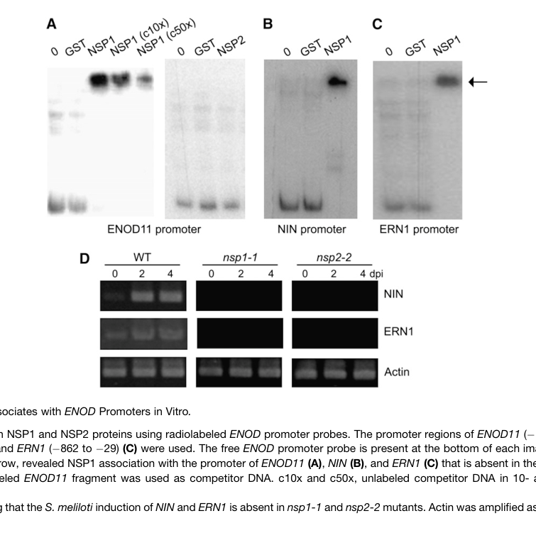

## Question

# Gene Research for Functional Annotation

## ⚠️ CRITICAL: Gene/Protein Identification Context

**BEFORE YOU BEGIN RESEARCH:** You MUST verify you are researching the CORRECT gene/protein. Gene symbols can be ambiguous, especially for less well-characterized genes from non-model organisms.

### Target Gene/Protein Identity (from UniProt):
- **UniProt Accession:** Q4VYC8
- **Protein Description:** RecName: Full=Protein NODULATION SIGNALING PATHWAY 1 {ECO:0000303|PubMed:15961669};
- **Gene Information:** Name=NSP1 {ECO:0000303|PubMed:15961669}; OrderedLocusNames=MTR_8g020840 {ECO:0000312|EMBL:AET01770.1};
- **Organism (full):** Medicago truncatula (Barrel medic) (Medicago tribuloides).
- **Protein Family:** Belongs to the GRAS family. .
- **Key Domains:** TF_GRAS. (IPR005202); GRAS (PF03514)

### MANDATORY VERIFICATION STEPS:

1. **Check if the gene symbol "NSP1" matches the protein description above**
2. **Verify the organism is correct:** Medicago truncatula (Barrel medic) (Medicago tribuloides).
3. **Check if protein family/domains align with what you find in literature**
4. **If you find literature for a DIFFERENT gene with the same or similar symbol, STOP**

### If Gene Symbol is Ambiguous or You Cannot Find Relevant Literature:

**DO NOT PROCEED WITH RESEARCH ON A DIFFERENT GENE.** Instead:
- State clearly: "The gene symbol 'NSP1' is ambiguous or literature is limited for this specific protein"
- Explain what you found (e.g., "Found extensive literature on a different gene with the same symbol in a different organism")
- Describe the protein based ONLY on the UniProt information provided above
- Suggest that the protein function can be inferred from domain/family information

### Research Target:

Please provide a comprehensive research report on the gene **NSP1** (gene ID: NSP1, UniProt: Q4VYC8) in MEDTR.

The research report should be a detailed narrative explaining the function, biological processes, and localization of the gene product. Citations should be given for all claims.

You should prioritize authoritative reviews and primary scientific literature when conducting research. You can supplement
this with annotations you find in gene/protein databases, but these can be outdated or inaccurate.

We are specifically interested in the primary function of the gene - for enzymes, what reaction is catalyzed, and what is the substrate specificity? For transporters, what is the substrate? For structural proteins or adapters, what is the broader structural role? For signaling molecules, what is the role in the pathway.

We are interested in where in or outside the cell the gene product carries out its function.

We are also interested in the signaling or biochemical pathways in which the gene functions. We are less interested in broad pleiotropic effects, except where these elucidate the precise role.

Include evidence where possible. We are interested in both experimental evidence as well as inference from structure, evolution, or bioinformatic analysis. Precise studies should be prioritized over high-throughput, where available.

## Output

Question: You are an expert researcher providing comprehensive, well-cited information.

Provide detailed information focusing on:
1. Key concepts and definitions with current understanding
2. Recent developments and latest research (prioritize 2023-2024 sources)
3. Current applications and real-world implementations
4. Expert opinions and analysis from authoritative sources
5. Relevant statistics and data from recent studies

Format as a comprehensive research report with proper citations. Include URLs and publication dates where available.
Always prioritize recent, authoritative sources and provide specific citations for all major claims.

# Gene Research for Functional Annotation

## ⚠️ CRITICAL: Gene/Protein Identification Context

**BEFORE YOU BEGIN RESEARCH:** You MUST verify you are researching the CORRECT gene/protein. Gene symbols can be ambiguous, especially for less well-characterized genes from non-model organisms.

### Target Gene/Protein Identity (from UniProt):
- **UniProt Accession:** Q4VYC8
- **Protein Description:** RecName: Full=Protein NODULATION SIGNALING PATHWAY 1 {ECO:0000303|PubMed:15961669};
- **Gene Information:** Name=NSP1 {ECO:0000303|PubMed:15961669}; OrderedLocusNames=MTR_8g020840 {ECO:0000312|EMBL:AET01770.1};
- **Organism (full):** Medicago truncatula (Barrel medic) (Medicago tribuloides).
- **Protein Family:** Belongs to the GRAS family. .
- **Key Domains:** TF_GRAS. (IPR005202); GRAS (PF03514)

### MANDATORY VERIFICATION STEPS:

1. **Check if the gene symbol "NSP1" matches the protein description above**
2. **Verify the organism is correct:** Medicago truncatula (Barrel medic) (Medicago tribuloides).
3. **Check if protein family/domains align with what you find in literature**
4. **If you find literature for a DIFFERENT gene with the same or similar symbol, STOP**

### If Gene Symbol is Ambiguous or You Cannot Find Relevant Literature:

**DO NOT PROCEED WITH RESEARCH ON A DIFFERENT GENE.** Instead:
- State clearly: "The gene symbol 'NSP1' is ambiguous or literature is limited for this specific protein"
- Explain what you found (e.g., "Found extensive literature on a different gene with the same symbol in a different organism")
- Describe the protein based ONLY on the UniProt information provided above
- Suggest that the protein function can be inferred from domain/family information

### Research Target:

Please provide a comprehensive research report on the gene **NSP1** (gene ID: NSP1, UniProt: Q4VYC8) in MEDTR.

The research report should be a detailed narrative explaining the function, biological processes, and localization of the gene product. Citations should be given for all claims.

You should prioritize authoritative reviews and primary scientific literature when conducting research. You can supplement
this with annotations you find in gene/protein databases, but these can be outdated or inaccurate.

We are specifically interested in the primary function of the gene - for enzymes, what reaction is catalyzed, and what is the substrate specificity? For transporters, what is the substrate? For structural proteins or adapters, what is the broader structural role? For signaling molecules, what is the role in the pathway.

We are interested in where in or outside the cell the gene product carries out its function.

We are also interested in the signaling or biochemical pathways in which the gene functions. We are less interested in broad pleiotropic effects, except where these elucidate the precise role.

Include evidence where possible. We are interested in both experimental evidence as well as inference from structure, evolution, or bioinformatic analysis. Precise studies should be prioritized over high-throughput, where available.

## Research report: **NODULATION SIGNALING PATHWAY 1 (NSP1)** in *Medicago truncatula* (UniProt **Q4VYC8**)

### 1) Target verification (critical disambiguation)
The NSP1 discussed here is **NODULATION SIGNALING PATHWAY 1**, a **GRAS-family transcriptional regulator** from the model legume *Medicago truncatula*, experimentally characterized as a core component of rhizobial Nod factor (NF) signaling and early symbiotic gene expression. This identity matches the UniProt description for Q4VYC8 (NSP1; GRAS/TF_GRAS domain) and is consistent with primary mechanistic studies in *M. truncatula* that explicitly study “NSP1” in nodulation signaling. (hirsch2009grasproteinsform pages 1-2, liu2011strigolactonebiosynthesisin pages 1-2)

### 2) Key concepts and definitions (current understanding)

#### 2.1 GRAS-family transcriptional regulators in symbiosis
NSP1 is a plant-specific **GRAS** transcriptional regulator that functions in the **nucleus** as part of a transcriptional module activated downstream of the common symbiosis signaling pathway (CSSP). In the NF signaling cascade, nuclear calcium oscillations are perceived by CCaMK (also referred to as DMI3 in Medicago genetic nomenclature), which activates symbiosis transcriptional programs requiring NSP1/NSP2. (hirsch2009grasproteinsform pages 1-2, liu2011strigolactonebiosynthesisin pages 2-3)

#### 2.2 NSP1/NSP2: a DNA-binding transcriptional complex
A central mechanistic concept is that **NSP1 and NSP2 form a complex** that associates with promoters of NF-responsive genes. NSP1 has direct DNA-binding activity, while NSP2 is required for full promoter association and transcriptional output in vivo in key contexts. (hirsch2009grasproteinsform pages 6-9, hirsch2009grasproteinsform pages 5-6)

### 3) Molecular function and mechanistic evidence

#### 3.1 Molecular function: direct DNA binding and transcriptional regulation
NSP1 behaves as a “classical” transcriptional regulator with direct promoter binding. In vitro EMSA experiments show **NSP1 (but not NSP2) directly binds** fragments of the **ENOD11** promoter. (hirsch2009grasproteinsform pages 5-6, hirsch2009grasproteinsform media 4a719841)

#### 3.2 DNA-binding specificity: the AATTT Nodulation Responsive Element (NRE)
Random binding-site selection and EMSA define an NSP1-recognized cis-element with consensus **AATTT**, described as a Nodulation Responsive Element (NRE; NRE1/NRE2 in ENOD11 promoter mapping). Mutation of this motif (AATTT→CCCCC) strongly reduces binding. (hirsch2009grasproteinsform pages 6-9, hirsch2009grasproteinsform media 4a719841)

#### 3.3 Direct and promoter-proximal target genes
Mechanistic evidence links NSP1 promoter binding/association to multiple early symbiotic regulators/markers:
- **ENOD11**: NSP1 binds promoter fragments in vitro; ChIP supports in vivo association with promoter regions, enhanced after NF treatment. (hirsch2009grasproteinsform pages 6-9, hirsch2009grasproteinsform media b1d1c4af)
- **ERN1**: NSP1 associates with defined promoter regions and is required for rhizobial induction of ERN1 in mutant backgrounds. (hirsch2009grasproteinsform pages 9-10, hirsch2009grasproteinsform pages 6-9)
- **NIN**: NSP1 binds/associates with promoter regions and is required for rhizobial induction of NIN in nsp mutants. (hirsch2009grasproteinsform pages 9-10, hirsch2009grasproteinsform pages 6-9)

Collectively, these data support NSP1 as a direct transcriptional regulator coupling NF-triggered signaling to early nodulation gene expression programs. (hirsch2009grasproteinsform pages 9-10, hirsch2009grasproteinsform pages 6-9)

### 4) Pathway placement and interaction partners

#### 4.1 Position in Nod factor/CSSP signaling
NSP1 functions downstream of nuclear signaling and is required for CCaMK-driven symbiotic gene activation: autoactivated CCaMK can induce ENOD11 expression, but this induction requires NSP1/NSP2/ERN1, placing NSP1 in the core transcriptional response module of NF signaling. (hirsch2009grasproteinsform pages 1-2)

#### 4.2 Physical and functional partners
**NSP2** is the best-supported direct partner:
- NSP1 and NSP2 form homo- and hetero-oligomeric assemblies; NSP2 is required for robust in vivo association of NSP1 with ENOD11 promoter under NF conditions, and disruption of NSP1–NSP2 interaction compromises nodulation outputs. (hirsch2009grasproteinsform pages 6-9, hirsch2009grasproteinsform pages 5-6)

**DELLA-mediated hormonal crosstalk (gibberellin signaling)** provides an additional regulatory layer. A primary mechanistic study reports DELLA proteins interact with NSP2 and proposes DELLA action may regulate **NSP1/NSP2- and NF-YA1-dependent activation** of ERN1 transcription (note: this is evidence for pathway-level integration; direct NSP1–DELLA binding is not established in the provided excerpt). (fonounifarde2016dellamediatedgibberellinsignalling pages 1-2)

A recent evolutionary/regulatory model (2024) places NSP2/NSP1 alongside CCaMK/CYCLOPS as positive inputs promoting **NIN** transcription and indicates that a GRAS protein (Lateral suppressor) can physically interact with NSP2 and CYCLOPS to repress these inputs on NIN. This supports the view that NSP1 participates in a multi-protein transcriptional control architecture converging on NIN, though the 2024 evidence emphasizes NSP2 and CYCLOPS interactions rather than NSP1 biochemistry per se. (liu2024lossoflateral pages 11-13)

### 5) Subcellular localization
NSP1 is characterized as a nuclear transcriptional regulator; NSP1 homopolymerization and promoter association are consistent with nuclear localization expected for GRAS transcription factors. (hirsch2009grasproteinsform pages 1-2, hirsch2009grasproteinsform pages 5-6)

### 6) Biological processes and phenotypes (including quantitative data)

#### 6.1 Essential role in nodulation signaling and early symbiotic transcription
Loss-of-function nsp backgrounds abolish or strongly impair NF-induced transcriptional responses (e.g., ENOD11, ERN1, NIN induction), supporting NSP1 as essential for NF-induced transcriptional reprogramming required for nodulation. (hirsch2009grasproteinsform pages 6-9)

#### 6.2 Quantitative phenotypes tied to NSP1/NSP2 complex integrity
A quantitative complementation example demonstrates functional dependence on NSP1–NSP2 interaction: an NSP2 point mutation (A168V) that reduces NSP2–NSP1 interaction by ~3-fold results in ~3-fold fewer nodules and reduced acetylene-reduction activity, indicating that NSP1-containing complexes are required for efficient nodule formation and nitrogen fixation-associated function. (hirsch2009grasproteinsform pages 5-6)

### 7) Roles beyond nodulation: strigolactone biosynthesis and nutrient-linked symbiosis readiness
A major expansion of NSP1 functional scope is its role in **strigolactone (SL) biosynthesis**:
- In *M. truncatula*, **nsp1 mutants do not produce SLs**, and nsp mutants show markedly reduced expression of **DWARF27**, a key SL-biosynthetic gene; one report quantifies the DWARF27 homolog as ~**90% reduced** in nsp mutant backgrounds. (liu2011strigolactonebiosynthesisin pages 1-2, liu2011strigolactonebiosynthesisin pages 2-3)

These findings support NSP1 as a transcriptional regulator linking symbiosis signaling modules to carotenoid/SL pathway output, which is relevant to broader rhizosphere signaling and potentially to mycorrhizal interactions (because SLs are well-known signals affecting arbuscular mycorrhizal fungi). (liu2011strigolactonebiosynthesisin pages 1-2)

### 8) Recent developments (prioritizing 2023–2024)

#### 8.1 Regulatory modules affecting nodulation (2024)
A 2024 *Genome Biology* study identifies an evolutionarily relevant GRAS protein (Lateral suppressor) whose presence suppresses nodulation in legumes when expressed, and proposes a model where it represses the transcriptional activity of both **NSP2/NSP1** and **CCaMK/CYCLOPS** modules on **NIN**. This provides a contemporary, systems-level view of how NSP1-associated modules may be gated by additional GRAS regulators and highlights an engineering-relevant “switch” that can abolish nodulation when manipulated. (liu2024lossoflateral pages 11-13)

#### 8.2 Expert synthesis (2024)
A 2024 GRAS TF review reiterates the consensus that NSP1/NSP2 complex formation and promoter association are central to NF-induced gene expression and that mapping interaction partners and DNA-binding sites remains important for translational manipulation (e.g., via protein–protein interaction mapping and regulatory element discovery). (mishra2024roleofgras pages 3-5)

#### 8.3 Hypothesis-generating network analyses (2024)
A 2024 in-silico co-expression/interaction mapping effort links NSP1 to cytokinin-related nodulation phenomena (e.g., cytokinin-induced primordia dependence on NSP1) and proposes transporter candidates that might connect NSP1-dependent transcriptional states to cytokinin distribution. These results are best interpreted as **hypothesis-generating** rather than definitive functional proof for NSP1 mechanisms. (azarakhsh2024identificationofnew pages 4-6)

#### 8.4 Engineering-oriented symbiosis manipulation context (2024)
Although focused on NSP2, a 2024 study in *Parasponia* frames NSP-family GRAS regulators as engineering-relevant hubs whose expression tuning can change symbiotic permissiveness and architecture, while also introducing trade-offs (e.g., altered nodulation organogenesis when overexpressed). This supports the practical relevance of manipulating NSP-family regulatory nodes, even if NSP1 itself was not the direct transgene target in that work. (alhusayni2024ectopicexpressionof pages 1-2, alhusayni2024ectopicexpressionof pages 9-11)

### 9) Current applications and real-world implementations

#### 9.1 Symbiosis engineering targets
Recent work indicates that GRAS regulators and their partners can serve as leverage points to modulate symbiosis traits:
- Transgenic expression of a “non-symbiotic” GRAS regulator (Lateral suppressor) can abolish nodulation in legumes, implying that manipulating GRAS–GRAS and GRAS–CYCLOPS regulatory interactions can robustly tune nodulation capacity. (liu2024lossoflateral pages 11-13)
- Reviews emphasize that identifying NSP1/NSP2 partners and promoter-binding logic is a prerequisite for rationally engineering nodulation efficiency and balancing trade-offs with other symbioses and development. (mishra2024roleofgras pages 3-5)

#### 9.2 SL pathway modulation as an indirect application
Because NSP1 is required for SL biosynthesis in *M. truncatula*, NSP1-regulated transcription is potentially relevant for strategies aiming to adjust SL-mediated rhizosphere signaling and symbiosis readiness (including interactions with arbuscular mycorrhizal fungi), though the direct agronomic implementation would require careful balancing due to pleiotropy of SLs. (liu2011strigolactonebiosynthesisin pages 1-2)

### 10) Visual evidence supporting core mechanistic claims
Key figure panels from Hirsch et al. (2009) provide direct, visual support for NSP1’s molecular function:
- EMSA showing NSP1 binds ENOD11 promoter DNA and motif mutation disrupts binding (hirsch2009grasproteinsform media 4a719841)
- Identification/mapping of AATTT NRE motifs and loss of binding upon motif mutation (hirsch2009grasproteinsform media 4a719841)
- ChIP evidence for in vivo association of NSP1/NSP2 with ENOD11 promoter enhanced by Nod factor (hirsch2009grasproteinsform media b1d1c4af)

### 11) Evidence summary table
The following table consolidates the strongest, directly supported functional-annotation statements for *M. truncatula* NSP1 and clearly distinguishes primary evidence from review/in-silico inference.

| Functional aspect | Key findings | Evidence type | Representative source with year and URL |
|---|---|---|---|
| Target identity / disambiguation | NSP1 here refers specifically to **Medicago truncatula NODULATION SIGNALING PATHWAY 1**, a **GRAS-family transcriptional regulator** acting in symbiosis; literature used aligns with the Medicago nodulation factor signaling protein rather than unrelated NSP1 symbols in other organisms. (hirsch2009grasproteinsform pages 1-2, liu2011strigolactonebiosynthesisin pages 1-2) | Primary functional studies; family assignment | Hirsch et al., 2009 (primary), *The Plant Cell* — https://doi.org/10.1105/tpc.108.064501 ; Liu et al., 2011 (primary), *The Plant Cell* — https://doi.org/10.1105/tpc.111.089771 |
| Molecular function | NSP1 functions as a **DNA-binding transcription factor/regulator**; unlike NSP2, NSP1 directly binds promoter DNA in vitro and associates with symbiosis gene promoters in vivo. (hirsch2009grasproteinsform pages 6-9, hirsch2009grasproteinsform pages 5-6) | EMSA; ChIP; transcriptional activation assays | Hirsch et al., 2009 (primary) — https://doi.org/10.1105/tpc.108.064501 |
| DNA motif / cis-element specificity | Random binding-site selection and EMSA identified an **AATTT** motif (NRE/Nodulation Responsive Element) as the NSP1-recognized cis-element; mutation of AATTT to CCCCC strongly reduces binding. (hirsch2009grasproteinsform pages 6-9, hirsch2009grasproteinsform media 4a719841) | Random binding-site selection; EMSA; figure-supported evidence | Hirsch et al., 2009 (primary) — https://doi.org/10.1105/tpc.108.064501 |
| Direct target genes | Direct or promoter-associated NSP1 targets include **ENOD11**, **ERN1**, and **NIN**; induction of NIN and ERN1 by *Sinorhizobium meliloti* is absent in nsp1/nsp2 mutants. (hirsch2009grasproteinsform pages 9-10, hirsch2009grasproteinsform pages 6-9) | EMSA; ChIP; mutant expression analysis | Hirsch et al., 2009 (primary) — https://doi.org/10.1105/tpc.108.064501 |
| Position in nodulation pathway | NSP1 acts **downstream of Nod factor perception, calcium spiking, and CCaMK/DMI3** as part of the core transcriptional response that activates early nodulation genes. CCaMK-induced ENOD11 expression requires NSP1/NSP2/ERN1. (hirsch2009grasproteinsform pages 1-2, liu2011strigolactonebiosynthesisin pages 2-3) | Genetic pathway analysis; induced-expression assays; review/model support | Hirsch et al., 2009 (primary) — https://doi.org/10.1105/tpc.108.064501 ; Liu et al., 2011 (primary) — https://doi.org/10.1105/tpc.111.089771 |
| Interaction partners: NSP2 | NSP1 forms **homopolymers** and a functionally critical **NSP1–NSP2 heteropolymer**. NSP2 does not bind ENOD11 DNA directly in vitro but is recruited in vivo in an NSP1-dependent manner; Nod factor enhances promoter association of the complex. (hirsch2009grasproteinsform pages 9-10, hirsch2009grasproteinsform pages 6-9, hirsch2009grasproteinsform pages 5-6) | Co-IP; BiFC/nuclear fluorescence; EMSA; ChIP | Hirsch et al., 2009 (primary) — https://doi.org/10.1105/tpc.108.064501 |
| Interaction partners: DELLA / NF-YA1 context | In GA-regulated nodulation signaling, DELLA proteins interact with **NSP2** and NF-YA1, and authors propose DELLA may regulate **NSP1/NSP2- and NF-YA1-mediated activation of ERN1**; this supports NSP1 participation in a broader nuclear co-regulatory complex, though direct NSP1–DELLA binding was not shown in the cited excerpt. (fonounifarde2016dellamediatedgibberellinsignalling pages 1-2) | Primary mechanistic study; interaction/model inference | Fonouni-Farde et al., 2016 (primary), *Nature Communications* — https://doi.org/10.1038/ncomms12636 |
| Interaction partners: CYCLOPS/IPD3 module context | A recent evolutionary/regulatory model places **NSP2/NSP1** and **CCaMK/CYCLOPS** as parallel positive inputs to **NIN** transcription; Lateral suppressor can interact with NSP2 and CYCLOPS and repress both modules on NIN. Evidence here is strong for pathway context but indirect for NSP1 physical contacts. (liu2024lossoflateral pages 11-13) | Primary 2024 regulatory/evolutionary study; model/mechanistic genetics | Liu et al., 2024 (primary), *Genome Biology* — https://doi.org/10.1186/s13059-024-03393-6 |
| Cellular localization | NSP1 is **nuclear**, consistent with GRAS-family transcriptional regulator function and observed nuclear complex formation/promoter association. (hirsch2009grasproteinsform pages 1-2, hirsch2009grasproteinsform pages 5-6) | Nuclear fluorescence/localization; promoter association | Hirsch et al., 2009 (primary) — https://doi.org/10.1105/tpc.108.064501 |
| Quantitative symbiotic phenotype | Disrupting the NSP1–NSP2 interaction impairs nodulation: an NSP2 A168V substitution that reduces NSP2–NSP1 interaction by about **threefold** causes about **threefold fewer nodules** and reduced **acetylene-reduction** activity in complementation assays, demonstrating the functional importance of the NSP1-containing complex. (hirsch2009grasproteinsform pages 5-6) | Quantitative mutant/complementation phenotype; acetylene reduction assay | Hirsch et al., 2009 (primary) — https://doi.org/10.1105/tpc.108.064501 |
| Expression pattern | NSP1 is reported to be expressed mainly in **roots and nodules**, matching its role in symbiotic signaling and nodulation-associated transcriptional programs. (liu2011strigolactonebiosynthesisin pages 1-2, liu2011strigolactonebiosynthesisin pages 2-3) | Expression profiling; microarray/qRT-PCR context | Liu et al., 2011 (primary) — https://doi.org/10.1105/tpc.111.089771 |
| Roles outside nodulation: strigolactone biosynthesis | NSP1 has an additional conserved role outside nodulation in **strigolactone (SL) biosynthesis**. In *M. truncatula*, **nsp1 mutants do not produce SLs**, and nsp1/nsp2 defects correlate with strong reduction of **DWARF27** expression (~**90%** decrease reported for the DWARF27 homolog). (liu2011strigolactonebiosynthesisin pages 1-2, liu2011strigolactonebiosynthesisin pages 2-3) | Mutant metabolite phenotype; transcriptomics; qRT-PCR | Liu et al., 2011 (primary) — https://doi.org/10.1105/tpc.111.089771 |
| Roles outside nodulation: mycorrhizal / LCO-related signaling | Review and comparative evidence indicate NSP-family GRAS regulators also participate in **mycorrhizal/LCO-responsive transcriptional programs** and nutrient-responsive symbiosis regulation, but for NSP1 these points are less direct than for nodulation and should be treated as broader pathway context rather than definitive Medicago NSP1-only mechanistic proof. (mishra2024roleofgras pages 3-5, alhusayni2024ectopicexpressionof pages 15-16) | Review/model; comparative symbiosis literature | Mishra et al., 2024 (review) — https://doi.org/10.18805/ijare.a-6145 ; Alhusayni et al., 2024 (primary/comparative, NSP2-focused) — https://doi.org/10.3389/fpls.2024.1468812 |
| Cytokinin-related nodulation context | An **in-silico/co-expression** 2024 analysis proposed that cytokinin-induced nodule primordium formation depends on NSP1 and suggested NSP1-associated transport candidates such as **MtABCG38**. This is hypothesis-generating and lower-confidence than direct biochemical/genetic evidence. (azarakhsh2024identificationofnew pages 4-6) | In-silico co-expression/network analysis | Azarakhsh et al., 2024 (in-silico) — URL not available in provided evidence |
| Expert synthesis / current understanding | Authoritative recent synthesis states NSP1/NSP2 are essential GRAS regulators in early symbiotic signaling, with complex formation, promoter binding, and potential engineering value for improving symbiosis-related traits; however, partner mapping and DNA-target catalogs remain incomplete. (mishra2024roleofgras pages 3-5) | Review/expert analysis | Mishra et al., 2024 (review) — https://doi.org/10.18805/ijare.a-6145 |

*Table: This table summarizes experimentally supported and recent contextual evidence for the Medicago truncatula NSP1 protein (UniProt Q4VYC8). It distinguishes high-confidence primary findings from review-based or in-silico inferences to support functional annotation.*

### 12) Limitations and open questions (evidence-based)
Despite strong mechanistic understanding of NSP1 as a DNA-binding GRAS regulator in NF signaling, recent (2023–2024) peer-reviewed studies in the retrieved set provide more **contextual network and evolutionary insights** than new NSP1-specific biochemical mechanism (e.g., most new complex/mechanistic details in 2024 sources emphasize NSP2/CYCLOPS or broader GRAS regulation). Direct, NSP1-specific 2023–2024 datasets such as genome-wide binding maps (ChIP-seq/DAP-seq) or high-resolution structural studies were not present in the accessible evidence here; thus, the most definitive DNA motif/target evidence remains anchored in foundational primary work. (hirsch2009grasproteinsform pages 6-9, liu2024lossoflateral pages 11-13)

## Key sources (publication dates and URLs)
- Hirsch S. et al. **Feb 2009**. *The Plant Cell*. “GRAS Proteins Form a DNA Binding Complex to Induce Gene Expression during Nodulation Signaling in Medicago truncatula.” https://doi.org/10.1105/tpc.108.064501 (hirsch2009grasproteinsform pages 6-9, hirsch2009grasproteinsform pages 5-6)
- Liu W. et al. **Oct 2011**. *The Plant Cell*. “Strigolactone Biosynthesis in Medicago truncatula and Rice Requires the Symbiotic GRAS-Type Transcription Factors NSP1 and NSP2.” https://doi.org/10.1105/tpc.111.089771 (liu2011strigolactonebiosynthesisin pages 1-2, liu2011strigolactonebiosynthesisin pages 2-3)
- Fonouni-Farde C. et al. **Sep 2016**. *Nature Communications*. “DELLA-mediated gibberellin signalling regulates Nod factor signalling and rhizobial infection.” https://doi.org/10.1038/ncomms12636 (fonounifarde2016dellamediatedgibberellinsignalling pages 1-2)
- Liu T. et al. **Sep 2024**. *Genome Biology*. “Loss of Lateral suppressor gene is associated with evolution of root nodule symbiosis in Leguminosae.” https://doi.org/10.1186/s13059-024-03393-6 (liu2024lossoflateral pages 11-13)
- Mishra S. et al. **Oct 2024**. *Indian Journal of Agricultural Research*. “Role of GRAS Transcription Factor in Plant Growth, Development and Various Stresses: A Review.” https://doi.org/10.18805/ijare.a-6145 (mishra2024roleofgras pages 3-5)
- Alhusayni S. et al. **Oct 2024**. *Frontiers in Plant Science*. “Ectopic expression of the GRAS-type transcriptional regulator NSP2 in Parasponia triggers contrasting effects on symbioses.” https://doi.org/10.3389/fpls.2024.1468812 (alhusayni2024ectopicexpressionof pages 1-2, alhusayni2024ectopicexpressionof pages 9-11)

References

1. (hirsch2009grasproteinsform pages 1-2): Sibylle Hirsch, Jiyoung Kim, Alfonso Muñoz, Anne B. Heckmann, J. Allan Downie, and Giles E.D. Oldroyd. Gras proteins form a dna binding complex to induce gene expression during nodulation signaling in <i>medicago truncatula</i>. The Plant Cell, 21(2):545-557, Feb 2009. URL: https://doi.org/10.1105/tpc.108.064501, doi:10.1105/tpc.108.064501. This article has 500 citations.

2. (liu2011strigolactonebiosynthesisin pages 1-2): Wei Liu, Wouter Kohlen, Alessandra Lillo, Rik Op den Camp, Sergey Ivanov, Marijke Hartog, Erik Limpens, Muhammad Jamil, Cezary Smaczniak, Kerstin Kaufmann, Wei-Cai Yang, Guido J.E.J. Hooiveld, Tatsiana Charnikhova, Harro J. Bouwmeester, Ton Bisseling, and René Geurts. Strigolactone biosynthesis in <i>medicago</i> <i>truncatula</i> and rice requires the symbiotic gras-type transcription factors nsp1 and nsp2. The Plant Cell, 23:3853-3865, Oct 2011. URL: https://doi.org/10.1105/tpc.111.089771, doi:10.1105/tpc.111.089771. This article has 358 citations.

3. (liu2011strigolactonebiosynthesisin pages 2-3): Wei Liu, Wouter Kohlen, Alessandra Lillo, Rik Op den Camp, Sergey Ivanov, Marijke Hartog, Erik Limpens, Muhammad Jamil, Cezary Smaczniak, Kerstin Kaufmann, Wei-Cai Yang, Guido J.E.J. Hooiveld, Tatsiana Charnikhova, Harro J. Bouwmeester, Ton Bisseling, and René Geurts. Strigolactone biosynthesis in <i>medicago</i> <i>truncatula</i> and rice requires the symbiotic gras-type transcription factors nsp1 and nsp2. The Plant Cell, 23:3853-3865, Oct 2011. URL: https://doi.org/10.1105/tpc.111.089771, doi:10.1105/tpc.111.089771. This article has 358 citations.

4. (hirsch2009grasproteinsform pages 6-9): Sibylle Hirsch, Jiyoung Kim, Alfonso Muñoz, Anne B. Heckmann, J. Allan Downie, and Giles E.D. Oldroyd. Gras proteins form a dna binding complex to induce gene expression during nodulation signaling in <i>medicago truncatula</i>. The Plant Cell, 21(2):545-557, Feb 2009. URL: https://doi.org/10.1105/tpc.108.064501, doi:10.1105/tpc.108.064501. This article has 500 citations.

5. (hirsch2009grasproteinsform pages 5-6): Sibylle Hirsch, Jiyoung Kim, Alfonso Muñoz, Anne B. Heckmann, J. Allan Downie, and Giles E.D. Oldroyd. Gras proteins form a dna binding complex to induce gene expression during nodulation signaling in <i>medicago truncatula</i>. The Plant Cell, 21(2):545-557, Feb 2009. URL: https://doi.org/10.1105/tpc.108.064501, doi:10.1105/tpc.108.064501. This article has 500 citations.

6. (hirsch2009grasproteinsform media 4a719841): Sibylle Hirsch, Jiyoung Kim, Alfonso Muñoz, Anne B. Heckmann, J. Allan Downie, and Giles E.D. Oldroyd. Gras proteins form a dna binding complex to induce gene expression during nodulation signaling in <i>medicago truncatula</i>. The Plant Cell, 21(2):545-557, Feb 2009. URL: https://doi.org/10.1105/tpc.108.064501, doi:10.1105/tpc.108.064501. This article has 500 citations.

7. (hirsch2009grasproteinsform media b1d1c4af): Sibylle Hirsch, Jiyoung Kim, Alfonso Muñoz, Anne B. Heckmann, J. Allan Downie, and Giles E.D. Oldroyd. Gras proteins form a dna binding complex to induce gene expression during nodulation signaling in <i>medicago truncatula</i>. The Plant Cell, 21(2):545-557, Feb 2009. URL: https://doi.org/10.1105/tpc.108.064501, doi:10.1105/tpc.108.064501. This article has 500 citations.

8. (hirsch2009grasproteinsform pages 9-10): Sibylle Hirsch, Jiyoung Kim, Alfonso Muñoz, Anne B. Heckmann, J. Allan Downie, and Giles E.D. Oldroyd. Gras proteins form a dna binding complex to induce gene expression during nodulation signaling in <i>medicago truncatula</i>. The Plant Cell, 21(2):545-557, Feb 2009. URL: https://doi.org/10.1105/tpc.108.064501, doi:10.1105/tpc.108.064501. This article has 500 citations.

9. (fonounifarde2016dellamediatedgibberellinsignalling pages 1-2): Camille Fonouni-Farde, Sovanna Tan, Maël Baudin, Mathias Brault, Jiangqi Wen, Kirankumar S. Mysore, Andreas Niebel, Florian Frugier, and Anouck Diet. Della-mediated gibberellin signalling regulates nod factor signalling and rhizobial infection. Nature Communications, Sep 2016. URL: https://doi.org/10.1038/ncomms12636, doi:10.1038/ncomms12636. This article has 190 citations and is from a highest quality peer-reviewed journal.

10. (liu2024lossoflateral pages 11-13): Tengfei Liu, Zhi Liu, Jingwei Fan, Yaqin Yuan, Haiyue Liu, Wenfei Xian, Shuaiying Xiang, Xia Yang, Yucheng Liu, Shulin Liu, Min Zhang, Yuannian Jiao, Shifeng Cheng, Jeff J. Doyle, Fang Xie, Jiayang Li, and Zhixi Tian. Loss of lateral suppressor gene is associated with evolution of root nodule symbiosis in leguminosae. Genome Biology, Sep 2024. URL: https://doi.org/10.1186/s13059-024-03393-6, doi:10.1186/s13059-024-03393-6. This article has 8 citations and is from a highest quality peer-reviewed journal.

11. (mishra2024roleofgras pages 3-5): Shefali Mishra, Pradeep Sharma, and Reeti Chaudhary. Role of gras transcription factor in plant growth, development and various stresses: a review. Indian Journal Of Agricultural Research, Oct 2024. URL: https://doi.org/10.18805/ijare.a-6145, doi:10.18805/ijare.a-6145. This article has 2 citations.

12. (azarakhsh2024identificationofnew pages 4-6): M Azarakhsh, S Eslami, and M Moghadas. Identification of new genes regulating nodule development in medicago truncatula: an in-silico approach. Unknown journal, 2024.

13. (alhusayni2024ectopicexpressionof pages 1-2): Sultan Alhusayni, Nick Kersten, Rik Huisman, Rene Geurts, and Joël Klein. Ectopic expression of the gras-type transcriptional regulator nsp2 in parasponia triggers contrasting effects on symbioses. Frontiers in Plant Science, Oct 2024. URL: https://doi.org/10.3389/fpls.2024.1468812, doi:10.3389/fpls.2024.1468812. This article has 0 citations.

14. (alhusayni2024ectopicexpressionof pages 9-11): Sultan Alhusayni, Nick Kersten, Rik Huisman, Rene Geurts, and Joël Klein. Ectopic expression of the gras-type transcriptional regulator nsp2 in parasponia triggers contrasting effects on symbioses. Frontiers in Plant Science, Oct 2024. URL: https://doi.org/10.3389/fpls.2024.1468812, doi:10.3389/fpls.2024.1468812. This article has 0 citations.

15. (alhusayni2024ectopicexpressionof pages 15-16): Sultan Alhusayni, Nick Kersten, Rik Huisman, Rene Geurts, and Joël Klein. Ectopic expression of the gras-type transcriptional regulator nsp2 in parasponia triggers contrasting effects on symbioses. Frontiers in Plant Science, Oct 2024. URL: https://doi.org/10.3389/fpls.2024.1468812, doi:10.3389/fpls.2024.1468812. This article has 0 citations.

## Artifacts

- [Edison artifact artifact-00](NSP1-deep-research-falcon_artifacts/artifact-00.md)

## Citations

1. hirsch2009grasproteinsform pages 1-2
2. fonounifarde2016dellamediatedgibberellinsignalling pages 1-2
3. liu2024lossoflateral pages 11-13
4. hirsch2009grasproteinsform pages 6-9
5. hirsch2009grasproteinsform pages 5-6
6. liu2011strigolactonebiosynthesisin pages 1-2
7. mishra2024roleofgras pages 3-5
8. azarakhsh2024identificationofnew pages 4-6
9. liu2011strigolactonebiosynthesisin pages 2-3
10. hirsch2009grasproteinsform pages 9-10
11. alhusayni2024ectopicexpressionof pages 1-2
12. alhusayni2024ectopicexpressionof pages 9-11
13. alhusayni2024ectopicexpressionof pages 15-16
14. https://doi.org/10.1105/tpc.108.064501
15. https://doi.org/10.1105/tpc.111.089771
16. https://doi.org/10.1038/ncomms12636
17. https://doi.org/10.1186/s13059-024-03393-6
18. https://doi.org/10.18805/ijare.a-6145
19. https://doi.org/10.3389/fpls.2024.1468812
20. https://doi.org/10.1105/tpc.108.064501,
21. https://doi.org/10.1105/tpc.111.089771,
22. https://doi.org/10.1038/ncomms12636,
23. https://doi.org/10.1186/s13059-024-03393-6,
24. https://doi.org/10.18805/ijare.a-6145,
25. https://doi.org/10.3389/fpls.2024.1468812,