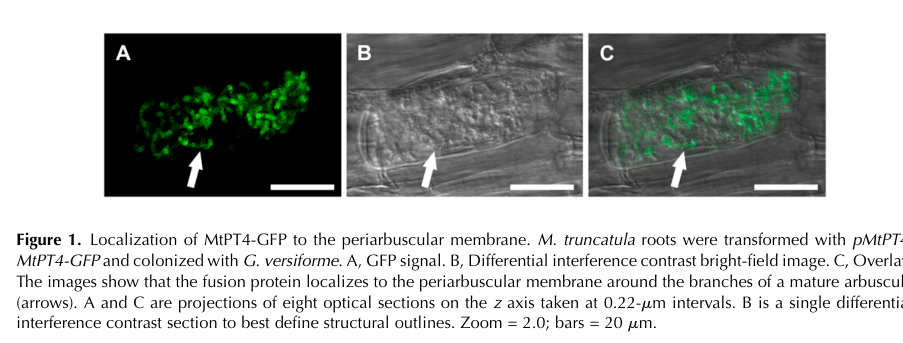

## Question

# Gene Research for Functional Annotation

## ⚠️ CRITICAL: Gene/Protein Identification Context

**BEFORE YOU BEGIN RESEARCH:** You MUST verify you are researching the CORRECT gene/protein. Gene symbols can be ambiguous, especially for less well-characterized genes from non-model organisms.

### Target Gene/Protein Identity (from UniProt):
- **UniProt Accession:** Q8GSG4
- **Protein Description:** RecName: Full=Low affinity inorganic phosphate transporter 4 {ECO:0000303|PubMed:12368495}; Short=MtPT4 {ECO:0000303|PubMed:12368495}; Short=MtPht1;4 {ECO:0000305}; AltName: Full=Arbuscular mycorrhiza-induced phosphate transporter PT4 {ECO:0000305}; Short=AM-induced phosphate transporter PT4 {ECO:0000305}; AltName: Full=H(+)/Pi cotransporter PT4 {ECO:0000305};
- **Gene Information:** Name=PT4 {ECO:0000303|PubMed:12368495}; OrderedLocusNames=MTR_1g028600 {ECO:0000312|EMBL:KEH40422.1}; ORFNames=MtrunA17_Chr1g0158991 {ECO:0000312|EMBL:RHN77834.1};
- **Organism (full):** Medicago truncatula (Barrel medic) (Medicago tribuloides).
- **Protein Family:** Belongs to the major facilitator superfamily.
- **Key Domains:** MFS_dom. (IPR020846); MFS_sugar_transport-like. (IPR005828); MFS_trans_sf. (IPR036259); Phos_permease. (IPR004738); Sugar_tr (PF00083)

### MANDATORY VERIFICATION STEPS:

1. **Check if the gene symbol "PT4" matches the protein description above**
2. **Verify the organism is correct:** Medicago truncatula (Barrel medic) (Medicago tribuloides).
3. **Check if protein family/domains align with what you find in literature**
4. **If you find literature for a DIFFERENT gene with the same or similar symbol, STOP**

### If Gene Symbol is Ambiguous or You Cannot Find Relevant Literature:

**DO NOT PROCEED WITH RESEARCH ON A DIFFERENT GENE.** Instead:
- State clearly: "The gene symbol 'PT4' is ambiguous or literature is limited for this specific protein"
- Explain what you found (e.g., "Found extensive literature on a different gene with the same symbol in a different organism")
- Describe the protein based ONLY on the UniProt information provided above
- Suggest that the protein function can be inferred from domain/family information

### Research Target:

Please provide a comprehensive research report on the gene **PT4** (gene ID: PT4, UniProt: Q8GSG4) in MEDTR.

The research report should be a detailed narrative explaining the function, biological processes, and localization of the gene product. Citations should be given for all claims.

You should prioritize authoritative reviews and primary scientific literature when conducting research. You can supplement
this with annotations you find in gene/protein databases, but these can be outdated or inaccurate.

We are specifically interested in the primary function of the gene - for enzymes, what reaction is catalyzed, and what is the substrate specificity? For transporters, what is the substrate? For structural proteins or adapters, what is the broader structural role? For signaling molecules, what is the role in the pathway.

We are interested in where in or outside the cell the gene product carries out its function.

We are also interested in the signaling or biochemical pathways in which the gene functions. We are less interested in broad pleiotropic effects, except where these elucidate the precise role.

Include evidence where possible. We are interested in both experimental evidence as well as inference from structure, evolution, or bioinformatic analysis. Precise studies should be prioritized over high-throughput, where available.

## Output

Question: You are an expert researcher providing comprehensive, well-cited information.

Provide detailed information focusing on:
1. Key concepts and definitions with current understanding
2. Recent developments and latest research (prioritize 2023-2024 sources)
3. Current applications and real-world implementations
4. Expert opinions and analysis from authoritative sources
5. Relevant statistics and data from recent studies

Format as a comprehensive research report with proper citations. Include URLs and publication dates where available.
Always prioritize recent, authoritative sources and provide specific citations for all major claims.

# Gene Research for Functional Annotation

## ⚠️ CRITICAL: Gene/Protein Identification Context

**BEFORE YOU BEGIN RESEARCH:** You MUST verify you are researching the CORRECT gene/protein. Gene symbols can be ambiguous, especially for less well-characterized genes from non-model organisms.

### Target Gene/Protein Identity (from UniProt):
- **UniProt Accession:** Q8GSG4
- **Protein Description:** RecName: Full=Low affinity inorganic phosphate transporter 4 {ECO:0000303|PubMed:12368495}; Short=MtPT4 {ECO:0000303|PubMed:12368495}; Short=MtPht1;4 {ECO:0000305}; AltName: Full=Arbuscular mycorrhiza-induced phosphate transporter PT4 {ECO:0000305}; Short=AM-induced phosphate transporter PT4 {ECO:0000305}; AltName: Full=H(+)/Pi cotransporter PT4 {ECO:0000305};
- **Gene Information:** Name=PT4 {ECO:0000303|PubMed:12368495}; OrderedLocusNames=MTR_1g028600 {ECO:0000312|EMBL:KEH40422.1}; ORFNames=MtrunA17_Chr1g0158991 {ECO:0000312|EMBL:RHN77834.1};
- **Organism (full):** Medicago truncatula (Barrel medic) (Medicago tribuloides).
- **Protein Family:** Belongs to the major facilitator superfamily.
- **Key Domains:** MFS_dom. (IPR020846); MFS_sugar_transport-like. (IPR005828); MFS_trans_sf. (IPR036259); Phos_permease. (IPR004738); Sugar_tr (PF00083)

### MANDATORY VERIFICATION STEPS:

1. **Check if the gene symbol "PT4" matches the protein description above**
2. **Verify the organism is correct:** Medicago truncatula (Barrel medic) (Medicago tribuloides).
3. **Check if protein family/domains align with what you find in literature**
4. **If you find literature for a DIFFERENT gene with the same or similar symbol, STOP**

### If Gene Symbol is Ambiguous or You Cannot Find Relevant Literature:

**DO NOT PROCEED WITH RESEARCH ON A DIFFERENT GENE.** Instead:
- State clearly: "The gene symbol 'PT4' is ambiguous or literature is limited for this specific protein"
- Explain what you found (e.g., "Found extensive literature on a different gene with the same symbol in a different organism")
- Describe the protein based ONLY on the UniProt information provided above
- Suggest that the protein function can be inferred from domain/family information

### Research Target:

Please provide a comprehensive research report on the gene **PT4** (gene ID: PT4, UniProt: Q8GSG4) in MEDTR.

The research report should be a detailed narrative explaining the function, biological processes, and localization of the gene product. Citations should be given for all claims.

You should prioritize authoritative reviews and primary scientific literature when conducting research. You can supplement
this with annotations you find in gene/protein databases, but these can be outdated or inaccurate.

We are specifically interested in the primary function of the gene - for enzymes, what reaction is catalyzed, and what is the substrate specificity? For transporters, what is the substrate? For structural proteins or adapters, what is the broader structural role? For signaling molecules, what is the role in the pathway.

We are interested in where in or outside the cell the gene product carries out its function.

We are also interested in the signaling or biochemical pathways in which the gene functions. We are less interested in broad pleiotropic effects, except where these elucidate the precise role.

Include evidence where possible. We are interested in both experimental evidence as well as inference from structure, evolution, or bioinformatic analysis. Precise studies should be prioritized over high-throughput, where available.

# Functional annotation report: *Medicago truncatula* PT4

## Identity and principal function

**PT4 here means the barrel-medic protein MtPT4/MtPht1;4, UniProt Q8GSG4—not a similarly named transporter from another species.** The supplied UniProt record identifies its locus as MTR_1g028600; a 2023 *Medicago* experiment independently labels **Medtr1g028600** as MtPT4. Published work places MtPT4 in the plant PHT1 phosphate-permease family, consistent with the supplied major-facilitator-superfamily (MFS) and phosphate-permease domain annotations. The associated “sugar transporter-like” domain designation describes structural homology, **not evidence that MtPT4 carries sugar**. MtPT1–3, MtPT8, and phosphate exporters of the PHO1 family are different proteins. (javot2007phosphateinthe pages 2-3, yu2023comparativeproteomicanalysis pages 9-10, breuillinsessoms2015suppressionofarbuscule pages 2-3, zhang2026medicagophosphateexporter pages 1-2)

**Primary molecular role:** MtPT4 imports **inorganic phosphate (Pi)** released by an arbuscular mycorrhizal (AM) fungus from the extracellular *periarbuscular space* into a root cortical cell. It is a transporter, not an enzyme that chemically converts phosphate. Its position makes it part of the **mycorrhizal phosphate-uptake pathway**, rather than the direct soil-uptake pathway served by other root PHT1 transporters. (pumplin2009livecellimagingreveals pages 2-3, javot2007phosphateinthe pages 4-5, wattswilliams2015localanddistal pages 7-8, breuillinsessoms2015suppressionofarbuscule pages 2-3)

Heterologous yeast experiments reviewed by Javot and colleagues gave MtPT4 an apparent Pi-uptake **Kₘ of approximately 493–668 µM (0.493–0.668 mM)**, supporting the description *relatively low affinity* compared with many high-affinity PHT1 transporters. This is a measurement in yeast, not a demonstrated affinity at the plant–fungus interface. The retrieved rendering of the review displays the unit as “mM”; the reported numerical scale should therefore be read with that source-rendering caveat, rather than represented as a precisely established *in planta* kinetic constant. No MtPT4-specific transport assay retrieved here establishes another substrate or a proton-to-Pi stoichiometry. (javot2007phosphateinthe pages 5-6, javot2007phosphateinthe pages 2-3, nussaume2011phosphateimportin pages 2-4)

## Where transport occurs and how it is energized

AM fungal hyphae explore soil and deliver phosphorus to branched structures called **arbuscules** inside root cortical cells. The fungus remains separated from the plant cytoplasm by a fungal membrane, an extracellular periarbuscular space, and the plant-derived **periarbuscular membrane (PAM)**. MtPT4 occupies the **PAM around the fine arbuscule branches**, with little or no signal around the arbuscule trunk or at the ordinary cell-surface plasma membrane. This is supported both by immunolocalization reported in the original characterization and by native-promoter MtPT4–GFP imaging in colonized *M. truncatula* roots. The fusion appears as arbuscules branch and is lost from the functional interface as they collapse. The cropped microscopy evidence is Pumplin and Harrison’s Figure 1. (pumplin2009livecellimagingreveals pages 2-3, pumplin2009livecellimagingreveals pages 3-4, pumplin2009livecellimagingreveals media 7bf22cad)

The prevailing mechanistic model is **H⁺-coupled Pi uptake**: the plant H⁺-ATPase **HA1** acidifies the periarbuscular space and establishes an electrochemical gradient that can drive MtPT4-family phosphate import into the cortical-cell cytoplasm. In compartmented experiments, fungal-accessible ³³P accumulated in wild-type plants but not *ha1-2* plants; mycorrhizal colonization was comparable (**62.5 ± 3.1% versus 59.5 ± 5.6%**), and an acid-sensitive dye showed diminished acidification in the mutant. These experiments strongly support the requirement for HA1-generated acidity in symbiotic Pi transfer. They do **not**, by themselves, directly measure H⁺ passage through MtPT4 or establish its coupling ratio. The identity of the fungal Pi-release machinery at this interface also remains less securely resolved than the plant uptake step. (krajinski2014theh+atpaseha1 pages 1-2, krajinski2014theh+atpaseha1 pages 5-6, krajinski2014theh+atpaseha1 pages 6-7, breuillinsessoms2015suppressionofarbuscule pages 2-3)

## Genetic evidence and pathway regulation

Loss-of-function *pt4* plants can initially form arbuscules, but under the tested nitrogen-replete conditions their arbuscules **degenerate prematurely** and the symbiosis fails to deliver its normal phosphorus and growth benefit. A subsequent study describes premature degeneration beginning within approximately **48 hours of fungal entry**; in a split-root comparison, colonized *mtpt4* plants had less phosphorus than colonized wild type, whereas nonmycorrhizal plants of the two genotypes behaved similarly. Thus, the strongest functional interpretation is that MtPT4 is required for effective **fungus-to-plant Pi transfer** and ordinarily helps maintain a productive arbuscule—not that it is independently proven to be a developmental receptor or signal-transducing protein. (wattswilliams2015localanddistal pages 11-11, wattswilliams2015localanddistal pages 5-7, wattswilliams2015localanddistal pages 7-8, wattswilliams2015localanddistal pages 10-11, breuillinsessoms2015suppressionofarbuscule pages 2-3)

That maintenance phenotype is **conditional on nutrient status**. Under low nitrogen, premature degeneration is suppressed even in *pt4 pt8* double mutants: the second AM-induced PAM phosphate transporter **PT8 is not required for this rescue**. Removing **AMT2;3**, but not AMT2;4, prevents the low-nitrogen rescue. The experiments compared, among other conditions, **1.5 mM and 15 mM supplied nitrogen**. These results show that phosphate- and nitrogen-dependent processes jointly determine arbuscule persistence; they qualify any absolute claim that MtPT4-mediated phosphate import is required for arbuscule survival under *every* nutrient regime. They do not demonstrate that MtPT4 transports ammonium. (breuillinsessoms2015suppressionofarbuscule pages 1-2, breuillinsessoms2015suppressionofarbuscule pages 3-5, breuillinsessoms2015suppressionofarbuscule pages 7-9, breuillinsessoms2015suppressionofarbuscule pages 2-3)

MtPT4 transcription is linked to the arbuscule nutrient-exchange program. The AP2-domain factor **WRI5a** was enriched at an AW-box-containing MtPT4 promoter region in *Medicago* chromatin-immunoprecipitation assays, activated an MtPT4 promoter reporter, and increased MtPT4 expression when overexpressed in roots. This provides relatively direct evidence for an upstream transcriptional regulator coordinating phosphate acquisition with the symbiotic lipid-provisioning program. In a separate physiological study, **90% shading** reduced PT4 transcript abundance in mycorrhizal roots by approximately **threefold**; that association supports carbon-status responsiveness but does not prove that MtPT4 itself senses carbon. Recent authoritative reviews place symbiotic transport within broader phosphate-starvation and arbuscule-turnover regulation, while recognizing that proposed molecular links between intracellular phosphate status and arbuscule collapse remain incompletely established. (jiang2018medicagoap2domaintranscription pages 7-8, konecny2019correlativeevidencefor pages 9-11, paries2023thegoodthe pages 4-5)

## Developments in 2023–2024 and practical use

The clearest **2023 gene-specific use** located in this search is a *Poncirus trifoliata* proteomics paper that explicitly designates *Medicago* **MtPT4/Medtr1g028600** as an AM-related marker in its *Medicago* hairy-root analysis. It also finds **two citrus proteins homologous to MtPT4** among AM-responsive proteins. Those citrus proteins are *not* Q8GSG4; their proposed phosphate-transport functions rest on homology and association, not demonstrated transport or PAM localization. A **2023 New Phytologist review** and a **2024 Nature Reviews Microbiology review** provide updated phosphate-status and cross-kingdom nutrient-exchange context, respectively, but do not displace the older *Medicago*-specific localization and mutant experiments as the strongest evidence for this particular protein. (yu2023comparativeproteomicanalysis pages 9-10, paries2023thegoodthe pages 4-5, paries2023thegoodthe pages 3-4)

In present research practice, MtPT4 expression or its promoter is used as a **marker of arbuscule-containing, potentially functional mycorrhizal root cells**, and *pt4* mutants help separate fungal colonization from effective phosphate delivery. For example, an experimental comparison of six *Medicago* phosphate-transporter transcripts found PT4 still dominant in mycorrhizal roots after shading, despite reduced expression. Expression alone, however, cannot quantify actual Pi flux or establish the benefit of AM inoculation in an agricultural field. The literature reviewed here establishes a mechanistic model and research tools, **not a validated PT4-targeted field implementation or a measured crop-yield gain attributable specifically to Q8GSG4**. (pumplin2009livecellimagingreveals pages 2-3, konecny2019correlativeevidencefor pages 9-11, yu2023comparativeproteomicanalysis pages 9-10, wattswilliams2015localanddistal pages 10-11)

The evidence and its limits are summarized below.

| Aspect | Strongest specific experimental observation | Interpretation and limitation | Original study / DOI |
|---|---|---|---|
| Identity and family | *M. truncatula* MtPT4 is MEDtr;Pht1;4; the 2023 study explicitly maps **MtPT4 to Medtr1g028600**. PHT1 proteins belong to the major facilitator superfamily and are predicted 12-transmembrane phosphate permeases. (javot2007phosphateinthe pages 2-3, yu2023comparativeproteomicanalysis pages 9-10) | Confirms the requested *Medicago* locus; PHT1/MFS and PF00083-like annotations do **not** imply sugar transport. | Harrison et al., 2002 — [10.1105/tpc.004861](https://doi.org/10.1105/tpc.004861); Yu et al., 2023 — [10.3389/fpls.2023.1294086](https://doi.org/10.3389/fpls.2023.1294086) |
| Substrate and affinity | Heterologous yeast assays supported Pi transport and yielded an apparent **Kₘ of 493–668 µM** (0.493–0.668 mM), indicating relatively low affinity. (javot2007phosphateinthe pages 5-6, javot2007phosphateinthe pages 2-3) | The source-table OCR renders the unit as “mM,” but the intended published scale is µM. Affinity measured in yeast may differ from that at the plant membrane; no evidence supports sugar as substrate. | Harrison et al., 2002 — [10.1105/tpc.004861](https://doi.org/10.1105/tpc.004861); reviewed by Javot et al., 2007 — [10.1111/j.1365-3040.2006.01617.x](https://doi.org/10.1111/j.1365-3040.2006.01617.x) |
| Subcellular localization | Immunolocalization and native-promoter MtPT4–GFP imaging placed MtPT4 exclusively in the **periarbuscular membrane branch domain**, surrounding fine branches of developing and mature arbuscules but not the trunk, peripheral plasma membrane, or collapsing arbuscules. (pumplin2009livecellimagingreveals pages 2-3, pumplin2009livecellimagingreveals pages 3-4, pumplin2009livecellimagingreveals media 7bf22cad) | Strong protein-level localization identifies the plant–fungus nutrient-exchange surface. GFP haze during collapse suggests vacuolar degradation, not continued transport. | Harrison et al., 2002 — [10.1105/tpc.004861](https://doi.org/10.1105/tpc.004861); Pumplin & Harrison, 2009 — [10.1104/pp.109.141879](https://doi.org/10.1104/pp.109.141879) |
| Loss-of-function phenotype | Under N-replete conditions, *pt4* mutants initially form arbuscules, but degeneration begins prematurely—reported within about **48 h of fungal entry**—and symbiotic Pi delivery, shoot-P benefit, fungal establishment, and plant growth responses are impaired. Nonmycorrhizal wild type and *mtpt4* behaved similarly, arguing against a broad constitutive defect. (wattswilliams2015localanddistal pages 11-11, wattswilliams2015localanddistal pages 5-7, wattswilliams2015localanddistal pages 7-8, breuillinsessoms2015suppressionofarbuscule pages 2-3) | Establishes that PT4 is required for the functional mycorrhizal Pi pathway and normally supports arbuscule longevity. Degeneration is nutrient-context dependent and should not be interpreted as proof that PT4 is itself an arbuscule-development receptor. | Javot et al., 2007 — [10.1073/pnas.0608136104](https://doi.org/10.1073/pnas.0608136104); Watts-Williams et al., 2015 — [10.1093/jxb/erv202](https://doi.org/10.1093/jxb/erv202); Breuillin-Sessoms et al., 2015 — [10.1105/tpc.114.131144](https://doi.org/10.1105/tpc.114.131144) |
| Isotope-study boundary | Watts-Williams et al. used five biological replicates and placed carrier-free **³³P in pot A** to quantify direct-pathway uptake in a split-root design; the experiment separated local/distal colonization and Pi-status effects. (wattswilliams2015localanddistal pages 1-2, wattswilliams2015localanddistal pages 3-4) | This isotope placement did **not** directly trace fungal-only Pi delivery and should not be cited as such. Its value is in distinguishing direct-pathway regulation in wild type versus colonized *mtpt4*. | Watts-Williams et al., 2015 — [10.1093/jxb/erv202](https://doi.org/10.1093/jxb/erv202) |
| Proton-gradient coupling | In compartmented cultures, wild-type but not *ha1-2* plants accumulated fungal-compartment **³³P**; colonization was comparable (62.5 ± 3.1% versus 59.5 ± 5.6%), as was external hyphal density (4.8 versus 4.2 cm g⁻¹ soil). Acidotropic dye fluorescence was lost in *ha1-2* and reduced by the protonophore CCCP. (krajinski2014theh+atpaseha1 pages 5-6) | Strongly supports HA1-generated periarbuscular acidification as the energy source for PHT1-mediated H⁺/Pi cotransport. It does **not** directly measure MtPT4 proton/Pi stoichiometry or MtPT4-specific proton flux; that mechanistic detail remains family-level inference. (krajinski2014theh+atpaseha1 pages 6-7, javot2007phosphateinthe pages 2-3) | Krajinski et al., 2014 — [10.1105/tpc.113.120436](https://doi.org/10.1105/tpc.113.120436) |
| Nitrogen-dependent checkpoint | Low-N conditions suppress premature arbuscule degeneration in *pt4*; suppression persists in *pt4 pt8* double mutants, showing PT8 compensation is unnecessary. Removing **AMT2;3**, but not AMT2;4, abolishes this low-N suppression; high-N experiments used 15 mM N and low-N experiments 1.5 mM N. (breuillinsessoms2015suppressionofarbuscule pages 1-2, breuillinsessoms2015suppressionofarbuscule pages 3-5, breuillinsessoms2015suppressionofarbuscule pages 7-9) | Arbuscule survival integrates Pi- and N-related functions; PT4-dependent Pi transport is not universally required for persistence under N starvation. AMT2;3’s conditional genetic role does not itself prove ammonium transport, especially because it failed to complement the yeast ammonium-transport mutant. | Javot et al., 2011 — [10.1111/j.1365-313X.2011.04746.x](https://doi.org/10.1111/j.1365-313X.2011.04746.x); Breuillin-Sessoms et al., 2015 — [10.1105/tpc.114.131144](https://doi.org/10.1105/tpc.114.131144) |
| Transcriptional regulation | WRI5a bound an AW-box-containing region of the **MtPT4 promoter** in anti-FLAG ChIP–qPCR; WRI5a activated the promoter in *Nicotiana* and increased MtPT4 expression in *Medicago* hairy roots. (jiang2018medicagoap2domaintranscription pages 7-8) | Direct promoter occupancy plus activation supports WRI5a as an upstream transcriptional regulator linking phosphate acquisition to the arbuscule lipid-transfer program. Overexpression and hairy-root systems may not reproduce native temporal dosage. | Jiang et al., 2018 — [10.1016/j.molp.2018.09.006](https://doi.org/10.1016/j.molp.2018.09.006) |
| Carbon-status responsiveness | Ninety-percent shading reduced PT4 transcript abundance approximately **threefold** in mycorrhizal roots, although PT4 remained the dominant transcript among six examined PT genes. (konecny2019correlativeevidencefor pages 9-11) | Supports coordination of symbiotic Pi uptake with host photosynthate availability, but correlation does not establish direct carbon sensing by the PT4 promoter or protein. | Konečný et al., 2019 — [10.1371/journal.pone.0224938](https://doi.org/10.1371/journal.pone.0224938) |
| Recent 2023 locus use and orthology | A 2023 citrus proteomics study used **MtPT4/Medtr1g028600** as an AM marker in *Medicago* hairy roots and identified two *Poncirus trifoliata* proteins with high MtPT4 homology among AM-responsive membrane proteins. (yu2023comparativeproteomicanalysis pages 9-10) | This independently corroborates the Medicago locus cross-reference, but the *Poncirus* proteins are distinct homologues. Their Pi transport activity and periarbuscular localization were inferred, not directly demonstrated; they must not be treated as Q8GSG4. | Yu et al., 2023 — [10.3389/fpls.2023.1294086](https://doi.org/10.3389/fpls.2023.1294086) |

*Table: Evidence supporting the molecular function, localization, regulation, and nutrient-dependent phenotypes of verified Medicago truncatula MtPT4, with key inferential limits and safeguards against conflating orthologues or isotope designs.*

**Methodological boundary:** In the 2015 *mtpt4* split-root study, the ³³P label was placed in the soil of **pot A to assess direct-pathway uptake**; it should not be described as a fungal-only tracer experiment. Conversely, the HA1 study supplied ³³P to a hyphal-accessible compartment. These distinct designs support different conclusions. The foundational MtPT4 papers are linked below, but their full texts were unavailable in this retrieval; the claims above concerning their original findings are corroborated through accessible later primary studies and an authoritative review. (krajinski2014theh+atpaseha1 pages 5-6, wattswilliams2015localanddistal pages 3-4, breuillinsessoms2015suppressionofarbuscule pages 2-3, javot2007phosphateinthe pages 5-6)

### Selected sources and publication dates

- Harrison, Dewbre & Liu, **September 2002**, *The Plant Cell*, original MtPT4 characterization: https://doi.org/10.1105/tpc.004861. Its localization and yeast findings are also documented by later accessible sources. (pumplin2009livecellimagingreveals pages 2-3, javot2007phosphateinthe pages 5-6)
- Javot *et al.*, **January 2007**, *PNAS*, *pt4* mutant characterization: https://doi.org/10.1073/pnas.0608136104. Mutant findings are discussed and extended by subsequent primary experiments. (breuillinsessoms2015suppressionofarbuscule pages 1-2, breuillinsessoms2015suppressionofarbuscule pages 2-3)
- Javot, Pumplin & Harrison, **March 2007**, *Plant, Cell & Environment*, phosphate transport and kinetics review: https://doi.org/10.1111/j.1365-3040.2006.01617.x. (javot2007phosphateinthe pages 5-6, javot2007phosphateinthe pages 2-3)
- Pumplin & Harrison, **2009**, *Plant Physiology*, direct MtPT4–GFP localization: https://doi.org/10.1104/pp.109.141879. (pumplin2009livecellimagingreveals pages 2-3, pumplin2009livecellimagingreveals media 7bf22cad)
- Krajinski *et al.*, **April 2014**, *The Plant Cell*, HA1 and hyphal-compartment ³³P: https://doi.org/10.1105/tpc.113.120436. (krajinski2014theh+atpaseha1 pages 1-2, krajinski2014theh+atpaseha1 pages 5-6)
- Breuillin-Sessoms *et al.*, **April 2015**, *The Plant Cell*, PT8/AMT2;3 and nitrogen-dependent rescue: https://doi.org/10.1105/tpc.114.131144. (breuillinsessoms2015suppressionofarbuscule pages 1-2, breuillinsessoms2015suppressionofarbuscule pages 3-5, breuillinsessoms2015suppressionofarbuscule pages 7-9)
- Watts-Williams *et al.*, **May 2015**, *Journal of Experimental Botany*, *mtpt4* split-root physiology: https://doi.org/10.1093/jxb/erv202. (wattswilliams2015localanddistal pages 7-8, wattswilliams2015localanddistal pages 3-4)
- Jiang *et al.*, **2018**, *Molecular Plant*, WRI5a regulation of the MtPT4 promoter: https://doi.org/10.1016/j.molp.2018.09.006. (jiang2018medicagoap2domaintranscription pages 7-8)
- Konečný *et al.*, **November 2019**, *PLOS ONE*, shading and PT4 transcription: https://doi.org/10.1371/journal.pone.0224938. (konecny2019correlativeevidencefor pages 9-11)
- Paries & Gutjahr, **2023**, *New Phytologist*, phosphate-status regulation review: https://doi.org/10.1111/nph.18933; Yu *et al.*, **November 2023**, *Frontiers in Plant Science*, Medtr1g028600 cross-reference and citrus homologues: https://doi.org/10.3389/fpls.2023.1294086. (paries2023thegoodthe pages 4-5, yu2023comparativeproteomicanalysis pages 9-10)

References

1. (javot2007phosphateinthe pages 2-3): HÉLÈNE JAVOT, NATHAN PUMPLIN, and MARIA J. HARRISON. Phosphate in the arbuscular mycorrhizal symbiosis: transport properties and regulatory roles. Plant, cell & environment, 30 3:310-322, Mar 2007. URL: https://doi.org/10.1111/j.1365-3040.2006.01617.x, doi:10.1111/j.1365-3040.2006.01617.x. This article has 586 citations.

2. (yu2023comparativeproteomicanalysis pages 9-10): Huimin Yu, Chuanya Ji, Zijun Zheng, Miao Yu, Yongzhong Liu, Shunyuan Xiao, and Zhiyong Pan. Comparative proteomic analysis identifies proteins associated with arbuscular mycorrhizal symbiosis in poncirus trifoliata. Frontiers in Plant Science, Nov 2023. URL: https://doi.org/10.3389/fpls.2023.1294086, doi:10.3389/fpls.2023.1294086. This article has 4 citations.

3. (breuillinsessoms2015suppressionofarbuscule pages 2-3): Florence Breuillin-Sessoms, Daniela Floss, S. K. Gomez, N. Pumplin, Yi Ding, Véronique Lévesque-Tremblay, Roslyn D. Noar, Dierdra A. Daniels, Armando Bravo, J. Eaglesham, V. Benedito, M. Udvardi, and Maria J. Harrison. Suppression of arbuscule degeneration in medicago truncatula phosphate transporter4 mutants is dependent on the ammonium transporter 2 family protein amt2;3. Plant Cell, 27:1352-1366, Apr 2015. URL: https://doi.org/10.1105/tpc.114.131144, doi:10.1105/tpc.114.131144. This article has 296 citations and is from a highest quality peer-reviewed journal.

4. (zhang2026medicagophosphateexporter pages 1-2): Yue-Xuan Zhang, Wenqian Zhu, Yanan Zhong, Yanmei Li, Ting Wen, Jiao-Yu Chen, and Peng Wang. Medicago phosphate exporter pho1.3 regulates arbuscular mycorrhizal symbiosis. BMC Plant Biology, Apr 2026. URL: https://doi.org/10.1186/s12870-026-08850-x, doi:10.1186/s12870-026-08850-x. This article has 0 citations and is from a peer-reviewed journal.

5. (pumplin2009livecellimagingreveals pages 2-3): Nathan Pumplin and Maria J. Harrison. Live-cell imaging reveals periarbuscular membrane domains and organelle location in <i>medicago truncatula</i> roots during arbuscular mycorrhizal symbiosis. Plant Physiology, 151(2):809-819, Aug 2009. URL: https://doi.org/10.1104/pp.109.141879, doi:10.1104/pp.109.141879. This article has 331 citations and is from a highest quality peer-reviewed journal.

6. (javot2007phosphateinthe pages 4-5): HÉLÈNE JAVOT, NATHAN PUMPLIN, and MARIA J. HARRISON. Phosphate in the arbuscular mycorrhizal symbiosis: transport properties and regulatory roles. Plant, cell & environment, 30 3:310-322, Mar 2007. URL: https://doi.org/10.1111/j.1365-3040.2006.01617.x, doi:10.1111/j.1365-3040.2006.01617.x. This article has 586 citations.

7. (wattswilliams2015localanddistal pages 7-8): Stephanie J. Watts-Williams, Iver Jakobsen, Timothy R. Cavagnaro, and Mette Grønlund. Local and distal effects of arbuscular mycorrhizal colonization on direct pathway pi uptake and root growth in medicago truncatula. Journal of Experimental Botany, 66:4061-4073, May 2015. URL: https://doi.org/10.1093/jxb/erv202, doi:10.1093/jxb/erv202. This article has 60 citations and is from a domain leading peer-reviewed journal.

8. (javot2007phosphateinthe pages 5-6): HÉLÈNE JAVOT, NATHAN PUMPLIN, and MARIA J. HARRISON. Phosphate in the arbuscular mycorrhizal symbiosis: transport properties and regulatory roles. Plant, cell & environment, 30 3:310-322, Mar 2007. URL: https://doi.org/10.1111/j.1365-3040.2006.01617.x, doi:10.1111/j.1365-3040.2006.01617.x. This article has 586 citations.

9. (nussaume2011phosphateimportin pages 2-4): L. Nussaume, Satomi Kanno, H. Javot, E. Marín, N. Pochon, A. Ayadi, T. Nakanishi, and M. Thibaud. Phosphate import in plants: focus on the pht1 transporters. Frontiers in plant science, Nov 2011. URL: https://doi.org/10.3389/fpls.2011.00083, doi:10.3389/fpls.2011.00083. This article has 676 citations.

10. (pumplin2009livecellimagingreveals pages 3-4): Nathan Pumplin and Maria J. Harrison. Live-cell imaging reveals periarbuscular membrane domains and organelle location in <i>medicago truncatula</i> roots during arbuscular mycorrhizal symbiosis. Plant Physiology, 151(2):809-819, Aug 2009. URL: https://doi.org/10.1104/pp.109.141879, doi:10.1104/pp.109.141879. This article has 331 citations and is from a highest quality peer-reviewed journal.

11. (pumplin2009livecellimagingreveals media 7bf22cad): Nathan Pumplin and Maria J. Harrison. Live-cell imaging reveals periarbuscular membrane domains and organelle location in <i>medicago truncatula</i> roots during arbuscular mycorrhizal symbiosis. Plant Physiology, 151(2):809-819, Aug 2009. URL: https://doi.org/10.1104/pp.109.141879, doi:10.1104/pp.109.141879. This article has 331 citations and is from a highest quality peer-reviewed journal.

12. (krajinski2014theh+atpaseha1 pages 1-2): Franziska Krajinski, Pierre-Emmanuel Courty, Daniela Sieh, Philipp Franken, Haoqiang Zhang, Marcel Bucher, Nina Gerlach, Igor Kryvoruchko, Daniela Zoeller, Michael Udvardi, and Bettina Hause. The h+-atpase ha1 of <i>medicago truncatula</i> is essential for phosphate transport and plant growth during arbuscular mycorrhizal symbiosis. The Plant Cell, 26(4):1808-1817, Apr 2014. URL: https://doi.org/10.1105/tpc.113.120436, doi:10.1105/tpc.113.120436. This article has 174 citations.

13. (krajinski2014theh+atpaseha1 pages 5-6): Franziska Krajinski, Pierre-Emmanuel Courty, Daniela Sieh, Philipp Franken, Haoqiang Zhang, Marcel Bucher, Nina Gerlach, Igor Kryvoruchko, Daniela Zoeller, Michael Udvardi, and Bettina Hause. The h+-atpase ha1 of <i>medicago truncatula</i> is essential for phosphate transport and plant growth during arbuscular mycorrhizal symbiosis. The Plant Cell, 26(4):1808-1817, Apr 2014. URL: https://doi.org/10.1105/tpc.113.120436, doi:10.1105/tpc.113.120436. This article has 174 citations.

14. (krajinski2014theh+atpaseha1 pages 6-7): Franziska Krajinski, Pierre-Emmanuel Courty, Daniela Sieh, Philipp Franken, Haoqiang Zhang, Marcel Bucher, Nina Gerlach, Igor Kryvoruchko, Daniela Zoeller, Michael Udvardi, and Bettina Hause. The h+-atpase ha1 of <i>medicago truncatula</i> is essential for phosphate transport and plant growth during arbuscular mycorrhizal symbiosis. The Plant Cell, 26(4):1808-1817, Apr 2014. URL: https://doi.org/10.1105/tpc.113.120436, doi:10.1105/tpc.113.120436. This article has 174 citations.

15. (wattswilliams2015localanddistal pages 11-11): Stephanie J. Watts-Williams, Iver Jakobsen, Timothy R. Cavagnaro, and Mette Grønlund. Local and distal effects of arbuscular mycorrhizal colonization on direct pathway pi uptake and root growth in medicago truncatula. Journal of Experimental Botany, 66:4061-4073, May 2015. URL: https://doi.org/10.1093/jxb/erv202, doi:10.1093/jxb/erv202. This article has 60 citations and is from a domain leading peer-reviewed journal.

16. (wattswilliams2015localanddistal pages 5-7): Stephanie J. Watts-Williams, Iver Jakobsen, Timothy R. Cavagnaro, and Mette Grønlund. Local and distal effects of arbuscular mycorrhizal colonization on direct pathway pi uptake and root growth in medicago truncatula. Journal of Experimental Botany, 66:4061-4073, May 2015. URL: https://doi.org/10.1093/jxb/erv202, doi:10.1093/jxb/erv202. This article has 60 citations and is from a domain leading peer-reviewed journal.

17. (wattswilliams2015localanddistal pages 10-11): Stephanie J. Watts-Williams, Iver Jakobsen, Timothy R. Cavagnaro, and Mette Grønlund. Local and distal effects of arbuscular mycorrhizal colonization on direct pathway pi uptake and root growth in medicago truncatula. Journal of Experimental Botany, 66:4061-4073, May 2015. URL: https://doi.org/10.1093/jxb/erv202, doi:10.1093/jxb/erv202. This article has 60 citations and is from a domain leading peer-reviewed journal.

18. (breuillinsessoms2015suppressionofarbuscule pages 1-2): Florence Breuillin-Sessoms, Daniela Floss, S. K. Gomez, N. Pumplin, Yi Ding, Véronique Lévesque-Tremblay, Roslyn D. Noar, Dierdra A. Daniels, Armando Bravo, J. Eaglesham, V. Benedito, M. Udvardi, and Maria J. Harrison. Suppression of arbuscule degeneration in medicago truncatula phosphate transporter4 mutants is dependent on the ammonium transporter 2 family protein amt2;3. Plant Cell, 27:1352-1366, Apr 2015. URL: https://doi.org/10.1105/tpc.114.131144, doi:10.1105/tpc.114.131144. This article has 296 citations and is from a highest quality peer-reviewed journal.

19. (breuillinsessoms2015suppressionofarbuscule pages 3-5): Florence Breuillin-Sessoms, Daniela Floss, S. K. Gomez, N. Pumplin, Yi Ding, Véronique Lévesque-Tremblay, Roslyn D. Noar, Dierdra A. Daniels, Armando Bravo, J. Eaglesham, V. Benedito, M. Udvardi, and Maria J. Harrison. Suppression of arbuscule degeneration in medicago truncatula phosphate transporter4 mutants is dependent on the ammonium transporter 2 family protein amt2;3. Plant Cell, 27:1352-1366, Apr 2015. URL: https://doi.org/10.1105/tpc.114.131144, doi:10.1105/tpc.114.131144. This article has 296 citations and is from a highest quality peer-reviewed journal.

20. (breuillinsessoms2015suppressionofarbuscule pages 7-9): Florence Breuillin-Sessoms, Daniela Floss, S. K. Gomez, N. Pumplin, Yi Ding, Véronique Lévesque-Tremblay, Roslyn D. Noar, Dierdra A. Daniels, Armando Bravo, J. Eaglesham, V. Benedito, M. Udvardi, and Maria J. Harrison. Suppression of arbuscule degeneration in medicago truncatula phosphate transporter4 mutants is dependent on the ammonium transporter 2 family protein amt2;3. Plant Cell, 27:1352-1366, Apr 2015. URL: https://doi.org/10.1105/tpc.114.131144, doi:10.1105/tpc.114.131144. This article has 296 citations and is from a highest quality peer-reviewed journal.

21. (jiang2018medicagoap2domaintranscription pages 7-8): Yina Jiang, Qiujin Xie, Wanxiao Wang, Jun Yang, Xiaowei Zhang, Nan Yu, Yun Zhou, and Ertao Wang. Medicago ap2-domain transcription factor wri5a is a master regulator of lipid biosynthesis and transfer during mycorrhizal symbiosis. Molecular plant, 11 11:1344-1359, Nov 2018. URL: https://doi.org/10.1016/j.molp.2018.09.006, doi:10.1016/j.molp.2018.09.006. This article has 182 citations and is from a highest quality peer-reviewed journal.

22. (konecny2019correlativeevidencefor pages 9-11): Jan Konečný, Hana Hršelová, Petra Bukovská, Martina Hujslová, and Jan Jansa. Correlative evidence for co-regulation of phosphorus and carbon exchanges with symbiotic fungus in the arbuscular mycorrhizal medicago truncatula. PLOS ONE, 14:e0224938, Nov 2019. URL: https://doi.org/10.1371/journal.pone.0224938, doi:10.1371/journal.pone.0224938. This article has 21 citations and is from a peer-reviewed journal.

23. (paries2023thegoodthe pages 4-5): Michael Paries and Caroline Gutjahr. The good, the bad, and the phosphate: regulation of beneficial and detrimental plant-microbe interactions by the plant phosphate status. The New phytologist, 239:29-46, May 2023. URL: https://doi.org/10.1111/nph.18933, doi:10.1111/nph.18933. This article has 90 citations.

24. (paries2023thegoodthe pages 3-4): Michael Paries and Caroline Gutjahr. The good, the bad, and the phosphate: regulation of beneficial and detrimental plant-microbe interactions by the plant phosphate status. The New phytologist, 239:29-46, May 2023. URL: https://doi.org/10.1111/nph.18933, doi:10.1111/nph.18933. This article has 90 citations.

25. (wattswilliams2015localanddistal pages 1-2): Stephanie J. Watts-Williams, Iver Jakobsen, Timothy R. Cavagnaro, and Mette Grønlund. Local and distal effects of arbuscular mycorrhizal colonization on direct pathway pi uptake and root growth in medicago truncatula. Journal of Experimental Botany, 66:4061-4073, May 2015. URL: https://doi.org/10.1093/jxb/erv202, doi:10.1093/jxb/erv202. This article has 60 citations and is from a domain leading peer-reviewed journal.

26. (wattswilliams2015localanddistal pages 3-4): Stephanie J. Watts-Williams, Iver Jakobsen, Timothy R. Cavagnaro, and Mette Grønlund. Local and distal effects of arbuscular mycorrhizal colonization on direct pathway pi uptake and root growth in medicago truncatula. Journal of Experimental Botany, 66:4061-4073, May 2015. URL: https://doi.org/10.1093/jxb/erv202, doi:10.1093/jxb/erv202. This article has 60 citations and is from a domain leading peer-reviewed journal.

## Artifacts

- [Edison artifact artifact-00](PT4-deep-research-falcon_artifacts/artifact-00.md)

## Citations

1. konecny2019correlativeevidencefor pages 9-11
2. yu2023comparativeproteomicanalysis pages 9-10
3. javot2007phosphateinthe pages 2-3
4. breuillinsessoms2015suppressionofarbuscule pages 2-3
5. zhang2026medicagophosphateexporter pages 1-2
6. pumplin2009livecellimagingreveals pages 2-3
7. javot2007phosphateinthe pages 4-5
8. wattswilliams2015localanddistal pages 7-8
9. javot2007phosphateinthe pages 5-6
10. nussaume2011phosphateimportin pages 2-4
11. pumplin2009livecellimagingreveals pages 3-4
12. wattswilliams2015localanddistal pages 11-11
13. wattswilliams2015localanddistal pages 5-7
14. wattswilliams2015localanddistal pages 10-11
15. breuillinsessoms2015suppressionofarbuscule pages 1-2
16. breuillinsessoms2015suppressionofarbuscule pages 3-5
17. breuillinsessoms2015suppressionofarbuscule pages 7-9
18. paries2023thegoodthe pages 4-5
19. paries2023thegoodthe pages 3-4
20. wattswilliams2015localanddistal pages 1-2
21. wattswilliams2015localanddistal pages 3-4
22. 10.1105/tpc.004861
23. 10.3389/fpls.2023.1294086
24. 10.1111/j.1365-3040.2006.01617.x
25. 10.1104/pp.109.141879
26. 10.1073/pnas.0608136104
27. 10.1093/jxb/erv202
28. 10.1105/tpc.114.131144
29. 10.1105/tpc.113.120436
30. 10.1111/j.1365-313X.2011.04746.x
31. 10.1016/j.molp.2018.09.006
32. 10.1371/journal.pone.0224938
33. https://doi.org/10.1105/tpc.004861
34. https://doi.org/10.3389/fpls.2023.1294086
35. https://doi.org/10.1111/j.1365-3040.2006.01617.x
36. https://doi.org/10.1104/pp.109.141879
37. https://doi.org/10.1073/pnas.0608136104
38. https://doi.org/10.1093/jxb/erv202
39. https://doi.org/10.1105/tpc.114.131144
40. https://doi.org/10.1105/tpc.113.120436
41. https://doi.org/10.1111/j.1365-313X.2011.04746.x
42. https://doi.org/10.1016/j.molp.2018.09.006
43. https://doi.org/10.1371/journal.pone.0224938
44. https://doi.org/10.1105/tpc.004861.
45. https://doi.org/10.1073/pnas.0608136104.
46. https://doi.org/10.1111/j.1365-3040.2006.01617.x.
47. https://doi.org/10.1104/pp.109.141879.
48. https://doi.org/10.1105/tpc.113.120436.
49. https://doi.org/10.1105/tpc.114.131144.
50. https://doi.org/10.1093/jxb/erv202.
51. https://doi.org/10.1016/j.molp.2018.09.006.
52. https://doi.org/10.1371/journal.pone.0224938.
53. https://doi.org/10.1111/nph.18933;
54. https://doi.org/10.3389/fpls.2023.1294086.
55. https://doi.org/10.1111/j.1365-3040.2006.01617.x,
56. https://doi.org/10.3389/fpls.2023.1294086,
57. https://doi.org/10.1105/tpc.114.131144,
58. https://doi.org/10.1186/s12870-026-08850-x,
59. https://doi.org/10.1104/pp.109.141879,
60. https://doi.org/10.1093/jxb/erv202,
61. https://doi.org/10.3389/fpls.2011.00083,
62. https://doi.org/10.1105/tpc.113.120436,
63. https://doi.org/10.1016/j.molp.2018.09.006,
64. https://doi.org/10.1371/journal.pone.0224938,
65. https://doi.org/10.1111/nph.18933,