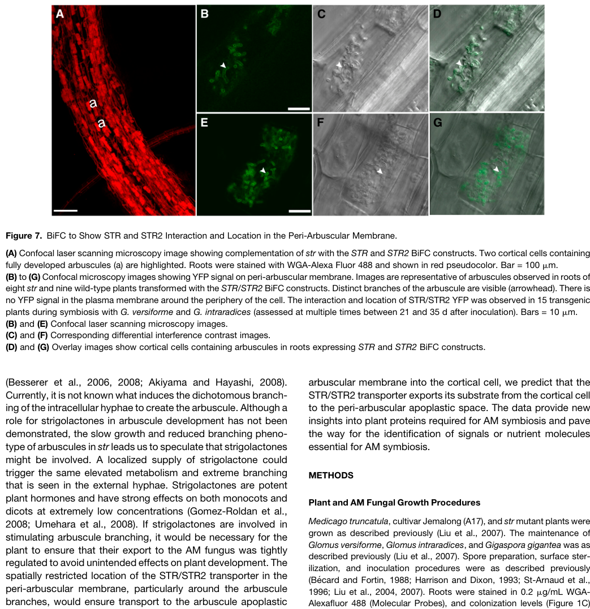

## Question

# Gene Research for Functional Annotation

## ⚠️ CRITICAL: Gene/Protein Identification Context

**BEFORE YOU BEGIN RESEARCH:** You MUST verify you are researching the CORRECT gene/protein. Gene symbols can be ambiguous, especially for less well-characterized genes from non-model organisms.

### Target Gene/Protein Identity (from UniProt):
- **UniProt Accession:** D3GE74
- **Protein Description:** RecName: Full=ABC transporter G family member STR {ECO:0000303|PubMed:20453115}; EC=7.6.2.-; AltName: Full=Protein STUNTED ARBUSCULE {ECO:0000303|PubMed:20453115};
- **Gene Information:** Name=STR {ECO:0000303|PubMed:20453115}; OrderedLocusNames=MTR_8g107450 {ECO:0000312|EMBL:AET05608.1}; ORFNames=MtrunA17_Chr8g0393191 {ECO:0000312|EMBL:RHN43934.1};
- **Organism (full):** Medicago truncatula (Barrel medic) (Medicago tribuloides).
- **Protein Family:** Belongs to the ABC transporter superfamily. ABCG family.
- **Key Domains:** AAA+_ATPase. (IPR003593); ABC2_TM. (IPR013525); ABC_transporter-like_ATP-bd. (IPR003439); ABC_transporter-like_CS. (IPR017871); ABCG_transporters. (IPR050352)

### MANDATORY VERIFICATION STEPS:

1. **Check if the gene symbol "STR" matches the protein description above**
2. **Verify the organism is correct:** Medicago truncatula (Barrel medic) (Medicago tribuloides).
3. **Check if protein family/domains align with what you find in literature**
4. **If you find literature for a DIFFERENT gene with the same or similar symbol, STOP**

### If Gene Symbol is Ambiguous or You Cannot Find Relevant Literature:

**DO NOT PROCEED WITH RESEARCH ON A DIFFERENT GENE.** Instead:
- State clearly: "The gene symbol 'STR' is ambiguous or literature is limited for this specific protein"
- Explain what you found (e.g., "Found extensive literature on a different gene with the same symbol in a different organism")
- Describe the protein based ONLY on the UniProt information provided above
- Suggest that the protein function can be inferred from domain/family information

### Research Target:

Please provide a comprehensive research report on the gene **STR** (gene ID: STR, UniProt: D3GE74) in MEDTR.

The research report should be a detailed narrative explaining the function, biological processes, and localization of the gene product. Citations should be given for all claims.

You should prioritize authoritative reviews and primary scientific literature when conducting research. You can supplement
this with annotations you find in gene/protein databases, but these can be outdated or inaccurate.

We are specifically interested in the primary function of the gene - for enzymes, what reaction is catalyzed, and what is the substrate specificity? For transporters, what is the substrate? For structural proteins or adapters, what is the broader structural role? For signaling molecules, what is the role in the pathway.

We are interested in where in or outside the cell the gene product carries out its function.

We are also interested in the signaling or biochemical pathways in which the gene functions. We are less interested in broad pleiotropic effects, except where these elucidate the precise role.

Include evidence where possible. We are interested in both experimental evidence as well as inference from structure, evolution, or bioinformatic analysis. Precise studies should be prioritized over high-throughput, where available.

## Output

Question: You are an expert researcher providing comprehensive, well-cited information.

Provide detailed information focusing on:
1. Key concepts and definitions with current understanding
2. Recent developments and latest research (prioritize 2023-2024 sources)
3. Current applications and real-world implementations
4. Expert opinions and analysis from authoritative sources
5. Relevant statistics and data from recent studies

Format as a comprehensive research report with proper citations. Include URLs and publication dates where available.
Always prioritize recent, authoritative sources and provide specific citations for all major claims.

# Gene Research for Functional Annotation

## ⚠️ CRITICAL: Gene/Protein Identification Context

**BEFORE YOU BEGIN RESEARCH:** You MUST verify you are researching the CORRECT gene/protein. Gene symbols can be ambiguous, especially for less well-characterized genes from non-model organisms.

### Target Gene/Protein Identity (from UniProt):
- **UniProt Accession:** D3GE74
- **Protein Description:** RecName: Full=ABC transporter G family member STR {ECO:0000303|PubMed:20453115}; EC=7.6.2.-; AltName: Full=Protein STUNTED ARBUSCULE {ECO:0000303|PubMed:20453115};
- **Gene Information:** Name=STR {ECO:0000303|PubMed:20453115}; OrderedLocusNames=MTR_8g107450 {ECO:0000312|EMBL:AET05608.1}; ORFNames=MtrunA17_Chr8g0393191 {ECO:0000312|EMBL:RHN43934.1};
- **Organism (full):** Medicago truncatula (Barrel medic) (Medicago tribuloides).
- **Protein Family:** Belongs to the ABC transporter superfamily. ABCG family.
- **Key Domains:** AAA+_ATPase. (IPR003593); ABC2_TM. (IPR013525); ABC_transporter-like_ATP-bd. (IPR003439); ABC_transporter-like_CS. (IPR017871); ABCG_transporters. (IPR050352)

### MANDATORY VERIFICATION STEPS:

1. **Check if the gene symbol "STR" matches the protein description above**
2. **Verify the organism is correct:** Medicago truncatula (Barrel medic) (Medicago tribuloides).
3. **Check if protein family/domains align with what you find in literature**
4. **If you find literature for a DIFFERENT gene with the same or similar symbol, STOP**

### If Gene Symbol is Ambiguous or You Cannot Find Relevant Literature:

**DO NOT PROCEED WITH RESEARCH ON A DIFFERENT GENE.** Instead:
- State clearly: "The gene symbol 'STR' is ambiguous or literature is limited for this specific protein"
- Explain what you found (e.g., "Found extensive literature on a different gene with the same symbol in a different organism")
- Describe the protein based ONLY on the UniProt information provided above
- Suggest that the protein function can be inferred from domain/family information

### Research Target:

Please provide a comprehensive research report on the gene **STR** (gene ID: STR, UniProt: D3GE74) in MEDTR.

The research report should be a detailed narrative explaining the function, biological processes, and localization of the gene product. Citations should be given for all claims.

You should prioritize authoritative reviews and primary scientific literature when conducting research. You can supplement
this with annotations you find in gene/protein databases, but these can be outdated or inaccurate.

We are specifically interested in the primary function of the gene - for enzymes, what reaction is catalyzed, and what is the substrate specificity? For transporters, what is the substrate? For structural proteins or adapters, what is the broader structural role? For signaling molecules, what is the role in the pathway.

We are interested in where in or outside the cell the gene product carries out its function.

We are also interested in the signaling or biochemical pathways in which the gene functions. We are less interested in broad pleiotropic effects, except where these elucidate the precise role.

Include evidence where possible. We are interested in both experimental evidence as well as inference from structure, evolution, or bioinformatic analysis. Precise studies should be prioritized over high-throughput, where available.

# Functional annotation report: *Medicago truncatula* STR (UniProt D3GE74)

## Identity and principal function

**STR here means STUNTED ARBUSCULE**, the *Medicago truncatula* gene identified by Zhang, Blaylock and Harrison—not its partner **STR2**, a rice gene sometimes called **STR1**, or another protein sharing the abbreviation. The supplied UniProt record identifies D3GE74 with locus **MTR_8g107450**; a subsequent *Medicago* study lists STR as **Medtr8g107450**. Positional cloning, a damaging *str* allele and rescue with wild-type STR independently establish the gene’s identity and role. STR is an **ABCG-family half-size ATP-binding cassette transporter**, consistent with the supplied ATP-binding and transmembrane-domain annotations. The distinct, full-size *Medicago* transporter **MtABCG59**, implicated in strigolactone release, must not be conflated with it. (zhang2010twomedicagotruncatula pages 3-5, luginbuehl2021plantsexport2monopalmitin pages 19-23, banasiak2020thefullsizeabcg pages 10-12)

**Best-supported functional annotation:** STR partners with the ABCG half-transporter STR2 at the plant–fungus interface and is indispensable for normal development of fungal arbuscules in root cortical cells. The pair is strongly implicated in exporting a host-derived lipid-related molecule toward the fungus. **Its direct molecular substrate remains unconfirmed**; saturated *sn*-2 monoacylglycerols, particularly **2-monopalmitin (16:0 2-MAG)**, are leading candidates rather than proven STR cargo. Thus, the supplied EC designation **7.6.2.-** describes an incompletely specified ATP-driven transporter, not an experimentally established reaction with a defined lipid substrate. (zhang2010twomedicagotruncatula pages 5-7, luginbuehl2021plantsexport2monopalmitin pages 6-10, luginbuehl2021plantsexport2monopalmitin pages 10-15, banasiak2021aroadmapof pages 7-9)

## Molecular mechanism and site of action

STR has one nucleotide-binding domain, containing conserved ABC ATP-binding motifs, and one membrane-spanning domain with approximately six helices. Half-transporters require a partner to form the architecture of a complete ABC transporter. Functional, native-promoter split-YFP constructs demonstrated **STR–STR2 interaction**, whereas STR–STR controls gave no detectable interaction signal. ATP hydrolysis is the expected source of transport energy from this architecture; substrate-coupled ATPase activity and transport kinetics have **not** been established for purified STR–STR2. (zhang2010twomedicagotruncatula pages 5-7, luginbuehl2021plantsexport2monopalmitin pages 10-15)

The interacting proteins localize to the **plant periarbuscular membrane (PAM)**, the specialized host membrane enclosing intracellular fungal arbuscules. Fluorescence is strongest around fine arbuscule branches, weaker or absent around the trunk, and undetectable at the ordinary peripheral plasma membrane under the reported imaging conditions. STR and STR2 promoters also show strong activity specifically in arbuscule-containing cortical cells and weaker activity in root vascular tissue; vascular protein localization was not detectable. The proposed direction of transport is **out of the host cortical-cell compartment, across the PAM into the periarbuscular space**, from which carbon-containing material can reach the fungus. This direction follows localization and the exporter model, rather than direct directional flux measurement for a purified transporter. The cropped localization figure provides visual evidence of the STR–STR2 signal around arbuscule branches. (zhang2010twomedicagotruncatula pages 5-7, zhang2010twomedicagotruncatula pages 7-8, zhang2010twomedicagotruncatula media 7e6a4f72)

## Direct genetic evidence and biological process

The original *Medicago* **str** mutation changes a codon for glutamine 635 to a stop codon and is predicted to remove the final three transmembrane helices. Fungal penetration and initial arbuscule formation still occur, but branching arrests; the branches subsequently shrivel and the arbuscules remain small. Introducing wild-type STR rescued arbuscule development in **42 independent transformed root systems**: mean arbuscule length after rescue was approximately **47 µm**, comparable to **45 µm** in wild type. Two STR2-silencing constructs produced similarly short arbuscules, **20.9 ± 0.8 µm** and **18.5 ± 1.1 µm**, versus **47.0 ± 1.2 µm** in vector controls at 28 days after inoculation. Infection units were also shorter, approximately **907–991 µm** versus **2,876.5 µm** in controls. These measurements establish a requirement for both members of the pair in arbuscule growth, not the identity of the transported molecule. (zhang2010twomedicagotruncatula pages 2-3, zhang2010twomedicagotruncatula pages 5-7, zhang2010twomedicagotruncatula pages 7-8, zhang2010twomedicagotruncatula pages 3-5)

The developmental block differs from loss of the symbiotic phosphate transporter **PT4**, for which arbuscules initially develop but degenerate prematurely. The *str* plants also retain normal rhizobial nodulation under the tested conditions, placing STR primarily in the **arbuscular-mycorrhizal developmental program**, rather than identifying it as a general nodulation factor or a phosphate transporter. Arbuscules form the exchange interface at which the fungus supplies mineral nutrients, including phosphorus, while receiving plant carbon. Conservation of STR/STR2-like genes and similar *str* phenotypes in rice support a conserved role across the tested monocot and dicot hosts; this is comparative evidence, not a direct biochemical measurement in every species. (zhang2010twomedicagotruncatula pages 1-2, zhang2010twomedicagotruncatula pages 7-8, gutjahr2012thehalf‐sizeabc pages 1-2)

## Biochemical pathway and the substrate question

The leading pathway model connects symbiotic transcriptional activation to plant lipid supply: **RAM1-dependent programming → enhanced fatty-acid production and FATM activity → RAM2-dependent formation of saturated *sn*-2 monoacylglycerols → STR–STR2-associated export across the PAM → fungal lipid metabolism**. In this model, FATM favors supply of palmitate (16:0), while RAM2 acylates glycerol-3-phosphate to generate a candidate exported monoacylglycerol. Arbuscular mycorrhizal fungi depend on host-derived fatty acids; fungal-associated lipid-labeling studies and the complementary *Medicago* metabolic experiments support plant-to-fungus transfer. The model does **not** show that STR itself catalyzes FATM’s or RAM2’s chemical reactions. (luginbuehl2021plantsexport2monopalmitin pages 1-6, maclean2017plantsignalingand pages 13-16, banasiak2021aroadmapof pages 7-9)

The most chemically specific *Medicago* test retrieved is **Luginbuehl and colleagues’ January 2021 bioRxiv preprint**. Ectopic RAM1 expression in hairy roots increased root-surface saturated monoacylglycerols by approximately **30-fold**. The predominant identified species was **2-monopalmitin**; smaller **14:0** and **18:0** species were detected, but no unsaturated monoacylglycerols were detected in that experiment. Root-surface 2-monopalmitin accumulation was virtually abolished in *ram2-1* and suppressed by **FATM** or **STR** RNA interference, using five biological replicates in the reported secretion comparisons. This is compelling evidence that STR is **required for efficient secretion in this experimental pathway**, but secretion from an ectopically activated, uncolonized root surface is not itself a direct assay of transport across the PAM. The authors explicitly called for characterization of purified STR–STR2 before assigning 2-MAG as its biochemical substrate. The retrieved version is a **preprint**, and a corresponding peer-reviewed version was not verified here. (luginbuehl2021plantsexport2monopalmitin pages 6-10, luginbuehl2021plantsexport2monopalmitin pages 10-15)

In the same preprint, radiolabeled-glycerol tracing in mycorrhizal roots connected plant glycerol metabolism to fungal-associated triacylglycerol: loss of plant glycerol kinase **GLI1** reduced glycerol-derived labeling by approximately **80%**, and reducing **RAM2** expression by nearly **50%** in heterozygous roots reduced labeling by approximately **25%**. These results support host provision of both fatty-acyl and glyceryl components, but do **not** identify what crosses STR–STR2 or exclude subsequent lipid processing. An authoritative 2021 transporter review likewise regarded *sn*-2 MAGs or derivatives as plausible, while explicitly stating that **direct proof of STR–STR2 cargo was absent**. It noted a reported comparison in which 16:0 *sn*-2-MAG accumulation in *str/str2* was comparable to wild type, another reason not to equate MAG-pathway phenotypes with proof of a specific transported molecule. (luginbuehl2021plantsexport2monopalmitin pages 6-10, luginbuehl2021plantsexport2monopalmitin pages 10-15, banasiak2021aroadmapof pages 7-9)

The 2023 *Medicago* research added a different lipid observation: **str2** roots had reduced amounts of several cutin-associated constituents, including **16:0-, 18:0- and 20:0-α,ω-dicarboxylic acids**, without a significant change in total fatty acids. These cutin monomers are **chemically distinct from 2-monopalmitin**. Their altered abundance suggests a relationship between the STR–STR2 system and particular lipid-export processes, but neither the cutin profile nor a heterologous expression phenotype proves that a cutin monomer is its direct physiological PAM substrate. (zhang2023controlofarbuscule pages 1-2, zhang2023controlofarbuscule pages 3-4)

Alternative substrate claims also need care. Rice mutants impaired in strigolactone synthesis (**d10** and **d17**) formed well-branched arbuscules despite reduced colonization, arguing against strigolactones as the compounds required to explain the STR1/STR2 arbuscule phenotype. Separately, *Medicago* **MtABCG59** has evidence for a **presymbiotic, root-to-rhizosphere strigolactone-related secretion** role; that is evidence about a **different transporter**. A 2022 imaging study occasionally observed lipid-associated staining inside stunted **rice Osstr1** arbuscules, suggesting that detectable lipid movement is not necessarily abolished. The stain does not identify a molecule or measure functional flux, and a rice observation cannot resolve the exact substrate of *Medicago* STR. (gutjahr2012thehalf‐sizeabc pages 9-11, banasiak2020thefullsizeabcg pages 10-12, montero2022asimpleand pages 4-5)

The following evidence summary separates established findings from mechanistic inference.

| Claim | Strongest evidence | Certainty / limitation |
|---|---|---|
| **Identity:** D3GE74 is *Medicago truncatula* **STR (STUNTED ARBUSCULE)**, an ABCG half-transporter distinct from STR2 and the full-size strigolactone-associated MtABCG59. | Positional cloning identified an ABCG half-transporter carrying one nucleotide-binding domain and one six-helix transmembrane domain; the *str* allele contains a C→T nonsense mutation, and wild-type STR restored the phenotype in 42 independent transformed root systems. STR2 was identified separately as its sister-clade partner. (zhang2010twomedicagotruncatula pages 3-5, zhang2010twomedicagotruncatula pages 5-7) | **Established.** The accession/locus mapping to D3GE74/MTR_8g107450 comes from the supplied UniProt record; the primary paper establishes the STR identity and protein class. MtABCG59 is a different, full-size ABCG implicated in rhizospheric strigolactone secretion. (banasiak2020thefullsizeabcg pages 10-12, banasiak2020thefullsizeabcg pages 1-2) |
| **Functional assembly:** STR forms a heterodimer with STR2 rather than a detectable STR homodimer. | Native-promoter split-YFP/BiFC produced fluorescence with STR–STR2, but not STR–STR controls; the tagged proteins complemented *str*. Silencing STR2 recreated the *str* phenotype without changing STR transcript abundance. (zhang2010twomedicagotruncatula pages 5-7, zhang2010twomedicagotruncatula pages 7-8) | **Strong direct interaction and genetic evidence.** Each half-transporter contributes one NBD and one TMD to an ATP-powered exporter; transport stoichiometry and ATPase kinetics have not been measured biochemically. |
| **Localization:** the active STR–STR2 complex acts at the plant periarbuscular membrane (PAM), especially around fine arbuscule branches. | BiFC fluorescence surrounded young and mature arbuscules, was strongest around branches, weak or absent around the trunk, and undetectable at the peripheral plasma membrane; some vacuolar signal occurred in cells with degenerating arbuscules. (zhang2010twomedicagotruncatula pages 7-8, zhang2010twomedicagotruncatula media 7e6a4f72) | **Established in colonized root cortical cells.** Low constitutive vascular expression was detected transcriptionally, but corresponding protein fluorescence was below detection. |
| **Essential biological function:** STR enables arbuscule branching, maturation, and a functional AM symbiosis. | Fungal entry occurs in *str*, but arbuscule growth arrests and branches shrivel. The Gln635-stop allele is predicted to remove the final three transmembrane helices. Wild-type STR complementation restored mean arbuscule length to approximately 47 µm versus 45 µm in wild type; STR2 RNAi reduced mean arbuscule length from 47.0 µm to 20.9 or 18.5 µm and shortened infection units from 2876.5 µm to approximately 907–991 µm. (zhang2010twomedicagotruncatula pages 2-3, zhang2010twomedicagotruncatula pages 7-8, zhang2010twomedicagotruncatula pages 3-5) | **Established by loss-of-function and rescue.** The defect is AM-specific under tested conditions: nodulation remains normal, and the phenotype differs from premature degeneration in *pt4*. |
| **Probable cargo:** STR–STR2 likely exports saturated 2-monoacylglycerols, especially **2-monopalmitin (16:0 2-MAG)**, from the host toward the peri-arbuscular space. | In a **2021 bioRxiv preprint**, ectopic RAM1 caused an approximately 30-fold rise in root-surface saturated MAGs, predominantly 16:0 2-MAG, with smaller 14:0 and 18:0 species and no detected unsaturated MAGs. RAM1-dependent 2-monopalmitin secretion was virtually abolished in *ram2-1* and suppressed by FATM- or STR-RNAi. (luginbuehl2021plantsexport2monopalmitin pages 6-10) | **Strong pathway-level inference, not direct substrate proof.** No purified STR–STR2 binding, ATPase-coupling, vesicle-reconstitution, or transport assay established 2-monopalmitin as its direct cargo; the preprint itself says purified-protein characterization is required. (luginbuehl2021plantsexport2monopalmitin pages 10-15) |
| **Cargo remains unresolved despite the lipid model.** | A peer-reviewed 2021 transporter review judged 16:0 sn-2-MAG or a derivative “tempting” candidates but stated that direct proof was absent; it also noted WT-comparable 16:0 sn-2-MAG accumulation in *str/str2* in cited work and identified STR/STR2 substrate identity as an outstanding question. (banasiak2021aroadmapof pages 7-9, banasiak2021aroadmapof pages 14-15) | **Expert consensus: probable lipid exporter, exact molecule unknown.** Hydrophobic-cargo measurements are technically difficult, and genetic dependence can reflect indirect pathway disruption or developmental feedback. |
| **Alternative lipid/cutin association:** STR–STR2 can affect cutin-related compounds, but these are not proven direct symbiotic cargoes. | The 2023 study found reduced 18:0 and 20:0 fatty acids and 16:0-, 18:0-, and 20:0-α,ω-dicarboxylic-acid cutin monomers in *str2*, despite unchanged total fatty acids; heterologous MtSTR–MtSTR2 expression was also evaluated for cutin accumulation. (zhang2023controlofarbuscule pages 1-2, zhang2023controlofarbuscule pages 3-4) | **Indirect genetic/heterologous evidence.** Cutin monomers and 2-monopalmitin are chemically distinct. Changes in cutin composition do not identify the molecule crossing the PAM. |
| **Direct 2023 regulation:** MtERM1 activates STR transcription through promoter AW-box elements and also activates STR2 through AW-box-like elements. | Yeast one-hybrid, dual-luciferase, and FLAG ChIP-qPCR localized MtERM1 association to the STR AW-box region and two STR2 AW-like regions; motif deletion abolished promoter activation. MtERM1 loss caused small arbuscules, whereas complementation restored colonization and PT4 expression. (zhang2023controlofarbuscule pages 2-3, zhang2023controlofarbuscule pages 4-5) | **Strong direct transcriptional evidence.** MtWRI5a directly binds STR AW boxes, but its direct binding to the tested STR2 fragment was not supported; STR2 transactivation may require other elements or factors. (zhang2023controlofarbuscule pages 10-11, jiang2018medicagoap2domaintranscription pages 6-7) |
| **Regulatory feedback:** delayed MtERF12–TOPLESS/TPR activity restrains ERM1/WRI5a-driven STR/STR2 expression and lipid allocation. | ERM1/WRI5a induction began around 14 days after inoculation, whereas ERF12 began around day 21. ERF12 interacted with the activators, dose-dependently reduced their STR/STR2 promoter activation, and recruited MtTPR3a through its EAR motif; *erf12* increased mature arbuscules, while ERF12 overexpression produced stunted arbuscules. (zhang2023controlofarbuscule pages 9-10, zhang2023controlofarbuscule pages 6-7, zhang2023controlofarbuscule pages 5-6, zhang2023controlofarbuscule pages 8-9) | **Well-supported regulatory model.** ERF12 does not directly bind STR/STR2 promoters; repression is mediated through protein interaction and co-repressor recruitment. |
| **Cross-species caution:** residual lipid staining in rice *Osstr1* does not establish normal STR-independent transport. | Ac-201/WGA imaging occasionally detected lipid signal inside stunted rice *Osstr1* arbuscule bodies, implying that detectable lipid movement was not fully abolished. (montero2022asimpleand pages 5-6, montero2022asimpleand pages 4-5) | **Suggestive but limited.** This concerns rice, not *M. truncatula*; Ac-201 is not molecule-specific, and staining cannot determine cargo identity, direction, rate, or physiologically functional flux. It therefore neither disproves STR-mediated lipid export nor demonstrates a normal alternative pathway. |

*Table: Evidence hierarchy for *Medicago truncatula* STR/D3GE74, separating established identity, localization, and developmental function from inferred lipid cargo. It highlights direct regulatory findings and the principal biochemical and cross-species limitations.*

## Regulation: important 2023 advances

In *Medicago*, **WRI5a** binds AW-box elements in the **STR promoter**, supported by promoter-binding and reporter experiments. WRI5a perturbation affects STR expression and arbuscule formation, connecting the transporter to the host lipid-allocation transcriptional program. Evidence that WRI5a directly binds the **tested STR2 promoter fragment** is weaker: the 2023 study did not detect such binding in the reported assays, even though STR2 could be transcriptionally activated in a heterologous assay. Direct binding to STR should therefore not be generalized automatically to STR2. (jiang2018medicagoap2domaintranscription pages 1-2, jiang2018medicagoap2domaintranscription pages 7-8, jiang2018medicagoap2domaintranscription pages 6-7, zhang2023controlofarbuscule pages 10-11)

A **September 2023 *Nature Communications*** study established a more detailed control circuit. **MtERM1** bound AW-box or AW-box-like promoter regions of **MtSTR and MtSTR2** in yeast one-hybrid and ChIP-qPCR assays; disruption of the relevant motifs impaired reporter activation. ERM1 and WRI5a also activate **MtERF12**. ERF12 interacts with these positive regulators and, through its EAR motif, recruits a **TOPLESS-related co-repressor**; increasing ERF12 reduced ERM1/WRI5a-dependent promoter activation rather than demonstrating direct ERF12 binding to STR promoters. ERM1/WRI5a induction began at approximately **14 days** after inoculation, compared with approximately **21 days** for ERF12; *erf12* loss increased mature arbuscules, whereas ERF12 overexpression impaired development. The resulting model is a feedback mechanism that limits host lipid allocation and arbuscule development, not a change in the established direction of nutrient exchange: **host carbon goes to the fungus; fungal-acquired mineral nutrients go to the host**. (zhang2023controlofarbuscule pages 2-3, zhang2023controlofarbuscule pages 6-7, zhang2023controlofarbuscule pages 5-6, zhang2023controlofarbuscule pages 4-5, zhang2023controlofarbuscule pages 8-9)

## Applications and remaining work

STR is an experimentally grounded **marker and genetic handle** for studying the arbuscule-stage transport interface: mutant complementation, promoter reporters, RNA interference and lipid profiling have all been implemented in *Medicago* research. Its conserved rice counterparts make the system relevant to comparative crop-symbiosis work, although conservation does not establish an interchangeable substrate in every crop. A **September 2024** study in *Poncirus trifoliata* associated drought-dependent changes in arbuscule abundance and lipid profiles with expression of **FatM, RAM1 and STR/STR2**. That experiment is informative for agricultural context but is **in citrus, not D3GE74**, and its expression correlations do not establish STR substrate specificity or a validated STR-based drought-tolerance intervention. No deployed agricultural application specifically modifying *Medicago* D3GE74 was established by the retrieved evidence. (zhang2024droughtstressreduces pages 1-2, gutjahr2012thehalf‐sizeabc pages 1-2, banasiak2021aroadmapof pages 7-9)

**Priority experiment:** measure ATP-dependent transport of chemically defined 2-monopalmitin, other 2-MAGs and plausible cutin-related candidates using purified or reconstituted *Medicago* STR–STR2, with inactive-protein controls and complementary PAM-specific in-plant flux measurements. Until then, the annotation **“PAM-localized STR–STR2 ABCG complex required for arbuscule development and implicated in host lipid export; exact transported substrate unresolved”** is more defensible than naming 2-monopalmitin as an established substrate. (luginbuehl2021plantsexport2monopalmitin pages 10-15, banasiak2021aroadmapof pages 7-9)

### Principal sources and links

- Zhang Q, Blaylock LA, Harrison MJ. **May 2010**. *The Plant Cell* 22:1483–1497. Foundational *Medicago* STR cloning, genetics, rescue and localization. https://doi.org/10.1105/tpc.110.074955. (zhang2010twomedicagotruncatula pages 5-7, zhang2010twomedicagotruncatula pages 7-8)
- Gutjahr C *et al.* **2012**. *The Plant Journal* 69:906–920. Conserved rice STR1/STR2 phenotypes and strigolactone comparison. https://doi.org/10.1111/j.1365-313x.2011.04842.x. (gutjahr2012thehalf‐sizeabc pages 9-11, gutjahr2012thehalf‐sizeabc pages 1-2)
- Jiang Y *et al.* **November 2018**. *Molecular Plant* 11:1344–1359. WRI5a regulation, including direct STR-promoter binding. https://doi.org/10.1016/j.molp.2018.09.006. (jiang2018medicagoap2domaintranscription pages 1-2, jiang2018medicagoap2domaintranscription pages 6-7)
- Luginbuehl LH *et al.* **January 2021, bioRxiv preprint**. Root-surface 2-monopalmitin secretion and isotope tracing; **not direct transporter-substrate proof**. https://doi.org/10.1101/2021.01.19.427311. (luginbuehl2021plantsexport2monopalmitin pages 6-10, luginbuehl2021plantsexport2monopalmitin pages 10-15)
- Banasiak J *et al.* **June 2021**. *Plant Physiology* 187:2071–2091. Expert assessment of symbiotic transporters and unresolved STR–STR2 cargo. https://doi.org/10.1093/plphys/kiab280. (banasiak2021aroadmapof pages 7-9)
- Montero H, Paszkowski U. **August 2022**. *The Plant Journal* 112:294–301. Lipid imaging in rice *Osstr1*, with interpretation limits. https://doi.org/10.1111/tpj.15934. (montero2022asimpleand pages 4-5)
- Zhang Q *et al.* **September 2023**. *Nature Communications* 14. Direct STR/STR2 transcriptional regulation, ERF12 feedback and cutin-related findings. https://doi.org/10.1038/s41467-023-41493-2. (zhang2023controlofarbuscule pages 2-3, zhang2023controlofarbuscule pages 1-2)
- Zhang W *et al.* **20 September 2024**. *Frontiers in Plant Science* 15:1452202. Cross-species drought and lipid-pathway context in citrus. https://doi.org/10.3389/fpls.2024.1452202. (zhang2024droughtstressreduces pages 1-2)

References

1. (zhang2010twomedicagotruncatula pages 3-5): Quan Zhang, Laura A. Blaylock, and Maria J. Harrison. Two <i>medicago truncatula</i> half-abc transporters are essential for arbuscule development in arbuscular mycorrhizal symbiosis. The Plant Cell, 22:1483-1497, May 2010. URL: https://doi.org/10.1105/tpc.110.074955, doi:10.1105/tpc.110.074955. This article has 328 citations.

2. (luginbuehl2021plantsexport2monopalmitin pages 19-23): Leonie H Luginbuehl, Harrie van Erp, Henry Cheeld, Kirankumar S Mysore, Jiangqi Wen, Giles ED Oldroyd, and Peter J Eastmond. Plants export 2-monopalmitin and supply both fatty acyl and glyceryl moieties to arbuscular mycorrhizal fungi. BioRxiv, Jan 2021. URL: https://doi.org/10.1101/2021.01.19.427311, doi:10.1101/2021.01.19.427311. This article has 7 citations.

3. (banasiak2020thefullsizeabcg pages 10-12): Joanna Banasiak, Lorenzo Borghi, Natalia Stec, Enrico Martinoia, and Michał Jasiński. The full-size abcg transporter of medicago truncatula is involved in strigolactone secretion, affecting arbuscular mycorrhiza. Frontiers in Plant Science, Feb 2020. URL: https://doi.org/10.3389/fpls.2020.00018, doi:10.3389/fpls.2020.00018. This article has 98 citations.

4. (zhang2010twomedicagotruncatula pages 5-7): Quan Zhang, Laura A. Blaylock, and Maria J. Harrison. Two <i>medicago truncatula</i> half-abc transporters are essential for arbuscule development in arbuscular mycorrhizal symbiosis. The Plant Cell, 22:1483-1497, May 2010. URL: https://doi.org/10.1105/tpc.110.074955, doi:10.1105/tpc.110.074955. This article has 328 citations.

5. (luginbuehl2021plantsexport2monopalmitin pages 6-10): Leonie H Luginbuehl, Harrie van Erp, Henry Cheeld, Kirankumar S Mysore, Jiangqi Wen, Giles ED Oldroyd, and Peter J Eastmond. Plants export 2-monopalmitin and supply both fatty acyl and glyceryl moieties to arbuscular mycorrhizal fungi. BioRxiv, Jan 2021. URL: https://doi.org/10.1101/2021.01.19.427311, doi:10.1101/2021.01.19.427311. This article has 7 citations.

6. (luginbuehl2021plantsexport2monopalmitin pages 10-15): Leonie H Luginbuehl, Harrie van Erp, Henry Cheeld, Kirankumar S Mysore, Jiangqi Wen, Giles ED Oldroyd, and Peter J Eastmond. Plants export 2-monopalmitin and supply both fatty acyl and glyceryl moieties to arbuscular mycorrhizal fungi. BioRxiv, Jan 2021. URL: https://doi.org/10.1101/2021.01.19.427311, doi:10.1101/2021.01.19.427311. This article has 7 citations.

7. (banasiak2021aroadmapof pages 7-9): Joanna Banasiak, Tomasz Jamruszka, Jeremy D Murray, and Michał Jasiński. A roadmap of plant membrane transporters in arbuscular mycorrhizal and legume–rhizobium symbioses. Plant Physiology, 187:2071-2091, Jun 2021. URL: https://doi.org/10.1093/plphys/kiab280, doi:10.1093/plphys/kiab280. This article has 82 citations and is from a highest quality peer-reviewed journal.

8. (zhang2010twomedicagotruncatula pages 7-8): Quan Zhang, Laura A. Blaylock, and Maria J. Harrison. Two <i>medicago truncatula</i> half-abc transporters are essential for arbuscule development in arbuscular mycorrhizal symbiosis. The Plant Cell, 22:1483-1497, May 2010. URL: https://doi.org/10.1105/tpc.110.074955, doi:10.1105/tpc.110.074955. This article has 328 citations.

9. (zhang2010twomedicagotruncatula media 7e6a4f72): Quan Zhang, Laura A. Blaylock, and Maria J. Harrison. Two <i>medicago truncatula</i> half-abc transporters are essential for arbuscule development in arbuscular mycorrhizal symbiosis. The Plant Cell, 22:1483-1497, May 2010. URL: https://doi.org/10.1105/tpc.110.074955, doi:10.1105/tpc.110.074955. This article has 328 citations.

10. (zhang2010twomedicagotruncatula pages 2-3): Quan Zhang, Laura A. Blaylock, and Maria J. Harrison. Two <i>medicago truncatula</i> half-abc transporters are essential for arbuscule development in arbuscular mycorrhizal symbiosis. The Plant Cell, 22:1483-1497, May 2010. URL: https://doi.org/10.1105/tpc.110.074955, doi:10.1105/tpc.110.074955. This article has 328 citations.

11. (zhang2010twomedicagotruncatula pages 1-2): Quan Zhang, Laura A. Blaylock, and Maria J. Harrison. Two <i>medicago truncatula</i> half-abc transporters are essential for arbuscule development in arbuscular mycorrhizal symbiosis. The Plant Cell, 22:1483-1497, May 2010. URL: https://doi.org/10.1105/tpc.110.074955, doi:10.1105/tpc.110.074955. This article has 328 citations.

12. (gutjahr2012thehalf‐sizeabc pages 1-2): Caroline Gutjahr, Dragica Radovanovic, Jessika Geoffroy, Quan Zhang, Heike Siegler, Marco Chiapello, Leonardo Casieri, Kyungsook An, Gynheung An, Emmanuel Guiderdoni, Chellian Santhosh Kumar, Venkatesan Sundaresan, Maria J. Harrison, and Uta Paszkowski. The half‐size abc transporters str1 and str2 are indispensable for mycorrhizal arbuscule formation in rice. The Plant Journal, 69:906-920, Dec 2012. URL: https://doi.org/10.1111/j.1365-313x.2011.04842.x, doi:10.1111/j.1365-313x.2011.04842.x. This article has 216 citations.

13. (luginbuehl2021plantsexport2monopalmitin pages 1-6): Leonie H Luginbuehl, Harrie van Erp, Henry Cheeld, Kirankumar S Mysore, Jiangqi Wen, Giles ED Oldroyd, and Peter J Eastmond. Plants export 2-monopalmitin and supply both fatty acyl and glyceryl moieties to arbuscular mycorrhizal fungi. BioRxiv, Jan 2021. URL: https://doi.org/10.1101/2021.01.19.427311, doi:10.1101/2021.01.19.427311. This article has 7 citations.

14. (maclean2017plantsignalingand pages 13-16): Allyson M. MacLean, Armando Bravo, and Maria J. Harrison. Plant signaling and metabolic pathways enabling arbuscular mycorrhizal symbiosis. Plant Cell, 29:2319-2335, Aug 2017. URL: https://doi.org/10.1105/tpc.17.00555, doi:10.1105/tpc.17.00555. This article has 369 citations and is from a highest quality peer-reviewed journal.

15. (zhang2023controlofarbuscule pages 1-2): Qiang Zhang, Shuangshuang Wang, Qiujin Xie, Yuanjun Xia, Lei Lu, Mingxing Wang, Gang Wang, Siyu Long, Yunfei Cai, Ling Xu, Ertao Wang, and Yina Jiang. Control of arbuscule development by a transcriptional negative feedback loop in medicago. Nature Communications, Sep 2023. URL: https://doi.org/10.1038/s41467-023-41493-2, doi:10.1038/s41467-023-41493-2. This article has 57 citations and is from a highest quality peer-reviewed journal.

16. (zhang2023controlofarbuscule pages 3-4): Qiang Zhang, Shuangshuang Wang, Qiujin Xie, Yuanjun Xia, Lei Lu, Mingxing Wang, Gang Wang, Siyu Long, Yunfei Cai, Ling Xu, Ertao Wang, and Yina Jiang. Control of arbuscule development by a transcriptional negative feedback loop in medicago. Nature Communications, Sep 2023. URL: https://doi.org/10.1038/s41467-023-41493-2, doi:10.1038/s41467-023-41493-2. This article has 57 citations and is from a highest quality peer-reviewed journal.

17. (gutjahr2012thehalf‐sizeabc pages 9-11): Caroline Gutjahr, Dragica Radovanovic, Jessika Geoffroy, Quan Zhang, Heike Siegler, Marco Chiapello, Leonardo Casieri, Kyungsook An, Gynheung An, Emmanuel Guiderdoni, Chellian Santhosh Kumar, Venkatesan Sundaresan, Maria J. Harrison, and Uta Paszkowski. The half‐size abc transporters str1 and str2 are indispensable for mycorrhizal arbuscule formation in rice. The Plant Journal, 69:906-920, Dec 2012. URL: https://doi.org/10.1111/j.1365-313x.2011.04842.x, doi:10.1111/j.1365-313x.2011.04842.x. This article has 216 citations.

18. (montero2022asimpleand pages 4-5): Héctor Montero and Uta Paszkowski. A simple and versatile fluorochrome‐based procedure for imaging of lipids in arbuscule‐containing cells. The Plant Journal, 112:294-301, Aug 2022. URL: https://doi.org/10.1111/tpj.15934, doi:10.1111/tpj.15934. This article has 7 citations.

19. (banasiak2020thefullsizeabcg pages 1-2): Joanna Banasiak, Lorenzo Borghi, Natalia Stec, Enrico Martinoia, and Michał Jasiński. The full-size abcg transporter of medicago truncatula is involved in strigolactone secretion, affecting arbuscular mycorrhiza. Frontiers in Plant Science, Feb 2020. URL: https://doi.org/10.3389/fpls.2020.00018, doi:10.3389/fpls.2020.00018. This article has 98 citations.

20. (banasiak2021aroadmapof pages 14-15): Joanna Banasiak, Tomasz Jamruszka, Jeremy D Murray, and Michał Jasiński. A roadmap of plant membrane transporters in arbuscular mycorrhizal and legume–rhizobium symbioses. Plant Physiology, 187:2071-2091, Jun 2021. URL: https://doi.org/10.1093/plphys/kiab280, doi:10.1093/plphys/kiab280. This article has 82 citations and is from a highest quality peer-reviewed journal.

21. (zhang2023controlofarbuscule pages 2-3): Qiang Zhang, Shuangshuang Wang, Qiujin Xie, Yuanjun Xia, Lei Lu, Mingxing Wang, Gang Wang, Siyu Long, Yunfei Cai, Ling Xu, Ertao Wang, and Yina Jiang. Control of arbuscule development by a transcriptional negative feedback loop in medicago. Nature Communications, Sep 2023. URL: https://doi.org/10.1038/s41467-023-41493-2, doi:10.1038/s41467-023-41493-2. This article has 57 citations and is from a highest quality peer-reviewed journal.

22. (zhang2023controlofarbuscule pages 4-5): Qiang Zhang, Shuangshuang Wang, Qiujin Xie, Yuanjun Xia, Lei Lu, Mingxing Wang, Gang Wang, Siyu Long, Yunfei Cai, Ling Xu, Ertao Wang, and Yina Jiang. Control of arbuscule development by a transcriptional negative feedback loop in medicago. Nature Communications, Sep 2023. URL: https://doi.org/10.1038/s41467-023-41493-2, doi:10.1038/s41467-023-41493-2. This article has 57 citations and is from a highest quality peer-reviewed journal.

23. (zhang2023controlofarbuscule pages 10-11): Qiang Zhang, Shuangshuang Wang, Qiujin Xie, Yuanjun Xia, Lei Lu, Mingxing Wang, Gang Wang, Siyu Long, Yunfei Cai, Ling Xu, Ertao Wang, and Yina Jiang. Control of arbuscule development by a transcriptional negative feedback loop in medicago. Nature Communications, Sep 2023. URL: https://doi.org/10.1038/s41467-023-41493-2, doi:10.1038/s41467-023-41493-2. This article has 57 citations and is from a highest quality peer-reviewed journal.

24. (jiang2018medicagoap2domaintranscription pages 6-7): Yina Jiang, Qiujin Xie, Wanxiao Wang, Jun Yang, Xiaowei Zhang, Nan Yu, Yun Zhou, and Ertao Wang. Medicago ap2-domain transcription factor wri5a is a master regulator of lipid biosynthesis and transfer during mycorrhizal symbiosis. Molecular plant, 11 11:1344-1359, Nov 2018. URL: https://doi.org/10.1016/j.molp.2018.09.006, doi:10.1016/j.molp.2018.09.006. This article has 182 citations and is from a highest quality peer-reviewed journal.

25. (zhang2023controlofarbuscule pages 9-10): Qiang Zhang, Shuangshuang Wang, Qiujin Xie, Yuanjun Xia, Lei Lu, Mingxing Wang, Gang Wang, Siyu Long, Yunfei Cai, Ling Xu, Ertao Wang, and Yina Jiang. Control of arbuscule development by a transcriptional negative feedback loop in medicago. Nature Communications, Sep 2023. URL: https://doi.org/10.1038/s41467-023-41493-2, doi:10.1038/s41467-023-41493-2. This article has 57 citations and is from a highest quality peer-reviewed journal.

26. (zhang2023controlofarbuscule pages 6-7): Qiang Zhang, Shuangshuang Wang, Qiujin Xie, Yuanjun Xia, Lei Lu, Mingxing Wang, Gang Wang, Siyu Long, Yunfei Cai, Ling Xu, Ertao Wang, and Yina Jiang. Control of arbuscule development by a transcriptional negative feedback loop in medicago. Nature Communications, Sep 2023. URL: https://doi.org/10.1038/s41467-023-41493-2, doi:10.1038/s41467-023-41493-2. This article has 57 citations and is from a highest quality peer-reviewed journal.

27. (zhang2023controlofarbuscule pages 5-6): Qiang Zhang, Shuangshuang Wang, Qiujin Xie, Yuanjun Xia, Lei Lu, Mingxing Wang, Gang Wang, Siyu Long, Yunfei Cai, Ling Xu, Ertao Wang, and Yina Jiang. Control of arbuscule development by a transcriptional negative feedback loop in medicago. Nature Communications, Sep 2023. URL: https://doi.org/10.1038/s41467-023-41493-2, doi:10.1038/s41467-023-41493-2. This article has 57 citations and is from a highest quality peer-reviewed journal.

28. (zhang2023controlofarbuscule pages 8-9): Qiang Zhang, Shuangshuang Wang, Qiujin Xie, Yuanjun Xia, Lei Lu, Mingxing Wang, Gang Wang, Siyu Long, Yunfei Cai, Ling Xu, Ertao Wang, and Yina Jiang. Control of arbuscule development by a transcriptional negative feedback loop in medicago. Nature Communications, Sep 2023. URL: https://doi.org/10.1038/s41467-023-41493-2, doi:10.1038/s41467-023-41493-2. This article has 57 citations and is from a highest quality peer-reviewed journal.

29. (montero2022asimpleand pages 5-6): Héctor Montero and Uta Paszkowski. A simple and versatile fluorochrome‐based procedure for imaging of lipids in arbuscule‐containing cells. The Plant Journal, 112:294-301, Aug 2022. URL: https://doi.org/10.1111/tpj.15934, doi:10.1111/tpj.15934. This article has 7 citations.

30. (jiang2018medicagoap2domaintranscription pages 1-2): Yina Jiang, Qiujin Xie, Wanxiao Wang, Jun Yang, Xiaowei Zhang, Nan Yu, Yun Zhou, and Ertao Wang. Medicago ap2-domain transcription factor wri5a is a master regulator of lipid biosynthesis and transfer during mycorrhizal symbiosis. Molecular plant, 11 11:1344-1359, Nov 2018. URL: https://doi.org/10.1016/j.molp.2018.09.006, doi:10.1016/j.molp.2018.09.006. This article has 182 citations and is from a highest quality peer-reviewed journal.

31. (jiang2018medicagoap2domaintranscription pages 7-8): Yina Jiang, Qiujin Xie, Wanxiao Wang, Jun Yang, Xiaowei Zhang, Nan Yu, Yun Zhou, and Ertao Wang. Medicago ap2-domain transcription factor wri5a is a master regulator of lipid biosynthesis and transfer during mycorrhizal symbiosis. Molecular plant, 11 11:1344-1359, Nov 2018. URL: https://doi.org/10.1016/j.molp.2018.09.006, doi:10.1016/j.molp.2018.09.006. This article has 182 citations and is from a highest quality peer-reviewed journal.

32. (zhang2024droughtstressreduces pages 1-2): Wei Zhang, Xilong Yin, Zengwei Feng, Xiaodi Liu, Fengwa Zhu, Honghui Zhu, and Qing Yao. Drought stress reduces arbuscular mycorrhizal colonization of poncirus trifoliata (l.) roots and plant growth promotion via lipid metabolism. Frontiers in Plant Science, Sep 2024. URL: https://doi.org/10.3389/fpls.2024.1452202, doi:10.3389/fpls.2024.1452202. This article has 14 citations.

## Artifacts

- [Edison artifact artifact-00](STR-deep-research-falcon_artifacts/artifact-00.md)

## Citations

1. banasiak2021aroadmapof pages 7-9
2. montero2022asimpleand pages 4-5
3. zhang2024droughtstressreduces pages 1-2
4. zhang2010twomedicagotruncatula pages 3-5
5. banasiak2020thefullsizeabcg pages 10-12
6. zhang2010twomedicagotruncatula pages 5-7
7. zhang2010twomedicagotruncatula pages 7-8
8. zhang2010twomedicagotruncatula pages 2-3
9. zhang2010twomedicagotruncatula pages 1-2
10. maclean2017plantsignalingand pages 13-16
11. zhang2023controlofarbuscule pages 1-2
12. zhang2023controlofarbuscule pages 3-4
13. banasiak2020thefullsizeabcg pages 1-2
14. banasiak2021aroadmapof pages 14-15
15. zhang2023controlofarbuscule pages 2-3
16. zhang2023controlofarbuscule pages 4-5
17. zhang2023controlofarbuscule pages 10-11
18. zhang2023controlofarbuscule pages 9-10
19. zhang2023controlofarbuscule pages 6-7
20. zhang2023controlofarbuscule pages 5-6
21. zhang2023controlofarbuscule pages 8-9
22. montero2022asimpleand pages 5-6
23. https://doi.org/10.1105/tpc.110.074955.
24. https://doi.org/10.1111/j.1365-313x.2011.04842.x.
25. https://doi.org/10.1016/j.molp.2018.09.006.
26. https://doi.org/10.1101/2021.01.19.427311.
27. https://doi.org/10.1093/plphys/kiab280.
28. https://doi.org/10.1111/tpj.15934.
29. https://doi.org/10.1038/s41467-023-41493-2.
30. https://doi.org/10.3389/fpls.2024.1452202.
31. https://doi.org/10.1105/tpc.110.074955,
32. https://doi.org/10.1101/2021.01.19.427311,
33. https://doi.org/10.3389/fpls.2020.00018,
34. https://doi.org/10.1093/plphys/kiab280,
35. https://doi.org/10.1111/j.1365-313x.2011.04842.x,
36. https://doi.org/10.1105/tpc.17.00555,
37. https://doi.org/10.1038/s41467-023-41493-2,
38. https://doi.org/10.1111/tpj.15934,
39. https://doi.org/10.1016/j.molp.2018.09.006,
40. https://doi.org/10.3389/fpls.2024.1452202,