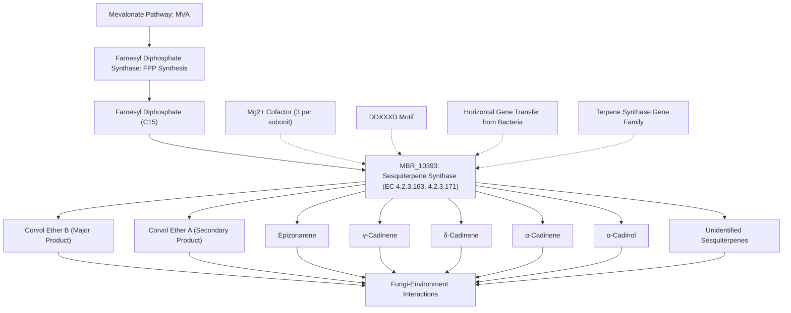

# Pathway Summary for MBR_10393 (A0A0B4FWC3)

## Overview

MBR_10393 encodes a sesquiterpene synthase that catalyzes the conversion of farnesyl diphosphate to multiple sesquiterpene products, primarily corvol ethers A and B [PMID:31239482, UniProt:A0A0B4FWC3]. This bacterial-origin enzyme was acquired through horizontal gene transfer and produces sesquiterpenes important for fungi-environment interactions [UniProt:A0A0B4FWC3]. The enzyme represents a key component of secondary metabolite biosynthesis pathways in the entomopathogenic fungus Metarhizium brunneum.

## Sesquiterpene Biosynthesis Pathway

MBR_10393 functions in the sesquiterpene branch of the terpenoid biosynthetic pathway, converting the C15 precursor farnesyl diphosphate (FPP) into diverse sesquiterpene products [PMID:31239482, UniProt:A0A0B4FWC3]. The enzyme produces a complex mixture of eight sesquiterpenes including corvol ether A, corvol ether B, epizonarene, γ-cadinene, δ-cadinene, α-cadinene, α-cadinol, and additional unidentified compounds [PMID:31239482]. These sesquiterpenes likely serve ecological functions in fungal communication, defense, or environmental adaptation processes [UniProt:A0A0B4FWC3].

## Horizontal Gene Transfer and Evolutionary Context

This sesquiterpene synthase represents a fascinating example of horizontal gene transfer from bacteria to fungi, contributing to terpenoid diversity in fungal secondary metabolism [PMID:31239482]. The acquisition of bacterial terpene synthase genes has expanded the metabolic capabilities of Metarhizium species, potentially providing adaptive advantages in their ecological niches as entomopathogenic fungi [PMID:25368161].

## Cofactor Requirements and Catalytic Mechanism

MBR_10393 requires 3 Mg²⁺ ions per subunit for catalytic activity, with specific binding sites at positions 91, 96, 230, 234, and 238 [UniProt:A0A0B4FWC3]. The enzyme contains a conserved DDXXXD motif (positions 91-96) that is essential for magnesium coordination and catalytic activity [UniProt:A0A0B4FWC3]. This structural organization is typical of terpene synthases and enables the complex cyclization reactions that generate sesquiterpene scaffolds from the linear FPP precursor.

## Secondary Metabolite Pathway Integration

Within the broader context of Metarhizium secondary metabolism, MBR_10393-produced sesquiterpenes likely integrate with other specialized metabolites to support the fungus's ecological functions. These compounds may work synergistically with other secondary metabolites such as the conidial pigments produced by the Pks1 gene cluster, contributing to a comprehensive chemical arsenal for environmental adaptation and pathogenicity.

## Sesquiterpene Biosynthesis Pathway Diagram

## Ecological and Biotechnological Significance

The diversity of sesquiterpene products generated by MBR_10393 highlights the enzymatic versatility that can arise from horizontal gene transfer events [PMID:31239482]. In the context of Metarhizium's lifestyle as an entomopathogenic fungus, these sesquiterpenes may play roles in host location, penetration, or immune evasion. From a biotechnological perspective, the enzyme's broad product spectrum makes it an interesting candidate for metabolic engineering applications aimed at producing valuable sesquiterpene compounds for pharmaceutical or industrial uses.