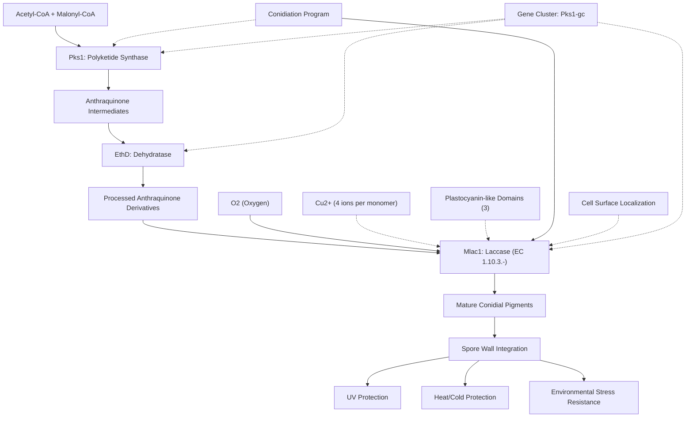

# Pathway Summary for Mlac1

## Overview

Mlac1 encodes a laccase enzyme that functions as a critical component of the Pks1 gene cluster involved in conidial pigment biosynthesis in Metarhizium brunneum [PMID:29958281]. This multicopper oxidase catalyzes the oxidation of anthraquinone derivatives produced by the upstream polyketide synthase Pks1 and dehydratase EthD, generating mature conidial pigments essential for environmental stress protection [PMID:29958281, UniProt:A0A0B4F5S2].

## Conidial Pigment Biosynthesis Pathway

Mlac1 operates downstream in a three-enzyme pathway that transforms simple building blocks into complex protective pigments. The pathway begins with the polyketide synthase Pks1 producing anthraquinone-derived intermediates from acetyl-CoA and malonyl-CoA precursors [PMID:29958281]. The dehydratase EthD then processes these intermediates before Mlac1 performs the final oxidative steps to generate mature conidial pigments [PMID:29958281]. These pigments are incorporated into spore walls during conidiation, providing crucial protection against UV radiation, heat, and cold stress [PMID:29958281].

## Multicopper Oxidase Function

Mlac1 belongs to the multicopper oxidase family and contains three plastocyanin-like domains typical of laccases [UniProt:A0A0B4F5S2]. The enzyme binds four copper ions per monomer, which are essential for its oxidoreductase activity [UniProt:A0A0B4F5S2]. As a laccase with broad substrate specificity, Mlac1 catalyzes the oxidation of phenolic substrates using oxygen as the electron acceptor, enabling the final maturation steps in pigment biosynthesis [UniProt:A0A0B4F5S2].

## Environmental Stress Protection

The conidial pigments produced through the Mlac1 pathway serve as critical protective compounds that enable Metarhizium spores to survive harsh environmental conditions. These pigments provide protection against UV radiation damage, temperature extremes, and other abiotic stresses encountered in the fungus's ecological niche [PMID:29958281]. This protection is essential for the survival and dispersal of Metarhizium conidia in outdoor environments where they encounter insect hosts.

## Developmental Regulation and Localization

Mlac1 is expressed specifically during conidiation as part of the coordinated biosynthetic program for spore maturation [PMID:29958281]. The enzyme localizes to the cell surface during conidiation, consistent with its role in processing pigment precursors for incorporation into the developing spore wall [UniProt:A0A0B4F5S2]. This localization ensures efficient conversion of anthraquinone precursors to mature pigments at the sites where they are needed for spore wall construction.

## Conidial Pigmentation Pathway Diagram

## Integration with Fungal Pathogenicity

The protective pigmentation provided by the Mlac1 pathway contributes to the ecological success of Metarhizium as an entomopathogenic fungus. Pigmented conidia can better survive environmental stresses during dispersal and host-seeking behavior, increasing the probability of successful infection events. This enhanced environmental fitness translates directly to improved biocontrol efficacy, making the Mlac1-mediated pigmentation pathway crucial for the fungus's role as a natural biological control agent.

## Evolutionary and Biotechnological Aspects

The Pks1 gene cluster containing Mlac1 represents an example of secondary metabolite pathway evolution in fungi, with gene duplication and diversification events contributing to environmental adaptation [PMID:29958281]. From a biotechnological perspective, understanding the Mlac1-mediated pigmentation pathway could inform efforts to optimize Metarhizium strains for improved environmental persistence in biocontrol applications. Additionally, the laccase activity of Mlac1 could potentially be exploited for biotechnological applications requiring multicopper oxidase activity for organic compound transformations.