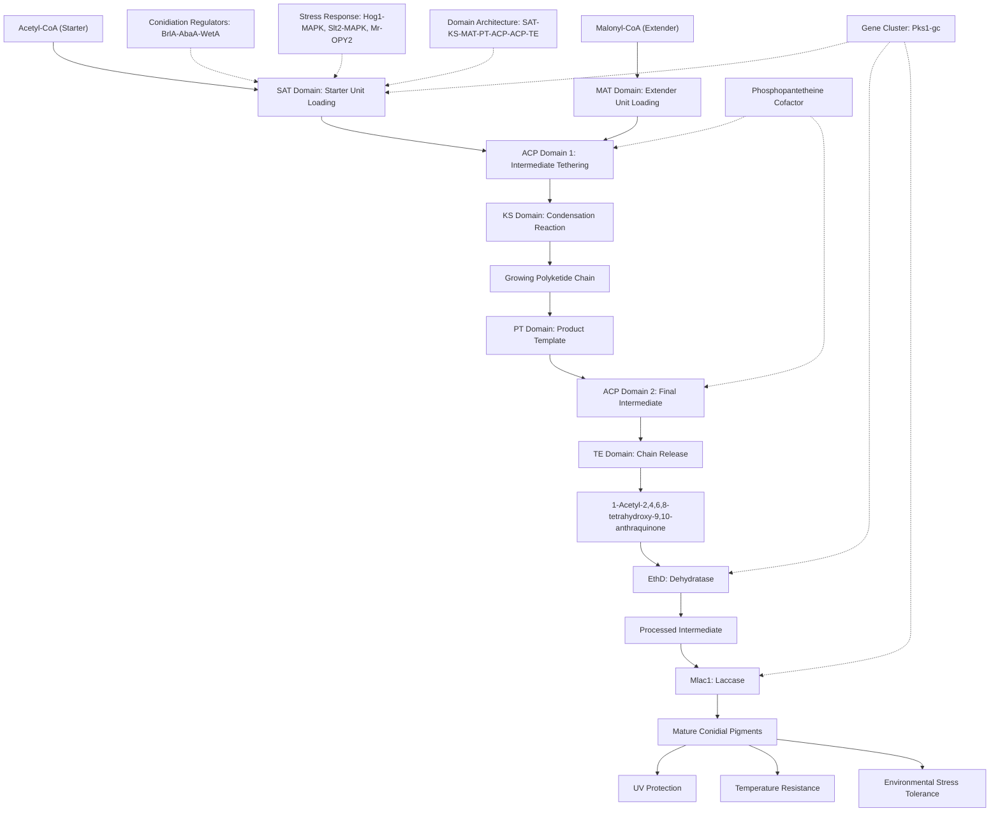

# Pathway Summary for Pks1

## Overview

Pks1 encodes a Type I non-reducing polyketide synthase that serves as the central enzyme in conidial pigment biosynthesis in Metarhizium brunneum [PMID:29958281, UniProtKB:A0A0B4ESU9]. This multidomain megasynthase produces anthraquinone-derived pigments essential for spore protection against environmental stresses including UV radiation and temperature extremes [PMID:29958281]. The enzyme operates within the Pks1 gene cluster alongside the dehydratase EthD and laccase Mlac1 to generate mature protective pigments during conidiation.

## Polyketide Biosynthesis Pathway

Pks1 catalyzes the iterative condensation of acetyl-CoA (starter unit) with multiple malonyl-CoA (extender units) to produce the anthraquinone backbone 1-acetyl-2,4,6,8-tetrahydroxy-9,10-anthraquinone [UniProtKB:A0A0B4ESU9, PMID:29958281]. The enzyme contains the complete Type I non-reducing PKS domain architecture including starter unit:ACP transacylase (SAT), ketosynthase (KS), malonyl-CoA:ACP transacylase (MAT), product template (PT) domain, dual acyl-carrier proteins (ACP), and thioesterase (TE) domains [UniProtKB:A0A0B4ESU9]. Each domain contributes specific catalytic activities that enable the controlled assembly of the polyketide product through multiple rounds of chain elongation and modification.

## Conidial Development and Stress Protection

Pks1 expression is tightly regulated during fungal development, with high expression levels specifically during conidiation when spore pigmentation occurs [PMID:29958281, UniProtKB:A0A0B4ESU9]. The enzyme is positively regulated by the conserved conidiation regulatory pathway containing BrlA, AbaA and WetA transcription factors [UniProtKB:A0A0B4ESU9]. Additionally, multiple stress-response pathways including Hog1-MAPK, Slt2-MAPK and Mr-OPY2 positively regulate Pks1 expression, linking pigment production to environmental stress sensing [PMID:29958281]. Loss of Pks1 function results in abnormal red conidia, demonstrating its essential role in normal pigment biosynthesis [PMID:29958281].

## Multi-Enzyme Pathway Coordination

The Pks1-produced anthraquinone intermediate serves as the substrate for downstream enzymes in the pigmentation pathway [UniProtKB:A0A0B4ESU9]. The dehydratase EthD and laccase Mlac1 further process the anthraquinone derivative to generate mature pigmented compounds [UniProtKB:A0A0B4ESU9]. This coordinated three-enzyme system ensures efficient conversion of simple precursors to complex protective molecules, with each enzyme contributing specialized chemical transformations to achieve the final pigmented products.

## Environmental Adaptation and Evolution

The Pks1 gene cluster represents an evolutionary adaptation that enhances fungal survival in diverse environmental conditions. Gene duplication and subsequent functional diversification of Pks gene clusters have increased the adaptive flexibility of Metarhizium species, enabling colonization of varied ecological niches [PMID:29958281]. The pigments produced by this pathway play crucial roles in fungal tolerance to UV radiation and extreme temperatures, providing fitness advantages in outdoor environments where Metarhizium encounters potential insect hosts.

## Polyketide Biosynthesis Pathway Diagram

## Biotechnological Applications and Engineering

The modular architecture of Pks1 makes it an attractive target for protein engineering approaches aimed at generating novel polyketide products. Domain swapping experiments between Pks1 and other fungal PKS enzymes could reveal substrate specificity determinants and enable the creation of variants with altered product profiles [PMID:29958281]. Understanding the precise mechanisms controlling iterative chain elongation cycles could inform synthetic biology efforts to produce valuable anthraquinone-derived compounds for pharmaceutical or industrial applications.

## Integration with Pathogenicity

While primarily studied for its role in stress protection, the pigmentation provided by Pks1 may also contribute to virulence in insect hosts. Pigmented conidia likely have enhanced survival during the infection process, potentially affecting adhesion, penetration, or immune recognition by host insects. The coordinated regulation of Pks1 with stress response pathways suggests that environmental stress sensing and pigment production are interconnected processes that support the fungus's pathogenic lifestyle and ecological success as a biocontrol agent.