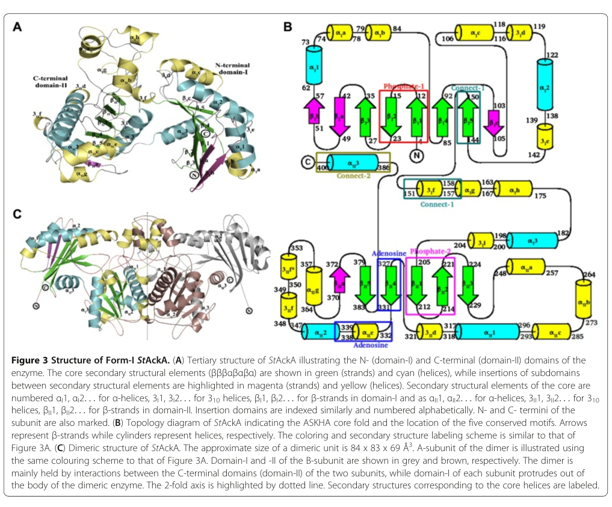

## Question

# Gene Research for Functional Annotation

## ⚠️ CRITICAL: Gene/Protein Identification Context

**BEFORE YOU BEGIN RESEARCH:** You MUST verify you are researching the CORRECT gene/protein. Gene symbols can be ambiguous, especially for less well-characterized genes from non-model organisms.

### Target Gene/Protein Identity (from UniProt):
- **UniProt Accession:** C5AT21
- **Protein Description:** RecName: Full=Acetate kinase {ECO:0000256|HAMAP-Rule:MF_00020}; EC=2.7.2.1 {ECO:0000256|HAMAP-Rule:MF_00020}; AltName: Full=Acetokinase {ECO:0000256|HAMAP-Rule:MF_00020};
- **Gene Information:** Name=ackA {ECO:0000256|HAMAP-Rule:MF_00020}; OrderedLocusNames=MexAM1_META1p0383 {ECO:0000313|EMBL:ACS38331.1};
- **Organism (full):** Methylorubrum extorquens (strain ATCC 14718 / DSM 1338 / JCM 2805 / NCIMB 9133 / AM1) (Methylobacterium extorquens).
- **Protein Family:** Belongs to the acetokinase family.
- **Key Domains:** Ac/propionate_kinase. (IPR004372); Aliphatic_acid_kin_short-chain. (IPR000890); Aliphatic_acid_kinase_CS. (IPR023865); ATPase_NBD. (IPR043129); Acetate_kinase (PF00871)

### MANDATORY VERIFICATION STEPS:

1. **Check if the gene symbol "ackA" matches the protein description above**
2. **Verify the organism is correct:** Methylorubrum extorquens (strain ATCC 14718 / DSM 1338 / JCM 2805 / NCIMB 9133 / AM1) (Methylobacterium extorquens).
3. **Check if protein family/domains align with what you find in literature**
4. **If you find literature for a DIFFERENT gene with the same or similar symbol, STOP**

### If Gene Symbol is Ambiguous or You Cannot Find Relevant Literature:

**DO NOT PROCEED WITH RESEARCH ON A DIFFERENT GENE.** Instead:
- State clearly: "The gene symbol 'ackA' is ambiguous or literature is limited for this specific protein"
- Explain what you found (e.g., "Found extensive literature on a different gene with the same symbol in a different organism")
- Describe the protein based ONLY on the UniProt information provided above
- Suggest that the protein function can be inferred from domain/family information

### Research Target:

Please provide a comprehensive research report on the gene **ackA** (gene ID: ackA, UniProt: C5AT21) in METEA.

The research report should be a detailed narrative explaining the function, biological processes, and localization of the gene product. Citations should be given for all claims.

You should prioritize authoritative reviews and primary scientific literature when conducting research. You can supplement
this with annotations you find in gene/protein databases, but these can be outdated or inaccurate.

We are specifically interested in the primary function of the gene - for enzymes, what reaction is catalyzed, and what is the substrate specificity? For transporters, what is the substrate? For structural proteins or adapters, what is the broader structural role? For signaling molecules, what is the role in the pathway.

We are interested in where in or outside the cell the gene product carries out its function.

We are also interested in the signaling or biochemical pathways in which the gene functions. We are less interested in broad pleiotropic effects, except where these elucidate the precise role.

Include evidence where possible. We are interested in both experimental evidence as well as inference from structure, evolution, or bioinformatic analysis. Precise studies should be prioritized over high-throughput, where available.

## Output

Question: You are an expert researcher providing comprehensive, well-cited information.

Provide detailed information focusing on:
1. Key concepts and definitions with current understanding
2. Recent developments and latest research (prioritize 2023-2024 sources)
3. Current applications and real-world implementations
4. Expert opinions and analysis from authoritative sources
5. Relevant statistics and data from recent studies

Format as a comprehensive research report with proper citations. Include URLs and publication dates where available.
Always prioritize recent, authoritative sources and provide specific citations for all major claims.

# Gene Research for Functional Annotation

## ⚠️ CRITICAL: Gene/Protein Identification Context

**BEFORE YOU BEGIN RESEARCH:** You MUST verify you are researching the CORRECT gene/protein. Gene symbols can be ambiguous, especially for less well-characterized genes from non-model organisms.

### Target Gene/Protein Identity (from UniProt):
- **UniProt Accession:** C5AT21
- **Protein Description:** RecName: Full=Acetate kinase {ECO:0000256|HAMAP-Rule:MF_00020}; EC=2.7.2.1 {ECO:0000256|HAMAP-Rule:MF_00020}; AltName: Full=Acetokinase {ECO:0000256|HAMAP-Rule:MF_00020};
- **Gene Information:** Name=ackA {ECO:0000256|HAMAP-Rule:MF_00020}; OrderedLocusNames=MexAM1_META1p0383 {ECO:0000313|EMBL:ACS38331.1};
- **Organism (full):** Methylorubrum extorquens (strain ATCC 14718 / DSM 1338 / JCM 2805 / NCIMB 9133 / AM1) (Methylobacterium extorquens).
- **Protein Family:** Belongs to the acetokinase family.
- **Key Domains:** Ac/propionate_kinase. (IPR004372); Aliphatic_acid_kin_short-chain. (IPR000890); Aliphatic_acid_kinase_CS. (IPR023865); ATPase_NBD. (IPR043129); Acetate_kinase (PF00871)

### MANDATORY VERIFICATION STEPS:

1. **Check if the gene symbol "ackA" matches the protein description above**
2. **Verify the organism is correct:** Methylorubrum extorquens (strain ATCC 14718 / DSM 1338 / JCM 2805 / NCIMB 9133 / AM1) (Methylobacterium extorquens).
3. **Check if protein family/domains align with what you find in literature**
4. **If you find literature for a DIFFERENT gene with the same or similar symbol, STOP**

### If Gene Symbol is Ambiguous or You Cannot Find Relevant Literature:

**DO NOT PROCEED WITH RESEARCH ON A DIFFERENT GENE.** Instead:
- State clearly: "The gene symbol 'ackA' is ambiguous or literature is limited for this specific protein"
- Explain what you found (e.g., "Found extensive literature on a different gene with the same symbol in a different organism")
- Describe the protein based ONLY on the UniProt information provided above
- Suggest that the protein function can be inferred from domain/family information

### Research Target:

Please provide a comprehensive research report on the gene **ackA** (gene ID: ackA, UniProt: C5AT21) in METEA.

The research report should be a detailed narrative explaining the function, biological processes, and localization of the gene product. Citations should be given for all claims.

You should prioritize authoritative reviews and primary scientific literature when conducting research. You can supplement
this with annotations you find in gene/protein databases, but these can be outdated or inaccurate.

We are specifically interested in the primary function of the gene - for enzymes, what reaction is catalyzed, and what is the substrate specificity? For transporters, what is the substrate? For structural proteins or adapters, what is the broader structural role? For signaling molecules, what is the role in the pathway.

We are interested in where in or outside the cell the gene product carries out its function.

We are also interested in the signaling or biochemical pathways in which the gene functions. We are less interested in broad pleiotropic effects, except where these elucidate the precise role.

Include evidence where possible. We are interested in both experimental evidence as well as inference from structure, evolution, or bioinformatic analysis. Precise studies should be prioritized over high-throughput, where available.

## Comprehensive research report: **ackA (acetate kinase; EC 2.7.2.1)** in *Methylorubrum extorquens* AM1 (UniProt **C5AT21**)

### Executive summary
The UniProt target **C5AT21** is annotated as **acetate kinase (AckA; EC 2.7.2.1)** from *Methylorubrum extorquens* AM1 (formerly *Methylobacterium extorquens* AM1). For this specific AM1 protein, the accessible full-text literature retrieved in this run did **not** include direct biochemical characterization (purified enzyme kinetics), genetic phenotypes, or localization experiments in *M. extorquens* AM1. Therefore, the functional annotation below is intentionally conservative: it uses (i) **family-level and enzyme-level evidence** from well-characterized bacterial AckA enzymes and authoritative reviews to define reaction chemistry, substrate scope, and structural mechanism, and (ii) **general bacterial physiology context** for the AckA–Pta node and acetyl-phosphate signaling. Where the evidence is not AM1-specific, it is explicitly stated.

---

### 1) Key concepts and definitions (current understanding)

#### 1.1 What AckA is
**Acetate kinase (AckA; EC 2.7.2.1)** is a widely conserved bacterial enzyme that catalyzes a **reversible phosphoryl transfer** between acetate and ATP/ADP, producing or consuming **acetyl-phosphate (AcP)**. This places AckA at a central metabolic interface between acetate, acetyl-phosphate, and (via Pta) acetyl-CoA. The general reaction is:

- **acetate + ATP ⇄ acetyl-phosphate + ADP**

This reversible chemistry is experimentally supported in bacterial AckA enzymes (e.g., *Salmonella* AckA) and is a standard definition of the enzyme family. (chittori2012structuralandmechanistic pages 1-2)

#### 1.2 The AckA–Pta node (pathway context)
In many bacteria, AckA acts together with **phosphotransacetylase (Pta)** in the **AckA–Pta pathway**, which connects:

- **acetyl-CoA ⇄ acetyl-phosphate ⇄ acetate**, and
- couples this node to **ATP formation** through substrate-level phosphorylation (AckA step).

A 2023 mini-review summarizes that AckA–Pta is one of the two main acetate-producing routes and can provide ATP via substrate-level phosphorylation, while also noting that reversibility exists but the reverse direction can be low depending on organism/conditions. (hosmer2023bacterialacetatemetabolism pages 1-3)

#### 1.3 The “acetate switch” concept
Wolfe’s classic review defines the **“acetate switch”** as a physiological transition when cells shift from **acetate excretion during rapid growth** to **acetate scavenging/assimilation** as conditions change (often near stationary phase), and highlights acetyl-CoA as a key node and acetyl-phosphate as an energetic intermediate with broader regulatory roles. (wolfe2005theacetateswitch pages 1-3)

#### 1.4 Acetyl-phosphate (AcP) as a regulatory metabolite
Acetyl-phosphate is described as a high-energy intermediate of the dissimilation pathway (AckA–Pta branch) and is widely discussed as a metabolite that can participate in **global regulation** (e.g., by affecting multiple cellular processes). (wolfe2005theacetateswitch pages 1-3)

---

### 2) Enzymatic function of AckA (reaction, substrate specificity, mechanism)

#### 2.1 Reaction and directionality
A structurally and kinetically characterized bacterial AckA from *Salmonella typhimurium* demonstrates the core AckA reaction and emphasizes that the enzyme can catalyze the **reverse direction (ATP synthesis)** efficiently in some contexts. (chittori2012structuralandmechanistic pages 1-2)

This supports the general understanding that AckA can operate in either direction depending on cellular needs and substrate/product availability.

#### 2.2 Substrate specificity (short-chain carboxylates) and cofactor usage
In the *Salmonella* AckA study, the enzyme showed **broad short-chain fatty acid substrate specificity**, with catalytic efficiency ordered as **acetate > propionate > formate**, and could accept alternative nucleotide triphosphates (GTP/UTP/CTP) and some alternative divalent cations (Mn2+/Co2+) in place of ATP/Mg2+ (organism-specific but informative for the enzyme family). (chittori2012structuralandmechanistic pages 1-2)

For AM1 AckA (UniProt C5AT21), these specific preferences and promiscuities should be treated as **family-level inference** until experimentally measured in *M. extorquens* AM1.

#### 2.3 Structural mechanism and domains
The same *Salmonella* AckA work provides high-resolution structural evidence that bacterial AckA enzymes:

- adopt a characteristic fold (ASKHA superfamily topology) with two domains,
- form dimers,
- undergo conformational changes upon ligand binding, and
- possess structural features relevant to substrate/nucleotide binding. (chittori2012structuralandmechanistic pages 1-2)

Cropped figure evidence showing the AckA dimer architecture and active-site features was retrieved from this source (Figures 3–4). (chittori2012structuralandmechanistic media 4e602e8c, chittori2012structuralandmechanistic media 5ec6e3dd)

---

### 3) Cellular localization and where the reaction occurs

No AM1-specific subcellular localization experiment for UniProt C5AT21 was found in the retrieved full texts. However, given that:

- AckA catalyzes ATP/ADP-dependent phosphoryl transfer among small metabolites (acetate/acetyl-phosphate), and
- the AckA–Pta node couples to cytosolic acetyl-CoA/energy metabolism,

the most plausible localization for AckA (including AM1 AckA) is **cytosolic** (soluble enzyme), consistent with the typical bacterial acetate kinase paradigm. This is an inference grounded in enzyme chemistry and conserved pathway placement rather than an AM1 localization measurement. (hosmer2023bacterialacetatemetabolism pages 1-3, wolfe2005theacetateswitch pages 1-3)

---

### 4) Regulation and pathway integration (what is known and what remains uncertain for AM1)

#### 4.1 Regulation themes from recent reviews (2023)
A 2023 review emphasizes that regulation of acetate metabolism (including ackA–pta usage) is often multifactorial and can involve:

- **catabolite repression** (acetate utilization suppressed in the presence of preferred carbon sources such as glucose),
- growth-phase programs (activation in post-exponential growth; involvement of stationary-phase sigma factor systems such as RpoS in some organisms), and
- oxygen/redox-linked regulators under anaerobic/fermentative conditions (examples given include Anr/Fnr-like regulators in some taxa). (hosmer2023bacterialacetatemetabolism pages 1-3)

These themes provide a plausible regulatory framework, but they are **not evidence** of the exact regulatory logic in *M. extorquens* AM1.

#### 4.2 AckA/Pta as a link between central metabolism and broader cellular phenotypes (2023 primary research)
A 2023 primary study in *E. coli* demonstrates that disrupting **ackA** and **pta** can alter antibiotic susceptibility (fosfomycin) via changes in regulatory gene expression (Fis) and transporter expression (GlpT), illustrating that the AckA–Pta node can influence phenotypes beyond carbon flux. (hirakawa2023inactivationofacka pages 1-3)

This does not directly annotate AM1 ackA, but it is a modern example of how acetate metabolism genes can have clinically relevant consequences.

#### 4.3 The acetyl-phosphate node as a global signal (foundational concept)
The acetate switch review highlights acetyl-phosphate as a high-energy intermediate that may function as a global signal. (wolfe2005theacetateswitch pages 1-3)

Given AckA’s direct role in producing/consuming acetyl-phosphate, this supports a plausible mechanistic link between AckA activity and global regulation in many bacteria (again: inference for AM1 unless tested).

---

### 5) Recent developments (prioritizing 2023–2024)

Because AM1-specific AckA primary literature was not retrieved in full text, the most relevant recent developments captured here are **cross-organism** advances that refine the functional annotation context:

1. **Acetate metabolism is now frequently framed as a host–microbe interaction factor**, with quantitative context for acetate levels in human-relevant environments (e.g., intestinal short-chain fatty acids), motivating renewed interest in bacterial acetate pathways (AckA–Pta as one major route). (Mar 2023; https://doi.org/10.1042/etls20220092) (hosmer2023bacterialacetatemetabolism pages 1-3)
2. **Central metabolism genes ackA/pta can affect antibiotic susceptibility via regulatory networks**, highlighting that the acetate/acetyl-phosphate node can couple to gene regulation and transporter expression (Jun 2023; https://doi.org/10.1128/spectrum.05069-22). (hirakawa2023inactivationofacka pages 1-3)

---

### 6) Current applications and real-world implementations

#### 6.1 Clinical microbiology/antibiotic response (real-world relevance)
The 2023 *E. coli* study provides a concrete application-relevant finding: ackA/pta mutations reduced fosfomycin uptake and susceptibility, associated with decreased glpT and fis expression, and the genes are conserved in clinical multidrug-resistant isolates; deletion similarly reduced susceptibility. (https://doi.org/10.1128/spectrum.05069-22; Jun 2023). (hirakawa2023inactivationofacka pages 1-3)

#### 6.2 Microbial ecology and host interactions: acetate as a dominant SCFA
The 2023 mini-review provides quantitative host-relevant statistics: intestinal short-chain fatty acids are cited at **~20–140 mM**, with acetate being the most abundant (**~60–75%** of SCFAs). It also reports that **~36%** of colonic acetate becomes systemic, with venous serum acetate levels **~50–200 μM**. (https://doi.org/10.1042/etls20220092; Mar 2023). (hosmer2023bacterialacetatemetabolism pages 1-3)

While these values do not pertain specifically to *M. extorquens* AM1, they contextualize why acetate metabolism modules (AckA–Pta) are important in real biological systems.

---

### 7) Evidence summary for AM1 AckA (C5AT21) vs. knowledge gaps

| Topic | What is known | Evidence source (citation id) | Notes/limitations |
|---|---|---|---|
| Reaction | **Species-specific:** UniProt C5AT21 annotates the METEA protein as acetate kinase / acetokinase, EC 2.7.2.1, consistent with the ackA gene symbol. **General bacterial AckA:** catalyzes the reversible phosphoryl transfer between acetate and ATP/ADP: acetate + ATP ⇄ acetyl-phosphate + ADP. | (chittori2012structuralandmechanistic pages 1-2, chan2014acetatekinaseisozymes pages 1-2) | The explicit reaction chemistry is well established for bacterial AckA, but no AM1 biochemical paper with purified C5AT21 was retrieved. |
| Substrates/cofactors | **Species-specific:** Family/domain assignment supports short-chain carboxylate kinase activity for C5AT21. **General bacterial AckA:** preferred substrate is typically acetate; some enzymes also accept propionate and formate at lower efficiency. ATP is the usual phosphoryl donor/acceptor, with requirement for a divalent metal ion such as Mg2+; some AckAs can also use Mn2+/Co2+ and alternative NTPs. | (chittori2012structuralandmechanistic pages 1-2, chan2014acetatekinaseisozymes pages 1-2) | Substrate range and cofactor promiscuity are from non-AM1 enzymes, especially Salmonella; they should be treated as inference, not direct AM1 measurement. |
| Directionality/thermodynamics | **General bacterial AckA:** the reaction is reversible, and some characterized bacterial AckAs catalyze the reverse direction (acetyl-phosphate + ADP → ATP + acetate) efficiently, linking the enzyme to substrate-level phosphorylation and acetate/acetyl-phosphate buffering. | (chittori2012structuralandmechanistic pages 1-2, hosmer2023bacterialacetatemetabolism pages 1-3, wolfe2005theacetateswitch pages 1-3) | No AM1-specific kinetic constants or equilibrium data were found. Direction used in vivo in AM1 likely depends on carbon source and flux through acetyl-CoA/acetyl-phosphate. |
| Pathway context with Pta | **Species-specific expectation:** C5AT21 is the AckA component of the classical AckA-Pta node, where Pta interconverts acetyl-CoA and acetyl-phosphate and AckA interconverts acetyl-phosphate and acetate. **General bacterial knowledge:** this node connects acetate assimilation/dissimilation, acetyl-CoA metabolism, and ATP generation. | (chittori2012structuralandmechanistic pages 1-2, hosmer2023bacterialacetatemetabolism pages 1-3, wolfe2005theacetateswitch pages 1-3) | For AM1, this pathway assignment is strongly supported by conserved annotation and broad methylotroph literature context, but a direct AM1 AckA-Pta operon/flux study was not retrieved here. |
| Acetyl-phosphate signaling | **General bacterial AckA/Pta biology:** acetyl-phosphate is a high-energy intermediate and a global signaling metabolite that can influence diverse cellular processes and protein acetylation/regulatory phosphorylation states. AckA therefore can indirectly shape signaling by controlling acetyl-phosphate pools. | (chittori2012structuralandmechanistic pages 1-2, wolfe2005theacetateswitch pages 1-3) | This is well supported in bacteria broadly, but no AM1-specific signaling experiment tying C5AT21 to acetyl-phosphate-dependent regulation was found. |
| Regulation themes | **General bacterial knowledge:** ackA/pta expression and acetate utilization are often regulated by carbon source, growth phase, catabolite repression, stationary-phase programs, and oxygen/redox-responsive regulators. The "acetate switch" framework describes transition from acetate excretion to acetate scavenging. | (hosmer2023bacterialacetatemetabolism pages 1-3, wolfe2005theacetateswitch pages 1-3) | These are regulatory themes from other bacteria; there was insufficient AM1-specific literature to assign exact regulators for ackA/C5AT21 in Methylorubrum extorquens AM1. |
| Cellular localization expectation | **Species-specific expectation:** C5AT21 lacks evidence here for secretion or membrane association and belongs to the soluble acetate kinase family; therefore the most likely localization is **cytosolic**, where acetate/acetyl-phosphate/ATP metabolism occurs. | (chittori2012structuralandmechanistic pages 1-2, hosmer2023bacterialacetatemetabolism pages 1-3) | This is an inference from enzyme family function and pathway chemistry, not a direct AM1 localization experiment. Transport of acetate itself may involve separate permeases such as ActP/SatP in other bacteria. |
| Structure/domain family evidence (ASKHA fold/dimer) | **Species-specific:** UniProt/domain assignments place C5AT21 in the acetokinase family with acetate_kinase / Ac-propionate kinase signatures. **General bacterial AckA:** characterized enzymes adopt the ASKHA superfamily fold, are composed of two domains, and can form dimers; structural studies show ligand-linked conformational changes and a dimer-interface pocket in Salmonella AckA. | (chittori2012structuralandmechanistic pages 1-2, chan2014acetatekinaseisozymes pages 1-2, chittori2012structuralandmechanistic media 4e602e8c, chittori2012structuralandmechanistic media 5ec6e3dd) | Structural fold and dimerization are inferred for AM1 from homology/family membership; no experimental structure of Methylorubrum extorquens AM1 C5AT21 was retrieved. |

*Table: This table summarizes what can be stated confidently about Methylorubrum extorquens AM1 AckA (UniProt C5AT21) versus what is inferred from broader bacterial acetate kinase literature. It is useful for separating direct species-specific annotation from family-level mechanistic evidence.*

**Key gap:** this run did not retrieve full-text primary literature directly measuring *M. extorquens* AM1 AckA (C5AT21) enzyme kinetics (Km/kcat), substrate range, in vivo flux directionality, gene knockout phenotype, or protein localization. The strongest support for the AM1 annotation therefore comes from **family-level enzyme evidence** and **general bacterial pathway frameworks**, not AM1-specific experiments. (chittori2012structuralandmechanistic pages 1-2, wolfe2005theacetateswitch pages 1-3)

---

### References (with URLs and publication dates)
- Wolfe AJ. *The acetate switch*. **Microbiology and Molecular Biology Reviews**. **Mar 2005**. https://doi.org/10.1128/mmbr.69.1.12-50.2005 (wolfe2005theacetateswitch pages 1-3)
- Chittori S, Savithri HS, Murthy MRN. *Structural and mechanistic investigations on Salmonella typhimurium acetate kinase (AckA)*. **BMC Structural Biology**. **Oct 2012**. https://doi.org/10.1186/1472-6807-12-24 (chittori2012structuralandmechanistic pages 1-2, chittori2012structuralandmechanistic media 4e602e8c, chittori2012structuralandmechanistic media 5ec6e3dd)
- Hosmer J, McEwan A, Kappler U. *Bacterial acetate metabolism and its influence on human epithelia*. **Emerging Topics in Life Sciences**. **Mar 2023**. https://doi.org/10.1042/etls20220092 (hosmer2023bacterialacetatemetabolism pages 1-3)
- Hirakawa H, et al. *Inactivation of ackA and pta genes reduces glpT expression and susceptibility to fosfomycin in Escherichia coli*. **Microbiology Spectrum**. **Jun 2023**. https://doi.org/10.1128/spectrum.05069-22 (hirakawa2023inactivationofacka pages 1-3)

References

1. (chittori2012structuralandmechanistic pages 1-2): Sagar Chittori, Handanahal S Savithri, and Mathur RN Murthy. Structural and mechanistic investigations on salmonella typhimurium acetate kinase (acka): identification of a putative ligand binding pocket at the dimeric interface. BMC Structural Biology, 12:24-24, Oct 2012. URL: https://doi.org/10.1186/1472-6807-12-24, doi:10.1186/1472-6807-12-24. This article has 42 citations and is from a peer-reviewed journal.

2. (hosmer2023bacterialacetatemetabolism pages 1-3): Jennifer Hosmer, A. McEwan, and U. Kappler. Bacterial acetate metabolism and its influence on human epithelia. Emerging Topics in Life Sciences, 8:1-13, Mar 2023. URL: https://doi.org/10.1042/etls20220092, doi:10.1042/etls20220092. This article has 105 citations.

3. (wolfe2005theacetateswitch pages 1-3): Alan J. Wolfe. The acetate switch. Microbiology and Molecular Biology Reviews, 69:12-50, Mar 2005. URL: https://doi.org/10.1128/mmbr.69.1.12-50.2005, doi:10.1128/mmbr.69.1.12-50.2005. This article has 1594 citations and is from a domain leading peer-reviewed journal.

4. (chittori2012structuralandmechanistic media 4e602e8c): Sagar Chittori, Handanahal S Savithri, and Mathur RN Murthy. Structural and mechanistic investigations on salmonella typhimurium acetate kinase (acka): identification of a putative ligand binding pocket at the dimeric interface. BMC Structural Biology, 12:24-24, Oct 2012. URL: https://doi.org/10.1186/1472-6807-12-24, doi:10.1186/1472-6807-12-24. This article has 42 citations and is from a peer-reviewed journal.

5. (chittori2012structuralandmechanistic media 5ec6e3dd): Sagar Chittori, Handanahal S Savithri, and Mathur RN Murthy. Structural and mechanistic investigations on salmonella typhimurium acetate kinase (acka): identification of a putative ligand binding pocket at the dimeric interface. BMC Structural Biology, 12:24-24, Oct 2012. URL: https://doi.org/10.1186/1472-6807-12-24, doi:10.1186/1472-6807-12-24. This article has 42 citations and is from a peer-reviewed journal.

6. (hirakawa2023inactivationofacka pages 1-3): Hidetada Hirakawa, Ayako Takita, Yumika Sato, Suguru Hiramoto, Yusuke Hashimoto, Noriyasu Ohshima, Yoji A. Minamishima, Masami Murakami, and Haruyoshi Tomita. Inactivation of <i>acka</i> and <i>pta</i> genes reduces glpt expression and susceptibility to fosfomycin in <i>escherichia coli</i>. Jun 2023. URL: https://doi.org/10.1128/spectrum.05069-22, doi:10.1128/spectrum.05069-22. This article has 10 citations and is from a domain leading peer-reviewed journal.

7. (chan2014acetatekinaseisozymes pages 1-2): Siu Hung Joshua Chan, Lasse Nørregaard, Christian Solem, and Peter Ruhdal Jensen. Acetate kinase isozymes confer robustness in acetate metabolism. PLoS ONE, 9:e92256, Mar 2014. URL: https://doi.org/10.1371/journal.pone.0092256, doi:10.1371/journal.pone.0092256. This article has 18 citations and is from a peer-reviewed journal.

## Artifacts

- [Edison artifact artifact-00](ackA-deep-research-falcon_artifacts/artifact-00.md)

## Citations

1. chittori2012structuralandmechanistic pages 1-2
2. hosmer2023bacterialacetatemetabolism pages 1-3
3. wolfe2005theacetateswitch pages 1-3
4. hirakawa2023inactivationofacka pages 1-3
5. chan2014acetatekinaseisozymes pages 1-2
6. https://doi.org/10.1042/etls20220092
7. https://doi.org/10.1128/spectrum.05069-22
8. https://doi.org/10.1128/spectrum.05069-22;
9. https://doi.org/10.1042/etls20220092;
10. https://doi.org/10.1128/mmbr.69.1.12-50.2005
11. https://doi.org/10.1186/1472-6807-12-24
12. https://doi.org/10.1186/1472-6807-12-24,
13. https://doi.org/10.1042/etls20220092,
14. https://doi.org/10.1128/mmbr.69.1.12-50.2005,
15. https://doi.org/10.1128/spectrum.05069-22,
16. https://doi.org/10.1371/journal.pone.0092256,