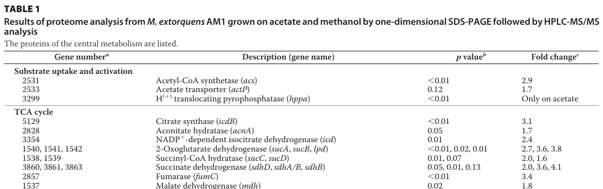

## Question

# Gene Research for Functional Annotation

## ⚠️ CRITICAL: Gene/Protein Identification Context

**BEFORE YOU BEGIN RESEARCH:** You MUST verify you are researching the CORRECT gene/protein. Gene symbols can be ambiguous, especially for less well-characterized genes from non-model organisms.

### Target Gene/Protein Identity (from UniProt):
- **UniProt Accession:** C5ATQ7
- **Protein Description:** RecName: Full=Aconitate hydratase {ECO:0000256|RuleBase:RU361275}; Short=Aconitase {ECO:0000256|RuleBase:RU361275}; EC=4.2.1.3 {ECO:0000256|RuleBase:RU361275};
- **Gene Information:** Name=acnA {ECO:0000313|EMBL:ACS40581.1}; OrderedLocusNames=MexAM1_META1p2828 {ECO:0000313|EMBL:ACS40581.1};
- **Organism (full):** Methylorubrum extorquens (strain ATCC 14718 / DSM 1338 / JCM 2805 / NCIMB 9133 / AM1) (Methylobacterium extorquens).
- **Protein Family:** Belongs to the aconitase/IPM isomerase family.
- **Key Domains:** AcnA_IRP_Swivel. (IPR044137); Acnase/IPM_dHydase_lsu_aba_1/3. (IPR015931); Acoase/IPM_deHydtase_lsu_aba. (IPR001030); Aconitase/3IPM_dehydase_swvl. (IPR015928); Aconitase/IRP2. (IPR006249)

### MANDATORY VERIFICATION STEPS:

1. **Check if the gene symbol "acnA" matches the protein description above**
2. **Verify the organism is correct:** Methylorubrum extorquens (strain ATCC 14718 / DSM 1338 / JCM 2805 / NCIMB 9133 / AM1) (Methylobacterium extorquens).
3. **Check if protein family/domains align with what you find in literature**
4. **If you find literature for a DIFFERENT gene with the same or similar symbol, STOP**

### If Gene Symbol is Ambiguous or You Cannot Find Relevant Literature:

**DO NOT PROCEED WITH RESEARCH ON A DIFFERENT GENE.** Instead:
- State clearly: "The gene symbol 'acnA' is ambiguous or literature is limited for this specific protein"
- Explain what you found (e.g., "Found extensive literature on a different gene with the same symbol in a different organism")
- Describe the protein based ONLY on the UniProt information provided above
- Suggest that the protein function can be inferred from domain/family information

### Research Target:

Please provide a comprehensive research report on the gene **acnA** (gene ID: acnA, UniProt: C5ATQ7) in METEA.

The research report should be a detailed narrative explaining the function, biological processes, and localization of the gene product. Citations should be given for all claims.

You should prioritize authoritative reviews and primary scientific literature when conducting research. You can supplement
this with annotations you find in gene/protein databases, but these can be outdated or inaccurate.

We are specifically interested in the primary function of the gene - for enzymes, what reaction is catalyzed, and what is the substrate specificity? For transporters, what is the substrate? For structural proteins or adapters, what is the broader structural role? For signaling molecules, what is the role in the pathway.

We are interested in where in or outside the cell the gene product carries out its function.

We are also interested in the signaling or biochemical pathways in which the gene functions. We are less interested in broad pleiotropic effects, except where these elucidate the precise role.

Include evidence where possible. We are interested in both experimental evidence as well as inference from structure, evolution, or bioinformatic analysis. Precise studies should be prioritized over high-throughput, where available.

## Output

Question: You are an expert researcher providing comprehensive, well-cited information.

Provide detailed information focusing on:
1. Key concepts and definitions with current understanding
2. Recent developments and latest research (prioritize 2023-2024 sources)
3. Current applications and real-world implementations
4. Expert opinions and analysis from authoritative sources
5. Relevant statistics and data from recent studies

Format as a comprehensive research report with proper citations. Include URLs and publication dates where available.
Always prioritize recent, authoritative sources and provide specific citations for all major claims.

# Gene Research for Functional Annotation

## ⚠️ CRITICAL: Gene/Protein Identification Context

**BEFORE YOU BEGIN RESEARCH:** You MUST verify you are researching the CORRECT gene/protein. Gene symbols can be ambiguous, especially for less well-characterized genes from non-model organisms.

### Target Gene/Protein Identity (from UniProt):
- **UniProt Accession:** C5ATQ7
- **Protein Description:** RecName: Full=Aconitate hydratase {ECO:0000256|RuleBase:RU361275}; Short=Aconitase {ECO:0000256|RuleBase:RU361275}; EC=4.2.1.3 {ECO:0000256|RuleBase:RU361275};
- **Gene Information:** Name=acnA {ECO:0000313|EMBL:ACS40581.1}; OrderedLocusNames=MexAM1_META1p2828 {ECO:0000313|EMBL:ACS40581.1};
- **Organism (full):** Methylorubrum extorquens (strain ATCC 14718 / DSM 1338 / JCM 2805 / NCIMB 9133 / AM1) (Methylobacterium extorquens).
- **Protein Family:** Belongs to the aconitase/IPM isomerase family.
- **Key Domains:** AcnA_IRP_Swivel. (IPR044137); Acnase/IPM_dHydase_lsu_aba_1/3. (IPR015931); Acoase/IPM_deHydtase_lsu_aba. (IPR001030); Aconitase/3IPM_dehydase_swvl. (IPR015928); Aconitase/IRP2. (IPR006249)

### MANDATORY VERIFICATION STEPS:

1. **Check if the gene symbol "acnA" matches the protein description above**
2. **Verify the organism is correct:** Methylorubrum extorquens (strain ATCC 14718 / DSM 1338 / JCM 2805 / NCIMB 9133 / AM1) (Methylobacterium extorquens).
3. **Check if protein family/domains align with what you find in literature**
4. **If you find literature for a DIFFERENT gene with the same or similar symbol, STOP**

### If Gene Symbol is Ambiguous or You Cannot Find Relevant Literature:

**DO NOT PROCEED WITH RESEARCH ON A DIFFERENT GENE.** Instead:
- State clearly: "The gene symbol 'acnA' is ambiguous or literature is limited for this specific protein"
- Explain what you found (e.g., "Found extensive literature on a different gene with the same symbol in a different organism")
- Describe the protein based ONLY on the UniProt information provided above
- Suggest that the protein function can be inferred from domain/family information

### Research Target:

Please provide a comprehensive research report on the gene **acnA** (gene ID: acnA, UniProt: C5ATQ7) in METEA.

The research report should be a detailed narrative explaining the function, biological processes, and localization of the gene product. Citations should be given for all claims.

You should prioritize authoritative reviews and primary scientific literature when conducting research. You can supplement
this with annotations you find in gene/protein databases, but these can be outdated or inaccurate.

We are specifically interested in the primary function of the gene - for enzymes, what reaction is catalyzed, and what is the substrate specificity? For transporters, what is the substrate? For structural proteins or adapters, what is the broader structural role? For signaling molecules, what is the role in the pathway.

We are interested in where in or outside the cell the gene product carries out its function.

We are also interested in the signaling or biochemical pathways in which the gene functions. We are less interested in broad pleiotropic effects, except where these elucidate the precise role.

Include evidence where possible. We are interested in both experimental evidence as well as inference from structure, evolution, or bioinformatic analysis. Precise studies should be prioritized over high-throughput, where available.

# Research report: **acnA** (UniProt **C5ATQ7**) in *Methylorubrum extorquens* AM1

## 1. Target verification (critical disambiguation)

### 1.1. Correct gene/protein being researched
The UniProt target (C5ATQ7) is annotated as **aconitate hydratase (aconitase), EC 4.2.1.3**, encoded by **acnA**, and belonging to the aconitase/IPM isomerase family (per user-provided UniProt context). Independent organism-specific literature for *M. extorquens* AM1 maps **acnA** to **gene identifier 2828**, matching UniProt’s ordered locus name **MexAM1_META1p2828**, supporting that the correct protein is being discussed and not a different organism’s “acnA”. (schneider2012theethylmalonylcoapathway pages 4-4)

In a comparative proteomics dataset for *M. extorquens* AM1 grown on acetate versus methanol, aconitate hydratase is explicitly labeled **“acnA”** and placed in the TCA-cycle section with gene number **2828**. (schneider2012theethylmalonylcoapathway media 343bffe8)

### 1.2. Nomenclature and ambiguity note
The symbol **acnA** is widely used in bacteria for aconitase A (and some organisms also encode acnB/other aconitases). Therefore, all organism-specific claims below are restricted to sources explicitly studying *Methylorubrum/Methylobacterium extorquens* AM1. Broader mechanistic statements about aconitase regulation under iron/oxidative stress are treated as **conserved bacterial biology** rather than AM1-specific unless directly measured in AM1. (barrault2024staphylococcalaconitaseexpression pages 12-14, barrault2024staphylococcalaconitaseexpression pages 14-17)

## 2. Key concepts and definitions (current understanding)

### 2.1. Enzymatic function and reaction
Aconitase (EC **4.2.1.3**) is a tricarboxylic acid (TCA) cycle enzyme that catalyzes the **isomerization of citrate to isocitrate**, proceeding through the aconitate/cis‑aconitate intermediate (often described as citrate ↔ cis‑aconitate ↔ isocitrate). This catalytic role is explicitly described in recent bacterial aconitase literature, and *M. extorquens* AM1 acnA is assigned as the canonical aconitate hydratase in central metabolism. (barrault2024staphylococcalaconitaseexpression pages 1-3, schneider2012theethylmalonylcoapathway pages 4-4)

### 2.2. Cofactor dependence and Fe–S cluster biology
Modern work emphasizes that bacterial aconitases are **iron–sulfur (Fe–S) proteins** whose catalytic activity depends on a **[4Fe-4S] cluster**. Under oxidative stress or iron limitation, the cluster can be disrupted/oxidized (e.g., conversion to an inactive **[3Fe-4S]** form or cluster loss), inactivating enzymatic activity and altering aconitase’s cellular role. Although this has not been directly demonstrated for AM1 AcnA in the retrieved AM1-specific papers, it is strongly expected for AM1 AcnA given its aconitase family assignment and the conserved mechanism across bacteria. (barrault2024staphylococcalaconitaseexpression pages 12-14, barrault2024staphylococcalaconitaseexpression pages 14-17)

### 2.3. “Moonlighting” aconitase: enzyme-to-RNA-binding switch
A major recent development in aconitase biology is the increasingly detailed evidence that **apo‑aconitase** (clusterless/inactive form) can function as an **RNA-binding protein (RBP)**, regulating transcripts involved in iron metabolism and central metabolism. A 2024 study in *Staphylococcus aureus* describes aconitase as an RBP under iron starvation, with separable mutations that eliminate enzymatic function while preserving RNA binding (and vice versa), supporting a mechanistic “switch” governed by Fe–S cluster state. This is not direct evidence for AM1 AcnA, but it is relevant expert context for how bacterial aconitases can couple metabolism to iron status. (barrault2024staphylococcalaconitaseexpression pages 10-12, barrault2024staphylococcalaconitaseexpression pages 14-17)

### 2.4. Cellular localization
In bacteria, TCA-cycle aconitases are generally **cytosolic** enzymes. No AM1-specific subcellular localization experiment for AcnA was found in the retrieved evidence; thus localization is inferred from its role as a soluble TCA enzyme and from conserved bacterial aconitase biology. (schneider2012theethylmalonylcoapathway pages 4-4, barrault2024staphylococcalaconitaseexpression pages 1-3)

## 3. Organism-specific functional evidence in *Methylorubrum extorquens* AM1

### 3.1. Role in central metabolism (TCA cycle during acetate growth)
A detailed acetate-growth study of *M. extorquens* AM1 (which lacks the canonical glyoxylate shunt) showed that acetate assimilation involves the **ethylmalonyl‑CoA (EMC) pathway** and continued operation of the **TCA cycle**. In that work, comparative proteomics detected TCA-cycle proteins including **aconitate hydratase (AcnA)**. (schneider2012theethylmalonylcoapathway pages 4-5)

Quantitatively, AcnA (acnA; gene 2828) was reported as **1.7-fold more abundant** on **acetate** than on **methanol** (p = 0.05). (schneider2012theethylmalonylcoapathway pages 4-4, schneider2012theethylmalonylcoapathway media 343bffe8)

### 3.2. Dynamic metabolic transitions (succinate → methanol shift)
A multi-omics systems study examining the transition from **succinate** (multi-carbon) to **methanol** (single-carbon) growth in *M. extorquens* AM1 measured enzyme activities for selected central metabolic enzymes.

Aconitase activity was the **only measured enzyme** that showed a statistically significant decrease, dropping by **48%** during the transition. Other measured TCA enzymes were closer to their starting activities (reported as isocitrate dehydrogenase ~79%, succinate dehydrogenase ~82%, malate dehydrogenase ~74% of starting activity). This supports the interpretation that AM1 remodels TCA-cycle capacity/operation during methylotrophic adaptation, with aconitase being a particularly responsive control point among those assayed. (skovran2010asystemsbiology pages 7-8)

### 3.3. Gaps in AM1-specific knowledge
From the retrieved AM1-focused literature, **direct biochemical parameters** for AM1 AcnA (e.g., Km, kcat, substrate specificity differences vs other bacterial aconitases), **genetic essentiality/fitness**, and **acnA knockout phenotypes** were not found. Therefore, catalytic mechanism and cofactor dependence are described using conserved bacterial aconitase evidence, while AM1-specific conclusions are limited to expression/abundance/activity changes and pathway context. (skovran2010asystemsbiology pages 7-8, schneider2012theethylmalonylcoapathway pages 4-4)

## 4. Recent developments (2023–2024) relevant to functional annotation

### 4.1. Iron-starvation circuits controlling aconitase expression and function (2024)
A 2024 *Nucleic Acids Research* study of *S. aureus* provides a current mechanistic model in which aconitase expression is tightly controlled under iron limitation by an sRNA (IsrR) and a transcription factor (CcpE), forming a feedforward loop that prevents paradoxical citrate-driven reactivation of aconitase during iron starvation. The same work supports that apo‑aconitase can regulate TCA-associated transcripts as an RBP. These studies strengthen the modern view that aconitases can couple Fe–S availability to carbon flux control and post-transcriptional regulation, which may be relevant when interpreting AM1 physiology under iron/oxidative stress even though AM1-specific RBP behavior has not yet been demonstrated in the retrieved corpus. (barrault2024staphylococcalaconitaseexpression pages 12-14, barrault2024staphylococcalaconitaseexpression pages 14-17)

### 4.2. Renewed attention to metabolic enzyme moonlighting and Fe–S proteome identification (2024)
A 2024 Metallomics review highlights longstanding and continuing evidence for **mRNA binding and post-transcriptional regulation by bacterial aconitases** (notably in *E. coli*) and uses aconitase as a key example of how Fe–S chemistry can regulate protein function switching and complicate Fe–S protein identification. This provides authoritative context for interpreting aconitase as both a metabolic enzyme and a potential regulatory hub. (vallieres2024ironsulfurproteinodyssey pages 13-14)

## 5. Applications and real-world implementations linked to AcnA chemistry

### 5.1. Biotechnological diversion of the aconitase intermediate: itaconic acid production in AM1
A direct real-world implementation that hinges on aconitase chemistry is **engineering *M. extorquens* AM1 to produce itaconic acid (ITA)** by expressing **cis‑aconitic acid decarboxylase**, which converts **cis‑aconitate** (the aconitase intermediate between citrate and isocitrate) into itaconate.

Reported performance metrics include:
- **Batch culture on methanol:** highest titer **31.6 ± 5.5 mg/L ITA**.
- **Fed-batch bioreactor (60% dissolved oxygen saturation):** titer **5.4 ± 0.2 mg/L ITA** with productivity **0.056 ± 0.002 mg/L/h**.

This establishes that AM1 can be used as a methylotrophic platform to access TCA-derived chemicals by tapping the aconitase-adjacent metabolite cis‑aconitate. (lim2019designingandengineering pages 1-2)

## 6. Expert synthesis and analysis (authoritative interpretation)

### 6.1. Best-supported primary function in AM1
The strongest AM1-specific evidence supports that **acnA encodes the canonical TCA-cycle aconitase** (aconitate hydratase) participating in central carbon metabolism, with measurable changes in abundance/activity depending on carbon source and growth transitions. The AM1 literature maps this acnA to gene/locus 2828 (MexAM1_META1p2828), supporting identity and function assignment consistent with UniProt C5ATQ7. (schneider2012theethylmalonylcoapathway pages 4-4, skovran2010asystemsbiology pages 7-8)

### 6.2. Likely physiological roles in AM1 beyond “textbook TCA”
The AM1 systems study indicates that aconitase activity is unusually responsive during the shift to methylotrophy (48% decrease), suggesting that the citrate/isocitrate node can be a point of metabolic “throttling” during network reset. In AM1, where methylotrophic assimilation involves large cyclic pathway topologies (serine cycle and EMC pathway) interfacing with the TCA cycle, tuning aconitase may help balance redox and precursor supply during substrate switches. This inference is consistent with observed enzyme-level regulation, though identifying the mechanistic regulator(s) in AM1 remains an open question. (skovran2010asystemsbiology pages 7-8, schneider2012theethylmalonylcoapathway pages 4-5)

### 6.3. Cautionary extrapolation: iron/oxidative stress regulation
Recent bacterial work argues that aconitase is not only a Fe–S enzyme vulnerable to oxidation/iron limitation but also a post-transcriptional regulator in its apo-form. For AM1, these mechanisms should be considered plausible hypotheses—particularly because methylotrophs can experience redox stress during C1 metabolism—but cannot be claimed as established without AM1-specific validation. (barrault2024staphylococcalaconitaseexpression pages 12-14, barrault2024staphylococcalaconitaseexpression pages 14-17)

## 7. Key statistics and data (from recent and organism-specific studies)

- **Protein abundance change (AM1, acetate vs methanol):** AcnA (acnA; gene 2828) **1.7× higher on acetate**, **p = 0.05**. (schneider2012theethylmalonylcoapathway pages 4-4, schneider2012theethylmalonylcoapathway media 343bffe8)
- **Enzyme activity change (AM1, succinate→methanol shift):** aconitase activity **decreased by 48%** during transition. (skovran2010asystemsbiology pages 7-8)
- **Industrial/bioprocess metric (AM1 itaconate from methanol):** batch **31.6 ± 5.5 mg/L**; fed-batch (60% DO) **5.4 ± 0.2 mg/L**, productivity **0.056 ± 0.002 mg/L/h**. (lim2019designingandengineering pages 1-2)

## 8. Consolidated functional annotation table

The following table consolidates AM1-specific evidence with current (2024) mechanistic context for bacterial aconitase.

| Aspect | Annotation/claim | Evidence type | Quantitative data | Key source (with year) |
|---|---|---|---|---|
| Identity mapping | UniProt C5ATQ7 corresponds to **acnA**, encoding aconitate hydratase/aconitase in *Methylorubrum extorquens* AM1; AM1 proteomics maps **acnA** to **gene 2828**, consistent with ordered locus **MexAM1_META1p2828**. | Organism-specific comparative proteomics/table annotation | Gene **2828**; acetate/methanol fold change **1.7**; **p = 0.05** (schneider2012theethylmalonylcoapathway pages 4-4, schneider2012theethylmalonylcoapathway media 343bffe8) | Schneider et al., 2012 (schneider2012theethylmalonylcoapathway pages 4-4, schneider2012theethylmalonylcoapathway media 343bffe8) |
| Enzymatic reaction | AcnA is the canonical **aconitase (EC 4.2.1.3)** of central carbon metabolism, catalyzing the reversible citrate ↔ isocitrate isomerization via aconitate/cis-aconitate intermediate. | General aconitase literature; organism-specific assignment as aconitate hydratase | No AM1-specific kinetic constants found in retrieved evidence (barrault2024staphylococcalaconitaseexpression pages 1-3) | General bacterial aconitase evidence summarized in Barrault et al., 2024; AM1 assignment in Schneider et al., 2012 (barrault2024staphylococcalaconitaseexpression pages 1-3, schneider2012theethylmalonylcoapathway pages 4-4) |
| Cofactor / Fe-S dependence | Bacterial aconitases require a **[4Fe-4S]** cluster for catalytic activity; iron limitation or oxidative stress can convert/inactivate the cluster, yielding apo- or [3Fe-4S] forms with loss of enzymatic activity. This is strongly inferred for AM1 AcnA from conserved family/domain assignment. | General bacterial aconitase / Fe-S literature | [4Fe-4S] catalytic state; oxidation can yield inactive **[3Fe-4S]** form (barrault2024staphylococcalaconitaseexpression pages 12-14, barrault2024staphylococcalaconitaseexpression pages 14-17) | Barrault et al., 2024; Vallières et al., 2024 (barrault2024staphylococcalaconitaseexpression pages 12-14, barrault2024staphylococcalaconitaseexpression pages 14-17, vallieres2024ironsulfurproteinodyssey pages 13-14) |
| Pathway role during acetate growth | In AM1, AcnA is part of the **TCA cycle** operating alongside the EMC pathway during acetate assimilation/oxidation; proteomics detected all TCA enzymes, with aconitate hydratase present and modestly increased on acetate versus methanol. | Organism-specific proteomics plus ^13C-based metabolic pathway study | AcnA protein abundance **1.7-fold higher on acetate**; **p = 0.05** (schneider2012theethylmalonylcoapathway pages 4-4, schneider2012theethylmalonylcoapathway media 343bffe8) | Schneider et al., 2012 (schneider2012theethylmalonylcoapathway pages 4-4, schneider2012theethylmalonylcoapathway pages 4-5, schneider2012theethylmalonylcoapathway media 343bffe8) |
| Pathway role during succinate→methanol transition | During transition from multicarbon to single-carbon growth, AM1 aconitase activity declines, indicating remodeling/downshifting of TCA-cycle operation while central metabolites remain comparatively stable. | Organism-specific enzyme activity assay in systems study | Aconitase activity showed a **48% decrease** during the shift; other measured enzymes were **74–82%** of starting activity (skovran2010asystemsbiology pages 7-8) | Skovran et al., 2010 (skovran2010asystemsbiology pages 7-8) |
| Regulation / iron-stress moonlighting | No AM1-specific moonlighting/RNA-binding data were found. However, recent authoritative bacterial studies show aconitase can switch from enzyme to **RNA-binding regulator** under iron starvation/oxidative stress when the Fe-S cluster is lost; this supports a plausible but unproven regulatory potential for AM1 AcnA. | General bacterial aconitase literature; cautionary inference only | In *S. aureus*, aconitases share ~**71% identity** with *B. subtilis* counterparts, supporting conserved RNA-binding function; iron stress induced experimentally with **0.5 mM DIP** in one study (barrault2024staphylococcalaconitaseexpression pages 10-12, barrault2024staphylococcalaconitaseexpression pages 3-6) | Barrault et al., 2024; Vallières et al., 2024 (barrault2024staphylococcalaconitaseexpression pages 10-12, barrault2024staphylococcalaconitaseexpression pages 12-14, barrault2024staphylococcalaconitaseexpression pages 3-6, barrault2024staphylococcalaconitaseexpression pages 14-17, vallieres2024ironsulfurproteinodyssey pages 13-14) |
| Localization | AcnA is most likely a **cytosolic** enzyme in AM1, consistent with bacterial TCA-cycle aconitases and with its inferred roles in central metabolism and potential RNA-binding regulation. | Functional inference from conserved bacterial aconitase biology | No AM1-specific localization experiment found in retrieved evidence | Conserved bacterial aconitase literature; AM1 central-metabolism studies (barrault2024staphylococcalaconitaseexpression pages 14-17, barrault2024staphylococcalaconitaseexpression pages 1-3, schneider2012theethylmalonylcoapathway pages 4-4) |

*Table: This table summarizes the current functional annotation of acnA (UniProt C5ATQ7) in Methylorubrum extorquens AM1, integrating organism-specific evidence with broader bacterial aconitase literature. It highlights what is directly supported in AM1 versus what is inferred from conserved aconitase biology.*

## 9. Source list with publication dates and URLs (from retrieved evidence)

- Schneider K, Peyraud R, Kiefer P, et al. **“The ethylmalonyl-CoA pathway is used in place of the glyoxylate cycle by *Methylobacterium extorquens* AM1 during growth on acetate.”** *Journal of Biological Chemistry* (Publication month: **Jan 2012**). https://doi.org/10.1074/jbc.m111.305219 (schneider2012theethylmalonylcoapathway pages 4-4, schneider2012theethylmalonylcoapathway pages 4-5)
- Skovran E, Crowther GJ, Guo X, et al. **“A systems biology approach uncovers cellular strategies used by *Methylobacterium extorquens* AM1 during the switch from multi- to single-carbon growth.”** *PLoS ONE* (Publication month: **Nov 2010**). https://doi.org/10.1371/journal.pone.0014091 (skovran2010asystemsbiology pages 7-8)
- Barrault M, Chabelskaya S, Coronel‑Tellez RH, et al. **“Staphylococcal aconitase expression during iron deficiency is controlled by an sRNA-driven feedforward loop and moonlighting activity.”** *Nucleic Acids Research* / preprint version shown (Publication month: **May 2024**). https://doi.org/10.1101/2024.05.23.595409 (barrault2024staphylococcalaconitaseexpression pages 12-14, barrault2024staphylococcalaconitaseexpression pages 14-17)
- Vallières C, Benoit O, Guittet O, et al. **“Iron-sulfur protein odyssey: exploring their cluster functional versatility and challenging identification.”** *Metallomics* (Publication month: **May 2024**). https://doi.org/10.1093/mtomcs/mfae025 (vallieres2024ironsulfurproteinodyssey pages 13-14)
- Lim CK, Villada JC, Chalifour A, et al. **“Designing and Engineering *Methylorubrum extorquens* AM1 for Itaconic Acid Production.”** *Frontiers in Microbiology* (Publication month: **May 2019**). https://doi.org/10.3389/fmicb.2019.01027 (lim2019designingandengineering pages 1-2)

References

1. (schneider2012theethylmalonylcoapathway pages 4-4): Kathrin Schneider, Rémi Peyraud, Patrick Kiefer, Philipp Christen, Nathanaël Delmotte, Stéphane Massou, Jean-Charles Portais, and Julia A. Vorholt. The ethylmalonyl-coa pathway is used in place of the glyoxylate cycle by methylobacterium extorquens am1 during growth on acetate. Journal of Biological Chemistry, 287:757-766, Jan 2012. URL: https://doi.org/10.1074/jbc.m111.305219, doi:10.1074/jbc.m111.305219. This article has 106 citations and is from a domain leading peer-reviewed journal.

2. (schneider2012theethylmalonylcoapathway media 343bffe8): Kathrin Schneider, Rémi Peyraud, Patrick Kiefer, Philipp Christen, Nathanaël Delmotte, Stéphane Massou, Jean-Charles Portais, and Julia A. Vorholt. The ethylmalonyl-coa pathway is used in place of the glyoxylate cycle by methylobacterium extorquens am1 during growth on acetate. Journal of Biological Chemistry, 287:757-766, Jan 2012. URL: https://doi.org/10.1074/jbc.m111.305219, doi:10.1074/jbc.m111.305219. This article has 106 citations and is from a domain leading peer-reviewed journal.

3. (barrault2024staphylococcalaconitaseexpression pages 12-14): Maxime Barrault, Svetlana Chabelskaya, Rodrigo H. Coronel-Tellez, Claire Toffano-Nioche, Eric Jacquet, and Philippe Bouloc. Staphylococcal aconitase expression during iron deficiency is controlled by an srna-driven feedforward loop and moonlighting activity. Nucleic Acids Research, 52:8241-8253, May 2024. URL: https://doi.org/10.1101/2024.05.23.595409, doi:10.1101/2024.05.23.595409. This article has 19 citations and is from a highest quality peer-reviewed journal.

4. (barrault2024staphylococcalaconitaseexpression pages 14-17): Maxime Barrault, Svetlana Chabelskaya, Rodrigo H. Coronel-Tellez, Claire Toffano-Nioche, Eric Jacquet, and Philippe Bouloc. Staphylococcal aconitase expression during iron deficiency is controlled by an srna-driven feedforward loop and moonlighting activity. Nucleic Acids Research, 52:8241-8253, May 2024. URL: https://doi.org/10.1101/2024.05.23.595409, doi:10.1101/2024.05.23.595409. This article has 19 citations and is from a highest quality peer-reviewed journal.

5. (barrault2024staphylococcalaconitaseexpression pages 1-3): Maxime Barrault, Svetlana Chabelskaya, Rodrigo H. Coronel-Tellez, Claire Toffano-Nioche, Eric Jacquet, and Philippe Bouloc. Staphylococcal aconitase expression during iron deficiency is controlled by an srna-driven feedforward loop and moonlighting activity. Nucleic Acids Research, 52:8241-8253, May 2024. URL: https://doi.org/10.1101/2024.05.23.595409, doi:10.1101/2024.05.23.595409. This article has 19 citations and is from a highest quality peer-reviewed journal.

6. (barrault2024staphylococcalaconitaseexpression pages 10-12): Maxime Barrault, Svetlana Chabelskaya, Rodrigo H. Coronel-Tellez, Claire Toffano-Nioche, Eric Jacquet, and Philippe Bouloc. Staphylococcal aconitase expression during iron deficiency is controlled by an srna-driven feedforward loop and moonlighting activity. Nucleic Acids Research, 52:8241-8253, May 2024. URL: https://doi.org/10.1101/2024.05.23.595409, doi:10.1101/2024.05.23.595409. This article has 19 citations and is from a highest quality peer-reviewed journal.

7. (schneider2012theethylmalonylcoapathway pages 4-5): Kathrin Schneider, Rémi Peyraud, Patrick Kiefer, Philipp Christen, Nathanaël Delmotte, Stéphane Massou, Jean-Charles Portais, and Julia A. Vorholt. The ethylmalonyl-coa pathway is used in place of the glyoxylate cycle by methylobacterium extorquens am1 during growth on acetate. Journal of Biological Chemistry, 287:757-766, Jan 2012. URL: https://doi.org/10.1074/jbc.m111.305219, doi:10.1074/jbc.m111.305219. This article has 106 citations and is from a domain leading peer-reviewed journal.

8. (skovran2010asystemsbiology pages 7-8): Elizabeth Skovran, Gregory J. Crowther, Xiaofeng Guo, Song Yang, and Mary E. Lidstrom. A systems biology approach uncovers cellular strategies used by methylobacterium extorquens am1 during the switch from multi- to single-carbon growth. PLoS ONE, 5:e14091, Nov 2010. URL: https://doi.org/10.1371/journal.pone.0014091, doi:10.1371/journal.pone.0014091. This article has 77 citations and is from a peer-reviewed journal.

9. (vallieres2024ironsulfurproteinodyssey pages 13-14): Cindy Vallières, Orane Benoit, Olivier Guittet, Meng-Er Huang, Michel Lepoivre, Marie-Pierre Golinelli-Cohen, and Laurence Vernis. Iron-sulfur protein odyssey: exploring their cluster functional versatility and challenging identification. Metallomics: Integrated Biometal Science, May 2024. URL: https://doi.org/10.1093/mtomcs/mfae025, doi:10.1093/mtomcs/mfae025. This article has 43 citations.

10. (lim2019designingandengineering pages 1-2): Chee Kent Lim, Juan C. Villada, Annie Chalifour, Maria F. Duran, Hongyuan Lu, and Patrick K. H. Lee. Designing and engineering methylorubrum extorquens am1 for itaconic acid production. Frontiers in Microbiology, May 2019. URL: https://doi.org/10.3389/fmicb.2019.01027, doi:10.3389/fmicb.2019.01027. This article has 54 citations and is from a peer-reviewed journal.

11. (barrault2024staphylococcalaconitaseexpression pages 3-6): Maxime Barrault, Svetlana Chabelskaya, Rodrigo H. Coronel-Tellez, Claire Toffano-Nioche, Eric Jacquet, and Philippe Bouloc. Staphylococcal aconitase expression during iron deficiency is controlled by an srna-driven feedforward loop and moonlighting activity. Nucleic Acids Research, 52:8241-8253, May 2024. URL: https://doi.org/10.1101/2024.05.23.595409, doi:10.1101/2024.05.23.595409. This article has 19 citations and is from a highest quality peer-reviewed journal.

## Artifacts

- [Edison artifact artifact-00](acnA-deep-research-falcon_artifacts/artifact-00.md)

## Citations

1. schneider2012theethylmalonylcoapathway pages 4-4
2. schneider2012theethylmalonylcoapathway pages 4-5
3. skovran2010asystemsbiology pages 7-8
4. vallieres2024ironsulfurproteinodyssey pages 13-14
5. lim2019designingandengineering pages 1-2
6. barrault2024staphylococcalaconitaseexpression pages 1-3
7. barrault2024staphylococcalaconitaseexpression pages 12-14
8. barrault2024staphylococcalaconitaseexpression pages 14-17
9. barrault2024staphylococcalaconitaseexpression pages 10-12
10. barrault2024staphylococcalaconitaseexpression pages 3-6
11. 4Fe-4S
12. 3Fe-4S
13. https://doi.org/10.1074/jbc.m111.305219
14. https://doi.org/10.1371/journal.pone.0014091
15. https://doi.org/10.1101/2024.05.23.595409
16. https://doi.org/10.1093/mtomcs/mfae025
17. https://doi.org/10.3389/fmicb.2019.01027
18. https://doi.org/10.1074/jbc.m111.305219,
19. https://doi.org/10.1101/2024.05.23.595409,
20. https://doi.org/10.1371/journal.pone.0014091,
21. https://doi.org/10.1093/mtomcs/mfae025,
22. https://doi.org/10.3389/fmicb.2019.01027,