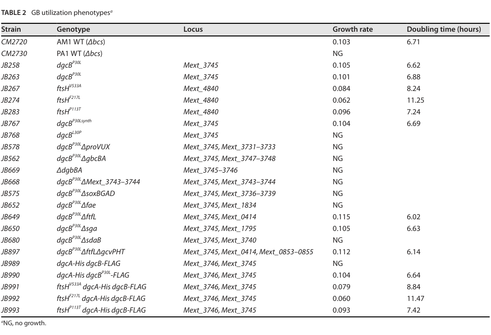

## Question

# Gene Research for Functional Annotation

## ⚠️ CRITICAL: Gene/Protein Identification Context

**BEFORE YOU BEGIN RESEARCH:** You MUST verify you are researching the CORRECT gene/protein. Gene symbols can be ambiguous, especially for less well-characterized genes from non-model organisms.

### Target Gene/Protein Identity (from UniProt):
- **UniProt Accession:** Q9FA38
- **Protein Description:** RecName: Full=5,6,7,8-tetrahydromethanopterin hydro-lyase; EC=4.2.1.147; AltName: Full=Formaldehyde-activating enzyme; Short=Fae;
- **Gene Information:** Name=fae; OrderedLocusNames=MexAM1_META1p1766;
- **Organism (full):** Methylorubrum extorquens (strain ATCC 14718 / DSM 1338 / JCM 2805 / NCIMB 9133 / AM1) (Methylobacterium extorquens).
- **Protein Family:** Belongs to the formaldehyde-activating enzyme family.
- **Key Domains:** HCHO-activating_enzyme. (IPR014826); HCHO-activating_enzyme_sf. (IPR037075); Ribosomal_Su5_D2-typ_SF. (IPR020568); Fae (PF08714)

### MANDATORY VERIFICATION STEPS:

1. **Check if the gene symbol "fae" matches the protein description above**
2. **Verify the organism is correct:** Methylorubrum extorquens (strain ATCC 14718 / DSM 1338 / JCM 2805 / NCIMB 9133 / AM1) (Methylobacterium extorquens).
3. **Check if protein family/domains align with what you find in literature**
4. **If you find literature for a DIFFERENT gene with the same or similar symbol, STOP**

### If Gene Symbol is Ambiguous or You Cannot Find Relevant Literature:

**DO NOT PROCEED WITH RESEARCH ON A DIFFERENT GENE.** Instead:
- State clearly: "The gene symbol 'fae' is ambiguous or literature is limited for this specific protein"
- Explain what you found (e.g., "Found extensive literature on a different gene with the same symbol in a different organism")
- Describe the protein based ONLY on the UniProt information provided above
- Suggest that the protein function can be inferred from domain/family information

### Research Target:

Please provide a comprehensive research report on the gene **fae** (gene ID: fae, UniProt: Q9FA38) in METEA.

The research report should be a detailed narrative explaining the function, biological processes, and localization of the gene product. Citations should be given for all claims.

You should prioritize authoritative reviews and primary scientific literature when conducting research. You can supplement
this with annotations you find in gene/protein databases, but these can be outdated or inaccurate.

We are specifically interested in the primary function of the gene - for enzymes, what reaction is catalyzed, and what is the substrate specificity? For transporters, what is the substrate? For structural proteins or adapters, what is the broader structural role? For signaling molecules, what is the role in the pathway.

We are interested in where in or outside the cell the gene product carries out its function.

We are also interested in the signaling or biochemical pathways in which the gene functions. We are less interested in broad pleiotropic effects, except where these elucidate the precise role.

Include evidence where possible. We are interested in both experimental evidence as well as inference from structure, evolution, or bioinformatic analysis. Precise studies should be prioritized over high-throughput, where available.

## Output

Question: You are an expert researcher providing comprehensive, well-cited information.

Provide detailed information focusing on:
1. Key concepts and definitions with current understanding
2. Recent developments and latest research (prioritize 2023-2024 sources)
3. Current applications and real-world implementations
4. Expert opinions and analysis from authoritative sources
5. Relevant statistics and data from recent studies

Format as a comprehensive research report with proper citations. Include URLs and publication dates where available.
Always prioritize recent, authoritative sources and provide specific citations for all major claims.

# Gene Research for Functional Annotation

## ⚠️ CRITICAL: Gene/Protein Identification Context

**BEFORE YOU BEGIN RESEARCH:** You MUST verify you are researching the CORRECT gene/protein. Gene symbols can be ambiguous, especially for less well-characterized genes from non-model organisms.

### Target Gene/Protein Identity (from UniProt):
- **UniProt Accession:** Q9FA38
- **Protein Description:** RecName: Full=5,6,7,8-tetrahydromethanopterin hydro-lyase; EC=4.2.1.147; AltName: Full=Formaldehyde-activating enzyme; Short=Fae;
- **Gene Information:** Name=fae; OrderedLocusNames=MexAM1_META1p1766;
- **Organism (full):** Methylorubrum extorquens (strain ATCC 14718 / DSM 1338 / JCM 2805 / NCIMB 9133 / AM1) (Methylobacterium extorquens).
- **Protein Family:** Belongs to the formaldehyde-activating enzyme family.
- **Key Domains:** HCHO-activating_enzyme. (IPR014826); HCHO-activating_enzyme_sf. (IPR037075); Ribosomal_Su5_D2-typ_SF. (IPR020568); Fae (PF08714)

### MANDATORY VERIFICATION STEPS:

1. **Check if the gene symbol "fae" matches the protein description above**
2. **Verify the organism is correct:** Methylorubrum extorquens (strain ATCC 14718 / DSM 1338 / JCM 2805 / NCIMB 9133 / AM1) (Methylobacterium extorquens).
3. **Check if protein family/domains align with what you find in literature**
4. **If you find literature for a DIFFERENT gene with the same or similar symbol, STOP**

### If Gene Symbol is Ambiguous or You Cannot Find Relevant Literature:

**DO NOT PROCEED WITH RESEARCH ON A DIFFERENT GENE.** Instead:
- State clearly: "The gene symbol 'fae' is ambiguous or literature is limited for this specific protein"
- Explain what you found (e.g., "Found extensive literature on a different gene with the same symbol in a different organism")
- Describe the protein based ONLY on the UniProt information provided above
- Suggest that the protein function can be inferred from domain/family information

### Research Target:

Please provide a comprehensive research report on the gene **fae** (gene ID: fae, UniProt: Q9FA38) in METEA.

The research report should be a detailed narrative explaining the function, biological processes, and localization of the gene product. Citations should be given for all claims.

You should prioritize authoritative reviews and primary scientific literature when conducting research. You can supplement
this with annotations you find in gene/protein databases, but these can be outdated or inaccurate.

We are specifically interested in the primary function of the gene - for enzymes, what reaction is catalyzed, and what is the substrate specificity? For transporters, what is the substrate? For structural proteins or adapters, what is the broader structural role? For signaling molecules, what is the role in the pathway.

We are interested in where in or outside the cell the gene product carries out its function.

We are also interested in the signaling or biochemical pathways in which the gene functions. We are less interested in broad pleiotropic effects, except where these elucidate the precise role.

Include evidence where possible. We are interested in both experimental evidence as well as inference from structure, evolution, or bioinformatic analysis. Precise studies should be prioritized over high-throughput, where available.

# Research Report: **fae** (UniProt Q9FA38; META1p1766/MexAM1_META1p1766) in *Methylorubrum extorquens* AM1

## 0) Scope and mandatory identity verification
The target protein is UniProt **Q9FA38** from *Methylorubrum extorquens* strain AM1 (syn. *Methylobacterium extorquens* AM1), annotated as **5,6,7,8-tetrahydromethanopterin hydro-lyase / formaldehyde-activating enzyme (Fae)**, EC **4.2.1.147**. An authoritative review table mapping methylotrophy genes in AM1 lists **fae** in the **H4MPT-dependent C1 transfer** module with locus tag **META1p1766**, matching the UniProt-provided ordered locus name (ochsner2015methylobacteriumextorquensmethylotrophy pages 4-5). The same sources define Fae as the enzyme catalyzing/accelerating the initial condensation step that channels formaldehyde into the H4MPT-linked pathway (marx2003formaldehydedetoxifyingroleof pages 1-2, nayak2014geneticandphenotypic pages 3-4).

## 1) Key concepts and current understanding (definitions and pathway context)

### 1.1 Formaldehyde toxicity and why methylotrophs need Fae
In aerobic methylotrophs such as *M. extorquens* AM1, methanol oxidation generates **formaldehyde**, a reactive and toxic intermediate that must be rapidly detoxified/processed to avoid growth inhibition (marx2003formaldehydedetoxifyingroleof pages 2-3, marx2003formaldehydedetoxifyingroleof pages 3-4). The dominant intracellular detoxification/oxidation route in AM1 is the **tetrahydromethanopterin (H4MPT)-linked pathway** (marx2003formaldehydedetoxifyingroleof pages 3-4).

### 1.2 Reaction catalyzed by Fae (substrates and product)
Fae catalyzes (and strongly accelerates) the **condensation of free formaldehyde with the C1 carrier cofactor H4MPT** to form **methylene-H4MPT** (the entry metabolite for subsequent H4MPT-linked oxidation steps) (marx2003formaldehydedetoxifyingroleof pages 1-2, nayak2014geneticandphenotypic pages 3-4). While the formaldehyde–H4MPT condensation can occur spontaneously, the enzyme-catalyzed reaction is described as the physiologically relevant route and is required for robust methylotrophic growth in AM1 (marx2003formaldehydedetoxifyingroleof pages 1-2).

**Substrate specificity (supported by available evidence):** the key substrate is **formaldehyde** and the key cofactor/C1 acceptor is **H4MPT** (marx2003formaldehydedetoxifyingroleof pages 1-2, nayak2014geneticandphenotypic pages 3-4). The provided evidence does not include detailed kinetic constants (Km, kcat) or an explicit discussion of alternative aldehyde substrates; thus, substrate specificity beyond formaldehyde cannot be asserted here.

### 1.3 Biological process and pathway role
Fae performs the **first committed step** of the **H4MPT-linked formaldehyde oxidation/detoxification pathway** in AM1 (marx2003formaldehydedetoxifyingroleof pages 1-2, marx2003formaldehydedetoxifyingroleof pages 2-3). In physiological terms, Fae links **methanol-derived (or other metabolism-derived) intracellular formaldehyde** to downstream enzymes that oxidize C1 units (ultimately toward formate/CO2, as classically described for this module) while preventing toxic formaldehyde accumulation (marx2003formaldehydedetoxifyingroleof pages 3-4).

### 1.4 Cellular localization and compartment of function
The H4MPT route is described as operating on formaldehyde that **enters the cytoplasm**, where it condenses with H4MPT (marx2003formaldehydedetoxifyingroleof pages 1-2). On that basis, the most defensible localization for the Fae reaction is **intracellular/cytosolic**. No direct subcellular fractionation or imaging evidence for Fae localization was identified in the retrieved evidence.

## 2) Gene-specific evidence in *M. extorquens* AM1 (primary literature)

### 2.1 Essentiality for methylotrophic growth on methanol
In *M. extorquens* AM1, **fae null mutants are incapable of growth on methanol** (marx2003formaldehydedetoxifyingroleof pages 2-3, marx2003formaldehydedetoxifyingroleof pages 3-4). This is strong genetic evidence that Fae is required for methylotrophic metabolism under the tested conditions and supports its central functional annotation (marx2003formaldehydedetoxifyingroleof pages 2-3).

### 2.2 Formaldehyde detoxification: methanol/formaldehyde sensitivity on multicarbon substrates
A hallmark phenotype of AM1 mutants defective in the H4MPT-linked pathway (including **fae** mutants) is **methanol sensitivity during growth on succinate**, interpreted as a failure to detoxify formaldehyde produced from methanol oxidation (marx2003formaldehydedetoxifyingroleof pages 2-3, marx2003formaldehydedetoxifyingroleof pages 3-4). Quantitatively, Marx et al. used plate-based assays spanning **methanol concentrations up to 125 mM**, where **125 mM methanol abolished growth** of tested H4MPT-pathway mutant strains, and reported inhibition differences at lower methanol (e.g., **1 mM methanol**) (marx2003formaldehydedetoxifyingroleof pages 3-4). They also tested formaldehyde directly (down to 0.005 mM in the assay range) to probe toxicity sensitivity (marx2003formaldehydedetoxifyingroleof pages 3-4).

### 2.3 Interpretation: primary but not necessarily the only possible formaldehyde-oxidation entry point
Marx et al. concluded the H4MPT-linked pathway is the **primary** formaldehyde oxidation/detoxification route in AM1 (marx2003formaldehydedetoxifyingroleof pages 3-4). This “primary route” framing is consistent with the idea that alternative formaldehyde-oxidation strategies can exist (or be engineered/introduced) but that, in the native AM1 network, H4MPT/Fae is central to handling cytosolic formaldehyde generated during methylotrophic growth (marx2003formaldehydedetoxifyingroleof pages 3-4).

## 3) Structural/biochemical evidence and expert synthesis
A widely cited review on *M. extorquens* methylotrophy and biotechnology notes that an AM1 **Fae structure** has been determined (“structure of the tetrahydromethanopterin-dependent formaldehyde-activating enzyme (Fae) from *M. extorquens* AM1”), supporting the enzyme’s role in binding H4MPT and catalyzing the formaldehyde activation step (ochsner2015methylobacteriumextorquensmethylotrophy pages 7-9). The review also places **fae/META1p1766** explicitly in the H4MPT-dependent module, reflecting community consensus on function and pathway placement (ochsner2015methylobacteriumextorquensmethylotrophy pages 4-5).

Because the dedicated structural paper itself was not retrievable in the current tool context, specific mechanistic/active-site claims (e.g., residue-level catalytic mechanism) are not reproduced here.

## 4) Recent developments (2023–2024 prioritized)

### 4.1 2024: Glycine betaine catabolism generates formaldehyde that requires Fae/H4MPT processing
A 2024 *Applied and Environmental Microbiology* study shows that in *Methylorubrum extorquens* PA1, enabling glycine betaine (GB) utilization produces **free formaldehyde**, and that this formaldehyde is handled via methylotrophy-associated machinery including H4MPT-pathway genes (hying2024glycinebetainemetabolism pages 6-9, hying2024glycinebetainemetabolism pages 9-11). Critically, a strain carrying **dgcB^P30L Δfae** shows **no growth (NG)** on GB as sole carbon/energy source (Table 2) (hying2024glycinebetainemetabolism pages 4-6, hying2024glycinebetainemetabolism media ad9482fc). This provides modern, experimentally anchored support for the broader principle that Fae-mediated formaldehyde activation is not only relevant to methanol, but also to other methylated substrates whose catabolism releases formaldehyde.

**Quantitative/statistical elements available from retrieved evidence:** Hying et al. report a formaldehyde assay showing **increased supernatant formaldehyde** in GB-grown versus pyruvate-grown cultures (figure referenced in text) and tabulate growth phenotypes (including “NG” for Δfae) (hying2024glycinebetainemetabolism pages 6-9, hying2024glycinebetainemetabolism media ad9482fc). The retrieved text snippets do not provide the exact formaldehyde concentrations or p-values.

### 4.2 2023: Redundancy and pathway modularity in plant-associated *Methylobacterium*
A 2023 *Frontiers in Microbiology* study on *Methylobacterium aquaticum* strain 22A describes that the **H4MPT-linked pathway begins with Fae**, and that strain 22A contains **two fae homologs (fae1 and fae2)**; combined disruption of formaldehyde oxidation capacity (H4MPT and glutathione-linked components) produces strong formaldehyde toxicity phenotypes and methanol-associated growth defects (tani2023metabolismlinkedmethylotaxissensors pages 3-5). While not AM1-specific, it highlights contemporary interest in pathway redundancy and formaldehyde control in plant-associated methylotroph ecology.

## 5) Applications and real-world implementations

### 5.1 Biotechnological platform relevance of AM1 methylotrophy modules (including fae)
A comprehensive review (2015; *Applied Microbiology and Biotechnology*) frames *M. extorquens* AM1 as a well-characterized methylotrophic platform with biotechnological applications and summarizes the genetic modules for methylotrophy, including the H4MPT-dependent pathway with **fae/META1p1766** (ochsner2015methylobacteriumextorquensmethylotrophy pages 4-5). In application-oriented terms, Fae is part of the core “formaldehyde handling” machinery that must be functional (or deliberately rewired) when methanol or other formaldehyde-generating substrates are used as feedstocks (ochsner2015methylobacteriumextorquensmethylotrophy pages 4-5).

### 5.2 Plant-associated substrate utilization intersects with formaldehyde detoxification
The 2024 glycine betaine work provides a concrete example of how plant-associated compounds (GB) can feed into formaldehyde metabolism and require Fae/H4MPT-dependent processing (hying2024glycinebetainemetabolism pages 6-9, hying2024glycinebetainemetabolism media ad9482fc). This supports real-world ecological relevance (phyllosphere carbon sources) and informs metabolic engineering: successful growth on such substrates requires maintaining efficient formaldehyde activation/oxidation capacity (hying2024glycinebetainemetabolism pages 6-9).

## 6) Relevant data and statistics (from retrieved evidence)

1. **AM1 methanol/formaldehyde sensitivity assays:** H4MPT-pathway mutants including **fae** were tested across methanol concentrations up to **125 mM**, with **125 mM methanol abolishing growth** in succinate-based assays; differences in inhibition were noted at **1 mM methanol** (marx2003formaldehydedetoxifyingroleof pages 3-4). Formaldehyde was also tested directly down to **0.005 mM** in the assay range (marx2003formaldehydedetoxifyingroleof pages 3-4).
2. **PA1 methylamine physiology (contextual quantitative evidence):** Disrupting H4MPT biosynthesis (ΔmptG) caused a **23% slower** growth on succinate when methylamine was used as nitrogen source vs NH4+ (p<0.001), compared with **11% slower** for WT (p=0.001) (nayak2014physiologyandevolution pages 63-67). These data support the quantitative importance of H4MPT-linked formaldehyde handling, and that loss of **fae** can be a partial lesion because spontaneous condensation can occur (nayak2014physiologyandevolution pages 63-67).
3. **2024 GB phenotype table:** **dgcB^P30L Δfae** is explicitly reported as **no growth (NG)** on glycine betaine (hying2024glycinebetainemetabolism media ad9482fc).

## 7) Evidence-based functional annotation summary (recommended)

| Gene/protein | Verified identity | Reaction catalyzed | Substrates / cofactors | Pathway / module | Key genetic evidence in *Methylorubrum extorquens* AM1 | Recent 2024 evidence / broader relevance | Localization / compartment | Key references |
|---|---|---|---|---|---|---|---|---|
| **fae**; UniProt **Q9FA38**; locus **META1p1766 / MexAM1_META1p1766** | Matches the canonical **formaldehyde-activating enzyme (Fae)** annotation in *M. extorquens* AM1; reviews/tables place **fae/META1p1766** in the H4MPT-dependent C1 transfer module as a formaldehyde-activating enzyme (ochsner2015methylobacteriumextorquensmethylotrophy pages 4-5) | Catalyzes/strongly accelerates condensation of **formaldehyde + tetrahydromethanopterin (H4MPT)** to form **methylene-H4MPT**, the entry step into the H4MPT-linked oxidation route; spontaneous condensation can occur, but Fae is the physiologically important catalyst (marx2003formaldehydedetoxifyingroleof pages 1-2, nayak2014geneticandphenotypic pages 3-4) | **Formaldehyde** is the C1 substrate and **H4MPT** is the C1 carrier/cofactor acceptor; product is **methylene-H4MPT** feeding downstream H4MPT enzymes (marx2003formaldehydedetoxifyingroleof pages 1-2, nayak2014geneticandphenotypic pages 3-4) | Central entry enzyme of the **H4MPT-linked formaldehyde oxidation/detoxification pathway**, the primary route for formaldehyde oxidation in AM1 during methylotrophic growth; pathway converts toxic intracellular formaldehyde toward formate/CO2 via downstream H4MPT enzymes (marx2003formaldehydedetoxifyingroleof pages 1-2, marx2003formaldehydedetoxifyingroleof pages 2-3, marx2003formaldehydedetoxifyingroleof pages 3-4) | **fae null mutants cannot grow on methanol** and are **methanol/formaldehyde sensitive during growth on succinate**, supporting a formaldehyde detoxification role. In plate assays, all tested H4MPT-pathway mutants were unable to grow on methanol; **1 mM methanol** inhibited pathway mutants and **125 mM methanol** abolished growth of tested mutants in succinate-based assays (marx2003formaldehydedetoxifyingroleof pages 2-3, marx2003formaldehydedetoxifyingroleof pages 3-4) | In 2024, glycine betaine catabolism in *M. extorquens* PA1 was shown to generate free formaldehyde that must be processed by methylotrophy machinery; a **dgcB^P30L Δfae** strain showed **no growth (NG)** on glycine betaine, linking Fae-dependent H4MPT chemistry to detoxification/energy capture from non-methanol substrates that release formaldehyde (hying2024glycinebetainemetabolism pages 6-9, hying2024glycinebetainemetabolism pages 4-6, hying2024glycinebetainemetabolism media ad9482fc) | Evidence places the reaction in the **cytoplasm / intracellular soluble compartment**, because formaldehyde entering the cytoplasm condenses with H4MPT and the H4MPT pathway is described as the intracellular primary oxidation/detoxification route; no evidence for secretion or membrane localization was identified here (marx2003formaldehydedetoxifyingroleof pages 1-2) | Marx et al., **2003**, *J. Bacteriol.* DOI: https://doi.org/10.1128/jb.185.23.7160-7168.2003 (marx2003formaldehydedetoxifyingroleof pages 1-2, marx2003formaldehydedetoxifyingroleof pages 2-3, marx2003formaldehydedetoxifyingroleof pages 3-4); Nayak & Marx, **2014**, *PLoS ONE* DOI: https://doi.org/10.1371/journal.pone.0107887 (nayak2014geneticandphenotypic pages 3-4); Ochsner et al., **2015**, *Appl. Microbiol. Biotechnol.* DOI: https://doi.org/10.1007/s00253-014-6240-3 (ochsner2015methylobacteriumextorquensmethylotrophy pages 7-9, ochsner2015methylobacteriumextorquensmethylotrophy pages 4-5); Hying et al., **2024**, *Appl. Environ. Microbiol.* DOI: https://doi.org/10.1128/aem.02090-23 (hying2024glycinebetainemetabolism pages 6-9, hying2024glycinebetainemetabolism pages 4-6, hying2024glycinebetainemetabolism media ad9482fc) |

*Table: This table summarizes the verified identity, catalytic role, pathway placement, localization, and key genetic evidence for *Methylorubrum extorquens* AM1 Fae (Q9FA38). It also includes recent 2024 evidence linking Fae-dependent formaldehyde handling to glycine betaine metabolism.*

### Proposed functional statement
**Fae (Q9FA38; META1p1766)** is a cytosolic enzyme that catalyzes/accelerates the condensation of **formaldehyde** with **H4MPT** to form **methylene-H4MPT**, initiating the H4MPT-linked formaldehyde oxidation/detoxification pathway required for methylotrophic growth on methanol and for resisting formaldehyde stress in *M. extorquens* AM1 (marx2003formaldehydedetoxifyingroleof pages 1-2, marx2003formaldehydedetoxifyingroleof pages 2-3, marx2003formaldehydedetoxifyingroleof pages 3-4).

## 8) Visual evidence
Hying et al. (2024) Table 2 provides direct phenotypic support that deleting **fae** abolishes growth on a formaldehyde-generating substrate (glycine betaine) in *M. extorquens* PA1 background, supporting the functional importance of Fae-mediated formaldehyde activation/processing (hying2024glycinebetainemetabolism media ad9482fc).

## 9) Limitations of this report (what could not be confirmed from retrieved full text)
* No kinetic parameters (Km/kcat) for AM1 Fae and no direct biochemical substrate range tests were available in the retrieved evidence snippets; therefore, the report restricts specificity claims to formaldehyde/H4MPT condensation (marx2003formaldehydedetoxifyingroleof pages 1-2, nayak2014geneticandphenotypic pages 3-4).
* The existence of a solved AM1 Fae structure is supported by an authoritative review citation, but the primary structural paper could not be retrieved here, preventing residue-level mechanistic summarization (ochsner2015methylobacteriumextorquensmethylotrophy pages 7-9).

## Key references (with publication dates and URLs)
* Marx CJ, Chistoserdova L, Lidstrom ME. **2003-12**. “Formaldehyde-Detoxifying Role of the Tetrahydromethanopterin-Linked Pathway in *Methylobacterium extorquens* AM1.” *Journal of Bacteriology*. https://doi.org/10.1128/jb.185.23.7160-7168.2003 (marx2003formaldehydedetoxifyingroleof pages 2-3, marx2003formaldehydedetoxifyingroleof pages 3-4)
* Nayak DD, Marx CJ. **2014-09**. “Genetic and phenotypic comparison of facultative methylotrophy between *Methylobacterium extorquens* strains PA1 and AM1.” *PLoS ONE*. https://doi.org/10.1371/journal.pone.0107887 (nayak2014geneticandphenotypic pages 3-4)
* Ochsner AM, Sonntag F, Buchhaupt M, Schrader J, Vorholt JA. **2015-11**. “*Methylobacterium extorquens*: methylotrophy and biotechnological applications.” *Applied Microbiology and Biotechnology*. https://doi.org/10.1007/s00253-014-6240-3 (ochsner2015methylobacteriumextorquensmethylotrophy pages 7-9, ochsner2015methylobacteriumextorquensmethylotrophy pages 4-5)
* Hying ZT, Miller TJ, Loh CY, Bazurto JV. **2024-07**. “Glycine betaine metabolism is enabled in *Methylorubrum extorquens* PA1 by alterations to dimethylglycine dehydrogenase.” *Applied and Environmental Microbiology*. https://doi.org/10.1128/aem.02090-23 (hying2024glycinebetainemetabolism pages 6-9, hying2024glycinebetainemetabolism media ad9482fc)
* Tani A et al. **2023-10**. “Metabolism-linked methylotaxis sensors responsible for plant colonization in *Methylobacterium aquaticum* strain 22A.” *Frontiers in Microbiology*. https://doi.org/10.3389/fmicb.2023.1258452 (tani2023metabolismlinkedmethylotaxissensors pages 3-5)

References

1. (ochsner2015methylobacteriumextorquensmethylotrophy pages 4-5): Andrea M. Ochsner, Frank Sonntag, Markus Buchhaupt, Jens Schrader, and Julia A. Vorholt. Methylobacterium extorquens: methylotrophy and biotechnological applications. Applied Microbiology and Biotechnology, 99:517-534, Nov 2015. URL: https://doi.org/10.1007/s00253-014-6240-3, doi:10.1007/s00253-014-6240-3. This article has 229 citations and is from a domain leading peer-reviewed journal.

2. (marx2003formaldehydedetoxifyingroleof pages 1-2): Christopher J. Marx, Ludmila Chistoserdova, and Mary E. Lidstrom. Formaldehyde-detoxifying role of thetetrahydromethanopterin-linked pathway in methylobacteriumextorquensam1. Journal of Bacteriology, 185:7160-7168, Dec 2003. URL: https://doi.org/10.1128/jb.185.23.7160-7168.2003, doi:10.1128/jb.185.23.7160-7168.2003. This article has 149 citations and is from a peer-reviewed journal.

3. (nayak2014geneticandphenotypic pages 3-4): Dipti D. Nayak and Christopher J. Marx. Genetic and phenotypic comparison of facultative methylotrophy between methylobacterium extorquens strains pa1 and am1. PLoS ONE, 9:e107887, Sep 2014. URL: https://doi.org/10.1371/journal.pone.0107887, doi:10.1371/journal.pone.0107887. This article has 48 citations and is from a peer-reviewed journal.

4. (marx2003formaldehydedetoxifyingroleof pages 2-3): Christopher J. Marx, Ludmila Chistoserdova, and Mary E. Lidstrom. Formaldehyde-detoxifying role of thetetrahydromethanopterin-linked pathway in methylobacteriumextorquensam1. Journal of Bacteriology, 185:7160-7168, Dec 2003. URL: https://doi.org/10.1128/jb.185.23.7160-7168.2003, doi:10.1128/jb.185.23.7160-7168.2003. This article has 149 citations and is from a peer-reviewed journal.

5. (marx2003formaldehydedetoxifyingroleof pages 3-4): Christopher J. Marx, Ludmila Chistoserdova, and Mary E. Lidstrom. Formaldehyde-detoxifying role of thetetrahydromethanopterin-linked pathway in methylobacteriumextorquensam1. Journal of Bacteriology, 185:7160-7168, Dec 2003. URL: https://doi.org/10.1128/jb.185.23.7160-7168.2003, doi:10.1128/jb.185.23.7160-7168.2003. This article has 149 citations and is from a peer-reviewed journal.

6. (ochsner2015methylobacteriumextorquensmethylotrophy pages 7-9): Andrea M. Ochsner, Frank Sonntag, Markus Buchhaupt, Jens Schrader, and Julia A. Vorholt. Methylobacterium extorquens: methylotrophy and biotechnological applications. Applied Microbiology and Biotechnology, 99:517-534, Nov 2015. URL: https://doi.org/10.1007/s00253-014-6240-3, doi:10.1007/s00253-014-6240-3. This article has 229 citations and is from a domain leading peer-reviewed journal.

7. (hying2024glycinebetainemetabolism pages 6-9): Zachary T. Hying, Tyler J. Miller, Chin Yi Loh, and Jannell V. Bazurto. Glycine betaine metabolism is enabled in <i>methylorubrum extorquens</i> pa1 by alterations to dimethylglycine dehydrogenase. Applied and Environmental Microbiology, Jul 2024. URL: https://doi.org/10.1128/aem.02090-23, doi:10.1128/aem.02090-23. This article has 6 citations and is from a peer-reviewed journal.

8. (hying2024glycinebetainemetabolism pages 9-11): Zachary T. Hying, Tyler J. Miller, Chin Yi Loh, and Jannell V. Bazurto. Glycine betaine metabolism is enabled in <i>methylorubrum extorquens</i> pa1 by alterations to dimethylglycine dehydrogenase. Applied and Environmental Microbiology, Jul 2024. URL: https://doi.org/10.1128/aem.02090-23, doi:10.1128/aem.02090-23. This article has 6 citations and is from a peer-reviewed journal.

9. (hying2024glycinebetainemetabolism pages 4-6): Zachary T. Hying, Tyler J. Miller, Chin Yi Loh, and Jannell V. Bazurto. Glycine betaine metabolism is enabled in <i>methylorubrum extorquens</i> pa1 by alterations to dimethylglycine dehydrogenase. Applied and Environmental Microbiology, Jul 2024. URL: https://doi.org/10.1128/aem.02090-23, doi:10.1128/aem.02090-23. This article has 6 citations and is from a peer-reviewed journal.

10. (hying2024glycinebetainemetabolism media ad9482fc): Zachary T. Hying, Tyler J. Miller, Chin Yi Loh, and Jannell V. Bazurto. Glycine betaine metabolism is enabled in <i>methylorubrum extorquens</i> pa1 by alterations to dimethylglycine dehydrogenase. Applied and Environmental Microbiology, Jul 2024. URL: https://doi.org/10.1128/aem.02090-23, doi:10.1128/aem.02090-23. This article has 6 citations and is from a peer-reviewed journal.

11. (tani2023metabolismlinkedmethylotaxissensors pages 3-5): Akio Tani, Sachiko Masuda, Yoshiko Fujitani, Toshiki Iga, Yuuki Haruna, Shiho Kikuchi, Wang Shuaile, Haoxin Lv, Shiori Katayama, Hiroya Yurimoto, Yasuyoshi Sakai, and Junichi Kato. Metabolism-linked methylotaxis sensors responsible for plant colonization in methylobacterium aquaticum strain 22a. Frontiers in Microbiology, Oct 2023. URL: https://doi.org/10.3389/fmicb.2023.1258452, doi:10.3389/fmicb.2023.1258452. This article has 13 citations and is from a peer-reviewed journal.

12. (nayak2014physiologyandevolution pages 63-67): DD Nayak. Physiology and evolution of methylamine metabolism across methylobacterium extorquens strains. Unknown journal, 2014.

## Artifacts

- [Edison artifact artifact-00](fae-deep-research-falcon_artifacts/artifact-00.md)

## Citations

1. ochsner2015methylobacteriumextorquensmethylotrophy pages 4-5
2. marx2003formaldehydedetoxifyingroleof pages 3-4
3. marx2003formaldehydedetoxifyingroleof pages 1-2
4. marx2003formaldehydedetoxifyingroleof pages 2-3
5. ochsner2015methylobacteriumextorquensmethylotrophy pages 7-9
6. tani2023metabolismlinkedmethylotaxissensors pages 3-5
7. hying2024glycinebetainemetabolism pages 6-9
8. nayak2014physiologyandevolution pages 63-67
9. nayak2014geneticandphenotypic pages 3-4
10. hying2024glycinebetainemetabolism pages 9-11
11. hying2024glycinebetainemetabolism pages 4-6
12. https://doi.org/10.1128/jb.185.23.7160-7168.2003
13. https://doi.org/10.1371/journal.pone.0107887
14. https://doi.org/10.1007/s00253-014-6240-3
15. https://doi.org/10.1128/aem.02090-23
16. https://doi.org/10.3389/fmicb.2023.1258452
17. https://doi.org/10.1007/s00253-014-6240-3,
18. https://doi.org/10.1128/jb.185.23.7160-7168.2003,
19. https://doi.org/10.1371/journal.pone.0107887,
20. https://doi.org/10.1128/aem.02090-23,
21. https://doi.org/10.3389/fmicb.2023.1258452,