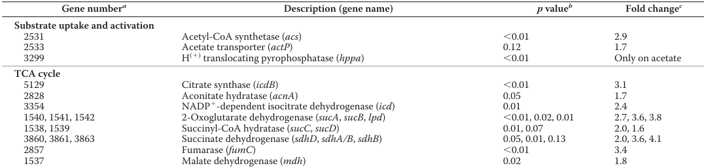
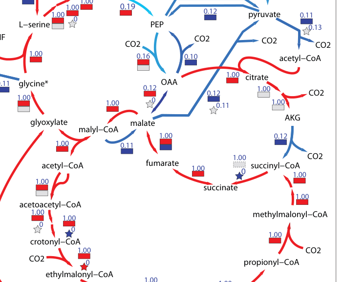

## Question

# Gene Research for Functional Annotation

## ⚠️ CRITICAL: Gene/Protein Identification Context

**BEFORE YOU BEGIN RESEARCH:** You MUST verify you are researching the CORRECT gene/protein. Gene symbols can be ambiguous, especially for less well-characterized genes from non-model organisms.

### Target Gene/Protein Identity (from UniProt):
- **UniProt Accession:** Q8KTE1
- **Protein Description:** RecName: Full=Fumarate hydratase class II {ECO:0000255|HAMAP-Rule:MF_00743}; Short=Fumarase C {ECO:0000255|HAMAP-Rule:MF_00743}; EC=4.2.1.2 {ECO:0000255|HAMAP-Rule:MF_00743}; AltName: Full=Aerobic fumarase {ECO:0000255|HAMAP-Rule:MF_00743}; AltName: Full=Iron-independent fumarase {ECO:0000255|HAMAP-Rule:MF_00743};
- **Gene Information:** Name=fumC {ECO:0000255|HAMAP-Rule:MF_00743}; Synonyms=fumA; OrderedLocusNames=MexAM1_META1p2857;
- **Organism (full):** Methylorubrum extorquens (strain ATCC 14718 / DSM 1338 / JCM 2805 / NCIMB 9133 / AM1) (Methylobacterium extorquens).
- **Protein Family:** Belongs to the class-II fumarase/aspartase family. Fumarase
- **Key Domains:** Fum_hydII. (IPR005677); Fumarase/histidase_N. (IPR024083); Fumarase_C_C. (IPR018951); Fumarate_lyase_CS. (IPR020557); Fumarate_lyase_fam. (IPR000362)

### MANDATORY VERIFICATION STEPS:

1. **Check if the gene symbol "fumC" matches the protein description above**
2. **Verify the organism is correct:** Methylorubrum extorquens (strain ATCC 14718 / DSM 1338 / JCM 2805 / NCIMB 9133 / AM1) (Methylobacterium extorquens).
3. **Check if protein family/domains align with what you find in literature**
4. **If you find literature for a DIFFERENT gene with the same or similar symbol, STOP**

### If Gene Symbol is Ambiguous or You Cannot Find Relevant Literature:

**DO NOT PROCEED WITH RESEARCH ON A DIFFERENT GENE.** Instead:
- State clearly: "The gene symbol 'fumC' is ambiguous or literature is limited for this specific protein"
- Explain what you found (e.g., "Found extensive literature on a different gene with the same symbol in a different organism")
- Describe the protein based ONLY on the UniProt information provided above
- Suggest that the protein function can be inferred from domain/family information

### Research Target:

Please provide a comprehensive research report on the gene **fumC** (gene ID: fumC, UniProt: Q8KTE1) in METEA.

The research report should be a detailed narrative explaining the function, biological processes, and localization of the gene product. Citations should be given for all claims.

You should prioritize authoritative reviews and primary scientific literature when conducting research. You can supplement
this with annotations you find in gene/protein databases, but these can be outdated or inaccurate.

We are specifically interested in the primary function of the gene - for enzymes, what reaction is catalyzed, and what is the substrate specificity? For transporters, what is the substrate? For structural proteins or adapters, what is the broader structural role? For signaling molecules, what is the role in the pathway.

We are interested in where in or outside the cell the gene product carries out its function.

We are also interested in the signaling or biochemical pathways in which the gene functions. We are less interested in broad pleiotropic effects, except where these elucidate the precise role.

Include evidence where possible. We are interested in both experimental evidence as well as inference from structure, evolution, or bioinformatic analysis. Precise studies should be prioritized over high-throughput, where available.

## Output

Question: You are an expert researcher providing comprehensive, well-cited information.

Provide detailed information focusing on:
1. Key concepts and definitions with current understanding
2. Recent developments and latest research (prioritize 2023-2024 sources)
3. Current applications and real-world implementations
4. Expert opinions and analysis from authoritative sources
5. Relevant statistics and data from recent studies

Format as a comprehensive research report with proper citations. Include URLs and publication dates where available.
Always prioritize recent, authoritative sources and provide specific citations for all major claims.

# Gene Research for Functional Annotation

## ⚠️ CRITICAL: Gene/Protein Identification Context

**BEFORE YOU BEGIN RESEARCH:** You MUST verify you are researching the CORRECT gene/protein. Gene symbols can be ambiguous, especially for less well-characterized genes from non-model organisms.

### Target Gene/Protein Identity (from UniProt):
- **UniProt Accession:** Q8KTE1
- **Protein Description:** RecName: Full=Fumarate hydratase class II {ECO:0000255|HAMAP-Rule:MF_00743}; Short=Fumarase C {ECO:0000255|HAMAP-Rule:MF_00743}; EC=4.2.1.2 {ECO:0000255|HAMAP-Rule:MF_00743}; AltName: Full=Aerobic fumarase {ECO:0000255|HAMAP-Rule:MF_00743}; AltName: Full=Iron-independent fumarase {ECO:0000255|HAMAP-Rule:MF_00743};
- **Gene Information:** Name=fumC {ECO:0000255|HAMAP-Rule:MF_00743}; Synonyms=fumA; OrderedLocusNames=MexAM1_META1p2857;
- **Organism (full):** Methylorubrum extorquens (strain ATCC 14718 / DSM 1338 / JCM 2805 / NCIMB 9133 / AM1) (Methylobacterium extorquens).
- **Protein Family:** Belongs to the class-II fumarase/aspartase family. Fumarase
- **Key Domains:** Fum_hydII. (IPR005677); Fumarase/histidase_N. (IPR024083); Fumarase_C_C. (IPR018951); Fumarate_lyase_CS. (IPR020557); Fumarate_lyase_fam. (IPR000362)

### MANDATORY VERIFICATION STEPS:

1. **Check if the gene symbol "fumC" matches the protein description above**
2. **Verify the organism is correct:** Methylorubrum extorquens (strain ATCC 14718 / DSM 1338 / JCM 2805 / NCIMB 9133 / AM1) (Methylobacterium extorquens).
3. **Check if protein family/domains align with what you find in literature**
4. **If you find literature for a DIFFERENT gene with the same or similar symbol, STOP**

### If Gene Symbol is Ambiguous or You Cannot Find Relevant Literature:

**DO NOT PROCEED WITH RESEARCH ON A DIFFERENT GENE.** Instead:
- State clearly: "The gene symbol 'fumC' is ambiguous or literature is limited for this specific protein"
- Explain what you found (e.g., "Found extensive literature on a different gene with the same symbol in a different organism")
- Describe the protein based ONLY on the UniProt information provided above
- Suggest that the protein function can be inferred from domain/family information

### Research Target:

Please provide a comprehensive research report on the gene **fumC** (gene ID: fumC, UniProt: Q8KTE1) in METEA.

The research report should be a detailed narrative explaining the function, biological processes, and localization of the gene product. Citations should be given for all claims.

You should prioritize authoritative reviews and primary scientific literature when conducting research. You can supplement
this with annotations you find in gene/protein databases, but these can be outdated or inaccurate.

We are specifically interested in the primary function of the gene - for enzymes, what reaction is catalyzed, and what is the substrate specificity? For transporters, what is the substrate? For structural proteins or adapters, what is the broader structural role? For signaling molecules, what is the role in the pathway.

We are interested in where in or outside the cell the gene product carries out its function.

We are also interested in the signaling or biochemical pathways in which the gene functions. We are less interested in broad pleiotropic effects, except where these elucidate the precise role.

Include evidence where possible. We are interested in both experimental evidence as well as inference from structure, evolution, or bioinformatic analysis. Precise studies should be prioritized over high-throughput, where available.

## Research report: Functional annotation of **fumC** (UniProt **Q8KTE1**) in *Methylorubrum extorquens* AM1 (MexAM1_META1p2857)

### Executive summary
The target protein (UniProt Q8KTE1; gene **fumC**, locus **MexAM1_META1p2857**) is a **class II fumarate hydratase (fumarase C; EC 4.2.1.2)**, a core tricarboxylic acid (TCA) cycle enzyme catalyzing the reversible interconversion of fumarate and (S)-malate. AM1-specific evidence places **fumC (gene number 2857)** in the TCA cycle and shows it is **more abundant on acetate than on methanol** (3.4-fold; p=0.01), consistent with stronger operation of the oxidative TCA cycle during growth on multicarbon substrates. (schneider2012theethylmalonylcoapathway pages 4-4, schneider2012theethylmalonylcoapathway media 593b7091)

Beyond AM1, a recent (2023) methylotroph study provides high-confidence biochemical/kinetic evidence for bacterial class II FumC enzymes: tetrameric architecture (≈184 kDa native; ~50 kDa subunits), oxygen tolerance, and low-micromolar-to-sub-millimolar substrate affinity for fumarate/malate, supporting UniProt’s “aerobic/iron-independent” class II assignment. (melnikov2023interchangeabilityofclass pages 9-10, melnikov2023interchangeabilityofclass pages 6-9)

### 1) Gene/protein identity verification (critical)
**Organism and gene match.** In *Methylobacterium/Methylorubrum extorquens* AM1, a comparative proteomics dataset explicitly annotates a **TCA-cycle “Fumarase (fumC)”** with **gene number 2857** and quantifies its condition-dependent abundance. (schneider2012theethylmalonylcoapathway pages 4-4)

**Ambiguity note.** The symbol **fumC** is widely used across bacteria for class II fumarase genes; thus, organism context is essential. In the retrieved AM1-specific evidence, the identity is consistent with the UniProt-provided mapping to locus 2857. (schneider2012theethylmalonylcoapathway pages 4-4)

### 2) Key concepts and definitions (current understanding)
#### 2.1 Fumarase (fumarate hydratase) function
Fumarase (EC **4.2.1.2**) catalyzes the **reversible hydration of fumarate to (S)-malate** (and the reverse dehydration), a canonical step of the TCA cycle that connects succinate oxidation (via succinate dehydrogenase → fumarate) to malate/oxaloacetate regeneration. (melnikov2023interchangeabilityofclass pages 1-2, melnikov2023interchangeabilityofclass pages 9-10)

#### 2.2 Class I vs class II fumarases
Bacteria can encode two non-homologous fumarase families:
- **Class I** fumarases are often **[4Fe-4S] cluster** enzymes and can be oxygen-sensitive in many organisms.
- **Class II (FumC)** fumarases are typically **oxygen-tolerant**, **tetrameric** enzymes composed of ~50 kDa subunits, and show strong specificity for the fumarate/malate pair.

These distinctions are directly described in a 2023 study of a methylotroph that carries both types. (melnikov2023interchangeabilityofclass pages 1-2, melnikov2023interchangeabilityofclass pages 4-6)

### 3) Molecular function and biochemical properties (best-supported)
#### 3.1 Catalyzed reaction and substrate specificity
For class II FumC, the supported primary reaction is:

**Fumarate + H2O ⇌ (S)-malate** (EC 4.2.1.2). (melnikov2023interchangeabilityofclass pages 1-2, melnikov2023interchangeabilityofclass pages 9-10)

In a 2023 biochemical characterization of a methylotroph class II fumarase, FumC showed high activity in both directions with similar specific activities for fumarate hydration and malate dehydration, supporting the expected bidirectional catalytic role. (melnikov2023interchangeabilityofclass pages 9-10)

#### 3.2 Kinetic/statistical parameters from recent primary research (2023)
A methylotroph class II FumC enzyme (purified recombinant protein) showed (assay-dependent) properties including:
- Specific activities ~**45 ± 1 U mg⁻¹** (fumarate hydration) and ~**42 ± 3 U mg⁻¹** (malate dehydration). (melnikov2023interchangeabilityofclass pages 9-10)
- **Km(fumarate) = 0.10 ± 0.001 mM** and **S0.5(malate) = 0.14 ± 0.01 mM** (Hill coefficient ~2.1). (melnikov2023interchangeabilityofclass pages 9-10)
- pH dependence with maximal fumarate hydration near **pH 8.0** and malate dehydration near **pH 8.5**. (melnikov2023interchangeabilityofclass pages 9-10)

While these values are not from AM1 Q8KTE1 directly, they provide current, experimentally measured constraints that are consistent with the UniProt class II fumarase assignment and typical bacterial TCA function. (melnikov2023interchangeabilityofclass pages 9-10)

#### 3.3 Quaternary structure and oxygen/iron dependence
A recent methylotroph study reports class II fumarase as a **tetramer** (native ≈**184 kDa**) with ~50 kDa subunits, “similar to previously characterized class II fumarases.” (melnikov2023interchangeabilityofclass pages 6-9)

Class II fumarases are described as **oxygen-tolerant** and are contrasted with class I fumarases that contain an Fe–S cluster (supporting the inference that class II enzymes are **iron-independent** in the sense of not requiring an O2-labile Fe–S catalytic cluster). (melnikov2023interchangeabilityofclass pages 1-2, melnikov2023interchangeabilityofclass pages 4-6)

### 4) Biological process and pathway context in *M. extorquens* AM1
#### 4.1 Central metabolism architecture in AM1 (systems view)
Genome-scale reconstruction and fluxomics describe AM1 core metabolism as an unusual, tightly interlaced network of large cycles, explicitly including the **serine cycle**, **ethylmalonyl-CoA pathway (EMCP)**, and the **TCA cycle**, which must operate together as an integrated process to achieve C1 assimilation. (peyraud2011genomescalereconstructionand pages 1-2, peyraud2011genomescalereconstructionand pages 14-16)

A flux map figure (cropped) shows fumarate, succinate, and malate nodes embedded in this central network during methanol growth, consistent with fumarase being part of the core connected metabolic backbone. (peyraud2011genomescalereconstructionand media 7badf0fd)

#### 4.2 Methanol (methylotrophic) growth: incomplete TCA and reliance on EMCP
During methylotrophic growth of AM1, the TCA cycle is described as **not fully operational**, with **no flux through 2-oxoglutarate dehydrogenase** observed; instead, the EMCP supplies glyoxylate needed for the serine cycle. (schneider2012theethylmalonylcoapathway pages 1-3)

This provides important context: fumarase is still a TCA-node enzyme, but overall carbon oxidation and carbon assimilation are distributed across interconnected cycles rather than a single “textbook” complete TCA loop under methanol growth. (peyraud2011genomescalereconstructionand pages 1-2, schneider2012theethylmalonylcoapathway pages 1-3)

#### 4.3 Acetate growth: oxidative TCA dominance and increased fumC abundance
On acetate, AM1 shows proteomic and flux evidence consistent with stronger oxidative TCA operation:
- **fumC (gene 2857)** protein abundance is **3.4-fold higher** on acetate vs methanol (p=0.01), directly supporting condition-dependent upregulation. (schneider2012theethylmalonylcoapathway pages 4-4, schneider2012theethylmalonylcoapathway media 593b7091)
- Flux analysis indicates that during acetate growth, about **68%** of acetyl-CoA enters the **TCA cycle** and **98%** of that TCA-entering acetyl-CoA is oxidized completely to CO2, consistent with a catabolic/energy-generating role for the TCA (and thus for fumarase) on acetate. (schneider2012theethylmalonylcoapathway pages 5-7)

### 5) Cellular localization
No AM1-specific experimental localization (e.g., fractionation, microscopy, tags) for Q8KTE1 was retrieved from the available full texts. The evidence base supports Q8KTE1 as a canonical class II fumarase operating in **central carbon metabolism**, which in bacteria is typically a **soluble/cytosolic** enzyme associated with the TCA cycle. This localization inference should be treated as provisional until validated experimentally in AM1. (schneider2012theethylmalonylcoapathway pages 4-4, peyraud2011genomescalereconstructionand pages 1-2)

### 6) Recent developments and latest research (prioritizing 2023–2024)
#### 6.1 2023: quantitative enzymology and genetic redundancy of fumarases in a methylotroph
A 2023 study in an obligate methanotroph provides updated biochemical and physiological understanding of fumarase redundancy:
- Class II FumC is tetrameric and catalyzes fumarate↔malate with kinetic constants measured (see above). (melnikov2023interchangeabilityofclass pages 9-10, melnikov2023interchangeabilityofclass pages 6-9)
- Genetic evidence shows class I and class II fumarases can be **functionally interchangeable** in vivo; deleting both fumarases (with malic enzyme deficiency) leads to substantial extracellular fumarate accumulation (**2.6 mmol g⁻¹ DCW** on methane; **1.1 mmol g⁻¹ DCW** on methanol), illustrating expected physiological effects of disabling this TCA node. (melnikov2023interchangeabilityofclass pages 1-2, melnikov2023interchangeabilityofclass pages 2-4)

Although not performed in AM1, this strengthens the current consensus that fumarase is a robust, sometimes redundant metabolic node in methylotroph central metabolism and informs expectations for AM1 perturbation phenotypes. (melnikov2023interchangeabilityofclass pages 12-13)

#### 6.2 2024: metabolic rewiring in *M. extorquens* AM1 impacts central metabolism under methanol limitation
A 2024 *Nature Communications* study describes evolution/engineering in AM1 under low methanol that yielded a **PRPP synthetase “metabolic valve”**. This valve redirects limited carbon away from PRPP/nucleotide synthesis toward alternative central routes (including an upregulated phosphoketolase pathway), improving methanol-limited growth and plant-associated fitness. (zhang2024phosphoribosylpyrophosphatesynthetaseas pages 1-2, zhang2024phosphoribosylpyrophosphatesynthetaseas pages 2-3)

While fumarase is not singled out, this paper represents a recent authoritative example of how **central carbon network constraints** (in which the TCA cycle is embedded) can be leveraged for improved real-world phenotypes (phyllosphere colonization/plant growth promotion). (zhang2024phosphoribosylpyrophosphatesynthetaseas pages 10-11)

### 7) Current applications and real-world implementations
#### 7.1 Methanol-based biomanufacturing using *M. extorquens* as a chassis
A recent review describes the development of methylotrophic microbial platforms for methanol-based bioindustry and cites engineered *M. extorquens* AM1 for chemical production (e.g., mevalonate titers mentioned in the review), indicating continued real-world momentum for AM1 as a production chassis whose performance depends on central metabolism and its TCA-linked nodes. (zhang2024phosphoribosylpyrophosphatesynthetaseas pages 9-10)

#### 7.2 Dicarboxylic-acid related production phenotypes depend on central metabolism and transport
A 2022 applied study in *M. extorquens* highlights how production of EMCP-related dicarboxylic acids can be limited by reuptake and improved by transporter mutations; it reports quantitative yield changes including product decreases of **45–60% over 20 h** due to reuptake and a **1.4-fold** yield increase via transport deficiency (contextualizing why central metabolism—including TCA-linked intermediates—matters for strain engineering). (poschel2022improvementofdicarboxylic pages 1-3)

### 8) Expert opinions / authoritative analysis (from sources)
Systems-level analyses portray AM1 central metabolism as an integrated set of cycles (serine cycle, EMCP, TCA, anaplerosis) that must act together for methylotrophic growth, and that this structure is “structurally fragile” at the network level—an interpretation that frames fumC as part of an interconnected metabolic backbone rather than an isolated single-step enzyme. (peyraud2011genomescalereconstructionand pages 1-2, peyraud2011genomescalereconstructionand pages 14-16)

### 9) Key statistics and data points (recent and/or high-confidence)
- **AM1 fumC expression change:** Fumarase (fumC, gene 2857) is **3.4-fold** higher on acetate vs methanol; **p = 0.01**. (schneider2012theethylmalonylcoapathway pages 4-4, schneider2012theethylmalonylcoapathway media 593b7091)
- **Acetate flux partitioning in AM1:** **68%** of acetyl-CoA enters the TCA cycle and **98%** of that is oxidized to CO2 during growth on acetate. (schneider2012theethylmalonylcoapathway pages 5-7)
- **Class II FumC enzymology (2023 methylotroph):** ~**45 U mg⁻¹** activity; **Km(fumarate) ≈ 0.10 mM**; **S0.5(malate) ≈ 0.14 mM**; tetrameric (native ~**184 kDa**). (melnikov2023interchangeabilityofclass pages 9-10, melnikov2023interchangeabilityofclass pages 6-9)
- **Fumarase deletion phenotype (2023 methylotroph):** triple mutant accumulates **2.6 mmol g⁻¹ DCW fumarate** (methane) and **1.1 mmol g⁻¹ DCW** (methanol). (melnikov2023interchangeabilityofclass pages 1-2, melnikov2023interchangeabilityofclass pages 2-4)

### 10) Evidence summary table
The following table consolidates direct AM1 evidence versus homolog-based inference.

| Claim/Topic | Key Findings | Organism/System | Evidence Type | Source (authors year journal) | URL | PaperQA citation ID |
|---|---|---|---|---|---|---|
| Identity | In *Methylorubrum extorquens* AM1, fumarase annotated as **fumC** is assigned to **gene number 2857**, matching the UniProt locus **MexAM1_META1p2857 / Q8KTE1**; proteomics places it in the **TCA cycle** and shows higher abundance on acetate versus methanol (fold change **3.4**, p = **0.01**). | *Methylobacterium/Methylorubrum extorquens* AM1 | Proteomics | Schneider et al. 2012, *Journal of Biological Chemistry* | https://doi.org/10.1074/jbc.M111.305219 | (schneider2012theethylmalonylcoapathway pages 4-4, schneider2012theethylmalonylcoapathway media 593b7091) |
| Reaction | Fumarase/fumarate hydratase (**EC 4.2.1.2**) catalyzes the **reversible hydration of fumarate to (S)-malate**; this supports annotation of Q8KTE1 as a class II fumarase. | Bacterial class II fumarase; methylotroph comparator | Biochemistry | Melnikov et al. 2023, *PLOS ONE* | https://doi.org/10.1371/journal.pone.0289976 | (melnikov2023interchangeabilityofclass pages 1-2, melnikov2023interchangeabilityofclass pages 9-10) |
| Structure/cofactor | Class II fumarase (**FumC**) is described as a **tetramer** of ~50 kDa subunits, **oxygen-tolerant**, and contrasted with class I fumarases that carry an oxygen-sensitive **[4Fe-4S]** cluster; this supports the UniProt description “**iron-independent fumarase**.” | *Methylotuvimicrobium alcaliphilum* 20Z and general bacterial FumC context | Biochemistry / comparative enzymology | Melnikov et al. 2023, *PLOS ONE* | https://doi.org/10.1371/journal.pone.0289976 | (melnikov2023interchangeabilityofclass pages 1-2, melnikov2023interchangeabilityofclass pages 10-12, melnikov2023interchangeabilityofclass pages 4-6) |
| Kinetics / substrate specificity | Purified class II FumC showed similar activities in both directions: about **45 ± 1 U mg⁻¹** for fumarate hydration and **42 ± 3 U mg⁻¹** for malate dehydration; **Km(fumarate) = 0.10 ± 0.001 mM**, **S0.5(malate) = 0.14 ± 0.01 mM**; optimal pH near **8.0–8.5**; no mesaconate use reported for this FumC. | *Methylotuvimicrobium alcaliphilum* 20Z | Biochemistry / enzyme kinetics | Melnikov et al. 2023, *PLOS ONE* | https://doi.org/10.1371/journal.pone.0289976 | (melnikov2023interchangeabilityofclass pages 9-10) |
| Regulation / expression in AM1 | During acetate growth, AM1 expresses the full TCA complement, with most TCA enzymes more abundant than on methanol; **fumC** specifically increases **3.4-fold** on acetate, consistent with stronger oxidative TCA-cycle engagement under non-methylotrophic growth. | *Methylobacterium/Methylorubrum extorquens* AM1 | Proteomics | Schneider et al. 2012, *Journal of Biological Chemistry* | https://doi.org/10.1074/jbc.M111.305219 | (schneider2012theethylmalonylcoapathway pages 4-4, schneider2012theethylmalonylcoapathway media 593b7091, schneider2012theethylmalonylcoapathway pages 4-5) |
| Pathway context in methylotrophy | AM1 central metabolism has an unusual topology in which the **serine cycle**, **ethylmalonyl-CoA pathway (EMCP)**, **TCA cycle**, and anaplerotic reactions function as an integrated network for C1 assimilation; fumarase is therefore best interpreted as a TCA-cycle node embedded in methylotrophic core metabolism rather than an isolated enzyme. | *Methylobacterium/Methylorubrum extorquens* AM1 | Genome-scale reconstruction / ^13C flux analysis | Peyraud et al. 2011, *BMC Systems Biology* | https://doi.org/10.1186/1752-0509-5-189 | (peyraud2011genomescalereconstructionand pages 1-2, peyraud2011genomescalereconstructionand pages 7-8, peyraud2011genomescalereconstructionand pages 14-16) |
| Pathway context in methanol growth | Under methylotrophic growth, the **TCA cycle is not fully operational** in AM1 because **no flux through 2-oxoglutarate dehydrogenase** was observed; glyoxylate is instead regenerated by the **EMCP** to support the **serine cycle**, explaining why fumC is present in core metabolism but appears less induced than during acetate growth. | *Methylobacterium/Methylorubrum extorquens* AM1 | ^13C flux analysis / comparative physiology | Schneider et al. 2012, *Journal of Biological Chemistry* | https://doi.org/10.1074/jbc.M111.305219 | (schneider2012theethylmalonylcoapathway pages 1-3, peyraud2011genomescalereconstructionand pages 12-13) |
| Pathway context in acetate growth | On acetate, about **68%** of acetyl-CoA enters the **TCA cycle** and **98%** of that flux is oxidized to CO2; the EMCP is a second major sink (**21%** of acetyl-CoA). This strongly supports a catabolic role for fumarase/fumC in oxidative carbon metabolism during acetate utilization. | *Methylobacterium/Methylorubrum extorquens* AM1 | ^13C flux analysis / proteomics | Schneider et al. 2012, *Journal of Biological Chemistry* | https://doi.org/10.1074/jbc.M111.305219 | (schneider2012theethylmalonylcoapathway pages 4-5, schneider2012theethylmalonylcoapathway pages 5-7) |
| Genetic/physiological support for fumarase function | In a methylotroph with both class I and II fumarases, the enzymes were **functionally interchangeable in vivo**; deleting both fumarases (with malic enzyme lesion) caused strong **fumarate accumulation** (**2.6 mmol g⁻¹ DCW** on methane; **1.1 mmol g⁻¹ DCW** on methanol), illustrating the expected physiological consequence of fumarase loss. | *Methylotuvimicrobium alcaliphilum* 20Z | Genetics / physiology / biochemistry | Melnikov et al. 2023, *PLOS ONE* | https://doi.org/10.1371/journal.pone.0289976 | (melnikov2023interchangeabilityofclass pages 1-2, melnikov2023interchangeabilityofclass pages 12-13, melnikov2023interchangeabilityofclass pages 2-4) |
| Biotechnology relevance | AM1 is widely used as a **methanol-based production chassis**, and multiple recent studies emphasize that engineering outcomes depend on **central carbon metabolism** (serine cycle, EMCP, TCA-linked acetyl-CoA handling). While fumC itself is not a common direct engineering target, its pathway position makes it relevant for interpreting redox balance and carbon partitioning in production strains. | *Methylorubrum extorquens* AM1 and derived strains | Review / metabolic engineering context | Singh et al. 2022, *Frontiers in Bioengineering and Biotechnology*; Zhang et al. 2024, *Nature Communications* | https://doi.org/10.3389/fbioe.2022.1050740 ; https://doi.org/10.1038/s41467-024-50342-9 | (zhang2024phosphoribosylpyrophosphatesynthetaseas pages 9-10, zhang2024phosphoribosylpyrophosphatesynthetaseas pages 1-2, zhang2024phosphoribosylpyrophosphatesynthetaseas pages 2-3, zhang2024phosphoribosylpyrophosphatesynthetaseas pages 10-11) |
| Annotation confidence / limitations | Direct biochemical characterization for **AM1 Q8KTE1 itself** was not retrieved; therefore, the strongest AM1-specific evidence is **proteomic and systems-level**, while catalytic mechanism, tetrameric class-II architecture, and iron-independent interpretation are inferred from well-characterized **bacterial FumC homologs** plus the UniProt/domain assignment. | AM1 plus bacterial FumC homologs | Integrated annotation inference | Schneider et al. 2012, Peyraud et al. 2011, Melnikov et al. 2023 | https://doi.org/10.1074/jbc.M111.305219 ; https://doi.org/10.1186/1752-0509-5-189 ; https://doi.org/10.1371/journal.pone.0289976 | (schneider2012theethylmalonylcoapathway pages 4-4, peyraud2011genomescalereconstructionand pages 1-2, melnikov2023interchangeabilityofclass pages 1-2) |

*Table: This table compiles the strongest evidence relevant to functional annotation of fumC/Q8KTE1 in Methylorubrum extorquens AM1, combining AM1-specific proteomics and systems biology with homolog-based class II fumarase biochemistry. It is useful for separating direct organism-specific evidence from higher-confidence comparative inference.*

### 11) Figures/tables supporting annotation (visual evidence)
- Proteomics table evidence for AM1 fumC (gene 2857) regulation on acetate vs methanol. (schneider2012theethylmalonylcoapathway media 593b7091)
- Cropped pathway/flux map segment showing fumarate/succinate/malate nodes in AM1 central metabolism during methanol growth. (peyraud2011genomescalereconstructionand media 7badf0fd)

### 12) Limitations and recommended next steps
**Key limitation:** No AM1-specific purified-enzyme kinetics, substrate range (beyond fumarate/malate), or experimental localization for UniProt Q8KTE1 were retrieved in the accessible corpus. Therefore, enzymatic constants and quaternary structure are currently supported by a close methylotroph homolog study rather than direct AM1 measurement. (melnikov2023interchangeabilityofclass pages 9-10, melnikov2023interchangeabilityofclass pages 6-9)

**Recommended experiments for definitive functional annotation in AM1:**
- Purify Q8KTE1 and measure kcat/Km for fumarate and (S)-malate under AM1-relevant conditions; test for any side activities (e.g., mesaconate) and allosteric effectors.
- Create ΔfumC and conditional knockdown strains in AM1 to test methylotrophic vs acetate-growth phenotypes, and quantify fumarate/malate pools.
- Determine subcellular localization via fluorescent tagging or fractionation.

### References (URLs and publication dates)
- Peyraud R. et al. **2011-11**. *BMC Systems Biology*. “Genome-scale reconstruction and system level investigation of the metabolic network of *Methylobacterium extorquens* AM1.” https://doi.org/10.1186/1752-0509-5-189 (peyraud2011genomescalereconstructionand pages 1-2, peyraud2011genomescalereconstructionand pages 14-16)
- Schneider K. et al. **2012-01**. *Journal of Biological Chemistry*. “The ethylmalonyl-CoA pathway is used in place of the glyoxylate cycle by *Methylobacterium extorquens* AM1 during growth on acetate.” https://doi.org/10.1074/jbc.M111.305219 (schneider2012theethylmalonylcoapathway pages 4-4, schneider2012theethylmalonylcoapathway pages 5-7)
- Melnikov O.I. et al. **2023-10**. *PLOS ONE*. “Interchangeability of class I and II fumarases in an obligate methanotroph *Methylotuvimicrobium alcaliphilum* 20Z.” https://doi.org/10.1371/journal.pone.0289976 (melnikov2023interchangeabilityofclass pages 9-10, melnikov2023interchangeabilityofclass pages 6-9)
- Zhang C. et al. **2024-07**. *Nature Communications*. “Phosphoribosylpyrophosphate synthetase as a metabolic valve advances *Methylobacterium/Methylorubrum* phyllosphere colonization and plant growth.” https://doi.org/10.1038/s41467-024-50342-9 (zhang2024phosphoribosylpyrophosphatesynthetaseas pages 1-2, zhang2024phosphoribosylpyrophosphatesynthetaseas pages 2-3)
- Singh H.B. et al. **2022-11**. *Frontiers in Bioengineering and Biotechnology*. “Developing methylotrophic microbial platforms for a methanol-based bioindustry.” https://doi.org/10.3389/fbioe.2022.1050740 (zhang2024phosphoribosylpyrophosphatesynthetaseas pages 9-10)
- Pöschel L. et al. **2022-09**. *Applied Microbiology and Biotechnology*. “Improvement of dicarboxylic acid production with *Methylorubrum extorquens* by reduction of product reuptake.” https://doi.org/10.1007/s00253-022-12161-0 (poschel2022improvementofdicarboxylic pages 1-3)

References

1. (schneider2012theethylmalonylcoapathway pages 4-4): Kathrin Schneider, Rémi Peyraud, Patrick Kiefer, Philipp Christen, Nathanaël Delmotte, Stéphane Massou, Jean-Charles Portais, and Julia A. Vorholt. The ethylmalonyl-coa pathway is used in place of the glyoxylate cycle by methylobacterium extorquens am1 during growth on acetate. Journal of Biological Chemistry, 287:757-766, Jan 2012. URL: https://doi.org/10.1074/jbc.m111.305219, doi:10.1074/jbc.m111.305219. This article has 106 citations and is from a domain leading peer-reviewed journal.

2. (schneider2012theethylmalonylcoapathway media 593b7091): Kathrin Schneider, Rémi Peyraud, Patrick Kiefer, Philipp Christen, Nathanaël Delmotte, Stéphane Massou, Jean-Charles Portais, and Julia A. Vorholt. The ethylmalonyl-coa pathway is used in place of the glyoxylate cycle by methylobacterium extorquens am1 during growth on acetate. Journal of Biological Chemistry, 287:757-766, Jan 2012. URL: https://doi.org/10.1074/jbc.m111.305219, doi:10.1074/jbc.m111.305219. This article has 106 citations and is from a domain leading peer-reviewed journal.

3. (melnikov2023interchangeabilityofclass pages 9-10): Oleg I. Melnikov, Ildar I. Mustakhimov, Alexander S. Reshetnikov, Maxim V. Molchanov, Andrey V. Machulin, Valentina N. Khmelenina, and Olga N. Rozova. Interchangeability of class i and ii fumarases in an obligate methanotroph methylotuvimicrobium alcaliphilum 20z. PLOS ONE, 18:e0289976, Oct 2023. URL: https://doi.org/10.1371/journal.pone.0289976, doi:10.1371/journal.pone.0289976. This article has 4 citations and is from a peer-reviewed journal.

4. (melnikov2023interchangeabilityofclass pages 6-9): Oleg I. Melnikov, Ildar I. Mustakhimov, Alexander S. Reshetnikov, Maxim V. Molchanov, Andrey V. Machulin, Valentina N. Khmelenina, and Olga N. Rozova. Interchangeability of class i and ii fumarases in an obligate methanotroph methylotuvimicrobium alcaliphilum 20z. PLOS ONE, 18:e0289976, Oct 2023. URL: https://doi.org/10.1371/journal.pone.0289976, doi:10.1371/journal.pone.0289976. This article has 4 citations and is from a peer-reviewed journal.

5. (melnikov2023interchangeabilityofclass pages 1-2): Oleg I. Melnikov, Ildar I. Mustakhimov, Alexander S. Reshetnikov, Maxim V. Molchanov, Andrey V. Machulin, Valentina N. Khmelenina, and Olga N. Rozova. Interchangeability of class i and ii fumarases in an obligate methanotroph methylotuvimicrobium alcaliphilum 20z. PLOS ONE, 18:e0289976, Oct 2023. URL: https://doi.org/10.1371/journal.pone.0289976, doi:10.1371/journal.pone.0289976. This article has 4 citations and is from a peer-reviewed journal.

6. (melnikov2023interchangeabilityofclass pages 4-6): Oleg I. Melnikov, Ildar I. Mustakhimov, Alexander S. Reshetnikov, Maxim V. Molchanov, Andrey V. Machulin, Valentina N. Khmelenina, and Olga N. Rozova. Interchangeability of class i and ii fumarases in an obligate methanotroph methylotuvimicrobium alcaliphilum 20z. PLOS ONE, 18:e0289976, Oct 2023. URL: https://doi.org/10.1371/journal.pone.0289976, doi:10.1371/journal.pone.0289976. This article has 4 citations and is from a peer-reviewed journal.

7. (peyraud2011genomescalereconstructionand pages 1-2): Rémi Peyraud, Kathrin Schneider, Patrick Kiefer, Stéphane Massou, Julia A Vorholt, and Jean-Charles Portais. Genome-scale reconstruction and system level investigation of the metabolic network of methylobacterium extorquens am1. BMC Systems Biology, 5:189-189, Nov 2011. URL: https://doi.org/10.1186/1752-0509-5-189, doi:10.1186/1752-0509-5-189. This article has 165 citations and is from a peer-reviewed journal.

8. (peyraud2011genomescalereconstructionand pages 14-16): Rémi Peyraud, Kathrin Schneider, Patrick Kiefer, Stéphane Massou, Julia A Vorholt, and Jean-Charles Portais. Genome-scale reconstruction and system level investigation of the metabolic network of methylobacterium extorquens am1. BMC Systems Biology, 5:189-189, Nov 2011. URL: https://doi.org/10.1186/1752-0509-5-189, doi:10.1186/1752-0509-5-189. This article has 165 citations and is from a peer-reviewed journal.

9. (peyraud2011genomescalereconstructionand media 7badf0fd): Rémi Peyraud, Kathrin Schneider, Patrick Kiefer, Stéphane Massou, Julia A Vorholt, and Jean-Charles Portais. Genome-scale reconstruction and system level investigation of the metabolic network of methylobacterium extorquens am1. BMC Systems Biology, 5:189-189, Nov 2011. URL: https://doi.org/10.1186/1752-0509-5-189, doi:10.1186/1752-0509-5-189. This article has 165 citations and is from a peer-reviewed journal.

10. (schneider2012theethylmalonylcoapathway pages 1-3): Kathrin Schneider, Rémi Peyraud, Patrick Kiefer, Philipp Christen, Nathanaël Delmotte, Stéphane Massou, Jean-Charles Portais, and Julia A. Vorholt. The ethylmalonyl-coa pathway is used in place of the glyoxylate cycle by methylobacterium extorquens am1 during growth on acetate. Journal of Biological Chemistry, 287:757-766, Jan 2012. URL: https://doi.org/10.1074/jbc.m111.305219, doi:10.1074/jbc.m111.305219. This article has 106 citations and is from a domain leading peer-reviewed journal.

11. (schneider2012theethylmalonylcoapathway pages 5-7): Kathrin Schneider, Rémi Peyraud, Patrick Kiefer, Philipp Christen, Nathanaël Delmotte, Stéphane Massou, Jean-Charles Portais, and Julia A. Vorholt. The ethylmalonyl-coa pathway is used in place of the glyoxylate cycle by methylobacterium extorquens am1 during growth on acetate. Journal of Biological Chemistry, 287:757-766, Jan 2012. URL: https://doi.org/10.1074/jbc.m111.305219, doi:10.1074/jbc.m111.305219. This article has 106 citations and is from a domain leading peer-reviewed journal.

12. (melnikov2023interchangeabilityofclass pages 2-4): Oleg I. Melnikov, Ildar I. Mustakhimov, Alexander S. Reshetnikov, Maxim V. Molchanov, Andrey V. Machulin, Valentina N. Khmelenina, and Olga N. Rozova. Interchangeability of class i and ii fumarases in an obligate methanotroph methylotuvimicrobium alcaliphilum 20z. PLOS ONE, 18:e0289976, Oct 2023. URL: https://doi.org/10.1371/journal.pone.0289976, doi:10.1371/journal.pone.0289976. This article has 4 citations and is from a peer-reviewed journal.

13. (melnikov2023interchangeabilityofclass pages 12-13): Oleg I. Melnikov, Ildar I. Mustakhimov, Alexander S. Reshetnikov, Maxim V. Molchanov, Andrey V. Machulin, Valentina N. Khmelenina, and Olga N. Rozova. Interchangeability of class i and ii fumarases in an obligate methanotroph methylotuvimicrobium alcaliphilum 20z. PLOS ONE, 18:e0289976, Oct 2023. URL: https://doi.org/10.1371/journal.pone.0289976, doi:10.1371/journal.pone.0289976. This article has 4 citations and is from a peer-reviewed journal.

14. (zhang2024phosphoribosylpyrophosphatesynthetaseas pages 1-2): Cong Zhang, Di-Fei Zhou, Meng-Ying Wang, Ya-Zhen Song, Chong Zhang, Ming-Ming Zhang, Jing Sun, Lu Yao, Xu-Hua Mo, Zeng-Xin Ma, Xiao-Jie Yuan, Yi Shao, Hao-Ran Wang, Si-Han Dong, Kai Bao, Shu-Huan Lu, Martin Sadilek, Marina G. Kalyuzhnaya, Xin-Hui Xing, and Song Yang. Phosphoribosylpyrophosphate synthetase as a metabolic valve advances methylobacterium/methylorubrum phyllosphere colonization and plant growth. Nature Communications, Jul 2024. URL: https://doi.org/10.1038/s41467-024-50342-9, doi:10.1038/s41467-024-50342-9. This article has 30 citations and is from a highest quality peer-reviewed journal.

15. (zhang2024phosphoribosylpyrophosphatesynthetaseas pages 2-3): Cong Zhang, Di-Fei Zhou, Meng-Ying Wang, Ya-Zhen Song, Chong Zhang, Ming-Ming Zhang, Jing Sun, Lu Yao, Xu-Hua Mo, Zeng-Xin Ma, Xiao-Jie Yuan, Yi Shao, Hao-Ran Wang, Si-Han Dong, Kai Bao, Shu-Huan Lu, Martin Sadilek, Marina G. Kalyuzhnaya, Xin-Hui Xing, and Song Yang. Phosphoribosylpyrophosphate synthetase as a metabolic valve advances methylobacterium/methylorubrum phyllosphere colonization and plant growth. Nature Communications, Jul 2024. URL: https://doi.org/10.1038/s41467-024-50342-9, doi:10.1038/s41467-024-50342-9. This article has 30 citations and is from a highest quality peer-reviewed journal.

16. (zhang2024phosphoribosylpyrophosphatesynthetaseas pages 10-11): Cong Zhang, Di-Fei Zhou, Meng-Ying Wang, Ya-Zhen Song, Chong Zhang, Ming-Ming Zhang, Jing Sun, Lu Yao, Xu-Hua Mo, Zeng-Xin Ma, Xiao-Jie Yuan, Yi Shao, Hao-Ran Wang, Si-Han Dong, Kai Bao, Shu-Huan Lu, Martin Sadilek, Marina G. Kalyuzhnaya, Xin-Hui Xing, and Song Yang. Phosphoribosylpyrophosphate synthetase as a metabolic valve advances methylobacterium/methylorubrum phyllosphere colonization and plant growth. Nature Communications, Jul 2024. URL: https://doi.org/10.1038/s41467-024-50342-9, doi:10.1038/s41467-024-50342-9. This article has 30 citations and is from a highest quality peer-reviewed journal.

17. (zhang2024phosphoribosylpyrophosphatesynthetaseas pages 9-10): Cong Zhang, Di-Fei Zhou, Meng-Ying Wang, Ya-Zhen Song, Chong Zhang, Ming-Ming Zhang, Jing Sun, Lu Yao, Xu-Hua Mo, Zeng-Xin Ma, Xiao-Jie Yuan, Yi Shao, Hao-Ran Wang, Si-Han Dong, Kai Bao, Shu-Huan Lu, Martin Sadilek, Marina G. Kalyuzhnaya, Xin-Hui Xing, and Song Yang. Phosphoribosylpyrophosphate synthetase as a metabolic valve advances methylobacterium/methylorubrum phyllosphere colonization and plant growth. Nature Communications, Jul 2024. URL: https://doi.org/10.1038/s41467-024-50342-9, doi:10.1038/s41467-024-50342-9. This article has 30 citations and is from a highest quality peer-reviewed journal.

18. (poschel2022improvementofdicarboxylic pages 1-3): Laura Pöschel, Elisabeth Gehr, and Markus Buchhaupt. Improvement of dicarboxylic acid production with methylorubrum extorquens by reduction of product reuptake. Applied Microbiology and Biotechnology, 106:6713-6731, Sep 2022. URL: https://doi.org/10.1007/s00253-022-12161-0, doi:10.1007/s00253-022-12161-0. This article has 9 citations and is from a domain leading peer-reviewed journal.

19. (melnikov2023interchangeabilityofclass pages 10-12): Oleg I. Melnikov, Ildar I. Mustakhimov, Alexander S. Reshetnikov, Maxim V. Molchanov, Andrey V. Machulin, Valentina N. Khmelenina, and Olga N. Rozova. Interchangeability of class i and ii fumarases in an obligate methanotroph methylotuvimicrobium alcaliphilum 20z. PLOS ONE, 18:e0289976, Oct 2023. URL: https://doi.org/10.1371/journal.pone.0289976, doi:10.1371/journal.pone.0289976. This article has 4 citations and is from a peer-reviewed journal.

20. (schneider2012theethylmalonylcoapathway pages 4-5): Kathrin Schneider, Rémi Peyraud, Patrick Kiefer, Philipp Christen, Nathanaël Delmotte, Stéphane Massou, Jean-Charles Portais, and Julia A. Vorholt. The ethylmalonyl-coa pathway is used in place of the glyoxylate cycle by methylobacterium extorquens am1 during growth on acetate. Journal of Biological Chemistry, 287:757-766, Jan 2012. URL: https://doi.org/10.1074/jbc.m111.305219, doi:10.1074/jbc.m111.305219. This article has 106 citations and is from a domain leading peer-reviewed journal.

21. (peyraud2011genomescalereconstructionand pages 7-8): Rémi Peyraud, Kathrin Schneider, Patrick Kiefer, Stéphane Massou, Julia A Vorholt, and Jean-Charles Portais. Genome-scale reconstruction and system level investigation of the metabolic network of methylobacterium extorquens am1. BMC Systems Biology, 5:189-189, Nov 2011. URL: https://doi.org/10.1186/1752-0509-5-189, doi:10.1186/1752-0509-5-189. This article has 165 citations and is from a peer-reviewed journal.

22. (peyraud2011genomescalereconstructionand pages 12-13): Rémi Peyraud, Kathrin Schneider, Patrick Kiefer, Stéphane Massou, Julia A Vorholt, and Jean-Charles Portais. Genome-scale reconstruction and system level investigation of the metabolic network of methylobacterium extorquens am1. BMC Systems Biology, 5:189-189, Nov 2011. URL: https://doi.org/10.1186/1752-0509-5-189, doi:10.1186/1752-0509-5-189. This article has 165 citations and is from a peer-reviewed journal.

## Artifacts

- [Edison artifact artifact-00](fumC-deep-research-falcon_artifacts/artifact-00.md)

## Citations

1. schneider2012theethylmalonylcoapathway pages 4-4
2. melnikov2023interchangeabilityofclass pages 9-10
3. melnikov2023interchangeabilityofclass pages 6-9
4. schneider2012theethylmalonylcoapathway pages 1-3
5. schneider2012theethylmalonylcoapathway pages 5-7
6. melnikov2023interchangeabilityofclass pages 12-13
7. zhang2024phosphoribosylpyrophosphatesynthetaseas pages 10-11
8. zhang2024phosphoribosylpyrophosphatesynthetaseas pages 9-10
9. poschel2022improvementofdicarboxylic pages 1-3
10. melnikov2023interchangeabilityofclass pages 1-2
11. melnikov2023interchangeabilityofclass pages 4-6
12. peyraud2011genomescalereconstructionand pages 1-2
13. peyraud2011genomescalereconstructionand pages 14-16
14. melnikov2023interchangeabilityofclass pages 2-4
15. zhang2024phosphoribosylpyrophosphatesynthetaseas pages 1-2
16. zhang2024phosphoribosylpyrophosphatesynthetaseas pages 2-3
17. melnikov2023interchangeabilityofclass pages 10-12
18. schneider2012theethylmalonylcoapathway pages 4-5
19. peyraud2011genomescalereconstructionand pages 7-8
20. peyraud2011genomescalereconstructionand pages 12-13
21. 4Fe-4S
22. https://doi.org/10.1074/jbc.M111.305219
23. https://doi.org/10.1371/journal.pone.0289976
24. https://doi.org/10.1186/1752-0509-5-189
25. https://doi.org/10.3389/fbioe.2022.1050740
26. https://doi.org/10.1038/s41467-024-50342-9
27. https://doi.org/10.1007/s00253-022-12161-0
28. https://doi.org/10.1074/jbc.m111.305219,
29. https://doi.org/10.1371/journal.pone.0289976,
30. https://doi.org/10.1186/1752-0509-5-189,
31. https://doi.org/10.1038/s41467-024-50342-9,
32. https://doi.org/10.1007/s00253-022-12161-0,