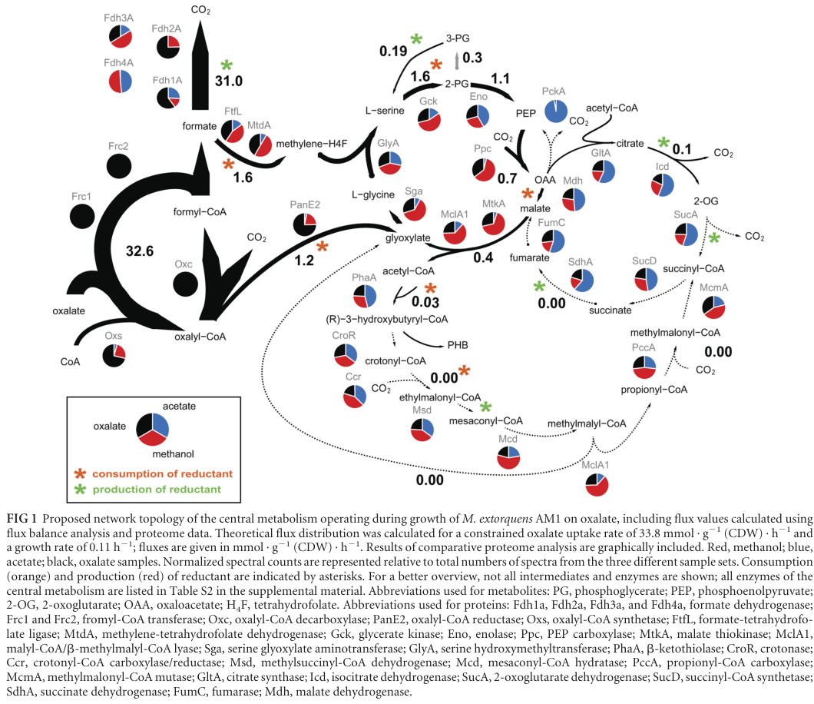

## Question

# Gene Research for Functional Annotation

## ⚠️ CRITICAL: Gene/Protein Identification Context

**BEFORE YOU BEGIN RESEARCH:** You MUST verify you are researching the CORRECT gene/protein. Gene symbols can be ambiguous, especially for less well-characterized genes from non-model organisms.

### Target Gene/Protein Identity (from UniProt):
- **UniProt Accession:** C5AUT6
- **Protein Description:** SubName: Full=Glycerate kinase {ECO:0000313|EMBL:ACS40696.1};
- **Gene Information:** Name=gck {ECO:0000313|EMBL:ACS40696.1}; OrderedLocusNames=MexAM1_META1p2944 {ECO:0000313|EMBL:ACS40696.1};
- **Organism (full):** Methylorubrum extorquens (strain ATCC 14718 / DSM 1338 / JCM 2805 / NCIMB 9133 / AM1) (Methylobacterium extorquens).
- **Protein Family:** Not specified in UniProt
- **Key Domains:** GK-like_C_sf. (IPR037035); GK_N_sf. (IPR038614); MOFRL. (IPR007835); MOFRL_assoc_dom. (IPR025286); MOFRL_protein. (IPR039760)

### MANDATORY VERIFICATION STEPS:

1. **Check if the gene symbol "gck" matches the protein description above**
2. **Verify the organism is correct:** Methylorubrum extorquens (strain ATCC 14718 / DSM 1338 / JCM 2805 / NCIMB 9133 / AM1) (Methylobacterium extorquens).
3. **Check if protein family/domains align with what you find in literature**
4. **If you find literature for a DIFFERENT gene with the same or similar symbol, STOP**

### If Gene Symbol is Ambiguous or You Cannot Find Relevant Literature:

**DO NOT PROCEED WITH RESEARCH ON A DIFFERENT GENE.** Instead:
- State clearly: "The gene symbol 'gck' is ambiguous or literature is limited for this specific protein"
- Explain what you found (e.g., "Found extensive literature on a different gene with the same symbol in a different organism")
- Describe the protein based ONLY on the UniProt information provided above
- Suggest that the protein function can be inferred from domain/family information

### Research Target:

Please provide a comprehensive research report on the gene **gck** (gene ID: gck, UniProt: C5AUT6) in METEA.

The research report should be a detailed narrative explaining the function, biological processes, and localization of the gene product. Citations should be given for all claims.

You should prioritize authoritative reviews and primary scientific literature when conducting research. You can supplement
this with annotations you find in gene/protein databases, but these can be outdated or inaccurate.

We are specifically interested in the primary function of the gene - for enzymes, what reaction is catalyzed, and what is the substrate specificity? For transporters, what is the substrate? For structural proteins or adapters, what is the broader structural role? For signaling molecules, what is the role in the pathway.

We are interested in where in or outside the cell the gene product carries out its function.

We are also interested in the signaling or biochemical pathways in which the gene functions. We are less interested in broad pleiotropic effects, except where these elucidate the precise role.

Include evidence where possible. We are interested in both experimental evidence as well as inference from structure, evolution, or bioinformatic analysis. Precise studies should be prioritized over high-throughput, where available.

## Output

Question: You are an expert researcher providing comprehensive, well-cited information.

Provide detailed information focusing on:
1. Key concepts and definitions with current understanding
2. Recent developments and latest research (prioritize 2023-2024 sources)
3. Current applications and real-world implementations
4. Expert opinions and analysis from authoritative sources
5. Relevant statistics and data from recent studies

Format as a comprehensive research report with proper citations. Include URLs and publication dates where available.
Always prioritize recent, authoritative sources and provide specific citations for all major claims.

# Gene Research for Functional Annotation

## ⚠️ CRITICAL: Gene/Protein Identification Context

**BEFORE YOU BEGIN RESEARCH:** You MUST verify you are researching the CORRECT gene/protein. Gene symbols can be ambiguous, especially for less well-characterized genes from non-model organisms.

### Target Gene/Protein Identity (from UniProt):
- **UniProt Accession:** C5AUT6
- **Protein Description:** SubName: Full=Glycerate kinase {ECO:0000313|EMBL:ACS40696.1};
- **Gene Information:** Name=gck {ECO:0000313|EMBL:ACS40696.1}; OrderedLocusNames=MexAM1_META1p2944 {ECO:0000313|EMBL:ACS40696.1};
- **Organism (full):** Methylorubrum extorquens (strain ATCC 14718 / DSM 1338 / JCM 2805 / NCIMB 9133 / AM1) (Methylobacterium extorquens).
- **Protein Family:** Not specified in UniProt
- **Key Domains:** GK-like_C_sf. (IPR037035); GK_N_sf. (IPR038614); MOFRL. (IPR007835); MOFRL_assoc_dom. (IPR025286); MOFRL_protein. (IPR039760)

### MANDATORY VERIFICATION STEPS:

1. **Check if the gene symbol "gck" matches the protein description above**
2. **Verify the organism is correct:** Methylorubrum extorquens (strain ATCC 14718 / DSM 1338 / JCM 2805 / NCIMB 9133 / AM1) (Methylobacterium extorquens).
3. **Check if protein family/domains align with what you find in literature**
4. **If you find literature for a DIFFERENT gene with the same or similar symbol, STOP**

### If Gene Symbol is Ambiguous or You Cannot Find Relevant Literature:

**DO NOT PROCEED WITH RESEARCH ON A DIFFERENT GENE.** Instead:
- State clearly: "The gene symbol 'gck' is ambiguous or literature is limited for this specific protein"
- Explain what you found (e.g., "Found extensive literature on a different gene with the same symbol in a different organism")
- Describe the protein based ONLY on the UniProt information provided above
- Suggest that the protein function can be inferred from domain/family information

### Research Target:

Please provide a comprehensive research report on the gene **gck** (gene ID: gck, UniProt: C5AUT6) in METEA.

The research report should be a detailed narrative explaining the function, biological processes, and localization of the gene product. Citations should be given for all claims.

You should prioritize authoritative reviews and primary scientific literature when conducting research. You can supplement
this with annotations you find in gene/protein databases, but these can be outdated or inaccurate.

We are specifically interested in the primary function of the gene - for enzymes, what reaction is catalyzed, and what is the substrate specificity? For transporters, what is the substrate? For structural proteins or adapters, what is the broader structural role? For signaling molecules, what is the role in the pathway.

We are interested in where in or outside the cell the gene product carries out its function.

We are also interested in the signaling or biochemical pathways in which the gene functions. We are less interested in broad pleiotropic effects, except where these elucidate the precise role.

Include evidence where possible. We are interested in both experimental evidence as well as inference from structure, evolution, or bioinformatic analysis. Precise studies should be prioritized over high-throughput, where available.

## Research Report: Functional annotation of **gck** (UniProt **C5AUT6**) in *Methylorubrum extorquens* strain AM1 (ATCC 14718 / DSM 1338)

### Executive summary
The UniProt target **C5AUT6** corresponds to the **serine-cycle glycerate kinase** gene **gck** in *Methylorubrum (Methylobacterium) extorquens* AM1, rather than a glucokinase or other “gck” usage in unrelated organisms. In AM1, **gck encodes a glycerate kinase that forms glycerate 2-phosphate**, positioning it at the interface between the serine cycle and lower-glycolysis-like intermediates (phosphoglycerate → PEP via enolase). Quantitative enzyme measurements indicate that glycerate kinase activity is **close to a calculated minimal requirement for methylotrophic growth**, implying potential flux limitation. Genetic/physiology data further support importance of gck: a glycerate kinase-defective mutant **fails to grow on oxalate**, and the authors conclude that no alternative route exists for the required C3-unit synthesis under those conditions—consistent with earlier conclusions about methylotrophic growth requirements. (smejkalova2010methanolassimilationin pages 5-8, schneider2012oxalylcoenzymeareduction pages 5-7, chistoserdova2003methylotrophyinmethylobacterium pages 6-6)

### 1) Target identity verification (critical disambiguation)

#### 1.1 Organism and gene symbol ambiguity
The gene symbol **gck** is widely used in biology and can refer to enzymes other than glycerate kinase (e.g., glucokinase). In *M. extorquens* AM1 specifically, a genomic overview of methylotrophy identifies **gck as a serine-cycle gene encoding glycerate kinase**, explicitly placing it within the C1 assimilation apparatus. (Chistoserdova et al., 2003; published May 2003; URL https://doi.org/10.1128/jb.185.10.2980-2987.2003) (chistoserdova2003methylotrophyinmethylobacterium pages 6-6)

#### 1.2 Enzyme identity (glycerate 2-kinase activity)
A detailed enzymology study of methanol assimilation in AM1 describes glycerate kinase as **“forming glycerate 2-phosphate”**, supporting that this is the glycerate 2-kinase activity (glycerate → 2-phosphoglycerate / phosphoglycerate pool), consistent with the UniProt description “Glycerate kinase” for C5AUT6. (Šmejkalová et al., 2010; published Oct 2010; URL https://doi.org/10.1371/journal.pone.0013001) (smejkalova2010methanolassimilationin pages 5-8)

### 2) Key concepts and definitions (current understanding)

#### 2.1 Serine cycle context
*M. extorquens* AM1 is a model facultative methylotroph that assimilates carbon from methanol using the **serine cycle**, a cyclic pathway that incorporates C1 units into biomass precursors. Within this framework, **gck is annotated as a serine-cycle gene** in AM1. (Chistoserdova et al., 2003; URL above) (chistoserdova2003methylotrophyinmethylobacterium pages 6-6)

#### 2.2 Glycerate kinase (Gck) functional definition
In the AM1 serine cycle, glycerate kinase catalyzes phosphorylation of glycerate to a phosphorylated C3 intermediate described in the AM1 enzymology literature as **glycerate 2-phosphate**. This step provides entry into reactions shared with central metabolism (e.g., conversion toward PEP). (Šmejkalová et al., 2010; URL above) (smejkalova2010methanolassimilationin pages 5-8)

### 3) Molecular function: reaction, substrate specificity, and pathway placement

#### 3.1 Catalyzed transformation and substrate/product
Experimental description in AM1 indicates glycerate kinase catalyzes **glycerate → glycerate 2-phosphate**. (Šmejkalová et al., 2010; URL above) (smejkalova2010methanolassimilationin pages 5-8)

*Note:* The retrieved full-text evidence does not explicitly state ATP/ADP stoichiometry in a balanced equation; however, the enzyme is described as a “kinase” forming glycerate 2-phosphate, which operationally defines the substrate and product pools in AM1. (smejkalova2010methanolassimilationin pages 5-8)

#### 3.2 Placement in central metabolism (connection to enolase/PEP)
A metabolic network figure for AM1 during oxalate growth explicitly includes **Gck (glycerate kinase)** alongside **Eno (enolase)** and other serine-cycle enzymes, tying Gck to phosphoglycerate (PG) and phosphoenolpyruvate (PEP) in the proposed central metabolic topology. (Schneider et al., 2012; published Jun 2012; URL https://doi.org/10.1128/jb.00288-12) (schneider2012oxalylcoenzymeareduction pages 3-4, schneider2012oxalylcoenzymeareduction media 420ca905)

#### 3.3 Genomic context (organization of serine-cycle genes)
The serine cycle genes in AM1 are distributed across the genome; specifically, **gck is not linked to the other major serine-cycle gene clusters**. This genomic organization is explicitly noted in the AM1 genomic perspective article. (Chistoserdova et al., 2003; URL above) (chistoserdova2003methylotrophyinmethylobacterium pages 6-6)

### 4) Physiology and phenotypes: essentiality and growth consequences

#### 4.1 Mutant phenotype on oxalate
During investigation of oxalate assimilation in AM1, Schneider et al. report that **a mutant defective in glycerate kinase did not grow on oxalate**, leading the authors to conclude that **no alternative for C3 unit synthesis exists** under oxalotrophic growth, and they state this is similar to what has been reported for methylotrophic growth. (Schneider et al., 2012; URL above) (schneider2012oxalylcoenzymeareduction pages 5-7, schneider2012oxalylcoenzymeareduction media c8912b86)

The corresponding table/figure extracted from the paper includes the mutant-growth data and the central-metabolism schematic where Gck is placed in the network. (schneider2012oxalylcoenzymeareduction media c8912b86, schneider2012oxalylcoenzymeareduction media 420ca905)

#### 4.2 Evidence base and limitations
The retrieved evidence supports a strong functional requirement for glycerate kinase in oxalate growth and implies similar importance in methylotrophy, but a direct AM1 methanol-growth gck knockout phenotype was not retrieved in this session (a relevant 1997 paper was identified as unobtainable). Therefore, methylotrophic essentiality is supported indirectly (by author comparison and by flux-limitation analysis) rather than by a directly cited gck-null growth curve here. (schneider2012oxalylcoenzymeareduction pages 5-7, smejkalova2010methanolassimilationin pages 5-8)

### 5) Quantitative data and statistics from studies

#### 5.1 Enzyme activity and flux-limitation analysis in methanol growth
Šmejkalová et al. (2010) used growth parameters (generation time ~3 h; specific growth rate 0.231 h⁻¹) to calculate a **minimal enzyme specific activity threshold** needed to sustain methylotrophic growth. They report glycerate kinase among enzymes whose activity is below this threshold under methylotrophic conditions.

Key quantitative values reported for glycerate kinase in methanol-grown AM1:
- **Measured glycerate kinase activity:** ~**130 mU·mg⁻¹ protein**
- **Calculated minimal requirement:** **165 mU·mg⁻¹ protein**
- **Glycerate pool size:** ~**3 mM** (with malate ~1.6 mM; glyoxylate and glycine >10 mM)

These values support an expert interpretation that the glycerate kinase step may operate near capacity and could contribute to growth limitation on methanol. (Šmejkalová et al., 2010; URL above) (smejkalova2010methanolassimilationin pages 5-8)

#### 5.2 Quantitative model/flux context during oxalate growth
Schneider et al. (2012) integrate flux-balance analysis with proteomics for oxalate growth, reporting a computed flux distribution under constraints (e.g., oxalate uptake **33.8 mmol·g(CDW)⁻¹·h⁻¹** and growth rate **0.11 h⁻¹**). While this is not a per-enzyme kinetic measurement of Gck, it provides quantitative context for central metabolism where the serine-cycle segment including Gck is active. (Schneider et al., 2012; URL above) (schneider2012oxalylcoenzymeareduction pages 3-4)

### 6) Cellular localization
No retrieved source explicitly reports subcellular localization experiments for Gck. However, the enzyme is treated as part of **central metabolism** in cell extracts, proteomic surveys, and metabolic network reconstructions (contrasting with explicitly periplasmic methanol dehydrogenase in the same enzymology paper). Thus, the most defensible statement from retrieved evidence is that localization is **not directly established here**, with a **cytosolic inference** based on context rather than direct demonstration. (smejkalova2010methanolassimilationin pages 5-8, schneider2012oxalylcoenzymeareduction pages 3-4)

### 7) Recent developments and latest research (prioritizing 2023–2024)
Direct 2023–2024 primary literature focusing specifically on **AM1 gck** was not retrieved in this session. However, recent work reinforces the **central importance of the serine cycle** in *Methylorubrum extorquens* physiology and engineering, providing updated context for why gck-mediated serine-cycle throughput matters.

#### 7.1 2024 methanol-based bioproduction (systems metabolic engineering)
Dietz et al. engineered *M. extorquens* for methanol-based production of glycolic acid and used constraint-based modeling/elementary flux mode analyses to quantify yields and energetic/oxygen demands, emphasizing the serine cycle’s role in generating and regenerating glyoxylate (coupled with the ethylmalonyl-CoA pathway). Although gck is not singled out, this work exemplifies modern practice: improving methylotrophic carbon efficiency depends on the integrity and capacity of core serine-cycle steps such as glycerate kinase. (Dietz et al., 2024; published Dec 2024; URL https://doi.org/10.1186/s12934-024-02583-y) (dietz2024anovelengineered pages 10-12, dietz2024anovelengineered pages 6-8)

#### 7.2 2024 adaptive evolution and methylotrophy/plant association
Zhang et al. (2024) analyze methylotrophic fitness under low methanol, showing that disruption of a core serine-cycle enzyme (hprA hydroxypyruvate reductase) abolishes methanol growth and that evolution can partially compensate via alternative functions. This highlights that serine-cycle integrity is a key constraint/target in both ecological function and strain optimization. (Zhang et al., 2024; published Jul 2024; URL https://doi.org/10.1038/s41467-024-50342-9) (zhang2024phosphoribosylpyrophosphatesynthetaseas pages 1-2)

### 8) Current applications and real-world implementations

#### 8.1 Methanol-based biomanufacturing platform relevance
Recent metabolic engineering demonstrates *Methylorubrum extorquens* as a chassis for methanol-based production of value-added chemicals (e.g., glycolic acid), using systems approaches that rely on accurate pathway knowledge of core methylotrophic modules including the serine cycle. While gck itself is not engineered in the retrieved 2024 study, glycerate kinase’s proximity-to-limitation during methanol growth (measured in 2010) makes it a plausible candidate step to consider when improving methylotrophic flux capacity. (dietz2024anovelengineered pages 10-12, smejkalova2010methanolassimilationin pages 5-8)

#### 8.2 Oxalate assimilation and environmental metabolism
Schneider et al. (2012) show that AM1 can grow on oxalate and that oxalate assimilation intersects with serine-cycle enzymology; the requirement of glycerate kinase for oxalate growth links gck not only to methanol assimilation but also to broader C2/C1 assimilation flexibility in this organism’s lifestyle. (schneider2012oxalylcoenzymeareduction pages 5-7, schneider2012oxalylcoenzymeareduction pages 3-4)

### 9) Expert opinions and analysis (authoritative interpretation grounded in sources)

1. **Potential control point in methylotrophic growth:** The enzyme activity/pool-size analysis explicitly flags glycerate kinase as near a minimal required activity for methanol growth, suggesting that increasing Gck capacity (expression, enzyme efficiency, assay-validated activity) could be a rational strategy if methylotrophic growth or product formation is limited by C3 throughput. (smejkalova2010methanolassimilationin pages 5-8)

2. **Pathway indispensability for C3 formation:** The oxalate-growth mutant phenotype provides direct genetic/physiological evidence that glycerate kinase is non-redundant for at least one growth mode, supporting its status as a core, non-bypassable step in generating central C3 intermediates under the tested conditions. (schneider2012oxalylcoenzymeareduction pages 5-7, schneider2012oxalylcoenzymeareduction media c8912b86)

3. **Modern engineering relies on intact native methylotrophy:** Recent 2024 work demonstrates continued reliance on the native serine cycle for methanol assimilation in platform strains under selective pressures and production designs, reinforcing that gck function should be treated as “core infrastructure” for methylotrophic applications. (zhang2024phosphoribosylpyrophosphatesynthetaseas pages 1-2, dietz2024anovelengineered pages 10-12)

### Evidence map table
The following evidence table summarizes key findings and citations relevant to curating gck (UniProt C5AUT6).

| Aspect | Key finding | Evidence/notes | Primary citation with year and URL |
|---|---|---|---|
| Gene identity | **gck** in *Methylorubrum extorquens* AM1 is a serine-cycle gene encoding glycerate kinase. | Explicitly identified as “another serine cycle gene, **gck**, encoding glycerate kinase”; also noted to be physically unlinked from the main serine-cycle gene clusters. This supports that UniProt C5AUT6 refers to the glycerate kinase rather than an unrelated kinase such as glucokinase. (chistoserdova2003methylotrophyinmethylobacterium pages 6-6) | Chistoserdova et al., 2003. *Journal of Bacteriology*. https://doi.org/10.1128/jb.185.10.2980-2987.2003 |
| Enzymatic reaction | Gck forms **glycerate 2-phosphate** from glycerate. | The enzyme is described as “glycerate kinase (forming glycerate 2-phosphate),” consistent with **glycerate 2-kinase** activity. (smejkalova2010methanolassimilationin pages 5-8) | Šmejkalová et al., 2010. *PLoS ONE*. https://doi.org/10.1371/journal.pone.0013001 |
| Substrate/product | Substrate: **glycerate**; product: **glycerate 2-phosphate / phosphoglycerate**. | One source explicitly gives glycerate → glycerate 2-phosphate; network placement links Gck to phosphoglycerate (PG) and upstream of enolase/PEP in central metabolism. (smejkalova2010methanolassimilationin pages 5-8, schneider2012oxalylcoenzymeareduction pages 3-4) | Šmejkalová et al., 2010. *PLoS ONE*. https://doi.org/10.1371/journal.pone.0013001 |
| Pathway role | Gck is part of the **serine cycle**, contributing to C3-unit formation and linking glycerate/phosphoglycerate to downstream enolase/PEP steps. | Proteomic/network analyses place Gck among serine-cycle enzymes alongside enolase, PEP carboxylase, malate thiokinase, and others; labeling data in oxalate-grown cells showed early labeling of 2/3-phosphoglycerate and PEP, consistent with this segment of the pathway operating in central carbon assimilation. (schneider2012oxalylcoenzymeareduction pages 5-7, schneider2012oxalylcoenzymeareduction pages 3-4) | Schneider et al., 2012. *Journal of Bacteriology*. https://doi.org/10.1128/jb.00288-12 |
| Regulation / genomic context | **gck** is **not linked** to the main serine-cycle gene clusters. | Genomic overview states that gck is a serine-cycle gene but is not colocated with the major serine-cycle gene cluster, unlike several other pathway genes. (chistoserdova2003methylotrophyinmethylobacterium pages 6-6) | Chistoserdova et al., 2003. *Journal of Bacteriology*. https://doi.org/10.1128/jb.185.10.2980-2987.2003 |
| Mutant phenotype | A **glycerate kinase mutant does not grow on oxalate**; authors state no alternative C3-unit synthesis route exists under that condition. | Schneider et al. tested serine-cycle mutants during oxalotrophic growth and found that a glycerate kinase-defective mutant failed to grow on oxalate; they note this is similar to prior observations for methylotrophic growth. Figure/Table extraction also confirms the non-growth phenotype. (schneider2012oxalylcoenzymeareduction pages 5-7, schneider2012oxalylcoenzymeareduction media 420ca905, schneider2012oxalylcoenzymeareduction media c8912b86) | Schneider et al., 2012. *Journal of Bacteriology*. https://doi.org/10.1128/jb.00288-12 |
| Quantitative kinetics / activities | Measured Gck activity in methanol-grown cells was about **130 mU mg⁻¹ protein**, near but below a calculated minimum of **165 mU mg⁻¹** for the observed growth rate. | The authors calculated a minimal required activity from growth/cellular carbon fixation demands and concluded glycerate kinase is among the steps potentially close to flux limitation during methylotrophic growth. (smejkalova2010methanolassimilationin pages 5-8) | Šmejkalová et al., 2010. *PLoS ONE*. https://doi.org/10.1371/journal.pone.0013001 |
| Metabolite pools | Intracellular **glycerate** pool was reported at about **3 mM**. | In the same study, glyoxylate and glycine were >10 mM, malate ~1.6 mM, and many other serine-cycle metabolites were ~1 ± 0.5 mM; glycerate at ~3 mM was discussed as consistent with a possible limitation near the glycerate kinase step. (smejkalova2010methanolassimilationin pages 5-8) | Šmejkalová et al., 2010. *PLoS ONE*. https://doi.org/10.1371/journal.pone.0013001 |
| Localization inference | No retrieved source explicitly states subcellular localization for Gck; available evidence supports only a **cytosolic inference**, not direct proof. | In contrast to explicitly periplasmic methanol dehydrogenase, Gck is discussed only as a serine-cycle/central-metabolism enzyme in cell extracts, proteomes, and metabolic network diagrams; no direct localization experiment was retrieved. (smejkalova2010methanolassimilationin pages 5-8, schneider2012oxalylcoenzymeareduction pages 5-7, schneider2012oxalylcoenzymeareduction pages 3-4) | Šmejkalová et al., 2010. *PLoS ONE*. https://doi.org/10.1371/journal.pone.0013001 |
| Relevance to metabolic engineering / biotech | While recent 2024 studies on *Methylorubrum extorquens* emphasize the serine cycle as central to methanol-based production and adaptation, they do **not** specifically target Gck. | Recent work shows serine-cycle dependence for methanol assimilation and product formation in engineered strains (e.g., glycolic acid production; hprA-linked serine-cycle essentiality), reinforcing the importance of this pathway context for biotechnology, but no 2023–2024 retrieved study provided a Gck-specific engineering result. (dietz2024anovelengineered pages 10-12, dietz2024anovelengineered pages 6-8, zhang2024phosphoribosylpyrophosphatesynthetaseas pages 1-2) | Dietz et al., 2024. *Microbial Cell Factories*. https://doi.org/10.1186/s12934-024-02583-y; Zhang et al., 2024. *Nature Communications*. https://doi.org/10.1038/s41467-024-50342-9 |

*Table: This table summarizes the experimentally supported functional annotation of *Methylorubrum extorquens* AM1 gck (UniProt C5AUT6), including reaction, pathway role, phenotypes, and quantitative evidence. It is useful as a compact evidence map for gene function curation.*

### Key figures/tables (visual evidence)
- Schneider et al. (2012) metabolic network schematic placing **Gck** within the oxalate-growth central metabolic topology (Figure extraction). (schneider2012oxalylcoenzymeareduction media 420ca905)
- Schneider et al. (2012) table showing growth characteristics of wild type vs mutants, including the **non-growth phenotype of the glycerate kinase mutant on oxalate** (Table extraction). (schneider2012oxalylcoenzymeareduction media c8912b86)

### References (URLs and publication dates)
- Chistoserdova L, Chen S-W, Lapidus A, Lidstrom ME. **Methylotrophy in *Methylobacterium extorquens* AM1 from a Genomic Point of View.** *Journal of Bacteriology*. **May 2003**. https://doi.org/10.1128/jb.185.10.2980-2987.2003 (chistoserdova2003methylotrophyinmethylobacterium pages 6-6)
- Šmejkalová H, Erb TJ, Fuchs G. **Methanol Assimilation in *Methylobacterium extorquens* AM1: Demonstration of All Enzymes and Their Regulation.** *PLoS ONE*. **Oct 2010**. https://doi.org/10.1371/journal.pone.0013001 (smejkalova2010methanolassimilationin pages 5-8)
- Schneider K, Skovran E, Vorholt JA. **Oxalyl-Coenzyme A Reduction to Glyoxylate Is the Preferred Route of Oxalate Assimilation in *Methylobacterium extorquens* AM1.** *Journal of Bacteriology*. **Jun 2012**. https://doi.org/10.1128/jb.00288-12 (schneider2012oxalylcoenzymeareduction pages 5-7, schneider2012oxalylcoenzymeareduction pages 3-4, schneider2012oxalylcoenzymeareduction media 420ca905, schneider2012oxalylcoenzymeareduction media c8912b86)
- Dietz K, Sagstetter C, Speck M, Roth A, Klamt S, Fabarius JT. **A novel engineered strain of *Methylorubrum extorquens* for methylotrophic production of glycolic acid.** *Microbial Cell Factories*. **Dec 2024**. https://doi.org/10.1186/s12934-024-02583-y (dietz2024anovelengineered pages 10-12, dietz2024anovelengineered pages 6-8)
- Zhang C et al. **Phosphoribosylpyrophosphate synthetase as a metabolic valve advances *Methylobacterium/Methylorubrum* phyllosphere colonization and plant growth.** *Nature Communications*. **Jul 2024**. https://doi.org/10.1038/s41467-024-50342-9 (zhang2024phosphoribosylpyrophosphatesynthetaseas pages 1-2)

References

1. (smejkalova2010methanolassimilationin pages 5-8): Hana Šmejkalová, Tobias J. Erb, and Georg Fuchs. Methanol assimilation in methylobacterium extorquens am1: demonstration of all enzymes and their regulation. PLoS ONE, 5:e13001, Oct 2010. URL: https://doi.org/10.1371/journal.pone.0013001, doi:10.1371/journal.pone.0013001. This article has 172 citations and is from a peer-reviewed journal.

2. (schneider2012oxalylcoenzymeareduction pages 5-7): Kathrin Schneider, Elizabeth Skovran, and Julia A. Vorholt. Oxalyl-coenzyme a reduction to glyoxylate is the preferred route of oxalate assimilation in methylobacterium extorquens am1. Journal of Bacteriology, 194:3144-3155, Jun 2012. URL: https://doi.org/10.1128/jb.00288-12, doi:10.1128/jb.00288-12. This article has 49 citations and is from a peer-reviewed journal.

3. (chistoserdova2003methylotrophyinmethylobacterium pages 6-6): Ludmila Chistoserdova, Sung-Wei Chen, Alla Lapidus, and Mary E. Lidstrom. Methylotrophy in methylobacterium extorquens am1 from a genomic point of view. Journal of Bacteriology, 185:2980-2987, May 2003. URL: https://doi.org/10.1128/jb.185.10.2980-2987.2003, doi:10.1128/jb.185.10.2980-2987.2003. This article has 402 citations and is from a peer-reviewed journal.

4. (schneider2012oxalylcoenzymeareduction pages 3-4): Kathrin Schneider, Elizabeth Skovran, and Julia A. Vorholt. Oxalyl-coenzyme a reduction to glyoxylate is the preferred route of oxalate assimilation in methylobacterium extorquens am1. Journal of Bacteriology, 194:3144-3155, Jun 2012. URL: https://doi.org/10.1128/jb.00288-12, doi:10.1128/jb.00288-12. This article has 49 citations and is from a peer-reviewed journal.

5. (schneider2012oxalylcoenzymeareduction media 420ca905): Kathrin Schneider, Elizabeth Skovran, and Julia A. Vorholt. Oxalyl-coenzyme a reduction to glyoxylate is the preferred route of oxalate assimilation in methylobacterium extorquens am1. Journal of Bacteriology, 194:3144-3155, Jun 2012. URL: https://doi.org/10.1128/jb.00288-12, doi:10.1128/jb.00288-12. This article has 49 citations and is from a peer-reviewed journal.

6. (schneider2012oxalylcoenzymeareduction media c8912b86): Kathrin Schneider, Elizabeth Skovran, and Julia A. Vorholt. Oxalyl-coenzyme a reduction to glyoxylate is the preferred route of oxalate assimilation in methylobacterium extorquens am1. Journal of Bacteriology, 194:3144-3155, Jun 2012. URL: https://doi.org/10.1128/jb.00288-12, doi:10.1128/jb.00288-12. This article has 49 citations and is from a peer-reviewed journal.

7. (dietz2024anovelengineered pages 10-12): Katharina Dietz, Carina Sagstetter, Melanie Speck, Arne Roth, Steffen Klamt, and Jonathan Thomas Fabarius. A novel engineered strain of methylorubrum extorquens for methylotrophic production of glycolic acid. Microbial Cell Factories, Dec 2024. URL: https://doi.org/10.1186/s12934-024-02583-y, doi:10.1186/s12934-024-02583-y. This article has 10 citations and is from a peer-reviewed journal.

8. (dietz2024anovelengineered pages 6-8): Katharina Dietz, Carina Sagstetter, Melanie Speck, Arne Roth, Steffen Klamt, and Jonathan Thomas Fabarius. A novel engineered strain of methylorubrum extorquens for methylotrophic production of glycolic acid. Microbial Cell Factories, Dec 2024. URL: https://doi.org/10.1186/s12934-024-02583-y, doi:10.1186/s12934-024-02583-y. This article has 10 citations and is from a peer-reviewed journal.

9. (zhang2024phosphoribosylpyrophosphatesynthetaseas pages 1-2): Cong Zhang, Di-Fei Zhou, Meng-Ying Wang, Ya-Zhen Song, Chong Zhang, Ming-Ming Zhang, Jing Sun, Lu Yao, Xu-Hua Mo, Zeng-Xin Ma, Xiao-Jie Yuan, Yi Shao, Hao-Ran Wang, Si-Han Dong, Kai Bao, Shu-Huan Lu, Martin Sadilek, Marina G. Kalyuzhnaya, Xin-Hui Xing, and Song Yang. Phosphoribosylpyrophosphate synthetase as a metabolic valve advances methylobacterium/methylorubrum phyllosphere colonization and plant growth. Nature Communications, Jul 2024. URL: https://doi.org/10.1038/s41467-024-50342-9, doi:10.1038/s41467-024-50342-9. This article has 30 citations and is from a highest quality peer-reviewed journal.

## Artifacts

- [Edison artifact artifact-00](gck-deep-research-falcon_artifacts/artifact-00.md)

## Citations

1. chistoserdova2003methylotrophyinmethylobacterium pages 6-6
2. smejkalova2010methanolassimilationin pages 5-8
3. schneider2012oxalylcoenzymeareduction pages 3-4
4. zhang2024phosphoribosylpyrophosphatesynthetaseas pages 1-2
5. schneider2012oxalylcoenzymeareduction pages 5-7
6. dietz2024anovelengineered pages 10-12
7. dietz2024anovelengineered pages 6-8
8. https://doi.org/10.1128/jb.185.10.2980-2987.2003
9. https://doi.org/10.1371/journal.pone.0013001
10. https://doi.org/10.1128/jb.00288-12
11. https://doi.org/10.1186/s12934-024-02583-y
12. https://doi.org/10.1038/s41467-024-50342-9
13. https://doi.org/10.1186/s12934-024-02583-y;
14. https://doi.org/10.1371/journal.pone.0013001,
15. https://doi.org/10.1128/jb.00288-12,
16. https://doi.org/10.1128/jb.185.10.2980-2987.2003,
17. https://doi.org/10.1186/s12934-024-02583-y,
18. https://doi.org/10.1038/s41467-024-50342-9,