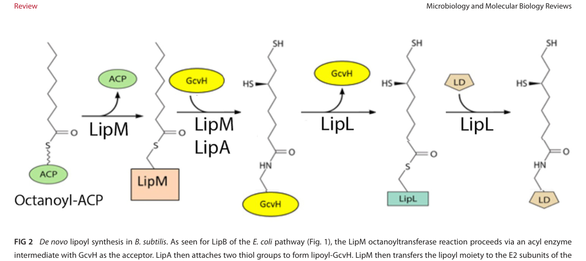

## Question

# Gene Research for Functional Annotation

## ⚠️ CRITICAL: Gene/Protein Identification Context

**BEFORE YOU BEGIN RESEARCH:** You MUST verify you are researching the CORRECT gene/protein. Gene symbols can be ambiguous, especially for less well-characterized genes from non-model organisms.

### Target Gene/Protein Identity (from UniProt):
- **UniProt Accession:** C5AUG1
- **Protein Description:** RecName: Full=Glycine cleavage system H protein {ECO:0000256|HAMAP-Rule:MF_00272};
- **Gene Information:** Name=gcvH {ECO:0000256|HAMAP-Rule:MF_00272, ECO:0000313|EMBL:ACS38551.1}; OrderedLocusNames=MexAM1_META1p0621 {ECO:0000313|EMBL:ACS38551.1};
- **Organism (full):** Methylorubrum extorquens (strain ATCC 14718 / DSM 1338 / JCM 2805 / NCIMB 9133 / AM1) (Methylobacterium extorquens).
- **Protein Family:** Belongs to the GcvH family. {ECO:0000256|ARBA:ARBA00009249,
- **Key Domains:** 2-oxoA_DH_lipoyl-BS. (IPR003016); Biotin_lipoyl. (IPR000089); GCV_H. (IPR002930); GCV_H/Fam206. (IPR033753); GCV_H_sub. (IPR017453)

### MANDATORY VERIFICATION STEPS:

1. **Check if the gene symbol "gcvH" matches the protein description above**
2. **Verify the organism is correct:** Methylorubrum extorquens (strain ATCC 14718 / DSM 1338 / JCM 2805 / NCIMB 9133 / AM1) (Methylobacterium extorquens).
3. **Check if protein family/domains align with what you find in literature**
4. **If you find literature for a DIFFERENT gene with the same or similar symbol, STOP**

### If Gene Symbol is Ambiguous or You Cannot Find Relevant Literature:

**DO NOT PROCEED WITH RESEARCH ON A DIFFERENT GENE.** Instead:
- State clearly: "The gene symbol 'gcvH' is ambiguous or literature is limited for this specific protein"
- Explain what you found (e.g., "Found extensive literature on a different gene with the same symbol in a different organism")
- Describe the protein based ONLY on the UniProt information provided above
- Suggest that the protein function can be inferred from domain/family information

### Research Target:

Please provide a comprehensive research report on the gene **gcvH** (gene ID: gcvH, UniProt: C5AUG1) in METEA.

The research report should be a detailed narrative explaining the function, biological processes, and localization of the gene product. Citations should be given for all claims.

You should prioritize authoritative reviews and primary scientific literature when conducting research. You can supplement
this with annotations you find in gene/protein databases, but these can be outdated or inaccurate.

We are specifically interested in the primary function of the gene - for enzymes, what reaction is catalyzed, and what is the substrate specificity? For transporters, what is the substrate? For structural proteins or adapters, what is the broader structural role? For signaling molecules, what is the role in the pathway.

We are interested in where in or outside the cell the gene product carries out its function.

We are also interested in the signaling or biochemical pathways in which the gene functions. We are less interested in broad pleiotropic effects, except where these elucidate the precise role.

Include evidence where possible. We are interested in both experimental evidence as well as inference from structure, evolution, or bioinformatic analysis. Precise studies should be prioritized over high-throughput, where available.

## Output

Question: You are an expert researcher providing comprehensive, well-cited information.

Provide detailed information focusing on:
1. Key concepts and definitions with current understanding
2. Recent developments and latest research (prioritize 2023-2024 sources)
3. Current applications and real-world implementations
4. Expert opinions and analysis from authoritative sources
5. Relevant statistics and data from recent studies

Format as a comprehensive research report with proper citations. Include URLs and publication dates where available.
Always prioritize recent, authoritative sources and provide specific citations for all major claims.

# Gene Research for Functional Annotation

## ⚠️ CRITICAL: Gene/Protein Identification Context

**BEFORE YOU BEGIN RESEARCH:** You MUST verify you are researching the CORRECT gene/protein. Gene symbols can be ambiguous, especially for less well-characterized genes from non-model organisms.

### Target Gene/Protein Identity (from UniProt):
- **UniProt Accession:** C5AUG1
- **Protein Description:** RecName: Full=Glycine cleavage system H protein {ECO:0000256|HAMAP-Rule:MF_00272};
- **Gene Information:** Name=gcvH {ECO:0000256|HAMAP-Rule:MF_00272, ECO:0000313|EMBL:ACS38551.1}; OrderedLocusNames=MexAM1_META1p0621 {ECO:0000313|EMBL:ACS38551.1};
- **Organism (full):** Methylorubrum extorquens (strain ATCC 14718 / DSM 1338 / JCM 2805 / NCIMB 9133 / AM1) (Methylobacterium extorquens).
- **Protein Family:** Belongs to the GcvH family. {ECO:0000256|ARBA:ARBA00009249,
- **Key Domains:** 2-oxoA_DH_lipoyl-BS. (IPR003016); Biotin_lipoyl. (IPR000089); GCV_H. (IPR002930); GCV_H/Fam206. (IPR033753); GCV_H_sub. (IPR017453)

### MANDATORY VERIFICATION STEPS:

1. **Check if the gene symbol "gcvH" matches the protein description above**
2. **Verify the organism is correct:** Methylorubrum extorquens (strain ATCC 14718 / DSM 1338 / JCM 2805 / NCIMB 9133 / AM1) (Methylobacterium extorquens).
3. **Check if protein family/domains align with what you find in literature**
4. **If you find literature for a DIFFERENT gene with the same or similar symbol, STOP**

### If Gene Symbol is Ambiguous or You Cannot Find Relevant Literature:

**DO NOT PROCEED WITH RESEARCH ON A DIFFERENT GENE.** Instead:
- State clearly: "The gene symbol 'gcvH' is ambiguous or literature is limited for this specific protein"
- Explain what you found (e.g., "Found extensive literature on a different gene with the same symbol in a different organism")
- Describe the protein based ONLY on the UniProt information provided above
- Suggest that the protein function can be inferred from domain/family information

### Research Target:

Please provide a comprehensive research report on the gene **gcvH** (gene ID: gcvH, UniProt: C5AUG1) in METEA.

The research report should be a detailed narrative explaining the function, biological processes, and localization of the gene product. Citations should be given for all claims.

You should prioritize authoritative reviews and primary scientific literature when conducting research. You can supplement
this with annotations you find in gene/protein databases, but these can be outdated or inaccurate.

We are specifically interested in the primary function of the gene - for enzymes, what reaction is catalyzed, and what is the substrate specificity? For transporters, what is the substrate? For structural proteins or adapters, what is the broader structural role? For signaling molecules, what is the role in the pathway.

We are interested in where in or outside the cell the gene product carries out its function.

We are also interested in the signaling or biochemical pathways in which the gene functions. We are less interested in broad pleiotropic effects, except where these elucidate the precise role.

Include evidence where possible. We are interested in both experimental evidence as well as inference from structure, evolution, or bioinformatic analysis. Precise studies should be prioritized over high-throughput, where available.

## Research report: **gcvH** (UniProt **C5AUG1**) — Glycine cleavage system H protein in *Methylorubrum extorquens* AM1

### 1) Gene/protein identity verification (mandatory)

**Target identity (from user-provided UniProt metadata):** UniProt C5AUG1 encodes **glycine cleavage system H protein (GcvH)** from *Methylorubrum extorquens* strain AM1 (syn. *Methylobacterium extorquens* AM1). GcvH proteins are small soluble lipoyl-carrier proteins characterized by a **biotin/lipoyl-binding fold** (lipoyl domain) and a conserved **lipoylable Lys** residue.

**Ambiguity check:** Within the retrieved literature corpus, “gcvH” consistently refers to the **H protein of the glycine cleavage system**, i.e., the lipoyl-bearing carrier subunit of the GCS; no conflicting gene meaning for this symbol was detected in the retrieved documents. However, the retrieved publications did **not** explicitly cross-reference UniProt **C5AUG1** or the AM1 ordered locus **MexAM1_META1p0621**, so strain-specific confirmation beyond the UniProt metadata relies on family-level conservation and pathway consistency rather than a direct accession match. This limitation is explicitly reflected in the confidence statements below. (cronan2024lipoicacidattachment pages 2-4, claassens2022engineeringthereductive pages 7-9)

### 2) Key concepts & current understanding (functional definition)

#### 2.1 The glycine cleavage system (GCS) and the role of GcvH
The glycine cleavage/synthase system is a multi-protein complex typically described as four components:
- **P protein (GcvP)**: glycine dehydrogenase/decarboxylase
- **T protein (GcvT)**: aminomethyltransferase
- **L protein (GcvL/Lpd)**: lipoamide dehydrogenase
- **H protein (GcvH)**: the **lipoyl-bearing carrier/shuttle**

A key, widely accepted mechanistic concept is that **GcvH is a central shuttle protein** that **covalently binds lipoic acid** (lipoylation) and transfers reaction intermediates among catalytic subunits during glycine cleavage or (in reverse) glycine synthesis. (claassens2022engineeringthereductive pages 7-9)

#### 2.2 Reaction context and pathway role (cleavage vs synthase direction)
The GCS is reversible and can connect amino acid metabolism with one-carbon (C1) folate chemistry:
- In the **glycine cleavage** direction, the system is commonly used to break down glycine and generate **C1 units** (as folate-bound intermediates), alongside CO2/NH3 and reducing equivalents.
- In the **reverse (glycine synthase) direction**, the GCS can catalyze the conversion of **methylene-THF + CO2 + NH3 + NADH → glycine**.

A quantitative thermodynamic statistic reported for the reverse direction in a synthetic-metabolism context is **ΔrG0m ≈ +4.9 kJ/mol** (pH 7.5, ionic strength 0.25, all reactants 1 mM), supporting the view that the reverse direction can be feasible under favorable conditions (e.g., elevated CO2 and NH3). (claassens2022engineeringthereductive pages 7-9)

### 3) Lipoylation of GcvH: modification chemistry, enzyme systems, and implications

#### 3.1 What is lipoylation in this context?
**Lipoylation** is a post-translational modification in which lipoic acid is covalently attached (amide linkage) to a conserved lysine on the lipoyl domain of target proteins, including **GcvH**. Functionally, the lipoyl group cycles between oxidized/reduced states and physically carries intermediates between active sites.

A review of lipoate attachment notes that lipoyl acceptor domains are on the order of **~80 residues**, and that **GcvH is a bona fide lipoylated protein**. (cronan2024lipoicacidattachment pages 2-4)

#### 3.2 Canonical bacterial routes for assembling lipoyl-GcvH
A contemporary authoritative synthesis (Microbiology and Molecular Biology Reviews, 2024) describes canonical bacterial logic as a two-stage process:
1) **Octanoylation**: octanoate is transferred from octanoyl-ACP to protein acceptors (including GcvH) by octanoyltransferases such as **LipB** (in *E. coli*) or **LipM** (in some Firmicutes). (cronan2024lipoicacidattachment pages 2-4)
2) **Sulfur insertion**: **LipA** (lipoyl synthase; radical SAM enzyme) inserts sulfur atoms into the protein-bound octanoyl group to form the mature lipoyl cofactor. Importantly, the **protein-bound octanoyl domain is the LipA substrate**, whereas octanoyl-ACP itself is not a LipA substrate. (cronan2024lipoicacidattachment pages 2-4)

#### 3.3 Lipoyl “relay” biology (GcvH as a hub) and why it matters
A major mechanistic insight emphasized for some bacteria (e.g., *Bacillus subtilis*) is a **lipoyl relay pathway** in which:
- LipM octanoylates **GcvH**
- LipA converts octanoyl-GcvH to **lipoyl-GcvH**
- LipL transfers lipoyl groups from GcvH to E2 subunits of 2-oxoacid dehydrogenases

Deletion of **gcvH** in this relay context causes **lipoate auxotrophy**, supporting the concept that GcvH can be an **obligate intermediate** in de novo lipoylation of other complexes in those organisms. (cronan2024lipoicacidattachment pages 4-7)

A key “specificity rule” highlighted in the 2024 review is that **a single glutamate residue positioned three residues upstream of the lipoyl-lysine** can dictate whether a ligase (e.g., LplJ) modifies a given acceptor protein, illustrating how sequence context can tune which proteins become lipoylated. (cronan2024lipoicacidattachment pages 4-7)

**Visual evidence:** A schematic of the *B. subtilis* lipoyl relay pathway placing **GcvH at the center of octanoylation → sulfur insertion → transfer to E2 lipoyl domains** is available from the retrieved figure. (cronan2024lipoicacidattachment media 297ebf5f)

### 4) Genetic context and localization: what can be said for AM1 (and what cannot)

#### 4.1 Operon/genetic organization (general bacterial expectation)
A review of reductive glycine pathway engineering notes that **gcvT, gcvH, and gcvP** are commonly **co-localized** in a single operon/locus, whereas the **L protein (gcvL/lpd)** is often encoded elsewhere because it also participates in pyruvate and α-ketoglutarate dehydrogenase complexes. (claassens2022engineeringthereductive pages 9-11)

#### 4.2 Cellular localization
For bacteria, the GCS and folate-linked one-carbon transformations are typically **soluble cytosolic** processes. No retrieved AM1-focused primary paper directly localizes UniProt C5AUG1 experimentally, so localization for AM1 should be treated as **inferred** (cytosolic), not directly demonstrated in this evidence set. (cronan2024lipoicacidattachment pages 2-4, claassens2022engineeringthereductive pages 7-9)

### 5) Organism-specific context in *Methylorubrum extorquens* lineages (closest available evidence)

Direct experimental literature explicitly keyed to UniProt C5AUG1 / MexAM1_META1p0621 was not retrieved here; nonetheless, several 2024 studies provide relevant *Methylorubrum* context for glycine/C1 metabolism modules.

#### 5.1 Glycine betaine utilization intersects with C1 and glycine metabolism
A 2024 Applied and Environmental Microbiology study examined glycine betaine (GB) utilization in *Methylorubrum extorquens* strains, including an **AM1 WT (Δbcs)** strain that showed measurable growth on GB with **growth rate 0.103** and **doubling time 6.71 h** in their assay conditions. (hying2024glycinebetainemetabolism pages 4-6)

In the same study, strain PA1 genetics were used to probe one-carbon metabolism dependencies during GB catabolism. Notably, the authors constructed a mutant deleting the **glycine cleavage complex genes** as **ΔgcvPHT** (loci **Mext_0853–0855** in PA1) in a background already deleted for **ftfL** (a key assimilatory C1 enzyme). Under GB growth conditions, the **dgcBP30LΔftfLΔgcvPHT** strain still grew (**growth rate 0.112; doubling time 6.14 h**), and the paper interprets this as consistent with GB/DMG demethylation yielding free formaldehyde for oxidation while sarcosine demethylation could provide sufficient methylene-THF for one-carbon metabolism under those specific conditions. (hying2024glycinebetainemetabolism pages 4-6, hying2024glycinebetainemetabolism pages 9-11)

**Interpretation for AM1 functional annotation:** While these data are not AM1 gcvH knockouts and do not directly test C5AUG1, they reinforce that in *Methylorubrum* lineages glycine/C1 modules (including glycine cleavage complex genes) are genetically tractable and can be conditionally dispensable depending on which C1 sources are available.

#### 5.2 Presence of gcv loci in extorquens strains (catalog-level evidence)
A synthetic metabolism compendium lists extorquens-associated entries containing **gcvTHP** (and variants including split gcvP subunits) on either plasmid or genome, supporting the expectation that extorquens strains encode the canonical GCS core genes. This does not resolve AM1-specific operon boundaries or link to C5AUG1 directly, but supports pathway presence. (claassens2022engineeringthereductive pages 26-26)

### 6) Recent developments (prioritizing 2023–2024)

#### 6.1 2024: Consolidation of lipoylation biology and expanded pathways
Cronan (2024, *Microbiology and Molecular Biology Reviews*) reviews multiple expansions of the classical picture of lipoate attachment, including new salvage/ligase routes, broader organismal distribution, and mechanistic details such as relay pathways and acceptor specificity determinants, all of which are directly relevant because **GcvH is one of the core lipoylated targets**. (cronan2024lipoicacidattachment pages 1-2, cronan2024lipoicacidattachment pages 2-4)

#### 6.2 2023: A novel lipoate assembly pathway (sLpl(AB)–LipS1/LipS2)
Tanabe et al. (2023, *PLOS Biology*) provided experimental evidence for a **novel lipoate assembly pathway** involving an sLpl(AB) ligase plus two radical SAM proteins (LipS1/LipS2) that together act as a lipoyl synthase system. The discovery was linked to the observation that certain GcvH-like acceptor proteins in sulfur oxidizers were not modified by canonical machineries, motivating genomic-context and phylogenetic analyses that revealed broader diversity and modularity of lipoate assembly than previously appreciated. (tanabe2023identificationofa pages 2-4, tanabe2023identificationofa pages 1-2)

### 7) Current applications and real-world implementations

#### 7.1 Synthetic biology and C1 assimilation
GcvH and the GCS are central components in engineered **reductive glycine pathway** strategies for C1 assimilation and glycine/serine production. (claassens2022engineeringthereductive pages 9-11, claassens2022engineeringthereductive pages 7-9)

A 2024 ACS Synthetic Biology study demonstrated a lysate-based, cell-free multienzyme biocatalyst for amino acid synthesis from CO2 equivalents (formate + bicarbonate) and ammonia. In that system, the reverse GCS module was used for glycine synthesis, and quantitative expression measurements indicated that **gcvH expression was markedly lower than other components**, suggesting GcvH can be an implementation bottleneck in engineered settings. Example quantitative measurements include peaks of ~**5 ng/µL** for gcvL/gcvP/lplA and ~**20 ng/µL** for gcvT, with a tested **gcvHLPT gene ratio of 8:1:1:1**. The work also reports THF depletion dynamics (to **0.38 ± 0.13 mM** after 30 min) and serine titers on the order of **0.11–0.29 mM** depending on module combinations. (chowdhury2024carbonnegativesynthesis pages 7-8)

### 8) Expert analysis: functional annotation conclusions for UniProt C5AUG1 (AM1 gcvH)

#### 8.1 Primary function (high confidence)
By strong conserved-mechanism consensus, GcvH (including C5AUG1) should be annotated as a **lipoyl-bearing carrier/shuttle protein** in the glycine cleavage system, required for transferring reaction intermediates among GCS subunits and enabling folate-linked C1 metabolism. (claassens2022engineeringthereductive pages 7-9)

#### 8.2 Modification state and maturation requirements (high confidence; enzymes may vary)
C5AUG1 is expected to be **lipoylated on a conserved lysine**, with maturation requiring an octanoyl transfer step and a LipA sulfur insertion step. The exact enzymes performing these steps and whether AM1 uses a LipL relay-like architecture are not resolved by the retrieved AM1-focused evidence; however, the biochemical logic of protein-bound octanoyl intermediates and LipA catalysis is well supported across bacteria. (cronan2024lipoicacidattachment pages 2-4, cronan2024lipoicacidattachment pages 4-7)

#### 8.3 Cellular location (moderate confidence)
Absent direct AM1 experimental evidence, the most defensible annotation is that GcvH functions in the **cytosol**, consistent with bacterial central metabolism and the soluble nature of the GCS described in authoritative reviews. (cronan2024lipoicacidattachment pages 2-4, claassens2022engineeringthereductive pages 7-9)

#### 8.4 Pathway placement in AM1 physiology (moderate-to-low confidence with this corpus)
*M. extorquens* AM1 is a serine-cycle methylotroph, and in principle the GCS can interface with methylene-THF pools and glycine/serine interconversions. Nevertheless, within the retrieved corpus we did not obtain a primary AM1 study directly interrogating **gcvH (C5AUG1)** (e.g., mutant phenotypes, flux roles during methylotrophic growth). Closest available evidence comes from related *Methylorubrum* strain genetics during glycine betaine utilization and a catalog-level listing of gcv loci in extorquens strains. (hying2024glycinebetainemetabolism pages 4-6, hying2024glycinebetainemetabolism pages 9-11, claassens2022engineeringthereductive pages 26-26)

### 9) Summary table (evidence-backed)

| Aspect | Summary | Evidence / quantitative details |
|---|---|---|
| Verified target identity | UniProt C5AUG1 is consistent with **gcvH**, the **glycine cleavage system H protein** of *Methylorubrum extorquens* AM1; retrieved literature did not reveal a conflicting use of the symbol in this context. Family/domain interpretation is consistent with a lipoyl-carrier H protein of the GCS. | Conserved GcvH definition as lipoyl-bearing H protein in GCS (cronan2024lipoicacidattachment pages 2-4, claassens2022engineeringthereductive pages 7-9) |
| Primary molecular function | GcvH is the **lipoyl-bearing carrier/shuttle protein** of the glycine cleavage/synthase system. It covalently binds lipoate and transfers reaction intermediates among the P, T, and L proteins during reversible glycine cleavage/synthesis. | Defined as a “central shuttle protein” that covalently binds lipoic acid; part of reversible GCS/rGlyP chemistry (claassens2022engineeringthereductive pages 7-9) |
| Reaction / pathway context | In the glycine cleavage direction, GCS converts glycine into C1 units, CO2, NH3, and reducing equivalents; in the reverse direction it can synthesize glycine from methylene-THF, CO2, NH3, and NADH. In methylotrophs this connects GcvH to one-carbon metabolism and the serine cycle interface. | Reverse GCS thermodynamics reported as **ΔrG0m ≈ +4.9 kJ/mol** at pH 7.5, ionic strength 0.25, all reactants 1 mM; favored by elevated CO2 and NH3 (claassens2022engineeringthereductive pages 7-9) |
| Post-translational modification | GcvH carries a covalently attached **lipoyl** group on a conserved lysine; lipoylation is essential for carrier function. The precursor is usually **octanoyl-GcvH**, then sulfur atoms are inserted to yield lipoyl-GcvH. | Lipoyl acceptor domains are ~**80 aa**; GcvH is a bona fide lipoylated protein (cronan2024lipoicacidattachment pages 2-4) |
| Lipoylation enzymes and routes | Canonical bacterial routes include **LipB** or **LipM** for octanoyl transfer, **LipA** for sulfur insertion, **LipL** for amidotransfer/relay in some bacteria, and **LplA/LplJ** for salvage ligation of free lipoate or octanoate. In *B. subtilis*, LipM acts first on GcvH, LipA converts octanoyl-GcvH to lipoyl-GcvH, and LipL relays lipoyl groups to E2 subunits. | Deletion of **gcvH** in the relay system causes lipoate auxotrophy; ligase specificity can depend on a glutamate residue 3 positions upstream of the target lysine (cronan2024lipoicacidattachment pages 4-7, cronan2024lipoicacidattachment pages 2-4) |
| Recent lipoylation developments (2023–2024) | Recent work expanded lipoylation biology beyond canonical pathways: a **novel sLpl(AB)–LipS1/S2** lipoate assembly pathway was identified in 2023, and 2024 reviews synthesized new lipoyl-relay, salvage, and specificity mechanisms. | Novel pathway discovery and evolutionary analysis (tanabe2023identificationofa pages 2-4, tanabe2023identificationofa pages 1-2); broad 2024 synthesis of attachment/salvage advances (cronan2024lipoicacidattachment pages 1-2) |
| Cellular localization | For bacterial GcvH, the functional expectation is **cytosolic** localization because the GCS and associated folate/C1 reactions are soluble central metabolic processes. No retrieved AM1 paper directly localized C5AUG1 experimentally. | General bacterial GCS context supports cytosolic role; no direct AM1 localization found (cronan2024lipoicacidattachment pages 2-4, claassens2022engineeringthereductive pages 7-9) |
| Genetic context | GCS genes often occur with **gcvT, gcvH, gcvP** co-localized in an operon/locus, whereas **lpd/gcvL** may be encoded elsewhere because it also serves other dehydrogenase complexes. Some organisms carry split **gcvP** subunits. | Operon tendency: T/H/P co-localized; L often outside due to shared function (claassens2022engineeringthereductive pages 9-11) |
| Evidence in *Methylorubrum extorquens* lineage | Direct AM1-specific functional papers for UniProt C5AUG1 were limited, but extorquens lineage evidence supports presence/use of GCS genes. A catalog-style source lists extorquens entries with **gcvTHP** on plasmid or genome. | Extorquens-associated **gcvTHP / gcvTHPaPb** entries listed (claassens2022engineeringthereductive pages 26-26) |
| AM1-specific phenotype linked to nearby biology | In a 2024 study of glycine betaine utilization, **AM1 WT (Δbcs)** grew on glycine betaine, showing this species can route GB-derived carbon into central metabolism that intersects glycine/C1 pathways. | **Growth rate 0.103**, **doubling time 6.71 h** for AM1 WT on GB; PA1 WT showed no growth under the same assay (hying2024glycinebetainemetabolism pages 4-6, hying2024glycinebetainemetabolism pages 6-9) |
| PA1 deletion evidence relevant to GCS | In *M. extorquens* PA1, the glycine cleavage complex genes were deleted as **ΔgcvPHT** (loci **Mext_0853–0855**) in a **dgcBP30LΔftfLΔgcvPHT** background. Under glycine betaine growth, this mutant still grew, implying GCS was not essential for GB utilization in that condition. | **dgcBP30LΔftfLΔgcvPHT**: growth rate **0.112**, doubling time **6.14 h**; background lacked both **ftfL** and **gcvPHT** (hying2024glycinebetainemetabolism pages 4-6, hying2024glycinebetainemetabolism pages 9-11) |
| Interpretation of PA1 GB study | The PA1 study concluded that GB/DMG demethylation mainly produced free formaldehyde for oxidation, while sarcosine demethylation could supply sufficient methylene-THF for one-carbon metabolism even when **gcvPHT** and **ftfL** were deleted in that background. | Mutant lacking both primary THF-linked C1 sources had strong defects on most substrates, but **no demonstrable GB-growth defect** in the tested condition (hying2024glycinebetainemetabolism pages 9-11) |
| Synthetic biology / applications | GcvH and GCS are actively used in engineered **reductive glycine pathway** and cell-free C1 assimilation platforms for glycine/serine production from formate/CO2 equivalents. These implementations treat GcvH as a required lipoyl-bearing carrier and sometimes identify it as an expression bottleneck. | In cell-free systems, tested **gcvHLPT ratio = 8:1:1:1**; **gcvL/gcvP/lplA ~5 ng/µL**, **gcvT ~20 ng/µL**, but **gcvH remained low**; THF declined to **0.38 ± 0.13 mM** after 30 min; serine titers ranged **0.11–0.29 mM** depending on module configuration (chowdhury2024carbonnegativesynthesis pages 7-8) |
| Annotation confidence for C5AUG1 | High confidence for **general biochemical role** (lipoyl carrier in GCS); moderate confidence for **AM1-specific pathway placement** in one-carbon metabolism; low confidence for **AM1-specific operon structure/localization/essentiality** because direct C5AUG1-focused literature was not retrieved. | Strong conserved-function evidence, limited direct AM1-specific evidence (cronan2024lipoicacidattachment pages 2-4, claassens2022engineeringthereductive pages 7-9, claassens2022engineeringthereductive pages 26-26) |

*Table: This table summarizes the most relevant functional annotation points for GcvH corresponding to UniProt C5AUG1 in Methylorubrum extorquens AM1. It integrates conserved biochemical function, lipoylation biology, likely cellular context, and the strongest available Methylorubrum-specific evidence and quantitative data.*

### 10) Key cited sources (with URLs and publication dates)
- Cronan, J.E. **“Lipoic acid attachment to proteins: stimulating new developments.”** *Microbiology and Molecular Biology Reviews* (Jun 2024). https://doi.org/10.1128/mmbr.00005-24 (cronan2024lipoicacidattachment pages 1-2, cronan2024lipoicacidattachment pages 2-4)
- Tanabe, T.S. et al. **“Identification of a novel lipoic acid biosynthesis pathway…”** *PLOS Biology* (Jun 2023). https://doi.org/10.1371/journal.pbio.3002177 (tanabe2023identificationofa pages 1-2)
- Hying, Z.T. et al. **“Glycine betaine metabolism is enabled in Methylorubrum extorquens PA1…”** *Applied and Environmental Microbiology* (Jul 2024). https://doi.org/10.1128/aem.02090-23 (hying2024glycinebetainemetabolism pages 4-6, hying2024glycinebetainemetabolism pages 9-11, hying2024glycinebetainemetabolism pages 6-9)
- Chowdhury, S. et al. **“Carbon Negative Synthesis of Amino Acids Using a Cell-Free-Based Biocatalyst.”** *ACS Synthetic Biology* (Nov 2024). https://doi.org/10.1021/acssynbio.4c00359 (chowdhury2024carbonnegativesynthesis pages 7-8)
- Claassens, N.J. et al. **“Engineering the Reductive Glycine Pathway…”** *Advances in Biochemical Engineering/Biotechnology* (Apr 2022). https://doi.org/10.1007/10_2021_181 (claassens2022engineeringthereductive pages 7-9, claassens2022engineeringthereductive pages 9-11)

### 11) Evidence gaps and recommended next retrieval targets (for AM1-specific annotation)
Within the retrieved set, there is no AM1-focused primary study directly characterizing **gcvH (C5AUG1)** (e.g., gene essentiality during methanol growth, operon mapping, proteomic detection of lipoylation site occupancy, or knockout complementation). The most impactful next sources would be:
- AM1 genome/operon annotation resources that explicitly map **MexAM1_META1p0621** to a gcv locus;
- AM1 transcriptomics/proteomics identifying GcvH and its lipoylation state under methylotrophic vs multicarbon growth;
- AM1 mutant studies (ΔgcvH or conditional knockdowns) measuring growth on methanol, glycine, serine, and/or C1/C2 co-substrates.

Despite these gaps, the **core biochemical function** of GcvH as a **lipoyl-bearing carrier protein in GCS** is strongly supported by authoritative mechanistic literature and is consistent with the UniProt-provided family/domain description.

References

1. (cronan2024lipoicacidattachment pages 2-4): John E. Cronan. Lipoic acid attachment to proteins: stimulating new developments. Microbiology and Molecular Biology Reviews, Jun 2024. URL: https://doi.org/10.1128/mmbr.00005-24, doi:10.1128/mmbr.00005-24. This article has 21 citations and is from a domain leading peer-reviewed journal.

2. (claassens2022engineeringthereductive pages 7-9): Nico J. Claassens, Ari Satanowski, Viswanada R. Bysani, Beau Dronsella, Enrico Orsi, Vittorio Rainaldi, Suzan Yilmaz, Sebastian Wenk, and Steffen N. Lindner. Engineering the reductive glycine pathway: a promising synthetic metabolism approach for c1-assimilation. Advances in biochemical engineering/biotechnology, pages 299-350, Apr 2022. URL: https://doi.org/10.1007/10\_2021\_181, doi:10.1007/10\_2021\_181. This article has 35 citations.

3. (cronan2024lipoicacidattachment pages 4-7): John E. Cronan. Lipoic acid attachment to proteins: stimulating new developments. Microbiology and Molecular Biology Reviews, Jun 2024. URL: https://doi.org/10.1128/mmbr.00005-24, doi:10.1128/mmbr.00005-24. This article has 21 citations and is from a domain leading peer-reviewed journal.

4. (cronan2024lipoicacidattachment media 297ebf5f): John E. Cronan. Lipoic acid attachment to proteins: stimulating new developments. Microbiology and Molecular Biology Reviews, Jun 2024. URL: https://doi.org/10.1128/mmbr.00005-24, doi:10.1128/mmbr.00005-24. This article has 21 citations and is from a domain leading peer-reviewed journal.

5. (claassens2022engineeringthereductive pages 9-11): Nico J. Claassens, Ari Satanowski, Viswanada R. Bysani, Beau Dronsella, Enrico Orsi, Vittorio Rainaldi, Suzan Yilmaz, Sebastian Wenk, and Steffen N. Lindner. Engineering the reductive glycine pathway: a promising synthetic metabolism approach for c1-assimilation. Advances in biochemical engineering/biotechnology, pages 299-350, Apr 2022. URL: https://doi.org/10.1007/10\_2021\_181, doi:10.1007/10\_2021\_181. This article has 35 citations.

6. (hying2024glycinebetainemetabolism pages 4-6): Zachary T. Hying, Tyler J. Miller, Chin Yi Loh, and Jannell V. Bazurto. Glycine betaine metabolism is enabled in <i>methylorubrum extorquens</i> pa1 by alterations to dimethylglycine dehydrogenase. Applied and Environmental Microbiology, Jul 2024. URL: https://doi.org/10.1128/aem.02090-23, doi:10.1128/aem.02090-23. This article has 6 citations and is from a peer-reviewed journal.

7. (hying2024glycinebetainemetabolism pages 9-11): Zachary T. Hying, Tyler J. Miller, Chin Yi Loh, and Jannell V. Bazurto. Glycine betaine metabolism is enabled in <i>methylorubrum extorquens</i> pa1 by alterations to dimethylglycine dehydrogenase. Applied and Environmental Microbiology, Jul 2024. URL: https://doi.org/10.1128/aem.02090-23, doi:10.1128/aem.02090-23. This article has 6 citations and is from a peer-reviewed journal.

8. (claassens2022engineeringthereductive pages 26-26): Nico J. Claassens, Ari Satanowski, Viswanada R. Bysani, Beau Dronsella, Enrico Orsi, Vittorio Rainaldi, Suzan Yilmaz, Sebastian Wenk, and Steffen N. Lindner. Engineering the reductive glycine pathway: a promising synthetic metabolism approach for c1-assimilation. Advances in biochemical engineering/biotechnology, pages 299-350, Apr 2022. URL: https://doi.org/10.1007/10\_2021\_181, doi:10.1007/10\_2021\_181. This article has 35 citations.

9. (cronan2024lipoicacidattachment pages 1-2): John E. Cronan. Lipoic acid attachment to proteins: stimulating new developments. Microbiology and Molecular Biology Reviews, Jun 2024. URL: https://doi.org/10.1128/mmbr.00005-24, doi:10.1128/mmbr.00005-24. This article has 21 citations and is from a domain leading peer-reviewed journal.

10. (tanabe2023identificationofa pages 2-4): Tomohisa Sebastian Tanabe, Martina Grosser, Lea Hahn, Carolin Kümpel, Hanna Hartenfels, Evelyn Vtulkin, Wanda Flegler, and Christiane Dahl. Identification of a novel lipoic acid biosynthesis pathway reveals the complex evolution of lipoate assembly in prokaryotes. PLOS Biology, 21:e3002177, Jun 2023. URL: https://doi.org/10.1371/journal.pbio.3002177, doi:10.1371/journal.pbio.3002177. This article has 15 citations and is from a highest quality peer-reviewed journal.

11. (tanabe2023identificationofa pages 1-2): Tomohisa Sebastian Tanabe, Martina Grosser, Lea Hahn, Carolin Kümpel, Hanna Hartenfels, Evelyn Vtulkin, Wanda Flegler, and Christiane Dahl. Identification of a novel lipoic acid biosynthesis pathway reveals the complex evolution of lipoate assembly in prokaryotes. PLOS Biology, 21:e3002177, Jun 2023. URL: https://doi.org/10.1371/journal.pbio.3002177, doi:10.1371/journal.pbio.3002177. This article has 15 citations and is from a highest quality peer-reviewed journal.

12. (chowdhury2024carbonnegativesynthesis pages 7-8): Shaafique Chowdhury, Ray Westenberg, Kimberly Wennerholm, Ryan A.L. Cardiff, Alexander S. Beliaev, Vincent Noireaux, James M. Carothers, and Pamela Peralta-Yahya. Carbon negative synthesis of amino acids using a cell-free-based biocatalyst. ACS Synthetic Biology, 13:3961-3975, Nov 2024. URL: https://doi.org/10.1021/acssynbio.4c00359, doi:10.1021/acssynbio.4c00359. This article has 17 citations and is from a domain leading peer-reviewed journal.

13. (hying2024glycinebetainemetabolism pages 6-9): Zachary T. Hying, Tyler J. Miller, Chin Yi Loh, and Jannell V. Bazurto. Glycine betaine metabolism is enabled in <i>methylorubrum extorquens</i> pa1 by alterations to dimethylglycine dehydrogenase. Applied and Environmental Microbiology, Jul 2024. URL: https://doi.org/10.1128/aem.02090-23, doi:10.1128/aem.02090-23. This article has 6 citations and is from a peer-reviewed journal.

## Artifacts

- [Edison artifact artifact-00](gcvH-deep-research-falcon_artifacts/artifact-00.md)

## Citations

1. claassens2022engineeringthereductive pages 7-9
2. cronan2024lipoicacidattachment pages 2-4
3. cronan2024lipoicacidattachment pages 4-7
4. claassens2022engineeringthereductive pages 9-11
5. hying2024glycinebetainemetabolism pages 4-6
6. claassens2022engineeringthereductive pages 26-26
7. chowdhury2024carbonnegativesynthesis pages 7-8
8. cronan2024lipoicacidattachment pages 1-2
9. hying2024glycinebetainemetabolism pages 9-11
10. tanabe2023identificationofa pages 1-2
11. tanabe2023identificationofa pages 2-4
12. hying2024glycinebetainemetabolism pages 6-9
13. https://doi.org/10.1128/mmbr.00005-24
14. https://doi.org/10.1371/journal.pbio.3002177
15. https://doi.org/10.1128/aem.02090-23
16. https://doi.org/10.1021/acssynbio.4c00359
17. https://doi.org/10.1007/10_2021_181
18. https://doi.org/10.1128/mmbr.00005-24,
19. https://doi.org/10.1007/10\_2021\_181,
20. https://doi.org/10.1128/aem.02090-23,
21. https://doi.org/10.1371/journal.pbio.3002177,
22. https://doi.org/10.1021/acssynbio.4c00359,