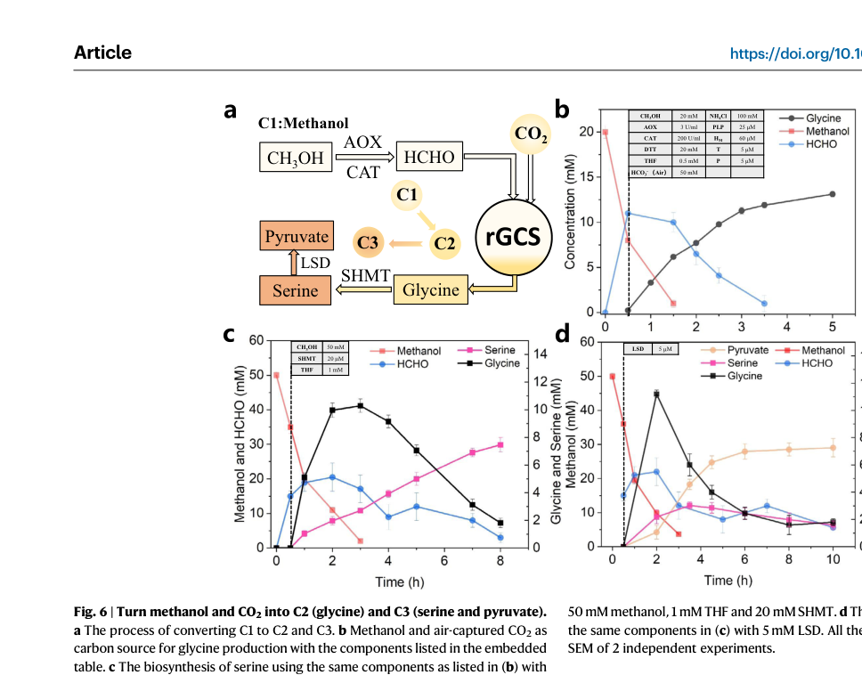

## Question

# Gene Research for Functional Annotation

## ⚠️ CRITICAL: Gene/Protein Identification Context

**BEFORE YOU BEGIN RESEARCH:** You MUST verify you are researching the CORRECT gene/protein. Gene symbols can be ambiguous, especially for less well-characterized genes from non-model organisms.

### Target Gene/Protein Identity (from UniProt):
- **UniProt Accession:** C5AUG0
- **Protein Description:** RecName: Full=Glycine dehydrogenase (decarboxylating) {ECO:0000256|HAMAP-Rule:MF_00711}; EC=1.4.4.2 {ECO:0000256|HAMAP-Rule:MF_00711}; AltName: Full=Glycine cleavage system P-protein {ECO:0000256|HAMAP-Rule:MF_00711}; AltName: Full=Glycine decarboxylase {ECO:0000256|HAMAP-Rule:MF_00711}; AltName: Full=Glycine dehydrogenase (aminomethyl-transferring) {ECO:0000256|HAMAP-Rule:MF_00711};
- **Gene Information:** Name=gcvP {ECO:0000256|HAMAP-Rule:MF_00711, ECO:0000313|EMBL:ACS38550.1}; OrderedLocusNames=MexAM1_META1p0620 {ECO:0000313|EMBL:ACS38550.1};
- **Organism (full):** Methylorubrum extorquens (strain ATCC 14718 / DSM 1338 / JCM 2805 / NCIMB 9133 / AM1) (Methylobacterium extorquens).
- **Protein Family:** Belongs to the GcvP family. {ECO:0000256|ARBA:ARBA00010756,
- **Key Domains:** GcvP. (IPR003437); GDC-P_C. (IPR049316); GDC-P_N. (IPR049315); GDC_P. (IPR020581); PyrdxlP-dep_Trfase. (IPR015424)

### MANDATORY VERIFICATION STEPS:

1. **Check if the gene symbol "gcvP" matches the protein description above**
2. **Verify the organism is correct:** Methylorubrum extorquens (strain ATCC 14718 / DSM 1338 / JCM 2805 / NCIMB 9133 / AM1) (Methylobacterium extorquens).
3. **Check if protein family/domains align with what you find in literature**
4. **If you find literature for a DIFFERENT gene with the same or similar symbol, STOP**

### If Gene Symbol is Ambiguous or You Cannot Find Relevant Literature:

**DO NOT PROCEED WITH RESEARCH ON A DIFFERENT GENE.** Instead:
- State clearly: "The gene symbol 'gcvP' is ambiguous or literature is limited for this specific protein"
- Explain what you found (e.g., "Found extensive literature on a different gene with the same symbol in a different organism")
- Describe the protein based ONLY on the UniProt information provided above
- Suggest that the protein function can be inferred from domain/family information

### Research Target:

Please provide a comprehensive research report on the gene **gcvP** (gene ID: gcvP, UniProt: C5AUG0) in METEA.

The research report should be a detailed narrative explaining the function, biological processes, and localization of the gene product. Citations should be given for all claims.

You should prioritize authoritative reviews and primary scientific literature when conducting research. You can supplement
this with annotations you find in gene/protein databases, but these can be outdated or inaccurate.

We are specifically interested in the primary function of the gene - for enzymes, what reaction is catalyzed, and what is the substrate specificity? For transporters, what is the substrate? For structural proteins or adapters, what is the broader structural role? For signaling molecules, what is the role in the pathway.

We are interested in where in or outside the cell the gene product carries out its function.

We are also interested in the signaling or biochemical pathways in which the gene functions. We are less interested in broad pleiotropic effects, except where these elucidate the precise role.

Include evidence where possible. We are interested in both experimental evidence as well as inference from structure, evolution, or bioinformatic analysis. Precise studies should be prioritized over high-throughput, where available.

## Output

Question: You are an expert researcher providing comprehensive, well-cited information.

Provide detailed information focusing on:
1. Key concepts and definitions with current understanding
2. Recent developments and latest research (prioritize 2023-2024 sources)
3. Current applications and real-world implementations
4. Expert opinions and analysis from authoritative sources
5. Relevant statistics and data from recent studies

Format as a comprehensive research report with proper citations. Include URLs and publication dates where available.
Always prioritize recent, authoritative sources and provide specific citations for all major claims.

# Gene Research for Functional Annotation

## ⚠️ CRITICAL: Gene/Protein Identification Context

**BEFORE YOU BEGIN RESEARCH:** You MUST verify you are researching the CORRECT gene/protein. Gene symbols can be ambiguous, especially for less well-characterized genes from non-model organisms.

### Target Gene/Protein Identity (from UniProt):
- **UniProt Accession:** C5AUG0
- **Protein Description:** RecName: Full=Glycine dehydrogenase (decarboxylating) {ECO:0000256|HAMAP-Rule:MF_00711}; EC=1.4.4.2 {ECO:0000256|HAMAP-Rule:MF_00711}; AltName: Full=Glycine cleavage system P-protein {ECO:0000256|HAMAP-Rule:MF_00711}; AltName: Full=Glycine decarboxylase {ECO:0000256|HAMAP-Rule:MF_00711}; AltName: Full=Glycine dehydrogenase (aminomethyl-transferring) {ECO:0000256|HAMAP-Rule:MF_00711};
- **Gene Information:** Name=gcvP {ECO:0000256|HAMAP-Rule:MF_00711, ECO:0000313|EMBL:ACS38550.1}; OrderedLocusNames=MexAM1_META1p0620 {ECO:0000313|EMBL:ACS38550.1};
- **Organism (full):** Methylorubrum extorquens (strain ATCC 14718 / DSM 1338 / JCM 2805 / NCIMB 9133 / AM1) (Methylobacterium extorquens).
- **Protein Family:** Belongs to the GcvP family. {ECO:0000256|ARBA:ARBA00010756,
- **Key Domains:** GcvP. (IPR003437); GDC-P_C. (IPR049316); GDC-P_N. (IPR049315); GDC_P. (IPR020581); PyrdxlP-dep_Trfase. (IPR015424)

### MANDATORY VERIFICATION STEPS:

1. **Check if the gene symbol "gcvP" matches the protein description above**
2. **Verify the organism is correct:** Methylorubrum extorquens (strain ATCC 14718 / DSM 1338 / JCM 2805 / NCIMB 9133 / AM1) (Methylobacterium extorquens).
3. **Check if protein family/domains align with what you find in literature**
4. **If you find literature for a DIFFERENT gene with the same or similar symbol, STOP**

### If Gene Symbol is Ambiguous or You Cannot Find Relevant Literature:

**DO NOT PROCEED WITH RESEARCH ON A DIFFERENT GENE.** Instead:
- State clearly: "The gene symbol 'gcvP' is ambiguous or literature is limited for this specific protein"
- Explain what you found (e.g., "Found extensive literature on a different gene with the same symbol in a different organism")
- Describe the protein based ONLY on the UniProt information provided above
- Suggest that the protein function can be inferred from domain/family information

### Research Target:

Please provide a comprehensive research report on the gene **gcvP** (gene ID: gcvP, UniProt: C5AUG0) in METEA.

The research report should be a detailed narrative explaining the function, biological processes, and localization of the gene product. Citations should be given for all claims.

You should prioritize authoritative reviews and primary scientific literature when conducting research. You can supplement
this with annotations you find in gene/protein databases, but these can be outdated or inaccurate.

We are specifically interested in the primary function of the gene - for enzymes, what reaction is catalyzed, and what is the substrate specificity? For transporters, what is the substrate? For structural proteins or adapters, what is the broader structural role? For signaling molecules, what is the role in the pathway.

We are interested in where in or outside the cell the gene product carries out its function.

We are also interested in the signaling or biochemical pathways in which the gene functions. We are less interested in broad pleiotropic effects, except where these elucidate the precise role.

Include evidence where possible. We are interested in both experimental evidence as well as inference from structure, evolution, or bioinformatic analysis. Precise studies should be prioritized over high-throughput, where available.

# Research report: **gcvP (UniProt C5AUG0)** in *Methylorubrum extorquens* AM1

## 0. Target verification (mandatory)

**Target identity:** UniProt **C5AUG0** is annotated as **glycine dehydrogenase (decarboxylating)**, also called **glycine cleavage system P-protein / glycine decarboxylase**, **EC 1.4.4.2**, encoded by **gcvP** in *Methylorubrum extorquens* strain AM1. This identity matches the canonical bacterial **glycine cleavage system (GCS)** P-protein described in mechanistic literature (GcvP together with GcvT/GcvH/GcvL). (xu2021standalonelipoylatedhprotein pages 1-5)

**Ambiguity control:** The gene symbol **gcvP** is used broadly across bacteria; therefore, organism-specific claims are restricted to *Methylorubrum extorquens* where direct evidence was retrieved. When AM1-specific data were not found in the current corpus, functional statements are explicitly framed as **conserved GcvP-family inference** supported by mechanistic evidence. (xu2021standalonelipoylatedhprotein pages 1-5, xu2021standalonelipoylatedhprotein pages 5-8)

## 1. Key concepts and definitions (current understanding)

### 1.1 Glycine cleavage system (GCS): definition and core chemistry

The **glycine cleavage system (GCS)** is a multi-enzyme complex comprising **four proteins (P, T, H, L)** that catalyzes the **reversible decarboxylation and deamination of glycine**, yielding **CO2**, **NH3**, and a **one-carbon unit** that is transferred to **tetrahydrofolate (THF)** to form **N5,N10-methylene-THF (5,10-CH2-THF)**. The system is present in many bacteria (cytosol) and in eukaryotes typically in mitochondria; the chemical mechanism and division of labor among P/T/H/L are conserved. (xu2021standalonelipoylatedhprotein pages 1-5)

A stepwise scheme supported by in vitro reconstitution studies is:

1) **P-protein (GcvP; EC 1.4.4.2)** performs the first step, releasing **CO2 from glycine** and generating a **methylamine-loaded lipoylated H-protein intermediate (Hint)** from oxidized H-protein (Hox). (xu2021standalonelipoylatedhprotein pages 1-5)

2) **T-protein (GcvT; EC 2.1.2.10)** then catalyzes **NH3 release** and transfers the **methylene group** from Hint to **THF**, forming **5,10-CH2-THF**, leaving **reduced H-protein (Hred)**. (xu2021standalonelipoylatedhprotein pages 1-5)

3) **L-protein (GcvL; EC 1.8.1.4)** re-oxidizes **Hred → Hox** in the presence of **NAD+**, regenerating the carrier for another catalytic cycle. (xu2021standalonelipoylatedhprotein pages 1-5)

### 1.2 What gcvP encodes

**gcvP** encodes the **P-protein**, commonly referred to as **glycine decarboxylase** or **glycine dehydrogenase (decarboxylating)**. Its defining role is the **initial glycine decarboxylation** step that commits glycine to cleavage and transfers the remaining aminomethyl fragment to the lipoyl arm of the H-protein. (xu2021standalonelipoylatedhprotein pages 1-5)

### 1.3 Cofactors and prosthetic groups

Mechanistic reconstitution indicates the following cofactor logic:

- **P-protein (GcvP)** is **PLP-dependent**; PLP can be **covalently bound to P-protein**, which can explain why externally omitting PLP does not necessarily abolish glycine cleavage if PLP is already bound to purified P-protein. (xu2021standalonelipoylatedhprotein pages 5-8)

- **H-protein (GcvH)** carries a **covalently attached lipoic acid** on a conserved lysine (reported as **Lys64** in the referenced H-protein). This lipoyl group is the “swinging arm” that accepts and transfers intermediates among proteins. (xu2021standalonelipoylatedhprotein pages 5-8)

- **T-protein (GcvT)** requires **THF** as the C1 acceptor; THF absence had a strong negative effect on both cleavage and synthesis direction in vitro. (xu2021standalonelipoylatedhprotein pages 5-8)

- **L-protein (GcvL)** is the redox-recycling enzyme for the lipoyl moiety of H-protein, coupling H-protein oxidation to NAD+/NADH; experimental assays also use **FAD** in place of L-protein in some in vitro contexts, consistent with L-protein flavin chemistry. (xu2021standalonelipoylatedhprotein pages 28-31)

## 2. Primary function of GcvP (reaction, specificity, and mechanism)

### 2.1 Reaction catalyzed by GcvP within the GCS

Within the overall GCS cycle, **GcvP catalyzes glycine decarboxylation** (releasing CO2) and transfers the remaining aminomethyl fragment to the lipoylated H-protein (forming Hint from Hox). This reaction is explicitly described as the first step of the overall cycle. (xu2021standalonelipoylatedhprotein pages 1-5)

In a defined assay for the **“glycine dcarboxylation reaction catalyzed by P-protein”**, reaction mixtures included **glycine**, **Hox (lipoylated H-protein in oxidized form)**, and **PLP**, consistent with PLP-dependence and the requirement for lipoylated carrier protein to accept the transferred intermediate. (xu2021standalonelipoylatedhprotein pages 28-31)

### 2.2 Substrate specificity

The retrieved mechanistic evidence directly documents **glycine** as the P-protein substrate and the formation of CO2 coupled to H-protein intermediate formation. Evidence in this corpus does not provide comparative kinetics across amino acids; thus, for AM1 C5AUG0, **the supported specific substrate is glycine** (the canonical GcvP substrate). (xu2021standalonelipoylatedhprotein pages 1-5, xu2021standalonelipoylatedhprotein pages 28-31)

### 2.3 Essentiality/relative contribution (in vitro component omission)

In a reconstituted in vitro system, removing **P-protein** reduced glycine cleavage activity to **~10.34%** of reference and glycine synthesis activity to **~34.07%**, while removing both **P-protein and PLP** abolished both directions (0% activity). These experiments support GcvP as a major contributor to flux under the tested conditions and reinforce the centrality of PLP-associated chemistry in the P-protein step. (xu2021standalonelipoylatedhprotein pages 5-8)

## 3. Biological processes and pathways relevant to *Methylorubrum extorquens* AM1

### 3.1 Link to one-carbon (C1) metabolism via folate-bound C1 units

The GCS produces **5,10-CH2-THF**, which is a central node in cellular one-carbon metabolism; the methylene unit can be derived from glycine cleavage and is transferred to THF by GcvT. This establishes the conserved rationale for why gcvP is functionally connected to **C1 unit supply** and biosynthetic demand. (xu2021standalonelipoylatedhprotein pages 1-5)

### 3.2 Organism-level context in *Methylorubrum extorquens*: glycine betaine catabolism intersects methylotrophy

A 2024 study in *Methylorubrum extorquens* PA1 examined **glycine betaine (GB)** metabolism and explicitly notes that **GB metabolism generates formaldehyde**, an intermediate of methylotrophic metabolism, motivating investigation in this genus. The same work emphasizes that GB degradation produces **formaldehyde and glycine**, which “may be used simultaneously by facultative methylotrophs,” connecting glycine production/consumption to methylotrophic physiology. (hying2024glycinebetainemetabolism pages 1-3)

Importantly, this paper states that **“Methylorubrum extorquens AM1 can utilize GB as a sole source of carbon and energy; however, the pathway responsible has not been identified.”** This provides direct organism-specific evidence that AM1 has metabolic capacity to route GB-derived carbon/energy, potentially involving glycine/serine/C1 intersections, but it does not experimentally implicate **gcvP (C5AUG0)** directly. (hying2024glycinebetainemetabolism pages 1-3)

### 3.3 Conserved pathway inference for AM1 gcvP

Given the conserved chemistry (Sections 1–2) and the ecological/physiological relevance of glycine and folate-linked C1 metabolism in *Methylorubrum* environments (e.g., plant-associated habitats generating methylated compounds and formaldehyde), the most evidence-supported functional placement for AM1 **gcvP (C5AUG0)** is as the **P-protein of the cytosolic glycine cleavage system**, supplying **CO2 + NH3 + 5,10-CH2-THF** from glycine and participating in glycine/serine/C1 unit balancing. This is an inference grounded in conserved GCS mechanism rather than AM1-specific knockout/flux evidence in the retrieved corpus. (xu2021standalonelipoylatedhprotein pages 1-5, hying2024glycinebetainemetabolism pages 1-3)

## 4. Cellular localization

The mechanistic GCS literature explicitly contrasts eukaryotic mitochondrial localization with bacterial cytosolic localization, describing GCS activity “in the cytosol of many bacteria”. Therefore, the most supported localization for *M. extorquens* AM1 GcvP is **cytosolic** (bacterial cytosol), operating as part of a multi-protein enzyme system rather than a membrane protein or secreted factor. However, **no AM1-specific localization experiment** (e.g., fractionation, microscopy tags) was retrieved in this evidence set. (xu2021standalonelipoylatedhprotein pages 1-5)

## 5. Recent developments (prioritizing 2023–2024) and real-world implementations

### 5.1 2023: Re-engineered GCS enables conversion of methanol + air-captured CO2 to glycine/serine/pyruvate

A 2023 Nature Communications study presented an **ATP and NAD(P)H-free chemoenzymatic system** (ICE-CAP) that uses a **re-engineered glycine cleavage system (rGCS)** as a core module for **C1/C1 coupling** (methanol-derived formaldehyde + CO2 equivalents) to produce amino acids and pyruvate. The authors explicitly define rGCS as the reversible GCS comprising **T (aminomethyltransferase), P (glycine decarboxylase), L (dihydrolipoamide dehydrogenase), and H (aminomethyl carrier)**. (liu2023turnaircapturedco2 pages 1-2)

**Key quantitative results** (from air-captured CO2 experiments):

- From **methanol + air-captured CO2 (as bicarbonate)**: **13.2 mM glycine (1.0 g/L)** in **5 h**; reported yields **66% based on methanol** and **26% based on CO2**. (liu2023turnaircapturedco2 pages 7-8, liu2023turnaircapturedco2 media b8b87b3a)

- With additional extension modules, final concentrations reached **7.5 mM serine (0.8 g/L)** in **8 h** and **6.9 mM pyruvate (0.6 g/L)** in **5 h**, with reported yields for serine **30% (methanol)** and **15% (CO2)**. (liu2023turnaircapturedco2 pages 7-8, liu2023turnaircapturedco2 media b8b87b3a)

- In a related integrated capture/use step described in the same work, **17.1 mM (1.3 g/L) glycine** was achieved in **5.5 h** with yield **86% based on formaldehyde** and **34% based on CO2**. (liu2023turnaircapturedco2 pages 7-8)

These results are not derived from *M. extorquens* AM1 proteins specifically, but they demonstrate the high current interest in GcvP-family enzymes as **biocatalytic modules for C1-based manufacturing** and highlight the importance of controlling the H-protein redox state and lipoyl arm accessibility for flux control. (liu2023turnaircapturedco2 pages 1-2, liu2023turnaircapturedco2 pages 7-8)

### 5.2 2024: *Methylorubrum extorquens* PA1 glycine betaine metabolism provides an ecological link to glycine and formaldehyde

The 2024 Applied and Environmental Microbiology study provides a **real-world ecological implementation context** for *Methylorubrum*: on leaf surfaces (phyllosphere), methylated substrates such as glycine betaine can be encountered, producing **formaldehyde** and **glycine**. This directly links environmental methylated-compound utilization with pathways that can consume glycine and manage formaldehyde-derived C1 flux. (hying2024glycinebetainemetabolism pages 1-3)

## 6. Expert opinions and authoritative analysis (from sources in this corpus)

- Mechanistic analysis emphasizes that the GCS is central to **C1 metabolism** and that in modern C1 synthetic biology the **reductive glycine pathway (rGP/rGlyP)** uses the **reversibility** of the GCS as a core engine, with the reaction catalyzed by GCS described as a **rate-limiting step** for the pathway, motivating enzyme and system engineering. (xu2021standalonelipoylatedhprotein pages 1-5, xu2021standalonelipoylatedhprotein pages 5-8)

- The 2023 ICE-CAP authors argue that chemical reduction of H-protein (replacing the NAD(P)H-dependent L-protein step in their engineered system) can increase thermodynamic driving force and “determine the reaction direction,” illustrating a modern expert view: **GCS directionality and flux are tunable via redox and carrier-protein engineering**. (liu2023turnaircapturedco2 pages 1-2)

## 7. Evidence-backed statistics and data highlights

### 7.1 Quantitative mechanistic data (protein/component dependence)

In the in vitro reconstituted system, reported relative rate changes upon omission of components show:

- **−P-protein:** ~10.34% glycine cleavage; ~34.07% glycine synthesis (vs reference). (xu2021standalonelipoylatedhprotein pages 5-8)
- **−T-protein:** ~51.91% cleavage; ~76.53% synthesis. (xu2021standalonelipoylatedhprotein pages 5-8)
- **−L-protein:** ~37.55% cleavage; ~74.78% synthesis. (xu2021standalonelipoylatedhprotein pages 5-8)
- **−THF:** ~3.88% cleavage; ~8.94% synthesis (strongest impairment among listed omissions). (xu2021standalonelipoylatedhprotein pages 5-8)

These data support the view that while individual proteins contribute significantly, **folate (THF) availability** can be a dominant limiter under certain in vitro conditions—relevant for interpreting metabolic constraints in vivo. (xu2021standalonelipoylatedhprotein pages 5-8)

### 7.2 Quantitative application data (2023 ICE-CAP)

Figure evidence (glycine/serine/pyruvate from methanol + air-captured CO2) is shown in the cropped Figure 6 images. (liu2023turnaircapturedco2 media b8b87b3a, liu2023turnaircapturedco2 media c62a74bc)

## 8. Summary functional annotation for METEA gcvP (C5AUG0)

**Recommended primary function annotation (evidence-supported):**

- **Protein:** Glycine dehydrogenase (decarboxylating) / glycine cleavage system P-protein (GcvP)
- **EC:** 1.4.4.2
- **Reaction role:** First step of glycine cleavage; decarboxylates glycine (→ CO2) and transfers the remaining aminomethyl fragment to the lipoylated H-protein intermediate; feeds one-carbon metabolism through downstream GcvT production of **5,10-CH2-THF**. (xu2021standalonelipoylatedhprotein pages 1-5, xu2021standalonelipoylatedhprotein pages 28-31)
- **Cofactors:** PLP-associated chemistry on P-protein; requires lipoylated H-protein as carrier in the multi-protein system; functionally coupled to THF (via GcvT) and NAD+/FAD redox recycling (via GcvL). (xu2021standalonelipoylatedhprotein pages 5-8, xu2021standalonelipoylatedhprotein pages 28-31)
- **Localization:** Cytosolic in bacteria (AM1-specific experimental localization not retrieved). (xu2021standalonelipoylatedhprotein pages 1-5)
- **Pathway context in *Methylorubrum*:** intersects with methylotrophic environments and substrates (e.g., glycine betaine producing formaldehyde and glycine); AM1 can grow on glycine betaine though genes were not identified in the cited work. (hying2024glycinebetainemetabolism pages 1-3)

## 9. Limitations of the current evidence set (important for annotation confidence)

- **No AM1-specific gcvP perturbation or biochemical characterization** (e.g., gene deletion phenotype, expression/regulation, or purified AM1 enzyme kinetics) was retrieved in this run; therefore AM1-specific conclusions are limited to conserved-function inference plus organism-level metabolic context. (hying2024glycinebetainemetabolism pages 1-3, xu2021standalonelipoylatedhprotein pages 1-5)

- **Substrate specificity beyond glycine** and detailed AM1 structural features/domains were not extractable from the retrieved full-text set; the UniProt-provided domain architecture (GcvP family) remains the best source for those aspects, but it was not directly cited here because UniProt text was not retrieved via tools in this run.

---

## Evidence summary table

| Component | Enzyme name (EC) | Reaction step / role | Key cofactors / prosthetic groups | Evidence type | Key quantitative data (if any) | Notes for *Methylorubrum extorquens* AM1 context | Primary sources (DOI URL, year) |
|---|---|---|---|---|---|---|---|
| GcvP | Glycine dehydrogenase (decarboxylating) / glycine decarboxylase P-protein (EC 1.4.4.2) | First step of glycine cleavage: decarboxylates glycine, releasing CO2 and generating aminomethylated/lipoylated H-protein intermediate (Hint) from oxidized H-protein (Hox) | PLP is required/associated with P-protein; acts with lipoylated H-protein as acceptor of the aminomethyl moiety | Mechanistic in vitro; pathway engineering | In reconstituted GCS, omission of P-protein reduced glycine-cleavage activity to 10.34% of reference and glycine-synthesis activity to 34.07%; omission of both P-protein and PLP abolished both directions; reference cleavage rate 22.48 ± 3.47 μM HCHO·min⁻¹ and synthesis rate 5.95 ± 0.13 μM glycine·min⁻¹ (xu2021standalonelipoylatedhprotein pages 5-8, xu2021standalonelipoylatedhprotein pages 24-28) | UniProt C5AUG0 in AM1 is annotated as this conserved family member. Direct AM1-specific biochemical characterization was not retrieved, so function is inferred from conserved bacterial GCS chemistry consistent with the annotation (xu2021standalonelipoylatedhprotein pages 1-5, xu2021standalonelipoylatedhprotein pages 5-8) | Xu et al., https://doi.org/10.1101/2021.03.28.437365, 2021 (xu2021standalonelipoylatedhprotein pages 1-5, xu2021standalonelipoylatedhprotein pages 5-8, xu2021standalonelipoylatedhprotein pages 24-28, xu2021standalonelipoylatedhprotein pages 28-31) |
| GcvT | Aminomethyltransferase / T-protein (EC 2.1.2.10) | Second step: releases NH3 and transfers the one-carbon unit from Hint to THF to form 5,10-methylene-THF, leaving reduced H-protein (Hred) | THF is the one-carbon acceptor; reaction depends on aminomethyl transfer to folate pool | Mechanistic in vitro; pathway engineering | Omission of T-protein reduced glycine-cleavage activity to 51.91% and glycine-synthesis activity to 76.53%; omission of THF reduced activities more severely to 3.88% and 8.94%, respectively (xu2021standalonelipoylatedhprotein pages 5-8, xu2021standalonelipoylatedhprotein pages 28-31) | In methylotrophic alphaproteobacteria such as *Methylorubrum*, this step is relevant because it feeds 5,10-CH2-THF into C1 metabolism; direct AM1 gcvT/gcvP operon-level evidence was not retrieved here (xu2021standalonelipoylatedhprotein pages 1-5) | Xu et al., https://doi.org/10.1101/2021.03.28.437365, 2021 (xu2021standalonelipoylatedhprotein pages 1-5, xu2021standalonelipoylatedhprotein pages 5-8, xu2021standalonelipoylatedhprotein pages 28-31) |
| GcvH | Glycine cleavage system H-protein / aminomethyl carrier H-protein (no EC assigned as carrier protein) | Lipoyl-armed carrier that shuttles reaction intermediates among P-, T-, and L-proteins; cycles through oxidized (Hox), aminomethylated (Hint), and reduced (Hred) states | Covalently attached lipoic acid on conserved Lys64; lipoyl arm is central prosthetic group | Mechanistic in vitro; pathway engineering | H-protein is essential in vitro; no reaction without Hox. Lipoylated H-protein alone could support glycine synthesis and, with FAD, glycine cleavage in vitro; full GCS kcat ~0.01 s⁻¹ versus H-protein-alone ~0.0057 s⁻¹ in the reported system (xu2021standalonelipoylatedhprotein pages 21-24, xu2021standalonelipoylatedhprotein pages 17-21) | Although not specific to AM1, the conserved requirement for lipoylated GcvH supports annotation of C5AUG0 as part of a canonical bacterial glycine cleavage system rather than an unrelated protein (xu2021standalonelipoylatedhprotein pages 5-8, xu2021standalonelipoylatedhprotein pages 24-28) | Xu et al., https://doi.org/10.1101/2021.03.28.437365, 2021 (xu2021standalonelipoylatedhprotein pages 21-24, xu2021standalonelipoylatedhprotein pages 17-21, xu2021standalonelipoylatedhprotein pages 5-8, xu2021standalonelipoylatedhprotein pages 24-28) |
| GcvL | Dihydrolipoyl dehydrogenase / L-protein (EC 1.8.1.4) | Third step: reoxidizes reduced H-protein (Hred) to Hox, coupling electron transfer to NAD+ reduction | FAD-associated flavin chemistry and NAD+/NADH redox pair | Mechanistic in vitro; pathway engineering | Omission of L-protein reduced glycine-cleavage activity to 37.55% and glycine-synthesis activity to 74.78%; in H-protein-only cleavage assays, 40 μM FAD enabled activity with 5 mM NAD+ (xu2021standalonelipoylatedhprotein pages 5-8, xu2021standalonelipoylatedhprotein pages 24-28, xu2021standalonelipoylatedhprotein pages 28-31) | For AM1, GcvL is expected to be the redox-recycling partner of GcvP/H/T in the cytosolic bacterial GCS; no direct AM1-specific localization experiment was found in retrieved evidence (xu2021standalonelipoylatedhprotein pages 1-5, xu2021standalonelipoylatedhprotein pages 24-28) | Xu et al., https://doi.org/10.1101/2021.03.28.437365, 2021 (xu2021standalonelipoylatedhprotein pages 1-5, xu2021standalonelipoylatedhprotein pages 5-8, xu2021standalonelipoylatedhprotein pages 24-28, xu2021standalonelipoylatedhprotein pages 28-31) |
| GcvP/GcvT/GcvH/GcvL system | Reversible glycine cleavage system (overall pathway module) | Overall reversible reaction: glycine ⇌ CO2 + NH3 + 5,10-CH2-THF-linked C1 transfer; in the reverse direction, forms glycine from NH4+, CO2, and 5,10-CH2-THF equivalents | PLP, lipoyl-H, THF, FAD/NAD(H) | Pathway engineering | In a 2023 chemoenzymatic rGCS platform using methanol + air-captured CO2, glycine reached 17.1 mM (1.3 g/L) in 5.5 h with 86% yield based on formaldehyde and 34% on CO2; from methanol + air-captured CO2, glycine reached 13.2 mM (1.0 g/L) in 5 h, serine 7.5 mM (0.8 g/L) in 8 h, and pyruvate 6.9 mM (0.6 g/L) in 5 h (liu2023turnaircapturedco2 pages 1-2, liu2023turnaircapturedco2 pages 7-8) | These engineering data are not from AM1, but they illustrate why GcvP-family enzymes are of current interest in C1 biomanufacturing and support the importance of the conserved reaction assigned to C5AUG0 (liu2023turnaircapturedco2 pages 1-2, liu2023turnaircapturedco2 pages 7-8) | Liu et al., https://doi.org/10.1038/s41467-023-38490-w, 2023 (liu2023turnaircapturedco2 pages 1-2, liu2023turnaircapturedco2 pages 7-8) |
| Glycine/C1 metabolism context | Intersection with glycine betaine catabolism and methylotrophy | In *Methylorubrum extorquens* physiology, glycine betaine degradation yields formaldehyde and glycine; formaldehyde enters methylotrophic metabolism and glycine can enter central metabolism via serine/pyruvate routes | THF-linked C1 metabolism and serine/glycine network implied; no direct cofactor assignment to AM1 GcvP in this physiology paper | Organism physiology | *M. extorquens* PA1 could not use glycine betaine as sole carbon source in wild type, whereas AM1 was reported as able to use glycine betaine as sole carbon and energy source; in PA1 experiments, growth assays used 8 mM glycine betaine (hying2024glycinebetainemetabolism pages 1-3) | This is the closest organism-specific evidence linking *Methylorubrum* glycine metabolism to C1 metabolism, but it does not directly characterize AM1 gcvP/C5AUG0; thus AM1 pathway assignment for gcvP remains inference-backed rather than directly tested here (hying2024glycinebetainemetabolism pages 1-3) | Hying et al., https://doi.org/10.1128/aem.02090-23, 2024 (hying2024glycinebetainemetabolism pages 1-3) |

*Table: This table summarizes the conserved functional annotation of bacterial GcvP and its partner proteins in the glycine cleavage system, with emphasis on evidence relevant to UniProt C5AUG0 from *Methylorubrum extorquens* AM1. It distinguishes direct mechanistic evidence from broader pathway-engineering and organism-physiology context, which is important because AM1-specific experimental literature for C5AUG0 was limited.*

References

1. (xu2021standalonelipoylatedhprotein pages 1-5): Yingying Xu, Yuchen Li, Han Zhang, Jinglei Nie, Jie Ren, Wei Wang, and An-Ping Zeng. Stand-alone lipoylated h-protein of the glycine cleavage system enables glycine cleavage and the synthesis of glycine from one-carbon compounds in vitro. bioRxiv, Mar 2021. URL: https://doi.org/10.1101/2021.03.28.437365, doi:10.1101/2021.03.28.437365. This article has 3 citations.

2. (xu2021standalonelipoylatedhprotein pages 5-8): Yingying Xu, Yuchen Li, Han Zhang, Jinglei Nie, Jie Ren, Wei Wang, and An-Ping Zeng. Stand-alone lipoylated h-protein of the glycine cleavage system enables glycine cleavage and the synthesis of glycine from one-carbon compounds in vitro. bioRxiv, Mar 2021. URL: https://doi.org/10.1101/2021.03.28.437365, doi:10.1101/2021.03.28.437365. This article has 3 citations.

3. (xu2021standalonelipoylatedhprotein pages 28-31): Yingying Xu, Yuchen Li, Han Zhang, Jinglei Nie, Jie Ren, Wei Wang, and An-Ping Zeng. Stand-alone lipoylated h-protein of the glycine cleavage system enables glycine cleavage and the synthesis of glycine from one-carbon compounds in vitro. bioRxiv, Mar 2021. URL: https://doi.org/10.1101/2021.03.28.437365, doi:10.1101/2021.03.28.437365. This article has 3 citations.

4. (hying2024glycinebetainemetabolism pages 1-3): Zachary T. Hying, Tyler J. Miller, Chin Yi Loh, and Jannell V. Bazurto. Glycine betaine metabolism is enabled in <i>methylorubrum extorquens</i> pa1 by alterations to dimethylglycine dehydrogenase. Applied and Environmental Microbiology, Jul 2024. URL: https://doi.org/10.1128/aem.02090-23, doi:10.1128/aem.02090-23. This article has 6 citations and is from a peer-reviewed journal.

5. (liu2023turnaircapturedco2 pages 1-2): Jianming Liu, Han Zhang, Yingying Xu, Hao Meng, and An-Ping Zeng. Turn air-captured co2 with methanol into amino acid and pyruvate in an atp/nad(p)h-free chemoenzymatic system. Nature Communications, May 2023. URL: https://doi.org/10.1038/s41467-023-38490-w, doi:10.1038/s41467-023-38490-w. This article has 67 citations and is from a highest quality peer-reviewed journal.

6. (liu2023turnaircapturedco2 pages 7-8): Jianming Liu, Han Zhang, Yingying Xu, Hao Meng, and An-Ping Zeng. Turn air-captured co2 with methanol into amino acid and pyruvate in an atp/nad(p)h-free chemoenzymatic system. Nature Communications, May 2023. URL: https://doi.org/10.1038/s41467-023-38490-w, doi:10.1038/s41467-023-38490-w. This article has 67 citations and is from a highest quality peer-reviewed journal.

7. (liu2023turnaircapturedco2 media b8b87b3a): Jianming Liu, Han Zhang, Yingying Xu, Hao Meng, and An-Ping Zeng. Turn air-captured co2 with methanol into amino acid and pyruvate in an atp/nad(p)h-free chemoenzymatic system. Nature Communications, May 2023. URL: https://doi.org/10.1038/s41467-023-38490-w, doi:10.1038/s41467-023-38490-w. This article has 67 citations and is from a highest quality peer-reviewed journal.

8. (liu2023turnaircapturedco2 media c62a74bc): Jianming Liu, Han Zhang, Yingying Xu, Hao Meng, and An-Ping Zeng. Turn air-captured co2 with methanol into amino acid and pyruvate in an atp/nad(p)h-free chemoenzymatic system. Nature Communications, May 2023. URL: https://doi.org/10.1038/s41467-023-38490-w, doi:10.1038/s41467-023-38490-w. This article has 67 citations and is from a highest quality peer-reviewed journal.

9. (xu2021standalonelipoylatedhprotein pages 24-28): Yingying Xu, Yuchen Li, Han Zhang, Jinglei Nie, Jie Ren, Wei Wang, and An-Ping Zeng. Stand-alone lipoylated h-protein of the glycine cleavage system enables glycine cleavage and the synthesis of glycine from one-carbon compounds in vitro. bioRxiv, Mar 2021. URL: https://doi.org/10.1101/2021.03.28.437365, doi:10.1101/2021.03.28.437365. This article has 3 citations.

10. (xu2021standalonelipoylatedhprotein pages 21-24): Yingying Xu, Yuchen Li, Han Zhang, Jinglei Nie, Jie Ren, Wei Wang, and An-Ping Zeng. Stand-alone lipoylated h-protein of the glycine cleavage system enables glycine cleavage and the synthesis of glycine from one-carbon compounds in vitro. bioRxiv, Mar 2021. URL: https://doi.org/10.1101/2021.03.28.437365, doi:10.1101/2021.03.28.437365. This article has 3 citations.

11. (xu2021standalonelipoylatedhprotein pages 17-21): Yingying Xu, Yuchen Li, Han Zhang, Jinglei Nie, Jie Ren, Wei Wang, and An-Ping Zeng. Stand-alone lipoylated h-protein of the glycine cleavage system enables glycine cleavage and the synthesis of glycine from one-carbon compounds in vitro. bioRxiv, Mar 2021. URL: https://doi.org/10.1101/2021.03.28.437365, doi:10.1101/2021.03.28.437365. This article has 3 citations.

## Artifacts

- [Edison artifact artifact-00](gcvP-deep-research-falcon_artifacts/artifact-00.md)

## Citations

1. xu2021standalonelipoylatedhprotein pages 1-5
2. xu2021standalonelipoylatedhprotein pages 5-8
3. xu2021standalonelipoylatedhprotein pages 28-31
4. hying2024glycinebetainemetabolism pages 1-3
5. xu2021standalonelipoylatedhprotein pages 24-28
6. xu2021standalonelipoylatedhprotein pages 21-24
7. xu2021standalonelipoylatedhprotein pages 17-21
8. https://doi.org/10.1101/2021.03.28.437365,
9. https://doi.org/10.1038/s41467-023-38490-w,
10. https://doi.org/10.1128/aem.02090-23,