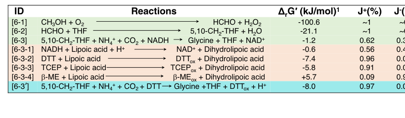

## Question

# Gene Research for Functional Annotation

## ⚠️ CRITICAL: Gene/Protein Identification Context

**BEFORE YOU BEGIN RESEARCH:** You MUST verify you are researching the CORRECT gene/protein. Gene symbols can be ambiguous, especially for less well-characterized genes from non-model organisms.

### Target Gene/Protein Identity (from UniProt):
- **UniProt Accession:** C5AUG2
- **Protein Description:** RecName: Full=aminomethyltransferase {ECO:0000256|ARBA:ARBA00012616}; EC=2.1.2.10 {ECO:0000256|ARBA:ARBA00012616}; AltName: Full=Glycine cleavage system T protein {ECO:0000256|ARBA:ARBA00031395};
- **Gene Information:** Name=gcvT {ECO:0000313|EMBL:ACS38552.1}; OrderedLocusNames=MexAM1_META1p0622 {ECO:0000313|EMBL:ACS38552.1};
- **Organism (full):** Methylorubrum extorquens (strain ATCC 14718 / DSM 1338 / JCM 2805 / NCIMB 9133 / AM1) (Methylobacterium extorquens).
- **Protein Family:** Belongs to the GcvT family.
- **Key Domains:** GCS_T. (IPR006223); GCST_C. (IPR013977); GCV_T_N. (IPR006222); GcvT/YgfZ/DmdA. (IPR028896); GcvT/YgfZ_C. (IPR029043)

### MANDATORY VERIFICATION STEPS:

1. **Check if the gene symbol "gcvT" matches the protein description above**
2. **Verify the organism is correct:** Methylorubrum extorquens (strain ATCC 14718 / DSM 1338 / JCM 2805 / NCIMB 9133 / AM1) (Methylobacterium extorquens).
3. **Check if protein family/domains align with what you find in literature**
4. **If you find literature for a DIFFERENT gene with the same or similar symbol, STOP**

### If Gene Symbol is Ambiguous or You Cannot Find Relevant Literature:

**DO NOT PROCEED WITH RESEARCH ON A DIFFERENT GENE.** Instead:
- State clearly: "The gene symbol 'gcvT' is ambiguous or literature is limited for this specific protein"
- Explain what you found (e.g., "Found extensive literature on a different gene with the same symbol in a different organism")
- Describe the protein based ONLY on the UniProt information provided above
- Suggest that the protein function can be inferred from domain/family information

### Research Target:

Please provide a comprehensive research report on the gene **gcvT** (gene ID: gcvT, UniProt: C5AUG2) in METEA.

The research report should be a detailed narrative explaining the function, biological processes, and localization of the gene product. Citations should be given for all claims.

You should prioritize authoritative reviews and primary scientific literature when conducting research. You can supplement
this with annotations you find in gene/protein databases, but these can be outdated or inaccurate.

We are specifically interested in the primary function of the gene - for enzymes, what reaction is catalyzed, and what is the substrate specificity? For transporters, what is the substrate? For structural proteins or adapters, what is the broader structural role? For signaling molecules, what is the role in the pathway.

We are interested in where in or outside the cell the gene product carries out its function.

We are also interested in the signaling or biochemical pathways in which the gene functions. We are less interested in broad pleiotropic effects, except where these elucidate the precise role.

Include evidence where possible. We are interested in both experimental evidence as well as inference from structure, evolution, or bioinformatic analysis. Precise studies should be prioritized over high-throughput, where available.

## Output

Question: You are an expert researcher providing comprehensive, well-cited information.

Provide detailed information focusing on:
1. Key concepts and definitions with current understanding
2. Recent developments and latest research (prioritize 2023-2024 sources)
3. Current applications and real-world implementations
4. Expert opinions and analysis from authoritative sources
5. Relevant statistics and data from recent studies

Format as a comprehensive research report with proper citations. Include URLs and publication dates where available.
Always prioritize recent, authoritative sources and provide specific citations for all major claims.

# Gene Research for Functional Annotation

## ⚠️ CRITICAL: Gene/Protein Identification Context

**BEFORE YOU BEGIN RESEARCH:** You MUST verify you are researching the CORRECT gene/protein. Gene symbols can be ambiguous, especially for less well-characterized genes from non-model organisms.

### Target Gene/Protein Identity (from UniProt):
- **UniProt Accession:** C5AUG2
- **Protein Description:** RecName: Full=aminomethyltransferase {ECO:0000256|ARBA:ARBA00012616}; EC=2.1.2.10 {ECO:0000256|ARBA:ARBA00012616}; AltName: Full=Glycine cleavage system T protein {ECO:0000256|ARBA:ARBA00031395};
- **Gene Information:** Name=gcvT {ECO:0000313|EMBL:ACS38552.1}; OrderedLocusNames=MexAM1_META1p0622 {ECO:0000313|EMBL:ACS38552.1};
- **Organism (full):** Methylorubrum extorquens (strain ATCC 14718 / DSM 1338 / JCM 2805 / NCIMB 9133 / AM1) (Methylobacterium extorquens).
- **Protein Family:** Belongs to the GcvT family.
- **Key Domains:** GCS_T. (IPR006223); GCST_C. (IPR013977); GCV_T_N. (IPR006222); GcvT/YgfZ/DmdA. (IPR028896); GcvT/YgfZ_C. (IPR029043)

### MANDATORY VERIFICATION STEPS:

1. **Check if the gene symbol "gcvT" matches the protein description above**
2. **Verify the organism is correct:** Methylorubrum extorquens (strain ATCC 14718 / DSM 1338 / JCM 2805 / NCIMB 9133 / AM1) (Methylobacterium extorquens).
3. **Check if protein family/domains align with what you find in literature**
4. **If you find literature for a DIFFERENT gene with the same or similar symbol, STOP**

### If Gene Symbol is Ambiguous or You Cannot Find Relevant Literature:

**DO NOT PROCEED WITH RESEARCH ON A DIFFERENT GENE.** Instead:
- State clearly: "The gene symbol 'gcvT' is ambiguous or literature is limited for this specific protein"
- Explain what you found (e.g., "Found extensive literature on a different gene with the same symbol in a different organism")
- Describe the protein based ONLY on the UniProt information provided above
- Suggest that the protein function can be inferred from domain/family information

### Research Target:

Please provide a comprehensive research report on the gene **gcvT** (gene ID: gcvT, UniProt: C5AUG2) in METEA.

The research report should be a detailed narrative explaining the function, biological processes, and localization of the gene product. Citations should be given for all claims.

You should prioritize authoritative reviews and primary scientific literature when conducting research. You can supplement
this with annotations you find in gene/protein databases, but these can be outdated or inaccurate.

We are specifically interested in the primary function of the gene - for enzymes, what reaction is catalyzed, and what is the substrate specificity? For transporters, what is the substrate? For structural proteins or adapters, what is the broader structural role? For signaling molecules, what is the role in the pathway.

We are interested in where in or outside the cell the gene product carries out its function.

We are also interested in the signaling or biochemical pathways in which the gene functions. We are less interested in broad pleiotropic effects, except where these elucidate the precise role.

Include evidence where possible. We are interested in both experimental evidence as well as inference from structure, evolution, or bioinformatic analysis. Precise studies should be prioritized over high-throughput, where available.

# Research report: **gcvT** (UniProt C5AUG2) in *Methylorubrum extorquens* AM1 (METEA)

## Executive summary
The UniProt target (C5AUG2) is annotated as **aminomethyltransferase** (glycine cleavage system **T-protein**, **GcvT**; **EC 2.1.2.10**) from *Methylorubrum extorquens* strain AM1. Within the glycine cleavage system (GCS), GcvT is the **tetrahydrofolate (THF)-dependent aminomethyl transferase** that converts the aminomethylated intermediate carried by the lipoyl “swinging arm” of the H-protein into **5,10-methylene-THF** while releasing **ammonia**, thereby linking glycine catabolism/synthesis to the cellular **one-carbon (C1) folate pool**. (wittmiss2020stoichiometryoftwo pages 1-2, patel2016expressionofclostridium pages 20-23)

A key limitation of the available corpus retrieved here is that it contains **little direct, AM1-specific experimental characterization** of the particular AM1 protein sequence C5AUG2 (e.g., purified enzyme kinetics, mutant phenotypes in AM1). Accordingly, AM1-specific statements below are anchored to (i) the UniProt identity provided by the user and (ii) literature describing **THF-dependent C1 metabolism in *M. extorquens* AM1** and the **conserved GcvT function across organisms**. (klein2022unravellingformaldehydemetabolism pages 4-5, wittmiss2020stoichiometryoftwo pages 1-2, patel2016expressionofclostridium pages 20-23)

Recent work (2023) demonstrates that the **reversible GCS module (including GcvT)** can be engineered in cell-free formats to fix CO2 into amino acids with quantitative performance metrics (rates, yields, thermodynamic driving forces), highlighting real-world synthetic-biology applications of GcvT-containing systems. (liu2023turnaircapturedco2 pages 1-2, liu2023turnaircapturedco2 pages 5-7, liu2023turnaircapturedco2 media 54c2569d, liu2023turnaircapturedco2 media d220b323)

## 1. Target verification and disambiguation (critical identity checks)

### 1.1 UniProt-provided identity (authoritative anchor)
The target protein is **aminomethyltransferase** / **glycine cleavage system T-protein** (GcvT), EC **2.1.2.10**, encoded by **gcvT** in *Methylorubrum extorquens* AM1.

### 1.2 Gene symbol ambiguity management
The symbol **gcvT** is used broadly across bacteria for the GCS T-protein. All evidence used here refers to **GcvT as THF-dependent aminomethyltransferase**, consistent with the UniProt description; no evidence in the retrieved set suggested an alternative meaning of “gcvT” that would conflict with the UniProt identity. (wittmiss2020stoichiometryoftwo pages 1-2, patel2016expressionofclostridium pages 20-23, liu2023turnaircapturedco2 pages 1-2)

## 2. Key concepts and definitions (current understanding)

### 2.1 The glycine cleavage system (GCS) and GcvT’s role
The GCS is a multi-protein enzyme system (classically **P, H, T, and L** proteins) that interconverts **glycine** and the **one-carbon folate pool**.

* **T-protein (GcvT; aminomethyltransferase; EC 2.1.2.10)**: transfers the aminomethyl group from the H-protein intermediate to **THF**, producing **5,10-methylene-THF** and releasing **NH3**; this step is central to generating the activated C1 unit used in downstream metabolism. (wittmiss2020stoichiometryoftwo pages 1-2, patel2016expressionofclostridium pages 20-23)

Mechanistically, the H-protein’s lipoyl arm cycles between reaction partners; the T-protein step produces a reduced form of the H-protein that must be re-oxidized (classically by L-protein), enabling subsequent catalytic cycles. (wittmiss2020stoichiometryoftwo pages 1-2)

### 2.2 Reaction chemistry and substrate specificity
At the functional level, bacterial GcvT enzymes are **THF-dependent** and act on the **aminomethylated lipoyl arm** of GCS H-protein, producing **methylene-THF** (5,10-CH2-THF) and releasing **ammonia**. (patel2016expressionofclostridium pages 20-23)

In the **reverse direction** (used in the **reductive glycine pathway** conceptually and in engineered systems), the GCS can produce **glycine** from **5,10-methylene-THF**, **CO2**, and **ammonium**, coupled to reducing power. The reversibility of this module is a key conceptual basis for CO2/formate assimilation strategies. (wittmiss2020stoichiometryoftwo pages 1-2, liu2023turnaircapturedco2 pages 1-2)

### 2.3 Cellular localization
In bacteria, the THF-dependent one-carbon network and the GCS proteins are typically **cytosolic**, consistent with the biochemical role of GcvT acting on soluble THF and soluble protein partners (H/P/L). This is also consistent with the non-membrane-associated descriptions of the GCS in the cited sources. (wittmiss2020stoichiometryoftwo pages 1-2, patel2016expressionofclostridium pages 20-23)

## 3. Organism context: *Methylorubrum extorquens* AM1 and C1 metabolism

*M. extorquens* AM1 is a model methylotroph that uses formaldehyde as a central intermediate during growth on methanol.

A 2022 review of formaldehyde metabolism notes that **H4F/THF-dependent reactions occur in *M. extorquens* AM1** and that **H4F-dependent enzymes help maintain high levels of intermediates needed to feed the assimilatory serine cycle**, with **formate** described as a branch point between assimilation and dissimilation. This provides organism-level context that the **THF one-carbon pool** is an important metabolic hub in AM1, and therefore an enzyme that generates **5,10-methylene-THF** (such as GcvT) is plausibly important for routing C1 units into central metabolism. (klein2022unravellingformaldehydemetabolism pages 4-5)

The same review emphasizes that AM1 relies heavily on the **H4MPT-dependent** pathway to keep formaldehyde below toxic levels (context for methylotrophy), while THF-dependent chemistry provides intermediates for assimilation. (klein2022unravellingformaldehydemetabolism pages 4-5)

**Evidence gap:** within the retrieved documents, there is **no direct AM1 gcvT knockout/overexpression phenotype** or purified AM1 GcvT kinetic characterization for UniProt C5AUG2.

## 4. Recent developments (prioritizing 2023–2024) and latest research

### 4.1 2023 (highly relevant): engineered reversible GCS for CO2-to-amino acid synthesis
A 2023 *Nature Communications* study developed an **ATP- and NAD(P)H-free chemoenzymatic system** that uses a re-engineered reversible GCS module (including **T protein/aminomethyltransferase**) coupled to non-enzymatic steps to synthesize **glycine, serine, and pyruvate** from methanol plus gaseous/air-derived CO2. (liu2023turnaircapturedco2 pages 1-2)

Key mechanistic insights include how the **H-protein lipoyl/aminomethyl arm** behavior (including “self-protection” within an H-protein cavity) affects overall performance; mutations that increase arm mobility improved glycine formation. Because the arm must commute between **P and T** proteins, these findings are directly relevant to how efficiently GcvT-containing modules can be engineered and optimized. (liu2023turnaircapturedco2 pages 5-7)

Thermodynamics for the overall glycine synthesis step were quantified, including how replacing the canonical L-protein/NADH reduction with **DTT-based chemical reduction** changes driving force. (liu2023turnaircapturedco2 pages 1-2, liu2023turnaircapturedco2 media 54c2569d)

### 4.2 2024: limited direct GcvT-specific advances in retrieved set
Within the retrieved set, 2024 items referencing “aminomethyltransferase” were not focused on bacterial GcvT enzymology in *Methylorubrum*; thus, the **most informative recent primary study available here is 2023**. (liu2023turnaircapturedco2 pages 1-2, liu2023turnaircapturedco2 pages 5-7)

## 5. Current applications and real-world implementations

### 5.1 Synthetic C1 assimilation (reductive glycine pathway) and pathway construction logic
The reductive glycine pathway concept leverages the **reversibility of the GCS module** to assimilate C1 units (e.g., formate/CO2) into biomass building blocks. In engineered contexts, GcvT is the **THF-dependent module** enabling conversion between glycine and 5,10-methylene-THF. (wittmiss2020stoichiometryoftwo pages 1-2, liu2023turnaircapturedco2 pages 1-2)

In an *E. coli* engineering study (2018), **gcvT is explicitly identified as aminomethyltransferase** and was included in synthetic operons constructed to enable the rGlyP in vivo. This demonstrates the standard engineering use of gcvT as the T-protein function in pathway design. (yishai2018invivoassimilation pages 6-8)

### 5.2 Cell-free biomanufacturing: CO2-derived amino acids
The 2023 study demonstrates a concrete “real-world” direction: **cell-free or hybrid chemoenzymatic conversion** of methanol and air-captured CO2 into amino acids at g/L levels by leveraging the GCS module (including GcvT). (liu2023turnaircapturedco2 pages 1-2, liu2023turnaircapturedco2 pages 5-7)

## 6. Expert opinions and authoritative analysis (what the field considers important)

A consistent theme in the GCS literature is that the system’s multi-enzyme nature and intermediate channeling via H-protein complicate mechanistic and kinetic understanding. A 2022 in vitro study emphasizes that **GCS kinetic data are scarce** and that multi-protein stoichiometry can strongly affect rates, underscoring why GcvT function is often best understood in the context of the whole complex rather than as an isolated enzyme. (xu2022improvementofglycine pages 1-2)

In addition, multienzyme organization and subunit stoichiometry (demonstrated extensively in plants and also explored as a general property of GCS-like systems) supports the view that physical organization and partner availability influence the effective activity of GcvT in vivo. (wittmiss2020stoichiometryoftwo pages 1-2)

## 7. Relevant quantitative data and statistics (recent studies)

### 7.1 Thermodynamic and performance statistics for a GcvT-containing rGCS module (2023)
From Liu et al. (2023):

* Overall glycine synthesis step (rGCS module): **5,10-CH2-THF + NH4+ + CO2 + NADH → glycine + THF + NAD+**, with **ΔrG′ ≈ −1.2 kJ/mol** under the conditions described. (liu2023turnaircapturedco2 pages 1-2, liu2023turnaircapturedco2 media 54c2569d)
* Replacing the canonical reduction chemistry with **DTT** provides a more favorable overall driving force (e.g., DTT-based lipoic acid reduction step **ΔrG′ ≈ −7.4 kJ/mol**; redesigned glycine synthesis step with DTT **ΔrG′ ≈ −8.0 kJ/mol**). (liu2023turnaircapturedco2 pages 1-2, liu2023turnaircapturedco2 media 54c2569d)
* Glycine production rate optimized via engineered H-protein: up to **~75 μM/min** at **60 μM** engineered H (HM) vs **<20 μM/min** for wild-type H in their system context. (liu2023turnaircapturedco2 pages 5-7, liu2023turnaircapturedco2 media d220b323)
* Product titers and yields (formaldehyde + bicarbonate): **15.5 mM glycine (~1.2 g/L) in 3.5 h**, with **78% carbon yield based on formaldehyde** and **31% carbon yield based on CO2**. (liu2023turnaircapturedco2 pages 5-7, liu2023turnaircapturedco2 media d220b323)

These quantitative values describe a **reconstituted/engineered GCS module** containing T-protein activity, and therefore support expectations about what GcvT-containing systems can achieve, but they do not provide kinetic constants specific to the AM1 enzyme sequence C5AUG2.

## 8. Functional annotation narrative (for METEA gcvT / UniProt C5AUG2)

### 8.1 Molecular function
**GcvT (aminomethyltransferase; EC 2.1.2.10)** catalyzes THF-dependent transfer of an aminomethyl unit from the GCS H-protein intermediate to THF, generating **5,10-methylene-THF** and releasing **NH3**; it is a core catalytic component of the **glycine cleavage system**. (wittmiss2020stoichiometryoftwo pages 1-2, patel2016expressionofclostridium pages 20-23)

### 8.2 Biological process and pathway assignment
By producing **5,10-methylene-THF**, GcvT links glycine interconversion to the **one-carbon folate pool**, which in methylotrophs like *M. extorquens* AM1 is connected to assimilation pathways (e.g., serine cycle feeding) through THF-dependent chemistry. (klein2022unravellingformaldehydemetabolism pages 4-5, wittmiss2020stoichiometryoftwo pages 1-2)

### 8.3 Subcellular localization
Consistent with THF-dependent one-carbon chemistry and soluble multi-enzyme complex function, the AM1 GcvT is expected to be **cytosolic**. (wittmiss2020stoichiometryoftwo pages 1-2, patel2016expressionofclostridium pages 20-23)

## 9. Evidence table (compact annotation aid)
The following table summarizes the functional annotation in a compact form, including reaction logic, cofactors, pathway context, and quantitative data available from recent studies.

| Gene/protein target | Protein name | EC number | Reaction / biochemical role | Main substrates/products | Cofactors / partner components | Pathway context in *Methylorubrum extorquens* AM1 | Cellular localization | Key evidence notes | Key quantitative data | Key citations, URLs, dates |
|---|---|---|---|---|---|---|---|---|---|---|
| **gcvT** (UniProt **C5AUG2**; locus **MexAM1_META1p0622**) | Aminomethyltransferase; glycine cleavage system T protein (GcvT) | **2.1.2.10** | **Forward GCV direction:** transfers the aminomethyl group from aminomethylated H protein to THF, releasing **NH3** and generating **5,10-methylene-THF** while converting H-protein to the reduced form; part of the overall GCS conversion of **glycine + THF + NAD+ → 5,10-methylene-THF + CO2 + NH3 + NADH + H+**. **Reverse/rGCS overall:** participates in glycine synthesis from **5,10-methylene-THF + NH4+ + CO2 + reducing power → glycine + THF**. (wittmiss2020stoichiometryoftwo pages 1-2, patel2016expressionofclostridium pages 20-23, liu2023turnaircapturedco2 pages 1-2) | Forward: aminomethyl-H protein + THF → methylene-THF + NH3 + reduced H-protein. Overall forward GCV consumes glycine, THF, NAD+. Reverse overall rGCS consumes 5,10-CH2-THF, NH4+, CO2, reductant to make glycine + THF. (wittmiss2020stoichiometryoftwo pages 1-2, patel2016expressionofclostridium pages 20-23, liu2023turnaircapturedco2 pages 1-2) | Requires **tetrahydrofolate (THF)** as one-carbon acceptor and functions with GCS **P, H, and L** proteins; H protein carries the lipoyl-bound intermediate, L reoxidizes/reduces the H-protein cycle in the canonical system. In engineered systems, chemical reductants such as **DTT** can replace the L-protein reduction step. (wittmiss2020stoichiometryoftwo pages 1-2, liu2023turnaircapturedco2 pages 1-2, liu2023turnaircapturedco2 pages 5-7) | Links the **glycine cleavage system** to the **THF one-carbon pool**. In methylotrophs such as *M. extorquens* AM1, H4F/THF-linked C1 metabolism feeds assimilation pathways including the **serine cycle**; more broadly, GcvT is also a core enzyme for the **reductive glycine pathway** used in synthetic C1 assimilation. (klein2022unravellingformaldehydemetabolism pages 4-5, wittmiss2020stoichiometryoftwo pages 1-2, liu2023turnaircapturedco2 pages 1-2) | **Cytosolic** bacterial enzyme (inference from bacterial GCS/THF metabolism and lack of membrane association in cited pathway descriptions). (wittmiss2020stoichiometryoftwo pages 1-2, patel2016expressionofclostridium pages 20-23, liu2023turnaircapturedco2 pages 1-2) | **Identity verification:** literature support matches UniProt annotation for GcvT as the **aminomethyltransferase/T protein** of GCS, but organism-specific primary literature directly characterizing **AM1 gcvT/C5AUG2** is limited in the retrieved set. Review evidence confirms that *M. extorquens* AM1 uses H4F-dependent C1 metabolism tightly connected to the serine cycle, consistent with a cytosolic GcvT role in THF-linked one-carbon transfer. General GCS sources define the T-protein reaction and complex role; recent synthetic-biology studies use the same enzyme function in reverse GCS/rGlyP implementations. (klein2022unravellingformaldehydemetabolism pages 4-5, wittmiss2020stoichiometryoftwo pages 1-2, patel2016expressionofclostridium pages 20-23, liu2023turnaircapturedco2 pages 1-2) | 2023 re-engineered rGCS data: overall glycine synthesis step **5,10-CH2-THF + NH4+ + CO2 + NADH → glycine + THF + NAD+** had **ΔrG' = -1.2 kJ/mol**; replacing the canonical reduction with **DTT** gave **ΔrG' = -8.0 kJ/mol** for the redesigned glycine synthesis step. Optimized system reached **~75 μM/min** glycine production at **60 μM** engineered H protein vs **<20 μM/min** with wild-type H; produced **15.5 mM (~1.2 g/L) glycine in 3.5 h**, with **78% carbon yield from formaldehyde** and **31% from CO2**; with gaseous CO2 under **0.2 MPa**, glycine reached **3.0 mM** (30% CO2) or **2.3 mM** (10% CO2). These numbers describe the GCS module that includes the T protein, not AM1-native enzyme kinetics specifically. (liu2023turnaircapturedco2 pages 1-2, liu2023turnaircapturedco2 pages 5-7, liu2023turnaircapturedco2 media 54c2569d) | Liu J, Zhang H, Xu Y, Meng H, Zeng A-P. *Nature Communications* (2023-05), https://doi.org/10.1038/s41467-023-38490-w (liu2023turnaircapturedco2 pages 1-2, liu2023turnaircapturedco2 pages 5-7, liu2023turnaircapturedco2 media 54c2569d); Wittmiß M et al. *The Plant Journal* (2020-05), https://doi.org/10.1111/tpj.14773 (wittmiss2020stoichiometryoftwo pages 1-2); Klein VJ et al. *Microorganisms* (2022-01), https://doi.org/10.3390/microorganisms10020220 (klein2022unravellingformaldehydemetabolism pages 4-5); Patel M. thesis/manuscript on GCS/rGlyP (2016) describing T-protein function (patel2016expressionofclostridium pages 20-23) |

*Table: This table summarizes the verified identity, enzymatic role, pathway context, localization, evidence base, and quantitative data relevant to functional annotation of *Methylorubrum extorquens* AM1 gcvT (UniProt C5AUG2). It is useful as a compact evidence-backed annotation aid, while noting the limited organism-specific primary literature directly on AM1 gcvT.*

## 10. Visual evidence (key figures)
Two figure crops from Liu et al. (2023) provide (i) a thermodynamic table for key steps including glycine synthesis and (ii) glycine production performance plots and yields, illustrating how GcvT-containing modules are leveraged for CO2-to-amino acid biomanufacturing. (liu2023turnaircapturedco2 media 54c2569d, liu2023turnaircapturedco2 media d220b323)

## 11. Limitations and interpretation for AM1-specific annotation
1. **AM1-specific direct functional experiments** (knockouts/phenotypes for gcvT, purified AM1 GcvT kinetics, localization experiments) were **not present** in the retrieved documents. Therefore, AM1-specific claims are stated at the level of **conserved enzyme function** and **AM1 THF/C1 network context**, not as AM1-specific experimental results.
2. The strongest recent quantitative data here come from **engineered/reconstituted GCS systems**, which support functional expectations and applications but do not substitute for **native AM1 biochemical characterization** of UniProt C5AUG2.

## References (URLs and publication dates)
* Liu J, Zhang H, Xu Y, Meng H, Zeng A-P. “Turn air-captured CO2 with methanol into amino acid and pyruvate in an ATP/NAD(P)H-free chemoenzymatic system.” *Nature Communications*. **Accepted 27 Apr 2023**, published **May 2023**. https://doi.org/10.1038/s41467-023-38490-w (liu2023turnaircapturedco2 pages 1-2, liu2023turnaircapturedco2 pages 5-7, liu2023turnaircapturedco2 media 54c2569d, liu2023turnaircapturedco2 media d220b323)
* Wittmiß M, Mikkat S, Hagemann M, Bauwe H. “Stoichiometry of two plant glycine decarboxylase complexes and comparison with a cyanobacterial glycine cleavage system.” *The Plant Journal*. **May 2020**. https://doi.org/10.1111/tpj.14773 (wittmiss2020stoichiometryoftwo pages 1-2)
* Klein VJ, Irla M, López MG, Brautaset T, Brito LF. “Unravelling Formaldehyde Metabolism in Bacteria: Road towards Synthetic Methylotrophy.” *Microorganisms*. **Jan 2022**. https://doi.org/10.3390/microorganisms10020220 (klein2022unravellingformaldehydemetabolism pages 4-5)
* Yishai O, Bouzon M, Döring V, Bar-Even A. “In Vivo Assimilation of One-Carbon via a Synthetic Reductive Glycine Pathway in *Escherichia coli*.” *ACS Synthetic Biology*. **May 2018**. https://doi.org/10.1021/acssynbio.8b00131 (yishai2018invivoassimilation pages 6-8)

References

1. (wittmiss2020stoichiometryoftwo pages 1-2): Maria Wittmiß, Stefan Mikkat, Martin Hagemann, and Hermann Bauwe. Stoichiometry of two plant glycine decarboxylase complexes and comparison with a cyanobacterial glycine cleavage system. The Plant Journal, 103:801-813, May 2020. URL: https://doi.org/10.1111/tpj.14773, doi:10.1111/tpj.14773. This article has 8 citations.

2. (patel2016expressionofclostridium pages 20-23): M Patel. Expression of clostridium acidurici 9a glycine cleavage system in escherichia coli for formatotrophic growth via reductive glycine pathway. Unknown journal, 2016.

3. (klein2022unravellingformaldehydemetabolism pages 4-5): Vivien Jessica Klein, Marta Irla, Marina Gil López, Trygve Brautaset, and Luciana Fernandes Brito. Unravelling formaldehyde metabolism in bacteria: road towards synthetic methylotrophy. Microorganisms, 10:220, Jan 2022. URL: https://doi.org/10.3390/microorganisms10020220, doi:10.3390/microorganisms10020220. This article has 82 citations.

4. (liu2023turnaircapturedco2 pages 1-2): Jianming Liu, Han Zhang, Yingying Xu, Hao Meng, and An-Ping Zeng. Turn air-captured co2 with methanol into amino acid and pyruvate in an atp/nad(p)h-free chemoenzymatic system. Nature Communications, May 2023. URL: https://doi.org/10.1038/s41467-023-38490-w, doi:10.1038/s41467-023-38490-w. This article has 67 citations and is from a highest quality peer-reviewed journal.

5. (liu2023turnaircapturedco2 pages 5-7): Jianming Liu, Han Zhang, Yingying Xu, Hao Meng, and An-Ping Zeng. Turn air-captured co2 with methanol into amino acid and pyruvate in an atp/nad(p)h-free chemoenzymatic system. Nature Communications, May 2023. URL: https://doi.org/10.1038/s41467-023-38490-w, doi:10.1038/s41467-023-38490-w. This article has 67 citations and is from a highest quality peer-reviewed journal.

6. (liu2023turnaircapturedco2 media 54c2569d): Jianming Liu, Han Zhang, Yingying Xu, Hao Meng, and An-Ping Zeng. Turn air-captured co2 with methanol into amino acid and pyruvate in an atp/nad(p)h-free chemoenzymatic system. Nature Communications, May 2023. URL: https://doi.org/10.1038/s41467-023-38490-w, doi:10.1038/s41467-023-38490-w. This article has 67 citations and is from a highest quality peer-reviewed journal.

7. (liu2023turnaircapturedco2 media d220b323): Jianming Liu, Han Zhang, Yingying Xu, Hao Meng, and An-Ping Zeng. Turn air-captured co2 with methanol into amino acid and pyruvate in an atp/nad(p)h-free chemoenzymatic system. Nature Communications, May 2023. URL: https://doi.org/10.1038/s41467-023-38490-w, doi:10.1038/s41467-023-38490-w. This article has 67 citations and is from a highest quality peer-reviewed journal.

8. (yishai2018invivoassimilation pages 6-8): Oren Yishai, Madeleine Bouzon, Volker Döring, and Arren Bar-Even. In vivo assimilation of one-carbon via a synthetic reductive glycine pathway in escherichia coli. ACS synthetic biology, 7 9:2023-2028, May 2018. URL: https://doi.org/10.1021/acssynbio.8b00131, doi:10.1021/acssynbio.8b00131. This article has 203 citations and is from a domain leading peer-reviewed journal.

9. (xu2022improvementofglycine pages 1-2): Yingying Xu, Jie Ren, Wei Wang, and An‐Ping Zeng. Improvement of glycine biosynthesis from one‐carbon compounds and ammonia catalyzed by the glycine cleavage system in vitro. Engineering in Life Sciences, 22:40-53, Nov 2022. URL: https://doi.org/10.1002/elsc.202100047, doi:10.1002/elsc.202100047. This article has 34 citations and is from a peer-reviewed journal.

## Artifacts

- [Edison artifact artifact-00](gcvT-deep-research-falcon_artifacts/artifact-00.md)

## Citations

1. wittmiss2020stoichiometryoftwo pages 1-2
2. patel2016expressionofclostridium pages 20-23
3. klein2022unravellingformaldehydemetabolism pages 4-5
4. yishai2018invivoassimilation pages 6-8
5. xu2022improvementofglycine pages 1-2
6. https://doi.org/10.1038/s41467-023-38490-w
7. https://doi.org/10.1111/tpj.14773
8. https://doi.org/10.3390/microorganisms10020220
9. https://doi.org/10.1021/acssynbio.8b00131
10. https://doi.org/10.1111/tpj.14773,
11. https://doi.org/10.3390/microorganisms10020220,
12. https://doi.org/10.1038/s41467-023-38490-w,
13. https://doi.org/10.1021/acssynbio.8b00131,
14. https://doi.org/10.1002/elsc.202100047,