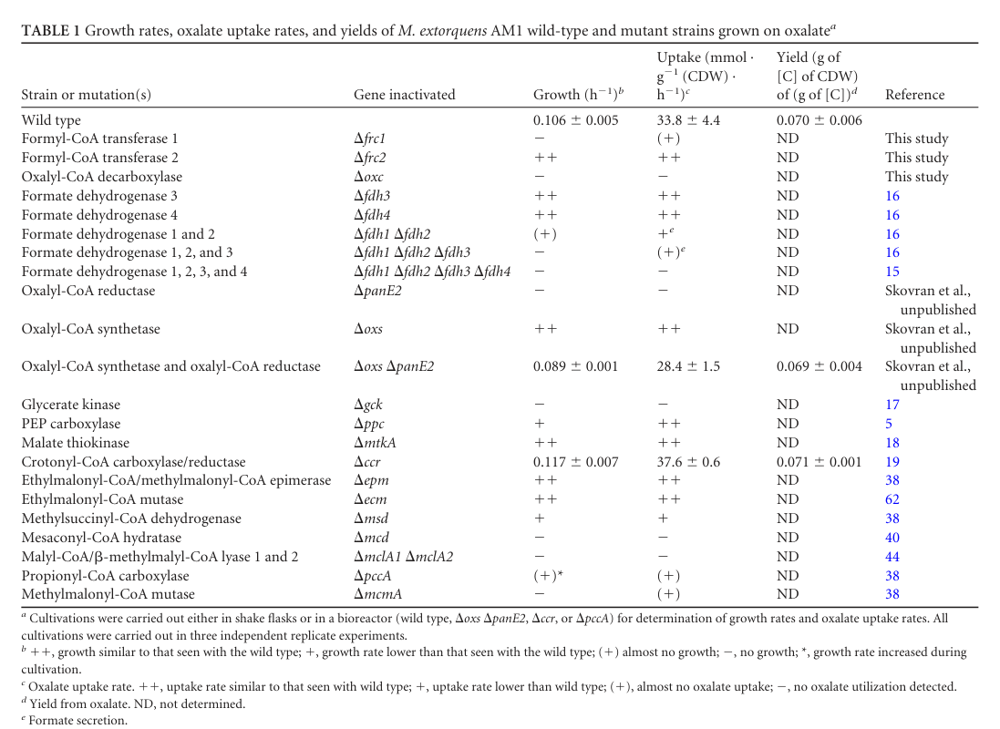

## Question

# Gene Research for Functional Annotation

## ⚠️ CRITICAL: Gene/Protein Identification Context

**BEFORE YOU BEGIN RESEARCH:** You MUST verify you are researching the CORRECT gene/protein. Gene symbols can be ambiguous, especially for less well-characterized genes from non-model organisms.

### Target Gene/Protein Identity (from UniProt):
- **UniProt Accession:** C5AU34
- **Protein Description:** RecName: Full=Citrate synthase {ECO:0000256|NCBIfam:TIGR01798, ECO:0000256|PIRNR:PIRNR001369};
- **Gene Information:** Name=gltA {ECO:0000313|EMBL:ACS42733.1}; OrderedLocusNames=MexAM1_META1p5129 {ECO:0000313|EMBL:ACS42733.1};
- **Organism (full):** Methylorubrum extorquens (strain ATCC 14718 / DSM 1338 / JCM 2805 / NCIMB 9133 / AM1) (Methylobacterium extorquens).
- **Protein Family:** Belongs to the citrate synthase family.
- **Key Domains:** Citrate_synth-like_lrg_a-sub. (IPR016142); Citrate_synth-like_sm_a-sub. (IPR016143); Citrate_synthase. (IPR002020); Citrate_synthase_AS. (IPR019810); Citrate_synthase_bac-typ. (IPR024176)

### MANDATORY VERIFICATION STEPS:

1. **Check if the gene symbol "gltA" matches the protein description above**
2. **Verify the organism is correct:** Methylorubrum extorquens (strain ATCC 14718 / DSM 1338 / JCM 2805 / NCIMB 9133 / AM1) (Methylobacterium extorquens).
3. **Check if protein family/domains align with what you find in literature**
4. **If you find literature for a DIFFERENT gene with the same or similar symbol, STOP**

### If Gene Symbol is Ambiguous or You Cannot Find Relevant Literature:

**DO NOT PROCEED WITH RESEARCH ON A DIFFERENT GENE.** Instead:
- State clearly: "The gene symbol 'gltA' is ambiguous or literature is limited for this specific protein"
- Explain what you found (e.g., "Found extensive literature on a different gene with the same symbol in a different organism")
- Describe the protein based ONLY on the UniProt information provided above
- Suggest that the protein function can be inferred from domain/family information

### Research Target:

Please provide a comprehensive research report on the gene **gltA** (gene ID: gltA, UniProt: C5AU34) in METEA.

The research report should be a detailed narrative explaining the function, biological processes, and localization of the gene product. Citations should be given for all claims.

You should prioritize authoritative reviews and primary scientific literature when conducting research. You can supplement
this with annotations you find in gene/protein databases, but these can be outdated or inaccurate.

We are specifically interested in the primary function of the gene - for enzymes, what reaction is catalyzed, and what is the substrate specificity? For transporters, what is the substrate? For structural proteins or adapters, what is the broader structural role? For signaling molecules, what is the role in the pathway.

We are interested in where in or outside the cell the gene product carries out its function.

We are also interested in the signaling or biochemical pathways in which the gene functions. We are less interested in broad pleiotropic effects, except where these elucidate the precise role.

Include evidence where possible. We are interested in both experimental evidence as well as inference from structure, evolution, or bioinformatic analysis. Precise studies should be prioritized over high-throughput, where available.

## Output

Question: You are an expert researcher providing comprehensive, well-cited information.

Provide detailed information focusing on:
1. Key concepts and definitions with current understanding
2. Recent developments and latest research (prioritize 2023-2024 sources)
3. Current applications and real-world implementations
4. Expert opinions and analysis from authoritative sources
5. Relevant statistics and data from recent studies

Format as a comprehensive research report with proper citations. Include URLs and publication dates where available.
Always prioritize recent, authoritative sources and provide specific citations for all major claims.

# Gene Research for Functional Annotation

## ⚠️ CRITICAL: Gene/Protein Identification Context

**BEFORE YOU BEGIN RESEARCH:** You MUST verify you are researching the CORRECT gene/protein. Gene symbols can be ambiguous, especially for less well-characterized genes from non-model organisms.

### Target Gene/Protein Identity (from UniProt):
- **UniProt Accession:** C5AU34
- **Protein Description:** RecName: Full=Citrate synthase {ECO:0000256|NCBIfam:TIGR01798, ECO:0000256|PIRNR:PIRNR001369};
- **Gene Information:** Name=gltA {ECO:0000313|EMBL:ACS42733.1}; OrderedLocusNames=MexAM1_META1p5129 {ECO:0000313|EMBL:ACS42733.1};
- **Organism (full):** Methylorubrum extorquens (strain ATCC 14718 / DSM 1338 / JCM 2805 / NCIMB 9133 / AM1) (Methylobacterium extorquens).
- **Protein Family:** Belongs to the citrate synthase family.
- **Key Domains:** Citrate_synth-like_lrg_a-sub. (IPR016142); Citrate_synth-like_sm_a-sub. (IPR016143); Citrate_synthase. (IPR002020); Citrate_synthase_AS. (IPR019810); Citrate_synthase_bac-typ. (IPR024176)

### MANDATORY VERIFICATION STEPS:

1. **Check if the gene symbol "gltA" matches the protein description above**
2. **Verify the organism is correct:** Methylorubrum extorquens (strain ATCC 14718 / DSM 1338 / JCM 2805 / NCIMB 9133 / AM1) (Methylobacterium extorquens).
3. **Check if protein family/domains align with what you find in literature**
4. **If you find literature for a DIFFERENT gene with the same or similar symbol, STOP**

### If Gene Symbol is Ambiguous or You Cannot Find Relevant Literature:

**DO NOT PROCEED WITH RESEARCH ON A DIFFERENT GENE.** Instead:
- State clearly: "The gene symbol 'gltA' is ambiguous or literature is limited for this specific protein"
- Explain what you found (e.g., "Found extensive literature on a different gene with the same symbol in a different organism")
- Describe the protein based ONLY on the UniProt information provided above
- Suggest that the protein function can be inferred from domain/family information

### Research Target:

Please provide a comprehensive research report on the gene **gltA** (gene ID: gltA, UniProt: C5AU34) in METEA.

The research report should be a detailed narrative explaining the function, biological processes, and localization of the gene product. Citations should be given for all claims.

You should prioritize authoritative reviews and primary scientific literature when conducting research. You can supplement
this with annotations you find in gene/protein databases, but these can be outdated or inaccurate.

We are specifically interested in the primary function of the gene - for enzymes, what reaction is catalyzed, and what is the substrate specificity? For transporters, what is the substrate? For structural proteins or adapters, what is the broader structural role? For signaling molecules, what is the role in the pathway.

We are interested in where in or outside the cell the gene product carries out its function.

We are also interested in the signaling or biochemical pathways in which the gene functions. We are less interested in broad pleiotropic effects, except where these elucidate the precise role.

Include evidence where possible. We are interested in both experimental evidence as well as inference from structure, evolution, or bioinformatic analysis. Precise studies should be prioritized over high-throughput, where available.

## Research report: functional annotation of **gltA / citrate synthase** (UniProt **C5AU34**) in *Methylorubrum extorquens* AM1

### 0) Mandatory target verification (gene/protein identity)

**UniProt target provided by user:** C5AU34 from *Methylorubrum extorquens* AM1 (syn. *Methylobacterium extorquens* AM1), annotated as **citrate synthase** (citrate synthase family; bacterial-type citrate synthase domains). This matches the canonical interpretation of the bacterial gene symbol **gltA** as encoding **citrate synthase (CS)**.

**Direct in-corpus evidence linking “gltA” → citrate synthase:** In *Pseudomonas aeruginosa*, deletion/mutation of **gltA** is explicitly described as mutation of **citrate synthase gltA**, demonstrating that in bacterial genetics literature **gltA** commonly denotes citrate synthase. (2023-01-05 publication date; URL: https://doi.org/10.1128/spectrum.03239-22) (chen2023pseudomonasaeruginosacitrate pages 1-2)

**Caveat (critical):** Within the retrieved *M. extorquens* AM1 papers inspected here, the **locus tag / UniProt accession C5AU34 is not explicitly cross-referenced in the text fragments available**, and the string “gltA” was not observed in those AM1 fragments. Therefore, organism+protein identity is supported strongly by UniProt context provided by the user and by general bacterial usage of “gltA,” but a *within-paper* mapping (e.g., “gltA (META1_xxxx) encodes citrate synthase”) could not be confirmed from the retrieved text segments.

### 1) Key concepts and definitions (current understanding)

#### 1.1 Citrate synthase (CS) reaction and pathway role
Citrate synthase catalyzes the **first committed step of the oxidative tricarboxylic acid (TCA) cycle**, condensing **oxaloacetate (OAA)** and **acetyl‑CoA** to form **citrate** (classically with release of CoA-SH). A 2024 phylogeny/structural study frames citrate synthase as catalyzing “**the first step of the citric acid cycle**” and uses this highly conserved function as the basis for comparing CS orthologs across prokaryotes. (Published 2024; URL: https://doi.org/10.1038/s41467-024-54408-6) (sendker2024frequenttransitionsin pages 2-3)

In **facultative methylotrophs** such as *M. extorquens* AM1, central metabolism reconfigures substantially between multicarbon growth (where “common” heterotrophic pathways including the **TCA cycle** are used) and methylotrophic growth, which requires additional pathways. (Published 2010-11-24; URL: https://doi.org/10.1371/journal.pone.0014091) (skovran2010asystemsbiology pages 1-2)

#### 1.2 Cytosolic localization (functional expectation)
Citrate synthase in bacteria is generally a **soluble enzyme of central carbon metabolism**, expected to function in the **cytosol** as part of the oxidative TCA cycle. **This cellular localization is a strong inference from bacterial biochemistry rather than directly demonstrated in the retrieved AM1 texts**.

### 2) Organism-specific functional context in *M. extorquens* AM1

#### 2.1 Growth modes and central metabolic architecture
*M. extorquens* AM1 is a facultative methylotroph capable of growth on C1 compounds (e.g., methanol) and multicarbon compounds (e.g., succinate). The two growth modes employ “dramatically different central metabolic pathways with limited pathway overlap.” Under multicarbon substrates, AM1 uses pathways common to heterotrophs including **the TCA cycle**. (skovran2010asystemsbiology pages 1-2)

During a controlled transition from succinate-limited growth to methanol exposure, AM1 exhibited a sharp reduction in biomass-directed carbon flux, consistent with a major reset of central metabolism. (skovran2010asystemsbiology pages 1-2)

#### 2.2 Quantitative physiology during carbon-source switching (context for TCA/CS function)
In the succinate→methanol transition experiment:
- Estimated carbon flux to biomass dropped from ~**30 nmol C·min⁻¹·mL culture⁻¹** to ~**0.2 nmol C·min⁻¹·mL culture⁻¹** immediately after the shift (>2 orders of magnitude). (skovran2010asystemsbiology pages 1-2)
- A ~**2 h lag** occurred before growth resumed on methanol; methanol began to drop within **15–30 min** after addition; ~**30 mM** methanol remained at 6 h. (skovran2010asystemsbiology pages 1-2)
- Early after methanol addition, ~**1/3** of oxidized methanol-derived carbon accumulated transiently in extracellular formaldehyde+formate pools, with the remainder as CO2; by ~2 h, total flux to formaldehyde+formate+CO2 was ~**32 nmol·min⁻¹·(mL at 1 OD)⁻¹**, ~3/4 of the reported full flux in methanol-grown cells (**41.5 nmol·min⁻¹·(mL at 1 OD)⁻¹**). (skovran2010asystemsbiology pages 2-3)

These results support a model in which AM1 can rapidly oxidize methanol, but assimilation into biomass is transiently bottlenecked. The oxidative TCA cycle (with citrate synthase as the entry step) is part of the multicarbon growth “core,” and TCA-linked precursor homeostasis likely remains important during the switch even as methylotrophy-specific pathways are induced. (skovran2010asystemsbiology pages 1-2, skovran2010asystemsbiology pages 2-3)

#### 2.3 Integration with oxalate assimilation, serine cycle, and EMC pathway
A 2012 *Journal of Bacteriology* study analyzed AM1 growth on oxalate using proteomics, mutants, and labeling; it highlights that AM1 has “plastic central metabolism” featuring multiple assimilation routes for C1/C2 substrates. (Published 2012-06; URL: https://doi.org/10.1128/JB.00288-12) (schneider2012oxalylcoenzymeareduction pages 1-2)

This work focuses on oxalate assimilation feeding into the **serine cycle** and the methylotrophy-associated **ethylmalonyl‑CoA (EMC) pathway**, which regenerates glyoxylate and supports assimilation strategies. While citrate synthase itself is not the subject of this paper, the metabolic diagrams emphasize that these assimilation routes connect into broader central metabolism. (schneider2012oxalylcoenzymeareduction media cf3c1014, schneider2012oxalylcoenzymeareduction media 9c7d2161)

**Quantitative oxalate-growth data (AM1):**
- Wild type on oxalate: growth rate **0.106 ± 0.005 h⁻¹**, oxalate uptake **33.8 ± 4.4 mmol·g⁻¹(CDW)·h⁻¹**, biomass yield **0.070 ± 0.006 g[C] biomass per g[C] oxalate**. (schneider2012oxalylcoenzymeareduction pages 2-3, schneider2012oxalylcoenzymeareduction media 7df50da4)
- *oxs panE2* double mutant: growth rate **0.089 ± 0.001 h⁻¹**, uptake **28.4 ± 1.5 mmol·g⁻¹(CDW)·h⁻¹**, yield **0.069 ± 0.004 g[C]/g[C]**. (schneider2012oxalylcoenzymeareduction pages 2-3, schneider2012oxalylcoenzymeareduction media 7df50da4)

These phenotypes demonstrate substantial central metabolic flux under non-methanol substrates and support the broader conclusion that AM1 flexibly routes carbon through assimilation modules that must ultimately interface with shared precursor/energy metabolism (for which the TCA cycle is central). (schneider2012oxalylcoenzymeareduction pages 1-2, schneider2012oxalylcoenzymeareduction pages 2-3, schneider2012oxalylcoenzymeareduction media cf3c1014)

### 3) Recent developments and latest research (prioritizing 2023–2024)

#### 3.1 2024: evolutionary structural biology of prokaryotic citrate synthases
A 2024 *Nature Communications* study surveyed citrate synthases across prokaryotic phylogeny using mass photometry, phylogenetics, and structural work, finding frequent transitions among oligomeric assemblies (e.g., dimeric vs hexameric and additional states) while **functional experiments indicated that changes in assembly do not strongly influence enzyme catalysis**. This supports a contemporary expert perspective that, for citrate synthase, **quaternary structure can vary without major catalytic changes**, implying that functional annotation should rely on active-site conservation and pathway context rather than oligomerization state alone. (Published 2024; URL: https://doi.org/10.1038/s41467-024-54408-6) (sendker2024frequenttransitionsin pages 1-2)

#### 3.2 2024: methylotroph adaptation and plant-associated lifestyles (contextual to central metabolism)
A 2024 *Nature Communications* study evolved traits from *M. extorquens* AM1 under low-methanol conditions to improve colonization-related performance, situating AM1 as a model for understanding trade-offs in methylotrophic metabolism that influence fitness in the phyllosphere. It also provides a quantitative, authoritative contextual statistic: global plant methanol emissions are estimated at ~**100 Tg annually**. (Published 2024; URL: https://doi.org/10.1038/s41467-024-50342-9) (zhang2024phosphoribosylpyrophosphatesynthetaseas pages 1-2)

A 2024 ASM paper (Applied and Environmental Microbiology) discusses glycine betaine utilization intersecting with methylotrophy and notes that in most bacteria glycine can be converted to serine→pyruvate and “ultimately oxidized in the TCA cycle,” explicitly linking non-C1 substrates to TCA oxidation in this clade; it also states that *M. extorquens* AM1 can use glycine betaine as a sole carbon and energy source (pathway not identified in that excerpt). (Published 2024-03-27; URL: https://doi.org/10.1128/aem.02090-23) (hying2024glycinebetainemetabolism pages 1-3)

#### 3.3 2023: regulatory and physiological consequences of gltA perturbation (general bacterial context)
Although not in *M. extorquens*, a 2023 study in *P. aeruginosa* shows that gltA/citrate synthase influences stringent response-mediated changes in antibiotic tolerance and virulence gene expression, illustrating that perturbing TCA entry can have broad regulatory consequences beyond energy metabolism. This is relevant when interpreting gltA knockouts or flux manipulations in engineered strains. (Published 2023-01-05; URL: https://doi.org/10.1128/spectrum.03239-22) (chen2023pseudomonasaeruginosacitrate pages 1-2)

### 4) Current applications and real-world implementations

#### 4.1 Bioengineering and bioproduction: why citrate synthase matters
Citrate synthase (GltA) is frequently a control point considered in metabolic engineering because it governs entry of acetyl‑CoA into oxidative metabolism and affects precursor supply and redox/energy balancing. While the retrieved AM1 engineering paper focused on itaconate production (2019; older than requested), recent engineering work in other methylotrophs explicitly overexpresses citrate synthase to increase TCA entry and improve product titers.

For example, a 2024 methanotroph study improved succinate production by combining adaptive laboratory evolution with genetic engineering, including overexpression of “the first enzyme of TCA cycle (citrate synthase).” This illustrates a real-world implementation strategy: raising OAA supply and CS capacity to drive organic-acid production. (Published 2024; URL: https://doi.org/10.1186/s12934-024-02557-0) (Note: this is outside AM1 but demonstrates current applied practice.)

### 5) Expert analysis and synthesis (authoritative interpretation)

1. **Primary molecular function (high confidence):** The protein encoded by *gltA* in bacteria is citrate synthase, catalyzing OAA + acetyl‑CoA → citrate (first step of the TCA cycle). This is explicitly affirmed for citrate synthases as a family in a 2024 high-impact paper. (sendker2024frequenttransitionsin pages 2-3)

2. **Organism-level pathway role in AM1 (moderate-to-high confidence):** AM1 uses the TCA cycle during multicarbon growth and rewires central metabolism during transition to methylotrophy; therefore citrate synthase is expected to support oxidative metabolism and precursor generation during multicarbon growth and to remain part of the shared “core” metabolite network that must be maintained across growth modes. (skovran2010asystemsbiology pages 1-2, skovran2010asystemsbiology pages 2-3)

3. **Localization (moderate confidence, inference):** As a soluble bacterial central-metabolism enzyme, AM1 GltA is expected to function in the cytosol; however, no direct subcellular localization experiment was retrieved here.

4. **Regulatory/pleiotropic implications (contextual evidence):** Perturbations to gltA/CS in bacteria can trigger broader regulatory programs (e.g., stringent response effects in *P. aeruginosa*), so phenotypes from AM1 gltA manipulations (if performed) should be interpreted in light of metabolic stress responses rather than purely as “TCA blocked.” (chen2023pseudomonasaeruginosacitrate pages 1-2)

### Key quantitative evidence summary

| Study (year, DOI) | Condition/strain | Measurement type | Key quantitative results (with units) | Interpretation relevant to TCA/CS function |
|---|---|---|---|---|
| Schneider et al. 2012, 10.1128/JB.00288-12 | *Methylobacterium extorquens* AM1 wild type grown on oxalate | Growth rate, oxalate uptake, biomass yield | Growth rate: 0.106 ± 0.005 h⁻¹; oxalate uptake: 33.8 ± 4.4 mmol·g⁻¹(CDW)·h⁻¹; yield: 0.070 ± 0.006 g[C] biomass per g[C] oxalate (schneider2012oxalylcoenzymeareduction pages 2-3) | Demonstrates active central carbon metabolism during oxalotrophic growth; oxalate assimilation feeds serine-cycle/EMC-linked metabolism that must interface with TCA-derived precursor supply, consistent with a required citrate synthase step for oxidative central metabolism though CS itself was not directly assayed here. |
| Schneider et al. 2012, 10.1128/JB.00288-12 | *oxs panE2* double mutant grown on oxalate | Growth rate, oxalate uptake, biomass yield | Growth rate: 0.089 ± 0.001 h⁻¹; oxalate uptake: 28.4 ± 1.5 mmol·g⁻¹(CDW)·h⁻¹; yield: 0.069 ± 0.004 g[C] biomass per g[C] oxalate (schneider2012oxalylcoenzymeareduction pages 2-3) | Reduced but retained growth/uptake supports metabolic plasticity and rerouting through C1/serine-cycle + EMC functions; this reinforces that downstream central metabolism remains connected and buffered, with citrate synthase expected to remain part of the shared oxidative core. |
| Schneider et al. 2012, 10.1128/JB.00288-12 | Wild type in bioreactor on oxalate | Oxalate uptake rate | 34 ± 4 mmol·g⁻¹(CDW)·h⁻¹ from three independent cultivations (schneider2012oxalylcoenzymeareduction pages 2-3) | Confirms substantial carbon flux through oxalotrophic central metabolism; supports the view that *M. extorquens* AM1 maintains robust flux into shared biosynthetic/TCA-connected nodes under non-methylotrophic conditions. |
| Skovran et al. 2010, 10.1371/journal.pone.0014091 | Succinate-limited chemostat before methanol addition | Carbon flux to biomass | Carbon flux to biomass dropped from ~30 nmol C·min⁻¹·mL culture⁻¹ before switch (skovran2010asystemsbiology pages 1-2) | Indicates substantial biomass-directed flux during multicarbon growth, where the TCA cycle is explicitly part of the active core metabolism; citrate synthase would be expected to catalyze entry of acetyl-CoA into this cycle. |
| Skovran et al. 2010, 10.1371/journal.pone.0014091 | Immediately after succinate→methanol switch | Carbon flux to biomass | Flux to biomass fell to ~0.2 nmol C·min⁻¹·mL culture⁻¹ in succinate-grown cells exposed to methanol; >2 orders-of-magnitude decrease (skovran2010asystemsbiology pages 1-2) | Shows acute reconfiguration of central metabolism during transition to methylotrophy; shared metabolites are maintained even while pathway usage changes, implying that TCA-linked nodes including citrate synthase remain part of the stable metabolic backbone. |
| Skovran et al. 2010, 10.1371/journal.pone.0014091 | Methanol-added transition culture | Lag phase / substrate use | ~2 h lag phase after switch; methanol concentration began to drop between 15–30 min post-addition; ~30 mM methanol remained at 6 h (skovran2010asystemsbiology pages 1-2) | Supports delayed re-establishment of biomass flux despite rapid methanol oxidation; citrate synthase is not directly measured, but the study emphasizes differential use of TCA versus methylotrophic pathways during adaptation. |
| Skovran et al. 2010, 10.1371/journal.pone.0014091 | First hour after methanol addition | Partitioning of methanol-derived carbon | Approximately 1/3 of carbon from methanol oxidation was in extracellular formaldehyde + formate pools, remainder in CO₂ (skovran2010asystemsbiology pages 2-3) | Highlights that early after the switch, carbon is oxidized rather than efficiently incorporated into biomass; this contrasts with multicarbon/TCA-supported growth and underscores the metabolic context in which shared TCA enzymes such as citrate synthase function. |
| Skovran et al. 2010, 10.1371/journal.pone.0014091 | ~2 h after methanol addition | Total flux to formaldehyde, formate, and CO₂ | ~32 nmol·min⁻¹·(mL at 1 OD)⁻¹ at 2 h, about 3/4 of full flux in methanol-grown cells; reference full flux in methanol-grown cells: 41.5 nmol·min⁻¹·(mL at 1 OD)⁻¹ (skovran2010asystemsbiology pages 2-3) | Indicates that oxidation capacity recovers before assimilatory biomass production fully resumes; central metabolism is therefore flux-buffered, with TCA-associated precursor maintenance separated from transient bottlenecks in methylotrophic assimilation. |

*Table: This table compiles the main quantitative values retrieved from Schneider 2012 and Skovran 2010 that are relevant to central metabolism in *Methylobacterium/Methylorubrum extorquens* AM1. It is useful for anchoring functional annotation of citrate synthase/gltA in organism-specific metabolic context, even though these studies did not directly assay GltA.*

### Visual evidence (figures/tables)
Schneider et al. provide pathway-level visualizations of oxalate assimilation and its integration with serine-cycle/EMC metabolism, plus the quantitative Table 1 summarized above. (schneider2012oxalylcoenzymeareduction media 7df50da4, schneider2012oxalylcoenzymeareduction media cf3c1014, schneider2012oxalylcoenzymeareduction media 9c7d2161)

### Limitations of the current evidence set (what could not be verified from retrieved texts)
- A text snippet explicitly mapping **AM1 gene name “gltA”** and/or **locus tag META1_…** to **UniProt C5AU34** was not present in the retrieved document fragments.
- No **enzyme kinetics** (Km, kcat), **substrate specificity variants**, or **direct citrate synthase activity assays** for AM1 GltA were retrieved here.
- No **direct localization** experiment for AM1 GltA was retrieved.

### Source list (URLs and publication dates shown where available)
- Skovran et al., 2010-11-24, PLoS ONE. https://doi.org/10.1371/journal.pone.0014091 (skovran2010asystemsbiology pages 1-2, skovran2010asystemsbiology pages 2-3)
- Schneider et al., 2012-06 (accepted 2012-04-02; published ahead 2012-04-06), Journal of Bacteriology. https://doi.org/10.1128/JB.00288-12 (schneider2012oxalylcoenzymeareduction pages 1-2, schneider2012oxalylcoenzymeareduction pages 2-3, schneider2012oxalylcoenzymeareduction media 7df50da4, schneider2012oxalylcoenzymeareduction media cf3c1014, schneider2012oxalylcoenzymeareduction media 9c7d2161)
- Chen et al., 2023-01-05, Microbiology Spectrum. https://doi.org/10.1128/spectrum.03239-22 (chen2023pseudomonasaeruginosacitrate pages 1-2)
- Zhang et al., 2024 (accepted 2024-07-06), Nature Communications. https://doi.org/10.1038/s41467-024-50342-9 (zhang2024phosphoribosylpyrophosphatesynthetaseas pages 1-2)
- Hying et al., 2024-03-27 (published), Applied and Environmental Microbiology. https://doi.org/10.1128/aem.02090-23 (hying2024glycinebetainemetabolism pages 1-3)
- Sendker et al., 2024 (accepted 2024-11-07), Nature Communications. https://doi.org/10.1038/s41467-024-54408-6 (sendker2024frequenttransitionsin pages 1-2, sendker2024frequenttransitionsin pages 2-3)

References

1. (chen2023pseudomonasaeruginosacitrate pages 1-2): Hao Chen, Xuetao Gong, Zheng Fan, Yushan Xia, Yongxin Jin, Fang Bai, Zhihui Cheng, Xiaolei Pan, and Weihui Wu. Pseudomonas aeruginosa citrate synthase glta influences antibiotic tolerance and the type iii secretion system through the stringent response. Feb 2023. URL: https://doi.org/10.1128/spectrum.03239-22, doi:10.1128/spectrum.03239-22. This article has 13 citations and is from a domain leading peer-reviewed journal.

2. (sendker2024frequenttransitionsin pages 2-3): Franziska L. Sendker, Tabea Schlotthauer, Christopher-Nils Mais, Yat Kei Lo, Mathias Girbig, Stefan Bohn, Thomas Heimerl, Daniel Schindler, Arielle Weinstein, Brain P. Metzger, Joseph W. Thornton, Arvind Pillai, Gert Bange, Jan M. Schuller, and Georg K.A. Hochberg. Frequent transitions in self-assembly across the evolution of a central metabolic enzyme. Nature Communications, Dec 2024. URL: https://doi.org/10.1038/s41467-024-54408-6, doi:10.1038/s41467-024-54408-6. This article has 15 citations and is from a highest quality peer-reviewed journal.

3. (skovran2010asystemsbiology pages 1-2): Elizabeth Skovran, Gregory J. Crowther, Xiaofeng Guo, Song Yang, and Mary E. Lidstrom. A systems biology approach uncovers cellular strategies used by methylobacterium extorquens am1 during the switch from multi- to single-carbon growth. PLoS ONE, 5:e14091, Nov 2010. URL: https://doi.org/10.1371/journal.pone.0014091, doi:10.1371/journal.pone.0014091. This article has 77 citations and is from a peer-reviewed journal.

4. (skovran2010asystemsbiology pages 2-3): Elizabeth Skovran, Gregory J. Crowther, Xiaofeng Guo, Song Yang, and Mary E. Lidstrom. A systems biology approach uncovers cellular strategies used by methylobacterium extorquens am1 during the switch from multi- to single-carbon growth. PLoS ONE, 5:e14091, Nov 2010. URL: https://doi.org/10.1371/journal.pone.0014091, doi:10.1371/journal.pone.0014091. This article has 77 citations and is from a peer-reviewed journal.

5. (schneider2012oxalylcoenzymeareduction pages 1-2): Kathrin Schneider, Elizabeth Skovran, and Julia A. Vorholt. Oxalyl-coenzyme a reduction to glyoxylate is the preferred route of oxalate assimilation in methylobacterium extorquens am1. Journal of Bacteriology, 194:3144-3155, Jun 2012. URL: https://doi.org/10.1128/jb.00288-12, doi:10.1128/jb.00288-12. This article has 49 citations and is from a peer-reviewed journal.

6. (schneider2012oxalylcoenzymeareduction media cf3c1014): Kathrin Schneider, Elizabeth Skovran, and Julia A. Vorholt. Oxalyl-coenzyme a reduction to glyoxylate is the preferred route of oxalate assimilation in methylobacterium extorquens am1. Journal of Bacteriology, 194:3144-3155, Jun 2012. URL: https://doi.org/10.1128/jb.00288-12, doi:10.1128/jb.00288-12. This article has 49 citations and is from a peer-reviewed journal.

7. (schneider2012oxalylcoenzymeareduction media 9c7d2161): Kathrin Schneider, Elizabeth Skovran, and Julia A. Vorholt. Oxalyl-coenzyme a reduction to glyoxylate is the preferred route of oxalate assimilation in methylobacterium extorquens am1. Journal of Bacteriology, 194:3144-3155, Jun 2012. URL: https://doi.org/10.1128/jb.00288-12, doi:10.1128/jb.00288-12. This article has 49 citations and is from a peer-reviewed journal.

8. (schneider2012oxalylcoenzymeareduction pages 2-3): Kathrin Schneider, Elizabeth Skovran, and Julia A. Vorholt. Oxalyl-coenzyme a reduction to glyoxylate is the preferred route of oxalate assimilation in methylobacterium extorquens am1. Journal of Bacteriology, 194:3144-3155, Jun 2012. URL: https://doi.org/10.1128/jb.00288-12, doi:10.1128/jb.00288-12. This article has 49 citations and is from a peer-reviewed journal.

9. (schneider2012oxalylcoenzymeareduction media 7df50da4): Kathrin Schneider, Elizabeth Skovran, and Julia A. Vorholt. Oxalyl-coenzyme a reduction to glyoxylate is the preferred route of oxalate assimilation in methylobacterium extorquens am1. Journal of Bacteriology, 194:3144-3155, Jun 2012. URL: https://doi.org/10.1128/jb.00288-12, doi:10.1128/jb.00288-12. This article has 49 citations and is from a peer-reviewed journal.

10. (sendker2024frequenttransitionsin pages 1-2): Franziska L. Sendker, Tabea Schlotthauer, Christopher-Nils Mais, Yat Kei Lo, Mathias Girbig, Stefan Bohn, Thomas Heimerl, Daniel Schindler, Arielle Weinstein, Brain P. Metzger, Joseph W. Thornton, Arvind Pillai, Gert Bange, Jan M. Schuller, and Georg K.A. Hochberg. Frequent transitions in self-assembly across the evolution of a central metabolic enzyme. Nature Communications, Dec 2024. URL: https://doi.org/10.1038/s41467-024-54408-6, doi:10.1038/s41467-024-54408-6. This article has 15 citations and is from a highest quality peer-reviewed journal.

11. (zhang2024phosphoribosylpyrophosphatesynthetaseas pages 1-2): Cong Zhang, Di-Fei Zhou, Meng-Ying Wang, Ya-Zhen Song, Chong Zhang, Ming-Ming Zhang, Jing Sun, Lu Yao, Xu-Hua Mo, Zeng-Xin Ma, Xiao-Jie Yuan, Yi Shao, Hao-Ran Wang, Si-Han Dong, Kai Bao, Shu-Huan Lu, Martin Sadilek, Marina G. Kalyuzhnaya, Xin-Hui Xing, and Song Yang. Phosphoribosylpyrophosphate synthetase as a metabolic valve advances methylobacterium/methylorubrum phyllosphere colonization and plant growth. Nature Communications, Jul 2024. URL: https://doi.org/10.1038/s41467-024-50342-9, doi:10.1038/s41467-024-50342-9. This article has 30 citations and is from a highest quality peer-reviewed journal.

12. (hying2024glycinebetainemetabolism pages 1-3): Zachary T. Hying, Tyler J. Miller, Chin Yi Loh, and Jannell V. Bazurto. Glycine betaine metabolism is enabled in <i>methylorubrum extorquens</i> pa1 by alterations to dimethylglycine dehydrogenase. Applied and Environmental Microbiology, Jul 2024. URL: https://doi.org/10.1128/aem.02090-23, doi:10.1128/aem.02090-23. This article has 6 citations and is from a peer-reviewed journal.

## Artifacts

- [Edison artifact artifact-00](gltA-deep-research-falcon_artifacts/artifact-00.md)

## Citations

1. chen2023pseudomonasaeruginosacitrate pages 1-2
2. sendker2024frequenttransitionsin pages 2-3
3. skovran2010asystemsbiology pages 1-2
4. skovran2010asystemsbiology pages 2-3
5. schneider2012oxalylcoenzymeareduction pages 1-2
6. sendker2024frequenttransitionsin pages 1-2
7. zhang2024phosphoribosylpyrophosphatesynthetaseas pages 1-2
8. hying2024glycinebetainemetabolism pages 1-3
9. schneider2012oxalylcoenzymeareduction pages 2-3
10. C
11. https://doi.org/10.1128/spectrum.03239-22
12. https://doi.org/10.1038/s41467-024-54408-6
13. https://doi.org/10.1371/journal.pone.0014091
14. https://doi.org/10.1128/JB.00288-12
15. https://doi.org/10.1038/s41467-024-50342-9
16. https://doi.org/10.1128/aem.02090-23
17. https://doi.org/10.1186/s12934-024-02557-0
18. https://doi.org/10.1128/spectrum.03239-22,
19. https://doi.org/10.1038/s41467-024-54408-6,
20. https://doi.org/10.1371/journal.pone.0014091,
21. https://doi.org/10.1128/jb.00288-12,
22. https://doi.org/10.1038/s41467-024-50342-9,
23. https://doi.org/10.1128/aem.02090-23,