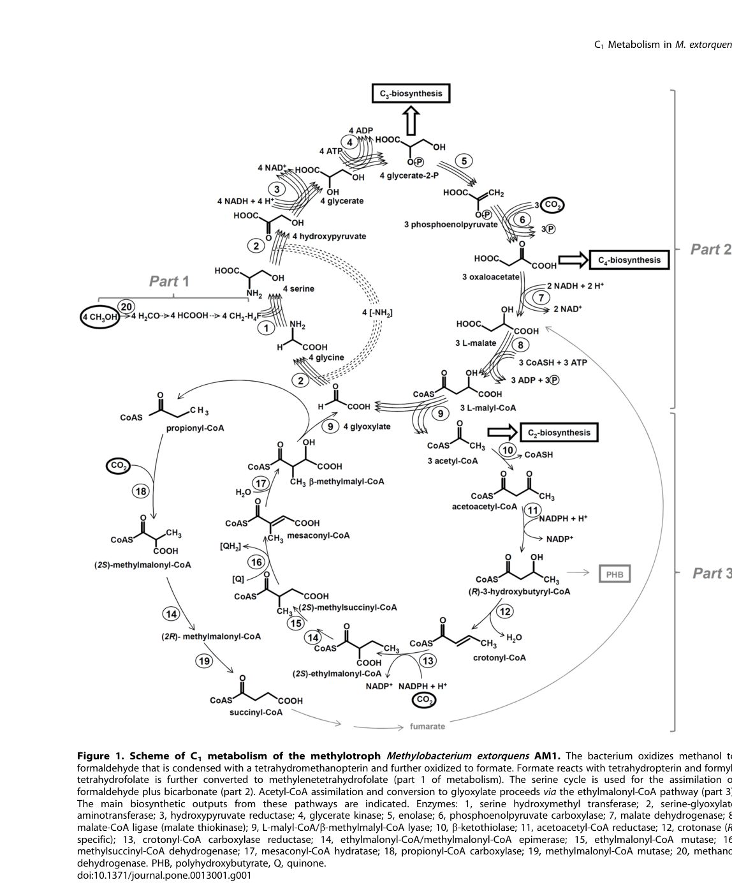

## Question

# Gene Research for Functional Annotation

## ⚠️ CRITICAL: Gene/Protein Identification Context

**BEFORE YOU BEGIN RESEARCH:** You MUST verify you are researching the CORRECT gene/protein. Gene symbols can be ambiguous, especially for less well-characterized genes from non-model organisms.

### Target Gene/Protein Identity (from UniProt):
- **UniProt Accession:** P50435
- **Protein Description:** RecName: Full=Serine hydroxymethyltransferase {ECO:0000255|HAMAP-Rule:MF_00051}; Short=SHMT {ECO:0000255|HAMAP-Rule:MF_00051}; Short=Serine methylase {ECO:0000255|HAMAP-Rule:MF_00051}; EC=2.1.2.1 {ECO:0000255|HAMAP-Rule:MF_00051};
- **Gene Information:** Name=glyA {ECO:0000255|HAMAP-Rule:MF_00051}; OrderedLocusNames=MexAM1_META1p3384;
- **Organism (full):** Methylorubrum extorquens (strain ATCC 14718 / DSM 1338 / JCM 2805 / NCIMB 9133 / AM1) (Methylobacterium extorquens).
- **Protein Family:** Belongs to the SHMT family. {ECO:0000255|HAMAP-
- **Key Domains:** PyrdxlP-dep_Trfase. (IPR015424); PyrdxlP-dep_Trfase_major. (IPR015421); PyrdxlP-dep_Trfase_small. (IPR015422); Ser_HO-MeTrfase. (IPR001085); Ser_HO-MeTrfase-like. (IPR049943)

### MANDATORY VERIFICATION STEPS:

1. **Check if the gene symbol "glyA" matches the protein description above**
2. **Verify the organism is correct:** Methylorubrum extorquens (strain ATCC 14718 / DSM 1338 / JCM 2805 / NCIMB 9133 / AM1) (Methylobacterium extorquens).
3. **Check if protein family/domains align with what you find in literature**
4. **If you find literature for a DIFFERENT gene with the same or similar symbol, STOP**

### If Gene Symbol is Ambiguous or You Cannot Find Relevant Literature:

**DO NOT PROCEED WITH RESEARCH ON A DIFFERENT GENE.** Instead:
- State clearly: "The gene symbol 'glyA' is ambiguous or literature is limited for this specific protein"
- Explain what you found (e.g., "Found extensive literature on a different gene with the same symbol in a different organism")
- Describe the protein based ONLY on the UniProt information provided above
- Suggest that the protein function can be inferred from domain/family information

### Research Target:

Please provide a comprehensive research report on the gene **glyA** (gene ID: glyA, UniProt: P50435) in METEA.

The research report should be a detailed narrative explaining the function, biological processes, and localization of the gene product. Citations should be given for all claims.

You should prioritize authoritative reviews and primary scientific literature when conducting research. You can supplement
this with annotations you find in gene/protein databases, but these can be outdated or inaccurate.

We are specifically interested in the primary function of the gene - for enzymes, what reaction is catalyzed, and what is the substrate specificity? For transporters, what is the substrate? For structural proteins or adapters, what is the broader structural role? For signaling molecules, what is the role in the pathway.

We are interested in where in or outside the cell the gene product carries out its function.

We are also interested in the signaling or biochemical pathways in which the gene functions. We are less interested in broad pleiotropic effects, except where these elucidate the precise role.

Include evidence where possible. We are interested in both experimental evidence as well as inference from structure, evolution, or bioinformatic analysis. Precise studies should be prioritized over high-throughput, where available.

## Output

Question: You are an expert researcher providing comprehensive, well-cited information.

Provide detailed information focusing on:
1. Key concepts and definitions with current understanding
2. Recent developments and latest research (prioritize 2023-2024 sources)
3. Current applications and real-world implementations
4. Expert opinions and analysis from authoritative sources
5. Relevant statistics and data from recent studies

Format as a comprehensive research report with proper citations. Include URLs and publication dates where available.
Always prioritize recent, authoritative sources and provide specific citations for all major claims.

# Gene Research for Functional Annotation

## ⚠️ CRITICAL: Gene/Protein Identification Context

**BEFORE YOU BEGIN RESEARCH:** You MUST verify you are researching the CORRECT gene/protein. Gene symbols can be ambiguous, especially for less well-characterized genes from non-model organisms.

### Target Gene/Protein Identity (from UniProt):
- **UniProt Accession:** P50435
- **Protein Description:** RecName: Full=Serine hydroxymethyltransferase {ECO:0000255|HAMAP-Rule:MF_00051}; Short=SHMT {ECO:0000255|HAMAP-Rule:MF_00051}; Short=Serine methylase {ECO:0000255|HAMAP-Rule:MF_00051}; EC=2.1.2.1 {ECO:0000255|HAMAP-Rule:MF_00051};
- **Gene Information:** Name=glyA {ECO:0000255|HAMAP-Rule:MF_00051}; OrderedLocusNames=MexAM1_META1p3384;
- **Organism (full):** Methylorubrum extorquens (strain ATCC 14718 / DSM 1338 / JCM 2805 / NCIMB 9133 / AM1) (Methylobacterium extorquens).
- **Protein Family:** Belongs to the SHMT family. {ECO:0000255|HAMAP-
- **Key Domains:** PyrdxlP-dep_Trfase. (IPR015424); PyrdxlP-dep_Trfase_major. (IPR015421); PyrdxlP-dep_Trfase_small. (IPR015422); Ser_HO-MeTrfase. (IPR001085); Ser_HO-MeTrfase-like. (IPR049943)

### MANDATORY VERIFICATION STEPS:

1. **Check if the gene symbol "glyA" matches the protein description above**
2. **Verify the organism is correct:** Methylorubrum extorquens (strain ATCC 14718 / DSM 1338 / JCM 2805 / NCIMB 9133 / AM1) (Methylobacterium extorquens).
3. **Check if protein family/domains align with what you find in literature**
4. **If you find literature for a DIFFERENT gene with the same or similar symbol, STOP**

### If Gene Symbol is Ambiguous or You Cannot Find Relevant Literature:

**DO NOT PROCEED WITH RESEARCH ON A DIFFERENT GENE.** Instead:
- State clearly: "The gene symbol 'glyA' is ambiguous or literature is limited for this specific protein"
- Explain what you found (e.g., "Found extensive literature on a different gene with the same symbol in a different organism")
- Describe the protein based ONLY on the UniProt information provided above
- Suggest that the protein function can be inferred from domain/family information

### Research Target:

Please provide a comprehensive research report on the gene **glyA** (gene ID: glyA, UniProt: P50435) in METEA.

The research report should be a detailed narrative explaining the function, biological processes, and localization of the gene product. Citations should be given for all claims.

You should prioritize authoritative reviews and primary scientific literature when conducting research. You can supplement
this with annotations you find in gene/protein databases, but these can be outdated or inaccurate.

We are specifically interested in the primary function of the gene - for enzymes, what reaction is catalyzed, and what is the substrate specificity? For transporters, what is the substrate? For structural proteins or adapters, what is the broader structural role? For signaling molecules, what is the role in the pathway.

We are interested in where in or outside the cell the gene product carries out its function.

We are also interested in the signaling or biochemical pathways in which the gene functions. We are less interested in broad pleiotropic effects, except where these elucidate the precise role.

Include evidence where possible. We are interested in both experimental evidence as well as inference from structure, evolution, or bioinformatic analysis. Precise studies should be prioritized over high-throughput, where available.

## Research Report: Functional Annotation of **glyA** (UniProt **P50435**) in *Methylorubrum extorquens* AM1 (METEA)

### 0) Target verification (critical disambiguation)
Primary literature explicitly identifies **glyA** in *Methylobacterium/Methylorubrum extorquens* AM1 as encoding **serine hydroxymethyltransferase (SHMT; EC 2.1.2.1)**, a key enzyme of the **serine cycle** for C1 assimilation, and reports cloning and insertional inactivation of this exact gene in AM1. (chistoserdova1994geneticsofthe pages 1-2, chistoserdova1994geneticsofthe pages 2-4)

### 1) Key concepts and definitions (current understanding)

#### 1.1 Enzyme name, class, and canonical reaction
Serine hydroxymethyltransferase (SHMT; **GlyA**) is a **PLP-dependent** enzyme that catalyzes the reversible folate-linked one-carbon transfer between serine and glycine: **L-serine + tetrahydrofolate (THF) ⇄ glycine + 5,10-methylenetetrahydrofolate (5,10-CH2-THF) + H2O**. (drago2023revealingprotonationstates pages 1-2)

In *M. extorquens* AM1, GlyA is discussed and assayed primarily in the **physiological direction** relevant to methylotrophy—formation of serine from glycine plus an activated one-carbon unit carried on a folate cofactor—consistent with its role at the entry point of the serine cycle. (smejkalova2010methanolassimilationin pages 5-8)

#### 1.2 Cofactors and substrate specificity
**PLP (pyridoxal-5′-phosphate)** is essential for SHMT catalysis; structurally, PLP forms an internal aldimine (Schiff base) with an active-site lysine and is exchanged for substrate during catalysis. (drago2023revealingprotonationstates pages 1-2, drago2023revealingprotonationstates pages 2-4)

A distinctive feature in *M. extorquens* AM1 is that the physiologically relevant folate pool is not limited to monoglutamyl THF. The organism’s C1 carrier was identified as a **polyglutamylated folate** (reported as tetrahydropteroyl-tetraglutamate), and polyglutamylated THF species stimulate SHMT-catalyzed serine synthesis more strongly than monoglutamyl THF in vitro. (smejkalova2010methanolassimilationin pages 1-3, smejkalova2010methanolassimilationin pages 5-8, smejkalova2010methanolassimilationin pages 8-9)

#### 1.3 Mechanistic understanding (2023–2024 structural advances)
High-resolution **room-temperature joint X-ray/neutron crystallography** of a bacterial SHMT (Thermus thermophilus SHMT; used as a conserved model) directly mapped active-site protonation states. These data support a mechanism in which a conserved **active-site glutamate (Glu53 in TthSHMT; analogous to Glu98 in human SHMT2)** functions as the general base for key steps in serine retro-aldol chemistry, while active-site histidines are neutral/monoprotonated and less consistent with serving as the catalytic base. (drago2023revealingprotonationstates pages 8-9, drago2023revealingprotonationstates pages 1-2)

A 2024 follow-up using neutron/X-ray structures in complexes with a folate analog (folinic acid) emphasized **gating-loop motions (~4–5 Å closure)** coupled to folate binding and reinforced a conserved role for the active-site glutamate as an acid–base catalyst across THF-dependent and THF-independent SHMT activities. (drago2024universalityofcritical pages 6-15, drago2024universalityofcritical pages 1-6)

### 2) Organism-specific function in *Methylorubrum extorquens* AM1

#### 2.1 Role in methylotrophy and the serine cycle
Genomic and pathway analyses describe GlyA as the **first enzyme of the serine cycle** and a key link between **folate-linked one-carbon metabolism** and assimilation of formaldehyde derived from methanol oxidation. (chistoserdova2003methylotrophyinmethylobacterium pages 5-6, chistoserdova2003methylotrophyinmethylobacterium pages 6-6)

In the canonical methylotrophic model for AM1, formaldehyde is assimilated via the serine cycle, with GlyA catalyzing the step that couples a folate-bound C1 unit with glycine to form serine—thereby embedding C1 units into central metabolism. (smejkalova2010methanolassimilationin pages 5-8, smejkalova2010methanolassimilationin media 9c2ecf52)

#### 2.2 Genetic evidence: essentiality/phenotypes
Insertional inactivation of **glyA** in AM1 eliminates measurable SHMT activity and causes a strong growth defect on **C1 substrates** (including methanol). Notably, glyA mutants cannot grow on C1 compounds even when supplemented with glycine or serine, consistent with an indispensable role of SHMT/folate-linked C1 transfer for methylotrophic metabolism rather than merely serine supply. (chistoserdova1994geneticsofthe pages 2-4)

In contrast, glyA mutants grow normally on **succinate** (a multicarbon substrate), indicating glyA is not essential in that condition and supporting specialization of the glyA-encoded SHMT for methylotrophic/serine-cycle function. (chistoserdova1994geneticsofthe pages 2-4)

#### 2.3 Quantitative activity data and regulation
**Carbon-source induction (genetic enzymology):** In AM1 wild type, SHMT activity is reported at roughly **~5 nmol·min⁻¹·mg⁻¹** in succinate-grown cells and **~30 nmol·min⁻¹·mg⁻¹** in methanol-grown cells (≈ **6-fold induction**). glyA insertion mutants have **0** activity in both conditions; plasmid complementation restores and can elevate activity (e.g., 60–120 nmol·min⁻¹·mg⁻¹, construct-dependent). (chistoserdova1994geneticsofthe pages 2-4)

**Systems enzymology (serine-cycle bottleneck analysis):** In a comprehensive enzyme-activity survey of methanol assimilation pathways, GlyA displayed comparatively low specific activity in extracts (reported around **~30 mU·mg⁻¹** in standard assays) and was flagged, together with malate thiokinase, as a potential **rate-limiting** step during methylotrophic growth. (smejkalova2010methanolassimilationin pages 1-3, smejkalova2010methanolassimilationin pages 5-8)

**Flux/requirement comparison (“statistics” from the study):** Using growth-physiology calculations (generation time ~3 h), the authors estimated a specific carbon fixation demand of **~330 nmol·min⁻¹·mg⁻¹ protein** and a minimal benchmark enzyme activity of **~165 nmol·min⁻¹·mg⁻¹ protein**; measured GlyA activity was substantially lower, supporting a quantitative argument that GlyA could constrain methylotrophic flux under the tested assay conditions. (smejkalova2010methanolassimilationin pages 5-8, smejkalova2010methanolassimilationin media d532ec28)

**Cofactor dependence (polyglutamate effect):** Application of isolated native polyglutamylated folate cofactor produced about a **two-fold increase** in SHMT activity in vitro, implying that assays using monoglutamyl THF may underestimate physiological capacity. (smejkalova2010methanolassimilationin pages 8-9)

#### 2.4 Cellular localization
No direct subcellular localization experiments (e.g., fractionation, fluorescent tagging) were identified in the retrieved AM1-focused sources. However, GlyA activity was measured in **cell extracts** and its function is embedded in intracellular folate/serine-cycle metabolism, supporting annotation as a **soluble cytosolic enzyme** in bacteria. (chistoserdova1994geneticsofthe pages 2-4, smejkalova2010methanolassimilationin pages 5-8)

### 3) Recent developments and latest research (prioritizing 2023–2024)

#### 3.1 2023–2024: SHMT catalytic mechanism resolved via neutron crystallography
The 2023 and 2024 neutron/X-ray structural studies are notable because neutron diffraction directly reveals **H/D positions** and thus protonation states—critical for PLP-enzyme mechanism assignment. These papers support a conserved catalytic strategy centered on an active-site glutamate and characterize conformational gating relevant to folate binding, which can inform inhibitor design and enzyme engineering. (drago2023revealingprotonationstates pages 8-9, drago2024universalityofcritical pages 6-15)

#### 3.2 2024: Integration of GlyA into additional methylotroph-relevant carbon/nitrogen metabolisms
In *Methylorubrum extorquens* PA1 (a close relative used for ecological physiology), glycine betaine catabolism produces **glycine + methylene-THF**, which are stated to be utilized by **GlyA to produce serine**, connecting plant-associated osmolyte catabolism to methylotrophic one-carbon metabolism. This provides a modern example of glyA functioning as a hub at the intersection of glycine handling and folate-linked C1 flux in *Methylorubrum*. (hying2024glycinebetainemetabolism pages 9-11)

### 4) Current applications and real-world implementations

#### 4.1 Methylotrophy as a bioindustrial chassis (context)
*M. extorquens* AM1 is widely discussed as an emerging platform organism for methanol-based biomanufacturing, and central enzymes of the serine cycle (including glyA) are therefore key leverage points for improving methylotrophic growth and product formation. (ochsner2015methylobacteriumextorquensmethylotrophy pages 5-6)

#### 4.2 Enzyme engineering and biocatalysis
Although not AM1-specific, SHMTs are actively explored as biocatalysts for **β-hydroxy amino acid synthesis**; a 2023 study characterized a thermostable SHMT variant with high-temperature activity and reported kinetic parameters (e.g., Vmax 242 U/mg; Km 23.26 mM; kcat 186 s⁻¹ for a retro-aldol cleavage assay), illustrating industrial interest in SHMT-family enzymes as robust catalysts. (ma’ruf2023characterizationofthermostable pages 1-2)

### 5) Expert opinions and analysis (authoritative synthesis from primary sources)

**Rate limitation and cofactor state matter:** Šmejkalová et al. emphasized that while many methanol-assimilation enzymes are strongly induced and can exceed minimal capacity requirements, GlyA shows low measured activity and may be limiting; they further argued that native polyglutamylated folates can substantially alter measured activity, implying that cofactor chemistry is integral to interpreting flux control. (smejkalova2010methanolassimilationin pages 1-3, smejkalova2010methanolassimilationin pages 8-9)

**Genetic indispensability for methylotrophy:** Chistoserdova & Lidstrom’s mutational study provides direct evidence that glyA is required for growth on C1 compounds (methanol), supporting its annotation as a core methylotrophy gene in AM1’s serine cycle. (chistoserdova1994geneticsofthe pages 2-4)

**Mechanistic consensus is converging:** The 2023–2024 neutron/X-ray papers address long-standing uncertainty in PLP enzyme catalysis by directly measuring protonation states; they propose a conserved glutamate-centric acid–base mechanism and gating-loop control of folate binding, providing a more experimentally grounded framework than earlier purely computational models. (drago2023revealingprotonationstates pages 8-9, drago2024universalityofcritical pages 6-15)

### 6) Visual evidence (pathway and quantitative context)
A pathway schematic and activity/constraint figures from *M. extorquens* AM1 methanol assimilation directly visualize GlyA’s placement in the serine cycle and its potential rate-limiting status in the authors’ analysis. (smejkalova2010methanolassimilationin media 9c2ecf52, smejkalova2010methanolassimilationin media d532ec28)

### 7) Evidence summary table
| Claim/feature | Evidence type | Key quantitative data | Source (first author year journal) and DOI/URL |
|---|---|---|---|
| **Target identity:** **glyA** in *Methylorubrum extorquens* AM1 (formerly *Methylobacterium extorquens*) encodes **serine hydroxymethyltransferase (SHMT; EC 2.1.2.1)**, a key serine-cycle enzyme | Genetics, comparative sequence | **glyA ORF = 1,305 bp**; predicted polypeptide **~46.3 kDa**; conserved SHMT motif **GGHLTHG**; reported as **single detectable copy** in AM1 (chistoserdova1994geneticsofthe pages 1-2, chistoserdova1994geneticsofthe pages 2-2) | **Chistoserdova 1994, Journal of Bacteriology**. DOI: 10.1128/jb.176.21.6759-6762.1994. URL: https://doi.org/10.1128/jb.176.21.6759-6762.1994 |
| **Primary enzymatic function:** SHMT catalyzes the reversible conversion between **serine + THF** and **glycine + 5,10-methylene-THF**; in AM1 physiological direction is serine formation from glycine + activated C1 unit | Biochemistry, pathway analysis | AM1 assays were performed in the **physiological direction** (serine formation from **glycine + C1 unit**); canonical SHMT reaction defined as THF-dependent serine/glycine interconversion (smejkalova2010methanolassimilationin pages 1-3, smejkalova2010methanolassimilationin pages 5-8, drago2023revealingprotonationstates pages 1-2) | **Šmejkalová 2010, PLoS ONE**. DOI: 10.1371/journal.pone.0013001. URL: https://doi.org/10.1371/journal.pone.0013001; **Drago 2023, Communications Chemistry**. DOI: 10.1038/s42004-023-00964-9. URL: https://doi.org/10.1038/s42004-023-00964-9 |
| **Cofactors and family assignment:** SHMT is a **PLP-dependent** enzyme that also requires a folate co-substrate for C1 transfer | Structure, enzymology | PLP forms an **internal aldimine with catalytic Lys** in solved SHMT structures; SHMT classified as a **PLP-dependent** enzyme across bacteria and eukaryotes (drago2023revealingprotonationstates pages 2-4, drago2023revealingprotonationstates pages 1-2, ma’ruf2023characterizationofthermostable pages 1-2) | **Drago 2023, Communications Chemistry**. DOI: 10.1038/s42004-023-00964-9. URL: https://doi.org/10.1038/s42004-023-00964-9; **Ma’ruf 2023, Amino Acids**. DOI: 10.1007/s00726-022-03205-w. URL: https://doi.org/10.1007/s00726-022-03205-w |
| **Native folate species in AM1:** the physiologically relevant C1 carrier is likely a **polyglutamylated folate**, not simple monoglutamyl THF | Biochemistry | **Tetrahydropteroyltriglutamate** stimulated serine synthesis more strongly than **tetrahydropteroylmonoglutamate**; AM1 identified natural C1 carrier as **tetrahydropteroyl-tetraglutamate** rather than simple THF in whole-pathway analysis (smejkalova2010methanolassimilationin pages 1-3, smejkalova2010methanolassimilationin pages 5-8) | **Šmejkalová 2010, PLoS ONE**. DOI: 10.1371/journal.pone.0013001. URL: https://doi.org/10.1371/journal.pone.0013001 |
| **Pathway role in methylotrophy:** GlyA is the **first enzyme of the serine cycle** and links H4F-linked C1 metabolism to formaldehyde assimilation and biosynthesis | Genetics, genomics, review | Supplies **methylene-H4F** for biosynthesis (e.g., purines) and participates directly in formaldehyde assimilation through the serine cycle (chistoserdova2003methylotrophyinmethylobacterium pages 5-6, chistoserdova2003methylotrophyinmethylobacterium pages 6-6, ochsner2015methylobacteriumextorquensmethylotrophy pages 5-6, smejkalova2010methanolassimilationin media 9c2ecf52) | **Chistoserdova 2003, Journal of Bacteriology**. DOI: 10.1128/JB.185.10.2980-2987.2003. URL: https://doi.org/10.1128/jb.185.10.2980-2987.2003; **Ochsner 2015, Applied Microbiology and Biotechnology**. DOI: 10.1007/s00253-014-6240-3. URL: https://doi.org/10.1007/s00253-014-6240-3 |
| **Mutant phenotype:** insertional **glyA null mutants lose SHMT activity** and **cannot grow on C1 compounds** | Genetics, enzymology | **No measurable SHMT activity** in glyA mutants; mutants **lost ability to grow on C1 compounds**, including **methanol**, even when supplemented with **glycine or serine** (chistoserdova1994geneticsofthe pages 2-4, chistoserdova1994geneticsofthe pages 2-2) | **Chistoserdova 1994, Journal of Bacteriology**. DOI: 10.1128/jb.176.21.6759-6762.1994. URL: https://doi.org/10.1128/jb.176.21.6759-6762.1994 |
| **Growth substrate specificity:** glyA is **not required for succinate growth**, but is required for methylotrophy and contributes to C2 metabolism | Genetics | glyA mutants **grew normally on succinate**; one report states mutant **lost ability to grow on C1 as well as C2 compounds** but still grew on succinate; glyoxylate chemically rescued some C2-growth defects (chistoserdova1994geneticsofthe pages 1-2, chistoserdova1994geneticsofthe pages 4-4, chistoserdova1994geneticsofthe pages 2-4) | **Chistoserdova 1994, Journal of Bacteriology**. DOI: 10.1128/jb.176.21.6759-6762.1994. URL: https://doi.org/10.1128/jb.176.21.6759-6762.1994 |
| **Chemical complementation insight:** **glyoxylate** can rescue growth on some **C2 substrates** but **not methanol**, implying a direct indispensable role for GlyA in C1 assimilation beyond glyoxylate supply | Genetics, physiology | **2–10 mM glyoxylate** supported growth on **ethanol or ethylamine**, but **up to 10 mM glyoxylate did not restore growth on methanol** (chistoserdova1994geneticsofthe pages 4-4, chistoserdova1994geneticsofthe pages 2-4) | **Chistoserdova 1994, Journal of Bacteriology**. DOI: 10.1128/jb.176.21.6759-6762.1994. URL: https://doi.org/10.1128/jb.176.21.6759-6762.1994 |
| **Potential flux bottleneck / rate-limiting step during methylotrophic growth** | Biochemistry, systems analysis | Measured **maximal GlyA activity ~30 mU mg⁻¹** (≈ **30 nmol min⁻¹ mg⁻¹**); calculated minimum needed for observed methanol-growth flux **~165 nmol min⁻¹ mg⁻¹**; estimated specific carbon-fixation demand **~330 nmol min⁻¹ mg⁻¹ protein**; measured activity therefore far below theoretical minimum (smejkalova2010methanolassimilationin pages 5-8, smejkalova2010methanolassimilationin media d532ec28) | **Šmejkalová 2010, PLoS ONE**. DOI: 10.1371/journal.pone.0013001. URL: https://doi.org/10.1371/journal.pone.0013001 |
| **Metabolite evidence for bottleneck:** elevated upstream intermediates are consistent with limited GlyA flux | Biochemistry, metabolomics interpretation | Reported intracellular **glyoxylate and glycine >0.10 mM**, consistent with buildup upstream of GlyA and with GlyA as a candidate control point (smejkalova2010methanolassimilationin pages 5-8) | **Šmejkalová 2010, PLoS ONE**. DOI: 10.1371/journal.pone.0013001. URL: https://doi.org/10.1371/journal.pone.0013001 |
| **Regulation by carbon source:** serine-cycle enzymes including GlyA are **induced on methanol** and down-regulated on nonrequired substrates | Biochemistry, proteomics, systems biology | Whole-pathway enzyme assays showed **strict differential regulation** depending on growth substrate; Figure-based summary indicates strong induction of serine-cycle enzymes on methanol (smejkalova2010methanolassimilationin pages 1-3, smejkalova2010methanolassimilationin media 9c2ecf52, smejkalova2010methanolassimilationin media eb719dd8) | **Šmejkalová 2010, PLoS ONE**. DOI: 10.1371/journal.pone.0013001. URL: https://doi.org/10.1371/journal.pone.0013001; **Laukel 2004, PROTEOMICS**. DOI: 10.1002/pmic.200300713. URL: https://doi.org/10.1002/pmic.200300713 |
| **Proteomic support for pathway assignment:** GlyA is detected as part of the methylotrophy-associated serine-cycle network | Proteomics | Proteome comparisons identified serine-cycle enzymes and explicitly note **serine hydroxymethyltransferase (GlyA)** among pathway components; GlyA is not genomically clustered with all serine-cycle genes (chistoserdova2003methylotrophyinmethylobacterium pages 5-6) | **Laukel 2004, PROTEOMICS**. DOI: 10.1002/pmic.200300713. URL: https://doi.org/10.1002/pmic.200300713; **Chistoserdova 2003, Journal of Bacteriology**. DOI: 10.1128/JB.185.10.2980-2987.2003. URL: https://doi.org/10.1128/jb.185.10.2980-2987.2003 |
| **Role beyond methanol assimilation:** GlyA also intersects with glycine-generating pathways and broader one-carbon metabolism in related *Methylorubrum* physiology | Physiology, pathway genetics | In *M. extorquens* PA1 glycine betaine catabolism yields **glycine + methylene-THF**, which are stated to be used by **GlyA to make serine**, linking glycine handling to central metabolism (hying2024glycinebetainemetabolism pages 9-11) | **Hying 2024, Applied and Environmental Microbiology**. DOI: 10.1128/aem.02090-23. URL: https://doi.org/10.1128/aem.02090-23 |
| **Recent mechanistic update (2023): catalytic base assignment** | Structure, neutron/X-ray crystallography | Room-temperature joint neutron/X-ray structures support **Glu53** in bacterial TthSHMT (analogous **Glu98** in hSHMT2) as the **general base**, rather than His residues, for serine retro-aldol chemistry (drago2023revealingprotonationstates pages 2-4, drago2023revealingprotonationstates pages 1-2, drago2023revealingprotonationstates pages 8-9) | **Drago 2023, Communications Chemistry**. DOI: 10.1038/s42004-023-00964-9. URL: https://doi.org/10.1038/s42004-023-00964-9 |
| **Recent mechanistic update (2023): protonation states** | Structure, neutron crystallography | Direct H/D visualization showed **PLP pyridine N1 protonated**, **phenolic O3′ deprotonated**, **Schiff-base N non-protonated**; active-site histidines were **neutral/monoprotonated**, arguing against His as catalytic base (drago2023revealingprotonationstates pages 2-4, drago2023revealingprotonationstates pages 8-9) | **Drago 2023, Communications Chemistry**. DOI: 10.1038/s42004-023-00964-9. URL: https://doi.org/10.1038/s42004-023-00964-9 |
| **Recent mechanistic update (2024): folate binding and gating loop** | Structure | Folate analog binding induced **~4–5 Å gating-loop closure** and adjacent rearrangements; structures support a universal role for the conserved **active-site glutamate** in acid–base catalysis and show folate-pocket geometry relevant to substrate/cofactor access (drago2024universalityofcritical pages 6-15, drago2024universalityofcritical pages 1-6) | **Drago 2024, Chemical Science**. DOI: 10.1039/d4sc03187c. URL: https://doi.org/10.1039/d4sc03187c |
| **Localization / compartmentation inference:** no evidence for secretion or membrane localization; function is consistent with a **soluble cytosolic metabolic enzyme** | Inference from pathway biochemistry, assays | Activity measured in **cell extracts**; all evidence places GlyA in intracellular folate/serine-cycle metabolism; no periplasmic, membrane, or extracellular localization data were identified in the retrieved AM1 literature (smejkalova2010methanolassimilationin pages 1-3, chistoserdova1994geneticsofthe pages 2-4) | **Šmejkalová 2010, PLoS ONE**. DOI: 10.1371/journal.pone.0013001. URL: https://doi.org/10.1371/journal.pone.0013001; **Chistoserdova 1994, Journal of Bacteriology**. DOI: 10.1128/jb.176.21.6759-6762.1994. URL: https://doi.org/10.1128/jb.176.21.6759-6762.1994 |

*Table: This table summarizes the main functional-annotation claims for glyA/SHMT (UniProt P50435) in Methylorubrum extorquens AM1, integrating organism-specific genetics and biochemistry with recent 2023-2024 structural mechanism studies.*

### 8) Limitations and gaps in the currently retrieved literature
* Direct experimental localization (cytosol vs specific subcellular structures) for AM1 GlyA was not found in the retrieved sources; the localization annotation is therefore inferred from enzymology context and general bacterial SHMT biology. (smejkalova2010methanolassimilationin pages 5-8, chistoserdova1994geneticsofthe pages 2-4)
* While strong quantitative arguments exist for GlyA as rate-limiting, assay dependence on folate glutamation state suggests that in vivo capacity could differ; the “rate-limiting” conclusion should be treated as condition- and assay-dependent. (smejkalova2010methanolassimilationin pages 8-9, smejkalova2010methanolassimilationin pages 5-8)

### Key source list (with publication dates and URLs)
* Chistoserdova LV, Lidstrom ME. **Nov 1994**. *Journal of Bacteriology*. “Genetics of the serine cycle in *Methylobacterium extorquens* AM1: cloning, sequence, mutation, and physiological effect of glyA…” https://doi.org/10.1128/jb.176.21.6759-6762.1994 (chistoserdova1994geneticsofthe pages 2-4)
* Šmejkalová H, Erb TJ, Fuchs G. **Oct 2010**. *PLoS ONE*. “Methanol assimilation in *Methylobacterium extorquens* AM1: demonstration of all enzymes and their regulation.” https://doi.org/10.1371/journal.pone.0013001 (smejkalova2010methanolassimilationin pages 1-3)
* Chistoserdova L, et al. **May 2003**. *Journal of Bacteriology*. “Methylotrophy in *Methylobacterium extorquens* AM1 from a genomic point of view.” https://doi.org/10.1128/jb.185.10.2980-2987.2003 (chistoserdova2003methylotrophyinmethylobacterium pages 5-6)
* Ochsner AM, et al. **Nov 2015**. *Applied Microbiology and Biotechnology*. “*Methylobacterium extorquens*: methylotrophy and biotechnological applications.” https://doi.org/10.1007/s00253-014-6240-3 (ochsner2015methylobacteriumextorquensmethylotrophy pages 5-6)
* Drago VN, et al. **Aug 2023**. *Communications Chemistry*. “Revealing protonation states and tracking substrate in serine hydroxymethyltransferase…” https://doi.org/10.1038/s42004-023-00964-9 (drago2023revealingprotonationstates pages 1-2)
* Drago VN, Phillips RS, Kovalevsky A. **Jul 2024**. *Chemical Science*. “Universality of critical active site glutamate as an acid–base catalyst in serine hydroxymethyltransferase function.” https://doi.org/10.1039/d4sc03187c (drago2024universalityofcritical pages 1-6)
* Hying ZT, et al. **Jul 2024**. *Applied and Environmental Microbiology*. “Glycine betaine metabolism is enabled in *Methylorubrum extorquens* PA1…” https://doi.org/10.1128/aem.02090-23 (hying2024glycinebetainemetabolism pages 9-11)
* Ma’ruf IF, et al. **Dec 2023**. *Amino Acids*. “Characterization of thermostable serine hydroxymethyltransferase for β-hydroxy amino acids synthesis.” https://doi.org/10.1007/s00726-022-03205-w (ma’ruf2023characterizationofthermostable pages 1-2)

References

1. (chistoserdova1994geneticsofthe pages 1-2): L V Chistoserdova and M E Lidstrom. Genetics of the serine cycle in methylobacterium extorquens am1: cloning, sequence, mutation, and physiological effect of glya, the gene for serine hydroxymethyltransferase. Journal of Bacteriology, 176:6759-6762, Nov 1994. URL: https://doi.org/10.1128/jb.176.21.6759-6762.1994, doi:10.1128/jb.176.21.6759-6762.1994. This article has 43 citations and is from a peer-reviewed journal.

2. (chistoserdova1994geneticsofthe pages 2-4): L V Chistoserdova and M E Lidstrom. Genetics of the serine cycle in methylobacterium extorquens am1: cloning, sequence, mutation, and physiological effect of glya, the gene for serine hydroxymethyltransferase. Journal of Bacteriology, 176:6759-6762, Nov 1994. URL: https://doi.org/10.1128/jb.176.21.6759-6762.1994, doi:10.1128/jb.176.21.6759-6762.1994. This article has 43 citations and is from a peer-reviewed journal.

3. (drago2023revealingprotonationstates pages 1-2): Victoria N. Drago, Claudia Campos, Mattea Hooper, Aliyah Collins, Oksana Gerlits, Kevin L. Weiss, Matthew P. Blakeley, Robert S. Phillips, and Andrey Kovalevsky. Revealing protonation states and tracking substrate in serine hydroxymethyltransferase with room-temperature x-ray and neutron crystallography. Communications Chemistry, Aug 2023. URL: https://doi.org/10.1038/s42004-023-00964-9, doi:10.1038/s42004-023-00964-9. This article has 10 citations and is from a peer-reviewed journal.

4. (smejkalova2010methanolassimilationin pages 5-8): Hana Šmejkalová, Tobias J. Erb, and Georg Fuchs. Methanol assimilation in methylobacterium extorquens am1: demonstration of all enzymes and their regulation. PLoS ONE, 5:e13001, Oct 2010. URL: https://doi.org/10.1371/journal.pone.0013001, doi:10.1371/journal.pone.0013001. This article has 172 citations and is from a peer-reviewed journal.

5. (drago2023revealingprotonationstates pages 2-4): Victoria N. Drago, Claudia Campos, Mattea Hooper, Aliyah Collins, Oksana Gerlits, Kevin L. Weiss, Matthew P. Blakeley, Robert S. Phillips, and Andrey Kovalevsky. Revealing protonation states and tracking substrate in serine hydroxymethyltransferase with room-temperature x-ray and neutron crystallography. Communications Chemistry, Aug 2023. URL: https://doi.org/10.1038/s42004-023-00964-9, doi:10.1038/s42004-023-00964-9. This article has 10 citations and is from a peer-reviewed journal.

6. (smejkalova2010methanolassimilationin pages 1-3): Hana Šmejkalová, Tobias J. Erb, and Georg Fuchs. Methanol assimilation in methylobacterium extorquens am1: demonstration of all enzymes and their regulation. PLoS ONE, 5:e13001, Oct 2010. URL: https://doi.org/10.1371/journal.pone.0013001, doi:10.1371/journal.pone.0013001. This article has 172 citations and is from a peer-reviewed journal.

7. (smejkalova2010methanolassimilationin pages 8-9): Hana Šmejkalová, Tobias J. Erb, and Georg Fuchs. Methanol assimilation in methylobacterium extorquens am1: demonstration of all enzymes and their regulation. PLoS ONE, 5:e13001, Oct 2010. URL: https://doi.org/10.1371/journal.pone.0013001, doi:10.1371/journal.pone.0013001. This article has 172 citations and is from a peer-reviewed journal.

8. (drago2023revealingprotonationstates pages 8-9): Victoria N. Drago, Claudia Campos, Mattea Hooper, Aliyah Collins, Oksana Gerlits, Kevin L. Weiss, Matthew P. Blakeley, Robert S. Phillips, and Andrey Kovalevsky. Revealing protonation states and tracking substrate in serine hydroxymethyltransferase with room-temperature x-ray and neutron crystallography. Communications Chemistry, Aug 2023. URL: https://doi.org/10.1038/s42004-023-00964-9, doi:10.1038/s42004-023-00964-9. This article has 10 citations and is from a peer-reviewed journal.

9. (drago2024universalityofcritical pages 6-15): Victoria N. Drago, Robert S. Phillips, and Andrey Kovalevsky. Universality of critical active site glutamate as an acid–base catalyst in serine hydroxymethyltransferase function. Chemical Science, 15:12827-12844, Jul 2024. URL: https://doi.org/10.1039/d4sc03187c, doi:10.1039/d4sc03187c. This article has 10 citations and is from a highest quality peer-reviewed journal.

10. (drago2024universalityofcritical pages 1-6): Victoria N. Drago, Robert S. Phillips, and Andrey Kovalevsky. Universality of critical active site glutamate as an acid–base catalyst in serine hydroxymethyltransferase function. Chemical Science, 15:12827-12844, Jul 2024. URL: https://doi.org/10.1039/d4sc03187c, doi:10.1039/d4sc03187c. This article has 10 citations and is from a highest quality peer-reviewed journal.

11. (chistoserdova2003methylotrophyinmethylobacterium pages 5-6): Ludmila Chistoserdova, Sung-Wei Chen, Alla Lapidus, and Mary E. Lidstrom. Methylotrophy in methylobacterium extorquens am1 from a genomic point of view. Journal of Bacteriology, 185:2980-2987, May 2003. URL: https://doi.org/10.1128/jb.185.10.2980-2987.2003, doi:10.1128/jb.185.10.2980-2987.2003. This article has 237 citations and is from a peer-reviewed journal.

12. (chistoserdova2003methylotrophyinmethylobacterium pages 6-6): Ludmila Chistoserdova, Sung-Wei Chen, Alla Lapidus, and Mary E. Lidstrom. Methylotrophy in methylobacterium extorquens am1 from a genomic point of view. Journal of Bacteriology, 185:2980-2987, May 2003. URL: https://doi.org/10.1128/jb.185.10.2980-2987.2003, doi:10.1128/jb.185.10.2980-2987.2003. This article has 237 citations and is from a peer-reviewed journal.

13. (smejkalova2010methanolassimilationin media 9c2ecf52): Hana Šmejkalová, Tobias J. Erb, and Georg Fuchs. Methanol assimilation in methylobacterium extorquens am1: demonstration of all enzymes and their regulation. PLoS ONE, 5:e13001, Oct 2010. URL: https://doi.org/10.1371/journal.pone.0013001, doi:10.1371/journal.pone.0013001. This article has 172 citations and is from a peer-reviewed journal.

14. (smejkalova2010methanolassimilationin media d532ec28): Hana Šmejkalová, Tobias J. Erb, and Georg Fuchs. Methanol assimilation in methylobacterium extorquens am1: demonstration of all enzymes and their regulation. PLoS ONE, 5:e13001, Oct 2010. URL: https://doi.org/10.1371/journal.pone.0013001, doi:10.1371/journal.pone.0013001. This article has 172 citations and is from a peer-reviewed journal.

15. (hying2024glycinebetainemetabolism pages 9-11): Zachary T. Hying, Tyler J. Miller, Chin Yi Loh, and Jannell V. Bazurto. Glycine betaine metabolism is enabled in <i>methylorubrum extorquens</i> pa1 by alterations to dimethylglycine dehydrogenase. Applied and Environmental Microbiology, Jul 2024. URL: https://doi.org/10.1128/aem.02090-23, doi:10.1128/aem.02090-23. This article has 6 citations and is from a peer-reviewed journal.

16. (ochsner2015methylobacteriumextorquensmethylotrophy pages 5-6): Andrea M. Ochsner, Frank Sonntag, Markus Buchhaupt, Jens Schrader, and Julia A. Vorholt. Methylobacterium extorquens: methylotrophy and biotechnological applications. Applied Microbiology and Biotechnology, 99:517-534, Nov 2015. URL: https://doi.org/10.1007/s00253-014-6240-3, doi:10.1007/s00253-014-6240-3. This article has 229 citations and is from a domain leading peer-reviewed journal.

17. (ma’ruf2023characterizationofthermostable pages 1-2): Ilma Fauziah Ma’ruf, Elvi Restiawaty, Syifa Fakhomah Syihab, Kohsuke Honda, and Akhmaloka. Characterization of thermostable serine hydroxymethyltransferase for β-hydroxy amino acids synthesis. Amino Acids, 55:75-88, Dec 2023. URL: https://doi.org/10.1007/s00726-022-03205-w, doi:10.1007/s00726-022-03205-w. This article has 3 citations and is from a peer-reviewed journal.

18. (chistoserdova1994geneticsofthe pages 2-2): L V Chistoserdova and M E Lidstrom. Genetics of the serine cycle in methylobacterium extorquens am1: cloning, sequence, mutation, and physiological effect of glya, the gene for serine hydroxymethyltransferase. Journal of Bacteriology, 176:6759-6762, Nov 1994. URL: https://doi.org/10.1128/jb.176.21.6759-6762.1994, doi:10.1128/jb.176.21.6759-6762.1994. This article has 43 citations and is from a peer-reviewed journal.

19. (chistoserdova1994geneticsofthe pages 4-4): L V Chistoserdova and M E Lidstrom. Genetics of the serine cycle in methylobacterium extorquens am1: cloning, sequence, mutation, and physiological effect of glya, the gene for serine hydroxymethyltransferase. Journal of Bacteriology, 176:6759-6762, Nov 1994. URL: https://doi.org/10.1128/jb.176.21.6759-6762.1994, doi:10.1128/jb.176.21.6759-6762.1994. This article has 43 citations and is from a peer-reviewed journal.

20. (smejkalova2010methanolassimilationin media eb719dd8): Hana Šmejkalová, Tobias J. Erb, and Georg Fuchs. Methanol assimilation in methylobacterium extorquens am1: demonstration of all enzymes and their regulation. PLoS ONE, 5:e13001, Oct 2010. URL: https://doi.org/10.1371/journal.pone.0013001, doi:10.1371/journal.pone.0013001. This article has 172 citations and is from a peer-reviewed journal.

## Artifacts

- [Edison artifact artifact-00](glyA-deep-research-falcon_artifacts/artifact-00.md)

## Citations

1. drago2023revealingprotonationstates pages 1-2
2. smejkalova2010methanolassimilationin pages 5-8
3. chistoserdova1994geneticsofthe pages 2-4
4. smejkalova2010methanolassimilationin pages 8-9
5. hying2024glycinebetainemetabolism pages 9-11
6. ochsner2015methylobacteriumextorquensmethylotrophy pages 5-6
7. chistoserdova2003methylotrophyinmethylobacterium pages 5-6
8. smejkalova2010methanolassimilationin pages 1-3
9. drago2024universalityofcritical pages 1-6
10. chistoserdova1994geneticsofthe pages 1-2
11. drago2023revealingprotonationstates pages 2-4
12. drago2023revealingprotonationstates pages 8-9
13. drago2024universalityofcritical pages 6-15
14. chistoserdova2003methylotrophyinmethylobacterium pages 6-6
15. chistoserdova1994geneticsofthe pages 2-2
16. chistoserdova1994geneticsofthe pages 4-4
17. https://doi.org/10.1128/jb.176.21.6759-6762.1994
18. https://doi.org/10.1371/journal.pone.0013001;
19. https://doi.org/10.1038/s42004-023-00964-9
20. https://doi.org/10.1038/s42004-023-00964-9;
21. https://doi.org/10.1007/s00726-022-03205-w
22. https://doi.org/10.1371/journal.pone.0013001
23. https://doi.org/10.1128/jb.185.10.2980-2987.2003;
24. https://doi.org/10.1007/s00253-014-6240-3
25. https://doi.org/10.1002/pmic.200300713
26. https://doi.org/10.1002/pmic.200300713;
27. https://doi.org/10.1128/jb.185.10.2980-2987.2003
28. https://doi.org/10.1128/aem.02090-23
29. https://doi.org/10.1039/d4sc03187c
30. https://doi.org/10.1128/jb.176.21.6759-6762.1994,
31. https://doi.org/10.1038/s42004-023-00964-9,
32. https://doi.org/10.1371/journal.pone.0013001,
33. https://doi.org/10.1039/d4sc03187c,
34. https://doi.org/10.1128/jb.185.10.2980-2987.2003,
35. https://doi.org/10.1128/aem.02090-23,
36. https://doi.org/10.1007/s00253-014-6240-3,
37. https://doi.org/10.1007/s00726-022-03205-w,