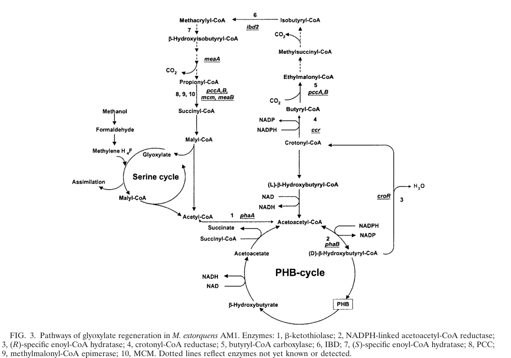

## Question

# Gene Research for Functional Annotation

## ⚠️ CRITICAL: Gene/Protein Identification Context

**BEFORE YOU BEGIN RESEARCH:** You MUST verify you are researching the CORRECT gene/protein. Gene symbols can be ambiguous, especially for less well-characterized genes from non-model organisms.

### Target Gene/Protein Identity (from UniProt):
- **UniProt Accession:** Q59516
- **Protein Description:** RecName: Full=Glycerate dehydrogenase; Short=GDH; EC=1.1.1.29; AltName: Full=Glyoxylate reductase; AltName: Full=Hydroxypyruvate dehydrogenase; AltName: Full=NADH-dependent hydroxypyruvate reductase; Short=HPR; Short=HPR-A;
- **Gene Information:** Name=hprA; OrderedLocusNames=MexAM1_META1p1727;
- **Organism (full):** Methylorubrum extorquens (strain ATCC 14718 / DSM 1338 / JCM 2805 / NCIMB 9133 / AM1) (Methylobacterium extorquens).
- **Protein Family:** Belongs to the D-isomer specific 2-hydroxyacid
- **Key Domains:** D-iso_2-hydroxyacid_DH_PdxB. (IPR050418); D-isomer_2_OHA_DH_cat_dom. (IPR006139); D-isomer_DH_CS. (IPR029753); D-isomer_DH_CS1. (IPR029752); D-isomer_DH_NAD-bd. (IPR006140)

### MANDATORY VERIFICATION STEPS:

1. **Check if the gene symbol "hprA" matches the protein description above**
2. **Verify the organism is correct:** Methylorubrum extorquens (strain ATCC 14718 / DSM 1338 / JCM 2805 / NCIMB 9133 / AM1) (Methylobacterium extorquens).
3. **Check if protein family/domains align with what you find in literature**
4. **If you find literature for a DIFFERENT gene with the same or similar symbol, STOP**

### If Gene Symbol is Ambiguous or You Cannot Find Relevant Literature:

**DO NOT PROCEED WITH RESEARCH ON A DIFFERENT GENE.** Instead:
- State clearly: "The gene symbol 'hprA' is ambiguous or literature is limited for this specific protein"
- Explain what you found (e.g., "Found extensive literature on a different gene with the same symbol in a different organism")
- Describe the protein based ONLY on the UniProt information provided above
- Suggest that the protein function can be inferred from domain/family information

### Research Target:

Please provide a comprehensive research report on the gene **hprA** (gene ID: hprA, UniProt: Q59516) in METEA.

The research report should be a detailed narrative explaining the function, biological processes, and localization of the gene product. Citations should be given for all claims.

You should prioritize authoritative reviews and primary scientific literature when conducting research. You can supplement
this with annotations you find in gene/protein databases, but these can be outdated or inaccurate.

We are specifically interested in the primary function of the gene - for enzymes, what reaction is catalyzed, and what is the substrate specificity? For transporters, what is the substrate? For structural proteins or adapters, what is the broader structural role? For signaling molecules, what is the role in the pathway.

We are interested in where in or outside the cell the gene product carries out its function.

We are also interested in the signaling or biochemical pathways in which the gene functions. We are less interested in broad pleiotropic effects, except where these elucidate the precise role.

Include evidence where possible. We are interested in both experimental evidence as well as inference from structure, evolution, or bioinformatic analysis. Precise studies should be prioritized over high-throughput, where available.

## Output

Question: You are an expert researcher providing comprehensive, well-cited information.

Provide detailed information focusing on:
1. Key concepts and definitions with current understanding
2. Recent developments and latest research (prioritize 2023-2024 sources)
3. Current applications and real-world implementations
4. Expert opinions and analysis from authoritative sources
5. Relevant statistics and data from recent studies

Format as a comprehensive research report with proper citations. Include URLs and publication dates where available.
Always prioritize recent, authoritative sources and provide specific citations for all major claims.

# Gene Research for Functional Annotation

## ⚠️ CRITICAL: Gene/Protein Identification Context

**BEFORE YOU BEGIN RESEARCH:** You MUST verify you are researching the CORRECT gene/protein. Gene symbols can be ambiguous, especially for less well-characterized genes from non-model organisms.

### Target Gene/Protein Identity (from UniProt):
- **UniProt Accession:** Q59516
- **Protein Description:** RecName: Full=Glycerate dehydrogenase; Short=GDH; EC=1.1.1.29; AltName: Full=Glyoxylate reductase; AltName: Full=Hydroxypyruvate dehydrogenase; AltName: Full=NADH-dependent hydroxypyruvate reductase; Short=HPR; Short=HPR-A;
- **Gene Information:** Name=hprA; OrderedLocusNames=MexAM1_META1p1727;
- **Organism (full):** Methylorubrum extorquens (strain ATCC 14718 / DSM 1338 / JCM 2805 / NCIMB 9133 / AM1) (Methylobacterium extorquens).
- **Protein Family:** Belongs to the D-isomer specific 2-hydroxyacid
- **Key Domains:** D-iso_2-hydroxyacid_DH_PdxB. (IPR050418); D-isomer_2_OHA_DH_cat_dom. (IPR006139); D-isomer_DH_CS. (IPR029753); D-isomer_DH_CS1. (IPR029752); D-isomer_DH_NAD-bd. (IPR006140)

### MANDATORY VERIFICATION STEPS:

1. **Check if the gene symbol "hprA" matches the protein description above**
2. **Verify the organism is correct:** Methylorubrum extorquens (strain ATCC 14718 / DSM 1338 / JCM 2805 / NCIMB 9133 / AM1) (Methylobacterium extorquens).
3. **Check if protein family/domains align with what you find in literature**
4. **If you find literature for a DIFFERENT gene with the same or similar symbol, STOP**

### If Gene Symbol is Ambiguous or You Cannot Find Relevant Literature:

**DO NOT PROCEED WITH RESEARCH ON A DIFFERENT GENE.** Instead:
- State clearly: "The gene symbol 'hprA' is ambiguous or literature is limited for this specific protein"
- Explain what you found (e.g., "Found extensive literature on a different gene with the same symbol in a different organism")
- Describe the protein based ONLY on the UniProt information provided above
- Suggest that the protein function can be inferred from domain/family information

### Research Target:

Please provide a comprehensive research report on the gene **hprA** (gene ID: hprA, UniProt: Q59516) in METEA.

The research report should be a detailed narrative explaining the function, biological processes, and localization of the gene product. Citations should be given for all claims.

You should prioritize authoritative reviews and primary scientific literature when conducting research. You can supplement
this with annotations you find in gene/protein databases, but these can be outdated or inaccurate.

We are specifically interested in the primary function of the gene - for enzymes, what reaction is catalyzed, and what is the substrate specificity? For transporters, what is the substrate? For structural proteins or adapters, what is the broader structural role? For signaling molecules, what is the role in the pathway.

We are interested in where in or outside the cell the gene product carries out its function.

We are also interested in the signaling or biochemical pathways in which the gene functions. We are less interested in broad pleiotropic effects, except where these elucidate the precise role.

Include evidence where possible. We are interested in both experimental evidence as well as inference from structure, evolution, or bioinformatic analysis. Precise studies should be prioritized over high-throughput, where available.

# Research report: **hprA** (UniProt **Q59516**) in *Methylorubrum extorquens* AM1 (a.k.a. *Methylobacterium extorquens* AM1)

## Executive summary
The UniProt accession **Q59516** corresponds to **hprA**, encoding a hydroxypyruvate reductase (HPR; also described as glycerate dehydrogenase/glyoxylate reductase; EC **1.1.1.29**) in *Methylorubrum extorquens* strain AM1. In AM1 and closely related strains, HprA is a core enzyme of the **serine cycle** for C1 assimilation, catalyzing the **reduction of hydroxypyruvate to glycerate**; genetically, hprA is required for methylotrophic growth, with deletion causing **no growth on methanol**. (zhang2024phosphoribosylpyrophosphatesynthetaseas pages 1-2, good2015metaboliccontrolof pages 13-20, chistoserdova1994geneticsofthe pages 1-2)

## 1. Critical verification of the correct gene/protein identity
### 1.1 Disambiguation of “hprA”
In the AM1 literature, **hprA** is explicitly used to denote **hydroxypyruvate reductase** within the serine-cycle gene set. A 2003 genomic mini-review of methylotrophy in AM1 describes a hydroxypyruvate reductase gene that was cloned and mutagenized, and lists **hpr** among serine-cycle genes, consistent with the UniProt functional description. (chistoserdova2003methylotrophyinmethylobacterium pages 6-7, chistoserdova2003methylotrophyinmethylobacterium pages 6-6)

A recent 2024 *Nature Communications* study explicitly states that **hprA encodes hydroxypyruvate reductase (HPR) in the native serine cycle**, and uses **ΔhprA** to disable the serine-cycle route, confirming gene identity in the correct organism background (AM1). (zhang2024phosphoribosylpyrophosphatesynthetaseas pages 1-2)

### 1.2 Organism verification
All key evidence cited here refers to *Methylorubrum extorquens* AM1 (synonym: *Methylobacterium extorquens* AM1), matching the UniProt-specified organism context. (zhang2024phosphoribosylpyrophosphatesynthetaseas pages 1-2, chistoserdova2003methylotrophyinmethylobacterium pages 6-7)

## 2. Key concepts and definitions (current understanding)
### 2.1 Serine cycle and the role of hydroxypyruvate reductase
*M. extorquens* AM1 is a model facultative methylotroph that assimilates formaldehyde through the **serine cycle**, a pathway that incorporates C1-derived methylene-tetrahydrofolate into biomass via amino-acid and C3 intermediates. (good2015metaboliccontrolof pages 13-20)

Within this cycle, serine and glyoxylate are transaminated to generate **hydroxypyruvate** and glycine; **hydroxypyruvate is then converted to glycerate via hydroxypyruvate reductase (Hpr/HprA)**. Glycerate is phosphorylated to 2-phosphoglycerate and continues through central metabolism to regenerate key acceptors and supply biosynthetic precursors. (good2015metaboliccontrolof pages 13-20)

### 2.2 Glyoxylate regeneration / ethylmalonyl-CoA (EMC) pathway coupling
Because continued serine-cycle flux requires regeneration of glyoxylate, AM1 uses a glyoxylate-regeneration strategy linked to C2 metabolism and the EMC pathway. A foundational study mapped routes of glyoxylate regeneration in AM1 (including mutant phenotypes for multiple genes in this module), and a genomic mini-review emphasizes that glyoxylate regeneration is intertwined with other modules such as PHB metabolism and portions of the TCA cycle. (korotkova2002glyoxylateregenerationpathway pages 3-5, chistoserdova2003methylotrophyinmethylobacterium pages 6-7)

A pathway diagram of glyoxylate regeneration in AM1 is shown in Korotkova et al. 2002 (Figure 3), illustrating the network context in which serine-cycle metabolism (upstream of glyoxylate demand) is balanced by glyoxylate-regeneration routes. (korotkova2002glyoxylateregenerationpathway media 023f8d72)

## 3. Primary function of HprA (reaction, substrates, specificity)
### 3.1 Catalyzed reaction and pathway step
In AM1 pathway descriptions, hydroxypyruvate reductase (Hpr; encoded by **hprA**) catalyzes the **conversion of hydroxypyruvate to glycerate** as part of the serine cycle. (good2015metaboliccontrolof pages 13-20)

### 3.2 Substrate specificity and cofactor usage (limits of available evidence)
The UniProt entry provided by the user indicates alternative names consistent with **glyoxylate reductase/hydroxypyruvate reductase** activity and classifies the protein in a D-isomer–specific 2-hydroxyacid dehydrogenase family. However, within the retrieved full-text evidence set here, **explicit cofactor specificity (NADH vs NADPH), kinetic parameters (Km/kcat), and experimentally measured relative activities on hydroxypyruvate vs glyoxylate** were **not extractable**.

The 2003 mini-review notes that hydroxypyruvate reductase was purified/characterized and that the gene was cloned/mutagenized in earlier work, implying those details exist in primary biochemical papers; however, those specific biochemical constants are not present in the accessible excerpts used for this report. (chistoserdova2003methylotrophyinmethylobacterium pages 6-7, chistoserdova1994geneticsofthe pages 4-4, good2015metaboliccontrolof pages 89-92)

## 4. Genetic evidence and phenotype (functional necessity)
### 4.1 Essentiality for methanol (C1) growth in AM1
A 2024 *Nature Communications* study reports that deleting **hprA** in AM1 (to remove the serine-cycle HPR function) caused **complete abolition of growth on methanol**. (zhang2024phosphoribosylpyrophosphatesynthetaseas pages 1-2)

This modern result is consistent with earlier serine-cycle genetics summaries indicating that mutations in identified serine-cycle genes confirm their requirement for serine-cycle function. (chistoserdova1994geneticsofthe pages 1-2)

### 4.2 Functional replacement in experimental evolution (new mechanistic insight)
In the same 2024 work, adaptive laboratory evolution (ALE) of the engineered AM1 background identified activation of a **hypothetical protein (META1_3141)** that **partially fulfilled the function of HPR** in evolved strains; the complementary activity was supported by an **in vitro enzymatic assay** (details referenced in the article’s supplementary materials). This provides a contemporary example of functional redundancy/evolvability around the hydroxypyruvate-to-glycerate node. (zhang2024phosphoribosylpyrophosphatesynthetaseas pages 1-2)

### 4.3 Evidence from a closely related strain (PA1) supports serine-cycle specificity
In *M. extorquens* PA1, ΔhprA abolished growth on C1 substrates but left growth on multi-carbon substrates largely unaffected, supporting the view that HprA is specifically required for C1 assimilation via the serine cycle rather than for general heterotrophic growth. (nayak2014physiologyandevolution pages 39-44)

## 5. Subcellular localization and cellular context
### 5.1 Likely localization (inference) and explicit evidence gaps
Direct experimental statements in the retrieved excerpts about **HprA cellular localization** (cytosolic vs periplasmic) were **not found**. (zhang2024phosphoribosylpyrophosphatesynthetaseas pages 1-2)

Nevertheless, the serine-cycle context described in AM1 places Hpr/HprA among enzymes acting on cytosolic intermediates (hydroxypyruvate and glycerate), while methanol oxidation by methanol dehydrogenase is described as occurring in the **periplasmic space**; this supports (as an inference) that HprA functions in the **cytosolic** compartment of central metabolism rather than the periplasm. (zhang2024phosphoribosylpyrophosphatesynthetaseas pages 1-2, good2015metaboliccontrolof pages 13-20)

## 6. Recent developments and latest research (prioritizing 2023–2024)
### 6.1 2024: Linking serine-cycle disruption (ΔhprA) to phyllosphere fitness and adaptive solutions
Zhang et al. (published July 2024; received Nov 2023) studied *Methylorubrum extorquens* AM1 in the context of **phyllosphere colonization and plant growth promotion**, focusing on optimizing growth under low methanol typical of leaf surfaces. They explicitly leveraged **ΔhprA** to block the native serine cycle (abolishing methanol growth), then used ALE and systems measurements to identify compensatory mechanisms and improved low-methanol fitness. (zhang2024phosphoribosylpyrophosphatesynthetaseas pages 1-2)

This positions hprA as not only a canonical methylotrophy gene but also a practical genetic “handle” used in modern studies to re-route C1 assimilation strategies. (zhang2024phosphoribosylpyrophosphatesynthetaseas pages 1-2)

### 6.2 2024: Comparative genomics/pangenomics supports conservation of HPR in type II methylotrophs
A 2024 mSystems pangenomic analysis across type II methylotrophs reports **ubiquitous presence of hydroxypyruvate reductase (HPR)** among organisms including *Methylobacterium extorquens*, consistent with HprA representing a conserved enzyme in serine-cycle methylotrophy. (samanta2024fromgenometo pages 10-12)

## 7. Current applications and real-world implementations
### 7.1 Plant-associated methylotrophs and agricultural use
The 2024 *Nature Communications* paper frames *Methylobacterium/Methylorubrum* as common phyllosphere microbes with documented abilities to enhance plant growth and yield (e.g., phytohormone-related traits, ACC deaminase, nitrogen fixation) and states that their findings could **guide strain selection for agricultural applications**. While these traits are not specific to hprA alone, hprA-dependent methanol assimilation capacity is central to the organism’s ecological niche on plant methanol emissions. (zhang2024phosphoribosylpyrophosphatesynthetaseas pages 1-2)

### 7.2 C1-based biomanufacturing (biotechnology relevance)
A systems-level overview of AM1 metabolism notes that methylotrophic growth involves high flux through toxic intermediates (formaldehyde, glyoxylate/glycine) and that AM1 methylotrophy can yield intermediates of potential commercial value (e.g., ethylmalonyl-CoA–pathway intermediates). HprA’s role in serine-cycle flux supports these capabilities by enabling efficient C1 assimilation into central carbon metabolism. (good2015metaboliccontrolof pages 13-20)

## 8. Quantitative statistics and data from recent studies
### 8.1 Global/environmental methanol context
Zhang et al. (2024) report an estimated **~100 Tg annual methanol emission**, and emphasize that plant-derived methanol concentrations in the phyllosphere vary diurnally from trace levels to **tens of millimoles**. (zhang2024phosphoribosylpyrophosphatesynthetaseas pages 1-2)

### 8.2 Growth conditions and performance metrics relevant to low-methanol fitness
In Zhang et al. (2024), “standard” cultivation used **~120 mM methanol**, and “growth-limiting” conditions were **≤15 mM methanol**. Experiments tested 15, 10, 5, 1.2, and 0.5 mM methanol to mimic the phyllosphere. (zhang2024phosphoribosylpyrophosphatesynthetaseas pages 1-2, zhang2024phosphoribosylpyrophosphatesynthetaseas pages 3-5)

Although these quantitative improvements are not attributed to hprA directly (they involve a prs allele), they provide modern benchmarks for AM1 physiology under low methanol:
- Lag phase shortened by **1–2.5 h**.
- Maximum OD600 increased **7.0–26.7%** across **0.5–15 mM methanol**.
- Biomass yields increased **11.0%** at **10 mM** methanol and **8.3%** at **15 mM** methanol (growth rate unchanged vs wild type at low methanol). (zhang2024phosphoribosylpyrophosphatesynthetaseas pages 3-5)

### 8.3 hprA deletion phenotype (quantitative framing)
The strongest quantitative statement about hprA in the recent AM1 literature captured here is categorical: **ΔhprA yields complete abolition of growth on methanol**. (zhang2024phosphoribosylpyrophosphatesynthetaseas pages 1-2)

## 9. Expert synthesis and interpretation
### 9.1 Functional interpretation in pathway architecture
Across decades of AM1 research, hprA/HprA is best interpreted as a **commitment step** maintaining serine-cycle continuity by pulling hydroxypyruvate into the glycerate/2-phosphoglycerate/PEP segment of central metabolism. This provides metabolic continuity linking amino-acid interconversions (serine/glycine/glyoxylate) to glycolytic intermediates and downstream carboxylation/CoA-ligation steps. (good2015metaboliccontrolof pages 13-20)

### 9.2 Why hprA is a useful “metabolic valve” in modern engineering
The 2024 AM1 work demonstrates that removing hprA provides a clean knockout that eliminates methylotrophic growth, creating strong selection pressure for alternative routes and enabling discovery of compensatory enzymes (e.g., META1_3141). This indicates that the hydroxypyruvate→glycerate conversion is a high-control point for serine-cycle flux and thus a strategic intervention target in synthetic rewiring of C1 assimilation. (zhang2024phosphoribosylpyrophosphatesynthetaseas pages 1-2)

## 10. Evidence-backed gaps and recommended primary sources (within retrieved context)
Despite clear genetic/physiological evidence for function, the following details could not be directly extracted from accessible full text in this run:
- **Cofactor preference** (NADH vs NADPH) and any **dual specificity** (hydroxypyruvate vs glyoxylate) with kinetic constants.
- **Oligomeric state** and detailed biochemical mechanism.
- **Direct experimental localization**.

The 2003 AM1 mini-review explicitly points to earlier work on purification/characterization and cloning/mutagenesis of hydroxypyruvate reductase in AM1, which are likely to contain these biochemical parameters, but those papers were not available in the current retrieval set. (chistoserdova2003methylotrophyinmethylobacterium pages 6-7)

## Evidence summary table
| Claim | Evidence summary | Source (author year) | URL |
|---|---|---|---|
| hprA (UniProt Q59516) annotation matches hydroxypyruvate reductase / glycerate dehydrogenase activity (EC 1.1.1.29) in *Methylorubrum extorquens* AM1 | AM1 literature explicitly names **hprA** as the hydroxypyruvate reductase gene in the serine-cycle gene set; later work states deletion of **hprA** removes the native HPR function required for methanol growth, consistent with the UniProt annotation for glycerate dehydrogenase / hydroxypyruvate reductase. Direct kinetic/cofactor detail was not present in the retrieved excerpts. (chistoserdova2003methylotrophyinmethylobacterium pages 6-7, chistoserdova1994geneticsofthe pages 4-4, chistoserdova1994geneticsofthe pages 1-2, zhang2024phosphoribosylpyrophosphatesynthetaseas pages 1-2) | Chistoserdova et al. 2003; Chistoserdova & Lidstrom 1994; Zhang et al. 2024 | https://doi.org/10.1128/jb.185.10.2980-2987.2003; https://doi.org/10.1128/jb.176.21.6759-6762.1994; https://doi.org/10.1038/s41467-024-50342-9 |
| Primary pathway role: HprA catalyzes the serine-cycle step hydroxypyruvate → glycerate | AM1 pathway descriptions state that serine and glyoxylate are transaminated to hydroxypyruvate and glycine, and **hydroxypyruvate is then converted to glycerate via hydroxypyruvate reductase (Hpr)**; pathway diagrams place hydroxypyruvate and glycerate adjacent in the serine cycle. (good2015metaboliccontrolof pages 13-20, chistoserdova1994geneticsofthe pages 1-2) | Good 2015; Chistoserdova & Lidstrom 1994 | Not available for thesis excerpt; https://doi.org/10.1128/jb.176.21.6759-6762.1994 |
| hprA is required for C1 growth in AM1 | Recent AM1 engineering work deleted **hprA**, described as encoding native serine-cycle HPR, and reported **complete abolition of growth on methanol**. Earlier serine-cycle genetics also stated mutations in identified serine-cycle genes confirmed their requirement for the cycle. (zhang2024phosphoribosylpyrophosphatesynthetaseas pages 1-2, chistoserdova1994geneticsofthe pages 1-2) | Zhang et al. 2024; Chistoserdova & Lidstrom 1994 | https://doi.org/10.1038/s41467-024-50342-9; https://doi.org/10.1128/jb.176.21.6759-6762.1994 |
| Closely related strain evidence supports a broader C1-assimilation-essential phenotype | In *M. extorquens* PA1, **ΔhprA** abolished growth on all C1 substrates while retaining wild-type-like growth on multi-carbon substrates, reinforcing that HprA is a specific serine-cycle assimilation enzyme rather than a general essential enzyme. This is supportive but from PA1, not AM1. (nayak2014physiologyandevolution pages 39-44) | Nayak 2014 | http://nrs.harvard.edu/urn-3:HUL.InstRepos:13065009 |
| Link to glyoxylate regeneration and EMC pathway | The serine cycle requires regeneration of glyoxylate for continued C1 assimilation; AM1 reviews and pathway summaries place Hpr/HprA in the serine cycle that feeds into malyl-CoA cleavage to produce glyoxylate and acetyl-CoA, while glyoxylate is replenished through the glyoxylate-regeneration route / EMC pathway. Thus HprA is functionally upstream of glyoxylate regeneration demands rather than an EMC enzyme itself. (chistoserdova2003methylotrophyinmethylobacterium pages 6-6, chistoserdova2003methylotrophyinmethylobacterium pages 6-7, good2015metaboliccontrolof pages 13-20, korotkova2002glyoxylateregenerationpathway media 023f8d72) | Chistoserdova et al. 2003; Korotkova et al. 2002; Good 2015 | https://doi.org/10.1128/jb.185.10.2980-2987.2003; https://doi.org/10.1128/jb.184.6.1750-1758.2002 |
| Quantitative context from the 2024 AM1 study | The 2024 study used ~**120 mM methanol** as standard cultivation conditions and defined **15 mM or less** as growth-limiting. In strains carrying a PRS mutation (not an hprA effect per se), maximum OD600 increased by **7.0–26.7%** across **0.5–15 mM methanol**, and biomass yields increased by **11.0%** and **8.3%** at **10 mM** and **15 mM methanol**, respectively. These numbers provide recent physiological context for AM1 methanol growth but are not direct quantitative measurements of HprA activity. (zhang2024phosphoribosylpyrophosphatesynthetaseas pages 1-2, zhang2024phosphoribosylpyrophosphatesynthetaseas pages 3-5) | Zhang et al. 2024 | https://doi.org/10.1038/s41467-024-50342-9 |
| No quantitative HprA biochemistry was recoverable from the retrieved sources | The retrieved excerpts did **not** provide HprA kinetic constants, substrate preference between hydroxypyruvate vs glyoxylate, cofactor specificity (NADH/NADPH), or experimentally demonstrated subcellular localization. Reviews point to older primary papers on purification and mutagenesis, but those details were not present in the accessible excerpts here. (chistoserdova2003methylotrophyinmethylobacterium pages 6-7, zhang2024phosphoribosylpyrophosphatesynthetaseas pages 1-2, good2015metaboliccontrolof pages 89-92) | Chistoserdova et al. 2003; Zhang et al. 2024; Good 2015 | https://doi.org/10.1128/jb.185.10.2980-2987.2003; https://doi.org/10.1038/s41467-024-50342-9 |

*Table: This table summarizes the main evidence supporting functional annotation of hprA (Q59516) in Methylorubrum extorquens AM1, including pathway role, mutant phenotype, and recent physiological context. It also highlights key gaps in the retrieved literature, especially missing biochemical constants and cofactor data.*

## Key pathway figure (glyoxylate regeneration context)
Korotkova et al. 2002 Figure 3 provides a pathway-level diagram of glyoxylate regeneration in AM1, contextualizing how serine-cycle methylotrophy depends on dedicated glyoxylate-regeneration metabolism. (korotkova2002glyoxylateregenerationpathway media 023f8d72)

## References (URLs and publication dates where available)
- Zhang C. et al. **Phosphoribosylpyrophosphate synthetase as a metabolic valve advances Methylobacterium/Methylorubrum phyllosphere colonization and plant growth.** *Nature Communications* (published **July 2024**; received Nov 2023). https://doi.org/10.1038/s41467-024-50342-9 (zhang2024phosphoribosylpyrophosphatesynthetaseas pages 1-2)
- Chistoserdova L. et al. **Methylotrophy in Methylobacterium extorquens AM1 from a Genomic Point of View.** *Journal of Bacteriology* (**May 2003**). https://doi.org/10.1128/jb.185.10.2980-2987.2003 (chistoserdova2003methylotrophyinmethylobacterium pages 6-7)
- Korotkova N. et al. **Glyoxylate Regeneration Pathway in the Methylotroph Methylobacterium extorquens AM1.** *Journal of Bacteriology* (**March 2002**). https://doi.org/10.1128/jb.184.6.1750-1758.2002 (korotkova2002glyoxylateregenerationpathway pages 3-5)
- Chistoserdova L.V. & Lidstrom M.E. **Genetics of the serine cycle… glyA.** *Journal of Bacteriology* (**Nov 1994**). https://doi.org/10.1128/jb.176.21.6759-6762.1994 (chistoserdova1994geneticsofthe pages 4-4)
- Samanta D. et al. **From genome to evolution: investigating type II methylotrophs using a pangenomic analysis.** *mSystems* (**June 2024**). https://doi.org/10.1128/msystems.00248-24 (samanta2024fromgenometo pages 10-12)
- Nayak D.D. **Physiology and Evolution of Methylamine Metabolism across Methylobacterium extorquens strains.** PhD thesis (**Aug 2014**). http://nrs.harvard.edu/urn-3:HUL.InstRepos:13065009 (nayak2014physiologyandevolution pages 1-8)

References

1. (zhang2024phosphoribosylpyrophosphatesynthetaseas pages 1-2): Cong Zhang, Di-Fei Zhou, Meng-Ying Wang, Ya-Zhen Song, Chong Zhang, Ming-Ming Zhang, Jing Sun, Lu Yao, Xu-Hua Mo, Zeng-Xin Ma, Xiao-Jie Yuan, Yi Shao, Hao-Ran Wang, Si-Han Dong, Kai Bao, Shu-Huan Lu, Martin Sadilek, Marina G. Kalyuzhnaya, Xin-Hui Xing, and Song Yang. Phosphoribosylpyrophosphate synthetase as a metabolic valve advances methylobacterium/methylorubrum phyllosphere colonization and plant growth. Nature Communications, Jul 2024. URL: https://doi.org/10.1038/s41467-024-50342-9, doi:10.1038/s41467-024-50342-9. This article has 30 citations and is from a highest quality peer-reviewed journal.

2. (good2015metaboliccontrolof pages 13-20): N Good. Metabolic control of the ethylmalonyl-coa pathway in methylobacterium extorquens am1. Unknown journal, 2015.

3. (chistoserdova1994geneticsofthe pages 1-2): L V Chistoserdova and M E Lidstrom. Genetics of the serine cycle in methylobacterium extorquens am1: cloning, sequence, mutation, and physiological effect of glya, the gene for serine hydroxymethyltransferase. Journal of Bacteriology, 176:6759-6762, Nov 1994. URL: https://doi.org/10.1128/jb.176.21.6759-6762.1994, doi:10.1128/jb.176.21.6759-6762.1994. This article has 43 citations and is from a peer-reviewed journal.

4. (chistoserdova2003methylotrophyinmethylobacterium pages 6-7): Ludmila Chistoserdova, Sung-Wei Chen, Alla Lapidus, and Mary E. Lidstrom. Methylotrophy in methylobacterium extorquens am1 from a genomic point of view. Journal of Bacteriology, 185:2980-2987, May 2003. URL: https://doi.org/10.1128/jb.185.10.2980-2987.2003, doi:10.1128/jb.185.10.2980-2987.2003. This article has 237 citations and is from a peer-reviewed journal.

5. (chistoserdova2003methylotrophyinmethylobacterium pages 6-6): Ludmila Chistoserdova, Sung-Wei Chen, Alla Lapidus, and Mary E. Lidstrom. Methylotrophy in methylobacterium extorquens am1 from a genomic point of view. Journal of Bacteriology, 185:2980-2987, May 2003. URL: https://doi.org/10.1128/jb.185.10.2980-2987.2003, doi:10.1128/jb.185.10.2980-2987.2003. This article has 237 citations and is from a peer-reviewed journal.

6. (korotkova2002glyoxylateregenerationpathway pages 3-5): Natalia Korotkova, Ludmila Chistoserdova, Vladimir Kuksa, and Mary E. Lidstrom. Glyoxylate regeneration pathway in the methylotroph methylobacterium extorquens am1. Journal of Bacteriology, 184:1750-1758, Mar 2002. URL: https://doi.org/10.1128/jb.184.6.1750-1758.2002, doi:10.1128/jb.184.6.1750-1758.2002. This article has 141 citations and is from a peer-reviewed journal.

7. (korotkova2002glyoxylateregenerationpathway media 023f8d72): Natalia Korotkova, Ludmila Chistoserdova, Vladimir Kuksa, and Mary E. Lidstrom. Glyoxylate regeneration pathway in the methylotroph methylobacterium extorquens am1. Journal of Bacteriology, 184:1750-1758, Mar 2002. URL: https://doi.org/10.1128/jb.184.6.1750-1758.2002, doi:10.1128/jb.184.6.1750-1758.2002. This article has 141 citations and is from a peer-reviewed journal.

8. (chistoserdova1994geneticsofthe pages 4-4): L V Chistoserdova and M E Lidstrom. Genetics of the serine cycle in methylobacterium extorquens am1: cloning, sequence, mutation, and physiological effect of glya, the gene for serine hydroxymethyltransferase. Journal of Bacteriology, 176:6759-6762, Nov 1994. URL: https://doi.org/10.1128/jb.176.21.6759-6762.1994, doi:10.1128/jb.176.21.6759-6762.1994. This article has 43 citations and is from a peer-reviewed journal.

9. (good2015metaboliccontrolof pages 89-92): N Good. Metabolic control of the ethylmalonyl-coa pathway in methylobacterium extorquens am1. Unknown journal, 2015.

10. (nayak2014physiologyandevolution pages 39-44): DD Nayak. Physiology and evolution of methylamine metabolism across methylobacterium extorquens strains. Unknown journal, 2014.

11. (samanta2024fromgenometo pages 10-12): Dipayan Samanta, Shailabh Rauniyar, Priya Saxena, and Rajesh K. Sani. From genome to evolution: investigating type ii methylotrophs using a pangenomic analysis. Jun 2024. URL: https://doi.org/10.1128/msystems.00248-24, doi:10.1128/msystems.00248-24. This article has 9 citations and is from a peer-reviewed journal.

12. (zhang2024phosphoribosylpyrophosphatesynthetaseas pages 3-5): Cong Zhang, Di-Fei Zhou, Meng-Ying Wang, Ya-Zhen Song, Chong Zhang, Ming-Ming Zhang, Jing Sun, Lu Yao, Xu-Hua Mo, Zeng-Xin Ma, Xiao-Jie Yuan, Yi Shao, Hao-Ran Wang, Si-Han Dong, Kai Bao, Shu-Huan Lu, Martin Sadilek, Marina G. Kalyuzhnaya, Xin-Hui Xing, and Song Yang. Phosphoribosylpyrophosphate synthetase as a metabolic valve advances methylobacterium/methylorubrum phyllosphere colonization and plant growth. Nature Communications, Jul 2024. URL: https://doi.org/10.1038/s41467-024-50342-9, doi:10.1038/s41467-024-50342-9. This article has 30 citations and is from a highest quality peer-reviewed journal.

13. (nayak2014physiologyandevolution pages 1-8): DD Nayak. Physiology and evolution of methylamine metabolism across methylobacterium extorquens strains. Unknown journal, 2014.

## Artifacts

- [Edison artifact artifact-00](hprA-deep-research-falcon_artifacts/artifact-00.md)

## Citations

1. zhang2024phosphoribosylpyrophosphatesynthetaseas pages 1-2
2. good2015metaboliccontrolof pages 13-20
3. chistoserdova1994geneticsofthe pages 1-2
4. nayak2014physiologyandevolution pages 39-44
5. samanta2024fromgenometo pages 10-12
6. zhang2024phosphoribosylpyrophosphatesynthetaseas pages 3-5
7. chistoserdova2003methylotrophyinmethylobacterium pages 6-7
8. korotkova2002glyoxylateregenerationpathway pages 3-5
9. chistoserdova1994geneticsofthe pages 4-4
10. nayak2014physiologyandevolution pages 1-8
11. chistoserdova2003methylotrophyinmethylobacterium pages 6-6
12. good2015metaboliccontrolof pages 89-92
13. https://doi.org/10.1128/jb.185.10.2980-2987.2003;
14. https://doi.org/10.1128/jb.176.21.6759-6762.1994;
15. https://doi.org/10.1038/s41467-024-50342-9
16. https://doi.org/10.1128/jb.176.21.6759-6762.1994
17. https://doi.org/10.1038/s41467-024-50342-9;
18. http://nrs.harvard.edu/urn-3:HUL.InstRepos:13065009
19. https://doi.org/10.1128/jb.184.6.1750-1758.2002
20. https://doi.org/10.1128/jb.185.10.2980-2987.2003
21. https://doi.org/10.1128/msystems.00248-24
22. https://doi.org/10.1038/s41467-024-50342-9,
23. https://doi.org/10.1128/jb.176.21.6759-6762.1994,
24. https://doi.org/10.1128/jb.185.10.2980-2987.2003,
25. https://doi.org/10.1128/jb.184.6.1750-1758.2002,
26. https://doi.org/10.1128/msystems.00248-24,