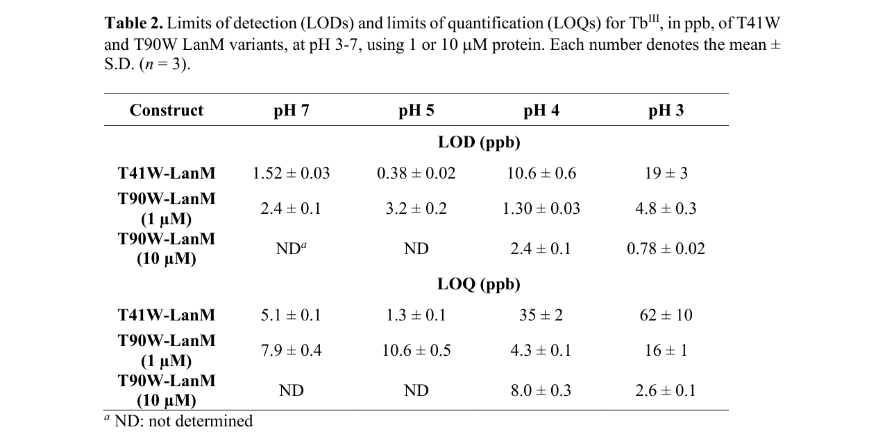

## Question

# Gene Research for Functional Annotation

## ⚠️ CRITICAL: Gene/Protein Identification Context

**BEFORE YOU BEGIN RESEARCH:** You MUST verify you are researching the CORRECT gene/protein. Gene symbols can be ambiguous, especially for less well-characterized genes from non-model organisms.

### Target Gene/Protein Identity (from UniProt):
- **UniProt Accession:** C5B164
- **Protein Description:** RecName: Full=Lanmodulin {ECO:0000303|PubMed:30351021, ECO:0000303|PubMed:30352145}; Short=LanM {ECO:0000303|PubMed:30351021, ECO:0000303|PubMed:30352145}; AltName: Full=Lanthanide-binding protein {ECO:0000303|PubMed:30351021}; Short=Ln(3+)-binding protein {ECO:0000303|PubMed:30351021}; Flags: Precursor;
- **Gene Information:** Name=lanM {ECO:0000303|PubMed:30351021}; OrderedLocusNames=MexAM1_META1p1786 {ECO:0000312|EMBL:ACS39628.1};
- **Organism (full):** Methylorubrum extorquens (strain ATCC 14718 / DSM 1338 / JCM 2805 / NCIMB 9133 / AM1) (Methylobacterium extorquens).
- **Protein Family:** Not specified in UniProt
- **Key Domains:** EF-hand-dom_pair. (IPR011992); EF_Hand_1_Ca_BS. (IPR018247); EF_hand_dom. (IPR002048); EF-hand_5 (PF13202)

### MANDATORY VERIFICATION STEPS:

1. **Check if the gene symbol "lanM" matches the protein description above**
2. **Verify the organism is correct:** Methylorubrum extorquens (strain ATCC 14718 / DSM 1338 / JCM 2805 / NCIMB 9133 / AM1) (Methylobacterium extorquens).
3. **Check if protein family/domains align with what you find in literature**
4. **If you find literature for a DIFFERENT gene with the same or similar symbol, STOP**

### If Gene Symbol is Ambiguous or You Cannot Find Relevant Literature:

**DO NOT PROCEED WITH RESEARCH ON A DIFFERENT GENE.** Instead:
- State clearly: "The gene symbol 'lanM' is ambiguous or literature is limited for this specific protein"
- Explain what you found (e.g., "Found extensive literature on a different gene with the same symbol in a different organism")
- Describe the protein based ONLY on the UniProt information provided above
- Suggest that the protein function can be inferred from domain/family information

### Research Target:

Please provide a comprehensive research report on the gene **lanM** (gene ID: lanM, UniProt: C5B164) in METEA.

The research report should be a detailed narrative explaining the function, biological processes, and localization of the gene product. Citations should be given for all claims.

You should prioritize authoritative reviews and primary scientific literature when conducting research. You can supplement
this with annotations you find in gene/protein databases, but these can be outdated or inaccurate.

We are specifically interested in the primary function of the gene - for enzymes, what reaction is catalyzed, and what is the substrate specificity? For transporters, what is the substrate? For structural proteins or adapters, what is the broader structural role? For signaling molecules, what is the role in the pathway.

We are interested in where in or outside the cell the gene product carries out its function.

We are also interested in the signaling or biochemical pathways in which the gene functions. We are less interested in broad pleiotropic effects, except where these elucidate the precise role.

Include evidence where possible. We are interested in both experimental evidence as well as inference from structure, evolution, or bioinformatic analysis. Precise studies should be prioritized over high-throughput, where available.

## Output

Question: You are an expert researcher providing comprehensive, well-cited information.

Provide detailed information focusing on:
1. Key concepts and definitions with current understanding
2. Recent developments and latest research (prioritize 2023-2024 sources)
3. Current applications and real-world implementations
4. Expert opinions and analysis from authoritative sources
5. Relevant statistics and data from recent studies

Format as a comprehensive research report with proper citations. Include URLs and publication dates where available.
Always prioritize recent, authoritative sources and provide specific citations for all major claims.

# Gene Research for Functional Annotation

## ⚠️ CRITICAL: Gene/Protein Identification Context

**BEFORE YOU BEGIN RESEARCH:** You MUST verify you are researching the CORRECT gene/protein. Gene symbols can be ambiguous, especially for less well-characterized genes from non-model organisms.

### Target Gene/Protein Identity (from UniProt):
- **UniProt Accession:** C5B164
- **Protein Description:** RecName: Full=Lanmodulin {ECO:0000303|PubMed:30351021, ECO:0000303|PubMed:30352145}; Short=LanM {ECO:0000303|PubMed:30351021, ECO:0000303|PubMed:30352145}; AltName: Full=Lanthanide-binding protein {ECO:0000303|PubMed:30351021}; Short=Ln(3+)-binding protein {ECO:0000303|PubMed:30351021}; Flags: Precursor;
- **Gene Information:** Name=lanM {ECO:0000303|PubMed:30351021}; OrderedLocusNames=MexAM1_META1p1786 {ECO:0000312|EMBL:ACS39628.1};
- **Organism (full):** Methylorubrum extorquens (strain ATCC 14718 / DSM 1338 / JCM 2805 / NCIMB 9133 / AM1) (Methylobacterium extorquens).
- **Protein Family:** Not specified in UniProt
- **Key Domains:** EF-hand-dom_pair. (IPR011992); EF_Hand_1_Ca_BS. (IPR018247); EF_hand_dom. (IPR002048); EF-hand_5 (PF13202)

### MANDATORY VERIFICATION STEPS:

1. **Check if the gene symbol "lanM" matches the protein description above**
2. **Verify the organism is correct:** Methylorubrum extorquens (strain ATCC 14718 / DSM 1338 / JCM 2805 / NCIMB 9133 / AM1) (Methylobacterium extorquens).
3. **Check if protein family/domains align with what you find in literature**
4. **If you find literature for a DIFFERENT gene with the same or similar symbol, STOP**

### If Gene Symbol is Ambiguous or You Cannot Find Relevant Literature:

**DO NOT PROCEED WITH RESEARCH ON A DIFFERENT GENE.** Instead:
- State clearly: "The gene symbol 'lanM' is ambiguous or literature is limited for this specific protein"
- Explain what you found (e.g., "Found extensive literature on a different gene with the same symbol in a different organism")
- Describe the protein based ONLY on the UniProt information provided above
- Suggest that the protein function can be inferred from domain/family information

### Research Target:

Please provide a comprehensive research report on the gene **lanM** (gene ID: lanM, UniProt: C5B164) in METEA.

The research report should be a detailed narrative explaining the function, biological processes, and localization of the gene product. Citations should be given for all claims.

You should prioritize authoritative reviews and primary scientific literature when conducting research. You can supplement
this with annotations you find in gene/protein databases, but these can be outdated or inaccurate.

We are specifically interested in the primary function of the gene - for enzymes, what reaction is catalyzed, and what is the substrate specificity? For transporters, what is the substrate? For structural proteins or adapters, what is the broader structural role? For signaling molecules, what is the role in the pathway.

We are interested in where in or outside the cell the gene product carries out its function.

We are also interested in the signaling or biochemical pathways in which the gene functions. We are less interested in broad pleiotropic effects, except where these elucidate the precise role.

Include evidence where possible. We are interested in both experimental evidence as well as inference from structure, evolution, or bioinformatic analysis. Precise studies should be prioritized over high-throughput, where available.

## Research report: lanM (Lanmodulin, LanM) — UniProt C5B164 (*Methylorubrum extorquens* AM1)

### 0) Target verification (critical identity check)
The gene symbol **lanM** in *Methylorubrum extorquens* AM1 refers to **lanmodulin (LanM)**, a small calmodulin-like EF-hand protein that binds trivalent lanthanides with extraordinary affinity and selectivity, originally identified in the context of lanthanide-dependent methylotrophy in this organism. This matches the UniProt C5B164 description (Lanmodulin/LanM; EF-hand domains). (daumann2022aperspectiveon pages 5-8, glass2020lanthaniderarityin pages 2-3)

### 1) Key concepts and current understanding (definitions, mechanistic concepts)

#### 1.1 What LanM is (functional definition)
**Lanmodulin (LanM)** is best described as a **high-affinity, high-selectivity lanthanide (Ln3+) binding protein** (a “macrochelator”/chaperone-like mediator) rather than an enzyme: its primary molecular function is **tight coordination of Ln3+ ions** and, by inference and emerging physiology, **buffering/trafficking Ln3+ for downstream utilization and homeostasis**. (daumann2022aperspectiveon pages 5-8, fujitani2022aperiplasmiclanthanide pages 1-2)

#### 1.2 Domain architecture and binding sites (EF-hand biology adapted to lanthanides)
LanM is an **EF-hand protein** with **four EF-hand motifs**, but **only three sites (EF1–EF3) are high-affinity Ln-binding sites**, while **EF4 has very low lanthanide affinity**. (liu2021lanthanidedependentcoordinationinteractions pages 1-3, glass2020lanthaniderarityin pages 2-3, featherston2021probinglanmodulinslanthanide pages 1-4)

A distinctive point emphasized in synthesis of discovery work is that LanM’s EF-hand loops retain canonical EF-hand metal-ligating positions yet include features (e.g., an unusual conserved Asp at loop position 9 and a proline at position 2 in AM1 LanM) proposed to support strong lanthanide binding and diminished Ca2+ responsiveness. (glass2020lanthaniderarityin pages 2-3)

#### 1.3 Selectivity and “lanthanide vs calcium discrimination”
LanM is repeatedly characterized as showing ~**10^8-fold** preference for **Ln3+/Y3+ over Ca2+** and other competing metals in vitro, enabling lanthanide binding even when calcium and other metals are in large excess—an essential concept because Ca2+ is typically abundant in environments and in cells. (fujitani2022aperiplasmiclanthanide pages 1-2, liu2021lanthanidedependentcoordinationinteractions pages 1-3)

### 2) Cellular localization and pathway context (physiology and systems biology)

#### 2.1 Localization: periplasmic targeting is the dominant model
LanM is widely described as a **periplasmic lanthanide mediator**. Strong support comes from (i) **signal peptide predictions** and (ii) periplasmic localization experiments in close methylobacterial homolog systems. For example, in *Methylobacterium aquaticum* 22A, the LanM homolog contains a predicted signal peptide cleavage site (E23/K25 region), consistent with export to the periplasm. (fujitani2022aperiplasmiclanthanide pages 5-7)

#### 2.2 Relationship to methylotrophy and the XoxF/MxaF “lanthanide switch”
Lanthanides regulate expression and use of lanthanide-dependent methanol dehydrogenases (e.g., XoxF-type MDHs) vs calcium-dependent MDHs (MxaF). LanM was discovered in this broader biological context and is proposed to participate in **lanthanide acquisition/trafficking upstream of lanthanide-dependent enzymes** and in discrimination between Ca2+ and Ln3+. However, authoritative synthesis notes that **deleting lanM did not necessarily cause a clear Ln-dependent growth defect** in tested conditions, implying redundancy or condition-specific roles. (daumann2022aperspectiveon pages 5-8, fujitani2022aperiplasmiclanthanide pages 11-12)

#### 2.3 Proposed physiological role: buffering/trafficking and homeostasis (with envelope protection)
In *M. aquaticum* 22A, lanM expression is **La3+-responsive** (reported ~4.25-fold by RNA-seq and ~10.3-fold by qPCR under methanol + La3+), and regulation was linked to regulatory components including **mxcQE** and a lanthanide-associated **TonB-dependent receptor (tonB_Ln)**, connecting LanM to lanthanide-responsive regulatory networks. (fujitani2022aperiplasmiclanthanide pages 5-7, fujitani2022aperiplasmiclanthanide pages 7-9)

Physiological phenotypes in the same homolog system are consistent with LanM supporting **lanthanide homeostasis** rather than being strictly required for lanthanide-dependent growth: **ΔlanM** strains exposed to La3+ show **aggregation**, **membrane impairment/permeability**, and evidence of **periplasmic La deposition**, suggesting that LanM can help keep lanthanides soluble/managed in the periplasm and may mitigate toxicity-like effects (e.g., precipitation with phosphates and envelope stress). (fujitani2022aperiplasmiclanthanide pages 7-9, fujitani2022aperiplasmiclanthanide pages 11-12)

### 3) Quantitative functional characterization (statistics/data)

#### 3.1 Stoichiometry (how many Ln3+ per protein)
LanM is commonly described as binding ~**3 equivalents** of lanthanides at its three high-affinity sites. In *M. aquaticum* 22A, gel filtration/ICP-MS-based analysis reported **~3.65 mol La3+ per LanM molecule** (consistent with ~3-site occupancy plus experimental uncertainty/partial occupancy). (fujitani2022aperiplasmiclanthanide pages 5-7, featherston2021probinglanmodulinslanthanide pages 14-17)

#### 3.2 Kinetics (how fast Ln3+ binds and unbinds)
Stopped-flow fluorescence assays in a primary JACS study (Featherston et al., **2021-08**, https://doi.org/10.1021/jacs.1c06360) reported that Ln association is **nearly diffusion-limited** with **kon ≈ 3–8 × 10^8 M−1 s−1**, and dissociation kinetics are comparatively ordinary for EF hands, with **koff ≈ 0.02–0.05 s−1** (variant- and phase-dependent). (featherston2021probinglanmodulinslanthanide pages 14-17, featherston2021probinglanmodulinslanthanide pages 17-21, featherston2021probinglanmodulinslanthanide pages 1-4)

A key mechanistic statistic is that what “sets LanM apart” is not an unusually slow koff but the very large kon, producing exceptional overall affinity. (featherston2021probinglanmodulinslanthanide pages 1-4)

#### 3.3 Affinity/selectivity (Kd and competition)
LanM is repeatedly characterized as having **picomolar Ln3+ affinity** and much weaker affinity for Ca2+ (reported as **millimolar** in review synthesis), consistent with extreme selectivity. (daumann2022aperspectiveon pages 5-8, featherston2021probinglanmodulinslanthanide pages 1-4)

For f-block comparisons using direct measurements, an actinide/lanthanide study (Mattocks et al., Chemical Science, **2022-04**, https://doi.org/10.1039/d2sc01261h) reported **Kd ≈ 1.3 pM** for **Am3+–LanM** and **Kd ≈ 1.2 pM** for **Cm3+–LanM** at **pH 5.0**, compared to **~10–20 pM** for select lanthanide complexes (Pr3+, Nd3+, Sm3+). (mattocks2022engineeringlanmodulinsselectivity pages 1-2)

#### 3.4 Hydration/coordination environment
Luminescence lifetime analysis in the JACS 2021 study supported that LanM-bound trivalent f-elements retain roughly **~2 coordinated solvent molecules per site** (reported values vary by probe/site, e.g., ~2.0 ± 0.1 and ~2.6 ± 0.1 in specific variants). (featherston2021probinglanmodulinslanthanide pages 14-17)

### 4) Recent developments (prioritizing 2023–2024)

#### 4.1 Expanding the periplasmic lanthanide-trafficking network (2024)
A **2024 PNAS** paper (Larrinaga et al., **2024-10**, https://doi.org/10.1073/pnas.2410926121) investigated a **lanthanide chaperone protein (LanD)** and reported **apo-LanD–apo-LanM binding** with **Kd = 4.0 ± 1.9 μM** and apparent ~1:1 stoichiometry, supporting an emerging view that LanM participates in a broader **protein–protein trafficking network** in the periplasm rather than acting alone. (larrinaga2024modulatingmetalcentereddimerization pages 4-6)

#### 4.2 Rare-earth separations context and bio-inspired approaches (2024)
A **2024 review** on rare earths highlights broad sustainability and technology drivers for rare-earth recovery and separation and points to “developments involving the Lanmodulin protein” as part of that landscape, reflecting the increasing translational interest in LanM-like systems for mild aqueous separations. (Behrsing et al., Molecules, **2024-02**, https://doi.org/10.3390/molecules29030688) (glass2020lanthaniderarityin pages 2-3)

### 5) Current applications and real-world implementations

#### 5.1 Environmental sensing and analytics (acid mine drainage)
Featherston et al. (JACS, **2021-08**, https://doi.org/10.1021/jacs.1c06360) engineered Trp-substituted LanM variants enabling sensitized Tb3+ luminescence and demonstrated quantification of **3 ppb (18 nM) Tb** directly in **acid mine drainage (pH ~3.2)** despite **100-fold excess of other rare earths** and **100,000-fold excess of other metals**, using a plate reader—an explicitly demonstrated real-world matrix application. (featherston2021probinglanmodulinslanthanide pages 1-4)

Across **pH 3–7**, reported **limits of detection (LOD) < 5 ppb** at **1 μM protein** (with example LOD values tabulated for variants), supporting deployment across diverse waters. (featherston2021probinglanmodulinslanthanide pages 17-21, featherston2021probinglanmodulinslanthanide media 003d2e43)

#### 5.2 Separation and remediation concepts
LanM’s extraordinary affinity and tunability underpin proposed separation strategies: the 2022 Chemical Science work shows that engineering second-sphere interactions can increase actinide vs lanthanide selectivity, highlighting that LanM is not only a biological component but also a **protein scaffold for high-performance separations** under aqueous conditions. (mattocks2022engineeringlanmodulinsselectivity pages 1-2)

### 6) Expert synthesis and interpretive analysis (authoritative opinions)

#### 6.1 Consensus view
Authoritative reviews and perspective pieces converge on a model in which LanM is a **periplasmic Ln3+ binding mediator** likely involved in **acquisition/trafficking and discrimination (Ln vs Ca)**, potentially interfacing with outer-membrane uptake and downstream utilization systems; however, they also emphasize that the **exact physiological necessity and step-by-step trafficking mechanism remain unresolved**, because gene deletions do not always yield large methylotrophic growth defects in laboratory conditions. (daumann2022aperspectiveon pages 5-8, fujitani2022aperiplasmiclanthanide pages 1-2)

#### 6.2 Data-driven interpretation
A coherent interpretation consistent with the available evidence is:
- **Molecular function**: extremely fast, selective Ln binding (kon ~10^9 M−1 s−1; koff ~10−2–10−1 s−1) enables LanM to rapidly scavenge scarce Ln3+ at low concentrations and compete strongly with other ligands/ions. (featherston2021probinglanmodulinslanthanide pages 1-4, featherston2021probinglanmodulinslanthanide pages 14-17)
- **Cellular role**: periplasmic localization and ΔlanM envelope/La-deposition phenotypes argue for a **homeostasis/protection/solubilization role in the periplasm**, potentially preventing damaging precipitation and supporting controlled delivery/efflux (e.g., MV-associated processes), more than a simple “required cofactor-delivery” step for XoxF. (fujitani2022aperiplasmiclanthanide pages 11-12, fujitani2022aperiplasmiclanthanide pages 7-9)

### 7) Evidence summary table (quantitative and functional)
The following table consolidates key, citable quantitative and functional points relevant to annotation of UniProt C5B164 LanM.

| Property/Concept | Reported value(s) | Experimental context/method | Organism/protein variant | Citation (with URL and year) |
|---|---|---|---|---|
| Target identity / gene-symbol verification | lanM encodes Lanmodulin (LanM), a lanthanide-binding EF-hand protein; discovered in *Methylorubrum extorquens* AM1 and described as a calmodulin-like protein involved in Ln binding | Review of primary discovery literature and lanthanide biology context | *Methylorubrum extorquens* AM1 (UniProt C5B164-relevant protein) | Cotruvo 2019, https://doi.org/10.1021/acscentsci.9b00642 (2019) (daumann2022aperspectiveon pages 5-8) |
| EF-hand architecture | 4 EF-hand motifs total; 3 high-affinity Ln-binding sites (EF1-EF3); EF4 has very low Ln affinity | Structural/biophysical synthesis; luminescence and spectroscopy-supported mapping of binding sites | LanM from *M. extorquens* AM1 | Glass et al. 2020, https://doi.org/10.1093/femsle/fnaa165 (2020); Featherston et al. 2021, https://doi.org/10.1021/jacs.1c06360 (2021) (glass2020lanthaniderarityin pages 2-3, liu2021lanthanidedependentcoordinationinteractions pages 1-3, featherston2021probinglanmodulinslanthanide pages 1-4) |
| Metal-binding loop features | Canonical EF-hand metal ligands at positions 1, 3, 5, 7, 12; unusual conserved Asp at position 9 linked to very high Ln affinity; proline at position 2 may reduce Ca responsiveness | Sequence/structure analysis summarized from discovery work | LanM from *M. extorquens* AM1 | Glass et al. 2020, https://doi.org/10.1093/femsle/fnaa165 (2020) (glass2020lanthaniderarityin pages 2-3) |
| Periplasmic localization evidence | Predicted signal peptide with cleavage near E23 or K25; LanM described as periplasmic; GFP-tag/confocal localization of homolog supports periplasmic localization | Signal-peptide prediction; fluorescence microscopy/localization experiments in homolog study | *Methylobacterium aquaticum* 22A homolog compared with AM1 LanM | Fujitani et al. 2022, https://doi.org/10.3389/fmicb.2022.921636 (2022) (fujitani2022aperiplasmiclanthanide pages 5-7, fujitani2022aperiplasmiclanthanide pages 4-5, fujitani2022aperiplasmiclanthanide pages 11-12) |
| Stoichiometry of Ln binding | ~3.65 mol La3+ per LanM molecule; commonly described as binding 3 equivalents of Ln/Tb per protein | ICP-MS with gel filtration for La; Tb preloading/luminescence studies for 3-site occupancy | 22A LanM homolog; AM1 LanM and Trp-LanM variants | Fujitani et al. 2022, https://doi.org/10.3389/fmicb.2022.921636 (2022); Featherston et al. 2021, https://doi.org/10.1021/jacs.1c06360 (2021) (fujitani2022aperiplasmiclanthanide pages 5-7, featherston2021probinglanmodulinslanthanide pages 14-17, featherston2021probinglanmodulinslanthanide pages 1-4) |
| Ln over Ca selectivity | ~10^8-fold selectivity for lanthanides/Y3+ over Ca2+ and other tested divalent metals; Ln affinity picomolar while Ca2+ affinity millimolar | Biophysical characterization and review synthesis | LanM from *M. extorquens* AM1 | Fujitani et al. 2022, https://doi.org/10.3389/fmicb.2022.921636 (2022); Daumann et al. 2022, https://doi.org/10.1016/bs.ampbs.2022.06.001 (2022); Liu et al. 2021, https://doi.org/10.1039/d1cp03628a (2021) (fujitani2022aperiplasmiclanthanide pages 1-2, daumann2022aperspectiveon pages 5-8, liu2021lanthanidedependentcoordinationinteractions pages 1-3) |
| Ln binding affinity class | Picomolar apparent affinity for REEs; third site somewhat weaker but still very tight | Cooperative luminescence/CD analyses summarized in kinetic/sensing study | AM1 LanM / Trp-LanM variants | Featherston et al. 2021, https://doi.org/10.1021/jacs.1c06360 (2021) (featherston2021probinglanmodulinslanthanide pages 1-4, featherston2021probinglanmodulinslanthanide pages 14-17) |
| Association kinetics | kon approximately 3-8 × 10^8 M^-1 s^-1; nearly diffusion-limited (~10^9 M^-1 s^-1) | Stopped-flow fluorescence with Tb3+ binding to Trp-engineered LanM | T41W and T90W LanM variants derived from AM1 LanM | Featherston et al. 2021, https://doi.org/10.1021/jacs.1c06360 (2021) (featherston2021probinglanmodulinslanthanide pages 17-21, featherston2021probinglanmodulinslanthanide pages 14-17) |
| Dissociation kinetics | koff approximately 0.02-0.05 s^-1 for Tb3+ complexes | Stopped-flow fluorescence/EGTA chase | T41W and T90W LanM variants derived from AM1 LanM | Featherston et al. 2021, https://doi.org/10.1021/jacs.1c06360 (2021) (featherston2021probinglanmodulinslanthanide pages 1-4, featherston2021probinglanmodulinslanthanide pages 17-21, featherston2021probinglanmodulinslanthanide pages 14-17) |
| Solvent coordination in metal sites | Approximately 2 solvent molecules per site (values reported around 2.0 ± 0.1, 1.4 ± 0.1, 2.6 ± 0.1 depending on site/probe) | Luminescence lifetime analysis | Trp-LanM variants of AM1 LanM | Featherston et al. 2021, https://doi.org/10.1021/jacs.1c06360 (2021) (featherston2021probinglanmodulinslanthanide pages 14-17) |
| Apparent affinity example from site-resolved analysis | One reported phase with Kd,app ~100 pM | CD/LRET context in site-resolved binding analysis | Trp-LanM variants | Featherston et al. 2021, https://doi.org/10.1021/jacs.1c06360 (2021) (featherston2021probinglanmodulinslanthanide pages 14-17) |
| Actinide affinity / comparison to lanthanides | Kd = 1.3 pM for Am3+-LanM and 1.2 pM for Cm3+-LanM at pH 5.0; compared with ~10-20 pM for Pr3+, Nd3+, Sm3+ complexes | Spectroscopic competition measurements in engineered-selectivity study | AM1 LanM framework / LanM variants | Mattocks et al. 2022, https://doi.org/10.1039/d2sc01261h (2022) (mattocks2022engineeringlanmodulinsselectivity pages 1-2) |
| Engineered selectivity tuning | Asn substitution at position 9 nearly doubles actinide-vs-lanthanide selectivity; coordinated water enhances affinity and pH stability | Variant spectroscopy and mechanistic analysis | LanM variants | Mattocks et al. 2022, https://doi.org/10.1039/d2sc01261h (2022) (mattocks2022engineeringlanmodulinsselectivity pages 1-2) |
| Sensor performance in acidic real-world sample | Quantified 3 ppb (18 nM) Tb directly in acid mine drainage at pH 3.2 with 100-fold excess other REEs and 100,000-fold excess other metals | Sensitized Tb luminescence biosensing using Trp-LanM; plate-reader assay | Trp-substituted LanM variants from AM1 LanM | Featherston et al. 2021, https://doi.org/10.1021/jacs.1c06360 (2021) (featherston2021probinglanmodulinslanthanide pages 1-4) |
| Sensor LOD across pH | LODs below 5 ppb across pH 3-7 at 1 µM protein; example T41W-LanM LOD 1.52 ± 0.03 at pH 7 | Calibration curves and Table 2 in Tb sensing study | T41W/T90W LanM variants | Featherston et al. 2021, https://doi.org/10.1021/jacs.1c06360 (2021) (featherston2021probinglanmodulinslanthanide pages 17-21, featherston2021probinglanmodulinslanthanide media 003d2e43) |
| Proposed physiological function | Periplasmic Ln mediator/shuttle involved in lanthanide trafficking/homeostasis and likely discrimination of Ln3+ from Ca2+; implicated in delivery toward uptake/utilization machinery rather than catalysis | Functional inference from localization, expression, and lanthanide biology studies/reviews | AM1 LanM and methylobacterial homologs | Daumann et al. 2022, https://doi.org/10.1016/bs.ampbs.2022.06.001 (2022); Fujitani et al. 2022, https://doi.org/10.3389/fmicb.2022.921636 (2022) (daumann2022aperspectiveon pages 5-8, fujitani2022aperiplasmiclanthanide pages 1-2, fujitani2022aperiplasmiclanthanide pages 11-12) |
| Relationship to MDH lanthanide switch | LanM influences regulation/homeostasis linked to the XoxF/MxaF methanol dehydrogenase switch, but is not strictly required for Ln-dependent methanol growth in tested homolog systems; AM1 deletion studies likewise did not show a clear growth defect | Genetic/physiological studies and review synthesis | AM1 and *M. aquaticum* 22A homolog system | Daumann et al. 2022, https://doi.org/10.1016/bs.ampbs.2022.06.001 (2022); Fujitani et al. 2022, https://doi.org/10.3389/fmicb.2022.921636 (2022) (daumann2022aperspectiveon pages 5-8, fujitani2022aperiplasmiclanthanide pages 11-12) |
| Regulatory control of lanM | lanM expression induced by La3+ (~4.25-fold by RNA-seq; ~10.3-fold by qPCR on methanol + La3+); regulation linked to mxcQE and tonB_Ln | RNA-seq, qPCR, promoter/regulatory analyses | *M. aquaticum* 22A LanM homolog | Fujitani et al. 2022, https://doi.org/10.3389/fmicb.2022.921636 (2022) (fujitani2022aperiplasmiclanthanide pages 5-7, fujitani2022aperiplasmiclanthanide pages 7-9) |
| ΔlanM phenotype: growth requirement | No essential requirement for wild-type methylotrophic growth or XoxF-dependent growth under tested conditions | Deletion mutant growth assays | *M. aquaticum* 22A LanM homolog | Fujitani et al. 2022, https://doi.org/10.3389/fmicb.2022.921636 (2022) (fujitani2022aperiplasmiclanthanide pages 5-7, fujitani2022aperiplasmiclanthanide pages 11-12) |
| ΔlanM phenotype: cell envelope / La handling | ΔlanM shows aggregation upon La exposure, increased membrane permeability, rapid CFU decline after La addition, and periplasmic La deposition | Aggregation assays, EthD-III permeability, CFU time course, TEM/EDS | *M. aquaticum* 22A LanM homolog | Fujitani et al. 2022, https://doi.org/10.3389/fmicb.2022.921636 (2022) (fujitani2022aperiplasmiclanthanide pages 7-9, fujitani2022aperiplasmiclanthanide pages 11-12) |
| ΔlanM phenotype: vesicle-linked La homeostasis | Evidence suggests lower La in membrane-vesicle fractions in ΔlanM and higher MV-associated La in LanM-overexpressing cells, supporting a role in La efflux/homeostasis | MV isolation with ICP-MS; comparative physiology | *M. aquaticum* 22A LanM homolog | Fujitani et al. 2022, https://doi.org/10.3389/fmicb.2022.921636 (2022) (fujitani2022aperiplasmiclanthanide pages 4-5, fujitani2022aperiplasmiclanthanide pages 11-12) |
| Interaction with other periplasmic lanthanide proteins | Apo-LanD binds apo-LanM with Kd 4.0 ± 1.9 µM and apparent 1:1 stoichiometry; supports LanM participation in a broader periplasmic Ln-trafficking network | Protein-protein interaction/transfer study | LanD/LanM system in lanthanide uptake cluster | Larrinaga et al. 2024, https://doi.org/10.1073/pnas.2410926121 (2024) (larrinaga2024modulatingmetalcentereddimerization pages 4-6) |

*Table: This table compiles the main quantitative properties, localization evidence, physiological roles, and recent application-relevant measurements for Lanmodulin (LanM) associated with UniProt C5B164 and close methylobacterial homolog studies. It is useful as a compact evidence map linking functional annotation claims to specific experiments and citations.*

### 8) Visual evidence (figures/tables)
The JACS 2021 work includes figures/tables supporting the reported stopped-flow kinetics (koff determination) and Tb-sensing calibration/limits of detection; these were retrieved as cropped images (e.g., kinetics and LOD table). (featherston2021probinglanmodulinslanthanide media 003d2e43, featherston2021probinglanmodulinslanthanide media d8a554ea, featherston2021probinglanmodulinslanthanide media ff3ae00f)

### 9) Practical functional annotation for lanM (UniProt C5B164)
**Recommended primary annotation (supported by evidence above):**
- **Molecular function:** Lanthanide ion binding (high affinity/selectivity) via EF-hand motifs; binds ~3 Ln3+ per protein; fast association and moderate dissociation kinetics; can bind actinides with pM affinity. (featherston2021probinglanmodulinslanthanide pages 1-4, featherston2021probinglanmodulinslanthanide pages 14-17, mattocks2022engineeringlanmodulinsselectivity pages 1-2, liu2021lanthanidedependentcoordinationinteractions pages 1-3)
- **Biological process:** Lanthanide homeostasis/trafficking and lanthanide-responsive physiology associated with methylotrophy and the lanthanide switch (XoxF/MxaF), likely acting as a periplasmic Ln mediator; exact indispensability is context-dependent. (daumann2022aperspectiveon pages 5-8, fujitani2022aperiplasmiclanthanide pages 11-12, fujitani2022aperiplasmiclanthanide pages 1-2)
- **Subcellular localization:** Predicted exported/periplasmic protein (signal peptide supported in homolog studies). (fujitani2022aperiplasmiclanthanide pages 5-7, fujitani2022aperiplasmiclanthanide pages 11-12)

**Known uncertainties/gaps:** precise in vivo partners, the complete trafficking pathway, and conditions under which LanM becomes essential remain open and are explicitly noted in expert syntheses and supported by mixed deletion-phenotype outcomes. (daumann2022aperspectiveon pages 5-8, fujitani2022aperiplasmiclanthanide pages 11-12)

References

1. (daumann2022aperspectiveon pages 5-8): Lena J. Daumann, Arjan Pol, Huub J.M. Op den Camp, and N. Cecilia Martinez-Gomez. A perspective on the role of lanthanides in biology: discovery, open questions and possible applications. Advances in microbial physiology, 81:1-24, Jan 2022. URL: https://doi.org/10.1016/bs.ampbs.2022.06.001, doi:10.1016/bs.ampbs.2022.06.001. This article has 21 citations and is from a peer-reviewed journal.

2. (glass2020lanthaniderarityin pages 2-3): Jennifer B Glass, Elizabeth T Cowan, and Karen H Johannesson. Lanthanide rarity in natural waters: implications for microbial c1 metabolism. FEMS microbiology letters, Oct 2020. URL: https://doi.org/10.1093/femsle/fnaa165, doi:10.1093/femsle/fnaa165. This article has 8 citations and is from a peer-reviewed journal.

3. (fujitani2022aperiplasmiclanthanide pages 1-2): Yoshiko Fujitani, Takeshi Shibata, and Akio Tani. A periplasmic lanthanide mediator, lanmodulin, in methylobacterium aquaticum strain 22a. Frontiers in Microbiology, Jun 2022. URL: https://doi.org/10.3389/fmicb.2022.921636, doi:10.3389/fmicb.2022.921636. This article has 16 citations and is from a peer-reviewed journal.

4. (liu2021lanthanidedependentcoordinationinteractions pages 1-3): Stephanie Liu, Emily R. Featherston, Joseph A. Cotruvo, and Carlos R. Baiz. Lanthanide-dependent coordination interactions in lanmodulin: a 2d ir and molecular dynamics simulations study. Physical chemistry chemical physics : PCCP, 23:21690-21700, Sep 2021. URL: https://doi.org/10.1039/d1cp03628a, doi:10.1039/d1cp03628a. This article has 26 citations.

5. (featherston2021probinglanmodulinslanthanide pages 1-4): Emily R. Featherston, Edward J. Issertell, and Joseph A. Cotruvo. Probing lanmodulin's lanthanide recognition via sensitized luminescence yields a platform for quantification of terbium in acid mine drainage. Journal of the American Chemical Society, 143:14287-14299, Aug 2021. URL: https://doi.org/10.1021/jacs.1c06360, doi:10.1021/jacs.1c06360. This article has 70 citations and is from a highest quality peer-reviewed journal.

6. (fujitani2022aperiplasmiclanthanide pages 5-7): Yoshiko Fujitani, Takeshi Shibata, and Akio Tani. A periplasmic lanthanide mediator, lanmodulin, in methylobacterium aquaticum strain 22a. Frontiers in Microbiology, Jun 2022. URL: https://doi.org/10.3389/fmicb.2022.921636, doi:10.3389/fmicb.2022.921636. This article has 16 citations and is from a peer-reviewed journal.

7. (fujitani2022aperiplasmiclanthanide pages 11-12): Yoshiko Fujitani, Takeshi Shibata, and Akio Tani. A periplasmic lanthanide mediator, lanmodulin, in methylobacterium aquaticum strain 22a. Frontiers in Microbiology, Jun 2022. URL: https://doi.org/10.3389/fmicb.2022.921636, doi:10.3389/fmicb.2022.921636. This article has 16 citations and is from a peer-reviewed journal.

8. (fujitani2022aperiplasmiclanthanide pages 7-9): Yoshiko Fujitani, Takeshi Shibata, and Akio Tani. A periplasmic lanthanide mediator, lanmodulin, in methylobacterium aquaticum strain 22a. Frontiers in Microbiology, Jun 2022. URL: https://doi.org/10.3389/fmicb.2022.921636, doi:10.3389/fmicb.2022.921636. This article has 16 citations and is from a peer-reviewed journal.

9. (featherston2021probinglanmodulinslanthanide pages 14-17): Emily R. Featherston, Edward J. Issertell, and Joseph A. Cotruvo. Probing lanmodulin's lanthanide recognition via sensitized luminescence yields a platform for quantification of terbium in acid mine drainage. Journal of the American Chemical Society, 143:14287-14299, Aug 2021. URL: https://doi.org/10.1021/jacs.1c06360, doi:10.1021/jacs.1c06360. This article has 70 citations and is from a highest quality peer-reviewed journal.

10. (featherston2021probinglanmodulinslanthanide pages 17-21): Emily R. Featherston, Edward J. Issertell, and Joseph A. Cotruvo. Probing lanmodulin's lanthanide recognition via sensitized luminescence yields a platform for quantification of terbium in acid mine drainage. Journal of the American Chemical Society, 143:14287-14299, Aug 2021. URL: https://doi.org/10.1021/jacs.1c06360, doi:10.1021/jacs.1c06360. This article has 70 citations and is from a highest quality peer-reviewed journal.

11. (mattocks2022engineeringlanmodulinsselectivity pages 1-2): Joseph A. Mattocks, Joseph A. Cotruvo, and Gauthier J.-P. Deblonde. Engineering lanmodulin's selectivity for actinides over lanthanides by controlling solvent coordination and second-sphere interactions. Chemical Science, 13:6054-6066, Apr 2022. URL: https://doi.org/10.1039/d2sc01261h, doi:10.1039/d2sc01261h. This article has 55 citations and is from a highest quality peer-reviewed journal.

12. (larrinaga2024modulatingmetalcentereddimerization pages 4-6): Wyatt B. Larrinaga, Jonathan J. Jung, Chi-Yun Lin, Amie K. Boal, and Joseph A. Cotruvo. Modulating metal-centered dimerization of a lanthanide chaperone protein for separation of light lanthanides. Proceedings of the National Academy of Sciences of the United States of America, Oct 2024. URL: https://doi.org/10.1073/pnas.2410926121, doi:10.1073/pnas.2410926121. This article has 25 citations and is from a highest quality peer-reviewed journal.

13. (featherston2021probinglanmodulinslanthanide media 003d2e43): Emily R. Featherston, Edward J. Issertell, and Joseph A. Cotruvo. Probing lanmodulin's lanthanide recognition via sensitized luminescence yields a platform for quantification of terbium in acid mine drainage. Journal of the American Chemical Society, 143:14287-14299, Aug 2021. URL: https://doi.org/10.1021/jacs.1c06360, doi:10.1021/jacs.1c06360. This article has 70 citations and is from a highest quality peer-reviewed journal.

14. (fujitani2022aperiplasmiclanthanide pages 4-5): Yoshiko Fujitani, Takeshi Shibata, and Akio Tani. A periplasmic lanthanide mediator, lanmodulin, in methylobacterium aquaticum strain 22a. Frontiers in Microbiology, Jun 2022. URL: https://doi.org/10.3389/fmicb.2022.921636, doi:10.3389/fmicb.2022.921636. This article has 16 citations and is from a peer-reviewed journal.

15. (featherston2021probinglanmodulinslanthanide media d8a554ea): Emily R. Featherston, Edward J. Issertell, and Joseph A. Cotruvo. Probing lanmodulin's lanthanide recognition via sensitized luminescence yields a platform for quantification of terbium in acid mine drainage. Journal of the American Chemical Society, 143:14287-14299, Aug 2021. URL: https://doi.org/10.1021/jacs.1c06360, doi:10.1021/jacs.1c06360. This article has 70 citations and is from a highest quality peer-reviewed journal.

16. (featherston2021probinglanmodulinslanthanide media ff3ae00f): Emily R. Featherston, Edward J. Issertell, and Joseph A. Cotruvo. Probing lanmodulin's lanthanide recognition via sensitized luminescence yields a platform for quantification of terbium in acid mine drainage. Journal of the American Chemical Society, 143:14287-14299, Aug 2021. URL: https://doi.org/10.1021/jacs.1c06360, doi:10.1021/jacs.1c06360. This article has 70 citations and is from a highest quality peer-reviewed journal.

## Artifacts

- [Edison artifact artifact-00](lanM-deep-research-falcon_artifacts/artifact-00.md)

## Citations

1. glass2020lanthaniderarityin pages 2-3
2. fujitani2022aperiplasmiclanthanide pages 5-7
3. featherston2021probinglanmodulinslanthanide pages 1-4
4. mattocks2022engineeringlanmodulinsselectivity pages 1-2
5. featherston2021probinglanmodulinslanthanide pages 14-17
6. larrinaga2024modulatingmetalcentereddimerization pages 4-6
7. daumann2022aperspectiveon pages 5-8
8. fujitani2022aperiplasmiclanthanide pages 1-2
9. liu2021lanthanidedependentcoordinationinteractions pages 1-3
10. fujitani2022aperiplasmiclanthanide pages 11-12
11. fujitani2022aperiplasmiclanthanide pages 7-9
12. featherston2021probinglanmodulinslanthanide pages 17-21
13. fujitani2022aperiplasmiclanthanide pages 4-5
14. https://doi.org/10.1021/jacs.1c06360
15. https://doi.org/10.1039/d2sc01261h
16. https://doi.org/10.1073/pnas.2410926121
17. https://doi.org/10.3390/molecules29030688
18. https://doi.org/10.1021/acscentsci.9b00642
19. https://doi.org/10.1093/femsle/fnaa165
20. https://doi.org/10.3389/fmicb.2022.921636
21. https://doi.org/10.1016/bs.ampbs.2022.06.001
22. https://doi.org/10.1039/d1cp03628a
23. https://doi.org/10.1016/bs.ampbs.2022.06.001,
24. https://doi.org/10.1093/femsle/fnaa165,
25. https://doi.org/10.3389/fmicb.2022.921636,
26. https://doi.org/10.1039/d1cp03628a,
27. https://doi.org/10.1021/jacs.1c06360,
28. https://doi.org/10.1039/d2sc01261h,
29. https://doi.org/10.1073/pnas.2410926121,